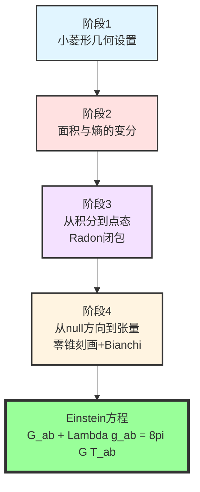
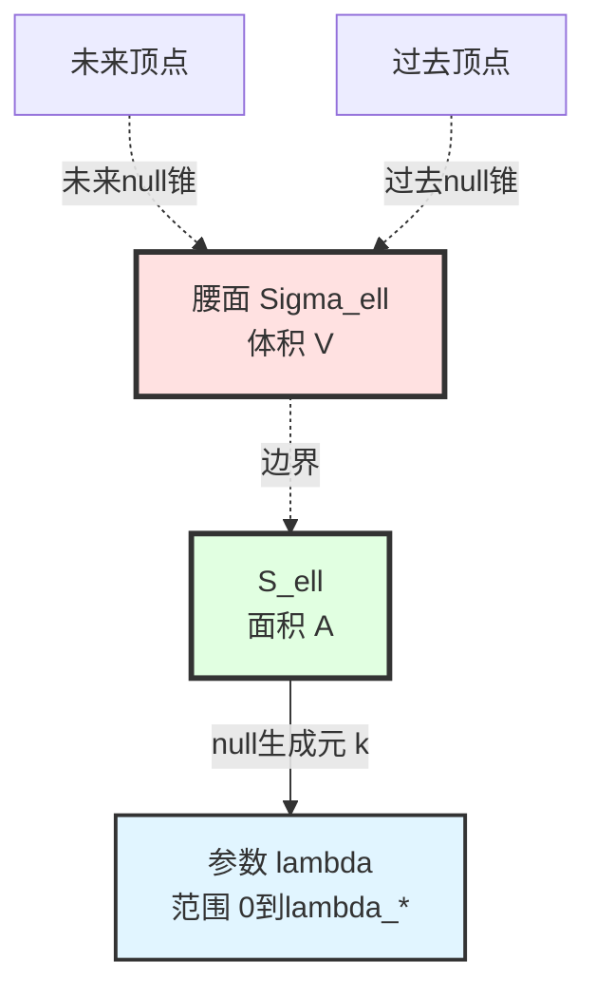
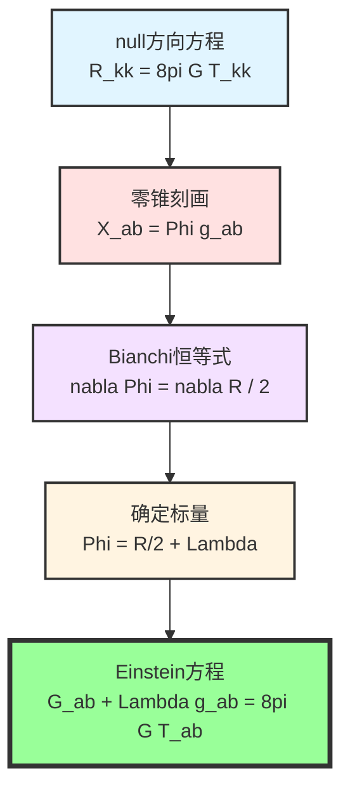
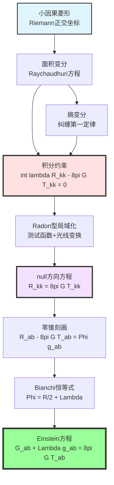

# 第11章第3节：从IGVP导出Einstein方程

> **"引力场方程不是假设，而是信息一致性的唯一可能后果。"**

## 本节导览

在上一节中，我们建立了信息几何变分原理（IGVP）的框架。本节将**一步步严格推导**Einstein方程，展示从广义熵极值到引力场方程的完整逻辑链。

## 1. 推导策略与逻辑结构

### 1.1 推导的四个阶段

### 1.2 关键技术工具

本节将详细使用以下数学工具：

1. **Riemann正交坐标**：在点 $p$ 附近展开度规
2. **Raychaudhuri方程**：控制null束的膨胀
3. **Grönwall不等式**：控制剪切与扭曲的增长
4. **Radon型局域化**：从积分约束推出点态方程
5. **零锥刻画引理**：从null方向推出张量
6. **Bianchi恒等式**：确定积分常数

## 2. 阶段1：小因果菱形的几何设置

### 2.1 Riemann正交坐标

在时空点 $p$ 的邻域内，选取**Riemann正交坐标**，使得：

$$
g_{\mu\nu}(p) = \eta_{\mu\nu}, \quad \partial_\rho g_{\mu\nu}(p) = 0
$$

度规的Taylor展开：

$$
g_{\mu\nu}(x) = \eta_{\mu\nu} + \frac{1}{3} R_{\mu\rho\nu\sigma}(p) x^\rho x^\sigma + O(|x|^3)
$$

**物理意义**：
> 在足够小的邻域内，时空局部"看起来平坦"（度规≈Minkowski），曲率体现在二阶项。就像地球表面局部看起来是平的，但走得足够远就会发现曲率。

### 2.2 小因果菱形的构造

从点 $p$ 出发，沿类时方向 $u^\mu$（$u_\mu u^\mu = -1$）构造：

**腰面** $\Sigma_\ell$：在固有时 $\tau = 0$ 处的最大空间超曲面
- 维数：$d-1$（这里 $d=4$，故腰面是3维）
- 体积：$V(B_\ell) \sim c_d \ell^{d-1}$

**腰面的边界** $\partial \Sigma_\ell = S_\ell$：
- 维数：$d-2$（2维球面）
- 面积：$A(S_\ell) \sim c_d \ell^{d-2}$

**null生成元**：从 $S_\ell$ 出发的null测地线束
- 参数：仿射参数 $\lambda$，满足 $k^\mu \nabla_\mu k^\nu = 0$
- 范围：$0 \leq \lambda \leq \lambda_* \sim c_\lambda \ell$

### 2.3 尺度分离条件

定义**无量纲尺度参数**：

$$
\varepsilon := \frac{\ell}{L_{\mathrm{curv}}}
$$

其中 $L_{\mathrm{curv}} \sim |R|^{-1/2}$ 是曲率半径。

**小菱形条件**：$\varepsilon \ll 1$，即：

$$
\ell \ll L_{\mathrm{curv}}
$$

这确保：
- 曲率在菱形内可视为"常数"（主导项）
- 高阶修正被 $\varepsilon$ 的幂次压制

**比喻**：
> 就像用放大镜看一个曲面。放大倍数越大（$\ell$ 越小），曲面看起来越平坦（曲率贡献越小）。但即使很小，曲率的"主导效应"仍可测量。

## 3. 阶段2：面积与熵的变分

### 3.1 腰面的初始条件

**最大体积条件**：腰面 $\Sigma_\ell$ 是因果菱形中体积最大的空间超曲面。

这蕴含**膨胀的初始条件**：

$$
\theta(0) = 0
$$

其中 $\theta = \nabla_\mu k^\mu$ 是null束的膨胀。

**Frobenius可积性**：null生成元构成超曲面正交的丛，故**扭曲为零**：

$$
\omega_{AB}(0) = 0 \quad \Rightarrow \quad \omega \equiv 0
$$

**剪切的初始值**：
- 一般情况：$\sigma(0) \neq 0$，但有界：$|\sigma(0)| \leq C_{\sigma,0}$
- 特殊几何（如最大对称空间）：$\sigma(0) = 0$

### 3.2 Raychaudhuri方程及其解

null生成元的膨胀满足**Raychaudhuri方程**：

$$
\frac{d\theta}{d\lambda} = -\frac{1}{d-2} \theta^2 - \sigma^2 + \omega^2 - R_{kk}
$$

由 $\omega \equiv 0$ 与初始条件 $\theta(0) = 0$，积分得：

$$
\theta(\lambda) = -\int_0^\lambda R_{kk}(s) ds - \int_0^\lambda \sigma^2(s) ds + O(\theta^2)
$$

**剪切的演化**：通过Sachs方程，

$$
\frac{d\sigma}{d\lambda} = -\frac{2}{d-2} \theta \sigma - \sigma^2 - \mathcal{C}
$$

其中 $\mathcal{C}_{AB} = R_{acbd} k^c k^d e_A^a e_B^b$ 是Weyl曲率的投影。

利用Grönwall不等式，在小菱形条件下：

$$
|\sigma(\lambda)| \leq C_\sigma (1 + O(\varepsilon))
$$

其中 $C_\sigma = C_{\sigma,0} + C_{\mathcal{C}} \lambda_*$ 是几何常数。

### 3.3 面积变分的显式不等式

通过膨胀与面积的关系：

$$
\frac{1}{A} \frac{dA}{d\lambda} = \theta(\lambda)
$$

积分并利用Raychaudhuri方程：

$$
\delta A = -\int_{\mathcal{H}} \int_0^{\lambda_*} \theta(\lambda) d\lambda \, dA
$$

代入 $\theta$ 的表达式：

$$
\delta A = \int_{\mathcal{H}} \int_0^{\lambda_*} \lambda \, R_{kk}(\lambda) d\lambda \, dA + O(\varepsilon^3 \ell^{d-2})
$$

**关键估计**：误差项由以下常数控制：

$$
\text{误差} \leq C_d \left( \frac{1}{6} C_{\nabla R} \lambda_*^3 + \frac{1}{2} C_\sigma^2 \lambda_*^2 + \frac{1}{3(d-2)} C_R^2 \lambda_*^4 \right) A
$$

其中：
- $C_R := \sup_{D} |R_{kk}|$
- $C_{\nabla R} := \sup_{D} |\nabla_k R_{kk}|$
- $C_\sigma$ 如前定义

**比喻**：
> 想象用橡皮膜（腰面）包裹一个不规则物体（时空曲率）。拉伸橡皮膜（null生成元），其面积变化取决于物体的曲率。Raychaudhuri方程告诉你，曲率越大，橡皮膜张得越紧（面积变化越快）。

### 3.4 纠缠熵的变分

**纠缠第一定律**（回顾第2节）：

$$
\delta S_{\mathrm{out}} = \delta \langle H_{\mathrm{mod}} \rangle = \frac{2\pi}{\hbar} \int_{\mathcal{H}} \int_0^{\lambda_*} \lambda \, T_{kk}(\lambda) d\lambda \, dA + O(\varepsilon^2 \ell^{d-2})
$$

**统一误差估计**：存在常数 $C_{\mathrm{unif}}$（仅依赖 $(C_R, C_{\nabla R}, C_{\mathcal{C}}; d, c_\lambda)$），使得：

$$
\left| \delta S_{\mathrm{out}} - \frac{2\pi}{\hbar} \int \lambda T_{kk} d\lambda dA \right| \leq C_{\mathrm{unif}} \varepsilon^2 \ell^{d-2}
$$

### 3.5 一阶变分的组合

将面积与熵的变分组合到广义熵：

$$
\delta S_{\mathrm{gen}} = \frac{\delta A}{4G\hbar} + \delta S_{\mathrm{out}}
$$

$$
= \frac{1}{4G\hbar} \int_{\mathcal{H}} \int_0^{\lambda_*} \lambda \, R_{kk} d\lambda dA + \frac{2\pi}{\hbar} \int_{\mathcal{H}} \int_0^{\lambda_*} \lambda \, T_{kk} d\lambda dA + O(\varepsilon^2)
$$

**IGVP条件**：$\delta S_{\mathrm{gen}} = 0$（在固定体积约束下），故：

$$
\boxed{\int_{\mathcal{H}} \int_0^{\lambda_*} \lambda \left( R_{kk} - 8\pi G T_{kk} \right) d\lambda dA = 0 + O(\varepsilon^2 \ell^{d-2})}
$$

## 4. 阶段3：从积分约束到点态方程

### 4.1 问题设置

我们得到了一个**积分约束**：

$$
\int_{S_\ell} \int_0^{\lambda_*} \lambda \, f(x, \lambda) d\lambda dA = 0
$$

其中 $f(x, \lambda) := R_{kk}(x, \lambda) - 8\pi G T_{kk}(x, \lambda)$。

**目标**：推出 $f(x, \lambda) = 0$ 在每一点、每个 $\lambda$ 成立。

**挑战**：如何从"积分为零"推出"被积函数为零"？

### 4.2 加权光线变换

定义**一阶矩加权光线变换**：

$$
\mathcal{L}_\lambda[f](p, \hat{k}) := \int_0^{\lambda_*} \lambda \, f(\gamma_{p,\hat{k}}(\lambda)) d\lambda
$$

其中 $\gamma_{p,\hat{k}}(\lambda)$ 是从 $p$ 出发、沿 $\hat{k}$ 方向的null测地线。

**Taylor展开**：在 $\lambda_* \ll L_{\mathrm{curv}}$ 条件下，

$$
f(\gamma(\lambda)) = f(p) + \lambda \nabla_k f(p) + O(\lambda^2 |\nabla^2 f|)
$$

故：

$$
\mathcal{L}_\lambda[f](p, \hat{k}) = \frac{1}{2} \lambda_*^2 f(p) + \frac{1}{3} \lambda_*^3 \nabla_k f(p) + O(\lambda_*^4)
$$

**关键观察**：主项 $\propto \lambda_*^2 f(p)$ 确定了 $f(p)$！

### 4.3 测试函数的局域化

**策略**：对任意测试函数 $\varphi \in C_c^\infty(S_\ell)$，构造一阶变分使得：

$$
\int_{S_\ell} \varphi(x) \int_0^{\lambda_*} \lambda \, f(x, \lambda) d\lambda dA = 0
$$

**实现方法**：
1. **几何形变**：改变腰面嵌入，位移为 $\delta X = \epsilon \varphi(x) n$
2. **等体积补偿**：选择补偿函数 $\varphi_0$ 满足 $\int (\varphi + \varphi_0) dA = 0$
3. **外部态扰动**：在支撑于 $\varphi$ 的管状邻域内扰动量子态

通过线性变分的Fréchet连续性，可对任意 $\varphi$ 实现上述局域化。

### 4.4 Radon型闭包定理

**定理4.1（局域化引理）**：

若对所有 $\varphi \in C_c^\infty(S_\ell)$ 和端点光滑截断的权重族 $\{w_\epsilon\}$ （$w_\epsilon \to \lambda$ 在 $L^1$ 意义下）成立：

$$
\int_{S_\ell} \varphi(x) \int_0^{\lambda_*} w_\epsilon(\lambda) f(x, \lambda) d\lambda dA = 0
$$

则几乎处处沿每条生成元有：

$$
\int_0^{\lambda_*} \lambda f(x, \lambda) d\lambda = 0
$$

**证明思路**：
1. Fubini定理分离 $x$ 与 $\lambda$ 的积分
2. 对 $\lambda$ 方向用mollifier逼近 $\delta$
3. 对 $x$ 方向用测试函数的稠密性

### 4.5 零阶重建

**定理4.2（零阶重建）**：

在Riemann正交坐标与小菱形条件下，若：

$$
\int_0^{\lambda_*} \lambda f(\gamma_{p,\hat{k}}(\lambda)) d\lambda = o(\ell^2)
$$

对所有 $\hat{k}$ 成立，则：

$$
f(p) = 0
$$

**证明**：由Taylor展开，

$$
\int_0^{\lambda_*} \lambda f d\lambda = \frac{1}{2} \lambda_*^2 f(p) + O(\lambda_*^3 |\nabla f|)
$$

若左边 $= o(\ell^2)$ 且 $\lambda_* \sim c_\lambda \ell$，则：

$$
\frac{1}{2} c_\lambda^2 \ell^2 f(p) = o(\ell^2)
$$

故 $f(p) = 0$。

**比喻**：
> 想象你在测量一座山的高度（$f$）。你沿不同方向（$\hat{k}$）走一小段距离（$\lambda_*$），测量"高度×距离"的积分。如果所有方向的积分都是零，那么山在你站的地方（$p$）的高度必须是零——否则会有非零贡献。

### 4.6 结论：null方向的点态方程

综合上述步骤，从

$$
\int_{S_\ell} \int_0^{\lambda_*} \lambda (R_{kk} - 8\pi G T_{kk}) d\lambda dA = 0
$$

推出：

$$
\boxed{R_{kk}(p, \hat{k}) = 8\pi G T_{kk}(p, \hat{k})}
$$

对**每一点 $p$** 和**每个null方向 $\hat{k}$** 成立。

## 5. 阶段4：从null方向到完整张量

### 5.1 零锥刻画引理

**引理5.1（维度 $d \geq 3$ 必要）**：

设 $X_{ab}$ 是对称张量。若 $X_{ab} k^a k^b = 0$ 对所有null向量 $k^a$ 成立，则存在标量函数 $\Phi$ 使得：

$$
X_{ab} = \Phi \, g_{ab}
$$

**证明（简述）**：

对称张量 $X_{ab}$ 有 $\frac{d(d+1)}{2}$ 个独立分量。

null锥由 $k^a k_a = 0$ 定义，在 $d$ 维时空中有 $(d-1)$ 维自由度（去除整体缩放）。

条件 $X_{ab} k^a k^b = 0$ 给出 $(d-1)$ 个独立约束。

**关键计数**：
- $d=2$：对称张量3个分量，null约束1个，不足以确定形式
- $d=3$：对称张量6个分量，null约束2个，恰好确定比例关系
- $d \geq 4$：约束over-determined，强制 $X_{ab} \propto g_{ab}$

**注记**：这就是为什么Einstein方程在 $d \geq 3$ 才非平凡！

### 5.2 应用到 $R_{ab} - 8\pi G T_{ab}$

定义：

$$
X_{ab} := R_{ab} - 8\pi G T_{ab}
$$

由阶段3的结论，$X_{ab} k^a k^b = 0$ 对所有null $k^a$ 成立。

故（在 $d \geq 3$ 时）：

$$
R_{ab} - 8\pi G T_{ab} = \Phi \, g_{ab}
$$

### 5.3 Bianchi恒等式的应用

**收缩的Bianchi恒等式**：

$$
\nabla^a R_{ab} = \frac{1}{2} \nabla_b R
$$

**能量-动量守恒**：

$$
\nabla^a T_{ab} = 0
$$

对 $X_{ab}$ 求协变散度：

$$
\nabla^a X_{ab} = \nabla^a (R_{ab} - 8\pi G T_{ab}) = \frac{1}{2} \nabla_b R - 0 = \frac{1}{2} \nabla_b R
$$

另一方面，由 $X_{ab} = \Phi g_{ab}$：

$$
\nabla^a X_{ab} = \nabla^a (\Phi g_{ab}) = \nabla_b \Phi
$$

因此：

$$
\nabla_b \Phi = \frac{1}{2} \nabla_b R
$$

即：

$$
\nabla_b \left( \Phi - \frac{R}{2} \right) = 0
$$

**结论**：$\Phi - \frac{R}{2}$ 是常数，记为 $\Lambda$（宇宙学常数）。

### 5.4 Einstein方程的最终形式

由 $\Phi = \frac{R}{2} + \Lambda$ 代回：

$$
R_{ab} - 8\pi G T_{ab} = \left( \frac{R}{2} + \Lambda \right) g_{ab}
$$

整理：

$$
R_{ab} - \frac{R}{2} g_{ab} - \Lambda g_{ab} = 8\pi G T_{ab}
$$

定义Einstein张量：

$$
G_{ab} := R_{ab} - \frac{1}{2} R g_{ab}
$$

最终得到：

$$
\boxed{G_{ab} + \Lambda g_{ab} = 8\pi G T_{ab}}
$$

**这就是Einstein场方程的完整形式！**

## 6. 完整推导链的回顾

让我们回顾从IGVP到Einstein方程的完整逻辑链：

### 6.1 出发点：广义熵极值

$$
\delta S_{\mathrm{gen}} = 0 \quad \text{（在固定体积约束下）}
$$

### 6.2 第一步：面积与熵的变分

$$
\frac{\delta A}{4G\hbar} + \delta S_{\mathrm{out}} = 0
$$

### 6.3 第二步：利用几何与物理公式

$$
\delta A \sim -\int \lambda R_{kk} d\lambda dA
$$

$$
\delta S_{\mathrm{out}} \sim \frac{2\pi}{\hbar} \int \lambda T_{kk} d\lambda dA
$$

### 6.4 第三步：积分约束

$$
\int \lambda (R_{kk} - 8\pi G T_{kk}) d\lambda dA = 0
$$

### 6.5 第四步：Radon型局域化

$$
R_{kk} - 8\pi G T_{kk} = 0 \quad \forall k^a, \quad k^a k_a = 0
$$

### 6.6 第五步：零锥刻画

$$
R_{ab} - 8\pi G T_{ab} = \Phi g_{ab}
$$

### 6.7 第六步：Bianchi恒等式

$$
\Phi = \frac{R}{2} + \Lambda
$$

### 6.8 终点：Einstein方程

$$
G_{ab} + \Lambda g_{ab} = 8\pi G T_{ab}
$$

**每一步都是必然的逻辑推论，没有额外假设。**

## 7. 关键常数的物理意义

### 7.1 引力常数 $G$

在推导中，$G$ 出现在：

$$
\frac{A}{4G\hbar} \quad \text{vs.} \quad T_{kk}
$$

的比例关系中。它由以下确定：
- 量子引力的普朗克尺度：$\ell_{\mathrm{Pl}} = \sqrt{G\hbar/c^3}$
- 黑洞熵公式：$S = A/(4G)$（单位 $\hbar = k_B = 1$）

### 7.2 宇宙学常数 $\Lambda$

$\Lambda$ 是积分常数，由全局拓扑与边界条件确定：
- 渐近平坦：$\Lambda = 0$
- 渐近de Sitter：$\Lambda > 0$
- 渐近Anti-de Sitter：$\Lambda < 0$

**观测值**：$\Lambda_{\mathrm{obs}} \sim (10^{-3} \, \mathrm{eV})^4 \sim 10^{-47} \, \mathrm{GeV}^4$

### 7.3 时间刻度 $\kappa(\omega)$

统一时间刻度确保：
- 模时间、热时间、几何时间对齐
- 纠缠第一定律中的"温度"与局域几何一致
- 广义熵在统一刻度下单调

## 8. 误差估计与收敛性

### 8.1 主控函数与可交换性

在小菱形极限 $\ell \to 0$ 中，关键是控制**误差项**。

定义主控函数：

$$
\widetilde{M}_{\mathrm{dom}}(\lambda) := \frac{1}{2} C_{\nabla R} \lambda^2 + C_\sigma^2 |\lambda| + \frac{4}{3(d-2)} C_R^2 \lambda_0^3
$$

它满足 $\widetilde{M}_{\mathrm{dom}} \in L^1([0, \lambda_0])$ 且与 $\varepsilon$ 无关。

**主导收敛定理**的应用保证：

$$
\lim_{\varepsilon \to 0} \int \chi_{[0,\lambda_*]} (\theta + \lambda R_{kk}) d\lambda = 0
$$

### 8.2 统一误差命题

**命题8.1**：存在常数 $C_{\mathrm{unif}} = C_{\mathrm{unif}}(C_R, C_{\nabla R}, C_{\mathcal{C}}; d, c_\lambda)$，使得：

$$
\left| \delta S_{\mathrm{gen}} - \text{（主项）} \right| \leq C_{\mathrm{unif}} \varepsilon^2 \ell^{d-2}
$$

对所有 $(p, \hat{k})$ 与所有足够小的 $\ell$ 一致成立。

## 9. 物理意义的深层讨论

### 9.1 引力 = 熵力？

Verlinde（2011）提出"引力是熵力"的想法。IGVP给出更精确的表述：

> 引力不是"像熵力"，而是**熵极值条件的几何表现**。Einstein方程不是关于力的方程，而是关于信息一致性的方程。

### 9.2 时空的涌现性

IGVP表明：
- 时空几何不是基本的，而是**涌现的**
- 基本的是：量子信息（纠缠）+ 因果结构 + 统一时间刻度
- Einstein方程是这些基本结构**一致性**的必然后果

### 9.3 量子引力的启示

传统量子引力尝试"量子化"Einstein方程。IGVP提示反向思路：

> 不是量子化引力，而是从量子信息**涌现**引力。Einstein方程已经包含了量子修正（通过 $S_{\mathrm{out}}$），进一步的"量子引力"应该从更基本的QCA结构出发。

## 10. 本节要点总结

**核心洞察**：

> **Einstein场方程不是关于引力的假设，而是信息几何一致性的唯一可能后果。从广义熵的极值原理出发，通过严格的数学推导——面积变分、Raychaudhuri方程、Radon型局域化、零锥刻画、Bianchi恒等式——我们必然得到 $G_{ab} + \Lambda g_{ab} = 8\pi G T_{ab}$。这是宇宙一致性的几何表现。**

---

**下一节预告**：在第4节中，我们将探讨**规范场论与量子场论的涌现**。在固定Einstein几何的背景下，对边界通道丛与总联络作变分，将导出Yang-Mills方程、场内容约束（异常抵消）以及Ward恒等式。这将完成从几何到场论的统一。
