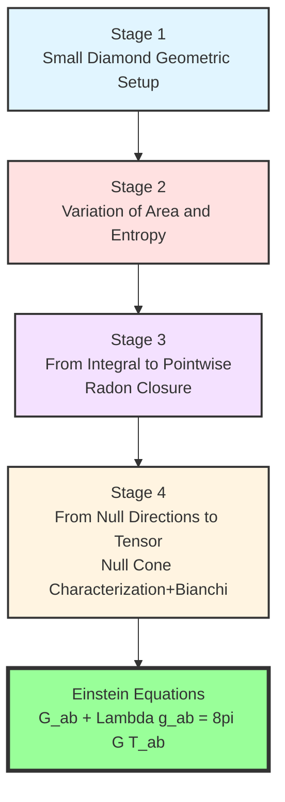
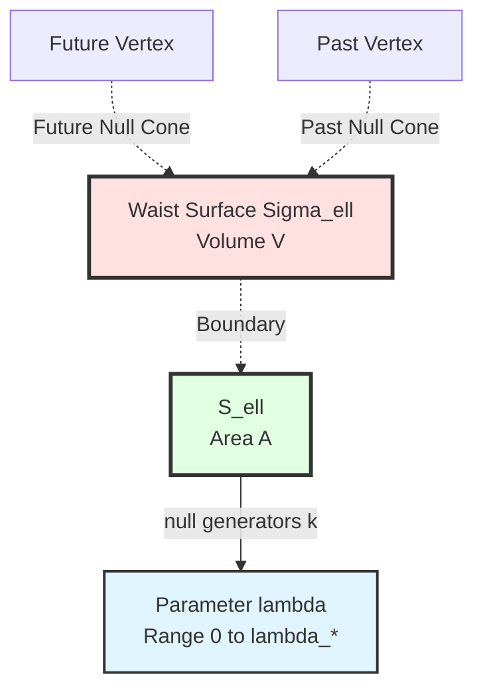
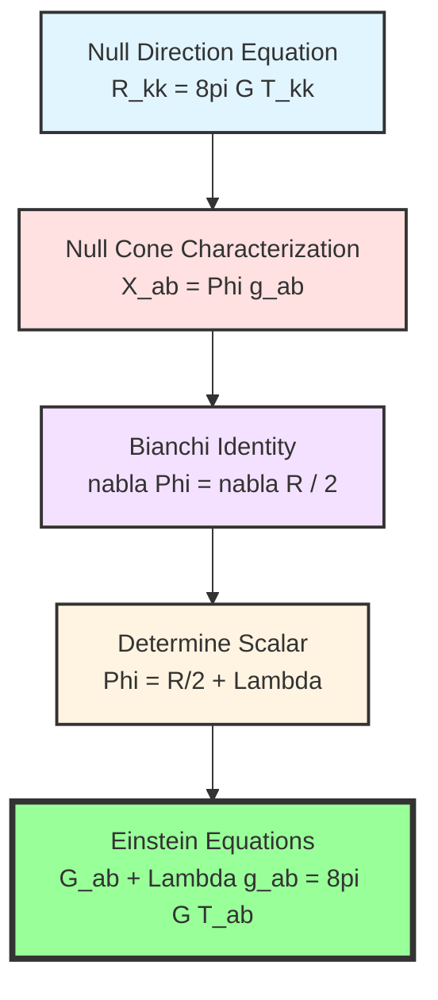
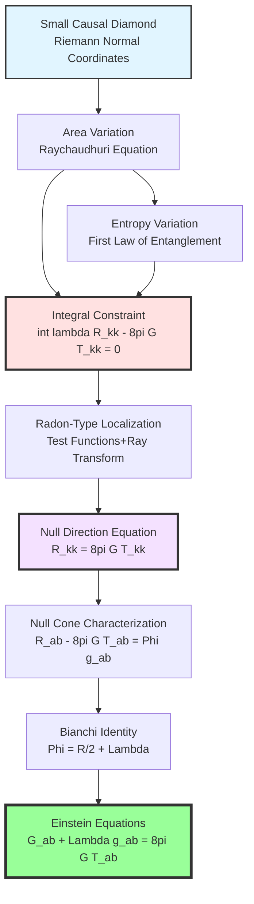

# Chapter 11 Section 3: Deriving Einstein Equations from IGVP

> **"Gravitational field equations are not assumptions, but the only possible consequences of information consistency."**

## Section Overview

In the previous section, we established the framework of Information-Geometric Variational Principle (IGVP). This section will **strictly derive step by step** Einstein equations, demonstrating the complete logical chain from generalized entropy extremum to gravitational field equations.

## 1. Derivation Strategy and Logical Structure

### 1.1 Four Stages of Derivation

### 1.2 Key Technical Tools

This section will use the following mathematical tools in detail:

1. **Riemann normal coordinates**: Expand metric near point $p$
2. **Raychaudhuri equation**: Controls expansion of null bundle
3. **Grönwall inequality**: Controls growth of shear and twist
4. **Radon-type localization**: Derive pointwise equations from integral constraints
5. **Null cone characterization lemma**: Derive tensor from null directions
6. **Bianchi identity**: Determine integration constant

## 2. Stage 1: Geometric Setup of Small Causal Diamond

### 2.1 Riemann Normal Coordinates

In neighborhood of spacetime point $p$, choose **Riemann normal coordinates** such that:

$$
g_{\mu\nu}(p) = \eta_{\mu\nu}, \quad \partial_\rho g_{\mu\nu}(p) = 0
$$

Taylor expansion of metric:

$$
g_{\mu\nu}(x) = \eta_{\mu\nu} + \frac{1}{3} R_{\mu\rho\nu\sigma}(p) x^\rho x^\sigma + O(|x|^3)
$$

**Physical Meaning**:
> In sufficiently small neighborhood, spacetime locally "looks flat" (metric ≈ Minkowski), curvature appears in second-order terms. Like Earth's surface locally looks flat, but walking far enough reveals curvature.

### 2.2 Construction of Small Causal Diamond

From point $p$, along timelike direction $u^\mu$ ($u_\mu u^\mu = -1$), construct:

**Waist Surface** $\Sigma_\ell$: Maximum spatial hypersurface at proper time $\tau = 0$
- Dimension: $d-1$ (here $d=4$, so waist is 3-dimensional)
- Volume: $V(B_\ell) \sim c_d \ell^{d-1}$

**Boundary of Waist Surface** $\partial \Sigma_\ell = S_\ell$:
- Dimension: $d-2$ (2-dimensional sphere)
- Area: $A(S_\ell) \sim c_d \ell^{d-2}$

**Null Generators**: Null geodesic bundle from $S_\ell$
- Parameter: Affine parameter $\lambda$, satisfying $k^\mu \nabla_\mu k^\nu = 0$
- Range: $0 \leq \lambda \leq \lambda_* \sim c_\lambda \ell$

### 2.3 Scale Separation Condition

Define **dimensionless scale parameter**:

$$
\varepsilon := \frac{\ell}{L_{\mathrm{curv}}}
$$

where $L_{\mathrm{curv}} \sim |R|^{-1/2}$ is curvature radius.

**Small Diamond Condition**: $\varepsilon \ll 1$, i.e.:

$$
\ell \ll L_{\mathrm{curv}}
$$

This ensures:
- Curvature can be treated as "constant" within diamond (dominant term)
- Higher-order corrections suppressed by powers of $\varepsilon$

**Analogy**:
> Like using a magnifying glass to look at a surface. Larger magnification (smaller $\ell$), flatter the surface looks (smaller curvature contribution). But even very small, "dominant effect" of curvature can still be measured.

## 3. Stage 2: Variation of Area and Entropy

### 3.1 Initial Conditions of Waist Surface

**Maximum Volume Condition**: Waist surface $\Sigma_\ell$ is the spatial hypersurface with maximum volume in causal diamond.

This implies **initial condition for expansion**:

$$
\theta(0) = 0
$$

where $\theta = \nabla_\mu k^\mu$ is expansion of null bundle.

**Frobenius Integrability**: Null generators form hypersurface-orthogonal bundle, hence **twist is zero**:

$$
\omega_{AB}(0) = 0 \quad \Rightarrow \quad \omega \equiv 0
$$

**Initial Value of Shear**:
- General case: $\sigma(0) \neq 0$, but bounded: $|\sigma(0)| \leq C_{\sigma,0}$
- Special geometry (e.g., maximally symmetric space): $\sigma(0) = 0$

### 3.2 Raychaudhuri Equation and Its Solution

Expansion of null generators satisfies **Raychaudhuri equation**:

$$
\frac{d\theta}{d\lambda} = -\frac{1}{d-2} \theta^2 - \sigma^2 + \omega^2 - R_{kk}
$$

From $\omega \equiv 0$ and initial condition $\theta(0) = 0$, integrating:

$$
\theta(\lambda) = -\int_0^\lambda R_{kk}(s) ds - \int_0^\lambda \sigma^2(s) ds + O(\theta^2)
$$

**Evolution of Shear**: Through Sachs equation,

$$
\frac{d\sigma}{d\lambda} = -\frac{2}{d-2} \theta \sigma - \sigma^2 - \mathcal{C}
$$

where $\mathcal{C}_{AB} = R_{acbd} k^c k^d e_A^a e_B^b$ is projection of Weyl curvature.

Using Grönwall inequality, under small diamond condition:

$$
|\sigma(\lambda)| \leq C_\sigma (1 + O(\varepsilon))
$$

where $C_\sigma = C_{\sigma,0} + C_{\mathcal{C}} \lambda_*$ is geometric constant.

### 3.3 Explicit Formula for Area Variation

Through relationship between expansion and area:

$$
\frac{1}{A} \frac{dA}{d\lambda} = \theta(\lambda)
$$

Integrating and using Raychaudhuri equation:

$$
\delta A = -\int_{\mathcal{H}} \int_0^{\lambda_*} \theta(\lambda) d\lambda \, dA
$$

Substituting expression for $\theta$:

$$
\delta A = \int_{\mathcal{H}} \int_0^{\lambda_*} \lambda \, R_{kk}(\lambda) d\lambda \, dA + O(\varepsilon^3 \ell^{d-2})
$$

**Key Estimate**: Error term controlled by following constants:

$$
\text{Error} \leq C_d \left( \frac{1}{6} C_{\nabla R} \lambda_*^3 + \frac{1}{2} C_\sigma^2 \lambda_*^2 + \frac{1}{3(d-2)} C_R^2 \lambda_*^4 \right) A
$$

where:
- $C_R := \sup_{D} |R_{kk}|$
- $C_{\nabla R} := \sup_{D} |\nabla_k R_{kk}|$
- $C_\sigma$ as defined before

**Analogy**:
> Imagine wrapping an irregular object (spacetime curvature) with rubber membrane (waist surface). Stretching rubber membrane (null generators), its area change depends on object's curvature. Raychaudhuri equation tells you, larger curvature, tighter the membrane stretches (faster area change).

### 3.4 Variation of Entanglement Entropy

**First Law of Entanglement** (recall Section 2):

$$
\delta S_{\mathrm{out}} = \delta \langle H_{\mathrm{mod}} \rangle = \frac{2\pi}{\hbar} \int_{\mathcal{H}} \int_0^{\lambda_*} \lambda \, T_{kk}(\lambda) d\lambda \, dA + O(\varepsilon^2 \ell^{d-2})
$$

**Unified Error Estimate**: There exists constant $C_{\mathrm{unif}}$ (depending only on $(C_R, C_{\nabla R}, C_{\mathcal{C}}; d, c_\lambda)$) such that:

$$
\left| \delta S_{\mathrm{out}} - \frac{2\pi}{\hbar} \int \lambda T_{kk} d\lambda dA \right| \leq C_{\mathrm{unif}} \varepsilon^2 \ell^{d-2}
$$

### 3.5 Combination of First-Order Variation

Combining area and entropy variations into generalized entropy:

$$
\delta S_{\mathrm{gen}} = \frac{\delta A}{4G\hbar} + \delta S_{\mathrm{out}}
$$

$$
= \frac{1}{4G\hbar} \int_{\mathcal{H}} \int_0^{\lambda_*} \lambda \, R_{kk} d\lambda dA + \frac{2\pi}{\hbar} \int_{\mathcal{H}} \int_0^{\lambda_*} \lambda \, T_{kk} d\lambda dA + O(\varepsilon^2)
$$

**IGVP Condition**: $\delta S_{\mathrm{gen}} = 0$ (under fixed volume constraint), hence:

$$
\boxed{\int_{\mathcal{H}} \int_0^{\lambda_*} \lambda \left( R_{kk} - 8\pi G T_{kk} \right) d\lambda dA = 0 + O(\varepsilon^2 \ell^{d-2})}
$$

## 4. Stage 3: From Integral Constraint to Pointwise Equation

### 4.1 Problem Setup

We obtained an **integral constraint**:

$$
\int_{S_\ell} \int_0^{\lambda_*} \lambda \, f(x, \lambda) d\lambda dA = 0
$$

where $f(x, \lambda) := R_{kk}(x, \lambda) - 8\pi G T_{kk}(x, \lambda)$.

**Goal**: Derive $f(x, \lambda) = 0$ at each point, each $\lambda$.

**Challenge**: How to derive "integrand is zero" from "integral is zero"?

### 4.2 Weighted Ray Transform

Define **first-moment weighted ray transform**:

$$
\mathcal{L}_\lambda[f](p, \hat{k}) := \int_0^{\lambda_*} \lambda \, f(\gamma_{p,\hat{k}}(\lambda)) d\lambda
$$

where $\gamma_{p,\hat{k}}(\lambda)$ is null geodesic from $p$ along direction $\hat{k}$.

**Taylor Expansion**: Under condition $\lambda_* \ll L_{\mathrm{curv}}$,

$$
f(\gamma(\lambda)) = f(p) + \lambda \nabla_k f(p) + O(\lambda^2 |\nabla^2 f|)
$$

Hence:

$$
\mathcal{L}_\lambda[f](p, \hat{k}) = \frac{1}{2} \lambda_*^2 f(p) + \frac{1}{3} \lambda_*^3 \nabla_k f(p) + O(\lambda_*^4)
$$

**Key Observation**: Leading term $\propto \lambda_*^2 f(p)$ determines $f(p)$!

### 4.3 Localization with Test Functions

**Strategy**: For any test function $\varphi \in C_c^\infty(S_\ell)$, construct first-order variation such that:

$$
\int_{S_\ell} \varphi(x) \int_0^{\lambda_*} \lambda \, f(x, \lambda) d\lambda dA = 0
$$

**Implementation Method**:
1. **Geometric Deformation**: Change waist surface embedding, displacement $\delta X = \epsilon \varphi(x) n$
2. **Equal Volume Compensation**: Choose compensation function $\varphi_0$ satisfying $\int (\varphi + \varphi_0) dA = 0$
3. **External State Perturbation**: Perturb quantum state in tubular neighborhood supported on $\varphi$

Through Fréchet continuity of linear variation, above localization can be achieved for any $\varphi$.

### 4.4 Radon-Type Closure Theorem

**Theorem 4.1 (Localization Lemma)**:

If for all $\varphi \in C_c^\infty(S_\ell)$ and smooth endpoint-truncated weight family $\{w_\epsilon\}$ ($w_\epsilon \to \lambda$ in $L^1$ sense) holds:

$$
\int_{S_\ell} \varphi(x) \int_0^{\lambda_*} w_\epsilon(\lambda) f(x, \lambda) d\lambda dA = 0
$$

Then almost everywhere along each generator:

$$
\int_0^{\lambda_*} \lambda f(x, \lambda) d\lambda = 0
$$

**Proof Sketch**:
1. Fubini theorem separates integrals over $x$ and $\lambda$
2. Use mollifier approximation of $\delta$ in $\lambda$ direction
3. Use density of test functions in $x$ direction

### 4.5 Zeroth-Order Reconstruction

**Theorem 4.2 (Zeroth-Order Reconstruction)**:

Under Riemann normal coordinates and small diamond condition, if:

$$
\int_0^{\lambda_*} \lambda f(\gamma_{p,\hat{k}}(\lambda)) d\lambda = o(\ell^2)
$$

holds for all $\hat{k}$, then:

$$
f(p) = 0
$$

**Proof**: From Taylor expansion,

$$
\int_0^{\lambda_*} \lambda f d\lambda = \frac{1}{2} \lambda_*^2 f(p) + O(\lambda_*^3 |\nabla f|)
$$

If left side $= o(\ell^2)$ and $\lambda_* \sim c_\lambda \ell$, then:

$$
\frac{1}{2} c_\lambda^2 \ell^2 f(p) = o(\ell^2)
$$

Hence $f(p) = 0$.

**Analogy**:
> Imagine measuring height of a mountain ($f$). You walk a short distance ($\lambda_*$) along different directions ($\hat{k}$), measuring integral of "height × distance." If integrals in all directions are zero, then mountain height at your location ($p$) must be zero—otherwise there would be non-zero contribution.

### 4.6 Conclusion: Pointwise Equation in Null Directions

Combining above steps, from

$$
\int_{S_\ell} \int_0^{\lambda_*} \lambda (R_{kk} - 8\pi G T_{kk}) d\lambda dA = 0
$$

we derive:

$$
\boxed{R_{kk}(p, \hat{k}) = 8\pi G T_{kk}(p, \hat{k})}
$$

Holds for **each point $p$** and **each null direction $\hat{k}$**.

## 5. Stage 4: From Null Directions to Full Tensor

### 5.1 Null Cone Characterization Lemma

**Lemma 5.1 (necessary for dimension $d \geq 3$)**:

Let $X_{ab}$ be symmetric tensor. If $X_{ab} k^a k^b = 0$ holds for all null vectors $k^a$, then there exists scalar function $\Phi$ such that:

$$
X_{ab} = \Phi \, g_{ab}
$$

**Proof (Sketch)**:

Symmetric tensor $X_{ab}$ has $\frac{d(d+1)}{2}$ independent components.

Null cone defined by $k^a k_a = 0$, in $d$-dimensional spacetime has $(d-1)$ degrees of freedom (removing overall scaling).

Condition $X_{ab} k^a k^b = 0$ gives $(d-1)$ independent constraints.

**Key Counting**:
- $d=2$: Symmetric tensor 3 components, null constraint 1, insufficient to determine form
- $d=3$: Symmetric tensor 6 components, null constraint 2, exactly determines proportionality
- $d \geq 4$: Constraints over-determined, force $X_{ab} \propto g_{ab}$

**Note**: This is why Einstein equations are non-trivial only for $d \geq 3$!

### 5.2 Application to $R_{ab} - 8\pi G T_{ab}$

Define:

$$
X_{ab} := R_{ab} - 8\pi G T_{ab}
$$

From conclusion of Stage 3, $X_{ab} k^a k^b = 0$ holds for all null $k^a$.

Hence (for $d \geq 3$):

$$
R_{ab} - 8\pi G T_{ab} = \Phi \, g_{ab}
$$

### 5.3 Application of Bianchi Identity

**Contracted Bianchi Identity**:

$$
\nabla^a R_{ab} = \frac{1}{2} \nabla_b R
$$

**Energy-Momentum Conservation**:

$$
\nabla^a T_{ab} = 0
$$

Taking covariant divergence of $X_{ab}$:

$$
\nabla^a X_{ab} = \nabla^a (R_{ab} - 8\pi G T_{ab}) = \frac{1}{2} \nabla_b R - 0 = \frac{1}{2} \nabla_b R
$$

On the other hand, from $X_{ab} = \Phi g_{ab}$:

$$
\nabla^a X_{ab} = \nabla^a (\Phi g_{ab}) = \nabla_b \Phi
$$

Therefore:

$$
\nabla_b \Phi = \frac{1}{2} \nabla_b R
$$

That is:

$$
\nabla_b \left( \Phi - \frac{R}{2} \right) = 0
$$

**Conclusion**: $\Phi - \frac{R}{2}$ is constant, denoted $\Lambda$ (cosmological constant).

### 5.4 Final Form of Einstein Equations

Substituting $\Phi = \frac{R}{2} + \Lambda$ back:

$$
R_{ab} - 8\pi G T_{ab} = \left( \frac{R}{2} + \Lambda \right) g_{ab}
$$

Rearranging:

$$
R_{ab} - \frac{R}{2} g_{ab} - \Lambda g_{ab} = 8\pi G T_{ab}
$$

Define Einstein tensor:

$$
G_{ab} := R_{ab} - \frac{1}{2} R g_{ab}
$$

Finally:

$$
\boxed{G_{ab} + \Lambda g_{ab} = 8\pi G T_{ab}}
$$

**This is the complete form of Einstein field equations!**

## 6. Review of Complete Derivation Chain

Let us review the complete logical chain from IGVP to Einstein equations:

### 6.1 Starting Point: Generalized Entropy Extremum

$$
\delta S_{\mathrm{gen}} = 0 \quad \text{(under fixed volume constraint)}
$$

### 6.2 Step 1: Variation of Area and Entropy

$$
\frac{\delta A}{4G\hbar} + \delta S_{\mathrm{out}} = 0
$$

### 6.3 Step 2: Using Geometric and Physical Formulas

$$
\delta A \sim -\int \lambda R_{kk} d\lambda dA
$$

$$
\delta S_{\mathrm{out}} \sim \frac{2\pi}{\hbar} \int \lambda T_{kk} d\lambda dA
$$

### 6.4 Step 3: Integral Constraint

$$
\int \lambda (R_{kk} - 8\pi G T_{kk}) d\lambda dA = 0
$$

### 6.5 Step 4: Radon-Type Localization

$$
R_{kk} - 8\pi G T_{kk} = 0 \quad \forall k^a, \quad k^a k_a = 0
$$

### 6.6 Step 5: Null Cone Characterization

$$
R_{ab} - 8\pi G T_{ab} = \Phi g_{ab}
$$

### 6.7 Step 6: Bianchi Identity

$$
\Phi = \frac{R}{2} + \Lambda
$$

### 6.8 Endpoint: Einstein Equations

$$
G_{ab} + \Lambda g_{ab} = 8\pi G T_{ab}
$$

**Each step is a necessary logical inference, with no additional assumptions.**

## 7. Physical Meaning of Key Constants

### 7.1 Gravitational Constant $G$

In derivation, $G$ appears in:

$$
\frac{A}{4G\hbar} \quad \text{vs.} \quad T_{kk}
$$

proportionality relationship. It is determined by:
- Planck scale of quantum gravity: $\ell_{\mathrm{Pl}} = \sqrt{G\hbar/c^3}$
- Black hole entropy formula: $S = A/(4G)$ (units $\hbar = k_B = 1$)

### 7.2 Cosmological Constant $\Lambda$

$\Lambda$ is integration constant, determined by global topology and boundary conditions:
- Asymptotically flat: $\Lambda = 0$
- Asymptotically de Sitter: $\Lambda > 0$
- Asymptotically Anti-de Sitter: $\Lambda < 0$

**Observed Value**: $\Lambda_{\mathrm{obs}} \sim (10^{-3} \, \mathrm{eV})^4 \sim 10^{-47} \, \mathrm{GeV}^4$

### 7.3 Time Scale $\kappa(\omega)$

Unified time scale ensures:
- Modular time, thermal time, geometric time align
- "Temperature" in first law of entanglement consistent with local geometry
- Generalized entropy monotonic under unified scale

## 8. Error Estimates and Convergence

### 8.1 Dominant Function and Commutability

In small diamond limit $\ell \to 0$, key is controlling **error terms**.

Define dominant function:

$$
\widetilde{M}_{\mathrm{dom}}(\lambda) := \frac{1}{2} C_{\nabla R} \lambda^2 + C_\sigma^2 |\lambda| + \frac{4}{3(d-2)} C_R^2 \lambda_0^3
$$

It satisfies $\widetilde{M}_{\mathrm{dom}} \in L^1([0, \lambda_0])$ and is independent of $\varepsilon$.

Application of **dominated convergence theorem** guarantees:

$$
\lim_{\varepsilon \to 0} \int \chi_{[0,\lambda_*]} (\theta + \lambda R_{kk}) d\lambda = 0
$$

### 8.2 Unified Error Proposition

**Proposition 8.1**: There exists constant $C_{\mathrm{unif}} = C_{\mathrm{unif}}(C_R, C_{\nabla R}, C_{\mathcal{C}}; d, c_\lambda)$ such that:

$$
\left| \delta S_{\mathrm{gen}} - \text{(dominant term)} \right| \leq C_{\mathrm{unif}} \varepsilon^2 \ell^{d-2}
$$

Holds uniformly for all $(p, \hat{k})$ and all sufficiently small $\ell$.

## 9. Deep Discussion of Physical Meaning

### 9.1 Gravity = Entropic Force?

Verlinde (2011) proposed idea "gravity is entropic force." IGVP gives more precise formulation:

> Gravity is not "like entropic force," but **geometric manifestation of entropy extremum condition**. Einstein equations are not equations about force, but equations about information consistency.

### 9.2 Emergent Nature of Spacetime

IGVP shows:
- Spacetime geometry is not fundamental, but **emergent**
- Fundamental are: quantum information (entanglement) + causal structure + unified time scale
- Einstein equations are necessary consequences of **consistency** of these fundamental structures

### 9.3 Implications for Quantum Gravity

Traditional quantum gravity attempts to "quantize" Einstein equations. IGVP suggests reverse approach:

> Not quantizing gravity, but **emerging** gravity from quantum information. Einstein equations already include quantum corrections (through $S_{\mathrm{out}}$), further "quantum gravity" should start from more fundamental QCA structure.

## 10. Summary of Key Points

**Core Insight**:

> **Einstein field equations are not assumptions about gravity, but the only possible consequences of information-geometric consistency. Starting from extremum principle of generalized entropy, through rigorous mathematical derivation—area variation, Raychaudhuri equation, Radon-type localization, null cone characterization, Bianchi identity—we necessarily obtain $G_{ab} + \Lambda g_{ab} = 8\pi G T_{ab}$. This is the geometric manifestation of cosmic consistency.**

---

**Next Section Preview**: In Section 4, we will explore **emergence of gauge field theory and quantum field theory**. Under fixed Einstein geometry, varying boundary channel bundle and total connection will derive Yang-Mills equations, field content constraints (anomaly cancellation), and Ward identities. This will complete unification from geometry to field theory.

