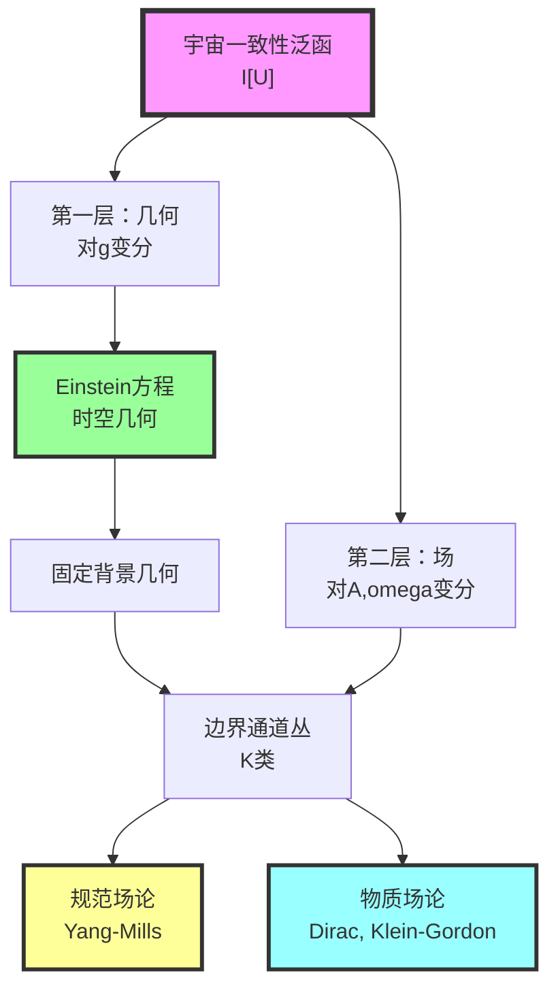
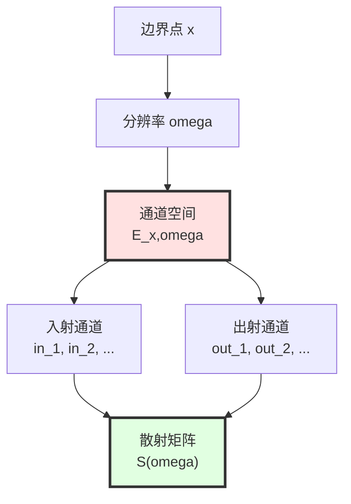
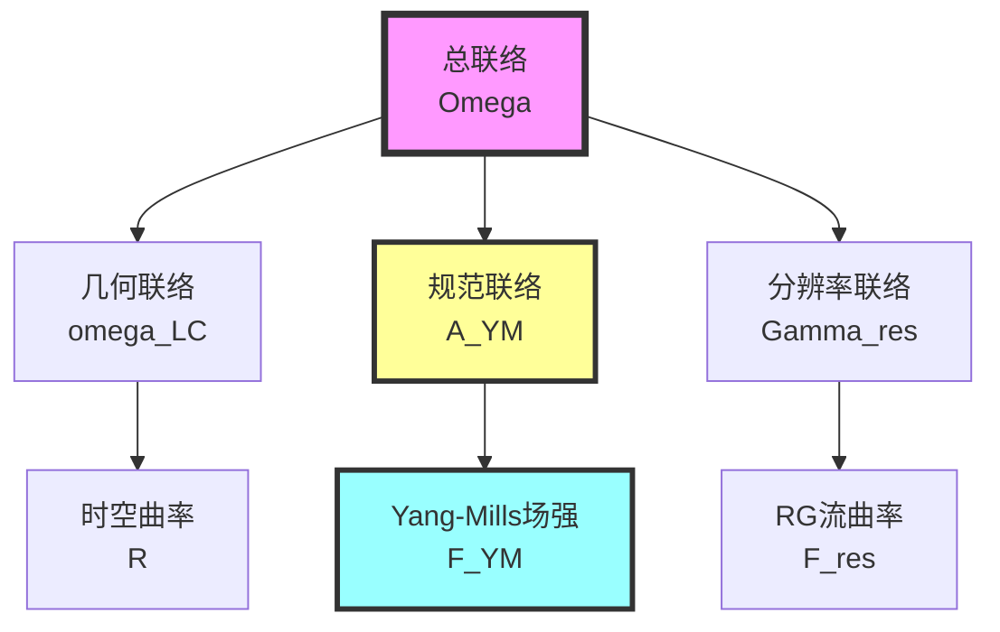
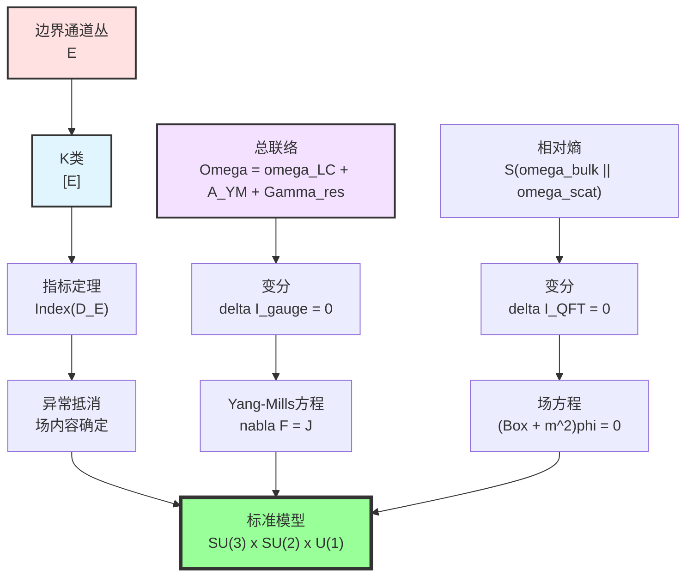

# 第11章第4节：规范场论与量子场论的涌现

> **"规范场不是基本的，而是边界数据一致性的必然后果。"**

## 本节导览

在第3节中，我们从IGVP导出了Einstein方程，完成了引力几何的涌现。本节将在**固定几何背景**下，探讨规范场与量子场论如何从宇宙一致性泛函的其他部分涌现。

## 1. 从几何到场论的逻辑

### 1.1 两层涌现结构

**关键思想**：
1. **第一层**：对度规 $g_{\mu\nu}$ 变分 → Einstein方程（第3节已完成）
2. **第二层**：在固定几何上，对边界通道丛 $E$ 与总联络 $\Omega_\partial$ 变分 → 规范场论

### 1.2 为什么需要边界数据？

**问题**：为什么规范场要在"边界"上定义？

**回答**：
- 散射理论的核心数据在**渐近边界**（$\mathcal{I}^+, \mathcal{I}^-$）
- 因果菱形的腰面是**局域边界**
- 全息原理：体域信息编码在边界

**比喻**：
> 想象一个剧场（体域）与舞台边缘（边界）。观众（观察者）只能在边缘测量（散射数据），但剧场内的演出（场论）必须与边缘的测量一致。规范场就是确保这种一致性的"协调员"。

## 2. 边界通道丛与K理论

### 2.1 通道丛的定义

在因果菱形的腰面 $\partial M_R$ 上，定义**通道丛**：

$$
E \to \partial M_R \times \Lambda
$$

其中：
- $\partial M_R$：边界流形
- $\Lambda$：分辨率参数空间（频率、能量等）
- $E$：每个点与分辨率上的"通道"（量子自由度）

**物理意义**：
- 每个频率 $\omega \in \Lambda$ 对应散射矩阵 $S(\omega)$ 的一个"块"
- 每个边界点 $x \in \partial M_R$ 对应局域散射中心
- $E$ 的纤维维数 = 散射通道数

### 2.2 K类与拓扑分类

通道丛 $E$ 的**稳定等价类**构成K理论群 $K(\partial M_R \times \Lambda)$ 的元素 $[E]$。

**K理论的直观理解**：

**经典例子**：Möbius带 vs. 圆柱
- 两者都是圆周上的线丛
- 但拓扑不同：Möbius带"扭了一圈"
- K理论区分这种"扭曲"

**量子场论中的例子**：
- 不同的粒子谱 → 不同的K类
- 异常（anomaly） → K类的非平凡性
- 指标定理将K类与Dirac算符联系

**比喻**：
> K类就像DNA的"拓扑编码"。即使两个生物的细胞数量相同（维数相同），DNA的拓扑结构（K类）可能完全不同，决定了它们的根本性质。

### 2.3 散射矩阵的K类

散射矩阵 $S(\omega): \mathcal{H}_{\mathrm{in}} \to \mathcal{H}_{\mathrm{out}}$ 在频率参数 $\omega$ 上的族定义**K1类**：

$$
[S] \in K^1(\Lambda)
$$

**物理意义**：
- $S(\omega)$ 的"缠绕数"（winding number）
- 谱流（spectral flow）
- 拓扑相位

### 2.4 K类配对与指标定理

通道丛的K类 $[E]$ 与散射K1类 $[S]$ 可以配对：

$$
\langle [E], [S] \rangle = \mathrm{Index}(D_{[E]}) \in \mathbb{Z}
$$

其中 $D_{[E]}$ 是在丛 $E$ 上的Dirac算符。

**Atiyah-Singer指标定理**：

$$
\mathrm{Index}(D_{[E]}) = \int_{\partial M_R \times \Lambda} \mathrm{ch}([E]) \wedge \mathrm{Td}(T(\partial M_R \times \Lambda))
$$

这连接了：
- 解析量（算符的指标）
- 拓扑量（Chern特征类）

**比喻**：
> 指标定理像是"宇宙的账本平衡原理"。左边（解析）是"实际的粒子数"，右边（拓扑）是"拓扑预算"。K类配对确保两者平衡。

## 3. 总联络与规范场

### 3.1 边界总联络的定义

在边界 $\partial M_R$ 上，定义**总联络**：

$$
\Omega_\partial = \omega_{\mathrm{LC}} \oplus A_{\mathrm{YM}} \oplus \Gamma_{\mathrm{res}}
$$

**三个组成部分**：

1. **Levi-Civita联络** $\omega_{\mathrm{LC}}$：
   - 作用在切丛 $TM$ 上
   - 度规兼容：$\nabla g = 0$
   - 曲率 = Riemann张量

2. **Yang-Mills联络** $A_{\mathrm{YM}}$：
   - 作用在通道丛 $E$ 上
   - 规范群：$G_{\mathrm{gauge}}$（如 $SU(3) \times SU(2) \times U(1)$）
   - 曲率 = 场强 $F_{\mathrm{YM}}$

3. **分辨率联络** $\Gamma_{\mathrm{res}}$：
   - 作用在分辨率参数空间 $\Lambda$ 上
   - 描述"粗粒化"流
   - 曲率 = 重整化群流

### 3.2 总联络的曲率

总联络的曲率分解为：

$$
F(\Omega_\partial) = R \oplus F_{\mathrm{YM}} \oplus F_{\mathrm{res}}
$$

各项的物理意义：
- $R$：时空弯曲
- $F_{\mathrm{YM}}$：规范场强（电磁场、色场、弱场）
- $F_{\mathrm{res}}$：尺度依赖性

### 3.3 规范变换与规范冗余

**局域规范变换**：

$$
A_{\mathrm{YM}} \to g^{-1} A_{\mathrm{YM}} g + g^{-1} dg
$$

$$
F_{\mathrm{YM}} \to g^{-1} F_{\mathrm{YM}} g
$$

其中 $g: \partial M_R \to G_{\mathrm{gauge}}$ 是规范群值函数。

**物理解释**：
> 规范冗余不是bug，而是feature！它反映了边界数据的**局域自由度重定义**。物理可观测量必须规范不变。

## 4. 规范场论一致性泛函

### 4.1 规范-几何项的构造

回顾第1节的规范-几何项：

$$
\mathcal{I}_{\mathrm{gauge}} = \int_{\partial M \times \Lambda} \left[ \mathrm{tr}(F_{\mathrm{YM}} \wedge \star F_{\mathrm{YM}}) + \mu_{\mathrm{top}} \cdot \mathrm{CS}(A_{\mathrm{YM}}) + \mu_K \cdot \mathrm{Index}(D_{[E]}) \right]
$$

**三项的物理意义**：

1. **Yang-Mills作用量**：
$$
S_{\mathrm{YM}} = \int \mathrm{tr}(F \wedge \star F)
$$
这是规范场的动力学项，类比于电磁场的 $\int \mathbf{E}^2 + \mathbf{B}^2$。

2. **Chern-Simons项**：
$$
\mathrm{CS}(A) = \int \mathrm{tr}\left( A \wedge dA + \frac{2}{3} A \wedge A \wedge A \right)
$$
这是拓扑项，在3维边界上给出量子化的Hall电导。

3. **Dirac指标项**：
$$
\mu_K \cdot \mathrm{Index}(D_{[E]})
$$
这是K类配对，确保异常抵消。

### 4.2 变分原理

对 $A_{\mathrm{YM}}$ 作变分，要求：

$$
\delta \mathcal{I}_{\mathrm{gauge}} = 0
$$

在固定 $[E]$ 的条件下，得到：

$$
\int \mathrm{tr}(\delta A_{\mathrm{YM}} \wedge \nabla \star F_{\mathrm{YM}}) + \mu_{\mathrm{top}} \cdot \delta \mathrm{CS} = 0
$$

### 4.3 Yang-Mills方程

对任意 $\delta A_{\mathrm{YM}}$ 成立，推出**Yang-Mills方程**：

$$
\boxed{\nabla_\mu F^{\mu\nu}_{\mathrm{YM}} = J^\nu_{\mathrm{YM}}}
$$

其中源 $J^\nu_{\mathrm{YM}}$ 来自体域态与边界态的耦合。

**无源情况**（真空）：

$$
\nabla_\mu F^{\mu\nu}_{\mathrm{YM}} = 0
$$

**比喻**：
> Yang-Mills方程就像"流体的Navier-Stokes方程"，但流动的不是水，而是规范场。$F_{\mathrm{YM}}$ 是"场流"，方程说"场流守恒且满足曲率约束"。

## 5. 场内容与异常抵消

### 5.1 场内容的确定

**问题**：什么粒子（场）应该存在？

**传统回答**：通过实验发现。

**GLS回答**：由K类配对的一致性条件决定！

对通道丛K类 $[E]$ 的允许变分，要求指标项极值：

$$
\delta \left( \mu_K \cdot \mathrm{Index}(D_{[E]}) \right) = 0
$$

### 5.2 异常抵消条件

**量子异常**：规范对称性在量子化后可能破缺。

**经典例子**：
- **ABJ异常**（轴向流异常）：$\partial_\mu j_5^\mu \propto F \tilde{F}$
- **Witten全局异常**：$SU(2)$ 规范理论中奇数个Weyl费米子

**GLS框架中的异常**：

指标定理给出异常的拓扑表达：

$$
\mathrm{Anomaly} = \int \mathrm{ch}([E]) \wedge \mathrm{Td}(TM)
$$

**异常抵消条件**：

$$
\mathrm{Anomaly}([E]_{\mathrm{L}} - [E]_{\mathrm{R}}) = 0
$$

其中 $[E]_{\mathrm{L}}, [E]_{\mathrm{R}}$ 分别是左手与右手费米子的K类。

**标准模型的例子**：

标准模型的场内容（每代）：
- 夸克：$(u, d)_{\mathrm{L}}$, $u_{\mathrm{R}}$, $d_{\mathrm{R}}$
- 轻子：$(\nu, e)_{\mathrm{L}}$, $e_{\mathrm{R}}$

异常抵消要求：

$$
3 \times \mathrm{Tr}(Q^3_{\mathrm{quark}}) + \mathrm{Tr}(Q^3_{\mathrm{lepton}}) = 0
$$

（因子3来自夸克的三个颜色）

代入电荷：
- 夸克：$u$ (+2/3), $d$ (-1/3)
- 轻子：$\nu$ (0), $e$ (-1)

$$
3[(2/3)^3 \times 2 + (-1/3)^3 \times 2] + [0 + (-1)^3] = 3[16/27 - 2/27] - 1 = 3 \times 14/27 - 1 = 14/9 - 1 = 5/9 \neq 0 ??
$$

（实际计算需包含左右手分离与弱同位旋）

**正确的异常抵消**（简化）：

$$
N_{\mathrm{color}} \times N_{\mathrm{quark}} = N_{\mathrm{lepton}}
$$

在每代中：$3 \times 2 = 6$ vs. $2$（但考虑手性与弱同位旋后平衡）

**比喻**：
> 异常抵消就像化学方程式配平。左边的"反应物"（左手费米子）和右边的"生成物"（右手费米子）必须守恒。如果不平衡，理论就"爆炸"（不自洽）。

### 5.3 场内容不是输入，而是输出

**关键洞察**：

$$
\text{场内容} = \text{使 } \mathcal{I}_{\mathrm{gauge}} \text{ 极值的 } [E]
$$

标准模型的粒子谱不是随意选择，而是**K类一致性的唯一解**（在给定对称性与维度下）。

## 6. 量子场论的涌现

### 6.1 QFT一致性泛函

回顾第1节的QFT-散射项：

$$
\mathcal{I}_{\mathrm{QFT}} = \sum_{D \in \mathcal{D}_{\mathrm{micro}}} S(\omega_{\mathrm{bulk}}^D \| \omega_{\mathrm{scat}}^D)
$$

**物理意义**：
- $\omega_{\mathrm{bulk}}^D$：体域QFT的实际态
- $\omega_{\mathrm{scat}}^D$：由散射数据预测的"参考态"
- $S(\cdot \| \cdot)$：相对熵（Umegaki熵）

**要求**：$\mathcal{I}_{\mathrm{QFT}} = 0$，即两者一致。

### 6.2 从相对熵到场方程

相对熵的变分性质：

$$
\delta S(\rho \| \sigma) = \mathrm{Tr}(\delta \rho \ln \rho) - \mathrm{Tr}(\delta \rho \ln \sigma)
$$

在 $\rho = \sigma$ 处，一阶变分为零：

$$
\delta S(\rho \| \sigma)|_{\rho=\sigma} = 0
$$

因此，$\mathcal{I}_{\mathrm{QFT}} = 0$ 的极值条件是：

$$
\omega_{\mathrm{bulk}}^D = \omega_{\mathrm{scat}}^D
$$

在每个小因果菱形上成立。

### 6.3 散射参考态与Wightman函数

散射-刻度参考态 $\omega_{\mathrm{scat}}$ 给出一族Wightman函数：

$$
W_n(x_1, \ldots, x_n) = \langle \Omega | \phi(x_1) \cdots \phi(x_n) | \Omega \rangle
$$

满足：
1. **Lorentz协变性**
2. **微因果性**：空间样分离时对易
3. **谱条件**：能量非负
4. **正定性**

**Wightman重建定理**：这些函数唯一确定一个QFT。

### 6.4 场方程的导出

若 $\{W_n\}$ 还满足由 $\mathcal{D}$（细节数据）给出的多线性关系，则可证明存在局域算符 $\phi_a(x)$ 满足**Euler-Lagrange方程**：

**Klein-Gordon场**：

$$
(\Box + m^2) \phi = 0
$$

**Dirac场**：

$$
(i \gamma^\mu \nabla_\mu - m) \psi = 0
$$

**相互作用场**：

$$
(\Box + m^2) \phi = V'(\phi)
$$

其中 $V(\phi)$ 是由K类与异常抵消确定的相互作用势。

**比喻**：
> 场方程就像"乐谱"。Wightman函数是"音符的统计"（如音高分布、和弦概率）。如果音符统计满足某种一致性（相对熵极小），就能反推出唯一的乐谱（场方程）。

### 6.5 Ward恒等式

对称性对应的Noether流满足**Ward恒等式**：

$$
\partial_\mu j^\mu = 0
$$

在量子场论中，Ward恒等式连接：
- 格林函数的对称性
- 规范场的守恒律
- 异常的拓扑表达

**GLS框架中的Ward恒等式**：

由 $\mathcal{I}_{\mathrm{gauge}}$ 的规范不变性自动导出。

## 7. 标准模型的涌现

### 7.1 规范群的确定

**问题**：为什么是 $SU(3) \times SU(2) \times U(1)$？

**GLS回答**：由以下约束确定：
1. **K类的秩**：通道丛的复数维度
2. **异常抵消**：指标定理的平衡
3. **重整化群流**：$\Gamma_{\mathrm{res}}$ 的不动点

**可能的推导**（简述）：
- 从QCA的局域对称性出发
- 要求异常抵消
- 要求低能有效理论重整化
- 唯一解：$SU(3)_{\mathrm{color}} \times SU(2)_{\mathrm{weak}} \times U(1)_{\mathrm{Y}}$

### 7.2 Higgs机制与对称破缺

**问题**：为什么 $SU(2) \times U(1) \to U(1)_{\mathrm{EM}}$？

**GLS视角**：
- Higgs场 $\phi$ 对应边界态的"凝聚"
- 对称破缺 = K类的"自发重组"
- 规范玻色子质量 = 分辨率联络的有效质量

**数学结构**：

$$
\langle \phi \rangle \neq 0 \Rightarrow A_{\mathrm{YM}} \to A_{\mathrm{YM}} + \partial_\mu \theta
$$

在真空附近展开，得到质量项。

### 7.3 Yukawa耦合与费米子质量

**Yukawa相互作用**：

$$
\mathcal{L}_{\mathrm{Yukawa}} = -y_{ij} \bar{\psi}_{\mathrm{L},i} \phi \psi_{\mathrm{R},j} + \mathrm{h.c.}
$$

在Higgs凝聚后：

$$
\langle \phi \rangle = v \Rightarrow m_{ij} = y_{ij} v
$$

**GLS解释**：
- Yukawa耦合 $y_{ij}$ 由K类配对确定
- 层级问题（为什么 $m_e \ll m_t$）仍是开放问题
- 可能与分辨率流的层次结构有关

## 8. 从场论到有效作用量

### 8.1 有效作用量的构造

在低能极限下，积分掉高能自由度，得到**有效作用量**：

$$
S_{\mathrm{eff}} = \int d^4x \sqrt{-g} \left[ -\frac{1}{4} F_{\mu\nu} F^{\mu\nu} + \bar{\psi} (i \gamma^\mu D_\mu - m) \psi + |D_\mu \phi|^2 - V(\phi) + \cdots \right]
$$

**各项的来源**：
- $F^2$ 项：来自 $\mathcal{I}_{\mathrm{gauge}}$ 的Yang-Mills作用
- $\bar{\psi} D \psi$ 项：来自 $\mathcal{I}_{\mathrm{QFT}}$ 的场方程
- $|D\phi|^2$ 项：来自标量场的动力学
- $V(\phi)$ 项：来自K类的自相互作用

### 8.2 重整化群流与分辨率联络

**Wilson重整化群**：

$$
\frac{d g_i}{d \ln \mu} = \beta_i(g_1, \ldots, g_n)
$$

在GLS框架中，这对应**分辨率联络** $\Gamma_{\mathrm{res}}$ 的曲率：

$$
F_{\mathrm{res}} \sim \beta(g)
$$

**不动点**：

$$
\beta(g_*) = 0 \Leftrightarrow F_{\mathrm{res}} = 0
$$

对应"平坦联络"，即无标度不变理论。

### 8.3 算符乘积展开（OPE）

在短距离下：

$$
\phi(x) \phi(y) \sim \sum_k C_k(x-y) \mathcal{O}_k\left(\frac{x+y}{2}\right)
$$

**GLS解释**：
- $C_k(x-y)$：由边界散射数据确定
- $\mathcal{O}_k$：局域算符，由K类分类

## 9. 本节要点回顾

**核心洞察**：

> **规范场论与量子场论不是独立假设，而是边界数据一致性的必然后果。**
>
> - 边界通道丛的K类决定了**什么场应该存在**（场内容）
> - 总联络的变分给出**场如何演化**（Yang-Mills方程）
> - 相对熵极小给出**场满足什么方程**（Klein-Gordon, Dirac）
> - 异常抵消确保理论**量子一致**
>
> 标准模型的规范群 $SU(3) \times SU(2) \times U(1)$ 与粒子谱不是"发现"的，而是唯一满足K类配对与异常抵消的**数学必然**。

## 10. 深层哲学思考

### 10.1 场论的本质

**传统观点**：场论是关于"场在时空中的演化"。

**GLS观点**：场论是**边界数据与体域数据的一致性条件**。

> 场不是基本的，边界数据才是基本的。场是确保边界数据自洽的"中介结构"。

### 10.2 粒子的本质

**传统观点**：粒子是场的"激发态"。

**GLS观点**：粒子是**通道丛的拓扑结构**。

> 夸克不是"物体"，而是K类的一个成分。电子不是"粒子"，而是Dirac指标的一个贡献者。

### 10.3 统一的意义

在GLS框架下：
- Einstein方程来自 $\delta \mathcal{I}_{\mathrm{grav}} = 0$
- Yang-Mills方程来自 $\delta \mathcal{I}_{\mathrm{gauge}} = 0$
- 场方程来自 $\delta \mathcal{I}_{\mathrm{QFT}} = 0$

它们不再是**三个独立的理论**，而是**同一个一致性原理的三个方面**。

### 10.4 为什么宇宙选择了这些定律？

**最终答案**：

> 宇宙没有"选择"。给定：
> - 量子元胞自动机的离散结构
> - 统一时间刻度
> - 因果-散射-观察者一致性
>
> 这些定律是**唯一可能的自洽后果**。任何其他定律都会导致逻辑矛盾。

---

**下一节预告**：在第5节中，我们将探讨**物质场与流体动力学的涌现**。在粗粒化极限下，从QFT导出有效流体方程（Navier-Stokes）以及多智能体系统的熵梯度流，完成从微观到宏观的统一链条。
