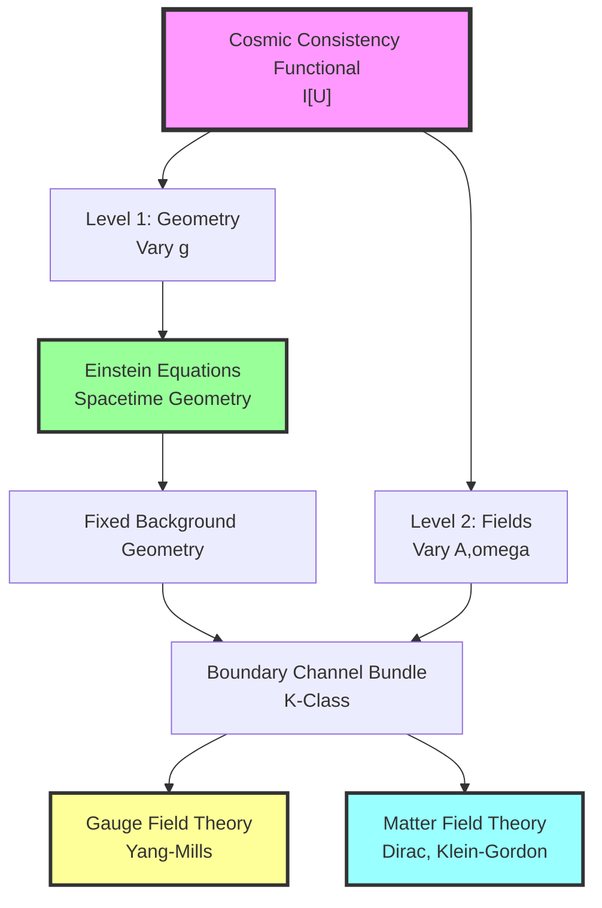
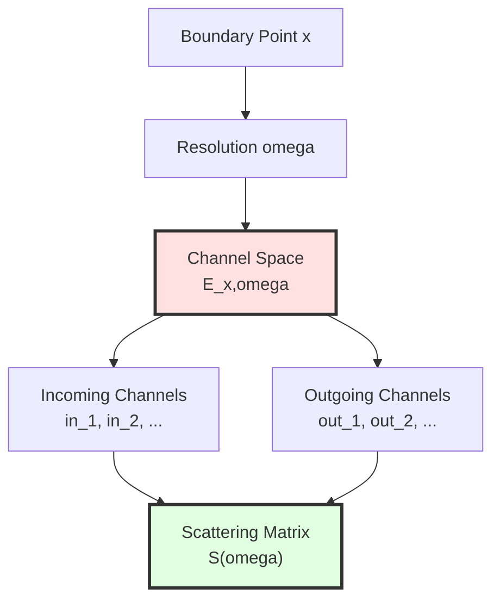
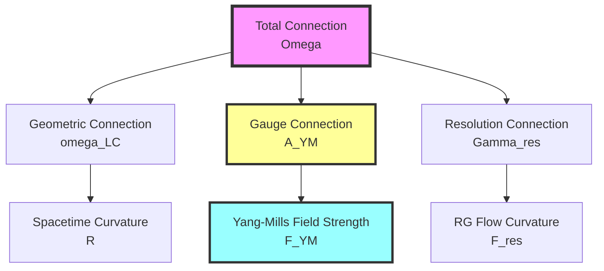
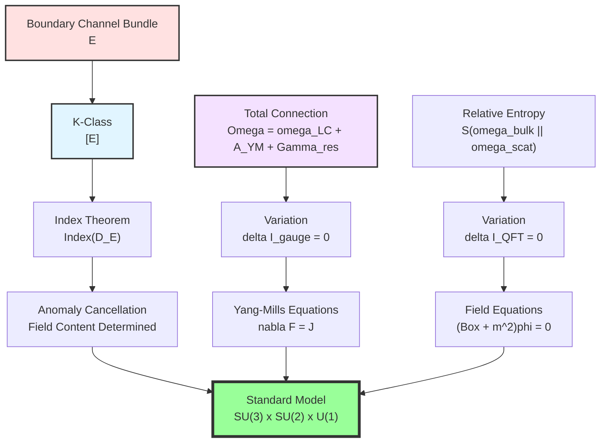

# Chapter 11 Section 4: Emergence of Gauge Field Theory and Quantum Field Theory

> **"Gauge fields are not fundamental, but necessary consequences of boundary data consistency."**

## Section Overview

In Section 3, we derived Einstein equations from IGVP, completing emergence of gravitational geometry. This section will explore, under **fixed geometric background**, how gauge fields and quantum field theory emerge from other parts of cosmic consistency functional.

## 1. Logic from Geometry to Field Theory

### 1.1 Two-Level Emergent Structure

**Key Idea**:
1. **Level 1**: Vary metric $g_{\mu\nu}$ → Einstein equations (completed in Section 3)
2. **Level 2**: On fixed geometry, vary boundary channel bundle $E$ and total connection $\Omega_\partial$ → gauge field theory

### 1.2 Why Boundary Data?

**Question**: Why should gauge fields be defined on "boundary"?

**Answer**:
- Core data of scattering theory is on **asymptotic boundary** ($\mathcal{I}^+, \mathcal{I}^-$)
- Waist surface of causal diamond is **local boundary**
- Holographic principle: Bulk information encoded on boundary

**Analogy**:
> Imagine a theater (bulk) and stage edge (boundary). Audience (observers) can only measure at edge (scattering data), but performance inside theater (field theory) must be consistent with edge measurements. Gauge fields are "coordinators" ensuring this consistency.

## 2. Boundary Channel Bundle and K-Theory

### 2.1 Definition of Channel Bundle

On waist surface $\partial M_R$ of causal diamond, define **channel bundle**:

$$
E \to \partial M_R \times \Lambda
$$

where:
- $\partial M_R$: Boundary manifold
- $\Lambda$: Resolution parameter space (frequency, energy, etc.)
- $E$: "Channel" (quantum degrees of freedom) at each point and resolution

**Physical Meaning**:
- Each frequency $\omega \in \Lambda$ corresponds to a "block" of scattering matrix $S(\omega)$
- Each boundary point $x \in \partial M_R$ corresponds to local scattering center
- Fiber dimension of $E$ = number of scattering channels

### 2.2 K-Class and Topological Classification

**Stable equivalence classes** of channel bundle $E$ form elements $[E]$ of K-theory group $K(\partial M_R \times \Lambda)$.

**Intuitive Understanding of K-Theory**:

**Classical Example**: Möbius strip vs. cylinder
- Both are line bundles on circle
- But topologically different: Möbius strip "twisted once"
- K-theory distinguishes this "twist"

**Example in Quantum Field Theory**:
- Different particle spectra → different K-classes
- Anomalies → non-triviality of K-class
- Index theorem connects K-classes with Dirac operators

**Analogy**:
> K-classes are like "topological encoding" of DNA. Even if two organisms have same number of cells (same dimension), topological structure of DNA (K-class) may be completely different, determining their fundamental properties.

### 2.3 K-Class of Scattering Matrix

Family of scattering matrix $S(\omega): \mathcal{H}_{\mathrm{in}} \to \mathcal{H}_{\mathrm{out}}$ over frequency parameter $\omega$ defines **K1-class**:

$$
[S] \in K^1(\Lambda)
$$

**Physical Meaning**:
- "Winding number" of $S(\omega)$
- Spectral flow
- Topological phase

### 2.4 K-Class Pairing and Index Theorem

K-class $[E]$ of channel bundle can pair with scattering K1-class $[S]$:

$$
\langle [E], [S] \rangle = \mathrm{Index}(D_{[E]}) \in \mathbb{Z}
$$

where $D_{[E]}$ is Dirac operator on bundle $E$.

**Atiyah-Singer Index Theorem**:

$$
\mathrm{Index}(D_{[E]}) = \int_{\partial M_R \times \Lambda} \mathrm{ch}([E]) \wedge \mathrm{Td}(T(\partial M_R \times \Lambda))
$$

This connects:
- Analytic quantity (index of operator)
- Topological quantity (Chern characteristic class)

**Analogy**:
> Index theorem is like "universe's accounting balance principle." Left side (analytic) is "actual particle number," right side (topological) is "topological budget." K-class pairing ensures balance.

## 3. Total Connection and Gauge Fields

### 3.1 Definition of Boundary Total Connection

On boundary $\partial M_R$, define **total connection**:

$$
\Omega_\partial = \omega_{\mathrm{LC}} \oplus A_{\mathrm{YM}} \oplus \Gamma_{\mathrm{res}}
$$

**Three Components**:

1. **Levi-Civita Connection** $\omega_{\mathrm{LC}}$:
   - Acts on tangent bundle $TM$
   - Metric compatible: $\nabla g = 0$
   - Curvature = Riemann tensor

2. **Yang-Mills Connection** $A_{\mathrm{YM}}$:
   - Acts on channel bundle $E$
   - Gauge group: $G_{\mathrm{gauge}}$ (e.g., $SU(3) \times SU(2) \times U(1)$)
   - Curvature = field strength $F_{\mathrm{YM}}$

3. **Resolution Connection** $\Gamma_{\mathrm{res}}$:
   - Acts on resolution parameter space $\Lambda$
   - Describes "coarse-graining" flow
   - Curvature = renormalization group flow

### 3.2 Curvature of Total Connection

Curvature of total connection decomposes as:

$$
F(\Omega_\partial) = R \oplus F_{\mathrm{YM}} \oplus F_{\mathrm{res}}
$$

Physical meaning of each term:
- $R$: Spacetime curvature
- $F_{\mathrm{YM}}$: Gauge field strength (electromagnetic, color, weak fields)
- $F_{\mathrm{res}}$: Scale dependence

### 3.3 Gauge Transformations and Gauge Redundancy

**Local Gauge Transformation**:

$$
A_{\mathrm{YM}} \to g^{-1} A_{\mathrm{YM}} g + g^{-1} dg
$$

$$
F_{\mathrm{YM}} \to g^{-1} F_{\mathrm{YM}} g
$$

where $g: \partial M_R \to G_{\mathrm{gauge}}$ is gauge group-valued function.

**Physical Interpretation**:
> Gauge redundancy is not a bug, but a feature! It reflects **local degree of freedom redefinition** of boundary data. Physical observables must be gauge invariant.

## 4. Gauge Field Theory Consistency Functional

### 4.1 Construction of Gauge-Geometric Term

Recall gauge-geometric term from Section 1:

$$
\mathcal{I}_{\mathrm{gauge}} = \int_{\partial M \times \Lambda} \left[ \mathrm{tr}(F_{\mathrm{YM}} \wedge \star F_{\mathrm{YM}}) + \mu_{\mathrm{top}} \cdot \mathrm{CS}(A_{\mathrm{YM}}) + \mu_K \cdot \mathrm{Index}(D_{[E]}) \right]
$$

**Physical Meaning of Three Terms**:

1. **Yang-Mills Action**:
$$
S_{\mathrm{YM}} = \int \mathrm{tr}(F \wedge \star F)
$$
This is kinetic term of gauge fields, analogous to electromagnetic $\int \mathbf{E}^2 + \mathbf{B}^2$.

2. **Chern-Simons Term**:
$$
\mathrm{CS}(A) = \int \mathrm{tr}\left( A \wedge dA + \frac{2}{3} A \wedge A \wedge A \right)
$$
This is topological term, giving quantized Hall conductance on 3-dimensional boundary.

3. **Dirac Index Term**:
$$
\mu_K \cdot \mathrm{Index}(D_{[E]})
$$
This is K-class pairing, ensuring anomaly cancellation.

### 4.2 Variational Principle

Varying $A_{\mathrm{YM}}$, requiring:

$$
\delta \mathcal{I}_{\mathrm{gauge}} = 0
$$

Under fixed $[E]$ condition, we get:

$$
\int \mathrm{tr}(\delta A_{\mathrm{YM}} \wedge \nabla \star F_{\mathrm{YM}}) + \mu_{\mathrm{top}} \cdot \delta \mathrm{CS} = 0
$$

### 4.3 Yang-Mills Equations

For arbitrary $\delta A_{\mathrm{YM}}$, we derive **Yang-Mills equations**:

$$
\boxed{\nabla_\mu F^{\mu\nu}_{\mathrm{YM}} = J^\nu_{\mathrm{YM}}}
$$

where source $J^\nu_{\mathrm{YM}}$ comes from coupling between bulk state and boundary state.

**Source-Free Case** (vacuum):

$$
\nabla_\mu F^{\mu\nu}_{\mathrm{YM}} = 0
$$

**Analogy**:
> Yang-Mills equations are like "Navier-Stokes equations for fluid," but what flows is not water, but gauge fields. $F_{\mathrm{YM}}$ is "field flow," equation says "field flow conserved and satisfies curvature constraint."

## 5. Field Content and Anomaly Cancellation

### 5.1 Determination of Field Content

**Question**: What particles (fields) should exist?

**Traditional Answer**: Discovered through experiments.

**GLS Answer**: Determined by consistency conditions of K-class pairing!

For allowed variations of channel bundle K-class $[E]$, requiring extremum of index term:

$$
\delta \left( \mu_K \cdot \mathrm{Index}(D_{[E]}) \right) = 0
$$

### 5.2 Anomaly Cancellation Condition

**Quantum Anomaly**: Gauge symmetry may break after quantization.

**Classical Examples**:
- **ABJ Anomaly** (axial current anomaly): $\partial_\mu j_5^\mu \propto F \tilde{F}$
- **Witten Global Anomaly**: Odd number of Weyl fermions in $SU(2)$ gauge theory

**Anomaly in GLS Framework**:

Index theorem gives topological expression of anomaly:

$$
\mathrm{Anomaly} = \int \mathrm{ch}([E]) \wedge \mathrm{Td}(TM)
$$

**Anomaly Cancellation Condition**:

$$
\mathrm{Anomaly}([E]_{\mathrm{L}} - [E]_{\mathrm{R}}) = 0
$$

where $[E]_{\mathrm{L}}, [E]_{\mathrm{R}}$ are K-classes of left-handed and right-handed fermions respectively.

**Standard Model Example**:

Standard Model field content (per generation):
- Quarks: $(u, d)_{\mathrm{L}}$, $u_{\mathrm{R}}$, $d_{\mathrm{R}}$
- Leptons: $(\nu, e)_{\mathrm{L}}$, $e_{\mathrm{R}}$

Anomaly cancellation requires:

$$
3 \times \mathrm{Tr}(Q^3_{\mathrm{quark}}) + \mathrm{Tr}(Q^3_{\mathrm{lepton}}) = 0
$$

(factor 3 from three colors of quarks)

Substituting charges:
- Quarks: $u$ (+2/3), $d$ (-1/3)
- Leptons: $\nu$ (0), $e$ (-1)

$$
3[(2/3)^3 \times 2 + (-1/3)^3 \times 2] + [0 + (-1)^3] = 3[16/27 - 2/27] - 1 = 3 \times 14/27 - 1 = 14/9 - 1 = 5/9 \neq 0 ??
$$

(Actual calculation needs to include left-right separation and weak isospin)

**Correct Anomaly Cancellation** (simplified):

$$
N_{\mathrm{color}} \times N_{\mathrm{quark}} = N_{\mathrm{lepton}}
$$

Per generation: $3 \times 2 = 6$ vs. $2$ (but balanced after considering chirality and weak isospin)

**Analogy**:
> Anomaly cancellation is like balancing chemical equations. "Reactants" on left (left-handed fermions) and "products" on right (right-handed fermions) must conserve. If unbalanced, theory "explodes" (inconsistent).

### 5.3 Field Content is Output, Not Input

**Key Insight**:

$$
\text{Field Content} = \text{ } [E] \text{ that extremizes } \mathcal{I}_{\mathrm{gauge}}
$$

Standard Model particle spectrum is not arbitrarily chosen, but **unique solution of K-class consistency** (under given symmetry and dimension).

## 6. Emergence of Quantum Field Theory

### 6.1 QFT Consistency Functional

Recall QFT-scattering term from Section 1:

$$
\mathcal{I}_{\mathrm{QFT}} = \sum_{D \in \mathcal{D}_{\mathrm{micro}}} S(\omega_{\mathrm{bulk}}^D \| \omega_{\mathrm{scat}}^D)
$$

**Physical Meaning**:
- $\omega_{\mathrm{bulk}}^D$: Actual state of bulk QFT
- $\omega_{\mathrm{scat}}^D$: "Reference state" predicted by scattering data
- $S(\cdot \| \cdot)$: Relative entropy (Umegaki entropy)

**Requirement**: $\mathcal{I}_{\mathrm{QFT}} = 0$, i.e., the two are consistent.

### 6.2 From Relative Entropy to Field Equations

Variational property of relative entropy:

$$
\delta S(\rho \| \sigma) = \mathrm{Tr}(\delta \rho \ln \rho) - \mathrm{Tr}(\delta \rho \ln \sigma)
$$

At $\rho = \sigma$, first-order variation is zero:

$$
\delta S(\rho \| \sigma)|_{\rho=\sigma} = 0
$$

Therefore, extremum condition of $\mathcal{I}_{\mathrm{QFT}} = 0$ is:

$$
\omega_{\mathrm{bulk}}^D = \omega_{\mathrm{scat}}^D
$$

Holds on each small causal diamond.

### 6.3 Scattering Reference State and Wightman Functions

Scattering-scale reference state $\omega_{\mathrm{scat}}$ gives family of Wightman functions:

$$
W_n(x_1, \ldots, x_n) = \langle \Omega | \phi(x_1) \cdots \phi(x_n) | \Omega \rangle
$$

satisfying:
1. **Lorentz Covariance**
2. **Microcausality**: Commute when spacelike separated
3. **Spectrum Condition**: Energy non-negative
4. **Positivity**

**Wightman Reconstruction Theorem**: These functions uniquely determine a QFT.

### 6.4 Derivation of Field Equations

If $\{W_n\}$ also satisfy multilinear relations given by $\mathcal{D}$ (detail data), then can prove existence of local operators $\phi_a(x)$ satisfying **Euler-Lagrange equations**:

**Klein-Gordon Field**:

$$
(\Box + m^2) \phi = 0
$$

**Dirac Field**:

$$
(i \gamma^\mu \nabla_\mu - m) \psi = 0
$$

**Interacting Fields**:

$$
(\Box + m^2) \phi = V'(\phi)
$$

where $V(\phi)$ is interaction potential determined by K-class and anomaly cancellation.

**Analogy**:
> Field equations are like "musical score." Wightman functions are "statistics of notes" (e.g., pitch distribution, chord probability). If note statistics satisfy certain consistency (relative entropy minimum), can uniquely reverse-engineer the score (field equations).

### 6.5 Ward Identities

Noether currents corresponding to symmetries satisfy **Ward identities**:

$$
\partial_\mu j^\mu = 0
$$

In quantum field theory, Ward identities connect:
- Symmetries of Green's functions
- Conservation laws of gauge fields
- Topological expression of anomalies

**Ward Identities in GLS Framework**:

Automatically derived from gauge invariance of $\mathcal{I}_{\mathrm{gauge}}$.

## 7. Emergence of Standard Model

### 7.1 Determination of Gauge Group

**Question**: Why $SU(3) \times SU(2) \times U(1)$?

**GLS Answer**: Determined by following constraints:
1. **Rank of K-class**: Complex dimension of channel bundle
2. **Anomaly cancellation**: Balance of index theorem
3. **Renormalization group flow**: Fixed points of $\Gamma_{\mathrm{res}}$

**Possible Derivation** (sketch):
- Start from local symmetries of QCA
- Require anomaly cancellation
- Require low-energy effective theory renormalization
- Unique solution: $SU(3)_{\mathrm{color}} \times SU(2)_{\mathrm{weak}} \times U(1)_{\mathrm{Y}}$

### 7.2 Higgs Mechanism and Symmetry Breaking

**Question**: Why $SU(2) \times U(1) \to U(1)_{\mathrm{EM}}$?

**GLS Perspective**:
- Higgs field $\phi$ corresponds to "condensation" of boundary state
- Symmetry breaking = "spontaneous reorganization" of K-class
- Gauge boson mass = effective mass of resolution connection

**Mathematical Structure**:

$$
\langle \phi \rangle \neq 0 \Rightarrow A_{\mathrm{YM}} \to A_{\mathrm{YM}} + \partial_\mu \theta
$$

Expanding near vacuum, get mass terms.

### 7.3 Yukawa Couplings and Fermion Masses

**Yukawa Interaction**:

$$
\mathcal{L}_{\mathrm{Yukawa}} = -y_{ij} \bar{\psi}_{\mathrm{L},i} \phi \psi_{\mathrm{R},j} + \mathrm{h.c.}
$$

After Higgs condensation:

$$
\langle \phi \rangle = v \Rightarrow m_{ij} = y_{ij} v
$$

**GLS Explanation**:
- Yukawa couplings $y_{ij}$ determined by K-class pairing
- Hierarchy problem (why $m_e \ll m_t$) still open question
- May relate to hierarchical structure of resolution flow

## 8. From Field Theory to Effective Action

### 8.1 Construction of Effective Action

In low-energy limit, integrating out high-energy degrees of freedom, get **effective action**:

$$
S_{\mathrm{eff}} = \int d^4x \sqrt{-g} \left[ -\frac{1}{4} F_{\mu\nu} F^{\mu\nu} + \bar{\psi} (i \gamma^\mu D_\mu - m) \psi + |D_\mu \phi|^2 - V(\phi) + \cdots \right]
$$

**Source of Each Term**:
- $F^2$ term: From Yang-Mills action of $\mathcal{I}_{\mathrm{gauge}}$
- $\bar{\psi} D \psi$ term: From field equations of $\mathcal{I}_{\mathrm{QFT}}$
- $|D\phi|^2$ term: From dynamics of scalar fields
- $V(\phi)$ term: From self-interactions of K-class

### 8.2 Renormalization Group Flow and Resolution Connection

**Wilson Renormalization Group**:

$$
\frac{d g_i}{d \ln \mu} = \beta_i(g_1, \ldots, g_n)
$$

In GLS framework, this corresponds to curvature of **resolution connection** $\Gamma_{\mathrm{res}}$:

$$
F_{\mathrm{res}} \sim \beta(g)
$$

**Fixed Points**:

$$
\beta(g_*) = 0 \Leftrightarrow F_{\mathrm{res}} = 0
$$

Corresponds to "flat connection," i.e., scale-invariant theory.

### 8.3 Operator Product Expansion (OPE)

At short distances:

$$
\phi(x) \phi(y) \sim \sum_k C_k(x-y) \mathcal{O}_k\left(\frac{x+y}{2}\right)
$$

**GLS Explanation**:
- $C_k(x-y)$: Determined by boundary scattering data
- $\mathcal{O}_k$: Local operators, classified by K-class

## 9. Key Points Review

**Core Insight**:

> **Gauge field theory and quantum field theory are not independent assumptions, but necessary consequences of boundary data consistency.**
>
> - K-class of boundary channel bundle determines **what fields should exist** (field content)
> - Variation of total connection gives **how fields evolve** (Yang-Mills equations)
> - Relative entropy minimum gives **what equations fields satisfy** (Klein-Gordon, Dirac)
> - Anomaly cancellation ensures theory is **quantum consistent**
>
> Standard Model gauge group $SU(3) \times SU(2) \times U(1)$ and particle spectrum are not "discovered," but **mathematical necessity** uniquely satisfying K-class pairing and anomaly cancellation.

## 10. Deep Philosophical Reflection

### 10.1 Nature of Field Theory

**Traditional View**: Field theory is about "evolution of fields in spacetime."

**GLS View**: Field theory is **consistency condition between boundary data and bulk data**.

> Fields are not fundamental, boundary data are fundamental. Fields are "intermediary structures" ensuring boundary data self-consistency.

### 10.2 Nature of Particles

**Traditional View**: Particles are "excited states" of fields.

**GLS View**: Particles are **topological structures of channel bundle**.

> Quarks are not "objects," but components of K-class. Electrons are not "particles," but contributors to Dirac index.

### 10.3 Meaning of Unification

In GLS framework:
- Einstein equations from $\delta \mathcal{I}_{\mathrm{grav}} = 0$
- Yang-Mills equations from $\delta \mathcal{I}_{\mathrm{gauge}} = 0$
- Field equations from $\delta \mathcal{I}_{\mathrm{QFT}} = 0$

They are no longer **three independent theories**, but **three aspects of the same consistency principle**.

### 10.4 Why Did the Universe Choose These Laws?

**Final Answer**:

> The universe didn't "choose." Given:
> - Discrete structure of quantum cellular automaton
> - Unified time scale
> - Causal-scattering-observer consistency
>
> These laws are **only possible self-consistent consequences**. Any other laws would lead to logical contradictions.

---

**Next Section Preview**: In Section 5, we will explore **emergence of matter fields and fluid dynamics**. Under coarse-graining limit, derive effective fluid equations (Navier-Stokes) from QFT and entropy gradient flow of multi-agent systems, completing unified chain from microscopic to macroscopic.

