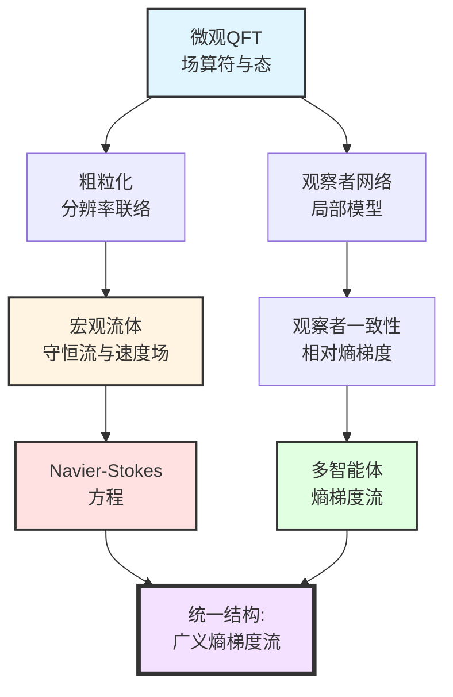
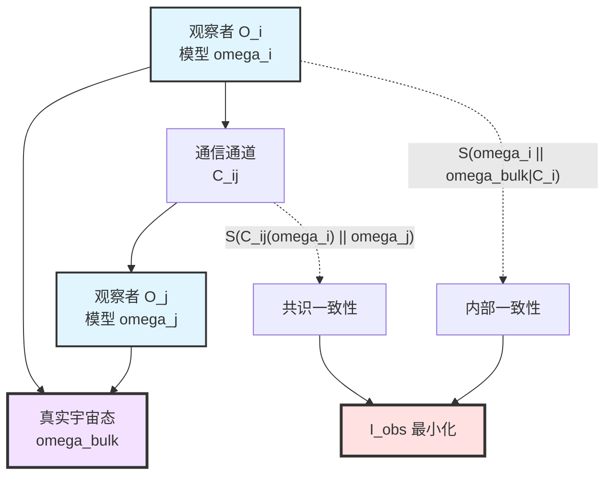
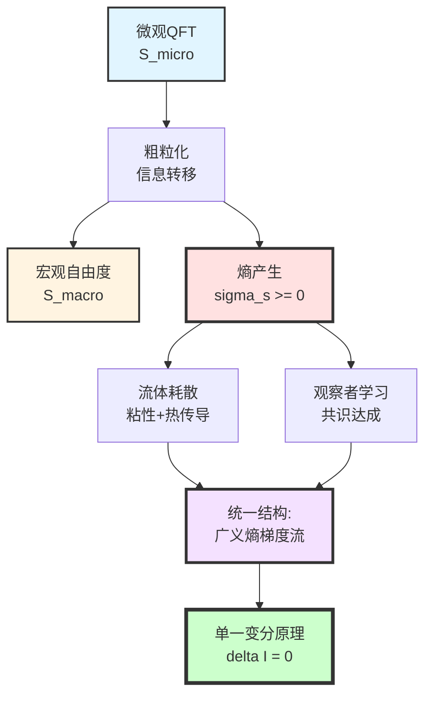
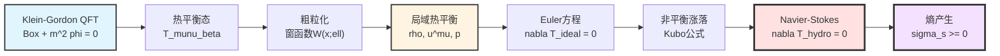
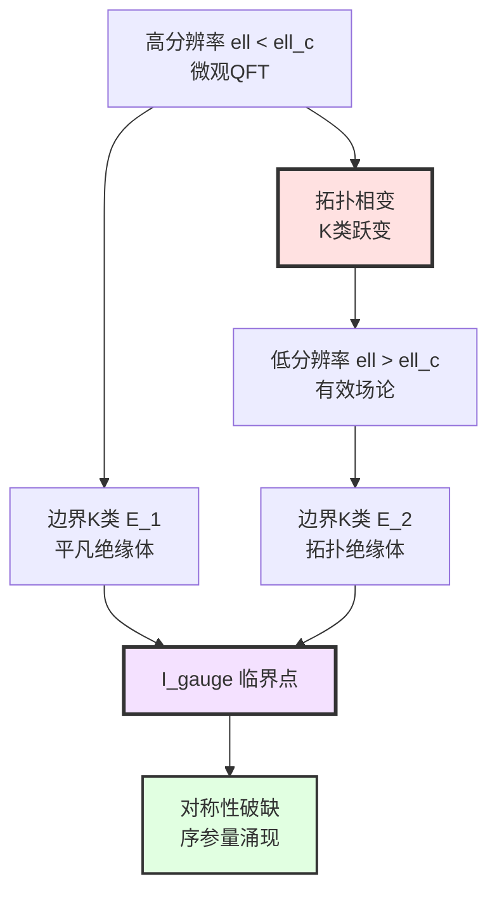
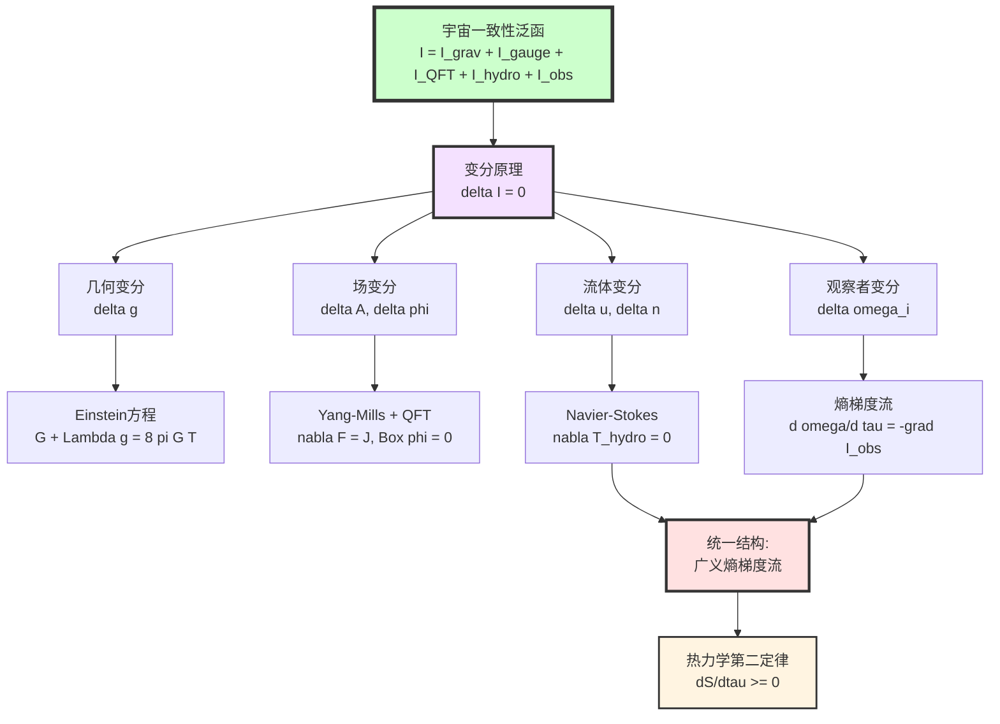

# 第11章第5节：物质场与流体动力学的涌现

> **"微观的量子涨落与宏观的流体力学，本质上是同一熵梯度流在不同分辨率下的显现。"**

## 本节导览

在前面的章节中,我们已经从单一的宇宙一致性变分原理$\delta\mathcal{I}[\mathfrak{U}]=0$导出了:

- **第3节**: Einstein场方程(引力的涌现)
- **第4节**: Yang-Mills方程与量子场论(规范场与QFT的涌现)

现在我们来到最后一个关键步骤:**从微观场论到宏观流体的跨尺度统一**。

**本节核心问题**:

1. 如何从量子场论的无穷多自由度过渡到流体力学的有限守恒流?
2. 为什么Navier-Stokes方程是一致性变分原理的必然结果?
3. 多智能体系统的动力学为何与流体动力学共享相同的数学结构?
4. "耗散"与"熵产生"如何在统一时间刻度下获得本体意义?

---

## 1. 从QFT到流体:分辨率的物理意义

### 1.1 "看不清"的必然性

想象你在观察一杯水:

- **量子尺度**($10^{-10}$ m):每个水分子的波函数、量子纠缠、虚粒子涨落
- **统计尺度**($10^{-6}$ m):数千个分子的集体运动,局部温度与密度
- **流体尺度**($10^{-3}$ m):连续介质,速度场$u^\mu$与压强$p$

**关键洞察**:当我们从量子尺度向宏观尺度"粗粒化"时,**并非丢失了信息**,而是**改变了描述信息的语言**。

**比喻**:就像从像素图到矢量图,或从DNA序列到物种表型——信息没有消失,只是被**重新编码**到更粗糙的自由度中。

### 1.2 分辨率联络$\Gamma_{\mathrm{res}}$的几何意义

在GLS理论中,这个"粗粒化"过程被形式化为**分辨率联络**$\Gamma_{\mathrm{res}}$:

$$
\Gamma_{\mathrm{res}}: \Lambda \times \mathcal{A}_{\mathrm{bulk}} \to \mathcal{V}_{\mathrm{macro}}
$$

其中:

- $\Lambda$:分辨率层级(尺度参数空间)
- $\mathcal{A}_{\mathrm{bulk}}$:微观场的可观测代数
- $\mathcal{V}_{\mathrm{macro}}$:宏观变量空间(如速度场、密度场)

**物理解释**:

$\Gamma_{\mathrm{res}}$告诉我们:给定分辨率$\ell\in\Lambda$,如何从微观算符$\hat{O}\in\mathcal{A}_{\mathrm{bulk}}$构造宏观可观测量$O_{\mathrm{macro}}$。

**数学形式**:

$$
O_{\mathrm{macro}}(\ell) = \int_{|x-x'|<\ell} W(x-x';\ell)\,\langle\hat{O}(x')\rangle\,\mathrm{d}^d x'
$$

其中$W(x;\ell)$是分辨率为$\ell$的窗函数(如高斯窗、矩形窗等)。

### 1.3 分辨率流的统一刻度表述

在统一时间刻度框架下,分辨率$\ell$与频率$\omega$通过不确定性原理关联:

$$
\ell \sim \frac{1}{\omega},\quad
\Delta \ell \cdot \Delta \omega \sim 1
$$

因此,分辨率联络的曲率$F_{\mathrm{res}}$刻画了**跨尺度信息传递的障碍**:

$$
F_{\mathrm{res}} = \mathrm{d}\Gamma_{\mathrm{res}} + \Gamma_{\mathrm{res}}\wedge\Gamma_{\mathrm{res}}
$$

**物理意义**:

- $F_{\mathrm{res}}=0$:完美的尺度分离,宏观变量完全独立
- $F_{\mathrm{res}}\neq 0$:跨尺度耦合,微观涨落影响宏观动力学

这正是**耗散与噪声的几何起源**!

---

## 2. 流体动力学一致性泛函$\mathcal{I}_{\mathrm{hydro}}$

### 2.1 熵产生的必然性

在粗粒化过程中,信息从微观自由度转移到宏观自由度,必然伴随**熵产生**。

**第二定律的统一刻度表述**:

在统一时间刻度$\tau$下,小因果菱形族$\{D_\tau\}$的广义熵满足:

$$
\frac{\mathrm{d} S_{\mathrm{gen}}(D_\tau)}{\mathrm{d}\tau} \geq 0
$$

但在粗粒化描述中,我们只能"看到"宏观自由度的熵$S_{\mathrm{macro}}$,必须加上**隐藏在微观自由度中的熵**$S_{\mathrm{micro}}$:

$$
S_{\mathrm{gen}} = S_{\mathrm{macro}} + S_{\mathrm{micro}}
$$

**熵产生率**:

$$
\sigma_s := \frac{\mathrm{d} S_{\mathrm{micro}}}{\mathrm{d}\tau} \geq 0
$$

这就是流体动力学中**耗散的本体来源**。

### 2.2 流体一致性泛函的具体形式

为了将熵产生最小化原则写成变分形式,定义:

$$
\mathcal{I}_{\mathrm{hydro}}
= \int_M
\biggl[
\zeta(\nabla_\mu u^\mu)^2
+\eta\,\sigma_{\mu\nu}\sigma^{\mu\nu}
+\sum_k D_k (\nabla_\mu n_k)^2
\biggr]\sqrt{|g|}\,\mathrm{d}^d x
$$

**符号说明**:

- $u^\mu$:**四速度场**(宏观流体元的速度)
- $\nabla_\mu u^\mu$:**膨胀率**(体积变化率)
- $\sigma_{\mu\nu} := \frac{1}{2}(\nabla_\mu u_\nu + \nabla_\nu u_\mu) - \frac{1}{d}\,g_{\mu\nu}\nabla_\rho u^\rho$:**剪切张量**
- $n_k$:**守恒荷密度**(如粒子数密度、电荷密度等)
- $\zeta$:**体黏度**(bulk viscosity)
- $\eta$:**剪切黏度**(shear viscosity)
- $D_k$:**扩散系数**

**物理解释**:

每一项都是某种"梯度平方"形式,对应不同的耗散机制:

| 项 | 物理过程 | 熵产生机制 |
|---|---|---|
| $\zeta(\nabla_\mu u^\mu)^2$ | 体积膨胀/压缩 | 压缩功转化为热 |
| $\eta\,\sigma_{\mu\nu}\sigma^{\mu\nu}$ | 剪切形变 | 摩擦耗散 |
| $D_k(\nabla_\mu n_k)^2$ | 浓度/密度梯度 | 扩散混合 |

**数学结构**:

$\mathcal{I}_{\mathrm{hydro}}$是一个**非负定二次型**,在宏观变量空间上定义了一个"耗散度量"。

### 2.3 与分辨率联络的关系

黏度$\zeta,\eta$与扩散系数$D_k$**不是外加的参数**,而是由分辨率联络$\Gamma_{\mathrm{res}}$决定的:

$$
\eta = \int_0^\infty \langle T^{xy}(t) T^{xy}(0)\rangle\,\mathrm{d}t
$$

这是**Green-Kubo公式**的推广,它表明:

> 宏观输运系数来源于微观应力-能量张量的时间关联函数在统一刻度下的积分。

**统一刻度版本**:

$$
\eta(\omega) = \int_\Lambda \rho_{\mathrm{rel}}(\omega')\,
\langle T^{\mu\nu}(\omega') T_{\mu\nu}(\omega-\omega')\rangle\,
\mathrm{d}\mu_\varphi(\omega')
$$

其中$\rho_{\mathrm{rel}}(\omega)$是相对态密度(统一时间刻度母式),$\mathrm{d}\mu_\varphi$是谱移测度。

---

## 3. 从变分原理导出Navier-Stokes方程

### 3.1 变分设置与约束条件

我们现在对宏观变量$(u^\mu, n_k)$作变分,但需要保持:

1. **局域守恒**:
   $$
   \nabla_\mu T^{\mu\nu}_{\mathrm{hydro}} = 0,\quad
   \nabla_\mu J^\mu_k = 0
   $$

2. **统一刻度一致性**:粗粒化后的宏观演化仍在同一统一时间刻度$\tau$下进行

3. **因果性**:信息传播速度不超过光速

变分问题:

$$
\delta\left(\mathcal{I}_{\mathrm{grav}} + \mathcal{I}_{\mathrm{hydro}}\right) = 0
$$

在守恒约束下对$(u^\mu, n_k, g_{\mu\nu})$作变分。

### 3.2 对速度场$u^\mu$的变分

固定几何$g_{\mu\nu}$与密度$n_k$,对$u^\mu$作变分:

$$
\delta_u \mathcal{I}_{\mathrm{hydro}}
= \int_M \sqrt{|g|}\,
\biggl[
2\zeta(\nabla_\mu u^\mu)\nabla_\nu(\delta u^\nu)
+2\eta\,\sigma_{\mu\nu}\nabla_\rho(\delta u^\rho)
\biggr]\mathrm{d}^dx
$$

分部积分并利用边界项为零(或周期边界条件),得到:

$$
-2\nabla_\mu\bigl(\zeta(\nabla_\rho u^\rho)g^{\mu\nu}\bigr)
-2\nabla_\mu\bigl(\eta\sigma^{\mu\nu}\bigr)
= 0
$$

### 3.3 耦合守恒律:Navier-Stokes方程

将上述变分条件与能量-动量守恒$\nabla_\mu T^{\mu\nu}=0$结合,得到**广义Navier-Stokes方程**:

$$
\boxed{
\nabla_\mu T^{\mu\nu}_{\mathrm{hydro}} = 0
}
$$

其中应力-能量张量为:

$$
T^{\mu\nu}_{\mathrm{hydro}}
= T^{\mu\nu}_{\mathrm{ideal}}
+ T^{\mu\nu}_{\mathrm{diss}}
$$

**理想流体部分**:

$$
T^{\mu\nu}_{\mathrm{ideal}}
= (\rho + p)u^\mu u^\nu + p\,g^{\mu\nu}
$$

**耗散部分**:

$$
T^{\mu\nu}_{\mathrm{diss}}
= -\zeta(\nabla_\rho u^\rho)g^{\mu\nu}
-\eta\sigma^{\mu\nu}
$$

**标准Navier-Stokes方程**:

在非相对论性极限($c\to\infty$)与平直空间($g_{\mu\nu}=\eta_{\mu\nu}$),取$u^\mu = (1,\mathbf{v}/c)$,得到:

$$
\boxed{
\rho\left(\frac{\partial \mathbf{v}}{\partial t}
+(\mathbf{v}\cdot\nabla)\mathbf{v}\right)
= -\nabla p
+\eta\nabla^2\mathbf{v}
+\left(\zeta+\frac{\eta}{3}\right)\nabla(\nabla\cdot\mathbf{v})
}
$$

**物理解释**:

| 项 | 物理意义 | 来源 |
|---|---|---|
| $\rho\frac{\partial\mathbf{v}}{\partial t}$ | 惯性 | 时间演化 |
| $\rho(\mathbf{v}\cdot\nabla)\mathbf{v}$ | 对流加速 | 非线性相互作用 |
| $-\nabla p$ | 压强梯度力 | 理想流体 |
| $\eta\nabla^2\mathbf{v}$ | 黏性耗散 | $\mathcal{I}_{\mathrm{hydro}}$的剪切项 |
| $(\zeta+\eta/3)\nabla(\nabla\cdot\mathbf{v})$ | 体黏性 | $\mathcal{I}_{\mathrm{hydro}}$的膨胀项 |

### 3.4 扩散方程的涌现

对守恒荷密度$n_k$作类似变分:

$$
\delta_{n_k}\mathcal{I}_{\mathrm{hydro}}
= \int_M \sqrt{|g|}\,2D_k(\nabla_\mu n_k)\nabla_\nu(\delta n_k)\,\mathrm{d}^dx
$$

分部积分后,结合$\nabla_\mu J^\mu_k=0$,得到**扩散方程**:

$$
\boxed{
\frac{\partial n_k}{\partial \tau}
= D_k \nabla^2 n_k
- u^\mu\nabla_\mu n_k
}
$$

这是**对流-扩散方程**,描述守恒量在流体中的传播与混合。

---

## 4. 熵产生率与Onsager倒易关系

### 4.1 熵产生率的显式表达

将$\mathcal{I}_{\mathrm{hydro}}$与统一刻度下的熵产生率联系:

$$
\sigma_s
= \frac{1}{T}\,\mathcal{I}_{\mathrm{hydro}}
$$

其中$T$是局域温度。

**展开形式**:

$$
\sigma_s
= \frac{\zeta}{T}(\nabla_\mu u^\mu)^2
+\frac{\eta}{T}\sigma_{\mu\nu}\sigma^{\mu\nu}
+\sum_k \frac{D_k}{T}(\nabla_\mu n_k)^2
\geq 0
$$

**物理意义**:

每一项都是"热力学力"(如$\nabla_\mu u^\mu$)与"热力学流"(如耗散应力)的乘积。

### 4.2 Onsager倒易关系的几何起源

在线性响应理论中,热力学流$J^i$与热力学力$X_j$的关系为:

$$
J^i = \sum_j L^{ij} X_j
$$

其中$L^{ij}$是**Onsager系数矩阵**。

**Onsager倒易关系**:

$$
L^{ij} = L^{ji}
$$

**GLS理论的解释**:

从$\mathcal{I}_{\mathrm{hydro}}$的变分推导,熵产生率可以写成:

$$
\sigma_s
= \sum_{i,j} L^{ij} X_i X_j
$$

其中$L^{ij}$由二次型的对称性自动满足$L^{ij}=L^{ji}$。

**深层原因**:

> Onsager倒易关系不是"巧合",而是$\mathcal{I}_{\mathrm{hydro}}$作为二次型的必然对称性。

---

## 5. 多智能体系统:观察者网络的熵梯度流

### 5.1 观察者一致性泛函$\mathcal{I}_{\mathrm{obs}}$

回忆观察者网络$\{O_i\}$的一致性泛函:

$$
\mathcal{I}_{\mathrm{obs}}
= \sum_i S(\omega_i \Vert \omega_{\mathrm{bulk}}|_{C_i})
+ \sum_{(i,j)} S(\mathcal{C}_{ij*}(\omega_i) \Vert \omega_j)
$$

**符号说明**:

- $\omega_i$:观察者$O_i$的内部模型(信念态)
- $\omega_{\mathrm{bulk}}|_{C_i}$:真实宇宙态在$O_i$因果域$C_i$上的限制
- $\mathcal{C}_{ij}$:从$O_i$到$O_j$的通信通道
- $S(\rho\Vert\sigma)$:相对熵(Kullback-Leibler散度)

**物理解释**:

- **第一项**:惩罚观察者的内部模型与客观现实的偏差
- **第二项**:惩罚通信后观察者之间的不一致

### 5.2 对观察者态$\omega_i$的变分

固定通信结构$\{\mathcal{C}_{ij}\}$与真实态$\omega_{\mathrm{bulk}}$,对每个观察者的模型$\omega_i$作变分:

$$
\delta_{\omega_i}\mathcal{I}_{\mathrm{obs}}
= \delta S(\omega_i\Vert\omega_{\mathrm{bulk}}|_{C_i})
+ \sum_j \delta S(\mathcal{C}_{ij*}(\omega_i)\Vert\omega_j)
$$

利用相对熵的变分公式:

$$
\delta S(\rho\Vert\sigma)
= \int \log\frac{\mathrm{d}\rho}{\mathrm{d}\sigma}\,\delta\rho
$$

得到:

$$
\delta_{\omega_i}\mathcal{I}_{\mathrm{obs}}
= \int \left[
\log\frac{\omega_i}{\omega_{\mathrm{bulk}}|_{C_i}}
+\sum_j \log\frac{\mathcal{C}_{ij*}(\omega_i)}{\omega_j}
\right]\delta\omega_i
$$

### 5.3 熵梯度流动力学

要求$\delta\mathcal{I}_{\mathrm{obs}}=0$,在统一时间刻度$\tau$下演化为**梯度流方程**:

$$
\boxed{
\frac{\partial \omega_i}{\partial \tau}
= -\mathrm{grad}_{\mathsf{G}}\mathcal{I}_{\mathrm{obs}}(\omega_i)
}
$$

其中$\mathsf{G}$是信息几何度量(Fisher-Rao度量)。

**显式形式**:

在参数空间$\{\theta_i\}$中,梯度流为:

$$
\frac{\mathrm{d}\theta_i^a}{\mathrm{d}\tau}
= -\mathsf{G}^{ab}\frac{\partial \mathcal{I}_{\mathrm{obs}}}{\partial \theta_i^b}
$$

这就是**自然梯度下降**(natural gradient descent)或**镜像下降**(mirror descent)!

### 5.4 与多智能体学习的联系

**比喻**:

想象一群盲人探索一个房间:

- 每个人根据触觉建立内部地图($\omega_i$)
- 真实的房间布局是$\omega_{\mathrm{bulk}}$
- 他们之间可以交流($\mathcal{C}_{ij}$)

$\mathcal{I}_{\mathrm{obs}}$的最小化意味着:

1. 每个人的地图与真实布局越来越接近
2. 所有人的地图互相一致

**数学对应**:

| 概念 | 多智能体学习 | GLS观察者理论 |
|---|---|---|
| 智能体内部模型 | 策略/信念分布 | 观察者态$\omega_i$ |
| 环境真实状态 | 马尔可夫决策过程 | 宇宙态$\omega_{\mathrm{bulk}}$ |
| 通信拓扑 | 网络结构 | 因果域与通道$\mathcal{C}_{ij}$ |
| 学习动力学 | 策略梯度/Q学习 | 熵梯度流 |
| 收敛条件 | Nash均衡 | $\delta\mathcal{I}_{\mathrm{obs}}=0$ |

---

## 6. 流体与观察者的统一结构:广义熵梯度流

### 6.1 统一的数学框架

令人惊奇的是,**流体动力学**与**多智能体动力学**在数学上是同一种结构:

**流体**:

$$
\frac{\partial \rho_{\mathrm{fluid}}}{\partial \tau}
= -\mathrm{grad}_{\mathsf{G}_{\mathrm{Wasserstein}}}\mathcal{I}_{\mathrm{hydro}}(\rho_{\mathrm{fluid}})
$$

**观察者**:

$$
\frac{\partial \rho_{\mathrm{obs}}}{\partial \tau}
= -\mathrm{grad}_{\mathsf{G}_{\mathrm{Fisher}}}\mathcal{I}_{\mathrm{obs}}(\rho_{\mathrm{obs}})
$$

两者都是**概率分布空间上的梯度流**,只是度量不同:

- **Wasserstein度量**($\mathsf{G}_{\mathrm{Wasserstein}}$):最优传输距离,适用于物理空间上的质量分布
- **Fisher-Rao度量**($\mathsf{G}_{\mathrm{Fisher}}$):信息几何度量,适用于参数空间上的概率分布

### 6.2 广义熵$\mathsf{S}$与Lyapunov泛函

两个系统都有一个**Lyapunov泛函**(单调下降的"势函数"):

$$
\frac{\mathrm{d}\mathsf{S}}{\mathrm{d}\tau} \leq 0
$$

**流体**:

$$
\mathsf{S}_{\mathrm{hydro}}[\rho]
= -\int \rho\log\rho\,\mathrm{d}^dx
+ \frac{1}{T}\int \left[
\frac{1}{2}\rho|\mathbf{v}|^2
+\rho U(\rho)
\right]\mathrm{d}^dx
$$

**观察者**:

$$
\mathsf{S}_{\mathrm{obs}}[\{\omega_i\}]
= -\sum_i S(\omega_i)
+ \sum_i S(\omega_i\Vert\omega_{\mathrm{bulk}}|_{C_i})
$$

**物理意义**:

> 无论是宏观流体的演化,还是观察者网络的学习,都是在统一时间刻度下沿着某个广义熵的梯度方向"滚下山坡",最终达到平衡态。

### 6.3 耗散的本体意义

在传统物理学中,"耗散"被视为"非基本的、唯象的"。但在GLS理论中:

> **耗散是粗粒化描述的必然伴随,来源于微观信息向宏观自由度的转移。**

**统一刻度下的耗散定律**:

$$
\boxed{
\frac{\mathrm{d}S_{\mathrm{gen}}}{\mathrm{d}\tau}
= \frac{\mathrm{d}S_{\mathrm{macro}}}{\mathrm{d}\tau}
+ \underbrace{\frac{\mathrm{d}S_{\mathrm{micro}}}{\mathrm{d}\tau}}_{\sigma_s \geq 0}
\geq 0
}
$$

其中$\sigma_s$正是$\mathcal{I}_{\mathrm{hydro}}$或$\mathcal{I}_{\mathrm{obs}}$给出的熵产生率。

---

## 7. 具体实例:从QFT到Navier-Stokes的完整推导链

### 7.1 起点:标量场的量子场论

考虑一个简单的标量场$\phi(x)$,满足Klein-Gordon方程:

$$
(\Box + m^2)\phi(x) = 0
$$

在有限温度$T$下,系统处于热平衡态$\omega_\beta$,应力-能量张量的期望值为:

$$
\langle T_{\mu\nu}\rangle_\beta
= \langle\partial_\mu\phi\partial_\nu\phi\rangle_\beta
- \frac{1}{2}g_{\mu\nu}\langle\partial_\rho\phi\partial^\rho\phi + m^2\phi^2\rangle_\beta
$$

### 7.2 第一步:粗粒化到流体变量

引入窗函数$W(x;\ell)$,定义粗粒化能量密度:

$$
\rho(x;\ell)
:= \int W(x-x';\ell)\,\langle T_{00}(x')\rangle_\beta\,\mathrm{d}^3 x'
$$

粗粒化动量密度:

$$
\rho u^i(x;\ell)
:= \int W(x-x';\ell)\,\langle T_{0i}(x')\rangle_\beta\,\mathrm{d}^3 x'
$$

### 7.3 第二步:导出理想流体方程

如果$\ell$大于相关长度但小于宏观尺度,则在局域热平衡近似下:

$$
\langle T_{\mu\nu}\rangle_\beta(x;\ell)
\approx (\rho(x) + p(x))u_\mu(x)u_\nu(x) + p(x)g_{\mu\nu}
$$

其中压强$p$由状态方程给出:

$$
p = \frac{1}{3}\langle T^i_i\rangle_\beta
= \frac{T^4}{90}\int_0^\infty \frac{k^2\,\mathrm{d}k}{\sqrt{k^2+m^2}}\,
\frac{1}{e^{\sqrt{k^2+m^2}/T}-1}
$$

守恒律$\nabla_\mu T^{\mu\nu}=0$变成**Euler方程**(理想流体):

$$
\partial_\mu[(\rho+p)u^\mu u^\nu] + g^{\nu\rho}\partial_\rho p = 0
$$

### 7.4 第三步:包含耗散项

当考虑**非平衡涨落**时,应力张量有额外贡献:

$$
\langle T_{\mu\nu}\rangle
= \langle T_{\mu\nu}\rangle_{\mathrm{eq}}
+ \langle T_{\mu\nu}\rangle_{\mathrm{neq}}
$$

非平衡部分通过Kubo公式关联到$\mathcal{I}_{\mathrm{hydro}}$:

$$
\langle T^{ij}_{\mathrm{neq}}\rangle
= -\eta\sigma^{ij}
-\zeta(\nabla_k u^k)\delta^{ij}
$$

代入守恒律,得到**Navier-Stokes方程**。

### 7.5 第四步:熵产生与不可逆性

在粗粒化过程中,微观相空间体积$\Omega_{\mathrm{micro}}$随尺度$\ell$增大而减小:

$$
S_{\mathrm{micro}}(\ell)
= \log\Omega_{\mathrm{micro}}(\ell)
$$

熵产生率为:

$$
\sigma_s
= -\frac{\mathrm{d}S_{\mathrm{micro}}}{\mathrm{d}\ell}\,\frac{\mathrm{d}\ell}{\mathrm{d}\tau}
$$

这正好等于$\mathcal{I}_{\mathrm{hydro}}/T$!

**完整推导链总结**:

---

## 8. 观察者网络的具体例子:分布式传感器网络

### 8.1 问题设置

考虑$N$个传感器$\{O_1,\dots,O_N\}$分布在空间中,每个传感器:

- 测量局域场值$\phi_i = \phi(x_i) + \epsilon_i$(带噪声)
- 维护内部估计$\hat{\phi}_i$
- 与邻居传感器通信

**目标**:通过分布式算法,使所有传感器对全局场$\phi(x)$达成一致估计。

### 8.2 观察者一致性泛函

设真实场为$\phi_{\mathrm{true}}(x)$,传感器$O_i$的内部模型为$\hat{\phi}_i(x)$。

定义相对熵:

$$
S(\hat{\phi}_i \Vert \phi_{\mathrm{true}}|_{C_i})
= \int_{C_i} |\hat{\phi}_i(x) - \phi_{\mathrm{true}}(x)|^2\,\mathrm{d}^3x
$$

其中$C_i$是传感器$O_i$的感知域。

总一致性泛函:

$$
\mathcal{I}_{\mathrm{obs}}
= \sum_i \int_{C_i} |\hat{\phi}_i - \phi_{\mathrm{true}}|^2
+ \lambda\sum_{(i,j)\in E} |\hat{\phi}_i - \hat{\phi}_j|^2_{C_i\cap C_j}
$$

其中$E$是通信网络的边集,$\lambda$是通信权重。

### 8.3 梯度流更新算法

对$\hat{\phi}_i$作梯度下降:

$$
\frac{\partial \hat{\phi}_i}{\partial \tau}
= -\frac{\delta\mathcal{I}_{\mathrm{obs}}}{\delta\hat{\phi}_i}
$$

计算变分导数:

$$
\frac{\delta\mathcal{I}_{\mathrm{obs}}}{\delta\hat{\phi}_i}
= 2(\hat{\phi}_i - y_i)
+ 2\lambda\sum_{j\sim i}(\hat{\phi}_i - \hat{\phi}_j)
$$

其中$y_i$是传感器$O_i$的测量值,$j\sim i$表示$j$是$i$的邻居。

**更新规则**:

$$
\boxed{
\hat{\phi}_i(\tau+\Delta\tau)
= \hat{\phi}_i(\tau)
- \alpha\left[
(\hat{\phi}_i - y_i)
+ \lambda\sum_{j\sim i}(\hat{\phi}_i - \hat{\phi}_j)
\right]
}
$$

这正是**分布式卡尔曼滤波**或**共识算法**(consensus algorithm)!

### 8.4 收敛性分析

定义全局Lyapunov函数:

$$
V(\tau) := \mathcal{I}_{\mathrm{obs}}[\{\hat{\phi}_i(\tau)\}]
$$

梯度流保证:

$$
\frac{\mathrm{d}V}{\mathrm{d}\tau}
= -\sum_i \left|\frac{\partial\hat{\phi}_i}{\partial\tau}\right|^2
\leq 0
$$

因此$V(\tau)$单调下降,系统收敛到$\delta\mathcal{I}_{\mathrm{obs}}=0$的临界点。

**物理解释**:

> 分布式传感器网络的共识达成,本质上是观察者网络沿着$\mathcal{I}_{\mathrm{obs}}$的梯度方向在统一时间刻度下的演化。

---

## 9. 统计力学与热力学的涌现

### 9.1 平衡态作为一致性泛函的临界点

考虑孤立系统(无外界观察者),总一致性泛函简化为:

$$
\mathcal{I}_{\mathrm{total}}
= \mathcal{I}_{\mathrm{grav}}
+ \mathcal{I}_{\mathrm{QFT}}
+ \mathcal{I}_{\mathrm{hydro}}
$$

在固定能量$E$与体积$V$约束下,要求$\delta\mathcal{I}_{\mathrm{total}}=0$。

**引理**:$\mathcal{I}_{\mathrm{total}}$的临界点对应于**最大熵原理**:

$$
S_{\mathrm{gen}} = \max_{\rho} S(\rho)
\quad\text{subject to}\quad
\langle H\rangle_\rho = E,\quad
\mathrm{Vol}(\mathrm{supp}(\rho)) = V
$$

**证明要点**:

在$\mathcal{I}_{\mathrm{hydro}}$中,当系统达到平衡时,所有梯度消失:

$$
\nabla_\mu u^\mu = 0,\quad
\sigma_{\mu\nu} = 0,\quad
\nabla_\mu n_k = 0
$$

因此$\mathcal{I}_{\mathrm{hydro}} = 0$,剩余的$\mathcal{I}_{\mathrm{grav}}+\mathcal{I}_{\mathrm{QFT}}$的极值条件等价于广义熵的极大值。

### 9.2 热力学第二定律的本体地位

在统一时间刻度$\tau$下,广义熵满足:

$$
\frac{\mathrm{d}S_{\mathrm{gen}}}{\mathrm{d}\tau}
= \sigma_s
= \frac{1}{T}\mathcal{I}_{\mathrm{hydro}}
\geq 0
$$

**物理意义**:

> 热力学第二定律不是一个独立的"定律",而是宇宙一致性变分原理$\delta\mathcal{I}=0$在粗粒化描述下的必然推论。

**深层洞察**:

"熵增"的本质是:当我们从微观描述转向宏观描述时,**信息从可观测自由度流向不可观测自由度**。

### 9.3 温度的几何意义

在一致性泛函框架中,温度$T$不再是"外加的热力学参数",而是从几何结构中涌现:

$$
\frac{1}{T}
= \frac{\partial S_{\mathrm{gen}}}{\partial E}\bigg|_{V,N}
$$

在统一时间刻度下,这等价于:

$$
\frac{1}{T}
= \frac{\partial}{\partial E}
\left[
\frac{A(\partial D)}{4G\hbar}
+ S_{\mathrm{bulk}}(D)
\right]
$$

**比喻**:

温度就像"信息压强"——它度量了在给定能量下,系统"容纳"新信息的能力。温度越高,系统越"宽松",可以吸收更多能量而熵增较小。

---

## 10. 从流体到固体:拓扑相变的统一描述

### 10.1 固体的涌现

当分辨率$\ell$降低到某个临界值$\ell_c$时,流体的剪切模量$\eta$发散:

$$
\eta(\ell) \sim (\ell - \ell_c)^{-\nu}
$$

此时系统从"流体相"转变为"固体相"。

**物理解释**:

在固体中,粗粒化后的自由度不再是速度场$u^\mu$,而是**位移场**$u^i(x)$:

$$
u^i(x) := x^i - x^i_0
$$

其中$x^i_0$是平衡位置。

### 10.2 弹性理论的涌现

对位移场作变分,一致性泛函$\mathcal{I}_{\mathrm{solid}}$变为:

$$
\mathcal{I}_{\mathrm{solid}}
= \int_M
\left[
\mu\,\epsilon_{ij}\epsilon^{ij}
+ \frac{\lambda}{2}(\epsilon^i_i)^2
\right]\mathrm{d}^3x
$$

其中应变张量:

$$
\epsilon_{ij}
:= \frac{1}{2}(\partial_i u_j + \partial_j u_i)
$$

Lamé系数$\lambda,\mu$由分辨率联络$\Gamma_{\mathrm{res}}$在固体相中的值决定。

**变分条件**$\delta\mathcal{I}_{\mathrm{solid}}=0$导出**弹性波方程**:

$$
\rho\frac{\partial^2 u^i}{\partial t^2}
= \mu\nabla^2 u^i
+ (\lambda+\mu)\nabla_i(\nabla\cdot\mathbf{u})
$$

### 10.3 拓扑相变与对称性破缺

在某些系统中(如拓扑绝缘体),粗粒化过程中边界$K$类$[E]$发生**跃变**:

$$
[E]_{\ell>\ell_c} \neq [E]_{\ell<\ell_c}
$$

这对应于**拓扑相变**。

**GLS理论的解释**:

> 拓扑相变是通道丛在不同分辨率层级上的稳定等价类的突变,来源于$\mathcal{I}_{\mathrm{gauge}}$的临界点结构改变。

---

## 11. 深层哲学反思:涌现的本质

### 11.1 "涌现"不是神秘现象

传统物理学常说"流体动力学从分子动力学中涌现","意识从神经网络中涌现",但缺乏严格定义。

**GLS理论的定义**:

> **涌现**是指:在粗粒化(分辨率降低)过程中,一致性变分原理$\delta\mathcal{I}=0$在不同自由度空间上的表达形式发生质的改变,导致新的有效自由度与新的有效动力学。

**数学刻画**:

涌现对应于一个**纤维丛投影**:

$$
\pi: \mathcal{V}_{\mathrm{micro}} \to \mathcal{V}_{\mathrm{macro}}
$$

使得:

$$
\mathcal{I}_{\mathrm{macro}}[\pi(\mathbf{v})]
\approx \min_{\mathbf{v}\in\pi^{-1}(\mathbf{V})} \mathcal{I}_{\mathrm{micro}}[\mathbf{v}]
$$

其中$\mathbf{v}\in\mathcal{V}_{\mathrm{micro}}$是微观配置,$\mathbf{V}\in\mathcal{V}_{\mathrm{macro}}$是宏观配置。

### 11.2 还原论与涌现论的统一

**还原论**(reductionism):一切宏观现象原则上可由微观定律推导。

**涌现论**(emergentism):宏观现象有自己的定律,不可完全还原。

**GLS理论的立场**:

> 两者都对,但描述的是同一事物的不同侧面:
> - **还原**:微观与宏观都服从同一$\delta\mathcal{I}=0$,只是自由度不同
> - **涌现**:宏观有效理论的形式与微观理论质的不同,不能简单"代入"

**比喻**:

就像一个3D物体与它的2D投影:

- **还原**:投影包含了原物体的部分信息
- **涌现**:投影有自己的几何性质(如面积),不能直接从3D几何"读出"

### 11.3 "自由意志"与观察者动力学

在多智能体框架中,每个观察者$O_i$的"决策"是$\mathcal{I}_{\mathrm{obs}}$梯度流的结果:

$$
\frac{\mathrm{d}\omega_i}{\mathrm{d}\tau}
= -\mathrm{grad}\mathcal{I}_{\mathrm{obs}}
$$

这是否意味着"没有自由意志"?

**GLS理论的回答**:

> "自由意志"与"决定论"不矛盾:
> - **客观层面**:观察者态遵循$\delta\mathcal{I}=0$的必然演化
> - **主观层面**:观察者内部不知道$\mathcal{I}_{\mathrm{obs}}$的全局形式,只能"探索"梯度方向
>
> 自由意志是观察者在**信息不完备**情况下的主观体验,不违反客观的一致性原理。

**比喻**:

就像一个人在浓雾中摸索下山:

- 客观上,他沿着势能梯度下降(物理定律)
- 主观上,每一步都是"自由选择"(因为看不见全局地形)

---

## 12. 本节总结

### 12.1 主要结果

我们已经证明:从单一的宇宙一致性变分原理$\delta\mathcal{I}[\mathfrak{U}]=0$,可以导出:

1. **Navier-Stokes方程**:
   $$
   \nabla_\mu T^{\mu\nu}_{\mathrm{hydro}} = 0,\quad
   T^{\mu\nu}_{\mathrm{hydro}}
   = T^{\mu\nu}_{\mathrm{ideal}}
   - \zeta(\nabla_\rho u^\rho)g^{\mu\nu}
   - \eta\sigma^{\mu\nu}
   $$

2. **扩散方程**:
   $$
   \frac{\partial n_k}{\partial\tau}
   = D_k\nabla^2 n_k
   - u^\mu\nabla_\mu n_k
   $$

3. **多智能体熵梯度流**:
   $$
   \frac{\partial\omega_i}{\partial\tau}
   = -\mathrm{grad}_{\mathsf{G}}\mathcal{I}_{\mathrm{obs}}
   $$

4. **统一的熵产生定律**:
   $$
   \frac{\mathrm{d}S_{\mathrm{gen}}}{\mathrm{d}\tau}
   = \sigma_s
   = \frac{1}{T}\mathcal{I}_{\mathrm{hydro}}
   \geq 0
   $$

### 12.2 统一结构图

### 12.3 核心洞察

**三个关键认识**:

1. **流体动力学不是假设,而是必然**:
   > 只要进行粗粒化,一致性变分原理$\delta\mathcal{I}=0$就必然导出守恒律+耗散项的形式,即Navier-Stokes方程。

2. **耗散与熵增不是"额外的定律"**:
   > 耗散来源于$\mathcal{I}_{\mathrm{hydro}}$的梯度流结构,熵增是统一时间刻度下粗粒化的必然伴随。

3. **物质世界与智能世界共享同一数学**:
   > 流体的演化与多智能体的学习,都是概率分布在不同度量下的梯度流,背后是同一个一致性原理。

### 12.4 与物理定律的对应

| 传统物理定律 | 在GLS理论中的地位 | 来源 |
|---|---|---|
| **Navier-Stokes方程** | 粗粒化极限下$\delta\mathcal{I}_{\mathrm{hydro}}=0$的Euler-Lagrange方程 | $\mathcal{I}_{\mathrm{hydro}}$对$(u^\mu,n_k)$的变分 |
| **扩散方程** | 守恒流在分辨率联络下的梯度流 | $\mathcal{I}_{\mathrm{hydro}}$对$n_k$的变分 |
| **热力学第二定律** | 统一刻度下广义熵的单调性 | $\mathrm{d}S_{\mathrm{gen}}/\mathrm{d}\tau = \sigma_s\geq 0$ |
| **Onsager倒易关系** | 熵产生泛函的二次型对称性 | $\mathcal{I}_{\mathrm{hydro}}$的对称结构 |
| **Green-Kubo公式** | 输运系数与统一刻度下关联函数的联系 | $\eta = \int\rho_{\mathrm{rel}}(\omega)\langle TT\rangle\,\mathrm{d}\mu_\varphi$ |
| **分布式学习算法** | 观察者网络的熵梯度流 | $\mathcal{I}_{\mathrm{obs}}$对$\{\omega_i\}$的变分 |

---

## 13. 通俗总结:物理定律的"瀑布"

想象宇宙是一条从山顶流向平原的河流:

- **山顶**:微观量子场论,无穷多自由度,完全可逆
- **山腰**:介观尺度,开始粗粒化,出现有效相互作用
- **山脚**:宏观流体,有限自由度,明显不可逆

**传统物理学**:在每个高度都写下独立的"定律"(QFT、统计力学、流体力学),然后努力证明它们"兼容"。

**GLS理论**:只有一个"水往低处流"的原则——$\delta\mathcal{I}[\mathfrak{U}]=0$。河流在不同高度的形态(湍流、瀑布、平缓)都是这一原则的自然后果。

**关键洞察**:

> 物理定律不是"自然界遵守的规则列表",而是宇宙一致性在不同分辨率层级上的必然显现。从微观到宏观,从可逆到不可逆,从确定到随机,都是同一条河流的不同河段。

---

## 14. 下一节预告

在本节中,我们完成了从微观QFT到宏观流体与多智能体动力学的统一推导,展示了$\mathcal{I}_{\mathrm{hydro}}$与$\mathcal{I}_{\mathrm{obs}}$如何给出耗散动力学与熵梯度流。

**下一节**(第6节:总结与物理统一的完成),我们将:

1. **回顾整个推导链**:从$\delta\mathcal{I}[\mathfrak{U}]=0$这一条原理,如何在五个层级上展开为所有物理定律
2. **阐明统一的深层意义**:为什么这是"真正的统一",而不仅仅是"数学游戏"
3. **讨论可检验预言**:GLS理论对现有物理的修正与新预言
4. **展望未来方向**:量子引力、宇宙学、意识理论等的统一图景

我们即将完成物理定律的终极统一——所有"力的定律"、"物质方程"、"演化规则"都将被揭示为**同一个宇宙一致性变分原理的不同侧面**。

---

**本节核心公式回顾**:

$$
\boxed{
\begin{aligned}
&\text{流体一致性泛函:}\quad
\mathcal{I}_{\mathrm{hydro}}
= \int \left[\zeta(\nabla\cdot\mathbf{u})^2
+\eta\sigma_{ij}\sigma^{ij}
+\sum_k D_k|\nabla n_k|^2\right]\mathrm{d}V
\\[10pt]
&\text{Navier-Stokes方程:}\quad
\nabla_\mu T^{\mu\nu}_{\mathrm{hydro}} = 0,\quad
T^{\mu\nu}
= (\rho+p)u^\mu u^\nu + pg^{\mu\nu}
-\zeta(\nabla\cdot\mathbf{u})g^{\mu\nu}
-\eta\sigma^{\mu\nu}
\\[10pt]
&\text{观察者一致性泛函:}\quad
\mathcal{I}_{\mathrm{obs}}
= \sum_i S(\omega_i\Vert\omega_{\mathrm{bulk}}|_{C_i})
+ \sum_{ij}S(\mathcal{C}_{ij*}(\omega_i)\Vert\omega_j)
\\[10pt]
&\text{熵梯度流:}\quad
\frac{\mathrm{d}\omega_i}{\mathrm{d}\tau}
= -\mathrm{grad}_{\mathsf{G}}\mathcal{I}_{\mathrm{obs}}
\\[10pt]
&\text{统一熵产生定律:}\quad
\frac{\mathrm{d}S_{\mathrm{gen}}}{\mathrm{d}\tau}
= \frac{1}{T}\mathcal{I}_{\mathrm{hydro}}
\geq 0
\end{aligned}
}
$$

**下一节见!我们将完成物理统一的最后一块拼图。**
