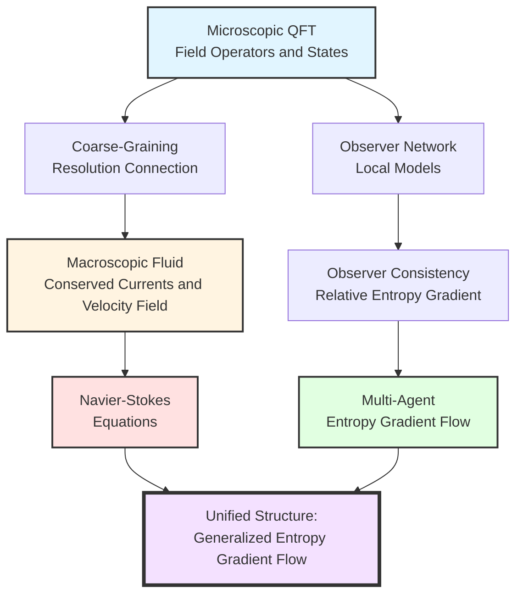
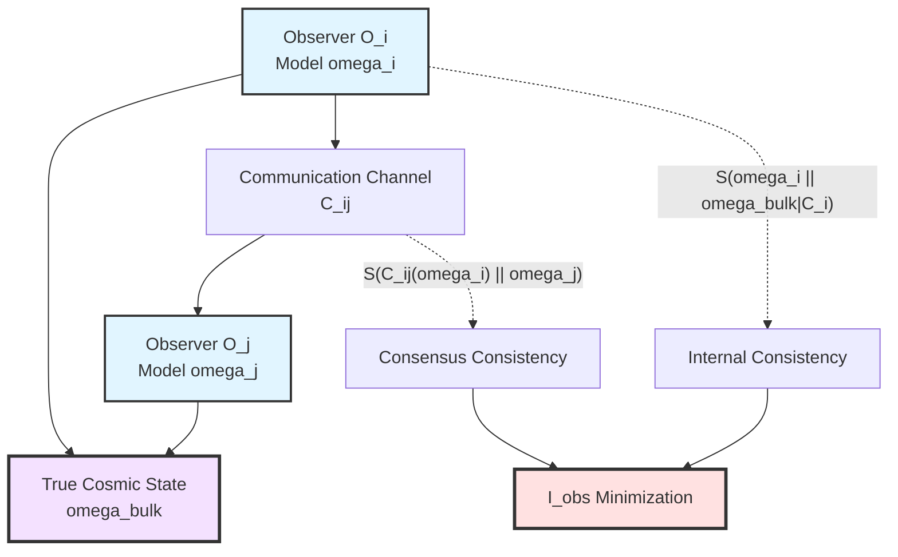
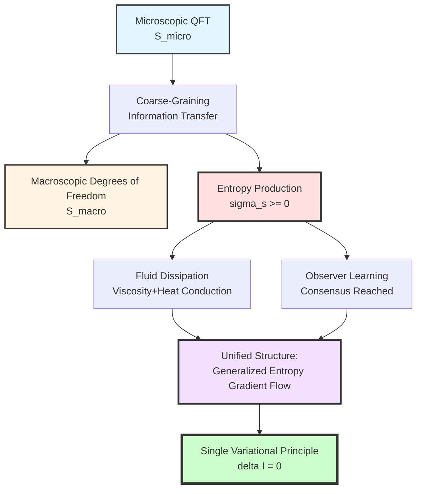
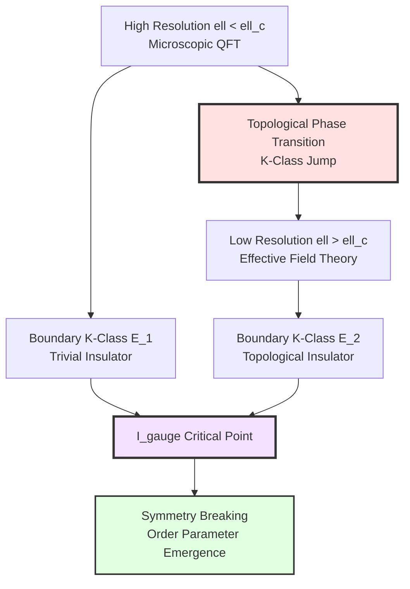
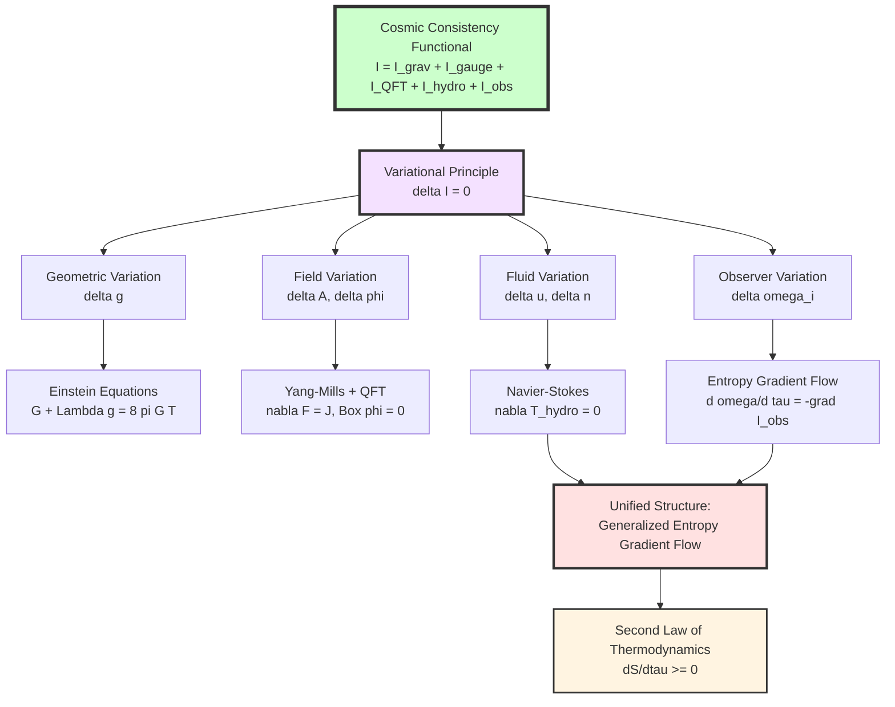

# Chapter 11 Section 5: Emergence of Matter Fields and Fluid Dynamics

> **"Microscopic quantum fluctuations and macroscopic fluid dynamics are essentially manifestations of the same entropy gradient flow at different resolutions."**

## Section Overview

In previous sections, we have derived from the single cosmic consistency variational principle $\delta\mathcal{I}[\mathfrak{U}]=0$:

- **Section 3**: Einstein field equations (emergence of gravity)
- **Section 4**: Yang-Mills equations and quantum field theory (emergence of gauge fields and QFT)

Now we come to the final key step: **cross-scale unification from microscopic field theory to macroscopic fluids**.

**Core Questions of This Section**:

1. How to transition from infinite degrees of freedom of quantum field theory to finite conserved currents of fluid dynamics?
2. Why are Navier-Stokes equations necessary consequences of consistency variational principle?
3. Why do multi-agent system dynamics share the same mathematical structure as fluid dynamics?
4. How do "dissipation" and "entropy production" gain ontological meaning under unified time scale?

---

## 1. From QFT to Fluid: Physical Meaning of Resolution

### 1.1 Necessity of "Cannot See Clearly"

Imagine observing a glass of water:

- **Quantum Scale** ($10^{-10}$ m): Wave function, quantum entanglement, virtual particle fluctuations of each water molecule
- **Statistical Scale** ($10^{-6}$ m): Collective motion of thousands of molecules, local temperature and density
- **Fluid Scale** ($10^{-3}$ m): Continuum medium, velocity field $u^\mu$ and pressure $p$

**Key Insight**: When we "coarse-grain" from quantum scale to macroscopic scale, we **do not lose information**, but **change the language describing information**.

**Analogy**: Like from pixel image to vector image, or from DNA sequence to species phenotype—information doesn't disappear, just **re-encoded** into coarser degrees of freedom.

### 1.2 Geometric Meaning of Resolution Connection $\Gamma_{\mathrm{res}}$

In GLS theory, this "coarse-graining" process is formalized as **resolution connection** $\Gamma_{\mathrm{res}}$:

$$
\Gamma_{\mathrm{res}}: \Lambda \times \mathcal{A}_{\mathrm{bulk}} \to \mathcal{V}_{\mathrm{macro}}
$$

where:
- $\Lambda$: Resolution levels (scale parameter space)
- $\mathcal{A}_{\mathrm{bulk}}$: Observable algebra of microscopic fields
- $\mathcal{V}_{\mathrm{macro}}$: Macroscopic variable space (e.g., velocity field, density field)

**Physical Interpretation**:

$\Gamma_{\mathrm{res}}$ tells us: Given resolution $\ell\in\Lambda$, how to construct macroscopic observable $O_{\mathrm{macro}}$ from microscopic operator $\hat{O}\in\mathcal{A}_{\mathrm{bulk}}$.

**Mathematical Form**:

$$
O_{\mathrm{macro}}(\ell) = \int_{|x-x'|<\ell} W(x-x';\ell)\,\langle\hat{O}(x')\rangle\,\mathrm{d}^d x'
$$

where $W(x;\ell)$ is window function at resolution $\ell$ (e.g., Gaussian window, rectangular window, etc.).

### 1.3 Unified Scale Formulation of Resolution Flow

Under unified time scale framework, resolution $\ell$ and frequency $\omega$ are related through uncertainty principle:

$$
\ell \sim \frac{1}{\omega},\quad
\Delta \ell \cdot \Delta \omega \sim 1
$$

Therefore, curvature $F_{\mathrm{res}}$ of resolution connection characterizes **obstacles to cross-scale information transfer**:

$$
F_{\mathrm{res}} = \mathrm{d}\Gamma_{\mathrm{res}} + \Gamma_{\mathrm{res}}\wedge\Gamma_{\mathrm{res}}
$$

**Physical Meaning**:
- $F_{\mathrm{res}}=0$: Perfect scale separation, macroscopic variables completely independent
- $F_{\mathrm{res}}\neq 0$: Cross-scale coupling, microscopic fluctuations affect macroscopic dynamics

This is exactly the **geometric origin of dissipation and noise**!

---

## 2. Fluid Dynamics Consistency Functional $\mathcal{I}_{\mathrm{hydro}}$

### 2.1 Necessity of Entropy Production

In coarse-graining process, information transfers from microscopic to macroscopic degrees of freedom, necessarily accompanied by **entropy production**.

**Unified Scale Formulation of Second Law**:

Under unified time scale $\tau$, generalized entropy of small causal diamond family $\{D_\tau\}$ satisfies:

$$
\frac{\mathrm{d} S_{\mathrm{gen}}(D_\tau)}{\mathrm{d}\tau} \geq 0
$$

But in coarse-grained description, we can only "see" entropy $S_{\mathrm{macro}}$ of macroscopic degrees of freedom, must add **entropy hidden in microscopic degrees of freedom** $S_{\mathrm{micro}}$:

$$
S_{\mathrm{gen}} = S_{\mathrm{macro}} + S_{\mathrm{micro}}
$$

**Entropy Production Rate**:

$$
\sigma_s := \frac{\mathrm{d} S_{\mathrm{micro}}}{\mathrm{d}\tau} \geq 0
$$

This is the **ontological source of dissipation** in fluid dynamics.

### 2.2 Specific Form of Fluid Consistency Functional

To write entropy production minimization principle in variational form, define:

$$
\mathcal{I}_{\mathrm{hydro}}
= \int_M
\biggl[
\zeta(\nabla_\mu u^\mu)^2
+\eta\,\sigma_{\mu\nu}\sigma^{\mu\nu}
+\sum_k D_k (\nabla_\mu n_k)^2
\biggr]\sqrt{|g|}\,\mathrm{d}^d x
$$

**Symbol Explanation**:
- $u^\mu$: **Four-velocity field** (velocity of macroscopic fluid element)
- $\nabla_\mu u^\mu$: **Expansion rate** (volume change rate)
- $\sigma_{\mu\nu} := \frac{1}{2}(\nabla_\mu u_\nu + \nabla_\nu u_\mu) - \frac{1}{d}\,g_{\mu\nu}\nabla_\rho u^\rho$: **Shear tensor**
- $n_k$: **Conserved charge density** (e.g., particle number density, charge density, etc.)
- $\zeta$: **Bulk viscosity**
- $\eta$: **Shear viscosity**
- $D_k$: **Diffusion coefficient**

**Physical Interpretation**:

Each term is some "gradient squared" form, corresponding to different dissipation mechanisms:

| Term | Physical Process | Entropy Production Mechanism |
|------|------------------|----------------------------|
| $\zeta(\nabla_\mu u^\mu)^2$ | Volume expansion/compression | Compression work converted to heat |
| $\eta\,\sigma_{\mu\nu}\sigma^{\mu\nu}$ | Shear deformation | Friction dissipation |
| $D_k(\nabla_\mu n_k)^2$ | Concentration/density gradient | Diffusion mixing |

**Mathematical Structure**:

$\mathcal{I}_{\mathrm{hydro}}$ is a **non-negative definite quadratic form**, defining a "dissipation metric" on macroscopic variable space.

### 2.3 Relationship with Resolution Connection

Viscosities $\zeta,\eta$ and diffusion coefficients $D_k$ are **not external parameters**, but determined by resolution connection $\Gamma_{\mathrm{res}}$:

$$
\eta = \int_0^\infty \langle T^{xy}(t) T^{xy}(0)\rangle\,\mathrm{d}t
$$

This is generalization of **Green-Kubo formula**, showing:

> Macroscopic transport coefficients originate from integrals of time correlation functions of microscopic stress-energy tensor under unified scale.

**Unified Scale Version**:

$$
\eta(\omega) = \int_\Lambda \rho_{\mathrm{rel}}(\omega')\,
\langle T^{\mu\nu}(\omega') T_{\mu\nu}(\omega-\omega')\rangle\,
\mathrm{d}\mu_\varphi(\omega')
$$

where $\rho_{\mathrm{rel}}(\omega)$ is relative density of states (unified time scale generating function), $\mathrm{d}\mu_\varphi$ is spectral shift measure.

---

## 3. Deriving Navier-Stokes Equations from Variational Principle

### 3.1 Variational Setup and Constraints

We now vary macroscopic variables $(u^\mu, n_k)$, but need to maintain:

1. **Local Conservation**:
   $$
   \nabla_\mu T^{\mu\nu}_{\mathrm{hydro}} = 0,\quad
   \nabla_\mu J^\mu_k = 0
   $$

2. **Unified Scale Consistency**: Coarse-grained macroscopic evolution still proceeds under same unified time scale $\tau$

3. **Causality**: Information propagation speed does not exceed speed of light

Variational problem:

$$
\delta\left(\mathcal{I}_{\mathrm{grav}} + \mathcal{I}_{\mathrm{hydro}}\right) = 0
$$

Vary $(u^\mu, n_k, g_{\mu\nu})$ under conservation constraints.

### 3.2 Variation of Velocity Field $u^\mu$

Fix geometry $g_{\mu\nu}$ and density $n_k$, vary $u^\mu$:

$$
\delta_u \mathcal{I}_{\mathrm{hydro}}
= \int_M \sqrt{|g|}\,
\biggl[
2\zeta(\nabla_\mu u^\mu)\nabla_\nu(\delta u^\nu)
+2\eta\,\sigma_{\mu\nu}\nabla_\rho(\delta u^\rho)
\biggr]\mathrm{d}^dx
$$

Integrating by parts and using boundary terms vanish (or periodic boundary conditions), get:

$$
-2\nabla_\mu\bigl(\zeta(\nabla_\rho u^\rho)g^{\mu\nu}\bigr)
-2\nabla_\mu\bigl(\eta\sigma^{\mu\nu}\bigr)
= 0
$$

### 3.3 Coupling Conservation Laws: Navier-Stokes Equations

Combining above variational condition with energy-momentum conservation $\nabla_\mu T^{\mu\nu}=0$, get **generalized Navier-Stokes equations**:

$$
\boxed{
\nabla_\mu T^{\mu\nu}_{\mathrm{hydro}} = 0
}
$$

where stress-energy tensor is:

$$
T^{\mu\nu}_{\mathrm{hydro}}
= T^{\mu\nu}_{\mathrm{ideal}}
+ T^{\mu\nu}_{\mathrm{diss}}
$$

**Ideal Fluid Part**:

$$
T^{\mu\nu}_{\mathrm{ideal}}
= (\rho + p)u^\mu u^\nu + p\,g^{\mu\nu}
$$

**Dissipative Part**:

$$
T^{\mu\nu}_{\mathrm{diss}}
= -\zeta(\nabla_\rho u^\rho)g^{\mu\nu}
-\eta\sigma^{\mu\nu}
$$

**Standard Navier-Stokes Equations**:

In non-relativistic limit ($c\to\infty$) and flat space ($g_{\mu\nu}=\eta_{\mu\nu}$), taking $u^\mu = (1,\mathbf{v}/c)$, get:

$$
\boxed{
\rho\left(\frac{\partial \mathbf{v}}{\partial t}
+(\mathbf{v}\cdot\nabla)\mathbf{v}\right)
= -\nabla p
+\eta\nabla^2\mathbf{v}
+\left(\zeta+\frac{\eta}{3}\right)\nabla(\nabla\cdot\mathbf{v})
}
$$

**Physical Interpretation**:

| Term | Physical Meaning | Source |
|------|------------------|--------|
| $\rho\frac{\partial\mathbf{v}}{\partial t}$ | Inertia | Time evolution |
| $\rho(\mathbf{v}\cdot\nabla)\mathbf{v}$ | Convective acceleration | Nonlinear interaction |
| $-\nabla p$ | Pressure gradient force | Ideal fluid |
| $\eta\nabla^2\mathbf{v}$ | Viscous dissipation | Shear term of $\mathcal{I}_{\mathrm{hydro}}$ |
| $(\zeta+\eta/3)\nabla(\nabla\cdot\mathbf{v})$ | Bulk viscosity | Expansion term of $\mathcal{I}_{\mathrm{hydro}}$ |

### 3.4 Emergence of Diffusion Equation

Similar variation for conserved charge density $n_k$:

$$
\delta_{n_k}\mathcal{I}_{\mathrm{hydro}}
= \int_M \sqrt{|g|}\,2D_k(\nabla_\mu n_k)\nabla_\nu(\delta n_k)\,\mathrm{d}^dx
$$

After integration by parts, combining with $\nabla_\mu J^\mu_k=0$, get **diffusion equation**:

$$
\boxed{
\frac{\partial n_k}{\partial \tau}
= D_k \nabla^2 n_k
- u^\mu\nabla_\mu n_k
}
$$

This is **convection-diffusion equation**, describing propagation and mixing of conserved quantities in fluid.

---

## 4. Entropy Production Rate and Onsager Reciprocal Relations

### 4.1 Explicit Expression of Entropy Production Rate

Relating $\mathcal{I}_{\mathrm{hydro}}$ with entropy production rate under unified scale:

$$
\sigma_s
= \frac{1}{T}\,\mathcal{I}_{\mathrm{hydro}}
$$

where $T$ is local temperature.

**Expanded Form**:

$$
\sigma_s
= \frac{\zeta}{T}(\nabla_\mu u^\mu)^2
+\frac{\eta}{T}\sigma_{\mu\nu}\sigma^{\mu\nu}
+\sum_k \frac{D_k}{T}(\nabla_\mu n_k)^2
\geq 0
$$

**Physical Meaning**:

Each term is product of "thermodynamic force" (e.g., $\nabla_\mu u^\mu$) and "thermodynamic flow" (e.g., dissipative stress).

### 4.2 Geometric Origin of Onsager Reciprocal Relations

In linear response theory, relationship between thermodynamic flow $J^i$ and thermodynamic force $X_j$ is:

$$
J^i = \sum_j L^{ij} X_j
$$

where $L^{ij}$ is **Onsager coefficient matrix**.

**Onsager Reciprocal Relations**:

$$
L^{ij} = L^{ji}
$$

**GLS Theory Explanation**:

From variational derivation of $\mathcal{I}_{\mathrm{hydro}}$, entropy production rate can be written as:

$$
\sigma_s
= \sum_{i,j} L^{ij} X_i X_j
$$

where $L^{ij}$ automatically satisfies $L^{ij}=L^{ji}$ from symmetry of quadratic form.

**Deep Reason**:

> Onsager reciprocal relations are not "coincidence," but necessary symmetry of $\mathcal{I}_{\mathrm{hydro}}$ as quadratic form.

---

## 5. Multi-Agent Systems: Entropy Gradient Flow of Observer Network

### 5.1 Observer Consistency Functional $\mathcal{I}_{\mathrm{obs}}$

Recall consistency functional of observer network $\{O_i\}$:

$$
\mathcal{I}_{\mathrm{obs}}
= \sum_i S(\omega_i \Vert \omega_{\mathrm{bulk}}|_{C_i})
+ \sum_{(i,j)} S(\mathcal{C}_{ij*}(\omega_i) \Vert \omega_j)
$$

**Symbol Explanation**:
- $\omega_i$: Internal model (belief state) of observer $O_i$
- $\omega_{\mathrm{bulk}}|_{C_i}$: Restriction of true cosmic state to causal domain $C_i$ of $O_i$
- $\mathcal{C}_{ij}$: Communication channel from $O_i$ to $O_j$
- $S(\rho\Vert\sigma)$: Relative entropy (Kullback-Leibler divergence)

**Physical Interpretation**:
- **First term**: Penalizes deviation of observer's internal model from objective reality
- **Second term**: Penalizes inconsistency between observers after communication

### 5.2 Variation of Observer State $\omega_i$

Fix communication structure $\{\mathcal{C}_{ij}\}$ and true state $\omega_{\mathrm{bulk}}$, vary each observer's model $\omega_i$:

$$
\delta_{\omega_i}\mathcal{I}_{\mathrm{obs}}
= \delta S(\omega_i\Vert\omega_{\mathrm{bulk}}|_{C_i})
+ \sum_j \delta S(\mathcal{C}_{ij*}(\omega_i)\Vert\omega_j)
$$

Using variational formula of relative entropy:

$$
\delta S(\rho\Vert\sigma)
= \int \log\frac{\mathrm{d}\rho}{\mathrm{d}\sigma}\,\delta\rho
$$

We get:

$$
\delta_{\omega_i}\mathcal{I}_{\mathrm{obs}}
= \int \left[
\log\frac{\omega_i}{\omega_{\mathrm{bulk}}|_{C_i}}
+\sum_j \log\frac{\mathcal{C}_{ij*}(\omega_i)}{\omega_j}
\right]\delta\omega_i
$$

### 5.3 Entropy Gradient Flow Dynamics

Requiring $\delta\mathcal{I}_{\mathrm{obs}}=0$, evolving under unified time scale $\tau$ gives **gradient flow equation**:

$$
\boxed{
\frac{\partial \omega_i}{\partial \tau}
= -\mathrm{grad}_{\mathsf{G}}\mathcal{I}_{\mathrm{obs}}(\omega_i)
}
$$

where $\mathsf{G}$ is information-geometric metric (Fisher-Rao metric).

**Explicit Form**:

In parameter space $\{\theta_i\}$, gradient flow is:

$$
\frac{\mathrm{d}\theta_i^a}{\mathrm{d}\tau}
= -\mathsf{G}^{ab}\frac{\partial \mathcal{I}_{\mathrm{obs}}}{\partial \theta_i^b}
$$

This is exactly **natural gradient descent** or **mirror descent**!

### 5.4 Connection with Multi-Agent Learning

**Analogy**:

Imagine a group of blind people exploring a room:

- Each builds internal map ($\omega_i$) based on touch
- True room layout is $\omega_{\mathrm{bulk}}$
- They can communicate ($\mathcal{C}_{ij}$)

Minimization of $\mathcal{I}_{\mathrm{obs}}$ means:

1. Each person's map becomes closer to true layout
2. All people's maps become consistent with each other

**Mathematical Correspondence**:

| Concept | Multi-Agent Learning | GLS Observer Theory |
|---------|---------------------|---------------------|
| Agent internal model | Strategy/belief distribution | Observer state $\omega_i$ |
| Environment true state | Markov decision process | Cosmic state $\omega_{\mathrm{bulk}}$ |
| Communication topology | Network structure | Causal domains and channels $\mathcal{C}_{ij}$ |
| Learning dynamics | Policy gradient/Q-learning | Entropy gradient flow |
| Convergence condition | Nash equilibrium | $\delta\mathcal{I}_{\mathrm{obs}}=0$ |

---

## 6. Unified Structure of Fluid and Observer: Generalized Entropy Gradient Flow

### 6.1 Unified Mathematical Framework

Surprisingly, **fluid dynamics** and **multi-agent dynamics** are mathematically the same structure:

**Fluid**:

$$
\frac{\partial \rho_{\mathrm{fluid}}}{\partial \tau}
= -\mathrm{grad}_{\mathsf{G}_{\mathrm{Wasserstein}}}\mathcal{I}_{\mathrm{hydro}}(\rho_{\mathrm{fluid}})
$$

**Observer**:

$$
\frac{\partial \rho_{\mathrm{obs}}}{\partial \tau}
= -\mathrm{grad}_{\mathsf{G}_{\mathrm{Fisher}}}\mathcal{I}_{\mathrm{obs}}(\rho_{\mathrm{obs}})
$$

Both are **gradient flows on probability distribution space**, just different metrics:
- **Wasserstein metric** ($\mathsf{G}_{\mathrm{Wasserstein}}$): Optimal transport distance, suitable for mass distributions on physical space
- **Fisher-Rao metric** ($\mathsf{G}_{\mathrm{Fisher}}$): Information-geometric metric, suitable for probability distributions on parameter space

### 6.2 Generalized Entropy $\mathsf{S}$ and Lyapunov Functional

Both systems have a **Lyapunov functional** (monotonically decreasing "potential function"):

$$
\frac{\mathrm{d}\mathsf{S}}{\mathrm{d}\tau} \leq 0
$$

**Fluid**:

$$
\mathsf{S}_{\mathrm{hydro}}[\rho]
= -\int \rho\log\rho\,\mathrm{d}^dx
+ \frac{1}{T}\int \left[
\frac{1}{2}\rho|\mathbf{v}|^2
+\rho U(\rho)
\right]\mathrm{d}^dx
$$

**Observer**:

$$
\mathsf{S}_{\mathrm{obs}}[\{\omega_i\}]
= -\sum_i S(\omega_i)
+ \sum_i S(\omega_i\Vert\omega_{\mathrm{bulk}}|_{C_i})
$$

**Physical Meaning**:

> Whether macroscopic fluid evolution or observer network learning, both "roll downhill" along gradient direction of some generalized entropy under unified time scale, eventually reaching equilibrium.

### 6.3 Ontological Meaning of Dissipation

In traditional physics, "dissipation" is viewed as "non-fundamental, phenomenological." But in GLS theory:

> **Dissipation is necessary accompaniment of coarse-grained description, originating from transfer of microscopic information to macroscopic degrees of freedom.**

**Dissipation Law Under Unified Scale**:

$$
\boxed{
\frac{\mathrm{d}S_{\mathrm{gen}}}{\mathrm{d}\tau}
= \frac{\mathrm{d}S_{\mathrm{macro}}}{\mathrm{d}\tau}
+ \underbrace{\frac{\mathrm{d}S_{\mathrm{micro}}}{\mathrm{d}\tau}}_{\sigma_s \geq 0}
\geq 0
}
$$

where $\sigma_s$ is exactly entropy production rate given by $\mathcal{I}_{\mathrm{hydro}}$ or $\mathcal{I}_{\mathrm{obs}}$.

---

## 7. Concrete Example: Complete Derivation Chain from QFT to Navier-Stokes

### 7.1 Starting Point: Scalar Field Quantum Field Theory

Consider simple scalar field $\phi(x)$, satisfying Klein-Gordon equation:

$$
(\Box + m^2)\phi(x) = 0
$$

At finite temperature $T$, system in thermal equilibrium state $\omega_\beta$, expectation value of stress-energy tensor is:

$$
\langle T_{\mu\nu}\rangle_\beta
= \langle\partial_\mu\phi\partial_\nu\phi\rangle_\beta
- \frac{1}{2}g_{\mu\nu}\langle\partial_\rho\phi\partial^\rho\phi + m^2\phi^2\rangle_\beta
$$

### 7.2 Step 1: Coarse-Graining to Fluid Variables

Introduce window function $W(x;\ell)$, define coarse-grained energy density:

$$
\rho(x;\ell)
:= \int W(x-x';\ell)\,\langle T_{00}(x')\rangle_\beta\,\mathrm{d}^3 x'
$$

Coarse-grained momentum density:

$$
\rho u^i(x;\ell)
:= \int W(x-x';\ell)\,\langle T_{0i}(x')\rangle_\beta\,\mathrm{d}^3 x'
$$

### 7.3 Step 2: Deriving Ideal Fluid Equations

If $\ell$ is larger than correlation length but smaller than macroscopic scale, under local thermal equilibrium approximation:

$$
\langle T_{\mu\nu}\rangle_\beta(x;\ell)
\approx (\rho(x) + p(x))u_\mu(x)u_\nu(x) + p(x)g_{\mu\nu}
$$

where pressure $p$ given by equation of state:

$$
p = \frac{1}{3}\langle T^i_i\rangle_\beta
= \frac{T^4}{90}\int_0^\infty \frac{k^2\,\mathrm{d}k}{\sqrt{k^2+m^2}}\,
\frac{1}{e^{\sqrt{k^2+m^2}/T}-1}
$$

Conservation law $\nabla_\mu T^{\mu\nu}=0$ becomes **Euler equations** (ideal fluid):

$$
\partial_\mu[(\rho+p)u^\mu u^\nu] + g^{\nu\rho}\partial_\rho p = 0
$$

### 7.4 Step 3: Including Dissipative Terms

When considering **non-equilibrium fluctuations**, stress tensor has additional contribution:

$$
\langle T_{\mu\nu}\rangle
= \langle T_{\mu\nu}\rangle_{\mathrm{eq}}
+ \langle T_{\mu\nu}\rangle_{\mathrm{neq}}
$$

Non-equilibrium part related to $\mathcal{I}_{\mathrm{hydro}}$ through Kubo formula:

$$
\langle T^{ij}_{\mathrm{neq}}\rangle
= -\eta\sigma^{ij}
-\zeta(\nabla_k u^k)\delta^{ij}
$$

Substituting into conservation law, get **Navier-Stokes equations**.

### 7.5 Step 4: Entropy Production and Irreversibility

In coarse-graining process, microscopic phase space volume $\Omega_{\mathrm{micro}}$ decreases as scale $\ell$ increases:

$$
S_{\mathrm{micro}}(\ell)
= \log\Omega_{\mathrm{micro}}(\ell)
$$

Entropy production rate is:

$$
\sigma_s
= -\frac{\mathrm{d}S_{\mathrm{micro}}}{\mathrm{d}\ell}\,\frac{\mathrm{d}\ell}{\mathrm{d}\tau}
$$

This exactly equals $\mathcal{I}_{\mathrm{hydro}}/T$!

**Complete Derivation Chain Summary**:

```mermaid
graph LR
    A["Klein-Gordon QFT<br/>Box + m^2 phi = 0"] --> B["Thermal Equilibrium State<br/>T_munu_beta"]
    B --> C["Coarse-Graining<br/>Window Function W(x;ell)"]
    C --> D["Local Thermal Equilibrium<br/>rho, u^mu, p"]
    D --> E["Euler Equations<br/>nabla T_ideal = 0"]
    E --> F["Non-Equilibrium Fluctuations<br/>Kubo Formula"]
    F --> G["Navier-Stokes<br/>nabla T_hydro = 0"]
    G --> H["Entropy Production<br/>sigma_s >= 0"]

    style A fill:#e1f5ff,stroke:#333,stroke-width:2px
    style D fill:#fff4e1,stroke:#333,stroke-width:2px
    style G fill:#ffe1e1,stroke:#333,stroke-width:3px
    style H fill:#f4e1ff,stroke:#333,stroke-width:3px
```

---

## 8. Concrete Example of Observer Network: Distributed Sensor Network

### 8.1 Problem Setup

Consider $N$ sensors $\{O_1,\dots,O_N\}$ distributed in space, each sensor:

- Measures local field value $\phi_i = \phi(x_i) + \epsilon_i$ (with noise)
- Maintains internal estimate $\hat{\phi}_i$
- Communicates with neighbor sensors

**Goal**: Through distributed algorithm, make all sensors reach consistent estimate of global field $\phi(x)$.

### 8.2 Observer Consistency Functional

Let true field be $\phi_{\mathrm{true}}(x)$, internal model of sensor $O_i$ be $\hat{\phi}_i(x)$.

Define relative entropy:

$$
S(\hat{\phi}_i \Vert \phi_{\mathrm{true}}|_{C_i})
= \int_{C_i} |\hat{\phi}_i(x) - \phi_{\mathrm{true}}(x)|^2\,\mathrm{d}^3x
$$

where $C_i$ is sensing domain of sensor $O_i$.

Total consistency functional:

$$
\mathcal{I}_{\mathrm{obs}}
= \sum_i \int_{C_i} |\hat{\phi}_i - \phi_{\mathrm{true}}|^2
+ \lambda\sum_{(i,j)\in E} |\hat{\phi}_i - \hat{\phi}_j|^2_{C_i\cap C_j}
$$

where $E$ is edge set of communication network, $\lambda$ is communication weight.

### 8.3 Gradient Flow Update Algorithm

Gradient descent on $\hat{\phi}_i$:

$$
\frac{\partial \hat{\phi}_i}{\partial \tau}
= -\frac{\delta\mathcal{I}_{\mathrm{obs}}}{\delta\hat{\phi}_i}
$$

Computing variational derivative:

$$
\frac{\delta\mathcal{I}_{\mathrm{obs}}}{\delta\hat{\phi}_i}
= 2(\hat{\phi}_i - y_i)
+ 2\lambda\sum_{j\sim i}(\hat{\phi}_i - \hat{\phi}_j)
$$

where $y_i$ is measurement value of sensor $O_i$, $j\sim i$ means $j$ is neighbor of $i$.

**Update Rule**:

$$
\boxed{
\hat{\phi}_i(\tau+\Delta\tau)
= \hat{\phi}_i(\tau)
- \alpha\left[
(\hat{\phi}_i - y_i)
+ \lambda\sum_{j\sim i}(\hat{\phi}_i - \hat{\phi}_j)
\right]
}
$$

This is exactly **distributed Kalman filtering** or **consensus algorithm**!

### 8.4 Convergence Analysis

Define global Lyapunov function:

$$
V(\tau) := \mathcal{I}_{\mathrm{obs}}[\{\hat{\phi}_i(\tau)\}]
$$

Gradient flow guarantees:

$$
\frac{\mathrm{d}V}{\mathrm{d}\tau}
= -\sum_i \left|\frac{\partial\hat{\phi}_i}{\partial\tau}\right|^2
\leq 0
$$

Therefore $V(\tau)$ monotonically decreases, system converges to critical point of $\delta\mathcal{I}_{\mathrm{obs}}=0$.

**Physical Interpretation**:

> Consensus reaching of distributed sensor network is essentially evolution of observer network along gradient direction of $\mathcal{I}_{\mathrm{obs}}$ under unified time scale.

---

## 9. Emergence of Statistical Mechanics and Thermodynamics

### 9.1 Equilibrium State as Critical Point of Consistency Functional

Consider isolated system (no external observers), total consistency functional simplifies to:

$$
\mathcal{I}_{\mathrm{total}}
= \mathcal{I}_{\mathrm{grav}}
+ \mathcal{I}_{\mathrm{QFT}}
+ \mathcal{I}_{\mathrm{hydro}}
$$

Under fixed energy $E$ and volume $V$ constraints, require $\delta\mathcal{I}_{\mathrm{total}}=0$.

**Lemma**: Critical points of $\mathcal{I}_{\mathrm{total}}$ correspond to **maximum entropy principle**:

$$
S_{\mathrm{gen}} = \max_{\rho} S(\rho)
\quad\text{subject to}\quad
\langle H\rangle_\rho = E,\quad
\mathrm{Vol}(\mathrm{supp}(\rho)) = V
$$

**Proof Outline**:

In $\mathcal{I}_{\mathrm{hydro}}$, when system reaches equilibrium, all gradients vanish:

$$
\nabla_\mu u^\mu = 0,\quad
\sigma_{\mu\nu} = 0,\quad
\nabla_\mu n_k = 0
$$

Therefore $\mathcal{I}_{\mathrm{hydro}} = 0$, remaining extremum condition of $\mathcal{I}_{\mathrm{grav}}+\mathcal{I}_{\mathrm{QFT}}$ equivalent to maximum of generalized entropy.

### 9.2 Ontological Status of Second Law of Thermodynamics

Under unified time scale $\tau$, generalized entropy satisfies:

$$
\frac{\mathrm{d}S_{\mathrm{gen}}}{\mathrm{d}\tau}
= \sigma_s
= \frac{1}{T}\mathcal{I}_{\mathrm{hydro}}
\geq 0
$$

**Physical Meaning**:

> Second law of thermodynamics is not an independent "law," but necessary corollary of cosmic consistency variational principle $\delta\mathcal{I}=0$ under coarse-grained description.

**Deep Insight**:

Essence of "entropy increase" is: when we shift from microscopic to macroscopic description, **information flows from observable to unobservable degrees of freedom**.

### 9.3 Geometric Meaning of Temperature

In consistency functional framework, temperature $T$ is no longer "external thermodynamic parameter," but emerges from geometric structure:

$$
\frac{1}{T}
= \frac{\partial S_{\mathrm{gen}}}{\partial E}\bigg|_{V,N}
$$

Under unified time scale, this is equivalent to:

$$
\frac{1}{T}
= \frac{\partial}{\partial E}
\left[
\frac{A(\partial D)}{4G\hbar}
+ S_{\mathrm{bulk}}(D)
\right]
$$

**Analogy**:

Temperature is like "information pressure"—it measures system's ability to "accommodate" new information at given energy. Higher temperature, more "relaxed" the system, can absorb more energy with smaller entropy increase.

---

## 10. From Fluid to Solid: Unified Description of Topological Phase Transitions

### 10.1 Emergence of Solid

When resolution $\ell$ decreases to critical value $\ell_c$, shear modulus $\eta$ of fluid diverges:

$$
\eta(\ell) \sim (\ell - \ell_c)^{-\nu}
$$

At this point, system transitions from "fluid phase" to "solid phase".

**Physical Interpretation**:

In solid, coarse-grained degrees of freedom are no longer velocity field $u^\mu$, but **displacement field** $u^i(x)$:

$$
u^i(x) := x^i - x^i_0
$$

where $x^i_0$ is equilibrium position.

### 10.2 Emergence of Elasticity Theory

Varying displacement field, consistency functional $\mathcal{I}_{\mathrm{solid}}$ becomes:

$$
\mathcal{I}_{\mathrm{solid}}
= \int_M
\left[
\mu\,\epsilon_{ij}\epsilon^{ij}
+ \frac{\lambda}{2}(\epsilon^i_i)^2
\right]\mathrm{d}^3x
$$

where strain tensor:

$$
\epsilon_{ij}
:= \frac{1}{2}(\partial_i u_j + \partial_j u_i)
$$

Lamé coefficients $\lambda,\mu$ determined by values of resolution connection $\Gamma_{\mathrm{res}}$ in solid phase.

**Variational condition** $\delta\mathcal{I}_{\mathrm{solid}}=0$ derives **elastic wave equation**:

$$
\rho\frac{\partial^2 u^i}{\partial t^2}
= \mu\nabla^2 u^i
+ (\lambda+\mu)\nabla_i(\nabla\cdot\mathbf{u})
$$

### 10.3 Topological Phase Transitions and Symmetry Breaking

In some systems (e.g., topological insulators), boundary K-class $[E]$ undergoes **jump** during coarse-graining:

$$
[E]_{\ell>\ell_c} \neq [E]_{\ell<\ell_c}
$$

This corresponds to **topological phase transition**.

**GLS Theory Explanation**:

> Topological phase transitions are mutations of stable equivalence classes of channel bundle at different resolution levels, originating from change in critical point structure of $\mathcal{I}_{\mathrm{gauge}}$.

---

## 11. Deep Philosophical Reflection: Nature of Emergence

### 11.1 "Emergence" is Not Mysterious Phenomenon

Traditional physics often says "fluid dynamics emerges from molecular dynamics," "consciousness emerges from neural networks," but lacks rigorous definition.

**GLS Theory Definition**:

> **Emergence** means: In coarse-graining (resolution reduction) process, expression form of consistency variational principle $\delta\mathcal{I}=0$ on different degree of freedom spaces undergoes qualitative change, leading to new effective degrees of freedom and new effective dynamics.

**Mathematical Characterization**:

Emergence corresponds to a **fiber bundle projection**:

$$
\pi: \mathcal{V}_{\mathrm{micro}} \to \mathcal{V}_{\mathrm{macro}}
$$

such that:

$$
\mathcal{I}_{\mathrm{macro}}[\pi(\mathbf{v})]
\approx \min_{\mathbf{v}\in\pi^{-1}(\mathbf{V})} \mathcal{I}_{\mathrm{micro}}[\mathbf{v}]
$$

where $\mathbf{v}\in\mathcal{V}_{\mathrm{micro}}$ is microscopic configuration, $\mathbf{V}\in\mathcal{V}_{\mathrm{macro}}$ is macroscopic configuration.

### 11.2 Unification of Reductionism and Emergentism

**Reductionism**: All macroscopic phenomena can in principle be derived from microscopic laws.

**Emergentism**: Macroscopic phenomena have their own laws, cannot be completely reduced.

**GLS Theory Position**:

> Both are correct, but describe different aspects of the same thing:
> - **Reduction**: Both microscopic and macroscopic obey same $\delta\mathcal{I}=0$, just different degrees of freedom
> - **Emergence**: Form of macroscopic effective theory qualitatively different from microscopic theory, cannot simply "substitute"

**Analogy**:

Like a 3D object and its 2D projection:

- **Reduction**: Projection contains partial information of original object
- **Emergence**: Projection has its own geometric properties (e.g., area), cannot be directly "read" from 3D geometry

### 11.3 "Free Will" and Observer Dynamics

In multi-agent framework, each observer $O_i$'s "decision" is result of $\mathcal{I}_{\mathrm{obs}}$ gradient flow:

$$
\frac{\mathrm{d}\omega_i}{\mathrm{d}\tau}
= -\mathrm{grad}\mathcal{I}_{\mathrm{obs}}
$$

Does this mean "no free will"?

**GLS Theory Answer**:

> "Free will" and "determinism" are not contradictory:
> - **Objective level**: Observer state follows necessary evolution of $\delta\mathcal{I}=0$
> - **Subjective level**: Observer internally doesn't know global form of $\mathcal{I}_{\mathrm{obs}}$, can only "explore" gradient direction
>
> Free will is subjective experience of observer under **incomplete information**, does not violate objective consistency principle.

**Analogy**:

Like a person groping downhill in thick fog:

- Objectively, he descends along potential gradient (physical law)
- Subjectively, each step is "free choice" (because cannot see global terrain)

---

## 12. Section Summary

### 12.1 Main Results

We have proven: From single cosmic consistency variational principle $\delta\mathcal{I}[\mathfrak{U}]=0$, can derive:

1. **Navier-Stokes Equations**:
   $$
   \nabla_\mu T^{\mu\nu}_{\mathrm{hydro}} = 0,\quad
   T^{\mu\nu}_{\mathrm{hydro}}
   = T^{\mu\nu}_{\mathrm{ideal}}
   - \zeta(\nabla_\rho u^\rho)g^{\mu\nu}
   - \eta\sigma^{\mu\nu}
   $$

2. **Diffusion Equation**:
   $$
   \frac{\partial n_k}{\partial\tau}
   = D_k\nabla^2 n_k
   - u^\mu\nabla_\mu n_k
   $$

3. **Multi-Agent Entropy Gradient Flow**:
   $$
   \frac{\partial\omega_i}{\partial\tau}
   = -\mathrm{grad}_{\mathsf{G}}\mathcal{I}_{\mathrm{obs}}
   $$

4. **Unified Entropy Production Law**:
   $$
   \frac{\mathrm{d}S_{\mathrm{gen}}}{\mathrm{d}\tau}
   = \sigma_s
   = \frac{1}{T}\mathcal{I}_{\mathrm{hydro}}
   \geq 0
   $$

### 12.2 Unified Structure Diagram

### 12.3 Core Insights

**Three Key Realizations**:

1. **Fluid dynamics is not assumption, but necessity**:
   > As long as coarse-graining is performed, consistency variational principle $\delta\mathcal{I}=0$ necessarily derives form of conservation laws + dissipative terms, i.e., Navier-Stokes equations.

2. **Dissipation and entropy increase are not "additional laws"**:
   > Dissipation originates from gradient flow structure of $\mathcal{I}_{\mathrm{hydro}}$, entropy increase is necessary accompaniment of coarse-graining under unified time scale.

3. **Material world and intelligent world share same mathematics**:
   > Evolution of fluid and learning of multi-agents are both gradient flows of probability distributions under different metrics, behind which is the same consistency principle.

### 12.4 Correspondence with Physical Laws

| Traditional Physical Law | Status in GLS Theory | Source |
|-------------------------|----------------------|--------|
| **Navier-Stokes Equations** | Euler-Lagrange equations of $\delta\mathcal{I}_{\mathrm{hydro}}=0$ under coarse-graining limit | Variation of $\mathcal{I}_{\mathrm{hydro}}$ w.r.t. $(u^\mu,n_k)$ |
| **Diffusion Equation** | Gradient flow of conserved currents under resolution connection | Variation of $\mathcal{I}_{\mathrm{hydro}}$ w.r.t. $n_k$ |
| **Second Law of Thermodynamics** | Monotonicity of generalized entropy under unified scale | $\mathrm{d}S_{\mathrm{gen}}/\mathrm{d}\tau = \sigma_s\geq 0$ |
| **Onsager Reciprocal Relations** | Symmetry of quadratic form of entropy production functional | Symmetric structure of $\mathcal{I}_{\mathrm{hydro}}$ |
| **Green-Kubo Formula** | Connection between transport coefficients and correlation functions under unified scale | $\eta = \int\rho_{\mathrm{rel}}(\omega)\langle TT\rangle\,\mathrm{d}\mu_\varphi$ |
| **Distributed Learning Algorithms** | Entropy gradient flow of observer network | Variation of $\mathcal{I}_{\mathrm{obs}}$ w.r.t. $\{\omega_i\}$ |

---

## 13. Popular Summary: "Waterfall" of Physical Laws

Imagine universe as a river flowing from mountaintop to plain:

- **Mountaintop**: Microscopic quantum field theory, infinite degrees of freedom, completely reversible
- **Mountainside**: Mesoscopic scale, coarse-graining begins, effective interactions appear
- **Foot of mountain**: Macroscopic fluid, finite degrees of freedom, clearly irreversible

**Traditional Physics**: Write independent "laws" at each height (QFT, statistical mechanics, fluid dynamics), then try to prove they are "compatible".

**GLS Theory**: Only one principle "water flows downhill"—$\delta\mathcal{I}[\mathfrak{U}]=0$. Forms of river at different heights (turbulence, waterfall, gentle) are all natural consequences of this principle.

**Key Insight**:

> Physical laws are not "list of rules nature obeys," but necessary manifestations of cosmic consistency at different resolution levels. From microscopic to macroscopic, from reversible to irreversible, from deterministic to random, all are different river segments of the same river.

---

## 14. Next Section Preview

In this section, we completed unified derivation from microscopic QFT to macroscopic fluid and multi-agent dynamics, demonstrating how $\mathcal{I}_{\mathrm{hydro}}$ and $\mathcal{I}_{\mathrm{obs}}$ give dissipative dynamics and entropy gradient flow.

**Next Section** (Section 6: Summary and Completion of Physical Unification), we will:

1. **Review entire derivation chain**: How from single principle $\delta\mathcal{I}[\mathfrak{U}]=0$, expand at five levels into all physical laws
2. **Clarify deep meaning of unification**: Why this is "true unification," not just "mathematical game"
3. **Discuss testable predictions**: Corrections and new predictions of GLS theory to existing physics
4. **Look forward to future directions**: Unified picture of quantum gravity, cosmology, consciousness theory, etc.

We are about to complete ultimate unification of physical laws—all "laws of forces," "matter equations," "evolution rules" will be revealed as **different aspects of the same cosmic consistency variational principle**.

---

**Core Formula Review of This Section**:

$$
\boxed{
\begin{aligned}
&\text{Fluid Consistency Functional:}\quad
\mathcal{I}_{\mathrm{hydro}}
= \int \left[\zeta(\nabla\cdot\mathbf{u})^2
+\eta\sigma_{ij}\sigma^{ij}
+\sum_k D_k|\nabla n_k|^2\right]\mathrm{d}V
\\[10pt]
&\text{Navier-Stokes Equations:}\quad
\nabla_\mu T^{\mu\nu}_{\mathrm{hydro}} = 0,\quad
T^{\mu\nu}
= (\rho+p)u^\mu u^\nu + pg^{\mu\nu}
-\zeta(\nabla\cdot\mathbf{u})g^{\mu\nu}
-\eta\sigma^{\mu\nu}
\\[10pt]
&\text{Observer Consistency Functional:}\quad
\mathcal{I}_{\mathrm{obs}}
= \sum_i S(\omega_i\Vert\omega_{\mathrm{bulk}}|_{C_i})
+ \sum_{ij}S(\mathcal{C}_{ij*}(\omega_i)\Vert\omega_j)
\\[10pt]
&\text{Entropy Gradient Flow:}\quad
\frac{\mathrm{d}\omega_i}{\mathrm{d}\tau}
= -\mathrm{grad}_{\mathsf{G}}\mathcal{I}_{\mathrm{obs}}
\\[10pt]
&\text{Unified Entropy Production Law:}\quad
\frac{\mathrm{d}S_{\mathrm{gen}}}{\mathrm{d}\tau}
= \frac{1}{T}\mathcal{I}_{\mathrm{hydro}}
\geq 0
\end{aligned}
}
$$

**See you in the next section! We will complete the final piece of the puzzle of physical unification.**

