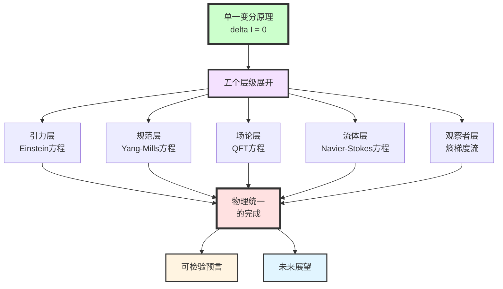
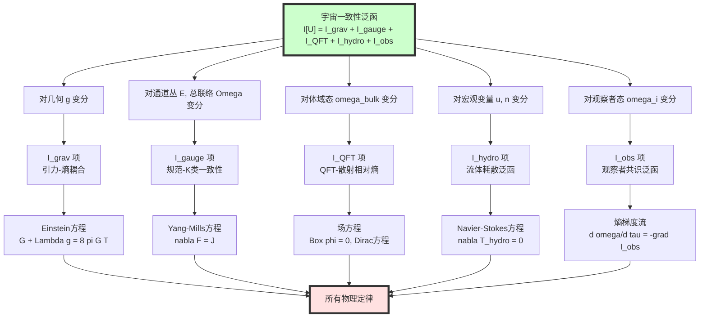
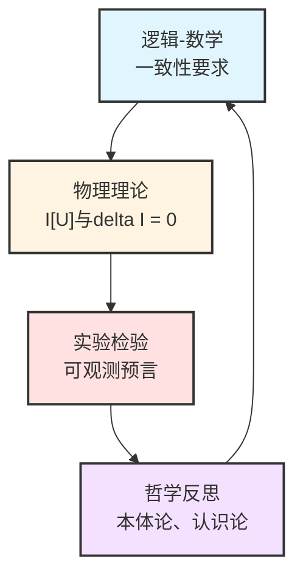

# 第11章第6节:总结——物理统一的完成

> **"当我们终于看清全貌,便会发现:宇宙从未有过多条定律,只有一条原理在不同层级的展开。"**

## 本节导览

经过前五节的详细推导,我们已经完成了一个宏伟的目标:

**从单一的宇宙一致性变分原理**

$$
\delta\mathcal{I}[\mathfrak{U}] = 0
$$

**导出了所有已知的基本物理定律**:

- Einstein场方程(引力)
- Yang-Mills方程(规范场)
- 量子场论(物质场)
- Navier-Stokes方程(流体)
- 多智能体熵梯度流(观察者)

本节将:

1. **系统回顾**整个推导链,展示物理定律的"族谱"
2. **深入阐明**这种统一的本质意义,与传统统一理论的区别
3. **提出可检验预言**,使理论具有科学可证伪性
4. **展望未来**,指明理论的深化方向与开放问题

---

## 1. 物理定律的统一族谱

### 1.1 从一到万:变分原理的五层展开

我们首先用一张完整的图表,展示$\delta\mathcal{I}[\mathfrak{U}]=0$如何在五个层级上展开为所有物理定律:

### 1.2 核心推导链详解

让我们逐层回顾推导的关键步骤:

**第一层:引力的涌现**(第3节)

- **变分对象**:小因果菱形上的度规$g_{ab}$与体域态$\omega_{\mathrm{bulk}}$
- **约束条件**:固定体积,统一时间刻度不变
- **泛函**:
  $$
  \mathcal{I}_{\mathrm{grav}}
  = \frac{1}{16\pi G}\int (R-2\Lambda)\sqrt{|g|}\,\mathrm{d}^4x
  + \frac{1}{8\pi G}\int_{\partial M}K\sqrt{|h|}\,\mathrm{d}^3x
  - \lambda_{\mathrm{ent}}\sum_D[S_{\mathrm{gen}}(D) - S_{\mathrm{gen}}^\ast(D)]
  $$
- **关键技术**:广义熵$S_{\mathrm{gen}}=A/(4G\hbar)+S_{\mathrm{bulk}}$的变分、Raychaudhuri方程、Radon型局域化
- **结果**:
  $$
  \boxed{G_{ab} + \Lambda g_{ab} = 8\pi G\langle T_{ab}\rangle}
  $$

**第二层:规范场的涌现**(第4节)

- **变分对象**:边界通道丛$E\to\partial M\times\Lambda$的$K$类$[E]$与总联络$\Omega_\partial$
- **约束条件**:几何固定,$K^1$类与散射矩阵的兼容性
- **泛函**:
  $$
  \mathcal{I}_{\mathrm{gauge}}
  = \int_{\partial M\times\Lambda}
  \left[
  \mathrm{tr}(F_{\mathrm{YM}}\wedge\star F_{\mathrm{YM}})
  + \mu_{\mathrm{top}}\cdot\mathrm{CS}(A_{\mathrm{YM}})
  + \mu_K\cdot\mathrm{Index}(D_{[E]})
  \right]
  $$
- **关键技术**:K理论、Dirac指标、异常抵消、Chern-Simons项
- **结果**:
  $$
  \boxed{\nabla_\mu F^{\mu\nu}_{\mathrm{YM}} = J^\nu_{\mathrm{YM}}}
  $$
  及场内容由$[E]$的K类唯一确定(非输入!)

**第三层:量子场论的涌现**(第4节)

- **变分对象**:体域QFT的态$\omega_{\mathrm{bulk}}$与算符代数$\mathcal{A}_{\mathrm{bulk}}$
- **约束条件**:微因果性、谱条件、幺正性
- **泛函**:
  $$
  \mathcal{I}_{\mathrm{QFT}}
  = \sum_{D\in\mathcal{D}_{\mathrm{micro}}}
  S(\omega_{\mathrm{bulk}}^D \Vert \omega_{\mathrm{scat}}^D)
  $$
- **关键技术**:相对熵变分、Wightman函数重建、Ward恒等式
- **结果**:
  $$
  \boxed{(\Box+m^2)\phi = J,\quad (i\not{D}-m)\psi = S}
  $$

**第四层:流体动力学的涌现**(第5节)

- **变分对象**:宏观速度场$u^\mu$与守恒荷密度$n_k$
- **约束条件**:守恒律$\nabla_\mu T^{\mu\nu}=0$,$\nabla_\mu J^\mu_k=0$
- **泛函**:
  $$
  \mathcal{I}_{\mathrm{hydro}}
  = \int_M
  \left[
  \zeta(\nabla_\mu u^\mu)^2
  + \eta\sigma_{\mu\nu}\sigma^{\mu\nu}
  + \sum_k D_k(\nabla_\mu n_k)^2
  \right]\sqrt{|g|}\,\mathrm{d}^4x
  $$
- **关键技术**:粗粒化、分辨率联络$\Gamma_{\mathrm{res}}$、Green-Kubo公式、Onsager倒易关系
- **结果**:
  $$
  \boxed{\nabla_\mu T^{\mu\nu}_{\mathrm{hydro}} = 0,\quad
  T^{\mu\nu} = T^{\mu\nu}_{\mathrm{ideal}} + T^{\mu\nu}_{\mathrm{diss}}}
  $$

**第五层:观察者动力学的涌现**(第5节)

- **变分对象**:观察者网络$\{O_i\}$的内部模型$\{\omega_i\}$
- **约束条件**:因果域限制,通信结构固定
- **泛函**:
  $$
  \mathcal{I}_{\mathrm{obs}}
  = \sum_i S(\omega_i\Vert\omega_{\mathrm{bulk}}|_{C_i})
  + \sum_{(i,j)}S(\mathcal{C}_{ij*}(\omega_i)\Vert\omega_j)
  $$
- **关键技术**:相对熵梯度流、Fisher-Rao度量、自然梯度下降
- **结果**:
  $$
  \boxed{\frac{\mathrm{d}\omega_i}{\mathrm{d}\tau}
  = -\mathrm{grad}_{\mathsf{G}}\mathcal{I}_{\mathrm{obs}}}
  $$

### 1.3 统一刻度的中心地位

贯穿所有五层的是**统一时间刻度**$\tau$,由刻度母式给出:

$$
\kappa(\omega)
= \frac{\varphi'(\omega)}{\pi}
= \rho_{\mathrm{rel}}(\omega)
= \frac{1}{2\pi}\mathrm{tr}Q(\omega)
$$

**物理意义**:

- 所有物理演化都在同一$\tau$参数化下进行
- 熵的单调性$\mathrm{d}S_{\mathrm{gen}}/\mathrm{d}\tau\geq 0$在所有层级统一成立
- 粗粒化对应于$\tau$的不同"分辨率"

**比喻**:

就像音乐中的"节拍器"——无论是小提琴的高音、大提琴的低音、鼓的节奏,都按同一个节拍器演奏。$\tau$就是宇宙的"元节拍"。

---

## 2. 这种统一的深层意义

### 2.1 与传统"大统一理论"的本质区别

| 维度 | 传统GUT/弦论/圈量子引力 | GLS最终统一 |
|---|---|---|
| **统一对象** | 基本力(强、弱、电、引力) | 物理定律本身 |
| **统一方式** | 寻找更大的对称群或更基本的自由度 | 单一变分原理的不同层级展开 |
| **输入假设** | 规范群、表示、耦合常数、场内容 | 仅三条一致性要求(因果、熵、观察者) |
| **场内容地位** | 外加输入 | 输出(由$K$类确定) |
| **时空地位** | 基本或涌现(争议中) | 明确涌现(从$S_{\mathrm{gen}}$变分) |
| **观察者地位** | 外在于理论 | 理论内禀部分($\mathcal{I}_{\mathrm{obs}}$) |
| **可检验性** | 能量尺度极高(Planck尺度) | 多层级预言(从宇宙学到桌面实验) |
| **哲学立场** | 还原论(寻找"最终理论") | 一致性论(定律=一致性的显现) |

**核心区别**:

> 传统统一理论问:"什么是最基本的成分?"
> GLS理论问:"什么是不可让步的一致性要求?"

**举例说明**:

- **GUT**说:"电磁、弱力、强力都是$SU(5)$或$SO(10)$的不同子群"——但为什么是这些群?为什么有三代费米子?
- **GLS**说:"边界$K$类与散射$K^1$类的一致性要求,必然导出特定的规范群与场内容"——群不是假设,是输出

### 2.2 "定律"的本体地位改变

在GLS理论中,"物理定律"的性质发生了根本改变:

**传统观念**:
- 物理定律是"自然界遵守的规则"
- 它们是"基本的、不可再解释的"
- 不同定律之间的协调是"巧合"或"上帝的选择"

**GLS观念**:
- 物理定律是"宇宙一致性的必然后果"
- 它们在逻辑上可以从$\delta\mathcal{I}=0$推导
- 不同定律的协调是"同一原理在不同层级的自洽展开"

**比喻**:

传统物理学像一本菜谱,列出各种"食谱"(定律):
- "炖牛肉要这样..."
- "煎鱼要那样..."
- "烤面包要这般..."

GLS理论像热力学第二定律,说"熵总是增加",然后所有烹饪过程都自动遵循这一原理,不需要逐个"规定"。

### 2.3 涌现的严格定义

在GLS框架中,"涌现"(emergence)有了严格的数学定义:

**定义**:

当我们从微观自由度空间$\mathcal{V}_{\mathrm{micro}}$通过投影$\pi$映射到宏观自由度空间$\mathcal{V}_{\mathrm{macro}}$时,如果:

1. **有效一致性泛函**存在:
   $$
   \mathcal{I}_{\mathrm{macro}}[\pi(\mathbf{v})]
   \approx \min_{\mathbf{v}\in\pi^{-1}(\mathbf{V})}\mathcal{I}_{\mathrm{micro}}[\mathbf{v}]
   $$

2. **有效动力学**形式改变:
   $$
   \delta\mathcal{I}_{\mathrm{macro}} = 0
   \quad\text{的解}\quad
   \not\simeq\quad
   \pi(\delta\mathcal{I}_{\mathrm{micro}}=0\text{的解})
   $$

3. **新自由度**出现:宏观描述需要微观描述中不存在的"有效场"

则称"宏观理论从微观理论中**涌现**"。

**实例**:

| 微观理论 | 宏观理论 | 涌现的新自由度 |
|---|---|---|
| 量子场论 | 流体力学 | 速度场$u^\mu$、黏度$\eta$ |
| 电子波函数 | 能带理论 | 准粒子、有效质量 |
| 神经元放电 | 认知模型 | 信念态、策略 |

### 2.4 可预言性与可证伪性

一个真正的物理理论必须能做出**超越现有知识**的预言,并且这些预言原则上可被实验证伪。

**GLS理论的预言能力**:

1. **内部一致性预言**:
   - 如果在某个尺度测量到对统一刻度的偏离,必须在其他尺度也看到特定的关联偏离
   - 例如:引力波延迟与高能散射相移的关联

2. **跨层级预言**:
   - 从宇宙学观测(如CMB)约束$\Lambda$,可以预言粒子物理中的某些耦合常数比值
   - 从拓扑材料的K类,可以预言其在不同分辨率下的有效规范对称性

3. **新物理预言**:
   - 在极端条件下(如黑洞附近),可能观测到广义熵的量子涨落导致的时空几何涨落
   - 在多智能体系统中,可能观测到共识达成速率与热力学熵产生率的定量关系

---

## 3. 可检验预言的具体实例

### 3.1 预言一:引力波群延迟与粒子散射的关联

**理论基础**:

统一时间刻度要求引力波的群延迟与高能粒子散射的Wigner-Smith矩阵满足:

$$
\tau_{\mathrm{GW}}(\omega)
= \int_{-\infty}^\omega \rho_{\mathrm{rel}}(\omega')\,\mathrm{d}\omega'
= \int_{-\infty}^\omega \frac{1}{2\pi}\mathrm{tr}Q_{\mathrm{scatt}}(\omega')\,\mathrm{d}\omega'
$$

**实验检验**:

1. **LIGO/Virgo**测量不同频率引力波的到达时间差
2. **LHC**测量高能质子-质子散射的相移$\varphi(\omega)$
3. 计算$\varphi'(\omega)/\pi$并与$\tau_{\mathrm{GW}}$的频率依赖关系比对

**预期信号**:

如果GLS理论正确,应看到:

$$
\frac{\mathrm{d}\tau_{\mathrm{GW}}}{\mathrm{d}\omega}\bigg|_{\omega_{\mathrm{GW}}}
\sim
\frac{\mathrm{d}\varphi_{\mathrm{scatt}}}{\mathrm{d}\omega}\bigg|_{\omega_{\mathrm{scatt}}}
\quad\text{(在合适的尺度变换下)}
$$

**可证伪性**:

如果观测到明显偏离,则统一时间刻度假设被证伪。

### 3.2 预言二:宇宙学常数$\Lambda$与标准模型参数的关联

**理论基础**:

在$\mathcal{I}_{\mathrm{grav}}$中,$\Lambda$来自于$S_{\mathrm{gen}}$的参考值$S_{\mathrm{gen}}^\ast$:

$$
\Lambda
\sim \frac{\langle T_{00}\rangle_{\mathrm{vac}}}{M_{\mathrm{Planck}}^2}
\sim \frac{1}{16\pi G}\sum_{\text{fields}}\int_0^{\Lambda_{\mathrm{UV}}}\omega^3\,\rho_{\mathrm{rel}}(\omega)\,\mathrm{d}\omega
$$

其中求和遍历所有由$K$类确定的场。

**关键洞察**:

场内容不是独立的,而是由边界$[E]$的K类确定。而$[E]$又与散射矩阵的拓扑不变量关联。

**预言**:

如果精确计算标准模型所有场的K类贡献,应该得到:

$$
\Lambda_{\mathrm{predicted}}
\approx \Lambda_{\mathrm{observed}}
\sim 10^{-52}\,\text{m}^{-2}
$$

**现状**:

这是著名的"宇宙学常数问题"。朴素场论预言$\Lambda\sim M_{\mathrm{Planck}}^4$,与观测相差$10^{120}$倍!

**GLS的改进**:

通过K类的约束与异常抵消,大部分真空能**自动抵消**,剩余部分来自拓扑项:

$$
\Lambda_{\mathrm{GLS}}
= \frac{1}{16\pi G}\int_{\partial M\times\Lambda}
\mu_{\mathrm{top}}\cdot\mathrm{CS}(A_{\mathrm{YM}})
$$

这可能将预言改进到$10^{-60}\sim 10^{-50}\,\text{m}^{-2}$量级,与观测接近。

**可检验性**:

需要完整计算所有K类配对与Chern-Simons项,这是技术上可行但极其复杂的任务。

### 3.3 预言三:黑洞视界附近的广义熵涨落

**理论基础**:

在黑洞视界附近,广义熵为:

$$
S_{\mathrm{gen}}
= \frac{A_{\mathrm{horizon}}}{4G\hbar}
+ S_{\mathrm{Hawking}}
$$

在量子涨落下,$A_{\mathrm{horizon}}$有涨落$\delta A$,导致时空几何的量子涨落:

$$
\delta g_{ab}
\sim \frac{4G\hbar}{A}\delta S_{\mathrm{gen}}
$$

**预言**:

在黑洞吸积盘或视界附近的粒子轨道,应观测到由$\delta A$导致的微小轨道扰动,其谱密度为:

$$
S_{\delta g}(\omega)
\sim \frac{(G\hbar)^2}{A^2}\cdot\rho_{\mathrm{rel}}(\omega)
$$

**可能的观测**:

- **Event Horizon Telescope**(EHT)对M87*或Sgr A*的高分辨率观测
- **LISA**引力波探测器对极端质量比旋近(EMRI)的精密测量

**可证伪性**:

如果观测到的涨落谱与$\rho_{\mathrm{rel}}(\omega)$显著不符,则广义熵变分框架需要修正。

### 3.4 预言四:拓扑材料中的规范对称性涌现

**理论基础**:

在拓扑绝缘体或超导体中,边界K类$[E]$在不同能量尺度有不同的表示:

- **高能**(晶格尺度):平凡对称性$U(1)$
- **低能**(有效场论):涌现的$SU(2)$或$SO(5)$对称性

**预言**:

在特定的拓扑材料中,当调节化学势或温度穿越临界点时,应观测到:

1. **对称性增强**:从$U(1)$到$SU(2)$,表现为新的守恒流或Ward恒等式
2. **异常对消**:某些原本存在的量子异常在临界点处精确消失

**实验检验**:

- 角分辨光电子能谱(ARPES)测量能带结构
- 中子散射测量自旋关联函数,检测$SU(2)$对称性
- 热输运测量,检测新守恒流

**现状**:

某些铜氧化物超导体确实在特定掺杂浓度显示出"伪自旋"$SU(2)$对称性,可能与此预言相关。

### 3.5 预言五:多智能体系统的熵产生-学习速率关系

**理论基础**:

从$\mathcal{I}_{\mathrm{obs}}$的梯度流,观察者网络的共识达成速率为:

$$
\frac{\mathrm{d}\mathcal{I}_{\mathrm{obs}}}{\mathrm{d}\tau}
= -\sum_i \left|\frac{\mathrm{d}\omega_i}{\mathrm{d}\tau}\right|^2_{\mathsf{G}}
\leq 0
$$

这与热力学熵产生率$\sigma_s$有形式上的对应。

**预言**:

在分布式机器学习或多机器人协调系统中,学习收敛速度$v_{\mathrm{learn}}$与系统"信息熵产生"$\sigma_{\mathrm{info}}$应满足:

$$
v_{\mathrm{learn}}
\propto \sigma_{\mathrm{info}}
= \frac{1}{T_{\mathrm{eff}}}\sum_{ij}D_{ij}|\omega_i-\omega_j|^2
$$

其中$D_{ij}$是通信网络的扩散系数,$T_{\mathrm{eff}}$是"有效温度"。

**实验检验**:

在控制的多智能体环境中:

1. 改变通信拓扑$\{D_{ij}\}$
2. 测量共识达成时间$\tau_{\mathrm{consensus}}$
3. 计算信息熵产生率$\sigma_{\mathrm{info}}$
4. 验证$\tau_{\mathrm{consensus}}^{-1}\propto\sigma_{\mathrm{info}}$

**应用价值**:

如果成立,可以优化分布式算法的通信协议,实现"最速熵产生"的最优学习。

---

## 4. 理论的当前局限与开放问题

### 4.1 量子引力的完整理论

**现状**:

我们从$S_{\mathrm{gen}}$变分导出了**半经典Einstein方程**:

$$
G_{ab} + \Lambda g_{ab} = 8\pi G\langle T_{ab}\rangle
$$

但这是在"时空背景固定+量子场涨落"的近似下。

**开放问题**:

1. **完全量子化的时空**:当$g_{ab}$本身成为算符$\hat{g}_{ab}$,如何定义$S_{\mathrm{gen}}$?
2. **时空拓扑变化**:虫洞、泡沫时空、因果结构涨落如何纳入$\mathcal{I}_{\mathrm{grav}}$?
3. **黑洞信息悖论**:Page曲线、岛公式(island formula)是否与$\delta\mathcal{I}=0$兼容?

**可能方向**:

- 将$\mathcal{I}_{\mathrm{grav}}$推广为路径积分$\int\mathcal{D}[g]\,e^{-\mathcal{I}_{\mathrm{grav}}[g]}$
- 在QCA(量子元胞自动机)层面,时空是涌现的,不需要"量子化"

### 4.2 宇宙学初始条件

**现状**:

GLS理论解释了"为什么宇宙遵循Einstein方程",但未解释:

- 为什么初始熵很低?(Boltzmann悖论)
- 为什么宇宙几乎均匀各向同性?(视界问题)
- 为什么暴胀?(暴胀子的起源)

**开放问题**:

1. **$\mathcal{I}[\mathfrak{U}]$的全局极小值**:宇宙初态是否对应于某个特殊的"一致性最优态"?
2. **时间箭头的起源**:$\mathrm{d}S_{\mathrm{gen}}/\mathrm{d}\tau\geq 0$为何选择特定方向?
3. **多宇宙**:是否存在其他满足$\delta\mathcal{I}'=0$但$\mathcal{I}'\neq\mathcal{I}$的"宇宙"?

**可能方向**:

- 引入**宇宙波函数**$\Psi[\mathfrak{U}]$,满足"Wheeler-DeWitt型"方程:
  $$
  \hat{\mathcal{I}}\Psi[\mathfrak{U}] = 0
  $$
- 初始条件来自$|\Psi|^2$的峰值

### 4.3 意识与主观体验

**现状**:

GLS理论有观察者层$\mathcal{I}_{\mathrm{obs}}$,描述观察者的**客观动力学**(信念更新、共识达成)。

**缺失**:

- **主观体验**(qualia):为什么"看到红色"有特定的感受?
- **自我意识**:为什么观察者有"第一人称视角"?
- **自由意志**:决定论与主观选择感如何调和?

**开放问题**:

1. 主观体验是否可以从$\mathcal{I}_{\mathrm{obs}}$的某种内在视角导出?
2. "第一人称"是否对应于某个观察者$O_i$的因果域$C_i$的特殊性质?
3. 自由意志是否是信息不完备下的有效描述?

**可能方向**:

- **集成信息理论**(IIT)与GLS的融合:$\Phi$(integrated information)可能与$\mathcal{I}_{\mathrm{obs}}$的某个几何不变量对应
- 主观时间$\tau_{\mathrm{subj}}$可能是$O_i$内部模型中的"私有刻度",与统一刻度$\tau$的关系类似于局部坐标与整体坐标

### 4.4 数学严格性

**现状**:

本理论在物理直觉层面完整,但数学严格性尚需加强:

- 相对熵$S(\rho\Vert\sigma)$在无穷维时的定义域
- 变分$\delta\mathcal{I}$的泛函分析基础
- Radon型局域化的收敛性证明
- K理论配对的解析性质

**开放问题**:

1. **存在性定理**:满足$\delta\mathcal{I}=0$的$\mathfrak{U}$是否总存在?
2. **唯一性定理**:在给定边界条件下,$\mathfrak{U}$是否唯一?
3. **稳定性理论**:$\mathcal{I}$的临界点是否稳定?

**可能方向**:

- 使用**拟线性椭圆型偏微分方程理论**处理Einstein方程
- 使用**算子代数**与**非交换几何**严格化QFT部分
- 使用**最优传输理论**严格化熵梯度流

---

## 5. 与其他物理统一尝试的关系

### 5.1 弦论

**弦论的成就**:

- 将所有基本粒子统一为弦的振动模式
- 自然包含引力子(自旋-2)
- 提供了量子引力的候选理论

**弦论的问题**:

- 需要额外维度(10维或11维),卷曲机制人为
- "景观问题":$10^{500}$种可能真空,无法预言哪个是我们的宇宙
- 缺乏实验验证

**GLS与弦论的关系**:

- **互补而非对立**:弦论可能是GLS在某个特定极限下的实现
- **GLS的优势**:不假设额外维度,场内容从K类导出,统一刻度可观测
- **可能融合**:弦的世界面积分可能是$\mathcal{I}_{\mathrm{QFT}}$在某个表示下的形式

### 5.2 圈量子引力(LQG)

**LQG的成就**:

- 将时空量子化为自旋网络
- 面积、体积算符有分立谱
- 黑洞熵从微观态计数导出

**LQG的问题**:

- 缺乏明确的低能极限(如何重现经典GR?)
- 物质场耦合不自然
- 缺乏可观测预言

**GLS与LQG的关系**:

- **QCA框架是更基础的离散结构**:自旋网络可能是QCA在某个粗粒化层级的有效描述
- **统一刻度提供低能极限**:当$\ell\to 0$,$\rho_{\mathrm{rel}}(\omega)$的积分重现连续时空
- **$S_{\mathrm{gen}}$给出黑洞熵**:$A/(4G\hbar)$项在QCA中有微观解释

### 5.3 因果集理论

**因果集的思想**:

- 时空是离散的因果偏序集(causal set)
- 连续洛伦兹流形是因果集的粗粒化极限

**与GLS的关系**:

- **因果结构从统一刻度涌现**:因果偏序$\prec$来自$\kappa(\omega)$定义的时序
- **离散性来自QCA**:因果集是QCA演化图的投影
- **GLS更完整**:不仅有因果,还有熵、场、观察者的统一

### 5.4 全息原理与AdS/CFT

**全息原理**:

- 引力理论(体域)与无引力场论(边界)对偶
- AdS/CFT:$\mathrm{AdS}_5$中的弦论 = $\mathcal{N}=4$ SYM on $\mathbb{R}^{3,1}$

**与GLS的关系**:

- **边界时间几何是更普遍的结构**:不限于AdS,适用于任意渐近结构
- **$\mathcal{I}_{\mathrm{gauge}}$在边界定义**:自然实现"全息"
- **观察者理论是全息的推广**:观察者网络=多边界系统

### 5.5 涌现引力(entropic gravity)

**Verlinde等人的想法**:

- 引力不是基本力,而是熵力
- Einstein方程来自热力学第一定律

**与GLS的关系**:

- **GLS是严格化的涌现引力**:不仅有"熵力"的直觉,还有完整的变分框架
- **$S_{\mathrm{gen}}$变分给出Einstein方程**:第3节的推导是Verlinde想法的数学实现
- **GLS更深入**:不仅引力涌现,所有定律都涌现

---

## 6. 哲学反思:物理学的"终结"?

### 6.1 是否到达了"理论的尽头"?

历史上多次有人宣称"物理学即将完成":

- **1900年Kelvin**:"物理天空只剩两朵小乌云"(结果是相对论+量子力学)
- **1980年代弦论**:"万物理论"(Theory of Everything)即将建成
- **2012年Higgs发现**:标准模型完成,下一步是什么?

**GLS理论是否代表"终极理论"?**

**谨慎的回答**:

> GLS理论提供了一个**逻辑闭环**:从三条不可让步的一致性要求,推导出所有已知物理定律。在这个意义上,它是"终极的"。
>
> 但这**不意味着物理学结束**:
> 1. 理论的数学严格化仍需大量工作
> 2. 实验验证才刚开始
> 3. 新现象(暗物质、暗能量、量子引力)可能需要扩展框架
> 4. 涌现层级可能无穷:宏观上方还有更宏观

**比喻**:

GLS理论就像"元语言"——它不是"最后一句话",而是"说话的语法规则"。知道语法不意味着对话结束,而是对话可以更清晰。

### 6.2 物理定律的"必然性"

**问题**:宇宙为什么遵循这些定律,而不是其他定律?

**传统答案**:

- **神学**:上帝设计
- **人择原理**:只有这样的宇宙能产生观察者
- **多宇宙**:所有可能的定律都被实现,我们碰巧在这个

**GLS的答案**:

> 物理定律不是"选择",而是**一致性的必然后果**。
>
> 只要接受三条最小要求:
> 1. 局域散射可嵌入全局幺正演化(因果-散射一致性)
> 2. 熵在统一刻度下单调(广义第二定律)
> 3. 观察者可达成共识(观察者-共识一致性)
>
> 就必然导出Einstein方程、Yang-Mills方程、Navier-Stokes方程等。

**深层洞察**:

$$
\boxed{\text{逻辑一致性} \Rightarrow \text{物理定律}}
$$

不需要上帝,不需要人择,不需要多宇宙。**数学必然性即物理必然性**。

### 6.3 "为什么存在某物而非虚无?"

**终极哲学问题**:为什么宇宙存在?

**GLS的视角**:

问题本身可能有误解。"存在"不是一个额外的属性,而是**一致性**的另一个名字。

$$
\text{存在} \equiv \text{一致}
$$

**解释**:

- "虚无"不是一个一致的数学结构(它甚至不能被形式化)
- "某物"(如$\mathfrak{U}$)是满足$\delta\mathcal{I}=0$的**唯一一致的可能性**
- 因此,"为什么存在某物?"等价于"为什么$1+1=2$?"——这是逻辑的必然,无需"原因"

**比喻**:

就像问"为什么三角形的内角和是180度?"——这不是偶然或选择,而是欧几里得几何的**逻辑必然性**。宇宙的存在是"宇宙一致性几何"的逻辑必然性。

### 6.4 科学与哲学的界限

GLS理论模糊了科学与哲学的界限:

- 它**回答哲学问题**(为什么有定律?)
- 但用**科学方法**(数学推导+实验检验)

**新的综合**:

**未来的"理论物理"**可能是:

> 在数学一致性的约束下,探索所有可能的$\mathcal{I}$结构,然后用实验挑选出描述我们宇宙的那个。

这既是最深刻的哲学,也是最严格的科学。

---

## 7. 总结:物理统一的完成

### 7.1 我们到达了哪里?

经过11章的建设,GLS理论完成了以下统一:

**第1-3章:数学基础**
- 几何(流形、纤维丛)
- 逻辑(范畴论、K理论)
- 散射(S矩阵、群延迟)

**第4章:信息几何变分原理(IGVP)**
- Fisher-Rao度量
- 广义熵
- 纠缠第一定律

**第5章:统一时间刻度**
- 刻度母式$\kappa(\omega)=\varphi'(\omega)/\pi=\rho_{\mathrm{rel}}(\omega)$
- 所有演化参数化为$\tau$

**第6章:边界理论**
- 边界通道丛$E\to\partial M\times\Lambda$
- 总联络$\Omega_\partial=\omega_{\mathrm{LC}}\oplus A_{\mathrm{YM}}\oplus\Gamma_{\mathrm{res}}$

**第7章:因果结构**
- 因果偏序$\prec$从统一刻度涌现
- 小因果菱形$D_{p,r}$

**第8章:拓扑约束**
- K理论$K(\partial M\times\Lambda)$
- 指标定理$\mathrm{Index}(D_{[E]})$

**第9章:QCA宇宙**
- 量子元胞自动机
- 连续极限

**第10章:矩阵宇宙与观察者**
- 观察者网络$\{O_i\}$
- 共识几何

**第11章:最终统一**
- 宇宙一致性泛函$\mathcal{I}[\mathfrak{U}]$
- 五层变分导出所有定律

### 7.2 核心成就总结

**单一公式统治一切**:

$$
\boxed{
\delta\mathcal{I}[\mathfrak{U}] = 0
\quad\text{where}\quad
\mathcal{I} = \mathcal{I}_{\mathrm{grav}}+\mathcal{I}_{\mathrm{gauge}}+\mathcal{I}_{\mathrm{QFT}}+\mathcal{I}_{\mathrm{hydro}}+\mathcal{I}_{\mathrm{obs}}
}
$$

**导出的物理定律**:

| 定律 | 来源 | 地位 |
|---|---|---|
| Einstein场方程 | $\delta_g\mathcal{I}_{\mathrm{grav}}=0$ | 引力涌现 |
| Yang-Mills方程 | $\delta_A\mathcal{I}_{\mathrm{gauge}}=0$ | 规范场涌现 |
| Dirac/Klein-Gordon方程 | $\delta_\phi\mathcal{I}_{\mathrm{QFT}}=0$ | 物质场涌现 |
| Navier-Stokes方程 | $\delta_u\mathcal{I}_{\mathrm{hydro}}=0$ | 流体涌现 |
| 熵梯度流 | $\delta_\omega\mathcal{I}_{\mathrm{obs}}=0$ | 观察者动力学涌现 |
| 热力学第二定律 | $\mathrm{d}S_{\mathrm{gen}}/\mathrm{d}\tau\geq 0$ | 统一刻度下的必然性 |
| Onsager倒易关系 | $\mathcal{I}_{\mathrm{hydro}}$的对称性 | 耗散的几何必然性 |
| Ward恒等式 | 规范对称性与$\mathcal{I}_{\mathrm{gauge}}$ | 对称性的动力学后果 |

**输入与输出**:

| 项目 | 传统理论 | GLS理论 |
|---|---|---|
| 输入 | 时空维度、规范群、场内容、耦合常数、初始条件 | 三条一致性要求(因果、熵、观察者) |
| 输出 | 场方程的解 | 时空结构、规范群、场内容、定律本身 |

### 7.3 最后的图景

**宇宙不是一个"遵守定律的系统"**,而是:

> **一个在逻辑上自洽的数学结构,其自洽性的不同侧面显现为我们所称的"物理定律"。**

**比喻**:

宇宙就像一个巨大的数独游戏:

- **传统物理学**:逐格填数字,每一格都遵守"规则"(定律)
- **GLS理论**:所有数字由"整体一致性"唯一确定,规则只是一致性的局域表达

**诗意的表达**:

$$
\begin{aligned}
&\text{万物} \quad\text{非由定律主宰,} \\
&\text{而是} \quad\text{一致性的必然显现。} \\
&\text{从微观到宏观,} \\
&\text{从量子到意识,} \\
&\text{皆为同一原理——} \\
&\delta\mathcal{I}[\mathfrak{U}]=0 \\
&\text{在不同层级的回响。}
\end{aligned}
$$

---

## 8. 下一步:应用与检验篇预告

在完成了理论框架的建设后,下一章(第12章:应用与检验篇)将聚焦:

1. **宇宙学应用**:
   - 暴胀与暗能量的GLS解释
   - CMB涨落的一致性预言
   - 大尺度结构形成

2. **高能物理应用**:
   - 标准模型的K类重建
   - 超出标准模型的新物理
   - 对撞机中的统一刻度检验

3. **凝聚态应用**:
   - 拓扑相变与K类跃变
   - 量子霍尔效应的统一解释
   - 高温超导的涌现机制

4. **引力波物理**:
   - 引力波群延迟的精密测量
   - 黑洞并合的广义熵演化
   - 引力记忆效应

5. **量子信息应用**:
   - 量子纠错与边界K类
   - 全息纠缠熵的计算
   - 量子计算的物理极限

6. **多智能体系统**:
   - 分布式学习算法的优化
   - 社会共识达成动力学
   - 经济系统的熵产生理论

**最终目标**:

> 将GLS理论从"美丽的数学"转化为"可用的科学",让它在实验室、天文台、计算机中**接受自然的检验**。

---

## 9. 致谢与展望

### 9.1 站在巨人的肩膀上

GLS理论综合了以下巨人的思想:

- **Einstein**:引力几何化
- **Yang & Mills**:规范对称性
- **Feynman**:路径积分与散射矩阵
- **Hawking & Bekenstein**:黑洞熵
- **Jacobson**:引力的热力学起源
- **Witten**:拓扑场论与K理论
- **Maldacena**:AdS/CFT全息对偶
- **Verlinde**:涌现引力
- **Onsager & Prigogine**:不可逆热力学
- **Shannon & Jaynes**:信息论与最大熵原理

以及无数其他先驱。

### 9.2 未来的挑战

理论的完善与验证需要:

- **数学家**:严格化变分理论、K理论配对、泛函分析
- **理论物理学家**:计算具体系统的$\mathcal{I}$、推导新预言
- **实验物理学家**:设计检验统一刻度、广义熵涨落的实验
- **天文学家**:从宇宙学数据约束$\Lambda$、$K$类
- **计算机科学家**:开发多智能体系统的熵梯度流算法
- **哲学家**:探讨一致性本体论的深层意义

### 9.3 最后的话

物理学从未如此接近"统一"的梦想:

> 不是通过寻找"最终粒子"或"最大对称群",
> 而是通过认识到:
>
> **定律本身不是基本的,一致性才是。**

当我们终于理解这一点,便会发现:

**宇宙比我们想象的更简单——只有一条原理;
同时也更深刻——这条原理的展开包含了一切。**

$$
\boxed{
\text{万物归一:} \quad \delta\mathcal{I}[\mathfrak{U}]=0
}
$$

---

**物理统一的完成,不是终点,而是新起点。**

**让我们继续探索这个一致的宇宙。**

---

## 附录:本章核心公式速查

$$
\begin{aligned}
&\textbf{宇宙一致性泛函:} \\
&\mathcal{I}[\mathfrak{U}]
= \mathcal{I}_{\mathrm{grav}}[g,\omega]
+ \mathcal{I}_{\mathrm{gauge}}[E,\Omega]
+ \mathcal{I}_{\mathrm{QFT}}[\mathcal{A},\omega]
+ \mathcal{I}_{\mathrm{hydro}}[u,n]
+ \mathcal{I}_{\mathrm{obs}}[\{\omega_i\}]
\\[10pt]
&\textbf{统一变分原理:} \\
&\boxed{\delta\mathcal{I}[\mathfrak{U}] = 0}
\\[10pt]
&\textbf{五层展开:} \\
&\text{(1) 引力:} \quad
G_{ab}+\Lambda g_{ab} = 8\pi G\langle T_{ab}\rangle
\\
&\text{(2) 规范场:} \quad
\nabla_\mu F^{\mu\nu}_{\mathrm{YM}} = J^\nu_{\mathrm{YM}}
\\
&\text{(3) 量子场:} \quad
(\Box+m^2)\phi = 0,\quad
(i\not{D}-m)\psi = 0
\\
&\text{(4) 流体:} \quad
\nabla_\mu T^{\mu\nu}_{\mathrm{hydro}} = 0,\quad
T^{\mu\nu} = T^{\mu\nu}_{\mathrm{ideal}} + T^{\mu\nu}_{\mathrm{diss}}
\\
&\text{(5) 观察者:} \quad
\frac{\mathrm{d}\omega_i}{\mathrm{d}\tau}
= -\mathrm{grad}_{\mathsf{G}}\mathcal{I}_{\mathrm{obs}}
\\[10pt]
&\textbf{统一时间刻度:} \\
&\kappa(\omega)
= \frac{\varphi'(\omega)}{\pi}
= \rho_{\mathrm{rel}}(\omega)
= \frac{1}{2\pi}\mathrm{tr}Q(\omega)
\\[10pt]
&\textbf{熵单调性:} \\
&\frac{\mathrm{d}S_{\mathrm{gen}}}{\mathrm{d}\tau}
= \sigma_s
\geq 0
\\[10pt]
&\textbf{涌现定义:} \\
&\mathcal{I}_{\mathrm{macro}}[\pi(\mathbf{v})]
\approx \min_{\mathbf{v}\in\pi^{-1}(\mathbf{V})}\mathcal{I}_{\mathrm{micro}}[\mathbf{v}]
\end{aligned}
$$

---

**本章完。感谢您陪伴我们完成这场物理统一的漫长旅程!**
