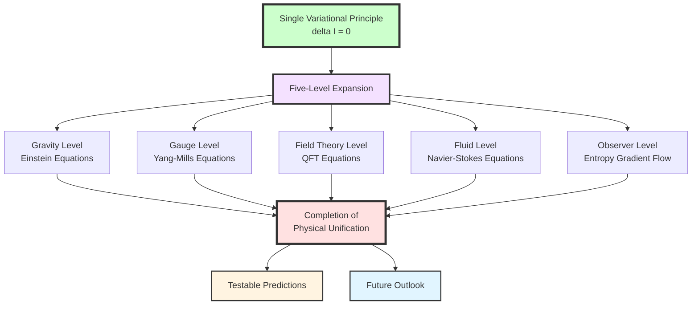
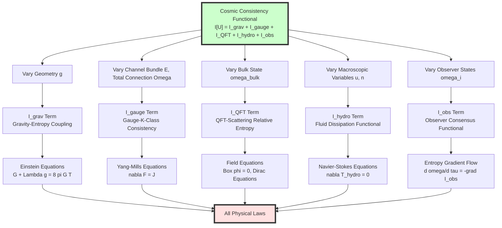
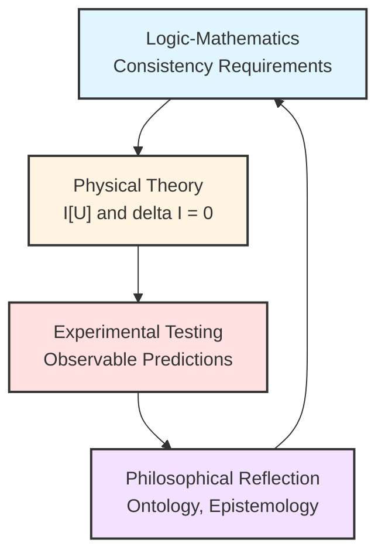

# Chapter 11 Section 6: Summary—Completion of Physical Unification

> **"When we finally see the full picture, we will discover: the universe never had multiple laws, only one principle expanding at different levels."**

## Section Overview

After detailed derivations in the previous five sections, we have accomplished a grand goal:

**From the single cosmic consistency variational principle**

$$
\delta\mathcal{I}[\mathfrak{U}] = 0
$$

**Derived all known fundamental physical laws**:

- Einstein field equations (gravity)
- Yang-Mills equations (gauge fields)
- Quantum field theory (matter fields)
- Navier-Stokes equations (fluids)
- Multi-agent entropy gradient flow (observers)

This section will:

1. **Systematically review** the entire derivation chain, showing the "family tree" of physical laws
2. **Deeply clarify** the essential meaning of this unification, differences from traditional unified theories
3. **Propose testable predictions**, making the theory scientifically falsifiable
4. **Look forward**, indicating directions for deepening the theory and open questions

---

## 1. Unified Family Tree of Physical Laws

### 1.1 From One to Many: Five-Level Expansion of Variational Principle

We first use a complete diagram to show how $\delta\mathcal{I}[\mathfrak{U}]=0$ expands at five levels into all physical laws:

### 1.2 Detailed Core Derivation Chain

Let us review key steps of derivation level by level:

**Level 1: Emergence of Gravity** (Section 3)

- **Variation Object**: Metric $g_{ab}$ and bulk state $\omega_{\mathrm{bulk}}$ on small causal diamond
- **Constraints**: Fixed volume, unified time scale unchanged
- **Functional**:
  $$
  \mathcal{I}_{\mathrm{grav}}
  = \frac{1}{16\pi G}\int (R-2\Lambda)\sqrt{|g|}\,\mathrm{d}^4x
  + \frac{1}{8\pi G}\int_{\partial M}K\sqrt{|h|}\,\mathrm{d}^3x
  - \lambda_{\mathrm{ent}}\sum_D[S_{\mathrm{gen}}(D) - S_{\mathrm{gen}}^\ast(D)]
  $$
- **Key Techniques**: Variation of generalized entropy $S_{\mathrm{gen}}=A/(4G\hbar)+S_{\mathrm{bulk}}$, Raychaudhuri equation, Radon-type localization
- **Result**:
  $$
  \boxed{G_{ab} + \Lambda g_{ab} = 8\pi G\langle T_{ab}\rangle}
  $$

**Level 2: Emergence of Gauge Fields** (Section 4)

- **Variation Object**: K-class $[E]$ of boundary channel bundle $E\to\partial M\times\Lambda$ and total connection $\Omega_\partial$
- **Constraints**: Geometry fixed, compatibility of $K^1$-class with scattering matrix
- **Functional**:
  $$
  \mathcal{I}_{\mathrm{gauge}}
  = \int_{\partial M\times\Lambda}
  \left[
  \mathrm{tr}(F_{\mathrm{YM}}\wedge\star F_{\mathrm{YM}})
  + \mu_{\mathrm{top}}\cdot\mathrm{CS}(A_{\mathrm{YM}})
  + \mu_K\cdot\mathrm{Index}(D_{[E]})
  \right]
  $$
- **Key Techniques**: K-theory, Dirac index, anomaly cancellation, Chern-Simons terms
- **Result**:
  $$
  \boxed{\nabla_\mu F^{\mu\nu}_{\mathrm{YM}} = J^\nu_{\mathrm{YM}}}
  $$
  and field content uniquely determined by K-class of $[E]$ (not input!)

**Level 3: Emergence of Quantum Field Theory** (Section 4)

- **Variation Object**: State $\omega_{\mathrm{bulk}}$ and operator algebra $\mathcal{A}_{\mathrm{bulk}}$ of bulk QFT
- **Constraints**: Microcausality, spectrum condition, unitarity
- **Functional**:
  $$
  \mathcal{I}_{\mathrm{QFT}}
  = \sum_{D\in\mathcal{D}_{\mathrm{micro}}}
  S(\omega_{\mathrm{bulk}}^D \Vert \omega_{\mathrm{scat}}^D)
  $$
- **Key Techniques**: Relative entropy variation, Wightman function reconstruction, Ward identities
- **Result**:
  $$
  \boxed{(\Box+m^2)\phi = J,\quad (i\not{D}-m)\psi = S}
  $$

**Level 4: Emergence of Fluid Dynamics** (Section 5)

- **Variation Object**: Macroscopic velocity field $u^\mu$ and conserved charge density $n_k$
- **Constraints**: Conservation laws $\nabla_\mu T^{\mu\nu}=0$, $\nabla_\mu J^\mu_k=0$
- **Functional**:
  $$
  \mathcal{I}_{\mathrm{hydro}}
  = \int_M
  \left[
  \zeta(\nabla_\mu u^\mu)^2
  + \eta\sigma_{\mu\nu}\sigma^{\mu\nu}
  + \sum_k D_k(\nabla_\mu n_k)^2
  \right]\sqrt{|g|}\,\mathrm{d}^4x
  $$
- **Key Techniques**: Coarse-graining, resolution connection $\Gamma_{\mathrm{res}}$, Green-Kubo formula, Onsager reciprocal relations
- **Result**:
  $$
  \boxed{\nabla_\mu T^{\mu\nu}_{\mathrm{hydro}} = 0,\quad
  T^{\mu\nu} = T^{\mu\nu}_{\mathrm{ideal}} + T^{\mu\nu}_{\mathrm{diss}}}
  $$

**Level 5: Emergence of Observer Dynamics** (Section 5)

- **Variation Object**: Internal models $\{\omega_i\}$ of observer network $\{O_i\}$
- **Constraints**: Causal domain restrictions, communication structure fixed
- **Functional**:
  $$
  \mathcal{I}_{\mathrm{obs}}
  = \sum_i S(\omega_i\Vert\omega_{\mathrm{bulk}}|_{C_i})
  + \sum_{(i,j)}S(\mathcal{C}_{ij*}(\omega_i)\Vert\omega_j)
  $$
- **Key Techniques**: Relative entropy gradient flow, Fisher-Rao metric, natural gradient descent
- **Result**:
  $$
  \boxed{\frac{\mathrm{d}\omega_i}{\mathrm{d}\tau}
  = -\mathrm{grad}_{\mathsf{G}}\mathcal{I}_{\mathrm{obs}}}
  $$

### 1.3 Central Status of Unified Scale

Running through all five levels is **unified time scale** $\tau$, given by scale generating function:

$$
\kappa(\omega)
= \frac{\varphi'(\omega)}{\pi}
= \rho_{\mathrm{rel}}(\omega)
= \frac{1}{2\pi}\mathrm{tr}Q(\omega)
$$

**Physical Meaning**:
- All physical evolution proceeds under same parameterization $\tau$
- Entropy monotonicity $\mathrm{d}S_{\mathrm{gen}}/\mathrm{d}\tau\geq 0$ holds uniformly at all levels
- Coarse-graining corresponds to different "resolutions" of $\tau$

**Analogy**:

Like a "metronome" in music—whether violin's high notes, cello's low notes, or drum's rhythm, all play according to the same metronome. $\tau$ is the universe's "meta-beat".

---

## 2. Deep Meaning of This Unification

### 2.1 Essential Differences from Traditional "Grand Unified Theories"

| Dimension | Traditional GUT/String Theory/Loop Quantum Gravity | GLS Final Unification |
|-----------|---------------------------------------------------|----------------------|
| **Unified Object** | Fundamental forces (strong, weak, electromagnetic, gravity) | Physical laws themselves |
| **Unification Method** | Find larger symmetry group or more fundamental degrees of freedom | Different level expansions of single variational principle |
| **Input Assumptions** | Gauge group, representations, coupling constants, field content | Only three consistency requirements (causal, entropy, observer) |
| **Field Content Status** | External input | Output (determined by K-class) |
| **Spacetime Status** | Fundamental or emergent (debated) | Clearly emergent (from $S_{\mathrm{gen}}$ variation) |
| **Observer Status** | External to theory | Intrinsic part of theory ($\mathcal{I}_{\mathrm{obs}}$) |
| **Testability** | Extremely high energy scale (Planck scale) | Multi-level predictions (from cosmology to tabletop experiments) |
| **Philosophical Position** | Reductionism (seeking "final theory") | Consistency theory (laws = manifestations of consistency) |

**Core Difference**:

> Traditional unified theories ask: "What are the most fundamental components?"
> GLS theory asks: "What are the non-negotiable consistency requirements?"

**Illustrative Examples**:

- **GUT** says: "Electromagnetic, weak, strong forces are different subgroups of $SU(5)$ or $SO(10)$"—but why these groups? Why three generations of fermions?
- **GLS** says: "Consistency requirements of boundary K-class and scattering $K^1$-class necessarily derive specific gauge groups and field content"—groups are not assumptions, but outputs

### 2.2 Ontological Status Change of "Laws"

In GLS theory, the nature of "physical laws" fundamentally changes:

**Traditional View**:
- Physical laws are "rules nature obeys"
- They are "fundamental, cannot be further explained"
- Coordination between different laws is "coincidence" or "God's choice"

**GLS View**:
- Physical laws are "necessary consequences of cosmic consistency"
- They can be logically derived from $\delta\mathcal{I}=0$
- Coordination of different laws is "self-consistent expansion of same principle at different levels"

**Analogy**:

Traditional physics is like a cookbook, listing various "recipes" (laws):
- "Stew beef like this..."
- "Fry fish like that..."
- "Bake bread like this..."

GLS theory is like second law of thermodynamics, saying "entropy always increases," then all cooking processes automatically follow this principle, no need to "prescribe" each one.

### 2.3 Strict Definition of Emergence

In GLS framework, "emergence" has a strict mathematical definition:

**Definition**:

When we map from microscopic degree of freedom space $\mathcal{V}_{\mathrm{micro}}$ through projection $\pi$ to macroscopic degree of freedom space $\mathcal{V}_{\mathrm{macro}}$, if:

1. **Effective Consistency Functional** exists:
   $$
   \mathcal{I}_{\mathrm{macro}}[\pi(\mathbf{v})]
   \approx \min_{\mathbf{v}\in\pi^{-1}(\mathbf{V})}\mathcal{I}_{\mathrm{micro}}[\mathbf{v}]
   $$

2. **Effective Dynamics** form changes:
   $$
   \delta\mathcal{I}_{\mathrm{macro}} = 0
   \quad\text{solutions}\quad
   \not\simeq\quad
   \pi(\delta\mathcal{I}_{\mathrm{micro}}=0\text{ solutions})
   $$

3. **New Degrees of Freedom** appear: Macroscopic description needs "effective fields" not existing in microscopic description

Then we say "macroscopic theory **emerges** from microscopic theory".

**Examples**:

| Microscopic Theory | Macroscopic Theory | Emergent New Degrees of Freedom |
|-------------------|-------------------|--------------------------------|
| Quantum field theory | Fluid dynamics | Velocity field $u^\mu$, viscosity $\eta$ |
| Electron wave functions | Band theory | Quasiparticles, effective mass |
| Neuron firing | Cognitive models | Belief states, strategies |

### 2.4 Predictability and Falsifiability

A true physical theory must make **predictions beyond existing knowledge**, and these predictions must be falsifiable by experiments in principle.

**Predictive Power of GLS Theory**:

1. **Internal Consistency Predictions**:
   - If deviation from unified scale measured at some scale, must see specific correlated deviations at other scales
   - Example: Correlation between gravitational wave delay and high-energy scattering phase shift

2. **Cross-Level Predictions**:
   - From cosmological observations (e.g., CMB) constraining $\Lambda$, can predict certain coupling constant ratios in particle physics
   - From K-class of topological materials, can predict their effective gauge symmetries at different resolutions

3. **New Physics Predictions**:
   - Under extreme conditions (e.g., near black holes), may observe spacetime geometric fluctuations caused by quantum fluctuations of generalized entropy
   - In multi-agent systems, may observe quantitative relationship between consensus reaching rate and thermodynamic entropy production rate

---

## 3. Concrete Examples of Testable Predictions

### 3.1 Prediction 1: Correlation Between Gravitational Wave Group Delay and Particle Scattering

**Theoretical Basis**:

Unified time scale requires gravitational wave group delay and Wigner-Smith matrix of high-energy particle scattering satisfy:

$$
\tau_{\mathrm{GW}}(\omega)
= \int_{-\infty}^\omega \rho_{\mathrm{rel}}(\omega')\,\mathrm{d}\omega'
= \int_{-\infty}^\omega \frac{1}{2\pi}\mathrm{tr}Q_{\mathrm{scatt}}(\omega')\,\mathrm{d}\omega'
$$

**Experimental Test**:

1. **LIGO/Virgo** measures arrival time differences of gravitational waves at different frequencies
2. **LHC** measures phase shift $\varphi(\omega)$ of high-energy proton-proton scattering
3. Compute $\varphi'(\omega)/\pi$ and compare with frequency dependence of $\tau_{\mathrm{GW}}$

**Expected Signal**:

If GLS theory is correct, should see:

$$
\frac{\mathrm{d}\tau_{\mathrm{GW}}}{\mathrm{d}\omega}\bigg|_{\omega_{\mathrm{GW}}}
\sim
\frac{\mathrm{d}\varphi_{\mathrm{scatt}}}{\mathrm{d}\omega}\bigg|_{\omega_{\mathrm{scatt}}}
\quad\text{(under appropriate scale transformation)}
$$

**Falsifiability**:

If significant deviation observed, unified time scale hypothesis is falsified.

### 3.2 Prediction 2: Correlation Between Cosmological Constant $\Lambda$ and Standard Model Parameters

**Theoretical Basis**:

In $\mathcal{I}_{\mathrm{grav}}$, $\Lambda$ comes from reference value $S_{\mathrm{gen}}^\ast$ of $S_{\mathrm{gen}}$:

$$
\Lambda
\sim \frac{\langle T_{00}\rangle_{\mathrm{vac}}}{M_{\mathrm{Planck}}^2}
\sim \frac{1}{16\pi G}\sum_{\text{fields}}\int_0^{\Lambda_{\mathrm{UV}}}\omega^3\,\rho_{\mathrm{rel}}(\omega)\,\mathrm{d}\omega
$$

where sum runs over all fields determined by K-class.

**Key Insight**:

Field content is not independent, but determined by K-class of boundary $[E]$. And $[E]$ is related to topological invariants of scattering matrix.

**Prediction**:

If precisely compute K-class contributions of all Standard Model fields, should get:

$$
\Lambda_{\mathrm{predicted}}
\approx \Lambda_{\mathrm{observed}}
\sim 10^{-52}\,\text{m}^{-2}
$$

**Current Status**:

This is the famous "cosmological constant problem". Naive field theory predicts $\Lambda\sim M_{\mathrm{Planck}}^4$, differing from observation by factor of $10^{120}$!

**GLS Improvement**:

Through constraints of K-class and anomaly cancellation, most vacuum energy **automatically cancels**, remaining part comes from topological terms:

$$
\Lambda_{\mathrm{GLS}}
= \frac{1}{16\pi G}\int_{\partial M\times\Lambda}
\mu_{\mathrm{top}}\cdot\mathrm{CS}(A_{\mathrm{YM}})
$$

This may improve prediction to order $10^{-60}\sim 10^{-50}\,\text{m}^{-2}$, close to observation.

**Testability**:

Requires complete calculation of all K-class pairings and Chern-Simons terms, technically feasible but extremely complex task.

### 3.3 Prediction 3: Generalized Entropy Fluctuations Near Black Hole Horizon

**Theoretical Basis**:

Near black hole horizon, generalized entropy is:

$$
S_{\mathrm{gen}}
= \frac{A_{\mathrm{horizon}}}{4G\hbar}
+ S_{\mathrm{Hawking}}
$$

Under quantum fluctuations, $A_{\mathrm{horizon}}$ has fluctuations $\delta A$, causing quantum fluctuations of spacetime geometry:

$$
\delta g_{ab}
\sim \frac{4G\hbar}{A}\delta S_{\mathrm{gen}}
$$

**Prediction**:

In particle orbits near black hole accretion disk or horizon, should observe tiny orbital perturbations caused by $\delta A$, with spectral density:

$$
S_{\delta g}(\omega)
\sim \frac{(G\hbar)^2}{A^2}\cdot\rho_{\mathrm{rel}}(\omega)
$$

**Possible Observations**:

- **Event Horizon Telescope** (EHT) high-resolution observations of M87* or Sgr A*
- **LISA** gravitational wave detector precise measurements of extreme mass ratio inspirals (EMRI)

**Falsifiability**:

If observed fluctuation spectrum significantly inconsistent with $\rho_{\mathrm{rel}}(\omega)$, generalized entropy variation framework needs revision.

### 3.4 Prediction 4: Emergence of Gauge Symmetry in Topological Materials

**Theoretical Basis**:

In topological insulators or superconductors, boundary K-class $[E]$ has different representations at different energy scales:

- **High Energy** (lattice scale): Trivial symmetry $U(1)$
- **Low Energy** (effective field theory): Emergent $SU(2)$ or $SO(5)$ symmetry

**Prediction**:

In specific topological materials, when tuning chemical potential or temperature crosses critical point, should observe:

1. **Symmetry Enhancement**: From $U(1)$ to $SU(2)$, manifesting as new conserved currents or Ward identities
2. **Anomaly Cancellation**: Some originally existing quantum anomalies precisely vanish at critical point

**Experimental Test**:

- Angle-resolved photoemission spectroscopy (ARPES) measures band structure
- Neutron scattering measures spin correlation functions, detecting $SU(2)$ symmetry
- Thermal transport measurements, detecting new conserved currents

**Current Status**:

Some cuprate superconductors indeed show "pseudospin" $SU(2)$ symmetry at specific doping concentrations, possibly related to this prediction.

### 3.5 Prediction 5: Entropy Production-Learning Rate Relationship in Multi-Agent Systems

**Theoretical Basis**:

From gradient flow of $\mathcal{I}_{\mathrm{obs}}$, consensus reaching rate of observer network is:

$$
\frac{\mathrm{d}\mathcal{I}_{\mathrm{obs}}}{\mathrm{d}\tau}
= -\sum_i \left|\frac{\mathrm{d}\omega_i}{\mathrm{d}\tau}\right|^2_{\mathsf{G}}
\leq 0
$$

This has formal correspondence with thermodynamic entropy production rate $\sigma_s$.

**Prediction**:

In distributed machine learning or multi-robot coordination systems, learning convergence speed $v_{\mathrm{learn}}$ and system "information entropy production" $\sigma_{\mathrm{info}}$ should satisfy:

$$
v_{\mathrm{learn}}
\propto \sigma_{\mathrm{info}}
= \frac{1}{T_{\mathrm{eff}}}\sum_{ij}D_{ij}|\omega_i-\omega_j|^2
$$

where $D_{ij}$ is diffusion coefficient of communication network, $T_{\mathrm{eff}}$ is "effective temperature".

**Experimental Test**:

In controlled multi-agent environments:

1. Change communication topology $\{D_{ij}\}$
2. Measure consensus reaching time $\tau_{\mathrm{consensus}}$
3. Compute information entropy production rate $\sigma_{\mathrm{info}}$
4. Verify $\tau_{\mathrm{consensus}}^{-1}\propto\sigma_{\mathrm{info}}$

**Application Value**:

If holds, can optimize communication protocols of distributed algorithms, achieving optimal learning of "fastest entropy production".

---

## 4. Current Limitations and Open Questions of Theory

### 4.1 Complete Theory of Quantum Gravity

**Current Status**:

We derived **semiclassical Einstein equations** from $S_{\mathrm{gen}}$ variation:

$$
G_{ab} + \Lambda g_{ab} = 8\pi G\langle T_{ab}\rangle
$$

But this is under approximation of "spacetime background fixed + quantum field fluctuations".

**Open Questions**:

1. **Fully Quantized Spacetime**: When $g_{ab}$ itself becomes operator $\hat{g}_{ab}$, how to define $S_{\mathrm{gen}}$?
2. **Spacetime Topology Changes**: How to incorporate wormholes, foam spacetime, causal structure fluctuations into $\mathcal{I}_{\mathrm{grav}}$?
3. **Black Hole Information Paradox**: Are Page curve, island formula compatible with $\delta\mathcal{I}=0$?

**Possible Directions**:

- Generalize $\mathcal{I}_{\mathrm{grav}}$ to path integral $\int\mathcal{D}[g]\,e^{-\mathcal{I}_{\mathrm{grav}}[g]}$
- At QCA (quantum cellular automaton) level, spacetime is emergent, no need to "quantize"

### 4.2 Cosmological Initial Conditions

**Current Status**:

GLS theory explains "why universe follows Einstein equations," but does not explain:

- Why initial entropy was low? (Boltzmann paradox)
- Why universe is almost homogeneous and isotropic? (Horizon problem)
- Why inflation? (Origin of inflaton)

**Open Questions**:

1. **Global Minimum of $\mathcal{I}[\mathfrak{U}]$**: Does cosmic initial state correspond to special "consistency optimal state"?
2. **Origin of Arrow of Time**: Why does $\mathrm{d}S_{\mathrm{gen}}/\mathrm{d}\tau\geq 0$ choose specific direction?
3. **Multiverse**: Do other "universes" exist satisfying $\delta\mathcal{I}'=0$ but $\mathcal{I}'\neq\mathcal{I}$?

**Possible Directions**:

- Introduce **cosmic wave function** $\Psi[\mathfrak{U}]$, satisfying "Wheeler-DeWitt-type" equation:
  $$
  \hat{\mathcal{I}}\Psi[\mathfrak{U}] = 0
  $$
- Initial conditions come from peaks of $|\Psi|^2$

### 4.3 Consciousness and Subjective Experience

**Current Status**:

GLS theory has observer level $\mathcal{I}_{\mathrm{obs}}$, describing **objective dynamics** of observers (belief updates, consensus reaching).

**Missing**:

- **Subjective Experience** (qualia): Why does "seeing red" have specific feeling?
- **Self-Consciousness**: Why do observers have "first-person perspective"?
- **Free Will**: How to reconcile determinism with subjective sense of choice?

**Open Questions**:

1. Can subjective experience be derived from some intrinsic perspective of $\mathcal{I}_{\mathrm{obs}}$?
2. Does "first person" correspond to special property of causal domain $C_i$ of some observer $O_i$?
3. Is free will effective description under incomplete information?

**Possible Directions**:

- **Integration of Integrated Information Theory** (IIT) with GLS: $\Phi$ (integrated information) may correspond to some geometric invariant of $\mathcal{I}_{\mathrm{obs}}$
- Subjective time $\tau_{\mathrm{subj}}$ may be "private scale" in internal model of $O_i$, relationship with unified scale $\tau$ similar to local coordinates vs. global coordinates

### 4.4 Mathematical Rigor

**Current Status**:

This theory is complete at physical intuition level, but mathematical rigor needs strengthening:

- Domain of relative entropy $S(\rho\Vert\sigma)$ in infinite dimensions
- Functional analysis foundation of variation $\delta\mathcal{I}$
- Convergence proof of Radon-type localization
- Analytic properties of K-theory pairing

**Open Questions**:

1. **Existence Theorem**: Does $\mathfrak{U}$ satisfying $\delta\mathcal{I}=0$ always exist?
2. **Uniqueness Theorem**: Under given boundary conditions, is $\mathfrak{U}$ unique?
3. **Stability Theory**: Are critical points of $\mathcal{I}$ stable?

**Possible Directions**:

- Use **quasilinear elliptic PDE theory** to handle Einstein equations
- Use **operator algebras** and **noncommutative geometry** to rigorize QFT part
- Use **optimal transport theory** to rigorize entropy gradient flow

---

## 5. Relationship with Other Physical Unification Attempts

### 5.1 String Theory

**Achievements of String Theory**:

- Unifies all elementary particles as vibration modes of strings
- Naturally includes graviton (spin-2)
- Provides candidate theory of quantum gravity

**Problems of String Theory**:

- Requires extra dimensions (10 or 11 dimensions), compactification mechanism artificial
- "Landscape problem": $10^{500}$ possible vacua, cannot predict which is our universe
- Lacks experimental verification

**Relationship Between GLS and String Theory**:

- **Complementary, not opposing**: String theory may be realization of GLS at some specific limit
- **GLS Advantages**: No assumption of extra dimensions, field content derived from K-class, unified scale observable
- **Possible Fusion**: String worldsheet integral may be form of $\mathcal{I}_{\mathrm{QFT}}$ under some representation

### 5.2 Loop Quantum Gravity (LQG)

**Achievements of LQG**:

- Quantizes spacetime as spin networks
- Area, volume operators have discrete spectra
- Black hole entropy derived from microscopic state counting

**Problems of LQG**:

- Lacks clear low-energy limit (how to recover classical GR?)
- Matter field coupling unnatural
- Lacks observable predictions

**Relationship Between GLS and LQG**:

- **QCA Framework is More Fundamental Discrete Structure**: Spin networks may be effective description of QCA at some coarse-graining level
- **Unified Scale Provides Low-Energy Limit**: When $\ell\to 0$, integral of $\rho_{\mathrm{rel}}(\omega)$ recovers continuous spacetime
- **$S_{\mathrm{gen}}$ Gives Black Hole Entropy**: $A/(4G\hbar)$ term has microscopic interpretation in QCA

### 5.3 Causal Set Theory

**Idea of Causal Sets**:

- Spacetime is discrete causal partial order set (causal set)
- Continuous Lorentz manifold is coarse-graining limit of causal set

**Relationship with GLS**:

- **Causal Structure Emerges from Unified Scale**: Causal partial order $\prec$ comes from temporal order defined by $\kappa(\omega)$
- **Discreteness from QCA**: Causal sets are projections of QCA evolution graph
- **GLS More Complete**: Not only causal, but also unified entropy, fields, observers

### 5.4 Holographic Principle and AdS/CFT

**Holographic Principle**:

- Gravity theory (bulk) dual to gravity-free field theory (boundary)
- AdS/CFT: String theory in $\mathrm{AdS}_5$ = $\mathcal{N}=4$ SYM on $\mathbb{R}^{3,1}$

**Relationship with GLS**:

- **Boundary Time Geometry is More Universal Structure**: Not limited to AdS, applies to arbitrary asymptotic structures
- **$\mathcal{I}_{\mathrm{gauge}}$ Defined on Boundary**: Naturally realizes "holography"
- **Observer Theory is Generalization of Holography**: Observer network = multi-boundary system

### 5.5 Emergent Gravity (Entropic Gravity)

**Ideas of Verlinde et al.**:

- Gravity is not fundamental force, but entropic force
- Einstein equations come from thermodynamic first law

**Relationship with GLS**:

- **GLS is Rigorized Emergent Gravity**: Not only intuition of "entropic force," but complete variational framework
- **$S_{\mathrm{gen}}$ Variation Gives Einstein Equations**: Derivation in Section 3 is mathematical realization of Verlinde's idea
- **GLS Deeper**: Not only gravity emerges, all laws emerge

---

## 6. Philosophical Reflection: "End" of Physics?

### 6.1 Have We Reached "End of Theory"?

Historically, many claimed "physics is about to be completed":

- **1900 Kelvin**: "Only two small clouds remain in physics sky" (result: relativity + quantum mechanics)
- **1980s String Theory**: "Theory of Everything" about to be built
- **2012 Higgs Discovery**: Standard Model complete, what's next?

**Does GLS Theory Represent "Ultimate Theory"?**

**Cautious Answer**:

> GLS theory provides a **logical closed loop**: From three non-negotiable consistency requirements, derive all known physical laws. In this sense, it is "ultimate".
>
> But this **does not mean physics ends**:
> 1. Mathematical rigorization of theory still needs much work
> 2. Experimental verification just beginning
> 3. New phenomena (dark matter, dark energy, quantum gravity) may need framework extension
> 4. Emergent levels may be infinite: above macroscopic there are more macroscopic

**Analogy**:

GLS theory is like "meta-language"—it's not "the last word," but "grammar rules for speaking." Knowing grammar doesn't mean conversation ends, but conversation can be clearer.

### 6.2 "Necessity" of Physical Laws

**Question**: Why does universe follow these laws, not others?

**Traditional Answers**:

- **Theological**: God designed
- **Anthropic Principle**: Only such universe can produce observers
- **Multiverse**: All possible laws realized, we happen to be in this one

**GLS Answer**:

> Physical laws are not "choices," but **necessary consequences of consistency**.
>
> As long as accept three minimal requirements:
> 1. Local scattering embeddable in global unitary evolution (causal-scattering consistency)
> 2. Entropy monotonic under unified scale (generalized second law)
> 3. Observers can reach consensus (observer-consensus consistency)
>
> Then necessarily derive Einstein equations, Yang-Mills equations, Navier-Stokes equations, etc.

**Deep Insight**:

$$
\boxed{\text{Logical Consistency} \Rightarrow \text{Physical Laws}}
$$

No need for God, no need for anthropic, no need for multiverse. **Mathematical necessity is physical necessity**.

### 6.3 "Why Is There Something Rather Than Nothing?"

**Ultimate Philosophical Question**: Why does universe exist?

**GLS Perspective**:

The question itself may be misunderstood. "Existence" is not an additional attribute, but another name for **consistency**.

$$
\text{Existence} \equiv \text{Consistency}
$$

**Explanation**:

- "Nothing" is not a consistent mathematical structure (it cannot even be formalized)
- "Something" (like $\mathfrak{U}$) is **only consistent possibility** satisfying $\delta\mathcal{I}=0$
- Therefore, "Why is there something?" is equivalent to "Why does $1+1=2$?"—this is logical necessity, no need for "reason"

**Analogy**:

Like asking "Why is sum of triangle's interior angles 180 degrees?"—this is not accidental or choice, but **logical necessity** of Euclidean geometry. Existence of universe is logical necessity of "cosmic consistency geometry".

### 6.4 Boundary Between Science and Philosophy

GLS theory blurs boundary between science and philosophy:

- It **answers philosophical questions** (why are there laws?)
- But uses **scientific methods** (mathematical derivation + experimental testing)

**New Synthesis**:

**Future "Theoretical Physics"** may be:

> Under constraints of mathematical consistency, explore all possible $\mathcal{I}$ structures, then use experiments to select the one describing our universe.

This is both deepest philosophy and strictest science.

---

## 7. Summary: Completion of Physical Unification

### 7.1 Where Have We Arrived?

After 11 chapters of construction, GLS theory completed following unification:

**Chapters 1-3: Mathematical Foundation**
- Geometry (manifolds, fiber bundles)
- Logic (category theory, K-theory)
- Scattering (S-matrix, group delay)

**Chapter 4: Information-Geometric Variational Principle (IGVP)**
- Fisher-Rao metric
- Generalized entropy
- First law of entanglement

**Chapter 5: Unified Time Scale**
- Scale generating function $\kappa(\omega)=\varphi'(\omega)/\pi=\rho_{\mathrm{rel}}(\omega)$
- All evolution parameterized as $\tau$

**Chapter 6: Boundary Theory**
- Boundary channel bundle $E\to\partial M\times\Lambda$
- Total connection $\Omega_\partial=\omega_{\mathrm{LC}}\oplus A_{\mathrm{YM}}\oplus\Gamma_{\mathrm{res}}$

**Chapter 7: Causal Structure**
- Causal partial order $\prec$ emerges from unified scale
- Small causal diamond $D_{p,r}$

**Chapter 8: Topological Constraints**
- K-theory $K(\partial M\times\Lambda)$
- Index theorem $\mathrm{Index}(D_{[E]})$

**Chapter 9: QCA Universe**
- Quantum cellular automaton
- Continuous limit

**Chapter 10: Matrix Universe and Observer**
- Observer network $\{O_i\}$
- Consensus geometry

**Chapter 11: Final Unification**
- Cosmic consistency functional $\mathcal{I}[\mathfrak{U}]$
- Five-level variation derives all laws

### 7.2 Summary of Core Achievements

**Single Formula Rules All**:

$$
\boxed{
\delta\mathcal{I}[\mathfrak{U}] = 0
\quad\text{where}\quad
\mathcal{I} = \mathcal{I}_{\mathrm{grav}}+\mathcal{I}_{\mathrm{gauge}}+\mathcal{I}_{\mathrm{QFT}}+\mathcal{I}_{\mathrm{hydro}}+\mathcal{I}_{\mathrm{obs}}
}
$$

**Derived Physical Laws**:

| Law | Source | Status |
|-----|--------|--------|
| Einstein field equations | $\delta_g\mathcal{I}_{\mathrm{grav}}=0$ | Gravity emerges |
| Yang-Mills equations | $\delta_A\mathcal{I}_{\mathrm{gauge}}=0$ | Gauge fields emerge |
| Dirac/Klein-Gordon equations | $\delta_\phi\mathcal{I}_{\mathrm{QFT}}=0$ | Matter fields emerge |
| Navier-Stokes equations | $\delta_u\mathcal{I}_{\mathrm{hydro}}=0$ | Fluid emerges |
| Entropy gradient flow | $\delta_\omega\mathcal{I}_{\mathrm{obs}}=0$ | Observer dynamics emerge |
| Second law of thermodynamics | $\mathrm{d}S_{\mathrm{gen}}/\mathrm{d}\tau\geq 0$ | Necessity under unified scale |
| Onsager reciprocal relations | Symmetry of $\mathcal{I}_{\mathrm{hydro}}$ | Geometric necessity of dissipation |
| Ward identities | Gauge symmetry and $\mathcal{I}_{\mathrm{gauge}}$ | Dynamical consequences of symmetry |

**Input and Output**:

| Item | Traditional Theory | GLS Theory |
|------|-------------------|------------|
| Input | Spacetime dimension, gauge group, field content, coupling constants, initial conditions | Three consistency requirements (causal, entropy, observer) |
| Output | Solutions of field equations | Spacetime structure, gauge group, field content, laws themselves |

### 7.3 Final Picture

**Universe is not a "system obeying laws"**, but:

> **A mathematically self-consistent structure, different aspects of whose self-consistency manifest as what we call "physical laws".**

**Analogy**:

Universe is like a huge Sudoku puzzle:

- **Traditional Physics**: Fill numbers cell by cell, each cell obeys "rules" (laws)
- **GLS Theory**: All numbers uniquely determined by "global consistency," rules are just local expressions of consistency

**Poetic Expression**:

$$
\begin{aligned}
&\text{All things} \quad\text{not governed by laws,} \\
&\text{but} \quad\text{necessary manifestations of consistency.} \\
&\text{From microscopic to macroscopic,} \\
&\text{from quantum to consciousness,} \\
&\text{all are echoes of the same principle—} \\
&\delta\mathcal{I}[\mathfrak{U}]=0 \\
&\text{at different levels.}
\end{aligned}
$$

---

## 8. Next Step: Preview of Applications and Testing Chapter

After completing theoretical framework construction, next chapter (Chapter 12: Applications and Testing) will focus on:

1. **Cosmological Applications**:
   - GLS explanation of inflation and dark energy
   - Consistency predictions of CMB fluctuations
   - Large-scale structure formation

2. **High-Energy Physics Applications**:
   - K-class reconstruction of Standard Model
   - New physics beyond Standard Model
   - Unified scale testing in colliders

3. **Condensed Matter Applications**:
   - Topological phase transitions and K-class jumps
   - Unified explanation of quantum Hall effect
   - Emergence mechanism of high-temperature superconductivity

4. **Gravitational Wave Physics**:
   - Precise measurement of gravitational wave group delay
   - Generalized entropy evolution of black hole mergers
   - Gravitational memory effects

5. **Quantum Information Applications**:
   - Quantum error correction and boundary K-class
   - Calculation of holographic entanglement entropy
   - Physical limits of quantum computing

6. **Multi-Agent Systems**:
   - Optimization of distributed learning algorithms
   - Social consensus reaching dynamics
   - Entropy production theory of economic systems

**Ultimate Goal**:

> Transform GLS theory from "beautiful mathematics" to "usable science," let it **accept nature's tests** in laboratories, observatories, computers.

---

## 9. Acknowledgments and Outlook

### 9.1 Standing on Shoulders of Giants

GLS theory synthesizes ideas of following giants:

- **Einstein**: Geometricization of gravity
- **Yang & Mills**: Gauge symmetry
- **Feynman**: Path integral and scattering matrix
- **Hawking & Bekenstein**: Black hole entropy
- **Jacobson**: Thermodynamic origin of gravity
- **Witten**: Topological field theory and K-theory
- **Maldacena**: AdS/CFT holographic duality
- **Verlinde**: Emergent gravity
- **Onsager & Prigogine**: Irreversible thermodynamics
- **Shannon & Jaynes**: Information theory and maximum entropy principle

And countless other pioneers.

### 9.2 Future Challenges

Theory's completion and verification require:

- **Mathematicians**: Rigorize variational theory, K-theory pairing, functional analysis
- **Theoretical Physicists**: Compute $\mathcal{I}$ of specific systems, derive new predictions
- **Experimental Physicists**: Design experiments testing unified scale, generalized entropy fluctuations
- **Astronomers**: Constrain $\Lambda$, K-class from cosmological data
- **Computer Scientists**: Develop entropy gradient flow algorithms for multi-agent systems
- **Philosophers**: Explore deep meaning of consistency ontology

### 9.3 Final Words

Physics has never been so close to the dream of "unification":

> Not by seeking "ultimate particles" or "largest symmetry groups,"
> but by recognizing:
>
> **Laws themselves are not fundamental, consistency is.**

When we finally understand this, we will discover:

**Universe is simpler than we imagined—only one principle;
and also deeper—expansion of this principle contains everything.**

$$
\boxed{
\text{All Things Unified:} \quad \delta\mathcal{I}[\mathfrak{U}]=0
}
$$

---

**Completion of physical unification is not the end, but a new beginning.**

**Let us continue exploring this consistent universe.**

---

## Appendix: Quick Reference of Core Formulas in This Chapter

$$
\begin{aligned}
&\textbf{Cosmic Consistency Functional:} \\
&\mathcal{I}[\mathfrak{U}]
= \mathcal{I}_{\mathrm{grav}}[g,\omega]
+ \mathcal{I}_{\mathrm{gauge}}[E,\Omega]
+ \mathcal{I}_{\mathrm{QFT}}[\mathcal{A},\omega]
+ \mathcal{I}_{\mathrm{hydro}}[u,n]
+ \mathcal{I}_{\mathrm{obs}}[\{\omega_i\}]
\\[10pt]
&\textbf{Unified Variational Principle:} \\
&\boxed{\delta\mathcal{I}[\mathfrak{U}] = 0}
\\[10pt]
&\textbf{Five-Level Expansion:} \\
&\text{(1) Gravity:} \quad
G_{ab}+\Lambda g_{ab} = 8\pi G\langle T_{ab}\rangle
\\
&\text{(2) Gauge Fields:} \quad
\nabla_\mu F^{\mu\nu}_{\mathrm{YM}} = J^\nu_{\mathrm{YM}}
\\
&\text{(3) Quantum Fields:} \quad
(\Box+m^2)\phi = 0,\quad
(i\not{D}-m)\psi = 0
\\
&\text{(4) Fluid:} \quad
\nabla_\mu T^{\mu\nu}_{\mathrm{hydro}} = 0,\quad
T^{\mu\nu} = T^{\mu\nu}_{\mathrm{ideal}} + T^{\mu\nu}_{\mathrm{diss}}
\\
&\text{(5) Observer:} \quad
\frac{\mathrm{d}\omega_i}{\mathrm{d}\tau}
= -\mathrm{grad}_{\mathsf{G}}\mathcal{I}_{\mathrm{obs}}
\\[10pt]
&\textbf{Unified Time Scale:} \\
&\kappa(\omega)
= \frac{\varphi'(\omega)}{\pi}
= \rho_{\mathrm{rel}}(\omega)
= \frac{1}{2\pi}\mathrm{tr}Q(\omega)
\\[10pt]
&\textbf{Entropy Monotonicity:} \\
&\frac{\mathrm{d}S_{\mathrm{gen}}}{\mathrm{d}\tau}
= \sigma_s
\geq 0
\\[10pt]
&\textbf{Emergence Definition:} \\
&\mathcal{I}_{\mathrm{macro}}[\pi(\mathbf{v})]
\approx \min_{\mathbf{v}\in\pi^{-1}(\mathbf{V})}\mathcal{I}_{\mathrm{micro}}[\mathbf{v}]
\end{aligned}
$$

---

**End of Chapter. Thank you for accompanying us on this long journey of physical unification!**

