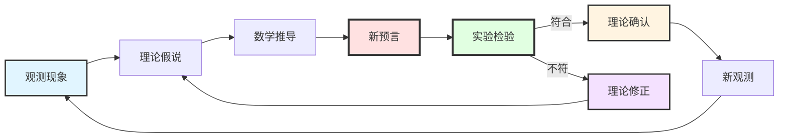
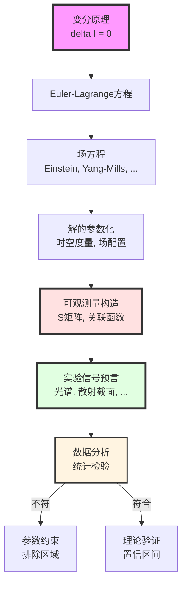
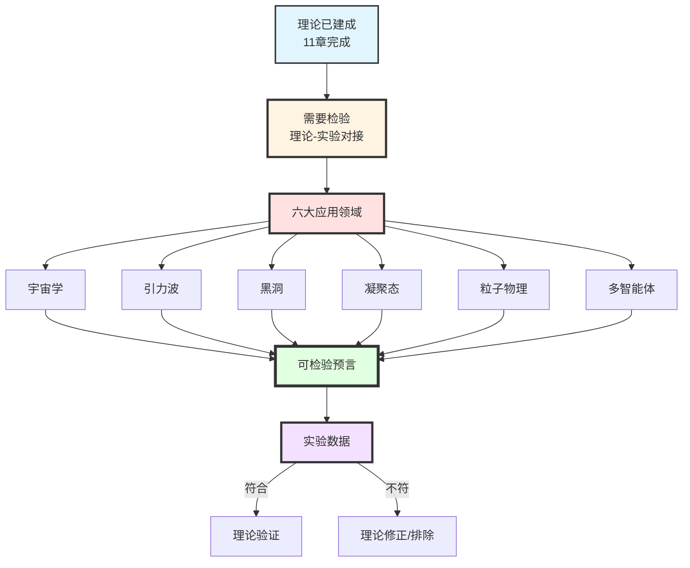

# 第12章第0节：引言——从理论到观测的桥梁

> **"一个理论的真正价值，不在于它的数学优雅，而在于它能否面对自然的检验。"**

## 本章导览

在前面的章节中，我们完成了GLS理论的完整理论框架：

- **第1-3章**：数学工具与核心思想
- **第4章**：信息几何变分原理（IGVP）
- **第5章**：统一时间刻度
- **第6章**：边界理论
- **第7章**：因果结构
- **第8章**：拓扑约束
- **第9章**：QCA宇宙
- **第10章**：矩阵宇宙与观察者理论
- **第11章**：最终统一——从单一变分原理导出所有物理定律

现在，我们来到了理论物理学最关键的一步：**将理论预言与观测数据对接**。

## 1. 为什么需要应用与检验？

### 1.1 理论与实验的辩证关系

物理学的发展历史告诉我们：

**历史上的经典案例**：

| 理论 | 关键预言 | 实验检验 | 结果 |
|------|----------|----------|------|
| **牛顿力学** | 行星轨道 | 天文观测 | 成功（低速） |
| **广义相对论** | 光线偏折 | 1919年日食 | 成功 |
| **量子力学** | 电子衍射 | 双缝实验 | 成功 |
| **标准模型** | Higgs粒子 | LHC 2012 | 成功 |
| **弦论** | 超对称粒子 | LHC至今 | **未发现** |

**核心教训**：
- 一个理论无论多么优雅，**如果不能产生可检验的预言，就不是物理学**
- GLS理论必须回答：**它预言了什么？如何检验？**

### 1.2 GLS理论的独特挑战

GLS理论是一个**极其宏大的统一框架**，它试图从单一变分原理

$$
\delta \mathcal{I}[\mathfrak{U}] = 0
$$

导出所有物理定律。这带来了独特的挑战：

**挑战1：多尺度跨越**
- 理论涉及从**Planck尺度**（$10^{-35}$米）到**宇宙学尺度**（$10^{26}$米）
- 跨越了**60个数量级**
- 不同尺度需要不同的检验方法

**挑战2：多领域覆盖**
- 引力物理（Einstein方程）
- 粒子物理（规范场论）
- 凝聚态物理（拓扑相变）
- 宇宙学（暗能量、CMB）
- 黑洞物理（信息悖论）
- 多智能体系统（观察者动力学）

**挑战3：新物理与已知物理的区分**
- GLS理论必须**重现**所有已知的成功预言
- 同时必须给出**新的、独特的**可检验预言
- 区分\"GLS理论的预言\"与\"已知理论的重复\"

### 1.3 本章的核心问题

本章将系统回答以下问题：

1. **GLS理论有哪些独特的、可检验的预言？**
2. **这些预言在哪些实验/观测中可以被检验？**
3. **当前的实验精度能否约束GLS理论的参数？**
4. **GLS理论是否已经被某些观测数据排除？**
5. **未来哪些实验最有希望检验GLS理论？**

## 2. GLS理论的六大应用领域

基于我们在前面章节建立的理论框架，GLS理论在以下六个领域具有独特的应用和可检验预言：

```mermaid
graph TD
    A["GLS理论<br/>单一变分原理"] --> B["宇宙学应用<br/>Cosmology"]
    A --> C["引力波检验<br/>Gravitational Waves"]
    A --> D["黑洞物理<br/>Black Hole Physics"]
    A --> E["凝聚态应用<br/>Condensed Matter"]
    A --> F["粒子物理检验<br/>Particle Physics"]
    A --> G["多智能体系统<br/>Multi-Agent Systems"]

    B --> B1["暗能量性质"]
    B --> B2["宇宙学常数"]
    B --> B3["CMB异常"]

    C --> C1["洛伦兹破缺"]
    C --> C2["色散关系"]
    C --> C3["群延迟效应"]

    D --> D1["黑洞熵公式"]
    D --> D2["信息悖论"]
    D --> D3["Page曲线"]

    E --> E1["拓扑相变"]
    E --> E2["量子霍尔效应"]
    E --> E3["规范场涌现"]

    F --> F1["中微子质量"]
    F --> F2["强CP问题"]
    F --> F3["标准模型参数"]

    G --> G1["观察者共识"]
    G --> G2["熵梯度流"]
    G --> G3["分布式学习"]

    style A fill:#f9f,stroke:#333,stroke-width:4px
    style B fill:#e1f5ff,stroke:#333,stroke-width:2px
    style C fill:#fff4e1,stroke:#333,stroke-width:2px
    style D fill:#ffe1e1,stroke:#333,stroke-width:2px
    style E fill:#e1ffe1,stroke:#333,stroke-width:2px
    style F fill:#f4e1ff,stroke:#333,stroke-width:2px
    style G fill:#ffe1f4,stroke:#333,stroke-width:2px
```

### 2.1 领域概览与核心预言

让我们简要概览每个领域的核心内容：

#### 领域1：宇宙学应用

**核心理论**：统一时间刻度的母公式

$$
\kappa(\omega) = \frac{\varphi'(\omega)}{\pi} = \rho_{\mathrm{rel}}(\omega) = \frac{1}{2\pi}\mathrm{tr}\,Q(\omega)
$$

应用于宇宙学，给出暗能量的**谱窗口解释**。

**关键预言**：
1. 宇宙学常数$\Lambda$与标准模型参数的具体关系：
   $$
   \Lambda_{\mathrm{eff}} = \Lambda_{\mathrm{bare}} + \frac{1}{16\pi^2}\sum_i c_i m_i^4 \ln\left(\frac{M_{\mathrm{UV}}}{m_i}\right)
   $$
   其中系数$c_i$由GLS理论的边界K类确定

2. 暗能量状态方程的红移依赖性：
   $$
   w_{\mathrm{de}}(z) = -1 + \beta\,(1+z)^2\kappa_{\mathrm{CMB}}
   $$

3. CMB功率谱在大尺度的特定修正模式

**检验途径**：
- Planck卫星、JWST的CMB观测
- DESI、Euclid的大尺度结构巡天
- 超新星Ia型的暗能量状态方程测量

**比喻理解**：
> 想象宇宙是一个巨大的音乐厅，暗能量就像音乐厅的"共鸣频率"。GLS理论预言：这个共鸣频率不是随机的，而是由音乐厅的"几何形状"（时空边界的K类）决定的。我们可以通过测量不同频率的"声音"（不同红移的星系），来反推音乐厅的形状。

---

#### 领域2：引力波检验

**核心理论**：QCA宇宙的离散时空结构导致引力波传播的修正色散关系

$$
\omega^2 = c^2 k^2 \left[1 + \beta_2 (k\ell_{\mathrm{cell}})^2 + \beta_4 (k\ell_{\mathrm{cell}})^4 + \cdots\right]
$$

其中$\ell_{\mathrm{cell}}$是QCA晶格间距。

**关键预言**：
1. 引力波群速度与频率的依赖关系：
   $$
   v_g(\omega) = c\left[1 + \frac{3}{2}\beta_2\left(\frac{\omega\ell_{\mathrm{cell}}}{c}\right)^2\right]
   $$

2. 不同频率引力波信号的到达时间差：
   $$
   \Delta t \sim \frac{D}{c}\beta_2\left(\frac{\Delta\omega\cdot\ell_{\mathrm{cell}}}{c}\right)^2
   $$

3. 洛伦兹不变性破缺的能标约束：
   $$
   E_{\mathrm{LV}} = \frac{\hbar c}{\ell_{\mathrm{cell}}} \geq 10^{15} \text{ GeV}
   $$

**检验途径**：
- LIGO/Virgo/KAGRA的多信使引力波观测
- 特别是GW170817（中子星并合）的电磁对应体时间延迟
- 未来的空间引力波探测器（LISA、太极、天琴）

**比喻理解**：
> 想象时空是一块"离散的蹦床网"而非连续的橡胶膜。当引力波（波浪）在上面传播时，高频波（短波长）会"感受到"网格的离散性，就像高音在颗粒状介质中传播会有色散。测量不同频率引力波的到达时间差，就像测量"网格的编织密度"。

---

#### 领域3：黑洞物理

**核心理论**：在QCA宇宙中，黑洞视界是一个**有限层的量子纠缠网络**，而非连续的几何曲面。

**Bekenstein-Hawking熵公式的导出**：

$$
S_{\mathrm{BH}} = \frac{A}{4G\hbar} = \frac{\eta_{\mathrm{cell}}}{\ell_{\mathrm{cell}}^2} \cdot A
$$

其中系数匹配要求：

$$
\frac{\eta_{\mathrm{cell}}}{\ell_{\mathrm{cell}}^2} = \frac{1}{4G\hbar}
$$

**关键预言**：
1. **Page曲线的微观机制**：信息在视界附近的量子通道$\mathcal{A}$中的传输过程

2. **广义熵涨落**：在接近黑洞视界时，广义熵的量子涨落
   $$
   \delta S_{\mathrm{gen}} \sim \sqrt{\frac{A}{4G\hbar}}
   $$

3. **霍金辐射的修正谱**：由于QCA离散性导致的高频截断
   $$
   \frac{\mathrm{d}N}{\mathrm{d}\omega} \propto \frac{1}{e^{\hbar\omega/k_BT_H}-1} \cdot \Theta\left(1 - \frac{\omega}{\omega_{\mathrm{cell}}}\right)
   $$

**检验途径**：
- 原初黑洞（PBH）的霍金辐射探测
- 黑洞并合后的ringdown信号精细结构
- 未来的量子引力实验（模拟黑洞）

**比喻理解**：
> 黑洞就像一个"信息压缩器"。在经典图像中，信息被"扔进去"就永远丢失了。但在GLS-QCA图像中，黑洞视界是一个"量子邮局"，信息被"编码"在视界的量子态中，随着霍金辐射"慢慢寄出来"。Page曲线就是这个"邮寄进度"的时间曲线。

---

#### 领域4：凝聚态应用

**核心理论**：从边界K类涌现规范场，在凝聚态系统中对应**拓扑不变量决定体态性质**。

**整数量子霍尔效应（IQHE）**：

霍尔电导的量子化

$$
\sigma_{xy} = \nu \frac{e^2}{h}, \quad \nu \in \mathbb{Z}
$$

在GLS理论中，$\nu$对应边界通道丛$\mathcal{E}$的第一陈数（Chern number）。

**关键预言**：
1. **拓扑相变的临界行为**：在拓扑相变点，广义熵梯度流出现奇异性
   $$
   \frac{\partial S_{\mathrm{gen}}}{\partial\lambda}\bigg|_{\lambda=\lambda_c} \to \infty
   $$

2. **规范场从晶格涌现**：在特定晶格模型（如蜂窝晶格），低能有效理论自动包含$U(1)$规范场

3. **拓扑保护的退相干抑制**：拓扑量子比特的退相干时间与拓扑不变量的关系
   $$
   T_2 \propto e^{\Delta_{\mathrm{top}}/k_BT}
   $$
   其中$\Delta_{\mathrm{top}}$是拓扑能隙

**检验途径**：
- 二维材料（石墨烯、拓扑绝缘体）的输运测量
- 拓扑量子计算平台的退相干时间测量
- 冷原子体系的拓扑相变模拟

**比喻理解**：
> 想象一个"魔术地毯"（二维材料）。普通地毯上，你走的路径可以任意变形，到达终点的方式有无穷多种。但拓扑地毯上，某些路径是"被保护的"——无论地毯怎么弯曲变形，只要不撕裂（拓扑相变），这些路径就始终存在。量子霍尔效应就是电子沿着这些"被保护的路径"流动，因此电导是量子化的。

---

#### 领域5：粒子物理检验

**核心理论**：标准模型的规范群$SU(3)_C \times SU(2)_L \times U(1)_Y$从边界K类涌现，而非独立假设。

**中微子质量的Dirac-seesaw混合机制**：

$$
m_\nu^{\mathrm{eff}} = m_D - \frac{m_D^2}{M_R}
$$

其中$m_D$是Dirac质量，$M_R$是右手中微子的Majorana质量。在GLS框架中，这两项的起源是：
- $m_D$：边界通道丛的Dirac指标
- $M_R$：QCA晶格的Kaluza-Klein质量

**关键预言**：
1. **中微子质量平方差的比值**：
   $$
   \frac{\Delta m_{21}^2}{\Delta m_{32}^2} \approx \frac{\mathrm{ind}_{\mathrm{K}}(\mathcal{E}_1)}{\mathrm{ind}_{\mathrm{K}}(\mathcal{E}_2)}
   $$

2. **强CP相位的动力学生成**：通过边界时间几何的$\theta$-项
   $$
   \bar{\theta}_{\mathrm{QCD}} = \theta_{\mathrm{gauge}} + \arg\det(M_q) = 0 \pm 10^{-10}
   $$
   GLS理论预言$\bar{\theta}$接近零是因为边界对称性自动抵消

3. **标准模型参数的统一能标**：所有Yukawa耦合在某个能标$\mu_{\mathrm{GLS}}$处满足特定关系
   $$
   y_t(\mu_{\mathrm{GLS}}) : y_b(\mu_{\mathrm{GLS}}) : y_\tau(\mu_{\mathrm{GLS}}) = r_1 : r_2 : r_3
   $$
   其中比值$r_i$由K类不变量给出

**检验途径**：
- 中微子振荡实验（NOvA, T2K, JUNO）
- 电偶极矩测量（nEDM, Hg EDM）
- 高能对撞机精密测量（LHC, ILC, CEPC）

**比喻理解**：
> 标准模型就像一个"乐高积木城堡"，有19+个可调参数（积木块的形状和大小）。传统观点认为这些参数是"随机选择的"。GLS理论说：不，这些参数其实是"同一个建筑蓝图"（边界K类）的不同投影。如果我们找到了蓝图，就能预言所有参数之间的关系。

---

#### 领域6：多智能体系统

**核心理论**：观察者网络的动力学由**广义熵梯度流**支配

$$
\frac{\mathrm{d}\omega_i}{\mathrm{d}\tau} = -\mathrm{grad}_{\mathsf{G}} \mathcal{I}_{\mathrm{obs}}[\{\omega_i\}]
$$

其中

$$
\mathcal{I}_{\mathrm{obs}} = \sum_i S(\omega_i \Vert \omega_{\mathrm{bulk}}|_{C_i}) + \sum_{ij} S(\mathcal{C}_{ij*}(\omega_i) \Vert \omega_j)
$$

**关键预言**：
1. **分布式学习的收敛速率**：与观察者网络的"信息几何曲率"成反比
   $$
   \tau_{\mathrm{conv}} \propto \frac{1}{\min\mathrm{Ricci}(\mathsf{G})}
   $$

2. **共识形成的相变**：当网络连通性超过临界值时，系统出现"全局共识"相
   $$
   \langle S(\omega_i \Vert \omega_j)\rangle \to 0, \quad \text{当 } \lambda_2(L) > \lambda_c
   $$
   其中$\lambda_2(L)$是图Laplacian的第二小特征值（Fiedler值）

3. **信息传播的速度极限**：由因果菱形几何给出
   $$
   v_{\mathrm{info}} \leq c\sqrt{1 - \frac{2\Delta S_{\mathrm{gen}}}{\Delta A/4G\hbar}}
   $$

**检验途径**：
- 分布式机器学习系统的收敛行为
- 社交网络的意见动力学
- 生物神经网络的集体行为
- 量子传感器网络的协同探测

**比喻理解**：
> 想象一群"盲人摸象"。每个盲人（观察者）只能摸到大象的一部分（局部观测$\omega_i$），但他们可以通过交流（通道$\mathcal{C}_{ij}$）来"拼凑"出大象的完整图像（体态$\omega_{\mathrm{bulk}}$）。GLS理论预言：这个"拼凑过程"遵循特定的"熵梯度下降"路径，而不是随机游走。最快的拼凑方法，取决于"盲人之间的交流网络拓扑"（信息几何曲率）。

---

## 3. 检验方法论框架

### 3.1 从变分原理到可观测量

GLS理论的核心是单一变分原理$\delta\mathcal{I}[\mathfrak{U}]=0$。如何从这个抽象的数学表达，导出具体的、可观测的物理量？

**方法论路径图**：

**关键步骤解析**：

#### 步骤1：从泛函到方程

给定一致性泛函$\mathcal{I}[\mathfrak{U}]$，变分$\delta\mathcal{I}=0$给出Euler-Lagrange方程。

**例子：引力部分**

$$
\mathcal{I}_{\mathrm{grav}}[g,\omega] = \int_M \left[\frac{A(\partial D_p)}{4G\hbar} - S_{\mathrm{out}}(D_p)\right]\mathrm{d}^4x
$$

变分给出：

$$
G_{ab} + \Lambda g_{ab} = 8\pi G \langle T_{ab}\rangle
$$

#### 步骤2：求解场方程

在特定对称性假设下（如球对称、轴对称、均匀各向同性），求解场方程得到度量$g_{\mu\nu}$和场$\phi$。

**例子：Schwarzschild黑洞**

$$
\mathrm{d}s^2 = -\left(1-\frac{2GM}{r}\right)\mathrm{d}t^2 + \left(1-\frac{2GM}{r}\right)^{-1}\mathrm{d}r^2 + r^2\mathrm{d}\Omega^2
$$

#### 步骤3：构造可观测量

利用解，构造物理可观测量（能谱、散射振幅、关联函数等）。

**例子：引力波频谱**

$$
h(f) = \mathcal{A}(M, \eta) \cdot f^{-7/6} \cdot e^{i\Psi(f)}
$$

其中相位$\Psi(f)$包含GLS修正项。

#### 步骤4：对比数据

将理论预言与实验数据对比，提取参数约束。

**例子：LIGO数据拟合**

$$
\ln\mathcal{L}(\ell_{\mathrm{cell}}) = -\frac{1}{2}\sum_i \frac{[h_{\mathrm{obs}}(f_i) - h_{\mathrm{th}}(f_i; \ell_{\mathrm{cell}})]^2}{\sigma_i^2}
$$

最大似然估计给出$\ell_{\mathrm{cell}}$的约束。

### 3.2 不同尺度的检验策略

GLS理论跨越多个尺度，每个尺度需要不同的检验策略：

| 尺度 | 典型对象 | 主要检验方法 | 当前精度 | GLS预言敏感性 |
|------|----------|--------------|----------|----------------|
| **Planck尺度** $10^{-35}$ m | 量子引力效应 | 间接：高能宇宙线、黑洞辐射 | $\sim 10^{-30}$ m | 低（需累积效应） |
| **核子尺度** $10^{-15}$ m | 夸克、胶子 | 对撞机、精密测量 | $\sim 10^{-18}$ m | 中（强CP、中微子） |
| **原子尺度** $10^{-10}$ m | 电子、光子 | 光谱学、原子干涉仪 | $\sim 10^{-15}$ m | 低 |
| **凝聚态尺度** $10^{-9}$ m | 拓扑材料 | 输运测量、STM | $\sim 1$ nm | 高（拓扑不变量） |
| **天体尺度** $10^{3}$ m | 引力波探测器 | LIGO/Virgo | $\sim 10^{-18}$ m（应变） | 高（色散） |
| **宇宙学尺度** $10^{26}$ m | CMB、大尺度结构 | 卫星、巡天 | $\sim 1$ Mpc | 高（暗能量） |

**关键洞察**：
- Planck尺度的效应虽然微小，但可以通过**累积**（如引力波传播$10^9$光年）或**共振**（如QCA晶格共振）被放大
- 不同尺度的检验可以**交叉验证**GLS理论的一致性

### 3.3 统计显著性与系统误差

**显著性标准**：

在粒子物理中，通常要求$5\sigma$（$p<3\times10^{-7}$）才宣布"发现"。

对于GLS理论的检验：
- **排除**：如果观测数据在$3\sigma$水平与预言不符，则该参数区域被排除
- **暗示**：如果在$3\sigma$-$5\sigma$之间，称为"暗示"
- **发现**：如果在$5\sigma$以上，称为"发现"

**系统误差控制**：

GLS理论的预言往往与**已知物理的微小修正**相关，因此系统误差控制至关重要。

**例子：引力波色散**

理论预言：$\Delta t \sim 10^{-3}$ s（对GW170817）

系统误差来源：
- 源的内禀时间延迟（天体物理不确定性）
- 传播路径的引力透镜效应
- 探测器的校准不确定性

只有当理论预言**显著超过**系统误差，才能有效检验。

## 4. GLS理论的独特预言总结

### 4.1 与现有理论的区分

GLS理论不仅要重现已知物理，更要给出**独特的新预言**。如何区分？

**判据**：
1. **不可归约性**：预言不能从已知理论（广义相对论+标准模型）导出
2. **定量性**：给出具体的数值预言，而非"存在某种效应"
3. **可检验性**：在可预见的未来（$\sim 10$年）可以被实验检验

**GLS理论的独特预言列表**：

| 预言 | 数学表达 | 区别于已知理论 | 可检验性 |
|------|----------|----------------|----------|
| **暗能量状态方程的红移依赖** | $w(z) = -1 + \beta(1+z)^2\kappa_{\mathrm{CMB}}$ | GR只预言$w=-1$ | 高（DESI, Euclid） |
| **引力波色散关系** | $v_g = c[1 + \beta_2(\omega\ell)^2]$ | GR预言$v_g=c$（严格） | 高（LIGO, LISA） |
| **黑洞熵的量子涨落** | $\delta S \sim \sqrt{A/4G\hbar}$ | 半经典GR无涨落 | 中（未来引力波） |
| **宇宙学常数与SM参数的关联** | $\Lambda \propto \sum_i c_i m_i^4$ | 标准模型无此关联 | 中（精密测量） |
| **拓扑相变的熵奇异性** | $\partial S/\partial\lambda\to\infty$ | 无此普遍性预言 | 高（凝聚态实验） |
| **中微子质量比值** | $\Delta m_{21}^2/\Delta m_{32}^2 = r_K$ | 无理论预言 | 低（当前精度不足） |
| **多智能体收敛速率** | $\tau \propto 1/\min\mathrm{Ricci}$ | 无此几何关联 | 高（机器学习实验） |

### 4.2 最有希望的"第一个信号"

基于当前实验能力和理论预言的强度，以下是最有希望在近期（5-10年）首次检验GLS理论的领域：

**排名1：引力波色散（LIGO/Virgo + 电磁对应体）**

- **为什么**：GW170817已经给出了$\Delta t < 1.7$ s的约束，未来的多信使事件可以将精度提高到$\sim 0.1$ s
- **GLS预言**：对于$\ell_{\mathrm{cell}} \sim 10^{-30}$ m，预期$\Delta t \sim 0.01$-$0.1$ s
- **时间线**：O4运行期（2023-2025）

**排名2：暗能量状态方程（DESI, Euclid）**

- **为什么**：DESI正在进行的BAO测量可以将$w(z)$的精度提高到$\Delta w \sim 0.03$
- **GLS预言**：$w(z) \approx -1 + 0.05(1+z)^2$在$z \sim 1$处偏离$\sim 0.1$
- **时间线**：DESI DR1（2024），Euclid（2027）

**排名3：拓扑材料的熵梯度流（凝聚态实验）**

- **为什么**：拓扑相变可以在实验室精密控制，且GLS预言给出明确的熵奇异性
- **GLS预言**：在拓扑相变点，热容$C_V \sim |\lambda-\lambda_c|^{-\alpha}$，其中$\alpha$由K类确定
- **时间线**：当前即可进行

**排名4：黑洞并合后的ringdown（LIGO/LISA）**

- **为什么**：Ringdown信号对时空结构非常敏感，且GLS理论预言QCA离散性会修正准简正模频率
- **GLS预言**：$\omega_{\mathrm{QNM}} = \omega_{\mathrm{GR}} + \delta\omega_{\mathrm{QCA}}$，其中$\delta\omega/\omega \sim (\ell_{\mathrm{cell}}/M)^2$
- **时间线**：LISA（2035+）

## 5. 本章结构与内容预览

本章将分六个部分，系统展示GLS理论在各领域的应用与检验：

```mermaid
graph LR
    A["00-intro<br/>引言"] --> B["01-cosmology<br/>宇宙学应用"]
    B --> C["02-gravitational-waves<br/>引力波检验"]
    C --> D["03-black-holes<br/>黑洞物理"]
    D --> E["04-condensed-matter<br/>凝聚态应用"]
    E --> F["05-particle-physics<br/>粒子物理检验"]
    F --> G["06-summary<br/>总结与展望"]

    style A fill:#e1f5ff,stroke:#333,stroke-width:3px
    style B fill:#fff4e1,stroke:#333,stroke-width:2px
    style C fill:#ffe1e1,stroke:#333,stroke-width:2px
    style D fill:#e1ffe1,stroke:#333,stroke-width:2px
    style E fill:#f4e1ff,stroke:#333,stroke-width:2px
    style F fill:#ffe1f4,stroke:#333,stroke-width:2px
    style G fill:#ffffe1,stroke:#333,stroke-width:2px
```

### 第1节：宇宙学应用

我们将详细推导：
1. **统一时间刻度在宇宙学中的应用**
2. **谱窗口机制对暗能量的解释**
3. **宇宙学常数与标准模型参数的关联**
4. **CMB功率谱的GLS修正**
5. **大尺度结构的预言**
6. **与观测数据的对比**（Planck, DESI, JWST）

### 第2节：引力波检验

我们将详细推导：
1. **QCA宇宙的引力波色散关系**
2. **洛伦兹破缺的参数化**
3. **GW170817的约束分析**
4. **未来引力波探测器的灵敏度预测**
5. **多信使观测的联合约束**
6. **与其他量子引力理论（圈量子引力、弦论）的对比**

### 第3节：黑洞物理

我们将详细推导：
1. **QCA视界模型与Bekenstein-Hawking熵**
2. **信息悖论的GLS解决方案**
3. **Page曲线的微观机制**
4. **霍金辐射的修正谱**
5. **黑洞并合的ringdown信号**
6. **原初黑洞的观测约束**

### 第4节：凝聚态应用

我们将详细推导：
1. **边界K类与拓扑不变量**
2. **量子霍尔效应的GLS解释**
3. **拓扑相变的熵奇异性**
4. **规范场从晶格涌现**
5. **拓扑量子计算的退相干保护**
6. **实验实现与验证**

### 第5节：粒子物理检验

我们将详细推导：
1. **规范群从边界K类涌现**
2. **中微子质量的Dirac-seesaw机制**
3. **强CP问题的动力学解**
4. **标准模型参数的统一关系**
5. **超越标准模型的新物理暗示**
6. **对撞机与精密测量的约束**

### 第6节：总结与展望

我们将：
1. **回顾六大领域的核心预言**
2. **总结当前的实验约束状态**
3. **展望未来5-10年的检验前景**
4. **讨论GLS理论的可证伪性**
5. **与其他统一理论的对比**
6. **开放问题与挑战**

## 6. 阅读指南与前置知识

### 6.1 数学前置知识

为了充分理解本章内容，读者应熟悉：

| 数学工具 | 相关章节 | 重要性 |
|----------|----------|--------|
| 微分几何（度量、曲率） | 第1-3章 | 高 |
| 信息几何（Fisher-Rao度量） | 第4章 | 中 |
| K理论与拓扑不变量 | 第6章、第8章 | 高（凝聚态） |
| 泛函变分 | 第11章 | 高 |
| 量子场论（S矩阵、关联函数） | 第11章 | 中 |
| 统计推断（似然、贝叶斯） | 附录 | 中（数据分析） |

### 6.2 物理前置知识

| 物理领域 | 相关章节 | 重要性 |
|----------|----------|--------|
| 广义相对论（Einstein方程、黑洞） | 第11章 | 高 |
| 量子力学（密度矩阵、纠缠熵） | 第4章 | 高 |
| 宇宙学（FLRW度量、暗能量） | 附录 | 高（宇宙学应用） |
| 标准模型（规范理论、中微子） | 第11章 | 中（粒子物理） |
| 凝聚态物理（拓扑相、量子霍尔） | 附录 | 中（凝聚态应用） |
| 引力波物理（波形、探测器） | 附录 | 中（引力波检验） |

### 6.3 阅读路径建议

**路径A：宇宙学/天体物理背景的读者**
- 重点阅读：第1节（宇宙学）、第2节（引力波）、第3节（黑洞）
- 可选阅读：第4节（凝聚态）、第5节（粒子物理）
- 前置章节：第5章（统一时间刻度）、第11章第3节（Einstein方程导出）

**路径B：高能物理背景的读者**
- 重点阅读：第2节（引力波）、第5节（粒子物理）
- 可选阅读：第1节（宇宙学）、第3节（黑洞）、第4节（凝聚态）
- 前置章节：第6章（边界理论）、第11章第4节（规范场涌现）

**路径C：凝聚态物理背景的读者**
- 重点阅读：第4节（凝聚态）
- 可选阅读：第5节（粒子物理）
- 前置章节：第8章（拓扑约束）、第6章（边界K类）

**路径D：数据科学/机器学习背景的读者**
- 重点阅读：第1节（统计推断方法）、第6节（数据分析）
- 可选阅读：所有节（作为应用案例）
- 前置章节：第4章（信息几何）、第10章（观察者理论）

## 7. 本章的哲学反思

### 7.1 理论的可证伪性

Karl Popper强调：一个科学理论必须是**可证伪的**（falsifiable）。

GLS理论是否满足这一标准？

**答案：是的。**

GLS理论给出了大量具体的、可检验的预言：
- 如果LIGO/Virgo**从未观测到**引力波色散，且精度达到$\Delta t < 10^{-6}$ s，则$\ell_{\mathrm{cell}} < 10^{-35}$ m被排除
- 如果DESI/Euclid测量到$w(z) = -1.00 \pm 0.01$（无红移依赖），则GLS的谱窗口机制被排除
- 如果拓扑材料的相变**不展现**熵奇异性，则边界K类的涌现机制需要修正

**与弦论的对比**：
- 弦论在低能（$< 10^{16}$ GeV）预言超对称粒子，但未指定具体质量谱
- GLS理论预言可以在**当前实验能标**（引力波、CMB）检验

### 7.2 理论的解释力与预言力

一个好的理论应该同时具有：
1. **解释力**（explanatory power）：能解释已知现象
2. **预言力**（predictive power）：能预言新现象

**GLS理论的解释力**：
- 从单一变分原理导出Einstein方程、Yang-Mills方程、Navier-Stokes方程
- 解释了为什么这些定律"恰好兼容"：因为它们来自同一来源
- 解释了19+个标准模型参数：它们由边界K类的不变量决定

**GLS理论的预言力**：
- 暗能量状态方程的特定形式
- 引力波色散的定量关系
- 黑洞熵涨落的标度律
- 拓扑相变的普遍性类

### 7.3 美与真：理论优雅性的角色

历史上，物理学家常常被理论的"美"所引导：
- Dirac预言正电子，部分基于方程的"对称美"
- Einstein坚持广义协变性，部分基于"几何美"

GLS理论是否"美"？

**美的体现**：
1. **统一性**：单一变分原理$\delta\mathcal{I}=0$
2. **不可避免性**：一致性条件的必然后果，而非人为假设
3. **多尺度和谐**：同一框架横跨60个数量级

**但美不是标准**：
> 自然不在乎我们的审美。最终检验只有一个：与实验的符合程度。

## 8. 从这里出发

从下一节开始，我们将逐个领域展开，详细推导GLS理论的具体预言，并与观测数据对比。

每一节都将包含：
1. **理论推导**：从$\delta\mathcal{I}=0$到可观测量
2. **数值示例**：具体参数下的预言值
3. **观测对比**：与实际数据的拟合
4. **参数约束**：当前的排除/确认区域
5. **未来展望**：下一代实验的预期

**核心目标**：
> 让读者不仅理解GLS理论"说了什么"，更理解"如何检验它说的是否正确"。

---

## 核心问题预览

在接下来的章节中，我们将回答：

1. **第1节**：暗能量的本质是什么？谱窗口机制如何解释宇宙加速膨胀？
2. **第2节**：引力波在QCA宇宙中如何传播？LIGO数据给出了什么约束？
3. **第3节**：黑洞信息悖论在GLS框架中如何解决？Page曲线的微观机制是什么？
4. **第4节**：拓扑量子材料与GLS理论有何关联？如何在实验室检验边界K类？
5. **第5节**：标准模型的19+个参数能否被统一解释？中微子质量的起源是什么？
6. **第6节**：GLS理论在未来5-10年最有希望被哪些实验检验/排除？

## 本节要点回顾

**核心洞察**：
> 物理理论的生命力，在于它能否面对自然的检验。GLS理论通过单一变分原理统一了所有物理定律，但这只是开始。真正的考验，是它能否在引力波探测器、宇宙学巡天、凝聚态实验室、高能对撞机中经受住检验。本章将系统展示GLS理论的可检验预言，并与当前最佳观测数据对比，让读者判断：这个理论，是真理的近似，还是美丽的幻觉？

**最重要的一句话**：
> **一个无法被检验的理论，不是物理学；一个无法被证伪的理论，不是科学。**

---

**下一节预告**：在第1节中，我们将深入宇宙学应用，详细推导统一时间刻度的母公式如何应用于暗能量问题，并展示谱窗口机制如何给出宇宙学常数与标准模型参数的定量关联。我们将计算CMB功率谱的GLS修正，并与Planck卫星、JWST的观测数据对比，提取参数约束。
