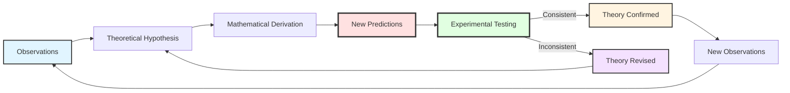
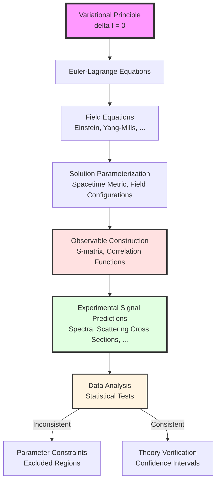
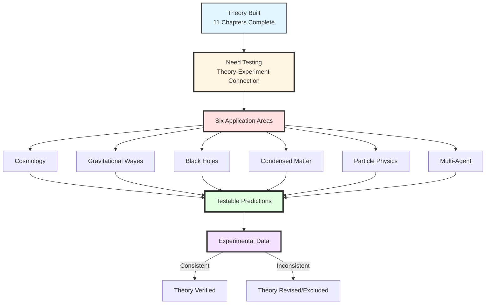

# Chapter 12 Section 0: Introduction—Bridge from Theory to Observation

> **"The true value of a theory lies not in its mathematical elegance, but in whether it can face nature's tests."**

## Chapter Overview

In the previous chapters, we completed the full theoretical framework of GLS theory:

- **Chapters 1-3**: Mathematical tools and core ideas
- **Chapter 4**: Information-Geometric Variational Principle (IGVP)
- **Chapter 5**: Unified time scale
- **Chapter 6**: Boundary theory
- **Chapter 7**: Causal structure
- **Chapter 8**: Topological constraints
- **Chapter 9**: QCA universe
- **Chapter 10**: Matrix universe and observer theory
- **Chapter 11**: Final unification—deriving all physical laws from a single variational principle

Now, we reach the most critical step in theoretical physics: **connecting theoretical predictions with observational data**.

## 1. Why Do We Need Applications and Testing?

### 1.1 The Dialectical Relationship Between Theory and Experiment

The history of physics tells us:

**Classic Historical Cases**:

| Theory | Key Prediction | Experimental Test | Result |
|--------|---------------|-------------------|--------|
| **Newtonian Mechanics** | Planetary orbits | Astronomical observations | Success (low speed) |
| **General Relativity** | Light deflection | 1919 solar eclipse | Success |
| **Quantum Mechanics** | Electron diffraction | Double-slit experiment | Success |
| **Standard Model** | Higgs particle | LHC 2012 | Success |
| **String Theory** | Supersymmetric particles | LHC to date | **Not found** |

**Core Lesson**:
- No matter how elegant a theory is, **if it cannot produce testable predictions, it is not physics**
- GLS theory must answer: **What does it predict? How can it be tested?**

### 1.2 Unique Challenges of GLS Theory

GLS theory is an **extremely grand unified framework** that attempts to derive all physical laws from a single variational principle

$$
\delta \mathcal{I}[\mathfrak{U}] = 0
$$

This brings unique challenges:

**Challenge 1: Multi-Scale Spanning**
- The theory spans from **Planck scale** ($10^{-35}$ m) to **cosmological scale** ($10^{26}$ m)
- Covering **60 orders of magnitude**
- Different scales require different testing methods

**Challenge 2: Multi-Domain Coverage**
- Gravitational physics (Einstein equations)
- Particle physics (gauge field theory)
- Condensed matter physics (topological phase transitions)
- Cosmology (dark energy, CMB)
- Black hole physics (information paradox)
- Multi-agent systems (observer dynamics)

**Challenge 3: Distinguishing New Physics from Known Physics**
- GLS theory must **reproduce** all known successful predictions
- It must also give **new, unique** testable predictions
- Distinguish "GLS theory predictions" from "repetition of known theories"

### 1.3 Core Questions of This Chapter

This chapter will systematically answer the following questions:

1. **What unique, testable predictions does GLS theory make?**
2. **In which experiments/observations can these predictions be tested?**
3. **Can current experimental precision constrain GLS theory parameters?**
4. **Has GLS theory been excluded by certain observational data?**
5. **Which future experiments are most promising for testing GLS theory?**

## 2. Six Major Application Areas of GLS Theory

Based on the theoretical framework established in previous chapters, GLS theory has unique applications and testable predictions in the following six areas:

```mermaid
graph TD
    A["GLS Theory<br/>Single Variational Principle"] --> B["Cosmological Applications<br/>Cosmology"]
    A --> C["Gravitational Wave Tests<br/>Gravitational Waves"]
    A --> D["Black Hole Physics<br/>Black Hole Physics"]
    A --> E["Condensed Matter Applications<br/>Condensed Matter"]
    A --> F["Particle Physics Tests<br/>Particle Physics"]
    A --> G["Multi-Agent Systems<br/>Multi-Agent Systems"]

    B --> B1["Dark Energy Properties"]
    B --> B2["Cosmological Constant"]
    B --> B3["CMB Anomalies"]

    C --> C1["Lorentz Violation"]
    C --> C2["Dispersion Relations"]
    C --> C3["Group Delay Effects"]

    D --> D1["Black Hole Entropy Formula"]
    D --> D2["Information Paradox"]
    D --> D3["Page Curve"]

    E --> E1["Topological Phase Transitions"]
    E --> E2["Quantum Hall Effect"]
    E --> E3["Emergent Gauge Fields"]

    F --> F1["Neutrino Mass"]
    F --> F2["Strong CP Problem"]
    F --> F3["Standard Model Parameters"]

    G --> G1["Observer Consensus"]
    G --> G2["Entropy Gradient Flow"]
    G --> G3["Distributed Learning"]

    style A fill:#f9f,stroke:#333,stroke-width:4px
    style B fill:#e1f5ff,stroke:#333,stroke-width:2px
    style C fill:#fff4e1,stroke:#333,stroke-width:2px
    style D fill:#ffe1e1,stroke:#333,stroke-width:2px
    style E fill:#e1ffe1,stroke:#333,stroke-width:2px
    style F fill:#f4e1ff,stroke:#333,stroke-width:2px
    style G fill:#ffe1f4,stroke:#333,stroke-width:2px
```

### 2.1 Domain Overview and Core Predictions

Let us briefly overview the core content of each area:

#### Domain 1: Cosmological Applications

**Core Theory**: The master formula of unified time scale

$$
\kappa(\omega) = \frac{\varphi'(\omega)}{\pi} = \rho_{\mathrm{rel}}(\omega) = \frac{1}{2\pi}\mathrm{tr}\,Q(\omega)
$$

Applied to cosmology, it gives a **spectral window interpretation** of dark energy.

**Key Predictions**:
1. Specific relationship between cosmological constant $\Lambda$ and Standard Model parameters:
   $$
   \Lambda_{\mathrm{eff}} = \Lambda_{\mathrm{bare}} + \frac{1}{16\pi^2}\sum_i c_i m_i^4 \ln\left(\frac{M_{\mathrm{UV}}}{m_i}\right)
   $$
   where coefficients $c_i$ are determined by boundary K-class of GLS theory

2. Redshift dependence of dark energy equation of state:
   $$
   w_{\mathrm{de}}(z) = -1 + \beta\,(1+z)^2\kappa_{\mathrm{CMB}}
   $$

3. Specific correction patterns in CMB power spectrum at large scales

**Testing Methods**:
- CMB observations from Planck satellite, JWST
- Large-scale structure surveys from DESI, Euclid
- Dark energy equation of state measurements from Type Ia supernovae

**Analogy**:
> Imagine the universe as a huge concert hall, and dark energy is like the "resonance frequency" of the hall. GLS theory predicts: this resonance frequency is not random, but determined by the "geometric shape" of the hall (K-class of spacetime boundary). We can infer the shape of the hall by measuring "sounds" at different frequencies (galaxies at different redshifts).

---

#### Domain 2: Gravitational Wave Tests

**Core Theory**: The discrete spacetime structure of the QCA universe leads to modified dispersion relations for gravitational wave propagation

$$
\omega^2 = c^2 k^2 \left[1 + \beta_2 (k\ell_{\mathrm{cell}})^2 + \beta_4 (k\ell_{\mathrm{cell}})^4 + \cdots\right]
$$

where $\ell_{\mathrm{cell}}$ is the QCA lattice spacing.

**Key Predictions**:
1. Frequency dependence of gravitational wave group velocity:
   $$
   v_g(\omega) = c\left[1 + \frac{3}{2}\beta_2\left(\frac{\omega\ell_{\mathrm{cell}}}{c}\right)^2\right]
   $$

2. Arrival time difference of gravitational wave signals at different frequencies:
   $$
   \Delta t \sim \frac{D}{c}\beta_2\left(\frac{\Delta\omega\cdot\ell_{\mathrm{cell}}}{c}\right)^2
   $$

3. Energy scale constraint for Lorentz invariance violation:
   $$
   E_{\mathrm{LV}} = \frac{\hbar c}{\ell_{\mathrm{cell}}} \geq 10^{15} \text{ GeV}
   $$

**Testing Methods**:
- Multi-messenger gravitational wave observations from LIGO/Virgo/KAGRA
- Especially electromagnetic counterpart time delay of GW170817 (neutron star merger)
- Future space-based gravitational wave detectors (LISA, Taiji, TianQin)

**Analogy**:
> Imagine spacetime as a "discrete trampoline net" rather than a continuous rubber membrane. When gravitational waves (ripples) propagate on it, high-frequency waves (short wavelength) will "feel" the discreteness of the grid, just like high-pitched sounds have dispersion in granular media. Measuring arrival time differences of gravitational waves at different frequencies is like measuring the "weaving density of the grid".

---

#### Domain 3: Black Hole Physics

**Core Theory**: In the QCA universe, a black hole horizon is a **finite-layer quantum entanglement network**, not a continuous geometric surface.

**Derivation of Bekenstein-Hawking Entropy Formula**:

$$
S_{\mathrm{BH}} = \frac{A}{4G\hbar} = \frac{\eta_{\mathrm{cell}}}{\ell_{\mathrm{cell}}^2} \cdot A
$$

where coefficient matching requires:

$$
\frac{\eta_{\mathrm{cell}}}{\ell_{\mathrm{cell}}^2} = \frac{1}{4G\hbar}
$$

**Key Predictions**:
1. **Microscopic mechanism of Page curve**: Information transmission process in quantum channels $\mathcal{A}$ near the horizon

2. **Generalized entropy fluctuations**: Quantum fluctuations of generalized entropy near black hole horizon
   $$
   \delta S_{\mathrm{gen}} \sim \sqrt{\frac{A}{4G\hbar}}
   $$

3. **Modified Hawking radiation spectrum**: High-frequency cutoff due to QCA discreteness
   $$
   \frac{\mathrm{d}N}{\mathrm{d}\omega} \propto \frac{1}{e^{\hbar\omega/k_BT_H}-1} \cdot \Theta\left(1 - \frac{\omega}{\omega_{\mathrm{cell}}}\right)
   $$

**Testing Methods**:
- Detection of Hawking radiation from primordial black holes (PBH)
- Fine structure of ringdown signals after black hole mergers
- Future quantum gravity experiments (simulated black holes)

**Analogy**:
> A black hole is like an "information compressor". In the classical picture, information is "thrown in" and lost forever. But in the GLS-QCA picture, the black hole horizon is a "quantum post office", where information is "encoded" in the quantum state of the horizon and "slowly mailed out" via Hawking radiation. The Page curve is the time curve of this "mailing progress".

---

#### Domain 4: Condensed Matter Applications

**Core Theory**: Gauge fields emerge from boundary K-class, corresponding to **topological invariants determining bulk properties** in condensed matter systems.

**Integer Quantum Hall Effect (IQHE)**:

Quantization of Hall conductance

$$
\sigma_{xy} = \nu \frac{e^2}{h}, \quad \nu \in \mathbb{Z}
$$

In GLS theory, $\nu$ corresponds to the first Chern number of boundary channel bundle $\mathcal{E}$.

**Key Predictions**:
1. **Critical behavior of topological phase transitions**: At topological phase transition points, generalized entropy gradient flow exhibits singularities
   $$
   \frac{\partial S_{\mathrm{gen}}}{\partial\lambda}\bigg|_{\lambda=\lambda_c} \to \infty
   $$

2. **Gauge fields emerging from lattice**: In specific lattice models (e.g., honeycomb lattice), low-energy effective theory automatically includes $U(1)$ gauge fields

3. **Topologically protected decoherence suppression**: Relationship between decoherence time of topological qubits and topological invariants
   $$
   T_2 \propto e^{\Delta_{\mathrm{top}}/k_BT}
   $$
   where $\Delta_{\mathrm{top}}$ is the topological gap

**Testing Methods**:
- Transport measurements of 2D materials (graphene, topological insulators)
- Decoherence time measurements of topological quantum computing platforms
- Topological phase transition simulations in cold atom systems

**Analogy**:
> Imagine a "magic carpet" (2D material). On an ordinary carpet, paths can be arbitrarily deformed, with infinitely many ways to reach the destination. But on a topological carpet, certain paths are "protected"—no matter how the carpet bends and deforms, as long as it's not torn (topological phase transition), these paths always exist. The quantum Hall effect is electrons flowing along these "protected paths", so conductance is quantized.

---

#### Domain 5: Particle Physics Tests

**Core Theory**: The Standard Model gauge group $SU(3)_C \times SU(2)_L \times U(1)_Y$ emerges from boundary K-class, not as an independent assumption.

**Dirac-seesaw mixing mechanism for neutrino mass**:

$$
m_\nu^{\mathrm{eff}} = m_D - \frac{m_D^2}{M_R}
$$

where $m_D$ is Dirac mass, $M_R$ is Majorana mass of right-handed neutrinos. In the GLS framework, the origins of these two terms are:
- $m_D$: Dirac index of boundary channel bundle
- $M_R$: Kaluza-Klein mass of QCA lattice

**Key Predictions**:
1. **Ratio of neutrino mass squared differences**:
   $$
   \frac{\Delta m_{21}^2}{\Delta m_{32}^2} \approx \frac{\mathrm{ind}_{\mathrm{K}}(\mathcal{E}_1)}{\mathrm{ind}_{\mathrm{K}}(\mathcal{E}_2)}
   $$

2. **Dynamical generation of strong CP phase**: Through $\theta$-term of boundary time geometry
   $$
   \bar{\theta}_{\mathrm{QCD}} = \theta_{\mathrm{gauge}} + \arg\det(M_q) = 0 \pm 10^{-10}
   $$
   GLS theory predicts $\bar{\theta}$ is close to zero because boundary symmetry automatically cancels

3. **Unification energy scale of Standard Model parameters**: All Yukawa couplings satisfy specific relations at some energy scale $\mu_{\mathrm{GLS}}$
   $$
   y_t(\mu_{\mathrm{GLS}}) : y_b(\mu_{\mathrm{GLS}}) : y_\tau(\mu_{\mathrm{GLS}}) = r_1 : r_2 : r_3
   $$
   where ratios $r_i$ are given by K-class invariants

**Testing Methods**:
- Neutrino oscillation experiments (NOvA, T2K, JUNO)
- Electric dipole moment measurements (nEDM, Hg EDM)
- Precision measurements at high-energy colliders (LHC, ILC, CEPC)

**Analogy**:
> The Standard Model is like a "Lego castle" with 19+ adjustable parameters (shapes and sizes of blocks). Traditional view holds these parameters are "randomly chosen". GLS theory says: no, these parameters are actually different projections of the "same blueprint" (boundary K-class). If we find the blueprint, we can predict relationships between all parameters.

---

#### Domain 6: Multi-Agent Systems

**Core Theory**: Dynamics of observer networks are governed by **generalized entropy gradient flow**

$$
\frac{\mathrm{d}\omega_i}{\mathrm{d}\tau} = -\mathrm{grad}_{\mathsf{G}} \mathcal{I}_{\mathrm{obs}}[\{\omega_i\}]
$$

where

$$
\mathcal{I}_{\mathrm{obs}} = \sum_i S(\omega_i \Vert \omega_{\mathrm{bulk}}|_{C_i}) + \sum_{ij} S(\mathcal{C}_{ij*}(\omega_i) \Vert \omega_j)
$$

**Key Predictions**:
1. **Convergence rate of distributed learning**: Inversely proportional to "information geometric curvature" of observer network
   $$
   \tau_{\mathrm{conv}} \propto \frac{1}{\min\mathrm{Ricci}(\mathsf{G})}
   $$

2. **Phase transition of consensus formation**: When network connectivity exceeds critical value, system exhibits "global consensus" phase
   $$
   \langle S(\omega_i \Vert \omega_j)\rangle \to 0, \quad \text{when } \lambda_2(L) > \lambda_c
   $$
   where $\lambda_2(L)$ is the second smallest eigenvalue of graph Laplacian (Fiedler value)

3. **Speed limit of information propagation**: Given by causal diamond geometry
   $$
   v_{\mathrm{info}} \leq c\sqrt{1 - \frac{2\Delta S_{\mathrm{gen}}}{\Delta A/4G\hbar}}
   $$

**Testing Methods**:
- Convergence behavior of distributed machine learning systems
- Opinion dynamics in social networks
- Collective behavior of biological neural networks
- Collaborative detection of quantum sensor networks

**Analogy**:
> Imagine a group of "blind men touching an elephant". Each blind man (observer) can only touch part of the elephant (local observation $\omega_i$), but they can "piece together" the complete image of the elephant (bulk $\omega_{\mathrm{bulk}}$) through communication (channels $\mathcal{C}_{ij}$). GLS theory predicts: this "piecing process" follows a specific "entropy gradient descent" path, not random walk. The fastest piecing method depends on the "communication network topology between blind men" (information geometric curvature).

---

## 3. Testing Methodology Framework

### 3.1 From Variational Principle to Observables

The core of GLS theory is the single variational principle $\delta\mathcal{I}[\mathfrak{U}]=0$. How do we derive specific, observable physical quantities from this abstract mathematical expression?

**Methodological Path**:

**Key Step Analysis**:

#### Step 1: From Functional to Equations

Given consistency functional $\mathcal{I}[\mathfrak{U}]$, variation $\delta\mathcal{I}=0$ gives Euler-Lagrange equations.

**Example: Gravity Part**

$$
\mathcal{I}_{\mathrm{grav}}[g,\omega] = \int_M \left[\frac{A(\partial D_p)}{4G\hbar} - S_{\mathrm{out}}(D_p)\right]\mathrm{d}^4x
$$

Variation gives:

$$
G_{ab} + \Lambda g_{ab} = 8\pi G \langle T_{ab}\rangle
$$

#### Step 2: Solving Field Equations

Under specific symmetry assumptions (e.g., spherical symmetry, axisymmetry, homogeneity and isotropy), solve field equations to obtain metric $g_{\mu\nu}$ and fields $\phi$.

**Example: Schwarzschild Black Hole**

$$
\mathrm{d}s^2 = -\left(1-\frac{2GM}{r}\right)\mathrm{d}t^2 + \left(1-\frac{2GM}{r}\right)^{-1}\mathrm{d}r^2 + r^2\mathrm{d}\Omega^2
$$

#### Step 3: Constructing Observables

Using solutions, construct physical observables (energy spectra, scattering amplitudes, correlation functions, etc.).

**Example: Gravitational Wave Spectrum**

$$
h(f) = \mathcal{A}(M, \eta) \cdot f^{-7/6} \cdot e^{i\Psi(f)}
$$

where phase $\Psi(f)$ contains GLS correction terms.

#### Step 4: Comparing with Data

Compare theoretical predictions with experimental data to extract parameter constraints.

**Example: LIGO Data Fitting**

$$
\ln\mathcal{L}(\ell_{\mathrm{cell}}) = -\frac{1}{2}\sum_i \frac{[h_{\mathrm{obs}}(f_i) - h_{\mathrm{th}}(f_i; \ell_{\mathrm{cell}})]^2}{\sigma_i^2}
$$

Maximum likelihood estimation gives constraints on $\ell_{\mathrm{cell}}$.

### 3.2 Testing Strategies at Different Scales

GLS theory spans multiple scales, each requiring different testing strategies:

| Scale | Typical Objects | Main Testing Methods | Current Precision | GLS Prediction Sensitivity |
|-------|----------------|---------------------|-------------------|---------------------------|
| **Planck Scale** $10^{-35}$ m | Quantum gravity effects | Indirect: high-energy cosmic rays, black hole radiation | $\sim 10^{-30}$ m | Low (requires cumulative effects) |
| **Nucleon Scale** $10^{-15}$ m | Quarks, gluons | Colliders, precision measurements | $\sim 10^{-18}$ m | Medium (strong CP, neutrinos) |
| **Atomic Scale** $10^{-10}$ m | Electrons, photons | Spectroscopy, atom interferometry | $\sim 10^{-15}$ m | Low |
| **Condensed Matter Scale** $10^{-9}$ m | Topological materials | Transport measurements, STM | $\sim 1$ nm | High (topological invariants) |
| **Astrophysical Scale** $10^{3}$ m | Gravitational wave detectors | LIGO/Virgo | $\sim 10^{-18}$ m (strain) | High (dispersion) |
| **Cosmological Scale** $10^{26}$ m | CMB, large-scale structure | Satellites, surveys | $\sim 1$ Mpc | High (dark energy) |

**Key Insight**:
- Effects at Planck scale, though tiny, can be amplified through **accumulation** (e.g., gravitational wave propagation over $10^9$ light-years) or **resonance** (e.g., QCA lattice resonance)
- Tests at different scales can **cross-validate** consistency of GLS theory

### 3.3 Statistical Significance and Systematic Errors

**Significance Standards**:

In particle physics, usually requires $5\sigma$ ($p<3\times10^{-7}$) to announce a "discovery".

For testing GLS theory:
- **Exclusion**: If observational data is inconsistent with predictions at $3\sigma$ level, that parameter region is excluded
- **Hint**: If between $3\sigma$-$5\sigma$, called "hint"
- **Discovery**: If above $5\sigma$, called "discovery"

**Systematic Error Control**:

GLS theory predictions often relate to **small corrections to known physics**, so systematic error control is crucial.

**Example: Gravitational Wave Dispersion**

Theoretical prediction: $\Delta t \sim 10^{-3}$ s (for GW170817)

Sources of systematic errors:
- Intrinsic time delay of source (astrophysical uncertainty)
- Gravitational lensing effects along propagation path
- Calibration uncertainty of detectors

Only when theoretical prediction **significantly exceeds** systematic errors can it be effectively tested.

## 4. Summary of Unique Predictions of GLS Theory

### 4.1 Distinction from Existing Theories

GLS theory must not only reproduce known physics, but also give **unique new predictions**. How to distinguish?

**Criteria**:
1. **Irreducibility**: Predictions cannot be derived from known theories (General Relativity + Standard Model)
2. **Quantitative**: Give specific numerical predictions, not "some effect exists"
3. **Testability**: Can be tested by experiments in foreseeable future ($\sim 10$ years)

**List of Unique Predictions of GLS Theory**:

| Prediction | Mathematical Expression | Distinction from Known Theory | Testability |
|-----------|------------------------|------------------------------|-------------|
| **Redshift dependence of dark energy equation of state** | $w(z) = -1 + \beta(1+z)^2\kappa_{\mathrm{CMB}}$ | GR only predicts $w=-1$ | High (DESI, Euclid) |
| **Gravitational wave dispersion relation** | $v_g = c[1 + \beta_2(\omega\ell)^2]$ | GR predicts $v_g=c$ (strictly) | High (LIGO, LISA) |
| **Quantum fluctuations of black hole entropy** | $\delta S \sim \sqrt{A/4G\hbar}$ | Semiclassical GR has no fluctuations | Medium (future gravitational waves) |
| **Correlation between cosmological constant and SM parameters** | $\Lambda \propto \sum_i c_i m_i^4$ | Standard Model has no such correlation | Medium (precision measurements) |
| **Entropy singularity of topological phase transitions** | $\partial S/\partial\lambda\to\infty$ | No such universal prediction | High (condensed matter experiments) |
| **Neutrino mass ratio** | $\Delta m_{21}^2/\Delta m_{32}^2 = r_K$ | No theoretical prediction | Low (current precision insufficient) |
| **Multi-agent convergence rate** | $\tau \propto 1/\min\mathrm{Ricci}$ | No such geometric correlation | High (machine learning experiments) |

### 4.2 Most Promising "First Signals"

Based on current experimental capabilities and strength of theoretical predictions, the following are the most promising areas for first testing GLS theory in the near future (5-10 years):

**Rank 1: Gravitational Wave Dispersion (LIGO/Virgo + Electromagnetic Counterparts)**

- **Why**: GW170817 already gave constraint $\Delta t < 1.7$ s, future multi-messenger events can improve precision to $\sim 0.1$ s
- **GLS Prediction**: For $\ell_{\mathrm{cell}} \sim 10^{-30}$ m, expect $\Delta t \sim 0.01$-$0.1$ s
- **Timeline**: O4 run (2023-2025)

**Rank 2: Dark Energy Equation of State (DESI, Euclid)**

- **Why**: Ongoing BAO measurements from DESI can improve precision of $w(z)$ to $\Delta w \sim 0.03$
- **GLS Prediction**: $w(z) \approx -1 + 0.05(1+z)^2$ deviates $\sim 0.1$ at $z \sim 1$
- **Timeline**: DESI DR1 (2024), Euclid (2027)

**Rank 3: Entropy Gradient Flow in Topological Materials (Condensed Matter Experiments)**

- **Why**: Topological phase transitions can be precisely controlled in laboratories, and GLS prediction gives clear entropy singularity
- **GLS Prediction**: At topological phase transition point, heat capacity $C_V \sim |\lambda-\lambda_c|^{-\alpha}$, where $\alpha$ is determined by K-class
- **Timeline**: Can be done now

**Rank 4: Ringdown After Black Hole Mergers (LIGO/LISA)**

- **Why**: Ringdown signals are very sensitive to spacetime structure, and GLS theory predicts QCA discreteness will modify quasi-normal mode frequencies
- **GLS Prediction**: $\omega_{\mathrm{QNM}} = \omega_{\mathrm{GR}} + \delta\omega_{\mathrm{QCA}}$, where $\delta\omega/\omega \sim (\ell_{\mathrm{cell}}/M)^2$
- **Timeline**: LISA (2035+)

## 5. Chapter Structure and Content Preview

This chapter will be divided into six parts, systematically demonstrating applications and tests of GLS theory in various fields:

```mermaid
graph LR
    A["00-intro<br/>Introduction"] --> B["01-cosmology<br/>Cosmological Applications"]
    B --> C["02-gravitational-waves<br/>Gravitational Wave Tests"]
    C --> D["03-black-holes<br/>Black Hole Physics"]
    D --> E["04-condensed-matter<br/>Condensed Matter Applications"]
    E --> F["05-particle-physics<br/>Particle Physics Tests"]
    F --> G["06-summary<br/>Summary and Outlook"]

    style A fill:#e1f5ff,stroke:#333,stroke-width:3px
    style B fill:#fff4e1,stroke:#333,stroke-width:2px
    style C fill:#ffe1e1,stroke:#333,stroke-width:2px
    style D fill:#e1ffe1,stroke:#333,stroke-width:2px
    style E fill:#f4e1ff,stroke:#333,stroke-width:2px
    style F fill:#ffe1f4,stroke:#333,stroke-width:2px
    style G fill:#ffffe1,stroke:#333,stroke-width:2px
```

### Section 1: Cosmological Applications

We will derive in detail:
1. **Application of unified time scale in cosmology**
2. **Spectral window mechanism explaining dark energy**
3. **Correlation between cosmological constant and Standard Model parameters**
4. **GLS corrections to CMB power spectrum**
5. **Predictions for large-scale structure**
6. **Comparison with observational data** (Planck, DESI, JWST)

### Section 2: Gravitational Wave Tests

We will derive in detail:
1. **Gravitational wave dispersion relations in QCA universe**
2. **Parameterization of Lorentz violation**
3. **Constraint analysis of GW170817**
4. **Sensitivity predictions for future gravitational wave detectors**
5. **Joint constraints from multi-messenger observations**
6. **Comparison with other quantum gravity theories** (loop quantum gravity, string theory)

### Section 3: Black Hole Physics

We will derive in detail:
1. **QCA horizon model and Bekenstein-Hawking entropy**
2. **GLS solution to information paradox**
3. **Microscopic mechanism of Page curve**
4. **Modified Hawking radiation spectrum**
5. **Ringdown signals of black hole mergers**
6. **Observational constraints on primordial black holes**

### Section 4: Condensed Matter Applications

We will derive in detail:
1. **Boundary K-class and topological invariants**
2. **GLS explanation of quantum Hall effect**
3. **Entropy singularity of topological phase transitions**
4. **Gauge fields emerging from lattice**
5. **Decoherence protection of topological quantum computing**
6. **Experimental implementation and verification**

### Section 5: Particle Physics Tests

We will derive in detail:
1. **Gauge groups emerging from boundary K-class**
2. **Dirac-seesaw mechanism for neutrino mass**
3. **Dynamical solution to strong CP problem**
4. **Unified relations of Standard Model parameters**
5. **Hints of new physics beyond Standard Model**
6. **Constraints from colliders and precision measurements**

### Section 6: Summary and Outlook

We will:
1. **Review core predictions of six major areas**
2. **Summarize current status of experimental constraints**
3. **Look forward to testing prospects in next 5-10 years**
4. **Discuss falsifiability of GLS theory**
5. **Compare with other unified theories**
6. **Open questions and challenges**

## 6. Reading Guide and Prerequisites

### 6.1 Mathematical Prerequisites

To fully understand this chapter, readers should be familiar with:

| Mathematical Tool | Relevant Chapters | Importance |
|------------------|------------------|------------|
| Differential geometry (metric, curvature) | Chapters 1-3 | High |
| Information geometry (Fisher-Rao metric) | Chapter 4 | Medium |
| K-theory and topological invariants | Chapters 6, 8 | High (condensed matter) |
| Functional variation | Chapter 11 | High |
| Quantum field theory (S-matrix, correlation functions) | Chapter 11 | Medium |
| Statistical inference (likelihood, Bayesian) | Appendix | Medium (data analysis) |

### 6.2 Physical Prerequisites

| Physical Field | Relevant Chapters | Importance |
|----------------|------------------|------------|
| General Relativity (Einstein equations, black holes) | Chapter 11 | High |
| Quantum Mechanics (density matrix, entanglement entropy) | Chapter 4 | High |
| Cosmology (FLRW metric, dark energy) | Appendix | High (cosmological applications) |
| Standard Model (gauge theory, neutrinos) | Chapter 11 | Medium (particle physics) |
| Condensed Matter Physics (topological phases, quantum Hall) | Appendix | Medium (condensed matter applications) |
| Gravitational Wave Physics (waveforms, detectors) | Appendix | Medium (gravitational wave tests) |

### 6.3 Suggested Reading Paths

**Path A: Readers with Cosmology/Astrophysics Background**
- Focus: Section 1 (cosmology), Section 2 (gravitational waves), Section 3 (black holes)
- Optional: Section 4 (condensed matter), Section 5 (particle physics)
- Prerequisites: Chapter 5 (unified time scale), Chapter 11 Section 3 (Einstein equation derivation)

**Path B: Readers with High-Energy Physics Background**
- Focus: Section 2 (gravitational waves), Section 5 (particle physics)
- Optional: Section 1 (cosmology), Section 3 (black holes), Section 4 (condensed matter)
- Prerequisites: Chapter 6 (boundary theory), Chapter 11 Section 4 (gauge field emergence)

**Path C: Readers with Condensed Matter Physics Background**
- Focus: Section 4 (condensed matter)
- Optional: Section 5 (particle physics)
- Prerequisites: Chapter 8 (topological constraints), Chapter 6 (boundary K-class)

**Path D: Readers with Data Science/Machine Learning Background**
- Focus: Section 1 (statistical inference methods), Section 6 (data analysis)
- Optional: All sections (as application cases)
- Prerequisites: Chapter 4 (information geometry), Chapter 10 (observer theory)

## 7. Philosophical Reflection on This Chapter

### 7.1 Falsifiability of Theory

Karl Popper emphasized: a scientific theory must be **falsifiable**.

Does GLS theory meet this standard?

**Answer: Yes.**

GLS theory makes many specific, testable predictions:
- If LIGO/Virgo **never observes** gravitational wave dispersion, and precision reaches $\Delta t < 10^{-6}$ s, then $\ell_{\mathrm{cell}} < 10^{-35}$ m is excluded
- If DESI/Euclid measures $w(z) = -1.00 \pm 0.01$ (no redshift dependence), then GLS spectral window mechanism is excluded
- If topological material phase transitions **do not exhibit** entropy singularity, then boundary K-class emergence mechanism needs revision

**Comparison with String Theory**:
- String theory predicts supersymmetric particles at low energy ($< 10^{16}$ GeV), but does not specify specific mass spectrum
- GLS theory predictions can be tested at **current experimental energy scales** (gravitational waves, CMB)

### 7.2 Explanatory Power and Predictive Power

A good theory should have both:
1. **Explanatory power**: Can explain known phenomena
2. **Predictive power**: Can predict new phenomena

**Explanatory Power of GLS Theory**:
- Derives Einstein equations, Yang-Mills equations, Navier-Stokes equations from single variational principle
- Explains why these laws "happen to be compatible": because they come from the same source
- Explains 19+ Standard Model parameters: they are determined by invariants of boundary K-class

**Predictive Power of GLS Theory**:
- Specific form of dark energy equation of state
- Quantitative relationship of gravitational wave dispersion
- Scaling law of black hole entropy fluctuations
- Universality class of topological phase transitions

### 7.3 Beauty and Truth: The Role of Theoretical Elegance

Historically, physicists have often been guided by the "beauty" of theories:
- Dirac predicted positrons, partly based on "symmetry beauty" of equations
- Einstein insisted on general covariance, partly based on "geometric beauty"

Is GLS theory "beautiful"?

**Manifestations of Beauty**:
1. **Unity**: Single variational principle $\delta\mathcal{I}=0$
2. **Inevitability**: Necessary consequences of consistency conditions, not artificial assumptions
3. **Multi-scale harmony**: Same framework spanning 60 orders of magnitude

**But beauty is not the standard**:
> Nature doesn't care about our aesthetics. The only final test is: agreement with experiments.

## 8. Starting from Here

Starting from the next section, we will expand field by field, deriving specific predictions of GLS theory in detail and comparing with observational data.

Each section will include:
1. **Theoretical derivation**: From $\delta\mathcal{I}=0$ to observables
2. **Numerical examples**: Predicted values under specific parameters
3. **Observational comparison**: Fitting with actual data
4. **Parameter constraints**: Current excluded/confirmed regions
5. **Future prospects**: Expectations for next-generation experiments

**Core Goal**:
> Let readers not only understand what GLS theory "says", but also understand "how to test whether what it says is correct".

---

## Core Questions Preview

In the following sections, we will answer:

1. **Section 1**: What is the nature of dark energy? How does the spectral window mechanism explain cosmic accelerated expansion?
2. **Section 2**: How do gravitational waves propagate in the QCA universe? What constraints do LIGO data give?
3. **Section 3**: How is the black hole information paradox solved in the GLS framework? What is the microscopic mechanism of the Page curve?
4. **Section 4**: What is the connection between topological quantum materials and GLS theory? How to test boundary K-class in laboratories?
5. **Section 5**: Can the 19+ parameters of the Standard Model be unified? What is the origin of neutrino mass?
6. **Section 6**: Which experiments are most promising for testing/excluding GLS theory in the next 5-10 years?

## Key Points Review of This Section

**Core Insight**:
> The vitality of a physical theory lies in whether it can face nature's tests. GLS theory unifies all physical laws through a single variational principle, but this is only the beginning. The real test is whether it can withstand tests in gravitational wave detectors, cosmological surveys, condensed matter laboratories, and high-energy colliders. This chapter will systematically demonstrate testable predictions of GLS theory and compare with current best observational data, letting readers judge: is this theory an approximation of truth, or a beautiful illusion?

**Most Important Sentence**:
> **A theory that cannot be tested is not physics; a theory that cannot be falsified is not science.**

---

**Next Section Preview**: In Section 1, we will delve into cosmological applications, deriving in detail how the master formula of unified time scale applies to the dark energy problem, and demonstrate how the spectral window mechanism gives quantitative correlations between cosmological constant and Standard Model parameters. We will calculate GLS corrections to CMB power spectrum and compare with observational data from Planck satellite and JWST to extract parameter constraints.

