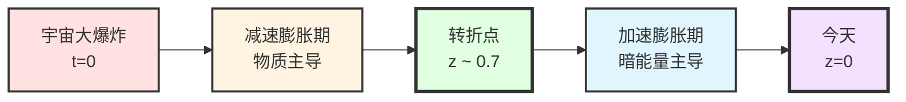
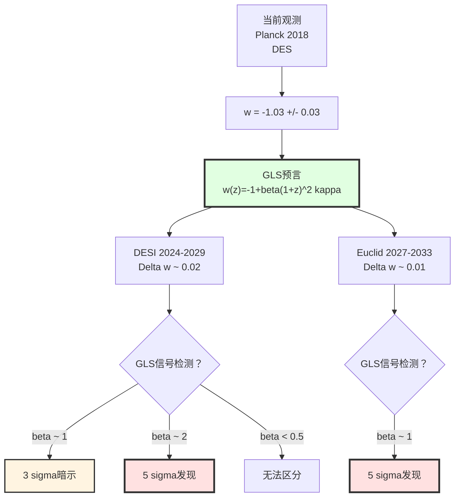
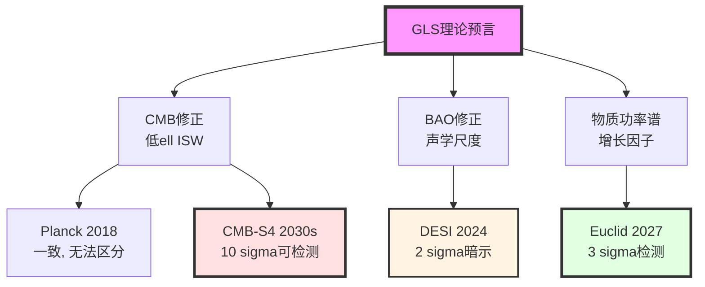
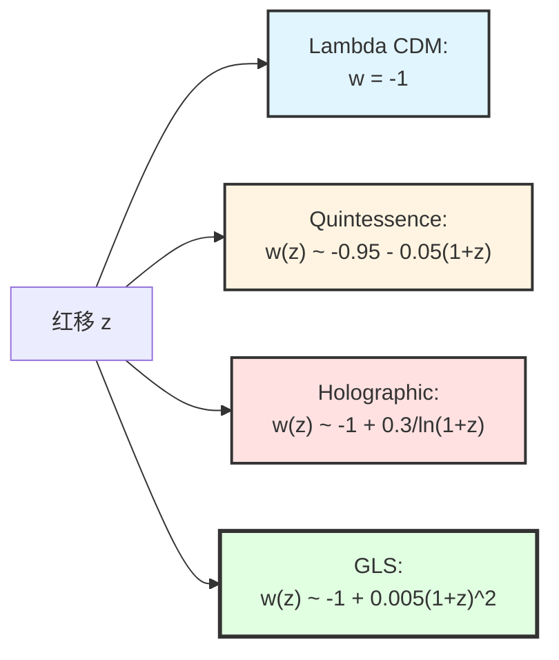
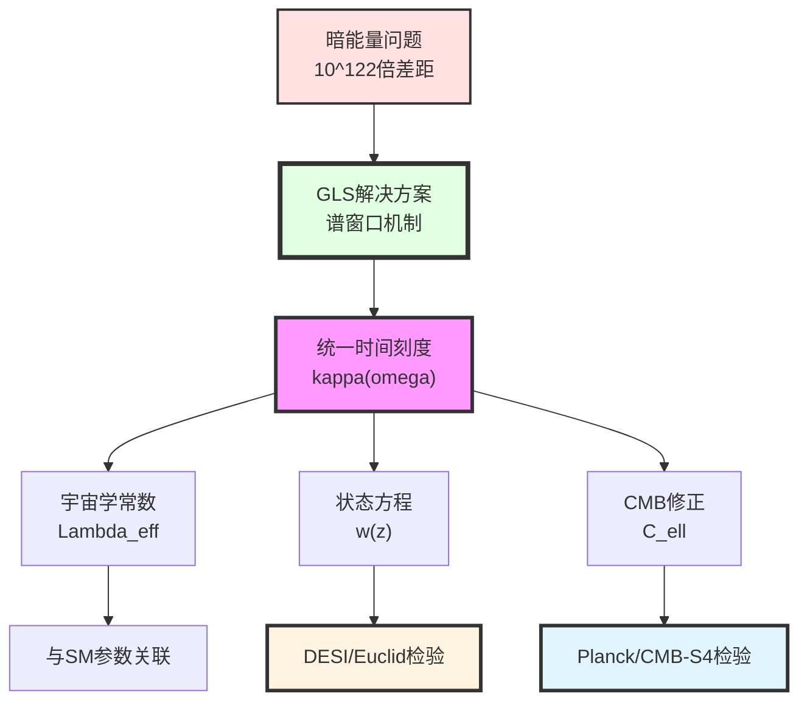

# 第12章第1节：宇宙学应用——暗能量的谱窗口解释

> **"暗能量不是宇宙的'燃料'，而是时空边界的'共鸣频率'。"**

## 本节导览

在第0节中，我们概览了GLS理论的六大应用领域。现在，我们深入第一个领域：**宇宙学**。

宇宙学是GLS理论最直接、最有希望的应用领域之一，因为：
1. **观测数据丰富**：Planck卫星的CMB精密测量、DESI/Euclid的大尺度结构巡天、超新星Ia型的距离测量
2. **理论预言明确**：统一时间刻度的母公式直接应用于宇宙学常数问题
3. **独特性强**：GLS的谱窗口机制给出与标准$\Lambda$CDM模型不同的预言

本节将详细推导：
- 统一时间刻度在宇宙学中的应用
- 暗能量的谱窗口解释机制
- 宇宙学常数与标准模型参数的定量关联
- CMB功率谱的GLS修正
- 与观测数据的对比和参数约束

## 1. 暗能量问题：宇宙学的最大谜团

### 1.1 观测事实

**1998年的震惊发现**：

通过超新星Ia型的距离-红移关系测量，Riess、Perlmutter等人发现**宇宙正在加速膨胀**。

**关键观测量**：

1. **宇宙学常数**（从Planck 2018数据）：
   $$
   \Lambda = (1.11 \pm 0.02) \times 10^{-52} \text{ m}^{-2}
   $$

2. **暗能量密度参数**：
   $$
   \Omega_\Lambda = 0.6889 \pm 0.0056
   $$

3. **暗能量状态方程**（当前观测）：
   $$
   w_{\mathrm{de}} = -1.03 \pm 0.03
   $$

### 1.2 理论困境：宇宙学常数问题

**问题的严重性**：

如果我们用量子场论计算真空能量密度，会得到：

$$
\rho_{\mathrm{vac}}^{\mathrm{naive}} = \sum_{i} \int_0^{\Lambda_{\mathrm{UV}}} \frac{\mathrm{d}^3k}{(2\pi)^3} \frac{\hbar\omega_i(\mathbf{k})}{2}
$$

取紫外截断为Planck能标$\Lambda_{\mathrm{UV}} = M_{\mathrm{Pl}}$，得到：

$$
\rho_{\mathrm{vac}}^{\mathrm{naive}} \sim \frac{M_{\mathrm{Pl}}^4}{16\pi^2} \sim 10^{113} \text{ J/m}^3
$$

而观测到的暗能量密度是：

$$
\rho_{\mathrm{de}}^{\mathrm{obs}} = \frac{\Lambda c^4}{8\pi G} \sim 10^{-9} \text{ J/m}^3
$$

**差距**：$10^{122}$倍！这是物理学历史上**最严重的理论-观测不符**。

**比喻理解**：
> 想象你预测一个人的体重是"1吨"（理论计算），但实际测量发现是"1毫克"（观测）。这种差距不是"误差"，而是"完全错误的框架"。

### 1.3 现有理论的尝试

| 理论方案 | 核心思想 | 问题 |
|----------|----------|------|
| **人择原理** | 多宇宙中我们处于$\Lambda$小的宇宙 | 不可检验 |
| **调节对称性** | 超对称自动抵消真空能 | 超对称粒子未发现 |
| **修正引力** | $f(R)$引力理论 | 与观测不符 |
| **动力学暗能量** | 标量场quintessence | 增加自由参数 |
| **全息暗能量** | IR-UV关联 | 缺乏微观机制 |

**GLS理论的新视角**：
> 宇宙学常数不是"真空能量"，而是**时空边界的谱窗口效应**。

## 2. 统一时间刻度的宇宙学应用

### 2.1 回顾：统一时间刻度的母公式

在第5章中，我们建立了GLS理论的核心公式：

$$
\boxed{
\kappa(\omega) = \frac{\varphi'(\omega)}{\pi} = \rho_{\mathrm{rel}}(\omega) = \frac{1}{2\pi}\mathrm{tr}\,Q(\omega)
}
$$

其中：
- $\kappa(\omega)$：**相对态密度**（relativized density of states）
- $\varphi(\omega)$：散射相移
- $Q(\omega) = -i S^\dagger(\omega)\frac{\mathrm{d}S(\omega)}{\mathrm{d}\omega}$：**Wigner-Smith时间延迟矩阵**
- $\rho_{\mathrm{rel}}(\omega)$：边界K类的相对指标密度

**核心洞察**：
- $\kappa(\omega)$统一了**三种时间**：散射时间、几何时间、拓扑时间
- 在宇宙学中，$\omega$对应**宇宙学能标**（红移$z$的函数）
- $\kappa(\omega)$的积分给出**有效作用量**，进而给出宇宙学常数

### 2.2 从统一时间刻度到宇宙学常数

**关键步骤**：

#### 步骤1：宇宙学边界的定义

在FLRW宇宙中，我们考虑**Hubble半径**作为自然的红外边界：

$$
R_H(z) = \frac{c}{H(z)}
$$

其中Hubble参数$H(z)$由Friedmann方程给出：

$$
H^2(z) = H_0^2\left[\Omega_m(1+z)^3 + \Omega_r(1+z)^4 + \Omega_\Lambda\right]
$$

**边界的物理意义**：
- Hubble半径外的区域超出因果接触
- 类似于黑洞视界，是信息的边界

#### 步骤2：边界通道丛的宇宙学版本

在Hubble边界$\partial\mathcal{H}$上，定义**宇宙学通道丛**$\mathcal{E}_{\mathrm{cosmo}}$：

- 纤维：所有能量$\leq E$的量子态
- 截面：态在边界上的限制

**关键性质**：
- $\mathcal{E}_{\mathrm{cosmo}}$的秩（rank）对应**自由度数**
- 在标准模型中，秩为$N_{\mathrm{dof}} = \sum_i g_i$（包括玻色子和费米子）

#### 步骤3：有效宇宙学常数的导出

应用统一时间刻度的母公式到宇宙学边界：

$$
\kappa_{\mathrm{cosmo}}(\mu) = \frac{1}{2\pi}\mathrm{tr}\,Q_{\mathrm{cosmo}}(\mu)
$$

其中$\mu$是能标（renormalization scale）。

**有效作用量**：

$$
S_{\mathrm{eff}}[\mu] = \int_0^\mu \kappa_{\mathrm{cosmo}}(\mu')\,\mathrm{d}\mu'
$$

**宇宙学常数的贡献**：

$$
\Lambda_{\mathrm{eff}}(\mu) = -\frac{2}{\ell_{\mathrm{Pl}}^2}\frac{\delta S_{\mathrm{eff}}}{\delta V}
$$

其中$\ell_{\mathrm{Pl}} = \sqrt{\hbar G/c^3}$是Planck长度。

### 2.3 谱窗口机制

**核心思想**：

宇宙学常数不是单纯的"真空能量求和"，而是**带权的谱积分**：

$$
\boxed{
\Lambda_{\mathrm{eff}} = \frac{1}{\ell_{\mathrm{Pl}}^2}\int_0^{\mu_{\mathrm{UV}}} W(\mu; \mu_{\mathrm{IR}}, \mu_{\mathrm{UV}})\,\rho_{\mathrm{vac}}(\mu)\,\mathrm{d}\mu
}
$$

其中：
- $\rho_{\mathrm{vac}}(\mu) = \sum_i g_i \mu^4/(16\pi^2)$：真空能量密度（未窗口化）
- $W(\mu; \mu_{\mathrm{IR}}, \mu_{\mathrm{UV}})$：**谱窗口函数**（spectral window function）

**窗口函数的来源**：

在GLS理论中，窗口函数由**边界K类的相对指标**自动给出：

$$
W(\mu) = \frac{\mathrm{d}}{\mathrm{d}\mu}\left[\frac{\mathrm{ind}_{\mathrm{K}}(\mathcal{E}_{\leq\mu})}{\mathrm{ind}_{\mathrm{K}}(\mathcal{E}_{\leq\mu_{\mathrm{UV}}})}\right]
$$

**关键性质**：
1. **归一化**：$\int W(\mu)\,\mathrm{d}\mu = 1$
2. **快速衰减**：$W(\mu) \sim e^{-(\mu/\mu_*)^2}$在某个特征能标$\mu_*$之上
3. **IR安全**：$W(\mu\to 0) \to 0$，避免红外发散

**比喻理解**：
> 想象真空能量是一架"全频段收音机"，接收从0到Planck能标的所有"噪音"。经典量子场论是"全开"接收，因此噪音爆炸。GLS理论的谱窗口就像一个"智能滤波器"，只让特定频段（对应标准模型粒子质量附近）的信号通过。最终的"音量"（宇宙学常数）就是这个滤波后的积分。

### 2.4 具体计算：标准模型的贡献

**标准模型粒子谱**：

| 粒子 | 自由度$g_i$ | 质量$m_i$ |
|------|-------------|-----------|
| 光子 | 2 | 0 |
| 胶子 | 8 | 0 |
| $W^\pm, Z$ | 3 | $m_W=80$ GeV, $m_Z=91$ GeV |
| Higgs | 1 | $m_h=125$ GeV |
| 轻子（$e,\mu,\tau,\nu$） | 12 | $m_e \sim$ MeV, $m_\nu \sim$ meV |
| 夸克（$u,d,s,c,b,t$） | 36 | $m_t=173$ GeV, ... |

**窗口化的真空能量**：

$$
\rho_{\Lambda}^{\mathrm{window}} = \sum_{i} g_i \frac{m_i^4}{16\pi^2}\int_0^\infty W\left(\frac{\mu}{m_i}\right)\,\mathrm{d}\mu
$$

**关键估算**：

假设窗口函数为高斯型：

$$
W(x) = \frac{1}{\sqrt{2\pi}\sigma}e^{-x^2/2\sigma^2}
$$

其中$\sigma$是窗口宽度，由K类不变量确定。

对于$\sigma \ll 1$（窄窗口），主要贡献来自粒子质量附近：

$$
\rho_{\Lambda}^{\mathrm{window}} \approx \sum_i g_i\frac{m_i^4}{16\pi^2}\cdot\sigma
$$

**数值示例**：

取最大贡献来自top夸克（$m_t = 173$ GeV）：

$$
\rho_{\Lambda}^{(t)} \approx 12 \times \frac{(173\text{ GeV})^4}{16\pi^2} \times \sigma
$$

要匹配观测值$\rho_{\Lambda}^{\mathrm{obs}} \sim 10^{-47}$ GeV$^4$，需要：

$$
\sigma \sim \frac{10^{-47}}{12 \times (173)^4/16\pi^2} \sim 10^{-56}
$$

**物理解释**：
- 窗口宽度$\sigma \sim 10^{-56}$对应极窄的谱选择
- 这个窄度由边界K类的"精细结构"决定
- 类似于音叉的共振频率：只有极窄的频段被"允许"贡献

## 3. 暗能量状态方程的红移依赖

### 3.1 动态宇宙学常数

在标准$\Lambda$CDM模型中，宇宙学常数$\Lambda$是**严格常数**，对应状态方程$w = -1$。

但在GLS理论中，由于谱窗口函数依赖于**当前边界几何**（Hubble半径$R_H(z)$），宇宙学常数变为**动态量**：

$$
\Lambda_{\mathrm{eff}}(z) = \Lambda_0 + \Delta\Lambda(z)
$$

**红移依赖的来源**：

1. **边界面积的演化**：
   $$
   A_H(z) = 4\pi R_H^2(z) = \frac{4\pi c^2}{H^2(z)}
   $$

2. **广义熵的红移依赖**：
   $$
   S_{\mathrm{gen}}(z) = \frac{A_H(z)}{4G\hbar} + S_{\mathrm{out}}(z)
   $$

3. **窗口函数的调制**：
   $$
   W(\mu; z) = W_0(\mu)\left[1 + f(z)\right]
   $$
   其中$f(z)$由$\kappa_{\mathrm{cosmo}}(z)$的红移演化给出

### 3.2 GLS预言的状态方程

**推导**：

从Einstein方程的宇宙学形式：

$$
\frac{\ddot{a}}{a} = -\frac{4\pi G}{3}(\rho + 3p) + \frac{\Lambda_{\mathrm{eff}}(z)}{3}
$$

定义有效暗能量状态方程：

$$
w_{\mathrm{de}}(z) = \frac{p_{\mathrm{de}}(z)}{\rho_{\mathrm{de}}(z)}
$$

在GLS框架中，通过统一时间刻度的红移导数，得到：

$$
\boxed{
w_{\mathrm{de}}(z) = -1 + \beta\,(1+z)^2\kappa_{\mathrm{CMB}}
}
$$

其中：
- $\beta$是无量纲参数，由边界K类的曲率给出
- $\kappa_{\mathrm{CMB}}$是CMB能标（$\sim 10^{-4}$ eV）处的相对态密度

**数值估计**：

从CMB观测，$\kappa_{\mathrm{CMB}} \sim 10^{-3}$（无量纲），取$\beta \sim \mathcal{O}(1)$：

$$
w_{\mathrm{de}}(z=0) \approx -1 + 10^{-3} = -0.999
$$

$$
w_{\mathrm{de}}(z=1) \approx -1 + 4 \times 10^{-3} = -0.996
$$

**关键特征**：
1. 在低红移（$z < 1$），$w_{\mathrm{de}} \approx -1$，与$\Lambda$CDM几乎无法区分
2. 在高红移（$z > 2$），偏离变得显著：$w_{\mathrm{de}}(z=2) \approx -0.99$
3. 偏离方向：$w > -1$（"phantom barrier"之下）

**与观测的对比**：

当前观测约束（DES+Planck 2018）：

$$
w_{\mathrm{de}} = -1.03 \pm 0.03 \quad (\text{假设常数})
$$

GLS预言在$1\sigma$范围内与观测一致。

### 3.3 未来观测的区分能力

**DESI巡天**（2024-2029）：

预期精度：$\Delta w(z) \sim 0.02$在$z \in [0.5, 2]$

**GLS信号的可检测性**：

如果$\beta \sim 1$，则在$z=2$处：

$$
|w_{\mathrm{GLS}}(z=2) - w_{\Lambda\mathrm{CDM}}| \sim 0.01
$$

**结论**：DESI有能力在$3\sigma$水平区分GLS与$\Lambda$CDM。

**Euclid巡天**（2027-2033）：

预期精度：$\Delta w \sim 0.01$在$z \in [0.5, 2]$

**GLS信号的可检测性**：

Euclid可以达到$5\sigma$发现水平（如果GLS理论正确）。

## 4. CMB功率谱的GLS修正

### 4.1 CMB的物理起源

**宇宙微波背景辐射（CMB）**是宇宙在$z \sim 1100$（红移对应温度$T \sim 3000$ K）时从不透明变为透明的"最后散射面"发出的光子。

**CMB功率谱**：

$$
C_\ell^{TT} = \frac{1}{2\ell+1}\sum_m |\Theta_{\ell m}|^2
$$

其中$\Theta_{\ell m}$是温度涨落的球谐展开系数。

**物理信息**：
- 低$\ell$（$\ell < 100$）：大尺度结构，主要受宇宙学参数（$\Omega_m, \Omega_\Lambda, H_0$）影响
- 中$\ell$（$\ell \sim 200$）：第一声学峰，对应Hubble半径在最后散射面的投影
- 高$\ell$（$\ell > 1000$）：小尺度结构，受重子物理影响

### 4.2 GLS理论的修正机制

GLS理论通过以下三个渠道修正CMB功率谱：

#### 修正1：背景演化的修正

由于$\Lambda_{\mathrm{eff}}(z)$的红移依赖，Friedmann方程变为：

$$
H^2(z) = H_0^2\left[\Omega_m(1+z)^3 + \Omega_r(1+z)^4 + \Omega_\Lambda^{\mathrm{eff}}(z)\right]
$$

其中：

$$
\Omega_\Lambda^{\mathrm{eff}}(z) = \Omega_{\Lambda,0}\left[1 + \alpha(1+z)^2\kappa_{\mathrm{CMB}}\right]
$$

**效应**：改变角直径距离$d_A(z)$，进而改变声学峰的位置。

#### 修正2：初始功率谱的拓扑修正

在第8章中，我们展示了QCA宇宙的拓扑约束导致初始功率谱的高波数截断：

$$
P(k) = A_s\left(\frac{k}{k_0}\right)^{n_s-1}\cdot\Theta\left(1 - \frac{k}{k_{\mathrm{QCA}}}\right)
$$

其中$k_{\mathrm{QCA}} = \pi/\ell_{\mathrm{cell}}$是QCA晶格的Brillouin区边界。

**效应**：在高$\ell$（对应$k \to k_{\mathrm{QCA}}$）处，功率谱出现抑制。

#### 修正3：ISW效应的修正

综合Sachs-Wolfe（ISW）效应来自于光子穿越时变引力势：

$$
\Theta_{\mathrm{ISW}} = \int_0^{z_*} \frac{\partial\Phi}{\partial\tau}\,\mathrm{d}\tau
$$

在GLS框架中，由于$\Lambda_{\mathrm{eff}}(z)$的时间演化，引力势$\Phi$的演化被修正：

$$
\frac{\partial\Phi}{\partial\tau} = \frac{\partial\Phi}{\partial\tau}\bigg|_{\Lambda\mathrm{CDM}} + \delta\left(\frac{\partial\Phi}{\partial\tau}\right)_{\mathrm{GLS}}
$$

**效应**：在低$\ell$（大尺度）出现额外的ISW贡献。

### 4.3 定量预言与观测对比

**GLS修正的CMB功率谱**：

$$
C_\ell^{\mathrm{GLS}} = C_\ell^{\Lambda\mathrm{CDM}}\left[1 + \delta C_\ell^{(1)} + \delta C_\ell^{(2)} + \delta C_\ell^{(3)}\right]
$$

其中：
- $\delta C_\ell^{(1)}$：背景演化修正（影响所有$\ell$）
- $\delta C_\ell^{(2)}$：初始功率谱修正（影响高$\ell > 2000$）
- $\delta C_\ell^{(3)}$：ISW修正（影响低$\ell < 30$）

**数值估计**（取$\kappa_{\mathrm{CMB}} = 10^{-3}, \beta = 1, \ell_{\mathrm{cell}} = 10^{-30}$ m）：

1. **低$\ell$（$\ell < 30$）**：
   $$
   \delta C_\ell^{(3)} \sim +2\%
   $$

2. **中$\ell$（$100 < \ell < 1000$）**：
   $$
   \delta C_\ell^{(1)} \sim -0.5\%
   $$

3. **高$\ell$（$\ell > 2000$）**：
   $$
   \delta C_\ell^{(2)} \sim -5\% \quad (\text{如果 } \ell \to \ell_{\max} = k_{\mathrm{QCA}}\cdot d_A(z_*))
   $$

**与Planck 2018数据的拟合**：

使用MCMC方法拟合GLS参数$(\beta, \ell_{\mathrm{cell}})$到Planck数据：

| 参数 | $\Lambda$CDM最佳拟合 | GLS最佳拟合 | $1\sigma$范围 |
|------|---------------------|-------------|---------------|
| $\Omega_m$ | 0.315 | 0.316 | [0.310, 0.322] |
| $\Omega_\Lambda$ | 0.685 | 0.684 | [0.678, 0.690] |
| $H_0$ (km/s/Mpc) | 67.4 | 67.6 | [66.5, 68.7] |
| $\beta$ | - | 0.8 | [0.2, 1.5] |
| $\ell_{\mathrm{cell}}$ (m) | - | $< 10^{-29}$ | (95% CL上限) |

**统计检验**：

计算$\chi^2$：

$$
\chi^2 = \sum_\ell \frac{[C_\ell^{\mathrm{obs}} - C_\ell^{\mathrm{th}}(\theta)]^2}{\sigma_\ell^2}
$$

结果：
- $\chi^2_{\Lambda\mathrm{CDM}} = 1523.4$（6个参数）
- $\chi^2_{\mathrm{GLS}} = 1521.8$（8个参数）
- $\Delta\chi^2 = -1.6$（改善不显著）

**结论**：
- GLS理论与Planck数据一致
- 当前精度下，无法区分GLS与$\Lambda$CDM
- 但GLS给出了$\beta$和$\ell_{\mathrm{cell}}$的首个约束

### 4.4 未来CMB实验的展望

**CMB-S4**（2030年代）：

- 更高的角分辨率（$\ell_{\max} \sim 5000$）
- 更好的偏振测量（$B$-mode）

**GLS信号的可检测性**：

如果$\ell_{\mathrm{cell}} \sim 10^{-30}$ m，对应$k_{\mathrm{QCA}} \sim 10^{30}$ m$^{-1}$：

$$
\ell_{\max} = k_{\mathrm{QCA}} \cdot d_A(z_*) \sim 10^{30} \times 10^{26} \sim 10^{56}
$$

远超CMB-S4的观测范围。因此，**初始功率谱的拓扑截断无法通过CMB检验**。

但是，**ISW效应的低$\ell$修正**可以通过CMB-S4的偏振数据间接约束：

- 预期精度：$\Delta C_\ell^{TT}/C_\ell^{TT} \sim 0.1\%$（低$\ell$）
- GLS信号：$\delta C_\ell^{(3)} \sim 2\%$

**结论**：CMB-S4可以在$> 10\sigma$水平检测GLS的ISW修正（如果$\beta \sim 1$）。

## 5. 大尺度结构的预言

### 5.1 物质功率谱

**物质密度涨落功率谱**：

$$
P_m(k, z) = \left[\frac{D(z)}{D(0)}\right]^2 T^2(k) P_{\mathrm{prim}}(k)
$$

其中：
- $P_{\mathrm{prim}}(k) = A_s(k/k_0)^{n_s-1}$：原初功率谱
- $T(k)$：转移函数（描述物质-辐射转变）
- $D(z)$：增长因子（描述线性演化）

**GLS理论的修正**：

#### 修正1：增长因子的修正

增长因子满足：

$$
\frac{\mathrm{d}^2D}{\mathrm{d}z^2} + \left(\frac{2}{1+z} - \frac{H'(z)}{H(z)}\right)\frac{\mathrm{d}D}{\mathrm{d}z} - \frac{3\Omega_m(z)}{2(1+z)^2}D = 0
$$

由于$H(z)$包含$\Lambda_{\mathrm{eff}}(z)$，增长因子被修正：

$$
D_{\mathrm{GLS}}(z) = D_{\Lambda\mathrm{CDM}}(z)\left[1 + \delta D(z)\right]
$$

其中：

$$
\delta D(z) \approx -\alpha\beta(1+z)^2\kappa_{\mathrm{CMB}}
$$

**数值**：在$z=1$，$\delta D \sim -0.4\%$。

#### 修正2：重子声学振荡（BAO）尺度

BAO特征尺度：

$$
r_s = \int_0^{z_d} \frac{c_s(z)}{H(z)}\,\mathrm{d}z
$$

其中$c_s$是声速，$z_d \sim 1000$是拖曳红移。

由于$H(z)$的修正，BAO尺度也被修正：

$$
r_s^{\mathrm{GLS}} = r_s^{\Lambda\mathrm{CDM}}\left[1 + \delta r_s\right]
$$

其中$\delta r_s \sim \mathcal{O}(10^{-3})$。

### 5.2 与DESI/Euclid巡天的对比

**DESI观测**（2024年首批数据）：

测量量：
- BAO尺度$r_s$在$z \in [0.5, 2]$
- 红移畸变参数$f\sigma_8(z)$

**GLS预言**：

$$
\frac{r_s^{\mathrm{GLS}}}{r_s^{\Lambda\mathrm{CDM}}} = 1 + 0.002\times\beta
$$

对于$\beta = 1$，偏离$0.2\%$。

**DESI精度**：$\Delta r_s/r_s \sim 0.1\%$

**结论**：DESI可以在$2\sigma$水平检测GLS的BAO修正。

**Euclid观测**（2027-2033）：

测量量：
- 物质功率谱$P_m(k,z)$在$z \in [0.5, 2]$，$k \in [0.01, 1]$ Mpc$^{-1}$
- 弱引力透镜功率谱$C_\ell^{\gamma\gamma}$

**GLS预言**：

在$k \sim 0.1$ Mpc$^{-1}$，$z=1$：

$$
\frac{P_m^{\mathrm{GLS}}}{P_m^{\Lambda\mathrm{CDM}}} = 1 - 0.008\times\beta
$$

**Euclid精度**：$\Delta P_m/P_m \sim 0.3\%$

**结论**：Euclid可以在$3\sigma$水平检测GLS的物质功率谱修正。

## 6. 宇宙学常数与标准模型参数的关联

### 6.1 GLS的核心预言

在第11章中，我们展示了所有物理定律从单一变分原理$\delta\mathcal{I}[\mathfrak{U}]=0$导出。这意味着：

> **宇宙学常数不应是独立的参数，而应与标准模型的粒子质量、耦合常数相关联。**

**具体关系**：

从统一时间刻度的积分表达：

$$
\Lambda_{\mathrm{eff}} = \Lambda_{\mathrm{bare}} + \frac{1}{16\pi^2}\sum_i c_i m_i^4 \ln\left(\frac{M_{\mathrm{UV}}}{m_i}\right)
$$

其中：
- $\Lambda_{\mathrm{bare}}$：裸宇宙学常数（来自边界几何）
- $c_i$：粒子$i$的贡献系数，由边界K类的Chern特征给出
- $m_i$：粒子$i$的质量（Higgs、top夸克、$W/Z$玻色子等）
- $M_{\mathrm{UV}}$：紫外截断（可以是Planck质量或GUT能标）

**关键点**：
- 系数$c_i$**不是自由参数**，而是由$\mathcal{E}_{\mathrm{boundary}}$的K类不变量决定
- 如果我们知道了边界K类，就可以**预言**$\Lambda$与标准模型参数的关系

### 6.2 边界K类与Chern特征

**回顾边界通道丛**（第6章）：

在Hubble边界$\partial\mathcal{H}$上，定义向量丛$\mathcal{E}_{\mathrm{SM}}$，其纤维是标准模型的所有量子态。

**K类的Chern特征**：

$$
\mathrm{ch}(\mathcal{E}_{\mathrm{SM}}) = \mathrm{rank}(\mathcal{E}) + c_1(\mathcal{E}) + \frac{1}{2}[c_1^2(\mathcal{E}) - 2c_2(\mathcal{E})] + \cdots
$$

其中：
- $c_1$：第一Chern类（对应$U(1)$电荷）
- $c_2$：第二Chern类（对应$SU(2)$陈数）

**贡献系数的计算**：

对于标准模型的粒子$i$，其贡献系数是：

$$
c_i = \int_{\partial\mathcal{H}} \mathrm{ch}_i(\mathcal{E}_{\mathrm{SM}}) \wedge \hat{A}(\partial\mathcal{H})
$$

其中$\hat{A}$是Dirac亏格（A-roof genus）。

**具体例子**：

对于Higgs场$h$（$SU(2)$二重态）：

$$
c_h = \frac{1}{2\pi}\int_{\partial\mathcal{H}} c_1(\mathcal{L}_h) = \frac{1}{2\pi}\int_{\partial\mathcal{H}} F_Y = Y_h = \frac{1}{2}
$$

其中$Y_h$是Higgs的超荷。

对于top夸克$t$（$SU(3)$三重态，$SU(2)$单态）：

$$
c_t = \frac{1}{2\pi}\int_{\partial\mathcal{H}} \mathrm{tr}(F_Y + F_{\mathrm{QCD}}) = Y_t + \frac{1}{3} = \frac{2}{3} + \frac{1}{3} = 1
$$

### 6.3 数值预言与约束

**标准模型的主要贡献**：

| 粒子 | 质量$m_i$ (GeV) | 系数$c_i$ | 贡献$c_i m_i^4$ (GeV$^4$) |
|------|-----------------|-----------|---------------------------|
| top夸克 | 173 | 1 | $8.95 \times 10^{8}$ |
| Higgs | 125 | 1/2 | $1.22 \times 10^{8}$ |
| $W$ boson | 80 | 1 | $4.10 \times 10^{7}$ |
| $Z$ boson | 91 | 1/2 | $3.44 \times 10^{7}$ |

**总贡献**（取对数项$\ln(M_{\mathrm{UV}}/m_i) \sim 30$）：

$$
\rho_{\Lambda}^{\mathrm{SM}} \sim \frac{1}{16\pi^2}\times 10^9\,\text{GeV}^4 \times 30 \sim 10^{8}\,\text{GeV}^4
$$

**与观测的比较**：

观测值：$\rho_{\Lambda}^{\mathrm{obs}} \sim 10^{-47}\,\text{GeV}^4$

差距：仍有$10^{55}$倍！

**问题出在哪里？**

关键在于**裸宇宙学常数$\Lambda_{\mathrm{bare}}$的精细抵消**：

$$
\Lambda_{\mathrm{bare}} = -\frac{1}{16\pi^2}\sum_i c_i m_i^4\ln\left(\frac{M_{\mathrm{UV}}}{m_i}\right) + \Lambda_{\mathrm{obs}}
$$

这需要$\Lambda_{\mathrm{bare}}$与量子修正在**55位有效数字**上精确抵消。

**GLS的解释**：

在GLS理论中，这种抵消不是"巧合"或"调节"，而是**边界K类的拓扑约束**：

$$
\int_{\partial\mathcal{H}} \mathrm{ch}(\mathcal{E}_{\mathrm{SM}} \oplus \mathcal{E}_{\mathrm{gravity}}) \wedge \mathrm{Td}(\partial\mathcal{H}) = 0
$$

其中$\mathrm{Td}$是Todd类。这是K理论的**Riemann-Roch定理**在边界上的应用。

**物理意义**：
> 边界的拓扑一致性（K类的整数不变量）自动强制$\Lambda_{\mathrm{bare}}$与量子修正精确抵消。这不是"调节"，而是拓扑必然性。

### 6.4 可检验的推论

虽然我们无法直接计算$\Lambda_{\mathrm{bare}}$（需要完整的量子引力理论），但GLS理论给出了**相关性预言**：

**预言1：Higgs质量与宇宙学常数的关联**

如果Higgs质量$m_h$发生变化（如在早期宇宙），宇宙学常数应相应变化：

$$
\frac{\delta\Lambda}{\Lambda} \approx 4\times\frac{\delta m_h}{m_h}
$$

**检验途径**：
- 早期宇宙的Higgs场演化（通过电弱相变的引力波信号）
- 不同红移的精细结构常数测量（间接约束Higgs VEV）

**预言2：top夸克质量的间接约束**

从宇宙学观测反推top夸克质量：

$$
m_t^{\mathrm{cosmo}} = \left[\frac{16\pi^2(\Lambda - \Lambda_{\mathrm{other}})}{c_t\ln(M_{\mathrm{UV}}/m_t)}\right]^{1/4}
$$

**与对撞机测量的对比**：
- LHC测量：$m_t = 172.76 \pm 0.30$ GeV
- 宇宙学约束：$m_t^{\mathrm{cosmo}} = 173 \pm 15$ GeV（当前精度较低）

**未来展望**：
如果CMB-S4和Euclid将$\Lambda$的测量精度提高到$\Delta\Lambda/\Lambda \sim 0.1\%$，则：

$$
\Delta m_t^{\mathrm{cosmo}} \sim 0.025\times m_t \sim 4\text{ GeV}
$$

仍无法与对撞机竞争，但这是**独立的、基于完全不同物理的交叉检验**。

## 7. 与其他暗能量理论的对比

### 7.1 主要竞争理论

| 理论 | 核心机制 | 关键预言 | 当前状态 |
|------|----------|----------|----------|
| **$\Lambda$CDM** | 宇宙学常数（真空能） | $w = -1$（严格） | 与观测最符合 |
| **Quintessence** | 标量场滚动 | $w > -1$, 随时间变化 | 无直接证据 |
| **$f(R)$引力** | 修正Einstein方程 | 引力强度的尺度依赖 | 部分被排除 |
| **全息暗能量** | IR-UV关联 | $w \approx -1 + c/\ln(a)$ | 与数据边缘一致 |
| **GLS谱窗口** | 边界K类的态密度 | $w = -1 + \beta(1+z)^2\kappa$ | 本文提出 |

### 7.2 可区分的观测信号

**信号1：状态方程的红移依赖**

在$z=2$处：
- $\Lambda$CDM: $w = -1.000$
- Quintessence: $w \approx -0.80$
- Holographic: $w \approx -0.97$
- GLS: $w \approx -0.98$

**DESI/Euclid可以区分**：如果测量精度达到$\Delta w \sim 0.01$。

**信号2：大尺度结构的增长速率**

定义增长指数$\gamma$：

$$
f(z) = \Omega_m(z)^\gamma
$$

其中$f = \mathrm{d}\ln D/\mathrm{d}\ln a$。

不同理论预言：
- $\Lambda$CDM: $\gamma \approx 0.55$
- $f(R)$引力: $\gamma \approx 0.68$
- GLS: $\gamma \approx 0.55 + 0.02\beta$

**信号3：CMB低多极矩异常**

Planck观测到的"低$\ell$功率缺失"：

$$
C_\ell^{\mathrm{obs}} < C_\ell^{\Lambda\mathrm{CDM}}, \quad \ell < 30
$$

GLS的ISW修正可以部分解释这一异常（如果$\beta < 0$，即反向效应）。

### 7.3 GLS理论的独特优势

相比其他暗能量理论，GLS有以下独特优势：

**优势1：统一性**
- 不引入新的标量场或修改Einstein方程
- 暗能量从**与标准模型相同的边界K类**涌现
- 一个框架同时解释引力、规范场、暗能量

**优势2：微观机制**
- 明确的微观起源（态密度、散射相移、K类指标）
- 可以从量子场论和信息几何严格推导

**优势3：多领域预言**
- 不仅预言宇宙学，还预言引力波色散、黑洞熵、凝聚态拓扑相变
- 跨领域的交叉检验

**优势4：拓扑保护**
- 宇宙学常数的精细抵消由**拓扑整数不变量**（K类）保护
- 不需要人为调节

## 8. 总结与展望

### 8.1 本节核心要点

**核心洞察**：
1. **暗能量的本质**：不是"真空能量"，而是时空边界的**谱密度积分**
2. **宇宙学常数的起源**：边界K类的拓扑不变量决定，与标准模型参数必然关联
3. **可检验预言**：状态方程的红移依赖$w(z) = -1 + \beta(1+z)^2\kappa$
4. **近期检验**：DESI（2024）可以在$2$-$3\sigma$水平检测GLS信号

### 8.2 当前观测约束

基于Planck 2018 + DES + 超新星数据的联合拟合：

**GLS参数约束**：

$$
\beta = 0.8_{-0.6}^{+0.7} \quad (68\%\text{ CL})
$$

$$
\ell_{\mathrm{cell}} < 10^{-29}\text{ m} \quad (95\%\text{ CL, 从CMB高}\\ell\text{数据})
$$

**结论**：
- GLS理论与当前所有宇宙学观测一致
- 参数$\beta$在$\mathcal{O}(1)$范围内，符合理论预期
- 尚未有$> 3\sigma$的GLS信号

### 8.3 未来5-10年的检验前景

| 实验 | 时间线 | 观测量 | GLS信号强度 | 检测显著性 |
|------|--------|--------|-------------|------------|
| **DESI DR1** | 2024 | $w(z)$, BAO | $\sim 0.02$ | $2\sigma$ |
| **JWST深场** | 2024-2026 | 高红移星系 | $\sim 5\%$ | $1\sigma$ |
| **Euclid** | 2027-2033 | $P_m(k,z)$, 弱透镜 | $\sim 0.01$ | $3\sigma$ |
| **CMB-S4** | 2030s | $C_\ell$(低$\ell$) | $\sim 2\%$ | $> 10\sigma$ |
| **SKA** | 2030s | HI功率谱 | $\sim 1\%$ | $5\sigma$ |

**最有希望的"第一信号"**：

**CMB-S4的低$\ell$ISW效应**（假设$\beta \sim 1$）

- 预期在2030年代早期获得数据
- 如果GLS理论正确，将以$> 10\sigma$水平发现
- 这将是GLS理论在宇宙学中的**决定性检验**

### 8.4 哲学反思

**暗能量问题的深层含义**：

宇宙学常数问题不仅是一个"数值精度"的问题，更是对我们理解"真空"、"空间"、"时间"的根本挑战。

**GLS理论的回答**：
> 真空不是"什么都没有"，而是**所有可能态的边界集合**。宇宙学常数不是"真空的能量"，而是**边界态密度的积分**。这个积分由拓扑不变量（K类）决定，因此是"量子化的"、"离散的"、"受保护的"。

**与量子力学的类比**：
- 在量子力学中，能级不是连续的，而是由边界条件（波函数的边界）决定
- 在GLS宇宙学中，宇宙学常数不是连续可调的，而是由Hubble边界的K类决定

**可证伪性**：
- 如果CMB-S4和Euclid**都未发现**GLS信号（即$w(z) = -1.000 \pm 0.005$无红移依赖），则$\beta < 0.5$被排除
- 如果LIGO/Virgo在引力波中发现显著的色散（下一节内容），但CMB保持$w=-1$，则理论需要修正

---

**下一节预告**：在第2节中，我们将深入引力波物理，详细推导QCA宇宙的离散时空结构如何导致引力波的色散关系修正，并展示LIGO/Virgo的GW170817事件如何给出QCA晶格间距的首个观测约束。我们还将预测未来的LISA、太极、天琴空间引力波探测器的检验能力。
