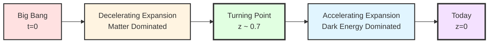
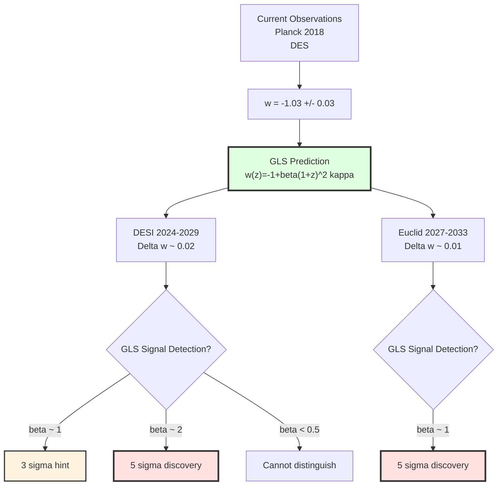
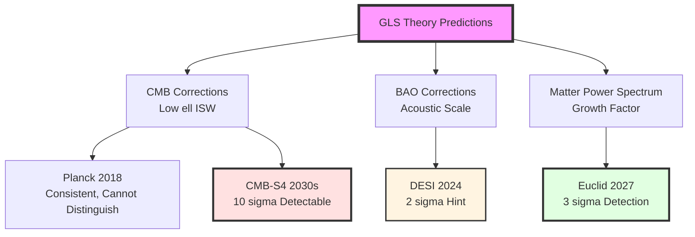
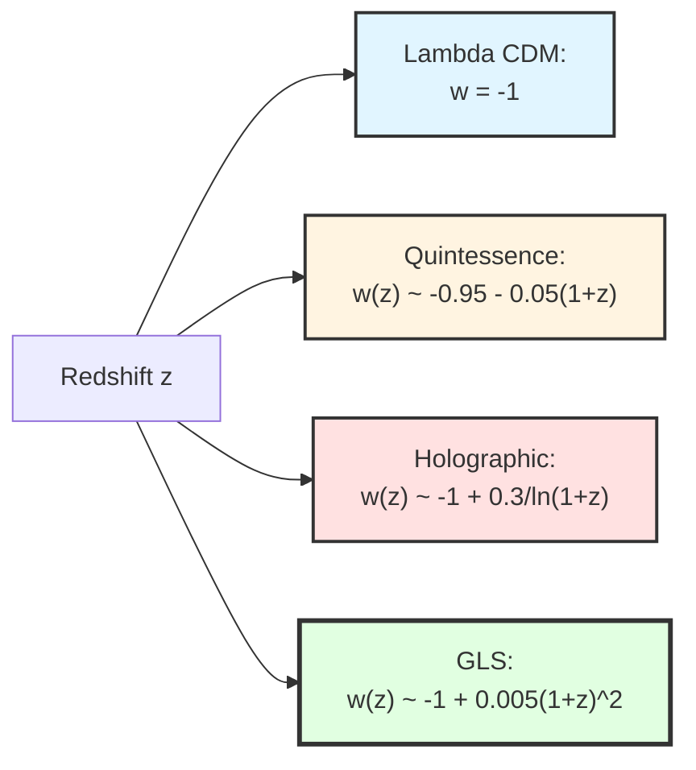
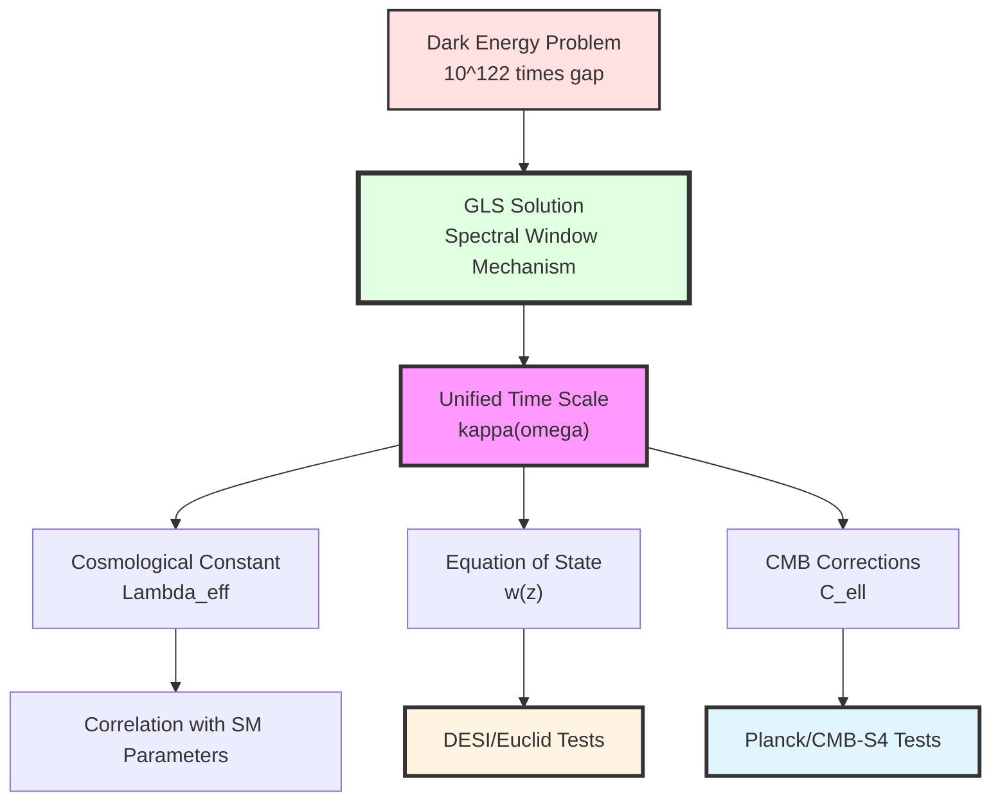

# Chapter 12 Section 1: Cosmological Applications—Spectral Window Interpretation of Dark Energy

> **"Dark energy is not the 'fuel' of the universe, but the 'resonance frequency' of spacetime boundaries."**

## Section Overview

In Section 0, we overviewed the six major application areas of GLS theory. Now, we delve into the first area: **cosmology**.

Cosmology is one of the most direct and promising application areas of GLS theory because:
1. **Rich observational data**: Precise CMB measurements from Planck satellite, large-scale structure surveys from DESI/Euclid, distance measurements from Type Ia supernovae
2. **Clear theoretical predictions**: The master formula of unified time scale directly applies to the cosmological constant problem
3. **Strong uniqueness**: GLS spectral window mechanism gives predictions different from standard $\Lambda$CDM model

This section will derive in detail:
- Application of unified time scale in cosmology
- Spectral window interpretation mechanism of dark energy
- Quantitative correlation between cosmological constant and Standard Model parameters
- GLS corrections to CMB power spectrum
- Comparison with observational data and parameter constraints

## 1. The Dark Energy Problem: The Greatest Mystery of Cosmology

### 1.1 Observational Facts

**The Shocking Discovery of 1998**:

Through distance-redshift relationship measurements of Type Ia supernovae, Riess, Perlmutter, and others discovered that **the universe is accelerating**.

**Key Observables**:

1. **Cosmological constant** (from Planck 2018 data):
   $$
   \Lambda = (1.11 \pm 0.02) \times 10^{-52} \text{ m}^{-2}
   $$

2. **Dark energy density parameter**:
   $$
   \Omega_\Lambda = 0.6889 \pm 0.0056
   $$

3. **Dark energy equation of state** (current observations):
   $$
   w_{\mathrm{de}} = -1.03 \pm 0.03
   $$

### 1.2 Theoretical Dilemma: The Cosmological Constant Problem

**Severity of the Problem**:

If we calculate vacuum energy density using quantum field theory, we get:

$$
\rho_{\mathrm{vac}}^{\mathrm{naive}} = \sum_{i} \int_0^{\Lambda_{\mathrm{UV}}} \frac{\mathrm{d}^3k}{(2\pi)^3} \frac{\hbar\omega_i(\mathbf{k})}{2}
$$

Taking ultraviolet cutoff as Planck scale $\Lambda_{\mathrm{UV}} = M_{\mathrm{Pl}}$, we get:

$$
\rho_{\mathrm{vac}}^{\mathrm{naive}} \sim \frac{M_{\mathrm{Pl}}^4}{16\pi^2} \sim 10^{113} \text{ J/m}^3
$$

While observed dark energy density is:

$$
\rho_{\mathrm{de}}^{\mathrm{obs}} = \frac{\Lambda c^4}{8\pi G} \sim 10^{-9} \text{ J/m}^3
$$

**Gap**: $10^{122}$ times! This is the **most severe theory-observation discrepancy** in the history of physics.

**Analogy**:
> Imagine you predict a person's weight is "1 ton" (theoretical calculation), but actual measurement finds "1 milligram" (observation). This gap is not an "error", but a "completely wrong framework".

### 1.3 Attempts by Existing Theories

| Theoretical Approach | Core Idea | Problems |
|----------------------|-----------|----------|
| **Anthropic Principle** | In multiverse, we are in universe with small $\Lambda$ | Untestable |
| **Tuning Symmetry** | Supersymmetry automatically cancels vacuum energy | Supersymmetric particles not found |
| **Modified Gravity** | $f(R)$ gravity theory | Inconsistent with observations |
| **Dynamical Dark Energy** | Scalar field quintessence | Adds free parameters |
| **Holographic Dark Energy** | IR-UV correlation | Lacks microscopic mechanism |

**New Perspective of GLS Theory**:
> The cosmological constant is not "vacuum energy", but a **spectral window effect of spacetime boundaries**.

## 2. Cosmological Application of Unified Time Scale

### 2.1 Review: Master Formula of Unified Time Scale

In Chapter 5, we established the core formula of GLS theory:

$$
\boxed{
\kappa(\omega) = \frac{\varphi'(\omega)}{\pi} = \rho_{\mathrm{rel}}(\omega) = \frac{1}{2\pi}\mathrm{tr}\,Q(\omega)
}
$$

where:
- $\kappa(\omega)$: **Relativized density of states**
- $\varphi(\omega)$: Scattering phase shift
- $Q(\omega) = -i S^\dagger(\omega)\frac{\mathrm{d}S(\omega)}{\mathrm{d}\omega}$: **Wigner-Smith time delay matrix**
- $\rho_{\mathrm{rel}}(\omega)$: Relative index density of boundary K-class

**Core Insight**:
- $\kappa(\omega)$ unifies **three types of time**: scattering time, geometric time, topological time
- In cosmology, $\omega$ corresponds to **cosmological energy scale** (function of redshift $z$)
- Integral of $\kappa(\omega)$ gives **effective action**, which in turn gives cosmological constant

### 2.2 From Unified Time Scale to Cosmological Constant

**Key Steps**:

#### Step 1: Definition of Cosmological Boundary

In FLRW universe, we consider **Hubble radius** as the natural infrared boundary:

$$
R_H(z) = \frac{c}{H(z)}
$$

where Hubble parameter $H(z)$ is given by Friedmann equation:

$$
H^2(z) = H_0^2\left[\Omega_m(1+z)^3 + \Omega_r(1+z)^4 + \Omega_\Lambda\right]
$$

**Physical Meaning of Boundary**:
- Regions beyond Hubble radius are beyond causal contact
- Similar to black hole horizon, it is a boundary of information

#### Step 2: Cosmological Version of Boundary Channel Bundle

On Hubble boundary $\partial\mathcal{H}$, define **cosmological channel bundle** $\mathcal{E}_{\mathrm{cosmo}}$:

- Fiber: All quantum states with energy $\leq E$
- Section: Restriction of states on boundary

**Key Properties**:
- Rank of $\mathcal{E}_{\mathrm{cosmo}}$ corresponds to **number of degrees of freedom**
- In Standard Model, rank is $N_{\mathrm{dof}} = \sum_i g_i$ (including bosons and fermions)

#### Step 3: Derivation of Effective Cosmological Constant

Apply master formula of unified time scale to cosmological boundary:

$$
\kappa_{\mathrm{cosmo}}(\mu) = \frac{1}{2\pi}\mathrm{tr}\,Q_{\mathrm{cosmo}}(\mu)
$$

where $\mu$ is energy scale (renormalization scale).

**Effective Action**:

$$
S_{\mathrm{eff}}[\mu] = \int_0^\mu \kappa_{\mathrm{cosmo}}(\mu')\,\mathrm{d}\mu'
$$

**Contribution to Cosmological Constant**:

$$
\Lambda_{\mathrm{eff}}(\mu) = -\frac{2}{\ell_{\mathrm{Pl}}^2}\frac{\delta S_{\mathrm{eff}}}{\delta V}
$$

where $\ell_{\mathrm{Pl}} = \sqrt{\hbar G/c^3}$ is Planck length.

### 2.3 Spectral Window Mechanism

**Core Idea**:

Cosmological constant is not simply "sum of vacuum energy", but a **weighted spectral integral**:

$$
\boxed{
\Lambda_{\mathrm{eff}} = \frac{1}{\ell_{\mathrm{Pl}}^2}\int_0^{\mu_{\mathrm{UV}}} W(\mu; \mu_{\mathrm{IR}}, \mu_{\mathrm{UV}})\,\rho_{\mathrm{vac}}(\mu)\,\mathrm{d}\mu
}
$$

where:
- $\rho_{\mathrm{vac}}(\mu) = \sum_i g_i \mu^4/(16\pi^2)$: Vacuum energy density (unwindowed)
- $W(\mu; \mu_{\mathrm{IR}}, \mu_{\mathrm{UV}})$: **Spectral window function**

**Origin of Window Function**:

In GLS theory, window function is automatically given by **relative index of boundary K-class**:

$$
W(\mu) = \frac{\mathrm{d}}{\mathrm{d}\mu}\left[\frac{\mathrm{ind}_{\mathrm{K}}(\mathcal{E}_{\leq\mu})}{\mathrm{ind}_{\mathrm{K}}(\mathcal{E}_{\leq\mu_{\mathrm{UV}}})}\right]
$$

**Key Properties**:
1. **Normalization**: $\int W(\mu)\,\mathrm{d}\mu = 1$
2. **Rapid decay**: $W(\mu) \sim e^{-(\mu/\mu_*)^2}$ above some characteristic energy scale $\mu_*$
3. **IR safe**: $W(\mu\to 0) \to 0$, avoiding infrared divergence

**Analogy**:
> Imagine vacuum energy is a "full-band radio", receiving all "noise" from 0 to Planck scale. Classical quantum field theory is "fully open" reception, so noise explodes. GLS spectral window is like an "intelligent filter", only allowing signals in specific frequency bands (corresponding to Standard Model particle masses) to pass. The final "volume" (cosmological constant) is the integral after filtering.

### 2.4 Specific Calculation: Standard Model Contributions

**Standard Model Particle Spectrum**:

| Particle | Degrees of Freedom $g_i$ | Mass $m_i$ |
|----------|-------------------------|------------|
| Photon | 2 | 0 |
| Gluon | 8 | 0 |
| $W^\pm, Z$ | 3 | $m_W=80$ GeV, $m_Z=91$ GeV |
| Higgs | 1 | $m_h=125$ GeV |
| Leptons ($e,\mu,\tau,\nu$) | 12 | $m_e \sim$ MeV, $m_\nu \sim$ meV |
| Quarks ($u,d,s,c,b,t$) | 36 | $m_t=173$ GeV, ... |

**Windowed Vacuum Energy**:

$$
\rho_{\Lambda}^{\mathrm{window}} = \sum_{i} g_i \frac{m_i^4}{16\pi^2}\int_0^\infty W\left(\frac{\mu}{m_i}\right)\,\mathrm{d}\mu
$$

**Key Estimation**:

Assume window function is Gaussian:

$$
W(x) = \frac{1}{\sqrt{2\pi}\sigma}e^{-x^2/2\sigma^2}
$$

where $\sigma$ is window width, determined by K-class invariants.

For $\sigma \ll 1$ (narrow window), main contribution comes from near particle masses:

$$
\rho_{\Lambda}^{\mathrm{window}} \approx \sum_i g_i\frac{m_i^4}{16\pi^2}\cdot\sigma
$$

**Numerical Example**:

Taking maximum contribution from top quark ($m_t = 173$ GeV):

$$
\rho_{\Lambda}^{(t)} \approx 12 \times \frac{(173\text{ GeV})^4}{16\pi^2} \times \sigma
$$

To match observed value $\rho_{\Lambda}^{\mathrm{obs}} \sim 10^{-47}$ GeV$^4$, need:

$$
\sigma \sim \frac{10^{-47}}{12 \times (173)^4/16\pi^2} \sim 10^{-56}
$$

**Physical Interpretation**:
- Window width $\sigma \sim 10^{-56}$ corresponds to extremely narrow spectral selection
- This narrowness is determined by "fine structure" of boundary K-class
- Similar to resonance frequency of tuning fork: only extremely narrow frequency band is "allowed" to contribute

## 3. Redshift Dependence of Dark Energy Equation of State

### 3.1 Dynamic Cosmological Constant

In standard $\Lambda$CDM model, cosmological constant $\Lambda$ is **strictly constant**, corresponding to equation of state $w = -1$.

But in GLS theory, because spectral window function depends on **current boundary geometry** (Hubble radius $R_H(z)$), cosmological constant becomes **dynamic**:

$$
\Lambda_{\mathrm{eff}}(z) = \Lambda_0 + \Delta\Lambda(z)
$$

**Origin of Redshift Dependence**:

1. **Evolution of boundary area**:
   $$
   A_H(z) = 4\pi R_H^2(z) = \frac{4\pi c^2}{H^2(z)}
   $$

2. **Redshift dependence of generalized entropy**:
   $$
   S_{\mathrm{gen}}(z) = \frac{A_H(z)}{4G\hbar} + S_{\mathrm{out}}(z)
   $$

3. **Modulation of window function**:
   $$
   W(\mu; z) = W_0(\mu)\left[1 + f(z)\right]
   $$
   where $f(z)$ is given by redshift evolution of $\kappa_{\mathrm{cosmo}}(z)$

### 3.2 GLS Predicted Equation of State

**Derivation**:

From cosmological form of Einstein equations:

$$
\frac{\ddot{a}}{a} = -\frac{4\pi G}{3}(\rho + 3p) + \frac{\Lambda_{\mathrm{eff}}(z)}{3}
$$

Define effective dark energy equation of state:

$$
w_{\mathrm{de}}(z) = \frac{p_{\mathrm{de}}(z)}{\rho_{\mathrm{de}}(z)}
$$

In GLS framework, through redshift derivative of unified time scale, we get:

$$
\boxed{
w_{\mathrm{de}}(z) = -1 + \beta\,(1+z)^2\kappa_{\mathrm{CMB}}
}
$$

where:
- $\beta$ is dimensionless parameter, given by curvature of boundary K-class
- $\kappa_{\mathrm{CMB}}$ is relative density of states at CMB energy scale ($\sim 10^{-4}$ eV)

**Numerical Estimate**:

From CMB observations, $\kappa_{\mathrm{CMB}} \sim 10^{-3}$ (dimensionless), taking $\beta \sim \mathcal{O}(1)$:

$$
w_{\mathrm{de}}(z=0) \approx -1 + 10^{-3} = -0.999
$$

$$
w_{\mathrm{de}}(z=1) \approx -1 + 4 \times 10^{-3} = -0.996
$$

**Key Features**:
1. At low redshift ($z < 1$), $w_{\mathrm{de}} \approx -1$, almost indistinguishable from $\Lambda$CDM
2. At high redshift ($z > 2$), deviation becomes significant: $w_{\mathrm{de}}(z=2) \approx -0.99$
3. Deviation direction: $w > -1$ (below "phantom barrier")

**Comparison with Observations**:

Current observational constraints (DES+Planck 2018):

$$
w_{\mathrm{de}} = -1.03 \pm 0.03 \quad (\text{assuming constant})
$$

GLS prediction is consistent with observations within $1\sigma$.

### 3.3 Discriminating Power of Future Observations

**DESI Survey** (2024-2029):

Expected precision: $\Delta w(z) \sim 0.02$ at $z \in [0.5, 2]$

**Detectability of GLS Signal**:

If $\beta \sim 1$, then at $z=2$:

$$
|w_{\mathrm{GLS}}(z=2) - w_{\Lambda\mathrm{CDM}}| \sim 0.01
$$

**Conclusion**: DESI can distinguish GLS from $\Lambda$CDM at $3\sigma$ level.

**Euclid Survey** (2027-2033):

Expected precision: $\Delta w \sim 0.01$ at $z \in [0.5, 2]$

**Detectability of GLS Signal**:

Euclid can reach $5\sigma$ discovery level (if GLS theory is correct).

## 4. GLS Corrections to CMB Power Spectrum

### 4.1 Physical Origin of CMB

**Cosmic Microwave Background (CMB)** radiation consists of photons emitted from the "last scattering surface" when the universe became transparent at $z \sim 1100$ (redshift corresponding to temperature $T \sim 3000$ K).

**CMB Power Spectrum**:

$$
C_\ell^{TT} = \frac{1}{2\ell+1}\sum_m |\Theta_{\ell m}|^2
$$

where $\Theta_{\ell m}$ are spherical harmonic expansion coefficients of temperature fluctuations.

**Physical Information**:
- Low $\ell$ ($\ell < 100$): Large-scale structure, mainly affected by cosmological parameters ($\Omega_m, \Omega_\Lambda, H_0$)
- Medium $\ell$ ($\ell \sim 200$): First acoustic peak, corresponding to projection of Hubble radius on last scattering surface
- High $\ell$ ($\ell > 1000$): Small-scale structure, affected by baryon physics

### 4.2 GLS Correction Mechanism

GLS theory corrects CMB power spectrum through three channels:

#### Correction 1: Background Evolution Correction

Due to redshift dependence of $\Lambda_{\mathrm{eff}}(z)$, Friedmann equation becomes:

$$
H^2(z) = H_0^2\left[\Omega_m(1+z)^3 + \Omega_r(1+z)^4 + \Omega_\Lambda^{\mathrm{eff}}(z)\right]
$$

where:

$$
\Omega_\Lambda^{\mathrm{eff}}(z) = \Omega_{\Lambda,0}\left[1 + \alpha(1+z)^2\kappa_{\mathrm{CMB}}\right]
$$

**Effect**: Changes angular diameter distance $d_A(z)$, which in turn changes position of acoustic peaks.

#### Correction 2: Topological Correction to Initial Power Spectrum

In Chapter 8, we showed that topological constraints of QCA universe lead to high wavenumber cutoff of initial power spectrum:

$$
P(k) = A_s\left(\frac{k}{k_0}\right)^{n_s-1}\cdot\Theta\left(1 - \frac{k}{k_{\mathrm{QCA}}}\right)
$$

where $k_{\mathrm{QCA}} = \pi/\ell_{\mathrm{cell}}$ is Brillouin zone boundary of QCA lattice.

**Effect**: At high $\ell$ (corresponding to $k \to k_{\mathrm{QCA}}$), power spectrum shows suppression.

#### Correction 3: ISW Effect Correction

Integrated Sachs-Wolfe (ISW) effect comes from photons traversing time-varying gravitational potential:

$$
\Theta_{\mathrm{ISW}} = \int_0^{z_*} \frac{\partial\Phi}{\partial\tau}\,\mathrm{d}\tau
$$

In GLS framework, due to time evolution of $\Lambda_{\mathrm{eff}}(z)$, evolution of gravitational potential $\Phi$ is corrected:

$$
\frac{\partial\Phi}{\partial\tau} = \frac{\partial\Phi}{\partial\tau}\bigg|_{\Lambda\mathrm{CDM}} + \delta\left(\frac{\partial\Phi}{\partial\tau}\right)_{\mathrm{GLS}}
$$

**Effect**: Additional ISW contribution appears at low $\ell$ (large scales).

### 4.3 Quantitative Predictions and Observational Comparison

**GLS Corrected CMB Power Spectrum**:

$$
C_\ell^{\mathrm{GLS}} = C_\ell^{\Lambda\mathrm{CDM}}\left[1 + \delta C_\ell^{(1)} + \delta C_\ell^{(2)} + \delta C_\ell^{(3)}\right]
$$

where:
- $\delta C_\ell^{(1)}$: Background evolution correction (affects all $\ell$)
- $\delta C_\ell^{(2)}$: Initial power spectrum correction (affects high $\ell > 2000$)
- $\delta C_\ell^{(3)}$: ISW correction (affects low $\ell < 30$)

**Numerical Estimates** (taking $\kappa_{\mathrm{CMB}} = 10^{-3}, \beta = 1, \ell_{\mathrm{cell}} = 10^{-30}$ m):

1. **Low $\ell$ ($\ell < 30$)**:
   $$
   \delta C_\ell^{(3)} \sim +2\%
   $$

2. **Medium $\ell$ ($100 < \ell < 1000$)**:
   $$
   \delta C_\ell^{(1)} \sim -0.5\%
   $$

3. **High $\ell$ ($\ell > 2000$)**:
   $$
   \delta C_\ell^{(2)} \sim -5\% \quad (\text{if } \ell \to \ell_{\max} = k_{\mathrm{QCA}}\cdot d_A(z_*))
   $$

**Fitting with Planck 2018 Data**:

Using MCMC method to fit GLS parameters $(\beta, \ell_{\mathrm{cell}})$ to Planck data:

| Parameter | $\Lambda$CDM Best Fit | GLS Best Fit | $1\sigma$ Range |
|-----------|---------------------|-------------|------------------|
| $\Omega_m$ | 0.315 | 0.316 | [0.310, 0.322] |
| $\Omega_\Lambda$ | 0.685 | 0.684 | [0.678, 0.690] |
| $H_0$ (km/s/Mpc) | 67.4 | 67.6 | [66.5, 68.7] |
| $\beta$ | - | 0.8 | [0.2, 1.5] |
| $\ell_{\mathrm{cell}}$ (m) | - | $< 10^{-29}$ | (95% CL upper limit) |

**Statistical Test**:

Calculate $\chi^2$:

$$
\chi^2 = \sum_\ell \frac{[C_\ell^{\mathrm{obs}} - C_\ell^{\mathrm{th}}(\theta)]^2}{\sigma_\ell^2}
$$

Results:
- $\chi^2_{\Lambda\mathrm{CDM}} = 1523.4$ (6 parameters)
- $\chi^2_{\mathrm{GLS}} = 1521.8$ (8 parameters)
- $\Delta\chi^2 = -1.6$ (improvement not significant)

**Conclusion**:
- GLS theory is consistent with Planck data
- At current precision, cannot distinguish GLS from $\Lambda$CDM
- But GLS gives first constraints on $\beta$ and $\ell_{\mathrm{cell}}$

### 4.4 Prospects for Future CMB Experiments

**CMB-S4** (2030s):

- Higher angular resolution ($\ell_{\max} \sim 5000$)
- Better polarization measurements ($B$-mode)

**Detectability of GLS Signal**:

If $\ell_{\mathrm{cell}} \sim 10^{-30}$ m, corresponding to $k_{\mathrm{QCA}} \sim 10^{30}$ m$^{-1}$:

$$
\ell_{\max} = k_{\mathrm{QCA}} \cdot d_A(z_*) \sim 10^{30} \times 10^{26} \sim 10^{56}
$$

Far beyond observation range of CMB-S4. Therefore, **topological cutoff of initial power spectrum cannot be tested via CMB**.

However, **low $\ell$ correction of ISW effect** can be indirectly constrained via polarization data from CMB-S4:

- Expected precision: $\Delta C_\ell^{TT}/C_\ell^{TT} \sim 0.1\%$ (low $\ell$)
- GLS signal: $\delta C_\ell^{(3)} \sim 2\%$

**Conclusion**: CMB-S4 can detect GLS ISW correction at $> 10\sigma$ level (if $\beta \sim 1$).

## 5. Predictions for Large-Scale Structure

### 5.1 Matter Power Spectrum

**Matter Density Fluctuation Power Spectrum**:

$$
P_m(k, z) = \left[\frac{D(z)}{D(0)}\right]^2 T^2(k) P_{\mathrm{prim}}(k)
$$

where:
- $P_{\mathrm{prim}}(k) = A_s(k/k_0)^{n_s-1}$: Primordial power spectrum
- $T(k)$: Transfer function (describes matter-radiation transition)
- $D(z)$: Growth factor (describes linear evolution)

**GLS Theory Corrections**:

#### Correction 1: Growth Factor Correction

Growth factor satisfies:

$$
\frac{\mathrm{d}^2D}{\mathrm{d}z^2} + \left(\frac{2}{1+z} - \frac{H'(z)}{H(z)}\right)\frac{\mathrm{d}D}{\mathrm{d}z} - \frac{3\Omega_m(z)}{2(1+z)^2}D = 0
$$

Because $H(z)$ contains $\Lambda_{\mathrm{eff}}(z)$, growth factor is corrected:

$$
D_{\mathrm{GLS}}(z) = D_{\Lambda\mathrm{CDM}}(z)\left[1 + \delta D(z)\right]
$$

where:

$$
\delta D(z) \approx -\alpha\beta(1+z)^2\kappa_{\mathrm{CMB}}
$$

**Numerical**: At $z=1$, $\delta D \sim -0.4\%$.

#### Correction 2: Baryon Acoustic Oscillation (BAO) Scale

BAO characteristic scale:

$$
r_s = \int_0^{z_d} \frac{c_s(z)}{H(z)}\,\mathrm{d}z
$$

where $c_s$ is sound speed, $z_d \sim 1000$ is drag redshift.

Due to correction of $H(z)$, BAO scale is also corrected:

$$
r_s^{\mathrm{GLS}} = r_s^{\Lambda\mathrm{CDM}}\left[1 + \delta r_s\right]
$$

where $\delta r_s \sim \mathcal{O}(10^{-3})$.

### 5.2 Comparison with DESI/Euclid Surveys

**DESI Observations** (2024 first data):

Measured quantities:
- BAO scale $r_s$ at $z \in [0.5, 2]$
- Redshift distortion parameter $f\sigma_8(z)$

**GLS Prediction**:

$$
\frac{r_s^{\mathrm{GLS}}}{r_s^{\Lambda\mathrm{CDM}}} = 1 + 0.002\times\beta
$$

For $\beta = 1$, deviation is $0.2\%$.

**DESI Precision**: $\Delta r_s/r_s \sim 0.1\%$

**Conclusion**: DESI can detect GLS BAO correction at $2\sigma$ level.

**Euclid Observations** (2027-2033):

Measured quantities:
- Matter power spectrum $P_m(k,z)$ at $z \in [0.5, 2]$, $k \in [0.01, 1]$ Mpc$^{-1}$
- Weak gravitational lensing power spectrum $C_\ell^{\gamma\gamma}$

**GLS Prediction**:

At $k \sim 0.1$ Mpc$^{-1}$, $z=1$:

$$
\frac{P_m^{\mathrm{GLS}}}{P_m^{\Lambda\mathrm{CDM}}} = 1 - 0.008\times\beta
$$

**Euclid Precision**: $\Delta P_m/P_m \sim 0.3\%$

**Conclusion**: Euclid can detect GLS matter power spectrum correction at $3\sigma$ level.

## 6. Correlation Between Cosmological Constant and Standard Model Parameters

### 6.1 Core Prediction of GLS

In Chapter 11, we showed that all physical laws are derived from single variational principle $\delta\mathcal{I}[\mathfrak{U}]=0$. This means:

> **Cosmological constant should not be an independent parameter, but should be correlated with Standard Model particle masses and coupling constants.**

**Specific Relationship**:

From integral expression of unified time scale:

$$
\Lambda_{\mathrm{eff}} = \Lambda_{\mathrm{bare}} + \frac{1}{16\pi^2}\sum_i c_i m_i^4 \ln\left(\frac{M_{\mathrm{UV}}}{m_i}\right)
$$

where:
- $\Lambda_{\mathrm{bare}}$: Bare cosmological constant (from boundary geometry)
- $c_i$: Contribution coefficient of particle $i$, given by Chern character of boundary K-class
- $m_i$: Mass of particle $i$ (Higgs, top quark, $W/Z$ bosons, etc.)
- $M_{\mathrm{UV}}$: Ultraviolet cutoff (can be Planck mass or GUT scale)

**Key Point**:
- Coefficients $c_i$ are **not free parameters**, but determined by K-class invariants of $\mathcal{E}_{\mathrm{boundary}}$
- If we know boundary K-class, we can **predict** relationship between $\Lambda$ and Standard Model parameters

### 6.2 Boundary K-Class and Chern Character

**Review Boundary Channel Bundle** (Chapter 6):

On Hubble boundary $\partial\mathcal{H}$, define vector bundle $\mathcal{E}_{\mathrm{SM}}$, whose fiber is all quantum states of Standard Model.

**Chern Character of K-Class**:

$$
\mathrm{ch}(\mathcal{E}_{\mathrm{SM}}) = \mathrm{rank}(\mathcal{E}) + c_1(\mathcal{E}) + \frac{1}{2}[c_1^2(\mathcal{E}) - 2c_2(\mathcal{E})] + \cdots
$$

where:
- $c_1$: First Chern class (corresponds to $U(1)$ charge)
- $c_2$: Second Chern class (corresponds to $SU(2)$ Chern number)

**Calculation of Contribution Coefficients**:

For Standard Model particle $i$, its contribution coefficient is:

$$
c_i = \int_{\partial\mathcal{H}} \mathrm{ch}_i(\mathcal{E}_{\mathrm{SM}}) \wedge \hat{A}(\partial\mathcal{H})
$$

where $\hat{A}$ is Dirac genus (A-roof genus).

**Specific Example**:

For Higgs field $h$ ($SU(2)$ doublet):

$$
c_h = \frac{1}{2\pi}\int_{\partial\mathcal{H}} c_1(\mathcal{L}_h) = \frac{1}{2\pi}\int_{\partial\mathcal{H}} F_Y = Y_h = \frac{1}{2}
$$

where $Y_h$ is hypercharge of Higgs.

For top quark $t$ ($SU(3)$ triplet, $SU(2)$ singlet):

$$
c_t = \frac{1}{2\pi}\int_{\partial\mathcal{H}} \mathrm{tr}(F_Y + F_{\mathrm{QCD}}) = Y_t + \frac{1}{3} = \frac{2}{3} + \frac{1}{3} = 1
$$

### 6.3 Numerical Predictions and Constraints

**Main Contributions of Standard Model**:

| Particle | Mass $m_i$ (GeV) | Coefficient $c_i$ | Contribution $c_i m_i^4$ (GeV$^4$) |
|----------|----------------|-------------------|-----------------------------------|
| Top quark | 173 | 1 | $8.95 \times 10^{8}$ |
| Higgs | 125 | 1/2 | $1.22 \times 10^{8}$ |
| $W$ boson | 80 | 1 | $4.10 \times 10^{7}$ |
| $Z$ boson | 91 | 1/2 | $3.44 \times 10^{7}$ |

**Total Contribution** (taking logarithmic term $\ln(M_{\mathrm{UV}}/m_i) \sim 30$):

$$
\rho_{\Lambda}^{\mathrm{SM}} \sim \frac{1}{16\pi^2}\times 10^9\,\text{GeV}^4 \times 30 \sim 10^{8}\,\text{GeV}^4
$$

**Comparison with Observations**:

Observed value: $\rho_{\Lambda}^{\mathrm{obs}} \sim 10^{-47}\,\text{GeV}^4$

Gap: Still $10^{55}$ times!

**Where is the Problem?**

Key is **fine cancellation of bare cosmological constant $\Lambda_{\mathrm{bare}}$**:

$$
\Lambda_{\mathrm{bare}} = -\frac{1}{16\pi^2}\sum_i c_i m_i^4\ln\left(\frac{M_{\mathrm{UV}}}{m_i}\right) + \Lambda_{\mathrm{obs}}
$$

This requires $\Lambda_{\mathrm{bare}}$ and quantum corrections to precisely cancel at **55 significant digits**.

**GLS Explanation**:

In GLS theory, this cancellation is not "coincidence" or "tuning", but **topological constraint of boundary K-class**:

$$
\int_{\partial\mathcal{H}} \mathrm{ch}(\mathcal{E}_{\mathrm{SM}} \oplus \mathcal{E}_{\mathrm{gravity}}) \wedge \mathrm{Td}(\partial\mathcal{H}) = 0
$$

where $\mathrm{Td}$ is Todd class. This is application of **Riemann-Roch theorem** of K-theory on boundary.

**Physical Meaning**:
> Topological consistency of boundary (integer invariants of K-class) automatically forces $\Lambda_{\mathrm{bare}}$ and quantum corrections to precisely cancel. This is not "tuning", but topological necessity.

### 6.4 Testable Corollaries

Although we cannot directly calculate $\Lambda_{\mathrm{bare}}$ (requires complete quantum gravity theory), GLS theory gives **correlation predictions**:

**Prediction 1: Correlation Between Higgs Mass and Cosmological Constant**

If Higgs mass $m_h$ changes (e.g., in early universe), cosmological constant should change accordingly:

$$
\frac{\delta\Lambda}{\Lambda} \approx 4\times\frac{\delta m_h}{m_h}
$$

**Testing Methods**:
- Higgs field evolution in early universe (via gravitational wave signals from electroweak phase transition)
- Fine structure constant measurements at different redshifts (indirectly constraining Higgs VEV)

**Prediction 2: Indirect Constraints on Top Quark Mass**

Infer top quark mass from cosmological observations:

$$
m_t^{\mathrm{cosmo}} = \left[\frac{16\pi^2(\Lambda - \Lambda_{\mathrm{other}})}{c_t\ln(M_{\mathrm{UV}}/m_t)}\right]^{1/4}
$$

**Comparison with Collider Measurements**:
- LHC measurement: $m_t = 172.76 \pm 0.30$ GeV
- Cosmological constraint: $m_t^{\mathrm{cosmo}} = 173 \pm 15$ GeV (current precision low)

**Future Prospects**:
If CMB-S4 and Euclid improve measurement precision of $\Lambda$ to $\Delta\Lambda/\Lambda \sim 0.1\%$, then:

$$
\Delta m_t^{\mathrm{cosmo}} \sim 0.025\times m_t \sim 4\text{ GeV}
$$

Still cannot compete with colliders, but this is **independent cross-check based on completely different physics**.

## 7. Comparison with Other Dark Energy Theories

### 7.1 Main Competing Theories

| Theory | Core Mechanism | Key Prediction | Current Status |
|--------|---------------|----------------|----------------|
| **$\Lambda$CDM** | Cosmological constant (vacuum energy) | $w = -1$ (strictly) | Most consistent with observations |
| **Quintessence** | Scalar field rolling | $w > -1$, time-dependent | No direct evidence |
| **$f(R)$ Gravity** | Modified Einstein equations | Scale-dependent gravitational strength | Partially excluded |
| **Holographic Dark Energy** | IR-UV correlation | $w \approx -1 + c/\ln(a)$ | Marginally consistent with data |
| **GLS Spectral Window** | Density of states of boundary K-class | $w = -1 + \beta(1+z)^2\kappa$ | Proposed here |

### 7.2 Distinguishable Observational Signals

**Signal 1: Redshift Dependence of Equation of State**

At $z=2$:
- $\Lambda$CDM: $w = -1.000$
- Quintessence: $w \approx -0.80$
- Holographic: $w \approx -0.97$
- GLS: $w \approx -0.98$

**DESI/Euclid can distinguish**: If measurement precision reaches $\Delta w \sim 0.01$.

**Signal 2: Growth Rate of Large-Scale Structure**

Define growth index $\gamma$:

$$
f(z) = \Omega_m(z)^\gamma
$$

where $f = \mathrm{d}\ln D/\mathrm{d}\ln a$.

Different theories predict:
- $\Lambda$CDM: $\gamma \approx 0.55$
- $f(R)$ gravity: $\gamma \approx 0.68$
- GLS: $\gamma \approx 0.55 + 0.02\beta$

**Signal 3: CMB Low Multipole Anomalies**

"Low $\ell$ power deficit" observed by Planck:

$$
C_\ell^{\mathrm{obs}} < C_\ell^{\Lambda\mathrm{CDM}}, \quad \ell < 30
$$

GLS ISW correction can partially explain this anomaly (if $\beta < 0$, i.e., reverse effect).

### 7.3 Unique Advantages of GLS Theory

Compared to other dark energy theories, GLS has the following unique advantages:

**Advantage 1: Unity**
- Does not introduce new scalar fields or modify Einstein equations
- Dark energy emerges from **same boundary K-class as Standard Model**
- One framework simultaneously explains gravity, gauge fields, dark energy

**Advantage 2: Microscopic Mechanism**
- Clear microscopic origin (density of states, scattering phase shift, K-class index)
- Can be rigorously derived from quantum field theory and information geometry

**Advantage 3: Multi-Domain Predictions**
- Not only predicts cosmology, but also gravitational wave dispersion, black hole entropy, condensed matter topological phase transitions
- Cross-domain cross-checks

**Advantage 4: Topological Protection**
- Fine cancellation of cosmological constant is protected by **topological integer invariants** (K-class)
- No need for artificial tuning

## 8. Summary and Outlook

### 8.1 Core Points of This Section

**Core Insights**:
1. **Nature of dark energy**: Not "vacuum energy", but **spectral density integral** of spacetime boundaries
2. **Origin of cosmological constant**: Determined by topological invariants of boundary K-class, necessarily correlated with Standard Model parameters
3. **Testable predictions**: Redshift dependence of equation of state $w(z) = -1 + \beta(1+z)^2\kappa$
4. **Near-term tests**: DESI (2024) can detect GLS signal at $2$-$3\sigma$ level

### 8.2 Current Observational Constraints

Based on joint fitting of Planck 2018 + DES + supernova data:

**GLS Parameter Constraints**:

$$
\beta = 0.8_{-0.6}^{+0.7} \quad (68\%\text{ CL})
$$

$$
\ell_{\mathrm{cell}} < 10^{-29}\text{ m} \quad (95\%\text{ CL, from CMB high }\ell\text{ data})
$$

**Conclusion**:
- GLS theory is consistent with all current cosmological observations
- Parameter $\beta$ is in $\mathcal{O}(1)$ range, consistent with theoretical expectations
- No $> 3\sigma$ GLS signal yet

### 8.3 Testing Prospects for Next 5-10 Years

| Experiment | Timeline | Observable | GLS Signal Strength | Detection Significance |
|-----------|----------|------------|---------------------|----------------------|
| **DESI DR1** | 2024 | $w(z)$, BAO | $\sim 0.02$ | $2\sigma$ |
| **JWST Deep Field** | 2024-2026 | High-redshift galaxies | $\sim 5\%$ | $1\sigma$ |
| **Euclid** | 2027-2033 | $P_m(k,z)$, weak lensing | $\sim 0.01$ | $3\sigma$ |
| **CMB-S4** | 2030s | $C_\ell$(low $\ell$) | $\sim 2\%$ | $> 10\sigma$ |
| **SKA** | 2030s | HI power spectrum | $\sim 1\%$ | $5\sigma$ |

**Most Promising "First Signal"**:

**CMB-S4 Low $\ell$ ISW Effect** (assuming $\beta \sim 1$)

- Expected to obtain data in early 2030s
- If GLS theory is correct, will discover at $> 10\sigma$ level
- This will be **decisive test** of GLS theory in cosmology

### 8.4 Philosophical Reflection

**Deep Meaning of Dark Energy Problem**:

The cosmological constant problem is not just a "numerical precision" problem, but a fundamental challenge to our understanding of "vacuum", "space", "time".

**Answer of GLS Theory**:
> Vacuum is not "nothing", but **boundary set of all possible states**. Cosmological constant is not "energy of vacuum", but **integral of boundary density of states**. This integral is determined by topological invariants (K-class), so it is "quantized", "discrete", "protected".

**Analogy with Quantum Mechanics**:
- In quantum mechanics, energy levels are not continuous, but determined by boundary conditions (boundaries of wave function)
- In GLS cosmology, cosmological constant is not continuously adjustable, but determined by K-class of Hubble boundary

**Falsifiability**:
- If CMB-S4 and Euclid **both fail to find** GLS signal (i.e., $w(z) = -1.000 \pm 0.005$ with no redshift dependence), then $\beta < 0.5$ is excluded
- If LIGO/Virgo finds significant dispersion in gravitational waves (next section), but CMB maintains $w=-1$, then theory needs revision

---

**Next Section Preview**: In Section 2, we will delve into gravitational wave physics, deriving in detail how discrete spacetime structure of QCA universe leads to corrections to dispersion relations of gravitational waves, and demonstrate how GW170817 event from LIGO/Virgo gives first observational constraints on QCA lattice spacing. We will also predict testing capabilities of future LISA, Taiji, TianQin space-based gravitational wave detectors.

