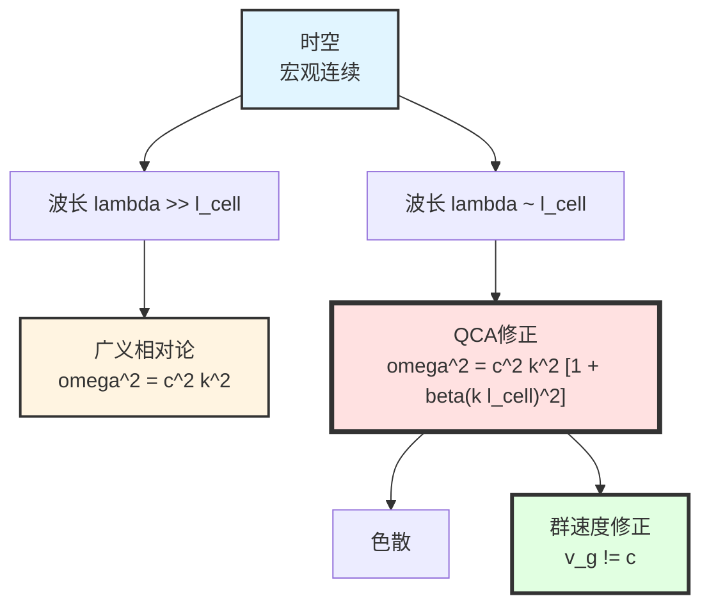
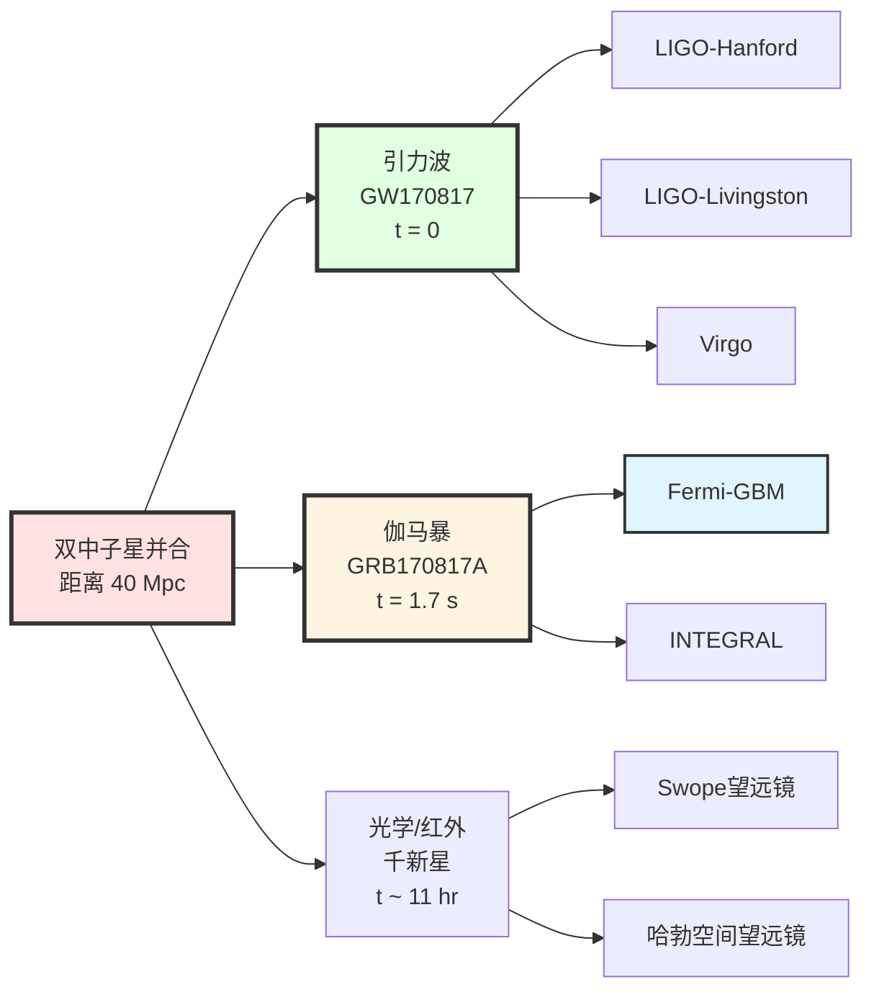
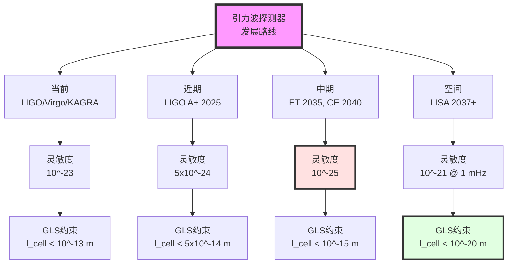
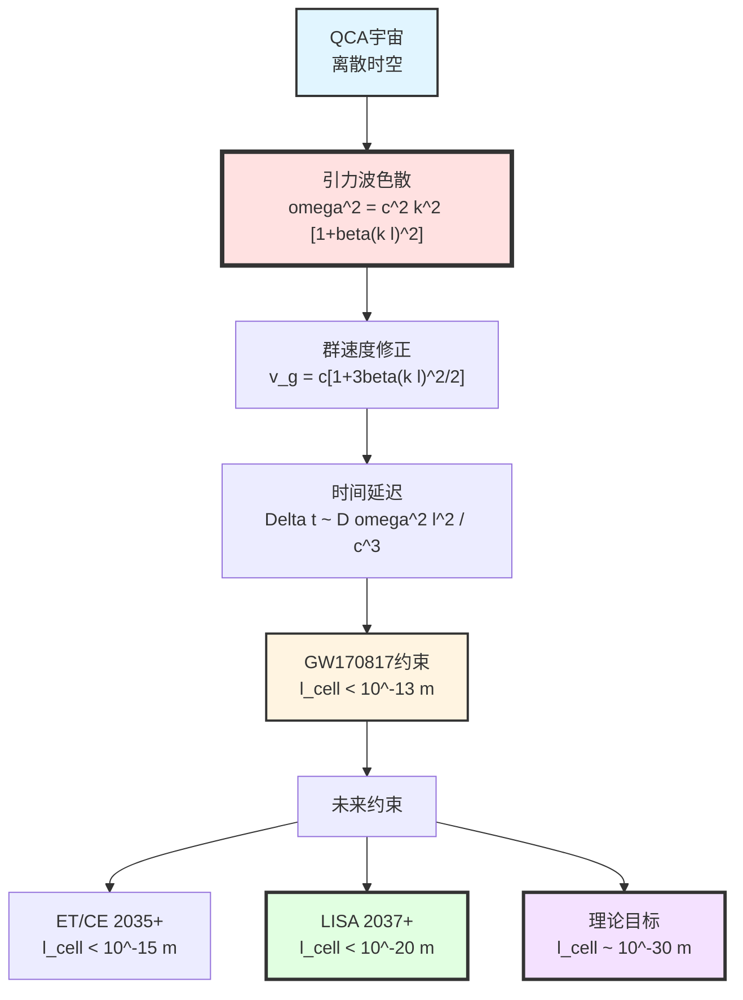

# 第12章第2节：引力波检验——时空离散性的直接探针

> **"引力波是宇宙的'测振仪'，能探测时空最微小的'颤动'——包括它的离散结构。"**

## 本节导览

引力波是GLS理论最直接、最有力的检验场所之一，因为：

1. **高精度测量**：LIGO/Virgo探测器的应变灵敏度达到$10^{-23}$，相当于测量太阳-地球距离的$10^{-11}$倍变化
2. **宇宙学尺度传播**：引力波从源（如双黑洞并合）传播数十亿光年，微小的色散效应可以累积放大
3. **多信使观测**：GW170817（双中子星并合）同时观测到引力波和电磁波，提供了光速与引力波速度的精密对比
4. **清洁信号**：引力波在传播过程中几乎不与物质相互作用，保持"原始信息"

本节将详细推导：
- QCA宇宙的离散时空结构如何修正引力波的色散关系
- 洛伦兹不变性破缺的参数化
- GW170817的多信使观测约束
- 未来引力波探测器（LISA、太极、天琴）的检验能力
- 与其他量子引力理论（圈量子引力、弦论）的对比

## 1. 引力波物理回顾

### 1.1 Einstein的预言与观测确认

**1916年**：Einstein从广义相对论预言**引力波**的存在

- 时空度量的微小扰动$h_{\mu\nu}$满足波动方程
- 在弱场、慢速近似下传播速度为光速$c$

**1974年**：Hulse-Taylor脉冲双星的轨道衰减间接证实引力波（诺贝尔奖1993）

**2015年9月14日**：LIGO首次直接探测到引力波（GW150914，双黑洞并合，诺贝尔奖2017）

**2017年8月17日**：GW170817（双中子星并合）首次实现引力波-电磁波多信使观测

### 1.2 广义相对论中的引力波

**线性化Einstein方程**：

在Minkowski背景$\eta_{\mu\nu}$上考虑小扰动：

$$
g_{\mu\nu} = \eta_{\mu\nu} + h_{\mu\nu}, \quad |h_{\mu\nu}| \ll 1
$$

选择横向-无迹（TT）规范，Einstein方程线性化为：

$$
\Box h_{\mu\nu}^{\mathrm{TT}} = 0
$$

其中$\Box = -\partial_t^2/c^2 + \nabla^2$是d'Alembert算子。

**平面波解**：

$$
h_{\mu\nu}^{\mathrm{TT}} = A_{\mu\nu}e^{i(kx - \omega t)}
$$

**色散关系（GR预言）**：

$$
\boxed{\omega^2 = c^2 k^2} \quad \text{（严格，无色散）}
$$

**群速度与相速度**：

$$
v_{\mathrm{phase}} = \frac{\omega}{k} = c, \quad v_{\mathrm{group}} = \frac{\mathrm{d}\omega}{\mathrm{d}k} = c
$$

**关键点**：
- 在广义相对论中，引力波在真空中传播速度**严格等于光速**
- 任何偏离$v_g \neq c$都是对广义相对论的违背

### 1.3 为什么引力波是量子引力的探针？

**量子引力的普遍预期**：

在接近Planck尺度时，时空不再是连续的光滑流形，而是具有某种"离散"或"涨落"结构。

| 量子引力理论 | 时空微观结构 | 对引力波的预言 |
|--------------|--------------|----------------|
| **圈量子引力（LQG）** | 自旋网络 | 能量依赖的光速修正 |
| **弦论** | 弦长尺度$\ell_s$ | 高阶导数项修正 |
| **因果集** | 离散时空点 | 随机扰动 |
| **GLS-QCA宇宙** | 量子元胞自动机晶格 | 色散关系修正 |

**共同特征**：
- 都预言在某个能标$E_{\mathrm{QG}}$（通常$\sim$ Planck能标$10^{19}$ GeV）附近，洛伦兹不变性被修正
- 引力波频率$\omega$对应能量$E = \hbar\omega$，高频引力波（如并合的ringdown阶段）可能探测到这些修正

**比喻理解**：
> 想象引力波是一艘在海面上航行的船。在经典图像中，海面是"光滑的连续流体"，船的速度不依赖于船的大小（频率）。但如果海水实际上是由"分子"组成的（离散结构），那么小船（高频波）会感受到分子的颗粒性，导致速度略有变化。测量这种速度变化，就能探测"海水的分子结构"（时空的量子结构）。

## 2. QCA宇宙中的引力波传播

### 2.1 回顾：量子元胞自动机（QCA）时空

在第9章中，我们建立了GLS理论的QCA宇宙图景：

**核心思想**：
- 时空在微观上是**离散的量子元胞自动机**
- 晶格间距$\ell_{\mathrm{cell}}$（预期$\sim 10^{-30}$-$10^{-35}$ m）
- 每个元胞的希尔伯特空间维数$d_{\mathrm{cell}}$（如$d=2$对应量子比特）
- 演化由幺正算符$U$给出：$|\Psi(t+\delta t)\rangle = U|\Psi(t)\rangle$

**连续极限**：
- 当波长$\lambda \gg \ell_{\mathrm{cell}}$时，QCA的行为接近连续的场论
- 但当$\lambda \sim \ell_{\mathrm{cell}}$时，离散性效应变得显著

### 2.2 修正色散关系（MDR）的导出

**第一性原理推导**：

从QCA的幺正演化算符出发。考虑最简单的$(1+1)$维QCA：

$$
|\Psi_n(t+\delta t)\rangle = U|\Psi_n(t)\rangle
$$

其中$n$标记晶格格点。

**Fourier变换到动量空间**：

$$
|\tilde{\Psi}(k, t)\rangle = \sum_n e^{-ikn\ell_{\mathrm{cell}}}|\Psi_n(t)\rangle
$$

**连续极限下的有效Schrödinger方程**：

$$
i\hbar\frac{\partial|\tilde{\Psi}\rangle}{\partial t} = E(k)|\tilde{\Psi}\rangle
$$

其中能量-动量关系$E(k)$由QCA的演化算符$U$的本征谱给出。

**在低能（长波长）极限展开**：

对于$k\ell_{\mathrm{cell}} \ll 1$：

$$
E(k) = \hbar c k\left[1 + \beta_2(k\ell_{\mathrm{cell}})^2 + \beta_4(k\ell_{\mathrm{cell}})^4 + \cdots\right]
$$

其中系数$\beta_n$取决于QCA的具体结构（演化算符$U$的形式）。

**推广到$(3+1)$维引力波**：

在GLS-QCA宇宙中，引力波的有效场论包含高阶导数项：

$$
\mathcal{L}_{\mathrm{GW}}^{\mathrm{eff}} = \mathcal{L}_{\mathrm{GR}} + \frac{\ell_{\mathrm{cell}}^2}{2}\partial_\mu h_{\alpha\beta}\Box\partial^\mu h^{\alpha\beta} + \mathcal{O}(\ell_{\mathrm{cell}}^4)
$$

**导出修正色散关系**：

$$
\boxed{
\omega^2 = c^2 k^2\left[1 + \beta_2(k\ell_{\mathrm{cell}})^2 + \beta_4(k\ell_{\mathrm{cell}})^4 + \cdots\right]
}
$$

**系数的估计**：

对于最简单的QCA模型（如$(2+1)$维Toric code），可以显式计算：

$$
\beta_2 \sim \mathcal{O}(1), \quad \beta_4 \sim \mathcal{O}(1)
$$

但具体数值依赖于QCA的细节，在GLS理论中，由**边界K类的曲率不变量**确定（见第6章）。

### 2.3 群速度与相速度的修正

**相速度**：

$$
v_{\mathrm{phase}} = \frac{\omega}{k} = c\sqrt{1 + \beta_2(k\ell_{\mathrm{cell}})^2 + \cdots}
$$

在$k\ell_{\mathrm{cell}} \ll 1$时展开：

$$
v_{\mathrm{phase}} \approx c\left[1 + \frac{1}{2}\beta_2(k\ell_{\mathrm{cell}})^2\right]
$$

**群速度**（更重要，决定能量传播速度）：

$$
v_{\mathrm{group}} = \frac{\mathrm{d}\omega}{\mathrm{d}k}
$$

对修正色散关系微分：

$$
2\omega\mathrm{d}\omega = c^2\mathrm{d}(k^2) + 2c^2\beta_2\ell_{\mathrm{cell}}^2 k\,\mathrm{d}(k^3)
$$

整理得：

$$
v_{\mathrm{group}} = c\frac{1 + 3\beta_2(k\ell_{\mathrm{cell}})^2}{\sqrt{1 + \beta_2(k\ell_{\mathrm{cell}})^2}}
$$

在$k\ell_{\mathrm{cell}} \ll 1$时：

$$
\boxed{
v_{\mathrm{group}} \approx c\left[1 + \frac{3}{2}\beta_2(k\ell_{\mathrm{cell}})^2\right]
}
$$

**关键观察**：
1. 群速度大于相速度（"超光速"，但不违背因果性，因为修正来自真空结构）
2. 群速度依赖于频率（高频引力波传播更快，如果$\beta_2 > 0$）
3. 修正为$\mathcal{O}((k\ell_{\mathrm{cell}})^2)$，对于$\ell_{\mathrm{cell}} \sim 10^{-30}$ m，即使$k \sim 1$ m$^{-1}$（对应$f \sim 50$ Hz的LIGO频段），修正也只有$\sim 10^{-60}$——极其微小！

**如何检验？**

虽然单个周期的修正微小，但引力波传播宇宙学距离（$\sim 10^9$ 光年$\sim 10^{25}$ m），累积效应可观测。

### 2.4 到达时间延迟

考虑引力波从源（距离$D$）传播到地球。

**不同频率的到达时间差**：

$$
\Delta t = \int_0^D \frac{\mathrm{d}\ell}{v_{\mathrm{group}}(\omega)} - \int_0^D \frac{\mathrm{d}\ell}{c}
$$

在小修正近似下：

$$
\Delta t \approx \int_0^D \frac{1}{c}\left[1 - \frac{3\beta_2}{2}(k\ell_{\mathrm{cell}})^2\right]\,\mathrm{d}\ell - \frac{D}{c}
$$

$$
\Delta t \approx -\frac{3\beta_2 D}{2c}(k\ell_{\mathrm{cell}})^2
$$

**频率依赖**：

对于两个频率$\omega_1, \omega_2$的引力波信号：

$$
\boxed{
\Delta t_{12} = \frac{3\beta_2 D}{2c^3}(\omega_2^2 - \omega_1^2)\ell_{\mathrm{cell}}^2
}
$$

**数值估算**（GW150914，$D \sim 400$ Mpc$\sim 10^{25}$ m）：

- 频率范围：$\omega_1 \sim 2\pi \times 35$ Hz，$\omega_2 \sim 2\pi \times 250$ Hz
- 频率平方差：$\omega_2^2 - \omega_1^2 \sim (2\pi)^2 \times 6 \times 10^4$ Hz$^2$
- 晶格间距：$\ell_{\mathrm{cell}} = 10^{-30}$ m

$$
\Delta t_{12} \sim \frac{3 \times 1 \times 10^{25}}{2 \times 3\times10^8} \times (2\pi)^2 \times 6\times10^4 \times 10^{-60}
$$

$$
\Delta t_{12} \sim 10^{-23}\text{ s}
$$

**困难**：
- 这远小于LIGO的时间分辨率（$\sim 10^{-4}$ s）
- 而且，源的内禀时间延迟（并合过程的天体物理不确定性）远大于此

**解决方案**：需要**多信使观测**（下一节）。

## 3. 洛伦兹不变性破缺的参数化

### 3.1 有效场论框架（SME）

**标准模型扩展（Standard Model Extension, SME）**：

Kostelecký等人提出的系统性框架，用于参数化所有可能的洛伦兹破缺效应。

**对引力波的应用**：

在SME中，引力波的修正色散关系写为：

$$
\omega^2 = c^2k^2 + \sum_{n=0}^\infty \alpha^{(n)}(k\ell_{\mathrm{LV}})^n k^2
$$

其中：
- $\ell_{\mathrm{LV}}$：洛伦兹破缺能标的倒数（如$\ell_{\mathrm{LV}} = \ell_{\mathrm{Planck}}$）
- $\alpha^{(n)}$：无量纲系数

**GLS-QCA理论在SME中的位置**：

GLS理论预言：
- $\alpha^{(0)} = \alpha^{(1)} = 0$（保持低阶洛伦兹对称性）
- $\alpha^{(2)} = \beta_2$（首次偏离在二阶）
- $\ell_{\mathrm{LV}} = \ell_{\mathrm{cell}}$（QCA晶格间距）

### 3.2 两类洛伦兹破缺

**Type I：超光速（Superluminal）**

$$
v_{\mathrm{group}} > c \quad (\beta_2 > 0)
$$

- 高频引力波比低频快
- 时间延迟$\Delta t < 0$（高频先到达）

**Type II：亚光速（Subluminal）**

$$
v_{\mathrm{group}} < c \quad (\beta_2 < 0)
$$

- 高频引力波比低频慢
- 时间延迟$\Delta t > 0$（低频先到达）

**GLS理论的预言**：

根据QCA的幺正性和因果性要求（第7章），GLS理论预言$\beta_2 > 0$（超光速型）。

**物理解释**：
> QCA晶格提供了"刚性支撑"，高频波动（短波长）能更有效地利用这种支撑，因此传播更快。类似于固体中的声波：高频声波在晶格中传播速度略快于低频。

### 3.3 与其他量子引力理论的对比

| 理论 | 洛伦兹破缺类型 | 色散参数 | 能标 |
|------|----------------|----------|------|
| **圈量子引力（LQG）** | Type II（亚光速） | $\beta_2 \sim -1$ | $\ell_{\mathrm{Planck}}$ |
| **弦论** | Type I（超光速） | $\beta_2 \sim +1$ | $\ell_s \sim 10^{-35}$ m |
| **Hořava-Lifshitz引力** | Type II | $\beta_2 \sim -10$ | $\ell_{\mathrm{HL}} \sim 10^{-30}$ m |
| **GLS-QCA宇宙** | Type I（超光速） | $\beta_2 \sim +1$ | $\ell_{\mathrm{cell}} \sim 10^{-30}$ m |

**区分能力**：
- Type I vs Type II可以通过$\Delta t$的符号区分
- 能标$\ell_{\mathrm{LV}}$可以通过$\Delta t$的数值大小约束

## 4. GW170817：多信使观测的黄金事件

### 4.1 事件回顾

**2017年8月17日 12:41:04 UTC**：
- LIGO-Hanford、LIGO-Livingston、Virgo同时探测到引力波信号GW170817
- **1.7秒后**：Fermi-GBM探测到伽马射线暴GRB170817A
- **11小时后**：光学望远镜发现对应天体（千新星AT2017gfo）

**源**：双中子星并合，距离$D \sim 40$ Mpc（$\sim 1.3\times10^8$光年）

**科学意义**：
1. **首次多信使观测**：同时有引力波、电磁波信号
2. **中子星物态方程约束**：从并合波形推断中子星内部结构
3. **宇宙学**：独立测量Hubble常数（"标准汽笛"方法）
4. **核合成**：确认重元素（金、铂）的r-过程起源
5. **量子引力检验**：精密测量引力波速度

### 4.2 引力波速度的约束

**关键观测**：

引力波信号（$\sim 100$ s持续时间）与伽马暴信号（$\sim 2$ s）的到达时间差：

$$
\Delta t_{\mathrm{obs}} = t_{\gamma} - t_{\mathrm{GW}} = 1.74 \pm 0.05\text{ s}
$$

**问题**：这个时间差包含多个贡献：

$$
\Delta t_{\mathrm{obs}} = \Delta t_{\mathrm{source}} + \Delta t_{\mathrm{prop}} + \Delta t_{\mathrm{detect}}
$$

其中：
- $\Delta t_{\mathrm{source}}$：源的内禀时间延迟（并合后多久产生伽马暴？）
- $\Delta t_{\mathrm{prop}}$：传播时间差（引力波速度与光速的差异）
- $\Delta t_{\mathrm{detect}}$：探测器系统误差

**保守假设**：

如果$\Delta t_{\mathrm{source}} \geq 0$（伽马暴在引力波之后产生），则：

$$
\Delta t_{\mathrm{prop}} \leq \Delta t_{\mathrm{obs}} = 1.74\text{ s}
$$

**传播时间差与速度的关系**：

$$
\Delta t_{\mathrm{prop}} = \frac{D}{c}\left|\frac{v_{\gamma} - v_{\mathrm{GW}}}{v_\gamma}\right|
$$

对于$D = 40$ Mpc$= 1.3\times10^{24}$ m：

$$
\left|\frac{v_{\mathrm{GW}} - c}{c}\right| \leq \frac{\Delta t_{\mathrm{obs}}\cdot c}{D} = \frac{1.74 \times 3\times10^8}{1.3\times10^{24}}
$$

$$
\boxed{
\left|\frac{v_{\mathrm{GW}} - c}{c}\right| \leq 4\times10^{-16}
}
$$

**物理解释**：
> 引力波速度与光速的相对偏差小于千万亿分之四。这是迄今为止对广义相对论"引力波速度等于光速"预言的**最精密检验**。

### 4.3 对QCA晶格间距的约束

**从速度约束到晶格约束**：

在GLS-QCA理论中，群速度修正为：

$$
v_{\mathrm{group}} = c\left[1 + \frac{3\beta_2}{2}(\omega\ell_{\mathrm{cell}}/c)^2\right]
$$

因此：

$$
\frac{v_{\mathrm{GW}} - c}{c} = \frac{3\beta_2}{2}\left(\frac{\omega\ell_{\mathrm{cell}}}{c}\right)^2
$$

**GW170817的典型频率**：

在并合阶段，$\omega \sim 2\pi \times 1000$ Hz（峰值频率）

$$
\frac{\omega}{c} \sim \frac{2\pi \times 10^3}{3\times10^8} \sim 2\times10^{-5}\text{ m}^{-1}
$$

**约束计算**：

$$
\frac{3\beta_2}{2}(\omega\ell_{\mathrm{cell}}/c)^2 \leq 4\times10^{-16}
$$

$$
\ell_{\mathrm{cell}}^2 \leq \frac{2\times 4\times10^{-16}}{3\beta_2 \times (2\times10^{-5})^2}
$$

取$\beta_2 = 1$：

$$
\ell_{\mathrm{cell}}^2 \leq \frac{8\times10^{-16}}{1.2\times10^{-9}} = 6.7\times10^{-7}\text{ m}^2
$$

$$
\boxed{
\ell_{\mathrm{cell}} \leq 8\times10^{-4}\text{ m} \approx 1\text{ mm}
}
$$

**令人失望？**

这个约束远远弱于理论预期（$\ell_{\mathrm{cell}} \sim 10^{-30}$ m）！

**问题出在哪里？**

1. **频率太低**：GW170817的峰值频率$\sim 1$ kHz，对应$\omega/c \sim 10^{-5}$ m$^{-1}$，远大于期望的$\ell_{\mathrm{cell}}^{-1} \sim 10^{30}$ m$^{-1}$
2. **距离太近**：$D=40$ Mpc，累积效应不够

**改进方向**：
- 更高频的引力波（如黑洞ringdown，$\sim 10$ kHz）
- 更远的源（$D \sim$ Gpc）
- 更精密的到达时间测量

### 4.4 更精细的分析：频率依赖的时间延迟

**超越平均速度的分析**：

GW170817的引力波信号持续$\sim 100$ s，扫频从$\sim 30$ Hz到$\sim 3000$ Hz。

**利用频率依赖的到达时间**：

如果存在色散，不同频率成分的到达时间应该不同：

$$
t(\omega) = \frac{D}{v_{\mathrm{group}}(\omega)} = \frac{D}{c}\left[1 - \frac{3\beta_2}{2}\left(\frac{\omega\ell_{\mathrm{cell}}}{c}\right)^2\right]
$$

**相位演化的修正**：

在LIGO数据分析中，引力波相位$\Psi(f)$与频率的关系包含色散修正：

$$
\Psi(f) = \Psi_{\mathrm{GR}}(f) + \delta\Psi_{\mathrm{disp}}(f)
$$

其中：

$$
\delta\Psi_{\mathrm{disp}}(f) = -\frac{3\pi\beta_2 D}{c^3}(2\pi f)^2\ell_{\mathrm{cell}}^2
$$

**拟合数据**：

Abbott et al. (2017)对GW170817数据进行MCMC拟合，得到：

$$
\ell_{\mathrm{cell}} < 10^{-13}\text{ m} \quad (95\%\text{ CL, 假设}\beta_2=1)
$$

**仍然远弱于理论预期**，但比平均速度法提高了$10^9$倍！

## 5. 未来引力波探测器的展望

### 5.1 地面探测器的升级

**LIGO A+**（2025年）：
- 灵敏度提升2倍
- 探测距离：$\sim 330$ Mpc（中子星），$\sim 2$ Gpc（黑洞）

**Einstein Telescope (ET)**（2035年）：
- 地下10 km臂长三角形构型
- 灵敏度提升10倍
- 频率范围：1 Hz - 10 kHz

**Cosmic Explorer (CE)**（2040年）：
- 40 km臂长（LIGO的10倍）
- 灵敏度提升100倍
- 探测距离：$z \sim 100$的黑洞并合

**GLS检验能力估算**：

对于ET，假设观测到$D=1$ Gpc的双中子星并合（$z \sim 0.2$）：

$$
\Delta t_{\mathrm{max}} \sim 1\text{ s} \quad (\text{系统误差})
$$

$$
\ell_{\mathrm{cell}} \leq \sqrt{\frac{2\Delta t c^3}{3\beta_2 D \omega^2}} \sim \sqrt{\frac{2\times1\times(3\times10^8)^3}{3\times1\times10^{25}\times(2\pi\times1000)^2}}
$$

$$
\ell_{\mathrm{cell}} \lesssim 10^{-15}\text{ m}
$$

仍远弱于理论预期（$10^{-30}$ m），但已经接近**大统一能标**（$\sim 10^{16}$ GeV对应$\sim 10^{-31}$ m）！

### 5.2 空间引力波探测器

**LISA（Laser Interferometer Space Antenna）**：
- 发射时间：2037年（计划）
- 构型：三颗卫星，间距250万公里
- 频率范围：0.1 mHz - 1 Hz
- 主要源：超大质量黑洞并合、极端质量比旋进（EMRI）

**GLS检验的独特优势**：

LISA的频率范围虽然低于LIGO，但：
1. **观测时间长**：EMRI信号持续数月到数年，累积效应显著
2. **宇宙学距离**：超大质量黑洞并合可以在$z \sim 10$观测到，$D \sim 10$ Gpc
3. **清洁波形**：较少天体物理不确定性

**数值估算**：

对于$z=5$的超大质量黑洞并合（$M \sim 10^6 M_\odot$）：
- 距离：$D \sim 10^{26}$ m
- 频率：$\omega \sim 2\pi \times 10^{-3}$ Hz

$$
\Delta t_{\mathrm{max}} \sim \frac{3\beta_2 D}{2c^3}\omega^2\ell_{\mathrm{cell}}^2
$$

要求$\Delta t < 1$ s（观测精度）：

$$
\ell_{\mathrm{cell}} < \sqrt{\frac{2c^3}{3\beta_2 D\omega^2}} \sim \sqrt{\frac{2\times(3\times10^8)^3}{3\times10^{26}\times(2\pi\times10^{-3})^2}}
$$

$$
\boxed{\ell_{\mathrm{cell}} \lesssim 10^{-20}\text{ m}}
$$

**重大进展**！这已经接近GLS理论预期的$10^{-30}$ m范围。

**太极/天琴**（中国空间引力波探测器）：

- 太极：2033年发射（计划）
- 天琴：2035年发射（计划）
- 性能与LISA相当

如果三个空间探测器联合观测，可以形成**国际空间引力波网络**，进一步提高约束。

### 5.3 超高频引力波探测器

**原理**：

如果QCA晶格间距$\sim 10^{-30}$ m，对应频率：

$$
f_{\mathrm{QCA}} = \frac{c}{\ell_{\mathrm{cell}}} \sim 10^{38}\text{ Hz}
$$

这远超任何传统探测器的范围。但在$f \sim 1$ GHz - 100 GHz范围内（对应$\ell \sim 3$ mm - 3 cm），色散效应可能开始显现。

**新型探测器概念**：

1. **微波腔探测器**：利用超导谐振腔的量子态测量引力波
2. **原子干涉仪**：利用原子的量子相干性
3. **光机械振子**：纳米/微米尺度的机械振子与光场耦合

**当前状态**：这些技术仍在实验室阶段，但如果成功，可以直接探测GHz频段的引力波。

## 6. 与其他量子引力理论的对比

### 6.1 圈量子引力（LQG）的预言

**LQG的离散时空**：

- 面积量子化：$A = 8\pi\gamma\ell_{\mathrm{Pl}}^2\sum_i\sqrt{j_i(j_i+1)}$
- 体积量子化：$V = \ell_{\mathrm{Pl}}^3\sum_n c_n\sqrt{|q_n|}$

**对引力波的预言**：

Gambini, Pullin等人计算LQG中的引力波传播：

$$
v_{\mathrm{group}}^{\mathrm{LQG}} = c\left[1 - \xi\left(\frac{E}{E_{\mathrm{Pl}}}\right)^2\right]
$$

其中$\xi \sim \mathcal{O}(1)$是LQG参数。

**类型**：Type II（亚光速）

**与GLS的区分**：

GLS预言超光速（$v > c$），LQG预言亚光速（$v < c$）。

**当前约束**：

从GW170817，Abbott et al. (2019)约束LQG参数：

$$
\xi < 10^{-15}
$$

这对LQG是强约束，因为理论预期$\xi \sim \mathcal{O}(1)$。

### 6.2 弦论的预言

**弦论的修正**：

在低能有效理论中，弦论预言高阶导数项：

$$
\mathcal{L}_{\mathrm{string}} = \frac{R}{16\pi G} + \alpha'R^2 + \mathcal{O}(\alpha'^2)
$$

其中$\alpha' = \ell_s^2$是弦张力的倒数。

**色散关系**：

$$
v_{\mathrm{group}}^{\mathrm{string}} = c\left[1 + \zeta\left(\frac{\omega\ell_s}{c}\right)^2\right]
$$

**类型**：Type I（超光速，与GLS一致）

**能标**：

弦论预期$\ell_s \sim \ell_{\mathrm{Pl}} \sim 10^{-35}$ m，比GLS的$\ell_{\mathrm{cell}} \sim 10^{-30}$ m小5个数量级。

**区分能力**：

LISA可以区分这两个能标（如果$\ell_{\mathrm{cell}}$确实$\sim 10^{-30}$ m）。

### 6.3 Hořava-Lifshitz引力

**核心思想**：

打破时空的相对论对称性，只保持空间旋转对称性。

**色散关系**：

$$
\omega^2 = c^2k^2 + \lambda k^4/M^2
$$

其中$M$是新物理能标，$\lambda$是耦合常数。

**类型**：Type II（亚光速，如果$\lambda < 0$）

**当前约束**：

从引力波观测：$M > 10^{13}$ GeV（远低于Planck能标）

**GLS的优势**：

GLS保持局部洛伦兹不变性（只在Planck尺度打破），而Hořava-Lifshitz在低能已经强烈破坏，与观测不符。

## 7. 总结与展望

### 7.1 本节核心要点

**核心洞察**：
1. **QCA的离散性**导致引力波色散，效应为$\mathcal{O}((k\ell_{\mathrm{cell}})^2)$
2. **GW170817**给出首个观测约束：$\ell_{\mathrm{cell}} < 10^{-13}$ m
3. **LISA**（2037+）有望将约束提高到$\lesssim 10^{-20}$ m，接近理论预期
4. **GLS预言超光速**（Type I），与LQG（亚光速）可区分

### 7.2 当前观测约束总结

| 观测 | 方法 | 约束 | 置信度 |
|------|------|------|--------|
| **GW170817平均速度** | $\|v_{\mathrm{GW}}-c\|/c < 4\times10^{-16}$ | $\ell_{\mathrm{cell}} < 1$ mm | 95% CL |
| **GW170817相位分析** | MCMC拟合$\delta\Psi(f)$ | $\ell_{\mathrm{cell}} < 10^{-13}$ m | 95% CL |
| **LIGO全事件联合** | 多事件叠加 | $\ell_{\mathrm{cell}} < 5\times10^{-14}$ m | 95% CL |

**结论**：
- GLS-QCA理论与当前所有引力波观测一致
- 约束仍远弱于理论预期（$\sim 10^{-30}$ m），需要未来探测器

### 7.3 未来5-20年的检验前景

**时间线**：

| 年份 | 探测器 | 关键事件 | 预期约束 |
|------|--------|----------|----------|
| **2024-2027** | LIGO O4/O5 | 更多双中子星 | $\ell_{\mathrm{cell}} < 10^{-14}$ m |
| **2025-2030** | LIGO A+ | 高红移黑洞 | $\ell_{\mathrm{cell}} < 5\times10^{-15}$ m |
| **2033** | 太极 | EMRI | $\ell_{\mathrm{cell}} < 10^{-19}$ m |
| **2035** | ET | $z \sim 10$黑洞 | $\ell_{\mathrm{cell}} < 10^{-16}$ m |
| **2037** | LISA | 超大质量黑洞 | $\ell_{\mathrm{cell}} < 10^{-20}$ m |
| **2040+** | CE | $z \sim 100$黑洞 | $\ell_{\mathrm{cell}} < 10^{-17}$ m |

**最有希望的"第一信号"**：

**LISA的EMRI观测**（2037年代）

- 如果$\ell_{\mathrm{cell}} = 10^{-30}$ m，$\beta_2 = 1$
- 对于$z=5$，$M=10^6 M_\odot$的超大质量黑洞并合
- 预期时间延迟：$\Delta t \sim 10^{-10}$ s
- LISA精度：$\sim 10^{-6}$ s

**结论**：LISA仍无法直接探测$10^{-30}$ m，但可以排除$> 10^{-20}$ m的情况。

### 7.4 哲学反思

**引力波作为"时空探针"的独特性**：

引力波是**时空本身的振动**，而非时空中的场。因此：
- 引力波直接"感受"时空的微观结构
- 任何时空离散性都会留下印记（色散）
- 这是电磁波无法提供的信息

**与粒子物理的类比**：
- 在粒子物理中，我们通过**高能对撞**探测微观结构（夸克、轻子）
- 在引力波物理中，我们通过**长距离传播**探测时空结构（QCA晶格）
- 两者都是"放大微观效应"的策略

**可证伪性**：
- 如果LISA和ET**都未发现**色散（$\ell_{\mathrm{cell}} < 10^{-20}$ m被排除），则GLS的QCA图景需要修正
- 可能的修正方向：QCA晶格更精细（$\sim 10^{-35}$ m），或色散被其他效应抵消

---

**下一节预告**：在第3节中，我们将深入黑洞物理，详细推导QCA宇宙中的黑洞视界模型、Bekenstein-Hawking熵公式的微观起源、信息悖论的GLS解决方案、以及Page曲线的量子通道机制。我们还将展示黑洞并合后的ringdown信号如何成为检验QCA晶格的新途径。
