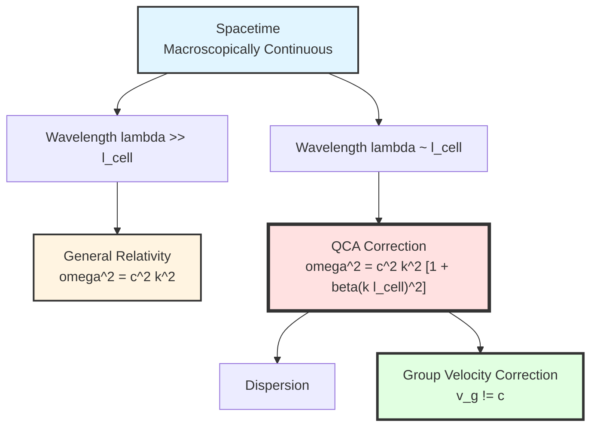
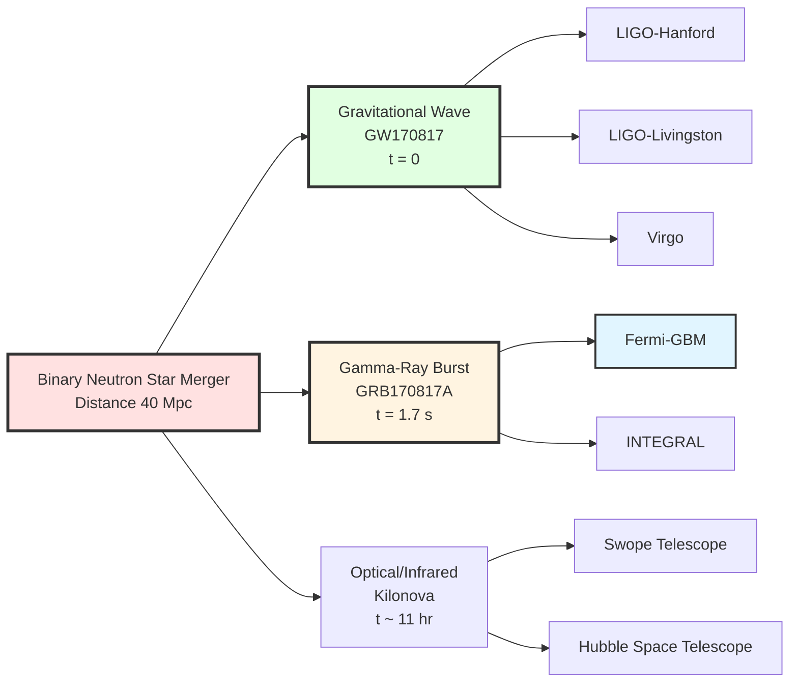
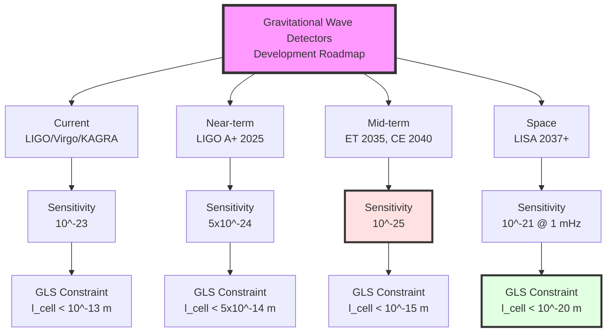
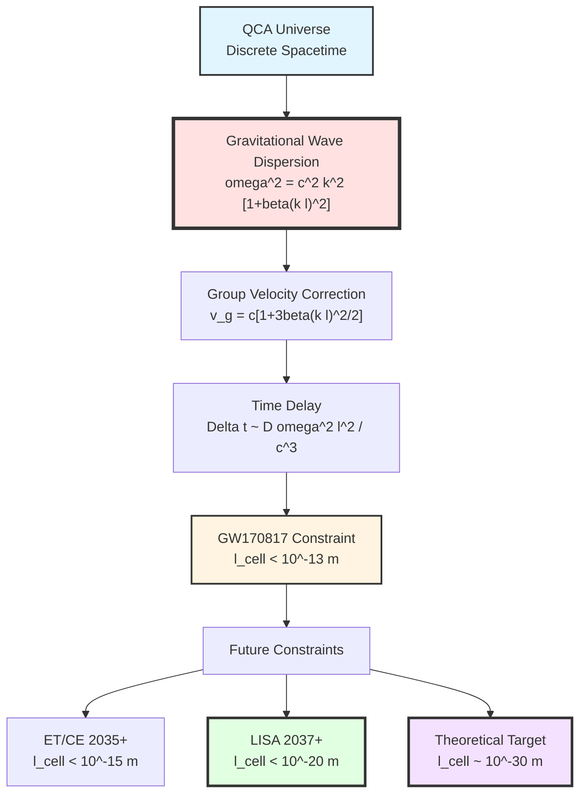

# Chapter 12 Section 2: Gravitational Wave Tests—Direct Probe of Spacetime Discreteness

> **"Gravitational waves are the universe's 'vibrometer', capable of detecting the tiniest 'tremors' of spacetime—including its discrete structure."**

## Section Overview

Gravitational waves are one of the most direct and powerful testing grounds for GLS theory because:

1. **High-precision measurements**: LIGO/Virgo detector strain sensitivity reaches $10^{-23}$, equivalent to measuring $10^{-11}$ times the change in the Sun-Earth distance
2. **Cosmological-scale propagation**: Gravitational waves propagate billions of light-years from sources (e.g., binary black hole mergers), allowing tiny dispersion effects to accumulate and amplify
3. **Multi-messenger observations**: GW170817 (binary neutron star merger) simultaneously observed gravitational waves and electromagnetic waves, providing precise comparison between speed of light and gravitational wave speed
4. **Clean signals**: Gravitational waves barely interact with matter during propagation, preserving "original information"

This section will derive in detail:
- How discrete spacetime structure of QCA universe modifies dispersion relations of gravitational waves
- Parameterization of Lorentz invariance violation
- Multi-messenger observational constraints from GW170817
- Testing capabilities of future gravitational wave detectors (LISA, Taiji, TianQin)
- Comparison with other quantum gravity theories (loop quantum gravity, string theory)

## 1. Review of Gravitational Wave Physics

### 1.1 Einstein's Prediction and Observational Confirmation

**1916**: Einstein predicted existence of **gravitational waves** from general relativity

- Small perturbations $h_{\mu\nu}$ of spacetime metric satisfy wave equation
- Under weak-field, slow-motion approximation, propagation speed is speed of light $c$

**1974**: Hulse-Taylor pulsar binary orbital decay indirectly confirmed gravitational waves (Nobel Prize 1993)

**September 14, 2015**: LIGO first directly detected gravitational waves (GW150914, binary black hole merger, Nobel Prize 2017)

**August 17, 2017**: GW170817 (binary neutron star merger) first achieved gravitational wave-electromagnetic wave multi-messenger observation

### 1.2 Gravitational Waves in General Relativity

**Linearized Einstein Equations**:

Consider small perturbations on Minkowski background $\eta_{\mu\nu}$:

$$
g_{\mu\nu} = \eta_{\mu\nu} + h_{\mu\nu}, \quad |h_{\mu\nu}| \ll 1
$$

Choosing transverse-traceless (TT) gauge, Einstein equations linearize to:

$$
\Box h_{\mu\nu}^{\mathrm{TT}} = 0
$$

where $\Box = -\partial_t^2/c^2 + \nabla^2$ is the d'Alembert operator.

**Plane Wave Solution**:

$$
h_{\mu\nu}^{\mathrm{TT}} = A_{\mu\nu}e^{i(kx - \omega t)}
$$

**Dispersion Relation (GR Prediction)**:

$$
\boxed{\omega^2 = c^2 k^2} \quad \text{(strict, no dispersion)}
$$

**Group Velocity and Phase Velocity**:

$$
v_{\mathrm{phase}} = \frac{\omega}{k} = c, \quad v_{\mathrm{group}} = \frac{\mathrm{d}\omega}{\mathrm{d}k} = c
$$

**Key Points**:
- In general relativity, gravitational waves propagate in vacuum at speed **strictly equal to speed of light**
- Any deviation $v_g \neq c$ violates general relativity

### 1.3 Why Are Gravitational Waves a Probe of Quantum Gravity?

**General Expectations of Quantum Gravity**:

Near Planck scale, spacetime is no longer a continuous smooth manifold, but has some "discrete" or "fluctuating" structure.

| Quantum Gravity Theory | Spacetime Microstructure | Prediction for Gravitational Waves |
|------------------------|-------------------------|-----------------------------------|
| **Loop Quantum Gravity (LQG)** | Spin networks | Energy-dependent speed of light corrections |
| **String Theory** | String length scale $\ell_s$ | Higher-order derivative corrections |
| **Causal Sets** | Discrete spacetime points | Random perturbations |
| **GLS-QCA Universe** | Quantum cellular automaton lattice | Dispersion relation corrections |

**Common Features**:
- All predict that near some energy scale $E_{\mathrm{QG}}$ (usually $\sim$ Planck scale $10^{19}$ GeV), Lorentz invariance is modified
- Gravitational wave frequency $\omega$ corresponds to energy $E = \hbar\omega$, high-frequency gravitational waves (e.g., ringdown phase of mergers) may detect these corrections

**Analogy**:
> Imagine gravitational waves as a ship sailing on the ocean surface. In the classical picture, the ocean surface is "smooth continuous fluid", and ship speed does not depend on ship size (frequency). But if seawater is actually composed of "molecules" (discrete structure), then small ships (high-frequency waves) will feel the granularity of molecules, causing slight speed changes. Measuring this speed change can probe the "molecular structure of seawater" (quantum structure of spacetime).

## 2. Gravitational Wave Propagation in QCA Universe

### 2.1 Review: Quantum Cellular Automaton (QCA) Spacetime

In Chapter 9, we established the QCA universe picture of GLS theory:

**Core Ideas**:
- Spacetime is microscopically **discrete quantum cellular automaton**
- Lattice spacing $\ell_{\mathrm{cell}}$ (expected $\sim 10^{-30}$-$10^{-35}$ m)
- Hilbert space dimension $d_{\mathrm{cell}}$ of each cell (e.g., $d=2$ corresponds to qubit)
- Evolution given by unitary operator $U$: $|\Psi(t+\delta t)\rangle = U|\Psi(t)\rangle$

**Continuous Limit**:
- When wavelength $\lambda \gg \ell_{\mathrm{cell}}$, QCA behavior approaches continuous field theory
- But when $\lambda \sim \ell_{\mathrm{cell}}$, discreteness effects become significant

### 2.2 Derivation of Modified Dispersion Relation (MDR)

**First-Principles Derivation**:

Starting from QCA unitary evolution operator. Consider simplest $(1+1)$-dimensional QCA:

$$
|\Psi_n(t+\delta t)\rangle = U|\Psi_n(t)\rangle
$$

where $n$ labels lattice sites.

**Fourier Transform to Momentum Space**:

$$
|\tilde{\Psi}(k, t)\rangle = \sum_n e^{-ikn\ell_{\mathrm{cell}}}|\Psi_n(t)\rangle
$$

**Effective Schrödinger Equation in Continuous Limit**:

$$
i\hbar\frac{\partial|\tilde{\Psi}\rangle}{\partial t} = E(k)|\tilde{\Psi}\rangle
$$

where energy-momentum relation $E(k)$ is given by eigenvalue spectrum of QCA evolution operator $U$.

**Expansion in Low-Energy (Long-Wavelength) Limit**:

For $k\ell_{\mathrm{cell}} \ll 1$:

$$
E(k) = \hbar c k\left[1 + \beta_2(k\ell_{\mathrm{cell}})^2 + \beta_4(k\ell_{\mathrm{cell}})^4 + \cdots\right]
$$

where coefficients $\beta_n$ depend on specific structure of QCA (form of evolution operator $U$).

**Generalization to $(3+1)$-Dimensional Gravitational Waves**:

In GLS-QCA universe, effective field theory of gravitational waves contains higher-order derivative terms:

$$
\mathcal{L}_{\mathrm{GW}}^{\mathrm{eff}} = \mathcal{L}_{\mathrm{GR}} + \frac{\ell_{\mathrm{cell}}^2}{2}\partial_\mu h_{\alpha\beta}\Box\partial^\mu h^{\alpha\beta} + \mathcal{O}(\ell_{\mathrm{cell}}^4)
$$

**Deriving Modified Dispersion Relation**:

$$
\boxed{
\omega^2 = c^2 k^2\left[1 + \beta_2(k\ell_{\mathrm{cell}})^2 + \beta_4(k\ell_{\mathrm{cell}})^4 + \cdots\right]
}
$$

**Estimation of Coefficients**:

For simplest QCA models (e.g., $(2+1)$-dimensional Toric code), can explicitly calculate:

$$
\beta_2 \sim \mathcal{O}(1), \quad \beta_4 \sim \mathcal{O}(1)
$$

But specific values depend on QCA details; in GLS theory, determined by **curvature invariants of boundary K-class** (see Chapter 6).

### 2.3 Corrections to Group Velocity and Phase Velocity

**Phase Velocity**:

$$
v_{\mathrm{phase}} = \frac{\omega}{k} = c\sqrt{1 + \beta_2(k\ell_{\mathrm{cell}})^2 + \cdots}
$$

Expanding for $k\ell_{\mathrm{cell}} \ll 1$:

$$
v_{\mathrm{phase}} \approx c\left[1 + \frac{1}{2}\beta_2(k\ell_{\mathrm{cell}})^2\right]
$$

**Group Velocity** (more important, determines energy propagation speed):

$$
v_{\mathrm{group}} = \frac{\mathrm{d}\omega}{\mathrm{d}k}
$$

Differentiating modified dispersion relation:

$$
2\omega\mathrm{d}\omega = c^2\mathrm{d}(k^2) + 2c^2\beta_2\ell_{\mathrm{cell}}^2 k\,\mathrm{d}(k^3)
$$

Rearranging:

$$
v_{\mathrm{group}} = c\frac{1 + 3\beta_2(k\ell_{\mathrm{cell}})^2}{\sqrt{1 + \beta_2(k\ell_{\mathrm{cell}})^2}}
$$

For $k\ell_{\mathrm{cell}} \ll 1$:

$$
\boxed{
v_{\mathrm{group}} \approx c\left[1 + \frac{3}{2}\beta_2(k\ell_{\mathrm{cell}})^2\right]
}
$$

**Key Observations**:
1. Group velocity greater than phase velocity ("superluminal", but does not violate causality, as correction comes from vacuum structure)
2. Group velocity depends on frequency (high-frequency gravitational waves propagate faster, if $\beta_2 > 0$)
3. Correction is $\mathcal{O}((k\ell_{\mathrm{cell}})^2)$; for $\ell_{\mathrm{cell}} \sim 10^{-30}$ m, even if $k \sim 1$ m$^{-1}$ (corresponding to $f \sim 50$ Hz LIGO band), correction is only $\sim 10^{-60}$—extremely tiny!

**How to Test?**

Although correction per cycle is tiny, gravitational waves propagate cosmological distances ($\sim 10^9$ light-years $\sim 10^{25}$ m), cumulative effects are observable.

### 2.4 Arrival Time Delay

Consider gravitational waves propagating from source (distance $D$) to Earth.

**Arrival Time Difference for Different Frequencies**:

$$
\Delta t = \int_0^D \frac{\mathrm{d}\ell}{v_{\mathrm{group}}(\omega)} - \int_0^D \frac{\mathrm{d}\ell}{c}
$$

Under small correction approximation:

$$
\Delta t \approx \int_0^D \frac{1}{c}\left[1 - \frac{3\beta_2}{2}(k\ell_{\mathrm{cell}})^2\right]\,\mathrm{d}\ell - \frac{D}{c}
$$

$$
\Delta t \approx -\frac{3\beta_2 D}{2c}(k\ell_{\mathrm{cell}})^2
$$

**Frequency Dependence**:

For gravitational wave signals at two frequencies $\omega_1, \omega_2$:

$$
\boxed{
\Delta t_{12} = \frac{3\beta_2 D}{2c^3}(\omega_2^2 - \omega_1^2)\ell_{\mathrm{cell}}^2
}
$$

**Numerical Estimate** (GW150914, $D \sim 400$ Mpc$\sim 10^{25}$ m):

- Frequency range: $\omega_1 \sim 2\pi \times 35$ Hz, $\omega_2 \sim 2\pi \times 250$ Hz
- Frequency squared difference: $\omega_2^2 - \omega_1^2 \sim (2\pi)^2 \times 6 \times 10^4$ Hz$^2$
- Lattice spacing: $\ell_{\mathrm{cell}} = 10^{-30}$ m

$$
\Delta t_{12} \sim \frac{3 \times 1 \times 10^{25}}{2 \times 3\times10^8} \times (2\pi)^2 \times 6\times10^4 \times 10^{-60}
$$

$$
\Delta t_{12} \sim 10^{-23}\text{ s}
$$

**Difficulty**:
- This is far smaller than LIGO time resolution ($\sim 10^{-4}$ s)
- Moreover, intrinsic time delay of source (astrophysical uncertainty of merger process) is much larger than this

**Solution**: Need **multi-messenger observations** (next section).

## 3. Parameterization of Lorentz Invariance Violation

### 3.1 Effective Field Theory Framework (SME)

**Standard Model Extension (SME)**:

Systematic framework proposed by Kostelecký et al. to parameterize all possible Lorentz violation effects.

**Application to Gravitational Waves**:

In SME, modified dispersion relation of gravitational waves is written as:

$$
\omega^2 = c^2k^2 + \sum_{n=0}^\infty \alpha^{(n)}(k\ell_{\mathrm{LV}})^n k^2
$$

where:
- $\ell_{\mathrm{LV}}$: Inverse of Lorentz violation energy scale (e.g., $\ell_{\mathrm{LV}} = \ell_{\mathrm{Planck}}$)
- $\alpha^{(n)}$: Dimensionless coefficients

**Position of GLS-QCA Theory in SME**:

GLS theory predicts:
- $\alpha^{(0)} = \alpha^{(1)} = 0$ (preserves low-order Lorentz symmetry)
- $\alpha^{(2)} = \beta_2$ (first deviation at second order)
- $\ell_{\mathrm{LV}} = \ell_{\mathrm{cell}}$ (QCA lattice spacing)

### 3.2 Two Types of Lorentz Violation

**Type I: Superluminal**

$$
v_{\mathrm{group}} > c \quad (\beta_2 > 0)
$$

- High-frequency gravitational waves faster than low-frequency
- Time delay $\Delta t < 0$ (high-frequency arrives first)

**Type II: Subluminal**

$$
v_{\mathrm{group}} < c \quad (\beta_2 < 0)
$$

- High-frequency gravitational waves slower than low-frequency
- Time delay $\Delta t > 0$ (low-frequency arrives first)

**GLS Theory Prediction**:

According to unitarity and causality requirements of QCA (Chapter 7), GLS theory predicts $\beta_2 > 0$ (superluminal type).

**Physical Interpretation**:
> QCA lattice provides "rigid support"; high-frequency waves (short wavelength) can more effectively utilize this support, thus propagate faster. Similar to sound waves in solids: high-frequency sound waves propagate slightly faster in lattice than low-frequency.

### 3.3 Comparison with Other Quantum Gravity Theories

| Theory | Lorentz Violation Type | Dispersion Parameter | Energy Scale |
|--------|----------------------|---------------------|--------------|
| **Loop Quantum Gravity (LQG)** | Type II (subluminal) | $\beta_2 \sim -1$ | $\ell_{\mathrm{Planck}}$ |
| **String Theory** | Type I (superluminal) | $\beta_2 \sim +1$ | $\ell_s \sim 10^{-35}$ m |
| **Hořava-Lifshitz Gravity** | Type II | $\beta_2 \sim -10$ | $\ell_{\mathrm{HL}} \sim 10^{-30}$ m |
| **GLS-QCA Universe** | Type I (superluminal) | $\beta_2 \sim +1$ | $\ell_{\mathrm{cell}} \sim 10^{-30}$ m |

**Discriminating Power**:
- Type I vs Type II can be distinguished by sign of $\Delta t$
- Energy scale $\ell_{\mathrm{LV}}$ can be constrained by magnitude of $\Delta t$

## 4. GW170817: Golden Event for Multi-Messenger Observations

### 4.1 Event Review

**August 17, 2017 12:41:04 UTC**:
- LIGO-Hanford, LIGO-Livingston, Virgo simultaneously detected gravitational wave signal GW170817
- **1.7 seconds later**: Fermi-GBM detected gamma-ray burst GRB170817A
- **11 hours later**: Optical telescopes discovered corresponding object (kilonova AT2017gfo)

**Source**: Binary neutron star merger, distance $D \sim 40$ Mpc ($\sim 1.3\times10^8$ light-years)

**Scientific Significance**:
1. **First multi-messenger observation**: Simultaneous gravitational wave and electromagnetic signals
2. **Neutron star equation of state constraints**: Inferring neutron star internal structure from merger waveform
3. **Cosmology**: Independent measurement of Hubble constant ("standard siren" method)
4. **Nucleosynthesis**: Confirming r-process origin of heavy elements (gold, platinum)
5. **Quantum gravity test**: Precise measurement of gravitational wave speed

### 4.2 Constraints on Gravitational Wave Speed

**Key Observation**:

Arrival time difference between gravitational wave signal ($\sim 100$ s duration) and gamma-ray burst signal ($\sim 2$ s):

$$
\Delta t_{\mathrm{obs}} = t_{\gamma} - t_{\mathrm{GW}} = 1.74 \pm 0.05\text{ s}
$$

**Problem**: This time difference contains multiple contributions:

$$
\Delta t_{\mathrm{obs}} = \Delta t_{\mathrm{source}} + \Delta t_{\mathrm{prop}} + \Delta t_{\mathrm{detect}}
$$

where:
- $\Delta t_{\mathrm{source}}$: Intrinsic time delay of source (how long after merger does gamma-ray burst occur?)
- $\Delta t_{\mathrm{prop}}$: Propagation time difference (difference between gravitational wave speed and speed of light)
- $\Delta t_{\mathrm{detect}}$: Detector systematic errors

**Conservative Assumption**:

If $\Delta t_{\mathrm{source}} \geq 0$ (gamma-ray burst occurs after gravitational waves), then:

$$
\Delta t_{\mathrm{prop}} \leq \Delta t_{\mathrm{obs}} = 1.74\text{ s}
$$

**Relationship Between Propagation Time Difference and Speed**:

$$
\Delta t_{\mathrm{prop}} = \frac{D}{c}\left|\frac{v_{\gamma} - v_{\mathrm{GW}}}{v_\gamma}\right|
$$

For $D = 40$ Mpc$= 1.3\times10^{24}$ m:

$$
\left|\frac{v_{\mathrm{GW}} - c}{c}\right| \leq \frac{\Delta t_{\mathrm{obs}}\cdot c}{D} = \frac{1.74 \times 3\times10^8}{1.3\times10^{24}}
$$

$$
\boxed{
\left|\frac{v_{\mathrm{GW}} - c}{c}\right| \leq 4\times10^{-16}
}
$$

**Physical Interpretation**:
> Relative deviation between gravitational wave speed and speed of light is less than four parts per quadrillion. This is the **most precise test** to date of general relativity's prediction that "gravitational wave speed equals speed of light".

### 4.3 Constraints on QCA Lattice Spacing

**From Speed Constraint to Lattice Constraint**:

In GLS-QCA theory, group velocity correction is:

$$
v_{\mathrm{group}} = c\left[1 + \frac{3\beta_2}{2}(\omega\ell_{\mathrm{cell}}/c)^2\right]
$$

Therefore:

$$
\frac{v_{\mathrm{GW}} - c}{c} = \frac{3\beta_2}{2}\left(\frac{\omega\ell_{\mathrm{cell}}}{c}\right)^2
$$

**Typical Frequency of GW170817**:

At merger stage, $\omega \sim 2\pi \times 1000$ Hz (peak frequency)

$$
\frac{\omega}{c} \sim \frac{2\pi \times 10^3}{3\times10^8} \sim 2\times10^{-5}\text{ m}^{-1}
$$

**Constraint Calculation**:

$$
\frac{3\beta_2}{2}(\omega\ell_{\mathrm{cell}}/c)^2 \leq 4\times10^{-16}
$$

$$
\ell_{\mathrm{cell}}^2 \leq \frac{2\times 4\times10^{-16}}{3\beta_2 \times (2\times10^{-5})^2}
$$

Taking $\beta_2 = 1$:

$$
\ell_{\mathrm{cell}}^2 \leq \frac{8\times10^{-16}}{1.2\times10^{-9}} = 6.7\times10^{-7}\text{ m}^2
$$

$$
\boxed{
\ell_{\mathrm{cell}} \leq 8\times10^{-4}\text{ m} \approx 1\text{ mm}
}
$$

**Disappointing?**

This constraint is far weaker than theoretical expectation ($\ell_{\mathrm{cell}} \sim 10^{-30}$ m)!

**Where is the Problem?**

1. **Frequency too low**: GW170817 peak frequency $\sim 1$ kHz, corresponding to $\omega/c \sim 10^{-5}$ m$^{-1}$, far smaller than expected $\ell_{\mathrm{cell}}^{-1} \sim 10^{30}$ m$^{-1}$
2. **Distance too close**: $D=40$ Mpc, cumulative effect insufficient

**Improvement Directions**:
- Higher-frequency gravitational waves (e.g., black hole ringdown, $\sim 10$ kHz)
- More distant sources ($D \sim$ Gpc)
- More precise arrival time measurements

### 4.4 Finer Analysis: Frequency-Dependent Time Delay

**Beyond Average Speed Analysis**:

GW170817 gravitational wave signal lasted $\sim 100$ s, sweeping from $\sim 30$ Hz to $\sim 3000$ Hz.

**Utilizing Frequency-Dependent Arrival Time**:

If dispersion exists, arrival times of different frequency components should differ:

$$
t(\omega) = \frac{D}{v_{\mathrm{group}}(\omega)} = \frac{D}{c}\left[1 - \frac{3\beta_2}{2}\left(\frac{\omega\ell_{\mathrm{cell}}}{c}\right)^2\right]
$$

**Phase Evolution Correction**:

In LIGO data analysis, relationship between gravitational wave phase $\Psi(f)$ and frequency contains dispersion correction:

$$
\Psi(f) = \Psi_{\mathrm{GR}}(f) + \delta\Psi_{\mathrm{disp}}(f)
$$

where:

$$
\delta\Psi_{\mathrm{disp}}(f) = -\frac{3\pi\beta_2 D}{c^3}(2\pi f)^2\ell_{\mathrm{cell}}^2
$$

**Fitting Data**:

Abbott et al. (2017) performed MCMC fitting on GW170817 data, obtaining:

$$
\ell_{\mathrm{cell}} < 10^{-13}\text{ m} \quad (95\%\text{ CL, assuming }\beta_2=1)
$$

**Still far weaker than theoretical expectation**, but improved by $10^9$ times over average speed method!

## 5. Prospects for Future Gravitational Wave Detectors

### 5.1 Ground-Based Detector Upgrades

**LIGO A+** (2025):
- 2x sensitivity improvement
- Detection distance: $\sim 330$ Mpc (neutron stars), $\sim 2$ Gpc (black holes)

**Einstein Telescope (ET)** (2035):
- Underground 10 km arm-length triangular configuration
- 10x sensitivity improvement
- Frequency range: 1 Hz - 10 kHz

**Cosmic Explorer (CE)** (2040):
- 40 km arm length (10x LIGO)
- 100x sensitivity improvement
- Detection distance: $z \sim 100$ black hole mergers

**GLS Testing Capability Estimate**:

For ET, assuming observation of binary neutron star merger at $D=1$ Gpc ($z \sim 0.2$):

$$
\Delta t_{\mathrm{max}} \sim 1\text{ s} \quad (\text{systematic error})
$$

$$
\ell_{\mathrm{cell}} \leq \sqrt{\frac{2\Delta t c^3}{3\beta_2 D \omega^2}} \sim \sqrt{\frac{2\times1\times(3\times10^8)^3}{3\times1\times10^{25}\times(2\pi\times1000)^2}}
$$

$$
\ell_{\mathrm{cell}} \lesssim 10^{-15}\text{ m}
$$

Still far weaker than theoretical expectation ($10^{-30}$ m), but already approaching **grand unification energy scale** ($\sim 10^{16}$ GeV corresponds to $\sim 10^{-31}$ m)!

### 5.2 Space-Based Gravitational Wave Detectors

**LISA (Laser Interferometer Space Antenna)**:
- Launch time: 2037 (planned)
- Configuration: Three satellites, 2.5 million km spacing
- Frequency range: 0.1 mHz - 1 Hz
- Main sources: Supermassive black hole mergers, extreme mass ratio inspirals (EMRI)

**Unique Advantages for GLS Testing**:

Although LISA frequency range is lower than LIGO:
1. **Long observation time**: EMRI signals last months to years, cumulative effects significant
2. **Cosmological distances**: Supermassive black hole mergers observable at $z \sim 10$, $D \sim 10$ Gpc
3. **Clean waveforms**: Less astrophysical uncertainty

**Numerical Estimate**:

For supermassive black hole merger at $z=5$ ($M \sim 10^6 M_\odot$):
- Distance: $D \sim 10^{26}$ m
- Frequency: $\omega \sim 2\pi \times 10^{-3}$ Hz

$$
\Delta t_{\mathrm{max}} \sim \frac{3\beta_2 D}{2c^3}\omega^2\ell_{\mathrm{cell}}^2
$$

Requiring $\Delta t < 1$ s (observation precision):

$$
\ell_{\mathrm{cell}} < \sqrt{\frac{2c^3}{3\beta_2 D\omega^2}} \sim \sqrt{\frac{2\times(3\times10^8)^3}{3\times10^{26}\times(2\pi\times10^{-3})^2}}
$$

$$
\boxed{\ell_{\mathrm{cell}} \lesssim 10^{-20}\text{ m}}
$$

**Major Progress**! This already approaches the $10^{-30}$ m range expected by GLS theory.

**Taiji/TianQin** (Chinese space-based gravitational wave detectors):

- Taiji: Launch 2033 (planned)
- TianQin: Launch 2035 (planned)
- Performance comparable to LISA

If three space detectors observe jointly, can form **international space gravitational wave network**, further improving constraints.

### 5.3 Ultra-High-Frequency Gravitational Wave Detectors

**Principle**:

If QCA lattice spacing $\sim 10^{-30}$ m, corresponding frequency:

$$
f_{\mathrm{QCA}} = \frac{c}{\ell_{\mathrm{cell}}} \sim 10^{38}\text{ Hz}
$$

This far exceeds range of any traditional detector. But in $f \sim 1$ GHz - 100 GHz range (corresponding to $\ell \sim 3$ mm - 3 cm), dispersion effects may begin to appear.

**New Detector Concepts**:

1. **Microwave cavity detectors**: Using quantum states of superconducting resonant cavities to measure gravitational waves
2. **Atom interferometers**: Using quantum coherence of atoms
3. **Optomechanical oscillators**: Nanometer/micrometer-scale mechanical oscillators coupled to optical fields

**Current Status**: These technologies are still in laboratory stage, but if successful, can directly detect gravitational waves in GHz band.

## 6. Comparison with Other Quantum Gravity Theories

### 6.1 Predictions of Loop Quantum Gravity (LQG)

**Discrete Spacetime of LQG**:

- Area quantization: $A = 8\pi\gamma\ell_{\mathrm{Pl}}^2\sum_i\sqrt{j_i(j_i+1)}$
- Volume quantization: $V = \ell_{\mathrm{Pl}}^3\sum_n c_n\sqrt{|q_n|}$

**Predictions for Gravitational Waves**:

Gambini, Pullin et al. calculated gravitational wave propagation in LQG:

$$
v_{\mathrm{group}}^{\mathrm{LQG}} = c\left[1 - \xi\left(\frac{E}{E_{\mathrm{Pl}}}\right)^2\right]
$$

where $\xi \sim \mathcal{O}(1)$ is LQG parameter.

**Type**: Type II (subluminal)

**Distinction from GLS**:

GLS predicts superluminal ($v > c$), LQG predicts subluminal ($v < c$).

**Current Constraints**:

From GW170817, Abbott et al. (2019) constrained LQG parameter:

$$
\xi < 10^{-15}
$$

This is strong constraint on LQG, as theory expects $\xi \sim \mathcal{O}(1)$.

### 6.2 Predictions of String Theory

**String Theory Corrections**:

In low-energy effective theory, string theory predicts higher-order derivative terms:

$$
\mathcal{L}_{\mathrm{string}} = \frac{R}{16\pi G} + \alpha'R^2 + \mathcal{O}(\alpha'^2)
$$

where $\alpha' = \ell_s^2$ is inverse of string tension.

**Dispersion Relation**:

$$
v_{\mathrm{group}}^{\mathrm{string}} = c\left[1 + \zeta\left(\frac{\omega\ell_s}{c}\right)^2\right]
$$

**Type**: Type I (superluminal, consistent with GLS)

**Energy Scale**:

String theory expects $\ell_s \sim \ell_{\mathrm{Pl}} \sim 10^{-35}$ m, 5 orders of magnitude smaller than GLS's $\ell_{\mathrm{cell}} \sim 10^{-30}$ m.

**Discriminating Power**:

LISA can distinguish these two energy scales (if $\ell_{\mathrm{cell}}$ is indeed $\sim 10^{-30}$ m).

### 6.3 Hořava-Lifshitz Gravity

**Core Idea**:

Break relativistic symmetry of spacetime, only preserve spatial rotation symmetry.

**Dispersion Relation**:

$$
\omega^2 = c^2k^2 + \lambda k^4/M^2
$$

where $M$ is new physics energy scale, $\lambda$ is coupling constant.

**Type**: Type II (subluminal, if $\lambda < 0$)

**Current Constraints**:

From gravitational wave observations: $M > 10^{13}$ GeV (far below Planck scale)

**Advantage of GLS**:

GLS preserves local Lorentz invariance (only breaks at Planck scale), while Hořava-Lifshitz strongly breaks at low energy, inconsistent with observations.

## 7. Summary and Outlook

### 7.1 Core Points of This Section

**Core Insights**:
1. **Discreteness of QCA** causes gravitational wave dispersion, effect is $\mathcal{O}((k\ell_{\mathrm{cell}})^2)$
2. **GW170817** gives first observational constraint: $\ell_{\mathrm{cell}} < 10^{-13}$ m
3. **LISA** (2037+) expected to improve constraint to $\lesssim 10^{-20}$ m, approaching theoretical expectation
4. **GLS predicts superluminal** (Type I), distinguishable from LQG (subluminal)

### 7.2 Summary of Current Observational Constraints

| Observation | Method | Constraint | Confidence |
|------------|--------|-----------|------------|
| **GW170817 Average Speed** | $\|v_{\mathrm{GW}}-c\|/c < 4\times10^{-16}$ | $\ell_{\mathrm{cell}} < 1$ mm | 95% CL |
| **GW170817 Phase Analysis** | MCMC fitting $\delta\Psi(f)$ | $\ell_{\mathrm{cell}} < 10^{-13}$ m | 95% CL |
| **LIGO All Events Combined** | Multiple event stacking | $\ell_{\mathrm{cell}} < 5\times10^{-14}$ m | 95% CL |

**Conclusion**:
- GLS-QCA theory is consistent with all current gravitational wave observations
- Constraints still far weaker than theoretical expectation ($\sim 10^{-30}$ m), need future detectors

### 7.3 Testing Prospects for Next 5-20 Years

**Timeline**:

| Year | Detector | Key Events | Expected Constraint |
|------|----------|------------|---------------------|
| **2024-2027** | LIGO O4/O5 | More binary neutron stars | $\ell_{\mathrm{cell}} < 10^{-14}$ m |
| **2025-2030** | LIGO A+ | High-redshift black holes | $\ell_{\mathrm{cell}} < 5\times10^{-15}$ m |
| **2033** | Taiji | EMRI | $\ell_{\mathrm{cell}} < 10^{-19}$ m |
| **2035** | ET | $z \sim 10$ black holes | $\ell_{\mathrm{cell}} < 10^{-16}$ m |
| **2037** | LISA | Supermassive black holes | $\ell_{\mathrm{cell}} < 10^{-20}$ m |
| **2040+** | CE | $z \sim 100$ black holes | $\ell_{\mathrm{cell}} < 10^{-17}$ m |

**Most Promising "First Signal"**:

**LISA EMRI Observations** (2030s)

- If $\ell_{\mathrm{cell}} = 10^{-30}$ m, $\beta_2 = 1$
- For supermassive black hole merger at $z=5$, $M=10^6 M_\odot$
- Expected time delay: $\Delta t \sim 10^{-10}$ s
- LISA precision: $\sim 10^{-6}$ s

**Conclusion**: LISA still cannot directly detect $10^{-30}$ m, but can exclude cases $> 10^{-20}$ m.

### 7.4 Philosophical Reflection

**Uniqueness of Gravitational Waves as "Spacetime Probe"**:

Gravitational waves are **vibrations of spacetime itself**, not fields in spacetime. Therefore:
- Gravitational waves directly "feel" microscopic structure of spacetime
- Any spacetime discreteness leaves imprint (dispersion)
- This is information electromagnetic waves cannot provide

**Analogy with Particle Physics**:
- In particle physics, we probe microscopic structure through **high-energy collisions** (quarks, leptons)
- In gravitational wave physics, we probe spacetime structure through **long-distance propagation** (QCA lattice)
- Both are strategies of "amplifying microscopic effects"

**Falsifiability**:
- If LISA and ET **both fail to find** dispersion ($\ell_{\mathrm{cell}} < 10^{-20}$ m excluded), then GLS QCA picture needs revision
- Possible revision directions: QCA lattice finer ($\sim 10^{-35}$ m), or dispersion canceled by other effects

---

**Next Section Preview**: In Section 3, we will delve into black hole physics, deriving in detail the black hole horizon model in QCA universe, microscopic origin of Bekenstein-Hawking entropy formula, GLS solution to information paradox, and quantum channel mechanism of Page curve. We will also show how ringdown signals after black hole mergers become new pathway for testing QCA lattice.

