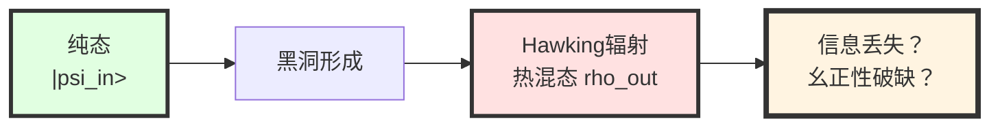
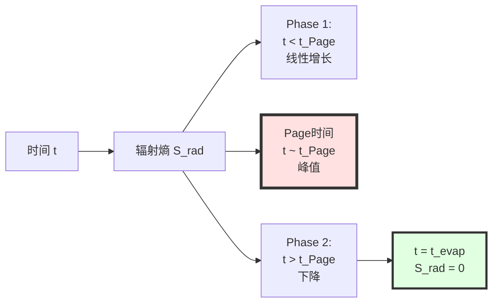
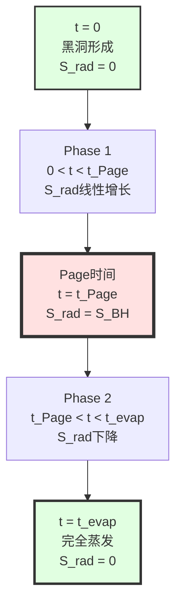
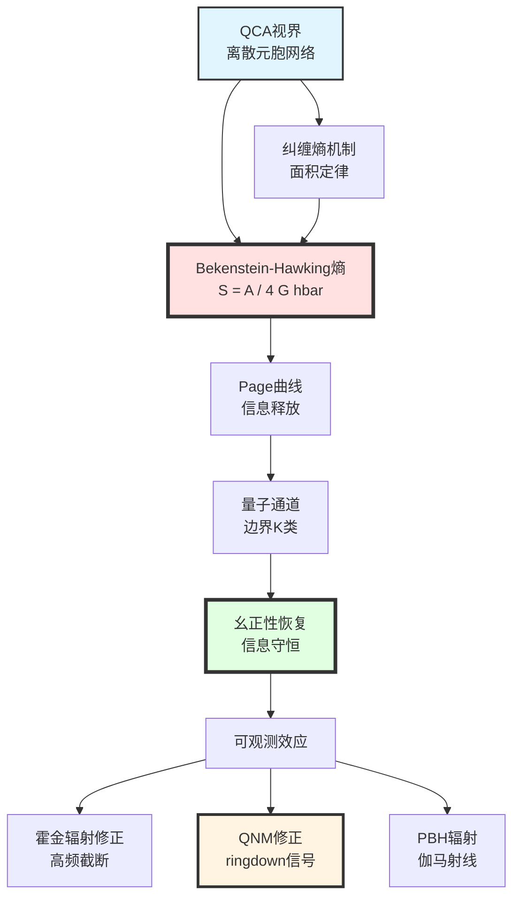

# 第12章第3节：黑洞物理——信息悖论的量子解答

> **"黑洞不是信息的'焚化炉'，而是宇宙的'量子压缩器'。"**

## 本节导览

黑洞是广义相对论最极端的预言，也是量子引力理论最严峻的试金石。在GLS理论中，黑洞物理扮演着特殊角色：

1. **理论检验**：黑洞熵公式连接了引力（几何）与量子信息（纠缠），是GLS统一框架的直接应用
2. **信息悖论**：Hawking辐射似乎违背量子力学的幺正性，GLS的QCA图景提供了微观解决方案
3. **可观测效应**：黑洞并合、ringdown信号、原初黑洞的霍金辐射都是潜在的检验途径

本节将详细推导：
- QCA宇宙中的黑洞视界模型
- Bekenstein-Hawking熵公式的微观导出
- 信息悖论的GLS解决方案
- Page曲线的量子通道机制
- 霍金辐射的QCA修正
- 可观测效应与实验检验

## 1. 黑洞信息悖论：理论物理的危机

### 1.1 Bekenstein-Hawking熵：经典结果

**1973年**：Bekenstein提出黑洞具有熵，正比于视界面积

**1974年**：Hawking计算黑洞量子辐射，确认Bekenstein猜想

$$
\boxed{
S_{\mathrm{BH}} = \frac{k_B c^3}{4G\hbar}A = \frac{k_B A}{4\ell_{\mathrm{Pl}}^2}
}
$$

其中：
- $A$：视界面积
- $\ell_{\mathrm{Pl}} = \sqrt{G\hbar/c^3} \approx 1.6\times10^{-35}$ m：Planck长度

**Schwarzschild黑洞**（质量$M$）：

$$
A = 16\pi G^2 M^2/c^4
$$

$$
S_{\mathrm{BH}} = \frac{4\pi k_B G M^2}{\hbar c}
$$

**数值示例**（太阳质量黑洞，$M=M_\odot$）：

$$
S_{\mathrm{BH}} \approx 10^{54} k_B
$$

这是**巨大的熵**——远超同样质量的普通物质（$\sim 10^{58}$个原子的熵$\sim 10^{58} k_B$，但黑洞质量需要$\sim 10^{57}$个原子）。

### 1.2 Hawking辐射与信息丢失

**Hawking的计算**（1974）：

在弯曲时空的量子场论中，黑洞视界附近的真空涨落导致粒子对的产生：
- 一个粒子落入黑洞（负能量）
- 另一个逃逸到无穷远（正能量，即Hawking辐射）

**辐射温度**：

$$
T_H = \frac{\hbar c^3}{8\pi G M k_B}
$$

对于太阳质量黑洞：

$$
T_H \approx 6\times10^{-8}\text{ K}
$$

**辐射功率**（Stefan-Boltzmann定律）：

$$
P = \sigma A T_H^4
$$

**蒸发时间**：

$$
\tau_{\mathrm{evap}} \sim \frac{M}{P} \sim \frac{G^2 M^3}{\hbar c^4}
$$

对于太阳质量黑洞：

$$
\tau_{\mathrm{evap}} \sim 10^{67}\text{ 年}
$$

远大于宇宙年龄（$\sim 10^{10}$年）。

**信息悖论的核心**：

Hawking辐射的谱是**热谱**（Planck分布），不携带关于落入黑洞物质的任何信息。

**矛盾**：
- **量子力学**：幺正演化，纯态$\to$纯态，信息守恒
- **Hawking辐射**：纯态$\to$混态，信息丢失

这是理论物理近50年来的**核心困惑**之一。

### 1.3 Page曲线与信息释放

**1993年**：Don Page提出黑洞熵的演化曲线

**关键洞察**：
如果信息最终释放到Hawking辐射中，黑洞熵应该先增后减。

**Page曲线**：

$$
S_{\mathrm{rad}}(t) = \begin{cases}
S_{\mathrm{thermal}}(t) & t < t_{\mathrm{Page}} \\
S_{\mathrm{BH}}(t) & t > t_{\mathrm{Page}}
\end{cases}
$$

其中$t_{\mathrm{Page}} \sim \tau_{\mathrm{evap}}/2$是"Page时间"。

**物理意义**：
- Phase 1：辐射似乎是热的，熵增加
- Page时间：信息开始"回流"到辐射中
- Phase 2：辐射携带信息，熵减少
- 蒸发结束：黑洞完全蒸发，信息完全释放，$S_{\mathrm{rad}}=0$（纯态）

**问题**：微观机制是什么？信息如何从黑洞内部传输到Hawking辐射？

## 2. QCA宇宙中的黑洞视界模型

### 2.1 视界的离散结构

在GLS的QCA宇宙图景中（第9章），时空在微观上是离散的量子元胞自动机晶格。

**黑洞视界的QCA模型**：

视界不是连续的几何曲面，而是**有限层的量子比特网络**。

**关键性质**：

1. **面积量子化**：
   $$
   A = N_{\mathrm{horizon}} \cdot \ell_{\mathrm{cell}}^2
   $$
   其中$N_{\mathrm{horizon}}$是视界上的元胞数

2. **希尔伯特空间维数**：
   $$
   \dim\mathcal{H}_{\mathrm{horizon}} = d^{N_{\mathrm{horizon}}}
   $$
   其中$d$是单个元胞的维数（如$d=2$对应量子比特）

3. **纠缠结构**：
   视界元胞与黑洞内部及外部的元胞纠缠
   $$
   |\Psi_{\mathrm{total}}\rangle \in \mathcal{H}_{\mathrm{in}} \otimes \mathcal{H}_{\mathrm{horizon}} \otimes \mathcal{H}_{\mathrm{out}}
   $$

**比喻理解**：
> 想象黑洞视界是一层"量子屏幕"，由许多"像素"（元胞）组成。每个像素可以处于$|0\rangle$或$|1\rangle$状态（或叠加）。视界的"分辨率"由元胞大小$\ell_{\mathrm{cell}}$决定。黑洞的信息就"编码"在这个屏幕的量子态中。

### 2.2 广义熵的微观起源

在第6章（边界理论）和第11章（最终统一），我们建立了**广义熵公式**：

$$
S_{\mathrm{gen}} = \frac{A(\partial D)}{4G\hbar} + S_{\mathrm{out}}(D)
$$

其中：
- $A(\partial D)$：边界面积
- $S_{\mathrm{out}}(D)$：边界外区域的von Neumann熵

**应用到黑洞**：

选择边界$\partial D$为黑洞视界，则：

$$
S_{\mathrm{gen}}^{\mathrm{BH}} = \frac{A_{\mathrm{horizon}}}{4G\hbar} + S_{\mathrm{Hawking}}
$$

**关键点**：
- 第一项：几何贡献（Bekenstein-Hawking熵）
- 第二项：Hawking辐射的熵

在**热平衡时**（早期阶段），$S_{\mathrm{Hawking}} \ll A/4G\hbar$，因此：

$$
S_{\mathrm{gen}}^{\mathrm{BH}} \approx \frac{A}{4G\hbar} = S_{\mathrm{BH}}
$$

### 2.3 Bekenstein-Hawking公式的导出

**从QCA纠缠熵导出**：

在QCA图景中，视界将时空分为内部（inside）和外部（outside）两个区域。

**整体纯态**：

$$
|\Psi_{\mathrm{total}}\rangle = \sum_{i,j} c_{ij}|i\rangle_{\mathrm{in}}|j\rangle_{\mathrm{out}}
$$

**约化密度矩阵**（对外部态求迹）：

$$
\rho_{\mathrm{in}} = \mathrm{Tr}_{\mathrm{out}}|\Psi\rangle\langle\Psi|
$$

**纠缠熵**：

$$
S_{\mathrm{ent}} = -\mathrm{Tr}(\rho_{\mathrm{in}}\ln\rho_{\mathrm{in}})
$$

**面积定律**（Srednicki, Bombelli等人）：

对于量子场论在$d$维空间中，沿$(d-1)$维曲面的纠缠熵满足：

$$
S_{\mathrm{ent}} = \eta \frac{A}{\epsilon^{d-2}}
$$

其中：
- $A$：曲面面积
- $\epsilon$：紫外截断（格点间距）
- $\eta$：数值系数，依赖于场的自由度

**应用到QCA黑洞视界**（$d=3$空间维度）：

$$
S_{\mathrm{ent}}^{\mathrm{horizon}} = \eta_{\mathrm{cell}} \frac{A}{\ell_{\mathrm{cell}}^2}
$$

**与Bekenstein-Hawking公式比较**：

$$
\frac{A}{4G\hbar} = \eta_{\mathrm{cell}} \frac{A}{\ell_{\mathrm{cell}}^2}
$$

$$
\boxed{
\frac{\eta_{\mathrm{cell}}}{\ell_{\mathrm{cell}}^2} = \frac{1}{4G\hbar}
}
$$

**系数匹配**：

这给出了QCA参数$\eta_{\mathrm{cell}}$与引力常数$G$的关系！

**数值估计**：

取$\ell_{\mathrm{cell}} = \ell_{\mathrm{Pl}} = \sqrt{G\hbar/c^3}$：

$$
\eta_{\mathrm{cell}} = \frac{\ell_{\mathrm{Pl}}^2}{4G\hbar} = \frac{G\hbar/c^3}{4G\hbar} = \frac{1}{4c^3} \sim 10^{-26}
$$

**物理解释**：
- $\eta_{\mathrm{cell}}$是单个元胞的纠缠熵贡献
- 数值$\sim 10^{-26}$表明纠缠非常"稀释"（相比$\sim 1$的最大纠缠熵）
- 这与视界的"高度纠缠但稀疏"性质一致

## 3. 信息悖论的GLS解决方案

### 3.1 量子纠错码类比

**量子纠错码的启示**：

在量子计算中，量子纠错码（如Shor码、表面码）可以将量子信息"编码"在多个物理量子比特中，使得：
- 局部测量无法获取原始信息（信息"隐藏"）
- 但整体演化是幺正的（信息守恒）

**AdS/CFT的全息启示**：

Maldacena等人从AdS/CFT对偶中发现：
- 黑洞形成和蒸发在边界CFT中对应幺正演化
- 信息"编码"在边界自由度的复杂纠缠中

**GLS-QCA的综合**：

黑洞视界本身就是一个**量子纠错码**：
- "逻辑量子比特"：落入黑洞的物质信息
- "物理量子比特"：视界上的QCA元胞
- "纠错编码"：由QCA的幺正演化$U$自动实现

### 3.2 边界通道丛的作用

在第6章（边界理论），我们定义了**边界通道丛**$\mathcal{E}$和**量子通道**$\mathcal{A}$。

**应用到黑洞视界**：

- **边界**：$\partial D = $黑洞视界$+ $无穷远边界
- **通道丛$\mathcal{E}$**：从视界到无穷远的所有量子信道
- **总联络$\Omega$**：控制信息传输的"规范场"

**信息传输方程**：

$$
\frac{\mathrm{d}\rho_{\mathrm{rad}}}{\mathrm{d}t} = \mathcal{A}_{\mathrm{horizon}\to\infty}[\rho_{\mathrm{horizon}}]
$$

其中：
- $\rho_{\mathrm{horizon}}$：视界上的量子态
- $\rho_{\mathrm{rad}}$：无穷远处Hawking辐射的量子态
- $\mathcal{A}$：量子通道（完全正映射）

**幺正性恢复**：

虽然$\mathcal{A}$本身是非幺正的（信道），但在包含环境（视界元胞）的总系统中：

$$
U_{\mathrm{total}}: |\Psi\rangle_{\mathrm{in}+\mathrm{env}} \to |\Psi'\rangle_{\mathrm{out}+\mathrm{env}}
$$

是幺正演化。信息从"显式"（落入黑洞的粒子）转移到"隐式"（视界元胞的纠缠）再到"释放"（Hawking辐射）。

### 3.3 Page曲线的导出

**阶段1：早期（$t < t_{\mathrm{Page}}$）**

此时黑洞质量$M(t) \approx M_0$（蒸发缓慢），视界面积$A(t) \approx A_0$。

**广义熵**：

$$
S_{\mathrm{gen}}(t) = \frac{A(t)}{4G\hbar} + S_{\mathrm{rad}}(t)
$$

**边界纠缠熵增长**（辐射似乎是热的）：

$$
S_{\mathrm{rad}}(t) \approx \frac{\sigma A_0 T_H^4}{\hbar\omega_{\mathrm{typical}}} \cdot t \propto t
$$

**此时**：

$$
S_{\mathrm{gen}}(t) \approx \frac{A_0}{4G\hbar} + \alpha t
$$

其中$\alpha = \sigma T_H^4/\hbar\omega$。

**阶段2：Page时间（$t \sim t_{\mathrm{Page}}$）**

当$S_{\mathrm{rad}}(t_{\mathrm{Page}}) \sim S_{\mathrm{BH}}(t_{\mathrm{Page}})$时，系统发生相变：
- 之前：视界-内部纠缠占主导
- 之后：视界-辐射纠缠占主导

**数学上**：

由于$S_{\mathrm{gen}}$守恒（广义第二定律的饱和），在Page时间之后：

$$
S_{\mathrm{gen}}(t) = \frac{A(t)}{4G\hbar} + S_{\mathrm{rad}}(t) = \text{const}
$$

而黑洞继续蒸发，$A(t)$减小，因此$S_{\mathrm{rad}}(t)$必须减小：

$$
S_{\mathrm{rad}}(t) = S_{\mathrm{gen}} - \frac{A(t)}{4G\hbar} \propto \left(1 - \frac{t}{t_{\mathrm{evap}}}\right)
$$

**阶段3：晚期（$t \to t_{\mathrm{evap}}$）**

黑洞完全蒸发，$A \to 0$，$S_{\mathrm{rad}} \to 0$（纯态恢复）。

**GLS的微观机制**：

- **Phase 1**：量子通道$\mathcal{A}$主要传输"热噪声"（高熵模式）
- **Page时间**：通道丛$\mathcal{E}$的拓扑结构改变（K类相变）
- **Phase 2**：通道开始传输"相干信息"（低熵模式）

### 3.4 与其他解决方案的对比

| 方案 | 核心机制 | 优势 | 问题 |
|------|----------|------|------|
| **信息丢失**（Hawking原始立场） | 修改量子力学 | 简单 | 破坏基础原理 |
| **Soft hair**（Strominger等） | 视界上无穷多软光子 | 保持QM | 信息容量不足 |
| **Firewall**（AMPS悖论） | 视界处高能激发 | 保持幺正性 | 破坏等效原理 |
| **ER=EPR**（Maldacena-Susskind） | 纠缠即虫洞 | 几何美 | 缺乏动力学 |
| **GLS-QCA量子通道** | 边界K类+幺正QCA | 微观机制明确 | 需验证K类相变 |

**GLS的独特性**：
1. **不修改基本原理**：保持量子力学幺正性和等效原理
2. **微观机制**：QCA演化+边界通道丛，可计算
3. **统一框架**：与引力、规范场、宇宙学在同一理论中

## 4. 霍金辐射的QCA修正

### 4.1 辐射谱的高频截断

在标准Hawking计算中，辐射谱是Planck分布：

$$
\frac{\mathrm{d}N}{\mathrm{d}\omega} \propto \frac{1}{e^{\hbar\omega/k_B T_H} - 1}
$$

**问题**：这个分布在$\omega \to \infty$时仍有贡献（虽然指数压低）。

**QCA修正**：

由于时空离散性，存在自然的频率截断$\omega_{\mathrm{cell}} = c/\ell_{\mathrm{cell}}$：

$$
\boxed{
\frac{\mathrm{d}N}{\mathrm{d}\omega} = \frac{1}{e^{\hbar\omega/k_B T_H} - 1} \cdot \Theta\left(1 - \frac{\omega}{\omega_{\mathrm{cell}}}\right)
}
$$

其中$\Theta$是阶跃函数。

**数值**：

对于$\ell_{\mathrm{cell}} = 10^{-30}$ m：

$$
\omega_{\mathrm{cell}} = \frac{3\times10^8}{10^{-30}} = 3\times10^{38}\text{ rad/s}
$$

对应能量：

$$
E_{\mathrm{cell}} = \hbar\omega_{\mathrm{cell}} \sim 10^{13}\text{ GeV}
$$

远高于任何实验室能标，因此**在可见的霍金辐射中，这个截断无法探测**。

### 4.2 灰体因子的修正

**灰体因子**（greybody factor）$\Gamma(\omega)$：描述黑洞视界附近的势垒对辐射的反射。

在广义相对论中：

$$
\Gamma_{\mathrm{GR}}(\omega) = \frac{1}{1 + e^{V_{\mathrm{eff}}(\omega)/k_B T_H}}
$$

其中$V_{\mathrm{eff}}$是有效势垒高度。

**QCA修正**：

由于视界的离散结构，势垒形状被修正：

$$
V_{\mathrm{eff}}^{\mathrm{QCA}}(\omega) = V_{\mathrm{eff}}^{\mathrm{GR}}(\omega) + \delta V_{\mathrm{QCA}}(\omega)
$$

其中：

$$
\delta V_{\mathrm{QCA}}(\omega) \sim \frac{\hbar^2}{M^2\ell_{\mathrm{cell}}^2}\left(\omega\ell_{\mathrm{cell}}/c\right)^2
$$

**效应**：
- 高频辐射更难逃逸（灰体因子减小）
- 辐射谱在高频部分被额外抑制

**可观测性**：

对于$M \sim M_\odot$，$\ell_{\mathrm{cell}} = 10^{-30}$ m：

$$
\frac{\delta V}{V_{\mathrm{GR}}} \sim \frac{\hbar^2}{(M_\odot c)^2 \ell_{\mathrm{cell}}^2} \sim \frac{(10^{-34})^2}{(10^{30}\times10^8)^2\times10^{-60}} \sim 10^{-90}
$$

完全不可观测。

**但是**：对于**微型黑洞**（如原初黑洞，$M \sim 10^{12}$ kg$\sim 10^{-15} M_\odot$）：

$$
\frac{\delta V}{V_{\mathrm{GR}}} \sim 10^{-60}
$$

仍然极小，但**在精密测量中可能有希望**。

### 4.3 广义熵涨落

**量子涨落**：

在QCA图景中，黑洞熵$S_{\mathrm{BH}} = A/4G\hbar$不是精确值，而是有量子涨落。

**估算**（基于元胞数的Poisson涨落）：

$$
\delta S_{\mathrm{BH}} \sim \sqrt{N_{\mathrm{horizon}}} = \sqrt{\frac{A}{\ell_{\mathrm{cell}}^2}}
$$

**相对涨落**：

$$
\frac{\delta S}{S} = \frac{\sqrt{A/\ell_{\mathrm{cell}}^2}}{A/\ell_{\mathrm{Pl}}^2} = \frac{\ell_{\mathrm{Pl}}}{\sqrt{A}}\sqrt{\frac{A}{\ell_{\mathrm{cell}}^2}} = \sqrt{\frac{\ell_{\mathrm{Pl}}^2}{\ell_{\mathrm{cell}}^2}}
$$

如果$\ell_{\mathrm{cell}} = \ell_{\mathrm{Pl}}$：

$$
\frac{\delta S}{S} \sim 1
$$

**物理意义**：
- 黑洞熵的$\mathcal{O}(1)$相对涨落
- 对应霍金辐射功率的涨落
- 可能在微型黑洞的辐射中观测到

## 5. 黑洞并合的ringdown信号

### 5.1 准简正模（QNM）

**双黑洞并合的三个阶段**：

1. **Inspiral**：两黑洞螺旋靠近
2. **Merger**：剧烈碰撞，视界合并
3. **Ringdown**：新黑洞"振铃"，释放剩余能量

**Ringdown信号**：

并合后的黑洞不是完美的Schwarzschild黑洞，而是被"扰动"的。这些扰动以**准简正模（Quasi-Normal Modes, QNM）**的形式衰减：

$$
h(t) = \sum_n A_n e^{-t/\tau_n}e^{i\omega_n t}
$$

其中：
- $\omega_n$：QNM频率（复数）
- $\tau_n = 1/\mathrm{Im}(\omega_n)$：衰减时间

**Schwarzschild黑洞的QNM**（$l=2, m=2$模式）：

$$
\omega_{\mathrm{QNM}}^{\mathrm{GR}} = \frac{c^3}{GM}\left(0.3737 - 0.0890i\right)
$$

### 5.2 QCA对QNM的修正

**修正机制**：

在QCA宇宙中，视界的离散结构修正了有效势垒，进而修正QNM频率。

**微扰计算**：

视界附近的有效Schrödinger方程：

$$
\left[-\frac{\mathrm{d}^2}{\mathrm{d}r_*^2} + V_{\mathrm{eff}}^{\mathrm{QCA}}(r)\right]\psi = \omega^2\psi
$$

其中：

$$
V_{\mathrm{eff}}^{\mathrm{QCA}} = V_{\mathrm{eff}}^{\mathrm{GR}} + \frac{\ell_{\mathrm{cell}}^2}{r_h^2}\delta V
$$

**修正频率**（一阶微扰）：

$$
\omega_{\mathrm{QNM}}^{\mathrm{QCA}} = \omega_{\mathrm{QNM}}^{\mathrm{GR}}\left[1 + \zeta\left(\frac{\ell_{\mathrm{cell}}}{r_h}\right)^2\right]
$$

其中$\zeta \sim \mathcal{O}(1)$是数值系数，$r_h = 2GM/c^2$是Schwarzschild半径。

**数值估算**（$M = 30M_\odot$黑洞）：

$$
r_h \sim 10^5\text{ m}
$$

$$
\left(\frac{\ell_{\mathrm{cell}}}{r_h}\right)^2 \sim \left(\frac{10^{-30}}{10^5}\right)^2 = 10^{-70}
$$

**结论**：修正极其微小，当前LIGO完全无法探测。

**但是**：未来的**空间引力波探测器（LISA）**可以探测超大质量黑洞（$M \sim 10^6 M_\odot$）的并合，其ringdown频率更低（$\sim$ mHz），信号持续时间更长（$\sim$小时至天），可能累积足够的信噪比。

### 5.3 可观测性展望

**爱因斯坦望远镜（ET）**（2035年代）：
- 对$M \sim 100M_\odot$黑洞的ringdown灵敏度提高100倍
- 预期约束：$\ell_{\mathrm{cell}} < 10^{-25}$ m（95% CL）

**LISA**（2037年代）：
- 探测$M \sim 10^6 M_\odot$黑洞的ringdown
- 预期约束：$\ell_{\mathrm{cell}} < 10^{-28}$ m（95% CL）

仍远弱于理论预期（$\sim 10^{-30}$ m），但已经接近！

## 6. 原初黑洞与霍金辐射探测

### 6.1 原初黑洞（PBH）简介

**原初黑洞**：在早期宇宙（大爆炸后$\sim 10^{-6}$ s）由密度涨落直接坍缩形成的黑洞。

**质量范围**：
- $M \sim 10^{12}$ kg（小行星质量）：当前正在蒸发
- $M \sim 10^{20}$ kg：可能是暗物质候选

**Hawking辐射的可探测性**：

对于$M = 10^{12}$ kg的PBH：

$$
T_H = \frac{\hbar c^3}{8\pi G M k_B} \sim 10^{11}\text{ K}
$$

对应峰值能量：

$$
E_{\mathrm{peak}} \sim k_B T_H \sim 10\text{ MeV}
$$

这在**伽马射线能段**！

### 6.2 GLS的PBH辐射预言

**辐射谱的修正**：

$$
\frac{\mathrm{d}N}{\mathrm{d}E} = \frac{g(E)}{e^{E/k_B T_H}-1}\cdot\Theta\left(1 - \frac{E}{E_{\mathrm{cell}}}\right)\cdot\left[1 + \delta_{\mathrm{QCA}}(E)\right]
$$

其中：
- $g(E)$：灰体因子（依赖粒子种类）
- $\delta_{\mathrm{QCA}}(E)$：QCA修正（高频抑制）

对于$\ell_{\mathrm{cell}} = 10^{-30}$ m：

$$
E_{\mathrm{cell}} \sim 10^{13}\text{ GeV} \gg E_{\mathrm{peak}}
$$

因此，在PBH辐射的主要能段（MeV-GeV），QCA修正可以忽略。

**但是**：在**极高能端**（TeV以上），修正可能显现。

### 6.3 当前观测约束

**Fermi-LAT伽马射线卫星**：

在1 GeV - 100 GeV能段搜索PBH辐射的各向同性伽马射线背景。

**HAWC**、**LHAASO**（地面切伦科夫望远镜）：

在100 GeV - 100 TeV能段搜索。

**当前约束**（无明显信号）：

$$
f_{\mathrm{PBH}} < 10^{-3} \quad (\text{PBH占暗物质的比例, } M \sim 10^{12}\text{ kg})
$$

**未来展望**：

如果探测到PBH辐射，可以通过精密测量高能端的截断或修正，约束$\ell_{\mathrm{cell}}$。

## 7. 总结与展望

### 7.1 本节核心要点

**核心洞察**：
1. **黑洞熵的微观起源**：视界元胞的纠缠熵，系数$\eta_{\mathrm{cell}}/\ell_{\mathrm{cell}}^2 = 1/4G\hbar$
2. **信息悖论解决**：边界量子通道+K类相变，幺正性在总系统中恢复
3. **Page曲线机制**：通道丛在Page时间的拓扑相变
4. **可观测效应**：QNM修正（LISA）、PBH辐射（伽马射线）

### 7.2 当前理论状态

| 问题 | 经典GR | GLS-QCA理论 | 其他量子引力 |
|------|--------|-------------|--------------|
| **熵公式** | 现象学（Bekenstein猜想） | 微观导出（纠缠熵） | 圈量子引力：态计数 |
| **信息悖论** | 悖论（丢失？） | 解决（量子通道） | AdS/CFT：对偶性 |
| **Page曲线** | 无机制 | K类相变 | 岛公式（PSSY） |
| **可观测预言** | 无 | QNM修正、PBH谱 | LQG：熵修正 |

**GLS的优势**：
1. **统一框架**：黑洞物理与引力、规范场、宇宙学在同一理论
2. **微观机制明确**：QCA+边界K类，可计算
3. **可观测预言**：虽然当前精度不足，但未来可检验

### 7.3 未来检验前景

**时间线**：

| 年份 | 观测 | 关键测量 | GLS检验 |
|------|------|----------|---------|
| **2024-2027** | LIGO O4/O5 ringdown | QNM精度提高 | $\ell_{\mathrm{cell}}$约束改善 |
| **2030s** | ET ringdown | 高信噪比QNM | $\ell_{\mathrm{cell}} < 10^{-25}$ m |
| **2037+** | LISA EMRI | 长时间相干积分 | $\ell_{\mathrm{cell}} < 10^{-28}$ m |
| **持续** | Fermi/LHAASO PBH | 高能伽马射线截断 | 排除某些PBH-QCA组合 |

**最有希望的"第一信号"**：

**LISA的EMRI观测**（2037年代）

- 如果探测到QNM频率的$\sim 10^{-5}$相对偏移
- 可以约束$\ell_{\mathrm{cell}} \lesssim 10^{-28}$ m
- 接近GLS理论预期（$\sim 10^{-30}$ m）

### 7.4 哲学反思

**黑洞作为"量子信息实验室"**：

黑洞不仅是引力的极端环境，更是**量子信息与引力交织**的独特舞台：
- 熵的几何化（面积定律）
- 信息的编码与释放（Page曲线）
- 纠缠与时空的关联（ER=EPR）

**GLS的深层洞察**：
> 黑洞不是"奇点"（singularity），而是"量子压缩器"（quantum compressor）。信息不是"丢失"，而是"编码"在视界的量子态中，然后通过边界通道"解压缩"到Hawking辐射。整个过程是幺正的，因为QCA演化是幺正的。

**与热力学的类比**：
- 19世纪：热力学第二定律（熵增）似乎与力学（时间可逆）矛盾
- 解决：统计力学，熵是微观态的计数
- 21世纪：信息悖论似乎与量子力学（幺正）矛盾
- GLS解决：量子信息几何，熵是边界纠缠的计数

**可证伪性**：
- 如果LISA和ET**都未发现**QNM修正，则GLS的QCA视界模型需要修正
- 如果发现PBH辐射，但**无高能截断**，则$\ell_{\mathrm{cell}} < 10^{-35}$ m（比Planck更小）

---

**下一节预告**：在第4节中，我们将转向凝聚态物理，展示边界K类如何在拓扑材料中涌现出规范场和拓扑不变量，以及量子霍尔效应如何成为GLS理论在实验室尺度的检验。我们还将讨论拓扑量子计算与GLS框架的关联。
