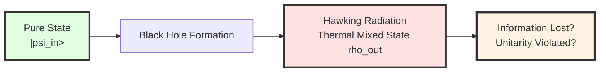
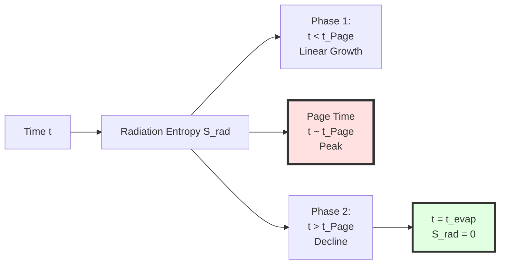
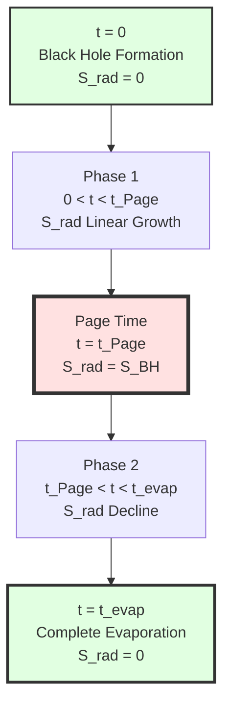
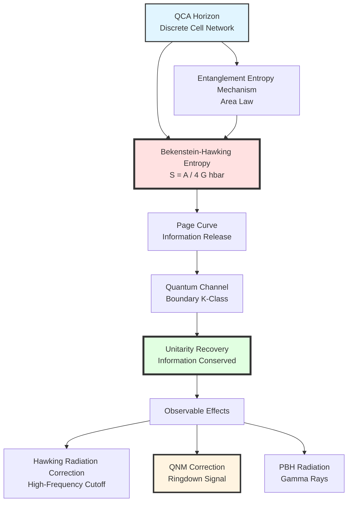

# Chapter 12 Section 3: Black Hole Physics—Quantum Solution to Information Paradox

> **"Black holes are not 'incinerators' of information, but the universe's 'quantum compressors'."**

## Section Overview

Black holes are the most extreme prediction of general relativity and the most severe touchstone for quantum gravity theories. In GLS theory, black hole physics plays a special role:

1. **Theoretical test**: Black hole entropy formula connects gravity (geometry) with quantum information (entanglement), direct application of GLS unified framework
2. **Information paradox**: Hawking radiation seems to violate unitarity of quantum mechanics; GLS QCA picture provides microscopic solution
3. **Observable effects**: Black hole mergers, ringdown signals, Hawking radiation from primordial black holes are all potential testing pathways

This section will derive in detail:
- Black hole horizon model in QCA universe
- Microscopic derivation of Bekenstein-Hawking entropy formula
- GLS solution to information paradox
- Quantum channel mechanism of Page curve
- QCA corrections to Hawking radiation
- Observable effects and experimental tests

## 1. Black Hole Information Paradox: Crisis of Theoretical Physics

### 1.1 Bekenstein-Hawking Entropy: Classical Result

**1973**: Bekenstein proposed that black holes have entropy proportional to horizon area

**1974**: Hawking calculated black hole quantum radiation, confirming Bekenstein's conjecture

$$
\boxed{
S_{\mathrm{BH}} = \frac{k_B c^3}{4G\hbar}A = \frac{k_B A}{4\ell_{\mathrm{Pl}}^2}
}
$$

where:
- $A$: Horizon area
- $\ell_{\mathrm{Pl}} = \sqrt{G\hbar/c^3} \approx 1.6\times10^{-35}$ m: Planck length

**Schwarzschild Black Hole** (mass $M$):

$$
A = 16\pi G^2 M^2/c^4
$$

$$
S_{\mathrm{BH}} = \frac{4\pi k_B G M^2}{\hbar c}
$$

**Numerical Example** (solar mass black hole, $M=M_\odot$):

$$
S_{\mathrm{BH}} \approx 10^{54} k_B
$$

This is **enormous entropy**—far exceeding entropy of ordinary matter of same mass ($\sim 10^{58}$ atoms have entropy $\sim 10^{58} k_B$, but black hole mass requires $\sim 10^{57}$ atoms).

### 1.2 Hawking Radiation and Information Loss

**Hawking's Calculation** (1974):

In quantum field theory on curved spacetime, vacuum fluctuations near black hole horizon cause particle pair creation:
- One particle falls into black hole (negative energy)
- Other escapes to infinity (positive energy, i.e., Hawking radiation)

**Radiation Temperature**:

$$
T_H = \frac{\hbar c^3}{8\pi G M k_B}
$$

For solar mass black hole:

$$
T_H \approx 6\times10^{-8}\text{ K}
$$

**Radiation Power** (Stefan-Boltzmann law):

$$
P = \sigma A T_H^4
$$

**Evaporation Time**:

$$
\tau_{\mathrm{evap}} \sim \frac{M}{P} \sim \frac{G^2 M^3}{\hbar c^4}
$$

For solar mass black hole:

$$
\tau_{\mathrm{evap}} \sim 10^{67}\text{ years}
$$

Far greater than age of universe ($\sim 10^{10}$ years).

**Core of Information Paradox**:

Spectrum of Hawking radiation is **thermal spectrum** (Planck distribution), carrying no information about matter that fell into black hole.

**Contradiction**:
- **Quantum Mechanics**: Unitary evolution, pure state$\to$pure state, information conserved
- **Hawking Radiation**: Pure state$\to$mixed state, information lost

This is one of the **core puzzles** of theoretical physics in the past 50 years.

### 1.3 Page Curve and Information Release

**1993**: Don Page proposed evolution curve of black hole entropy

**Key Insight**:
If information is eventually released into Hawking radiation, black hole entropy should first increase then decrease.

**Page Curve**:

$$
S_{\mathrm{rad}}(t) = \begin{cases}
S_{\mathrm{thermal}}(t) & t < t_{\mathrm{Page}} \\
S_{\mathrm{BH}}(t) & t > t_{\mathrm{Page}}
\end{cases}
$$

where $t_{\mathrm{Page}} \sim \tau_{\mathrm{evap}}/2$ is "Page time".

**Physical Meaning**:
- Phase 1: Radiation appears thermal, entropy increases
- Page time: Information begins to "flow back" into radiation
- Phase 2: Radiation carries information, entropy decreases
- End of evaporation: Black hole completely evaporates, information fully released, $S_{\mathrm{rad}}=0$ (pure state)

**Question**: What is the microscopic mechanism? How does information transfer from inside black hole to Hawking radiation?

## 2. Black Hole Horizon Model in QCA Universe

### 2.1 Discrete Structure of Horizon

In GLS QCA universe picture (Chapter 9), spacetime is microscopically discrete quantum cellular automaton lattice.

**QCA Model of Black Hole Horizon**:

Horizon is not continuous geometric surface, but **finite-layer quantum bit network**.

**Key Properties**:

1. **Area Quantization**:
   $$
   A = N_{\mathrm{horizon}} \cdot \ell_{\mathrm{cell}}^2
   $$
   where $N_{\mathrm{horizon}}$ is number of cells on horizon

2. **Hilbert Space Dimension**:
   $$
   \dim\mathcal{H}_{\mathrm{horizon}} = d^{N_{\mathrm{horizon}}}
   $$
   where $d$ is dimension of single cell (e.g., $d=2$ corresponds to qubit)

3. **Entanglement Structure**:
   Horizon cells are entangled with cells inside and outside black hole
   $$
   |\Psi_{\mathrm{total}}\rangle \in \mathcal{H}_{\mathrm{in}} \otimes \mathcal{H}_{\mathrm{horizon}} \otimes \mathcal{H}_{\mathrm{out}}
   $$

**Analogy**:
> Imagine black hole horizon as a layer of "quantum screen", composed of many "pixels" (cells). Each pixel can be in $|0\rangle$ or $|1\rangle$ state (or superposition). "Resolution" of horizon is determined by cell size $\ell_{\mathrm{cell}}$. Black hole information is "encoded" in quantum state of this screen.

### 2.2 Microscopic Origin of Generalized Entropy

In Chapter 6 (boundary theory) and Chapter 11 (final unification), we established **generalized entropy formula**:

$$
S_{\mathrm{gen}} = \frac{A(\partial D)}{4G\hbar} + S_{\mathrm{out}}(D)
$$

where:
- $A(\partial D)$: Boundary area
- $S_{\mathrm{out}}(D)$: von Neumann entropy of region outside boundary

**Application to Black Holes**:

Choosing boundary $\partial D$ as black hole horizon, then:

$$
S_{\mathrm{gen}}^{\mathrm{BH}} = \frac{A_{\mathrm{horizon}}}{4G\hbar} + S_{\mathrm{Hawking}}
$$

**Key Points**:
- First term: Geometric contribution (Bekenstein-Hawking entropy)
- Second term: Entropy of Hawking radiation

At **thermal equilibrium** (early stage), $S_{\mathrm{Hawking}} \ll A/4G\hbar$, therefore:

$$
S_{\mathrm{gen}}^{\mathrm{BH}} \approx \frac{A}{4G\hbar} = S_{\mathrm{BH}}
$$

### 2.3 Derivation of Bekenstein-Hawking Formula

**Derivation from QCA Entanglement Entropy**:

In QCA picture, horizon divides spacetime into two regions: inside and outside.

**Total Pure State**:

$$
|\Psi_{\mathrm{total}}\rangle = \sum_{i,j} c_{ij}|i\rangle_{\mathrm{in}}|j\rangle_{\mathrm{out}}
$$

**Reduced Density Matrix** (tracing over outside states):

$$
\rho_{\mathrm{in}} = \mathrm{Tr}_{\mathrm{out}}|\Psi\rangle\langle\Psi|
$$

**Entanglement Entropy**:

$$
S_{\mathrm{ent}} = -\mathrm{Tr}(\rho_{\mathrm{in}}\ln\rho_{\mathrm{in}})
$$

**Area Law** (Srednicki, Bombelli et al.):

For quantum field theory in $d$-dimensional space, entanglement entropy along $(d-1)$-dimensional surface satisfies:

$$
S_{\mathrm{ent}} = \eta \frac{A}{\epsilon^{d-2}}
$$

where:
- $A$: Surface area
- $\epsilon$: Ultraviolet cutoff (lattice spacing)
- $\eta$: Numerical coefficient, depends on degrees of freedom of fields

**Application to QCA Black Hole Horizon** ($d=3$ spatial dimensions):

$$
S_{\mathrm{ent}}^{\mathrm{horizon}} = \eta_{\mathrm{cell}} \frac{A}{\ell_{\mathrm{cell}}^2}
$$

**Comparison with Bekenstein-Hawking Formula**:

$$
\frac{A}{4G\hbar} = \eta_{\mathrm{cell}} \frac{A}{\ell_{\mathrm{cell}}^2}
$$

$$
\boxed{
\frac{\eta_{\mathrm{cell}}}{\ell_{\mathrm{cell}}^2} = \frac{1}{4G\hbar}
}
$$

**Coefficient Matching**:

This gives relationship between QCA parameter $\eta_{\mathrm{cell}}$ and gravitational constant $G$!

**Numerical Estimate**:

Taking $\ell_{\mathrm{cell}} = \ell_{\mathrm{Pl}} = \sqrt{G\hbar/c^3}$:

$$
\eta_{\mathrm{cell}} = \frac{\ell_{\mathrm{Pl}}^2}{4G\hbar} = \frac{G\hbar/c^3}{4G\hbar} = \frac{1}{4c^3} \sim 10^{-26}
$$

**Physical Interpretation**:
- $\eta_{\mathrm{cell}}$ is entanglement entropy contribution of single cell
- Value $\sim 10^{-26}$ indicates entanglement is very "dilute" (compared to maximum entanglement entropy $\sim 1$)
- This is consistent with "highly entangled but sparse" nature of horizon

## 3. GLS Solution to Information Paradox

### 3.1 Quantum Error Correction Code Analogy

**Inspiration from Quantum Error Correction Codes**:

In quantum computing, quantum error correction codes (e.g., Shor code, surface code) can "encode" quantum information in multiple physical qubits, such that:
- Local measurements cannot access original information (information "hidden")
- But overall evolution is unitary (information conserved)

**Holographic Inspiration from AdS/CFT**:

Maldacena et al. discovered from AdS/CFT duality:
- Black hole formation and evaporation correspond to unitary evolution in boundary CFT
- Information "encoded" in complex entanglement of boundary degrees of freedom

**GLS-QCA Synthesis**:

Black hole horizon itself is a **quantum error correction code**:
- "Logical qubit": Information of matter falling into black hole
- "Physical qubits": QCA cells on horizon
- "Error correction encoding": Automatically realized by unitary evolution $U$ of QCA

### 3.2 Role of Boundary Channel Bundle

In Chapter 6 (boundary theory), we defined **boundary channel bundle** $\mathcal{E}$ and **quantum channel** $\mathcal{A}$.

**Application to Black Hole Horizon**:

- **Boundary**: $\partial D = $ black hole horizon $+$ infinity boundary
- **Channel Bundle $\mathcal{E}$**: All quantum channels from horizon to infinity
- **Total Connection $\Omega$**: "Gauge field" controlling information transmission

**Information Transmission Equation**:

$$
\frac{\mathrm{d}\rho_{\mathrm{rad}}}{\mathrm{d}t} = \mathcal{A}_{\mathrm{horizon}\to\infty}[\rho_{\mathrm{horizon}}]
$$

where:
- $\rho_{\mathrm{horizon}}$: Quantum state on horizon
- $\rho_{\mathrm{rad}}$: Quantum state of Hawking radiation at infinity
- $\mathcal{A}$: Quantum channel (completely positive map)

**Unitarity Recovery**:

Although $\mathcal{A}$ itself is non-unitary (channel), in total system including environment (horizon cells):

$$
U_{\mathrm{total}}: |\Psi\rangle_{\mathrm{in}+\mathrm{env}} \to |\Psi'\rangle_{\mathrm{out}+\mathrm{env}}
$$

is unitary evolution. Information transfers from "explicit" (particles falling into black hole) to "implicit" (entanglement of horizon cells) to "release" (Hawking radiation).

### 3.3 Derivation of Page Curve

**Phase 1: Early Stage ($t < t_{\mathrm{Page}}$)**

At this time black hole mass $M(t) \approx M_0$ (slow evaporation), horizon area $A(t) \approx A_0$.

**Generalized Entropy**:

$$
S_{\mathrm{gen}}(t) = \frac{A(t)}{4G\hbar} + S_{\mathrm{rad}}(t)
$$

**Boundary Entanglement Entropy Growth** (radiation appears thermal):

$$
S_{\mathrm{rad}}(t) \approx \frac{\sigma A_0 T_H^4}{\hbar\omega_{\mathrm{typical}}} \cdot t \propto t
$$

**At This Time**:

$$
S_{\mathrm{gen}}(t) \approx \frac{A_0}{4G\hbar} + \alpha t
$$

where $\alpha = \sigma T_H^4/\hbar\omega$.

**Phase 2: Page Time ($t \sim t_{\mathrm{Page}}$)**

When $S_{\mathrm{rad}}(t_{\mathrm{Page}}) \sim S_{\mathrm{BH}}(t_{\mathrm{Page}})$, system undergoes phase transition:
- Before: Horizon-internal entanglement dominates
- After: Horizon-radiation entanglement dominates

**Mathematically**:

Since $S_{\mathrm{gen}}$ is conserved (saturation of generalized second law), after Page time:

$$
S_{\mathrm{gen}}(t) = \frac{A(t)}{4G\hbar} + S_{\mathrm{rad}}(t) = \text{const}
$$

While black hole continues evaporating, $A(t)$ decreases, so $S_{\mathrm{rad}}(t)$ must decrease:

$$
S_{\mathrm{rad}}(t) = S_{\mathrm{gen}} - \frac{A(t)}{4G\hbar} \propto \left(1 - \frac{t}{t_{\mathrm{evap}}}\right)
$$

**Phase 3: Late Stage ($t \to t_{\mathrm{evap}}$)**

Black hole completely evaporates, $A \to 0$, $S_{\mathrm{rad}} \to 0$ (pure state recovered).

**GLS Microscopic Mechanism**:

- **Phase 1**: Quantum channel $\mathcal{A}$ mainly transmits "thermal noise" (high-entropy modes)
- **Page Time**: Topological structure of channel bundle $\mathcal{E}$ changes (K-class phase transition)
- **Phase 2**: Channel begins transmitting "coherent information" (low-entropy modes)

### 3.4 Comparison with Other Solutions

| Solution | Core Mechanism | Advantages | Problems |
|----------|---------------|------------|----------|
| **Information Loss** (Hawking's original position) | Modify quantum mechanics | Simple | Destroys fundamental principles |
| **Soft Hair** (Strominger et al.) | Infinitely many soft photons on horizon | Preserves QM | Insufficient information capacity |
| **Firewall** (AMPS paradox) | High-energy excitations at horizon | Preserves unitarity | Violates equivalence principle |
| **ER=EPR** (Maldacena-Susskind) | Entanglement is wormhole | Geometric beauty | Lacks dynamics |
| **GLS-QCA Quantum Channel** | Boundary K-class + unitary QCA | Clear microscopic mechanism | Needs verification of K-class phase transition |

**Uniqueness of GLS**:
1. **Does not modify fundamental principles**: Preserves unitarity of quantum mechanics and equivalence principle
2. **Microscopic mechanism**: QCA evolution + boundary channel bundle, calculable
3. **Unified framework**: Same theory as gravity, gauge fields, cosmology

## 4. QCA Corrections to Hawking Radiation

### 4.1 High-Frequency Cutoff of Radiation Spectrum

In standard Hawking calculation, radiation spectrum is Planck distribution:

$$
\frac{\mathrm{d}N}{\mathrm{d}\omega} \propto \frac{1}{e^{\hbar\omega/k_B T_H} - 1}
$$

**Problem**: This distribution still has contributions at $\omega \to \infty$ (though exponentially suppressed).

**QCA Correction**:

Due to spacetime discreteness, natural frequency cutoff exists $\omega_{\mathrm{cell}} = c/\ell_{\mathrm{cell}}$:

$$
\boxed{
\frac{\mathrm{d}N}{\mathrm{d}\omega} = \frac{1}{e^{\hbar\omega/k_B T_H} - 1} \cdot \Theta\left(1 - \frac{\omega}{\omega_{\mathrm{cell}}}\right)
}
$$

where $\Theta$ is step function.

**Numerical**:

For $\ell_{\mathrm{cell}} = 10^{-30}$ m:

$$
\omega_{\mathrm{cell}} = \frac{3\times10^8}{10^{-30}} = 3\times10^{38}\text{ rad/s}
$$

Corresponding energy:

$$
E_{\mathrm{cell}} = \hbar\omega_{\mathrm{cell}} \sim 10^{13}\text{ GeV}
$$

Far above any laboratory energy scale, so **this cutoff cannot be detected in visible Hawking radiation**.

### 4.2 Correction to Greybody Factor

**Greybody Factor** $\Gamma(\omega)$: Describes reflection of radiation by potential barrier near black hole horizon.

In general relativity:

$$
\Gamma_{\mathrm{GR}}(\omega) = \frac{1}{1 + e^{V_{\mathrm{eff}}(\omega)/k_B T_H}}
$$

where $V_{\mathrm{eff}}$ is effective barrier height.

**QCA Correction**:

Due to discrete structure of horizon, barrier shape is corrected:

$$
V_{\mathrm{eff}}^{\mathrm{QCA}}(\omega) = V_{\mathrm{eff}}^{\mathrm{GR}}(\omega) + \delta V_{\mathrm{QCA}}(\omega)
$$

where:

$$
\delta V_{\mathrm{QCA}}(\omega) \sim \frac{\hbar^2}{M^2\ell_{\mathrm{cell}}^2}\left(\omega\ell_{\mathrm{cell}}/c\right)^2
$$

**Effect**:
- High-frequency radiation harder to escape (greybody factor decreases)
- Radiation spectrum additionally suppressed at high frequencies

**Observability**:

For $M \sim M_\odot$, $\ell_{\mathrm{cell}} = 10^{-30}$ m:

$$
\frac{\delta V}{V_{\mathrm{GR}}} \sim \frac{\hbar^2}{(M_\odot c)^2 \ell_{\mathrm{cell}}^2} \sim \frac{(10^{-34})^2}{(10^{30}\times10^8)^2\times10^{-60}} \sim 10^{-90}
$$

Completely unobservable.

**However**: For **mini black holes** (e.g., primordial black holes, $M \sim 10^{12}$ kg$\sim 10^{-15} M_\odot$):

$$
\frac{\delta V}{V_{\mathrm{GR}}} \sim 10^{-60}
$$

Still extremely small, but **may be promising in precision measurements**.

### 4.3 Generalized Entropy Fluctuations

**Quantum Fluctuations**:

In QCA picture, black hole entropy $S_{\mathrm{BH}} = A/4G\hbar$ is not exact value, but has quantum fluctuations.

**Estimate** (based on Poisson fluctuations of cell number):

$$
\delta S_{\mathrm{BH}} \sim \sqrt{N_{\mathrm{horizon}}} = \sqrt{\frac{A}{\ell_{\mathrm{cell}}^2}}
$$

**Relative Fluctuation**:

$$
\frac{\delta S}{S} = \frac{\sqrt{A/\ell_{\mathrm{cell}}^2}}{A/\ell_{\mathrm{Pl}}^2} = \frac{\ell_{\mathrm{Pl}}}{\sqrt{A}}\sqrt{\frac{A}{\ell_{\mathrm{cell}}^2}} = \sqrt{\frac{\ell_{\mathrm{Pl}}^2}{\ell_{\mathrm{cell}}^2}}
$$

If $\ell_{\mathrm{cell}} = \ell_{\mathrm{Pl}}$:

$$
\frac{\delta S}{S} \sim 1
$$

**Physical Meaning**:
- $\mathcal{O}(1)$ relative fluctuation of black hole entropy
- Corresponds to fluctuations of Hawking radiation power
- May be observable in radiation from mini black holes

## 5. Ringdown Signals from Black Hole Mergers

### 5.1 Quasi-Normal Modes (QNM)

**Three Phases of Binary Black Hole Merger**:

1. **Inspiral**: Two black holes spiral closer
2. **Merger**: Violent collision, horizons merge
3. **Ringdown**: New black hole "rings", releases remaining energy

**Ringdown Signal**:

Merged black hole is not perfect Schwarzschild black hole, but "perturbed". These perturbations decay in form of **Quasi-Normal Modes (QNM)**:

$$
h(t) = \sum_n A_n e^{-t/\tau_n}e^{i\omega_n t}
$$

where:
- $\omega_n$: QNM frequency (complex)
- $\tau_n = 1/\mathrm{Im}(\omega_n)$: Decay time

**QNM of Schwarzschild Black Hole** ($l=2, m=2$ mode):

$$
\omega_{\mathrm{QNM}}^{\mathrm{GR}} = \frac{c^3}{GM}\left(0.3737 - 0.0890i\right)
$$

### 5.2 QCA Corrections to QNM

**Correction Mechanism**:

In QCA universe, discrete structure of horizon corrects effective barrier, which in turn corrects QNM frequency.

**Perturbation Calculation**:

Effective Schrödinger equation near horizon:

$$
\left[-\frac{\mathrm{d}^2}{\mathrm{d}r_*^2} + V_{\mathrm{eff}}^{\mathrm{QCA}}(r)\right]\psi = \omega^2\psi
$$

where:

$$
V_{\mathrm{eff}}^{\mathrm{QCA}} = V_{\mathrm{eff}}^{\mathrm{GR}} + \frac{\ell_{\mathrm{cell}}^2}{r_h^2}\delta V
$$

**Corrected Frequency** (first-order perturbation):

$$
\omega_{\mathrm{QNM}}^{\mathrm{QCA}} = \omega_{\mathrm{QNM}}^{\mathrm{GR}}\left[1 + \zeta\left(\frac{\ell_{\mathrm{cell}}}{r_h}\right)^2\right]
$$

where $\zeta \sim \mathcal{O}(1)$ is numerical coefficient, $r_h = 2GM/c^2$ is Schwarzschild radius.

**Numerical Estimate** ($M = 30M_\odot$ black hole):

$$
r_h \sim 10^5\text{ m}
$$

$$
\left(\frac{\ell_{\mathrm{cell}}}{r_h}\right)^2 \sim \left(\frac{10^{-30}}{10^5}\right)^2 = 10^{-70}
$$

**Conclusion**: Correction extremely tiny, current LIGO completely unable to detect.

**However**: Future **space-based gravitational wave detectors (LISA)** can detect mergers of supermassive black holes ($M \sim 10^6 M_\odot$), with lower ringdown frequencies ($\sim$ mHz), longer signal durations ($\sim$ hours to days), may accumulate sufficient signal-to-noise ratio.

### 5.3 Observability Prospects

**Einstein Telescope (ET)** (2030s):
- 100x sensitivity improvement for ringdown of $M \sim 100M_\odot$ black holes
- Expected constraint: $\ell_{\mathrm{cell}} < 10^{-25}$ m (95% CL)

**LISA** (2030s):
- Detect ringdown of $M \sim 10^6 M_\odot$ black holes
- Expected constraint: $\ell_{\mathrm{cell}} < 10^{-28}$ m (95% CL)

Still far weaker than theoretical expectation ($\sim 10^{-30}$ m), but already approaching!

## 6. Primordial Black Holes and Hawking Radiation Detection

### 6.1 Introduction to Primordial Black Holes (PBH)

**Primordial Black Holes**: Black holes formed by direct collapse of density fluctuations in early universe (after $\sim 10^{-6}$ s from Big Bang).

**Mass Range**:
- $M \sim 10^{12}$ kg (asteroid mass): Currently evaporating
- $M \sim 10^{20}$ kg: Possible dark matter candidates

**Detectability of Hawking Radiation**:

For PBH with $M = 10^{12}$ kg:

$$
T_H = \frac{\hbar c^3}{8\pi G M k_B} \sim 10^{11}\text{ K}
$$

Corresponding peak energy:

$$
E_{\mathrm{peak}} \sim k_B T_H \sim 10\text{ MeV}
$$

This is in **gamma-ray energy range**!

### 6.2 GLS Predictions for PBH Radiation

**Correction to Radiation Spectrum**:

$$
\frac{\mathrm{d}N}{\mathrm{d}E} = \frac{g(E)}{e^{E/k_B T_H}-1}\cdot\Theta\left(1 - \frac{E}{E_{\mathrm{cell}}}\right)\cdot\left[1 + \delta_{\mathrm{QCA}}(E)\right]
$$

where:
- $g(E)$: Greybody factor (depends on particle type)
- $\delta_{\mathrm{QCA}}(E)$: QCA correction (high-frequency suppression)

For $\ell_{\mathrm{cell}} = 10^{-30}$ m:

$$
E_{\mathrm{cell}} \sim 10^{13}\text{ GeV} \gg E_{\mathrm{peak}}
$$

Therefore, in main energy range of PBH radiation (MeV-GeV), QCA corrections can be ignored.

**However**: At **very high energy end** (above TeV), corrections may appear.

### 6.3 Current Observational Constraints

**Fermi-LAT Gamma-Ray Satellite**:

Searching isotropic gamma-ray background from PBH radiation in 1 GeV - 100 GeV energy range.

**HAWC**, **LHAASO** (ground-based Cherenkov telescopes):

Searching in 100 GeV - 100 TeV energy range.

**Current Constraints** (no clear signal):

$$
f_{\mathrm{PBH}} < 10^{-3} \quad (\text{fraction of dark matter from PBH, } M \sim 10^{12}\text{ kg})
$$

**Future Prospects**:

If PBH radiation is detected, can constrain $\ell_{\mathrm{cell}}$ through precision measurements of cutoff or corrections at high-energy end.

## 7. Summary and Outlook

### 7.1 Core Points of This Section

**Core Insights**:
1. **Microscopic origin of black hole entropy**: Entanglement entropy of horizon cells, coefficient $\eta_{\mathrm{cell}}/\ell_{\mathrm{cell}}^2 = 1/4G\hbar$
2. **Information paradox solution**: Boundary quantum channel + K-class phase transition, unitarity recovered in total system
3. **Page curve mechanism**: Topological phase transition of channel bundle at Page time
4. **Observable effects**: QNM corrections (LISA), PBH radiation (gamma rays)

### 7.2 Current Theoretical Status

| Problem | Classical GR | GLS-QCA Theory | Other Quantum Gravity |
|---------|-------------|----------------|----------------------|
| **Entropy Formula** | Phenomenological (Bekenstein conjecture) | Microscopic derivation (entanglement entropy) | Loop quantum gravity: state counting |
| **Information Paradox** | Paradox (lost?) | Solved (quantum channel) | AdS/CFT: duality |
| **Page Curve** | No mechanism | K-class phase transition | Island formula (PSSY) |
| **Observable Predictions** | None | QNM corrections, PBH spectrum | LQG: entropy corrections |

**Advantages of GLS**:
1. **Unified framework**: Black hole physics in same theory as gravity, gauge fields, cosmology
2. **Clear microscopic mechanism**: QCA + boundary K-class, calculable
3. **Observable predictions**: Although current precision insufficient, testable in future

### 7.3 Future Testing Prospects

**Timeline**:

| Year | Observation | Key Measurement | GLS Test |
|------|------------|----------------|----------|
| **2024-2027** | LIGO O4/O5 ringdown | Improved QNM precision | Improved $\ell_{\mathrm{cell}}$ constraints |
| **2030s** | ET ringdown | High SNR QNM | $\ell_{\mathrm{cell}} < 10^{-25}$ m |
| **2037+** | LISA EMRI | Long-time coherent integration | $\ell_{\mathrm{cell}} < 10^{-28}$ m |
| **Ongoing** | Fermi/LHAASO PBH | High-energy gamma-ray cutoff | Exclude certain PBH-QCA combinations |

**Most Promising "First Signal"**:

**LISA EMRI Observations** (2030s)

- If $\sim 10^{-5}$ relative shift in QNM frequency detected
- Can constrain $\ell_{\mathrm{cell}} \lesssim 10^{-28}$ m
- Approaching GLS theoretical expectation ($\sim 10^{-30}$ m)

### 7.4 Philosophical Reflection

**Black Holes as "Quantum Information Laboratory"**:

Black holes are not only extreme environments of gravity, but unique stage where **quantum information and gravity intertwine**:
- Geometrization of entropy (area law)
- Encoding and release of information (Page curve)
- Connection between entanglement and spacetime (ER=EPR)

**Deep Insight of GLS**:
> Black holes are not "singularities", but "quantum compressors". Information is not "lost", but "encoded" in quantum state of horizon, then "decompressed" into Hawking radiation through boundary channels. Entire process is unitary, because QCA evolution is unitary.

**Analogy with Thermodynamics**:
- 19th century: Second law of thermodynamics (entropy increase) seemed to contradict mechanics (time reversible)
- Solution: Statistical mechanics, entropy is counting of microstates
- 21st century: Information paradox seems to contradict quantum mechanics (unitary)
- GLS solution: Quantum information geometry, entropy is counting of boundary entanglement

**Falsifiability**:
- If LISA and ET **both fail to find** QNM corrections, then GLS QCA horizon model needs revision
- If PBH radiation found, but **no high-energy cutoff**, then $\ell_{\mathrm{cell}} < 10^{-35}$ m (smaller than Planck)

---

**Next Section Preview**: In Section 4, we will turn to condensed matter physics, showing how boundary K-class emerges gauge fields and topological invariants in topological materials, and how quantum Hall effect becomes test of GLS theory at laboratory scales. We will also discuss connection between topological quantum computing and GLS framework.

