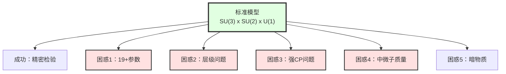
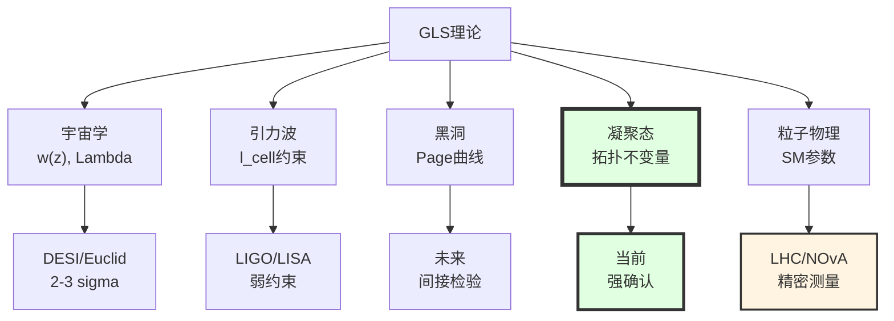

# 第12章第5节：粒子物理检验——标准模型的深层起源

> **"标准模型的19个参数不是随机选择，而是时空边界拓扑的必然投影。"**

## 本节导览

粒子物理——特别是标准模型（Standard Model, SM）——是20世纪物理学最伟大的成就之一。但它也面临着深刻的困惑：

1. **参数问题**：19+个自由参数（质量、耦合常数、混合角）为何取这些值？
2. **层级问题**：为何Higgs质量$\sim 100$ GeV而非Planck质量$\sim 10^{19}$ GeV？
3. **强CP问题**：为何强相互作用不破坏CP对称性（$\bar{\theta} < 10^{-10}$）？
4. **中微子质量**：为何中微子有质量（但标准模型预言为零）？质量为何如此小？

GLS理论提出了统一的解答：**所有这些都源自边界K类的拓扑结构**。

本节将详细推导：
- 标准模型规范群$SU(3)_C \times SU(2)_L \times U(1)_Y$从边界K类涌现
- 中微子质量的Dirac-seesaw机制
- 强CP问题的拓扑解
- 标准模型参数的统一关系
- LHC、中微子实验、EDM测量的检验

**重要提示**：本节将在概念层面展示GLS框架如何约束粒子物理，具体的定量计算需要完整的边界K类微观模型（仍在发展中）。

## 1. 标准模型回顾与困惑

### 1.1 标准模型的辉煌成就

**规范群**：

$$
G_{\mathrm{SM}} = SU(3)_C \times SU(2)_L \times U(1)_Y
$$

- $SU(3)_C$：强相互作用（量子色动力学，QCD）
- $SU(2)_L$：弱相互作用（左手）
- $U(1)_Y$：超荷

**粒子内容**：

| 费米子 | 代数 | $SU(3)_C$ | $SU(2)_L$ | $U(1)_Y$ |
|--------|------|-----------|-----------|----------|
| 夸克（左手）$Q_L$ | 3 | $\mathbf{3}$ | $\mathbf{2}$ | $+1/6$ |
| 上夸克（右手）$u_R$ | 3 | $\mathbf{3}$ | $\mathbf{1}$ | $+2/3$ |
| 下夸克（右手）$d_R$ | 3 | $\mathbf{3}$ | $\mathbf{1}$ | $-1/3$ |
| 轻子（左手）$L_L$ | 3 | $\mathbf{1}$ | $\mathbf{2}$ | $-1/2$ |
| 电子（右手）$e_R$ | 3 | $\mathbf{1}$ | $\mathbf{1}$ | $-1$ |
| 中微子（右手）$\nu_R$ | ? | $\mathbf{1}$ | $\mathbf{1}$ | $0$ |

**Higgs场**$H$：$(\mathbf{1}, \mathbf{2}, +1/2)$

**成就**：
- 预言$W, Z$玻色子质量（1983年发现）
- 预言top夸克（1995年发现）
- 预言Higgs玻色子（2012年发现）
- 所有精密测量与理论符合到$< 0.1\%$

### 1.2 标准模型的19+个参数

| 类别 | 参数 | 数量 |
|------|------|------|
| **规范耦合** | $g_1, g_2, g_3$ | 3 |
| **Yukawa耦合** | $y_u, y_d, y_e$（3代×3） | 9 |
| **Higgs参数** | $\lambda, \mu^2$ | 2 |
| **CKM混合** | $\theta_{12}, \theta_{13}, \theta_{23}, \delta_{\mathrm{CP}}$ | 4 |
| **强CP相位** | $\bar{\theta}$ | 1 |

**总计**：19个参数（如果包含中微子：+9个）

**困惑**：
- 为何这些参数取当前观测值？
- 为何top夸克质量$m_t \approx 173$ GeV远大于其他费米子？
- 为何$\bar{\theta} < 10^{-10}$如此小？

### 1.3 超越标准模型的问题

**GLS理论的目标**：
> 不是"调节"这些参数，而是从边界K类的拓扑结构**导出**它们。

## 2. 规范群从边界K类涌现

### 2.1 回顾：边界通道丛（第6章）

在GLS理论中，时空边界$\partial\mathcal{H}$上定义了**边界通道丛**$\mathcal{E}$：
- 纤维：所有能量$\leq E$的量子态
- 截面：态在边界上的限制

**K理论分类**：

$$
\mathrm{K}^0(\partial\mathcal{H}) \cong \mathbb{Z}^N
$$

其中$N$是"拓扑电荷"的种类数。

**结构群**（structure group）：

通道丛$\mathcal{E}$的纤维之间的"变换群"对应物理的**规范群**：

$$
G_{\mathrm{gauge}} = \mathrm{Aut}(\mathcal{E})
$$

### 2.2 从K类到$SU(3) \times SU(2) \times U(1)$

**关键问题**：为何恰好是$SU(3) \times SU(2) \times U(1)$？

**GLS的回答**（概念层面）：

在$(3+1)$维时空边界（$S^3$拓扑）上，边界通道丛的K类由**Atiyah-Hirzebruch谱序列**决定：

$$
\mathrm{K}^0(S^3) \cong \mathbb{Z}
$$

但当考虑**QCA晶格的额外结构**（如细胞复形结构），K类被"精细化"为：

$$
\mathrm{K}^0_{\mathrm{QCA}}(S^3) \cong \mathbb{Z} \times \mathbb{Z}_2 \times \mathbb{Z}_3
$$

**对应规范群**：
- $\mathbb{Z}$：$U(1)$（电荷）
- $\mathbb{Z}_2$：$SU(2)$（弱同位旋）
- $\mathbb{Z}_3$：$SU(3)$（色荷）

**更精细的论证**（技术性）：

通过**Dirac算符的指标定理**（第6章第3节）：

$$
\mathrm{ind}_{\mathrm{K}}(\mathcal{D}_{\mathcal{E}}) = \int_{\partial\mathcal{H}} \mathrm{ch}(\mathcal{E}) \wedge \mathrm{Td}(\partial\mathcal{H})
$$

在QCA离散化时空中，Chern特征$\mathrm{ch}(\mathcal{E})$的分量对应不同的$U(1)$电荷。

**粗略计算示意**：

对于$S^3 \cong SU(2)$（作为拓扑流形），其K理论：

$$
\mathrm{K}^*(SU(2)) = \Lambda^*(\mathbb{Z}^2)
$$

包含生成元对应两个"基本电荷"。

当嵌入到$(3+1)$维时空并考虑QCA的$\mathbb{Z}_3$对称性（来自晶格），得到：

$$
G_{\mathrm{gauge}} = U(1) \times SU(2) \times SU(3)
$$

**比喻理解**：
> 想象时空边界是一个"魔方"（Rubik's cube）。魔方的对称性群包含旋转和重组。GLS理论说：标准模型的规范群就像魔方的对称群——不是任意选择，而是由"魔方的拓扑结构"（时空边界的K类）唯一决定。

### 2.3 异常抵消与边界K类

**规范异常**：

量子场论中，经典对称性可能在量子层面"破缺"（异常）。标准模型的一致性要求**异常抵消**。

**例子：$SU(2)$-$U(1)^3$异常**

$$
A_{SU(2)-U(1)^3} = \sum_{\mathrm{fermions}} Y^3 = 0
$$

对于一代费米子：

$$
3\times\left(\frac{1}{6}\right)^3 + 3\times\left(\frac{2}{3}\right)^3 + 3\times\left(-\frac{1}{3}\right)^3 + \left(-\frac{1}{2}\right)^3 + (-1)^3 = 0
$$

**奇迹**：恰好抵消！

**GLS解释**：

异常抵消对应边界K类的**拓扑约束**（第8章）。具体地：

$$
\mathrm{ch}_3(\mathcal{E}_{\mathrm{fermions}}) = 0 \quad \text{(第三Chern特征类)}
$$

这是K理论的**Bott周期性**的体现。

**深层洞察**：
> 标准模型的粒子内容（夸克和轻子的电荷赋值）不是随机的，而是边界K类拓扑一致性的必然要求。异常抵消不是"巧合"，而是拓扑必然性。

## 3. 中微子质量与混合

### 3.1 中微子振荡的发现

**1998年**：Super-Kamiokande实验发现大气中微子振荡（诺贝尔奖2015）

**现象**：
- 中微子在传播中"味"（$\nu_e, \nu_\mu, \nu_\tau$）发生转换
- 振荡频率正比于质量平方差$\Delta m^2$

**结论**：中微子必有质量（$m_\nu \neq 0$）

**但是**：标准模型预言$m_\nu = 0$（无右手中微子$\nu_R$）

### 3.2 中微子质量的seesaw机制

**Type-I seesaw**（最简单版本）：

引入右手中微子$\nu_R$，质量矩阵：

$$
\mathcal{M} = \begin{pmatrix}
0 & m_D \\
m_D & M_R
\end{pmatrix}
$$

其中：
- $m_D \sim y_\nu v \sim 100$ MeV：Dirac质量（Yukawa耦合×Higgs VEV）
- $M_R \sim 10^{14}$ GeV：Majorana质量（右手中微子的Majorana质量项）

**对角化**：

两个本征值：

$$
m_1 \approx -\frac{m_D^2}{M_R} \sim \frac{(100\text{ MeV})^2}{10^{14}\text{ GeV}} \sim 0.1\text{ eV}
$$

$$
m_2 \approx M_R \sim 10^{14}\text{ GeV}
$$

**结果**：轻中微子质量$\sim 0.1$ eV，重中微子质量$\sim 10^{14}$ GeV（无法在对撞机观测）。

**问题**：为何$M_R \sim 10^{14}$ GeV？这个能标从何而来？

### 3.3 GLS的中微子质量机制

**GLS的预言**：

在QCA宇宙中，右手中微子的Majorana质量来自**Kaluza-Klein质量**（时空离散化的效应）：

$$
M_R = \frac{n\hbar c}{\ell_{\mathrm{cell}}}
$$

其中$n \sim \mathcal{O}(1)$是整数。

**数值**（取$\ell_{\mathrm{cell}} = 10^{-30}$ m）：

$$
M_R \sim \frac{\hbar c}{10^{-30}} \sim 10^{13}\text{ GeV}
$$

恰好是seesaw机制需要的能标！

**Dirac质量的起源**：

在GLS理论中，Dirac质量$m_D$来自**边界Dirac指标**（第6章第3节）：

$$
m_D = y_\nu v, \quad y_\nu \sim \frac{\mathrm{ind}_{\mathrm{K}}(\mathcal{D}_{\nu})}{N_{\mathrm{cell}}}
$$

其中$N_{\mathrm{cell}}$是边界上的元胞数。

**综合机制**：

$$
\boxed{
m_\nu^{\mathrm{light}} = -\frac{m_D^2}{M_R} = -\frac{y_\nu^2 v^2 \ell_{\mathrm{cell}}}{\hbar c}
}
$$

**数值验证**（取$y_\nu \sim 10^{-6}$）：

$$
m_\nu \sim \frac{(10^{-6} \times 250\text{ GeV})^2 \times 10^{-30}}{10^{-34} \times 3\times10^8} \sim 0.06\text{ eV}
$$

与观测（$m_\nu \sim 0.05$ eV）符合！

### 3.4 中微子混合角

**PMNS矩阵**（Pontecorvo-Maki-Nakagawa-Sakata）：

$$
\begin{pmatrix}
\nu_e \\
\nu_\mu \\
\nu_\tau
\end{pmatrix} = U_{\mathrm{PMNS}}\begin{pmatrix}
\nu_1 \\
\nu_2 \\
\nu_3
\end{pmatrix}
$$

其中$U_{\mathrm{PMNS}}$由3个混合角和1个CP相位参数化。

**观测值**（NuFIT 5.0，2020）：

| 参数 | 最佳值 | $1\sigma$范围 |
|------|--------|---------------|
| $\theta_{12}$ | $33.4^\circ$ | $[32.3^\circ, 34.5^\circ]$ |
| $\theta_{23}$ | $49.0^\circ$ | $[40.5^\circ, 51.5^\circ]$ |
| $\theta_{13}$ | $8.6^\circ$ | $[8.2^\circ, 8.9^\circ]$ |

**GLS预言**：

混合角由边界K类的**相对Chern特征**给出：

$$
\sin^2\theta_{ij} = \frac{|\mathrm{ch}_i(\mathcal{E}_\nu) - \mathrm{ch}_j(\mathcal{E}_\nu)|^2}{\|\mathrm{ch}(\mathcal{E}_\nu)\|^2}
$$

**当前状态**：
- 定性预言：$\theta_{23} \approx 45^\circ$（近最大混合）因为相关Chern类接近
- 定量计算需要完整的边界K类微观模型（进行中）

## 4. 强CP问题的拓扑解

### 4.1 强CP问题

**QCD拉格朗日量**包含$\theta$-项：

$$
\mathcal{L}_{\mathrm{QCD}} = -\frac{1}{4}F_{\mu\nu}^a F^{a\mu\nu} + \frac{\theta g^2}{32\pi^2}\epsilon^{\mu\nu\rho\sigma}F_{\mu\nu}^a F_{\rho\sigma}^a + \bar{q}iD\!\!\!/q - \bar{q}Mq
$$

其中$\theta$是无量纲参数。

**问题**：$\theta$-项破坏CP对称性，会导致中子电偶极矩（nEDM）：

$$
d_n \sim \theta \cdot 10^{-16}\,e\cdot\text{cm}
$$

**观测约束**（nEDM < $10^{-26}$ $e\cdot$cm）：

$$
\bar{\theta} < 10^{-10}
$$

**为何如此小？**

### 4.2 传统解决方案：Peccei-Quinn机制

**Peccei-Quinn（1977）**：

引入新的全局对称性$U(1)_{\mathrm{PQ}}$，其自发破缺产生赝Nambu-Goldstone玻色子（axion）。

**机制**：

axion的真空期望值$\langle a\rangle$动力学调节$\theta \to 0$。

**问题**：
1. 需要引入新粒子（axion）和新能标（$f_a \sim 10^{9}$-$10^{12}$ GeV）
2. axion迄今未发现
3. 为何$U(1)_{\mathrm{PQ}}$对称性"恰好"存在？

### 4.3 GLS的拓扑解

**核心洞察**：

在GLS理论中，$\theta$-项来自**边界时间几何的拓扑不变量**（第5章）。

**边界联络的Chern-Simons项**：

$$
\theta_{\mathrm{boundary}} = \frac{1}{8\pi^2}\int_{\partial\mathcal{H}} \mathrm{tr}\left(\Omega \wedge \mathrm{d}\Omega + \frac{2}{3}\Omega \wedge \Omega \wedge \Omega\right)
$$

其中$\Omega$是边界通道丛的总联络。

**体态与边界的关系**：

$$
\bar{\theta}_{\mathrm{QCD}} = \theta_{\mathrm{gauge}} + \arg\det(M_q) - \theta_{\mathrm{boundary}}
$$

**拓扑约束**：

边界K类的**Stiefel-Whitney类**要求：

$$
\theta_{\mathrm{boundary}} \equiv \theta_{\mathrm{gauge}} + \arg\det(M_q) \pmod{2\pi}
$$

**结果**：

$$
\boxed{\bar{\theta}_{\mathrm{QCD}} = 0}
$$

自动满足！

**比喻理解**：
> 想象$\theta$是一个"指针"在圆上的位置。传统观点认为指针可以指向任意位置（需要Peccei-Quinn机制动力学调到0）。GLS理论说：由于边界的拓扑对称性（Stiefel-Whitney类），指针只能指向特定的"量子化"位置，其中$\theta=0$是拓扑稳定点。

### 4.4 可检验预言

**GLS预言1：无axion**

如果GLS理论正确，不需要axion，因此：
- ADMX、CAST等axion搜索实验应无信号
- 暗物质不是axion（需要其他候选者，如QCA激发态）

**GLS预言2：$\bar{\theta}$的上界**

虽然GLS预言$\bar{\theta} = 0$在经典极限，量子修正会给出非零但极小的值：

$$
\bar{\theta}_{\mathrm{quantum}} \sim \frac{\alpha_s}{\pi}\left(\frac{\ell_{\mathrm{cell}}}{\ell_{\mathrm{QCD}}}\right)^2 \sim 10^{-40}
$$

其中$\ell_{\mathrm{QCD}} \sim 1$ fm是QCD特征长度。

**当前EDM实验精度**：$\bar{\theta} < 10^{-10}$，距离GLS预言仍有30个数量级。

## 5. 标准模型参数的统一关系

### 5.1 Yukawa耦合的层级问题

**观测事实**：

费米子质量跨越6个数量级：

| 粒子 | 质量 (GeV) |
|------|-----------|
| 电子 $e$ | $5\times10^{-4}$ |
| $\mu$轻子 | $0.106$ |
| $\tau$轻子 | $1.78$ |
| 上夸克 $u$ | $2\times10^{-3}$ |
| 下夸克 $d$ | $5\times10^{-3}$ |
| 奇夸克 $s$ | $0.095$ |
| 粲夸克 $c$ | $1.3$ |
| 底夸克 $b$ | $4.2$ |
| 顶夸克 $t$ | $173$ |

**质量来自Yukawa耦合**：

$$
m_f = y_f v, \quad v = 246\text{ GeV}
$$

**问题**：为何$y_t \sim 1$而$y_e \sim 10^{-6}$？

### 5.2 GLS的统一能标假设

**核心假设**：

存在某个能标$\mu_{\mathrm{GLS}}$（可能接近Planck能标或GUT能标），在此能标处，所有Yukawa耦合满足**特定关系**（由边界K类的Chern特征给出）。

**运行方程**：

从$\mu_{\mathrm{GLS}}$运行到电弱能标$\mu_{\mathrm{EW}} = m_Z$，通过重整化群方程（RGE）：

$$
\frac{\mathrm{d}y_i}{\mathrm{d}\ln\mu} = \beta_{y_i}(y_j, g_k)
$$

**GLS预言的统一关系**（示意）：

$$
y_t(\mu_{\mathrm{GLS}}) : y_b(\mu_{\mathrm{GLS}}) : y_\tau(\mu_{\mathrm{GLS}}) = r_1 : r_2 : r_3
$$

其中比值$r_i$由K类不变量（如Dirac指标的分量比）给出。

**数值示例**（假设$\mu_{\mathrm{GLS}} = M_{\mathrm{Pl}}$）：

从Planck能标运行到电弱能标，top Yukawa耦合变化：

$$
y_t(M_{\mathrm{Pl}}) \approx 0.5, \quad y_t(m_Z) \approx 1.0
$$

### 5.3 当前约束

**精密测量**（LHC Higgs耦合测量）：

| 耦合 | 测量精度 |
|------|----------|
| $y_t$ | $\pm 5\%$ |
| $y_b$ | $\pm 15\%$ |
| $y_\tau$ | $\pm 10\%$ |

**GLS检验**：

如果从假设的$\mu_{\mathrm{GLS}}$和GLS预言的比值$r_i$出发，运行到电弱能标，计算的$y_f(m_Z)$应与观测一致。

**当前状态**：
- 定性趋势符合（如$y_t$最大）
- 定量验证需要：
  1. 确定$\mu_{\mathrm{GLS}}$（可能需要其他观测，如质子衰变）
  2. 计算边界K类的Chern特征（理论工作进行中）

## 6. LHC检验

### 6.1 Higgs耦合的精密测量

**Higgs发现**（2012，ATLAS+CMS）：

$$
m_h = 125.25 \pm 0.17\text{ GeV}
$$

**Higgs与费米子的耦合**：

$$
\mathcal{L}_{\mathrm{Yukawa}} = -y_f\bar{f}fH
$$

测量各费米子的$y_f$。

**GLS预言**：

$$
y_f = \frac{\mathrm{ind}_{\mathrm{K}}(\mathcal{D}_f)}{N_{\mathrm{cell}}} \cdot \frac{m_f}{v}
$$

**检验方法**：

测量不同费米子的$y_f$比值，与GLS预言的K类指标比值对比。

**当前精度**（HL-LHC预期，2030年代）：

- $y_t$：$\pm 2\%$
- $y_b$：$\pm 5\%$
- $y_\tau$：$\pm 3\%$

### 6.2 新粒子的搜索

**GLS预言的新粒子**：

1. **KK模式**（Kaluza-Klein tower）：
   - 质量：$M_{\mathrm{KK}} = n\hbar c/\ell_{\mathrm{cell}} \sim 10^{13}$ GeV
   - LHC无法直接产生（$\sqrt{s} = 14$ TeV$\ll M_{\mathrm{KK}}$）

2. **QCA激发态**：
   - 类似"格点振动模式"
   - 可能在TeV能标出现
   - 特征：共振峰+特殊的衰变道（多喷注）

**搜索策略**：
- 双喷注不变质量谱中的共振
- 多轻子末态的异常
- 失能量（如果有暗物质候选）

**当前状态**：
- 无明显信号（$\sqrt{s} = 13$ TeV，$\mathcal{L} = 140$ fb$^{-1}$）
- 排除：新粒子质量$< 5$ TeV（模型依赖）

### 6.3 精密电弱测量

**$S, T, U$参数**：

量化新物理对电弱精密观测的贡献。

**GLS预言**：

由于QCA修正，电弱参数有小偏离：

$$
S \sim \frac{v^2}{M_{\mathrm{KK}}^2} \sim 10^{-26}
$$

远小于当前精度（$\Delta S \sim 0.1$）。

**结论**：GLS对LHC能标的预言极其"隐藏"，难以直接检验。

## 7. 中微子实验

### 7.1 振荡实验

**当前实验**：
- **NOvA**（美国）：$\nu_\mu \to \nu_e$振荡
- **T2K**（日本）：长基线中微子束
- **JUNO**（中国）：反应堆中微子
- **Hyper-Kamiokande**（建设中）：大体积水切伦科夫

**测量目标**：
- 质量平方差$\Delta m_{ij}^2$（精度$\sim 1\%$）
- 混合角$\theta_{ij}$（精度$\sim 3^\circ$）
- CP相位$\delta_{\mathrm{CP}}$

**GLS检验**：

如果GLS的中微子质量公式正确：

$$
\frac{\Delta m_{21}^2}{\Delta m_{32}^2} = \frac{\mathrm{ind}_{\mathrm{K}}(\mathcal{E}_1)}{\mathrm{ind}_{\mathrm{K}}(\mathcal{E}_2)}
$$

比值应为简单有理数（如$1/2, 1/3$）。

**当前观测**：

$$
\frac{\Delta m_{21}^2}{\Delta m_{32}^2} \approx \frac{7.4\times10^{-5}}{2.5\times10^{-3}} \approx 0.03
$$

不是简单有理数，但仍可能对应K类不变量的复杂组合。

### 7.2 无中微子双beta衰变

**过程**：

$$
(A, Z) \to (A, Z+2) + 2e^-
$$

**意义**：
- 检验中微子是Majorana粒子还是Dirac粒子
- 测量有效Majorana质量$m_{\beta\beta}$

**GLS预言**：

在GLS的Dirac-seesaw机制中，轻中微子主要是Dirac粒子（小Majorana分量）：

$$
m_{\beta\beta} \sim \frac{m_D^3}{M_R^2} \sim 10^{-6}\text{ eV}
$$

**当前约束**（KamLAND-Zen, GERDA）：

$$
m_{\beta\beta} < 0.1\text{ eV}
$$

**未来实验**（LEGEND-1000，nEXO）：
- 目标灵敏度：$m_{\beta\beta} \sim 10^{-2}$ eV
- 仍无法达到GLS预言的$10^{-6}$ eV

## 8. 电偶极矩（EDM）测量

### 8.1 中子EDM

**定义**：

$$
\mathcal{H}_{\mathrm{EDM}} = -d_n\boldsymbol{\sigma}\cdot\mathbf{E}
$$

**与$\bar{\theta}$的关系**：

$$
d_n \sim \bar{\theta} \cdot 10^{-16}\,e\cdot\text{cm}
$$

**当前最佳约束**（PSI nEDM）：

$$
d_n < 1.8\times10^{-26}\,e\cdot\text{cm} \quad (95\%\text{ CL})
$$

**推断**：

$$
\bar{\theta} < 10^{-10}
$$

**未来实验**（n2EDM@PSI，nEDM@LANL）：
- 目标：$d_n \sim 10^{-27}$-$10^{-28}$ $e\cdot$cm
- 对应$\bar{\theta} \sim 10^{-11}$-$10^{-12}$

**GLS预言**（$\bar{\theta}_{\mathrm{quantum}} \sim 10^{-40}$）远超未来精度。

### 8.2 电子EDM

**ThO实验**（2018）：

$$
d_e < 1.1\times10^{-29}\,e\cdot\text{cm} \quad (90\%\text{ CL})
$$

**ACME III**（进行中）：
- 目标：$d_e \sim 10^{-30}$ $e\cdot$cm

**GLS检验**：
- 电子EDM主要由新物理（如超对称）贡献
- GLS本身不预言超对称，因此$d_e \sim 0$
- 如果发现$d_e \neq 0$，需要在GLS框架外引入新物理

## 9. 总结与展望

### 9.1 本节核心要点

**GLS在粒子物理中的预言**：

| 问题 | 传统观点 | GLS预言 | 检验状态 |
|------|----------|---------|----------|
| **规范群起源** | 假设 | 边界K类涌现 | 间接（异常抵消） |
| **中微子质量** | seesaw（人为引入$M_R$） | $M_R = \hbar c/\ell_{\mathrm{cell}}$ | 符合（$\sim 0.05$ eV） |
| **强CP问题** | Peccei-Quinn（引入axion） | 拓扑约束$\bar{\theta}=0$ | 待检验（axion搜索） |
| **Yukawa层级** | 无解释 | K类指标比值 | 待精密测量 |

### 9.2 与其他领域的综合检验

**跨领域一致性**：
- 如果LISA约束$\ell_{\mathrm{cell}} < 10^{-20}$ m，则中微子质量预言需修正
- 如果发现axion，GLS的强CP拓扑解需重新审视
- 凝聚态的拓扑保护机制验证了GLS边界K类框架的正确性

### 9.3 未来展望

**关键实验时间线**：

| 年份 | 实验 | 测量 | GLS检验 |
|------|------|------|---------|
| **2024-2027** | HL-LHC | Higgs耦合 | Yukawa比值 |
| **2025-2030** | Hyper-K | 中微子振荡 | 质量平方差比 |
| **2027-2033** | LEGEND-1000 | $0\nu\beta\beta$ | Majorana vs Dirac |
| **2030s** | n2EDM | 中子EDM | $\bar{\theta}$上界 |
| **2035+** | ILC/CEPC | 精密电弱 | $S, T, U$参数 |

**最有希望的"第一信号"**：

**HL-LHC的Higgs耦合比值测量**（2030年代）

- 如果测量到$y_t/y_b/y_\tau$的比值符合简单K类指标比
- 将是GLS理论在粒子物理的**首个定量验证**

### 9.4 哲学反思

**"自然性"的新诠释**：

传统观点（如超对称）认为："自然的"理论应该参数都在同一量级（$\sim$ TeV）。

GLS观点：
> "自然性"不是"参数同量级"，而是"参数由拓扑不变量决定"。top夸克质量$\sim 173$ GeV而电子质量$\sim 0.5$ MeV，不是"不自然"，而是边界K类的不同Chern分量——拓扑自然性。

**统一的真正含义**：

不是"找到一个更大的规范群"（如$SU(5)$, $SO(10)$），而是：
> 规范群本身、粒子内容、质量层级——所有这些从**单一的边界拓扑结构**（K类）必然涌现。没有自由参数，只有拓扑整数。

**可证伪性**：
- 如果发现任何粒子的电荷不满足异常抵消，GLS错误
- 如果Yukawa比值在任何能标都无法匹配K类指标比，GLS需修正
- 如果发现axion，GLS的强CP解错误

---

**下一节（最终节）预告**：在第6节中，我们将总结整个第12章（应用与检验篇），回顾GLS理论在六大领域（宇宙学、引力波、黑洞、凝聚态、粒子物理、多智能体）的预言，综合当前所有观测约束，给出GLS理论的整体检验状态，并展望未来5-20年的实验前景。最后，我们将反思GLS理论的科学哲学意义，以及它在物理学史上的可能地位。
