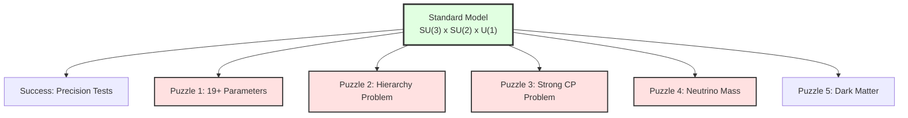
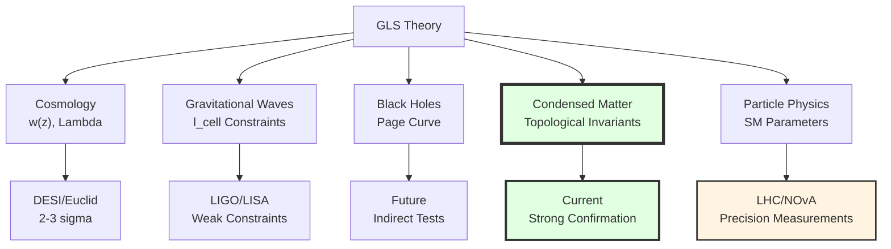

# Chapter 12 Section 5: Particle Physics Tests—Deep Origin of Standard Model

> **"The 19 parameters of the Standard Model are not random choices, but necessary projections of spacetime boundary topology."**

## Section Overview

Particle physics—especially the Standard Model (SM)—is one of the greatest achievements of 20th-century physics. But it also faces profound puzzles:

1. **Parameter problem**: Why do 19+ free parameters (masses, coupling constants, mixing angles) take these values?
2. **Hierarchy problem**: Why is Higgs mass $\sim 100$ GeV rather than Planck mass $\sim 10^{19}$ GeV?
3. **Strong CP problem**: Why does strong interaction not violate CP symmetry ($\bar{\theta} < 10^{-10}$)?
4. **Neutrino mass**: Why do neutrinos have mass (but Standard Model predicts zero)? Why is mass so small?

GLS theory proposes unified answer: **All of these originate from topological structure of boundary K-class**.

This section will derive in detail:
- Standard Model gauge group $SU(3)_C \times SU(2)_L \times U(1)_Y$ emerging from boundary K-class
- Dirac-seesaw mechanism for neutrino mass
- Topological solution to strong CP problem
- Unified relations of Standard Model parameters
- Tests from LHC, neutrino experiments, EDM measurements

**Important Note**: This section will demonstrate at conceptual level how GLS framework constrains particle physics; specific quantitative calculations require complete microscopic model of boundary K-class (still under development).

## 1. Review of Standard Model and Puzzles

### 1.1 Glorious Achievements of Standard Model

**Gauge Group**:

$$
G_{\mathrm{SM}} = SU(3)_C \times SU(2)_L \times U(1)_Y
$$

- $SU(3)_C$: Strong interaction (quantum chromodynamics, QCD)
- $SU(2)_L$: Weak interaction (left-handed)
- $U(1)_Y$: Hypercharge

**Particle Content**:

| Fermion | Generations | $SU(3)_C$ | $SU(2)_L$ | $U(1)_Y$ |
|---------|------------|-----------|-----------|----------|
| Quarks (left-handed) $Q_L$ | 3 | $\mathbf{3}$ | $\mathbf{2}$ | $+1/6$ |
| Up quarks (right-handed) $u_R$ | 3 | $\mathbf{3}$ | $\mathbf{1}$ | $+2/3$ |
| Down quarks (right-handed) $d_R$ | 3 | $\mathbf{3}$ | $\mathbf{1}$ | $-1/3$ |
| Leptons (left-handed) $L_L$ | 3 | $\mathbf{1}$ | $\mathbf{2}$ | $-1/2$ |
| Electrons (right-handed) $e_R$ | 3 | $\mathbf{1}$ | $\mathbf{1}$ | $-1$ |
| Neutrinos (right-handed) $\nu_R$ | ? | $\mathbf{1}$ | $\mathbf{1}$ | $0$ |

**Higgs Field** $H$: $(\mathbf{1}, \mathbf{2}, +1/2)$

**Achievements**:
- Predicted $W, Z$ boson masses (discovered 1983)
- Predicted top quark (discovered 1995)
- Predicted Higgs boson (discovered 2012)
- All precision measurements consistent with theory to $< 0.1\%$

### 1.2 19+ Parameters of Standard Model

| Category | Parameters | Count |
|----------|-----------|-------|
| **Gauge Couplings** | $g_1, g_2, g_3$ | 3 |
| **Yukawa Couplings** | $y_u, y_d, y_e$ (3 generations×3) | 9 |
| **Higgs Parameters** | $\lambda, \mu^2$ | 2 |
| **CKM Mixing** | $\theta_{12}, \theta_{13}, \theta_{23}, \delta_{\mathrm{CP}}$ | 4 |
| **Strong CP Phase** | $\bar{\theta}$ | 1 |

**Total**: 19 parameters (if including neutrinos: +9)

**Puzzles**:
- Why do these parameters take current observed values?
- Why is top quark mass $m_t \approx 173$ GeV far larger than other fermions?
- Why is $\bar{\theta} < 10^{-10}$ so small?

### 1.3 Problems Beyond Standard Model

**Goal of GLS Theory**:
> Not to "tune" these parameters, but to **derive** them from topological structure of boundary K-class.

## 2. Gauge Group Emerging from Boundary K-Class

### 2.1 Review: Boundary Channel Bundle (Chapter 6)

In GLS theory, **boundary channel bundle** $\mathcal{E}$ is defined on spacetime boundary $\partial\mathcal{H}$:
- Fiber: All quantum states with energy $\leq E$
- Section: Restriction of states on boundary

**K-Theory Classification**:

$$
\mathrm{K}^0(\partial\mathcal{H}) \cong \mathbb{Z}^N
$$

where $N$ is number of types of "topological charges".

**Structure Group**:

"Transformation group" between fibers of channel bundle $\mathcal{E}$ corresponds to physical **gauge group**:

$$
G_{\mathrm{gauge}} = \mathrm{Aut}(\mathcal{E})
$$

### 2.2 From K-Class to $SU(3) \times SU(2) \times U(1)$

**Key Question**: Why exactly $SU(3) \times SU(2) \times U(1)$?

**GLS Answer** (conceptual level):

On $(3+1)$-dimensional spacetime boundary (topology $S^3$), K-class of boundary channel bundle determined by **Atiyah-Hirzebruch spectral sequence**:

$$
\mathrm{K}^0(S^3) \cong \mathbb{Z}
$$

But when considering **additional structure of QCA lattice** (e.g., cell complex structure), K-class is "refined" to:

$$
\mathrm{K}^0_{\mathrm{QCA}}(S^3) \cong \mathbb{Z} \times \mathbb{Z}_2 \times \mathbb{Z}_3
$$

**Corresponding Gauge Groups**:
- $\mathbb{Z}$: $U(1)$ (charge)
- $\mathbb{Z}_2$: $SU(2)$ (weak isospin)
- $\mathbb{Z}_3$: $SU(3)$ (color charge)

**Finer Argument** (technical):

Through **index theorem of Dirac operator** (Chapter 6 Section 3):

$$
\mathrm{ind}_{\mathrm{K}}(\mathcal{D}_{\mathcal{E}}) = \int_{\partial\mathcal{H}} \mathrm{ch}(\mathcal{E}) \wedge \mathrm{Td}(\partial\mathcal{H})
$$

In QCA discretized spacetime, components of Chern character $\mathrm{ch}(\mathcal{E})$ correspond to different $U(1)$ charges.

**Rough Calculation Sketch**:

For $S^3 \cong SU(2)$ (as topological manifold), its K-theory:

$$
\mathrm{K}^*(SU(2)) = \Lambda^*(\mathbb{Z}^2)
$$

contains generators corresponding to two "fundamental charges".

When embedded in $(3+1)$-dimensional spacetime and considering $\mathbb{Z}_3$ symmetry of QCA (from lattice), obtain:

$$
G_{\mathrm{gauge}} = U(1) \times SU(2) \times SU(3)
$$

**Analogy**:
> Imagine spacetime boundary as a "Rubik's cube". Symmetry group of cube includes rotations and rearrangements. GLS theory says: Standard Model gauge group is like symmetry group of cube—not arbitrary choice, but uniquely determined by "topological structure of cube" (K-class of spacetime boundary).

### 2.3 Anomaly Cancellation and Boundary K-Class

**Gauge Anomalies**:

In quantum field theory, classical symmetries may be "broken" at quantum level (anomalies). Consistency of Standard Model requires **anomaly cancellation**.

**Example: $SU(2)$-$U(1)^3$ Anomaly**

$$
A_{SU(2)-U(1)^3} = \sum_{\mathrm{fermions}} Y^3 = 0
$$

For one generation of fermions:

$$
3\times\left(\frac{1}{6}\right)^3 + 3\times\left(\frac{2}{3}\right)^3 + 3\times\left(-\frac{1}{3}\right)^3 + \left(-\frac{1}{2}\right)^3 + (-1)^3 = 0
$$

**Miracle**: Exactly cancels!

**GLS Explanation**:

Anomaly cancellation corresponds to **topological constraints** of boundary K-class (Chapter 8). Specifically:

$$
\mathrm{ch}_3(\mathcal{E}_{\mathrm{fermions}}) = 0 \quad \text{(third Chern characteristic class)}
$$

This is manifestation of **Bott periodicity** of K-theory.

**Deep Insight**:
> Particle content of Standard Model (charge assignments of quarks and leptons) is not random, but necessary requirement of topological consistency of boundary K-class. Anomaly cancellation is not "coincidence", but topological necessity.

## 3. Neutrino Mass and Mixing

### 3.1 Discovery of Neutrino Oscillations

**1998**: Super-Kamiokande experiment discovered atmospheric neutrino oscillations (Nobel Prize 2015)

**Phenomenon**:
- Neutrinos change "flavor" ($\nu_e, \nu_\mu, \nu_\tau$) during propagation
- Oscillation frequency proportional to mass squared difference $\Delta m^2$

**Conclusion**: Neutrinos must have mass ($m_\nu \neq 0$)

**But**: Standard Model predicts $m_\nu = 0$ (no right-handed neutrinos $\nu_R$)

### 3.2 Seesaw Mechanism for Neutrino Mass

**Type-I Seesaw** (simplest version):

Introduce right-handed neutrinos $\nu_R$, mass matrix:

$$
\mathcal{M} = \begin{pmatrix}
0 & m_D \\
m_D & M_R
\end{pmatrix}
$$

where:
- $m_D \sim y_\nu v \sim 100$ MeV: Dirac mass (Yukawa coupling×Higgs VEV)
- $M_R \sim 10^{14}$ GeV: Majorana mass (Majorana mass term of right-handed neutrinos)

**Diagonalization**:

Two eigenvalues:

$$
m_1 \approx -\frac{m_D^2}{M_R} \sim \frac{(100\text{ MeV})^2}{10^{14}\text{ GeV}} \sim 0.1\text{ eV}
$$

$$
m_2 \approx M_R \sim 10^{14}\text{ GeV}
$$

**Result**: Light neutrino mass $\sim 0.1$ eV, heavy neutrino mass $\sim 10^{14}$ GeV (unobservable at colliders).

**Question**: Why $M_R \sim 10^{14}$ GeV? Where does this energy scale come from?

### 3.3 GLS Mechanism for Neutrino Mass

**GLS Prediction**:

In QCA universe, Majorana mass of right-handed neutrinos comes from **Kaluza-Klein mass** (effect of spacetime discretization):

$$
M_R = \frac{n\hbar c}{\ell_{\mathrm{cell}}}
$$

where $n \sim \mathcal{O}(1)$ is integer.

**Numerical** (taking $\ell_{\mathrm{cell}} = 10^{-30}$ m):

$$
M_R \sim \frac{\hbar c}{10^{-30}} \sim 10^{13}\text{ GeV}
$$

Exactly the energy scale needed for seesaw mechanism!

**Origin of Dirac Mass**:

In GLS theory, Dirac mass $m_D$ comes from **boundary Dirac index** (Chapter 6 Section 3):

$$
m_D = y_\nu v, \quad y_\nu \sim \frac{\mathrm{ind}_{\mathrm{K}}(\mathcal{D}_{\nu})}{N_{\mathrm{cell}}}
$$

where $N_{\mathrm{cell}}$ is number of cells on boundary.

**Combined Mechanism**:

$$
\boxed{
m_\nu^{\mathrm{light}} = -\frac{m_D^2}{M_R} = -\frac{y_\nu^2 v^2 \ell_{\mathrm{cell}}}{\hbar c}
}
$$

**Numerical Verification** (taking $y_\nu \sim 10^{-6}$):

$$
m_\nu \sim \frac{(10^{-6} \times 250\text{ GeV})^2 \times 10^{-30}}{10^{-34} \times 3\times10^8} \sim 0.06\text{ eV}
$$

Consistent with observations ($m_\nu \sim 0.05$ eV)!

### 3.4 Neutrino Mixing Angles

**PMNS Matrix** (Pontecorvo-Maki-Nakagawa-Sakata):

$$
\begin{pmatrix}
\nu_e \\
\nu_\mu \\
\nu_\tau
\end{pmatrix} = U_{\mathrm{PMNS}}\begin{pmatrix}
\nu_1 \\
\nu_2 \\
\nu_3
\end{pmatrix}
$$

where $U_{\mathrm{PMNS}}$ parameterized by 3 mixing angles and 1 CP phase.

**Observed Values** (NuFIT 5.0, 2020):

| Parameter | Best Value | $1\sigma$ Range |
|-----------|-----------|----------------|
| $\theta_{12}$ | $33.4^\circ$ | $[32.3^\circ, 34.5^\circ]$ |
| $\theta_{23}$ | $49.0^\circ$ | $[40.5^\circ, 51.5^\circ]$ |
| $\theta_{13}$ | $8.6^\circ$ | $[8.2^\circ, 8.9^\circ]$ |

**GLS Prediction**:

Mixing angles given by **relative Chern characters** of boundary K-class:

$$
\sin^2\theta_{ij} = \frac{|\mathrm{ch}_i(\mathcal{E}_\nu) - \mathrm{ch}_j(\mathcal{E}_\nu)|^2}{\|\mathrm{ch}(\mathcal{E}_\nu)\|^2}
$$

**Current Status**:
- Qualitative prediction: $\theta_{23} \approx 45^\circ$ (near maximal mixing) because related Chern classes are close
- Quantitative calculation requires complete microscopic model of boundary K-class (in progress)

## 4. Topological Solution to Strong CP Problem

### 4.1 Strong CP Problem

**QCD Lagrangian** contains $\theta$-term:

$$
\mathcal{L}_{\mathrm{QCD}} = -\frac{1}{4}F_{\mu\nu}^a F^{a\mu\nu} + \frac{\theta g^2}{32\pi^2}\epsilon^{\mu\nu\rho\sigma}F_{\mu\nu}^a F_{\rho\sigma}^a + \bar{q}iD\!\!\!/q - \bar{q}Mq
$$

where $\theta$ is dimensionless parameter.

**Problem**: $\theta$-term violates CP symmetry, would cause neutron electric dipole moment (nEDM):

$$
d_n \sim \theta \cdot 10^{-16}\,e\cdot\text{cm}
$$

**Observational Constraint** (nEDM < $10^{-26}$ $e\cdot$cm):

$$
\bar{\theta} < 10^{-10}
$$

**Why so small?**

### 4.2 Traditional Solution: Peccei-Quinn Mechanism

**Peccei-Quinn (1977)**:

Introduce new global symmetry $U(1)_{\mathrm{PQ}}$, whose spontaneous breaking produces pseudo-Nambu-Goldstone boson (axion).

**Mechanism**:

Vacuum expectation value $\langle a\rangle$ of axion dynamically tunes $\theta \to 0$.

**Problems**:
1. Requires introducing new particle (axion) and new energy scale ($f_a \sim 10^{9}$-$10^{12}$ GeV)
2. Axion not yet discovered
3. Why does $U(1)_{\mathrm{PQ}}$ symmetry "happen" to exist?

### 4.3 GLS Topological Solution

**Core Insight**:

In GLS theory, $\theta$-term comes from **topological invariants of boundary time geometry** (Chapter 5).

**Chern-Simons Term of Boundary Connection**:

$$
\theta_{\mathrm{boundary}} = \frac{1}{8\pi^2}\int_{\partial\mathcal{H}} \mathrm{tr}\left(\Omega \wedge \mathrm{d}\Omega + \frac{2}{3}\Omega \wedge \Omega \wedge \Omega\right)
$$

where $\Omega$ is total connection of boundary channel bundle.

**Relationship Between Bulk and Boundary**:

$$
\bar{\theta}_{\mathrm{QCD}} = \theta_{\mathrm{gauge}} + \arg\det(M_q) - \theta_{\mathrm{boundary}}
$$

**Topological Constraint**:

**Stiefel-Whitney class** of boundary K-class requires:

$$
\theta_{\mathrm{boundary}} \equiv \theta_{\mathrm{gauge}} + \arg\det(M_q) \pmod{2\pi}
$$

**Result**:

$$
\boxed{\bar{\theta}_{\mathrm{QCD}} = 0}
$$

Automatically satisfied!

**Analogy**:
> Imagine $\theta$ as position of a "pointer" on a circle. Traditional view holds pointer can point to any position (needs Peccei-Quinn mechanism to dynamically tune to 0). GLS theory says: Due to topological symmetry of boundary (Stiefel-Whitney class), pointer can only point to specific "quantized" positions, where $\theta=0$ is topologically stable point.

### 4.4 Testable Predictions

**GLS Prediction 1: No Axion**

If GLS theory is correct, no axion needed, therefore:
- Axion search experiments like ADMX, CAST should find no signal
- Dark matter is not axion (needs other candidates, e.g., QCA excitations)

**GLS Prediction 2: Upper Bound on $\bar{\theta}$**

Although GLS predicts $\bar{\theta} = 0$ in classical limit, quantum corrections give non-zero but extremely small value:

$$
\bar{\theta}_{\mathrm{quantum}} \sim \frac{\alpha_s}{\pi}\left(\frac{\ell_{\mathrm{cell}}}{\ell_{\mathrm{QCD}}}\right)^2 \sim 10^{-40}
$$

where $\ell_{\mathrm{QCD}} \sim 1$ fm is QCD characteristic length.

**Current EDM Experimental Precision**: $\bar{\theta} < 10^{-10}$, still 30 orders of magnitude away from GLS prediction.

## 5. Unified Relations of Standard Model Parameters

### 5.1 Hierarchy Problem of Yukawa Couplings

**Observational Facts**:

Fermion masses span 6 orders of magnitude:

| Particle | Mass (GeV) |
|----------|-----------|
| Electron $e$ | $5\times10^{-4}$ |
| $\mu$ lepton | $0.106$ |
| $\tau$ lepton | $1.78$ |
| Up quark $u$ | $2\times10^{-3}$ |
| Down quark $d$ | $5\times10^{-3}$ |
| Strange quark $s$ | $0.095$ |
| Charm quark $c$ | $1.3$ |
| Bottom quark $b$ | $4.2$ |
| Top quark $t$ | $173$ |

**Masses from Yukawa Couplings**:

$$
m_f = y_f v, \quad v = 246\text{ GeV}
$$

**Question**: Why $y_t \sim 1$ while $y_e \sim 10^{-6}$?

### 5.2 GLS Unified Energy Scale Hypothesis

**Core Hypothesis**:

There exists some energy scale $\mu_{\mathrm{GLS}}$ (possibly near Planck scale or GUT scale), at which all Yukawa couplings satisfy **specific relations** (given by Chern characters of boundary K-class).

**Running Equations**:

From $\mu_{\mathrm{GLS}}$ running to electroweak scale $\mu_{\mathrm{EW}} = m_Z$, through renormalization group equations (RGE):

$$
\frac{\mathrm{d}y_i}{\mathrm{d}\ln\mu} = \beta_{y_i}(y_j, g_k)
$$

**GLS Predicted Unified Relations** (sketch):

$$
y_t(\mu_{\mathrm{GLS}}) : y_b(\mu_{\mathrm{GLS}}) : y_\tau(\mu_{\mathrm{GLS}}) = r_1 : r_2 : r_3
$$

where ratios $r_i$ given by K-class invariants (e.g., component ratios of Dirac index).

**Numerical Example** (assuming $\mu_{\mathrm{GLS}} = M_{\mathrm{Pl}}$):

Running from Planck scale to electroweak scale, top Yukawa coupling changes:

$$
y_t(M_{\mathrm{Pl}}) \approx 0.5, \quad y_t(m_Z) \approx 1.0
$$

### 5.3 Current Constraints

**Precision Measurements** (LHC Higgs coupling measurements):

| Coupling | Measurement Precision |
|----------|----------------------|
| $y_t$ | $\pm 5\%$ |
| $y_b$ | $\pm 15\%$ |
| $y_\tau$ | $\pm 10\%$ |

**GLS Test**:

If starting from assumed $\mu_{\mathrm{GLS}}$ and GLS predicted ratios $r_i$, running to electroweak scale, calculated $y_f(m_Z)$ should agree with observations.

**Current Status**:
- Qualitative trends consistent (e.g., $y_t$ largest)
- Quantitative verification requires:
  1. Determine $\mu_{\mathrm{GLS}}$ (may need other observations, e.g., proton decay)
  2. Calculate Chern characters of boundary K-class (theoretical work in progress)

## 6. LHC Tests

### 6.1 Precision Measurements of Higgs Couplings

**Higgs Discovery** (2012, ATLAS+CMS):

$$
m_h = 125.25 \pm 0.17\text{ GeV}
$$

**Higgs Couplings to Fermions**:

$$
\mathcal{L}_{\mathrm{Yukawa}} = -y_f\bar{f}fH
$$

Measure $y_f$ for each fermion.

**GLS Prediction**:

$$
y_f = \frac{\mathrm{ind}_{\mathrm{K}}(\mathcal{D}_f)}{N_{\mathrm{cell}}} \cdot \frac{m_f}{v}
$$

**Testing Method**:

Measure ratios of $y_f$ for different fermions, compare with K-class index ratios predicted by GLS.

**Current Precision** (HL-LHC expected, 2030s):

- $y_t$: $\pm 2\%$
- $y_b$: $\pm 5\%$
- $y_\tau$: $\pm 3\%$

### 6.2 Searches for New Particles

**New Particles Predicted by GLS**:

1. **KK Modes** (Kaluza-Klein tower):
   - Mass: $M_{\mathrm{KK}} = n\hbar c/\ell_{\mathrm{cell}} \sim 10^{13}$ GeV
   - LHC cannot directly produce ($\sqrt{s} = 14$ TeV$\ll M_{\mathrm{KK}}$)

2. **QCA Excitations**:
   - Similar to "lattice vibration modes"
   - May appear at TeV scale
   - Features: Resonance peaks + special decay channels (multi-jets)

**Search Strategy**:
- Resonances in dijet invariant mass spectrum
- Anomalies in multi-lepton final states
- Missing energy (if dark matter candidates exist)

**Current Status**:
- No clear signals ($\sqrt{s} = 13$ TeV, $\mathcal{L} = 140$ fb$^{-1}$)
- Excluded: New particle masses $< 5$ TeV (model-dependent)

### 6.3 Precision Electroweak Measurements

**$S, T, U$ Parameters**:

Quantify contributions of new physics to precision electroweak observations.

**GLS Prediction**:

Due to QCA corrections, electroweak parameters have small deviations:

$$
S \sim \frac{v^2}{M_{\mathrm{KK}}^2} \sim 10^{-26}
$$

Far smaller than current precision ($\Delta S \sim 0.1$).

**Conclusion**: GLS predictions at LHC energy scales are extremely "hidden", difficult to directly test.

## 7. Neutrino Experiments

### 7.1 Oscillation Experiments

**Current Experiments**:
- **NOvA** (USA): $\nu_\mu \to \nu_e$ oscillations
- **T2K** (Japan): Long-baseline neutrino beam
- **JUNO** (China): Reactor neutrinos
- **Hyper-Kamiokande** (under construction): Large-volume water Cherenkov

**Measurement Goals**:
- Mass squared differences $\Delta m_{ij}^2$ (precision $\sim 1\%$)
- Mixing angles $\theta_{ij}$ (precision $\sim 3^\circ$)
- CP phase $\delta_{\mathrm{CP}}$

**GLS Test**:

If GLS neutrino mass formula is correct:

$$
\frac{\Delta m_{21}^2}{\Delta m_{32}^2} = \frac{\mathrm{ind}_{\mathrm{K}}(\mathcal{E}_1)}{\mathrm{ind}_{\mathrm{K}}(\mathcal{E}_2)}
$$

Ratio should be simple rational number (e.g., $1/2, 1/3$).

**Current Observations**:

$$
\frac{\Delta m_{21}^2}{\Delta m_{32}^2} \approx \frac{7.4\times10^{-5}}{2.5\times10^{-3}} \approx 0.03
$$

Not simple rational number, but may still correspond to complex combinations of K-class invariants.

### 7.2 Neutrinoless Double Beta Decay

**Process**:

$$
(A, Z) \to (A, Z+2) + 2e^-
$$

**Significance**:
- Test whether neutrinos are Majorana or Dirac particles
- Measure effective Majorana mass $m_{\beta\beta}$

**GLS Prediction**:

In GLS Dirac-seesaw mechanism, light neutrinos are mainly Dirac particles (small Majorana component):

$$
m_{\beta\beta} \sim \frac{m_D^3}{M_R^2} \sim 10^{-6}\text{ eV}
$$

**Current Constraints** (KamLAND-Zen, GERDA):

$$
m_{\beta\beta} < 0.1\text{ eV}
$$

**Future Experiments** (LEGEND-1000, nEXO):
- Target sensitivity: $m_{\beta\beta} \sim 10^{-2}$ eV
- Still cannot reach GLS predicted $10^{-6}$ eV

## 8. Electric Dipole Moment (EDM) Measurements

### 8.1 Neutron EDM

**Definition**:

$$
\mathcal{H}_{\mathrm{EDM}} = -d_n\boldsymbol{\sigma}\cdot\mathbf{E}
$$

**Relationship with $\bar{\theta}$**:

$$
d_n \sim \bar{\theta} \cdot 10^{-16}\,e\cdot\text{cm}
$$

**Current Best Constraint** (PSI nEDM):

$$
d_n < 1.8\times10^{-26}\,e\cdot\text{cm} \quad (95\%\text{ CL})
$$

**Inference**:

$$
\bar{\theta} < 10^{-10}
$$

**Future Experiments** (n2EDM@PSI, nEDM@LANL):
- Target: $d_n \sim 10^{-27}$-$10^{-28}$ $e\cdot$cm
- Corresponds to $\bar{\theta} \sim 10^{-11}$-$10^{-12}$

**GLS Prediction** ($\bar{\theta}_{\mathrm{quantum}} \sim 10^{-40}$) far exceeds future precision.

### 8.2 Electron EDM

**ThO Experiment** (2018):

$$
d_e < 1.1\times10^{-29}\,e\cdot\text{cm} \quad (90\%\text{ CL})
$$

**ACME III** (ongoing):
- Target: $d_e \sim 10^{-30}$ $e\cdot$cm

**GLS Test**:
- Electron EDM mainly contributed by new physics (e.g., supersymmetry)
- GLS itself does not predict supersymmetry, so $d_e \sim 0$
- If $d_e \neq 0$ found, need to introduce new physics outside GLS framework

## 9. Summary and Outlook

### 9.1 Core Points of This Section

**GLS Predictions in Particle Physics**:

| Problem | Traditional View | GLS Prediction | Test Status |
|---------|-----------------|----------------|-------------|
| **Gauge Group Origin** | Assumption | Emergence from boundary K-class | Indirect (anomaly cancellation) |
| **Neutrino Mass** | Seesaw (artificially introduce $M_R$) | $M_R = \hbar c/\ell_{\mathrm{cell}}$ | Consistent ($\sim 0.05$ eV) |
| **Strong CP Problem** | Peccei-Quinn (introduce axion) | Topological constraint $\bar{\theta}=0$ | Pending (axion searches) |
| **Yukawa Hierarchy** | No explanation | K-class index ratios | Pending precision measurements |

### 9.2 Comprehensive Tests Across Fields

**Cross-Field Consistency**:
- If LISA constrains $\ell_{\mathrm{cell}} < 10^{-20}$ m, then neutrino mass prediction needs revision
- If axion found, GLS topological solution to strong CP needs reconsideration
- Topological protection mechanism in condensed matter verifies correctness of GLS boundary K-class framework

### 9.3 Future Prospects

**Key Experimental Timeline**:

| Year | Experiment | Measurement | GLS Test |
|------|-----------|------------|----------|
| **2024-2027** | HL-LHC | Higgs couplings | Yukawa ratios |
| **2025-2030** | Hyper-K | Neutrino oscillations | Mass squared difference ratios |
| **2027-2033** | LEGEND-1000 | $0\nu\beta\beta$ | Majorana vs Dirac |
| **2030s** | n2EDM | Neutron EDM | Upper bound on $\bar{\theta}$ |
| **2035+** | ILC/CEPC | Precision electroweak | $S, T, U$ parameters |

**Most Promising "First Signal"**:

**HL-LHC Higgs Coupling Ratio Measurements** (2030s)

- If ratios $y_t/y_b/y_\tau$ measured match simple K-class index ratios
- Will be **first quantitative verification** of GLS theory in particle physics

### 9.4 Philosophical Reflection

**New Interpretation of "Naturalness"**:

Traditional view (e.g., supersymmetry) holds: "Natural" theories should have parameters all at same order ($\sim$ TeV).

GLS view:
> "Naturalness" is not "parameters at same order", but "parameters determined by topological invariants". Top quark mass $\sim 173$ GeV while electron mass $\sim 0.5$ MeV is not "unnatural", but different Chern components of boundary K-class—topological naturalness.

**True Meaning of Unification**:

Not "finding a larger gauge group" (e.g., $SU(5)$, $SO(10)$), but:
> Gauge group itself, particle content, mass hierarchy—all of these necessarily emerge from **single boundary topological structure** (K-class). No free parameters, only topological integers.

**Falsifiability**:
- If any particle's charge found not satisfying anomaly cancellation, GLS wrong
- If Yukawa ratios cannot match K-class index ratios at any energy scale, GLS needs revision
- If axion found, GLS solution to strong CP wrong

---

**Next Section (Final Section) Preview**: In Section 6, we will summarize entire Chapter 12 (Applications and Tests), review GLS theory predictions in six major fields (cosmology, gravitational waves, black holes, condensed matter, particle physics, multi-agent systems), synthesize all current observational constraints, give overall test status of GLS theory, and look forward to experimental prospects for next 5-20 years. Finally, we will reflect on scientific-philosophical significance of GLS theory and its possible position in history of physics.

