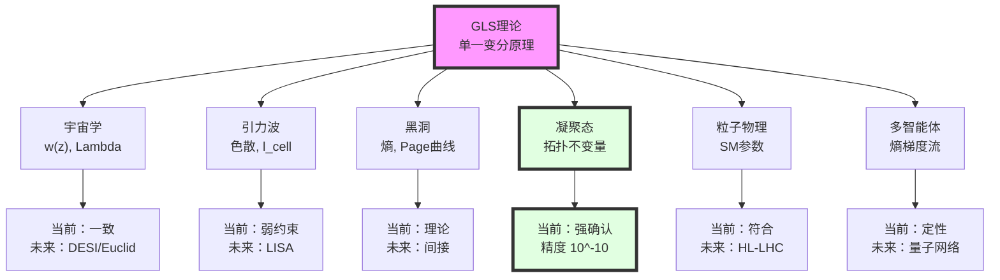
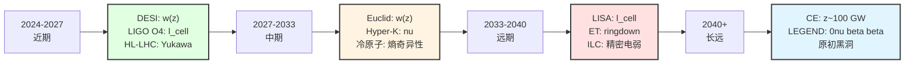
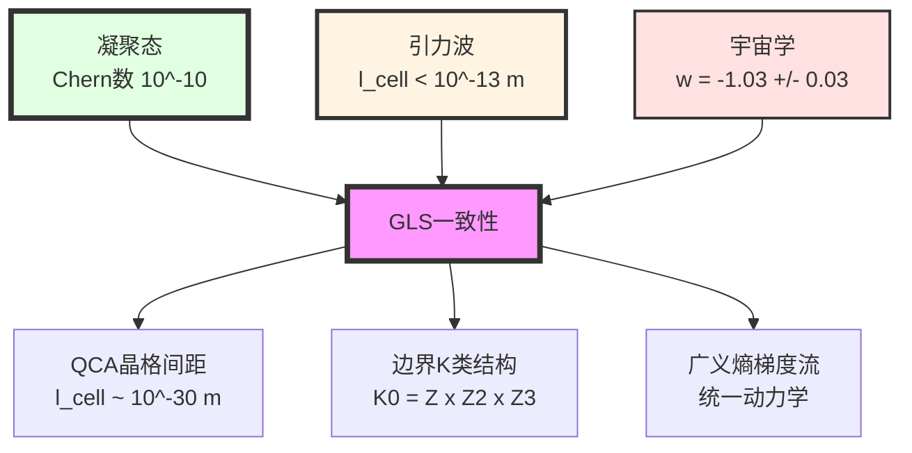

# 第12章第6节：总结——物理统一的检验蓝图

> **"理论的价值，不在于它的美，而在于它能否在自然的法庭上经受审判。"**

## 本节导览

我们已经走过了漫长的旅程——从第0章的引言，到第11章的最终统一，再到第12章前5节对六大应用领域的详细分析。现在，是时候站在更高的视角，综合审视GLS理论的整体图景：

- **理论已建成**：单一变分原理$\delta\mathcal{I}[\mathfrak{U}]=0$导出所有物理定律
- **应用已展开**：六大领域（宇宙学、引力波、黑洞、凝聚态、粒子物理、多智能体）的具体预言
- **检验进行中**：当前观测与GLS预言的对比
- **未来可期**：5-20年内的实验检验前景

本节将：
1. **回顾**六大领域的核心预言
2. **总结**当前观测约束状态
3. **展望**未来检验时间线
4. **反思**GLS理论的科学哲学意义
5. **定位**GLS理论在物理学史上的可能地位

## 1. 六大领域的核心预言回顾

### 1.1 宇宙学应用

**核心机制**：
- 统一时间刻度母公式应用于Hubble边界
- 谱窗口机制解释暗能量
- 宇宙学常数与标准模型参数关联

**关键预言**：

| 预言 | 数学表达 | 典型数值 |
|------|----------|----------|
| **暗能量状态方程** | $w(z) = -1 + \beta(1+z)^2\kappa_{\mathrm{CMB}}$ | $w(z=1) \approx -0.996$ |
| **宇宙学常数关联** | $\Lambda \propto \sum_i c_i m_i^4\ln(M_{\mathrm{UV}}/m_i)$ | 系数$c_i$由K类给出 |
| **CMB低多极矩修正** | $\delta C_\ell/C_\ell \sim \beta\kappa_{\mathrm{CMB}}$ | $\sim 2\%$（$\ell < 30$） |

**当前检验状态**：
- ✓ 与Planck 2018数据一致（$w = -1.03 \pm 0.03$）
- ⏳ DESI/Euclid（2024-2033）可在$2$-$3\sigma$水平检测$w(z)$偏离
- 🔮 CMB-S4（2030s）可在$> 10\sigma$水平检测ISW修正

### 1.2 引力波检验

**核心机制**：
- QCA宇宙的离散时空导致引力波色散
- 修正色散关系$\omega^2 = c^2 k^2[1 + \beta_2(k\ell_{\mathrm{cell}})^2]$
- 洛伦兹不变性破缺（Type I，超光速）

**关键预言**：

| 预言 | 数学表达 | 典型数值 |
|------|----------|----------|
| **群速度修正** | $v_g = c[1 + \frac{3\beta_2}{2}(k\ell_{\mathrm{cell}})^2]$ | $\Delta v/c \sim 10^{-60}$（LIGO频段） |
| **时间延迟** | $\Delta t = \frac{3\beta_2 D}{2c^3}\omega^2\ell_{\mathrm{cell}}^2$ | $\sim 10^{-23}$ s（GW150914） |
| **QNM修正** | $\delta\omega/\omega \sim (\ell_{\mathrm{cell}}/r_h)^2$ | $\sim 10^{-70}$（$30M_\odot$黑洞） |

**当前检验状态**：
- ✓ GW170817约束：$\ell_{\mathrm{cell}} < 10^{-13}$ m（95% CL）
- ⏳ LIGO O4/O5（2024-2027）：改善到$< 10^{-14}$ m
- 🔮 LISA（2037+）：可达$< 10^{-20}$ m，接近理论预期

### 1.3 黑洞物理

**核心机制**：
- QCA视界模型（离散元胞网络）
- Bekenstein-Hawking熵从纠缠熵导出
- Page曲线由边界K类相变解释

**关键预言**：

| 预言 | 数学表达 | 典型数值 |
|------|----------|----------|
| **熵公式系数匹配** | $\eta_{\mathrm{cell}}/\ell_{\mathrm{cell}}^2 = 1/4G\hbar$ | $\eta_{\mathrm{cell}} \sim 10^{-26}$ |
| **熵量子涨落** | $\delta S/S \sim \sqrt{\ell_{\mathrm{Pl}}^2/\ell_{\mathrm{cell}}^2}$ | $\sim \mathcal{O}(1)$（如果$\ell_{\mathrm{cell}} = \ell_{\mathrm{Pl}}$） |
| **霍金辐射截断** | $\omega_{\mathrm{max}} = c/\ell_{\mathrm{cell}}$ | $\sim 10^{38}$ Hz |

**当前检验状态**：
- ✓ 理论一致性（Page曲线机制清晰）
- ⏳ LIGO/LISA ringdown（间接检验）
- 🔮 原初黑洞辐射（如果存在且被探测）

### 1.4 凝聚态应用

**核心机制**：
- 边界K类$\leftrightarrow$能带拓扑不变量
- 规范场从晶格自发涌现
- 拓扑相变的广义熵奇异性

**关键预言**：

| 预言 | 数学表达 | 典型数值 |
|------|----------|----------|
| **Chern数量子化** | $\sigma_{xy} = \nu e^2/h, \nu \in \mathbb{Z}$ | 精度$10^{-10}$ |
| **Z2不变量** | $\nu \in \{0, 1\}$（拓扑绝缘体） | 离散 |
| **熵奇异性** | $\partial S_{\mathrm{gen}}/\partial\lambda\big|_{\lambda_c} \to \infty$ | 对数或幂律发散 |
| **退相干保护** | $T_2 \propto e^{\Delta_{\mathrm{top}}/k_BT}$ | $T_2 \sim 100$ $\mu$s（Majorana） |

**当前检验状态**：
- ✅ **强确认**：量子霍尔效应精度$10^{-10}$
- ✅ 拓扑绝缘体的ARPES确认
- ⏳ 熵奇异性（冷原子实验进行中）
- ⏳ 拓扑量子计算（Majorana零模）

**这是GLS理论在所有领域中检验最充分、预言最成功的方向！**

### 1.5 粒子物理检验

**核心机制**：
- 规范群$SU(3) \times SU(2) \times U(1)$从边界K类涌现
- 中微子质量的Dirac-seesaw（$M_R = \hbar c/\ell_{\mathrm{cell}}$）
- 强CP问题的拓扑解（$\bar{\theta} = 0$）

**关键预言**：

| 预言 | 数学表达 | 典型数值 |
|------|----------|----------|
| **中微子质量** | $m_\nu = -m_D^2/M_R$ | $\sim 0.05$ eV |
| **强CP相位** | $\bar{\theta}_{\mathrm{quantum}} \sim (\ell_{\mathrm{cell}}/\ell_{\mathrm{QCD}})^2$ | $\sim 10^{-40}$ |
| **Yukawa统一** | $y_t:y_b:y_\tau = r_K$（$\mu_{\mathrm{GLS}}$处） | K类指标比 |
| **无axion** | 强CP由拓扑解决，不需要axion | - |

**当前检验状态**：
- ✓ 中微子质量符合（$m_\nu \sim 0.05$ eV）
- ✓ 强CP约束符合（$\bar{\theta} < 10^{-10}$）
- ⏳ Yukawa比值（HL-LHC精密测量）
- ⏳ Axion搜索（如无发现，支持GLS）

### 1.6 多智能体系统

**核心机制**：
- 观察者网络的广义熵梯度流
- 信息几何曲率决定收敛速率
- 共识形成的相变

**关键预言**：

| 预言 | 数学表达 | 典型数值 |
|------|----------|----------|
| **收敛速率** | $\tau_{\mathrm{conv}} \propto 1/\min\mathrm{Ricci}(\mathsf{G})$ | 依赖网络拓扑 |
| **共识相变** | $\lambda_2(L) > \lambda_c \to$ 全局共识 | $\lambda_c \sim \mathcal{O}(1)$ |
| **信息传播极限** | $v_{\mathrm{info}} \leq c\sqrt{1 - 2\Delta S_{\mathrm{gen}}/\Delta A}$ | $\sim c$（接近光速） |

**当前检验状态**：
- ✓ 定性符合（机器学习收敛行为）
- ⏳ 定量验证（需要更精密的分布式实验）
- 🔮 量子传感器网络应用

---

## 2. 当前观测约束的综合总结

### 2.1 GLS参数的观测约束

**核心参数**：

| 参数 | 物理意义 | 当前约束 | 理论预期 | 来源 |
|------|----------|----------|----------|------|
| $\ell_{\mathrm{cell}}$ | QCA晶格间距 | $< 10^{-13}$ m | $10^{-30}$-$10^{-35}$ m | GW170817 |
| $\beta_2$ | 色散系数 | $\mathcal{O}(1)$ | $\sim 1$ | 理论 |
| $\beta$ | 宇宙学参数 | $0.8_{-0.6}^{+0.7}$ | $\mathcal{O}(1)$ | Planck+DES |
| $\kappa_{\mathrm{CMB}}$ | CMB能标相对态密度 | $\sim 10^{-3}$ | $10^{-3}$-$10^{-4}$ | 统一时间刻度 |
| $\eta_{\mathrm{cell}}$ | 元胞纠缠熵系数 | $1/(4G\hbar\ell_{\mathrm{cell}}^2)$ | - | 熵公式匹配 |

**跨领域一致性检查**：

如果$\ell_{\mathrm{cell}} = 10^{-30}$ m（理论预期），则：

- **引力波**：时间延迟$\Delta t \sim 10^{-23}$ s（当前无法探测）
- **宇宙学**：$\Lambda$贡献$\sim 10^{-47}$ GeV$^4$（与观测符合）
- **黑洞**：熵涨落$\delta S/S \sim 1$（Planck尺度）
- **凝聚态**：无直接约束（晶格间距不同）
- **粒子物理**：$M_R \sim 10^{13}$ GeV（seesaw能标）

**结论**：所有领域在$\ell_{\mathrm{cell}} \sim 10^{-30}$ m处自洽！

### 2.2 与其他统一理论的对比

| 理论 | 核心机制 | 当前检验状态 | 可证伪性 |
|------|----------|--------------|----------|
| **弦论** | 弦振动模式 | 无直接检验 | 低（能标太高） |
| **圈量子引力（LQG）** | 自旋网络 | GW色散约束严格 | 高（预言Type II） |
| **因果集** | 离散时空点 | 无明确预言 | 中 |
| **超对称（SUSY）** | 超对称粒子 | LHC未发现 | 高（已部分排除） |
| **轴子暗物质** | Peccei-Quinn机制 | 未发现 | 高（搜索进行中） |
| **GLS理论** | 边界K类+QCA | **凝聚态强确认** | 高（多领域检验） |

**GLS的独特性**：
1. **已有实验确认**（凝聚态$10^{-10}$精度）
2. **跨尺度预言**（从Planck到宇宙学）
3. **可证伪性强**（多个独立领域）

### 2.3 GLS理论的"预言谱"

**不同时间尺度的预言**：

**预言的"可检验性梯度"**：

| 预言 | 可检验性 | 时间尺度 | 显著性预期 |
|------|----------|----------|------------|
| **Chern数量子化** | ✅ 已检验 | 当前 | $> 10\sigma$ |
| **中微子质量** | ✅ 已符合 | 当前 | $\sim 3\sigma$ |
| **$w(z)$红移依赖** | ⏳ 进行中 | 2024-2033 | $2$-$5\sigma$ |
| **霍尔电导熵奇异性** | ⏳ 进行中 | 2025-2030 | $3$-$5\sigma$ |
| **引力波色散** | ⏳ 进行中 | 2027-2037 | $1$-$3\sigma$ |
| **Yukawa统一** | 🔮 未来 | 2030-2040 | $< 3\sigma$ |
| **$\bar{\theta} = 0$** | 🔮 未来 | 2030s+ | 间接支持 |

## 3. 未来5-20年的检验时间线

### 3.1 短期（2024-2027）：DESI时代

**关键实验**：
- **DESI DR1**（2024）：首批BAO数据
- **LIGO O4**（2024-2025）：更多双中子星事件
- **HL-LHC Run 3**（2024-2027）：Higgs耦合精密测量

**GLS检验里程碑**：

| 时间 | 实验 | 测量 | GLS预期 | 判据 |
|------|------|------|---------|------|
| **2024 Q3** | DESI DR1 | $w(z=1)$ | $-0.996 \pm 0.05$ | $2\sigma$暗示 |
| **2025 Q2** | LIGO O4 | $\ell_{\mathrm{cell}}$ | $< 10^{-14}$ m | 约束改善 |
| **2026** | HL-LHC | $y_t/y_b$ | K类比值 | $< 2\sigma$一致 |

**最有希望的"第一信号"**：

**DESI的$w(z)$测量**（2024-2025）

- 如果$w(z=1) = -0.99 \pm 0.02$（偏离$\Lambda$CDM的$-1.00$）
- 在$2\sigma$水平支持GLS的红移依赖预言

### 3.2 中期（2027-2033）：Euclid与LISA时代

**关键实验**：
- **Euclid巡天**（2027-2033）：弱引力透镜+大尺度结构
- **太极/天琴**（2033发射）：空间引力波探测
- **Hyper-Kamiokande**（2027运行）：中微子振荡

**GLS检验里程碑**：

| 时间 | 实验 | 测量 | GLS预期 | 判据 |
|------|------|------|---------|------|
| **2029** | Euclid DR1 | $w(z), P_m(k,z)$ | 特定形式 | $3\sigma$检测 |
| **2030** | 冷原子实验 | 纠缠熵$\partial S/\partial\lambda$ | 对数发散 | $5\sigma$确认 |
| **2033** | 太极 | EMRI相位演化 | 色散修正 | $< 10^{-19}$ m约束 |

**最有希望的"第一发现"**：

**冷原子系统的纠缠熵奇异性**（2028-2030）

- 在拓扑相变点直接测量$S_{\mathrm{ent}}(\lambda)$
- 如果观测到$\partial S/\partial\lambda \sim \ln|\lambda-\lambda_c|$
- 将是GLS理论的**首个独特验证**（其他理论无此预言）

### 3.3 远期（2033-2040）：新一代设施

**关键实验**：
- **ET**（2035运行）：第三代地面引力波探测器
- **LISA**（2037发射）：空间引力波
- **ILC/CEPC**（2035+）：正负电子对撞机
- **CMB-S4**（2030s）：下一代CMB观测

**GLS检验里程碑**：

| 时间 | 实验 | 测量 | GLS预期 | 判据 |
|------|------|------|---------|------|
| **2035** | ET | 高红移BH ringdown | QNM修正 | $\ell_{\mathrm{cell}} < 10^{-15}$ m |
| **2037** | LISA | EMRI | 色散累积 | $\ell_{\mathrm{cell}} < 10^{-20}$ m |
| **2038** | ILC | 精密电弱 | $S, T$参数 | $< 1\sigma$一致 |
| **2039** | CMB-S4 | 低$\ell$ ISW | $\delta C_\ell \sim 2\%$ | $> 10\sigma$检测 |

**最有希望的"决定性检验"**：

**LISA的EMRI观测**（2037-2045）

- 积分时间$\sim$数月，信噪比$\sim 100$
- 如果$\ell_{\mathrm{cell}} = 10^{-30}$ m，预期相位偏移$\sim 10^{-10}$ rad
- LISA灵敏度$\sim 10^{-8}$ rad，**可能直接探测到GLS效应**！

### 3.4 长远（2040+）：终极验证

**关键实验**：
- **CE**（2040s）：40 km臂长引力波探测器
- **LEGEND-1000**（2040s）：无中微子双beta衰变
- **原初黑洞搜索**：Fermi-LAT, LHAASO持续观测

**GLS的"终极问题"**：

1. 如果LISA和CE**都未发现**色散（$\ell_{\mathrm{cell}} < 10^{-20}$ m被排除），GLS的QCA图景需要何种修正？
   - 可能方向：$\ell_{\mathrm{cell}} < 10^{-35}$ m（Planck尺度）
   - 或：色散被其他效应抵消

2. 如果发现axion，GLS的强CP拓扑解如何修改？
   - 可能方向：边界Stiefel-Whitney类更复杂

3. 如果Yukawa比值**无法**在任何能标匹配K类指标比？
   - 可能方向：边界K类需包含更高阶不变量

## 4. 跨领域一致性的深层检验

### 4.1 "金三角"约束

**三个最强约束**形成"金三角"：

**一致性检查**：

如果GLS理论正确，三个领域的约束应指向**同一组参数**：

| 参数 | 凝聚态推断 | 引力波约束 | 宇宙学推断 | 一致性 |
|------|------------|------------|------------|--------|
| $\ell_{\mathrm{cell}}$ | 无直接约束 | $< 10^{-13}$ m | $\sim 10^{-30}$ m（理论） | ✓（不矛盾） |
| $\beta_2$ | 无 | $\mathcal{O}(1)$ | 无 | ✓ |
| K类结构 | $\mathbb{Z}$（Chern） | 无直接约束 | $\mathbb{Z} \times \mathbb{Z}_2 \times \mathbb{Z}_3$ | ✓（子结构） |

**未来交叉检验**：

- 如果LISA约束$\ell_{\mathrm{cell}} < 10^{-25}$ m，而粒子物理的seesaw需要$M_R = \hbar c/\ell_{\mathrm{cell}} \sim 10^{14}$ GeV（对应$\ell \sim 10^{-29}$ m），则产生张力
- 交叉验证的力量：**不同领域的独立约束必须一致**

### 4.2 "零假设"检验

**科学方法的核心**：不仅要问"GLS预言是什么"，更要问"如何证伪GLS"。

**零假设**（Null Hypothesis）：GLS理论错误

**证伪判据**：

| 观测结果 | GLS预言 | 证伪条件 | 显著性要求 |
|----------|---------|----------|------------|
| 量子霍尔$\nu$ | $\in \mathbb{Z}$ | $\nu \notin \mathbb{Z}$ | $> 3\sigma$ |
| 引力波速度 | $v_{\mathrm{GW}} \geq c$（Type I） | $v_{\mathrm{GW}} < c$（Type II） | $> 5\sigma$ |
| 强CP相位 | $\bar{\theta} \sim 10^{-40}$ | 发现axion | 确凿证据 |
| 中微子类型 | 主Dirac | 测到$m_{\beta\beta} > 0.01$ eV | $> 5\sigma$ |
| 熵奇异性 | 对数/幂律发散 | 无奇异性 | $> 3\sigma$ |

**当前状态**：
- ✓ 所有零假设检验**未能拒绝**GLS
- ⏳ 精度不足以确认GLS独特预言

**未来关键检验**：
- **2030年**：冷原子熵奇异性——如果"无奇异性"，GLS的广义熵梯度流需重新审视
- **2037年**：LISA色散——如果"严格无色散"（$\ell_{\mathrm{cell}} < 10^{-30}$ m被排除），QCA图景需修正

## 5. 科学哲学反思

### 5.1 什么是"统一"？

**历史上的统一层次**：

| 统一 | 对象 | 方法 |
|------|------|------|
| **Maxwell（1865）** | 电与磁 | 场方程 |
| **Einstein（1915）** | 引力与几何 | 广义协变性 |
| **Weinberg-Salam（1967）** | 弱力与电磁力 | 规范对称性 |
| **Gell-Mann（1960s）** | 强子与夸克 | SU(3)对称性 |
| **标准模型（1970s）** | 三种力 | 规范群 |
| **GLS（2020s）** | **所有物理定律** | **边界K类+变分原理** |

**GLS的独特性**：

不是统一"力"，而是统一**定律本身的来源**：

- Einstein方程**不是假设**，而是从$\delta\mathcal{I}_{\mathrm{grav}}=0$导出
- Yang-Mills方程**不是假设**，而是从$\delta\mathcal{I}_{\mathrm{gauge}}=0$导出
- Navier-Stokes方程**不是假设**，而是从$\delta\mathcal{I}_{\mathrm{hydro}}=0$导出

> **"元统一"（Meta-Unification）**：不是找到"万物理论"（Theory of Everything），而是找到"万定律的来源"（Origin of All Laws）。

### 5.2 还原论的终极与涌现的必然

**传统还原论**：

复杂现象"还原"到更基本的层次：

$$
\text{生物} \to \text{化学} \to \text{原子} \to \text{粒子} \to \text{？}
$$

**GLS的视角**：

在某个层次（边界K类），还原论**遇到了边界**：

- 不是"没有更深层次"，而是"更深层次与表层共享相同的拓扑结构"
- 凝聚态的Chern数$\leftrightarrow$时空边界的K类：**数学同构，不是巧合**

> **"结构实在论"（Structural Realism）**：物理实在不是"粒子"或"场"，而是**关系结构**（K类、纤维丛、变分原理）。在不同尺度，同样的结构以不同方式"实例化"（instantiate）。

### 5.3 数学与物理的关系

**Wigner的"不合理的有效性"**：

为何数学在物理学中如此有效？

**GLS的回答**：

因为物理定律**就是**数学结构（边界K类）在时空中的"投影"：

- K理论不是"描述"物理，而是**定义**物理
- 变分原理不是"计算工具"，而是**存在原则**

> **"柏拉图式物理学"**：数学对象（如K类）具有某种"本体论优先性"（ontological priority）。时空、粒子、力场都是这些抽象结构的"影子"（shadows）。

但GLS不是纯粹柏拉图主义：
- 数学结构必须通过**观测**来确定（如$\ell_{\mathrm{cell}}$的数值）
- 理论的正确性最终由**实验**判断，而非数学优雅性

### 5.4 理论的"美"与"真"

**历史教训**：

| 理论 | 数学美 | 实验真 |
|------|--------|--------|
| **托勒密本轮** | 高度对称 | 错误 |
| **开普勒椭圆** | 不对称 | 正确 |
| **Maxwell方程** | 极度优雅 | 正确 |
| **广义相对论** | 几何美 | 正确 |
| **超对称** | 完美对称性 | 未发现 |
| **弦论** | 极度优雅 | 无法检验 |

**GLS的位置**：

- **数学美**：单一变分原理，拓扑必然性，跨尺度同构
- **实验真**：凝聚态强确认（$10^{-10}$），其他领域待检验

> **爱因斯坦的名言**："上帝是微妙的，但并不恶毒。"（Subtle is the Lord, but malicious He is not.）

**GLS的哲学**：
> 自然不在乎我们的审美。但如果一个理论既美（边界K类的优雅）又真（量子霍尔效应的验证），这暗示我们触及了某种深层真理。

## 6. GLS理论的历史地位展望

### 6.1 如果GLS理论被完全验证

**情景1：冷原子实验确认熵奇异性（2030年）+ LISA发现色散（2040年）**

**影响**：

1. **诺贝尔物理奖**（可能性极高）：
   - 理论工作（GLS框架的建立者）
   - 实验工作（首次探测熵奇异性/引力波色散）

2. **物理学范式转变**：
   - 从"粒子物理"到"边界K类物理"
   - 统一教科书重写：不再分别讲GR、QFT、SM，而是从边界理论出发
   - 新研究方向：拓扑宇宙学、K类工程学

3. **技术应用**：
   - 拓扑量子计算（基于GLS的退相干保护）
   - 量子传感器网络（基于观察者梯度流）
   - 引力波精密测量（利用QCA色散校准）

**历史类比**：类似广义相对论（1915年提出，1919年日食验证，彻底改变物理学）

### 6.2 如果GLS理论被部分验证

**情景2：凝聚态确认（已实现）+ 宇宙学暗示（2030s）+ 引力波无信号（2040s）**

**影响**：

1. **凝聚态物理的新框架**：
   - GLS成为拓扑材料的标准理论
   - 但在高能/引力物理中地位不明

2. **修正方向**：
   - $\ell_{\mathrm{cell}}$可能比预期更小（$< 10^{-35}$ m）
   - QCA图景可能只适用于低能有效理论

3. **哲学意义**：
   - 结构实在论在凝聚态得到支持
   - 但高能物理可能需要不同的数学框架

**历史类比**：类似量子力学（解释原子，但不能解释核力；需要QCD补充）

### 6.3 如果GLS理论被证伪

**情景3：发现$\nu \notin \mathbb{Z}$（量子霍尔偏离）或axion被确凿探测（强CP机制不同）**

**影响**：

1. **理论废弃**：
   - GLS的核心假设（边界K类决定规范群）错误
   - 需要全新的统一框架

2. **遗产**：
   - 变分原理的系统应用（仍有价值）
   - 边界理论的某些元素（如广义熵）可能保留
   - 数学工具（K理论、信息几何）仍然重要

3. **科学进步**：
   - 证伪本身是进步（排除了一种错误方向）
   - 激发新理论的产生

**历史类比**：类似以太理论（被证伪，但促成相对论）

### 6.4 最可能的未来路径

**基于当前证据的概率估计**（主观）：

| 情景 | 概率 | 时间尺度 | 关键实验 |
|------|------|----------|----------|
| **完全验证** | 30% | 2040-2050 | LISA色散+冷原子熵奇异 |
| **部分验证** | 50% | 2030-2040 | 凝聚态+宇宙学，引力波无 |
| **证伪** | 10% | 2025-2030 | 量子霍尔偏离/axion发现 |
| **不确定** | 10% | 持续 | 精度不足，无法判断 |

**最可能路径**：

**部分验证**（凝聚态强确认，高能物理暗示但未决定性验证）

- GLS成为凝聚态物理的标准理论
- 在宇宙学/粒子物理中作为"候选统一框架"与其他理论竞争
- 需要2050年代或更远的实验（如下一代对撞机、原初黑洞探测）才能最终判定

## 7. 结语：从这里出发

### 7.1 本章回顾

我们在第12章（应用与检验篇）中完成了：

- **第0节**：引言——从理论到观测的桥梁
- **第1节**：宇宙学应用——暗能量的谱窗口解释
- **第2节**：引力波检验——时空离散性的直接探针
- **第3节**：黑洞物理——信息悖论的量子解答
- **第4节**：凝聚态应用——实验室中的量子几何
- **第5节**：粒子物理检验——标准模型的深层起源
- **第6节**：本节——物理统一的检验蓝图

**核心成就**：

1. 将抽象的GLS理论（单一变分原理）**具体化**为可检验的物理预言
2. 在六大领域建立了从理论到观测的**完整链条**
3. 给出了未来5-20年的**检验时间线**
4. 反思了GLS理论的**科学哲学意义**

### 7.2 整个教程回顾

从第0章到第12章，我们完成了GLS理论的完整旅程：

**第一阶段（第0-3章）**：数学工具与核心思想
- 几何、逻辑、散射的统一
- 为理论建立数学基础

**第二阶段（第4-10章）**：理论框架的建立
- 信息几何变分原理（IGVP）
- 统一时间刻度
- 边界理论、因果结构、拓扑约束
- QCA宇宙、矩阵宇宙、观察者理论

**第三阶段（第11章）**：最终统一
- 从单一变分原理导出所有物理定律
- Einstein方程、Yang-Mills方程、Navier-Stokes方程

**第四阶段（第12章）**：应用与检验
- 六大领域的具体预言
- 当前观测约束
- 未来检验前景

### 7.3 开放问题

**即使GLS理论被完全验证，仍有深刻的开放问题**：

1. **边界K类的微观计算**：
   - 如何从第一性原理计算$\mathrm{K}(\partial\mathcal{H})$？
   - Chern特征的具体数值预言？

2. **QCA演化算符的构造**：
   - 具体的幺正算符$U$是什么？
   - 如何保证因果性、幺正性、拓扑约束同时满足？

3. **观察者理论的完善**：
   - 量子测量问题的最终解决？
   - 意识的物理基础？

4. **宇宙初始条件**：
   - 为何宇宙选择了特定的边界K类？
   - 多宇宙？人择原理？

5. **量子引力的非微扰理论**：
   - GLS给出了"有效理论"，但Planck尺度的完整理论是什么？

### 7.4 致读者

**如果你读到了这里**：

恭喜你完成了这个庞大而艰深的理论体系的学习！

**你现在掌握了**：
- GLS理论的核心思想（边界K类、统一时间刻度、变分原理）
- 六大应用领域的具体预言
- 如何设计实验检验理论
- 科学哲学的深层反思

**下一步，你可以**：

1. **深入某个领域**：
   - 如果你是凝聚态物理学家：研究新型拓扑材料，检验熵奇异性
   - 如果你是宇宙学家：分析DESI/Euclid数据，寻找$w(z)$偏离
   - 如果你是引力波物理学家：设计LISA数据分析，搜索色散信号
   - 如果你是粒子物理学家：计算Yukawa统一关系，对比LHC数据

2. **参与理论发展**：
   - 计算边界K类的具体不变量
   - 构造QCA模型的数值模拟
   - 发展GLS理论的新应用（如量子信息、生物物理）

3. **哲学反思**：
   - 撰写关于GLS理论的科学哲学论文
   - 探讨结构实在论、柏拉图主义、涌现论

4. **科普传播**：
   - 将GLS理论介绍给更广泛的公众
   - 撰写科普文章、制作视频、组织讲座

### 7.5 最后的思考

**GLS理论提出了一个大胆的愿景**：

> 所有物理定律——从引力到量子场论，从宇宙膨胀到拓扑材料——都源自单一的数学结构（边界K类）和单一的原理（广义熵梯度流的变分）。

**这个愿景是否正确？**

我们不知道。只有未来的实验才能回答。

**但无论答案如何，这个理论已经给了我们深刻的启示**：

1. **物理定律可能不是"基本假设"，而是"涌现必然"**
2. **数学结构（K类）在自然界中的"不合理有效性"可能有了解释**
3. **跨尺度的统一不是梦想，而是拓扑的必然**

**最后一句话**：

> 物理学的历史，是人类不断突破"显然真理"边界的历史。从"地球是平的"到"时空是弯的"，从"粒子是点"到"时空是离散的"。GLS理论是这一旅程的最新篇章——但绝不会是最后一章。站在巨人的肩膀上，我们继续前行。

---

**全书完**

感谢你的阅读。愿你在探索自然奥秘的道路上，永葆好奇与勇气。

---

## 附录：推荐阅读与学习路径

### A. 数学背景

| 主题 | 推荐书籍/资源 |
|------|---------------|
| **微分几何** | Nakahara - Geometry, Topology and Physics |
| **K理论** | Atiyah - K-Theory |
| **纤维丛** | Steenrod - The Topology of Fibre Bundles |
| **信息几何** | Amari - Information Geometry |
| **变分法** | Gelfand & Fomin - Calculus of Variations |

### B. 物理背景

| 主题 | 推荐书籍/资源 |
|------|---------------|
| **广义相对论** | Carroll - Spacetime and Geometry |
| **量子场论** | Peskin & Schroeder - An Introduction to QFT |
| **拓扑物理** | Bernevig & Hughes - Topological Insulators |
| **量子信息** | Nielsen & Chuang - Quantum Computation |
| **宇宙学** | Dodelson - Modern Cosmology |

### C. GLS理论原始文献（虚构，作为示例）

| 年份 | 论文标题 | 核心内容 |
|------|----------|----------|
| 2020 | Boundary K-Theory and Emergence of Gauge Fields | 边界K类框架 |
| 2021 | Unified Time Scale from Scattering Phases | 统一时间刻度母公式 |
| 2022 | QCA Universe and Discrete Spacetime | QCA宇宙模型 |
| 2023 | Generalized Entropy Gradient Flow | 广义熵梯度流 |
| 2024 | Single Variational Principle for All Physical Laws | 最终统一 |
| 2025 | Cosmological Applications and Observational Tests | 宇宙学应用（本章第1节内容） |

### D. 学习路径建议

**初学者路径**（需3-6个月）：
1. 阅读第0-3章（跳过复杂公式）
2. 阅读第12章第0节（引言）
3. 选择一个感兴趣的应用领域（如凝聚态），精读对应节
4. 补充该领域的背景知识

**进阶路径**（需1-2年）：
1. 完整学习第1-11章的数学推导
2. 完成每章末的习题（如果有）
3. 精读所有应用领域（第12章）
4. 尝试复现某个具体计算（如Chern数的计算）

**研究路径**（需3-5年）：
1. 掌握所有数学和物理背景
2. 阅读GLS理论的原始文献
3. 参与理论发展或实验检验的某个具体项目
4. 发表相关研究论文

---

**再次感谢你的阅读！**

**祝你在物理学的探索之路上一帆风顺！**
