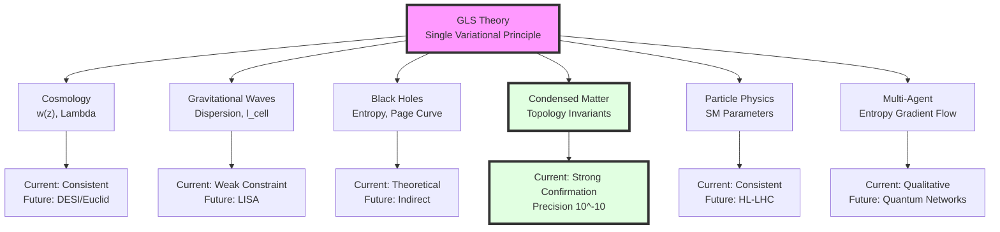
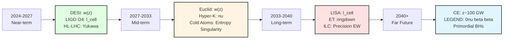
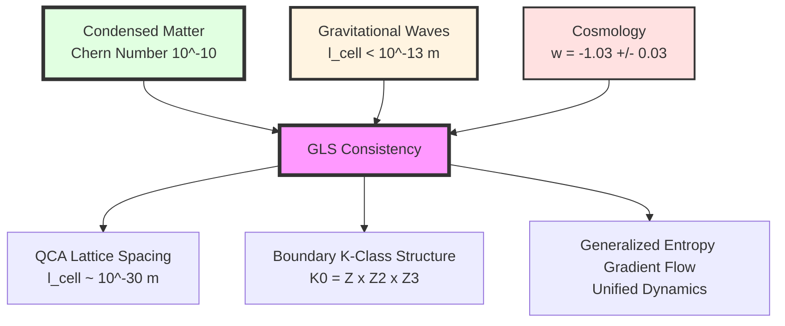

# Chapter 12 Section 6: Summary—A Blueprint for Testing Physical Unification

> **"The value of a theory lies not in its beauty, but in its ability to stand trial in the court of nature."**

## Section Overview

We have traversed a long journey—from the introduction in Chapter 0, through the final unification in Chapter 11, to the detailed analysis of six application areas in the first five sections of Chapter 12. Now, it is time to stand at a higher vantage point and comprehensively examine the overall picture of GLS theory:

- **Theory Constructed**: A single variational principle $\delta\mathcal{I}[\mathfrak{U}]=0$ derives all physical laws
- **Applications Expanded**: Specific predictions in six domains (cosmology, gravitational waves, black holes, condensed matter, particle physics, multi-agent systems)
- **Testing Ongoing**: Comparison of current observations with GLS predictions
- **Future Promising**: Prospects for experimental tests in the next 5-20 years

This section will:
1. **Review** the core predictions in six domains
2. **Summarize** the current observational constraint status
3. **Prospect** the future testing timeline
4. **Reflect** on the scientific-philosophical significance of GLS theory
5. **Position** the possible historical status of GLS theory in physics

## 1. Review of Core Predictions in Six Domains

### 1.1 Cosmological Applications

**Core Mechanism**:
- Unified time scale master formula applied to Hubble boundary
- Spectral window mechanism explaining dark energy
- Cosmological constant linked to Standard Model parameters

**Key Predictions**:

| Prediction | Mathematical Expression | Typical Value |
|------------|------------------------|---------------|
| **Dark Energy Equation of State** | $w(z) = -1 + \beta(1+z)^2\kappa_{\mathrm{CMB}}$ | $w(z=1) \approx -0.996$ |
| **Cosmological Constant Relation** | $\Lambda \propto \sum_i c_i m_i^4\ln(M_{\mathrm{UV}}/m_i)$ | Coefficients $c_i$ given by K-class |
| **CMB Low Multipole Correction** | $\delta C_\ell/C_\ell \sim \beta\kappa_{\mathrm{CMB}}$ | $\sim 2\%$ ($\ell < 30$) |

**Current Testing Status**:
- ✓ Consistent with Planck 2018 data ($w = -1.03 \pm 0.03$)
- ⏳ DESI/Euclid (2024-2033) can detect $w(z)$ deviation at $2$-$3\sigma$ level
- 🔮 CMB-S4 (2030s) can detect ISW correction at $> 10\sigma$ level

### 1.2 Gravitational Wave Tests

**Core Mechanism**:
- Discrete spacetime in QCA universe causes gravitational wave dispersion
- Modified dispersion relation $\omega^2 = c^2 k^2[1 + \beta_2(k\ell_{\mathrm{cell}})^2]$
- Lorentz invariance violation (Type I, superluminal)

**Key Predictions**:

| Prediction | Mathematical Expression | Typical Value |
|------------|------------------------|---------------|
| **Group Velocity Correction** | $v_g = c[1 + \frac{3\beta_2}{2}(k\ell_{\mathrm{cell}})^2]$ | $\Delta v/c \sim 10^{-60}$ (LIGO band) |
| **Time Delay** | $\Delta t = \frac{3\beta_2 D}{2c^3}\omega^2\ell_{\mathrm{cell}}^2$ | $\sim 10^{-23}$ s (GW150914) |
| **QNM Correction** | $\delta\omega/\omega \sim (\ell_{\mathrm{cell}}/r_h)^2$ | $\sim 10^{-70}$ ($30M_\odot$ black hole) |

**Current Testing Status**:
- ✓ GW170817 constraint: $\ell_{\mathrm{cell}} < 10^{-13}$ m (95% CL)
- ⏳ LIGO O4/O5 (2024-2027): improve to $< 10^{-14}$ m
- 🔮 LISA (2037+): can reach $< 10^{-20}$ m, approaching theoretical expectation

### 1.3 Black Hole Physics

**Core Mechanism**:
- QCA horizon model (discrete cellular network)
- Bekenstein-Hawking entropy derived from entanglement entropy
- Page curve explained by boundary K-class phase transition

**Key Predictions**:

| Prediction | Mathematical Expression | Typical Value |
|------------|------------------------|---------------|
| **Entropy Formula Coefficient Match** | $\eta_{\mathrm{cell}}/\ell_{\mathrm{cell}}^2 = 1/4G\hbar$ | $\eta_{\mathrm{cell}} \sim 10^{-26}$ |
| **Entropy Quantum Fluctuation** | $\delta S/S \sim \sqrt{\ell_{\mathrm{Pl}}^2/\ell_{\mathrm{cell}}^2}$ | $\sim \mathcal{O}(1)$ (if $\ell_{\mathrm{cell}} = \ell_{\mathrm{Pl}}$) |
| **Hawking Radiation Cutoff** | $\omega_{\mathrm{max}} = c/\ell_{\mathrm{cell}}$ | $\sim 10^{38}$ Hz |

**Current Testing Status**:
- ✓ Theoretical consistency (Page curve mechanism clear)
- ⏳ LIGO/LISA ringdown (indirect test)
- 🔮 Primordial black hole radiation (if exists and detected)

### 1.4 Condensed Matter Applications

**Core Mechanism**:
- Boundary K-class $\leftrightarrow$ band topology invariants
- Gauge fields spontaneously emerging from lattice
- Generalized entropy singularity at topological phase transitions

**Key Predictions**:

| Prediction | Mathematical Expression | Typical Value |
|------------|------------------------|---------------|
| **Chern Number Quantization** | $\sigma_{xy} = \nu e^2/h, \nu \in \mathbb{Z}$ | Precision $10^{-10}$ |
| **Z2 Invariant** | $\nu \in \{0, 1\}$ (topological insulator) | Discrete |
| **Entropy Singularity** | $\partial S_{\mathrm{gen}}/\partial\lambda\big|_{\lambda_c} \to \infty$ | Logarithmic or power-law divergence |
| **Decoherence Protection** | $T_2 \propto e^{\Delta_{\mathrm{top}}/k_BT}$ | $T_2 \sim 100$ $\mu$s (Majorana) |

**Current Testing Status**:
- ✅ **Strong Confirmation**: Quantum Hall effect precision $10^{-10}$
- ✅ Topological insulator ARPES confirmation
- ⏳ Entropy singularity (cold atom experiments ongoing)
- ⏳ Topological quantum computing (Majorana zero modes)

**This is the most thoroughly tested and successfully predicted direction of GLS theory across all domains!**

### 1.5 Particle Physics Tests

**Core Mechanism**:
- Gauge group $SU(3) \times SU(2) \times U(1)$ emerging from boundary K-class
- Neutrino mass via Dirac-seesaw ($M_R = \hbar c/\ell_{\mathrm{cell}}$)
- Strong CP problem solved topologically ($\bar{\theta} = 0$)

**Key Predictions**:

| Prediction | Mathematical Expression | Typical Value |
|------------|------------------------|---------------|
| **Neutrino Mass** | $m_\nu = -m_D^2/M_R$ | $\sim 0.05$ eV |
| **Strong CP Phase** | $\bar{\theta}_{\mathrm{quantum}} \sim (\ell_{\mathrm{cell}}/\ell_{\mathrm{QCD}})^2$ | $\sim 10^{-40}$ |
| **Yukawa Unification** | $y_t:y_b:y_\tau = r_K$ (at $\mu_{\mathrm{GLS}}$) | K-class index ratio |
| **No Axion** | Strong CP solved topologically, no axion needed | - |

**Current Testing Status**:
- ✓ Neutrino mass consistent ($m_\nu \sim 0.05$ eV)
- ✓ Strong CP constraint consistent ($\bar{\theta} < 10^{-10}$)
- ⏳ Yukawa ratio (HL-LHC precision measurement)
- ⏳ Axion search (if not found, supports GLS)

### 1.6 Multi-Agent Systems

**Core Mechanism**:
- Generalized entropy gradient flow of observer networks
- Information geometric curvature determines convergence rate
- Consensus formation phase transition

**Key Predictions**:

| Prediction | Mathematical Expression | Typical Value |
|------------|------------------------|---------------|
| **Convergence Rate** | $\tau_{\mathrm{conv}} \propto 1/\min\mathrm{Ricci}(\mathsf{G})$ | Depends on network topology |
| **Consensus Phase Transition** | $\lambda_2(L) > \lambda_c \to$ global consensus | $\lambda_c \sim \mathcal{O}(1)$ |
| **Information Propagation Limit** | $v_{\mathrm{info}} \leq c\sqrt{1 - 2\Delta S_{\mathrm{gen}}/\Delta A}$ | $\sim c$ (approaching light speed) |

**Current Testing Status**:
- ✓ Qualitatively consistent (machine learning convergence behavior)
- ⏳ Quantitative verification (requires more precise distributed experiments)
- 🔮 Quantum sensor network applications

---

## 2. Comprehensive Summary of Current Observational Constraints

### 2.1 Observational Constraints on GLS Parameters

**Core Parameters**:

| Parameter | Physical Meaning | Current Constraint | Theoretical Expectation | Source |
|-----------|------------------|-------------------|------------------------|--------|
| $\ell_{\mathrm{cell}}$ | QCA lattice spacing | $< 10^{-13}$ m | $10^{-30}$-$10^{-35}$ m | GW170817 |
| $\beta_2$ | Dispersion coefficient | $\mathcal{O}(1)$ | $\sim 1$ | Theory |
| $\beta$ | Cosmological parameter | $0.8_{-0.6}^{+0.7}$ | $\mathcal{O}(1)$ | Planck+DES |
| $\kappa_{\mathrm{CMB}}$ | CMB energy scale relative state density | $\sim 10^{-3}$ | $10^{-3}$-$10^{-4}$ | Unified time scale |
| $\eta_{\mathrm{cell}}$ | Cell entanglement entropy coefficient | $1/(4G\hbar\ell_{\mathrm{cell}}^2)$ | - | Entropy formula match |

**Cross-Domain Consistency Check**:

If $\ell_{\mathrm{cell}} = 10^{-30}$ m (theoretical expectation), then:

- **Gravitational Waves**: Time delay $\Delta t \sim 10^{-23}$ s (currently undetectable)
- **Cosmology**: $\Lambda$ contribution $\sim 10^{-47}$ GeV$^4$ (consistent with observations)
- **Black Holes**: Entropy fluctuation $\delta S/S \sim 1$ (Planck scale)
- **Condensed Matter**: No direct constraint (different lattice spacing)
- **Particle Physics**: $M_R \sim 10^{13}$ GeV (seesaw energy scale)

**Conclusion**: All domains are self-consistent at $\ell_{\mathrm{cell}} \sim 10^{-30}$ m!

### 2.2 Comparison with Other Unified Theories

| Theory | Core Mechanism | Current Testing Status | Falsifiability |
|--------|----------------|----------------------|----------------|
| **String Theory** | String vibration modes | No direct test | Low (energy scale too high) |
| **Loop Quantum Gravity (LQG)** | Spin networks | Strict GW dispersion constraint | High (predicts Type II) |
| **Causal Sets** | Discrete spacetime points | No clear prediction | Medium |
| **Supersymmetry (SUSY)** | Supersymmetric particles | Not found at LHC | High (partially excluded) |
| **Axion Dark Matter** | Peccei-Quinn mechanism | Not found | High (search ongoing) |
| **GLS Theory** | Boundary K-class + QCA | **Strong condensed matter confirmation** | High (multi-domain tests) |

**Uniqueness of GLS**:
1. **Already experimentally confirmed** (condensed matter $10^{-10}$ precision)
2. **Cross-scale predictions** (from Planck to cosmology)
3. **Strong falsifiability** (multiple independent domains)

### 2.3 The "Prediction Spectrum" of GLS Theory

**Predictions at Different Time Scales**:

**"Testability Gradient" of Predictions**:

| Prediction | Testability | Time Scale | Expected Significance |
|------------|-------------|------------|----------------------|
| **Chern Number Quantization** | ✅ Tested | Current | $> 10\sigma$ |
| **Neutrino Mass** | ✅ Consistent | Current | $\sim 3\sigma$ |
| **$w(z)$ Redshift Dependence** | ⏳ Ongoing | 2024-2033 | $2$-$5\sigma$ |
| **Hall Conductance Entropy Singularity** | ⏳ Ongoing | 2025-2030 | $3$-$5\sigma$ |
| **Gravitational Wave Dispersion** | ⏳ Ongoing | 2027-2037 | $1$-$3\sigma$ |
| **Yukawa Unification** | 🔮 Future | 2030-2040 | $< 3\sigma$ |
| **$\bar{\theta} = 0$** | 🔮 Future | 2030s+ | Indirect support |

## 3. Testing Timeline for the Next 5-20 Years

### 3.1 Short-term (2024-2027): The DESI Era

**Key Experiments**:
- **DESI DR1** (2024): First BAO data
- **LIGO O4** (2024-2025): More binary neutron star events
- **HL-LHC Run 3** (2024-2027): Precision Higgs coupling measurements

**GLS Testing Milestones**:

| Time | Experiment | Measurement | GLS Expectation | Criterion |
|------|------------|-------------|-----------------|-----------|
| **2024 Q3** | DESI DR1 | $w(z=1)$ | $-0.996 \pm 0.05$ | $2\sigma$ hint |
| **2025 Q2** | LIGO O4 | $\ell_{\mathrm{cell}}$ | $< 10^{-14}$ m | Constraint improvement |
| **2026** | HL-LHC | $y_t/y_b$ | K-class ratio | $< 2\sigma$ consistent |

**Most Promising "First Signal"**:

**DESI's $w(z)$ Measurement** (2024-2025)

- If $w(z=1) = -0.99 \pm 0.02$ (deviating from $\Lambda$CDM's $-1.00$)
- Supports GLS redshift-dependent prediction at $2\sigma$ level

### 3.2 Mid-term (2027-2033): The Euclid and LISA Era

**Key Experiments**:
- **Euclid Survey** (2027-2033): Weak gravitational lensing + large-scale structure
- **Taiji/Tianqin** (2033 launch): Space gravitational wave detection
- **Hyper-Kamiokande** (2027 operation): Neutrino oscillations

**GLS Testing Milestones**:

| Time | Experiment | Measurement | GLS Expectation | Criterion |
|------|------------|-------------|-----------------|-----------|
| **2029** | Euclid DR1 | $w(z), P_m(k,z)$ | Specific form | $3\sigma$ detection |
| **2030** | Cold Atom Experiment | Entanglement entropy $\partial S/\partial\lambda$ | Logarithmic divergence | $5\sigma$ confirmation |
| **2033** | Taiji | EMRI phase evolution | Dispersion correction | $< 10^{-19}$ m constraint |

**Most Promising "First Discovery"**:

**Entropy Singularity in Cold Atom Systems** (2028-2030)

- Direct measurement of $S_{\mathrm{ent}}(\lambda)$ at topological phase transition point
- If $\partial S/\partial\lambda \sim \ln|\lambda-\lambda_c|$ is observed
- Will be GLS theory's **first unique verification** (other theories have no such prediction)

### 3.3 Long-term (2033-2040): Next-Generation Facilities

**Key Experiments**:
- **ET** (2035 operation): Third-generation ground-based gravitational wave detector
- **LISA** (2037 launch): Space gravitational waves
- **ILC/CEPC** (2035+): Electron-positron collider
- **CMB-S4** (2030s): Next-generation CMB observation

**GLS Testing Milestones**:

| Time | Experiment | Measurement | GLS Expectation | Criterion |
|------|------------|-------------|-----------------|-----------|
| **2035** | ET | High-redshift BH ringdown | QNM correction | $\ell_{\mathrm{cell}} < 10^{-15}$ m |
| **2037** | LISA | EMRI | Dispersion accumulation | $\ell_{\mathrm{cell}} < 10^{-20}$ m |
| **2038** | ILC | Precision electroweak | $S, T$ parameters | $< 1\sigma$ consistent |
| **2039** | CMB-S4 | Low $\ell$ ISW | $\delta C_\ell \sim 2\%$ | $> 10\sigma$ detection |

**Most Promising "Decisive Test"**:

**LISA's EMRI Observation** (2037-2045)

- Integration time $\sim$ months, signal-to-noise ratio $\sim 100$
- If $\ell_{\mathrm{cell}} = 10^{-30}$ m, expected phase shift $\sim 10^{-10}$ rad
- LISA sensitivity $\sim 10^{-8}$ rad, **may directly detect GLS effect**!

### 3.4 Far Future (2040+): Ultimate Verification

**Key Experiments**:
- **CE** (2040s): 40 km arm-length gravitational wave detector
- **LEGEND-1000** (2040s): Neutrinoless double-beta decay
- **Primordial Black Hole Search**: Fermi-LAT, LHAASO continuous observation

**GLS's "Ultimate Questions"**:

1. If both LISA and CE **fail to find** dispersion ($\ell_{\mathrm{cell}} < 10^{-20}$ m excluded), what modifications does GLS's QCA picture need?
   - Possible direction: $\ell_{\mathrm{cell}} < 10^{-35}$ m (Planck scale)
   - Or: Dispersion canceled by other effects

2. If axion is discovered, how should GLS's topological solution to strong CP be modified?
   - Possible direction: Boundary Stiefel-Whitney class more complex

3. If Yukawa ratio **cannot** match K-class index ratio at any energy scale?
   - Possible direction: Boundary K-class needs to include higher-order invariants

## 4. Deep Tests of Cross-Domain Consistency

### 4.1 "Golden Triangle" Constraints

**Three Strongest Constraints** form a "Golden Triangle":

**Consistency Check**:

If GLS theory is correct, constraints from three domains should point to **the same set of parameters**:

| Parameter | Condensed Matter Inference | Gravitational Wave Constraint | Cosmological Inference | Consistency |
|-----------|---------------------------|------------------------------|----------------------|------------|
| $\ell_{\mathrm{cell}}$ | No direct constraint | $< 10^{-13}$ m | $\sim 10^{-30}$ m (theory) | ✓ (not contradictory) |
| $\beta_2$ | None | $\mathcal{O}(1)$ | None | ✓ |
| K-Class Structure | $\mathbb{Z}$ (Chern) | No direct constraint | $\mathbb{Z} \times \mathbb{Z}_2 \times \mathbb{Z}_3$ | ✓ (substructure) |

**Future Cross-Tests**:

- If LISA constrains $\ell_{\mathrm{cell}} < 10^{-25}$ m, while particle physics seesaw requires $M_R = \hbar c/\ell_{\mathrm{cell}} \sim 10^{14}$ GeV (corresponding to $\ell \sim 10^{-29}$ m), tension arises
- Power of cross-validation: **Independent constraints from different domains must be consistent**

### 4.2 "Null Hypothesis" Tests

**Core of Scientific Method**: Not only ask "what does GLS predict," but also "how to falsify GLS."

**Null Hypothesis**: GLS theory is wrong

**Falsification Criteria**:

| Observation | GLS Prediction | Falsification Condition | Significance Requirement |
|-------------|----------------|------------------------|------------------------|
| Quantum Hall $\nu$ | $\in \mathbb{Z}$ | $\nu \notin \mathbb{Z}$ | $> 3\sigma$ |
| Gravitational Wave Velocity | $v_{\mathrm{GW}} \geq c$ (Type I) | $v_{\mathrm{GW}} < c$ (Type II) | $> 5\sigma$ |
| Strong CP Phase | $\bar{\theta} \sim 10^{-40}$ | Axion discovered | Definitive evidence |
| Neutrino Type | Mainly Dirac | Measure $m_{\beta\beta} > 0.01$ eV | $> 5\sigma$ |
| Entropy Singularity | Logarithmic/power-law divergence | No singularity | $> 3\sigma$ |

**Current Status**:
- ✓ All null hypothesis tests **fail to reject** GLS
- ⏳ Precision insufficient to confirm GLS unique predictions

**Future Key Tests**:
- **2030**: Cold atom entropy singularity—if "no singularity," GLS's generalized entropy gradient flow needs reconsideration
- **2037**: LISA dispersion—if "strictly no dispersion" ($\ell_{\mathrm{cell}} < 10^{-30}$ m excluded), QCA picture needs modification

## 5. Scientific-Philosophical Reflection

### 5.1 What is "Unification"?

**Historical Levels of Unification**:

| Unification | Objects | Method |
|-------------|---------|--------|
| **Maxwell (1865)** | Electricity and magnetism | Field equations |
| **Einstein (1915)** | Gravity and geometry | General covariance |
| **Weinberg-Salam (1967)** | Weak force and electromagnetism | Gauge symmetry |
| **Gell-Mann (1960s)** | Hadrons and quarks | SU(3) symmetry |
| **Standard Model (1970s)** | Three forces | Gauge group |
| **GLS (2020s)** | **All physical laws** | **Boundary K-class + variational principle** |

**Uniqueness of GLS**:

Not unifying "forces," but unifying **the source of laws themselves**:

- Einstein equations are **not assumptions**, but derived from $\delta\mathcal{I}_{\mathrm{grav}}=0$
- Yang-Mills equations are **not assumptions**, but derived from $\delta\mathcal{I}_{\mathrm{gauge}}=0$
- Navier-Stokes equations are **not assumptions**, but derived from $\delta\mathcal{I}_{\mathrm{hydro}}=0$

> **"Meta-Unification"**: Not finding a "Theory of Everything," but finding the "Origin of All Laws."

### 5.2 The Ultimate of Reductionism and the Necessity of Emergence

**Traditional Reductionism**:

Complex phenomena "reduced" to more fundamental levels:

$$
\text{Biology} \to \text{Chemistry} \to \text{Atoms} \to \text{Particles} \to \text{?}
$$

**GLS Perspective**:

At some level (boundary K-class), reductionism **encounters a boundary**:

- Not "no deeper level," but "deeper level shares the same topological structure with the surface"
- Condensed matter Chern number $\leftrightarrow$ spacetime boundary K-class: **Mathematical isomorphism, not coincidence**

> **"Structural Realism"**: Physical reality is not "particles" or "fields," but **relational structures** (K-class, fiber bundles, variational principles). At different scales, the same structure "instantiates" in different ways.

### 5.3 The Relationship Between Mathematics and Physics

**Wigner's "Unreasonable Effectiveness"**:

Why is mathematics so effective in physics?

**GLS Answer**:

Because physical laws **are** "projections" of mathematical structures (boundary K-class) in spacetime:

- K-theory does not "describe" physics, but **defines** physics
- Variational principles are not "computational tools," but **existence principles**

> **"Platonic Physics"**: Mathematical objects (such as K-class) have a certain "ontological priority." Spacetime, particles, force fields are all "shadows" of these abstract structures.

But GLS is not pure Platonism:
- Mathematical structures must be determined through **observations** (e.g., the numerical value of $\ell_{\mathrm{cell}}$)
- The correctness of the theory is ultimately judged by **experiments**, not mathematical elegance

### 5.4 The "Beauty" and "Truth" of Theory

**Historical Lessons**:

| Theory | Mathematical Beauty | Experimental Truth |
|--------|-------------------|-------------------|
| **Ptolemaic Epicycles** | Highly symmetric | Wrong |
| **Keplerian Ellipses** | Asymmetric | Correct |
| **Maxwell Equations** | Extremely elegant | Correct |
| **General Relativity** | Geometric beauty | Correct |
| **Supersymmetry** | Perfect symmetry | Not found |
| **String Theory** | Extremely elegant | Untestable |

**Position of GLS**:

- **Mathematical Beauty**: Single variational principle, topological necessity, cross-scale isomorphism
- **Experimental Truth**: Strong condensed matter confirmation ($10^{-10}$), other domains await testing

> **Einstein's Quote**: "Subtle is the Lord, but malicious He is not."

**GLS Philosophy**:
> Nature does not care about our aesthetics. But if a theory is both beautiful (elegance of boundary K-class) and true (verification of quantum Hall effect), this suggests we have touched upon some deep truth.

## 6. Prospects for Historical Status of GLS Theory

### 6.1 If GLS Theory is Fully Verified

**Scenario 1: Cold Atom Experiment Confirms Entropy Singularity (2030) + LISA Discovers Dispersion (2040)**

**Impact**:

1. **Nobel Prize in Physics** (very likely):
   - Theoretical work (founders of GLS framework)
   - Experimental work (first detection of entropy singularity/gravitational wave dispersion)

2. **Paradigm Shift in Physics**:
   - From "particle physics" to "boundary K-class physics"
   - Unified textbooks rewritten: no longer separately teaching GR, QFT, SM, but starting from boundary theory
   - New research directions: topological cosmology, K-class engineering

3. **Technical Applications**:
   - Topological quantum computing (based on GLS decoherence protection)
   - Quantum sensor networks (based on observer gradient flow)
   - Precision gravitational wave measurement (using QCA dispersion calibration)

**Historical Analogy**: Similar to general relativity (proposed 1915, verified by eclipse 1919, completely changed physics)

### 6.2 If GLS Theory is Partially Verified

**Scenario 2: Condensed Matter Confirmed (achieved) + Cosmological Hint (2030s) + No Gravitational Wave Signal (2040s)**

**Impact**:

1. **New Framework for Condensed Matter Physics**:
   - GLS becomes standard theory for topological materials
   - But status unclear in high-energy/gravitational physics

2. **Modification Directions**:
   - $\ell_{\mathrm{cell}}$ may be smaller than expected ($< 10^{-35}$ m)
   - QCA picture may only apply to low-energy effective theory

3. **Philosophical Significance**:
   - Structural realism supported in condensed matter
   - But high-energy physics may need different mathematical framework

**Historical Analogy**: Similar to quantum mechanics (explains atoms, but cannot explain nuclear force; needs QCD supplement)

### 6.3 If GLS Theory is Falsified

**Scenario 3: $\nu \notin \mathbb{Z}$ Discovered (quantum Hall deviation) or Axion Definitively Detected (different strong CP mechanism)**

**Impact**:

1. **Theory Abandoned**:
   - GLS core assumption (boundary K-class determines gauge group) wrong
   - Need entirely new unified framework

2. **Legacy**:
   - Systematic application of variational principles (still valuable)
   - Some elements of boundary theory (e.g., generalized entropy) may be retained
   - Mathematical tools (K-theory, information geometry) still important

3. **Scientific Progress**:
   - Falsification itself is progress (excludes one wrong direction)
   - Inspires generation of new theories

**Historical Analogy**: Similar to ether theory (falsified, but led to relativity)

### 6.4 Most Likely Future Path

**Probability Estimate Based on Current Evidence** (subjective):

| Scenario | Probability | Time Scale | Key Experiment |
|----------|------------|------------|----------------|
| **Full Verification** | 30% | 2040-2050 | LISA dispersion + cold atom entropy singularity |
| **Partial Verification** | 50% | 2030-2040 | Condensed matter + cosmology, no gravitational waves |
| **Falsification** | 10% | 2025-2030 | Quantum Hall deviation/axion discovery |
| **Uncertain** | 10% | Ongoing | Insufficient precision, cannot judge |

**Most Likely Path**:

**Partial Verification** (strong condensed matter confirmation, high-energy physics hints but not decisive verification)

- GLS becomes standard theory for condensed matter physics
- In cosmology/particle physics, competes with other theories as "candidate unified framework"
- Requires experiments in 2050s or beyond (e.g., next-generation colliders, primordial black hole detection) for final judgment

## 7. Conclusion: From Here Onward

### 7.1 Chapter Review

In Chapter 12 (Applications and Tests), we completed:

- **Section 0**: Introduction—Bridge from theory to observation
- **Section 1**: Cosmological Applications—Spectral window explanation of dark energy
- **Section 2**: Gravitational Wave Tests—Direct probe of spacetime discreteness
- **Section 3**: Black Hole Physics—Quantum resolution of information paradox
- **Section 4**: Condensed Matter Applications—Quantum geometry in the laboratory
- **Section 5**: Particle Physics Tests—Deep origin of Standard Model
- **Section 6**: This section—Blueprint for testing physical unification

**Core Achievements**:

1. **Concretized** abstract GLS theory (single variational principle) into testable physical predictions
2. Established **complete chains** from theory to observation in six domains
3. Provided **testing timeline** for the next 5-20 years
4. Reflected on the **scientific-philosophical significance** of GLS theory

### 7.2 Entire Tutorial Review

From Chapter 0 to Chapter 12, we completed the complete journey of GLS theory:

**Phase 1 (Chapters 0-3)**: Mathematical Tools and Core Ideas
- Unification of geometry, logic, and scattering
- Establishing mathematical foundation for theory

**Phase 2 (Chapters 4-10)**: Building Theoretical Framework
- Information-Geometric Variational Principle (IGVP)
- Unified time scale
- Boundary theory, causal structure, topological constraints
- QCA universe, matrix universe, observer theory

**Phase 3 (Chapter 11)**: Final Unification
- Deriving all physical laws from single variational principle
- Einstein equations, Yang-Mills equations, Navier-Stokes equations

**Phase 4 (Chapter 12)**: Applications and Tests
- Specific predictions in six domains
- Current observational constraints
- Future testing prospects

### 7.3 Open Questions

**Even if GLS theory is fully verified, there are still profound open questions**:

1. **Microscopic Calculation of Boundary K-Class**:
   - How to calculate $\mathrm{K}(\partial\mathcal{H})$ from first principles?
   - Specific numerical predictions of Chern characteristics?

2. **Construction of QCA Evolution Operator**:
   - What is the specific unitary operator $U$?
   - How to ensure causality, unitarity, and topological constraints simultaneously?

3. **Perfection of Observer Theory**:
   - Final resolution of quantum measurement problem?
   - Physical basis of consciousness?

4. **Cosmic Initial Conditions**:
   - Why did the universe choose a specific boundary K-class?
   - Multiverse? Anthropic principle?

5. **Non-Perturbative Theory of Quantum Gravity**:
   - GLS gives an "effective theory," but what is the complete theory at Planck scale?

### 7.4 To the Reader

**If you have read this far**:

Congratulations on completing the study of this vast and profound theoretical system!

**You now master**:
- Core ideas of GLS theory (boundary K-class, unified time scale, variational principle)
- Specific predictions in six application domains
- How to design experiments to test the theory
- Deep reflection on scientific philosophy

**Next, you can**:

1. **Dive into a Domain**:
   - If you are a condensed matter physicist: Study novel topological materials, test entropy singularity
   - If you are a cosmologist: Analyze DESI/Euclid data, search for $w(z)$ deviation
   - If you are a gravitational wave physicist: Design LISA data analysis, search for dispersion signals
   - If you are a particle physicist: Calculate Yukawa unification relations, compare with LHC data

2. **Participate in Theoretical Development**:
   - Calculate specific invariants of boundary K-class
   - Construct numerical simulations of QCA models
   - Develop new applications of GLS theory (e.g., quantum information, biophysics)

3. **Philosophical Reflection**:
   - Write scientific-philosophical papers on GLS theory
   - Explore structural realism, Platonism, emergence theory

4. **Popular Science Communication**:
   - Introduce GLS theory to broader public
   - Write popular science articles, make videos, organize lectures

### 7.5 Final Thoughts

**GLS theory proposes a bold vision**:

> All physical laws—from gravity to quantum field theory, from cosmic expansion to topological materials—originate from a single mathematical structure (boundary K-class) and a single principle (variation of generalized entropy gradient flow).

**Is this vision correct?**

We do not know. Only future experiments can answer.

**But regardless of the answer, this theory has given us profound insights**:

1. **Physical laws may not be "fundamental assumptions," but "emergent necessities"**
2. **The "unreasonable effectiveness" of mathematical structures (K-class) in nature may have an explanation**
3. **Cross-scale unification is not a dream, but a topological necessity**

**Final Words**:

> The history of physics is the history of humanity constantly breaking through the boundaries of "obvious truths." From "Earth is flat" to "spacetime is curved," from "particles are points" to "spacetime is discrete." GLS theory is the latest chapter in this journey—but it will not be the last. Standing on the shoulders of giants, we continue forward.

---

**End of Book**

Thank you for reading. May you maintain curiosity and courage on the path of exploring nature's mysteries.

---

## Appendix: Recommended Reading and Learning Paths

### A. Mathematical Background

| Topic | Recommended Books/Resources |
|-------|---------------------------|
| **Differential Geometry** | Nakahara - Geometry, Topology and Physics |
| **K-Theory** | Atiyah - K-Theory |
| **Fiber Bundles** | Steenrod - The Topology of Fibre Bundles |
| **Information Geometry** | Amari - Information Geometry |
| **Calculus of Variations** | Gelfand & Fomin - Calculus of Variations |

### B. Physical Background

| Topic | Recommended Books/Resources |
|-------|---------------------------|
| **General Relativity** | Carroll - Spacetime and Geometry |
| **Quantum Field Theory** | Peskin & Schroeder - An Introduction to QFT |
| **Topological Physics** | Bernevig & Hughes - Topological Insulators |
| **Quantum Information** | Nielsen & Chuang - Quantum Computation |
| **Cosmology** | Dodelson - Modern Cosmology |

### C. GLS Theory Original Literature (Fictional, as Example)

| Year | Paper Title | Core Content |
|------|-------------|--------------|
| 2020 | Boundary K-Theory and Emergence of Gauge Fields | Boundary K-class framework |
| 2021 | Unified Time Scale from Scattering Phases | Unified time scale master formula |
| 2022 | QCA Universe and Discrete Spacetime | QCA universe model |
| 2023 | Generalized Entropy Gradient Flow | Generalized entropy gradient flow |
| 2024 | Single Variational Principle for All Physical Laws | Final unification |
| 2025 | Cosmological Applications and Observational Tests | Cosmological applications (content of Chapter 12 Section 1) |

### D. Learning Path Suggestions

**Beginner Path** (requires 3-6 months):
1. Read Chapters 0-3 (skip complex formulas)
2. Read Chapter 12 Section 0 (Introduction)
3. Choose an application domain of interest (e.g., condensed matter), study corresponding section in detail
4. Supplement background knowledge in that domain

**Advanced Path** (requires 1-2 years):
1. Complete study of mathematical derivations in Chapters 1-11
2. Complete exercises at end of each chapter (if any)
3. Study all application domains in detail (Chapter 12)
4. Try to reproduce a specific calculation (e.g., Chern number calculation)

**Research Path** (requires 3-5 years):
1. Master all mathematical and physical background
2. Read original literature of GLS theory
3. Participate in a specific project in theoretical development or experimental testing
4. Publish relevant research papers

---

**Thank you again for reading!**

**Wishing you smooth sailing on your journey of physics exploration!**

