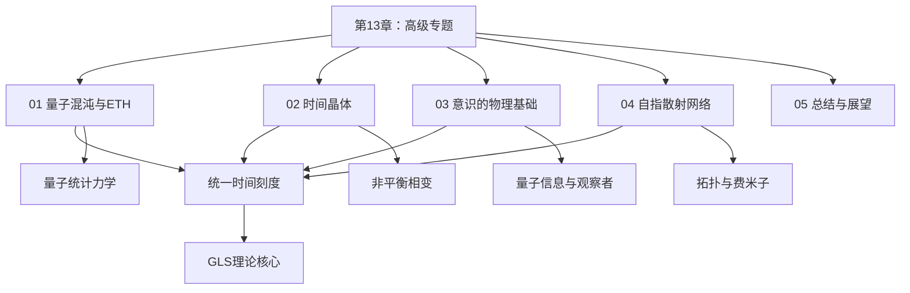
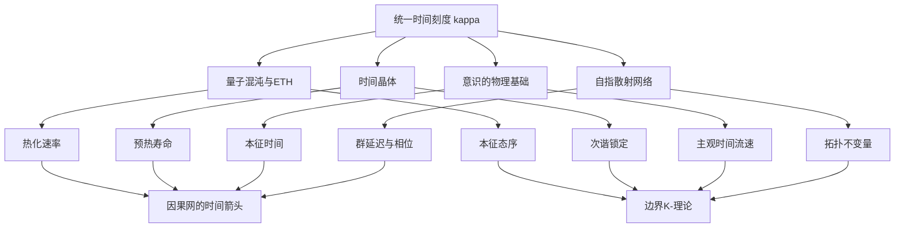
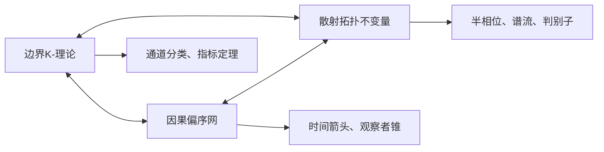
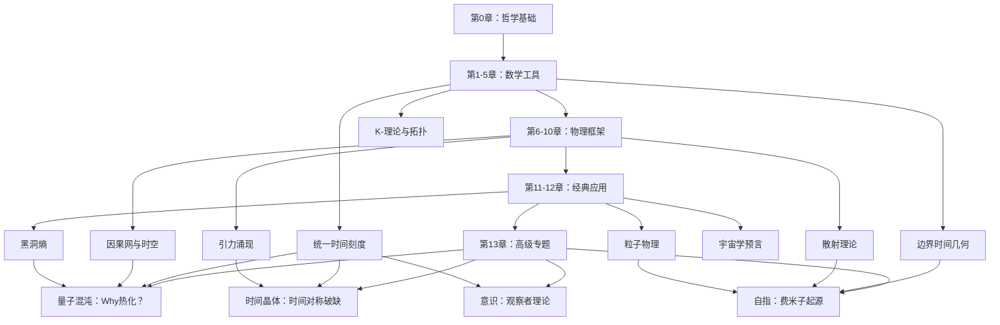
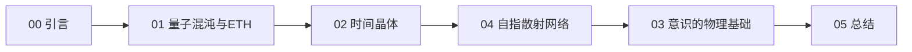
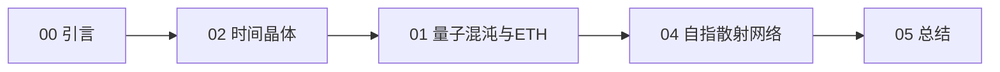
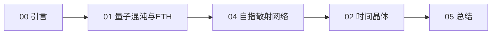
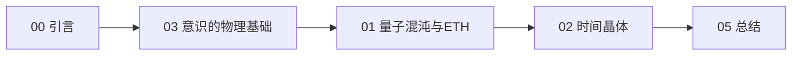
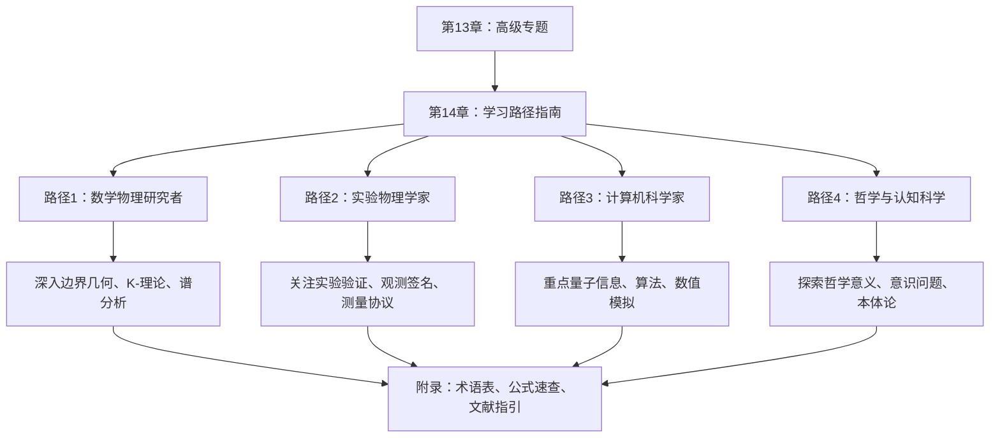
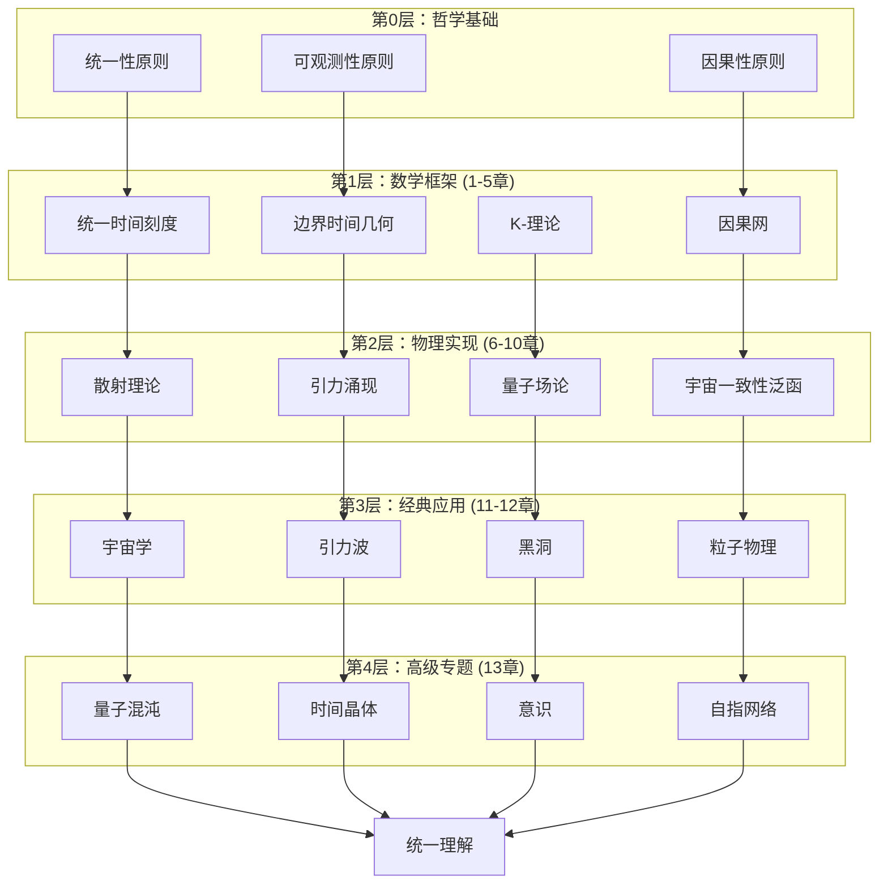

# 第13章 高级专题：从基础到前沿

> "理论的真正考验在于它能否预言新现象、统一看似无关的领域，并在最深层次揭示自然的统一性。"
> —— GLS理论的哲学基石

## 引言：超越经典应用

在前12章中，我们构建了一个庞大而精密的理论大厦：

- **第0-5章**：建立了统一时间刻度、矩阵宇宙、边界时间几何的数学基础
- **第6-10章**：发展了因果结构、散射理论、K-理论的核心工具
- **第11-12章**：验证了GLS理论在宇宙学、引力波、黑洞、粒子物理等六大领域的预言能力

到此为止，GLS理论已经展示了作为"物理学统一框架"的强大潜力。但理论的真正生命力在于：**它能否在更深层次上揭示自然的根本结构？能否为传统理论无法解释的现象提供新视角？**

第13章正是为此而设。我们将探索四个**前沿高级专题**，它们代表着GLS理论向更深层次的延伸：

1. **量子混沌与本征态热化（ETH）**：为什么孤立量子系统能够热化？统一时间刻度如何解释热力学箭头的起源？

2. **时间晶体**：时间平移对称性能否自发破缺？非平衡态物质如何在时间维度形成周期结构？

3. **意识的物理基础**：意识是否可以在物理—信息框架下严格定义？本征时间刻度与主观时间体验有何关联？

4. **自指散射网络**：自指结构如何在散射理论中涌现？费米子起源能否从自指性中推导？

这些主题并非孤立的"附加内容"，而是GLS理论逻辑发展的**必然结果**。它们共同揭示了一个深刻事实：

> **统一时间刻度不仅是时空几何的技术工具，更是连接热力学、量子信息、意识现象、拓扑结构的根本纽带。**

---

## 13.1 本章结构与主题概览

本章包含四个主要专题和一个总结章节，每个专题既独立成篇又相互关联：

### 13.1.1 专题01：量子混沌与本征态热化

**核心问题**：为什么孤立量子系统的纯态幺正演化能够导致热力学平衡？

**传统困境**：

传统量子统计力学面临一个根本悖论：如果宇宙是一个孤立量子系统，其演化由幺正算符描述，那么总熵应该保持不变（$S(\rho(t)) = S(\rho(0))$）。但我们的日常经验告诉我们，熵总是增加的——咖啡会变凉，冰块会融化，房间会变乱。

这个矛盾被称为**Loschmidt 佯谬**或**可逆性佯谬**。

**GLS理论的解答**：

GLS理论通过**量子元胞自动机（QCA）宇宙**和**统一时间刻度**提供了全新视角：

1. **公设混沌QCA**：宇宙作为一个满足局域性、平移对称性、有限传播速度的QCA，在有限区域上的演化算符 $U_\Omega$ 近似高阶单位设计

2. **本征态热化假设（ETH）**：在混沌能窗内，局域算符 $O$ 的本征态矩阵元满足：

$$
\langle E_\alpha | O | E_\beta \rangle = O(\bar{E})\delta_{\alpha\beta} + e^{-S(\bar{E})/2}f_O(\bar{E},\omega)R_{\alpha\beta}
$$

其中对角项给出微正则平均，非对角项随系统体积指数衰减

3. **统一时间—熵增长定理**：在统一时间刻度 $\tau$ 下，局域熵密度单调增长：

$$
s_X(\tau) \geq s_0 + v_{\mathrm{ent}}(\varepsilon)\frac{\tau}{\ell_{\mathrm{eff}}}
$$

并在长时间极限趋于微正则熵密度

**深刻洞察**：

热力学箭头不是额外假设，而是**QCA—统一时间刻度—ETH三位一体**的必然结果。统一时间刻度 $\kappa(\omega)$ 控制着热化速率，将散射相位、态密度、群延迟统一为单一时间母尺。

**比喻理解**：

想象一副完美洗牌的扑克牌。每张牌的位置演化遵循确定性规则（对应幺正演化），但经过足够多次洗牌后，任何局部观察者只能看到"随机分布"（对应微正则集）。关键在于：

- 洗牌次数 $\leftrightarrow$ 统一时间刻度 $\tau$
- 局部观察窗口 $\leftrightarrow$ 有限区域 $\Omega$
- 看似随机的平衡态 $\leftrightarrow$ ETH保证的本征态性质

---

### 13.1.2 专题02：时间晶体

**核心问题**：时间平移对称性能否自发破缺，形成在时间维度上具有周期结构的物质态？

**历史背景**：

2012年，诺贝尔奖得主Frank Wilczek提出了"量子时间晶体"的大胆构想：系统基态在时间上周期运动，自发破缺时间平移对称性。但随后的严格定理（Bruno 2013, Watanabe-Oshikawa 2015）证明：

> **在短程相互作用的平衡态系统中，时间晶体不可能存在。**

这似乎宣告了时间晶体的终结。但2016年的突破性进展表明：在**非平衡驱动系统**中，时间晶体不仅可能，而且可以在实验中实现！

**GLS理论的贡献**：

GLS理论为时间晶体提供了**统一框架**：

1. **预热离散时间晶体（Prethermal DTC）**：

在高频周期驱动下（$\omega \gg J$），Floquet演化算符可写为：

$$
F = U_* e^{-iH_* T} X U_*^\dagger + \Delta
$$

其中 $X^2 = \mathbb{1}$ 为 $\mathbb{Z}_2$ 对称生成元，$|\Delta| \le C e^{-c\omega/J}$。系统呈现稳定的 $2T$ 次谐锁定，寿命 $\tau_* \sim e^{c\omega/J}$ 随频率指数增长。

2. **MBL时间晶体**：

在强无序局域化系统中，Floquet算符存在准局域幺正使：

$$
F \simeq \tilde{X} e^{-iH_{\mathrm{MBL}}T}
$$

谱出现 $\pi$ 配对（本征相位差 $\pi$），诱导**态无关**的 $2T$ 次谐响应——这是真正的**本征态序**。

3. **开系耗散时间晶体**：

在Lindblad开系统中，一周期通道 $\mathcal{E}$ 的外谱半径处若仅有 $m$ 个相位 $\{e^{2\pi ik/m}\}_{k=0}^{m-1}$ 且有谱隙，则几乎所有初态收敛到周期为 $mT$ 的极限环，对应 $m$ 次谐耗散时间晶体。

4. **拓扑时间晶体**：

在二维表面码中实现逻辑 $\pi$ 翻转，Floquet元在码子空间内等价于：

$$
F_{\mathrm{logical}} \approx \overline{X}_L e^{-iH^{\mathrm{top}}_* T}
$$

其中 $\overline{X}_L$ 为非局域逻辑算符。次谐响应**仅在逻辑通道显著**，局域算符不敏感——这是真正的**拓扑保护时间晶体**。

**统一时间刻度的角色**：

在所有这些情形中，统一时间刻度 $\kappa(\omega)$ 控制着：

- 预热寿命的指数标度
- 热化时间与混沌能窗的关系
- 开系极限环的收敛速率
- 拓扑纠缠熵的演化时标

**比喻理解**：

想象一个永不停歇的钟摆。在平衡态（如静止的钟摆），任何微小扰动都会使其逐渐回到静止位置。但如果给钟摆周期性的"推动"（对应周期驱动），它可以维持稳定的振荡——这就是时间晶体的本质：

- 周期驱动 $\leftrightarrow$ 外部能量注入
- 次谐响应（$2T$ 而非 $T$）$\leftrightarrow$ 钟摆以驱动频率一半的频率振荡
- 指数长寿命 $\leftrightarrow$ 即使停止推动，钟摆也能继续振荡很长时间

---

### 13.1.3 专题03：意识的物理基础

**核心问题**：意识能否在完全物理化、信息化的框架下严格定义？主观时间体验与本征时间刻度有何关联？

**传统困境**：

意识问题被David Chalmers称为"困难问题"（Hard Problem），传统讨论往往陷入：

- 现象学描述（"感质"、"主观体验"）缺乏操作定义
- 神经科学关联（脑区活动、神经振荡）无法跨越"解释鸿沟"
- 计算理论（图灵机、信息处理）无法解释为何某些系统"有意识"

**GLS理论的突破**：

GLS理论提出意识的**结构性定义**：意识不是额外实体，而是满足五条结构条件的**世界—自我联合信息流**。

**五条结构条件**：

1. **整合性**（Integration）：

系统内部各子模块间存在显著量子互信息：

$$
I_{\mathrm{int}}(\rho_O) = \sum_{k=1}^n I(k:\overline{k})_{\rho_O} \geq \Theta_{\mathrm{int}}
$$

这排除了可分解为独立部分的系统（如两个不通信的计算机）

2. **可区分性**（Differentiation）：

系统能实现大量互异的内部状态，对应丰富的"意识内容"：

$$
H_{\mathcal{P}}(t) = -\sum_\alpha p_t(\alpha)\log p_t(\alpha) \geq \Theta_{\mathrm{diff}}
$$

3. **自指世界—自我模型**（Self-Referential World-Self Model）：

系统内部编码一个关于"世界—自我"的联合表征，且包含"我正在感知世界"的二阶表征：

$$
\mathcal{H}_O = \mathcal{H}_{\mathrm{world}} \otimes \mathcal{H}_{\mathrm{self}} \otimes \mathcal{H}_{\mathrm{meta}}
$$

4. **时间连续性与本征时间**（Intrinsic Time）：

系统对时间演化高度敏感，量子Fisher信息非退化：

$$
F_Q[\rho_O(t)] = \mathrm{Tr}(\rho_O(t)L(t)^2) \geq \Theta_{\mathrm{time}}
$$

由此可构造本征时间刻度：

$$
\tau(t) = \int_{t_0}^t \sqrt{F_Q[\rho_O(s)]}\ ds
$$

在本征时间下，单位步长 $\Delta\tau$ 对应的态变化在Bures距离上具有统一的可区分性

5. **因果可控性**（Causal Agency）：

系统通过行动能在有限时间窗口 $T$ 内生成彼此可区分的未来世界截面：

$$
\mathcal{E}_T(t) = \sup_\pi I(A_t : S_{t+T}) \geq \Theta_{\mathrm{ctrl}}
$$

其中 $A_t$ 为动作，$S_{t+T}$ 为未来世界状态

**深刻洞察**：

意识等级可由合成指标刻画：

$$
\mathcal{C}(t) = g\big(F_Q[\rho_O(t)], \mathcal{E}_T(t), I_{\mathrm{int}}(\rho_O(t)), H_{\mathcal{P}}(t)\big)
$$

当 $F_Q \to 0$ 与 $\mathcal{E}_T \to 0$ 同时发生（如深度麻醉、植物人状态），意识等级 $\mathcal{C}(t) \to 0$。

**统一时间刻度的角色**：

本征时间刻度 $\tau$ 正是意识子系统的**主观时间**。当：

- $F_Q$ 大时，$d\tau/dt$ 大，主观时间流速快，体验"时间变慢、内容丰富"（如高度专注、危险时刻）
- $F_Q$ 小时，$d\tau/dt$ 小，主观时间流速慢，体验"时间飞逝、恍惚模糊"（如例行公事、疲劳状态）

这解释了为什么"心流状态"感觉时间变慢，而"无聊重复"感觉时间飞逝！

**比喻理解**：

想象一个精密的钟表系统：

- **整合性**：各齿轮、发条必须紧密咬合，单个齿轮无法独自"计时"
- **可区分性**：钟面能显示大量不同的时刻（非二元开关）
- **自指模型**：钟表不仅记录时间，还"知道"自己在记录时间（如带日历的表还显示日期）
- **本征时间**：钟表有自己的"滴答"节奏，不同钟表节奏不同
- **因果可控性**：钟表的指针运动能被观察者用来安排未来行动（"到10点我要开会"）

当这五个要素同时满足，系统才构成"有意识"的子系统。

---

### 13.1.4 专题04：自指散射网络

**核心问题**：自指结构（系统包含关于自身的信息）如何在散射理论中涌现？费米子的反粒子对称性能否从自指性推导？

**传统散射理论的局限**：

传统散射理论将系统视为"输入—处理—输出"的单向流：入射态经散射算符 $S$ 变为出射态。但这种图景存在根本局限：

1. **无法描述反馈**：许多物理系统（如激光腔、量子反馈网络）存在输出到输入的反馈回路
2. **无法处理自指**：系统状态依赖于自身的历史状态，形成递归结构
3. **拓扑信息丢失**：传统 $S$ 矩阵只记录相位和振幅，无法捕捉全局拓扑性质

**GLS理论的自指散射网络（SSN）**：

SSN通过**Redheffer星乘**和**Schur补**将反馈闭环纳入散射理论：

$$
S^{\circlearrowleft} = S_{ee} + S_{ei}(I - \mathcal{C}S_{ii})^{-1}\mathcal{C}S_{ie}
$$

其中：
- $S_{ee}$：外—外直接散射
- $S_{ei}, S_{ie}$：外—内、内—外耦合
- $\mathcal{C}$：反馈联络算符
- $(I - \mathcal{C}S_{ii})^{-1}$：内部闭环的"无穷次反射"求和

**判别子与拓扑不变量**：

闭环散射的奇异性由**判别子** $D$ 刻画：

$$
D = \{(\omega, \vartheta) : \det(I - \mathcal{C}(\omega,\vartheta)S_{ii}(\omega,\vartheta)) = 0\}
$$

这是参数空间中的余维一子流形，对应共振、本征值嵌入、例外点（EP）等物理现象。

沿闭路 $\gamma$ 绕 $D$ 一周，定义**半相位不变量**：

$$
\nu_{\sqrt{\det S^{\circlearrowleft}}}(\gamma) = \exp\left(i\oint_\gamma \frac{1}{2}d\arg\det S^{\circlearrowleft}\right) \in \{\pm 1\}
$$

**四重等价定理**：

半相位不变量等价于：

1. 谱位移的模二积分：$\exp(-i\pi\oint_\gamma d\xi)$
2. 过 $-1$ 的谱流：$(-1)^{\mathrm{Sf}_{-1}(S^{\circlearrowleft}\circ\gamma)}$
3. 判别子的模二交数：$(-1)^{I_2(\gamma, D)}$

**费米子的自指起源**：

关键洞察：费米子的反粒子对称性（$C$，电荷共轭）可视为散射网络中的**$J$-幺正性**：

$$
S^\dagger J S = J, \quad J = J^\dagger = J^{-1}
$$

其中 $J$ 为Kreĭn度量（不定内积）。在自指网络中，$J$-幺正性要求：

- 粒子与反粒子的散射相位相反
- 自指回路中的"虚时间演化"（Wick旋转）保持$J$-规范不变

通过Cayley映射 $S = (I - iK)(I + iK)^{-1}$，$J$-幺正性等价于 $K$ 的 $J$-斜厄米性：

$$
K^\dagger J + J K = 0
$$

这正是费米子场的反对易关系在散射语言中的体现！

**深刻洞察**：

费米子的"反粒子"不是独立实体，而是**自指散射网络中的内禀对称结构**。统计性（费米-狄拉克 vs 玻色-爱因斯坦）源于：

- 玻色子：$J = I$（正定内积）$\rightarrow$ 普通幺正散射
- 费米子：$J \neq I$（不定内积）$\rightarrow$ $J$-幺正散射 + 自指约束

**比喻理解**：

想象一个镜厅：

- **传统散射**：光线从入口进入，经镜面反射后从出口离开（单向）
- **自指散射**：部分出口光线被反馈到入口，形成无穷次往复（闭环）
- **判别子 $D$**：某些镜面角度使光线"无法逃脱"，永远在镜厅内循环（共振）
- **半相位不变量**：绕共振点转一圈，相位变化 $\pi$（拓扑性质）
- **$J$-幺正性**：镜厅有"左右对称"结构，左行光线与右行光线满足对偶关系（粒子—反粒子）

---

## 13.2 四大专题的内在联系

这四个专题看似独立，实则通过**统一时间刻度**和**因果—边界结构**深刻关联：

### 13.2.1 统一时间刻度的四重作用

1. **在量子混沌中**：$\kappa(\omega) = \rho_{\mathrm{rel}}(\omega) = (2\pi)^{-1}\mathrm{tr}Q(\omega)$ 控制熵密度增长速率

2. **在时间晶体中**：$\kappa(\omega)$ 决定预热寿命 $\tau_* \sim e^{c\omega/J}$ 的指数标度

3. **在意识理论中**：$\tau(t) = \int \sqrt{F_Q[\rho_O(s)]}ds$ 定义主观时间，$F_Q$ 的变化导致时间体验扭曲

4. **在自指网络中**：群延迟矩阵 $Q = -iS^\dagger \partial_\omega S$ 的迹给出 $\partial_\omega\arg\det S$，连接相位与统一时间

### 13.2.2 边界—因果—拓扑的三角关系

- **ETH的本征态序** $\leftrightarrow$ K-理论中的边界态分类
- **时间晶体的拓扑相** $\leftrightarrow$ Floquet系统的Chern数 / $\mathbb{Z}_2$ 不变量
- **意识的自指模型** $\leftrightarrow$ 观察者子系统与环境的因果分割
- **SSN的判别子** $\leftrightarrow$ 闭环因果网的奇异性结构

### 13.2.3 信息—热力学—拓扑的统一

所有四个专题都涉及**信息熵**、**冯·诺依曼熵**、**拓扑熵**的微妙关系：

| 专题 | 信息熵角色 | 热力学熵角色 | 拓扑熵角色 |
|------|-----------|-------------|-----------|
| 量子混沌 | 纠缠熵增长 | 微正则熵 $S(\bar{E})$ | Page曲线、黑洞熵 |
| 时间晶体 | 局域熵密度 | 非平衡稳态熵产生 | 拓扑纠缠熵 $\gamma$ |
| 意识理论 | 互信息 $I(O:E)$ | 观察者熵 $S(\rho_O)$ | 自指结构的Kolmogorov复杂度 |
| 自指网络 | 通道容量 | Clausius不等式 | 判别子的模二交数 |

**深刻统一性**：

在GLS理论中，这些不同类型的"熵"都可以通过**统一时间刻度的谱位移表示**：

$$
S_{\mathrm{total}} = -\int \kappa(\omega)\log\kappa(\omega)\ d\omega + \text{边界项}
$$

其中边界项编码拓扑和因果信息。

---

## 13.3 从基础理论到高级专题：逻辑脉络

让我们回顾从第0章到第13章的逻辑发展：

### 13.3.1 第一阶段（第0-5章）：数学基础的准备

**核心成就**：
- 统一时间刻度 $\kappa(\omega) = \varphi'(\omega)/\pi = \rho_{\mathrm{rel}}(\omega) = (2\pi)^{-1}\mathrm{tr}Q(\omega)$
- 边界时间几何：$\tau_\partial = \tau_{\mathrm{modular}} = \tau_{\mathrm{GHY}}$
- K-理论与通道分类

**为高级专题铺垫**：
- 量子混沌需要 $\kappa$ 来定义热化时间尺度
- 时间晶体需要边界时间几何来理解Floquet系统
- 意识理论需要 $\kappa$ 来构造本征时间
- 自指网络需要K-理论来分类拓扑相

### 13.3.2 第二阶段（第6-10章）：物理框架的建立

**核心成就**：
- 因果网与时空涌现
- 散射—引力对应
- 宇宙一致性泛函 $\mathcal{I}[\mathfrak{U}]$

**为高级专题铺垫**：
- 量子混沌需要因果网来定义局域观察者
- 时间晶体需要非平衡态框架
- 意识理论需要观察者—环境分割
- 自指网络需要散射理论的拓扑不变量

### 13.3.3 第三阶段（第11-12章）：经典应用的验证

**核心成就**：
- 宇宙学：暗能量、宇宙学常数问题
- 黑洞：Bekenstein-Hawking熵、Page曲线
- 粒子物理：中微子质量、强CP问题

**为高级专题铺垫**：
- 黑洞Page曲线 $\rightarrow$ ETH与纠缠熵增长的关联
- 粒子物理的K-理论分类 $\rightarrow$ 费米子的自指起源
- 宇宙学的时间箭头 $\rightarrow$ QCA-ETH的热力学不可逆性

### 13.3.4 第四阶段（第13章）：高级专题的突破

**核心目标**：

1. **深化理解**：不满足于"GLS理论能解释现有实验"，而要问"为什么这些现象必然如此？"

2. **拓展边界**：将GLS理论应用到传统物理难以触及的领域（意识、自指结构）

3. **揭示统一性**：展示看似无关的现象（热化、时间晶体、意识、费米子）如何通过统一时间刻度联系

4. **预言新现象**：提出可检验的新预言（如ETH的统一时间标度、时间晶体的拓扑保护、意识的量子指标、自指网络的实验签名）

---

## 13.4 高级专题的哲学意义

### 13.4.1 从"解释"到"理解"

前12章主要回答"**是什么**"（What）和"**如何实现**"（How）：

- 统一时间刻度**是什么**？$\kappa(\omega) = \rho_{\mathrm{rel}}(\omega)$
- 引力**如何涌现**？通过边界哈密顿量与GHY项
- 黑洞熵**是什么**？边界K-理论的指标 $\mu_K$

第13章则深入追问"**为什么**"（Why）：

- **为什么**孤立量子系统能够热化？因为公设混沌QCA + 统一时间—ETH—熵增长定理
- **为什么**时间平移对称性可以自发破缺？因为非平衡驱动打破了平衡态的约束
- **为什么**意识与时间体验相关？因为本征时间刻度 $\tau$ 正是量子Fisher信息的积分
- **为什么**费米子有反粒子？因为自指散射网络的$J$-幺正性

### 13.4.2 从"现象"到"原理"

高级专题不是孤立的"有趣现象"，而是揭示**深层原理**：

**原理1：统一时间刻度是物理学的基本纽带**

不仅连接几何与散射，更连接：
- 热力学（熵增长速率）
- 非平衡相变（时间晶体寿命）
- 主观体验（意识的时间流速）
- 拓扑结构（判别子的谱流）

**原理2：边界—因果—拓扑三位一体**

任何物理系统都可以从三个等价视角描述：
- **边界视角**：K-理论、通道分类、模流
- **因果视角**：偏序网、观察者锥、时间箭头
- **拓扑视角**：半相位、谱流、判别子交数

**原理3：自指结构的普适性**

自指（系统包含关于自身的信息）不是"特殊现象"，而是：
- 量子混沌中的ETH（本征态编码自身能级统计）
- 时间晶体的本征态序（本征态决定自身演化周期）
- 意识的世界—自我模型（系统编码关于自身的表征）
- 自指散射网络（输出反馈到输入）

### 13.4.3 从"分析"到"综合"

前12章采取**分析**策略：将宇宙分解为时空、物质、相互作用，逐一构建。

第13章采取**综合**策略：展示这些分解只是人为划分，统一时间刻度和因果网提供了**不可再分的整体图景**。

比喻：

- **分析**如同将一幅拼图拆解为单个碎片，理解每块的形状和颜色
- **综合**如同将碎片拼回完整画面，发现整体呈现出单个碎片看不到的图案

在GLS理论中：

- 单个碎片 = 各章节的专题（时空、散射、K-理论、引力、宇宙学...）
- 完整画面 = 统一时间刻度—边界—因果—拓扑的不可分割整体
- 隐藏图案 = 量子混沌、时间晶体、意识、自指结构的深层联系

---

## 13.5 阅读指南与预期收获

### 13.5.1 阅读路径建议

本章内容较为高级，建议根据背景和兴趣选择阅读路径：

**路径1：数学物理研究者**（完整阅读）

- 01节提供严格的ETH定理与QCA框架
- 02节展示非平衡相变与拓扑保护
- 04节引入自指网络的数学结构
- 03节将抽象结构应用于意识问题
- 05节综合四个专题的统一性

**路径2：凝聚态/量子信息研究者**

- 02节的时间晶体与当前实验直接相关
- 01节的ETH与多体局域化、热化问题相关
- 04节的拓扑不变量与拓扑相分类相关

**路径3：理论物理/高能物理研究者**

- 01节的QCA宇宙与量子引力相关
- 04节的自指结构与费米子起源相关
- 02节的Floquet系统与驱动场论相关

**路径4：认知科学/神经科学研究者**

- 03节提供意识的结构性定义
- 01节的ETH与大脑热化、记忆巩固相关
- 02节的时间晶体与神经振荡相关

**路径5：科普爱好者**（跳过技术细节）

每节都包含**比喻理解**段落，可直接阅读：
- 01节的"扑克牌洗牌"比喻
- 02节的"钟摆"比喻
- 03节的"钟表系统"比喻
- 04节的"镜厅"比喻

然后阅读05节总结，获得整体图景。

### 13.5.2 预期收获

完整阅读第13章后，您将能够：

**技术层面**：

1. 理解公设混沌QCA的公理体系，证明QCA—ETH定理
2. 掌握预热、MBL、开系、拓扑四类时间晶体的统一框架
3. 应用量子Fisher信息构造本征时间刻度，分析意识等级
4. 使用Redheffer星乘、Schur补、判别子分析自指散射网络

**概念层面**：

1. 认识到统一时间刻度不仅是技术工具，更是连接物理各分支的根本纽带
2. 理解自指结构（ETH、时间晶体、意识、SSN）的普适性
3. 掌握边界—因果—拓扑三位一体的等价描述
4. 体会从"分析"到"综合"的哲学转变

**应用层面**：

1. 将ETH应用于黑洞信息丢失、量子计算的退相干问题
2. 将时间晶体应用于量子存储、非平衡态工程
3. 将意识理论应用于人工智能、脑机接口
4. 将自指网络应用于量子反馈控制、拓扑量子计算

### 13.5.3 技术要求与前置知识

本章假设读者已掌握：

**必需**（前12章核心内容）：
- 统一时间刻度 $\kappa(\omega)$ 的三重定义
- 边界时间几何与GHY项
- K-理论的基本概念（通道、Kasparov积）
- 因果网与偏序结构

**推荐**（有助于深入理解）：
- 量子信息：密度算符、纠缠熵、互信息
- 统计力学：微正则系综、配分函数
- 拓扑学：同伦论、上同调、指标定理
- 算符理论：谱理论、迹类算符

**可选**（针对特定专题）：
- 01节：随机矩阵理论、Lieb-Robinson界、单位设计
- 02节：Floquet理论、多体局域化、Lindblad方程
- 03节：量子Fisher信息、Cramér-Rao界、Bures距离
- 04节：$J$-幺正性、Kreĭn空间、Cayley变换

如果某些概念不熟悉，可先阅读相应章节的"比喻理解"段落，获得直观图景后再深入技术细节。

---

## 13.6 与前沿研究的对接

第13章的四个专题都与当前物理学前沿研究密切相关：

### 13.6.1 量子混沌与ETH

**当前热点**：

- **多体局域化（MBL）的临界性**：ETH失效的边界在哪里？是否存在MBL相变？
- **黑洞信息悖论**：Page曲线与ETH的关系？黑洞内部是否满足ETH？
- **量子计算的热化**：如何利用ETH设计更鲁棒的量子纠错码？

**GLS理论的贡献**：

- 统一时间—ETH—熵增长定理给出热化时间的精确标度
- QCA宇宙将ETH从"模型性质"提升为"宇宙公理"
- 连接Page曲线与统一时间刻度的谱位移

**未解决问题**（可能的研究方向）：

1. 在引力系统中如何定义公设混沌QCA？
2. 黑洞视界附近的ETH是否被潮汐力破坏？
3. 能否从GLS理论推导Sachdev-Ye-Kitaev（SYK）模型的混沌性质？

### 13.6.2 时间晶体

**当前热点**：

- **拓扑时间晶体**：如何在二维/三维系统中实现拓扑保护的DTC？
- **连续时间晶体**：在开系统中是否存在严格的连续时间晶体？
- **时间准晶**：多频驱动下的准周期序如何分类？

**GLS理论的贡献**：

- 预热离散时间晶体的指数寿命 $\tau_* \sim e^{c\omega/J}$ 与统一时间刻度的关系
- 拓扑时间晶体的逻辑算符序参量与K-理论通道分类的对应
- 开系耗散时间晶体的Liouvillian谱隙与因果可控性的联系

**未解决问题**：

1. 是否存在"三维拓扑时间晶体"？其拓扑不变量是什么？
2. 时间晶体能否作为量子存储器？纠错能力如何？
3. 时间晶体与时间反演对称性破缺（T-破缺）的关系？

### 13.6.3 意识的物理基础

**当前热点**：

- **整合信息理论（IIT）**：Giulio Tononi的IIT 3.0/4.0与量子理论的关系？
- **全局工作空间理论（GWT）**：如何在量子系统中实现全局广播？
- **脑—机接口**：能否通过测量$F_Q$和$\mathcal{E}_T$评估意识水平？

**GLS理论的贡献**：

- 五条结构条件提供了意识的**操作定义**，可与神经科学数据对接
- 本征时间刻度 $\tau$ 解释了主观时间体验的扭曲
- 因果可控性 $\mathcal{E}_T$ 量化了"自由意志"的信息论基础

**未解决问题**：

1. 如何在实际大脑神经网络中估算 $F_Q[\rho_O(t)]$？
2. 意识的"统一场"是否对应某种量子纠缠结构？
3. 植物人、深度麻醉状态的 $\mathcal{C}(t)$ 值如何？能否作为临床诊断指标？

### 13.6.4 自指散射网络

**当前热点**：

- **量子反馈控制**：如何设计鲁棒的量子反馈协议？判别子的拓扑保护？
- **拓扑量子计算**：Majorana零模、拓扑量子比特与自指网络的关系？
- **费米子的起源**：为什么自然选择了费米子统计？与超对称、弦论的联系？

**GLS理论的贡献**：

- 半相位不变量 $\nu_{\sqrt{\det S^{\circlearrowleft}}}$ 提供了闭环系统的拓扑指纹
- $J$-幺正性给出费米子的自指起源：反粒子是自指网络的内禀对称
- 判别子 $D$ 的模二交数与Floquet带缘拓扑指标的对应

**未解决问题**：

1. 能否用自指散射网络统一所有基本粒子（夸克、轻子、规范玻色子）？
2. 判别子的精细结构（不仅模二，而是完整的$\mathbb{Z}$不变量）能否预言新粒子？
3. 自指网络能否解释CP破缺、中微子振荡等现象？

### 13.6.5 跨领域交叉

最激动人心的是**四个专题之间的交叉**：

| 交叉领域 | 可能的研究问题 |
|---------|--------------|
| ETH + 时间晶体 | MBL时间晶体的本征态序是否满足修正的ETH？ |
| ETH + 意识 | 大脑的"热化"与意识丧失的关系？麻醉是否抑制局域ETH？ |
| ETH + 自指网络 | 黑洞Page曲线能否用自指散射网络的判别子解释？ |
| 时间晶体 + 意识 | 神经振荡是否是一种"生物时间晶体"？ |
| 时间晶体 + 自指网络 | 拓扑时间晶体的Floquet指标与半相位不变量的关系？ |
| 意识 + 自指网络 | 意识的自指模型能否用判别子的闭环结构刻画？ |

这些交叉问题代表着GLS理论未来5-10年最有潜力的研究方向。

---

## 13.7 从第13章到第14章：学习路径的完成

完成第13章的学习后，您将拥有：

1. **坚实的理论基础**（第1-12章）
2. **前沿的专题知识**（第13章）

但如何将这些知识**系统化**、**个性化**？如何根据自己的背景和兴趣制定学习计划？

这正是**第14章**的任务：

第14章将提供：

- **四条主要学习路径**，适配不同背景
- **每条路径的核心章节**和可跳过的技术细节
- **推荐阅读顺序**和时间规划建议
- **练习题与思考问题**，检验理解深度
- **进一步研究方向**，对接当前前沿

附录将提供：

- **完整术语表**：从A到Z的所有技术术语定义
- **核心公式速查**：50个最重要公式的一页纸总结
- **文献指引**：每个主题的经典论文与最新综述
- **数值工具**：Python/Julia代码库，可复现书中计算

---

## 13.8 总结：理论大厦的巅峰

让我们用一个宏观图景总结从第0章到第13章的完整旅程：

**第0层**：奠定哲学基石，阐明"为什么需要统一理论"

**第1层**：构建数学工具箱，提供"统一时间刻度"这一核心武器

**第2层**：建立物理框架，展示"引力、量子场论如何涌现"

**第3层**：验证经典应用，证明"理论能解释已知现象"

**第4层**：探索高级专题，揭示"理论能预言新现象、统一深层结构"

每一层都是下一层的**必要基础**，而第4层（第13章）则是整个理论大厦的**巅峰**：

- 它不满足于解释已知，而要**预言未知**
- 它不满足于分析部分，而要**综合整体**
- 它不满足于技术细节，而要**揭示原理**

这正是理论物理的最高境界：**从现象到原理，从分析到综合，从解释到理解。**

---

## 13.9 致读者：理论的生命在于应用与发展

亲爱的读者，如果您已经读到这里，恭喜您即将完成一次**思想的马拉松**：

- 从统一时间刻度的抽象定义
- 到黑洞熵的精确计算
- 再到意识的结构性定义

这不仅是知识的积累，更是**思维方式的转变**：

**转变1：从"是什么"到"为什么"**

不再满足于"引力波色散关系是什么"，而要问"为什么统一时间刻度决定色散"。

**转变2：从"分离"到"统一"**

不再认为时空、物质、信息是独立实体，而要理解它们通过边界—因果—拓扑三位一体统一。

**转变3：从"接受"到"质疑"**

不再盲目接受"熵增加是因为第二定律"，而要追问"为什么QCA—统一时间—ETH必然导致熵增"。

但理论的生命不在书本，而在**应用与发展**：

**应用层面**：

- 将GLS理论应用于您的研究领域（无论是宇宙学、凝聚态、量子信息还是认知科学）
- 设计新实验验证GLS理论的预言（如时间晶体的拓扑保护、意识的量子指标）
- 开发新工具实现GLS理论的计算（如QCA模拟器、自指网络的判别子计算）

**发展层面**：

- 发现GLS理论的不足与局限（任何理论都有边界）
- 提出修正或扩展（如在弯曲时空、强耦合情形的推广）
- 与其他前沿理论对话（如全息原理、纠缠楔、MERA）

**最重要的是**：不要把GLS理论当作"终极真理"，而要把它当作**通往更深理解的阶梯**。正如牛顿力学通往相对论，相对论通往量子引力，GLS理论也必将通往更统一的框架。

而您，正是这个过程的参与者！

---

## 本章内容概览

接下来的四节将逐一展开四大高级专题：

**第13.1节：量子混沌与本征态热化**
- 公设混沌QCA的公理体系
- QCA—ETH定理与严格证明
- 统一时间—ETH—熵增长定理
- Wigner-Dyson谱统计与随机矩阵理论
- 应用：黑洞Page曲线、量子计算的退相干

**第13.2节：时间晶体**
- 平衡态时间晶体的否定性定理
- 预热、MBL、开系、拓扑四类时间晶体的统一框架
- Floquet理论与高频展开
- 实验实现：囚禁离子、超导量子比特、Rydberg气体
- 应用：量子存储、非平衡态工程

**第13.3节：意识的物理基础**
- 意识的五条结构条件（整合性、可区分性、自指性、本征时间、因果可控性）
- 量子Fisher信息与本征时间刻度
- 因果可控性量 $\mathcal{E}_T$ 与"自由意志"
- 极简二比特模型：意识相图
- 应用：麻醉深度监测、人工智能意识评估

**第13.4节：自指散射网络**
- Redheffer星乘与Schur补
- 判别子 $D$ 与拓扑不变量
- 半相位—谱位移—谱流—交数的四重等价
- $J$-幺正性与费米子起源
- Floquet系统的带缘拓扑指标
- 应用：量子反馈控制、拓扑量子计算

**第13.5节：总结与展望**
- 四大专题的深层联系
- 统一时间刻度的终极意义
- 未解决问题与研究方向
- 通往第14章的桥梁

让我们开始这段激动人心的旅程！

---

**下一节预告**：

**第13.1节 量子混沌与本征态热化：为什么孤立量子系统能够热化？**

我们将从一个看似矛盾的问题开始：

> 一杯热咖啡放在桌上会变凉（熵增加），但如果宇宙是一个孤立量子系统，其演化由幺正算符描述，那么总熵应该保持不变。这个矛盾如何解决？

答案将引领我们进入量子混沌、本征态热化假设、以及GLS理论的QCA宇宙模型。我们将看到：

- 为什么"公设混沌QCA"必然满足ETH
- 统一时间刻度如何控制热化速率
- Wigner-Dyson谱统计如何从QCA演化涌现
- 热力学箭头的起源不是假设，而是定理

准备好了吗？让我们深入量子混沌的数学与物理！
