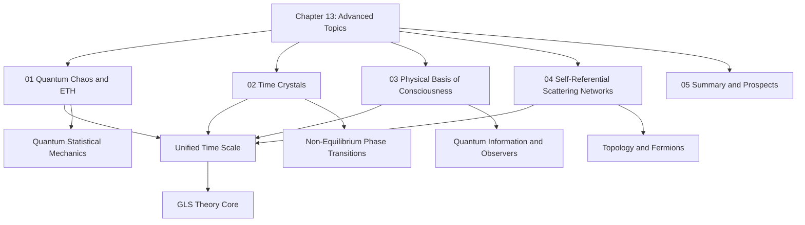
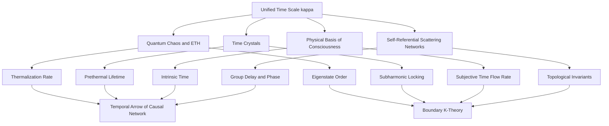
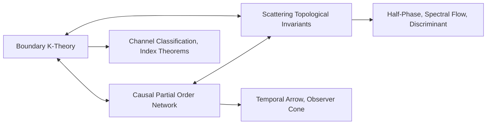
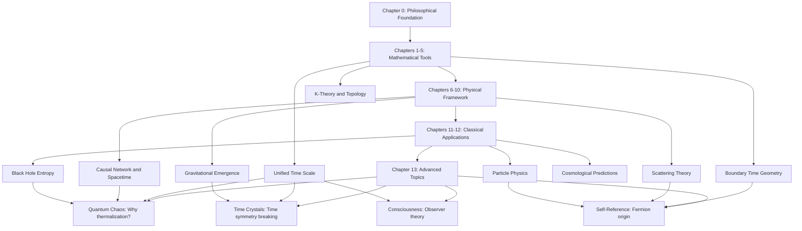
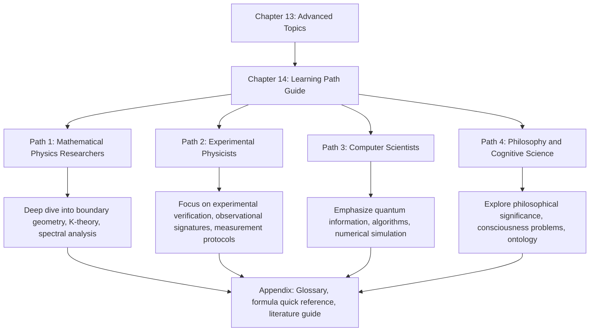
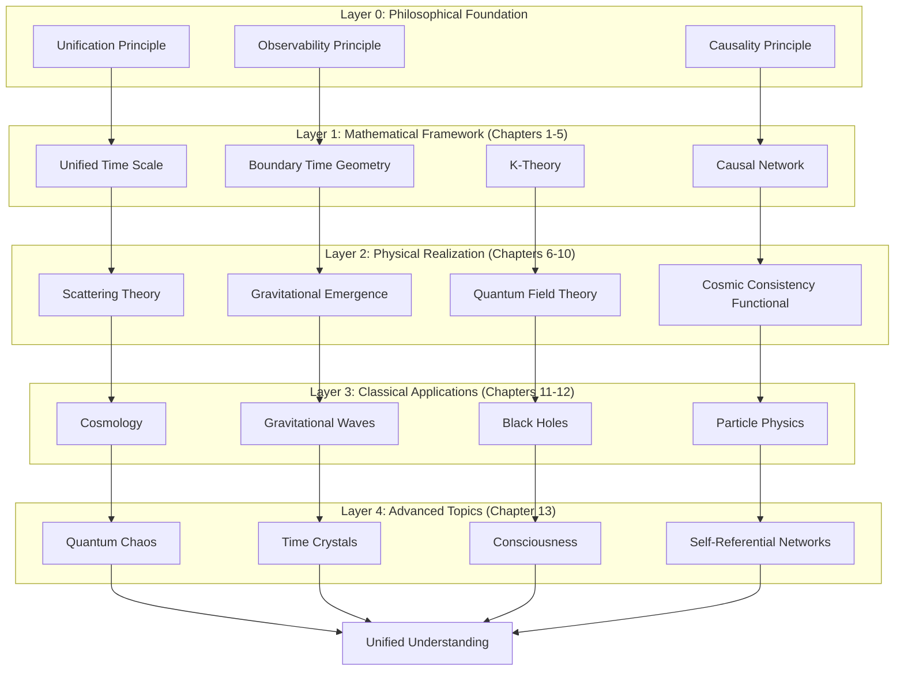

# Chapter 13 Advanced Topics: From Foundations to Frontiers

> "The true test of a theory lies in its ability to predict new phenomena, unify seemingly unrelated domains, and reveal nature's unity at the deepest level."
> —— Philosophical Foundation of GLS Theory

## Introduction: Beyond Classical Applications

In the first 12 chapters, we have constructed a vast and precise theoretical edifice:

- **Chapters 0-5**: Established the mathematical foundations of unified time scale, matrix universe, and boundary time geometry
- **Chapters 6-10**: Developed core tools of causal structure, scattering theory, and K-theory
- **Chapters 11-12**: Verified the predictive power of GLS theory in six domains: cosmology, gravitational waves, black holes, particle physics, etc.

So far, GLS theory has demonstrated strong potential as a "unified framework for physics." But the true vitality of a theory lies in: **Can it reveal the fundamental structure of nature at a deeper level? Can it provide new perspectives on phenomena that traditional theories cannot explain?**

Chapter 13 is designed for this purpose. We will explore four **frontier advanced topics** that represent deeper extensions of GLS theory:

1. **Quantum Chaos and Eigenstate Thermalization (ETH)**: Why can isolated quantum systems thermalize? How does the unified time scale explain the origin of the thermodynamic arrow?

2. **Time Crystals**: Can time translation symmetry spontaneously break? How does non-equilibrium matter form periodic structures in the time dimension?

3. **Physical Basis of Consciousness**: Can consciousness be strictly defined within a physical-informational framework? What is the relationship between intrinsic time scale and subjective temporal experience?

4. **Self-Referential Scattering Networks**: How do self-referential structures emerge in scattering theory? Can fermion origins be derived from self-referentiality?

These topics are not isolated "additions," but **necessary consequences** of the logical development of GLS theory. They collectively reveal a profound fact:

> **The unified time scale is not merely a technical tool for spacetime geometry, but a fundamental bond connecting thermodynamics, quantum information, consciousness phenomena, and topological structures.**

---

## 13.1 Chapter Structure and Topic Overview

This chapter contains four main topics and one summary section, each independent yet interconnected:

### 13.1.1 Topic 01: Quantum Chaos and Eigenstate Thermalization

**Core Question**: Why can the unitary evolution of pure states in isolated quantum systems lead to thermodynamic equilibrium?

**Traditional Dilemma**:

Traditional quantum statistical mechanics faces a fundamental paradox: If the universe is an isolated quantum system whose evolution is described by unitary operators, then the total entropy should remain constant ($S(\rho(t)) = S(\rho(0))$). But our daily experience tells us that entropy always increases—coffee cools, ice melts, rooms become messy.

This contradiction is called the **Loschmidt paradox** or **reversibility paradox**.

**GLS Theory's Answer**:

GLS theory provides a new perspective through the **Quantum Cellular Automaton (QCA) Universe** and **unified time scale**:

1. **Postulate Chaotic QCA**: The universe as a QCA satisfying locality, translation symmetry, and finite propagation speed, with evolution operators $U_\Omega$ on finite regions approximating high-order unitary designs

2. **Eigenstate Thermalization Hypothesis (ETH)**: Within chaotic energy windows, matrix elements of local operators $O$ satisfy:

$$
|\langle E_\alpha | O | E_\beta \rangle = O(\bar{E})\delta_{\alpha\beta} + e^{-S(\bar{E})/2}f_O(\bar{E},\omega)R_{\alpha\beta}
$$

where diagonal terms give microcanonical averages, and off-diagonal terms decay exponentially with system volume

3. **Unified Time–Entropy Growth Theorem**: Under the unified time scale $\tau$, local entropy density grows monotonically:

$$
s_X(\tau) \geq s_0 + v_{\mathrm{ent}}(\varepsilon)\frac{\tau}{\ell_{\mathrm{eff}}}
$$

and approaches microcanonical entropy density in the long-time limit

**Profound Insight**:

The thermodynamic arrow is not an additional assumption, but a necessary consequence of the **trinity of QCA–unified time scale–ETH**. The unified time scale $\kappa(\omega)$ controls the thermalization rate, unifying scattering phase, state density, and group delay into a single temporal master scale.

**Analogy**:

Imagine a perfectly shuffled deck of cards. The evolution of each card's position follows deterministic rules (corresponding to unitary evolution), but after enough shuffles, any local observer can only see "random distribution" (corresponding to the microcanonical ensemble). The key is:

- Number of shuffles $\leftrightarrow$ unified time scale $\tau$
- Local observation window $\leftrightarrow$ finite region $\Omega$
- Seemingly random equilibrium state $\leftrightarrow$ eigenstate properties guaranteed by ETH

---

### 13.1.2 Topic 02: Time Crystals

**Core Question**: Can time translation symmetry spontaneously break, forming matter states with periodic structures in the time dimension?

**Historical Background**:

In 2012, Nobel laureate Frank Wilczek proposed the bold concept of "quantum time crystals": the system's ground state periodically moves in time, spontaneously breaking time translation symmetry. But subsequent rigorous theorems (Bruno 2013, Watanabe-Oshikawa 2015) proved:

> **In equilibrium systems with short-range interactions, time crystals cannot exist.**

This seemed to declare the end of time crystals. But breakthrough progress in 2016 showed: in **non-equilibrium driven systems**, time crystals are not only possible but can be realized experimentally!

**GLS Theory's Contribution**:

GLS theory provides a **unified framework** for time crystals:

1. **Prethermal Discrete Time Crystal (Prethermal DTC)**:

Under high-frequency periodic driving ($\omega \gg J$), the Floquet evolution operator can be written as:

$$
F = U_* e^{-iH_* T} X U_*^\dagger + \Delta
$$

where $X^2 = \mathbb{1}$ is the $\mathbb{Z}_2$ symmetry generator, $|\Delta| \le C e^{-c\omega/J}$. The system exhibits stable $2T$ subharmonic locking with lifetime $\tau_* \sim e^{c\omega/J}$ exponentially increasing with frequency.

2. **MBL Time Crystal**:

In strongly disordered localized systems, the Floquet operator has a quasi-local unitary such that:

$$
F \simeq \tilde{X} e^{-iH_{\mathrm{MBL}}T}
$$

The spectrum exhibits $\pi$ pairing (eigenphase difference $\pi$), inducing **state-independent** $2T$ subharmonic response—this is true **eigenstate order**.

3. **Open-System Dissipative Time Crystal**:

In Lindblad open systems, if the one-period channel $\mathcal{E}$ has only $m$ phases $\{e^{2\pi ik/m}\}_{k=0}^{m-1}$ at the peripheral spectrum radius with a spectral gap, then almost all initial states converge to limit cycles with period $mT$, corresponding to $m$-subharmonic dissipative time crystals.

4. **Topological Time Crystal**:

Implementing logical $\pi$ flip in two-dimensional surface codes, the Floquet element is equivalent within the code subspace to:

$$
F_{\mathrm{logical}} \approx \overline{X}_L e^{-iH^{\mathrm{top}}_* T}
$$

where $\overline{X}_L$ is a non-local logical operator. Subharmonic response is **significant only in logical channels**, insensitive to local operators—this is true **topologically protected time crystal**.

**Role of Unified Time Scale**:

In all these cases, the unified time scale $\kappa(\omega)$ controls:

- Exponential scaling of prethermal lifetime
- Relationship between thermalization time and chaotic energy window
- Convergence rate of open-system limit cycles
- Evolution time scale of topological entanglement entropy

**Analogy**:

Imagine a pendulum that never stops. In equilibrium (like a stationary pendulum), any small perturbation gradually returns it to rest. But if we give the pendulum periodic "pushes" (corresponding to periodic driving), it can maintain stable oscillation—this is the essence of time crystals:

- Periodic driving $\leftrightarrow$ external energy injection
- Subharmonic response ($2T$ rather than $T$) $\leftrightarrow$ pendulum oscillating at half the driving frequency
- Exponential long lifetime $\leftrightarrow$ even after stopping pushes, the pendulum continues oscillating for a long time

---

### 13.1.3 Topic 03: Physical Basis of Consciousness

**Core Question**: Can consciousness be strictly defined within a completely physicalized, informational framework? What is the relationship between intrinsic time scale and subjective temporal experience?

**Traditional Dilemma**:

The consciousness problem, called the "Hard Problem" by David Chalmers, often falls into:

- Phenomenological descriptions ("qualia," "subjective experience") lacking operational definitions
- Neuroscientific correlations (brain region activity, neural oscillations) unable to bridge the "explanatory gap"
- Computational theories (Turing machines, information processing) unable to explain why certain systems "have consciousness"

**GLS Theory's Breakthrough**:

GLS theory proposes a **structural definition** of consciousness: consciousness is not an additional entity, but a **world–self joint information flow** satisfying five structural conditions.

**Five Structural Conditions**:

1. **Integration**:

Significant quantum mutual information exists between internal submodules:

$$
I_{\mathrm{int}}(\rho_O) = \sum_{k=1}^n I(k:\overline{k})_{\rho_O} \geq \Theta_{\mathrm{int}}
$$

This excludes systems decomposable into independent parts (like two non-communicating computers)

2. **Differentiation**:

The system can realize a large number of distinct internal states, corresponding to rich "conscious content":

$$
H_{\mathcal{P}}(t) = -\sum_\alpha p_t(\alpha)\log p_t(\alpha) \geq \Theta_{\mathrm{diff}}
$$

3. **Self-Referential World–Self Model**:

The system internally encodes a joint representation of "world–self" that includes the second-order representation "I am perceiving the world":

$$
\mathcal{H}_O = \mathcal{H}_{\mathrm{world}} \otimes \mathcal{H}_{\mathrm{self}} \otimes \mathcal{H}_{\mathrm{meta}}
$$

4. **Temporal Continuity and Intrinsic Time**:

The system is highly sensitive to temporal evolution, with non-degenerate quantum Fisher information:

$$
F_Q[\rho_O(t)] = \mathrm{Tr}(\rho_O(t)L(t)^2) \geq \Theta_{\mathrm{time}}
$$

From this, the intrinsic time scale can be constructed:

$$
\tau(t) = \int_{t_0}^t \sqrt{F_Q[\rho_O(s)]}\ ds
$$

Under intrinsic time, unit step $\Delta\tau$ corresponds to state changes with uniform distinguishability in Bures distance

5. **Causal Agency**:

The system can generate mutually distinguishable future world sections within a finite time window $T$ through actions:

$$
\mathcal{E}_T(t) = \sup_\pi I(A_t : S_{t+T}) \geq \Theta_{\mathrm{ctrl}}
$$

where $A_t$ is the action and $S_{t+T}$ is the future world state

**Profound Insight**:

Consciousness level can be characterized by a composite index:

$$
\mathcal{C}(t) = g\big(F_Q[\rho_O(t)], \mathcal{E}_T(t), I_{\mathrm{int}}(\rho_O(t)), H_{\mathcal{P}}(t)\big)
$$

When $F_Q \to 0$ and $\mathcal{E}_T \to 0$ occur simultaneously (like deep anesthesia, vegetative state), consciousness level $\mathcal{C}(t) \to 0$.

**Role of Unified Time Scale**:

The intrinsic time scale $\tau$ is precisely the **subjective time** of the consciousness subsystem. When:

- $F_Q$ is large, $d\tau/dt$ is large, subjective time flows fast, experiencing "time slows down, content rich" (like high concentration, dangerous moments)
- $F_Q$ is small, $d\tau/dt$ is small, subjective time flows slow, experiencing "time flies, vague and blurred" (like routine tasks, fatigue)

This explains why "flow state" feels like time slows down, while "boring repetition" feels like time flies!

**Analogy**:

Imagine a precise clock system:

- **Integration**: Gears and springs must mesh tightly; a single gear cannot "keep time" alone
- **Differentiation**: The clock face can display many different times (not a binary switch)
- **Self-referential model**: The clock not only records time but "knows" it is recording time (like a calendar watch also showing dates)
- **Intrinsic time**: The clock has its own "tick" rhythm; different clocks have different rhythms
- **Causal agency**: The clock's hand movement can be used by observers to arrange future actions ("I have a meeting at 10 o'clock")

When all five elements are satisfied simultaneously, the system constitutes a "conscious" subsystem.

---

### 13.1.4 Topic 04: Self-Referential Scattering Networks

**Core Question**: How do self-referential structures (systems containing information about themselves) emerge in scattering theory? Can fermion antiparticle symmetry be derived from self-referentiality?

**Limitations of Traditional Scattering Theory**:

Traditional scattering theory treats systems as unidirectional "input–process–output" flows: incident states transform into outgoing states via scattering operator $S$. But this picture has fundamental limitations:

1. **Cannot describe feedback**: Many physical systems (like laser cavities, quantum feedback networks) have feedback loops from output to input
2. **Cannot handle self-reference**: System state depends on its own historical state, forming recursive structures
3. **Topological information loss**: Traditional $S$ matrix only records phase and amplitude, unable to capture global topological properties

**GLS Theory's Self-Referential Scattering Network (SSN)**:

SSN incorporates feedback loops into scattering theory through **Redheffer star product** and **Schur complement**:

$$
S^{\circlearrowleft} = S_{ee} + S_{ei}(I - \mathcal{C}S_{ii})^{-1}\mathcal{C}S_{ie}
$$

where:
- $S_{ee}$: external–external direct scattering
- $S_{ei}, S_{ie}$: external–internal, internal–external coupling
- $\mathcal{C}$: feedback connection operator
- $(I - \mathcal{C}S_{ii})^{-1}$: "infinite reflection" sum of internal closed loops

**Discriminant and Topological Invariants**:

The singularity of closed-loop scattering is characterized by the **discriminant** $D$:

$$
D = \{(\omega, \vartheta) : \det(I - \mathcal{C}(\omega,\vartheta)S_{ii}(\omega,\vartheta)) = 0\}
$$

This is a codimension-one submanifold in parameter space, corresponding to resonances, embedded eigenvalues, exceptional points (EP), and other physical phenomena.

Going around a closed path $\gamma$ around $D$ once, define the **half-phase invariant**:

$$
\nu_{\sqrt{\det S^{\circlearrowleft}}}(\gamma) = \exp\left(i\oint_\gamma \frac{1}{2}d\arg\det S^{\circlearrowleft}\right) \in \{\pm 1\}
$$

**Fourfold Equivalence Theorem**:

The half-phase invariant is equivalent to:

1. Mod-2 integral of spectral shift: $\exp(-i\pi\oint_\gamma d\xi)$
2. Spectral flow through $-1$: $(-1)^{\mathrm{Sf}_{-1}(S^{\circlearrowleft}\circ\gamma)}$
3. Mod-2 intersection number of discriminant: $(-1)^{I_2(\gamma, D)}$

**Self-Referential Origin of Fermions**:

Key insight: Fermion antiparticle symmetry ($C$, charge conjugation) can be viewed as **$J$-unitarity** in scattering networks:

$$
S^\dagger J S = J, \quad J = J^\dagger = J^{-1}
$$

where $J$ is the Kreĭn metric (indefinite inner product). In self-referential networks, $J$-unitarity requires:

- Scattering phases of particles and antiparticles are opposite
- "Imaginary time evolution" (Wick rotation) in self-referential loops preserves $J$-gauge invariance

Through Cayley mapping $S = (I - iK)(I + iK)^{-1}$, $J$-unitarity is equivalent to $J$-skew-Hermiticity of $K$:

$$
K^\dagger J + J K = 0
$$

This is precisely the anticommutation relation of fermion fields expressed in scattering language!

**Profound Insight**:

Fermion "antiparticles" are not independent entities, but **intrinsic symmetric structures in self-referential scattering networks**. Statistics (Fermi-Dirac vs. Bose-Einstein) arise from:

- Bosons: $J = I$ (positive definite inner product) $\rightarrow$ ordinary unitary scattering
- Fermions: $J \neq I$ (indefinite inner product) $\rightarrow$ $J$-unitary scattering + self-referential constraints

**Analogy**:

Imagine a hall of mirrors:

- **Traditional scattering**: Light enters from the entrance, reflects off mirrors, and exits (unidirectional)
- **Self-referential scattering**: Some exit light is fed back to the entrance, forming infinite reciprocation (closed loop)
- **Discriminant $D$**: Certain mirror angles cause light to "never escape," forever circulating in the hall (resonance)
- **Half-phase invariant**: Going around a resonance point once, phase changes by $\pi$ (topological property)
- **$J$-unitarity**: The hall has "left-right symmetric" structure; left-traveling and right-traveling light satisfy dual relations (particle–antiparticle)

---

## 13.2 Intrinsic Connections Among Four Topics

These four topics appear independent but are deeply connected through the **unified time scale** and **causal–boundary structure**:

### 13.2.1 Fourfold Role of Unified Time Scale

1. **In Quantum Chaos**: $\kappa(\omega) = \rho_{\mathrm{rel}}(\omega) = (2\pi)^{-1}\mathrm{tr}Q(\omega)$ controls entropy density growth rate

2. **In Time Crystals**: $\kappa(\omega)$ determines the exponential scaling of prethermal lifetime $\tau_* \sim e^{c\omega/J}$

3. **In Consciousness Theory**: $\tau(t) = \int \sqrt{F_Q[\rho_O(s)]}ds$ defines subjective time; changes in $F_Q$ cause temporal experience distortion

4. **In Self-Referential Networks**: The trace of group delay matrix $Q = -iS^\dagger \partial_\omega S$ gives $\partial_\omega\arg\det S$, connecting phase with unified time

### 13.2.2 Triangular Relationship: Boundary–Causal–Topology

- **ETH eigenstate order** $\leftrightarrow$ boundary state classification in K-theory
- **Time crystal topological phase** $\leftrightarrow$ Chern number / $\mathbb{Z}_2$ invariants of Floquet systems
- **Consciousness self-referential model** $\leftrightarrow$ causal partition of observer subsystem and environment
- **SSN discriminant** $\leftrightarrow$ singularity structure of closed-loop causal networks

### 13.2.3 Unification of Information–Thermodynamics–Topology

All four topics involve subtle relationships between **information entropy**, **von Neumann entropy**, and **topological entropy**:

| Topic | Role of Information Entropy | Role of Thermodynamic Entropy | Role of Topological Entropy |
|-------|----------------------------|------------------------------|----------------------------|
| Quantum Chaos | Entanglement entropy growth | Microcanonical entropy $S(\bar{E})$ | Page curve, black hole entropy |
| Time Crystals | Local entropy density | Non-equilibrium steady-state entropy production | Topological entanglement entropy $\gamma$ |
| Consciousness Theory | Mutual information $I(O:E)$ | Observer entropy $S(\rho_O)$ | Kolmogorov complexity of self-referential structures |
| Self-Referential Networks | Channel capacity | Clausius inequality | Mod-2 intersection number of discriminant |

**Profound Unification**:

In GLS theory, these different types of "entropy" can all be expressed through **spectral shift representation of unified time scale**:

$$
S_{\mathrm{total}} = -\int \kappa(\omega)\log\kappa(\omega)\ d\omega + \text{boundary terms}
$$

where boundary terms encode topological and causal information.

---

## 13.3 From Foundational Theory to Advanced Topics: Logical Thread

Let us review the logical development from Chapter 0 to Chapter 13:

### 13.3.1 Phase 1 (Chapters 0-5): Preparation of Mathematical Foundations

**Core Achievements**:
- Unified time scale $\kappa(\omega) = \varphi'(\omega)/\pi = \rho_{\mathrm{rel}}(\omega) = (2\pi)^{-1}\mathrm{tr}Q(\omega)$
- Boundary time geometry: $\tau_\partial = \tau_{\mathrm{modular}} = \tau_{\mathrm{GHY}}$
- K-theory and channel classification

**Paving the Way for Advanced Topics**:
- Quantum chaos needs $\kappa$ to define thermalization time scales
- Time crystals need boundary time geometry to understand Floquet systems
- Consciousness theory needs $\kappa$ to construct intrinsic time
- Self-referential networks need K-theory to classify topological phases

### 13.3.2 Phase 2 (Chapters 6-10): Building Physical Framework

**Core Achievements**:
- Causal network and spacetime emergence
- Scattering–gravity correspondence
- Cosmic consistency functional $\mathcal{I}[\mathfrak{U}]$

**Paving the Way for Advanced Topics**:
- Quantum chaos needs causal networks to define local observers
- Time crystals need non-equilibrium framework
- Consciousness theory needs observer–environment partition
- Self-referential networks need topological invariants of scattering theory

### 13.3.3 Phase 3 (Chapters 11-12): Verification of Classical Applications

**Core Achievements**:
- Cosmology: dark energy, cosmological constant problem
- Black holes: Bekenstein-Hawking entropy, Page curve
- Particle physics: neutrino mass, strong CP problem

**Paving the Way for Advanced Topics**:
- Black hole Page curve $\rightarrow$ connection between ETH and entanglement entropy growth
- K-theory classification in particle physics $\rightarrow$ self-referential origin of fermions
- Cosmological temporal arrow $\rightarrow$ thermodynamic irreversibility of QCA-ETH

### 13.3.4 Phase 4 (Chapter 13): Breakthrough of Advanced Topics

**Core Goals**:

1. **Deepen Understanding**: Not satisfied with "GLS theory can explain existing experiments," but asking "why must these phenomena be so?"

2. **Expand Boundaries**: Apply GLS theory to domains difficult for traditional physics to reach (consciousness, self-referential structures)

3. **Reveal Unification**: Show how seemingly unrelated phenomena (thermalization, time crystals, consciousness, fermions) are connected through unified time scale

4. **Predict New Phenomena**: Propose testable new predictions (such as unified time scaling of ETH, topological protection of time crystals, quantum indicators of consciousness, experimental signatures of self-referential networks)

---

## 13.4 Philosophical Significance of Advanced Topics

### 13.4.1 From "Explanation" to "Understanding"

The first 12 chapters mainly answer "**what**" (What) and "**how to achieve**" (How):

- What is the unified time scale? $\kappa(\omega) = \rho_{\mathrm{rel}}(\omega)$
- How does gravity emerge? Through boundary Hamiltonian and GHY term
- What is black hole entropy? The index $\mu_K$ of boundary K-theory

Chapter 13 delves deeper into "**why**" (Why):

- **Why** can isolated quantum systems thermalize? Because of postulate chaotic QCA + unified time–ETH–entropy growth theorem
- **Why** can time translation symmetry spontaneously break? Because non-equilibrium driving breaks equilibrium constraints
- **Why** is consciousness related to temporal experience? Because intrinsic time scale $\tau$ is precisely the integral of quantum Fisher information
- **Why** do fermions have antiparticles? Because of $J$-unitarity of self-referential scattering networks

### 13.4.2 From "Phenomena" to "Principles"

Advanced topics are not isolated "interesting phenomena," but reveal **deep principles**:

**Principle 1: Unified Time Scale is the Fundamental Bond of Physics**

Not only connecting geometry and scattering, but also:
- Thermodynamics (entropy growth rate)
- Non-equilibrium phase transitions (time crystal lifetime)
- Subjective experience (consciousness temporal flow rate)
- Topological structures (spectral flow of discriminant)

**Principle 2: Boundary–Causal–Topology Trinity**

Any physical system can be described from three equivalent perspectives:
- **Boundary perspective**: K-theory, channel classification, modular flow
- **Causal perspective**: Partial order network, observer cone, temporal arrow
- **Topological perspective**: Half-phase, spectral flow, discriminant intersection number

**Principle 3: Universality of Self-Referential Structures**

Self-reference (systems containing information about themselves) is not a "special phenomenon," but:
- ETH in quantum chaos (eigenstates encode their own energy level statistics)
- Eigenstate order of time crystals (eigenstates determine their own evolution period)
- World–self model of consciousness (systems encode representations about themselves)
- Self-referential scattering networks (output feeds back to input)

### 13.4.3 From "Analysis" to "Synthesis"

The first 12 chapters adopt an **analytical** strategy: decomposing the universe into spacetime, matter, interactions, constructing them one by one.

Chapter 13 adopts a **synthetic** strategy: showing that these decompositions are only artificial divisions, and unified time scale and causal networks provide an **indivisible holistic picture**.

Analogy:

- **Analysis** is like disassembling a jigsaw puzzle into individual pieces, understanding the shape and color of each piece
- **Synthesis** is like reassembling pieces into a complete picture, discovering patterns invisible in individual pieces

In GLS theory:

- Individual pieces = topics of each chapter (spacetime, scattering, K-theory, gravity, cosmology...)
- Complete picture = indivisible whole of unified time scale–boundary–causal–topology
- Hidden patterns = deep connections among quantum chaos, time crystals, consciousness, self-referential structures

---

## 13.5 Reading Guide and Expected Gains

### 13.5.1 Suggested Reading Paths

This chapter's content is relatively advanced; readers are advised to choose reading paths based on background and interests:

**Path 1: Mathematical Physics Researchers** (Complete Reading)

- Section 01 provides rigorous ETH theorems and QCA framework
- Section 02 demonstrates non-equilibrium phase transitions and topological protection
- Section 04 introduces mathematical structures of self-referential networks
- Section 03 applies abstract structures to consciousness problems
- Section 05 synthesizes the unity of four topics

**Path 2: Condensed Matter/Quantum Information Researchers**

- Section 02's time crystals are directly related to current experiments
- Section 01's ETH relates to many-body localization and thermalization problems
- Section 04's topological invariants relate to topological phase classification

**Path 3: Theoretical Physics/High-Energy Physics Researchers**

- Section 01's QCA universe relates to quantum gravity
- Section 04's self-referential structures relate to fermion origins
- Section 02's Floquet systems relate to driven field theory

**Path 4: Cognitive Science/Neuroscience Researchers**

- Section 03 provides structural definition of consciousness
- Section 01's ETH relates to brain thermalization and memory consolidation
- Section 02's time crystals relate to neural oscillations

**Path 5: Popular Science Enthusiasts** (Skip Technical Details)

Each section contains **analogy paragraphs** that can be read directly:
- Section 01's "card shuffling" analogy
- Section 02's "pendulum" analogy
- Section 03's "clock system" analogy
- Section 04's "hall of mirrors" analogy

Then read Section 05 summary to gain the overall picture.

### 13.5.2 Expected Gains

After completing Chapter 13, you will be able to:

**Technical Level**:

1. Understand the axiom system of postulate chaotic QCA and prove QCA–ETH theorems
2. Master the unified framework of four types of time crystals: prethermal, MBL, open-system, topological
3. Apply quantum Fisher information to construct intrinsic time scales and analyze consciousness levels
4. Use Redheffer star product, Schur complement, and discriminant to analyze self-referential scattering networks

**Conceptual Level**:

1. Recognize that unified time scale is not merely a technical tool but a fundamental bond connecting various branches of physics
2. Understand the universality of self-referential structures (ETH, time crystals, consciousness, SSN)
3. Master the equivalent descriptions of boundary–causal–topology trinity
4. Appreciate the philosophical shift from "analysis" to "synthesis"

**Application Level**:

1. Apply ETH to black hole information loss and decoherence problems in quantum computing
2. Apply time crystals to quantum storage and non-equilibrium state engineering
3. Apply consciousness theory to artificial intelligence and brain-computer interfaces
4. Apply self-referential networks to quantum feedback control and topological quantum computing

### 13.5.3 Technical Requirements and Prerequisites

This chapter assumes readers have mastered:

**Required** (Core content of first 12 chapters):
- Triple definition of unified time scale $\kappa(\omega)$
- Boundary time geometry and GHY term
- Basic concepts of K-theory (channels, Kasparov product)
- Causal networks and partial order structures

**Recommended** (Helpful for deeper understanding):
- Quantum information: density operators, entanglement entropy, mutual information
- Statistical mechanics: microcanonical ensemble, partition function
- Topology: homotopy theory, cohomology, index theorems
- Operator theory: spectral theory, trace-class operators

**Optional** (For specific topics):
- Section 01: Random matrix theory, Lieb-Robinson bounds, unitary designs
- Section 02: Floquet theory, many-body localization, Lindblad equations
- Section 03: Quantum Fisher information, Cramér-Rao bounds, Bures distance
- Section 04: $J$-unitarity, Kreĭn spaces, Cayley transform

If some concepts are unfamiliar, first read the corresponding "analogy" paragraphs to gain intuitive understanding before delving into technical details.

---

## 13.6 Connection with Frontier Research

The four topics in Chapter 13 are all closely related to current frontier physics research:

### 13.6.1 Quantum Chaos and ETH

**Current Hotspots**:

- **Criticality of Many-Body Localization (MBL)**: Where is the boundary of ETH failure? Does MBL phase transition exist?
- **Black Hole Information Paradox**: Relationship between Page curve and ETH? Does black hole interior satisfy ETH?
- **Thermalization in Quantum Computing**: How to use ETH to design more robust quantum error-correcting codes?

**GLS Theory's Contribution**:

- Unified time–ETH–entropy growth theorem gives precise scaling of thermalization time
- QCA universe elevates ETH from "model property" to "cosmic axiom"
- Connects Page curve with spectral shift of unified time scale

**Unsolved Problems** (Possible research directions):

1. How to define postulate chaotic QCA in gravitational systems?
2. Is ETH destroyed by tidal forces near black hole horizons?
3. Can we derive chaotic properties of Sachdev-Ye-Kitaev (SYK) model from GLS theory?

### 13.6.2 Time Crystals

**Current Hotspots**:

- **Topological Time Crystals**: How to realize topologically protected DTC in two/three-dimensional systems?
- **Continuous Time Crystals**: Do strict continuous time crystals exist in open systems?
- **Time Quasicrystals**: How to classify quasiperiodic order under multi-frequency driving?

**GLS Theory's Contribution**:

- Exponential lifetime $\tau_* \sim e^{c\omega/J}$ of prethermal discrete time crystals relates to unified time scale
- Logical operator order parameters of topological time crystals correspond to K-theory channel classification
- Liouvillian spectral gap of open-system dissipative time crystals relates to causal agency

**Unsolved Problems**:

1. Do "three-dimensional topological time crystals" exist? What are their topological invariants?
2. Can time crystals serve as quantum memory? What is their error correction capability?
3. Relationship between time crystals and time-reversal symmetry breaking (T-breaking)?

### 13.6.3 Physical Basis of Consciousness

**Current Hotspots**:

- **Integrated Information Theory (IIT)**: Relationship between Giulio Tononi's IIT 3.0/4.0 and quantum theory?
- **Global Workspace Theory (GWT)**: How to realize global broadcasting in quantum systems?
- **Brain–Computer Interfaces**: Can we assess consciousness level by measuring $F_Q$ and $\mathcal{E}_T$?

**GLS Theory's Contribution**:

- Five structural conditions provide **operational definition** of consciousness, connectable with neuroscience data
- Intrinsic time scale $\tau$ explains distortion of subjective temporal experience
- Causal agency $\mathcal{E}_T$ quantifies the informational basis of "free will"

**Unsolved Problems**:

1. How to estimate $F_Q[\rho_O(t)]$ in actual brain neural networks?
2. Does consciousness's "unified field" correspond to some quantum entanglement structure?
3. What are $\mathcal{C}(t)$ values in vegetative states and deep anesthesia? Can they serve as clinical diagnostic indicators?

### 13.6.4 Self-Referential Scattering Networks

**Current Hotspots**:

- **Quantum Feedback Control**: How to design robust quantum feedback protocols? Topological protection of discriminant?
- **Topological Quantum Computing**: Relationship between Majorana zero modes, topological qubits, and self-referential networks?
- **Origin of Fermions**: Why did nature choose fermion statistics? Connection with supersymmetry and string theory?

**GLS Theory's Contribution**:

- Half-phase invariant $\nu_{\sqrt{\det S^{\circlearrowleft}}}$ provides topological fingerprint of closed-loop systems
- $J$-unitarity gives self-referential origin of fermions: antiparticles are intrinsic symmetries of self-referential networks
- Mod-2 intersection number of discriminant $D$ corresponds to Floquet band edge topological indices

**Unsolved Problems**:

1. Can self-referential scattering networks unify all fundamental particles (quarks, leptons, gauge bosons)?
2. Can fine structure of discriminant (not just mod-2, but complete $\mathbb{Z}$ invariants) predict new particles?
3. Can self-referential networks explain CP violation, neutrino oscillations, and other phenomena?

### 13.6.5 Cross-Domain Intersections

Most exciting are **intersections among four topics**:

| Intersection Domain | Possible Research Questions |
|---------------------|---------------------------|
| ETH + Time Crystals | Does eigenstate order of MBL time crystals satisfy modified ETH? |
| ETH + Consciousness | Relationship between brain "thermalization" and consciousness loss? Does anesthesia suppress local ETH? |
| ETH + Self-Referential Networks | Can black hole Page curve be explained by discriminant of self-referential scattering networks? |
| Time Crystals + Consciousness | Are neural oscillations a kind of "biological time crystal"? |
| Time Crystals + Self-Referential Networks | Relationship between Floquet indices of topological time crystals and half-phase invariants? |
| Consciousness + Self-Referential Networks | Can consciousness's self-referential model be characterized by closed-loop structure of discriminant? |

These intersection questions represent the most promising research directions for GLS theory in the next 5-10 years.

---

## 13.7 From Chapter 13 to Chapter 14: Completion of Learning Path

After completing Chapter 13, you will have:

1. **Solid Theoretical Foundation** (Chapters 1-12)
2. **Frontier Topic Knowledge** (Chapter 13)

But how to **systematize** and **personalize** this knowledge? How to develop a learning plan based on your background and interests?

This is precisely the task of **Chapter 14**:

Chapter 14 will provide:

- **Four main learning paths**, adapted to different backgrounds
- **Core chapters** for each path and skippable technical details
- **Recommended reading order** and time planning suggestions
- **Exercises and thinking problems** to test understanding depth
- **Further research directions**, connecting to current frontiers

The appendix will provide:

- **Complete glossary**: Definitions of all technical terms from A to Z
- **Core formula quick reference**: One-page summary of 50 most important formulas
- **Literature guide**: Classic papers and latest reviews for each topic
- **Numerical tools**: Python/Julia code libraries to reproduce calculations in the book

---

## 13.8 Summary: Peak of the Theoretical Edifice

Let us summarize the complete journey from Chapter 0 to Chapter 13 with a macro picture:

**Layer 0**: Establishes philosophical foundation, clarifying "why unified theory is needed"

**Layer 1**: Constructs mathematical toolbox, providing "unified time scale" as the core weapon

**Layer 2**: Establishes physical framework, showing "how gravity and quantum field theory emerge"

**Layer 3**: Verifies classical applications, proving "theory can explain known phenomena"

**Layer 4**: Explores advanced topics, revealing "theory can predict new phenomena and unify deep structures"

Each layer is a **necessary foundation** for the next, and Layer 4 (Chapter 13) is the **peak** of the entire theoretical edifice:

- It is not satisfied with explaining the known, but wants to **predict the unknown**
- It is not satisfied with analyzing parts, but wants to **synthesize the whole**
- It is not satisfied with technical details, but wants to **reveal principles**

This is the highest realm of theoretical physics: **from phenomena to principles, from analysis to synthesis, from explanation to understanding.**

---

## 13.9 To the Reader: Life of Theory Lies in Application and Development

Dear reader, if you have read this far, congratulations on completing a **marathon of thought**:

- From abstract definitions of unified time scale
- To precise calculations of black hole entropy
- To structural definitions of consciousness

This is not just accumulation of knowledge, but a **transformation of thinking**:

**Transformation 1: From "What" to "Why"**

No longer satisfied with "what is the gravitational wave dispersion relation," but asking "why does unified time scale determine dispersion."

**Transformation 2: From "Separation" to "Unification"**

No longer thinking spacetime, matter, and information are independent entities, but understanding they are unified through boundary–causal–topology trinity.

**Transformation 3: From "Acceptance" to "Questioning"**

No longer blindly accepting "entropy increases because of the second law," but questioning "why does QCA–unified time–ETH necessarily lead to entropy increase."

But the life of theory lies not in books, but in **application and development**:

**Application Level**:

- Apply GLS theory to your research field (whether cosmology, condensed matter, quantum information, or cognitive science)
- Design new experiments to verify GLS theory predictions (such as topological protection of time crystals, quantum indicators of consciousness)
- Develop new tools to implement GLS theory calculations (such as QCA simulators, discriminant calculations of self-referential networks)

**Development Level**:

- Discover deficiencies and limitations of GLS theory (any theory has boundaries)
- Propose corrections or extensions (such as generalizations to curved spacetime, strong coupling cases)
- Dialogue with other frontier theories (such as holographic principle, entanglement wedge, MERA)

**Most Importantly**: Do not treat GLS theory as "ultimate truth," but as a **ladder to deeper understanding**. Just as Newtonian mechanics led to relativity, relativity led to quantum gravity, GLS theory will also lead to more unified frameworks.

And you are a participant in this process!

---

## Chapter Content Overview

The next four sections will unfold the four major advanced topics:

**Section 13.1: Quantum Chaos and Eigenstate Thermalization**
- Axiom system of postulate chaotic QCA
- QCA–ETH theorem and rigorous proof
- Unified time–ETH–entropy growth theorem
- Wigner-Dyson spectral statistics and random matrix theory
- Applications: black hole Page curve, decoherence in quantum computing

**Section 13.2: Time Crystals**
- Negative theorems of equilibrium time crystals
- Unified framework of four types of time crystals: prethermal, MBL, open-system, topological
- Floquet theory and high-frequency expansion
- Experimental realization: trapped ions, superconducting qubits, Rydberg gases
- Applications: quantum storage, non-equilibrium state engineering

**Section 13.3: Physical Basis of Consciousness**
- Five structural conditions of consciousness (integration, differentiation, self-reference, intrinsic time, causal agency)
- Quantum Fisher information and intrinsic time scale
- Causal agency quantity $\mathcal{E}_T$ and "free will"
- Minimal two-qubit model: consciousness phase diagram
- Applications: anesthesia depth monitoring, AI consciousness assessment

**Section 13.4: Self-Referential Scattering Networks**
- Redheffer star product and Schur complement
- Discriminant $D$ and topological invariants
- Fourfold equivalence: half-phase–spectral shift–spectral flow–intersection number
- $J$-unitarity and fermion origin
- Band edge topological indices of Floquet systems
- Applications: quantum feedback control, topological quantum computing

**Section 13.5: Summary and Prospects**
- Deep connections among four topics
- Ultimate significance of unified time scale
- Unsolved problems and research directions
- Bridge to Chapter 14

Let us begin this exciting journey!

---

**Next Section Preview**:

**Section 13.1 Quantum Chaos and Eigenstate Thermalization: Why Can Isolated Quantum Systems Thermalize?**

We will start with a seemingly contradictory question:

> A hot cup of coffee placed on a table will cool down (entropy increases), but if the universe is an isolated quantum system whose evolution is described by unitary operators, then total entropy should remain constant. How is this contradiction resolved?

The answer will lead us into quantum chaos, eigenstate thermalization hypothesis, and GLS theory's QCA universe model. We will see:

- Why "postulate chaotic QCA" necessarily satisfies ETH
- How unified time scale controls thermalization rate
- How Wigner-Dyson spectral statistics emerge from QCA evolution
- The origin of thermodynamic arrow is not an assumption, but a theorem

Ready? Let us delve into the mathematics and physics of quantum chaos!

