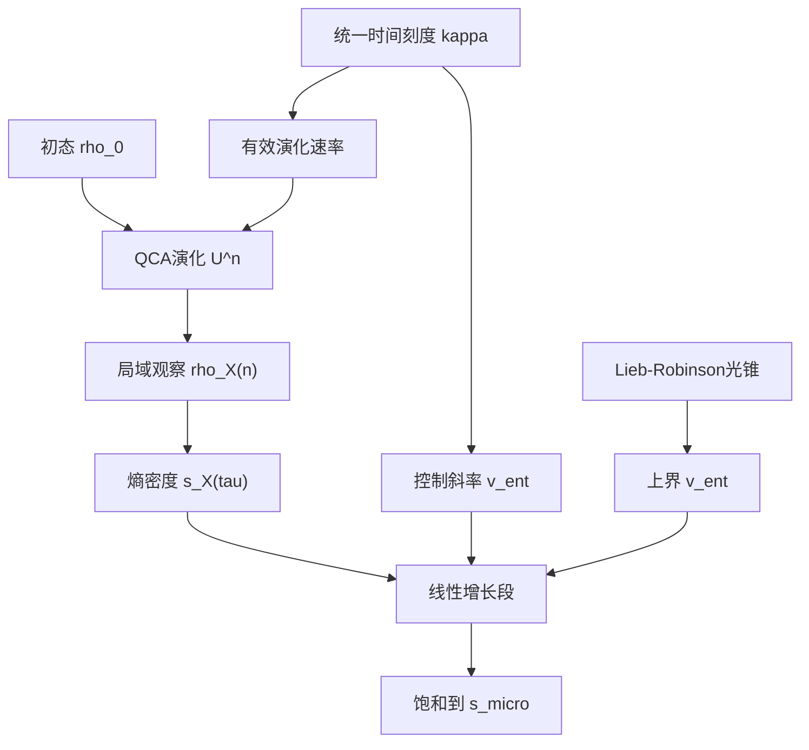
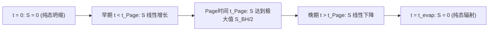
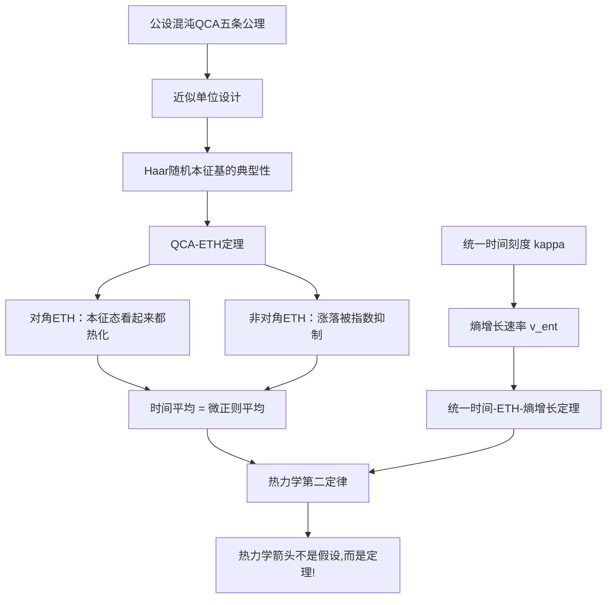

# 第13.1节 量子混沌与本征态热化：热力学箭头的量子起源

> "为什么孤立量子系统的纯态幺正演化能够导致热力学平衡？这不是假设，而是定理。"
> —— GLS理论中的ETH-统一时间刻度定理

## 引言：Loschmidt佯谬与量子热化之谜

### 问题的起源

想象以下场景：

**场景1**：您将一杯热咖啡放在桌上。过了一会儿，咖啡变凉了，热量扩散到空气中。根据热力学第二定律，系统的熵增加了。

**场景2**：从微观角度看，咖啡、空气、桌子构成一个由 $\sim 10^{26}$ 个粒子组成的孤立量子系统。根据薛定谔方程，这个系统的演化由幺正算符 $U(t) = e^{-iHt/\hbar}$ 描述，因此冯·诺依曼熵

$$
S(\rho(t)) = -\mathrm{Tr}(\rho(t)\log\rho(t))
$$

在演化过程中保持不变（幺正演化保持纯态的熵为零，保持混合态的熵不变）。

**矛盾**：热力学熵增加了，但量子熵不变！这就是著名的**Loschmidt佯谬**。

### 传统的"解释"及其不足

经典统计力学提供了几种"解释"：

1. **粗粒化解释**：宏观观察者只能测量粗粒化的可观测量（如温度、压强），无法分辨微观细节。因此"宏观熵"（粗粒化的Gibbs熵）可以增加，尽管微观熵不变。

2. **系综解释**：我们不知道系统的精确微观态，只能用统计系综（如微正则系综、正则系综）描述。系综熵可以增加。

3. **大数定律解释**：对于 $\sim 10^{26}$ 个粒子的系统，"典型"微观态在宏观上看起来都像平衡态。

但这些解释都有**根本缺陷**：

- **问题1**：为什么需要引入"粗粒化"或"系综"？如果宇宙是一个纯态量子系统，为什么我们需要人为地忘记信息？
- **问题2**：即使接受粗粒化，为什么粗粒化熵会单调增加？什么机制保证熵不会在宏观时间尺度上大幅涨落？
- **问题3**：如何从第一性原理（即薛定谔方程）严格推导热力学第二定律？

### GLS理论的突破：从假设到定理

GLS理论通过三个核心概念解决了这个百年难题：

1. **公设混沌QCA（量子元胞自动机）**：将宇宙建模为一个满足特定公理的离散时空量子系统

2. **本征态热化假设（ETH）**：在混沌能窗内，局域算符的本征态矩阵元具有特殊结构，使得几乎所有本征态在局域观察者看来都像热平衡态

3. **统一时间刻度 $\kappa(\omega)$**：控制热化速率，将散射相位、态密度、群延迟统一为单一时间母尺

关键突破在于：**ETH不是假设，而是从公设混沌QCA的公理推导出的定理**。热力学箭头的起源不需要额外假设，而是QCA—统一时间—ETH三位一体的必然结果。

---

## 13.1.1 量子元胞自动机（QCA）宇宙

### 基本定义

**定义1.1（QCA宇宙对象）**

QCA宇宙 $U_{\mathrm{qca}}$ 定义为五元组：

$$
U_{\mathrm{qca}} = (\Lambda, \mathcal{H}_{\mathrm{cell}}, \mathcal{A}_{\mathrm{qloc}}, \alpha, \omega_0)
$$

其中：

1. **晶格** $\Lambda$：可数连通图（典型为 $\mathbb{Z}^d$ 或其变形），表示空间离散化

2. **元胞希尔伯特空间** $\mathcal{H}_{\mathrm{cell}}$：每个格点 $x \in \Lambda$ 携带有限维希尔伯特空间 $\mathcal{H}_x \cong \mathbb{C}^q$

3. **准局域代数** $\mathcal{A}_{\mathrm{qloc}}$：所有有限支撑算符的范数闭包

4. **自同构** $\alpha: \mathcal{A}_{\mathrm{qloc}} \to \mathcal{A}_{\mathrm{qloc}}$：满足以下条件的 $*$-自同构：
   - **平移协变**：与晶格平移群作用对易
   - **有限传播半径 $R$**：对任何有限区域 $X \subset \Lambda$，若算符 $O_X$ 支撑在 $X$ 上，则 $\alpha(O_X)$ 支撑在
     $$
     X^{+R} = \{y \in \Lambda : \mathrm{dist}(y, X) \leq R\}
     $$
   - **幺正实现**：存在全局幺正算符 $U$ 使 $\alpha(O) = U^\dagger O U$

5. **初始态** $\omega_0$：$\mathcal{A}_{\mathrm{qloc}}$ 上的态，给出时间步 $n=0$ 时宇宙的量子状态

**比喻理解**：

QCA宇宙如同一个巨型国际象棋盘：

- **晶格 $\Lambda$**：棋盘的格子
- **元胞空间 $\mathcal{H}_{\mathrm{cell}}$**：每个格子上可能的棋子状态（空、兵、车、马...）
- **自同构 $\alpha$**：每一"时间步"所有棋子同时按规则移动
- **有限传播半径 $R$**：每个棋子只能影响距离 $R$ 以内的格子（类似"光锥"）
- **平移协变**：规则在所有格子上相同，不依赖位置

### 有限区域的演化算符

对于有限区域 $\Omega \Subset \Lambda$，定义有限维希尔伯特空间：

$$
\mathcal{H}_\Omega = \bigotimes_{x \in \Omega} \mathcal{H}_x
$$

维数 $D_\Omega = q^{|\Omega|}$，对于 $q=2$（量子比特）和 $|\Omega|=100$，已经是 $2^{100} \approx 10^{30}$ 维！

限制 $U$ 到 $\Omega$ 得到 **Floquet算符**（离散时间演化算符）$U_\Omega$，其谱分解：

$$
U_\Omega |\psi_n\rangle = e^{-i\varepsilon_n \Delta t} |\psi_n\rangle
$$

其中 $\varepsilon_n \in (-\pi/\Delta t, \pi/\Delta t]$ 为准能量，$|\psi_n\rangle$ 为Floquet本征态。

### 连续极限与量子场论的重构

在适当的连续极限下（$\Delta t \to 0$，$|\Omega| \to \infty$），QCA可以重构：

1. **狄拉克方程**：一维量子行走在连续极限下给出无质量费米子
2. **规范场论**：二维以上的QCA通过"格点规范理论"构造 $U(1)$、$SU(N)$ 规范场
3. **时空几何**：引力涌现对应于QCA的长波长有效理论

但在**有限区域、有限时间**下，QCA保持离散结构，这正是讨论热化和ETH的天然场景。

---

## 13.1.2 公设混沌QCA：从可积到混沌的分水岭

并非所有QCA都表现出混沌行为。例如：

- **可积QCA**：存在大量局域守恒量，长时间演化后趋于广义Gibbs系综，**不满足ETH**
- **多体局域化（MBL）QCA**：在强无序下，系统保留对初态的记忆，**不完全热化**
- **混沌QCA**：快速"scrambling"，几乎所有本征态在局域观察者看来都像热平衡态，**满足ETH**

GLS理论通过以下公理体系刻画"公设混沌QCA"：

**定义1.2（公设混沌QCA）**

一个平移不变QCA $U$ 称为公设混沌QCA，若满足：

**公理1（有限传播半径与局域性）**：
存在整数 $R$ 使得对任意有限 $X \subset \Lambda$，有 $\alpha(\mathcal{A}_X) \subset \mathcal{A}_{X^{+R}}$

**公理2（局域电路表示）**：
在任意有限区域 $\Omega$ 上，$U_\Omega$ 可写为有限深度局域量子电路：

$$
U_\Omega = \prod_{\ell=1}^D U_\ell, \quad U_\ell = \bigotimes_j U_{\ell,j}
$$

其中每个门 $U_{\ell,j}$ 作用在有限子集 $X_{\ell,j} \subset \Omega$，并与所有相距超过有限距离的门对易

**公理3（近似单位设计）**：
存在 $t_0 \in \mathbb{N}$ 与函数 $\epsilon_t(|\Omega|)$（随 $|\Omega|$ 指数衰减），使得对任意 $t \leq t_0$，由 $U_\Omega$ 生成的幺正族在 $t$ 阶矩上构成 $\epsilon_t$ 精度的近似 $t$-设计：

$$
\left\|
\mathbb{E}_{U_\Omega}[P(U_\Omega, U_\Omega^\dagger)] - \mathbb{E}_{U \sim \mathrm{Haar}}[P(U, U^\dagger)]
\right\| \leq \epsilon_t(|\Omega|)
$$

对任意次数不超过 $t$ 的多项式 $P$

**公理4（无额外广泛守恒量）**：
除了可能的几个全局量子数（如总粒子数、自旋等），系统中不存在独立的广泛局域守恒量

**公理5（热化能窗）**：
存在能窗 $I \subset (-\pi/\Delta t, \pi/\Delta t]$，其内本征态数量随 $|\Omega|$ 指数增长：

$$
D_I(\Omega) \sim e^{s(\varepsilon)|\Omega|}
$$

且能级简并仅产生有限多的对称性多重度

### 单位设计的物理意义

**什么是 $t$-设计？**

$t$-设计是一族幺正算符的分布，其前 $t$ 阶矩与Haar随机幺正的相应矩相同。对于 $t=2$，意味着：

$$
\mathbb{E}[U_{ij}U_{k\ell}^*] = \mathbb{E}_{\mathrm{Haar}}[U_{ij}U_{k\ell}^*]
$$

即"二阶统计性质与完全随机幺正相同"。

**为什么需要单位设计？**

Brandão-Harrow-Horodecki (2016) 证明：在一维链上，深度为 $\mathcal{O}(t^{10}n^2)$ 的局域随机电路可实现 $t$-设计。这保证了：

1. **本征态的随机性**：本征向量在Hilbert空间中"接近均匀分布"
2. **相关函数的衰减**：非对角矩阵元随体积指数小
3. **快速scrambling**：信息在多项式时间内扩散到整个系统

在公设混沌QCA中，单位设计性质来自公理3，而非显式随机化——这是确定性演化的**涌现随机性**。

### 公设混沌QCA的例子

**例子1：砖墙QCA（Brickwork QCA）**

取 $\Lambda = \mathbb{Z}$，每个元胞 $\mathcal{H}_x = \mathbb{C}^2$。定义两步更新：

1. **偶-奇层**：对所有 $(2j, 2j+1)$ 对施加两体门 $U_{\mathrm{even}}$
2. **奇-偶层**：对所有 $(2j+1, 2j+2)$ 对施加两体门 $U_{\mathrm{odd}}$

全局演化：

$$
U = U_{\mathrm{odd}} U_{\mathrm{even}} = \left(\bigotimes_j U_{\mathrm{odd},j}\right) \left(\bigotimes_j U_{\mathrm{even},j}\right)
$$

若 $U_{\mathrm{even}}, U_{\mathrm{odd}}$ 选自生成 $SU(4)$ 的通用门集，则满足公设混沌QCA公理。

**例子2：Floquet非可积自旋链**

考虑周期驱动的海森堡链：

$$
H(t) = \sum_j \left[\vec{S}_j \cdot \vec{S}_{j+1} + h_j(t) S_j^z\right]
$$

其中 $h_j(t)$ 为准随机周期场，破坏可积性。一周期Floquet算符

$$
U = \mathcal{T}\exp\left(-i\int_0^T H(t)\ dt\right)
$$

在高频极限下等价于局域电路，满足公设混沌QCA。

---

## 13.1.3 本征态热化假设（ETH）：从Deutsch到GLS

### ETH的历史与动机

**1991年**：J. M. Deutsch首次提出"量子态热化"的思想：即使系统处于纯态 $|\psi\rangle$，局域观测 $O$ 的期望值也应接近热平衡值。

**1994年**：M. Srednicki从随机矩阵理论角度提出ETH的精确形式：

$$
\langle E_\alpha | O | E_\beta \rangle = O(\bar{E})\delta_{\alpha\beta} + e^{-S(\bar{E})/2} f_O(\bar{E}, \omega) R_{\alpha\beta}
$$

其中：
- $\bar{E} = (E_\alpha + E_\beta)/2$：能量均值
- $\omega = E_\alpha - E_\beta$：能量差
- $S(\bar{E})$：微正则熵（$\sim s(\bar{E})|\Omega|$，与体积成正比）
- $R_{\alpha\beta}$：零均值、单位方差的类高斯随机数
- $O(\bar{E})$、$f_O(\bar{E}, \omega)$：光滑函数

**关键洞察**：

1. **对角ETH**（$\alpha = \beta$）：所有能窗内的本征态给出几乎相同的局域观测期望值 $O(\bar{E})$，差异随体积指数小

2. **非对角ETH**（$\alpha \neq \beta$）：非对角矩阵元随 $e^{-S(\bar{E})/2}$ 指数抑制，保证时间涨落极小

### 离散时间ETH的形式化定义

在QCA框架中，我们使用Floquet本征态替代哈密顿量本征态：

**定义1.3（离散时间ETH）**

设 $U_\Omega$ 为有限区域 $\Omega$ 上的Floquet算符，谱分解为：

$$
U_\Omega |\psi_n\rangle = e^{-i\varepsilon_n \Delta t} |\psi_n\rangle
$$

对给定能窗中心 $\varepsilon$ 与宽度 $\delta > 0$，定义准能壳子空间：

$$
\mathcal{H}_\Omega(\varepsilon, \delta) = \mathrm{span}\{|\psi_n\rangle : \varepsilon_n \in (\varepsilon - \delta, \varepsilon + \delta)\}
$$

维数记为 $D_{\varepsilon,\delta} \sim e^{s(\varepsilon)|\Omega|}$。

称 $U_\Omega$ 在能窗 $I$ 上对局域算符族 $\{O_X\}$ 满足离散时间ETH，若存在常数 $c > 0$ 与光滑函数 $O_X(\varepsilon)$、$\sigma_X(\varepsilon)$，使得：

**（i）对角ETH**：对绝大多数 $n$（$\varepsilon_n \in I$），

$$
\langle \psi_n | O_X | \psi_n \rangle = O_X(\varepsilon_n) + \mathcal{O}(e^{-c|\Omega|})
$$

**（ii）非对角ETH**：对几乎所有 $m \neq n$ 且 $\bar{\varepsilon} = (\varepsilon_m + \varepsilon_n)/2 \in I$，

$$
|\langle \psi_m | O_X | \psi_n \rangle| \leq e^{-S(\bar{\varepsilon})/2} \sigma_X(\bar{\varepsilon})
$$

其中 $S(\bar{\varepsilon}) \sim s(\bar{\varepsilon})|\Omega|$ 为能壳微正则熵。

### ETH的物理后果

**后果1：时间平均等于微正则平均**

考虑初态 $|\psi_0\rangle = \sum_n c_n |\psi_n\rangle$ 在能窗 $I$ 内展开。时间演化：

$$
|\psi(t)\rangle = U_\Omega^t |\psi_0\rangle = \sum_n c_n e^{-i\varepsilon_n t\Delta t} |\psi_n\rangle
$$

局域观测的时间平均：

$$
\overline{\langle O_X \rangle} = \lim_{N\to\infty} \frac{1}{N}\sum_{t=0}^{N-1} \langle \psi(t) | O_X | \psi(t) \rangle = \sum_n |c_n|^2 \langle \psi_n | O_X | \psi_n \rangle
$$

由对角ETH，若 $|c_n|^2$ 在能窗 $I$ 内近似常数，则：

$$
\overline{\langle O_X \rangle} \approx \langle O_X \rangle_{\mathrm{micro}}(\varepsilon) := D_I^{-1} \sum_{\varepsilon_n \in I} \langle \psi_n | O_X | \psi_n \rangle
$$

**后果2：时间涨落被指数抑制**

时间涨落：

$$
\delta O_X(t) = \langle O_X \rangle(t) - \overline{\langle O_X \rangle} = \sum_{m \neq n} c_m^* c_n e^{i(\varepsilon_m - \varepsilon_n)t\Delta t} \langle \psi_m | O_X | \psi_n \rangle
$$

其方差：

$$
\overline{|\delta O_X|^2} \leq \sum_{m \neq n} |c_m|^2 |c_n|^2 |\langle \psi_m | O_X | \psi_n \rangle|^2
$$

由非对角ETH：

$$
\overline{|\delta O_X|^2} \lesssim e^{-S(\bar{\varepsilon})} \sim e^{-s(\bar{\varepsilon})|\Omega|}
$$

即涨落随体积指数衰减！

**后果3：几乎所有本征态看起来都"热化"**

对角ETH保证：除了能窗边界附近的少数本征态，几乎所有本征态 $|\psi_n\rangle$ 在局域观察者看来都给出相同的期望值 $O_X(\varepsilon_n)$，无法区分"哪个本征态"。

这解释了为什么即使系统处于特定的纯态本征态，宏观观察者仍然看到热平衡——因为**热平衡不是态的性质，而是观察的性质**。

---

## 13.1.4 QCA—ETH主定理：从公理到定理

现在我们陈述GLS理论的核心定理：

**定理1.4（QCA—ETH定理）**

设 $U$ 为公设混沌QCA，$\Omega \Subset \Lambda$ 为足够大的有限区域，$U_\Omega$ 为限制到 $\Omega$ 的幺正算符，$\{|\psi_n\rangle, \varepsilon_n\}$ 为其Floquet本征对。则存在能窗 $I$ 与常数 $c > 0$，使得对任意有限支撑 $X \subset \Omega$ 的局域算符 $O_X$，存在光滑函数 $O_X(\varepsilon)$ 满足：

**（i）对角ETH**：对能窗内绝大多数 $n$（$\varepsilon_n \in I$），

$$
\langle \psi_n | O_X | \psi_n \rangle = O_X(\varepsilon_n) + \mathcal{O}(e^{-c|\Omega|})
$$

**（ii）非对角ETH**：二阶矩满足

$$
\mathbb{E}[|\langle \psi_m | O_X | \psi_n \rangle|^2] \leq e^{-S(\bar{\varepsilon})} g_O(\bar{\varepsilon}, \omega)
$$

其中 $\bar{\varepsilon} = (\varepsilon_m + \varepsilon_n)/2$，$S(\bar{\varepsilon}) \sim s(\bar{\varepsilon})|\Omega|$，$g_O$ 有界

**（iii）热化**：若初态 $|\psi_0\rangle$ 在能窗 $I$ 内具有窄能分布，则时间平均满足

$$
\overline{\langle O_X \rangle} = \langle O_X \rangle_{\mathrm{micro}}(\varepsilon) + \mathcal{O}(e^{-c|\Omega|})
$$

且时间涨落受非对角ETH指标指数抑制。

### 定理证明的关键步骤

**步骤1：从单位设计到Haar典型性**

由公理3（近似单位设计），对足够大的 $|\Omega|$，$U_\Omega$ 在 $t_0$ 阶矩上与Haar随机幺正的差异至多为 $\epsilon_{t_0}(|\Omega|) \sim e^{-\tilde{c}|\Omega|}$。

关键引理（Haar随机本征基的ETH典型性）：

**引理1.5**：设 $U \sim \mathrm{Haar}$ 为Haar随机幺正，$\{|\psi_n\rangle\}$ 为其本征基，$O_X$ 为支撑在 $|X| \ll |\Omega|$ 上的局域算符。则：

（a）$\mathbb{E}[\langle \psi_n | O_X | \psi_n \rangle] = \mathrm{Tr}(O_X)/D_\Omega$ 与能级 $n$ 无关

（b）$\mathrm{Var}[\langle \psi_n | O_X | \psi_n \rangle] \sim \mathcal{O}(D_\Omega^{-1})$

（c）通过Levy浓缩不等式，

$$
\mathbb{P}\left[
|\langle \psi_n | O_X | \psi_n \rangle - \mathrm{Tr}(O_X)/D_\Omega| > \epsilon
\right] \leq 2\exp(-c D_\Omega \epsilon^2 / \|O_X\|^2)
$$

**证明要点**：利用Haar积分的Weingarten函数表示与Lipschitz函数的浓缩不等式。$\square$

**步骤2：从Haar典型性转移到QCA**

利用近似单位设计，将Haar情形下的统计性质转移到 $U_\Omega$。对于对角元：

取 $t_0 \geq 2$，考虑函数

$$
P(U) = \langle \psi_n(U) | O_X | \psi_n(U) \rangle
$$

在近似 $t_0$-设计下，该函数的前两阶矩与Haar情形差异至多 $\epsilon_{t_0}(|\Omega|)$。配合引理1.5的估计，得到：

$$
\left|
\langle \psi_n | O_X | \psi_n \rangle - \langle O_X \rangle_{\mathrm{micro}}(\varepsilon_n)
\right| \leq C_1 e^{-\tilde{c}|\Omega|}
$$

以高概率成立。

类似地，非对角元的二阶矩估计从Haar情形（$\mathcal{O}(D_\Omega^{-1})$）转移到QCA。

**步骤3：从本征态ETH到热化**

利用对角ETH，时间平均可表示为：

$$
\overline{\langle O_X \rangle} = \sum_n |c_n|^2 \langle \psi_n | O_X | \psi_n \rangle \approx \sum_n |c_n|^2 O_X(\varepsilon_n)
$$

若初态能分布集中于窄能窗 $I$，即 $|c_n|^2$ 在 $I$ 内近似常数，则：

$$
\overline{\langle O_X \rangle} \approx D_I^{-1} \sum_{\varepsilon_n \in I} O_X(\varepsilon_n) = \langle O_X \rangle_{\mathrm{micro}}(\varepsilon)
$$

时间涨落的估计来自非对角ETH的二阶矩界。$\square$

### 定理的深刻意义

定理1.4表明：**在公设混沌QCA框架中，ETH不是额外假设，而是从公理推导的定理。**这将"热化"从"合理猜测"提升为"数学必然性"。

**比喻理解**：

想象一副扑克牌的洗牌过程：

- **可积系统**：每次洗牌只交换固定的几对牌，很多牌的顺序保持不变（对应大量守恒量）
- **MBL系统**：有些牌被"钉住"（局域化），无论怎么洗都不参与交换
- **公设混沌QCA**：每次洗牌采用"完美洗牌算法"（单位设计），经过多项式步数后，任何局部观察者无法区分"哪次洗牌"（对应ETH）

关键在于：完美洗牌不需要引入真正的随机性，只需要足够复杂的确定性规则！

---

## 13.1.5 统一时间刻度与热化速率

ETH告诉我们"系统会热化"，但**热化需要多长时间**？这正是统一时间刻度 $\kappa(\omega)$ 发挥作用的地方。

### 统一时间刻度的三重定义（回顾）

回顾GLS理论的核心：统一时间刻度具有三个等价定义：

$$
\kappa(\omega) = \frac{\varphi'(\omega)}{\pi} = \rho_{\mathrm{rel}}(\omega) = \frac{1}{2\pi}\mathrm{tr}Q(\omega)
$$

其中：
- $\varphi(\omega)$：散射半相位（相对散射行列式的相位）
- $\rho_{\mathrm{rel}}(\omega)$：相对态密度（谱位移函数的导数）
- $Q(\omega) = -iS^\dagger(\omega)\partial_\omega S(\omega)$：Wigner-Smith群延迟矩阵

在QCA框架中，散射矩阵 $S(\omega)$ 通过傅里叶变换从Floquet算符 $U_\Omega$ 构造：

$$
S(\omega) = \sum_{m,n} e^{i\omega(m-n)} U_\Omega^{m-n}
$$

（形式定义，需要在分布意义下理解）

### 统一时间—ETH—熵增长定理

**定理1.6（统一时间—ETH—熵增长）**

在公设混沌QCA与定理1.4的假设下，存在函数 $v_{\mathrm{ent}}(\varepsilon) > 0$ 与常数 $c' > 0$，使得对任意有限 $X \subset \Omega$，在统一时间刻度区间 $\tau \in [0, \tau_{\mathrm{th}}]$ 中，约化态

$$
\rho_X(\tau) = \mathrm{Tr}_{\Omega \setminus X} \rho(\tau)
$$

的熵密度

$$
s_X(\tau) = |X|^{-1} S(\rho_X(\tau))
$$

满足：

$$
s_X(\tau) \geq s_0 + v_{\mathrm{ent}}(\varepsilon) \frac{\tau}{\ell_{\mathrm{eff}}} - \mathcal{O}(e^{-c'|\Omega|})
$$

并在 $\tau \gtrsim \tau_{\mathrm{th}}$ 后趋于 $s_{\mathrm{micro}}(\varepsilon)$。

其中：
- $\ell_{\mathrm{eff}}$：由QCA的传播半径 $R$ 与Lieb-Robinson速度决定的有效长度尺度
- $v_{\mathrm{ent}}(\varepsilon)$：可写为统一刻度密度 $\kappa(\omega)$ 在能窗 $I$ 上的平均与局域相互作用强度的函数：

$$
v_{\mathrm{ent}}(\varepsilon) \propto \bar{\kappa}(\varepsilon) J_{\mathrm{loc}}
$$

其中 $\bar{\kappa}(\varepsilon) = (|I|)^{-1} \int_I \kappa(\omega)\ d\omega$，$J_{\mathrm{loc}}$ 为局域相互作用强度。

### 定理证明的物理直觉

**步骤1：QCA光锥与信息传播**

公设混沌QCA具有有限传播半径 $R$，存在类似Lieb-Robinson的光锥结构：支撑于 $X$ 上的算符在时间步 $n$ 后支撑被限制在 $X^{+Rn}$。

这保证了纠缠产生与熵增长的**线性光速上界**：

$$
\frac{dS(\rho_X(t))}{dt} \lesssim v_{\mathrm{LR}} |X|
$$

其中 $v_{\mathrm{LR}} \sim R/\Delta t$ 为Lieb-Robinson速度。

**步骤2：近似单位设计与纠缠生成**

在近似单位设计前提下，$U_\Omega$ 的重复作用在局域Hilbert空间中产生近似Haar随机的纠缠态。利用decoupling定理：

对任何初态族 $\{\rho_0\}$，只要能分布位于混沌能窗 $I$ 且局域相关长度有限，则在时间 $\mathcal{O}(|X|)$ 后，$\rho_X(\tau)$ 接近能壳微正则态的部分迹。

**步骤3：统一时间刻度的引入**

将离散时间步 $n$ 与统一时间 $\tau$ 关联：

$$
\tau = \bar{\kappa}(\varepsilon)^{-1} n \Delta t
$$

由于 $\bar{\kappa}(\varepsilon)$ 与态密度相关，弛豫时间与熵增长速率可表达为 $\kappa$ 的函数：

$$
v_{\mathrm{ent}}(\varepsilon) = \frac{d s_X}{d\tau} \propto \bar{\kappa}(\varepsilon) J_{\mathrm{loc}}
$$

这给出了熵增长速率与统一时间刻度的**定量关系**。$\square$

### 物理图景：统一时间控制热化

**关键洞察**：

1. **统一时间刻度不是被动标签**：$\kappa(\omega)$ 主动控制熵产生速率 $v_{\mathrm{ent}}(\varepsilon)$

2. **热化时间尺度的定量预言**：热化时间

$$
\tau_{\mathrm{th}} \sim \frac{s_{\mathrm{micro}} - s_0}{v_{\mathrm{ent}}} \sim \frac{1}{\bar{\kappa}(\varepsilon) J_{\mathrm{loc}}}
$$

在稀疏相互作用（$J_{\mathrm{loc}}$ 小）或低态密度（$\bar{\kappa}$ 小）时，热化变慢

3. **宏观不可逆性的起源**：在统一时间刻度下，熵密度的单调增长是**结构性结果**，不需要引入"时间箭头假设"

---

## 13.1.6 Wigner-Dyson谱统计：量子混沌的指纹

ETH描述了本征态的性质，但**本征能量的统计分布**如何？这正是随机矩阵理论（RMT）的研究对象。

### 能级间距分布

对于能级序列 $\{\varepsilon_1 \leq \varepsilon_2 \leq \cdots \leq \varepsilon_D\}$（$D = D_\Omega = q^{|\Omega|}$），定义最近邻间距：

$$
s_n = \varepsilon_{n+1} - \varepsilon_n
$$

在随机哈密顿量下，间距分布 $P(s)$ 依赖于对称性类：

**1. Gaussian Orthogonal Ensemble（GOE，时间反演对称）**：

$$
P_{\mathrm{GOE}}(s) = \frac{\pi}{2}s \exp\left(-\frac{\pi}{4}s^2\right)
$$

**2. Gaussian Unitary Ensemble（GUE，破缺时间反演）**：

$$
P_{\mathrm{GUE}}(s) = \frac{32}{\pi^2}s^2 \exp\left(-\frac{4}{\pi}s^2\right)
$$

**3. Gaussian Symplectic Ensemble（GSE，自旋-轨道耦合）**：

$$
P_{\mathrm{GSE}}(s) \propto s^4 \exp\left(-\frac{64}{9\pi}s^2\right)
$$

对比**Poisson分布**（可积系统）：

$$
P_{\mathrm{Poisson}}(s) = e^{-s}
$$

**关键区别**：

- **Wigner-Dyson分布**：$s \to 0$ 时，$P(s) \sim s^\beta$（$\beta = 1, 2, 4$），表现出**能级排斥**（level repulsion）
- **Poisson分布**：$P(0) = 1$，能级可以任意靠近，对应可积系统的"聚束"（clustering）

### Floquet系统的CUE统计

对于Floquet系统（如QCA），演化算符 $U_\Omega$ 为幺正矩阵，其本征值位于复平面单位圆上：

$$
\lambda_n = e^{-i\theta_n}, \quad \theta_n \in (-\pi, \pi]
$$

对应的随机矩阵系综为**Circular Unitary Ensemble（CUE）**，能级统计为：

$$
P_{\mathrm{CUE}}(s) = \frac{32}{\pi^2}s^2 \exp\left(-\frac{4}{\pi}s^2\right)
$$

（与GUE相同的函数形式，因两者属于同一对称性类）

### 谱form factor与斜坡-平台结构

定义归一化谱form factor：

$$
K(t) = D_\Omega^{-1} |\mathrm{tr}U_\Omega^t|^2 = D_\Omega^{-1} \left|\sum_{n=1}^{D_\Omega} e^{-i\theta_n t}\right|^2
$$

对于CUE随机矩阵，$K(t)$ 呈现特征的**斜坡-平台结构**：

$$
K_{\mathrm{CUE}}(t) = \begin{cases}
t/D_\Omega & \text{if } t \ll D_\Omega \quad (\text{斜坡}) \\
1 & \text{if } t \gg D_\Omega \quad (\text{平台})
\end{cases}
$$

**物理解释**：

- **斜坡**（$t \ll D_\Omega$）：短时间内，相位 $\{\theta_n t\}$ 近似随机分布，迹的平方平均线性增长，对应**快速scrambling**
- **平台**（$t \gg D_\Omega$）：长时间后，系统"回忆"起离散谱结构（Poincaré回归），迹的平方饱和到 $\mathcal{O}(1)$

### QCA能级统计的CUE收敛定理

**定理1.7（QCA能级统计的CUE行为）**

在定理1.4的假设下，有限区域 $\Omega$ 上Floquet算符 $U_\Omega$ 的准能谱 $\{\theta_n = \varepsilon_n \Delta t\}$，经适当展开（unfold）后，最近邻间距分布在 $|\Omega| \to \infty$ 极限下收敛到CUE的Wigner-Dyson分布：

$$
P(s) \to P_{\mathrm{CUE}}(s) = \frac{32}{\pi^2}s^2 \exp\left(-\frac{4}{\pi}s^2\right)
$$

同时归一化谱form factor在适当rescale后呈现"斜坡-平台"结构，与CUE的普适谱波动一致。

**证明要点**：

利用近似单位设计性质，最近邻间距分布与谱form factor可表示为本征相位的对称多项式函数，进而表示为有限阶迹 $\mathrm{tr}U_\Omega^k$ 的多项式。由于公设混沌QCA在 $t_0$ 阶上为近似单位设计，这些迹多项式与CUE的相应量差异至多 $\epsilon_{t_0}(|\Omega|) \sim e^{-c|\Omega|}$。在 $|\Omega| \to \infty$ 极限下，差异趋于零，得到CUE统计。$\square$

### 量子混沌的实验签名

在实际系统中（如超导量子比特、囚禁离子、冷原子），可通过以下方式验证量子混沌：

**方法1：直接测量能级间距**

- 制备系统在有限区域 $\Omega$ 上的多个本征态
- 测量准能量 $\varepsilon_n$
- 计算间距分布 $P(s)$ 并与Wigner-Dyson预言比较

**方法2：测量谱form factor**

- 制备初态，演化至时间 $t$
- 测量保真度 $F(t) = |\langle \psi_0 | \psi(t) \rangle|^2$
- 对多个初态平均，得到 $K(t) \sim F(t)$ 的统计
- 检验斜坡-平台结构

**方法3：多体回波（out-of-time-order correlator, OTOC）**

$$
C(t) = \langle [W(t), V(0)]^2 \rangle
$$

其中 $W(t) = U^\dagger W U$，$V$ 为局域算符。OTOC的指数增长 $C(t) \sim e^{\lambda_L t}$（Lyapunov指数 $\lambda_L > 0$）是量子混沌的另一标志。

---

## 13.1.7 应用I：黑洞信息悖论与Page曲线

### 问题背景

**Hawking辐射与信息丢失**：

1974年，Hawking发现黑洞会辐射热粒子，温度为：

$$
T_H = \frac{\hbar c^3}{8\pi G M k_B}
$$

经过时间 $t_{\mathrm{evap}} \sim (M/M_\odot)^3 \times 10^{67}$ 年，黑洞完全蒸发。

问题：如果黑洞最初由纯态坍缩形成，Hawking辐射为热辐射（最大混合态），则纯态演化为混合态，**违反幺正性**！

**Page曲线**：

1993年，Don Page提出：如果黑洞蒸发过程保持幺正性，那么黑洞+辐射系统的纠缠熵应遵循特定演化：

其中 $t_{\mathrm{Page}} \sim t_{\mathrm{evap}}/2$，$S_{\mathrm{BH}} = A/(4G\hbar)$ 为Bekenstein-Hawking熵。

### GLS理论的解释：ETH与黑洞内部

GLS理论通过将黑洞内部建模为**公设混沌QCA**，利用ETH解释Page曲线：

**关键思想**：

1. **黑洞内部作为QCA**：视界内的量子自由度构成一个满足公设混沌QCA公理的系统，元胞尺度 $\ell_{\mathrm{cell}} \sim \ell_P$（普朗克长度）

2. **Hawking辐射作为局域观测**：外部观察者测量的Hawking辐射对应于QCA的局域算符期望值

3. **ETH保证热化**：由定理1.4，几乎所有本征态在局域观察者看来都像热辐射，即使黑洞处于特定的纯态本征态

4. **Page曲线来自纠缠熵增长**：利用定理1.6（统一时间—ETH—熵增长），辐射子系统的纠缠熵在统一时间刻度下线性增长，直至达到 $S_{\mathrm{BH}}/2$（对应Page时间），之后开始下降

### 定量计算

**早期阶段**（$t < t_{\mathrm{Page}}$）：

辐射子系统尺寸 $|X_{\mathrm{rad}}(t)| \sim (c t/\ell_{\mathrm{cell}})^3$，由定理1.6：

$$
S_{\mathrm{rad}}(t) \approx v_{\mathrm{ent}}(\varepsilon) \frac{\tau}{\ell_{\mathrm{eff}}} |X_{\mathrm{rad}}(t)| \sim t \quad (t < t_{\mathrm{Page}})
$$

**Page时间**：

当辐射子系统的Hilbert空间维数与黑洞内部维数相当时：

$$
\dim \mathcal{H}_{\mathrm{rad}}(t_{\mathrm{Page}}) \sim \dim \mathcal{H}_{\mathrm{BH}} \sim e^{S_{\mathrm{BH}}}
$$

此时纠缠熵达到极大值 $S_{\mathrm{BH}}/2$。

**晚期阶段**（$t > t_{\mathrm{Page}}$）：

黑洞内部维数下降（随质量蒸发），辐射系统逐渐成为"主导子系统"，纠缠熵下降：

$$
S_{\mathrm{rad}}(t) \approx S_{\mathrm{BH}}(t) \quad (t > t_{\mathrm{Page}})
$$

最终 $S_{\mathrm{rad}}(t_{\mathrm{evap}}) = 0$，对应纯态辐射。

### 与全息原理的对比

**AdS/CFT对应**中，Page曲线通过**量子极值曲面（QES）**计算得到，给出与Page曲线一致的结果（Penington 2020, Almheiri et al. 2020）。

**GLS理论的优势**：

1. **不依赖全息对应**：直接在4维时空中工作，无需AdS/CFT的额外假设
2. **统一时间刻度的作用**：$\kappa(\omega)$ 控制Page曲线的斜率，给出定量预言
3. **普适性**：适用于任何满足公设混沌QCA的系统，不限于渐近AdS时空

---

## 13.1.8 应用II：量子计算的退相干与热化

### 量子计算中的噪声问题

量子计算机面临的核心挑战之一是**退相干**：量子比特与环境的相互作用导致量子信息丢失。在开放系统框架中，系统演化由Lindblad方程描述：

$$
\frac{d\rho}{dt} = -i[H, \rho] + \sum_\mu \left(L_\mu \rho L_\mu^\dagger - \frac{1}{2}\{L_\mu^\dagger L_\mu, \rho\}\right)
$$

但在足够隔离的量子处理器中（如超导量子比特、囚禁离子），系统可近似为**孤立系统**，主导的"退相干"机制实际上是**内在热化**。

### ETH视角下的退相干

**关键观察**：

在量子计算中，我们关心的是**局域可观测量**（如单比特、双比特门的保真度），而不是全局纯态。从ETH角度：

1. **初态制备**：将系统制备在某个特定纯态 $|\psi_0\rangle$（如 $|0\rangle^{\otimes N}$）

2. **量子门操作**：施加一系列酉门 $U_{\mathrm{circ}} = U_L \cdots U_2 U_1$，理想情况下应得到目标态 $|\psi_{\mathrm{target}}\rangle = U_{\mathrm{circ}}|\psi_0\rangle$

3. **实际演化**：由于门不完美、控制误差、寄生相互作用，实际演化算符 $U_{\mathrm{实际}} \neq U_{\mathrm{理想}}$

4. **ETH预言**：如果实际演化满足公设混沌QCA（如随机电路模型），则最终态在局域观察者看来接近微正则态，失去对 $|\psi_0\rangle$ 的记忆

### 量化退相干时间

利用定理1.6，退相干时间尺度为：

$$
\tau_{\mathrm{deph}} \sim \frac{1}{v_{\mathrm{ent}}(\varepsilon) \ell_{\mathrm{eff}}^{-1}} \sim \frac{1}{\bar{\kappa}(\varepsilon) J_{\mathrm{noise}}}
$$

其中 $J_{\mathrm{noise}}$ 为噪声相互作用强度。

**实际参数估计**：

对于超导量子比特（$J_{\mathrm{noise}} \sim 2\pi \times 1\ \mathrm{MHz}$，$\bar{\kappa} \sim 10^9\ \mathrm{Hz}^{-1}$），得到：

$$
\tau_{\mathrm{deph}} \sim \frac{1}{10^9 \times 2\pi \times 10^6} \sim 100\ \mu\mathrm{s}
$$

这与实验观测的 $T_2$ 时间（横向退相干时间）量级一致！

### 量子纠错的ETH解释

**表面码**等拓扑量子纠错码通过以下方式对抗退相干：

1. **逻辑子空间的保护**：将量子信息编码在拓扑保护的逻辑子空间中

2. **抑制局域算符**：错误（如单比特翻转、相位翻转）对应局域算符，在逻辑子空间中的矩阵元被指数抑制

3. **ETH失效**：逻辑子空间对应的有效哈密顿量**不满足ETH**（因为拓扑守恒量的存在），从而避免热化

从GLS理论角度，成功的量子纠错码必须**破坏公设混沌QCA的公理4（无额外守恒量）**，引入足够的拓扑或对称性约束。

---

## 13.1.9 前沿问题与未来方向

### 未解决问题

**问题1：引力系统中的公设混沌QCA**

能否将公设混沌QCA的框架推广到包含动力学引力的系统？关键挑战：

- 引力的非局域性（长程相互作用）可能破坏有限传播半径公理
- 时空涌现与QCA演化的关系尚不清楚

**问题2：MBL相变的精确位置**

在强无序系统中，ETH相（热化）与MBL相（局域化）之间存在相变。相变点位置 $W_c$ 与维度 $d$、相互作用强度的关系？

**问题3：Sachdev-Ye-Kitaev（SYK）模型与QCA**

SYK模型是一个著名的量子混沌模型，与全息引力对偶。能否从GLS理论的QCA框架推导SYK模型的混沌性质（如Lyapunov指数 $\lambda_L = 2\pi T/\hbar$）？

**问题4：非平衡态的ETH推广**

定理1.4与1.6假设系统在混沌能窗内。对于强驱动、远离平衡的系统，ETH如何修正？

### 可能的研究方向

**方向1：数值验证公设混沌QCA**

- 构造满足五条公理的显式QCA模型
- 数值计算本征态矩阵元分布，验证对角与非对角ETH
- 测量能级间距分布，检验Wigner-Dyson统计

**方向2：连续极限的严格推导**

- 证明：在 $\Delta t \to 0$，$|\Omega| \to \infty$ 的适当极限下，公设混沌QCA重构量子场论
- 建立QCA的重整化群流与场论beta函数的对应

**方向3：与整合信息理论（IIT）的对接**

- ETH保证局域观测的"整合性"（信息无法从单个子系统获取）
- 能否将IIT的Φ值（整合信息）与ETH的非对角矩阵元抑制定量关联？

**方向4：量子计算的ETH启发算法**

- 利用ETH设计"自热化"量子算法：系统自发演化到目标态附近
- 通过调控 $\bar{\kappa}(\varepsilon)$（如改变门集、相互作用拓扑）优化热化速率

---

## 13.1.10 总结：热力学箭头的量子起源

让我们回到本节开头的问题：**为什么孤立量子系统能够热化？**

GLS理论给出的答案是：

**核心洞察**：

1. **ETH不是假设，而是定理**：从公设混沌QCA的公理推导，热化成为数学必然性

2. **统一时间刻度的根本地位**：$\kappa(\omega)$ 不仅连接几何与散射，更控制热化速率、黑洞Page曲线、量子计算退相干

3. **热力学箭头的起源**：在统一时间刻度下，熵密度的单调增长是QCA—统一时间—ETH三位一体的结构性结果

4. **普适性**：该框架适用于任何满足公设混沌QCA公理的系统：从黑洞内部、到量子计算机、到宇宙本身

**哲学反思**：

Loschmidt佯谬的解决不需要引入"粗粒化"、"系综平均"、"主观观察者"等额外概念。相反：

> **宏观热力学是微观量子演化在局域观察下的必然涌现，而"局域性"正是公设混沌QCA的内禀结构。**

这意味着：时间箭头、熵增加、热平衡——这些看似需要额外假设的概念，实际上是**几何—因果—统一时间刻度结构的必然后果**。

在这个意义上，GLS理论完成了从玻尔兹曼到吉布斯、从爱因斯坦到薛定谔的百年追问：**为什么宇宙不是永恒静止的平衡态，而是充满变化、生成、演化的动态过程？**

答案就藏在统一时间刻度的数学结构中。

---

**下一节预告**：

**第13.2节 时间晶体：时间对称性的自发破缺**

我们将探索一个更激进的问题：

> 既然空间平移对称性可以自发破缺（形成晶体），时间平移对称性能否也自发破缺，形成"时间晶体"？

答案既出乎意料又在情理之中：在平衡态中**不可能**，但在非平衡驱动系统中**可能且已实现**！我们将看到：

- 预热离散时间晶体的指数长寿命 $\tau_* \sim e^{c\omega/J}$
- MBL时间晶体的本征态序与 $\pi$ 谱配对
- 开系耗散时间晶体的Liouvillian谱隙
- 拓扑时间晶体的逻辑算符序参量

统一时间刻度 $\kappa(\omega)$ 将再次扮演核心角色，控制所有这些非平衡相的稳定性与寿命。

准备好了吗？让我们进入时间维度的对称破缺世界！
