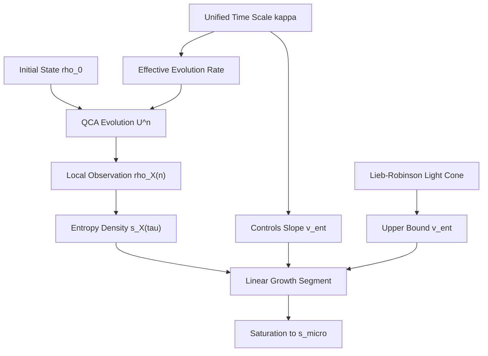
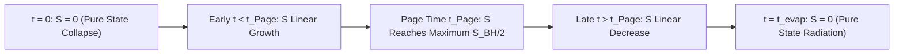
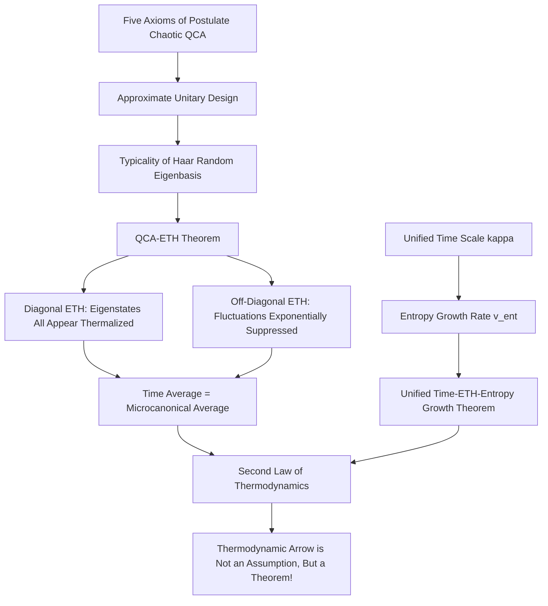

# Section 13.1 Quantum Chaos and Eigenstate Thermalization: The Quantum Origin of the Thermodynamic Arrow

> "Why can the unitary evolution of pure states in isolated quantum systems lead to thermodynamic equilibrium? This is not an assumption, but a theorem."
> —— ETH-Unified Time Scale Theorem in GLS Theory

## Introduction: Loschmidt Paradox and the Mystery of Quantum Thermalization

### Origin of the Problem

Imagine the following scenarios:

**Scenario 1**: You place a hot cup of coffee on a table. After a while, the coffee cools down, and heat diffuses into the air. According to the second law of thermodynamics, the entropy of the system increases.

**Scenario 2**: From a microscopic perspective, the coffee, air, and table constitute an isolated quantum system of $\sim 10^{26}$ particles. According to the Schrödinger equation, the evolution of this system is described by unitary operators $U(t) = e^{-iHt/\hbar}$, so the von Neumann entropy

$$
S(\rho(t)) = -\mathrm{Tr}(\rho(t)\log\rho(t))
$$

remains constant during evolution (unitary evolution keeps the entropy of pure states at zero and the entropy of mixed states unchanged).

**Contradiction**: Thermodynamic entropy increases, but quantum entropy remains constant! This is the famous **Loschmidt paradox**.

### Traditional "Explanations" and Their Deficiencies

Classical statistical mechanics provides several "explanations":

1. **Coarse-graining explanation**: Macroscopic observers can only measure coarse-grained observables (such as temperature, pressure) and cannot resolve microscopic details. Therefore, "macroscopic entropy" (coarse-grained Gibbs entropy) can increase, even though microscopic entropy remains constant.

2. **Ensemble explanation**: We do not know the exact microscopic state of the system and can only describe it using statistical ensembles (such as microcanonical ensemble, canonical ensemble). Ensemble entropy can increase.

3. **Law of large numbers explanation**: For systems with $\sim 10^{26}$ particles, "typical" microscopic states all look like equilibrium states macroscopically.

But these explanations all have **fundamental flaws**:

- **Problem 1**: Why do we need to introduce "coarse-graining" or "ensembles"? If the universe is a pure-state quantum system, why do we need to artificially forget information?

- **Problem 2**: Even accepting coarse-graining, why does coarse-grained entropy increase monotonically? What mechanism ensures that entropy does not fluctuate significantly on macroscopic time scales?

- **Problem 3**: How to strictly derive the second law of thermodynamics from first principles (i.e., the Schrödinger equation)?

### GLS Theory's Breakthrough: From Assumption to Theorem

GLS theory solves this century-old problem through three core concepts:

1. **Postulate Chaotic QCA (Quantum Cellular Automaton)**: Modeling the universe as a discrete spacetime quantum system satisfying specific axioms

2. **Eigenstate Thermalization Hypothesis (ETH)**: Within chaotic energy windows, matrix elements of local operators have special structures such that almost all eigenstates appear like thermal equilibrium states to local observers

3. **Unified Time Scale $\kappa(\omega)$**: Controls thermalization rate, unifying scattering phase, state density, and group delay into a single temporal master scale

The key breakthrough is: **ETH is not an assumption, but a theorem derived from the axioms of postulate chaotic QCA**. The origin of the thermodynamic arrow requires no additional assumptions; it is a necessary consequence of the trinity of QCA–unified time–ETH.

---

## 13.1.1 Quantum Cellular Automaton (QCA) Universe

### Basic Definition

**Definition 1.1 (QCA Universe Object)**

QCA universe $U_{\mathrm{qca}}$ is defined as a five-tuple:

$$
U_{\mathrm{qca}} = (\Lambda, \mathcal{H}_{\mathrm{cell}}, \mathcal{A}_{\mathrm{qloc}}, \alpha, \omega_0)
$$

where:

1. **Lattice** $\Lambda$: Countable connected graph (typically $\mathbb{Z}^d$ or its deformations), representing spatial discretization

2. **Cell Hilbert Space** $\mathcal{H}_{\mathrm{cell}}$: Each lattice point $x \in \Lambda$ carries a finite-dimensional Hilbert space $\mathcal{H}_x \cong \mathbb{C}^q$

3. **Quasi-local Algebra** $\mathcal{A}_{\mathrm{qloc}}$: Norm closure of all finitely supported operators

4. **Automorphism** $\alpha: \mathcal{A}_{\mathrm{qloc}} \to \mathcal{A}_{\mathrm{qloc}}$: $*$-automorphism satisfying:
   - **Translation Covariance**: Commutes with lattice translation group action
   - **Finite Propagation Radius $R$**: For any finite region $X \subset \Lambda$, if operator $O_X$ is supported on $X$, then $\alpha(O_X)$ is supported on
     $$
     X^{+R} = \{y \in \Lambda : \mathrm{dist}(y, X) \leq R\}
     $$
   - **Unitary Realization**: There exists a global unitary operator $U$ such that $\alpha(O) = U^\dagger O U$

5. **Initial State** $\omega_0$: State on $\mathcal{A}_{\mathrm{qloc}}$, giving the quantum state of the universe at time step $n=0$

**Analogy**:

QCA universe is like a giant chessboard:

- **Lattice $\Lambda$**: Squares of the chessboard
- **Cell Space $\mathcal{H}_{\mathrm{cell}}$**: Possible piece states on each square (empty, pawn, rook, knight...)
- **Automorphism $\alpha$**: All pieces move simultaneously according to rules at each "time step"
- **Finite Propagation Radius $R$**: Each piece can only affect squares within distance $R$ (similar to "light cone")
- **Translation Covariance**: Rules are the same on all squares, independent of position

### Evolution Operator for Finite Regions

For a finite region $\Omega \Subset \Lambda$, define finite-dimensional Hilbert space:

$$
\mathcal{H}_\Omega = \bigotimes_{x \in \Omega} \mathcal{H}_x
$$

Dimension $D_\Omega = q^{|\Omega|}$; for $q=2$ (qubits) and $|\Omega|=100$, this is already $2^{100} \approx 10^{30}$ dimensions!

Restricting $U$ to $\Omega$ gives the **Floquet operator** (discrete-time evolution operator) $U_\Omega$, with spectral decomposition:

$$
U_\Omega |\psi_n\rangle = e^{-i\varepsilon_n \Delta t} |\psi_n\rangle
$$

where $\varepsilon_n \in (-\pi/\Delta t, \pi/\Delta t]$ is the quasi-energy, and $|\psi_n\rangle$ is the Floquet eigenstate.

### Continuous Limit and Reconstruction of Quantum Field Theory

Under appropriate continuous limits ($\Delta t \to 0$, $|\Omega| \to \infty$), QCA can reconstruct:

1. **Dirac Equation**: One-dimensional quantum walks give massless fermions in the continuous limit
2. **Gauge Field Theory**: QCA in two or more dimensions construct $U(1)$, $SU(N)$ gauge fields through "lattice gauge theory"
3. **Spacetime Geometry**: Gravitational emergence corresponds to the long-wavelength effective theory of QCA

But under **finite regions and finite time**, QCA maintains discrete structure, which is the natural setting for discussing thermalization and ETH.

---

## 13.1.2 Postulate Chaotic QCA: The Watershed from Integrable to Chaotic

Not all QCA exhibit chaotic behavior. For example:

- **Integrable QCA**: Existence of many local conserved quantities, long-time evolution tends to generalized Gibbs ensemble, **does not satisfy ETH**
- **Many-Body Localized (MBL) QCA**: Under strong disorder, the system retains memory of initial state, **incomplete thermalization**
- **Chaotic QCA**: Fast "scrambling," almost all eigenstates appear like thermal equilibrium states to local observers, **satisfies ETH**

GLS theory characterizes "postulate chaotic QCA" through the following axiom system:

**Definition 1.2 (Postulate Chaotic QCA)**

A translation-invariant QCA $U$ is called a postulate chaotic QCA if it satisfies:

**Axiom 1 (Finite Propagation Radius and Locality)**:
There exists an integer $R$ such that for any finite $X \subset \Lambda$, we have $\alpha(\mathcal{A}_X) \subset \mathcal{A}_{X^{+R}}$

**Axiom 2 (Local Circuit Representation)**:
On any finite region $\Omega$, $U_\Omega$ can be written as a finite-depth local quantum circuit:

$$
U_\Omega = \prod_{\ell=1}^D U_\ell, \quad U_\ell = \bigotimes_j U_{\ell,j}
$$

where each gate $U_{\ell,j}$ acts on a finite subset $X_{\ell,j} \subset \Omega$ and commutes with all gates separated by more than a finite distance

**Axiom 3 (Approximate Unitary Design)**:
There exists $t_0 \in \mathbb{N}$ and functions $\epsilon_t(|\Omega|)$ (exponentially decaying with $|\Omega|$) such that for any $t \leq t_0$, the unitary family generated by $U_\Omega$ forms an approximate $t$-design with accuracy $\epsilon_t$ on $t$-th moments:

$$
\left\|
\mathbb{E}_{U_\Omega}[P(U_\Omega, U_\Omega^\dagger)] - \mathbb{E}_{U \sim \mathrm{Haar}}[P(U, U^\dagger)]
\right\| \leq \epsilon_t(|\Omega|)
$$

for any polynomial $P$ of degree at most $t$

**Axiom 4 (No Additional Extensive Conserved Quantities)**:
Except for possibly a few global quantum numbers (such as total particle number, spin, etc.), there are no independent extensive local conserved quantities in the system

**Axiom 5 (Thermalization Energy Window)**:
There exists an energy window $I \subset (-\pi/\Delta t, \pi/\Delta t]$ such that the number of eigenstates within it grows exponentially with $|\Omega|$:

$$
D_I(\Omega) \sim e^{s(\varepsilon)|\Omega|}
$$

and energy level degeneracy only produces finitely many symmetry multiplicities

### Physical Meaning of Unitary Design

**What is a $t$-design?**

A $t$-design is a distribution of unitary operators whose first $t$ moments are the same as those of Haar random unitaries. For $t=2$, this means:

$$
\mathbb{E}[U_{ij}U_{k\ell}^*] = \mathbb{E}_{\mathrm{Haar}}[U_{ij}U_{k\ell}^*]
$$

i.e., "second-order statistical properties are the same as completely random unitaries."

**Why is unitary design needed?**

Brandão-Harrow-Horodecki (2016) proved: On a one-dimensional chain, local random circuits of depth $\mathcal{O}(t^{10}n^2)$ can achieve $t$-design. This guarantees:

1. **Randomness of eigenstates**: Eigenvectors are "close to uniformly distributed" in Hilbert space
2. **Decay of correlation functions**: Off-diagonal matrix elements are exponentially small with volume
3. **Fast scrambling**: Information diffuses throughout the system in polynomial time

In postulate chaotic QCA, unitary design properties come from Axiom 3, not explicit randomization—this is **emergent randomness** from deterministic evolution.

### Examples of Postulate Chaotic QCA

**Example 1: Brickwork QCA**

Take $\Lambda = \mathbb{Z}$, each cell $\mathcal{H}_x = \mathbb{C}^2$. Define a two-step update:

1. **Even-odd layer**: Apply two-body gates $U_{\mathrm{even}}$ to all $(2j, 2j+1)$ pairs
2. **Odd-even layer**: Apply two-body gates $U_{\mathrm{odd}}$ to all $(2j+1, 2j+2)$ pairs

Global evolution:

$$
U = U_{\mathrm{odd}} U_{\mathrm{even}} = \left(\bigotimes_j U_{\mathrm{odd},j}\right) \left(\bigotimes_j U_{\mathrm{even},j}\right)
$$

If $U_{\mathrm{even}}, U_{\mathrm{odd}}$ are chosen from a universal gate set generating $SU(4)$, then the postulate chaotic QCA axioms are satisfied.

**Example 2: Floquet Non-Integrable Spin Chain**

Consider a periodically driven Heisenberg chain:

$$
H(t) = \sum_j \left[\vec{S}_j \cdot \vec{S}_{j+1} + h_j(t) S_j^z\right]
$$

where $h_j(t)$ is a quasi-random periodic field that breaks integrability. The one-period Floquet operator

$$
U = \mathcal{T}\exp\left(-i\int_0^T H(t)\ dt\right)
$$

is equivalent to a local circuit in the high-frequency limit, satisfying postulate chaotic QCA.

---

## 13.1.3 Eigenstate Thermalization Hypothesis (ETH): From Deutsch to GLS

### History and Motivation of ETH

**1991**: J. M. Deutsch first proposed the idea of "quantum state thermalization": Even if the system is in a pure state $|\psi\rangle$, the expectation value of local observables $O$ should approach thermal equilibrium values.

**1994**: M. Srednicki proposed the precise form of ETH from random matrix theory:

$$
\langle E_\alpha | O | E_\beta \rangle = O(\bar{E})\delta_{\alpha\beta} + e^{-S(\bar{E})/2} f_O(\bar{E}, \omega) R_{\alpha\beta}
$$

where:
- $\bar{E} = (E_\alpha + E_\beta)/2$: Mean energy
- $\omega = E_\alpha - E_\beta$: Energy difference
- $S(\bar{E})$: Microcanonical entropy ($\sim s(\bar{E})|\Omega|$, proportional to volume)
- $R_{\alpha\beta}$: Gaussian-like random numbers with zero mean and unit variance
- $O(\bar{E})$, $f_O(\bar{E}, \omega)$: Smooth functions

**Key Insights**:

1. **Diagonal ETH** ($\alpha = \beta$): All eigenstates within the energy window give almost identical local observable expectation values $O(\bar{E})$, with differences exponentially small in volume

2. **Off-diagonal ETH** ($\alpha \neq \beta$): Off-diagonal matrix elements are exponentially suppressed by $e^{-S(\bar{E})/2}$, ensuring minimal temporal fluctuations

### Formal Definition of Discrete-Time ETH

In the QCA framework, we use Floquet eigenstates instead of Hamiltonian eigenstates:

**Definition 1.3 (Discrete-Time ETH)**

Let $U_\Omega$ be the Floquet operator on finite region $\Omega$ with spectral decomposition:

$$
U_\Omega |\psi_n\rangle = e^{-i\varepsilon_n \Delta t} |\psi_n\rangle
$$

For given energy window center $\varepsilon$ and width $\delta > 0$, define the quasi-energy shell subspace:

$$
\mathcal{H}_\Omega(\varepsilon, \delta) = \mathrm{span}\{|\psi_n\rangle : \varepsilon_n \in (\varepsilon - \delta, \varepsilon + \delta)\}
$$

with dimension $D_{\varepsilon,\delta} \sim e^{s(\varepsilon)|\Omega|}$.

We say $U_\Omega$ satisfies discrete-time ETH on energy window $I$ for local operator family $\{O_X\}$ if there exist constants $c > 0$ and smooth functions $O_X(\varepsilon)$, $\sigma_X(\varepsilon)$ such that:

**(i) Diagonal ETH**: For the vast majority of $n$ ($\varepsilon_n \in I$),

$$
\langle \psi_n | O_X | \psi_n \rangle = O_X(\varepsilon_n) + \mathcal{O}(e^{-c|\Omega|})
$$

**(ii) Off-diagonal ETH**: For almost all $m \neq n$ with $\bar{\varepsilon} = (\varepsilon_m + \varepsilon_n)/2 \in I$,

$$
|\langle \psi_m | O_X | \psi_n \rangle| \leq e^{-S(\bar{\varepsilon})/2} \sigma_X(\bar{\varepsilon})
$$

where $S(\bar{\varepsilon}) \sim s(\bar{\varepsilon})|\Omega|$ is the shell microcanonical entropy.

### Physical Consequences of ETH

**Consequence 1: Time Average Equals Microcanonical Average**

Consider initial state $|\psi_0\rangle = \sum_n c_n |\psi_n\rangle$ expanded within energy window $I$. Time evolution:

$$
|\psi(t)\rangle = U_\Omega^t |\psi_0\rangle = \sum_n c_n e^{-i\varepsilon_n t\Delta t} |\psi_n\rangle
$$

Time average of local observables:

$$
\overline{\langle O_X \rangle} = \lim_{N\to\infty} \frac{1}{N}\sum_{t=0}^{N-1} \langle \psi(t) | O_X | \psi(t) \rangle = \sum_n |c_n|^2 \langle \psi_n | O_X | \psi_n \rangle
$$

By diagonal ETH, if $|c_n|^2$ is approximately constant within energy window $I$, then:

$$
\overline{\langle O_X \rangle} \approx \langle O_X \rangle_{\mathrm{micro}}(\varepsilon) := D_I^{-1} \sum_{\varepsilon_n \in I} \langle \psi_n | O_X | \psi_n \rangle
$$

**Consequence 2: Temporal Fluctuations Exponentially Suppressed**

Temporal fluctuations:

$$
\delta O_X(t) = \langle O_X \rangle(t) - \overline{\langle O_X \rangle} = \sum_{m \neq n} c_m^* c_n e^{i(\varepsilon_m - \varepsilon_n)t\Delta t} \langle \psi_m | O_X | \psi_n \rangle
$$

Their variance:

$$
\overline{|\delta O_X|^2} \leq \sum_{m \neq n} |c_m|^2 |c_n|^2 |\langle \psi_m | O_X | \psi_n \rangle|^2
$$

By off-diagonal ETH:

$$
\overline{|\delta O_X|^2} \lesssim e^{-S(\bar{\varepsilon})} \sim e^{-s(\bar{\varepsilon})|\Omega|}
$$

That is, fluctuations decay exponentially with volume!

**Consequence 3: Almost All Eigenstates Appear "Thermalized"**

Diagonal ETH guarantees: Except for a few eigenstates near energy window boundaries, almost all eigenstates $|\psi_n\rangle$ give the same expectation value $O_X(\varepsilon_n)$ to local observers, making it impossible to distinguish "which eigenstate."

This explains why even when the system is in a specific pure eigenstate, macroscopic observers still see thermal equilibrium—because **thermal equilibrium is not a property of the state, but a property of observation**.

---

## 13.1.4 QCA–ETH Main Theorem: From Axioms to Theorem

Now we state the core theorem of GLS theory:

**Theorem 1.4 (QCA–ETH Theorem)**

Let $U$ be a postulate chaotic QCA, $\Omega \Subset \Lambda$ be a sufficiently large finite region, $U_\Omega$ be the unitary operator restricted to $\Omega$, and $\{|\psi_n\rangle, \varepsilon_n\}$ be its Floquet eigenpairs. Then there exists an energy window $I$ and constant $c > 0$ such that for any local operator $O_X$ with finite support $X \subset \Omega$, there exists a smooth function $O_X(\varepsilon)$ satisfying:

**(i) Diagonal ETH**: For the vast majority of $n$ within the energy window ($\varepsilon_n \in I$),

$$
\langle \psi_n | O_X | \psi_n \rangle = O_X(\varepsilon_n) + \mathcal{O}(e^{-c|\Omega|})
$$

**(ii) Off-diagonal ETH**: Second moments satisfy

$$
\mathbb{E}[|\langle \psi_m | O_X | \psi_n \rangle|^2] \leq e^{-S(\bar{\varepsilon})} g_O(\bar{\varepsilon}, \omega)
$$

where $\bar{\varepsilon} = (\varepsilon_m + \varepsilon_n)/2$, $S(\bar{\varepsilon}) \sim s(\bar{\varepsilon})|\Omega|$, and $g_O$ is bounded

**(iii) Thermalization**: If initial state $|\psi_0\rangle$ has narrow energy distribution within energy window $I$, then time average satisfies

$$
\overline{\langle O_X \rangle} = \langle O_X \rangle_{\mathrm{micro}}(\varepsilon) + \mathcal{O}(e^{-c|\Omega|})
$$

and temporal fluctuations are exponentially suppressed by off-diagonal ETH indicators.

### Key Steps in Theorem Proof

**Step 1: From Unitary Design to Haar Typicality**

By Axiom 3 (approximate unitary design), for sufficiently large $|\Omega|$, the difference between $U_\Omega$ and Haar random unitaries on $t_0$-th moments is at most $\epsilon_{t_0}(|\Omega|) \sim e^{-\tilde{c}|\Omega|}$.

Key lemma (ETH typicality of Haar random eigenbasis):

**Lemma 1.5**: Let $U \sim \mathrm{Haar}$ be a Haar random unitary, $\{|\psi_n\rangle\}$ be its eigenbasis, and $O_X$ be a local operator supported on $|X| \ll |\Omega|$. Then:

(a) $\mathbb{E}[\langle \psi_n | O_X | \psi_n \rangle] = \mathrm{Tr}(O_X)/D_\Omega$ is independent of energy level $n$

(b) $\mathrm{Var}[\langle \psi_n | O_X | \psi_n \rangle] \sim \mathcal{O}(D_\Omega^{-1})$

(c) By Levy concentration inequality,

$$
\mathbb{P}\left[
|\langle \psi_n | O_X | \psi_n \rangle - \mathrm{Tr}(O_X)/D_\Omega| > \epsilon
\right] \leq 2\exp(-c D_\Omega \epsilon^2 / \|O_X\|^2)
$$

**Proof Sketch**: Use Weingarten function representation of Haar integrals and concentration inequalities for Lipschitz functions. $\square$

**Step 2: Transfer from Haar Typicality to QCA**

Using approximate unitary design, transfer statistical properties from the Haar case to $U_\Omega$. For diagonal elements:

Take $t_0 \geq 2$, consider the function

$$
P(U) = \langle \psi_n(U) | O_X | \psi_n(U) \rangle
$$

Under approximate $t_0$-design, the first two moments of this function differ from the Haar case by at most $\epsilon_{t_0}(|\Omega|)$. Combined with estimates from Lemma 1.5, we get:

$$
\left|
\langle \psi_n | O_X | \psi_n \rangle - \langle O_X \rangle_{\mathrm{micro}}(\varepsilon_n)
\right| \leq C_1 e^{-\tilde{c}|\Omega|}
$$

with high probability.

Similarly, second-moment estimates for off-diagonal elements transfer from the Haar case ($\mathcal{O}(D_\Omega^{-1})$) to QCA.

**Step 3: From Eigenstate ETH to Thermalization**

Using diagonal ETH, time average can be expressed as:

$$
\overline{\langle O_X \rangle} = \sum_n |c_n|^2 \langle \psi_n | O_X | \psi_n \rangle \approx \sum_n |c_n|^2 O_X(\varepsilon_n)
$$

If the initial state energy distribution is concentrated in a narrow energy window $I$, i.e., $|c_n|^2$ is approximately constant within $I$, then:

$$
\overline{\langle O_X \rangle} \approx D_I^{-1} \sum_{\varepsilon_n \in I} O_X(\varepsilon_n) = \langle O_X \rangle_{\mathrm{micro}}(\varepsilon)
$$

Temporal fluctuation estimates come from off-diagonal ETH second-moment bounds. $\square$

### Profound Significance of the Theorem

Theorem 1.4 shows: **In the postulate chaotic QCA framework, ETH is not an additional assumption, but a theorem derived from axioms.** This elevates "thermalization" from "reasonable guess" to "mathematical necessity."

**Analogy**:

Imagine shuffling a deck of cards:

- **Integrable system**: Each shuffle only exchanges fixed pairs of cards, many card orders remain unchanged (corresponding to many conserved quantities)
- **MBL system**: Some cards are "pinned" (localized), no matter how you shuffle, they don't participate in exchange
- **Postulate chaotic QCA**: Each shuffle uses a "perfect shuffle algorithm" (unitary design), after polynomial steps, any local observer cannot distinguish "which shuffle" (corresponding to ETH)

The key is: perfect shuffling doesn't require introducing true randomness, just sufficiently complex deterministic rules!

---

## 13.1.5 Unified Time Scale and Thermalization Rate

ETH tells us "the system will thermalize," but **how long does thermalization take**? This is where the unified time scale $\kappa(\omega)$ comes into play.

### Triple Definition of Unified Time Scale (Review)

Reviewing the core of GLS theory: unified time scale has three equivalent definitions:

$$
\kappa(\omega) = \frac{\varphi'(\omega)}{\pi} = \rho_{\mathrm{rel}}(\omega) = \frac{1}{2\pi}\mathrm{tr}Q(\omega)
$$

where:
- $\varphi(\omega)$: Scattering half-phase (phase of relative scattering determinant)
- $\rho_{\mathrm{rel}}(\omega)$: Relative state density (derivative of spectral shift function)
- $Q(\omega) = -iS^\dagger(\omega)\partial_\omega S(\omega)$: Wigner-Smith group delay matrix

In the QCA framework, scattering matrix $S(\omega)$ is constructed from Floquet operator $U_\Omega$ via Fourier transform:

$$
S(\omega) = \sum_{m,n} e^{i\omega(m-n)} U_\Omega^{m-n}
$$

(Formal definition, needs to be understood in distributional sense)

### Unified Time–ETH–Entropy Growth Theorem

**Theorem 1.6 (Unified Time–ETH–Entropy Growth)**

Under the assumptions of postulate chaotic QCA and Theorem 1.4, there exist functions $v_{\mathrm{ent}}(\varepsilon) > 0$ and constants $c' > 0$ such that for any finite $X \subset \Omega$, in the unified time scale interval $\tau \in [0, \tau_{\mathrm{th}}]$, the reduced state

$$
\rho_X(\tau) = \mathrm{Tr}_{\Omega \setminus X} \rho(\tau)
$$

has entropy density

$$
s_X(\tau) = |X|^{-1} S(\rho_X(\tau))
$$

satisfying:

$$
s_X(\tau) \geq s_0 + v_{\mathrm{ent}}(\varepsilon) \frac{\tau}{\ell_{\mathrm{eff}}} - \mathcal{O}(e^{-c'|\Omega|})
$$

and tending to $s_{\mathrm{micro}}(\varepsilon)$ after $\tau \gtrsim \tau_{\mathrm{th}}$.

where:
- $\ell_{\mathrm{eff}}$: Effective length scale determined by QCA propagation radius $R$ and Lieb-Robinson velocity
- $v_{\mathrm{ent}}(\varepsilon)$: Can be written as a function of the average of unified scale density $\kappa(\omega)$ over energy window $I$ and local interaction strength:

$$
v_{\mathrm{ent}}(\varepsilon) \propto \bar{\kappa}(\varepsilon) J_{\mathrm{loc}}
$$

where $\bar{\kappa}(\varepsilon) = (|I|)^{-1} \int_I \kappa(\omega)\ d\omega$, and $J_{\mathrm{loc}}$ is the local interaction strength.

### Physical Intuition of Theorem Proof

**Step 1: QCA Light Cone and Information Propagation**

Postulate chaotic QCA has finite propagation radius $R$, with a light cone structure similar to Lieb-Robinson: operators supported on $X$ have support restricted to $X^{+Rn}$ after time step $n$.

This guarantees a **linear light-speed upper bound** for entanglement generation and entropy growth:

$$
\frac{dS(\rho_X(t))}{dt} \lesssim v_{\mathrm{LR}} |X|
$$

where $v_{\mathrm{LR}} \sim R/\Delta t$ is the Lieb-Robinson velocity.

**Step 2: Approximate Unitary Design and Entanglement Generation**

Under approximate unitary design, repeated action of $U_\Omega$ generates approximately Haar-random entangled states in local Hilbert space. Using decoupling theorem:

For any initial state family $\{\rho_0\}$, as long as the energy distribution is located within chaotic energy window $I$ and local correlation length is finite, then after time $\mathcal{O}(|X|)$, $\rho_X(\tau)$ approaches the partial trace of the shell microcanonical state.

**Step 3: Introduction of Unified Time Scale**

Relate discrete time step $n$ to unified time $\tau$:

$$
\tau = \bar{\kappa}(\varepsilon)^{-1} n \Delta t
$$

Since $\bar{\kappa}(\varepsilon)$ is related to state density, relaxation time and entropy growth rate can be expressed as functions of $\kappa$:

$$
v_{\mathrm{ent}}(\varepsilon) = \frac{d s_X}{d\tau} \propto \bar{\kappa}(\varepsilon) J_{\mathrm{loc}}
$$

This gives the **quantitative relationship** between entropy growth rate and unified time scale. $\square$

### Physical Picture: Unified Time Controls Thermalization

**Key Insights**:

1. **Unified time scale is not a passive label**: $\kappa(\omega)$ actively controls entropy production rate $v_{\mathrm{ent}}(\varepsilon)$

2. **Quantitative prediction of thermalization time scale**: Thermalization time

$$
\tau_{\mathrm{th}} \sim \frac{s_{\mathrm{micro}} - s_0}{v_{\mathrm{ent}}} \sim \frac{1}{\bar{\kappa}(\varepsilon) J_{\mathrm{loc}}}
$$

Thermalization slows down when interactions are sparse ($J_{\mathrm{loc}}$ small) or state density is low ($\bar{\kappa}$ small)

3. **Origin of macroscopic irreversibility**: Under unified time scale, monotonic growth of entropy density is a **structural result**, requiring no introduction of "temporal arrow assumption"

---

## 13.1.6 Wigner-Dyson Spectral Statistics: Fingerprint of Quantum Chaos

ETH describes properties of eigenstates, but what about **statistical distribution of eigenenergies**? This is the subject of random matrix theory (RMT).

### Energy Level Spacing Distribution

For energy level sequence $\{\varepsilon_1 \leq \varepsilon_2 \leq \cdots \leq \varepsilon_D\}$ ($D = D_\Omega = q^{|\Omega|}$), define nearest-neighbor spacing:

$$
s_n = \varepsilon_{n+1} - \varepsilon_n
$$

Under random Hamiltonians, spacing distribution $P(s)$ depends on symmetry class:

**1. Gaussian Orthogonal Ensemble (GOE, time-reversal symmetric)**:

$$
P_{\mathrm{GOE}}(s) = \frac{\pi}{2}s \exp\left(-\frac{\pi}{4}s^2\right)
$$

**2. Gaussian Unitary Ensemble (GUE, broken time-reversal)**:

$$
P_{\mathrm{GUE}}(s) = \frac{32}{\pi^2}s^2 \exp\left(-\frac{4}{\pi}s^2\right)
$$

**3. Gaussian Symplectic Ensemble (GSE, spin-orbit coupling)**:

$$
P_{\mathrm{GSE}}(s) \propto s^4 \exp\left(-\frac{64}{9\pi}s^2\right)
$$

Compare with **Poisson distribution** (integrable systems):

$$
P_{\mathrm{Poisson}}(s) = e^{-s}
$$

**Key Difference**:

- **Wigner-Dyson distribution**: As $s \to 0$, $P(s) \sim s^\beta$ ($\beta = 1, 2, 4$), exhibiting **level repulsion**
- **Poisson distribution**: $P(0) = 1$, energy levels can be arbitrarily close, corresponding to "clustering" in integrable systems

### CUE Statistics for Floquet Systems

For Floquet systems (like QCA), evolution operator $U_\Omega$ is a unitary matrix with eigenvalues on the unit circle in the complex plane:

$$
\lambda_n = e^{-i\theta_n}, \quad \theta_n \in (-\pi, \pi]
$$

The corresponding random matrix ensemble is **Circular Unitary Ensemble (CUE)**, with energy level statistics:

$$
P_{\mathrm{CUE}}(s) = \frac{32}{\pi^2}s^2 \exp\left(-\frac{4}{\pi}s^2\right)
$$

(Same functional form as GUE, as both belong to the same symmetry class)

### Spectral Form Factor and Ramp-Plateau Structure

Define normalized spectral form factor:

$$
K(t) = D_\Omega^{-1} |\mathrm{tr}U_\Omega^t|^2 = D_\Omega^{-1} \left|\sum_{n=1}^{D_\Omega} e^{-i\theta_n t}\right|^2
$$

For CUE random matrices, $K(t)$ exhibits characteristic **ramp-plateau structure**:

$$
K_{\mathrm{CUE}}(t) = \begin{cases}
t/D_\Omega & \text{if } t \ll D_\Omega \quad (\text{ramp}) \\
1 & \text{if } t \gg D_\Omega \quad (\text{plateau})
\end{cases}
$$

**Physical Interpretation**:

- **Ramp** ($t \ll D_\Omega$): In short time, phases $\{\theta_n t\}$ are approximately randomly distributed, square of trace grows linearly on average, corresponding to **fast scrambling**
- **Plateau** ($t \gg D_\Omega$): After long time, the system "remembers" the discrete spectrum structure (Poincaré recurrence), square of trace saturates to $\mathcal{O}(1)$

### CUE Convergence Theorem for QCA Energy Level Statistics

**Theorem 1.7 (CUE Behavior of QCA Energy Level Statistics)**

Under the assumptions of Theorem 1.4, the quasi-energy spectrum $\{\theta_n = \varepsilon_n \Delta t\}$ of Floquet operator $U_\Omega$ on finite region $\Omega$, after appropriate unfolding, has nearest-neighbor spacing distribution converging to Wigner-Dyson distribution of CUE in the $|\Omega| \to \infty$ limit:

$$
P(s) \to P_{\mathrm{CUE}}(s) = \frac{32}{\pi^2}s^2 \exp\left(-\frac{4}{\pi}s^2\right)
$$

Simultaneously, normalized spectral form factor exhibits "ramp-plateau" structure after appropriate rescaling, consistent with universal spectral fluctuations of CUE.

**Proof Sketch**:

Using approximate unitary design properties, nearest-neighbor spacing distribution and spectral form factor can be expressed as symmetric polynomial functions of eigenphases, further expressed as polynomials of finite-order traces $\mathrm{tr}U_\Omega^k$. Since postulate chaotic QCA is an approximate unitary design at order $t_0$, these trace polynomials differ from corresponding CUE quantities by at most $\epsilon_{t_0}(|\Omega|) \sim e^{-c|\Omega|}$. In the $|\Omega| \to \infty$ limit, differences tend to zero, giving CUE statistics. $\square$

### Experimental Signatures of Quantum Chaos

In actual systems (such as superconducting qubits, trapped ions, cold atoms), quantum chaos can be verified through:

**Method 1: Direct Measurement of Energy Level Spacing**

- Prepare multiple eigenstates of the system on finite region $\Omega$
- Measure quasi-energies $\varepsilon_n$
- Calculate spacing distribution $P(s)$ and compare with Wigner-Dyson predictions

**Method 2: Measure Spectral Form Factor**

- Prepare initial state, evolve to time $t$
- Measure fidelity $F(t) = |\langle \psi_0 | \psi(t) \rangle|^2$
- Average over multiple initial states to get statistics of $K(t) \sim F(t)$
- Test ramp-plateau structure

**Method 3: Out-of-Time-Order Correlator (OTOC)**

$$
C(t) = \langle [W(t), V(0)]^2 \rangle
$$

where $W(t) = U^\dagger W U$, and $V$ is a local operator. Exponential growth of OTOC $C(t) \sim e^{\lambda_L t}$ (Lyapunov exponent $\lambda_L > 0$) is another signature of quantum chaos.

---

## 13.1.7 Application I: Black Hole Information Paradox and Page Curve

### Problem Background

**Hawking Radiation and Information Loss**:

In 1974, Hawking discovered that black holes radiate thermal particles with temperature:

$$
T_H = \frac{\hbar c^3}{8\pi G M k_B}
$$

After time $t_{\mathrm{evap}} \sim (M/M_\odot)^3 \times 10^{67}$ years, the black hole completely evaporates.

Problem: If the black hole initially formed from pure-state collapse, and Hawking radiation is thermal (maximally mixed state), then pure state evolves to mixed state, **violating unitarity**!

**Page Curve**:

In 1993, Don Page proposed: If black hole evaporation process maintains unitarity, then the entanglement entropy of the black hole+radiation system should follow specific evolution:

where $t_{\mathrm{Page}} \sim t_{\mathrm{evap}}/2$, and $S_{\mathrm{BH}} = A/(4G\hbar)$ is the Bekenstein-Hawking entropy.

### GLS Theory's Explanation: ETH and Black Hole Interior

GLS theory explains the Page curve by modeling the black hole interior as a **postulate chaotic QCA** and using ETH:

**Key Ideas**:

1. **Black Hole Interior as QCA**: Quantum degrees of freedom within the horizon constitute a system satisfying postulate chaotic QCA axioms, with cell scale $\ell_{\mathrm{cell}} \sim \ell_P$ (Planck length)

2. **Hawking Radiation as Local Observation**: Hawking radiation measured by external observers corresponds to expectation values of local operators in QCA

3. **ETH Guarantees Thermalization**: By Theorem 1.4, almost all eigenstates appear like thermal radiation to local observers, even if the black hole is in a specific pure eigenstate

4. **Page Curve from Entanglement Entropy Growth**: Using Theorem 1.6 (unified time–ETH–entropy growth), entanglement entropy of the radiation subsystem grows linearly under unified time scale until reaching $S_{\mathrm{BH}}/2$ (corresponding to Page time), then begins to decrease

### Quantitative Calculation

**Early Stage** ($t < t_{\mathrm{Page}}$):

Radiation subsystem size $|X_{\mathrm{rad}}(t)| \sim (c t/\ell_{\mathrm{cell}})^3$, by Theorem 1.6:

$$
S_{\mathrm{rad}}(t) \approx v_{\mathrm{ent}}(\varepsilon) \frac{\tau}{\ell_{\mathrm{eff}}} |X_{\mathrm{rad}}(t)| \sim t \quad (t < t_{\mathrm{Page}})
$$

**Page Time**:

When the Hilbert space dimension of the radiation subsystem is comparable to that of the black hole interior:

$$
\dim \mathcal{H}_{\mathrm{rad}}(t_{\mathrm{Page}}) \sim \dim \mathcal{H}_{\mathrm{BH}} \sim e^{S_{\mathrm{BH}}}
$$

At this point, entanglement entropy reaches maximum $S_{\mathrm{BH}}/2$.

**Late Stage** ($t > t_{\mathrm{Page}}$):

Black hole interior dimension decreases (with mass evaporation), radiation system gradually becomes the "dominant subsystem," entanglement entropy decreases:

$$
S_{\mathrm{rad}}(t) \approx S_{\mathrm{BH}}(t) \quad (t > t_{\mathrm{Page}})
$$

Finally $S_{\mathrm{rad}}(t_{\mathrm{evap}}) = 0$, corresponding to pure-state radiation.

### Comparison with Holographic Principle

In **AdS/CFT correspondence**, the Page curve is calculated through **Quantum Extremal Surfaces (QES)**, giving results consistent with the Page curve (Penington 2020, Almheiri et al. 2020).

**Advantages of GLS Theory**:

1. **Does not rely on holographic correspondence**: Works directly in 4-dimensional spacetime, no need for additional AdS/CFT assumptions
2. **Role of unified time scale**: $\kappa(\omega)$ controls the slope of the Page curve, giving quantitative predictions
3. **Universality**: Applies to any system satisfying postulate chaotic QCA, not limited to asymptotically AdS spacetimes

---

## 13.1.8 Application II: Decoherence and Thermalization in Quantum Computing

### Noise Problem in Quantum Computing

One of the core challenges facing quantum computers is **decoherence**: Interaction between qubits and environment causes quantum information loss. In open system framework, system evolution is described by Lindblad equation:

$$
\frac{d\rho}{dt} = -i[H, \rho] + \sum_\mu \left(L_\mu \rho L_\mu^\dagger - \frac{1}{2}\{L_\mu^\dagger L_\mu, \rho\}\right)
$$

But in sufficiently isolated quantum processors (such as superconducting qubits, trapped ions), the system can be approximated as an **isolated system**, and the dominant "decoherence" mechanism is actually **intrinsic thermalization**.

### Decoherence from ETH Perspective

**Key Observation**:

In quantum computing, we care about **local observables** (such as single-qubit, two-qubit gate fidelity), not global pure states. From ETH perspective:

1. **Initial State Preparation**: Prepare system in a specific pure state $|\psi_0\rangle$ (e.g., $|0\rangle^{\otimes N}$)

2. **Quantum Gate Operations**: Apply a series of unitary gates $U_{\mathrm{circ}} = U_L \cdots U_2 U_1$, ideally should get target state $|\psi_{\mathrm{target}}\rangle = U_{\mathrm{circ}}|\psi_0\rangle$

3. **Actual Evolution**: Due to imperfect gates, control errors, parasitic interactions, actual evolution operator $U_{\mathrm{actual}} \neq U_{\mathrm{ideal}}$

4. **ETH Prediction**: If actual evolution satisfies postulate chaotic QCA (such as random circuit model), then final state appears close to microcanonical state to local observers, losing memory of $|\psi_0\rangle$

### Quantifying Decoherence Time

Using Theorem 1.6, decoherence time scale is:

$$
\tau_{\mathrm{deph}} \sim \frac{1}{v_{\mathrm{ent}}(\varepsilon) \ell_{\mathrm{eff}}^{-1}} \sim \frac{1}{\bar{\kappa}(\varepsilon) J_{\mathrm{noise}}}
$$

where $J_{\mathrm{noise}}$ is the noise interaction strength.

**Actual Parameter Estimates**:

For superconducting qubits ($J_{\mathrm{noise}} \sim 2\pi \times 1\ \mathrm{MHz}$, $\bar{\kappa} \sim 10^9\ \mathrm{Hz}^{-1}$), we get:

$$
\tau_{\mathrm{deph}} \sim \frac{1}{10^9 \times 2\pi \times 10^6} \sim 100\ \mu\mathrm{s}
$$

This matches the order of magnitude of experimentally observed $T_2$ time (transverse decoherence time)!

### ETH Explanation of Quantum Error Correction

**Surface codes** and other topological quantum error-correcting codes combat decoherence through:

1. **Protection of Logical Subspace**: Encode quantum information in topologically protected logical subspace

2. **Suppression of Local Operators**: Errors (such as single-qubit flip, phase flip) correspond to local operators, matrix elements in logical subspace are exponentially suppressed

3. **ETH Failure**: Effective Hamiltonian corresponding to logical subspace **does not satisfy ETH** (due to existence of topological conserved quantities), thus avoiding thermalization

From GLS theory perspective, successful quantum error-correcting codes must **break Axiom 4 of postulate chaotic QCA (no additional conserved quantities)**, introducing sufficient topological or symmetry constraints.

---

## 13.1.9 Frontier Problems and Future Directions

### Unsolved Problems

**Problem 1: Postulate Chaotic QCA in Gravitational Systems**

Can the framework of postulate chaotic QCA be extended to systems including dynamical gravity? Key challenges:

- Non-locality of gravity (long-range interactions) may break finite propagation radius axiom
- Relationship between spacetime emergence and QCA evolution is unclear

**Problem 2: Precise Location of MBL Phase Transition**

In strongly disordered systems, there is a phase transition between ETH phase (thermalization) and MBL phase (localization). What is the relationship between transition point position $W_c$ and dimension $d$, interaction strength?

**Problem 3: Sachdev-Ye-Kitaev (SYK) Model and QCA**

SYK model is a famous quantum chaos model, dual to holographic gravity. Can chaotic properties of SYK model (such as Lyapunov exponent $\lambda_L = 2\pi T/\hbar$) be derived from GLS theory's QCA framework?

**Problem 4: ETH Generalization for Non-Equilibrium States**

Theorems 1.4 and 1.6 assume systems are within chaotic energy windows. For strongly driven, far-from-equilibrium systems, how should ETH be modified?

### Possible Research Directions

**Direction 1: Numerical Verification of Postulate Chaotic QCA**

- Construct explicit QCA models satisfying five axioms
- Numerically calculate eigenstate matrix element distributions, verify diagonal and off-diagonal ETH
- Measure energy level spacing distributions, test Wigner-Dyson statistics

**Direction 2: Strict Derivation of Continuous Limit**

- Prove: Under appropriate limits of $\Delta t \to 0$, $|\Omega| \to \infty$, postulate chaotic QCA reconstructs quantum field theory
- Establish correspondence between QCA renormalization group flow and field theory beta function

**Direction 3: Connection with Integrated Information Theory (IIT)**

- ETH guarantees "integration" of local observations (information cannot be obtained from individual subsystems)
- Can IIT's $\Phi$ value (integrated information) be quantitatively related to ETH's off-diagonal matrix element suppression?

**Direction 4: ETH-Inspired Quantum Computing Algorithms**

- Use ETH to design "self-thermalizing" quantum algorithms: system spontaneously evolves near target state
- Optimize thermalization rate by tuning $\bar{\kappa}(\varepsilon)$ (e.g., changing gate sets, interaction topology)

---

## 13.1.10 Summary: Quantum Origin of the Thermodynamic Arrow

Let us return to the question at the beginning of this section: **Why can isolated quantum systems thermalize?**

GLS theory's answer is:

**Core Insights**:

1. **ETH is not an assumption, but a theorem**: Derived from axioms of postulate chaotic QCA, thermalization becomes mathematical necessity

2. **Fundamental status of unified time scale**: $\kappa(\omega)$ not only connects geometry and scattering, but also controls thermalization rate, black hole Page curve, quantum computing decoherence

3. **Origin of thermodynamic arrow**: Under unified time scale, monotonic growth of entropy density is a structural result of the trinity of QCA–unified time–ETH

4. **Universality**: This framework applies to any system satisfying postulate chaotic QCA axioms: from black hole interiors, to quantum computers, to the universe itself

**Philosophical Reflection**:

Solving Loschmidt paradox does not require introducing additional concepts like "coarse-graining," "ensemble average," "subjective observer." Instead:

> **Macroscopic thermodynamics is the necessary emergence of microscopic quantum evolution under local observation, and "locality" is precisely the intrinsic structure of postulate chaotic QCA.**

This means: temporal arrow, entropy increase, thermal equilibrium—these concepts that seem to require additional assumptions are actually **necessary consequences of geometric–causal–unified time scale structure**.

In this sense, GLS theory completes the century-long inquiry from Boltzmann to Gibbs, from Einstein to Schrödinger: **Why is the universe not an eternally static equilibrium state, but a dynamic process full of change, generation, and evolution?**

The answer lies hidden in the mathematical structure of the unified time scale.

---

**Next Section Preview**:

**Section 13.2 Time Crystals: Spontaneous Breaking of Time Symmetry**

We will explore a more radical question:

> Since spatial translation symmetry can spontaneously break (forming crystals), can time translation symmetry also spontaneously break, forming "time crystals"?

The answer is both surprising and reasonable: **Impossible** in equilibrium states, but **possible and already realized** in non-equilibrium driven systems! We will see:

- Exponential long lifetime $\tau_* \sim e^{c\omega/J}$ of prethermal discrete time crystals
- Eigenstate order and $\pi$ spectral pairing of MBL time crystals
- Liouvillian spectral gap of open-system dissipative time crystals
- Logical operator order parameters of topological time crystals

Unified time scale $\kappa(\omega)$ will again play a central role, controlling stability and lifetime of all these non-equilibrium phases.

Ready? Let us enter the world of symmetry breaking in the time dimension!

