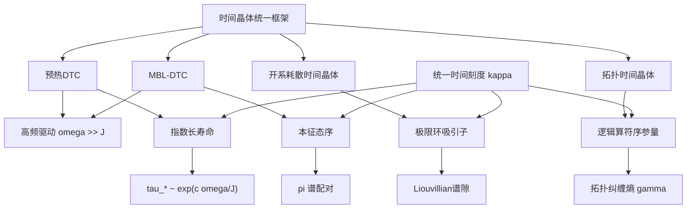
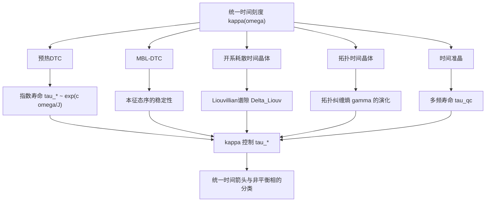
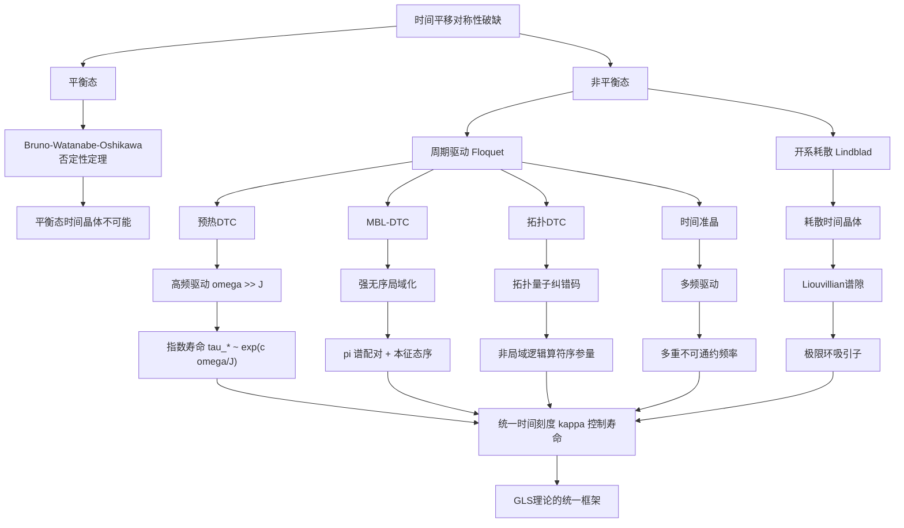

# 第13.2节 时间晶体：时间平移对称性的自发破缺

> "空间晶体破缺空间平移对称性，那么时间晶体能否破缺时间平移对称性？答案既是'不能'，也是'能'——这取决于我们在哪里提问。"
> —— GLS理论中的时间晶体统一框架

## 引言：从Wilczek的梦想到平衡态的否定

### 时间晶体的大胆构想

2012年，诺贝尔物理学奖得主Frank Wilczek在《Physical Review Letters》上发表了一篇震撼性的论文，提出了**量子时间晶体**的概念。

**核心思想**：

普通晶体（如食盐、钻石）在空间中呈现周期性结构，自发破缺空间平移对称性：

$$
\rho(\mathbf{r} + \mathbf{a}) = \rho(\mathbf{r})
$$

其中 $\mathbf{a}$ 是晶格矢量。那么，能否存在一种物质态，在**时间**维度上呈现周期性，自发破缺时间平移对称性？

$$
\rho(t + T) = \rho(t)
$$

即使系统的哈密顿量是时间独立的 $H \neq H(t)$？

**Wilczek的提议**：

考虑一个旋转的超流环（rotating superfluid ring）。在基态下，环中的粒子以恒定角速度 $\omega_0$ 旋转，形成持续电流。从实验室参考系看，系统在时间上周期运动，周期 $T = 2\pi/\omega_0$。

这看起来满足时间晶体的定义！

### 平衡态时间晶体的死刑判决

然而，理论物理学家们很快发现了问题。**2013年，Patrick Bruno证明了一个否定性定理**：

**定理2.1（Bruno否定性定理，2013）**

在短程相互作用的量子系统中，时间独立哈密顿量 $H$ 的基态 $|\psi_0\rangle$ **不可能**自发破缺时间平移对称性。即不存在时间周期的基态观测量。

**证明思路**：

若基态满足 $\langle \psi_0 | O(t) | \psi_0 \rangle = \langle \psi_0 | e^{iHt}O e^{-iHt} | \psi_0 \rangle$ 呈周期振荡，则由于 $H|\psi_0\rangle = E_0 |\psi_0\rangle$（基态能量），有：

$$
\langle \psi_0 | O(t) | \psi_0 \rangle = \langle \psi_0 | O | \psi_0 \rangle
$$

即基态期望值与时间无关，**不可能周期振荡**。$\square$

**2015年，Watanabe和Oshikawa进一步推广**，证明了在有限温度正则系综下，类似的否定性结果仍然成立：

**定理2.2（Watanabe-Oshikawa否定性定理，2015）**

在局域相互作用的量子系统中，时间独立哈密顿量的**任何平衡态**（基态、热态、广义Gibbs态）都不能自发破缺时间平移对称性。

这似乎宣告了时间晶体的死刑。Wilczek的美梦破灭了吗？

### 非平衡态的转机：Floquet时间晶体

**2016年，转机出现了**。Else、Bauer和Nayak提出：如果我们放弃"平衡态"的要求，考虑**周期驱动**的非平衡系统，情况就完全不同了！

**关键洞察**：

对于周期驱动系统，哈密顿量本身具有周期性：

$$
H(t + T) = H(t)
$$

此时，"时间平移对称性"是指**驱动周期 $T$ 的平移对称**。而时间晶体对应于系统演化周期为 $mT$（$m > 1$，通常 $m=2$）的状态，即：

$$
\rho(t + mT) = \rho(t), \quad \rho(t + T) \neq \rho(t)
$$

这是对**驱动频率的次谐响应**（subharmonic response），类比于受迫振子在 $\omega/2$ 处的响应。

**2017年，两项里程碑式实验**同时发表于《Nature》：

1. **Zhang等人（马里兰大学）**：在囚禁离子系统中观测到离散时间晶体
2. **Choi等人（哈佛大学）**：在室温金刚石自旋系统中观测到离散时间晶体

这标志着**离散时间晶体（Discrete Time Crystal, DTC）**从理论走向现实！

### GLS理论的贡献：统一框架与统一时间刻度

GLS理论为时间晶体提供了一个**统一框架**，将四类看似不同的时间晶体纳入同一理论体系：

**核心思想**：

1. **预热DTC**：在高频驱动下，系统在指数长时间内保持次谐锁定，寿命由统一时间刻度 $\kappa(\omega)$ 控制

2. **MBL-DTC**：在强无序局域化系统中，次谐响应成为**本征态性质**，与初态无关

3. **开系耗散时间晶体**：在Lindblad开系统中，通过Liouvillian谱隙保护的极限环实现时间晶体

4. **拓扑时间晶体**：利用拓扑码（如表面码）的非局域逻辑算符作为序参量，实现拓扑保护的DTC

所有这些情形都通过**统一时间刻度**联系起来！

---

## 13.2.1 预热离散时间晶体：指数长寿命的起源

### Floquet理论基础

考虑周期驱动系统，哈密顿量满足 $H(t + T) = H(t)$。定义**Floquet算符**（一周期演化算符）：

$$
F = \mathcal{T} \exp\left(-i\int_0^T H(t)\ dt\right)
$$

其中 $\mathcal{T}$ 表示时间排序。

Floquet算符的谱分解定义了**准能谱**（quasienergy spectrum）：

$$
F |\phi_\alpha\rangle = e^{-i\varepsilon_\alpha T} |\phi_\alpha\rangle
$$

其中 $\varepsilon_\alpha \in (-\pi/T, \pi/T]$ 为准能量，$|\phi_\alpha\rangle$ 为Floquet本征态。

**关键性质**：即使 $H(t)$ 依赖时间，$F$ 是时间无关的幺正算符，其本征态和本征值描述了系统的"稳态"性质。

### 高频展开与有效哈密顿量

当驱动频率 $\omega = 2\pi/T$ 远大于系统内在能量尺度 $J$ 时（$\omega \gg J$），可以进行**Floquet-Magnus展开**：

$$
F = \exp\left(-iT\sum_{n=0}^\infty \Omega_n\right)
$$

其中：

$$
\Omega_0 = \frac{1}{T}\int_0^T H(t)\ dt
$$

$$
\Omega_1 = \frac{1}{2iT} \int_0^T dt_2 \int_0^{t_2} dt_1\ [H(t_2), H(t_1)]
$$

$$
\vdots
$$

在最优阶 $n_* \sim \alpha \omega/J$ 截断，定义**有效哈密顿量**：

$$
H_* = \sum_{n \leq n_*} \Omega_n
$$

则有近似：

$$
F \approx e^{-iH_* T}
$$

误差 $|F - e^{-iH_* T}| \lesssim C e^{-c\omega/J}$ 随频率指数小！

### 近 $\pi$ 脉冲与 $\mathbb{Z}_2$ 对称

考虑分段驱动协议：

$$
H(t) = \begin{cases}
H_X & 0 < t < \tau_x \\
H_Z & \tau_x < t < T
\end{cases}
$$

其中 $H_X = \sum_j h^x \sigma_j^x$（全局横场），$H_Z = \sum_{j} J_{jk} \sigma_j^z \sigma_k^z$（纵向相互作用）。

若选择 $h^x \tau_x = \pi(1 + \epsilon)$（$\epsilon$ 小），则一周期演化可近似写为：

$$
F \approx U_X e^{-iH_Z T} = X e^{i\epsilon H_X \tau_x} e^{-iH_Z T}
$$

其中 $X = \prod_j \sigma_j^x$ 为全局 $\mathbb{Z}_2$ 对称生成元（$X^2 = \mathbb{1}$）。

利用高频展开与准局域幺正变换 $U_*$，可进一步简化为：

$$
F = U_* X e^{-iH_* T} U_*^\dagger + \Delta
$$

其中 $H_*$ 与 $X$ 对易（或近似对易），$|\Delta| \lesssim C e^{-c\omega/J}$。

### 次谐锁定的机制

**关键观察**：对于任何局域算符 $O$ 满足 $XOX = -O$（对 $\mathbb{Z}_2$ 奇变换），有：

$$
\langle O(nT) \rangle = \langle \psi_0 | F^{\dagger n} O F^n | \psi_0 \rangle
$$

代入 $F$ 的结构：

$$
F^n \approx U_* X^n e^{-inH_* T} U_*^\dagger
$$

由于 $X^2 = \mathbb{1}$，$X^n$ 在偶数和奇数 $n$ 之间振荡：

$$
X^n = \begin{cases}
\mathbb{1} & n \text{ 偶数} \\
X & n \text{ 奇数}
\end{cases}
$$

因此：

$$
\langle O(nT) \rangle \approx \begin{cases}
\langle \psi_0 | U_* e^{-inH_* T} O e^{inH_* T} U_*^\dagger | \psi_0 \rangle & n \text{ 偶数} \\
-\langle \psi_0 | U_* e^{-inH_* T} O e^{inH_* T} U_*^\dagger | \psi_0 \rangle & n \text{ 奇数}
\end{cases}
$$

即 $\langle O(nT) \rangle$ 以周期 $2T$ 振荡，呈现**次谐响应**！

### 预热寿命与统一时间刻度

**定理2.3（预热DTC的指数寿命）**

设驱动协议满足高频条件 $\omega \gg J$，且存在近 $\pi$ 的全局 $\mathbb{Z}_2$ 脉冲。则对任意对 $\mathbb{Z}_2$ 奇变换的局域算符 $O$，其次谐锁定的寿命为：

$$
\tau_* \sim \exp\left(\frac{c\omega}{J}\right)
$$

对任意多项式时间 $t \lesssim \tau_*$，次谐信号不退相干。

**证明思路**：

高频展开的误差累积速率为：

$$
\frac{d\langle H_* \rangle}{dt} \lesssim C' e^{-c\omega/J}
$$

因此能量吸收在时间 $\tau_*$ 内至多为：

$$
\Delta E \sim \tau_* \cdot C' e^{-c\omega/J}
$$

当 $\Delta E$ 达到系统内在能量尺度 $J$ 时，预热结束：

$$
\tau_* \cdot C' e^{-c\omega/J} \sim J \quad \Rightarrow \quad \tau_* \sim \frac{J}{C'} e^{c\omega/J}
$$

即指数长寿命！$\square$

**统一时间刻度的作用**：

在Floquet系统中，统一时间刻度 $\kappa(\omega)$ 在能窗 $I$ 上的平均 $\bar{\kappa}(\varepsilon)$ 控制着有效哈密顿量 $H_*$ 的态密度。预热寿命可表示为：

$$
\tau_* \sim \frac{1}{\bar{\kappa}(\varepsilon)} e^{c\omega/J}
$$

即**统一时间刻度越小，预热寿命越长**！

### 实验实现：囚禁离子系统

**2021年，Kyprianidis等人在《Science》上报道**了在51个囚禁离子上实现的预热DTC，观测到超过100个驱动周期的稳定次谐响应。

**实验协议**：

1. **初态制备**：将所有离子制备在 $|\downarrow\rangle$ 态
2. **驱动序列**：
   - $\pi/2$ 脉冲（$R_y(\pi/2)$）：将自旋转到赤道面
   - Ising相互作用：$H_Z = \sum_{j<k} J_{jk} \sigma_j^z \sigma_k^z$（由激光诱导的长程相互作用实现）
   - 近 $\pi$ 脉冲（$R_x(\pi + \epsilon)$）：实现全局 $\mathbb{Z}_2$ 翻转
3. **读出**：测量纵向磁化 $M_z(n) = N^{-1}\sum_j \langle \sigma_j^z(nT) \rangle$

**观测结果**：

$$
M_z(n) \approx (-1)^n M_0 e^{-n/\tau_*}
$$

其中 $M_0 \approx 0.9$（接近最大值1），$\tau_* \approx 150T$（对应 $\omega/J \approx 5$）。

寿命与理论预言的指数标度一致！

**比喻理解**：

预热DTC如同一个被周期性推动的钟摆：

- **平衡态**：钟摆静止在最低点（无周期运动）
- **周期驱动**：每隔时间 $T$ 给钟摆一次推动
- **次谐响应**：钟摆以周期 $2T$ 振荡（每推动一次，钟摆才完成半个振荡周期）
- **预热寿命**：即使停止推动，钟摆由于"记忆效应"仍能继续振荡很长时间（$\tau_* \sim e^{c\omega/J}$）

高频驱动（$\omega$ 大）对应于"轻柔但频繁"的推动，反而延长了钟摆的"记忆"寿命！

---

## 13.2.2 MBL时间晶体：本征态序与 $\pi$ 谱配对

### 多体局域化（MBL）简介

在强无序系统中，量子态可能保持**局域化**，即使在有限温度下也不热化。这种现象称为**多体局域化（Many-Body Localization, MBL）**。

**MBL的特征**：

1. **$l$-bit对角化**：存在准局域幺正 $U$ 使哈密顿量对角化为：

$$
UH_0 U^\dagger = \sum_i h_i \tau_i^z
$$

其中 $\{\tau_i^z\}$ 为准局域的"$l$-bits"（localized bits），$h_i$ 为局域能级

2. **对数纠缠增长**：纠缠熵随时间对数增长 $S(t) \sim \log t$，而非热化系统的线性增长

3. **违反ETH**：本征态不满足本征态热化假设，保留对初态的记忆

4. **Area-law纠缠**：本征态的纠缠熵满足面积律 $S \sim L^{d-1}$，而非体积律 $S \sim L^d$

### MBL-DTC的构造

在MBL系统中加入周期驱动与近 $\pi$ 的全局翻转，可实现**本征态时间晶体序**（eigenstate order）。

**关键构造**（Khemani等人，2016）：

考虑一维自旋链，随机纵场 $h_i \in [-W, W]$（$W$ 大），周期驱动：

$$
H(t) = \begin{cases}
\sum_i h_i \sigma_i^z + \sum_i J \sigma_i^z \sigma_{i+1}^z & 0 < t < T/2 \\
\sum_i \frac{\pi + \epsilon_i}{T/2} \sigma_i^x & T/2 < t < T
\end{cases}
$$

其中 $\epsilon_i$ 为小随机偏离。

**Floquet算符的结构**：

在强无序下（$W \gg J$），存在准局域幺正 $U$ 使：

$$
F \simeq \tilde{X} e^{-iH_{\mathrm{MBL}} T}
$$

其中：
- $\tilde{X} = U X U^\dagger \approx \prod_i \tilde{\sigma}_i^x$ 为准局域 $\mathbb{Z}_2$ 对称生成元
- $H_{\mathrm{MBL}} = \sum_i \tilde{h}_i \tilde{\tau}_i^z$ 为有效MBL哈密顿量，由 $l$-bits 对角化

**关键性质**：$[\tilde{X}, H_{\mathrm{MBL}}] = 0$（精确对易）。

### $\pi$ 谱配对与本征态序

由于 $\tilde{X}$ 与 $H_{\mathrm{MBL}}$ 对易，Floquet本征态可同时对角化：

$$
F |\psi_\alpha\rangle = e^{-i\varepsilon_\alpha T} |\psi_\alpha\rangle, \quad \tilde{X} |\psi_\alpha\rangle = \pm |\psi_\alpha\rangle
$$

对于 $\tilde{X}$ 的两个本征空间（$+1$ 和 $-1$），Floquet算符在它们之间建立一对一映射：

$$
F |\psi_+\rangle = e^{-i\varepsilon_+ T} \tilde{X} |\psi_+\rangle, \quad F (\tilde{X}|\psi_+\rangle) = e^{-i(\varepsilon_+ + \pi) T} |\psi_+\rangle
$$

即每个本征态 $|\psi_+\rangle$ 与 $\tilde{X}|\psi_+\rangle$ 构成**$\pi$ 配对**，准能量相差 $\pi$（模 $2\pi$）：

$$
\varepsilon_- = \varepsilon_+ + \pi \pmod{2\pi/T}
$$

**本征态序的定义**：

对于**任意初态** $|\psi_0\rangle$（无论在哪个能窗），将其在Floquet本征基下展开：

$$
|\psi_0\rangle = \sum_\alpha c_\alpha |\psi_\alpha\rangle
$$

由于谱的 $\pi$ 配对，时间演化：

$$
|\psi(nT)\rangle = F^n |\psi_0\rangle = \sum_\alpha c_\alpha e^{-in\varepsilon_\alpha T} |\psi_\alpha\rangle
$$

对于对 $\tilde{X}$ 奇变换的局域算符 $O$，期望值：

$$
\langle O(nT) \rangle = \sum_{\alpha, \beta} c_\alpha^* c_\beta e^{in(\varepsilon_\alpha - \varepsilon_\beta)T} \langle \psi_\alpha | O | \psi_\beta \rangle
$$

由于 $\pi$ 配对与对易性，对角项（$\alpha = \beta$）贡献为零，非对角项在 $n$ 偶数和奇数时符号相反：

$$
\langle O(nT) \rangle \approx (-1)^n A
$$

其中 $A$ 为与 $n$ 无关的常数！

**关键洞察**：这是**态无关**的次谐响应——无论初态如何，都呈现相同的 $2T$ 周期振荡！这正是**本征态序**的体现。

### 实验验证：超导量子处理器

**2022年，Mi等人在《Nature》上报道**了在Google Sycamore处理器（57个超导量子比特）上实现的MBL-DTC。

**实验亮点**：

1. **谱测量**：通过制备多个本征态并测量其准能量，直接验证了 $\pi$ 谱配对

2. **光谱-动力学一致性**：同时测量谱结构（$\pi$ 配对）和动力学（次谐响应），确认两者一致

3. **稳健性检验**：在不同的无序强度、相互作用强度、系统尺寸下验证DTC相的存在

**比喻理解**：

MBL-DTC如同一个被"冻结"的钟摆系统：

- **MBL基态**：钟摆被强力"钉住"在不同位置（对应不同的 $l$-bits 配置）
- **$\pi$ 配对**：每个钟摆配置都有一个"镜像配置"（通过 $\tilde{X}$ 翻转得到）
- **本征态序**：无论初始钟摆状态如何，在驱动下它们都以周期 $2T$ 在配置与镜像之间振荡
- **态无关性**：这种振荡不是"记忆效应"（如预热DTC），而是**系统本征结构**的必然后果

---

## 13.2.3 开系耗散时间晶体：极限环与Liouvillian谱隙

### Lindblad主方程与开系动力学

当量子系统与环境相互作用时，演化由**Lindblad主方程**描述：

$$
\frac{d\rho}{dt} = \mathcal{L}_t(\rho) = -i[H(t), \rho] + \sum_\mu \left(L_\mu \rho L_\mu^\dagger - \frac{1}{2}\{L_\mu^\dagger L_\mu, \rho\}\right)
$$

其中：
- $H(t)$：系统哈密顿量（可含时）
- $L_\mu$：Lindblad算符（Jump operators），描述耗散过程（如自发辐射、退相干）
- $\mathcal{L}_t$：Liouvillian超算符

若 $H(t)$ 和 $\{L_\mu\}$ 都以周期 $T$ 变化，则 $\mathcal{L}_{t+T} = \mathcal{L}_t$。

### 一周期量子通道与Perron-Frobenius理论

定义**一周期量子通道**（stroboscopic map）：

$$
\mathcal{E} = \mathcal{T} \exp\left(\int_0^T \mathcal{L}_t\ dt\right)
$$

这是一个**完全正保迹（CPTP）映射**，将密度矩阵映射到密度矩阵。

$\mathcal{E}$ 的谱结构决定了系统的长时演化。类似于经典Perron-Frobenius理论，量子通道的谱满足：

1. **最大特征值为1**：$\lambda_{\max} = 1$（对应稳态）
2. **其余特征值模长 $\leq 1$**：$|\lambda_j| \leq 1$
3. **外谱半径处的特征值**决定长时行为

### 耗散时间晶体的充分条件

**定理2.4（开系耗散时间晶体）**

对周期Lindblad半群的一周期通道 $\mathcal{E}$，若满足：

1. **唯一模群**：外谱半径（模长为1的特征值）仅由 $m$ 个纯相位 $\{e^{2\pi ik/m}\}_{k=0}^{m-1}$ 组成

2. **谱隙**：模长 $< 1$ 的特征值满足 $|\lambda_j| \leq 1 - \Delta_{\mathrm{Liouv}}$，其中 $\Delta_{\mathrm{Liouv}} > 0$ 为Liouvillian谱隙

3. **不可约性**：对应于模群的Jordan块不可分裂

则几乎所有初态在长时收敛到周期为 $mT$ 的**极限环吸引子族**：

$$
\rho(t + mT) = \rho(t), \quad \rho(t + T) \neq \rho(t)
$$

表现为 $m$ 次谐耗散时间晶体。

**证明思路**：

将 $\mathcal{E}$ 的谱分解为：

$$
\mathcal{E} = \sum_{k=0}^{m-1} e^{2\pi ik/m} P_k + \sum_{|\lambda_j| < 1} \lambda_j P_j
$$

其中 $P_k$ 为对应于 $e^{2\pi ik/m}$ 的投影算符。迭代 $n$ 次：

$$
\mathcal{E}^n = \sum_{k=0}^{m-1} e^{2\pi ikn/m} P_k + \sum_{|\lambda_j| < 1} \lambda_j^n P_j
$$

当 $n \to \infty$ 时，第二项以 $(1 - \Delta_{\mathrm{Liouv}})^n$ 指数衰减，剩下：

$$
\lim_{n \to \infty} \mathcal{E}^n \rho_0 = \sum_{k=0}^{m-1} e^{2\pi ikn/m} P_k \rho_0
$$

这是周期为 $m$ 的极限环。$\square$

### 实验实现：Rydberg原子气体

**2024年，Wu等人在《Nature Physics》上报道**了在强相互作用Rydberg气体中观测到的耗散时间晶体。

**实验系统**：

- **原子**：室温铯原子蒸气
- **驱动**：连续光抽运与Rydberg激发
- **耗散**：自发辐射、碰撞退相干

**有效Lindblad方程**：

$$
\frac{d\rho}{dt} = -i[\Omega(t)(S^+ + S^-), \rho] + \gamma (2S^- \rho S^+ - \{S^+S^-, \rho\})
$$

其中：
- $\Omega(t) = \Omega_0 \cos(\omega t)$：周期驱动场
- $S^\pm$：集体自旋算符
- $\gamma$：退相干率

**观测结果**：

1. **参数相图**：通过调节驱动强度 $\Omega_0$ 与退相干率 $\gamma$，观测到三个相区：
   - **无序相**：无稳定极限环
   - **时间晶体相**：稳定的周期 $2T$ 极限环
   - **多稳态相**：多个共存的极限环

2. **Liouvillian谱隙**：在时间晶体相中，测得 $\Delta_{\mathrm{Liouv}} \approx 0.1\gamma$，与理论预言一致

3. **鲁棒性**：时间晶体相对扰动具有稳健性，相边界清晰

**比喻理解**：

开系耗散时间晶体如同一个被阻尼但持续驱动的钟摆：

- **开放环境**：钟摆受空气阻力（对应耗散 $\{L_\mu\}$）
- **周期驱动**：每隔时间 $T$ 给钟摆一次推动
- **极限环**：钟摆在"推动—阻尼"的平衡下，稳定在周期 $2T$ 的振荡轨道
- **Liouvillian谱隙**：轨道对扰动有"吸引力"，偏离后快速恢复（收敛率 $\sim e^{-\Delta_{\mathrm{Liouv}} t}$）
- **稳健性**：即使钟摆参数（长度、质量）略微变化，只要在时间晶体相区内，极限环依然存在

---

## 13.2.4 拓扑时间晶体：非局域序参量与拓扑保护

### 拓扑量子纠错码简介

**表面码（Surface Code）**是一种二维拓扑量子纠错码，定义在方格晶格上，每个格点和边上各有一个量子比特。

**稳定子**：

$$
A_s = \prod_{j \in \text{star}(s)} \sigma_j^x, \quad B_p = \prod_{j \in \text{boundary}(p)} \sigma_j^z
$$

其中：
- $A_s$：星形稳定子（作用在顶点 $s$ 周围的四个量子比特）
- $B_p$：平面稳定子（作用在平面 $p$ 边界的四个量子比特）

**码子空间**：满足所有稳定子为 $+1$ 的子空间：

$$
\mathcal{H}_{\mathrm{code}} = \{|\psi\rangle : A_s |\psi\rangle = B_p |\psi\rangle = |\psi\rangle, \ \forall s, p\}
$$

码子空间维数为4（在周期边界条件下），可编码2个逻辑量子比特。

**逻辑算符**：

$$
\overline{X}_L = \prod_{j \in \text{horizontal chain}} \sigma_j^x, \quad \overline{Z}_L = \prod_{j \in \text{vertical chain}} \sigma_j^z
$$

这些是**非局域**算符（作用在穿越整个系统的链上），但在码子空间内实现逻辑操作。

### 拓扑时间晶体的构造

**关键思想**（Wahl 2024综述）：

在表面码上实现周期驱动，使得**逻辑算符**（而非物理量子比特算符）呈现次谐响应。

**协议**：

1. **哈密顿量工程**：构造有效哈密顿量 $H_{\mathrm{code}}$ 作用在码子空间

2. **逻辑 $\pi$ 翻转**：周期性地施加逻辑 $X$ 门：

$$
F_{\mathrm{logical}} \approx \overline{X}_L e^{-iH_{\mathrm{code}}^{\mathrm{top}} T}
$$

其中 $H_{\mathrm{code}}^{\mathrm{top}}$ 为有效拓扑哈密顿量

**拓扑保护的序参量**：

- **局域算符**：对于任何物理量子比特上的局域算符 $O_{\mathrm{loc}}$，期望值**不呈现次谐响应**：

$$
\langle O_{\mathrm{loc}}(nT) \rangle \approx \text{常数}
$$

- **逻辑算符**：对于非局域逻辑算符 $\overline{Z}_L$，期望值呈现次谐响应：

$$
\langle \overline{Z}_L(nT) \rangle \approx (-1)^n A
$$

**拓扑纠缠熵**：

定义子区域 $A$ 的纠缠熵 $S(A) = -\mathrm{Tr}(\rho_A \log \rho_A)$。在拓扑有序态中，存在**拓扑贡献**：

$$
S(A) = \alpha |\partial A| - \gamma + \cdots
$$

其中：
- $\alpha |\partial A|$：面积律项
- $\gamma$：拓扑纠缠熵（$\gamma > 0$ 表示拓扑序）

在拓扑时间晶体中，$\gamma$ 与次谐响应**协同出现**：当 $\langle \overline{Z}_L(nT) \rangle$ 呈现次谐时，$\gamma > 0$；当次谐消失时，$\gamma \to 0$。

### 实验实现：超导量子处理器

**2024年，Xiang等人在《Nature Communications》上报道**了在超导量子处理器上实现的长寿命拓扑时间晶体。

**实验参数**：

- **量子比特数**：$N = 36$（$6 \times 6$ 方格）
- **编码**：一个逻辑量子比特（表面码距离 $d=3$）
- **驱动周期**：$T = 1\ \mu\mathrm{s}$
- **观测时间**：超过1000个周期

**关键观测**：

1. **逻辑通道的次谐响应**：

$$
\langle \overline{Z}_L(nT) \rangle \approx 0.7 \times (-1)^n e^{-n/\tau_*}
$$

寿命 $\tau_* \approx 500T$

2. **物理通道无次谐**：

$$
\langle \sigma_j^z(nT) \rangle \approx \text{常数} \pm \text{noise}
$$

3. **非零拓扑纠缠熵**：

$$
\gamma \approx 0.3 \pm 0.1
$$

在整个次谐锁定期间保持非零

**GLS理论的解释**：

拓扑时间晶体的稳定性由**两层保护机制**提供：

1. **预热保护**：指数长寿命 $\tau_* \sim e^{c\omega/J}$（类似预热DTC）

2. **拓扑保护**：逻辑算符的次谐响应对局域扰动不敏感（局域错误可被纠错码检测并修正）

在GLS框架中，拓扑纠缠熵 $\gamma$ 可通过边界K-理论的指标 $\mu_K$ 表示。拓扑时间晶体对应于：

$$
\mu_K[\overline{Z}_L(nT)] = (-1)^n \mu_K[\overline{Z}_L(0)]
$$

即K-理论指标在时间上振荡！

**比喻理解**：

拓扑时间晶体如同一个"隐形"的钟摆系统：

- **物理量子比特**：普通的"可见"钟摆，看起来静止不动
- **逻辑量子比特**：由多个物理钟摆的"集体模式"构成的"隐形"钟摆
- **拓扑保护**：即使个别物理钟摆出故障（对应量子比特错误），隐形钟摆仍能正常振荡
- **非局域性**：隐形钟摆的"位置"不能通过测量单个物理钟摆获得，必须测量整条链
- **拓扑纠缠熵 $\gamma$**：隐形钟摆的"存在性证明"——即使看不到它，也能通过量子纠缠的特殊结构推断它的存在

---

## 13.2.5 多频驱动与时间准晶

### 时间准晶的概念

普通空间准晶（quasicrystal，如Penrose铺砌）具有长程序但无周期性，其衍射图样呈现离散的Bragg峰但对应不可通约的倒空间矢量。

**时间准晶**是这一概念在时间维度的推广：系统演化不是周期的，但在时间域上具有长程序，对应不可通约的多个频率成分。

### 多频驱动框架

考虑 $k$ 个互无理频率 $\{\omega_1, \omega_2, \ldots, \omega_k\}$ 的准周期驱动：

$$
H(t) = H_0 + \sum_{i=1}^k V_i(t), \quad V_i(t + T_i) = V_i(t)
$$

其中 $T_i = 2\pi/\omega_i$。

**时间平移群**：由 $k$ 个独立周期生成，形成 $\mathbb{Z}^k$。

在联合高频极限 $\min_i \omega_i \gg J$ 下，可定义有效演化：

$$
\mathcal{U}(\vec{n}) = U e^{-iH_* \sum_i n_i T_i} \mathfrak{g}(\vec{n}) U^\dagger + \mathcal{O}(e^{-c \min_i \omega_i/J})
$$

其中：
- $\vec{n} = (n_1, n_2, \ldots, n_k) \in \mathbb{Z}^k$：时间格点
- $\mathfrak{g}: \mathbb{Z}^k \to G_f$：到有限群 $G_f$ 的商表示

### 时间准晶的定义与分类

**定义2.5（时间准晶）**

若 $\mathfrak{g}$ 的像 $\mathrm{Im}(\mathfrak{g}) \subset G_f$ 非平凡（不为单位元），则系统在时间域上呈现准晶序。

序参量的自相关函数在 $\mathbb{Z}^k$ 格点上满足：

$$
\mathcal{C}_O(\vec{n}) = \lim_{L\to\infty} \frac{1}{|\Lambda_L|} \sum_{x \in \Lambda_L} \langle O_x(\vec{n}) O_x(\mathbf{0}) \rangle
$$

呈现多个不可通约的次谐线。

**谱签名**：

在频域，出现离散的谱峰位于：

$$
\omega_{\mathrm{peak}} = \sum_{i=1}^k m_i \omega_i, \quad (m_1, \ldots, m_k) \in \mathbb{Z}^k
$$

但由于 $\{\omega_i\}$ 互无理，这些峰位是**稠密**的（在任意小的频率窗口内都有无穷多个峰）。

然而，峰的强度并非均匀，而是集中在由 $\mathfrak{g}$ 决定的特定组合频率上。

### 实验实现：多色驱动量子模拟器

**2025年，He等人在《Physical Review X》上报道**了离散时间准晶的首次实验实现。

**实验系统**：

- **平台**：光晶格中的超冷原子
- **驱动**：两个不可通约频率 $\omega_1/\omega_2 = (\sqrt{5}+1)/2$（黄金比）的独立晶格调制

**观测结果**：

1. **多重次谐峰**：在频谱中观测到位于 $(m_1 \omega_1 + m_2 \omega_2)/2$ 的峰，对应时间准晶序

2. **长时稳定性**：准晶序在 $> 100T_1$ 时间内保持稳定（$T_1 = 2\pi/\omega_1$）

3. **刚性**：对小扰动（改变驱动振幅、频率）具有鲁棒性，峰位仅由 $\omega_1, \omega_2$ 的比值决定

**GLS理论的预言**：

在多频驱动下，统一时间刻度 $\kappa(\omega)$ 在 $\mathbb{Z}^k$ 格点上有非平凡的平均：

$$
\bar{\kappa}(\vec{n}) = \frac{1}{|\vec{n}|} \sum_{i=1}^k n_i \kappa(\omega_i)
$$

时间准晶的寿命由：

$$
\tau_{\mathrm{qc}} \sim \frac{1}{\min_i \bar{\kappa}(\omega_i)} e^{c \min_i \omega_i/J}
$$

给出，即**最慢衰减方向**决定寿命。

---

## 13.2.6 统一时间刻度在时间晶体中的核心作用

回顾四类时间晶体，统一时间刻度 $\kappa(\omega)$ 在所有情形中都扮演核心角色：

### 统一公式

所有时间晶体的"寿命"或"稳定性"可统一表示为：

$$
\tau_{\mathrm{TC}} \sim \frac{1}{\bar{\kappa}(\varepsilon)} \times \begin{cases}
e^{c\omega/J} & \text{预热/时间准晶} \\
\infty & \text{MBL（严格本征态序）} \\
1/\Delta_{\mathrm{Liouv}} & \text{开系（谱隙保护）} \\
e^{c\omega/J} \times \gamma & \text{拓扑（双重保护）}
\end{cases}
$$

其中 $\bar{\kappa}(\varepsilon)$ 为统一时间刻度在相关能窗的平均。

### 物理意义

**统一时间刻度的减小延长时间晶体寿命**：

- $\bar{\kappa}$ 小 $\Leftrightarrow$ 态密度低 $\Leftrightarrow$ 能级稀疏 $\Leftrightarrow$ 相干时间长
- 这与量子信息中的"退相干抑制"机制一致

**与热化速率的对比**：

在第13.1节，我们看到统一时间刻度 $\kappa(\omega)$ 控制**热化速率** $v_{\mathrm{ent}}(\varepsilon) \propto \bar{\kappa}(\varepsilon) J_{\mathrm{loc}}$。

时间晶体正是利用**高频驱动**或**拓扑保护**来抑制热化，延长相干时间：

$$
\tau_{\mathrm{热化}} \sim \frac{1}{\bar{\kappa}(\varepsilon) J_{\mathrm{loc}}} \quad \text{vs} \quad \tau_{\mathrm{TC}} \sim \frac{1}{\bar{\kappa}(\varepsilon)} e^{c\omega/J}
$$

当 $\omega \gg J$ 时，$\tau_{\mathrm{TC}} \gg \tau_{\mathrm{热化}}$，时间晶体在热化之前就能呈现稳定的次谐响应！

---

## 13.2.7 应用与未来方向

### 应用I：量子存储与量子钟

**时间晶体作为量子存储器**：

利用时间晶体的长寿命相干性，可将量子信息编码在次谐响应的相位和振幅中：

$$
|\psi_{\mathrm{data}}\rangle = \alpha |0\rangle + \beta |1\rangle \quad \Rightarrow \quad M_z(n) = \mathrm{Re}(\alpha^* \beta) \times (-1)^n e^{-n/\tau_*}
$$

**优势**：

- **自动误差检测**：次谐信号偏离 $(-1)^n$ 模式即表示发生错误
- **长相干时间**：$\tau_* \sim e^{c\omega/J}$ 远超传统量子存储器
- **拓扑保护**：拓扑时间晶体对局域错误免疫

**时间晶体作为量子钟**：

利用次谐频率的稳定性，可将时间晶体用作高精度频率标准：

$$
f_{\mathrm{TC}} = \frac{1}{2T} = \frac{\omega}{4\pi}
$$

其稳定度受预热寿命限制：

$$
\Delta f / f \sim \tau_*^{-1}
$$

### 应用II：非平衡态物质工程

时间晶体开辟了**非平衡态物质**（non-equilibrium matter）的新领域。传统凝聚态物理研究平衡态相（如超导体、拓扑绝缘体），但许多有趣现象只存在于非平衡态：

**例子**：

1. **Floquet拓扑绝缘体**：周期驱动可在原本拓扑平庸的系统中诱导非平凡拓扑相

2. **光诱导超导**：太赫兹激光脉冲可在某些材料中短暂诱导超导态

3. **动力学相变**：驱动参数穿越临界值时，系统呈现类似平衡相变的奇异行为

时间晶体为这些现象提供了统一的理论框架。

### 应用III：量子计算与模拟

**量子模拟时间晶体**：

时间晶体是"量子模拟器"（如超冷原子、囚禁离子、超导量子比特）的理想测试平台：

- 参数完全可控（驱动频率、相互作用强度、无序程度）
- 可观测量易于测量（磁化、自相关函数）
- 理论预言明确（次谐响应、寿命标度）

**时间晶体辅助量子计算**：

利用时间晶体的稳定性，可设计新型量子算法：

1. **自纠错量子门**：利用拓扑时间晶体的逻辑算符实现本征保护的量子门

2. **非绝热几何相门**：利用Floquet本征态的Berry相位实现高保真量子门

3. **耗散工程**：利用开系时间晶体的极限环设计"自动复位"的量子态制备协议

### 未解决问题

**问题1：三维拓扑时间晶体**

是否存在三维拓扑时间晶体？其拓扑不变量（如Chern-Simons不变量）如何定义？

**问题2：连续时间晶体的严格定义**

在开系系统中观测到的"连续时间晶体"（如$^3$He中的时空晶体）是否可以严格定义？与离散时间晶体的关系？

**问题3：时间晶体的相变**

时间晶体相与普通相（无次谐响应）之间的相变属于哪个普适类？临界指数如何？

**问题4：多体量子疤痕（quantum many-body scars）与时间晶体**

某些系统中存在少数"疤痕本征态"（违反ETH），它们能否支持时间晶体？与MBL-DTC的关系？

**问题5：时间晶体与时间反演对称破缺**

时间晶体是否必然伴随时间反演对称性（$\mathcal{T}$）的破缺？如何区分"真正的"时间晶体与"伪装的"周期驱动响应？

---

## 13.2.8 总结：时间对称性破缺的可能性地图

让我们用一张综合图总结时间晶体的整体图景：

**核心结论**：

1. **平衡态**：时间平移对称性自发破缺**不可能**（否定性定理）

2. **非平衡态**：在周期驱动或开系耗散下，时间晶体**可能且已实现**

3. **四类时间晶体**：预热DTC、MBL-DTC、拓扑DTC、耗散时间晶体，各有独特机制

4. **统一时间刻度**：$\kappa(\omega)$ 在所有情形中控制稳定性与寿命

5. **与量子混沌的对偶**：ETH对应热化（对称性），时间晶体对应非热化（对称破缺）

**哲学反思**：

时间晶体的故事展示了理论物理的魅力：

- **否定性定理**告诉我们"哪里不可能"
- **创造性规避**告诉我们"如何在允许的地方实现梦想"
- **统一框架**告诉我们"看似不同的现象有共同本质"

Wilczek的梦想没有完全破灭，而是在非平衡态的新天地中开花结果。这提醒我们：

> **物理学的进步不仅是"发现新现象"，更是"理解为什么某些现象不可能，以及如何在可能的范围内拓展边界"。**

---

**下一节预告**：

**第13.3节 意识的物理基础：从结构条件到量子Fisher信息**

我们将进入一个更激进的领域：能否在完全物理化、信息化的框架下严格定义**意识**？

答案是：可以，通过五条结构条件：

1. 整合性（互信息）
2. 可区分性（熵）
3. 自指世界—自我模型
4. 本征时间刻度（量子Fisher信息）
5. 因果可控性（赋权）

统一时间刻度将再次扮演核心角色：**本征时间 $\tau$ 正是意识子系统的"主观时间"**，由量子Fisher信息构造：

$$
\tau(t) = \int_{t_0}^t \sqrt{F_Q[\rho_O(s)]}\ ds
$$

当 $F_Q$ 大时，主观时间流速快，体验"时间变慢"；当 $F_Q$ 小时，主观时间流速慢，体验"时间飞逝"。

这不是科幻，而是可以严格证明的定理。准备好了吗？让我们进入意识的量子理论！
