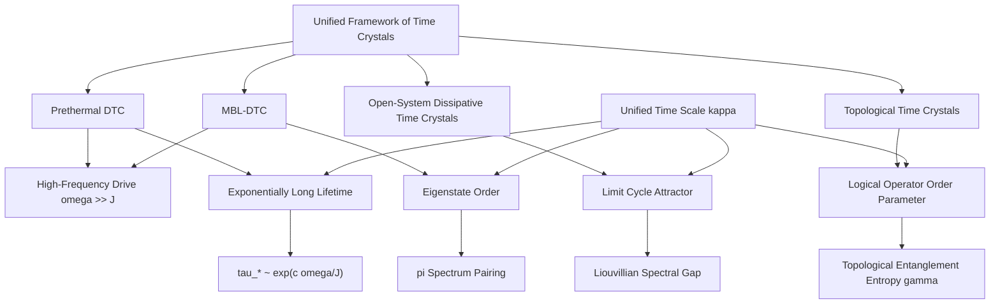
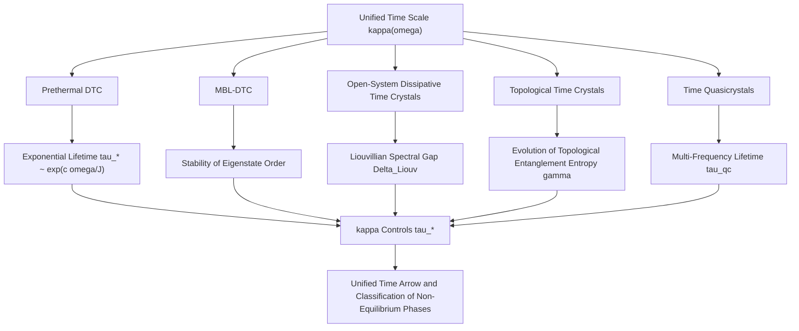
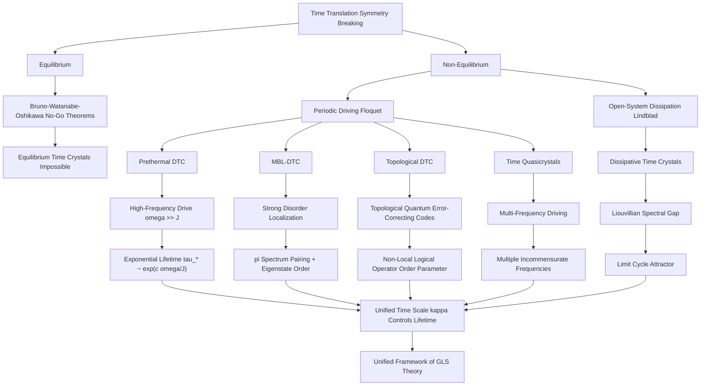

# Section 13.2 Time Crystals: Spontaneous Breaking of Time Translation Symmetry

> "Spatial crystals break spatial translation symmetry, so can time crystals break time translation symmetry? The answer is both 'no' and 'yes'—it depends on where we ask the question."
> —— Unified Framework of Time Crystals in GLS Theory

## Introduction: From Wilczek's Dream to the Equilibrium Denial

### The Bold Conception of Time Crystals

In 2012, Nobel laureate Frank Wilczek published a groundbreaking paper in *Physical Review Letters*, proposing the concept of **quantum time crystals**.

**Core Idea**:

Ordinary crystals (such as salt, diamond) exhibit periodic structure in space, spontaneously breaking spatial translation symmetry:

$$
\rho(\mathbf{r} + \mathbf{a}) = \rho(\mathbf{r})
$$

where $\mathbf{a}$ is a lattice vector. Can there exist a state of matter that exhibits periodicity in the **time** dimension, spontaneously breaking time translation symmetry?

$$
\rho(t + T) = \rho(t)
$$

Even when the system's Hamiltonian is time-independent $H \neq H(t)$?

**Wilczek's Proposal**:

Consider a rotating superfluid ring. In the ground state, particles in the ring rotate at constant angular velocity $\omega_0$, forming a persistent current. From the laboratory reference frame, the system exhibits periodic motion in time with period $T = 2\pi/\omega_0$.

This seems to satisfy the definition of a time crystal!

### The Death Sentence for Equilibrium Time Crystals

However, theoretical physicists quickly discovered problems. **In 2013, Patrick Bruno proved a no-go theorem**:

**Theorem 2.1 (Bruno No-Go Theorem, 2013)**

In quantum systems with short-range interactions, the ground state $|\psi_0\rangle$ of a time-independent Hamiltonian $H$ **cannot** spontaneously break time translation symmetry. That is, there exist no time-periodic ground state observables.

**Proof Sketch**:

If the ground state satisfies $\langle \psi_0 | O(t) | \psi_0 \rangle = \langle \psi_0 | e^{iHt}O e^{-iHt} | \psi_0 \rangle$ exhibiting periodic oscillation, then since $H|\psi_0\rangle = E_0 |\psi_0\rangle$ (ground state energy), we have:

$$
|\langle \psi_0 | O(t) | \psi_0 \rangle = \langle \psi_0 | O | \psi_0 \rangle
$$

That is, the ground state expectation value is time-independent and **cannot oscillate periodically**. $\square$

**In 2015, Watanabe and Oshikawa further generalized** this, proving that similar no-go results hold for finite-temperature canonical ensembles:

**Theorem 2.2 (Watanabe-Oshikawa No-Go Theorem, 2015)**

In quantum systems with local interactions, **any equilibrium state** (ground state, thermal state, generalized Gibbs state) of a time-independent Hamiltonian cannot spontaneously break time translation symmetry.

This seemed to pronounce the death sentence for time crystals. Had Wilczek's beautiful dream been shattered?

### The Turnaround in Non-Equilibrium: Floquet Time Crystals

**In 2016, a turnaround appeared**. Else, Bauer, and Nayak proposed: if we abandon the "equilibrium" requirement and consider **periodically driven** non-equilibrium systems, the situation is completely different!

**Key Insight**:

For periodically driven systems, the Hamiltonian itself has periodicity:

$$
H(t + T) = H(t)
$$

Here, "time translation symmetry" refers to **translation symmetry of the drive period $T$**. Time crystals correspond to states with evolution period $mT$ ($m > 1$, typically $m=2$), i.e.:

$$
\rho(t + mT) = \rho(t), \quad \rho(t + T) \neq \rho(t)
$$

This is a **subharmonic response** to the drive frequency, analogous to a forced oscillator's response at $\omega/2$.

**In 2017, two milestone experiments** were simultaneously published in *Nature*:

1. **Zhang et al. (University of Maryland)**: Observed discrete time crystals in trapped ion systems
2. **Choi et al. (Harvard University)**: Observed discrete time crystals in room-temperature diamond spin systems

This marked the transition of **Discrete Time Crystals (DTC)** from theory to reality!

### GLS Theory's Contribution: Unified Framework and Unified Time Scale

GLS theory provides a **unified framework** for time crystals, incorporating four seemingly different types of time crystals into the same theoretical system:

**Core Ideas**:

1. **Prethermal DTC**: Under high-frequency driving, the system maintains subharmonic locking for exponentially long times, with lifetime controlled by the unified time scale $\kappa(\omega)$

2. **MBL-DTC**: In strongly disordered localized systems, subharmonic response becomes an **eigenstate property**, independent of initial state

3. **Open-System Dissipative Time Crystals**: In Lindblad open systems, time crystals are realized through limit cycles protected by Liouvillian spectral gap

4. **Topological Time Crystals**: Using non-local logical operators of topological codes (such as surface codes) as order parameters, achieving topologically protected DTC

All these cases are connected through the **unified time scale**!

---

## 13.2.1 Prethermal Discrete Time Crystals: Origin of Exponentially Long Lifetime

### Floquet Theory Foundation

Consider a periodically driven system with Hamiltonian satisfying $H(t + T) = H(t)$. Define the **Floquet operator** (one-period evolution operator):

$$
F = \mathcal{T} \exp\left(-i\int_0^T H(t)\ dt\right)
$$

where $\mathcal{T}$ denotes time ordering.

The spectral decomposition of the Floquet operator defines the **quasienergy spectrum**:

$$
F |\phi_\alpha\rangle = e^{-i\varepsilon_\alpha T} |\phi_\alpha\rangle
$$

where $\varepsilon_\alpha \in (-\pi/T, \pi/T]$ is the quasienergy, and $|\phi_\alpha\rangle$ is the Floquet eigenstate.

**Key Property**: Even though $H(t)$ depends on time, $F$ is a time-independent unitary operator, whose eigenstates and eigenvalues describe the system's "steady-state" properties.

### High-Frequency Expansion and Effective Hamiltonian

When the drive frequency $\omega = 2\pi/T$ is much larger than the system's intrinsic energy scale $J$ ($\omega \gg J$), we can perform a **Floquet-Magnus expansion**:

$$
F = \exp\left(-iT\sum_{n=0}^\infty \Omega_n\right)
$$

where:

$$
\Omega_0 = \frac{1}{T}\int_0^T H(t)\ dt
$$

$$
\Omega_1 = \frac{1}{2iT} \int_0^T dt_2 \int_0^{t_2} dt_1\ [H(t_2), H(t_1)]
$$

$$
\vdots
$$

Truncating at optimal order $n_* \sim \alpha \omega/J$, define the **effective Hamiltonian**:

$$
H_* = \sum_{n \leq n_*} \Omega_n
$$

Then we have the approximation:

$$
F \approx e^{-iH_* T}
$$

The error $|F - e^{-iH_* T}| \lesssim C e^{-c\omega/J}$ is exponentially small in frequency!

### Near-$\pi$ Pulse and $\mathbb{Z}_2$ Symmetry

Consider a piecewise drive protocol:

$$
H(t) = \begin{cases}
H_X & 0 < t < \tau_x \\
H_Z & \tau_x < t < T
\end{cases}
$$

where $H_X = \sum_j h^x \sigma_j^x$ (global transverse field), $H_Z = \sum_{j} J_{jk} \sigma_j^z \sigma_k^z$ (longitudinal interactions).

If we choose $h^x \tau_x = \pi(1 + \epsilon)$ ($\epsilon$ small), then one-period evolution can be approximately written as:

$$
F \approx U_X e^{-iH_Z T} = X e^{i\epsilon H_X \tau_x} e^{-iH_Z T}
$$

where $X = \prod_j \sigma_j^x$ is the global $\mathbb{Z}_2$ symmetry generator ($X^2 = \mathbb{1}$).

Using high-frequency expansion and quasi-local unitary transformation $U_*$, we can further simplify to:

$$
F = U_* X e^{-iH_* T} U_*^\dagger + \Delta
$$

where $H_*$ commutes (or approximately commutes) with $X$, and $|\Delta| \lesssim C e^{-c\omega/J}$.

### Mechanism of Subharmonic Locking

**Key Observation**: For any local operator $O$ satisfying $XOX = -O$ (odd under $\mathbb{Z}_2$ transformation), we have:

$$
|\langle O(nT) \rangle = \langle \psi_0 | F^{\dagger n} O F^n | \psi_0 \rangle
$$

Substituting the structure of $F$:

$$
F^n \approx U_* X^n e^{-inH_* T} U_*^\dagger
$$

Since $X^2 = \mathbb{1}$, $X^n$ oscillates between even and odd $n$:

$$
X^n = \begin{cases}
\mathbb{1} & n \text{ even} \\
X & n \text{ odd}
\end{cases}
$$

Therefore:

$$
|\langle O(nT) \rangle \approx \begin{cases}
\langle \psi_0 | U_* e^{-inH_* T} O e^{inH_* T} U_*^\dagger | \psi_0 \rangle & n \text{ even} \\
-\langle \psi_0 | U_* e^{-inH_* T} O e^{inH_* T} U_*^\dagger | \psi_0 \rangle & n \text{ odd}
\end{cases}
$$

That is, $\langle O(nT) \rangle$ oscillates with period $2T$, exhibiting **subharmonic response**!

### Prethermal Lifetime and Unified Time Scale

**Theorem 2.3 (Exponential Lifetime of Prethermal DTC)**

Let the drive protocol satisfy the high-frequency condition $\omega \gg J$, and let there exist a near-$\pi$ global $\mathbb{Z}_2$ pulse. Then for any local operator $O$ odd under $\mathbb{Z}_2$ transformation, the lifetime of subharmonic locking is:

$$
\tau_* \sim \exp\left(\frac{c\omega}{J}\right)
$$

For any polynomial time $t \lesssim \tau_*$, the subharmonic signal does not decohere.

**Proof Sketch**:

The error accumulation rate of the high-frequency expansion is:

$$
\frac{d\langle H_* \rangle}{dt} \lesssim C' e^{-c\omega/J}
$$

Therefore, energy absorption within time $\tau_*$ is at most:

$$
\Delta E \sim \tau_* \cdot C' e^{-c\omega/J}
$$

When $\Delta E$ reaches the system's intrinsic energy scale $J$, prethermalization ends:

$$
\tau_* \cdot C' e^{-c\omega/J} \sim J \quad \Rightarrow \quad \tau_* \sim \frac{J}{C'} e^{c\omega/J}
$$

That is, exponentially long lifetime! $\square$

**Role of Unified Time Scale**:

In Floquet systems, the average $\bar{\kappa}(\varepsilon)$ of the unified time scale $\kappa(\omega)$ over energy window $I$ controls the density of states of the effective Hamiltonian $H_*$. The prethermal lifetime can be expressed as:

$$
\tau_* \sim \frac{1}{\bar{\kappa}(\varepsilon)} e^{c\omega/J}
$$

That is, **the smaller the unified time scale, the longer the prethermal lifetime**!

### Experimental Realization: Trapped Ion Systems

**In 2021, Kyprianidis et al. reported in *Science*** a prethermal DTC realized on 51 trapped ions, observing stable subharmonic response for over 100 drive periods.

**Experimental Protocol**:

1. **Initial State Preparation**: Prepare all ions in $|\downarrow\rangle$ state
2. **Drive Sequence**:
   - $\pi/2$ pulse ($R_y(\pi/2)$): Rotate spins to the equator
   - Ising interaction: $H_Z = \sum_{j<k} J_{jk} \sigma_j^z \sigma_k^z$ (realized by laser-induced long-range interactions)
   - Near-$\pi$ pulse ($R_x(\pi + \epsilon)$): Realize global $\mathbb{Z}_2$ flip
3. **Readout**: Measure longitudinal magnetization $M_z(n) = N^{-1}\sum_j \langle \sigma_j^z(nT) \rangle$

**Observations**:

$$
M_z(n) \approx (-1)^n M_0 e^{-n/\tau_*}
$$

where $M_0 \approx 0.9$ (close to maximum value 1), $\tau_* \approx 150T$ (corresponding to $\omega/J \approx 5$).

The lifetime is consistent with the theoretically predicted exponential scaling!

**Metaphorical Understanding**:

Prethermal DTC is like a pendulum periodically pushed:

- **Equilibrium**: Pendulum rests at lowest point (no periodic motion)
- **Periodic Drive**: Push the pendulum every time $T$
- **Subharmonic Response**: Pendulum oscillates with period $2T$ (each push completes half an oscillation cycle)
- **Prethermal Lifetime**: Even after stopping the pushes, the pendulum continues oscillating for a long time due to "memory effect" ($\tau_* \sim e^{c\omega/J}$)

High-frequency driving ($\omega$ large) corresponds to "gentle but frequent" pushes, which actually extends the pendulum's "memory" lifetime!

---

## 13.2.2 MBL Time Crystals: Eigenstate Order and $\pi$ Spectrum Pairing

### Introduction to Many-Body Localization (MBL)

In strongly disordered systems, quantum states may remain **localized**, even at finite temperature without thermalization. This phenomenon is called **Many-Body Localization (MBL)**.

**Features of MBL**:

1. **$l$-bit Diagonalization**: There exists a quasi-local unitary $U$ that diagonalizes the Hamiltonian as:

$$
UH_0 U^\dagger = \sum_i h_i \tau_i^z
$$

where $\{\tau_i^z\}$ are quasi-local "$l$-bits" (localized bits), and $h_i$ are local energy levels

2. **Logarithmic Entanglement Growth**: Entanglement entropy grows logarithmically with time $S(t) \sim \log t$, rather than linear growth in thermalizing systems

3. **ETH Violation**: Eigenstates do not satisfy the Eigenstate Thermalization Hypothesis, retaining memory of initial state

4. **Area-Law Entanglement**: Eigenstate entanglement entropy satisfies area law $S \sim L^{d-1}$, rather than volume law $S \sim L^d$

### Construction of MBL-DTC

Adding periodic driving and near-$\pi$ global flips to MBL systems can realize **eigenstate time crystal order**.

**Key Construction** (Khemani et al., 2016):

Consider a one-dimensional spin chain with random longitudinal field $h_i \in [-W, W]$ ($W$ large), periodic driving:

$$
H(t) = \begin{cases}
\sum_i h_i \sigma_i^z + \sum_i J \sigma_i^z \sigma_{i+1}^z & 0 < t < T/2 \\
\sum_i \frac{\pi + \epsilon_i}{T/2} \sigma_i^x & T/2 < t < T
\end{cases}
$$

where $\epsilon_i$ are small random deviations.

**Structure of Floquet Operator**:

Under strong disorder ($W \gg J$), there exists a quasi-local unitary $U$ such that:

$$
F \simeq \tilde{X} e^{-iH_{\mathrm{MBL}} T}
$$

where:
- $\tilde{X} = U X U^\dagger \approx \prod_i \tilde{\sigma}_i^x$ is a quasi-local $\mathbb{Z}_2$ symmetry generator
- $H_{\mathrm{MBL}} = \sum_i \tilde{h}_i \tilde{\tau}_i^z$ is the effective MBL Hamiltonian, diagonalized by $l$-bits

**Key Property**: $[\tilde{X}, H_{\mathrm{MBL}}] = 0$ (exact commutation).

### $\pi$ Spectrum Pairing and Eigenstate Order

Since $\tilde{X}$ commutes with $H_{\mathrm{MBL}}$, Floquet eigenstates can be simultaneously diagonalized:

$$
F |\psi_\alpha\rangle = e^{-i\varepsilon_\alpha T} |\psi_\alpha\rangle, \quad \tilde{X} |\psi_\alpha\rangle = \pm |\psi_\alpha\rangle
$$

For the two eigenspaces of $\tilde{X}$ ($+1$ and $-1$), the Floquet operator establishes a one-to-one mapping between them:

$$
F |\psi_+\rangle = e^{-i\varepsilon_+ T} \tilde{X} |\psi_+\rangle, \quad F (\tilde{X}|\psi_+\rangle) = e^{-i(\varepsilon_+ + \pi) T} |\psi_+\rangle
$$

That is, each eigenstate $|\psi_+\rangle$ pairs with $\tilde{X}|\psi_+\rangle$ to form a **$\pi$ pair**, with quasienergies differing by $\pi$ (mod $2\pi$):

$$
\varepsilon_- = \varepsilon_+ + \pi \pmod{2\pi/T}
$$

**Definition of Eigenstate Order**:

For **any initial state** $|\psi_0\rangle$ (regardless of energy window), expand it in the Floquet eigenbasis:

$$
|\psi_0\rangle = \sum_\alpha c_\alpha |\psi_\alpha\rangle
$$

Due to $\pi$ pairing of the spectrum, time evolution:

$$
|\psi(nT)\rangle = F^n |\psi_0\rangle = \sum_\alpha c_\alpha e^{-in\varepsilon_\alpha T} |\psi_\alpha\rangle
$$

For local operator $O$ odd under $\tilde{X}$ transformation, expectation value:

$$
|\langle O(nT) \rangle = \sum_{\alpha, \beta} c_\alpha^* c_\beta e^{in(\varepsilon_\alpha - \varepsilon_\beta)T} \langle \psi_\alpha | O | \psi_\beta \rangle
$$

Due to $\pi$ pairing and commutation, diagonal terms ($\alpha = \beta$) contribute zero, off-diagonal terms have opposite signs for even and odd $n$:

$$
|\langle O(nT) \rangle \approx (-1)^n A
$$

where $A$ is a constant independent of $n$!

**Key Insight**: This is a **state-independent** subharmonic response—regardless of initial state, it exhibits the same $2T$ periodic oscillation! This is exactly the manifestation of **eigenstate order**.

### Experimental Verification: Superconducting Quantum Processors

**In 2022, Mi et al. reported in *Nature*** an MBL-DTC realized on Google Sycamore processor (57 superconducting qubits).

**Experimental Highlights**:

1. **Spectrum Measurement**: By preparing multiple eigenstates and measuring their quasienergies, directly verified $\pi$ spectrum pairing

2. **Spectrum-Dynamics Consistency**: Simultaneously measured spectrum structure ($\pi$ pairing) and dynamics (subharmonic response), confirming consistency

3. **Robustness Tests**: Verified existence of DTC phase under different disorder strengths, interaction strengths, and system sizes

**Metaphorical Understanding**:

MBL-DTC is like a "frozen" pendulum system:

- **MBL Ground State**: Pendulums are strongly "pinned" at different positions (corresponding to different $l$-bit configurations)
- **$\pi$ Pairing**: Each pendulum configuration has a "mirror configuration" (obtained by $\tilde{X}$ flip)
- **Eigenstate Order**: Regardless of initial pendulum state, under driving they oscillate with period $2T$ between configuration and mirror
- **State Independence**: This oscillation is not a "memory effect" (like prethermal DTC), but a necessary consequence of the **system's eigenstructure**

---

## 13.2.3 Open-System Dissipative Time Crystals: Limit Cycles and Liouvillian Spectral Gap

### Lindblad Master Equation and Open-System Dynamics

When a quantum system interacts with an environment, evolution is described by the **Lindblad master equation**:

$$
\frac{d\rho}{dt} = \mathcal{L}_t(\rho) = -i[H(t), \rho] + \sum_\mu \left(L_\mu \rho L_\mu^\dagger - \frac{1}{2}\{L_\mu^\dagger L_\mu, \rho\}\right)
$$

where:
- $H(t)$: System Hamiltonian (may be time-dependent)
- $L_\mu$: Lindblad operators (jump operators), describing dissipative processes (such as spontaneous emission, decoherence)
- $\mathcal{L}_t$: Liouvillian superoperator

If $H(t)$ and $\{L_\mu\}$ both vary with period $T$, then $\mathcal{L}_{t+T} = \mathcal{L}_t$.

### One-Period Quantum Channel and Perron-Frobenius Theory

Define the **one-period quantum channel** (stroboscopic map):

$$
\mathcal{E} = \mathcal{T} \exp\left(\int_0^T \mathcal{L}_t\ dt\right)
$$

This is a **completely positive trace-preserving (CPTP) map**, mapping density matrices to density matrices.

The spectral structure of $\mathcal{E}$ determines the system's long-time evolution. Similar to classical Perron-Frobenius theory, the spectrum of quantum channels satisfies:

1. **Maximum eigenvalue is 1**: $\lambda_{\max} = 1$ (corresponding to steady state)
2. **Other eigenvalues have modulus $\leq 1$**: $|\lambda_j| \leq 1$
3. **Eigenvalues at spectral radius** determine long-time behavior

### Sufficient Conditions for Dissipative Time Crystals

**Theorem 2.4 (Open-System Dissipative Time Crystals)**

For the one-period channel $\mathcal{E}$ of a periodic Lindblad semigroup, if:

1. **Unique Modulus Group**: The spectral radius (eigenvalues with modulus 1) consists only of $m$ pure phases $\{e^{2\pi ik/m}\}_{k=0}^{m-1}$

2. **Spectral Gap**: Eigenvalues with modulus $< 1$ satisfy $|\lambda_j| \leq 1 - \Delta_{\mathrm{Liouv}}$, where $\Delta_{\mathrm{Liouv}} > 0$ is the Liouvillian spectral gap

3. **Irreducibility**: Jordan blocks corresponding to the modulus group are non-splitting

Then almost all initial states converge in the long-time limit to a **limit cycle attractor family** with period $mT$:

$$
\rho(t + mT) = \rho(t), \quad \rho(t + T) \neq \rho(t)
$$

Manifesting as an $m$-subharmonic dissipative time crystal.

**Proof Sketch**:

Decompose the spectrum of $\mathcal{E}$ as:

$$
\mathcal{E} = \sum_{k=0}^{m-1} e^{2\pi ik/m} P_k + \sum_{|\lambda_j| < 1} \lambda_j P_j
$$

where $P_k$ are projection operators corresponding to $e^{2\pi ik/m}$. Iterating $n$ times:

$$
\mathcal{E}^n = \sum_{k=0}^{m-1} e^{2\pi ikn/m} P_k + \sum_{|\lambda_j| < 1} \lambda_j^n P_j
$$

When $n \to \infty$, the second term decays exponentially as $(1 - \Delta_{\mathrm{Liouv}})^n$, leaving:

$$
\lim_{n \to \infty} \mathcal{E}^n \rho_0 = \sum_{k=0}^{m-1} e^{2\pi ikn/m} P_k \rho_0
$$

This is a limit cycle with period $m$. $\square$

### Experimental Realization: Rydberg Atom Gas

**In 2024, Wu et al. reported in *Nature Physics*** observation of dissipative time crystals in strongly interacting Rydberg gas.

**Experimental System**:

- **Atoms**: Room-temperature cesium atom vapor
- **Driving**: Continuous optical pumping and Rydberg excitation
- **Dissipation**: Spontaneous emission, collision decoherence

**Effective Lindblad Equation**:

$$
\frac{d\rho}{dt} = -i[\Omega(t)(S^+ + S^-), \rho] + \gamma (2S^- \rho S^+ - \{S^+S^-, \rho\})
$$

where:
- $\Omega(t) = \Omega_0 \cos(\omega t)$: Periodic drive field
- $S^\pm$: Collective spin operators
- $\gamma$: Decoherence rate

**Observations**:

1. **Parameter Phase Diagram**: By tuning drive strength $\Omega_0$ and decoherence rate $\gamma$, observed three phase regions:
   - **Disordered Phase**: No stable limit cycle
   - **Time Crystal Phase**: Stable limit cycle with period $2T$
   - **Multi-Stable Phase**: Multiple coexisting limit cycles

2. **Liouvillian Spectral Gap**: In the time crystal phase, measured $\Delta_{\mathrm{Liouv}} \approx 0.1\gamma$, consistent with theoretical prediction

3. **Robustness**: Time crystal phase is robust to perturbations, with clear phase boundaries

**Metaphorical Understanding**:

Open-system dissipative time crystals are like a damped but continuously driven pendulum:

- **Open Environment**: Pendulum experiences air resistance (corresponding to dissipation $\{L_\mu\}$)
- **Periodic Drive**: Push the pendulum every time $T$
- **Limit Cycle**: Pendulum stabilizes on an oscillation orbit with period $2T$ under the balance of "push—damping"
- **Liouvillian Spectral Gap**: Orbit has "attractiveness" to perturbations, quickly recovering after deviation (convergence rate $\sim e^{-\Delta_{\mathrm{Liouv}} t}$)
- **Robustness**: Even if pendulum parameters (length, mass) slightly change, as long as within the time crystal phase region, the limit cycle still exists

---

## 13.2.4 Topological Time Crystals: Non-Local Order Parameters and Topological Protection

### Introduction to Topological Quantum Error-Correcting Codes

**Surface Code** is a two-dimensional topological quantum error-correcting code, defined on a square lattice, with one qubit on each lattice point and edge.

**Stabilizers**:

$$
A_s = \prod_{j \in \text{star}(s)} \sigma_j^x, \quad B_p = \prod_{j \in \text{boundary}(p)} \sigma_j^z
$$

where:
- $A_s$: Star stabilizer (acts on four qubits around vertex $s$)
- $B_p$: Plaquette stabilizer (acts on four qubits on boundary of plaquette $p$)

**Code Subspace**: Subspace satisfying all stabilizers equal $+1$:

$$
\mathcal{H}_{\mathrm{code}} = \{|\psi\rangle : A_s |\psi\rangle = B_p |\psi\rangle = |\psi\rangle, \ \forall s, p\}
$$

Code subspace dimension is 4 (under periodic boundary conditions), encoding 2 logical qubits.

**Logical Operators**:

$$
\overline{X}_L = \prod_{j \in \text{horizontal chain}} \sigma_j^x, \quad \overline{Z}_L = \prod_{j \in \text{vertical chain}} \sigma_j^z
$$

These are **non-local** operators (acting on chains traversing the entire system), but realize logical operations within the code subspace.

### Construction of Topological Time Crystals

**Key Idea** (Wahl 2024 review):

Implement periodic driving on surface code such that **logical operators** (rather than physical qubit operators) exhibit subharmonic response.

**Protocol**:

1. **Hamiltonian Engineering**: Construct effective Hamiltonian $H_{\mathrm{code}}$ acting on code subspace

2. **Logical $\pi$ Flip**: Periodically apply logical $X$ gate:

$$
F_{\mathrm{logical}} \approx \overline{X}_L e^{-iH_{\mathrm{code}}^{\mathrm{top}} T}
$$

where $H_{\mathrm{code}}^{\mathrm{top}}$ is the effective topological Hamiltonian

**Topologically Protected Order Parameter**:

- **Local Operators**: For any local operator $O_{\mathrm{loc}}$ on physical qubits, expectation value **does not exhibit subharmonic response**:

$$
|\langle O_{\mathrm{loc}}(nT) \rangle \approx \text{constant}
$$

- **Logical Operators**: For non-local logical operator $\overline{Z}_L$, expectation value exhibits subharmonic response:

$$
|\langle \overline{Z}_L(nT) \rangle \approx (-1)^n A
$$

**Topological Entanglement Entropy**:

Define entanglement entropy of subregion $A$: $S(A) = -\mathrm{Tr}(\rho_A \log \rho_A)$. In topologically ordered states, there exists a **topological contribution**:

$$
S(A) = \alpha |\partial A| - \gamma + \cdots
$$

where:
- $\alpha |\partial A|$: Area law term
- $\gamma$: Topological entanglement entropy ($\gamma > 0$ indicates topological order)

In topological time crystals, $\gamma$ **co-occurs** with subharmonic response: when $\langle \overline{Z}_L(nT) \rangle$ exhibits subharmonic, $\gamma > 0$; when subharmonic disappears, $\gamma \to 0$.

### Experimental Realization: Superconducting Quantum Processors

**In 2024, Xiang et al. reported in *Nature Communications*** realization of long-lived topological time crystals on superconducting quantum processors.

**Experimental Parameters**:

- **Number of Qubits**: $N = 36$ ($6 \times 6$ square lattice)
- **Encoding**: One logical qubit (surface code distance $d=3$)
- **Drive Period**: $T = 1\ \mu\mathrm{s}$
- **Observation Time**: Over 1000 periods

**Key Observations**:

1. **Subharmonic Response of Logical Channel**:

$$
|\langle \overline{Z}_L(nT) \rangle \approx 0.7 \times (-1)^n e^{-n/\tau_*}
$$

Lifetime $\tau_* \approx 500T$

2. **No Subharmonic in Physical Channel**:

$$
|\langle \sigma_j^z(nT) \rangle \approx \text{constant} \pm \text{noise}
$$

3. **Non-Zero Topological Entanglement Entropy**:

$$
\gamma \approx 0.3 \pm 0.1
$$

Remains non-zero throughout the subharmonic locking period

**GLS Theory Explanation**:

The stability of topological time crystals is provided by **two layers of protection mechanisms**:

1. **Prethermal Protection**: Exponentially long lifetime $\tau_* \sim e^{c\omega/J}$ (similar to prethermal DTC)

2. **Topological Protection**: Subharmonic response of logical operators is insensitive to local perturbations (local errors can be detected and corrected by error-correcting codes)

In the GLS framework, topological entanglement entropy $\gamma$ can be expressed through boundary K-theory index $\mu_K$. Topological time crystals correspond to:

$$
\mu_K[\overline{Z}_L(nT)] = (-1)^n \mu_K[\overline{Z}_L(0)]
$$

That is, the K-theory index oscillates in time!

**Metaphorical Understanding**:

Topological time crystals are like an "invisible" pendulum system:

- **Physical Qubits**: Ordinary "visible" pendulums, appearing stationary
- **Logical Qubits**: "Invisible" pendulums formed by "collective modes" of multiple physical pendulums
- **Topological Protection**: Even if individual physical pendulums fail (corresponding to qubit errors), the invisible pendulum can still oscillate normally
- **Non-Locality**: The "position" of the invisible pendulum cannot be obtained by measuring a single physical pendulum, must measure the entire chain
- **Topological Entanglement Entropy $\gamma$**: "Existence proof" of the invisible pendulum—even if we can't see it, we can infer its existence through special structure of quantum entanglement

---

## 13.2.5 Multi-Frequency Driving and Time Quasicrystals

### Concept of Time Quasicrystals

Ordinary spatial quasicrystals (such as Penrose tiling) have long-range order but no periodicity, with diffraction patterns showing discrete Bragg peaks but corresponding to incommensurate reciprocal space vectors.

**Time quasicrystals** are a generalization of this concept to the time dimension: system evolution is not periodic, but has long-range order in the time domain, corresponding to incommensurate multiple frequency components.

### Multi-Frequency Driving Framework

Consider quasi-periodic driving with $k$ mutually irrational frequencies $\{\omega_1, \omega_2, \ldots, \omega_k\}$:

$$
H(t) = H_0 + \sum_{i=1}^k V_i(t), \quad V_i(t + T_i) = V_i(t)
$$

where $T_i = 2\pi/\omega_i$.

**Time Translation Group**: Generated by $k$ independent periods, forming $\mathbb{Z}^k$.

In the joint high-frequency limit $\min_i \omega_i \gg J$, we can define effective evolution:

$$
\mathcal{U}(\vec{n}) = U e^{-iH_* \sum_i n_i T_i} \mathfrak{g}(\vec{n}) U^\dagger + \mathcal{O}(e^{-c \min_i \omega_i/J})
$$

where:
- $\vec{n} = (n_1, n_2, \ldots, n_k) \in \mathbb{Z}^k$: Time lattice points
- $\mathfrak{g}: \mathbb{Z}^k \to G_f$: Quotient representation to finite group $G_f$

### Definition and Classification of Time Quasicrystals

**Definition 2.5 (Time Quasicrystal)**

If the image $\mathrm{Im}(\mathfrak{g}) \subset G_f$ of $\mathfrak{g}$ is non-trivial (not the identity), then the system exhibits quasicrystal order in the time domain.

The autocorrelation function of the order parameter on $\mathbb{Z}^k$ lattice satisfies:

$$
\mathcal{C}_O(\vec{n}) = \lim_{L\to\infty} \frac{1}{|\Lambda_L|} \sum_{x \in \Lambda_L} \langle O_x(\vec{n}) O_x(\mathbf{0}) \rangle
$$

Exhibiting multiple incommensurate subharmonic lines.

**Spectral Signature**:

In frequency domain, discrete spectral peaks appear at:

$$
\omega_{\mathrm{peak}} = \sum_{i=1}^k m_i \omega_i, \quad (m_1, \ldots, m_k) \in \mathbb{Z}^k
$$

But since $\{\omega_i\}$ are mutually irrational, these peak positions are **dense** (infinitely many peaks in any arbitrarily small frequency window).

However, peak intensities are not uniform, but concentrated at specific combination frequencies determined by $\mathfrak{g}$.

### Experimental Realization: Multi-Color Driven Quantum Simulators

**In 2025, He et al. reported in *Physical Review X*** the first experimental realization of discrete time quasicrystals.

**Experimental System**:

- **Platform**: Ultracold atoms in optical lattices
- **Driving**: Independent lattice modulations with two incommensurate frequencies $\omega_1/\omega_2 = (\sqrt{5}+1)/2$ (golden ratio)

**Observations**:

1. **Multiple Subharmonic Peaks**: Observed peaks at $(m_1 \omega_1 + m_2 \omega_2)/2$ in spectrum, corresponding to time quasicrystal order

2. **Long-Time Stability**: Quasicrystal order remains stable for $> 100T_1$ ($T_1 = 2\pi/\omega_1$)

3. **Rigidity**: Robust to small perturbations (changing drive amplitude, frequency), peak positions determined only by ratio of $\omega_1, \omega_2$

**GLS Theory Prediction**:

Under multi-frequency driving, the unified time scale $\kappa(\omega)$ has non-trivial average on $\mathbb{Z}^k$ lattice:

$$
\bar{\kappa}(\vec{n}) = \frac{1}{|\vec{n}|} \sum_{i=1}^k n_i \kappa(\omega_i)
$$

Lifetime of time quasicrystals is given by:

$$
\tau_{\mathrm{qc}} \sim \frac{1}{\min_i \bar{\kappa}(\omega_i)} e^{c \min_i \omega_i/J}
$$

That is, **slowest decay direction** determines lifetime.

---

## 13.2.6 Core Role of Unified Time Scale in Time Crystals

Reviewing the four types of time crystals, the unified time scale $\kappa(\omega)$ plays a central role in all cases:

### Unified Formula

The "lifetime" or "stability" of all time crystals can be uniformly expressed as:

$$
\tau_{\mathrm{TC}} \sim \frac{1}{\bar{\kappa}(\varepsilon)} \times \begin{cases}
e^{c\omega/J} & \text{Prethermal/Time Quasicrystal} \\
\infty & \text{MBL (Strict Eigenstate Order)} \\
1/\Delta_{\mathrm{Liouv}} & \text{Open System (Spectral Gap Protection)} \\
e^{c\omega/J} \times \gamma & \text{Topological (Dual Protection)}
\end{cases}
$$

where $\bar{\kappa}(\varepsilon)$ is the average of the unified time scale over the relevant energy window.

### Physical Meaning

**Decreasing Unified Time Scale Extends Time Crystal Lifetime**:

- $\bar{\kappa}$ small $\Leftrightarrow$ Low density of states $\Leftrightarrow$ Sparse energy levels $\Leftrightarrow$ Long coherence time
- This is consistent with "decoherence suppression" mechanisms in quantum information

**Contrast with Thermalization Rate**:

In Section 13.1, we saw that the unified time scale $\kappa(\omega)$ controls **thermalization rate** $v_{\mathrm{ent}}(\varepsilon) \propto \bar{\kappa}(\varepsilon) J_{\mathrm{loc}}$.

Time crystals precisely utilize **high-frequency driving** or **topological protection** to suppress thermalization and extend coherence time:

$$
\tau_{\mathrm{thermalization}} \sim \frac{1}{\bar{\kappa}(\varepsilon) J_{\mathrm{loc}}} \quad \text{vs} \quad \tau_{\mathrm{TC}} \sim \frac{1}{\bar{\kappa}(\varepsilon)} e^{c\omega/J}
$$

When $\omega \gg J$, $\tau_{\mathrm{TC}} \gg \tau_{\mathrm{thermalization}}$, time crystals can exhibit stable subharmonic response before thermalization!

---

## 13.2.7 Applications and Future Directions

### Application I: Quantum Memory and Quantum Clocks

**Time Crystals as Quantum Memory**:

Utilizing the long-lived coherence of time crystals, quantum information can be encoded in the phase and amplitude of subharmonic response:

$$
|\psi_{\mathrm{data}}\rangle = \alpha |0\rangle + \beta |1\rangle \quad \Rightarrow \quad M_z(n) = \mathrm{Re}(\alpha^* \beta) \times (-1)^n e^{-n/\tau_*}
$$

**Advantages**:

- **Automatic Error Detection**: Deviation of subharmonic signal from $(-1)^n$ pattern indicates errors
- **Long Coherence Time**: $\tau_* \sim e^{c\omega/J}$ far exceeds traditional quantum memory
- **Topological Protection**: Topological time crystals are immune to local errors

**Time Crystals as Quantum Clocks**:

Utilizing the stability of subharmonic frequency, time crystals can be used as high-precision frequency standards:

$$
f_{\mathrm{TC}} = \frac{1}{2T} = \frac{\omega}{4\pi}
$$

Stability is limited by prethermal lifetime:

$$
\Delta f / f \sim \tau_*^{-1}
$$

### Application II: Non-Equilibrium Matter Engineering

Time crystals open a new field of **non-equilibrium matter**. Traditional condensed matter physics studies equilibrium phases (such as superconductors, topological insulators), but many interesting phenomena only exist in non-equilibrium:

**Examples**:

1. **Floquet Topological Insulators**: Periodic driving can induce non-trivial topological phases in originally topologically trivial systems

2. **Light-Induced Superconductivity**: Terahertz laser pulses can transiently induce superconducting states in certain materials

3. **Dynamical Phase Transitions**: When drive parameters cross critical values, systems exhibit singular behavior similar to equilibrium phase transitions

Time crystals provide a unified theoretical framework for these phenomena.

### Application III: Quantum Computing and Simulation

**Quantum Simulation of Time Crystals**:

Time crystals are ideal test platforms for "quantum simulators" (such as ultracold atoms, trapped ions, superconducting qubits):

- Parameters fully controllable (drive frequency, interaction strength, disorder level)
- Observables easily measurable (magnetization, autocorrelation functions)
- Clear theoretical predictions (subharmonic response, lifetime scaling)

**Time Crystal-Assisted Quantum Computing**:

Utilizing the stability of time crystals, new quantum algorithms can be designed:

1. **Self-Correcting Quantum Gates**: Using logical operators of topological time crystals to realize inherently protected quantum gates

2. **Non-Adiabatic Geometric Phase Gates**: Using Berry phases of Floquet eigenstates to realize high-fidelity quantum gates

3. **Dissipation Engineering**: Using limit cycles of open-system time crystals to design "auto-reset" quantum state preparation protocols

### Unsolved Problems

**Problem 1: Three-Dimensional Topological Time Crystals**

Do three-dimensional topological time crystals exist? How are their topological invariants (such as Chern-Simons invariants) defined?

**Problem 2: Strict Definition of Continuous Time Crystals**

Can "continuous time crystals" observed in open systems (such as space-time crystals in $^3$He) be strictly defined? Relationship with discrete time crystals?

**Problem 3: Phase Transitions of Time Crystals**

Which universality class do phase transitions between time crystal phase and ordinary phase (no subharmonic response) belong to? What are the critical exponents?

**Problem 4: Many-Body Quantum Scars and Time Crystals**

Some systems have a few "scar eigenstates" (violating ETH). Can they support time crystals? Relationship with MBL-DTC?

**Problem 5: Time Crystals and Time-Reversal Symmetry Breaking**

Do time crystals necessarily accompany time-reversal symmetry ($\mathcal{T}$) breaking? How to distinguish "genuine" time crystals from "disguised" periodic drive responses?

---

## 13.2.8 Summary: Possibility Map of Time Symmetry Breaking

Let us summarize the overall picture of time crystals with a comprehensive diagram:

**Core Conclusions**:

1. **Equilibrium**: Spontaneous breaking of time translation symmetry **impossible** (no-go theorems)

2. **Non-Equilibrium**: Under periodic driving or open-system dissipation, time crystals **possible and realized**

3. **Four Types of Time Crystals**: Prethermal DTC, MBL-DTC, Topological DTC, Dissipative Time Crystals, each with unique mechanisms

4. **Unified Time Scale**: $\kappa(\omega)$ controls stability and lifetime in all cases

5. **Duality with Quantum Chaos**: ETH corresponds to thermalization (symmetry), time crystals correspond to non-thermalization (symmetry breaking)

**Philosophical Reflection**:

The story of time crystals demonstrates the charm of theoretical physics:

- **No-go theorems** tell us "where it's impossible"
- **Creative circumvention** tells us "how to realize dreams in allowed places"
- **Unified framework** tells us "seemingly different phenomena share common essence"

Wilczek's dream was not completely shattered, but blossomed in the new realm of non-equilibrium. This reminds us:

> **Progress in physics is not only "discovering new phenomena," but also "understanding why certain phenomena are impossible, and how to expand boundaries within possible ranges."**

---

**Next Section Preview**:

**Section 13.3 Physical Basis of Consciousness: From Structural Conditions to Quantum Fisher Information**

We will enter an even more radical field: Can **consciousness** be strictly defined in a completely physicalized, informational framework?

The answer is: Yes, through five structural conditions:

1. Integration (mutual information)
2. Differentiation (entropy)
3. Self-Reference—World-Self Model
4. Intrinsic Time Scale (quantum Fisher information)
5. Causal Controllability (empowerment)

The unified time scale will again play a central role: **Intrinsic time $\tau$ is precisely the "subjective time" of the consciousness subsystem**, constructed from quantum Fisher information:

$$
\tau(t) = \int_{t_0}^t \sqrt{F_Q[\rho_O(s)]}\ ds
$$

When $F_Q$ is large, subjective time flows fast, experiencing "time slows down"; when $F_Q$ is small, subjective time flows slowly, experiencing "time flies".

This is not science fiction, but a strictly provable theorem. Ready? Let's enter the quantum theory of consciousness!

