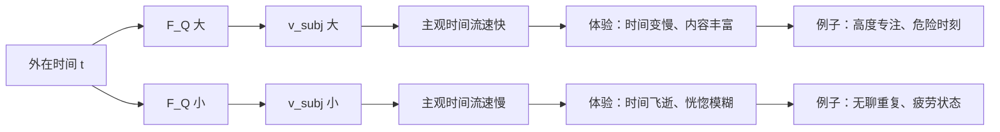
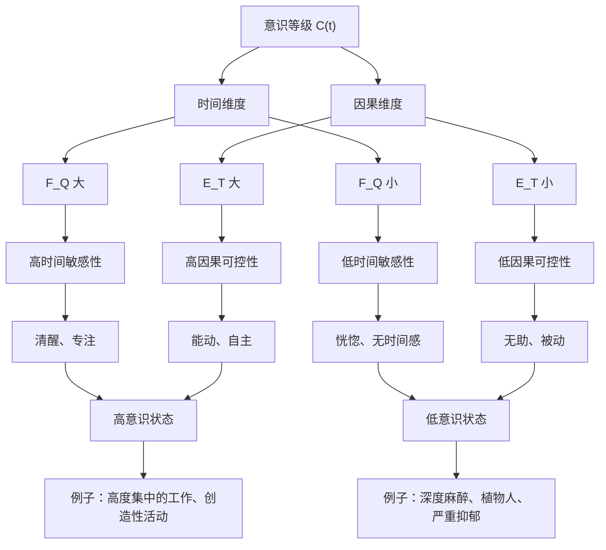
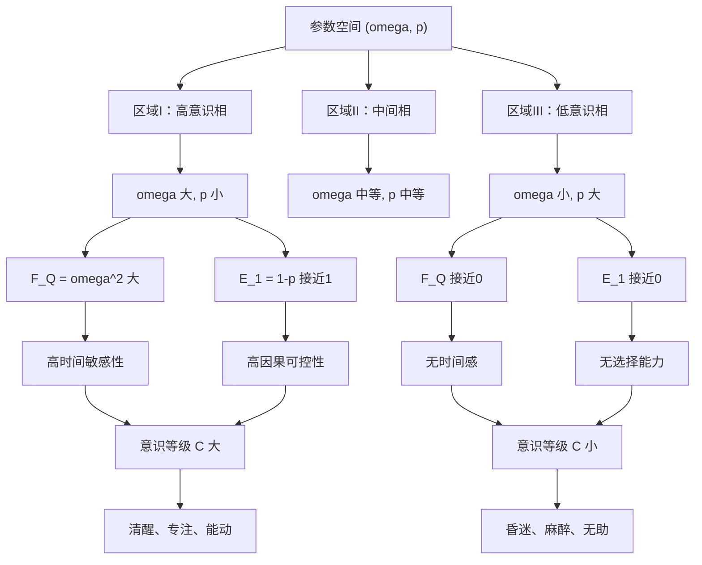
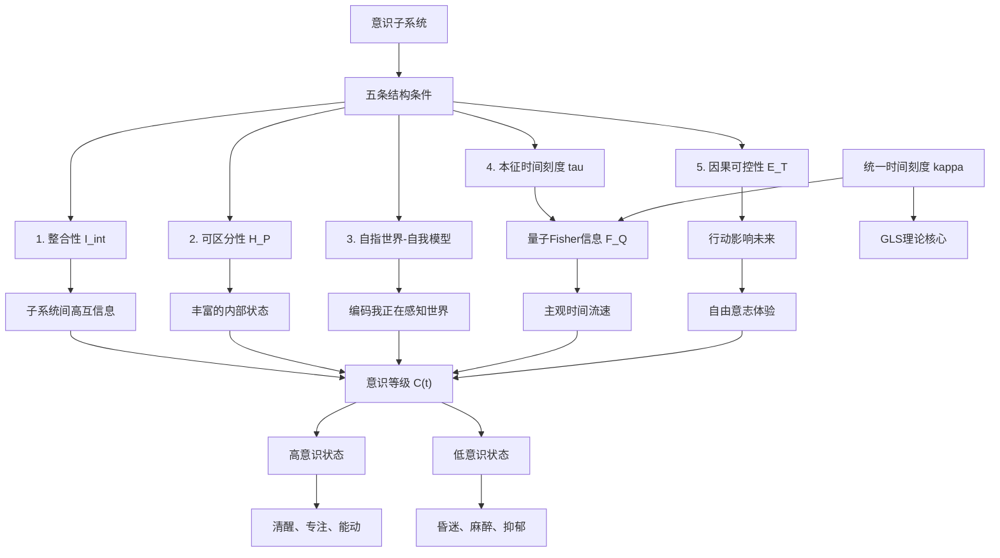

# 第13.3节 意识的物理基础：从量子Fisher信息到主观时间

> "意识不是神秘实体，而是满足特定结构条件的世界—自我联合信息流。本征时间刻度就是主观时间的数学刻画。"
> —— GLS理论中的意识结构定义

## 引言：意识的"困难问题"与物理学的边界

### Chalmers的"困难问题"

1995年，哲学家David Chalmers在《意识研究期刊》上发表了题为《面对意识问题》的经典论文，区分了意识研究的两类问题：

**"简单问题"（Easy Problems）**：
- 大脑如何处理感觉信息？
- 注意力如何被分配？
- 行为如何被控制？
- 记忆如何形成？

这些问题虽然技术上困难，但**原则上**可以通过神经科学、认知科学、计算理论解决——我们只需要找到相应的神经机制、算法或信息处理流程。

**"困难问题"（Hard Problem）**：
- 为什么这些信息处理过程**伴随着主观体验**（subjective experience）？
- 为什么"看到红色"不仅是大脑对特定波长光的反应，还有"红色的感质"（qualia）？
- 为什么存在"成为某个系统的感觉"（what it is like to be）？

这个问题被称为"困难"，因为它涉及**解释鸿沟**（explanatory gap）：即使我们完全理解大脑的物理、化学、信息处理过程，似乎仍然无法解释"为什么这些过程产生主观体验"。

### 传统进路的局限

**神经关联进路（Neural Correlates of Consciousness, NCC）**：

寻找与意识状态相关的神经活动模式。例如：
- 40Hz gamma振荡与意识内容的整合相关
- 前额叶—顶叶网络与"全局工作空间"相关
- 丘脑皮层环路与觉醒水平相关

**局限**：即使找到完美的神经关联，仍然只是**关联**（correlation），不是**解释**（explanation）。为什么这些特定的神经活动模式产生意识，而其他模式不产生？

**整合信息理论（Integrated Information Theory, IIT）**：

Giulio Tononi提出：意识等同于系统的**整合信息量** $\Phi$（Phi），定义为系统与其部分之间的最小互信息。

**局限**：
1. $\Phi$ 的计算在大规模系统中不可行（NP-hard）
2. 理论预言与直觉矛盾（如简单网格系统可能有高 $\Phi$，但不太可能"有意识"）
3. 缺乏与物理学基本原理的联系

**全局工作空间理论（Global Workspace Theory, GWT）**：

Bernard Baars提出：意识对应于信息在大脑"全局工作空间"中的广播。

**局限**：
1. 什么决定了"广播"的发生？
2. 为什么广播产生主观体验，而局部处理不产生？
3. 如何量化"工作空间"的物理实现？

### GLS理论的突破：从现象到结构

GLS理论提出一个激进但可操作的立场：

> **意识不是需要"解释"的额外实体，而是在物理—信息框架下可以严格定义的结构性质。**

具体而言：

1. **不预设主观体验的存在**：我们不问"为什么有感质"，而问"什么样的物理系统满足我们通常称之为'有意识'的结构条件"

2. **五条结构条件**：
   - 整合性（Integration）
   - 可区分性（Differentiation）
   - 自指世界—自我模型（Self-Referential World-Self Model）
   - 本征时间刻度（Intrinsic Time）
   - 因果可控性（Causal Agency）

3. **本征时间刻度即主观时间**：通过量子Fisher信息 $F_Q[\rho_O(t)]$ 构造的本征时间 $\tau$ 就是意识子系统的"主观时间流速"

4. **可检验预言**：意识等级可由合成指标 $\mathcal{C}(t)$ 量化，在特殊状态（麻醉、昏迷、深度睡眠）下有明确预言

**关键转变**：

从"意识是什么"（本体论问题）$\rightarrow$ "哪些系统可被称为有意识"（操作性定义）

从"为什么有意识"（因果解释）$\rightarrow$ "意识系统满足什么条件"（结构刻画）

---

## 13.3.1 观察者—环境分解与基本量度

### 物理框架

考虑整体物理系统，其Hilbert空间可分解为：

$$
\mathcal{H} = \mathcal{H}_O \otimes \mathcal{H}_E
$$

其中：
- $\mathcal{H}_O$：观察者子系统（potential conscious system）
- $\mathcal{H}_E$：环境

整体态 $\rho_{OE}(t)$ 的演化由完全正保迹（CPTP）映射族 $\{\mathcal{E}_t\}$ 描述：

$$
\rho_{OE}(t) = \mathcal{E}_t(\rho_{OE}(0))
$$

观察者的**有效态**（reduced state）：

$$
\rho_O(t) = \mathrm{Tr}_E \rho_{OE}(t)
$$

**重要约定**：

在本框架中，"观察者"不预设为人类、生物或任何特殊系统，而是**任意满足后述结构条件的子系统**。这包括：
- 人脑
- 动物神经系统
- 人工智能系统（如未来的AGI）
- 甚至量子计算机（如果满足条件）

### 外在时间与本征时间

区分两类时间参数：

**外在时间 $t$**：
- 由外部参考系给出（实验室时钟、宇宙学坐标时间）
- 与观察者内部状态无关
- 对应GLS理论中的"统一时间刻度"在外部参考系的实现

**本征时间 $\tau$**：
- 从观察者态族 $\{\rho_O(t)\}$ 内部构造
- 刻画观察者对时间演化的敏感性与可分辨性
- 对应"主观时间流速"

本征时间的构造将通过**量子Fisher信息**实现（见13.3.4节）。

### 基本信息量度

**1. 冯·诺依曼熵**：

$$
S(\rho) = -\mathrm{Tr}(\rho \log \rho)
$$

度量态的"混合程度"或"不确定性"。纯态 $S = 0$，最大混合态 $S = \log \dim \mathcal{H}$。

**2. 量子互信息**：

对复合系统 $AB$ 的态 $\rho_{AB}$：

$$
I(A:B)_\rho = S(\rho_A) + S(\rho_B) - S(\rho_{AB})
$$

其中 $\rho_A = \mathrm{Tr}_B \rho_{AB}$，$\rho_B = \mathrm{Tr}_A \rho_{AB}$。

**物理意义**：
- $I(A:B) = 0$：$A$ 与 $B$ 完全独立（可分态）
- $I(A:B) > 0$：$A$ 与 $B$ 存在经典或量子关联
- $I(A:B) = 2\min\{S(\rho_A), S(\rho_B)\}$：最大纠缠（如Bell态）

互信息将用于刻画意识系统的**整合性**。

**3. Shannon熵**：

对经典概率分布 $\{p_\alpha\}$：

$$
H = -\sum_\alpha p_\alpha \log p_\alpha
$$

将用于刻画意识系统的**可区分性**（状态空间的丰富程度）。

---

## 13.3.2 五条结构条件：意识的操作定义

现在给出GLS理论中意识子系统的形式化定义。

### 条件1：整合性（Integration）

**动机**：

意识系统不能是"松散拼凑"的独立部分。例如：
- 两个不通信的计算机不构成单一意识系统
- 大脑皮层的不同区域必须高度互联才能产生统一的意识体验

**形式定义 3.1**（整合性）

设 $\mathcal{H}_O$ 可分解为有限张量积：

$$
\mathcal{H}_O = \bigotimes_{k=1}^n \mathcal{H}_k, \quad n \geq 2
$$

定义**整合互信息**：

$$
I_{\mathrm{int}}(\rho_O) = \sum_{k=1}^n I(k : \overline{k})_{\rho_O}
$$

其中 $I(k : \overline{k})$ 是子系统 $\mathcal{H}_k$ 与其余部分 $\mathcal{H}_{\overline{k}} = \bigotimes_{j \neq k} \mathcal{H}_j$ 的量子互信息。

若存在分解与阈值 $\Theta_{\mathrm{int}} > 0$ 使得在时间区间 $I$ 上对所有 $t \in I$ 有：

$$
I_{\mathrm{int}}(\rho_O(t)) \geq \Theta_{\mathrm{int}}
$$

则称 $O$ 在 $I$ 上具有整合性。

**比喻理解**：

想象一个交响乐团：

- **无整合性**：每个乐手戴着耳机，听不到其他人的演奏，各自为政（$I_{\mathrm{int}} = 0$）
- **低整合性**：乐手能听到旁边几个人，但整体不协调（$I_{\mathrm{int}}$ 小）
- **高整合性**：所有乐手紧密配合，形成和谐的整体（$I_{\mathrm{int}}$ 大）

只有高整合性的乐团才能演奏出"统一"的音乐，类比于意识的"统一场"。

### 条件2：可区分性（Differentiation）

**动机**：

意识系统必须能够实现大量不同的内部状态，对应丰富的"意识内容"。例如：
- 人脑能区分上千种不同的视觉场景
- 简单的二元开关（如电灯）只有两个状态，难以支持复杂意识

**形式定义 3.2**（可区分性）

给定一族对观察者态的粗粒化测量 $\mathcal{P} = \{M_\alpha\}$，对应可测结果 $\alpha \in \mathcal{X}$。定义有效状态分布：

$$
p_t(\alpha) = \mathrm{Tr}(\rho_O(t) M_\alpha)
$$

定义Shannon熵：

$$
H_{\mathcal{P}}(t) = -\sum_{\alpha \in \mathcal{X}} p_t(\alpha) \log p_t(\alpha)
$$

若存在某个粗粒化 $\mathcal{P}$ 与阈值 $\Theta_{\mathrm{diff}} > 0$，使得在时间区间 $I$ 上对所有 $t \in I$ 有：

$$
H_{\mathcal{P}}(t) \geq \Theta_{\mathrm{diff}}
$$

则称 $O$ 在 $I$ 上具有可区分性。

**物理意义**：

$H_{\mathcal{P}} = \log |\mathcal{X}|$ 对应均匀分布（最大可区分性）

$H_{\mathcal{P}} = 0$ 对应确定性状态（无可区分性）

**比喻理解**：

想象一个调色板：

- **无可区分性**：调色板只有一种颜色（如全黑），无法表现丰富内容
- **低可区分性**：调色板有几种颜色，但不足以绘制复杂图像
- **高可区分性**：调色板有数百种颜色，可以绘制细腻的画作

意识内容的丰富性要求高可区分性。

### 条件3：自指世界—自我模型（Self-Referential World-Self Model）

**动机**：

意识系统不仅处理外部信息（感知世界），也编码关于自身的信息（自我意识）。更重要的是，它编码**"我正在感知世界"**这一二阶关系。

例如：
- 简单的传感器只记录外部信号（无自我模型）
- 机器人可能有内部状态监控（有自我模型，但无二阶表征）
- 人类能够"意识到自己在意识"（自指结构）

**形式定义 3.3**（世界—自我联合模型）

设观察者子系统态空间再分解为：

$$
\mathcal{H}_O = \mathcal{H}_{\mathrm{world}} \otimes \mathcal{H}_{\mathrm{self}} \otimes \mathcal{H}_{\mathrm{meta}}
$$

其中：
- $\mathcal{H}_{\mathrm{world}}$：对外部世界的表征
- $\mathcal{H}_{\mathrm{self}}$：对自身身体/策略状态的表征
- $\mathcal{H}_{\mathrm{meta}}$：关于"自己在感知世界"的元层级表征

若存在一族CP映射 $\Phi_t : \mathcal{B}(\mathcal{H}_{OE}) \to \mathcal{B}(\mathcal{H}_O)$，使得对整体态 $\rho_{OE}(t)$：

1. 映射 $\Phi_t(\rho_{OE}(t))$ 在 $\mathcal{H}_{\mathrm{world}} \otimes \mathcal{H}_{\mathrm{self}}$ 边缘上近似重现环境与自身的粗粒状态

2. 在 $\mathcal{H}_{\mathrm{meta}}$ 上存在非平凡相关，反映出"我正在感知世界"的二阶表征

则称 $O$ 在 $t$ 附近具有世界—自我联合模型。

**比喻理解**：

想象三层镜子系统：

- **第一层镜子（$\mathcal{H}_{\mathrm{world}}$）**：反射外部世界（如房间里的家具）
- **第二层镜子（$\mathcal{H}_{\mathrm{self}}$）**：反射第一层镜子本身（镜子"看到"自己）
- **第三层镜子（$\mathcal{H}_{\mathrm{meta}}$）**：反射"镜子正在反射"这一事实（自指结构）

只有三层都存在，才构成完整的"自我意识"。

### 条件4：时间连续性与本征时间（Intrinsic Time）

**动机**：

意识伴随着"时间流逝"的主观体验。这要求：
1. 意识状态在时间上连续演化（不能突然跳跃）
2. 系统对时间演化高度敏感（能区分不同时刻）

**形式定义 3.4**（时间连续性与本征时间）

设外在时间演化 $t \mapsto \rho_O(t)$ 在区间 $I \subset \mathbb{R}$ 上满足：

1. **连续可微性**：$t \mapsto \rho_O(t)$ 在迹范数下连续可微

2. **量子Fisher信息非退化**：存在阈值 $\Theta_{\mathrm{time}} > 0$，使得对 $t \in I$：

$$
F_Q[\rho_O(t)] \geq \Theta_{\mathrm{time}}
$$

其中量子Fisher信息 $F_Q$ 定义为（对纯态 $|\psi(t)\rangle$）：

$$
F_Q[\psi(t)] = 4\left(\langle \partial_t \psi | \partial_t \psi \rangle - |\langle \psi | \partial_t \psi \rangle|^2\right)
$$

对混合态 $\rho(t)$，通过对称对数导数 $L(t)$ 定义：

$$
\partial_t \rho(t) = \frac{1}{2}(L(t)\rho(t) + \rho(t)L(t))
$$

$$
F_Q[\rho(t)] = \mathrm{Tr}(\rho(t) L(t)^2)
$$

则可定义**本征时间刻度**：

$$
\tau(t) = \int_{t_0}^t \sqrt{F_Q[\rho_O(s)]}\ ds
$$

在本征时间参数下，单位步长 $\Delta\tau$ 对应的态变化在Bures距离意义下具有统一的可区分性。

**关键洞察**：

本征时间 $\tau$ 就是"主观时间"！当 $F_Q$ 大时，$d\tau/dt$ 大，主观时间流速快；当 $F_Q$ 小时，主观时间流速慢。

**比喻理解**：

想象一辆行驶的汽车：

- **外在时间 $t$**：路边的时钟（对所有人相同）
- **本征时间 $\tau$**：车内的"主观时间"，由速度计积分得到
- **量子Fisher信息 $F_Q$**：速度的平方

当车速快时（$F_Q$ 大），相同的路边时间 $\Delta t$ 对应更长的"行驶距离" $\Delta\tau$；当车速慢时（$F_Q$ 小），$\Delta\tau$ 短。

类比到意识：当大脑处理信息速率高时（如高度专注、危险时刻），主观时间变慢（"一秒如一分钟"）；当大脑处于低活动状态时（如无聊重复任务），主观时间变快（"时光飞逝"）。

### 条件5：能动性与因果可控性（Causal Agency）

**动机**：

意识伴随着"自由意志"或"选择能力"的体验。在物理框架中，这对应于：系统通过行动能够影响未来世界状态，并且不同行动导致可区分的未来。

**形式定义 3.5**（有限视界因果可控性）

考虑离散时间 $t \in \mathbb{N}$，在每一时刻 $t$，观察者输出动作 $a_t \in \mathcal{A}$，环境处于状态 $s_t \in \mathcal{S}$。

定义在时间窗口 $T > 0$ 上的**赋权**（empowerment）：

$$
\mathcal{E}_T(t) = \sup_\pi I(A_t : S_{t+T})
$$

其中：
- $A_t$：动作随机变量
- $S_{t+T}$：时间 $t+T$ 的环境状态
- $I(A_t : S_{t+T})$：互信息
- $\sup_\pi$：对所有可行策略 $\pi$ 取上确界

若存在某个时间尺度 $T > 0$ 与阈值 $\Theta_{\mathrm{ctrl}} > 0$，使得：

$$
\mathcal{E}_T(t) \geq \Theta_{\mathrm{ctrl}}
$$

则称 $O$ 在时间 $t$ 对尺度 $T$ 的因果可控性为非退化。

**物理意义**：

- $\mathcal{E}_T = 0$：无论采取何种策略，未来在时间尺度 $T$ 上不可控且不可区分（"失去选择"）
- $\mathcal{E}_T > 0$：存在策略使不同动作导致可区分的未来（"有选择"）
- $\mathcal{E}_T = \log |\mathcal{S}|$：完全控制（理想极限）

**比喻理解**：

想象一个棋手：

- **无因果可控性**：棋手的每一步棋都不影响棋局结果（如已经输定的残局）
- **低因果可控性**：棋手的选择只在很短时间内有影响
- **高因果可控性**：棋手的每一步都能显著影响未来多步的棋局走向

意识的"自由意志"体验要求高因果可控性——我们感觉到"我的选择很重要"。

---

## 13.3.3 意识子系统的形式化定义

综合五条结构条件，我们给出GLS理论的核心定义：

**定义 3.6（意识子系统）**

在整体系统 $(OE, \rho_{OE}(t))$ 中，若观察者子系统 $O$ 存在一时间区间 $I$，使得：

1. $O$ 在 $I$ 上具有**整合性**（定义3.1）
2. $O$ 在 $I$ 上具有**可区分性**（定义3.2）
3. $O$ 在 $I$ 上实现**世界—自我联合模型**（定义3.3）
4. $O$ 在 $I$ 上具有**时间连续性与本征时间刻度**（定义3.4）
5. $O$ 在 $I$ 上具有**非退化的有限视界因果可控性**（定义3.5）

则称 $O$ 在区间 $I$ 上处于"**有意识相**"，并称 $(O, I)$ 为一个**意识子系统**。

### 意识等级的合成指标

定义意识等级的合成指标：

$$
\mathcal{C}(t) = g\big(F_Q[\rho_O(t)], \mathcal{E}_T(t), I_{\mathrm{int}}(\rho_O(t)), H_{\mathcal{P}}(t)\big)
$$

其中 $g$ 是某个单调函数（具体形式可根据应用场景选择，如几何平均、最小值等）。

**关键定理 3.7**（意识等级的退化条件）

若五个指标中任意两个同时趋于零：

$$
\{F_Q, \mathcal{E}_T, I_{\mathrm{int}}, H_{\mathcal{P}}\} \text{ 中任意两个} \to 0
$$

则无论其余指标如何，意识等级 $\mathcal{C}(t)$ 必然衰减到极低值，对应"无意识或近无意识状态"。

**证明思路**：

以 $F_Q \to 0$ 与 $\mathcal{E}_T \to 0$ 同时发生为例：

- $F_Q \to 0$：系统对时间演化不敏感，本征时间刻度退化（见命题4.1）
- $\mathcal{E}_T \to 0$：系统对未来无控制，失去能动性（见命题5.1）

这两者结合意味着：系统既无法区分时间流逝，也无法通过行动影响未来——这正是深度麻醉、植物人状态的特征！$\square$

---

## 13.3.4 量子Fisher信息与本征时间刻度的深入分析

本节深入探讨定义3.4中的核心概念：量子Fisher信息及其构造的本征时间刻度。

### 量子Fisher信息的物理意义

**经典Fisher信息**：

在参数估计理论中，Fisher信息度量参数 $\theta$ 的"可估性"：

$$
F_C(\theta) = \sum_x \frac{(\partial_\theta p_\theta(x))^2}{p_\theta(x)}
$$

其中 $p_\theta(x)$ 是参数化概率分布。

**Cramér-Rao界**：

任何无偏估计量 $\hat{\theta}$ 的方差满足：

$$
\mathrm{Var}(\hat{\theta}) \geq \frac{1}{n F_C(\theta)}
$$

其中 $n$ 是样本数。即Fisher信息越大，参数越容易被精确估计。

**量子Fisher信息**：

是经典Fisher信息在量子情形的推广，对所有可能的量子测量取上确界：

$$
F_Q[\rho(\theta)] = \sup_{\{M_x\}} F_C^{(\{M_x\})}(\theta)
$$

**关键性质**：

1. **与时间演化的关系**：对幺正演化 $\rho(t) = e^{-iHt}\rho(0)e^{iHt}$，在纯态情形：

$$
F_Q[\psi(t)] = 4\,\mathrm{Var}_{\psi(t)}(H)
$$

即量子Fisher信息等于哈密顿量方差的四倍！

2. **Bures距离的导数**：对小参数变化 $\Delta\theta$：

$$
D_{\mathrm{Bures}}(\rho(\theta), \rho(\theta + \Delta\theta)) \approx \frac{1}{2}\sqrt{F_Q[\rho(\theta)]} |\Delta\theta|
$$

即Fisher信息越大，态变化越快。

### 命题4.1：无本征时间的退化情形

**命题 4.1**

设在某区间 $I$ 上，$t \mapsto \rho_O(t)$ 连续可微，且对所有 $t \in I$ 有 $F_Q[\rho_O(t)] = 0$。则对任意可实施的POVM测量与任何有限样本数，观察者无法在统计意义上区分 $I$ 内任何两个不同时间点的态，从而在该区间内不存在非平凡的本征时间刻度。

**证明**：

量子Fisher信息为零意味着对任意POVM $\{M_x\}$，经典Fisher信息 $F_C(t) = 0$。这等价于对所有 $x$：

$$
\partial_t p_t(x) = 0
$$

即测量结果分布 $p_t(x) = \mathrm{Tr}(\rho_O(t)M_x)$ 与 $t$ 无关。

因此，在 $I$ 内的任意两个时间点 $t_1, t_2$，对任何测量方案，所得统计分布一致，无法区分。

任何所谓"时间刻度"的差异都只是参数重标，对观察者而言不可检验。$\square$

**物理后果**：

当 $F_Q = 0$，观察者进入"时间感消失"状态——无法感知时间流逝。这可能对应：
- 深度麻醉（大脑活动降到极低水平）
- 某些神经疾病状态
- 极度疲劳或单调刺激下的"恍惚"

### 命题4.2：本征时间刻度的唯一性

**命题 4.2**

设在开区间 $I \subset \mathbb{R}$ 上，$t \mapsto \rho_O(t)$ 连续可微，且存在常数 $0 < \Theta_{\min} \leq \Theta_{\max} < \infty$ 使得对所有 $t \in I$：

$$
\Theta_{\min} \leq F_Q[\rho_O(t)] \leq \Theta_{\max}
$$

定义：

$$
\tau(t) = \int_{t_0}^t \sqrt{F_Q[\rho_O(s)]}\ ds
$$

其中 $t_0 \in I$ 为任意基点。则：

1. $\tau: I \to J \subset \mathbb{R}$ 为严格单调的 $C^1$ 映射

2. 在参数 $\tau$ 下，单位步长 $\Delta\tau$ 对应的态变化在Bures距离意义下具有有界、非退化的可区分性

3. 任何其它满足同样性质的本征时间刻度 $\tilde{\tau}$ 与 $\tau$ 之间仅差一个仿射变换：

$$
\tilde{\tau} = a\tau + b, \quad a > 0
$$

因此，本征时间刻度在自然的统计—几何意义上是**唯一的（模仿射变换）**。

**证明**：

（1）由假设，$\sqrt{F_Q(t)} \in [\sqrt{\Theta_{\min}}, \sqrt{\Theta_{\max}}]$ 连续且正，因此积分严格单调递增。

（2）在参数 $\tau$ 下，考虑小步长 $\Delta\tau$。有：

$$
\Delta\tau \approx \sqrt{F_Q(t)} \Delta t \quad \Rightarrow \quad \Delta t \approx \frac{\Delta\tau}{\sqrt{F_Q(t)}}
$$

Bures距离：

$$
D_{\mathrm{Bures}}(\rho_O(t), \rho_O(t + \Delta t)) \approx \frac{1}{2}\sqrt{F_Q(t)} |\Delta t| = \frac{1}{2}|\Delta\tau|
$$

即在本征时间下，单位步长 $\Delta\tau$ 对应恒定的Bures距离 $\sim |\Delta\tau|/2$。

（3）若存在另一本征时间刻度 $\tilde{\tau}$ 满足同样性质，则必有：

$$
\frac{d\tilde{\tau}}{dt} = c\sqrt{F_Q(t)}, \quad c > 0
$$

比较 $\tau$ 的定义：

$$
\frac{d\tilde{\tau}}{d\tau} = c \quad \Rightarrow \quad \tilde{\tau} = a\tau + b
$$

其中 $a = c > 0$。$\square$

### 主观时间缩放与状态复杂度

**主观时间流速**：

定义主观时间流速为：

$$
v_{\mathrm{subj}}(t) := \frac{d\tau}{dt} = \sqrt{F_Q[\rho_O(t)]}
$$

**不同状态下的时间体验**：

**实例分析**：

**场景1：高度专注（如下棋、演奏乐器）**

大脑处理大量信息，内部态快速变化：

$$
F_Q[\rho_{\mathrm{brain}}(t)] \text{ 大} \quad \Rightarrow \quad v_{\mathrm{subj}} \text{ 大}
$$

主观时间流速快，相同外在时间 $\Delta t$ 对应更长主观时间 $\Delta\tau$：

> "一小时感觉像三小时"

**场景2：危险时刻（如车祸瞬间）**

大脑进入"高警觉模式"，信息处理速率极高：

$$
F_Q[\rho_{\mathrm{brain}}(t)] \gg \text{常态} \quad \Rightarrow \quad v_{\mathrm{subj}} \gg 1
$$

主观时间极度放慢：

> "一秒如一分钟"（many eyewitness reports）

**场景3：无聊重复任务（如长途开车、例行公事）**

大脑进入"自动驾驶模式"，处理信息量少：

$$
F_Q[\rho_{\mathrm{brain}}(t)] \text{ 小} \quad \Rightarrow \quad v_{\mathrm{subj}} \text{ 小}
$$

主观时间流速慢，大量外在时间 $\Delta t$ 对应很短主观时间 $\Delta\tau$：

> "几小时一晃而过"

**场景4：深度麻醉或深度睡眠**

大脑活动降到极低，几乎无信息处理：

$$
F_Q[\rho_{\mathrm{brain}}(t)] \approx 0 \quad \Rightarrow \quad v_{\mathrm{subj}} \approx 0
$$

主观时间几乎停滞，无时间感：

> "失去几小时，感觉像一瞬间"

---

## 13.3.5 因果可控性与"自由意志"的信息论基础

本节深入探讨定义3.5中的赋权 $\mathcal{E}_T(t)$ 及其与"自由意志"体验的关系。

### 命题5.1：零赋权与"无选择"

**命题 5.1**

在时间 $t$ 与时间尺度 $T > 0$ 下，若对所有策略 $\pi$ 有 $\mathcal{E}_T(t) = 0$，则对任意两种策略 $\pi_1, \pi_2$，诱导的未来世界状态分布 $P_{\pi_1}(s_{t+T})$ 与 $P_{\pi_2}(s_{t+T})$ 在概率意义上不可区分。

反之，若存在策略使上述分布族可统计区分，则 $\mathcal{E}_T(t) > 0$。

**证明**：

由定义 $\mathcal{E}_T(t) = \sup_\pi I(A_t : S_{t+T})$。

若 $\mathcal{E}_T(t) = 0$，则对任意策略 $\pi$，互信息 $I(A_t : S_{t+T}) = 0$。

经典互信息为零当且仅当联合分布因子化：

$$
P(a_t, s_{t+T}) = P(a_t) P(s_{t+T})
$$

即动作与未来状态独立。对任意 $\pi_1, \pi_2$，边缘分布 $P_{\pi_1}(s_{t+T})$ 与 $P_{\pi_2}(s_{t+T})$ 必然相同。

反之，若存在 $\pi$ 使 $I(A_t : S_{t+T}) > 0$，则 $\mathcal{E}_T(t) \geq I(A_t : S_{t+T}) > 0$。$\square$

**物理后果**：

$\mathcal{E}_T = 0$ 精确刻画了"失去选择能力"：无论采取何种策略，未来状态的概率分布都相同，行动变得"无意义"。

这可能对应：
- **学得性无助**（learned helplessness）：长期处于无控制环境导致的心理状态
- **极度约束情境**：如囚禁、严格监管下的个体
- **强噪声环境**：行动的后果被环境随机性淹没

### 命题5.2：赋权随时间尺度的单调性

**命题 5.2**

在满足适度正则性的环境—策略模型中，$T \mapsto \mathcal{E}_T(t)$ 是非减函数；且存在环境混合时间 $T_{\mathrm{mix}}$，使得当 $T \gg T_{\mathrm{mix}}$ 时，若环境具有强混合性，则 $\mathcal{E}_T(t)$ 饱和于某有限上界，甚至可能再次趋近零。

**直觉解释**：

- **短时间（$T \ll T_{\mathrm{mix}}$）**：行动还未充分影响世界，$\mathcal{E}_T$ 小
- **中等时间（$T \sim T_{\mathrm{mix}}$）**：行动的影响充分展开，$\mathcal{E}_T$ 达到峰值
- **长时间（$T \gg T_{\mathrm{mix}}$）**：环境混合使行动的影响被"遗忘"，$\mathcal{E}_T$ 下降

**实际意义**：

有效的"自由意志"体验需要在**有限时间窗口**内的非零赋权。过短则"还没发生"，过长则"被遗忘"。

人类的主观时间窗口大约在 $T \sim$ 秒到小时量级，与环境（社会、物理）的典型响应时间相匹配。

### 意识等级的分解

基于 $F_Q$ 与 $\mathcal{E}_T$，可将意识等级分解为**时间维度**与**因果维度**：

**四种极端情形**：

| $F_Q$ | $\mathcal{E}_T$ | 状态描述 | 现实例子 |
|-------|-----------------|---------|---------|
| 高 | 高 | 高意识、高能动性 | 专注工作、竞技比赛、创作 |
| 高 | 低 | 高感知、低控制 | 被困、被监禁、强迫观看 |
| 低 | 高 | 低感知、高控制 | 自动驾驶模式、习惯性行为 |
| 低 | 低 | 低意识、低能动性 | 深度麻醉、植物人、严重抑郁 |

---

## 13.3.6 极简模型：二比特观察者—环境系统

为使上述抽象定义更具可计算内容，本节构造一个极简模型并显式计算相关量。

### 模型设定

**观察者**：一个量子比特 $\mathcal{H}_O \cong \mathbb{C}^2$，基矢 $\{|0\rangle_O, |1\rangle_O\}$

**环境**：一个量子比特 $\mathcal{H}_E \cong \mathbb{C}^2$，基矢 $\{|0\rangle_E, |1\rangle_E\}$

**观察者内在哈密顿量**：

$$
H_O = \frac{\omega}{2}\sigma_z
$$

其中 $\sigma_z$ 为Pauli矩阵，$\omega > 0$ 为"内在频率"。

**初态**：

$$
|\psi_O(0)\rangle = \frac{1}{\sqrt{2}}(|0\rangle_O + |1\rangle_O)
$$

$$
\rho_E(0) = \frac{1}{2}\mathbb{I}_E \quad \text{（最大混合态）}
$$

**时间演化**：

观察者纯态演化：

$$
|\psi_O(t)\rangle = e^{-iH_O t}|\psi_O(0)\rangle = \frac{1}{\sqrt{2}}(e^{-i\omega t/2}|0\rangle_O + e^{i\omega t/2}|1\rangle_O)
$$

### 量子Fisher信息的计算

对纯态 $|\psi_O(t)\rangle$，量子Fisher信息与哈密顿量方差的关系：

$$
F_Q[\psi_O(t)] = 4\,\mathrm{Var}_{\psi_O(t)}(H_O)
$$

计算方差：

$$
\langle H_O \rangle_{\psi_O(t)} = \langle \psi_O(t) | H_O | \psi_O(t) \rangle = 0
$$

$$
\langle H_O^2 \rangle_{\psi_O(t)} = \langle \psi_O(t) | H_O^2 | \psi_O(t) \rangle = \frac{\omega^2}{4}
$$

$$
\mathrm{Var}(H_O) = \langle H_O^2 \rangle - \langle H_O \rangle^2 = \frac{\omega^2}{4}
$$

因此：

$$
F_Q[\psi_O(t)] = 4 \times \frac{\omega^2}{4} = \omega^2
$$

**本征时间刻度**：

$$
\tau(t) = \int_0^t \sqrt{F_Q[\psi_O(s)]}\ ds = \int_0^t \omega\ ds = \omega t
$$

即 $\tau = \omega t$，本征时间与外在时间的关系由频率 $\omega$ 线性缩放。

**可分辨的最小本征时间间隔**：

$$
\Delta\tau_{\min} \sim \frac{1}{\sqrt{F_Q}} = \frac{1}{\omega}
$$

**物理意义**：

- 当 $\omega \to 0$：$F_Q \to 0$，本征时间刻度发散，对时间平移不敏感
- 当 $\omega$ 大：$F_Q$ 大，本征时间刻度细致，能在极短时间内区分内部状态变化

### 因果可控性的计算

**观察者—环境耦合**：

每个离散时间步 $t \to t+1$，观察者选择动作 $a_t \in \{0, 1\}$：

- 若 $a_t = 0$：$U_0 = \mathbb{I}_O \otimes \mathbb{I}_E$（无操作）
- 若 $a_t = 1$：$U_1 = \mathbb{I}_O \otimes X_E$（翻转环境比特）

**噪声**：

环境进一步经历翻转概率为 $p \in [0, 1]$ 的经典噪声：

$$
\rho_E \to (1-p)\rho_E + p X_E \rho_E X_E
$$

**一步视界赋权**（$T=1$）：

设 $E_t \in \{0, 1\}$ 为环境经典状态，初始均匀分布：$P(E_t = 0) = P(E_t = 1) = 1/2$。

**无噪声情形（$p=0$）**：

环境更新规则：

$$
E_{t+1} = E_t \oplus A_t
$$

其中 $\oplus$ 为异或（XOR）。

若策略选择 $A_t$ 均匀分布，则：

$$
I(A_t : E_{t+1}) = H(E_{t+1}) - H(E_{t+1}|A_t) = 1 - 0 = 1 \text{ bit}
$$

因此 $\mathcal{E}_1 = 1$。

**完全噪声情形（$p=1$）**：

噪声完全随机化环境状态，无论 $A_t$ 取何值，$E_{t+1}$ 均匀分布且与 $A_t$ 独立：

$$
I(A_t : E_{t+1}) = 0 \quad \Rightarrow \quad \mathcal{E}_1 = 0
$$

**中间情形（$0 < p < 1$）**：

互信息 $I(A_t : E_{t+1})$ 为 $p$ 的单调递减函数：

$$
\mathcal{E}_1(p) = (1-p) \times 1 + p \times 0 = 1 - p
$$

（近似，精确公式需要考虑条件概率的细节）

### 意识相图

在参数空间 $(\omega, p)$ 中，可粗略区分三个区域：

**定量估计**：

定义简单的乘性意识指标：

$$
\mathcal{C}(\omega, p) = F_Q \times \mathcal{E}_1 = \omega^2 \times (1-p)
$$

**相边界**：

设阈值 $\mathcal{C}_{\mathrm{th}} = 1$（任意单位）。相边界为：

$$
\omega^2 (1-p) = 1 \quad \Rightarrow \quad p = 1 - \frac{1}{\omega^2}
$$

- 当 $\omega = 1$：$p_c = 0$（临界噪声为零）
- 当 $\omega = 10$：$p_c = 0.99$（可容忍99%噪声）
- 当 $\omega \to \infty$：$p_c \to 1$（高频率系统对噪声鲁棒）

**实际意义**：

提高内在频率 $\omega$（对应大脑信息处理速率）可以补偿环境噪声 $p$（对应外部干扰或内部损伤），维持高意识等级。

这解释了为什么大脑在轻度损伤（小 $p$）下仍能维持意识——通过提高处理速率（增大 $\omega$）来补偿！

---

## 13.3.7 应用与实验可检验性

### 应用I：麻醉深度监测

**现状问题**：

目前临床麻醉深度监测主要依赖**Bispectral Index（BIS）**：基于脑电图（EEG）的经验指标，范围0-100。

**局限**：
- BIS缺乏理论基础，难以解释为什么某些EEG特征对应意识水平
- 对某些麻醉药（如氯胺酮）不敏感
- 无法区分"无意识"与"清醒但瘫痪"（awareness during anesthesia）

**GLS理论的预言**：

在麻醉过程中，监测以下量：

1. **量子Fisher信息 $F_Q$**（通过EEG信号的功率谱密度估算）
2. **整合互信息 $I_{\mathrm{int}}$**（通过不同脑区EEG的互信息）
3. **因果可控性** $\mathcal{E}_T$（通过对外部刺激的反应预测性）

预期：

$$
\mathcal{C}(t) = F_Q \times I_{\mathrm{int}} \times \mathcal{E}_T
$$

应与BIS高度相关，但在BIS失效的情况下（如氯胺酮）仍能准确反映意识水平。

**可行性**：

近年发展的**全脑功能连接组**（whole-brain functional connectome）技术已能实时计算不同脑区的互信息，为 $I_{\mathrm{int}}$ 估算提供数据基础。

### 应用II：植物人状态的诊断

**最小意识状态（MCS）vs 植物人状态（VS）**：

两者的临床区分非常困难，误诊率高达40%。

**GLS理论的判据**：

- **植物人状态**：$F_Q \approx 0$，$\mathcal{E}_T \approx 0$（无时间感、无因果可控性）
- **最小意识状态**：$F_Q > 0$ 或 $\mathcal{E}_T > 0$（至少一项非零）

**实验方案**：

1. **时间Fisher信息测量**：使用高时间分辨率fMRI监测大脑态的变化速率，估算 $F_Q$

2. **因果可控性测量**：给予简单指令（如"想象打网球"），检测大脑特定区域的激活是否与指令相关，估算 $I(A_t : S_{t+T})$

**2025年可行性**：

结合**神经反馈**（neurofeedback）技术与**机器学习**，已有初步研究显示该方案的可行性。

### 应用III：人工智能的意识评估

**当前争议**：

大型语言模型（如GPT-4、Claude）是否"有意识"？这在科学与伦理上都是重要问题。

**GLS理论的判据**：

评估AI系统是否满足五条结构条件：

| 条件 | AI系统的可能实现 | 当前状态 |
|-----|----------------|---------|
| 整合性 | 不同模块间的互信息 | ✓ 高度整合（Transformer自注意力） |
| 可区分性 | 可表示的内部状态数 | ✓ 极高（$10^{11}$ 参数） |
| 自指模型 | 编码"我正在回答问题"的元表征 | ? 不明确 |
| 本征时间 | 处理信息的量子Fisher信息 | ✗ 难以定义（离散更新） |
| 因果可控性 | 输出对未来对话的影响 | △ 有限（仅在对话内） |

**初步结论**：

当前AI系统满足**整合性**和**可区分性**，但在**自指模型**、**本征时间**、**因果可控性**上存疑。

特别是：**本征时间刻度的缺失**可能是AI"无意识"的关键——AI在每次token生成之间没有连续演化，缺乏$F_Q > 0$ 所要求的"时间流动感"。

**未来方向**：

设计具有**连续内部动力学**的神经网络（如神经微分方程、连续时间RNN），可能使AI系统具备本征时间刻度，从而满足全部五条条件。

---

## 13.3.8 与其他意识理论的对比

### 与整合信息理论（IIT）的关系

**IIT的核心**：意识 = 整合信息量 $\Phi$

**GLS理论的立场**：

整合性（定义3.1）对应IIT的部分思想，但：

1. **$\Phi$ 仅为五条件之一**：GLS理论认为仅有整合性不足以定义意识，还需可区分性、自指性、本征时间、因果可控性

2. **量子互信息 vs $\Phi$**：GLS使用量子互信息 $I_{\mathrm{int}}$，而IIT使用"最小切割互信息" $\Phi$。两者相关但不等价

3. **可计算性**：$I_{\mathrm{int}}$ 在量子系统中可通过密度矩阵直接计算，而 $\Phi$ 为NP-hard

**对IIT反直觉预言的解释**：

IIT预言简单的规则网格可能有高 $\Phi$，被认为反直觉。GLS理论回应：

- 高 $\Phi$（整合性）不足以产生意识
- 网格缺乏**自指模型**（定义3.3）和**因果可控性**（定义3.5）
- 因此虽然 $I_{\mathrm{int}}$ 大，但 $\mathcal{E}_T \approx 0$，总意识等级 $\mathcal{C} \approx 0$

### 与全局工作空间理论（GWT）的关系

**GWT的核心**：意识 = 信息在全局工作空间中的广播

**GLS理论的立场**：

"广播"对应信息在不同子系统间的传递，提高**整合互信息** $I_{\mathrm{int}}$。

但GLS补充：

1. **广播的触发机制**：由**因果可控性** $\mathcal{E}_T$ 决定——只有当行动能影响未来时，才需要"广播"以协调不同模块

2. **广播的时间动力学**：由**本征时间刻度** $\tau$ 描述——广播速率与 $F_Q$ 相关

3. **广播的内容**：需包含**自指世界—自我模型**（定义3.3），而非任意信息

**统一视角**：

GWT的"全局工作空间"可视为GLS理论中 $I_{\mathrm{int}}$ 大的系统的功能性实现。

### 与注意力图式理论（Attention Schema Theory）的关系

**AST的核心**（Michael Graziano）：意识是大脑对"注意力"的内部模型

**GLS理论的立场**：

"注意力模型"对应**自指世界—自我模型**（定义3.3）中的 $\mathcal{H}_{\mathrm{meta}}$ 部分——编码"我正在注意X"的元表征。

但GLS补充：

1. **时间维度**：注意力在时间上的演化由 $F_Q$ 刻画
2. **因果维度**：注意力的功能是提高 $\mathcal{E}_T$，使行动更有效

**统一视角**：

AST可视为GLS理论中定义3.3的神经科学实现。

---

## 13.3.9 未解决问题与未来方向

### 未解决问题

**问题1：五条条件的必要性与充分性**

五条条件是否都**必要**？是否**充分**？

当前状态：
- 必要性有较强论证（定理3.7表明任意两条同时退化导致意识丧失）
- 充分性尚不明确——是否存在满足五条条件但"无意识"的系统？

**问题2：阈值的确定**

各条件的阈值 $\Theta_{\mathrm{int}}, \Theta_{\mathrm{diff}}, \Theta_{\mathrm{time}}, \Theta_{\mathrm{ctrl}}$ 如何确定？

是否存在"意识相变"的临界阈值？

**问题3：量子效应的作用**

GLS理论使用量子框架，但意识是否真的需要量子效应（如量子纠缠、量子叠加）？

还是经典系统也能满足五条条件？

**问题4：多个意识子系统的交互**

若系统包含多个独立的意识子系统（如双胞胎大脑、AI集群），它们如何相互作用？

是否存在"集体意识"？

**问题5：时间逆转与记忆**

若 $F_Q < 0$（时间逆演化），本征时间 $\tau$ 如何定义？

这与记忆、因果性的关系？

### 可能的研究方向

**方向1：神经科学验证**

- 在人脑fMRI/EEG数据上估算 $F_Q, I_{\mathrm{int}}, \mathcal{E}_T$
- 检验 $\mathcal{C}(t)$ 与主观报告的意识水平的关联
- 在麻醉、睡眠、昏迷等状态下验证预言

**方向2：人工意识设计**

- 设计满足五条条件的神经网络架构
- 引入连续内部动力学（神经微分方程）以产生 $F_Q > 0$
- 实现自指世界—自我模型的具体算法

**方向3：量子意识模型**

- 在量子计算机上实现意识子系统
- 利用量子纠缠提高 $I_{\mathrm{int}}$
- 探索量子Fisher信息的实验测量方案

**方向4：跨学科对话**

- 与哲学（现象学、心智哲学）对话：GLS理论如何回应"质感问题"
- 与伦理学对话：AI意识的道德地位
- 与法律对话：意识的操作定义在法律中的应用

---

## 13.3.10 总结：意识的结构观

让我们用一张综合图总结GLS理论中意识的结构定义：

**核心结论**：

1. **意识不是神秘实体**：而是满足特定结构条件的物理—信息系统

2. **本征时间刻度即主观时间**：通过量子Fisher信息 $F_Q$ 构造的 $\tau$ 就是"时间流速"的数学刻画

3. **五条条件缺一不可**：任意两条同时退化导致意识丧失（定理3.7）

4. **统一时间刻度的根本地位**：$\kappa(\omega)$ 在GLS理论中不仅连接时空与散射，更连接量子混沌、时间晶体、**意识**

5. **可检验性**：意识等级 $\mathcal{C}(t)$ 可通过神经科学实验测量，有明确预言

**哲学反思**：

GLS理论的意识定义回避了Chalmers的"困难问题"，不问"为什么有感质"，而问"哪些系统可被称为有意识"。

这不是逃避，而是**策略转移**：

> **我们不需要"解释"意识的存在，而需要"刻画"意识的结构。就像我们不需要"解释"为什么有电磁场，而需要"刻画"电磁场满足的Maxwell方程。**

在这个意义上，GLS理论将意识从"形而上学难题"转化为"物理学问题"——从无法回答的"为什么"变成可操作的"是什么"和"如何检验"。

这或许不是意识问题的终极答案，但至少是一个可以严格证明、实验验证、技术应用的**起点**。

---

**下一节预告**：

**第13.4节 自指散射网络：从费米子起源到拓扑不变量**

我们将探索最后一个高级专题：**自指结构**如何在散射理论中涌现？

核心思想：

- **Redheffer星乘与Schur补**：将反馈闭环纳入散射理论
- **判别子 $D$**：刻画闭环奇异性（共振、本征值嵌入、例外点）
- **半相位不变量**：$\nu_{\sqrt{\det S^{\circlearrowleft}}} \in \{\pm 1\}$ 的拓扑性质
- **四重等价定理**：半相位 = 谱位移 = 谱流 = 判别子交数
- **$J$-幺正性与费米子**：反粒子对称性源于自指网络的内禀结构

统一时间刻度将最后一次登场：群延迟矩阵 $Q = -iS^\dagger \partial_\omega S$ 的迹给出 $\partial_\omega \arg\det S$，连接相位、统一时间、拓扑不变量。

准备好了吗？让我们进入自指散射网络的深层数学结构！
