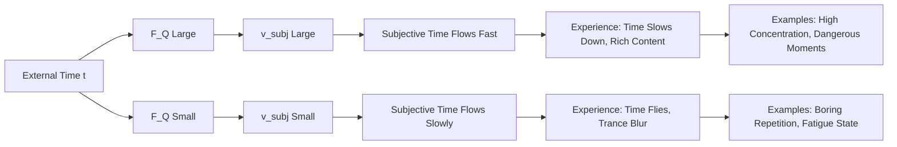
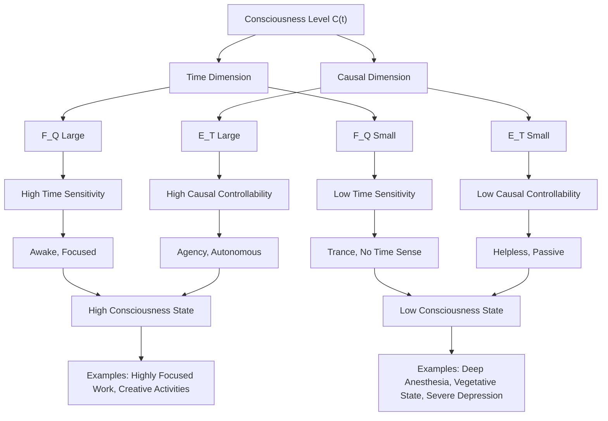
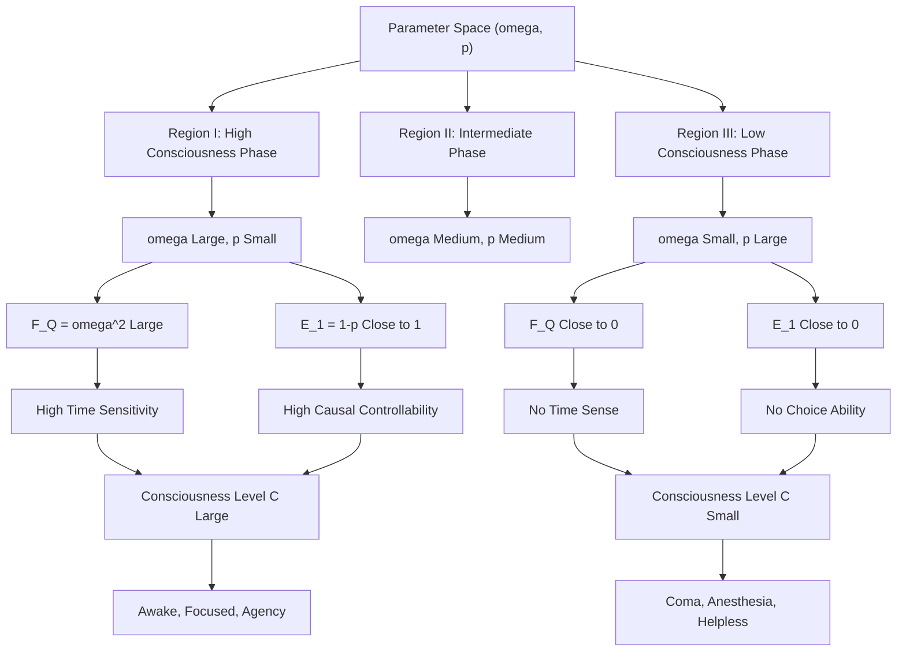
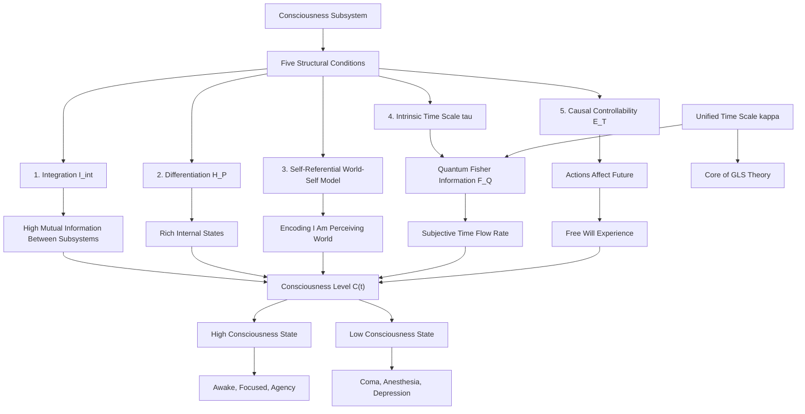

# Section 13.3 Physical Basis of Consciousness: From Quantum Fisher Information to Subjective Time

> "Consciousness is not a mysterious entity, but a world-self joint information flow satisfying specific structural conditions. The intrinsic time scale is the mathematical characterization of subjective time."
> —— Structural Definition of Consciousness in GLS Theory

## Introduction: The "Hard Problem" of Consciousness and the Boundaries of Physics

### Chalmers' "Hard Problem"

In 1995, philosopher David Chalmers published a classic paper titled "Facing Up to the Problem of Consciousness" in the *Journal of Consciousness Studies*, distinguishing two types of problems in consciousness research:

**"Easy Problems"**:
- How does the brain process sensory information?
- How is attention allocated?
- How is behavior controlled?
- How is memory formed?

These problems are technically difficult but can **in principle** be solved through neuroscience, cognitive science, and computational theory—we only need to find the corresponding neural mechanisms, algorithms, or information processing flows.

**"Hard Problem"**:
- Why do these information processing processes **accompany subjective experience**?
- Why is "seeing red" not just the brain's response to light of a specific wavelength, but also the "quale of red"?
- Why does "what it is like to be" exist?

This problem is called "hard" because it involves an **explanatory gap**: even if we fully understand the physical, chemical, and information processing processes of the brain, we still seem unable to explain "why these processes produce subjective experience."

### Limitations of Traditional Approaches

**Neural Correlates of Consciousness (NCC)**:

Searching for neural activity patterns correlated with conscious states. For example:
- 40Hz gamma oscillations correlate with integration of conscious content
- Prefrontal-parietal networks correlate with "global workspace"
- Thalamocortical circuits correlate with arousal levels

**Limitations**: Even if perfect neural correlates are found, they are still only **correlations**, not **explanations**. Why do these specific neural activity patterns produce consciousness, while others do not?

**Integrated Information Theory (IIT)**:

Giulio Tononi proposed: consciousness equals the system's **integrated information** $\Phi$ (Phi), defined as the minimum mutual information between the system and its parts.

**Limitations**:
1. Computation of $\Phi$ is infeasible in large-scale systems (NP-hard)
2. Theoretical predictions contradict intuition (e.g., simple grid systems may have high $\Phi$ but are unlikely to "be conscious")
3. Lack of connection to fundamental principles of physics

**Global Workspace Theory (GWT)**:

Bernard Baars proposed: consciousness corresponds to information broadcast in the brain's "global workspace."

**Limitations**:
1. What determines the occurrence of "broadcast"?
2. Why does broadcast produce subjective experience, while local processing does not?
3. How to quantify the physical implementation of the "workspace"?

### GLS Theory's Breakthrough: From Phenomenon to Structure

GLS theory proposes a radical but operational stance:

> **Consciousness is not an additional entity that needs to be "explained," but a structural property that can be strictly defined within a physical-informational framework.**

Specifically:

1. **No Presupposition of Subjective Experience**: We do not ask "why qualia exist," but ask "what physical systems satisfy the structural conditions we usually call 'conscious'"

2. **Five Structural Conditions**:
   - Integration
   - Differentiation
   - Self-Referential World-Self Model
   - Intrinsic Time Scale
   - Causal Agency

3. **Intrinsic Time Scale is Subjective Time**: The intrinsic time $\tau$ constructed from quantum Fisher information $F_Q[\rho_O(t)]$ is precisely the "subjective time flow rate" of the consciousness subsystem

4. **Testable Predictions**: Consciousness level can be quantified by a composite index $\mathcal{C}(t)$, with clear predictions in special states (anesthesia, coma, deep sleep)

**Key Shift**:

From "what is consciousness" (ontological question) $\rightarrow$ "which systems can be called conscious" (operational definition)

From "why consciousness exists" (causal explanation) $\rightarrow$ "what conditions do conscious systems satisfy" (structural characterization)

---

## 13.3.1 Observer-Environment Decomposition and Basic Measures

### Physical Framework

Consider the overall physical system, whose Hilbert space can be decomposed as:

$$
\mathcal{H} = \mathcal{H}_O \otimes \mathcal{H}_E
$$

where:
- $\mathcal{H}_O$: Observer subsystem (potential conscious system)
- $\mathcal{H}_E$: Environment

Evolution of the overall state $\rho_{OE}(t)$ is described by a family of completely positive trace-preserving (CPTP) maps $\{\mathcal{E}_t\}$:

$$
\rho_{OE}(t) = \mathcal{E}_t(\rho_{OE}(0))
$$

Observer's **effective state** (reduced state):

$$
\rho_O(t) = \mathrm{Tr}_E \rho_{OE}(t)
$$

**Important Convention**:

In this framework, "observer" is not presupposed to be human, biological, or any special system, but **any subsystem satisfying the structural conditions described below**. This includes:
- Human brains
- Animal nervous systems
- Artificial intelligence systems (such as future AGI)
- Even quantum computers (if conditions are satisfied)

### External Time and Intrinsic Time

Distinguish two types of time parameters:

**External Time $t$**:
- Given by external reference frame (laboratory clock, cosmological coordinate time)
- Independent of observer's internal state
- Corresponds to the realization of "unified time scale" in GLS theory in external reference frame

**Intrinsic Time $\tau$**:
- Constructed internally from observer state family $\{\rho_O(t)\}$
- Characterizes observer's sensitivity and distinguishability to time evolution
- Corresponds to "subjective time flow rate"

Construction of intrinsic time will be achieved through **quantum Fisher information** (see Section 13.3.4).

### Basic Information Measures

**1. Von Neumann Entropy**:

$$
S(\rho) = -\mathrm{Tr}(\rho \log \rho)
$$

Measures the "mixedness" or "uncertainty" of a state. Pure state $S = 0$, maximally mixed state $S = \log \dim \mathcal{H}$.

**2. Quantum Mutual Information**:

For composite system $AB$ with state $\rho_{AB}$:

$$
I(A:B)_\rho = S(\rho_A) + S(\rho_B) - S(\rho_{AB})
$$

where $\rho_A = \mathrm{Tr}_B \rho_{AB}$, $\rho_B = \mathrm{Tr}_A \rho_{AB}$.

**Physical Meaning**:
- $I(A:B) = 0$: $A$ and $B$ are completely independent (separable state)
- $I(A:B) > 0$: $A$ and $B$ have classical or quantum correlations
- $I(A:B) = 2\min\{S(\rho_A), S(\rho_B)\}$: Maximum entanglement (e.g., Bell state)

Mutual information will be used to characterize the **integration** of conscious systems.

**3. Shannon Entropy**:

For classical probability distribution $\{p_\alpha\}$:

$$
H = -\sum_\alpha p_\alpha \log p_\alpha
$$

Will be used to characterize the **differentiation** of conscious systems (richness of state space).

---

## 13.3.2 Five Structural Conditions: Operational Definition of Consciousness

Now we give the formal definition of consciousness subsystems in GLS theory.

### Condition 1: Integration

**Motivation**:

Conscious systems cannot be "loosely assembled" independent parts. For example:
- Two non-communicating computers do not constitute a single conscious system
- Different regions of the cerebral cortex must be highly interconnected to produce unified conscious experience

**Formal Definition 3.1** (Integration)

Let $\mathcal{H}_O$ be decomposable as a finite tensor product:

$$
\mathcal{H}_O = \bigotimes_{k=1}^n \mathcal{H}_k, \quad n \geq 2
$$

Define **integrated mutual information**:

$$
I_{\mathrm{int}}(\rho_O) = \sum_{k=1}^n I(k : \overline{k})_{\rho_O}
$$

where $I(k : \overline{k})$ is the quantum mutual information between subsystem $\mathcal{H}_k$ and the remainder $\mathcal{H}_{\overline{k}} = \bigotimes_{j \neq k} \mathcal{H}_j$.

If there exists a decomposition and threshold $\Theta_{\mathrm{int}} > 0$ such that for all $t \in I$ in time interval $I$:

$$
I_{\mathrm{int}}(\rho_O(t)) \geq \Theta_{\mathrm{int}}
$$

then $O$ is said to have integration on $I$.

**Metaphorical Understanding**:

Imagine a symphony orchestra:

- **No Integration**: Each musician wears headphones, cannot hear others' playing, acts independently ($I_{\mathrm{int}} = 0$)
- **Low Integration**: Musicians can hear a few nearby people, but overall uncoordinated ($I_{\mathrm{int}}$ small)
- **High Integration**: All musicians closely cooperate, forming a harmonious whole ($I_{\mathrm{int}}$ large)

Only highly integrated orchestras can play "unified" music, analogous to consciousness's "unified field."

### Condition 2: Differentiation

**Motivation**:

Conscious systems must be able to realize a large number of different internal states, corresponding to rich "conscious content." For example:
- Human brains can distinguish thousands of different visual scenes
- Simple binary switches (like light bulbs) have only two states, difficult to support complex consciousness

**Formal Definition 3.2** (Differentiation)

Given a family of coarse-grained measurements $\mathcal{P} = \{M_\alpha\}$ on observer states, corresponding to measurable outcomes $\alpha \in \mathcal{X}$. Define effective state distribution:

$$
p_t(\alpha) = \mathrm{Tr}(\rho_O(t) M_\alpha)
$$

Define Shannon entropy:

$$
H_{\mathcal{P}}(t) = -\sum_{\alpha \in \mathcal{X}} p_t(\alpha) \log p_t(\alpha)
$$

If there exists some coarse-graining $\mathcal{P}$ and threshold $\Theta_{\mathrm{diff}} > 0$ such that for all $t \in I$ in time interval $I$:

$$
H_{\mathcal{P}}(t) \geq \Theta_{\mathrm{diff}}
$$

then $O$ is said to have differentiation on $I$.

**Physical Meaning**:

$H_{\mathcal{P}} = \log |\mathcal{X}|$ corresponds to uniform distribution (maximum differentiation)

$H_{\mathcal{P}} = 0$ corresponds to deterministic state (no differentiation)

**Metaphorical Understanding**:

Imagine a color palette:

- **No Differentiation**: Palette has only one color (e.g., all black), cannot express rich content
- **Low Differentiation**: Palette has a few colors, but insufficient to draw complex images
- **High Differentiation**: Palette has hundreds of colors, can draw delicate paintings

Richness of conscious content requires high differentiation.

### Condition 3: Self-Referential World-Self Model

**Motivation**:

Conscious systems not only process external information (perceiving the world) but also encode information about themselves (self-awareness). More importantly, they encode the second-order relation **"I am perceiving the world."**

For example:
- Simple sensors only record external signals (no self-model)
- Robots may have internal state monitoring (have self-model, but no second-order representation)
- Humans can "be aware of being aware" (self-referential structure)

**Formal Definition 3.3** (World-Self Joint Model)

Let observer subsystem state space be further decomposed as:

$$
\mathcal{H}_O = \mathcal{H}_{\mathrm{world}} \otimes \mathcal{H}_{\mathrm{self}} \otimes \mathcal{H}_{\mathrm{meta}}
$$

where:
- $\mathcal{H}_{\mathrm{world}}$: Representation of external world
- $\mathcal{H}_{\mathrm{self}}$: Representation of own body/strategy state
- $\mathcal{H}_{\mathrm{meta}}$: Meta-level representation about "I am perceiving the world"

If there exists a family of CP maps $\Phi_t : \mathcal{B}(\mathcal{H}_{OE}) \to \mathcal{B}(\mathcal{H}_O)$ such that for overall state $\rho_{OE}(t)$:

1. Map $\Phi_t(\rho_{OE}(t))$ approximately reproduces coarse-grained states of environment and self on the margin of $\mathcal{H}_{\mathrm{world}} \otimes \mathcal{H}_{\mathrm{self}}$

2. There exists non-trivial correlation on $\mathcal{H}_{\mathrm{meta}}$, reflecting second-order representation of "I am perceiving the world"

then $O$ is said to have a world-self joint model near $t$.

**Metaphorical Understanding**:

Imagine a three-layer mirror system:

- **First Layer Mirror ($\mathcal{H}_{\mathrm{world}}$)**: Reflects external world (e.g., furniture in room)
- **Second Layer Mirror ($\mathcal{H}_{\mathrm{self}}$)**: Reflects the first mirror itself (mirror "sees" itself)
- **Third Layer Mirror ($\mathcal{H}_{\mathrm{meta}}$)**: Reflects the fact that "mirror is reflecting" (self-referential structure)

Only when all three layers exist do we have complete "self-awareness."

### Condition 4: Time Continuity and Intrinsic Time

**Motivation**:

Consciousness accompanies subjective experience of "time passing." This requires:
1. Conscious states evolve continuously in time (cannot suddenly jump)
2. System is highly sensitive to time evolution (can distinguish different moments)

**Formal Definition 3.4** (Time Continuity and Intrinsic Time)

Let external time evolution $t \mapsto \rho_O(t)$ satisfy on interval $I \subset \mathbb{R}$:

1. **Continuous Differentiability**: $t \mapsto \rho_O(t)$ is continuously differentiable in trace norm

2. **Non-Degenerate Quantum Fisher Information**: There exists threshold $\Theta_{\mathrm{time}} > 0$ such that for $t \in I$:

$$
F_Q[\rho_O(t)] \geq \Theta_{\mathrm{time}}
$$

where quantum Fisher information $F_Q$ is defined as (for pure state $|\psi(t)\rangle$):

$$
F_Q[\psi(t)] = 4\left(\langle \partial_t \psi | \partial_t \psi \rangle - |\langle \psi | \partial_t \psi \rangle|^2\right)
$$

For mixed state $\rho(t)$, defined through symmetric logarithmic derivative $L(t)$:

$$
\partial_t \rho(t) = \frac{1}{2}(L(t)\rho(t) + \rho(t)L(t))
$$

$$
F_Q[\rho(t)] = \mathrm{Tr}(\rho(t) L(t)^2)
$$

Then we can define **intrinsic time scale**:

$$
\tau(t) = \int_{t_0}^t \sqrt{F_Q[\rho_O(s)]}\ ds
$$

Under intrinsic time parameter, state changes corresponding to unit step $\Delta\tau$ have uniform distinguishability in Bures distance sense.

**Key Insight**:

Intrinsic time $\tau$ is "subjective time"! When $F_Q$ is large, $d\tau/dt$ is large, subjective time flows fast; when $F_Q$ is small, subjective time flows slowly.

**Metaphorical Understanding**:

Imagine a moving car:

- **External Time $t$**: Clock by the roadside (same for everyone)
- **Intrinsic Time $\tau$**: "Subjective time" inside the car, obtained by integrating speedometer
- **Quantum Fisher Information $F_Q$**: Square of speed

When car speed is fast ($F_Q$ large), same roadside time $\Delta t$ corresponds to longer "travel distance" $\Delta\tau$; when car speed is slow ($F_Q$ small), $\Delta\tau$ is short.

Analogy to consciousness: When brain processes information at high rate (e.g., high concentration, dangerous moments), subjective time slows down ("one second feels like one minute"); when brain is in low activity state (e.g., boring repetitive tasks), subjective time speeds up ("time flies").

### Condition 5: Agency and Causal Controllability

**Motivation**:

Consciousness accompanies experience of "free will" or "ability to choose." In physical framework, this corresponds to: system can affect future world states through actions, and different actions lead to distinguishable futures.

**Formal Definition 3.5** (Finite Horizon Causal Controllability)

Consider discrete time $t \in \mathbb{N}$, at each moment $t$, observer outputs action $a_t \in \mathcal{A}$, environment is in state $s_t \in \mathcal{S}$.

Define **empowerment** on time window $T > 0$:

$$
\mathcal{E}_T(t) = \sup_\pi I(A_t : S_{t+T})
$$

where:
- $A_t$: Action random variable
- $S_{t+T}$: Environment state at time $t+T$
- $I(A_t : S_{t+T})$: Mutual information
- $\sup_\pi$: Supremum over all feasible strategies $\pi$

If there exists some time scale $T > 0$ and threshold $\Theta_{\mathrm{ctrl}} > 0$ such that:

$$
\mathcal{E}_T(t) \geq \Theta_{\mathrm{ctrl}}
$$

then $O$ is said to have non-degenerate causal controllability at scale $T$ at time $t$.

**Physical Meaning**:

- $\mathcal{E}_T = 0$: Regardless of strategy, future is uncontrollable and indistinguishable at time scale $T$ ("loss of choice")
- $\mathcal{E}_T > 0$: There exists strategy such that different actions lead to distinguishable futures ("have choice")
- $\mathcal{E}_T = \log |\mathcal{S}|$: Complete control (ideal limit)

**Metaphorical Understanding**:

Imagine a chess player:

- **No Causal Controllability**: Player's every move does not affect game outcome (e.g., already lost endgame)
- **Low Causal Controllability**: Player's choices only have influence for very short time
- **High Causal Controllability**: Player's every move can significantly affect game direction for many future moves

Experience of "free will" in consciousness requires high causal controllability—we feel "my choices matter."

---

## 13.3.3 Formal Definition of Consciousness Subsystems

Combining the five structural conditions, we give the core definition of GLS theory:

**Definition 3.6 (Consciousness Subsystem)**

In overall system $(OE, \rho_{OE}(t))$, if observer subsystem $O$ has a time interval $I$ such that:

1. $O$ has **integration** on $I$ (Definition 3.1)
2. $O$ has **differentiation** on $I$ (Definition 3.2)
3. $O$ realizes **world-self joint model** on $I$ (Definition 3.3)
4. $O$ has **time continuity and intrinsic time scale** on $I$ (Definition 3.4)
5. $O$ has **non-degenerate finite horizon causal controllability** on $I$ (Definition 3.5)

then $O$ is said to be in "**conscious phase**" on interval $I$, and $(O, I)$ is called a **consciousness subsystem**.

### Composite Index of Consciousness Level

Define composite index of consciousness level:

$$
\mathcal{C}(t) = g\big(F_Q[\rho_O(t)], \mathcal{E}_T(t), I_{\mathrm{int}}(\rho_O(t)), H_{\mathcal{P}}(t)\big)
$$

where $g$ is some monotonic function (specific form can be chosen according to application scenario, such as geometric mean, minimum, etc.).

**Key Theorem 3.7** (Degeneration Conditions of Consciousness Level)

If any two of the five indicators simultaneously tend to zero:

$$
\{F_Q, \mathcal{E}_T, I_{\mathrm{int}}, H_{\mathcal{P}}\} \text{ any two} \to 0
$$

then regardless of other indicators, consciousness level $\mathcal{C}(t)$ necessarily decays to very low values, corresponding to "unconscious or near-unconscious state."

**Proof Sketch**:

Take $F_Q \to 0$ and $\mathcal{E}_T \to 0$ occurring simultaneously as example:

- $F_Q \to 0$: System is insensitive to time evolution, intrinsic time scale degenerates (see Proposition 4.1)
- $\mathcal{E}_T \to 0$: System has no control over future, loses agency (see Proposition 5.1)

Combining these two means: system can neither distinguish time passing nor affect future through actions—this is exactly the characteristic of deep anesthesia, vegetative state! $\square$

---

## 13.3.4 In-Depth Analysis of Quantum Fisher Information and Intrinsic Time Scale

This section delves into the core concept in Definition 3.4: quantum Fisher information and the intrinsic time scale it constructs.

### Physical Meaning of Quantum Fisher Information

**Classical Fisher Information**:

In parameter estimation theory, Fisher information measures the "estimability" of parameter $\theta$:

$$
F_C(\theta) = \sum_x \frac{(\partial_\theta p_\theta(x))^2}{p_\theta(x)}
$$

where $p_\theta(x)$ is a parameterized probability distribution.

**Cramér-Rao Bound**:

Variance of any unbiased estimator $\hat{\theta}$ satisfies:

$$
\mathrm{Var}(\hat{\theta}) \geq \frac{1}{n F_C(\theta)}
$$

where $n$ is sample size. That is, larger Fisher information means parameter is easier to estimate precisely.

**Quantum Fisher Information**:

Is a generalization of classical Fisher information to quantum case, taking supremum over all possible quantum measurements:

$$
F_Q[\rho(\theta)] = \sup_{\{M_x\}} F_C^{(\{M_x\})}(\theta)
$$

**Key Properties**:

1. **Relation to Time Evolution**: For unitary evolution $\rho(t) = e^{-iHt}\rho(0)e^{iHt}$, in pure state case:

$$
F_Q[\psi(t)] = 4\,\mathrm{Var}_{\psi(t)}(H)
$$

That is, quantum Fisher information equals four times the variance of Hamiltonian!

2. **Derivative of Bures Distance**: For small parameter change $\Delta\theta$:

$$
D_{\mathrm{Bures}}(\rho(\theta), \rho(\theta + \Delta\theta)) \approx \frac{1}{2}\sqrt{F_Q[\rho(\theta)]} |\Delta\theta|
$$

That is, larger Fisher information means faster state change.

### Proposition 4.1: Degenerate Case of No Intrinsic Time

**Proposition 4.1**

Suppose on some interval $I$, $t \mapsto \rho_O(t)$ is continuously differentiable, and for all $t \in I$ we have $F_Q[\rho_O(t)] = 0$. Then for any implementable POVM measurement and any finite sample size, observer cannot distinguish states at any two different time points in $I$ in statistical sense, thus no non-trivial intrinsic time scale exists in this interval.

**Proof**:

Zero quantum Fisher information means for any POVM $\{M_x\}$, classical Fisher information $F_C(t) = 0$. This is equivalent to for all $x$:

$$
\partial_t p_t(x) = 0
$$

That is, measurement outcome distribution $p_t(x) = \mathrm{Tr}(\rho_O(t)M_x)$ is independent of $t$.

Therefore, for any two time points $t_1, t_2$ in $I$, for any measurement scheme, obtained statistical distributions are identical, cannot be distinguished.

Any so-called "time scale" difference is just parameter rescaling, unverifiable to observer. $\square$

**Physical Consequences**:

When $F_Q = 0$, observer enters "time sense disappearance" state—cannot perceive time passing. This may correspond to:
- Deep anesthesia (brain activity drops to extremely low level)
- Certain neurological disease states
- "Trance" under extreme fatigue or monotonous stimulation

### Proposition 4.2: Uniqueness of Intrinsic Time Scale

**Proposition 4.2**

Suppose on open interval $I \subset \mathbb{R}$, $t \mapsto \rho_O(t)$ is continuously differentiable, and there exist constants $0 < \Theta_{\min} \leq \Theta_{\max} < \infty$ such that for all $t \in I$:

$$
\Theta_{\min} \leq F_Q[\rho_O(t)] \leq \Theta_{\max}
$$

Define:

$$
\tau(t) = \int_{t_0}^t \sqrt{F_Q[\rho_O(s)]}\ ds
$$

where $t_0 \in I$ is an arbitrary base point. Then:

1. $\tau: I \to J \subset \mathbb{R}$ is a strictly monotonic $C^1$ map

2. Under parameter $\tau$, state changes corresponding to unit step $\Delta\tau$ have bounded, non-degenerate distinguishability in Bures distance sense

3. Any other intrinsic time scale $\tilde{\tau}$ satisfying the same property differs from $\tau$ only by an affine transformation:

$$
\tilde{\tau} = a\tau + b, \quad a > 0
$$

Therefore, intrinsic time scale is **unique (up to affine transformation)** in natural statistical-geometric sense.

**Proof**:

(1) By assumption, $\sqrt{F_Q(t)} \in [\sqrt{\Theta_{\min}}, \sqrt{\Theta_{\max}}]$ is continuous and positive, therefore integral is strictly monotonic increasing.

(2) Under parameter $\tau$, consider small step $\Delta\tau$. We have:

$$
\Delta\tau \approx \sqrt{F_Q(t)} \Delta t \quad \Rightarrow \quad \Delta t \approx \frac{\Delta\tau}{\sqrt{F_Q(t)}}
$$

Bures distance:

$$
D_{\mathrm{Bures}}(\rho_O(t), \rho_O(t + \Delta t)) \approx \frac{1}{2}\sqrt{F_Q(t)} |\Delta t| = \frac{1}{2}|\Delta\tau|
$$

That is, under intrinsic time, unit step $\Delta\tau$ corresponds to constant Bures distance $\sim |\Delta\tau|/2$.

(3) If there exists another intrinsic time scale $\tilde{\tau}$ satisfying the same property, then necessarily:

$$
\frac{d\tilde{\tau}}{dt} = c\sqrt{F_Q(t)}, \quad c > 0
$$

Comparing with definition of $\tau$:

$$
\frac{d\tilde{\tau}}{d\tau} = c \quad \Rightarrow \quad \tilde{\tau} = a\tau + b
$$

where $a = c > 0$. $\square$

### Subjective Time Scaling and State Complexity

**Subjective Time Flow Rate**:

Define subjective time flow rate as:

$$
v_{\mathrm{subj}}(t) := \frac{d\tau}{dt} = \sqrt{F_Q[\rho_O(t)]}
$$

**Time Experience in Different States**:

**Case Analysis**:

**Scenario 1: High Concentration (e.g., playing chess, playing instruments)**

Brain processes large amounts of information, internal state changes rapidly:

$$
F_Q[\rho_{\mathrm{brain}}(t)] \text{ large} \quad \Rightarrow \quad v_{\mathrm{subj}} \text{ large}
$$

Subjective time flows fast, same external time $\Delta t$ corresponds to longer subjective time $\Delta\tau$:

> "One hour feels like three hours"

**Scenario 2: Dangerous Moments (e.g., car accident instant)**

Brain enters "high alert mode," information processing rate extremely high:

$$
F_Q[\rho_{\mathrm{brain}}(t)] \gg \text{normal} \quad \Rightarrow \quad v_{\mathrm{subj}} \gg 1
$$

Subjective time extremely slowed:

> "One second feels like one minute" (many eyewitness reports)

**Scenario 3: Boring Repetitive Tasks (e.g., long-distance driving, routine work)**

Brain enters "autopilot mode," processes little information:

$$
F_Q[\rho_{\mathrm{brain}}(t)] \text{ small} \quad \Rightarrow \quad v_{\mathrm{subj}} \text{ small}
$$

Subjective time flows slowly, large external time $\Delta t$ corresponds to very short subjective time $\Delta\tau$:

> "Several hours pass in a flash"

**Scenario 4: Deep Anesthesia or Deep Sleep**

Brain activity drops to extremely low, almost no information processing:

$$
F_Q[\rho_{\mathrm{brain}}(t)] \approx 0 \quad \Rightarrow \quad v_{\mathrm{subj}} \approx 0
$$

Subjective time almost stops, no sense of time:

> "Lost several hours, feels like an instant"

---

## 13.3.5 Causal Controllability and Information-Theoretic Basis of "Free Will"

This section delves into empowerment $\mathcal{E}_T(t)$ in Definition 3.5 and its relationship with "free will" experience.

### Proposition 5.1: Zero Empowerment and "No Choice"

**Proposition 5.1**

At time $t$ and time scale $T > 0$, if $\mathcal{E}_T(t) = 0$ for all strategies $\pi$, then for any two strategies $\pi_1, \pi_2$, induced future world state distributions $P_{\pi_1}(s_{t+T})$ and $P_{\pi_2}(s_{t+T})$ are indistinguishable in probability sense.

Conversely, if there exists a strategy such that the above distribution family is statistically distinguishable, then $\mathcal{E}_T(t) > 0$.

**Proof**:

By definition $\mathcal{E}_T(t) = \sup_\pi I(A_t : S_{t+T})$.

If $\mathcal{E}_T(t) = 0$, then for any strategy $\pi$, mutual information $I(A_t : S_{t+T}) = 0$.

Classical mutual information is zero if and only if joint distribution factorizes:

$$
P(a_t, s_{t+T}) = P(a_t) P(s_{t+T})
$$

That is, action and future state are independent. For any $\pi_1, \pi_2$, marginal distributions $P_{\pi_1}(s_{t+T})$ and $P_{\pi_2}(s_{t+T})$ must be identical.

Conversely, if there exists $\pi$ such that $I(A_t : S_{t+T}) > 0$, then $\mathcal{E}_T(t) \geq I(A_t : S_{t+T}) > 0$. $\square$

**Physical Consequences**:

$\mathcal{E}_T = 0$ precisely characterizes "loss of choice ability": regardless of strategy, probability distributions of future states are identical, actions become "meaningless."

This may correspond to:
- **Learned Helplessness**: Psychological state caused by long-term exposure to uncontrollable environment
- **Extremely Constrained Situations**: Such as individuals under imprisonment, strict supervision
- **Strong Noise Environment**: Consequences of actions are overwhelmed by environmental randomness

### Proposition 5.2: Monotonicity of Empowerment with Time Scale

**Proposition 5.2**

In environment-strategy models satisfying moderate regularity, $T \mapsto \mathcal{E}_T(t)$ is non-decreasing; and there exists environment mixing time $T_{\mathrm{mix}}$ such that when $T \gg T_{\mathrm{mix}}$, if environment has strong mixing, then $\mathcal{E}_T(t)$ saturates at some finite upper bound, or may even approach zero again.

**Intuitive Explanation**:

- **Short Time ($T \ll T_{\mathrm{mix}}$)**: Actions have not yet fully affected world, $\mathcal{E}_T$ small
- **Medium Time ($T \sim T_{\mathrm{mix}}$)**: Effects of actions fully unfold, $\mathcal{E}_T$ reaches peak
- **Long Time ($T \gg T_{\mathrm{mix}}$)**: Environment mixing causes effects of actions to be "forgotten," $\mathcal{E}_T$ decreases

**Practical Meaning**:

Effective "free will" experience requires non-zero empowerment within **finite time window**. Too short means "hasn't happened yet," too long means "forgotten."

Human subjective time window is approximately $T \sim$ seconds to hours scale, matching typical response times of environment (social, physical).

### Decomposition of Consciousness Level

Based on $F_Q$ and $\mathcal{E}_T$, consciousness level can be decomposed into **time dimension** and **causal dimension**:

**Four Extreme Cases**:

| $F_Q$ | $\mathcal{E}_T$ | State Description | Real Examples |
|-------|-----------------|-------------------|----------------|
| High | High | High consciousness, high agency | Focused work, competitive games, creation |
| High | Low | High perception, low control | Trapped, imprisoned, forced watching |
| Low | High | Low perception, high control | Autopilot mode, habitual behavior |
| Low | Low | Low consciousness, low agency | Deep anesthesia, vegetative state, severe depression |

---

## 13.3.6 Minimal Model: Two-Qubit Observer-Environment System

To make the above abstract definitions more computationally concrete, this section constructs a minimal model and explicitly computes relevant quantities.

### Model Setup

**Observer**: One quantum bit $\mathcal{H}_O \cong \mathbb{C}^2$, basis $\{|0\rangle_O, |1\rangle_O\}$

**Environment**: One quantum bit $\mathcal{H}_E \cong \mathbb{C}^2$, basis $\{|0\rangle_E, |1\rangle_E\}$

**Observer Intrinsic Hamiltonian**:

$$
H_O = \frac{\omega}{2}\sigma_z
$$

where $\sigma_z$ is Pauli matrix, $\omega > 0$ is "intrinsic frequency."

**Initial State**:

$$
|\psi_O(0)\rangle = \frac{1}{\sqrt{2}}(|0\rangle_O + |1\rangle_O)
$$

$$
\rho_E(0) = \frac{1}{2}\mathbb{I}_E \quad \text{(maximally mixed state)}
$$

**Time Evolution**:

Observer pure state evolution:

$$
|\psi_O(t)\rangle = e^{-iH_O t}|\psi_O(0)\rangle = \frac{1}{\sqrt{2}}(e^{-i\omega t/2}|0\rangle_O + e^{i\omega t/2}|1\rangle_O)
$$

### Computation of Quantum Fisher Information

For pure state $|\psi_O(t)\rangle$, relationship between quantum Fisher information and Hamiltonian variance:

$$
F_Q[\psi_O(t)] = 4\,\mathrm{Var}_{\psi_O(t)}(H_O)
$$

Compute variance:

$$
\langle H_O \rangle_{\psi_O(t)} = \langle \psi_O(t) | H_O | \psi_O(t) \rangle = 0
$$

$$
\langle H_O^2 \rangle_{\psi_O(t)} = \langle \psi_O(t) | H_O^2 | \psi_O(t) \rangle = \frac{\omega^2}{4}
$$

$$
\mathrm{Var}(H_O) = \langle H_O^2 \rangle - \langle H_O \rangle^2 = \frac{\omega^2}{4}
$$

Therefore:

$$
F_Q[\psi_O(t)] = 4 \times \frac{\omega^2}{4} = \omega^2
$$

**Intrinsic Time Scale**:

$$
\tau(t) = \int_0^t \sqrt{F_Q[\psi_O(s)]}\ ds = \int_0^t \omega\ ds = \omega t
$$

That is $\tau = \omega t$, relationship between intrinsic time and external time is linear scaling by frequency $\omega$.

**Minimum Distinguishable Intrinsic Time Interval**:

$$
\Delta\tau_{\min} \sim \frac{1}{\sqrt{F_Q}} = \frac{1}{\omega}
$$

**Physical Meaning**:

- When $\omega \to 0$: $F_Q \to 0$, intrinsic time scale diverges, insensitive to time translation
- When $\omega$ large: $F_Q$ large, intrinsic time scale fine, can distinguish internal state changes in extremely short time

### Computation of Causal Controllability

**Observer-Environment Coupling**:

At each discrete time step $t \to t+1$, observer chooses action $a_t \in \{0, 1\}$:

- If $a_t = 0$: $U_0 = \mathbb{I}_O \otimes \mathbb{I}_E$ (no operation)
- If $a_t = 1$: $U_1 = \mathbb{I}_O \otimes X_E$ (flip environment bit)

**Noise**:

Environment further undergoes classical noise with flip probability $p \in [0, 1]$:

$$
\rho_E \to (1-p)\rho_E + p X_E \rho_E X_E
$$

**One-Step Horizon Empowerment** ($T=1$):

Let $E_t \in \{0, 1\}$ be environment classical state, initial uniform distribution: $P(E_t = 0) = P(E_t = 1) = 1/2$.

**No Noise Case ($p=0$)**:

Environment update rule:

$$
E_{t+1} = E_t \oplus A_t
$$

where $\oplus$ is XOR.

If strategy chooses $A_t$ uniformly distributed, then:

$$
I(A_t : E_{t+1}) = H(E_{t+1}) - H(E_{t+1}|A_t) = 1 - 0 = 1 \text{ bit}
$$

Therefore $\mathcal{E}_1 = 1$.

**Complete Noise Case ($p=1$)**:

Noise completely randomizes environment state, regardless of $A_t$ value, $E_{t+1}$ is uniformly distributed and independent of $A_t$:

$$
I(A_t : E_{t+1}) = 0 \quad \Rightarrow \quad \mathcal{E}_1 = 0
$$

**Intermediate Case ($0 < p < 1$)**:

Mutual information $I(A_t : E_{t+1})$ is a monotonically decreasing function of $p$:

$$
\mathcal{E}_1(p) = (1-p) \times 1 + p \times 0 = 1 - p
$$

(approximate, exact formula needs to consider details of conditional probabilities)

### Consciousness Phase Diagram

In parameter space $(\omega, p)$, we can roughly distinguish three regions:

**Quantitative Estimate**:

Define simple multiplicative consciousness index:

$$
\mathcal{C}(\omega, p) = F_Q \times \mathcal{E}_1 = \omega^2 \times (1-p)
$$

**Phase Boundaries**:

Set threshold $\mathcal{C}_{\mathrm{th}} = 1$ (arbitrary units). Phase boundary is:

$$
\omega^2 (1-p) = 1 \quad \Rightarrow \quad p = 1 - \frac{1}{\omega^2}
$$

- When $\omega = 1$: $p_c = 0$ (critical noise is zero)
- When $\omega = 10$: $p_c = 0.99$ (can tolerate 99% noise)
- When $\omega \to \infty$: $p_c \to 1$ (high-frequency systems robust to noise)

**Practical Meaning**:

Increasing intrinsic frequency $\omega$ (corresponding to brain information processing rate) can compensate for environmental noise $p$ (corresponding to external interference or internal damage), maintaining high consciousness level.

This explains why brains can maintain consciousness under mild damage (small $p$)—by increasing processing rate (increasing $\omega$) to compensate!

---

## 13.3.7 Applications and Experimental Testability

### Application I: Anesthesia Depth Monitoring

**Current Problems**:

Current clinical anesthesia depth monitoring mainly relies on **Bispectral Index (BIS)**: empirical index based on electroencephalography (EEG), range 0-100.

**Limitations**:
- BIS lacks theoretical foundation, difficult to explain why certain EEG features correspond to consciousness level
- Insensitive to certain anesthetics (such as ketamine)
- Cannot distinguish "unconscious" from "awake but paralyzed" (awareness during anesthesia)

**GLS Theory Predictions**:

During anesthesia, monitor the following quantities:

1. **Quantum Fisher Information $F_Q$** (estimated through power spectral density of EEG signals)
2. **Integrated Mutual Information $I_{\mathrm{int}}$** (through mutual information of EEG from different brain regions)
3. **Causal Controllability** $\mathcal{E}_T$ (through predictability of responses to external stimuli)

Expected:

$$
\mathcal{C}(t) = F_Q \times I_{\mathrm{int}} \times \mathcal{E}_T
$$

Should be highly correlated with BIS, but can still accurately reflect consciousness level in cases where BIS fails (such as ketamine).

**Feasibility**:

Recently developed **whole-brain functional connectome** technology can already compute mutual information between different brain regions in real-time, providing data basis for $I_{\mathrm{int}}$ estimation.

### Application II: Diagnosis of Vegetative State

**Minimally Conscious State (MCS) vs Vegetative State (VS)**:

Clinical distinction between the two is very difficult, misdiagnosis rate as high as 40%.

**GLS Theory Criteria**:

- **Vegetative State**: $F_Q \approx 0$, $\mathcal{E}_T \approx 0$ (no time sense, no causal controllability)
- **Minimally Conscious State**: $F_Q > 0$ or $\mathcal{E}_T > 0$ (at least one non-zero)

**Experimental Protocol**:

1. **Time Fisher Information Measurement**: Use high temporal resolution fMRI to monitor rate of brain state changes, estimate $F_Q$

2. **Causal Controllability Measurement**: Give simple instructions (e.g., "imagine playing tennis"), detect whether activation of specific brain regions correlates with instructions, estimate $I(A_t : S_{t+T})$

**2025 Feasibility**:

Combining **neurofeedback** technology with **machine learning**, preliminary research has shown feasibility of this protocol.

### Application III: Consciousness Assessment of Artificial Intelligence

**Current Controversy**:

Do large language models (such as GPT-4, Claude) "have consciousness"? This is an important question both scientifically and ethically.

**GLS Theory Criteria**:

Assess whether AI systems satisfy five structural conditions:

| Condition | Possible Realization in AI Systems | Current Status |
|-----------|-----------------------------------|-----------------|
| Integration | Mutual information between different modules | ✓ Highly integrated (Transformer self-attention) |
| Differentiation | Number of representable internal states | ✓ Extremely high ($10^{11}$ parameters) |
| Self-Referential Model | Meta-representation encoding "I am answering questions" | ? Unclear |
| Intrinsic Time | Quantum Fisher information of information processing | ✗ Difficult to define (discrete updates) |
| Causal Controllability | Influence of output on future conversation | △ Limited (only within conversation) |

**Preliminary Conclusion**:

Current AI systems satisfy **integration** and **differentiation**, but are questionable on **self-referential model**, **intrinsic time**, **causal controllability**.

In particular: **Lack of intrinsic time scale** may be key to AI "unconsciousness"—AI has no continuous evolution between token generations, lacks "time flow sense" required by $F_Q > 0$.

**Future Directions**:

Design neural network architectures with **continuous internal dynamics** (such as neural differential equations, continuous-time RNNs) may enable AI systems to have intrinsic time scale, thus satisfying all five conditions.

---

## 13.3.8 Comparison with Other Consciousness Theories

### Relationship with Integrated Information Theory (IIT)

**Core of IIT**: Consciousness = Integrated information $\Phi$

**GLS Theory Position**:

Integration (Definition 3.1) corresponds to part of IIT's ideas, but:

1. **$\Phi$ is only one of five conditions**: GLS theory believes integration alone is insufficient to define consciousness, also need differentiation, self-reference, intrinsic time, causal controllability

2. **Quantum Mutual Information vs $\Phi$**: GLS uses quantum mutual information $I_{\mathrm{int}}$, while IIT uses "minimum cut mutual information" $\Phi$. The two are related but not equivalent

3. **Computability**: $I_{\mathrm{int}}$ can be directly computed from density matrix in quantum systems, while $\Phi$ is NP-hard

**Explanation of IIT Counterintuitive Predictions**:

IIT predicts simple regular grids may have high $\Phi$, considered counterintuitive. GLS theory responds:

- High $\Phi$ (integration) is insufficient to produce consciousness
- Grids lack **self-referential model** (Definition 3.3) and **causal controllability** (Definition 3.5)
- Therefore although $I_{\mathrm{int}}$ large, $\mathcal{E}_T \approx 0$, total consciousness level $\mathcal{C} \approx 0$

### Relationship with Global Workspace Theory (GWT)

**Core of GWT**: Consciousness = Information broadcast in global workspace

**GLS Theory Position**:

"Broadcast" corresponds to information transfer between different subsystems, increasing **integrated mutual information** $I_{\mathrm{int}}$.

But GLS supplements:

1. **Trigger Mechanism of Broadcast**: Determined by **causal controllability** $\mathcal{E}_T$—only when actions can affect future is "broadcast" needed to coordinate different modules

2. **Time Dynamics of Broadcast**: Described by **intrinsic time scale** $\tau$—broadcast rate is related to $F_Q$

3. **Content of Broadcast**: Must include **self-referential world-self model** (Definition 3.3), not arbitrary information

**Unified Perspective**:

GWT's "global workspace" can be seen as functional implementation of systems with large $I_{\mathrm{int}}$ in GLS theory.

### Relationship with Attention Schema Theory (AST)

**Core of AST** (Michael Graziano): Consciousness is brain's internal model of "attention"

**GLS Theory Position**:

"Attention model" corresponds to $\mathcal{H}_{\mathrm{meta}}$ part of **self-referential world-self model** (Definition 3.3)—encoding meta-representation of "I am attending to X."

But GLS supplements:

1. **Time Dimension**: Evolution of attention in time is characterized by $F_Q$
2. **Causal Dimension**: Function of attention is to increase $\mathcal{E}_T$, making actions more effective

**Unified Perspective**:

AST can be seen as neuroscientific implementation of Definition 3.3 in GLS theory.

---

## 13.3.9 Unsolved Problems and Future Directions

### Unsolved Problems

**Problem 1: Necessity and Sufficiency of Five Conditions**

Are all five conditions **necessary**? Are they **sufficient**?

Current status:
- Necessity has strong arguments (Theorem 3.7 shows any two simultaneously degenerating causes consciousness loss)
- Sufficiency is unclear—do systems satisfying all five conditions but "unconscious" exist?

**Problem 2: Determination of Thresholds**

How to determine thresholds $\Theta_{\mathrm{int}}, \Theta_{\mathrm{diff}}, \Theta_{\mathrm{time}}, \Theta_{\mathrm{ctrl}}$ for each condition?

Do "consciousness phase transitions" have critical thresholds?

**Problem 3: Role of Quantum Effects**

GLS theory uses quantum framework, but does consciousness really need quantum effects (such as quantum entanglement, quantum superposition)?

Or can classical systems also satisfy the five conditions?

**Problem 4: Interaction of Multiple Consciousness Subsystems**

If system contains multiple independent consciousness subsystems (such as twin brains, AI clusters), how do they interact?

Does "collective consciousness" exist?

**Problem 5: Time Reversal and Memory**

If $F_Q < 0$ (time-reversed evolution), how to define intrinsic time $\tau$?

Relationship with memory, causality?

### Possible Research Directions

**Direction 1: Neuroscience Verification**

- Estimate $F_Q, I_{\mathrm{int}}, \mathcal{E}_T$ on human brain fMRI/EEG data
- Test correlation between $\mathcal{C}(t)$ and subjectively reported consciousness level
- Verify predictions in anesthesia, sleep, coma states

**Direction 2: Artificial Consciousness Design**

- Design neural network architectures satisfying five conditions
- Introduce continuous internal dynamics (neural differential equations) to produce $F_Q > 0$
- Implement specific algorithms for self-referential world-self model

**Direction 3: Quantum Consciousness Models**

- Implement consciousness subsystems on quantum computers
- Use quantum entanglement to increase $I_{\mathrm{int}}$
- Explore experimental measurement schemes for quantum Fisher information

**Direction 4: Interdisciplinary Dialogue**

- Dialogue with philosophy (phenomenology, philosophy of mind): How does GLS theory respond to "qualia problem"
- Dialogue with ethics: Moral status of AI consciousness
- Dialogue with law: Application of operational definition of consciousness in law

---

## 13.3.10 Summary: Structural View of Consciousness

Let us summarize the structural definition of consciousness in GLS theory with a comprehensive diagram:

**Core Conclusions**:

1. **Consciousness is not a mysterious entity**: But a physical-informational system satisfying specific structural conditions

2. **Intrinsic time scale is subjective time**: $\tau$ constructed through quantum Fisher information $F_Q$ is the mathematical characterization of "time flow rate"

3. **Five conditions are indispensable**: Any two simultaneously degenerating causes consciousness loss (Theorem 3.7)

4. **Fundamental Status of Unified Time Scale**: $\kappa(\omega)$ in GLS theory not only connects spacetime and scattering, but also connects quantum chaos, time crystals, **consciousness**

5. **Testability**: Consciousness level $\mathcal{C}(t)$ can be measured through neuroscience experiments, with clear predictions

**Philosophical Reflection**:

GLS theory's definition of consciousness avoids Chalmers' "hard problem," not asking "why qualia exist," but asking "which systems can be called conscious."

This is not evasion, but **strategic shift**:

> **We don't need to "explain" the existence of consciousness, but need to "characterize" the structure of consciousness. Just as we don't need to "explain" why electromagnetic fields exist, but need to "characterize" that electromagnetic fields satisfy Maxwell equations.**

In this sense, GLS theory transforms consciousness from "metaphysical puzzle" to "physics problem"—from unanswerable "why" to operational "what" and "how to test."

This may not be the ultimate answer to the consciousness problem, but at least it is a **starting point** that can be strictly proven, experimentally verified, and technically applied.

---

**Next Section Preview**:

**Section 13.4 Self-Referential Scattering Networks: From Fermion Origin to Topological Invariants**

We will explore the last advanced topic: How do **self-referential structures** emerge in scattering theory?

Core ideas:

- **Redheffer Star Product and Schur Complement**: Incorporating feedback loops into scattering theory
- **Discriminant $D$**: Characterizing closed-loop singularities (resonances, eigenvalue embedding, exceptional points)
- **Half-Phase Invariant**: Topological property of $\nu_{\sqrt{\det S^{\circlearrowleft}}} \in \{\pm 1\}$
- **Fourfold Equivalence Theorem**: Half-phase = Spectral shift = Spectral flow = Discriminant intersection number
- **$J$-Unitarity and Fermions**: Antiparticle symmetry originates from intrinsic structure of self-referential networks

The unified time scale will make its final appearance: Trace of group delay matrix $Q = -iS^\dagger \partial_\omega S$ gives $\partial_\omega \arg\det S$, connecting phase, unified time, topological invariants.

Ready? Let's enter the deep mathematical structure of self-referential scattering networks!

