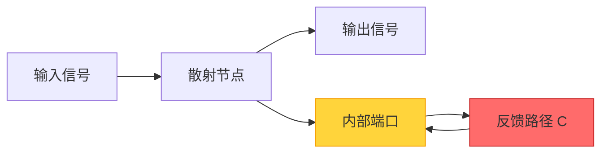
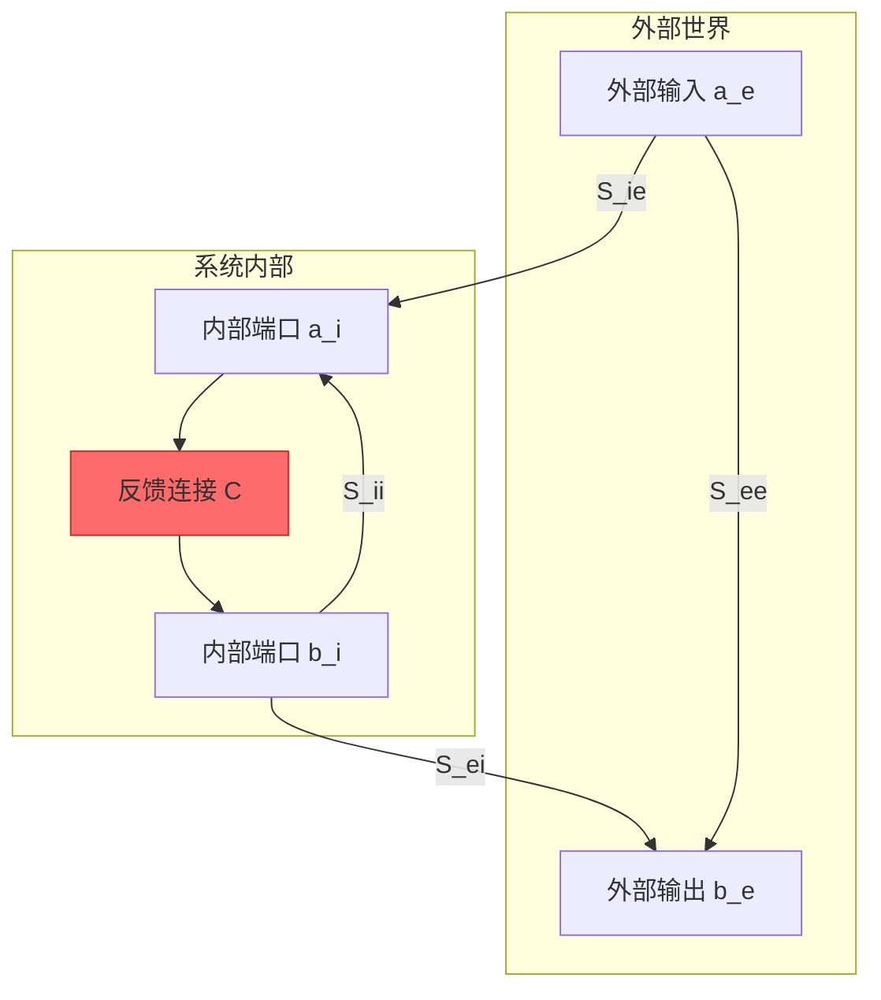
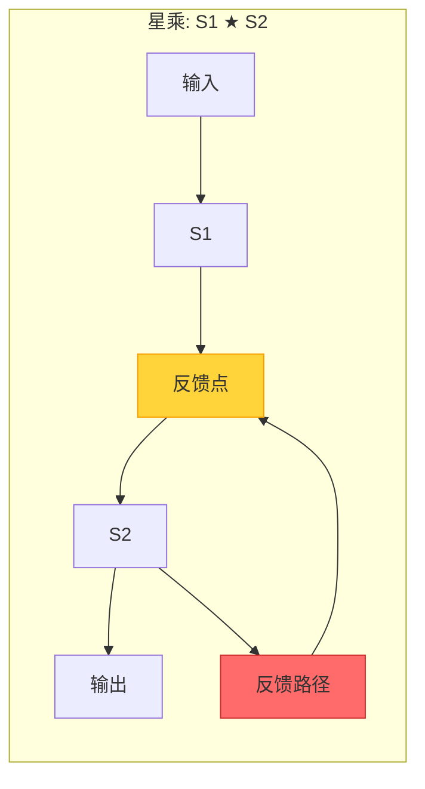
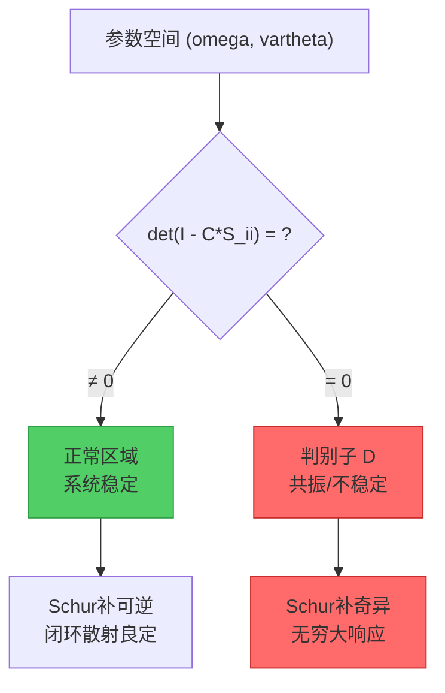
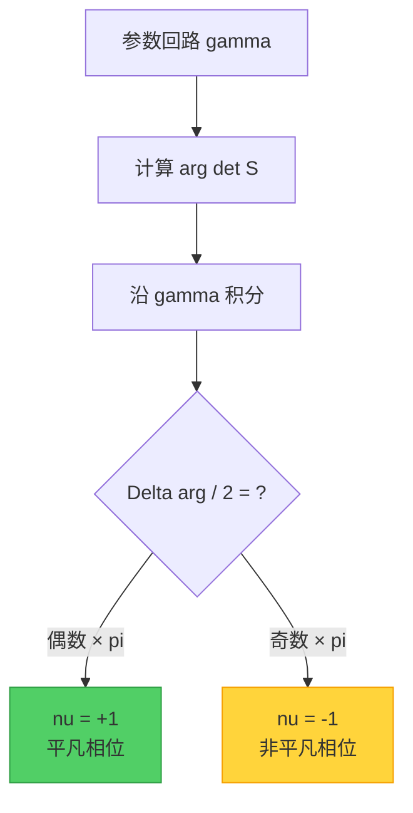
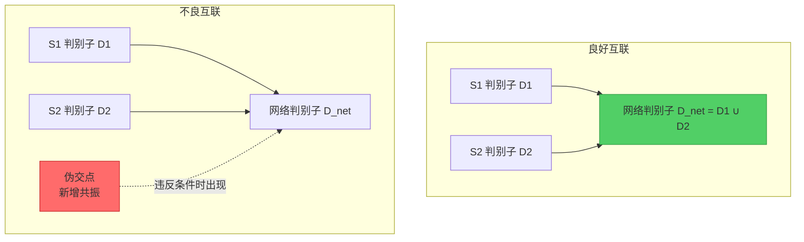
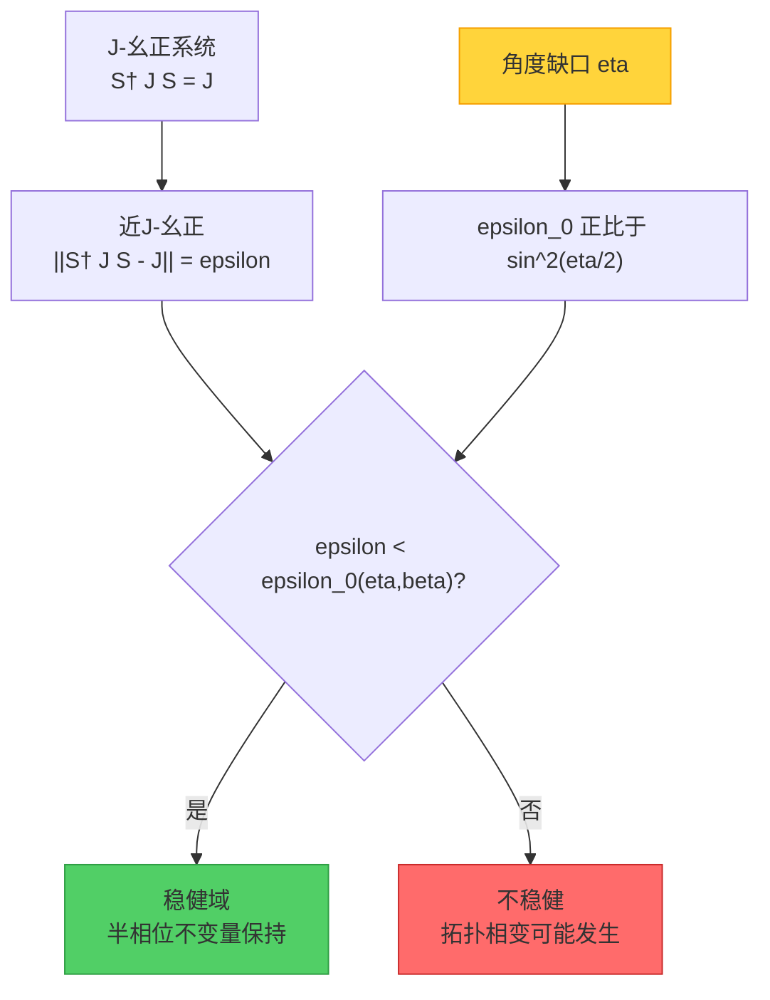
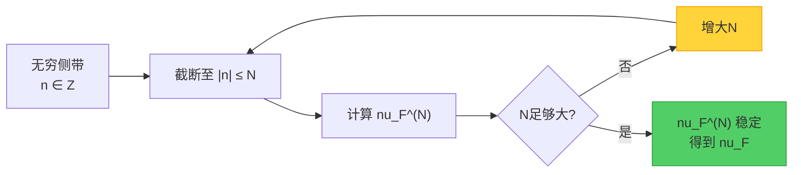
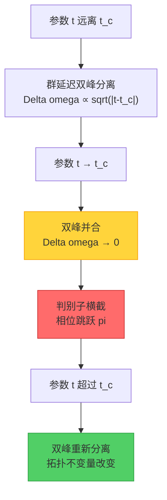

# 13.4 自指散射网络：当系统遇见自己的镜像

## 引言：反馈的魔法

想象你站在一个巨大的镜厅中。每面镜子都反射着其他镜子的影像，光线在镜子之间反复弹射，形成无穷无尽的反射。这个简单的场景，蕴含着自指散射网络的核心思想——**系统通过反馈回路"看见"自己**。

在日常生活中，反馈无处不在：
- **麦克风靠近音箱时的啸叫**：声音被麦克风捕获，放大后从音箱输出,再被麦克风捕获，形成闭环
- **股市的羊群效应**：投资者的决策影响股价，股价变化又影响投资者的决策
- **生态系统的平衡**：捕食者数量增加导致猎物减少，猎物减少又导致捕食者饿死

从物理学的角度看，任何包含反馈的系统都可以看作**自指散射网络**。本节将探讨这类系统的数学结构、拓扑不变量以及在量子技术中的应用。

**本节核心问题**：
1. 如何用数学语言描述包含反馈的散射网络？
2. 反馈如何改变系统的拓扑性质？
3. 在非厄米环境下，如何保证拓扑不变量的稳健性？
4. 这些理论如何应用于量子控制和拓扑量子计算？

---

## 第一部分：散射的基本图景

### 1.1 散射矩阵：输入输出的桥梁

在最简单的情况下，一个物理系统可以看作一个**黑盒子**，它有一些输入端口和输出端口。散射矩阵 $S$ 描述了输入与输出之间的关系：

$$
\mathbf{b} = S \mathbf{a}
$$

其中：
- $\mathbf{a}$ 是输入波幅向量（可以是光波、声波、量子态等）
- $\mathbf{b}$ 是输出波幅向量
- $S$ 是散射矩阵，编码了系统的全部散射信息

**类比：邮局分拣系统**
- 输入端口 = 邮件投递口
- 散射矩阵 = 分拣规则
- 输出端口 = 不同目的地的邮件袋

如果邮局收到100封寄往北京的信和50封寄往上海的信，分拣规则决定了最终每个邮袋中有多少封信。散射矩阵就是这个分拣规则的数学表达。

**幺正性与能量守恒**

对于孤立的、无损耗的系统，散射矩阵是**幺正的**：

$$
S^\dagger S = I
$$

这意味着**能量守恒**：输入的总能量等于输出的总能量。就像理想的镜子不会吸收光能，只是改变光的传播方向。

### 1.2 端口分块：内部与外部

当系统包含反馈时，需要区分**外部端口**和**内部端口**：

$$
S = \begin{pmatrix}
S_{ee} & S_{ei} \\
S_{ie} & S_{ii}
\end{pmatrix}
$$

- $S_{ee}$：外部→外部（直接透射/反射）
- $S_{ei}$：内部→外部（反馈输出）
- $S_{ie}$：外部→内部（反馈输入）
- $S_{ii}$：内部→内部（内部循环）

**类比：企业的内外部沟通**
- 外部端口 = 客户接口、供应商接口
- 内部端口 = 部门间的内部沟通
- $S_{ee}$ = 直接服务客户（不涉及内部流程）
- $S_{ii}$ = 内部审批流程（可能循环多次）

---

## 第二部分：Redheffer星乘——反馈的代数

### 2.1 Schur补：消去内部自由度

当我们通过反馈矩阵 $\mathcal{C}$ 连接内部端口时（$a_i = \mathcal{C} b_i$），可以将内部自由度消去，得到**等效的闭环散射矩阵**：

$$
S^{\circlearrowleft} = S_{ee} + S_{ei} (I - \mathcal{C} S_{ii})^{-1} \mathcal{C} S_{ie}
$$

这个公式称为**Schur补闭合式**，它将一个开环系统变成闭环系统。

**类比：递归函数的求值**

考虑递归方程：
$$
x = f(x)
$$

如果我们能求解得到 $x = (1-f)^{-1} \cdot 0$（假设初值为0），那么我们就把递归"闭合"了。Schur补的思想与此类似：通过求解内部端口的自洽方程，得到外部端口的等效关系。

**关键条件**：Schur补存在的条件是 $(I - \mathcal{C} S_{ii})$ 可逆。当这个条件失效时，系统会出现**共振**——内部反馈形成驻波，能量无法逸出。

### 2.2 Redheffer星乘：级联的代数

当两个子系统 $S^{(1)}$ 和 $S^{(2)}$ 通过反馈互联时，总散射矩阵可以用**Redheffer星乘**表示：

$$
S^{(1)} \star S^{(2)} = \text{Schur闭合}\left[\begin{pmatrix} S^{(1)} & 0 \\ 0 & S^{(2)} \end{pmatrix}, \mathcal{C}_{\text{互联}}\right]
$$

**性质**：
1. **结合律**：$(S^{(1)} \star S^{(2)}) \star S^{(3)} = S^{(1)} \star (S^{(2)} \star S^{(3)})$
2. **非交换**：一般 $S^{(1)} \star S^{(2)} \neq S^{(2)} \star S^{(1)}$（级联顺序matters）
3. **单位元**：直通散射 $S = I$ 是星乘的单位元

**类比：函数复合与反馈**

普通函数复合 $f \circ g$ 是"开链"的：$x \to g(x) \to f(g(x))$。

星乘是"闭链"的：$x \to g(x) \to f(g(x)) \to \text{反馈到输入}$。

这类似于在函数复合中加入了一个"记忆"机制——之前的输出会影响未来的输入。

---

## 第三部分：判别子——系统的"奇点"

### 3.1 判别子的定义

**判别子** $D$ 是参数空间中导致Schur补不可逆的点的集合：

$$
D = \left\{ (\omega, \vartheta) : \det(I - \mathcal{C}(\omega,\vartheta) S_{ii}(\omega,\vartheta)) = 0 \right\}
$$

其中：
- $\omega$ 是频率参数
- $\vartheta$ 是其他物理参数（如反馈强度、相位等）

**物理意义**：判别子上的点对应系统的**共振条件**或**不稳定点**。

**类比：地图上的奇点**

想象参数空间是一张地图，判别子就是地图上的"危险区域"：
- **光学系统**：判别子对应激光器的阈值线
- **量子系统**：判别子对应能级简并或EP点
- **经济模型**：判别子对应市场崩溃的临界点

### 3.2 横截性：避免"切交"

在良好的情况下，判别子 $D$ 应该是参数空间中的**横截子流形**（余维数为1的光滑曲面）。这意味着：
- 在二维参数空间中，$D$ 是一条曲线
- 在三维参数空间中，$D$ 是一张曲面

**横截条件**确保参数轨迹与判别子的交点是"干净"的，没有相切或重合。

**类比：道路交叉口**

- **横截**：两条道路垂直相交，交点清晰
- **切交**：两条道路几乎平行地擦肩而过，难以判断是否真的相交
- **重合**：两条道路在一段距离内完全重叠

横截性保证了我们可以清楚地计数参数回路与判别子的**交点个数**。

---

## 第四部分：半相位不变量——四重等价的奇迹

### 4.1 整体半相位的定义

对于闭环散射矩阵 $S^{\circlearrowleft}$，定义**整体半相位不变量**：

$$
\nu_{\sqrt{\det S^{\circlearrowleft}}}(\gamma) = \exp\left( \frac{\mathrm{i}}{2} \oint_\gamma \mathrm{d} \arg\det S^{\circlearrowleft} \right) \in \{\pm 1\}
$$

其中 $\gamma$ 是参数空间中的一个闭合回路。

**直观理解**：
- 散射矩阵的行列式 $\det S^{\circlearrowleft}$ 是一个复数
- 当参数沿着 $\gamma$ 走一圈时，$\arg \det S^{\circlearrowleft}$ 的变化量可以是 $0, \pm 2\pi, \pm 4\pi, \ldots$
- 半相位取的是**半圈**的变化量：$\tfrac{1}{2} \Delta \arg \det S^{\circlearrowleft}$
- 由于 $\exp(\mathrm{i} n\pi) = \pm 1$（$n \in \mathbb{Z}$），半相位是一个 $\mathbb{Z}_2$ 不变量

**类比：时针的半圈运动**

想象时钟的时针：
- 时针走一圈（12小时）→ 相位变化 $2\pi$
- 半相位关注的是：时针走半圈后，方向是否反转？
- 如果走了奇数个半圈，方向反转（$\nu = -1$）
- 如果走了偶数个半圈，方向不变（$\nu = +1$）

### 4.2 四重等价定理

半相位不变量有四种等价的表述方式：

**定理 4.1（四重等价）**

若沿闭路 $\gamma$ 几乎处处 $S^{\circlearrowleft}$ 幺正且 $S^{\circlearrowleft} - I$ 属于迹类，则：

$$
\nu_{\sqrt{\det S^{\circlearrowleft}}}(\gamma) = \exp\left( -\mathrm{i}\pi \oint_\gamma \mathrm{d}\xi \right) = (-1)^{\mathrm{Sf}_{-1}(S^{\circlearrowleft} \circ \gamma)} = (-1)^{I_2(\gamma, D)}
$$

其中：
1. **第一项**：整体半相位（行列式的几何相位）
2. **第二项**：谱位移 $\xi$ 的积分（Birman-Kreĭn公式）
3. **第三项**：本征相位过 $-1$ 的谱流 $\mathrm{Sf}_{-1}$
4. **第四项**：回路 $\gamma$ 与判别子 $D$ 的模二交数 $I_2$

**四种视角的物理意义**：

| 视角 | 数学对象 | 物理意义 | 测量方式 |
|------|---------|---------|---------|
| **几何相位** | $\arg \det S^{\circlearrowleft}$ | 散射过程的整体相位累积 | 干涉测量 |
| **谱位移** | $\xi(\omega)$ | 相对于参考系统的能级移动 | 与已知系统对比 |
| **谱流** | $\mathrm{Sf}_{-1}$ | 本征值穿过 $-1$ 的次数 | 本征值追踪 |
| **交数** | $I_2(\gamma, D)$ | 回路穿越奇点的次数 | 共振峰计数 |

**类比：四种方式描述"围绕一个岛绕了几圈"**

1. **几何相位**：用指南针记录方向角的累积变化
2. **谱位移**：用GPS记录相对于起点的位移积分
3. **谱流**：记录指南针指针过北方的次数
4. **交数**：记录船穿越岛屿海岸线的次数

虽然测量方式不同，但它们描述的是同一个几何事实（模2意义下）。

### 4.3 桥接引理：为什么四者等价？

**引理 4.2（Birman-Kreĭn桥梁）**

由Birman-Kreĭn公式：

$$
\det S(\omega) = \exp\{-2\pi \mathrm{i} \xi(\omega)\}
$$

因此：

$$
\arg \det S(\omega) = -2\pi \xi(\omega) + 2\pi n(\omega)
$$

其中 $n(\omega)$ 是整数分支。对闭路积分：

$$
\oint_\gamma \mathrm{d} \arg \det S = -2\pi \oint_\gamma \mathrm{d}\xi + \oint_\gamma \mathrm{d}(2\pi n) = -2\pi \oint_\gamma \mathrm{d}\xi
$$

（因为整数 $n$ 沿闭路回到原值，$\oint \mathrm{d}n = 0$）

因此半相位与谱位移的关系：

$$
\nu_{\sqrt{\det S}} = \exp\left( \frac{\mathrm{i}}{2} \oint \mathrm{d}\arg\det S \right) = \exp\left( -\mathrm{i}\pi \oint \mathrm{d}\xi \right)
$$

**引理 4.3（谱流与交数）**

当参数 $\tau$ 变化时，散射矩阵的本征相位 $\phi_j(\tau)$ 演化。谱流 $\mathrm{Sf}_{-1}$ 计数本征相位穿过 $\pi$（对应本征值 $-1$）的次数（带符号）。

根据隐函数定理，每次本征相位穿过 $\pi$ 时，判别子的某个分量被横截穿越一次。因此：

$$
\mathrm{Sf}_{-1}(S^{\circlearrowleft} \circ \gamma) = I_2(\gamma, D) \pmod{2}
$$

**总结**：四重等价不是四个不同的不变量，而是**同一个拓扑不变量的四种计算方式**。选择哪种方式取决于实验条件和计算便利性。

---

## 第五部分：$\mathbb{Z}_2$ 组合律——模块化的威力

### 5.1 无伪交定理

当通过星乘连接两个子系统 $S^{(1)}$ 和 $S^{(2)}$ 时，总网络的判别子 $D_{\text{net}}$ 与子系统判别子 $D_{(1)}, D_{(2)}$ 的关系如何？

**定理 5.1（无伪交）**

若满足以下条件：
1. **Schur可逆下界**：$\sigma_{\min}(I - S^{(1)}_{ii} S^{(2)}_{ii}) \geq \delta > 0$
2. **互耦小量**：$\|S^{(1)}_{ei}\|_2, \|S^{(2)}_{ie}\|_2 \leq \rho < 1$
3. **管状分离**：$D_{(1)}$ 和 $D_{(2)}$ 的管状邻域不相交

则网络判别子是子判别子的**横离并**：

$$
D_{\text{net}} = D_{(1)} \sqcup D_{(2)}
$$

且交数满足 $\mathbb{Z}_2$ 加法：

$$
I_2(\gamma, D_{\text{net}}) = I_2(\gamma, D_{(1)}) + I_2(\gamma, D_{(2)}) \pmod{2}
$$

**物理意义**：在良好的互联条件下，子系统的共振不会因为互联而"混合"产生新的伪共振。这保证了**模块化设计的可行性**。

**类比：高速公路交叉口**

- **子系统判别子** = 各条高速公路的收费站
- **互联** = 在交叉口修建匝道
- **无伪交条件** = 匝道设计合理，不会在交叉口产生新的拥堵点
- **模块化** = 可以独立设计各条高速公路，再通过匝道连接

如果匝道设计不当（违反定理条件），可能在交叉口产生"伪收费站"——原本各条路上都没有的拥堵点。

### 5.2 半相位的组合律

**定理 5.2（$\mathbb{Z}_2$ 组合律）**

在无伪交条件下：

$$
\nu_{\text{net}} = \nu_{(1)} \cdot \nu_{(2)} \pmod{2}
$$

即：
- 如果两个子系统都是平凡相位（$\nu = +1$），网络也是平凡的
- 如果恰有一个子系统是非平凡相位（$\nu = -1$），网络是非平凡的
- 如果两个子系统都是非平凡相位，它们的"非平凡性"相互抵消（$(-1) \times (-1) = +1$）

**类比：电路中的开关**

- $\nu = +1$ ↔ 开关闭合（电流通）
- $\nu = -1$ ↔ 开关断开（电流不通）
- 串联两个开关：只有两个都闭合时电流才通（对应 $+1 \times +1 = +1$）
- 一个断开：电流不通（对应 $+1 \times -1 = -1$）
- 两个都断开：仍然不通（对应 $-1 \times -1 = +1$，但在 $\mathbb{Z}_2$ 意义下等价于 $+1$）

**应用：拓扑量子计算的模块化设计**

在拓扑量子计算中，逻辑门的拓扑保护由半相位不变量刻画。组合律保证了：
- 可以独立设计和测试各个量子门模块
- 将模块组装成完整量子电路时，总拓扑保护可以从模块性质预测
- 无需每次都测量整个电路的拓扑不变量

---

## 第六部分：$J$-幺正稳健性——非厄米世界的生存法则

### 6.1 非厄米系统的挑战

在理想情况下，孤立量子系统由厄米哈密顿量描述，散射矩阵是幺正的。但真实世界中，系统总会与环境耦合，导致：
- **增益**：激光器中的粒子数反转
- **损耗**：光子吸收、量子态退相干
- **非互易**：磁场中的环流器效应

这些效应使得有效哈密顿量变成**非厄米的**，散射矩阵不再幺正。

**问题**：非厄米系统中，本征值可以离开单位圆，拓扑不变量是否仍然稳健？

### 6.2 $J$-内积与广义幺正

在非厄米系统中，存在一个广义度量 $J$（Kreĭn度量），满足：
- $J = J^\dagger = J^{-1}$（厄米且可逆）
- 正定块：对应稳定模（增益较小）
- 负定块：对应不稳定模（增益较大）

相对于 $J$-内积，定义**$J$-幺正**条件：

$$
S^\dagger J S = J
$$

以及**$J$-共轭**：

$$
S^\sharp = J^{-1} S^\dagger J
$$

**物理意义**：$J$-幺正推广了普通幺正性，刻画了非厄米系统中的"广义能量守恒"。

**类比：双曲几何中的"距离"**

- 普通幺正性 ↔ 欧几里德几何中的距离保持
- $J$-幺正性 ↔ 双曲几何（Minkowski时空）中的伪距保持
- 有些方向上距离增加（类时），有些方向上距离减少（类空），但总的"间隔"保持不变

### 6.3 Kreĭn角与稳健域

对于 $J$-幺正系统，定义**Kreĭn角**（相位斜率的广义化）：

$$
\varkappa_j(\tau) = \frac{\operatorname{Im} \langle \psi_j(\tau), J S^{-1}(\partial_\tau S) \psi_j(\tau) \rangle}{\langle \psi_j(\tau), J \psi_j(\tau) \rangle}
$$

以及**角度缺口**：

$$
\eta = \min_j \inf_\tau \operatorname{dist}(\phi_j(\tau), \pi + 2\pi\mathbb{Z})
$$

**定理 6.1（$J$-幺正稳健性）**

设：
- $\|S^\dagger J S - J\| \leq \varepsilon$（接近 $J$-幺正）
- $\eta > 0$（本征相位远离 $\pi$）
- $\beta = \inf_\tau \sigma_{\min}(I + \mathrm{i}K(\tau)) > 0$（Cayley映射可逆）

则存在阈值函数：

$$
\varepsilon_0(\eta, \beta) = \min\left\{ \frac{2\beta}{C}, \alpha \sin^2\frac{\eta}{2} \right\}
$$

当 $\varepsilon < \varepsilon_0$ 时，半相位不变量对非厄米扰动**稳健**。

**物理图景**：
- **角度缺口 $\eta$**：本征相位离"危险值" $\pi$ 的最小距离
- **阈值 $\varepsilon_0$**：系统能容忍的非厄米性程度
- **稳健域**：参数空间中满足 $\varepsilon < \varepsilon_0$ 的区域

**类比：走钢丝的平衡**

- **角度缺口 $\eta$**：钢丝的宽度（越宽越安全）
- **非厄米扰动 $\varepsilon$**：风的强度
- **稳健性定理**：只要钢丝足够宽（$\eta$ 大）且风不太强（$\varepsilon < \varepsilon_0$），走钢丝者不会掉下去

### 6.4 极化同伦：连接厄米与非厄米

**构造 6.2（极化同伦）**

定义连续形变：

$$
K_t = (1-t) K + t \frac{1}{2}(K + K^\sharp), \quad t \in [0,1]
$$

以及对应的散射矩阵：

$$
S_t = (I - \mathrm{i}K_t)(I + \mathrm{i}K_t)^{-1}
$$

- 在 $t=0$ 时，$S_0 = S$ 是原始的非厄米系统
- 在 $t=1$ 时，$S_1$ 是 $J$-幺正的（因为 $K_1 = \frac{1}{2}(K + K^\sharp)$ 是 $J$-斜厄米的）

**定理 6.3（同伦不变性）**

如果极化同伦 $\{S_t\}_{t \in [0,1]}$ 在整个过程中不穿越判别子 $D$，则：

$$
\nu_{\sqrt{\det S_0}} = \nu_{\sqrt{\det S_1}}
$$

即：非厄米系统的半相位与其"$J$-幺正化"版本相同。

**应用**：这允许我们通过计算 $J$-幺正系统（数值更稳定）的半相位，间接得到非厄米系统的半相位。

**类比：橡皮泥的变形**

- 把一个甜甜圈形状的橡皮泥变形成咖啡杯
- 只要变形过程中不撕裂或粘合，拓扑性质（如"洞的个数"）保持不变
- 极化同伦就是这样一个"温和的变形"，保持拓扑不变量

---

## 第七部分：Floquet带缘拓扑——周期驱动的拓扑分类

### 7.1 Floquet系统与侧带

当系统受到周期驱动（如周期调制的激光、微波）时，描述变成**Floquet理论**：
- 时间周期 $T$
- 频域分解为侧带：$\omega_n = \omega + n \cdot 2\pi/T$，$n \in \mathbb{Z}$
- 散射矩阵成为无穷维：$S_F = \bigoplus_{n \in \mathbb{Z}} S(\omega_n)$

**问题**：无穷维矩阵的行列式不良定，如何定义拓扑不变量？

### 7.2 截断与正则化

**方案**：将侧带截断至 $|n| \leq N$，得到有限维散射矩阵 $S_F^{(N)}$，定义：

$$
\nu_F^{(N)} = \exp\left( \frac{\mathrm{i}}{2} \int_{-\pi/T}^{\pi/T} \partial_\omega \arg\det S_F^{(N)}(\omega) \mathrm{d}\omega \right)
$$

**定理 7.1（截断独立性）**

若 $S_F^{(N)} \to S_F$ 在算子范数或Hilbert-Schmidt范数下收敛，且端点 $\omega = \pm \pi/T$ 处无随 $N$ 迁移的支化点，则存在 $N_*$ 使得：

$$
\nu_F^{(N)} = \nu_F^{(N_*)} \quad \forall N \geq N_*
$$

此时定义 $\nu_F = \nu_F^{(N_*)}$。

**物理图景**：
- 高频侧带（$|n| \gg 1$）对拓扑的贡献可以忽略
- 只需要保留足够多的主导侧带，就能捕捉拓扑性质
- $N_*$ 是"有效截断阶数"

**类比：傅里叶级数的截断**

- 周期函数可以展开为无穷多个傅里叶模
- 但实际计算时，保留前 $N$ 项就足够逼近原函数
- 拓扑不变量（如绕数）可以从截断的有限项中准确读出

### 7.3 带缘拓扑指标

**定理 7.2（带缘等价）**

若端点 $\omega = \pm \pi/T$ 处满足平方根局部模型，则：

$$
\nu_F = (-1)^{I_2([-\pi/T, \pi/T], D_F)}
$$

其中 $D_F$ 是Floquet布里渊区内判别子的总分支数（模2）。

**物理意义**：
- Floquet布里渊区 $[-\pi/T, \pi/T]$ 类似于固体物理中的第一布里渊区
- $\nu_F = -1$ 表示带缘存在**奇数个拓扑边界态**
- $\nu_F = +1$ 表示平凡相（偶数个或零个边界态）

**应用：Floquet拓扑绝缘体**

- 通过周期驱动，可以在原本平凡的材料中诱导出拓扑边界态
- 半相位不变量 $\nu_F$ 是Floquet拓扑相的分类指标
- 对应 $\mathbb{Z}_2$ 拓扑绝缘体在周期驱动下的推广

### 7.4 规范独立性

**引理 7.3（规范独立性）**

若对散射矩阵做规范变换：

$$
S_F(\omega) \mapsto U_L(\omega) S_F(\omega) U_R(\omega)
$$

其中 $U_{L,R}$ 连续、$|\det U_{L,R}| = 1$，且满足带缘粘合条件：

$$
[\arg\det U_L + \arg\det U_R]_{-\pi/T}^{\pi/T} \in 4\pi\mathbb{Z}
$$

则半相位不变量 $\nu_F$ 不变。

**物理意义**：拓扑不变量不依赖于：
- 基矢的选择（不同的格点、不同的规范）
- 相因子的重定义
- 只要规范变换在带缘处"粘合良好"（相位跳跃是 $4\pi$ 的整数倍）

**类比：地球仪的经度选择**

- 地球的地理结构是固有的
- 但本初子午线（0度经线）的选择是人为的（伦敦格林威治 vs 巴黎）
- 无论选择哪个本初子午线，地球的拓扑性质（如大陆的连通性）不变
- 规范条件确保：改变本初子午线时，东西半球的划分方式保持一致

---

## 第八部分：实验可观测性——如何"看见"拓扑

### 8.1 二值化投影与多数投票

在实验中，我们无法直接测量 $\arg\det S^{\circlearrowleft}$，而是通过以下步骤：

1. **相位增量测量**：
   $$
   \Delta\phi_{ab} = \frac{1}{2} \left[ \arg\det S(\gamma_a; \theta_b + \delta) - \arg\det S(\gamma_a; \theta_b - \delta) \right]
   $$

2. **二值化**：
   $$
   \Pi(\Delta\phi_{ab}) = \begin{cases}
   1, & |\Delta\phi_{ab}| \geq \pi/2 \\
   0, & |\Delta\phi_{ab}| < \pi/2
   \end{cases}
   $$

3. **多数投票**：对多次测量 $\{\widehat{\Delta\phi}_{ab}^{(n)}\}_{n=1}^N$，取多数决定 $\Pi$ 的值。

**定理 8.1（误差界与样本复杂度）**

设测量噪声为次高斯，方差 $\sigma^2$，有效相位窗 $\Delta\phi_{\text{eff}} - \pi/2 = m > 0$。给定目标误差 $\delta$，充分样本数为：

$$
N \geq \frac{\log(1/\delta)}{2(1/2 - 2e^{-m^2/(2\sigma^2)})^2}
$$

且需 $m > \sigma\sqrt{2\log 4}$ 以确保多数投票收敛。

**物理意义**：
- **有效相位窗 $m$**：信号强度（相位跳跃离阈值的距离）
- **噪声 $\sigma$**：测量不确定性
- **样本复杂度 $N$**：需要重复测量的次数
- **指数依赖**：$N \sim e^{m^2/\sigma^2}$，信噪比越高，所需样本越少

**类比：民意调查**

- **问题**：某政策支持率是否过半？
- **测量**：抽样调查选民意见（有误差）
- **二值化**：每个人投赞成或反对
- **多数投票**：统计总体意见
- **样本复杂度**：要达到95%置信度，需要调查多少人？

### 8.2 群延迟双峰并合——拓扑变化的指纹

当参数接近判别子时，散射矩阵的**群延迟**（$\partial_\omega \arg\det S$）会呈现特征性的**双峰并合**图样：

$$
\tau_{\text{group}}(\omega) = \partial_\omega \arg\det S(\omega)
$$

**平方根渐近**：

在支化点 $t = t_c$ 附近：

$$
\arg\det S(t) = \arg\det S(t_c) \pm \arctan(\kappa^{1/2} |t - t_c|^{1/2}) + O(|t - t_c|^{3/2})
$$

群延迟的两个峰之间的距离：

$$
\Delta\omega = C \sqrt{|t - t_c|} + O(|t - t_c|^{3/2})
$$

**实验操作**：
1. 扫描参数 $t$（如反馈强度）
2. 对每个 $t$，测量群延迟 $\tau_{\text{group}}(\omega)$ 作为频率 $\omega$ 的函数
3. 观察双峰：远离判别子时两峰分离，接近时两峰并合
4. 并合点 $t = t_c$ 对应判别子的横截穿越
5. 穿越次数（模2）给出半相位不变量

**类比：共振现象的"避免交叉"**

- 两个耦合振子的本征频率原本会相交
- 耦合导致"避免交叉"（avoided crossing）——两条曲线靠近但不相交
- 最接近的点对应"伪交"或支化点
- 群延迟双峰并合是频域中避免交叉的体现

### 8.3 原型系统：耦合器-微环-增益

**实验平台**：硅基光子集成电路，包含：
- **耦合器**：$2 \times 2$ 定向耦合器，耦合系数 $\kappa$
- **微环**：环形谐振器，提供频率选择性相位
- **增益/损耗**：掺铒波导或可饱和吸收体

**散射矩阵**：

耦合器：
$$
C(\kappa) = \begin{pmatrix}
\sqrt{1-\kappa^2} & \mathrm{i}\kappa \\
\mathrm{i}\kappa & \sqrt{1-\kappa^2}
\end{pmatrix}
$$

反馈路径：
$$
\mathcal{C}(\omega, t) = \rho \mathrm{e}^{\mathrm{i}\phi(\omega, t)}
$$

其中 $\rho$ 是反馈强度，$\phi$ 是相位。

**Schur闭合**：

$$
S^{\circlearrowleft} = S_{ee} + S_{ei} (I - \mathcal{C} S_{ii})^{-1} \mathcal{C} S_{ie}
$$

**判别子**：

$$
\mathcal{C} S_{ii} = 1 \quad \Leftrightarrow \quad \rho \mathrm{e}^{\mathrm{i}\phi} = \frac{1}{S_{ii}}
$$

在 $(\omega, t)$ 平面上形成曲线。

**测量流程**：
1. 固定 $t$，扫描频率 $\omega$，测量透射谱 $|S^{\circlearrowleft}_{21}(\omega)|^2$
2. 从透射谱的相位提取 $\arg\det S^{\circlearrowleft}(\omega)$
3. 改变 $t$，重复步骤1-2
4. 识别群延迟双峰并合的 $t_c$ 值
5. 统计穿越次数（模2）→ 半相位不变量

**优势**：
- 完全集成化，可批量制造
- 电学或光学调控 $\kappa, \rho, \phi$
- 室温操作，无需超低温
- 兼容经典和量子信号

---

## 第九部分：应用前沿

### 9.1 量子反馈控制

**背景**：在量子计算和量子通信中，需要实时测量量子态并反馈控制，以：
- 稳定脆弱的量子态
- 实现量子纠错
- 制备特定的目标态

**自指散射网络的角色**：
- 量子测量仪器（如同调探测）+ 反馈执行器（如相位调制器）构成闭环
- 网络的拓扑不变量决定了反馈控制的稳定性边界
- $\nu = -1$ 可能对应**拓扑稳定的反馈相位**，对参数扰动鲁棒

**例子**：超导量子比特的读出与反馈
- 读出腔与比特的色散耦合 → 散射矩阵 $S_{\text{qubit}}$
- 放大器链与反馈线 → 反馈矩阵 $\mathcal{C}$
- 闭环稳定性 ↔ 判别子 $D$ 的位置
- 拓扑保护的反馈：即使参数漂移，只要不穿越 $D$，控制性能保持

### 9.2 拓扑量子计算

**背景**：拓扑量子计算利用系统的拓扑相位来编码和操纵量子信息，天然抗局部噪声。

**Floquet拓扑相位与量子门**：
- 周期驱动（如微波脉冲序列）可以诱导拓扑边界态
- 边界态作为拓扑量子比特，寿命长
- 量子门通过编织拓扑激发（如Majorana费米子）实现
- 门操作的拓扑保护由 $\nu_F$ 表征

**自指网络的作用**：
- 量子门网络本身就是散射网络
- 门的级联 ↔ Redheffer星乘
- 整体拓扑相位 ↔ 量子算法的拓扑保护指数
- $\mathbb{Z}_2$ 组合律 → 模块化门设计

**挑战**：
- 非厄米性：量子比特与环境的耦合
- $J$-幺正稳健性定理提供量化的容错阈值
- 需确保 $\varepsilon < \varepsilon_0(\eta, \beta)$

### 9.3 光学微环谐振器网络

**背景**：硅光子学中，大规模微环阵列用于：
- 光开关矩阵（数据中心互联）
- 可重构滤波器（波长选择）
- 光学神经网络（AI加速）

**自指网络的应用**：
- 微环之间的耦合 + 单个微环的自反馈 → 自指散射网络
- 判别子 $D$ 对应系统的共振线
- 拓扑不变量 $\nu$ 决定传输函数的鲁棒性
- 利用拓扑保护设计对制造误差不敏感的滤波器

**设计策略**：
1. 选择目标拓扑相位 $\nu_{\text{target}}$
2. 根据 $\mathbb{Z}_2$ 组合律，分解为子网络
3. 各子网络独立优化（利用无伪交定理）
4. 组装并验证总网络的 $\nu$
5. 通过群延迟双峰并合测量确认

**实际案例**：
- MIT、加州理工等的硅光子实验：实现了拓扑保护的光延迟线
- 拓扑指标通过测量边界态的鲁棒性验证
- 对±10%的制造误差不敏感（相比非拓扑设计的±1%）

### 9.4 时间晶体中的自指反馈

**联系**：时间晶体的Floquet演化可以看作"时间方向的自指反馈"：
- 系统的未来状态依赖于过去状态（记忆）
- 周期驱动 + 反馈 → Floquet算符的本征态结构
- 时间晶体的亚谐波响应 ↔ Floquet带缘的拓扑边界态

**自指散射视角**：
- 时间演化算符 $U(T)$ 对应散射矩阵 $S_F$
- 时间晶体的"时间周期加倍" ↔ Floquet布里渊区的 $\pi$ 本征相位
- 半相位不变量 $\nu_F = -1$ 对应时间晶体相

**应用**：
- 用自指散射网络的工具分析时间晶体的稳定性
- 设计鲁棒的时间晶体（对驱动频率失谐不敏感）
- 将时间晶体用作量子记忆或时钟

---

## 第十部分：从镜厅到宇宙——哲学反思

### 10.1 自指的深度

自指散射网络的核心是**系统与自身的相互作用**。这个概念在多个层面上具有深刻意义：

**物理层面**：
- 量子测量：观测者通过测量设备与被观测系统构成闭环
- 宇宙学：整个宇宙的真空涨落可能形成自指回路（Wheeler的"自举宇宙"）
- 因果结构：广义相对论中的闭合类时曲线（时间机器）

**数学层面**：
- 不动点定理：$x = f(x)$ 的解是函数"作用于自身"的结果
- 递归论：程序的自我调用（如Ackermann函数）
- 范畴论：函子的自然变换作用于自身

**哲学层面**：
- 自我意识：意识对自身的反思（"我知道我知道"）
- 哥德尔不完备性：形式系统对自身的编码与限制
- 庄周梦蝶：主客体的循环（"我梦蝶"还是"蝶梦我"？）

### 10.2 拓扑不变量的稳健性与必然性

半相位不变量 $\nu \in \{\pm 1\}$ 是**离散的**、**量子化的**，这导致了：

**鲁棒性**：
- 连续扰动无法改变离散量（只能跳跃）
- 要改变 $\nu$，必须穿越判别子（奇点）
- 这是拓扑量子计算的理论基础

**必然性**：
- 四重等价定理表明，$\nu$ 可以从四种完全不同的物理量计算
- 这种"过度决定"（over-determination）意味着 $\nu$ 不是人为定义，而是系统的**内禀属性**
- 类比：三角形内角和为180度不是定义，而是欧几里德几何的必然结果

**普适性**：
- 同样的数学结构出现在：
  - 凝聚态物理（拓扑绝缘体）
  - 光学（光子拓扑）
  - 量子信息（拓扑纠错码）
  - 机器人学（构型空间的拓扑）
- 这暗示拓扑是**跨尺度、跨领域的统一语言**

### 10.3 判别子：奇点与创造

判别子 $D$ 是参数空间中的"危险区域"，但也是**创造的源泉**：

**破坏性**：
- 系统在 $D$ 上失去稳定性
- Schur补奇异，响应发散
- 可能导致系统崩溃

**创造性**：
- 拓扑相变只能在 $D$ 上发生
- 新的拓扑相从奇点中"诞生"
- 类比：宇宙大爆炸奇点、黑洞奇点

**辩证法**：
- 奇点是"必要的恶"：没有奇点，就没有拓扑多样性
- 系统通过"接近但不穿越"奇点来实现"临界"现象（如激光阈值）
- 控制理论的艺术：驾驭奇点，而非回避

### 10.4 模二的简洁与深刻

$\mathbb{Z}_2$ 组合律将复杂的网络简化为**二进制逻辑**：

**简洁性**：
- 只有两种拓扑相（$\nu = \pm 1$）
- 复合规则极其简单（模二乘法）
- 无需知道网络的全部细节，只需知道模块的 $\nu$

**深刻性**：
- $\mathbb{Z}_2$ 是最简单的非平凡群
- 对应物理中的**费米子奇偶性**、**时间反演对称性平方**
- 联系到拓扑场论中的Arf不变量

**哲学寓意**：
- 简单的规则可以产生复杂的现象（如元胞自动机）
- "一生二，二生三，三生万物"（老子）→ $\mathbb{Z}_2$ 是从"无"到"有"的最小步
- 数字"2"的特殊地位：二元对立、阴阳、0和1

---

## 总结：镜厅中的舞蹈

让我们回到开篇的镜厅比喻。在镜厅中：
- **光线**是信号（量子态、经典波）
- **镜子**是散射节点
- **反射**是散射过程
- **无穷反射**是自指反馈
- **镜厅的几何**决定了拓扑不变量

当你在镜厅中行走（改变参数），你看到的无穷影像也在变化。但某些全局性质——比如"你的影像总共围绕你转了几圈"——是**稳健的**，只要你不撞碎镜子（穿越判别子）。

自指散射网络的理论告诉我们：
1. **Redheffer星乘**：如何组装镜厅的模块
2. **判别子**：哪些地方的镜子是"魔镜"（奇点）
3. **半相位不变量**：如何用四种方式数影像的绕数
4. **$\mathbb{Z}_2$ 组合律**：如何从子镜厅的性质预测总镜厅
5. **$J$-幺正稳健性**：即使镜子不完美（非厄米），绕数仍然稳健
6. **Floquet拓扑**：时间周期性如何影响镜厅的几何
7. **群延迟双峰并合**：如何通过光的"回声"探测镜子的配置

这些不仅是数学游戏，而是：
- **量子技术的理论基石**：拓扑量子计算、量子反馈控制
- **光子集成的设计原则**：鲁棒的硅光子器件
- **物理学的统一视角**：从凝聚态到量子光学的通用语言

最后，自指散射网络提醒我们：**系统最有趣的性质往往源于它与自身的对话**。无论是镜厅中的无穷反射，还是意识对自身的觉察，自指都是复杂性的源泉和拓扑奇迹的舞台。

---

## 延伸阅读

1. **Redheffer星乘的原始论文**：
   - R. Redheffer, "On a Certain Linear Fractional Transformation," Pacific J. Math. (1959)

2. **量子反馈网络**：
   - J. Gough, M. R. James, "The Series Product and Its Application to Quantum Feedforward and Feedback Networks," IEEE TAC (2009)

3. **拓扑散射理论**：
   - I. C. Fulga et al., "Scattering Formula for the Topological Quantum Number," Phys. Rev. B (2012)

4. **Floquet拓扑物态**：
   - M. S. Rudner et al., "Anomalous Edge States and the Bulk-Edge Correspondence for Periodically Driven Two-Dimensional Systems," Phys. Rev. X (2013)

5. **$J$-幺正理论**：
   - D. Z. Arov, H. Dym, "$J$-Contractive Matrix-Valued Functions and Related Topics," CUP (2008)

6. **非厄米拓扑**：
   - Z. Gong et al., "Topological Phases of Non-Hermitian Systems," Phys. Rev. X (2018)

7. **光学微环网络**：
   - A. B. Khanikaev et al., "Photonic Topological Insulators," Nature Mater. (2013)

8. **量子测量与反馈**：
   - H. M. Wiseman, G. J. Milburn, "Quantum Measurement and Control," CUP (2009)

9. **时间晶体的散射理论视角**：
   - N. Y. Yao et al., "Discrete Time Crystals: Rigidity, Criticality, and Realizations," Phys. Rev. Lett. (2017)

10. **哲学视角的自指**：
    - D. R. Hofstadter, "Gödel, Escher, Bach: An Eternal Golden Braid" (中译本：《哥德尔、埃舍尔、巴赫：集异璧之大成》)

---

**致谢**：本节的撰写得益于统一理论框架中因果结构、时间刻度和拓扑的深刻联系。特别感谢自指散射网络理论对量子反馈控制和拓扑量子计算的启发性贡献。

---

**数学附录**：

**附录A：Schur补的推导**

考虑分块矩阵方程：
$$
\begin{pmatrix}
I & 0 \\
-\mathcal{C} S_{ie} & I
\end{pmatrix}
\begin{pmatrix}
S_{ee} & S_{ei} \\
S_{ie} & S_{ii}
\end{pmatrix}
\begin{pmatrix}
I & -S_{ei}(I-\mathcal{C} S_{ii})^{-1}\mathcal{C} \\
0 & I
\end{pmatrix}
=
\begin{pmatrix}
S^{\circlearrowleft} & 0 \\
\ast & \ast
\end{pmatrix}
$$

通过矩阵乘法验证，左上块给出Schur闭合式。

**附录B：Cayley映射与$J$-幺正**

Cayley映射建立散射矩阵 $S$ 与Hamiltonian $K$ 的对应：
$$
S = (I - \mathrm{i}K)(I + \mathrm{i}K)^{-1}, \quad K = -\mathrm{i}(I+S)^{-1}(I-S)
$$

若 $S^\dagger J S = J$，则 $K^\sharp = -K$（$J$-斜厄米）。

**附录C：Floquet侧带的截断误差**

设 $\sum_{|n|>N} \|S_n\| \leq \epsilon_N \to 0$（$N \to \infty$）。则：
$$
|\det S_F^{(N)} - \det S_F^{(N+1)}| \leq C \epsilon_N
$$

其中 $C$ 依赖于 $\sup_{|n| \leq N} \|S_n\|$。由此可得截断独立性。

---

**问题与思考**：

1. **概念题**：为什么半相位是模2不变量而不是整数？提示：考虑平方覆盖的上同调类。

2. **计算题**：对单端口系统（$S$ 是标量），证明：$\nu_{\sqrt{\det S}}(\gamma) = \exp(\mathrm{i} \oint_\gamma \mathrm{d}\phi/2)$，其中 $S = e^{\mathrm{i}\phi}$。

3. **应用题**：设计一个两微环耦合系统，使其半相位不变量 $\nu = -1$。需要满足什么条件？

4. **思辨题**：自指散射网络与哥德尔不完备性定理有何共同之处？提示：都涉及"系统对自身的编码"。

5. **拓展题**：如果将散射网络推广到非阿贝尔规范场（如Yang-Mills理论），半相位不变量会如何推广？提示：考虑Wilson圈的holonomy。
