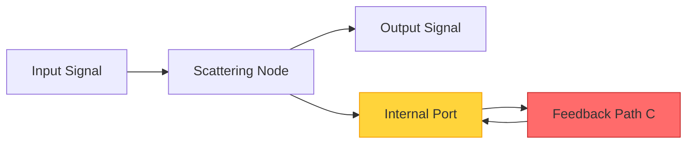
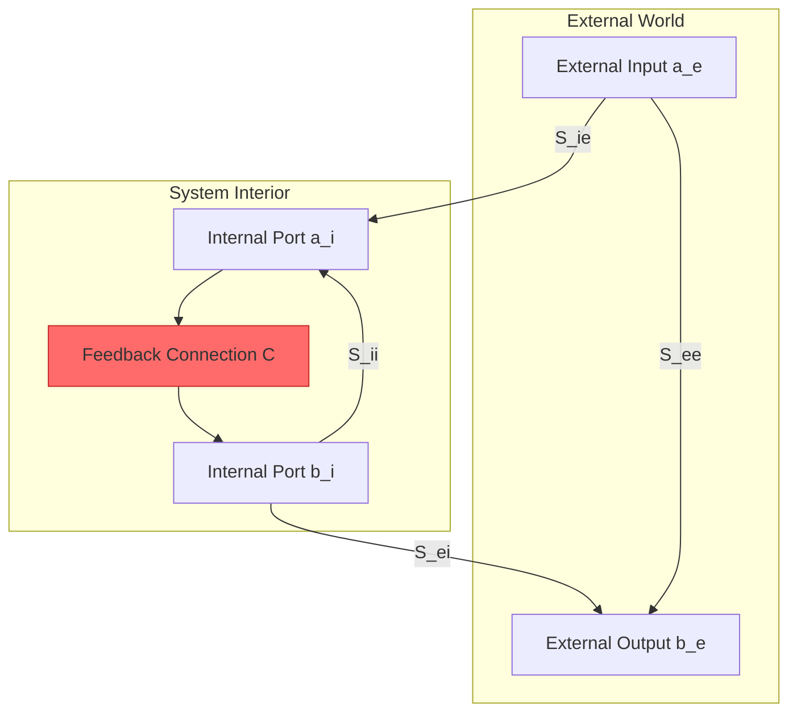
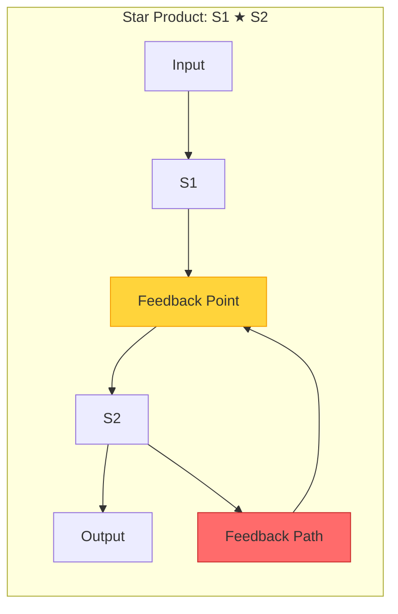
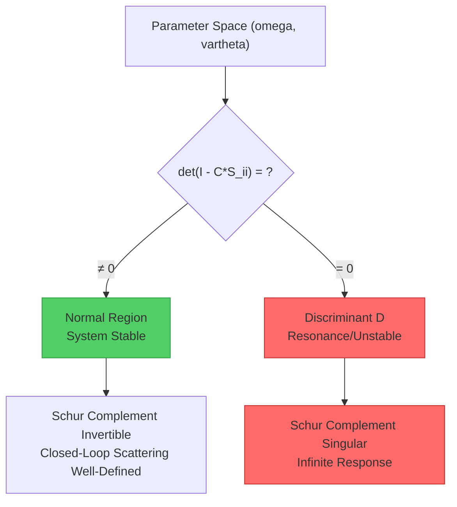
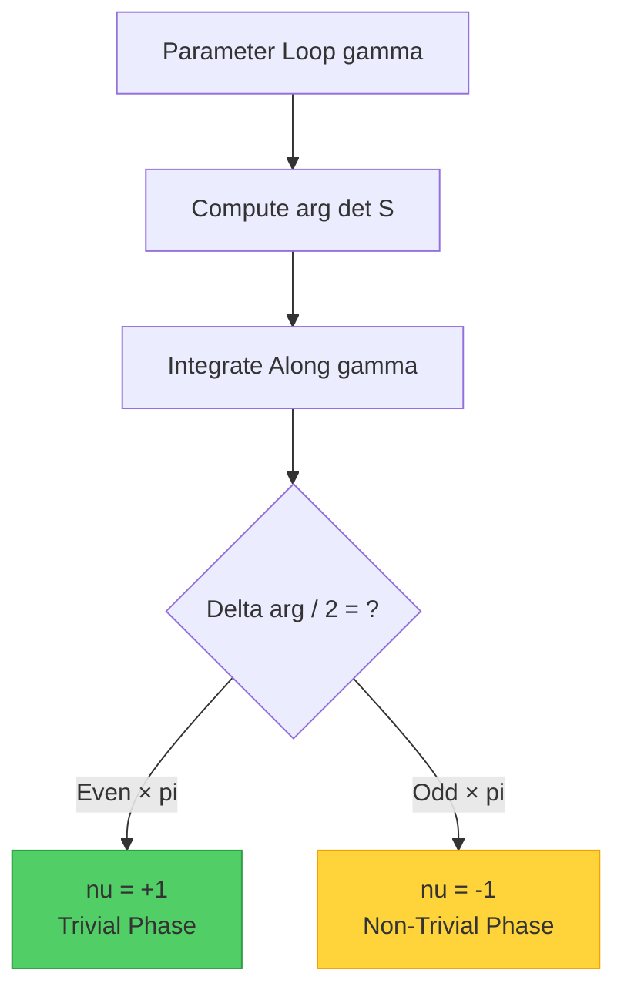
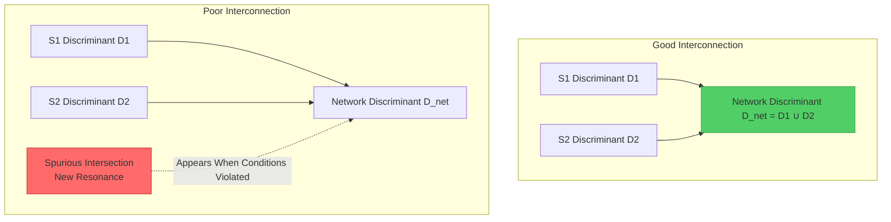
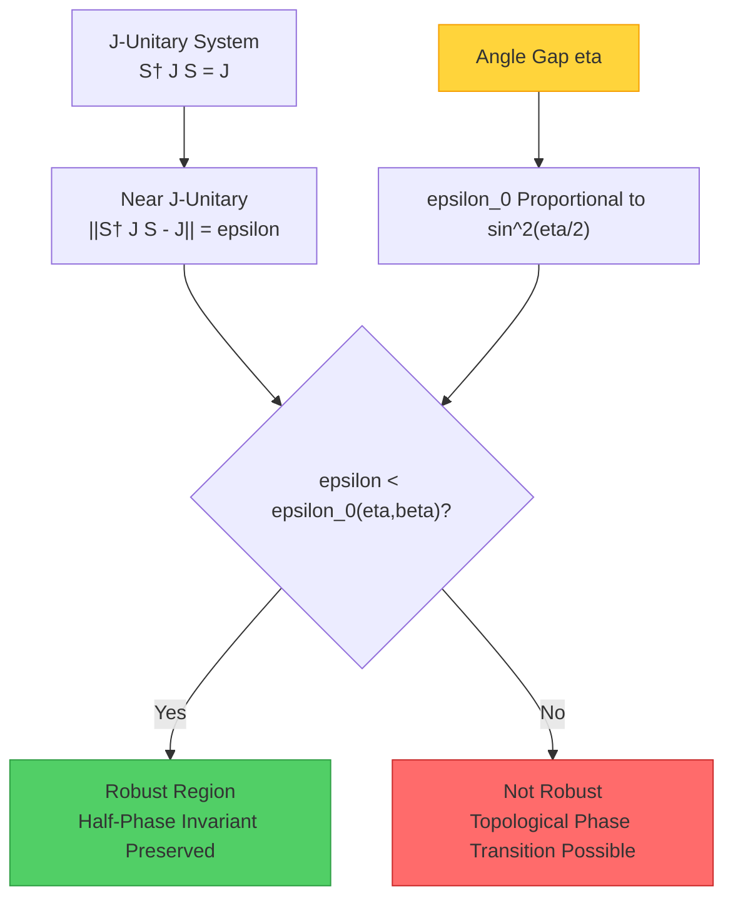
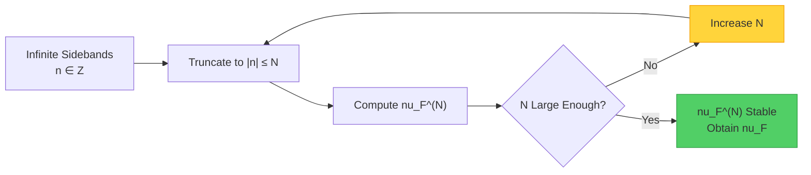
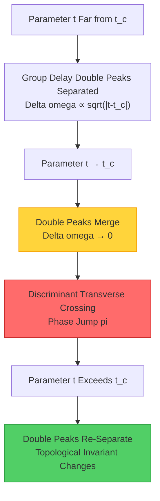

# 13.4 Self-Referential Scattering Networks: When Systems Meet Their Own Mirror

## Introduction: The Magic of Feedback

Imagine standing in a vast hall of mirrors. Each mirror reflects images from other mirrors, light bounces repeatedly between mirrors, forming endless reflections. This simple scene contains the core idea of self-referential scattering networks—**systems "see" themselves through feedback loops**.

In daily life, feedback is everywhere:
- **Microphone feedback when near speakers**: Sound is captured by microphone, amplified and output from speakers, then captured again by microphone, forming a closed loop
- **Stock market herd effect**: Investors' decisions affect stock prices, price changes in turn affect investors' decisions
- **Ecosystem balance**: Increase in predator numbers leads to decrease in prey, decrease in prey leads to predators starving

From a physics perspective, any system containing feedback can be viewed as a **self-referential scattering network**. This section explores the mathematical structure, topological invariants, and applications in quantum technology of such systems.

**Core Questions of This Section**:
1. How to describe scattering networks containing feedback in mathematical language?
2. How does feedback change the topological properties of systems?
3. In non-Hermitian environments, how to ensure robustness of topological invariants?
4. How do these theories apply to quantum control and topological quantum computing?

---

## Part I: Basic Picture of Scattering

### 1.1 Scattering Matrix: Bridge Between Input and Output

In the simplest case, a physical system can be viewed as a **black box** with some input and output ports. The scattering matrix $S$ describes the relationship between input and output:

$$
\mathbf{b} = S \mathbf{a}
$$

where:
- $\mathbf{a}$ is the input wave amplitude vector (can be light waves, sound waves, quantum states, etc.)
- $\mathbf{b}$ is the output wave amplitude vector
- $S$ is the scattering matrix, encoding all scattering information of the system

**Analogy: Post Office Sorting System**
- Input ports = Mail drop slots
- Scattering matrix = Sorting rules
- Output ports = Mail bags for different destinations

If the post office receives 100 letters to Beijing and 50 letters to Shanghai, sorting rules determine how many letters end up in each bag. The scattering matrix is the mathematical expression of these sorting rules.

**Unitarity and Energy Conservation**

For isolated, lossless systems, the scattering matrix is **unitary**:

$$
S^\dagger S = I
$$

This means **energy conservation**: total input energy equals total output energy. Like ideal mirrors don't absorb light energy, only change the direction of light propagation.

### 1.2 Port Partitioning: Internal and External

When systems contain feedback, we need to distinguish **external ports** and **internal ports**:

$$
S = \begin{pmatrix}
S_{ee} & S_{ei} \\
S_{ie} & S_{ii}
\end{pmatrix}
$$

- $S_{ee}$: External → External (direct transmission/reflection)
- $S_{ei}$: Internal → External (feedback output)
- $S_{ie}$: External → Internal (feedback input)
- $S_{ii}$: Internal → Internal (internal circulation)

**Analogy: Internal and External Communication in Enterprises**
- External ports = Customer interfaces, supplier interfaces
- Internal ports = Internal communication between departments
- $S_{ee}$ = Direct customer service (not involving internal processes)
- $S_{ii}$ = Internal approval processes (may cycle multiple times)

---

## Part II: Redheffer Star Product—Algebra of Feedback

### 2.1 Schur Complement: Eliminating Internal Degrees of Freedom

When we connect internal ports through feedback matrix $\mathcal{C}$ ($a_i = \mathcal{C} b_i$), we can eliminate internal degrees of freedom to obtain the **effective closed-loop scattering matrix**:

$$
S^{\circlearrowleft} = S_{ee} + S_{ei} (I - \mathcal{C} S_{ii})^{-1} \mathcal{C} S_{ie}
$$

This formula is called the **Schur complement closure**, transforming an open-loop system into a closed-loop system.

**Analogy: Evaluation of Recursive Functions**

Consider recursive equation:
$$
|x = f(x)
$$

If we can solve to get $x = (1-f)^{-1} \cdot 0$ (assuming initial value 0), then we have "closed" the recursion. Schur complement idea is similar: by solving the self-consistent equation of internal ports, obtain the effective relation of external ports.

**Key Condition**: Condition for Schur complement existence is that $(I - \mathcal{C} S_{ii})$ is invertible. When this condition fails, system exhibits **resonance**—internal feedback forms standing waves, energy cannot escape.

### 2.2 Redheffer Star Product: Algebra of Cascading

When two subsystems $S^{(1)}$ and $S^{(2)}$ are interconnected through feedback, the total scattering matrix can be expressed using **Redheffer star product**:

$$
S^{(1)} \star S^{(2)} = \text{Schur closure}\left[\begin{pmatrix} S^{(1)} & 0 \\ 0 & S^{(2)} \end{pmatrix}, \mathcal{C}_{\text{interconnect}}\right]
$$

**Properties**:
1. **Associativity**: $(S^{(1)} \star S^{(2)}) \star S^{(3)} = S^{(1)} \star (S^{(2)} \star S^{(3)})$
2. **Non-commutative**: Generally $S^{(1)} \star S^{(2)} \neq S^{(2)} \star S^{(1)}$ (cascading order matters)
3. **Identity**: Through scattering $S = I$ is the identity of star product

**Analogy: Function Composition and Feedback**

Ordinary function composition $f \circ g$ is "open chain": $x \to g(x) \to f(g(x))$.

Star product is "closed chain": $x \to g(x) \to f(g(x)) \to \text{feedback to input}$.

This is similar to adding a "memory" mechanism to function composition—previous outputs affect future inputs.

---

## Part III: Discriminant—"Singularities" of Systems

### 3.1 Definition of Discriminant

**Discriminant** $D$ is the set of points in parameter space causing Schur complement to be non-invertible:

$$
D = \left\{ (\omega, \vartheta) : \det(I - \mathcal{C}(\omega,\vartheta) S_{ii}(\omega,\vartheta)) = 0 \right\}
$$

where:
- $\omega$ is frequency parameter
- $\vartheta$ are other physical parameters (such as feedback strength, phase, etc.)

**Physical Meaning**: Points on discriminant correspond to **resonance conditions** or **instability points** of the system.

**Analogy: Singularities on a Map**

Imagine parameter space as a map, discriminant is the "danger zone" on the map:
- **Optical systems**: Discriminant corresponds to laser threshold lines
- **Quantum systems**: Discriminant corresponds to energy level degeneracy or EP points
- **Economic models**: Discriminant corresponds to critical points of market collapse

### 3.2 Transversality: Avoiding "Tangential Intersection"

In good cases, discriminant $D$ should be a **transverse submanifold** in parameter space (smooth surface of codimension 1). This means:
- In two-dimensional parameter space, $D$ is a curve
- In three-dimensional parameter space, $D$ is a surface

**Transversality condition** ensures intersection points of parameter trajectories with discriminant are "clean," without tangency or coincidence.

**Analogy: Road Intersections**

- **Transverse**: Two roads intersect perpendicularly, intersection clear
- **Tangential**: Two roads pass almost parallel, difficult to judge if truly intersecting
- **Coincident**: Two roads completely overlap for some distance

Transversality guarantees we can clearly count the **number of intersection points** of parameter loops with discriminant.

---

## Part IV: Half-Phase Invariant—Miracle of Fourfold Equivalence

### 4.1 Definition of Global Half-Phase

For closed-loop scattering matrix $S^{\circlearrowleft}$, define **global half-phase invariant**:

$$
\nu_{\sqrt{\det S^{\circlearrowleft}}}(\gamma) = \exp\left( \frac{\mathrm{i}}{2} \oint_\gamma \mathrm{d} \arg\det S^{\circlearrowleft} \right) \in \{\pm 1\}
$$

where $\gamma$ is a closed loop in parameter space.

**Intuitive Understanding**:
- Scattering matrix determinant $\det S^{\circlearrowleft}$ is a complex number
- When parameters traverse $\gamma$ once, change in $\arg \det S^{\circlearrowleft}$ can be $0, \pm 2\pi, \pm 4\pi, \ldots$
- Half-phase takes **half-turn** change: $\tfrac{1}{2} \Delta \arg \det S^{\circlearrowleft}$
- Since $\exp(\mathrm{i} n\pi) = \pm 1$ ($n \in \mathbb{Z}$), half-phase is a $\mathbb{Z}_2$ invariant

**Analogy: Half-Turn Motion of Clock Hand**

Imagine clock hour hand:
- Hand completes one turn (12 hours) → phase change $2\pi$
- Half-phase concerns: After hand moves half turn, does direction reverse?
- If moved odd number of half-turns, direction reverses ($\nu = -1$)
- If moved even number of half-turns, direction unchanged ($\nu = +1$)

### 4.2 Fourfold Equivalence Theorem

Half-phase invariant has four equivalent formulations:

**Theorem 4.1 (Fourfold Equivalence)**

If along closed loop $\gamma$ almost everywhere $S^{\circlearrowleft}$ is unitary and $S^{\circlearrowleft} - I$ belongs to trace class, then:

$$
\nu_{\sqrt{\det S^{\circlearrowleft}}}(\gamma) = \exp\left( -\mathrm{i}\pi \oint_\gamma \mathrm{d}\xi \right) = (-1)^{\mathrm{Sf}_{-1}(S^{\circlearrowleft} \circ \gamma)} = (-1)^{I_2(\gamma, D)}
$$

where:
1. **First term**: Global half-phase (geometric phase of determinant)
2. **Second term**: Integral of spectral shift $\xi$ (Birman-Kreĭn formula)
3. **Third term**: Spectral flow $\mathrm{Sf}_{-1}$ of eigenphase crossing $-1$
4. **Fourth term**: Mod-2 intersection number $I_2$ of loop $\gamma$ with discriminant $D$

**Physical Meaning of Four Perspectives**:

| Perspective | Mathematical Object | Physical Meaning | Measurement Method |
|-------------|---------------------|-----------------|-------------------|
| **Geometric Phase** | $\arg \det S^{\circlearrowleft}$ | Overall phase accumulation of scattering process | Interference measurement |
| **Spectral Shift** | $\xi(\omega)$ | Energy level shift relative to reference system | Comparison with known system |
| **Spectral Flow** | $\mathrm{Sf}_{-1}$ | Number of eigenvalues crossing $-1$ | Eigenvalue tracking |
| **Intersection Number** | $I_2(\gamma, D)$ | Number of loop crossings through singularities | Resonance peak counting |

**Analogy: Four Ways to Describe "How Many Times Around an Island"**

1. **Geometric Phase**: Record cumulative change of compass direction angle
2. **Spectral Shift**: Record displacement integral relative to starting point using GPS
3. **Spectral Flow**: Record number of times compass needle passes north
4. **Intersection Number**: Record number of times boat crosses island coastline

Although measurement methods differ, they describe the same geometric fact (mod 2).

### 4.3 Bridge Lemma: Why Are the Four Equivalent?

**Lemma 4.2 (Birman-Kreĭn Bridge)**

From Birman-Kreĭn formula:

$$
\det S(\omega) = \exp\{-2\pi \mathrm{i} \xi(\omega)\}
$$

Therefore:

$$
\arg \det S(\omega) = -2\pi \xi(\omega) + 2\pi n(\omega)
$$

where $n(\omega)$ is integer branch. Integrating along closed loop:

$$
\oint_\gamma \mathrm{d} \arg \det S = -2\pi \oint_\gamma \mathrm{d}\xi + \oint_\gamma \mathrm{d}(2\pi n) = -2\pi \oint_\gamma \mathrm{d}\xi
$$

(because integer $n$ returns to original value along closed loop, $\oint \mathrm{d}n = 0$)

Therefore relationship between half-phase and spectral shift:

$$
\nu_{\sqrt{\det S}} = \exp\left( \frac{\mathrm{i}}{2} \oint \mathrm{d}\arg\det S \right) = \exp\left( -\mathrm{i}\pi \oint \mathrm{d}\xi \right)
$$

**Lemma 4.3 (Spectral Flow and Intersection Number)**

As parameter $\tau$ changes, eigenphases $\phi_j(\tau)$ of scattering matrix evolve. Spectral flow $\mathrm{Sf}_{-1}$ counts (with sign) number of times eigenphase crosses $\pi$ (corresponding to eigenvalue $-1$).

According to implicit function theorem, each time eigenphase crosses $\pi$, a component of discriminant is transversely crossed once. Therefore:

$$
\mathrm{Sf}_{-1}(S^{\circlearrowleft} \circ \gamma) = I_2(\gamma, D) \pmod{2}
$$

**Summary**: Fourfold equivalence is not four different invariants, but **four ways to compute the same topological invariant**. Which method to choose depends on experimental conditions and computational convenience.

---

## Part V: $\mathbb{Z}_2$ Composition Law—Power of Modularity

### 5.1 No Spurious Intersection Theorem

When connecting two subsystems $S^{(1)}$ and $S^{(2)}$ through star product, what is the relationship between total network discriminant $D_{\text{net}}$ and subsystem discriminants $D_{(1)}, D_{(2)}$?

**Theorem 5.1 (No Spurious Intersection)**

If the following conditions are satisfied:
1. **Schur Invertibility Lower Bound**: $\sigma_{\min}(I - S^{(1)}_{ii} S^{(2)}_{ii}) \geq \delta > 0$
2. **Small Mutual Coupling**: $\|S^{(1)}_{ei}\|_2, \|S^{(2)}_{ie}\|_2 \leq \rho < 1$
3. **Tubular Separation**: Tubular neighborhoods of $D_{(1)}$ and $D_{(2)}$ are disjoint

Then network discriminant is **transverse disjoint union** of sub-discriminants:

$$
D_{\text{net}} = D_{(1)} \sqcup D_{(2)}
$$

And intersection numbers satisfy $\mathbb{Z}_2$ addition:

$$
I_2(\gamma, D_{\text{net}}) = I_2(\gamma, D_{(1)}) + I_2(\gamma, D_{(2)}) \pmod{2}
$$

**Physical Meaning**: Under good interconnection conditions, subsystem resonances do not "mix" to produce new spurious resonances due to interconnection. This guarantees **feasibility of modular design**.

**Analogy: Highway Interchange**

- **Subsystem discriminants** = Toll stations on each highway
- **Interconnection** = Building ramps at interchange
- **No spurious intersection condition** = Ramp design reasonable, won't produce new congestion points at interchange
- **Modularity** = Can independently design each highway, then connect via ramps

If ramp design is improper (violating theorem conditions), may produce "spurious toll stations" at interchange—congestion points not originally on any road.

### 5.2 Composition Law of Half-Phase

**Theorem 5.2 ($\mathbb{Z}_2$ Composition Law)**

Under no spurious intersection condition:

$$
\nu_{\text{net}} = \nu_{(1)} \cdot \nu_{(2)} \pmod{2}
$$

That is:
- If both subsystems are trivial phase ($\nu = +1$), network is also trivial
- If exactly one subsystem is non-trivial phase ($\nu = -1$), network is non-trivial
- If both subsystems are non-trivial phase, their "non-triviality" cancels ($(-1) \times (-1) = +1$)

**Analogy: Switches in Circuit**

- $\nu = +1$ ↔ Switch closed (current flows)
- $\nu = -1$ ↔ Switch open (current blocked)
- Two switches in series: Current flows only when both closed (corresponds to $+1 \times +1 = +1$)
- One open: Current blocked (corresponds to $+1 \times -1 = -1$)
- Both open: Still blocked (corresponds to $-1 \times -1 = +1$, but equivalent to $+1$ in $\mathbb{Z}_2$ sense)

**Application: Modular Design of Topological Quantum Computing**

In topological quantum computing, topological protection of logic gates is characterized by half-phase invariant. Composition law guarantees:
- Can independently design and test each quantum gate module
- When assembling modules into complete quantum circuit, total topological protection can be predicted from module properties
- No need to measure topological invariant of entire circuit each time

---

## Part VI: $J$-Unitary Robustness—Survival Rules in Non-Hermitian World

### 6.1 Challenges of Non-Hermitian Systems

In ideal cases, isolated quantum systems are described by Hermitian Hamiltonians, scattering matrices are unitary. But in real world, systems always couple to environment, leading to:
- **Gain**: Population inversion in lasers
- **Loss**: Photon absorption, quantum state decoherence
- **Non-reciprocal**: Circulator effects in magnetic fields

These effects make effective Hamiltonians **non-Hermitian**, scattering matrices no longer unitary.

**Question**: In non-Hermitian systems, eigenvalues can leave unit circle, are topological invariants still robust?

### 6.2 $J$-Inner Product and Generalized Unitarity

In non-Hermitian systems, there exists a generalized metric $J$ (Kreĭn metric), satisfying:
- $J = J^\dagger = J^{-1}$ (Hermitian and invertible)
- Positive definite block: Corresponds to stable modes (small gain)
- Negative definite block: Corresponds to unstable modes (large gain)

Relative to $J$-inner product, define **$J$-unitary** condition:

$$
S^\dagger J S = J
$$

And **$J$-conjugate**:

$$
S^\sharp = J^{-1} S^\dagger J
$$

**Physical Meaning**: $J$-unitarity generalizes ordinary unitarity, characterizing "generalized energy conservation" in non-Hermitian systems.

**Analogy: "Distance" in Hyperbolic Geometry**

- Ordinary unitarity ↔ Distance preservation in Euclidean geometry
- $J$-unitarity ↔ Pseudo-distance preservation in hyperbolic geometry (Minkowski spacetime)
- Distance increases in some directions (timelike), decreases in others (spacelike), but total "interval" remains constant

### 6.3 Kreĭn Angle and Robust Region

For $J$-unitary systems, define **Kreĭn angle** (generalization of phase slope):

$$
\varkappa_j(\tau) = \frac{\operatorname{Im} \langle \psi_j(\tau), J S^{-1}(\partial_\tau S) \psi_j(\tau) \rangle}{\langle \psi_j(\tau), J \psi_j(\tau) \rangle}
$$

And **angle gap**:

$$
\eta = \min_j \inf_\tau \operatorname{dist}(\phi_j(\tau), \pi + 2\pi\mathbb{Z})
$$

**Theorem 6.1 ($J$-Unitary Robustness)**

Let:
- $\|S^\dagger J S - J\| \leq \varepsilon$ (close to $J$-unitary)
- $\eta > 0$ (eigenphase far from $\pi$)
- $\beta = \inf_\tau \sigma_{\min}(I + \mathrm{i}K(\tau)) > 0$ (Cayley map invertible)

Then there exists threshold function:

$$
\varepsilon_0(\eta, \beta) = \min\left\{ \frac{2\beta}{C}, \alpha \sin^2\frac{\eta}{2} \right\}
$$

When $\varepsilon < \varepsilon_0$, half-phase invariant is **robust** to non-Hermitian perturbations.

**Physical Picture**:
- **Angle gap $\eta$**: Minimum distance of eigenphase from "dangerous value" $\pi$
- **Threshold $\varepsilon_0$**: Degree of non-Hermiticity system can tolerate
- **Robust region**: Region in parameter space satisfying $\varepsilon < \varepsilon_0$

**Analogy: Tightrope Walking Balance**

- **Angle gap $\eta$**: Width of tightrope (wider is safer)
- **Non-Hermitian perturbation $\varepsilon$**: Wind strength
- **Robustness theorem**: As long as tightrope is wide enough ($\eta$ large) and wind not too strong ($\varepsilon < \varepsilon_0$), tightrope walker won't fall

### 6.4 Polarization Homotopy: Connecting Hermitian and Non-Hermitian

**Construction 6.2 (Polarization Homotopy)**

Define continuous deformation:

$$
K_t = (1-t) K + t \frac{1}{2}(K + K^\sharp), \quad t \in [0,1]
$$

And corresponding scattering matrix:

$$
S_t = (I - \mathrm{i}K_t)(I + \mathrm{i}K_t)^{-1}
$$

- At $t=0$, $S_0 = S$ is original non-Hermitian system
- At $t=1$, $S_1$ is $J$-unitary (because $K_1 = \frac{1}{2}(K + K^\sharp)$ is $J$-skew-Hermitian)

**Theorem 6.3 (Homotopy Invariance)**

If polarization homotopy $\{S_t\}_{t \in [0,1]}$ does not cross discriminant $D$ throughout the process, then:

$$
\nu_{\sqrt{\det S_0}} = \nu_{\sqrt{\det S_1}}
$$

That is: Half-phase of non-Hermitian system is same as its "$J$-unitarized" version.

**Application**: This allows us to indirectly obtain half-phase of non-Hermitian system by computing half-phase of $J$-unitary system (numerically more stable).

**Analogy: Deformation of Play-Doh**

- Deform a donut-shaped Play-Doh into a coffee cup
- As long as deformation process doesn't tear or glue, topological properties (like "number of holes") remain unchanged
- Polarization homotopy is such a "gentle deformation," preserving topological invariants

---

## Part VII: Floquet Band-Edge Topology—Topological Classification of Periodically Driven Systems

### 7.1 Floquet Systems and Sidebands

When systems are subject to periodic driving (such as periodically modulated lasers, microwaves), description becomes **Floquet theory**:
- Time period $T$
- Frequency domain decomposed into sidebands: $\omega_n = \omega + n \cdot 2\pi/T$, $n \in \mathbb{Z}$
- Scattering matrix becomes infinite-dimensional: $S_F = \bigoplus_{n \in \mathbb{Z}} S(\omega_n)$

**Question**: Determinant of infinite-dimensional matrix is ill-defined, how to define topological invariant?

### 7.2 Truncation and Regularization

**Scheme**: Truncate sidebands to $|n| \leq N$, obtain finite-dimensional scattering matrix $S_F^{(N)}$, define:

$$
\nu_F^{(N)} = \exp\left( \frac{\mathrm{i}}{2} \int_{-\pi/T}^{\pi/T} \partial_\omega \arg\det S_F^{(N)}(\omega) \mathrm{d}\omega \right)
$$

**Theorem 7.1 (Truncation Independence)**

If $S_F^{(N)} \to S_F$ converges in operator norm or Hilbert-Schmidt norm, and endpoints $\omega = \pm \pi/T$ have no branch points migrating with $N$, then there exists $N_*$ such that:

$$
\nu_F^{(N)} = \nu_F^{(N_*)} \quad \forall N \geq N_*
$$

At this point define $\nu_F = \nu_F^{(N_*)}$.

**Physical Picture**:
- High-frequency sidebands ($|n| \gg 1$) contribute negligibly to topology
- Only need to retain enough dominant sidebands to capture topological properties
- $N_*$ is "effective truncation order"

**Analogy: Truncation of Fourier Series**

- Periodic functions can be expanded into infinitely many Fourier modes
- But in actual computation, retaining first $N$ terms is sufficient to approximate original function
- Topological invariants (like winding number) can be accurately read from truncated finite terms

### 7.3 Band-Edge Topological Index

**Theorem 7.2 (Band-Edge Equivalence)**

If endpoints $\omega = \pm \pi/T$ satisfy square root local model, then:

$$
\nu_F = (-1)^{I_2([-\pi/T, \pi/T], D_F)}
$$

where $D_F$ is total branch number (mod 2) of discriminant in Floquet Brillouin zone.

**Physical Meaning**:
- Floquet Brillouin zone $[-\pi/T, \pi/T]$ is similar to first Brillouin zone in solid state physics
- $\nu_F = -1$ indicates **odd number of topological boundary states** at band edge
- $\nu_F = +1$ indicates trivial phase (even number or zero boundary states)

**Application: Floquet Topological Insulators**

- Through periodic driving, can induce topological boundary states in originally trivial materials
- Half-phase invariant $\nu_F$ is classification index of Floquet topological phase
- Corresponds to generalization of $\mathbb{Z}_2$ topological insulators under periodic driving

### 7.4 Gauge Independence

**Lemma 7.3 (Gauge Independence)**

If gauge transformation is applied to scattering matrix:

$$
S_F(\omega) \mapsto U_L(\omega) S_F(\omega) U_R(\omega)
$$

where $U_{L,R}$ are continuous, $|\det U_{L,R}| = 1$, and satisfy band-edge gluing condition:

$$
[\arg\det U_L + \arg\det U_R]_{-\pi/T}^{\pi/T} \in 4\pi\mathbb{Z}
$$

Then half-phase invariant $\nu_F$ is unchanged.

**Physical Meaning**: Topological invariant does not depend on:
- Choice of basis (different lattice points, different gauges)
- Redefinition of phase factors
- As long as gauge transformation "glues well" at band edges (phase jumps are integer multiples of $4\pi$)

**Analogy: Choice of Prime Meridian on Globe**

- Earth's geographical structure is inherent
- But choice of prime meridian (0° longitude) is artificial (Greenwich, London vs Paris)
- Regardless of which prime meridian chosen, Earth's topological properties (like connectivity of continents) unchanged
- Gauge condition ensures: When changing prime meridian, division of eastern and western hemispheres remains consistent

---

## Part VIII: Experimental Observability—How to "See" Topology

### 8.1 Binarization Projection and Majority Voting

In experiments, we cannot directly measure $\arg\det S^{\circlearrowleft}$, but through following steps:

1. **Phase Increment Measurement**:
   $$
   \Delta\phi_{ab} = \frac{1}{2} \left[ \arg\det S(\gamma_a; \theta_b + \delta) - \arg\det S(\gamma_a; \theta_b - \delta) \right]
   $$

2. **Binarization**:
   $$
   \Pi(\Delta\phi_{ab}) = \begin{cases}
   1, & |\Delta\phi_{ab}| \geq \pi/2 \\
   0, & |\Delta\phi_{ab}| < \pi/2
   \end{cases}
   $$

3. **Majority Voting**: For multiple measurements $\{\widehat{\Delta\phi}_{ab}^{(n)}\}_{n=1}^N$, take majority to decide value of $\Pi$.

**Theorem 8.1 (Error Bound and Sample Complexity)**

Let measurement noise be sub-Gaussian with variance $\sigma^2$, effective phase window $\Delta\phi_{\text{eff}} - \pi/2 = m > 0$. Given target error $\delta$, sufficient sample number is:

$$
N \geq \frac{\log(1/\delta)}{2(1/2 - 2e^{-m^2/(2\sigma^2)})^2}
$$

And need $m > \sigma\sqrt{2\log 4}$ to ensure majority voting converges.

**Physical Meaning**:
- **Effective phase window $m$**: Signal strength (distance of phase jump from threshold)
- **Noise $\sigma$**: Measurement uncertainty
- **Sample complexity $N$**: Number of repeated measurements needed
- **Exponential dependence**: $N \sim e^{m^2/\sigma^2}$, higher signal-to-noise ratio requires fewer samples

**Analogy: Opinion Polls**

- **Question**: Is support rate for a policy over 50%?
- **Measurement**: Sample survey of voter opinions (with error)
- **Binarization**: Each person votes yes or no
- **Majority Voting**: Count overall opinion
- **Sample Complexity**: How many people need to survey to reach 95% confidence?

### 8.2 Group Delay Double-Peak Merging—Fingerprint of Topological Change

When parameters approach discriminant, **group delay** of scattering matrix ($\partial_\omega \arg\det S$) exhibits characteristic **double-peak merging** pattern:

$$
\tau_{\text{group}}(\omega) = \partial_\omega \arg\det S(\omega)
$$

**Square Root Asymptotic**:

Near branch point $t = t_c$:

$$
|\arg\det S(t) = \arg\det S(t_c) \pm \arctan(\kappa^{1/2} |t - t_c|^{1/2}) + O(|t - t_c|^{3/2})
$$

Distance between two peaks of group delay:

$$
\Delta\omega = C \sqrt{|t - t_c|} + O(|t - t_c|^{3/2})
$$

**Experimental Procedure**:
1. Scan parameter $t$ (e.g., feedback strength)
2. For each $t$, measure group delay $\tau_{\text{group}}(\omega)$ as function of frequency $\omega$
3. Observe double peaks: peaks separated when far from discriminant, merge when approaching
4. Merging point $t = t_c$ corresponds to transverse crossing of discriminant
5. Number of crossings (mod 2) gives half-phase invariant

**Analogy: "Avoided Crossing" in Resonance Phenomena**

- Eigenfrequencies of two coupled oscillators would originally intersect
- Coupling causes "avoided crossing"—two curves approach but don't intersect
- Closest point corresponds to "pseudo-intersection" or branch point
- Group delay double-peak merging is manifestation of avoided crossing in frequency domain

### 8.3 Prototype System: Coupler-Microring-Gain

**Experimental Platform**: Silicon photonic integrated circuit, containing:
- **Coupler**: $2 \times 2$ directional coupler, coupling coefficient $\kappa$
- **Microring**: Ring resonator, providing frequency-selective phase
- **Gain/Loss**: Erbium-doped waveguide or saturable absorber

**Scattering Matrix**:

Coupler:
$$
C(\kappa) = \begin{pmatrix}
\sqrt{1-\kappa^2} & \mathrm{i}\kappa \\
\mathrm{i}\kappa & \sqrt{1-\kappa^2}
\end{pmatrix}
$$

Feedback path:
$$
\mathcal{C}(\omega, t) = \rho \mathrm{e}^{\mathrm{i}\phi(\omega, t)}
$$

where $\rho$ is feedback strength, $\phi$ is phase.

**Schur Closure**:

$$
S^{\circlearrowleft} = S_{ee} + S_{ei} (I - \mathcal{C} S_{ii})^{-1} \mathcal{C} S_{ie}
$$

**Discriminant**:

$$
\mathcal{C} S_{ii} = 1 \quad \Leftrightarrow \quad \rho \mathrm{e}^{\mathrm{i}\phi} = \frac{1}{S_{ii}}
$$

Forms a curve in $(\omega, t)$ plane.

**Measurement Procedure**:
1. Fix $t$, scan frequency $\omega$, measure transmission spectrum $|S^{\circlearrowleft}_{21}(\omega)|^2$
2. Extract $\arg\det S^{\circlearrowleft}(\omega)$ from phase of transmission spectrum
3. Change $t$, repeat steps 1-2
4. Identify $t_c$ values where group delay double peaks merge
5. Count number of crossings (mod 2) → half-phase invariant

**Advantages**:
- Fully integrated, batch manufacturable
- Electrical or optical control of $\kappa, \rho, \phi$
- Room temperature operation, no cryogenics needed
- Compatible with classical and quantum signals

---

## Part IX: Application Frontiers

### 9.1 Quantum Feedback Control

**Background**: In quantum computing and quantum communication, need real-time measurement of quantum states and feedback control to:
- Stabilize fragile quantum states
- Realize quantum error correction
- Prepare specific target states

**Role of Self-Referential Scattering Networks**:
- Quantum measurement instruments (like homodyne detection) + feedback actuators (like phase modulators) form closed loop
- Topological invariant of network determines stability boundary of feedback control
- $\nu = -1$ may correspond to **topologically stable feedback phase**, robust to parameter perturbations

**Example**: Readout and feedback of superconducting qubits
- Dispersive coupling of readout cavity with qubit → scattering matrix $S_{\text{qubit}}$
- Amplifier chain and feedback line → feedback matrix $\mathcal{C}$
- Closed-loop stability ↔ position of discriminant $D$
- Topologically protected feedback: Even if parameters drift, as long as don't cross $D$, control performance maintained

### 9.2 Topological Quantum Computing

**Background**: Topological quantum computing uses topological phases of systems to encode and manipulate quantum information, naturally resistant to local noise.

**Floquet Topological Phase and Quantum Gates**:
- Periodic driving (e.g., microwave pulse sequences) can induce topological boundary states
- Boundary states serve as topological qubits, long-lived
- Quantum gates realized through braiding topological excitations (e.g., Majorana fermions)
- Topological protection of gate operations characterized by $\nu_F$

**Role of Self-Referential Networks**:
- Quantum gate networks are themselves scattering networks
- Gate cascading ↔ Redheffer star product
- Overall topological phase ↔ topological protection index of quantum algorithm
- $\mathbb{Z}_2$ composition law → modular gate design

**Challenges**:
- Non-Hermiticity: Coupling of qubits to environment
- $J$-unitary robustness theorem provides quantified fault tolerance threshold
- Need to ensure $\varepsilon < \varepsilon_0(\eta, \beta)$

### 9.3 Optical Microring Resonator Networks

**Background**: In silicon photonics, large-scale microring arrays used for:
- Optical switch matrices (data center interconnects)
- Reconfigurable filters (wavelength selection)
- Optical neural networks (AI acceleration)

**Application of Self-Referential Networks**:
- Coupling between microrings + self-feedback of individual microrings → self-referential scattering networks
- Discriminant $D$ corresponds to resonance lines of system
- Topological invariant $\nu$ determines robustness of transfer function
- Use topological protection to design filters insensitive to manufacturing errors

**Design Strategy**:
1. Choose target topological phase $\nu_{\text{target}}$
2. According to $\mathbb{Z}_2$ composition law, decompose into sub-networks
3. Independently optimize each sub-network (using no spurious intersection theorem)
4. Assemble and verify total network $\nu$
5. Confirm through group delay double-peak merging measurement

**Real Cases**:
- Silicon photonic experiments at MIT, Caltech, etc.: Realized topologically protected optical delay lines
- Topological index verified by measuring robustness of boundary states
- Insensitive to ±10% manufacturing errors (compared to ±1% for non-topological designs)

### 9.4 Self-Referential Feedback in Time Crystals

**Connection**: Floquet evolution of time crystals can be viewed as "self-referential feedback in time direction":
- Future state of system depends on past state (memory)
- Periodic driving + feedback → eigenstate structure of Floquet operator
- Subharmonic response of time crystals ↔ topological boundary states at Floquet band edge

**Self-Referential Scattering Perspective**:
- Time evolution operator $U(T)$ corresponds to scattering matrix $S_F$
- "Time period doubling" of time crystals ↔ $\pi$ eigenphase in Floquet Brillouin zone
- Half-phase invariant $\nu_F = -1$ corresponds to time crystal phase

**Applications**:
- Use tools of self-referential scattering networks to analyze stability of time crystals
- Design robust time crystals (insensitive to drive frequency detuning)
- Use time crystals as quantum memory or clocks

---

## Part X: From Hall of Mirrors to Universe—Philosophical Reflections

### 10.1 Depth of Self-Reference

Core of self-referential scattering networks is **interaction of system with itself**. This concept has profound meaning at multiple levels:

**Physical Level**:
- Quantum measurement: Observer and observed system form closed loop through measurement apparatus
- Cosmology: Vacuum fluctuations of entire universe may form self-referential loops (Wheeler's "bootstrap universe")
- Causal structure: Closed timelike curves in general relativity (time machines)

**Mathematical Level**:
- Fixed point theorems: Solution of $x = f(x)$ is result of function "acting on itself"
- Recursion theory: Self-calling of programs (e.g., Ackermann function)
- Category theory: Natural transformations of functors acting on themselves

**Philosophical Level**:
- Self-awareness: Consciousness reflecting on itself ("I know that I know")
- Gödel incompleteness: Encoding and limitations of formal systems on themselves
- Zhuangzi's butterfly dream: Cycle of subject and object ("Do I dream butterfly or does butterfly dream me?")

### 10.2 Robustness and Necessity of Topological Invariants

Half-phase invariant $\nu \in \{\pm 1\}$ is **discrete**, **quantized**, leading to:

**Robustness**:
- Continuous perturbations cannot change discrete quantity (can only jump)
- To change $\nu$, must cross discriminant (singularity)
- This is theoretical foundation of topological quantum computing

**Necessity**:
- Fourfold equivalence theorem shows $\nu$ can be computed from four completely different physical quantities
- This "over-determination" means $\nu$ is not artificially defined, but **intrinsic property** of system
- Analogy: Sum of triangle interior angles being 180° is not a definition, but necessary result of Euclidean geometry

**Universality**:
- Same mathematical structure appears in:
  - Condensed matter physics (topological insulators)
  - Optics (photonic topology)
  - Quantum information (topological error-correcting codes)
  - Robotics (topology of configuration space)
- This suggests topology is **unified language across scales and fields**

### 10.3 Discriminant: Singularities and Creation

Discriminant $D$ is "danger zone" in parameter space, but also **source of creation**:

**Destructive**:
- System loses stability on $D$
- Schur complement singular, response diverges
- May cause system collapse

**Creative**:
- Topological phase transitions can only occur on $D$
- New topological phases "born" from singularities
- Analogy: Big Bang singularity, black hole singularity

**Dialectics**:
- Singularities are "necessary evil": Without singularities, no topological diversity
- Systems achieve "critical" phenomena (like laser threshold) by "approaching but not crossing" singularities
- Art of control theory: Harness singularities, not avoid them

### 10.4 Simplicity and Profundity of Mod 2

$\mathbb{Z}_2$ composition law simplifies complex networks to **binary logic**:

**Simplicity**:
- Only two topological phases ($\nu = \pm 1$)
- Composition rules extremely simple (mod 2 multiplication)
- No need to know all details of network, only need to know $\nu$ of modules

**Profundity**:
- $\mathbb{Z}_2$ is simplest non-trivial group
- Corresponds to **fermion parity**, **square of time-reversal symmetry** in physics
- Connected to Arf invariant in topological field theory

**Philosophical Implication**:
- Simple rules can produce complex phenomena (like cellular automata)
- "One gives birth to two, two gives birth to three, three gives birth to all things" (Laozi) → $\mathbb{Z}_2$ is minimal step from "nothing" to "something"
- Special status of number "2": Binary opposition, yin-yang, 0 and 1

---

## Summary: Dance in Hall of Mirrors

Let us return to the hall of mirrors metaphor at the beginning. In hall of mirrors:
- **Light rays** are signals (quantum states, classical waves)
- **Mirrors** are scattering nodes
- **Reflections** are scattering processes
- **Infinite reflections** are self-referential feedback
- **Geometry of hall** determines topological invariants

When you walk in hall of mirrors (changing parameters), infinite images you see also change. But certain global properties—like "how many times images wind around you"—are **robust**, as long as you don't break mirrors (cross discriminant).

Theory of self-referential scattering networks tells us:
1. **Redheffer star product**: How to assemble modules of hall
2. **Discriminant**: Which places have "magic mirrors" (singularities)
3. **Half-phase invariant**: How to count winding number of images in four ways
4. **$\mathbb{Z}_2$ composition law**: How to predict total hall from properties of sub-halls
5. **$J$-unitary robustness**: Even if mirrors imperfect (non-Hermitian), winding number still robust
6. **Floquet topology**: How time periodicity affects geometry of hall
7. **Group delay double-peak merging**: How to detect mirror configuration through "echo" of light

These are not just mathematical games, but:
- **Theoretical foundation of quantum technology**: Topological quantum computing, quantum feedback control
- **Design principles of photonic integration**: Robust silicon photonic devices
- **Unified perspective of physics**: Universal language from condensed matter to quantum optics

Finally, self-referential scattering networks remind us: **Most interesting properties of systems often arise from their dialogue with themselves**. Whether infinite reflections in hall of mirrors, or consciousness's awareness of itself, self-reference is source of complexity and stage of topological miracles.

---

## Further Reading

1. **Original Paper on Redheffer Star Product**:
   - R. Redheffer, "On a Certain Linear Fractional Transformation," Pacific J. Math. (1959)

2. **Quantum Feedback Networks**:
   - J. Gough, M. R. James, "The Series Product and Its Application to Quantum Feedforward and Feedback Networks," IEEE TAC (2009)

3. **Topological Scattering Theory**:
   - I. C. Fulga et al., "Scattering Formula for the Topological Quantum Number," Phys. Rev. B (2012)

4. **Floquet Topological Matter**:
   - M. S. Rudner et al., "Anomalous Edge States and the Bulk-Edge Correspondence for Periodically Driven Two-Dimensional Systems," Phys. Rev. X (2013)

5. **$J$-Unitary Theory**:
   - D. Z. Arov, H. Dym, "$J$-Contractive Matrix-Valued Functions and Related Topics," CUP (2008)

6. **Non-Hermitian Topology**:
   - Z. Gong et al., "Topological Phases of Non-Hermitian Systems," Phys. Rev. X (2018)

7. **Optical Microring Networks**:
   - A. B. Khanikaev et al., "Photonic Topological Insulators," Nature Mater. (2013)

8. **Quantum Measurement and Feedback**:
   - H. M. Wiseman, G. J. Milburn, "Quantum Measurement and Control," CUP (2009)

9. **Scattering Theory Perspective on Time Crystals**:
   - N. Y. Yao et al., "Discrete Time Crystals: Rigidity, Criticality, and Realizations," Phys. Rev. Lett. (2017)

10. **Philosophical Perspective on Self-Reference**:
    - D. R. Hofstadter, "Gödel, Escher, Bach: An Eternal Golden Braid"

---

**Acknowledgments**: Writing of this section benefited from deep connections between causal structure, time scale, and topology in unified theoretical framework. Special thanks to self-referential scattering network theory for inspiring contributions to quantum feedback control and topological quantum computing.

---

**Mathematical Appendices**:

**Appendix A: Derivation of Schur Complement**

Consider partitioned matrix equation:
$$
\begin{pmatrix}
I & 0 \\
-\mathcal{C} S_{ie} & I
\end{pmatrix}
\begin{pmatrix}
S_{ee} & S_{ei} \\
S_{ie} & S_{ii}
\end{pmatrix}
\begin{pmatrix}
I & -S_{ei}(I-\mathcal{C} S_{ii})^{-1}\mathcal{C} \\
0 & I
\end{pmatrix}
=
\begin{pmatrix}
S^{\circlearrowleft} & 0 \\
\ast & \ast
\end{pmatrix}
$$

Verify through matrix multiplication, upper-left block gives Schur closure formula.

**Appendix B: Cayley Map and $J$-Unitarity**

Cayley map establishes correspondence between scattering matrix $S$ and Hamiltonian $K$:
$$
S = (I - \mathrm{i}K)(I + \mathrm{i}K)^{-1}, \quad K = -\mathrm{i}(I+S)^{-1}(I-S)
$$

If $S^\dagger J S = J$, then $K^\sharp = -K$ ($J$-skew-Hermitian).

**Appendix C: Truncation Error of Floquet Sidebands**

Let $\sum_{|n|>N} \|S_n\| \leq \epsilon_N \to 0$ ($N \to \infty$). Then:
$$
|\det S_F^{(N)} - \det S_F^{(N+1)}| \leq C \epsilon_N
$$

where $C$ depends on $\sup_{|n| \leq N} \|S_n\|$. From this truncation independence follows.

---

**Problems and Thoughts**:

1. **Conceptual**: Why is half-phase a mod 2 invariant rather than integer? Hint: Consider cohomology class of square covering.

2. **Computational**: For single-port system ($S$ is scalar), prove: $\nu_{\sqrt{\det S}}(\gamma) = \exp(\mathrm{i} \oint_\gamma \mathrm{d}\phi/2)$, where $S = e^{\mathrm{i}\phi}$.

3. **Applied**: Design a two-microring coupled system with half-phase invariant $\nu = -1$. What conditions need to be satisfied?

4. **Speculative**: What do self-referential scattering networks and Gödel incompleteness theorem have in common? Hint: Both involve "system encoding itself."

5. **Extension**: If scattering networks are generalized to non-Abelian gauge fields (like Yang-Mills theory), how would half-phase invariant generalize? Hint: Consider holonomy of Wilson loops.

