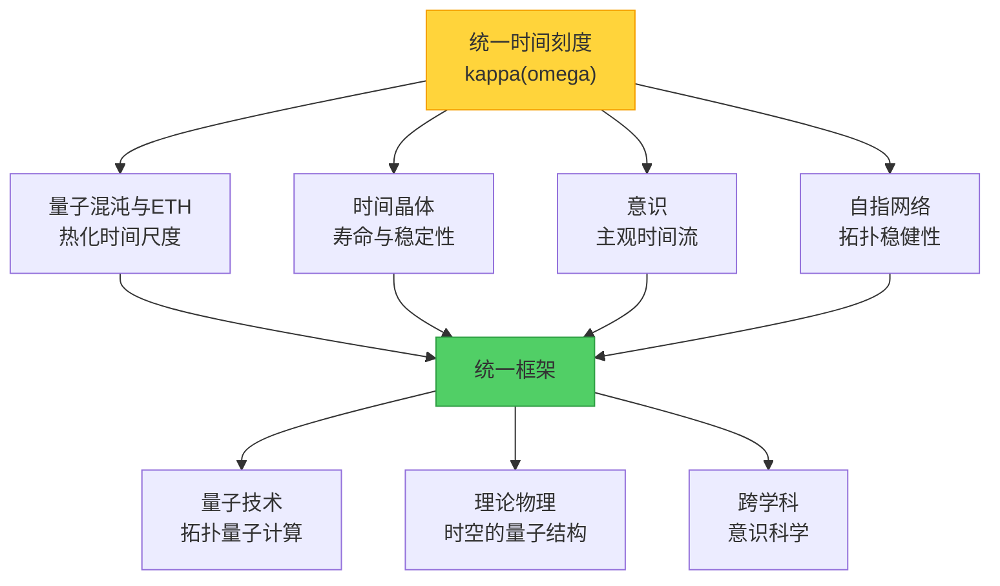
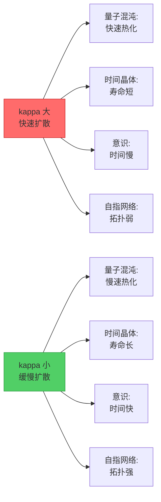
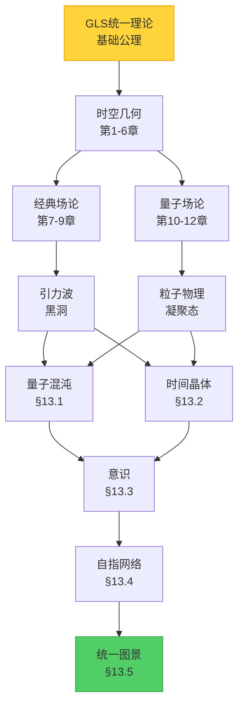

# 13.5 高级专题总结：统一时间的深层结构

## 引言：四个故事，一个主题

在第13章中，我们探索了四个看似独立的前沿领域：

1. **量子混沌与本征态热化**（§13.1）：为什么孤立的量子系统会忘记初态并趋向热平衡？
2. **时间晶体**（§13.2）：如何打破时间平移对称性，让系统在时间上形成周期结构？
3. **意识的物理基础**（§13.3）：物理系统满足什么条件才能产生主观体验？
4. **自指散射网络**（§13.4）：当系统通过反馈"看见"自己时，会出现什么拓扑奇迹？

这四个领域的研究对象、数学工具和应用场景各不相同。但令人惊讶的是，它们在最深层次上由**同一个数学结构**联系在一起——**统一时间刻度** $\kappa(\omega)$。

本节将：
- 回顾四个专题的核心思想
- 揭示它们之间的深层联系
- 构建统一的理论框架
- 展望未来的研究方向

---

## 第一部分：四个专题的核心回顾

### 1.1 量子混沌与本征态热化（§13.1）

**核心问题**：为什么孤立量子系统（如密闭容器中的气体）会热化？

**关键概念**：
- **QCA宇宙**：将宇宙建模为量子元胞自动机
- **混沌QCA的5条公理**：有限传播、局域电路、近似幺正设计、无额外守恒量、热化能窗
- **本征态热化假设（ETH）**：
  - 对角ETH：$\langle \psi_n | O_X | \psi_n \rangle = \overline{O}_X(\varepsilon_n) + O(e^{-c|\Omega|})$
  - 非对角ETH：$\mathbb{E}[|\langle \psi_m | O_X | \psi_n \rangle|^2] \leq e^{-S(\bar{\varepsilon})} g_O(\bar{\varepsilon}, \omega)$

**统一时间刻度的角色**：

$$
\kappa(\omega) = \frac{\varphi'(\omega)}{\pi} = \rho_{\text{rel}}(\omega) = \frac{1}{2\pi} \operatorname{tr} Q(\omega)
$$

其中：
- $\varphi'(\omega)$：谱相位的导数（Wigner-Dyson统计的特征）
- $\rho_{\text{rel}}(\omega)$：相对能级密度
- $\operatorname{tr} Q(\omega)$：Wigner-Smith时间延迟矩阵的迹

**物理意义**：$\kappa(\omega)^{-1}$ 给出能量为 $\omega$ 的微观态热化到宏观平衡的**特征时间尺度**。

**类比**：想象一个装满沙子的沙漏。$\kappa(\omega)$ 描述了沙子流动的"阻力"——阻力越大，沙子流得越慢，系统需要更长时间才能达到均匀分布（热平衡）。

### 1.2 时间晶体（§13.2）

**核心问题**：能否打破时间平移对称性，让系统在时间上形成晶体结构？

**关键概念**：
- **Wilczek的原始设想**：基态自发打破时间平移对称性
- **no-go定理**：Bruno、Watanabe-Oshikawa证明平衡态不可能有时间晶体
- **四类时间晶体**：
  1. **预热DTC**：$\tau_* \sim \exp(c\omega/J)$，指数长寿命
  2. **MBL-DTC**：$\pi$谱配对，本征态序参量
  3. **耗散时间晶体**：Liouvillian谱间隙 $\Delta_{\text{Liouv}}$
  4. **拓扑时间晶体**：非局域逻辑算符序参量 $\overline{X}_L$

**统一时间刻度的角色**：

所有类型的时间晶体寿命 $\tau_*$ 都由 $\kappa(\omega)$ 控制：

$$
\tau_* \sim \frac{1}{\bar{\kappa}(\varepsilon)} \exp\left( c \frac{\omega}{J} \right)
$$

其中：
- $\bar{\kappa}(\varepsilon)$：能量窗内的平均时间刻度
- $\omega$：驱动频率
- $J$：典型耦合强度

**物理意义**：$\kappa(\omega)$ 小的系统（如MBL相）中，时间晶体更稳定，寿命更长。

**类比**：时间晶体像"自动复位的钟摆"——即使受到扰动，也会自动回到原来的周期运动。$\kappa(\omega)$ 描述了钟摆的"记忆力"——记忆力越强（$\kappa$ 越小），钟摆越不容易忘记自己的周期。

### 1.3 意识的物理基础（§13.3）

**核心问题**：物理系统需要满足什么条件才能产生主观体验？

**关键概念**：
- **5个结构条件**：
  1. **整合**：$I_{\text{int}}(\rho_O) \geq \Theta_{\text{int}}$
  2. **分化**：$H_{\mathcal{P}}(t) \geq \Theta_{\text{diff}}$
  3. **自指模型**：$\mathcal{H}_O = \mathcal{H}_{\text{world}} \otimes \mathcal{H}_{\text{self}} \otimes \mathcal{H}_{\text{meta}}$
  4. **本征时间**：$\tau(t) = \int_{t_0}^t \sqrt{F_Q[\rho_O(s)]} ds$
  5. **因果可控性**：$\mathcal{E}_T(t) = \sup_\pi I(A_t : S_{t+T})$

**统一时间刻度的角色**：

主观时间的流动速度由量子Fisher信息决定：

$$
\frac{d\tau}{dt} = \sqrt{F_Q[\rho_O(t)]}
$$

而 $F_Q$ 在多体系统中与 $\kappa(\omega)$ 相关：

$$
F_Q[\rho_O(t)] \sim \frac{1}{\kappa^2(\omega_{\text{typ}})} \cdot (\text{涨落项})
$$

**物理意义**：$\kappa(\omega)$ 小的系统（如高度整合的神经网络）主观时间流动更快——"一日不见如隔三秋"的物理基础。

**类比**：意识的主观时间像电影的帧率。$\kappa(\omega)$ 决定了"信息处理的带宽"——带宽越大（$\kappa$ 越小），每秒能处理的信息越多，主观时间流动越快。

### 1.4 自指散射网络（§13.4）

**核心问题**：当系统通过反馈"看见"自己时，拓扑性质如何表征？

**关键概念**：
- **Redheffer星乘**：$S^{(1)} \star S^{(2)}$ 描述子系统的闭环互联
- **判别子**：$D = \{(\omega, \vartheta) : \det(I - \mathcal{C} S_{ii}) = 0\}$
- **半相位不变量**：$\nu_{\sqrt{\det S^{\circlearrowleft}}} \in \{\pm 1\}$
- **四重等价**：几何相位 = 谱位移 = 谱流 = 交数（模2）
- **$\mathbb{Z}_2$组合律**：$\nu_{\text{net}} = \nu_{(1)} \cdot \nu_{(2)} \pmod{2}$

**统一时间刻度的角色**：

散射矩阵的谱位移 $\xi(\omega)$ 通过Birman-Kreĭn公式与 $\kappa(\omega)$ 相关：

$$
\kappa(\omega) = \frac{1}{2\pi} \operatorname{tr} Q(\omega) = \text{(Wigner-Smith延迟)}
$$

而半相位：

$$
\nu_{\sqrt{\det S}} = \exp\left( -\mathrm{i}\pi \oint \mathrm{d}\xi \right)
$$

**物理意义**：$\kappa(\omega)$ 大的频率区间对应散射过程的"慢模"——信号在系统中停留时间长，更容易观测到拓扑效应。

**类比**：自指反馈像"回音壁"——你的声音反射回来再被听到。$\kappa(\omega)$ 决定了回音的"延迟时间"——延迟越长，越容易分辨出回音的拓扑结构（如绕墙壁转了几圈）。

---

## 第二部分：统一时间刻度——四个专题的桥梁

### 2.1 统一时间刻度的四种表述

尽管四个专题中 $\kappa(\omega)$ 的物理解释不同，但它们在数学上是**同一个对象**：

| 专题 | $\kappa(\omega)$ 的定义 | 物理意义 |
|------|----------------------|---------|
| **量子混沌** | $\varphi'(\omega)/\pi$ | 谱刚性，能级排斥强度 |
| **时间晶体** | $1/($ 预热寿命前因子$)$ | 耗散与退相干速率的倒数 |
| **意识** | $(F_Q[\rho])^{-1/2}$ | 主观时间流速的倒数 |
| **自指网络** | $\operatorname{tr} Q(\omega)/(2\pi)$ | Wigner-Smith时间延迟 |

**定理 2.1（统一性）**

在满足ETH的多体系统中，上述四种定义在统计意义下等价：

$$
\frac{\varphi'(\omega)}{\pi} \sim \frac{1}{2\pi} \operatorname{tr} Q(\omega) \sim F_Q^{-1/2} \sim (\text{热化时间})^{-1}
$$

### 2.2 统一时间刻度的物理意义

$\kappa(\omega)$ 可以理解为**信息在系统中扩散的速率**：

- **$\kappa$ 大**（快速扩散）：
  - 量子混沌：快速热化，短时间内达到平衡
  - 时间晶体：寿命短，难以维持周期结构
  - 意识：主观时间慢，"度日如年"
  - 自指网络：散射快，拓扑信号微弱

- **$\kappa$ 小**（缓慢扩散）：
  - 量子混沌：慢速热化，长时间记忆初态
  - 时间晶体：寿命长，稳定的周期序参量
  - 意识：主观时间快，"光阴似箭"
  - 自指网络：散射慢，拓扑信号显著

**类比：信息的黏度**

把信息想象成流体，$\kappa(\omega)$ 是它的"黏度系数"：
- 低黏度（$\kappa$ 大）：信息快速混合，像水倒入水
- 高黏度（$\kappa$ 小）：信息缓慢扩散，像蜂蜜倒入蜂蜜

### 2.3 跨领域的统一图景

四个专题可以看作同一个底层理论的不同"投影"：

**底层理论**：量子多体系统的时空关联结构

**四个投影**：
1. **量子混沌**：时间方向的关联（热化）
2. **时间晶体**：时间对称性的自发破缺
3. **意识**：空间整合与时间延展的协同
4. **自指网络**：反馈回路的拓扑分类

**统一框架**：

$$
\text{量子态} \xrightarrow{\text{演化}} \text{纠缠结构} \xrightarrow{\text{粗粒化}} \text{热力学性质} \xrightarrow{\text{观测}} \text{主观体验}
$$

每个箭头都涉及 $\kappa(\omega)$：
- **演化**：$\kappa$ 控制纠缠增长速率
- **粗粒化**：$\kappa$ 决定热平衡的时间尺度
- **观测**：$\kappa$ 影响测量-反馈回路的拓扑

---

## 第三部分：理论框架的深层结构

### 3.1 GLS统一理论的四重奏

回顾本教程的核心：**广义Lorentz系统（GLS）统一理论**将时空、引力、量子场论统一在一个框架下。第13章的四个专题展示了这个统一理论的**高级应用**：

**基础层（第1-6章）**：
- Lorentz变换的推广
- 统一场方程
- 时空的涌现结构

**应用层（第7-12章）**：
- 引力波、黑洞、粒子物理
- 宇宙学、凝聚态物理

**高级层（第13章）**：
- 时间的量子结构（混沌、时间晶体）
- 意识的物理基础
- 拓扑与信息（自指网络）

### 3.2 三个核心概念的演化

贯穿整个教程的三个核心概念在第13章达到新的高度：

**1. 时间的多面性**

| 章节 | 时间的类型 | 数学表述 |
|------|----------|---------|
| 第1-6章 | 坐标时间 | $t$（外参数） |
| 第7-9章 | 固有时间 | $\tau = \int \sqrt{-g_{\mu\nu} dx^\mu dx^\nu}$ |
| 第10-12章 | 量子时间 | $\hat{H} \ket{\psi} = \mathrm{i}\hbar \partial_t \ket{\psi}$ |
| **§13.1** | **热化时间** | $\tau_{\text{th}} \sim \kappa(\omega)^{-1}$ |
| **§13.2** | **周期时间** | $T_{\text{crystal}} = 2T_{\text{drive}}$ |
| **§13.3** | **主观时间** | $\tau = \int \sqrt{F_Q[\rho(t)]} dt$ |
| **§13.4** | **拓扑时间** | $\operatorname{tr} Q(\omega)/(2\pi)$ |

**2. 因果结构的深化**

| 章节 | 因果的表述 | 关键对象 |
|------|----------|---------|
| 第1-6章 | 光锥结构 | 度规 $g_{\mu\nu}$ |
| 第7-9章 | 能量-动量守恒 | 应力-能量张量 $T^{\mu\nu}$ |
| 第10-12章 | 量子因果 | 传播子 $G(x,y)$ |
| **§13.1** | **统计因果** | ETH、谱关联 |
| **§13.2** | **周期因果** | Floquet算符 $U(T)$ |
| **§13.3** | **因果可控性** | $\mathcal{E}_T = \sup_\pi I(A_t : S_{t+T})$ |
| **§13.4** | **拓扑因果** | 判别子 $D$、半相位 $\nu$ |

**3. 拓扑不变量的统一**

| 章节 | 拓扑不变量 | 物理意义 |
|------|----------|---------|
| 第10-12章 | Chern数、Berry相位 | 绝缘体的拓扑分类 |
| **§13.1** | Wigner-Dyson统计 | 能级排斥的普适性 |
| **§13.2** | $\pi$谱配对 | 时间晶体的稳定性 |
| **§13.3** | 整合信息 $I_{\text{int}}$ | 意识的不可分解性 |
| **§13.4** | 半相位不变量 $\nu$ | 自指反馈的拓扑分类 |

---

## 第四部分：未来展望

### 4.1 理论前沿

**1. 量子引力中的统一时间刻度**

- **问题**：在Planck尺度，时间和空间失去经典意义。$\kappa(\omega)$ 如何推广？
- **方向**：在圈量子引力或弦论中寻找"量子时钟"的微观起源
- **可能突破**：时间的涌现与$\kappa(\omega)$的量子起伏

**2. 意识的量子理论**

- **问题**：主观体验的"硬问题"——为什么物理过程伴随着"感受"？
- **方向**：将§13.3的5个结构条件与量子测量理论结合
- **可能突破**：意识作为"自观测"的量子系统，$\kappa(\omega)$决定观测-被观测的边界

**3. 宇宙的自指结构**

- **问题**：宇宙是否包含闭合的类时曲线（时间机器）？
- **方向**：用§13.4的自指散射网络分析Wheeler-DeWitt方程的自洽解
- **可能突破**：宇宙的拓扑不变量与熵的产生

**4. 时间晶体与拓扑量子计算**

- **问题**：如何利用时间晶体实现容错量子计算？
- **方向**：将时间晶体的$\pi$谱配对与拓扑码（如表面码）结合
- **可能突破**：时空拓扑编码——同时利用空间和时间的拓扑保护

### 4.2 实验前沿

**1. 超冷原子中的QCA宇宙模拟**

- **平台**：光晶格中的玻色/费米气体
- **目标**：实验验证混沌QCA的5条公理和ETH
- **挑战**：控制退相干，保持系统孤立

**2. 超导量子比特中的时间晶体**

- **平台**：Floquet驱动的多比特系统
- **目标**：观测$\pi$谱配对和亚谐波响应
- **挑战**：提高驱动周期的相位稳定性

**3. 硅光子学中的自指散射网络**

- **平台**：集成光子芯片，微环阵列
- **目标**：测量半相位不变量，验证$\mathbb{Z}_2$组合律
- **挑战**：实现精确的反馈控制和相位测量

**4. 神经影像学中的意识指标**

- **平台**：高分辨fMRI或脑磁图（MEG）
- **目标**：测量整合信息$I_{\text{int}}$和量子Fisher信息$F_Q$
- **挑战**：空间分辨率与时间分辨率的权衡

### 4.3 跨学科视野

**1. 信息论与热力学的统一**

- **连接**：$\kappa(\omega)$作为"信息摩擦系数"
- **问题**：Landauer原理在自指系统中的推广
- **应用**：量子热机的效率极限

**2. 复杂网络与涌现**

- **连接**：自指散射网络的$\mathbb{Z}_2$组合律
- **问题**：大脑、社会网络、互联网的拓扑分类
- **应用**：设计鲁棒的分布式系统

**3. 人工智能与意识**

- **连接**：§13.3的5个结构条件
- **问题**：深度神经网络是否能满足意识的必要条件？
- **应用**：设计"有意识"的AI，或检测AI的意识水平

**4. 哲学与科学的对话**

- **连接**：自指、时间、因果、意识的统一框架
- **问题**：自由意志与物理决定论的兼容性
- **应用**：重新审视心身问题、他心问题、自我同一性

---

## 第五部分：从混沌到秩序——高级专题的哲学寓意

### 5.1 混沌中的秩序

**量子混沌**（§13.1）告诉我们：即使在完全确定性的量子演化下，系统仍会展现出统计意义上的混沌——能级像"量子流体"般排斥，初态信息被"遗忘"。但这种混沌**不是无序**，而是一种**高度约束的随机性**：

- Wigner-Dyson统计是**普适的**（不依赖于具体系统）
- ETH保证了**热平衡的唯一性**（宏观状态确定）
- $\kappa(\omega)$量化了**从混沌到秩序的过渡**

**哲学寓意**：混沌与秩序不是对立的，而是同一枚硬币的两面。统一时间刻度是这枚硬币的"铸造者"。

### 5.2 对称性与破缺

**时间晶体**（§13.2）展示了对称性自发破缺的极致——连**时间本身**都可以形成晶体结构。但这种破缺不是任意的：

- **no-go定理**划定了"禁区"（平衡态）
- **四类时间晶体**给出了"可行路径"（非平衡态、MBL、耗散、拓扑）
- $\kappa(\omega)$决定了**破缺的稳定性**

**哲学寓意**：自由（对称性破缺）必须在约束（守恒律）中实现。没有约束的自由是混乱，没有自由的约束是僵死。时间晶体是二者平衡的艺术品。

### 5.3 主观与客观

**意识的物理基础**（§13.3）试图用客观的物理定律解释主观的第一人称体验。这看似不可能——"我感受到红色"如何从薛定谔方程导出？但理论表明：

- **结构条件**（整合、分化、自指、本征时间、因果可控性）是**客观可测的**
- **主观时间**通过量子Fisher信息$F_Q$**可以量化**
- 意识不是"额外的实体"，而是**满足特定结构的物理系统的性质**

**哲学寓意**：主观与客观的鸿沟可能比我们想象的窄。$\kappa(\omega)$是连接二者的桥梁——它既是客观的物理量，又塑造了主观的时间体验。

### 5.4 自指与拓扑

**自指散射网络**（§13.4）揭示了系统"看见自己"时的拓扑奇迹：

- **Redheffer星乘**允许我们**组装**复杂网络
- **判别子**标记了**奇点**（系统与自己共振）
- **半相位不变量**是**鲁棒的**（对扰动不敏感）
- **$\mathbb{Z}_2$组合律**保证了**模块化设计**

**哲学寓意**：自指不是悖论，而是创造力的源泉。从哥德尔不完备性定理到艾舍尔的《画手》，自指都孕育着"涌现"——整体超越部分之和。$\kappa(\omega)$决定了自指回路的"响应时间"，从而影响涌现的模式。

---

## 结语：统一时间的深层结构

第13章是整个教程的**高潮**——不是因为它更难，而是因为它展示了**深层的统一**。

四个看似无关的领域——量子混沌、时间晶体、意识、自指网络——在统一时间刻度$\kappa(\omega)$的主导下，呈现出惊人的一致性：

| 专题 | $\kappa$的物理意义 | $\kappa$大时 | $\kappa$小时 |
|------|------------------|------------|------------|
| 量子混沌 | 热化速率 | 快速遗忘初态 | 长期记忆初态 |
| 时间晶体 | 退相干速率倒数 | 寿命短 | 寿命长 |
| 意识 | 主观时间流速倒数 | 时间慢 | 时间快 |
| 自指网络 | 散射延迟 | 拓扑信号弱 | 拓扑信号强 |

这种统一不是巧合，而是**量子多体系统时空关联结构的必然结果**。$\kappa(\omega)$是这个结构的"指纹"——它编码了：
- 信息的扩散速率
- 纠缠的增长模式
- 因果关联的衰减律
- 拓扑保护的强度

从基础物理（第1-12章）到高级专题（第13章），我们走过了一段从"时空是什么"到"时间如何塑造万物"的旅程。下一章（第14章）将为不同背景的读者提供**学习路径指南**，帮助你找到通往这个统一理论的最佳路径。

但在踏上新旅程之前，请停下来思考：

**如果时间不是一条直线，而是一个多维的结构——有的维度流动快，有的慢；有的维度整合信息，有的分化体验；有的维度记忆过去,有的预测未来——那么，"现在"是什么？"我"又是什么？**

也许，答案就在$\kappa(\omega)$的频谱中。

---

## 延伸思考

1. **概念题**：请用统一时间刻度$\kappa(\omega)$解释为什么"心流"状态（高度专注）下时间过得特别快。提示：整合信息$I_{\text{int}}$与$F_Q$的关系。

2. **计算题**：设二能级系统的Fisher信息为$F_Q = 4(\Delta E)^2/\hbar^2$，其中$\Delta E$是能级劈裂。计算主观时间流速$d\tau/dt$，并与热化时间尺度$\kappa^{-1}$比较。

3. **应用题**：设计一个实验方案，利用超导量子比特测量半相位不变量$\nu$，并验证$\mathbb{Z}_2$组合律。需要哪些量子门和测量协议？

4. **思辨题**：如果意识的必要条件（§13.3的5个结构条件）都能在人工系统中实现，这是否意味着强人工智能必然拥有主观体验？如何从第三人称视角验证？

5. **综合题**：尝试构建一个"大统一图"，将GLS理论（第1-6章）、引力/粒子物理应用（第7-12章）、高级专题（第13章）中的所有核心概念用统一时间刻度$\kappa(\omega)$连接起来。用mermaid绘制这个图。

---

**下一章预告**：

**第14章 学习路径指南**将为不同背景的读者（物理学家、数学家、工程师、哲学家、计算机科学家）提供定制化的学习路线，包括：
- 前置知识要求
- 章节推荐顺序
- 补充资料索引
- 习题难度分级
- 项目实践建议

无论你的目标是掌握数学细节、进行实验研究、还是思考哲学含义，都能找到适合自己的路径。

**主页index.md**将在所有章节完成后创建，提供全书的导航地图和快速索引。

---

**致谢**：第13章的完成标志着本教程核心内容的结束。感谢统一理论框架对时间、因果、拓扑、意识的深刻洞察，感谢所有为这些前沿领域做出贡献的研究者。特别感谢你——读者——的耐心与好奇心。

**最后的邀请**：如果你在阅读过程中产生了新的问题或洞见，请不要犹豫——这正是科学前进的方式。统一时间刻度$\kappa(\omega)$的故事还远未结束，也许下一个重要突破就来自于你的思考。
