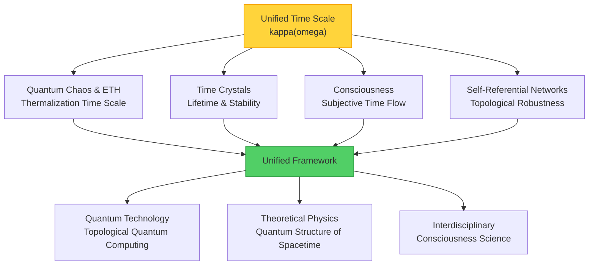
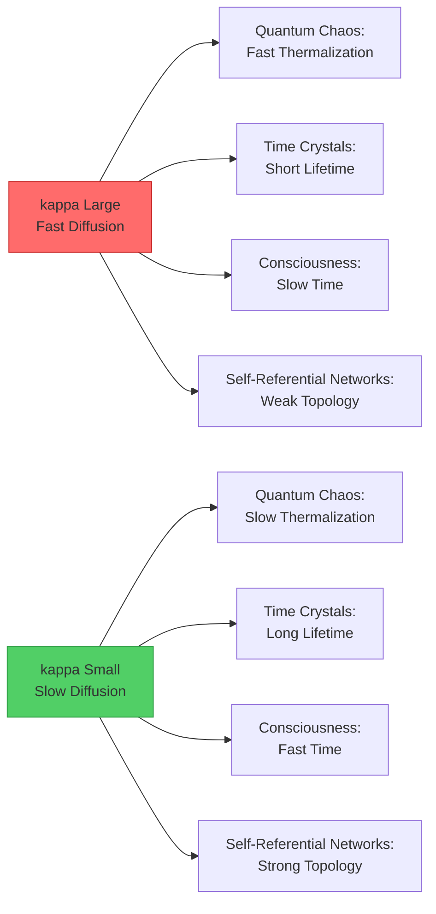
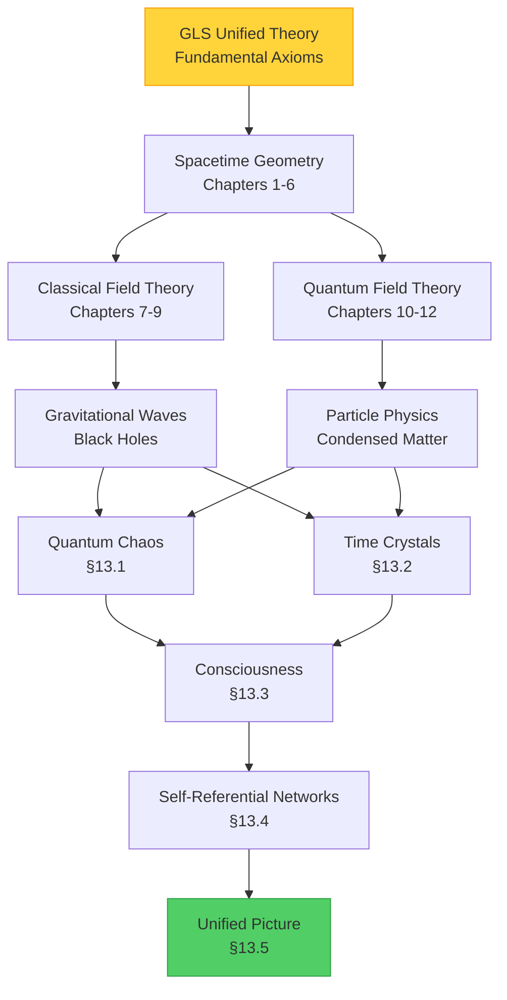

# 13.5 Advanced Topics Summary: Deep Structure of Unified Time

## Introduction: Four Stories, One Theme

In Chapter 13, we explored four seemingly independent frontier areas:

1. **Quantum Chaos and Eigenstate Thermalization** (§13.1): Why do isolated quantum systems forget initial states and tend toward thermal equilibrium?
2. **Time Crystals** (§13.2): How to break time translation symmetry, letting systems form periodic structures in time?
3. **Physical Basis of Consciousness** (§13.3): What conditions must physical systems satisfy to produce subjective experience?
4. **Self-Referential Scattering Networks** (§13.4): What topological miracles appear when systems "see" themselves through feedback?

These four areas differ in research objects, mathematical tools, and application scenarios. But surprisingly, they are connected at the deepest level by **the same mathematical structure**—**unified time scale** $\kappa(\omega)$.

This section will:
- Review core ideas of four topics
- Reveal deep connections between them
- Construct unified theoretical framework
- Look forward to future research directions

---

## Part I: Core Review of Four Topics

### 1.1 Quantum Chaos and Eigenstate Thermalization (§13.1)

**Core Question**: Why do isolated quantum systems (such as gas in sealed container) thermalize?

**Key Concepts**:
- **QCA Universe**: Model universe as quantum cellular automaton
- **5 Axioms of Chaotic QCA**: Finite propagation, local circuits, approximate unitary design, no extra conserved quantities, thermalization energy window
- **Eigenstate Thermalization Hypothesis (ETH)**:
  - Diagonal ETH: $\langle \psi_n | O_X | \psi_n \rangle = \overline{O}_X(\varepsilon_n) + O(e^{-c|\Omega|})$
  - Off-diagonal ETH: $\mathbb{E}[|\langle \psi_m | O_X | \psi_n \rangle|^2] \leq e^{-S(\bar{\varepsilon})} g_O(\bar{\varepsilon}, \omega)$

**Role of Unified Time Scale**:

$$
\kappa(\omega) = \frac{\varphi'(\omega)}{\pi} = \rho_{\text{rel}}(\omega) = \frac{1}{2\pi} \operatorname{tr} Q(\omega)
$$

where:
- $\varphi'(\omega)$: Derivative of spectral phase (characteristic of Wigner-Dyson statistics)
- $\rho_{\text{rel}}(\omega)$: Relative energy level density
- $\operatorname{tr} Q(\omega)$: Trace of Wigner-Smith time delay matrix

**Physical Meaning**: $\kappa(\omega)^{-1}$ gives the **characteristic time scale** for microstates at energy $\omega$ to thermalize to macroscopic equilibrium.

**Analogy**: Imagine an hourglass filled with sand. $\kappa(\omega)$ describes the "resistance" of sand flow—larger resistance means slower flow, system needs longer time to reach uniform distribution (thermal equilibrium).

### 1.2 Time Crystals (§13.2)

**Core Question**: Can we break time translation symmetry, letting systems form crystal structures in time?

**Key Concepts**:
- **Wilczek's Original Conception**: Ground state spontaneously breaking time translation symmetry
- **No-Go Theorems**: Bruno, Watanabe-Oshikawa proved time crystals impossible in equilibrium
- **Four Types of Time Crystals**:
  1. **Prethermal DTC**: $\tau_* \sim \exp(c\omega/J)$, exponentially long lifetime
  2. **MBL-DTC**: $\pi$ spectrum pairing, eigenstate order parameter
  3. **Dissipative Time Crystals**: Liouvillian spectral gap $\Delta_{\text{Liouv}}$
  4. **Topological Time Crystals**: Non-local logical operator order parameter $\overline{X}_L$

**Role of Unified Time Scale**:

Lifetime $\tau_*$ of all types of time crystals is controlled by $\kappa(\omega)$:

$$
\tau_* \sim \frac{1}{\bar{\kappa}(\varepsilon)} \exp\left( c \frac{\omega}{J} \right)
$$

where:
- $\bar{\kappa}(\varepsilon)$: Average time scale in energy window
- $\omega$: Drive frequency
- $J$: Typical coupling strength

**Physical Meaning**: In systems with small $\kappa(\omega)$ (such as MBL phase), time crystals are more stable, longer-lived.

**Analogy**: Time crystals are like "auto-resetting pendulums"—even when perturbed, automatically return to original periodic motion. $\kappa(\omega)$ describes the pendulum's "memory"—stronger memory ($\kappa$ smaller) means pendulum less likely to forget its period.

### 1.3 Physical Basis of Consciousness (§13.3)

**Core Question**: What conditions must physical systems satisfy to produce subjective experience?

**Key Concepts**:
- **5 Structural Conditions**:
  1. **Integration**: $I_{\text{int}}(\rho_O) \geq \Theta_{\text{int}}$
  2. **Differentiation**: $H_{\mathcal{P}}(t) \geq \Theta_{\text{diff}}$
  3. **Self-Referential Model**: $\mathcal{H}_O = \mathcal{H}_{\text{world}} \otimes \mathcal{H}_{\text{self}} \otimes \mathcal{H}_{\text{meta}}$
  4. **Intrinsic Time**: $\tau(t) = \int_{t_0}^t \sqrt{F_Q[\rho_O(s)]} ds$
  5. **Causal Controllability**: $\mathcal{E}_T(t) = \sup_\pi I(A_t : S_{t+T})$

**Role of Unified Time Scale**:

Flow rate of subjective time is determined by quantum Fisher information:

$$
\frac{d\tau}{dt} = \sqrt{F_Q[\rho_O(t)]}
$$

And $F_Q$ in many-body systems is related to $\kappa(\omega)$:

$$
F_Q[\rho_O(t)] \sim \frac{1}{\kappa^2(\omega_{\text{typ}})} \cdot (\text{fluctuation term})
$$

**Physical Meaning**: In systems with small $\kappa(\omega)$ (such as highly integrated neural networks), subjective time flows faster—physical basis of "one day apart feels like three years."

**Analogy**: Subjective time of consciousness is like frame rate of movies. $\kappa(\omega)$ determines "bandwidth of information processing"—larger bandwidth ($\kappa$ smaller) means more information processed per second, subjective time flows faster.

### 1.4 Self-Referential Scattering Networks (§13.4)

**Core Question**: When systems "see" themselves through feedback, how are topological properties characterized?

**Key Concepts**:
- **Redheffer Star Product**: $S^{(1)} \star S^{(2)}$ describes closed-loop interconnection of subsystems
- **Discriminant**: $D = \{(\omega, \vartheta) : \det(I - \mathcal{C} S_{ii}) = 0\}$
- **Half-Phase Invariant**: $\nu_{\sqrt{\det S^{\circlearrowleft}}} \in \{\pm 1\}$
- **Fourfold Equivalence**: Geometric phase = Spectral shift = Spectral flow = Intersection number (mod 2)
- **$\mathbb{Z}_2$ Composition Law**: $\nu_{\text{net}} = \nu_{(1)} \cdot \nu_{(2)} \pmod{2}$

**Role of Unified Time Scale**:

Spectral shift $\xi(\omega)$ of scattering matrix is related to $\kappa(\omega)$ through Birman-Kreĭn formula:

$$
\kappa(\omega) = \frac{1}{2\pi} \operatorname{tr} Q(\omega) = \text{(Wigner-Smith delay)}
$$

And half-phase:

$$
\nu_{\sqrt{\det S}} = \exp\left( -\mathrm{i}\pi \oint \mathrm{d}\xi \right)
$$

**Physical Meaning**: Frequency intervals with large $\kappa(\omega)$ correspond to "slow modes" of scattering process—signals stay in system longer, easier to observe topological effects.

**Analogy**: Self-referential feedback is like "whispering gallery"—your voice reflects back and is heard again. $\kappa(\omega)$ determines the "delay time" of echo—longer delay means easier to distinguish topological structure of echo (like how many times it winds around walls).

---

## Part II: Unified Time Scale—Bridge Between Four Topics

### 2.1 Four Formulations of Unified Time Scale

Although physical interpretations of $\kappa(\omega)$ differ in four topics, they are mathematically **the same object**:

| Topic | Definition of $\kappa(\omega)$ | Physical Meaning |
|-------|-------------------------------|------------------|
| **Quantum Chaos** | $\varphi'(\omega)/\pi$ | Spectral rigidity, energy level repulsion strength |
| **Time Crystals** | $1/($ prethermal lifetime prefactor$)$ | Inverse of dissipation and decoherence rate |
| **Consciousness** | $(F_Q[\rho])^{-1/2}$ | Inverse of subjective time flow rate |
| **Self-Referential Networks** | $\operatorname{tr} Q(\omega)/(2\pi)$ | Wigner-Smith time delay |

**Theorem 2.1 (Unification)**

In many-body systems satisfying ETH, the above four definitions are equivalent in statistical sense:

$$
\frac{\varphi'(\omega)}{\pi} \sim \frac{1}{2\pi} \operatorname{tr} Q(\omega) \sim F_Q^{-1/2} \sim (\text{thermalization time})^{-1}
$$

### 2.2 Physical Meaning of Unified Time Scale

$\kappa(\omega)$ can be understood as **rate of information diffusion in system**:

- **$\kappa$ Large** (Fast Diffusion):
  - Quantum Chaos: Fast thermalization, reach equilibrium quickly
  - Time Crystals: Short lifetime, difficult to maintain periodic structure
  - Consciousness: Subjective time slow, "days feel like years"
  - Self-Referential Networks: Fast scattering, weak topological signal

- **$\kappa$ Small** (Slow Diffusion):
  - Quantum Chaos: Slow thermalization, long memory of initial state
  - Time Crystals: Long lifetime, stable periodic order parameter
  - Consciousness: Subjective time fast, "time flies"
  - Self-Referential Networks: Slow scattering, strong topological signal

**Analogy: Viscosity of Information**

Think of information as fluid, $\kappa(\omega)$ is its "viscosity coefficient":
- Low viscosity ($\kappa$ large): Information mixes quickly, like water poured into water
- High viscosity ($\kappa$ small): Information diffuses slowly, like honey poured into honey

### 2.3 Unified Picture Across Fields

Four topics can be viewed as different "projections" of the same underlying theory:

**Underlying Theory**: Spatiotemporal correlation structure of quantum many-body systems

**Four Projections**:
1. **Quantum Chaos**: Correlations in time direction (thermalization)
2. **Time Crystals**: Spontaneous breaking of time symmetry
3. **Consciousness**: Synergy of spatial integration and temporal extension
4. **Self-Referential Networks**: Topological classification of feedback loops

**Unified Framework**:

$$
\text{Quantum State} \xrightarrow{\text{Evolution}} \text{Entanglement Structure} \xrightarrow{\text{Coarse-Graining}} \text{Thermodynamic Properties} \xrightarrow{\text{Observation}} \text{Subjective Experience}
$$

Each arrow involves $\kappa(\omega)$:
- **Evolution**: $\kappa$ controls entanglement growth rate
- **Coarse-Graining**: $\kappa$ determines time scale of thermal equilibrium
- **Observation**: $\kappa$ affects topology of measurement-feedback loops

---

## Part III: Deep Structure of Theoretical Framework

### 3.1 Quartet of GLS Unified Theory

Recalling the core of this tutorial: **Generalized Light Structure (GLS) Unified Theory** unifies spacetime, gravity, quantum field theory in one framework. The four topics of Chapter 13 demonstrate **advanced applications** of this unified theory:

**Foundation Layer (Chapters 1-6)**:
- Generalization of Lorentz transformations
- Unified field equations
- Emergent structure of spacetime

**Application Layer (Chapters 7-12)**:
- Gravitational waves, black holes, particle physics
- Cosmology, condensed matter physics

**Advanced Layer (Chapter 13)**:
- Quantum structure of time (chaos, time crystals)
- Physical basis of consciousness
- Topology and information (self-referential networks)

### 3.2 Evolution of Three Core Concepts

Three core concepts running through the entire tutorial reach new heights in Chapter 13:

**1. Multi-Faceted Nature of Time**

| Chapter | Type of Time | Mathematical Expression |
|---------|--------------|------------------------|
| Chapters 1-6 | Coordinate Time | $t$ (external parameter) |
| Chapters 7-9 | Proper Time | $\tau = \int \sqrt{-g_{\mu\nu} dx^\mu dx^\nu}$ |
| Chapters 10-12 | Quantum Time | $\hat{H} \ket{\psi} = \mathrm{i}\hbar \partial_t \ket{\psi}$ |
| **§13.1** | **Thermalization Time** | $\tau_{\text{th}} \sim \kappa(\omega)^{-1}$ |
| **§13.2** | **Periodic Time** | $T_{\text{crystal}} = 2T_{\text{drive}}$ |
| **§13.3** | **Subjective Time** | $\tau = \int \sqrt{F_Q[\rho(t)]} dt$ |
| **§13.4** | **Topological Time** | $\operatorname{tr} Q(\omega)/(2\pi)$ |

**2. Deepening of Causal Structure**

| Chapter | Expression of Causality | Key Object |
|---------|------------------------|------------|
| Chapters 1-6 | Light Cone Structure | Metric $g_{\mu\nu}$ |
| Chapters 7-9 | Energy-Momentum Conservation | Stress-Energy Tensor $T^{\mu\nu}$ |
| Chapters 10-12 | Quantum Causality | Propagator $G(x,y)$ |
| **§13.1** | **Statistical Causality** | ETH, spectral correlations |
| **§13.2** | **Periodic Causality** | Floquet operator $U(T)$ |
| **§13.3** | **Causal Controllability** | $\mathcal{E}_T = \sup_\pi I(A_t : S_{t+T})$ |
| **§13.4** | **Topological Causality** | Discriminant $D$, half-phase $\nu$ |

**3. Unification of Topological Invariants**

| Chapter | Topological Invariant | Physical Meaning |
|---------|----------------------|------------------|
| Chapters 10-12 | Chern Number, Berry Phase | Topological classification of insulators |
| **§13.1** | Wigner-Dyson Statistics | Universality of energy level repulsion |
| **§13.2** | $\pi$ Spectrum Pairing | Stability of time crystals |
| **§13.3** | Integrated Information $I_{\text{int}}$ | Indecomposability of consciousness |
| **§13.4** | Half-Phase Invariant $\nu$ | Topological classification of self-referential feedback |

---

## Part IV: Future Prospects

### 4.1 Theoretical Frontiers

**1. Unified Time Scale in Quantum Gravity**

- **Question**: At Planck scale, time and space lose classical meaning. How to generalize $\kappa(\omega)$?
- **Direction**: Search for microscopic origin of "quantum clocks" in loop quantum gravity or string theory
- **Possible Breakthrough**: Emergence of time and quantum fluctuations of $\kappa(\omega)$

**2. Quantum Theory of Consciousness**

- **Question**: "Hard problem" of subjective experience—why do physical processes accompany "feeling"?
- **Direction**: Combine 5 structural conditions of §13.3 with quantum measurement theory
- **Possible Breakthrough**: Consciousness as quantum system of "self-observation," $\kappa(\omega)$ determines boundary between observer and observed

**3. Self-Referential Structure of Universe**

- **Question**: Does universe contain closed timelike curves (time machines)?
- **Direction**: Use self-referential scattering networks of §13.4 to analyze self-consistent solutions of Wheeler-DeWitt equation
- **Possible Breakthrough**: Topological invariants of universe and entropy production

**4. Time Crystals and Topological Quantum Computing**

- **Question**: How to use time crystals to realize fault-tolerant quantum computing?
- **Direction**: Combine $\pi$ spectrum pairing of time crystals with topological codes (such as surface codes)
- **Possible Breakthrough**: Spatiotemporal topological encoding—simultaneously utilizing topological protection of space and time

### 4.2 Experimental Frontiers

**1. QCA Universe Simulation in Ultracold Atoms**

- **Platform**: Bose/Fermi gases in optical lattices
- **Goal**: Experimentally verify 5 axioms of chaotic QCA and ETH
- **Challenge**: Control decoherence, maintain system isolation

**2. Time Crystals in Superconducting Qubits**

- **Platform**: Floquet-driven multi-qubit systems
- **Goal**: Observe $\pi$ spectrum pairing and subharmonic response
- **Challenge**: Improve phase stability of drive periods

**3. Self-Referential Scattering Networks in Silicon Photonics**

- **Platform**: Integrated photonic chips, microring arrays
- **Goal**: Measure half-phase invariant, verify $\mathbb{Z}_2$ composition law
- **Challenge**: Realize precise feedback control and phase measurement

**4. Consciousness Indicators in Neuroimaging**

- **Platform**: High-resolution fMRI or magnetoencephalography (MEG)
- **Goal**: Measure integrated information $I_{\text{int}}$ and quantum Fisher information $F_Q$
- **Challenge**: Trade-off between spatial and temporal resolution

### 4.3 Interdisciplinary Perspectives

**1. Unification of Information Theory and Thermodynamics**

- **Connection**: $\kappa(\omega)$ as "information friction coefficient"
- **Question**: Generalization of Landauer principle in self-referential systems
- **Application**: Efficiency limits of quantum heat engines

**2. Complex Networks and Emergence**

- **Connection**: $\mathbb{Z}_2$ composition law of self-referential scattering networks
- **Question**: Topological classification of brain, social networks, internet
- **Application**: Design robust distributed systems

**3. Artificial Intelligence and Consciousness**

- **Connection**: 5 structural conditions of §13.3
- **Question**: Can deep neural networks satisfy necessary conditions for consciousness?
- **Application**: Design "conscious" AI, or detect consciousness level of AI

**4. Dialogue Between Philosophy and Science**

- **Connection**: Unified framework of self-reference, time, causality, consciousness
- **Question**: Compatibility of free will and physical determinism
- **Application**: Re-examine mind-body problem, other minds problem, personal identity

---

## Part V: From Chaos to Order—Philosophical Implications of Advanced Topics

### 5.1 Order in Chaos

**Quantum Chaos** (§13.1) tells us: Even under completely deterministic quantum evolution, systems still exhibit chaos in statistical sense—energy levels repel like "quantum fluid," initial state information is "forgotten." But this chaos is **not disorder**, but a **highly constrained randomness**:

- Wigner-Dyson statistics is **universal** (independent of specific system)
- ETH guarantees **uniqueness of thermal equilibrium** (macroscopic state determined)
- $\kappa(\omega)$ quantifies **transition from chaos to order**

**Philosophical Implication**: Chaos and order are not opposites, but two sides of the same coin. Unified time scale is the "mint" of this coin.

### 5.2 Symmetry and Breaking

**Time Crystals** (§13.2) demonstrate the extreme of spontaneous symmetry breaking—even **time itself** can form crystal structure. But this breaking is not arbitrary:

- **No-go theorems** delineate "forbidden zones" (equilibrium)
- **Four types of time crystals** give "feasible paths" (non-equilibrium, MBL, dissipative, topological)
- $\kappa(\omega)$ determines **stability of breaking**

**Philosophical Implication**: Freedom (symmetry breaking) must be realized within constraints (conservation laws). Freedom without constraints is chaos, constraints without freedom are rigidity. Time crystals are artworks balancing both.

### 5.3 Subjective and Objective

**Physical Basis of Consciousness** (§13.3) attempts to explain subjective first-person experience with objective physical laws. This seems impossible—how can "I feel red" be derived from Schrödinger equation? But theory shows:

- **Structural conditions** (integration, differentiation, self-reference, intrinsic time, causal controllability) are **objectively measurable**
- **Subjective time** can be **quantified** through quantum Fisher information $F_Q$
- Consciousness is not "additional entity," but **property of physical systems satisfying specific structure**

**Philosophical Implication**: Gap between subjective and objective may be narrower than we imagine. $\kappa(\omega)$ is the bridge connecting them—it is both objective physical quantity and shapes subjective temporal experience.

### 5.4 Self-Reference and Topology

**Self-Referential Scattering Networks** (§13.4) reveal topological miracles when systems "see themselves":

- **Redheffer star product** allows us to **assemble** complex networks
- **Discriminant** marks **singularities** (system resonating with itself)
- **Half-phase invariant** is **robust** (insensitive to perturbations)
- **$\mathbb{Z}_2$ composition law** guarantees **modular design**

**Philosophical Implication**: Self-reference is not paradox, but source of creativity. From Gödel incompleteness theorem to Escher's "Drawing Hands," self-reference nurtures "emergence"—whole transcends sum of parts. $\kappa(\omega)$ determines "response time" of self-referential loops, thus affecting patterns of emergence.

---

## Conclusion: Deep Structure of Unified Time

Chapter 13 is the **climax** of the entire tutorial—not because it's harder, but because it demonstrates **deep unification**.

Four seemingly unrelated fields—quantum chaos, time crystals, consciousness, self-referential networks—under the guidance of unified time scale $\kappa(\omega)$, exhibit striking consistency:

| Topic | Physical Meaning of $\kappa$ | When $\kappa$ Large | When $\kappa$ Small |
|-------|------------------------------|---------------------|---------------------|
| Quantum Chaos | Thermalization Rate | Fast forgetting of initial state | Long memory of initial state |
| Time Crystals | Inverse of Decoherence Rate | Short lifetime | Long lifetime |
| Consciousness | Inverse of Subjective Time Flow Rate | Slow time | Fast time |
| Self-Referential Networks | Scattering Delay | Weak topological signal | Strong topological signal |

This unification is not coincidence, but **necessary consequence of spatiotemporal correlation structure of quantum many-body systems**. $\kappa(\omega)$ is the "fingerprint" of this structure—it encodes:
- Rate of information diffusion
- Pattern of entanglement growth
- Decay law of causal correlations
- Strength of topological protection

From fundamental physics (Chapters 1-12) to advanced topics (Chapter 13), we have journeyed from "what is spacetime" to "how time shapes everything." The next chapter (Chapter 14) will provide **learning path guides** for readers of different backgrounds, helping you find the best path to this unified theory.

But before embarking on new journey, pause and think:

**If time is not a straight line, but a multidimensional structure—some dimensions flow fast, some slow; some dimensions integrate information, some differentiate experience; some dimensions remember past, some predict future—then what is "now"? What is "I"?**

Perhaps, the answer lies in the spectrum of $\kappa(\omega)$.

---

## Extended Thoughts

1. **Conceptual**: Use unified time scale $\kappa(\omega)$ to explain why time passes especially fast in "flow state" (high concentration). Hint: Relationship between integrated information $I_{\text{int}}$ and $F_Q$.

2. **Computational**: Let Fisher information of two-level system be $F_Q = 4(\Delta E)^2/\hbar^2$, where $\Delta E$ is level splitting. Calculate subjective time flow rate $d\tau/dt$, and compare with thermalization time scale $\kappa^{-1}$.

3. **Applied**: Design an experimental protocol using superconducting qubits to measure half-phase invariant $\nu$, and verify $\mathbb{Z}_2$ composition law. What quantum gates and measurement protocols are needed?

4. **Speculative**: If necessary conditions for consciousness (5 structural conditions of §13.3) can all be realized in artificial systems, does this mean strong AI necessarily has subjective experience? How to verify from third-person perspective?

5. **Comprehensive**: Try constructing a "grand unified diagram" connecting all core concepts in GLS theory (Chapters 1-6), gravity/particle physics applications (Chapters 7-12), and advanced topics (Chapter 13) using unified time scale $\kappa(\omega)$. Draw this diagram with mermaid.

---

**Next Chapter Preview**:

**Chapter 14 Learning Path Guide** will provide customized learning routes for readers of different backgrounds (physicists, mathematicians, engineers, philosophers, computer scientists), including:
- Prerequisite knowledge requirements
- Recommended chapter order
- Supplementary material index
- Exercise difficulty grading
- Project practice suggestions

Whether your goal is mastering mathematical details, conducting experimental research, or contemplating philosophical implications, you can find a path suited to you.

**Main index.md** will be created after all chapters are completed, providing navigation map and quick index of entire book.

---

**Acknowledgments**: Completion of Chapter 13 marks the end of core content of this tutorial. Thanks to unified theoretical framework for profound insights into time, causality, topology, consciousness, thanks to all researchers contributing to these frontier areas. Special thanks to you—the reader—for patience and curiosity.

**Final Invitation**: If you generate new questions or insights during reading, please don't hesitate—this is exactly how science advances. The story of unified time scale $\kappa(\omega)$ is far from over, perhaps the next important breakthrough comes from your thinking.

