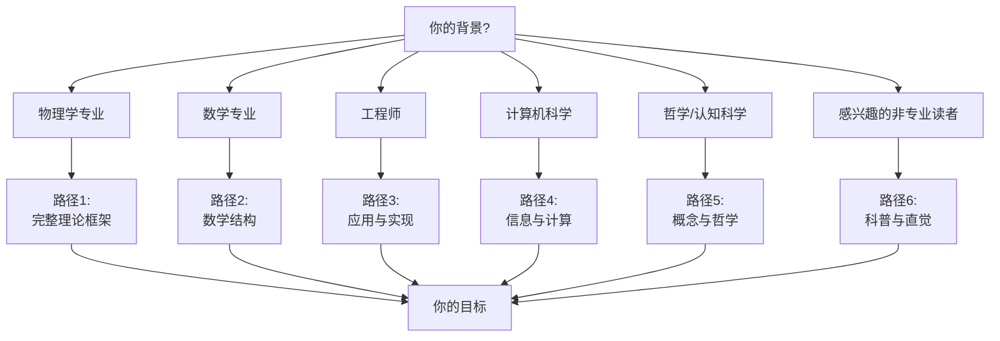
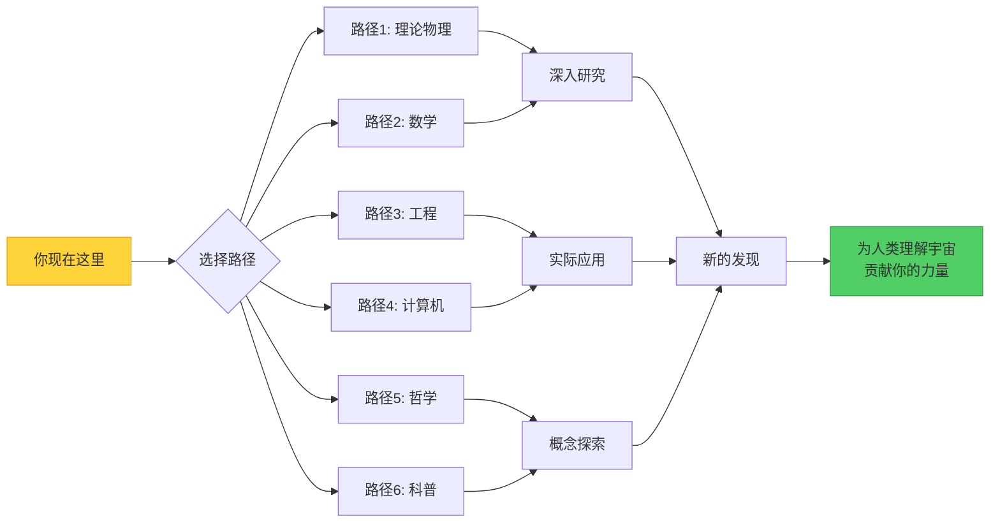

# 第14章 学习路径指南：找到你的统一理论之路

## 引言：没有唯一的道路

你手中的这本教程涵盖了从基础时空几何到量子混沌、从引力波到意识的物理基础、从黑洞热力学到时间晶体——跨越了物理学的多个前沿领域。但这**不意味着你需要按顺序从头读到尾**。

每个读者都有不同的背景、兴趣和目标。本章将帮助你：
1. **评估**你的前置知识
2. **选择**适合你的学习路径
3. **规划**阅读顺序和深度
4. **补充**必要的数学或物理工具
5. **实践**通过项目巩固理解

---

## 第一部分：六种读者类型与定制路径

### 路径1：物理学专业（理论物理/实验物理）

**你可能是**：
- 物理学本科高年级或研究生
- 研究者（凝聚态、高能、量子信息等）
- 想了解统一理论框架的物理学家

**前置知识**：
- ✅ 经典力学（Lagrangian、Hamiltonian形式）
- ✅ 电动力学（Maxwell方程、相对论）
- ✅ 量子力学（Hilbert空间、算符、纠缠）
- ✅ 统计力学（配分函数、热力学极限）
- ⚠️ 广义相对论（建议但非必需）
- ⚠️ 量子场论（第10-12章需要）

**推荐阅读顺序**：

**第一阶段（核心理论，2-3周）**：
1. **第1章**：快速浏览，了解统一理论的动机
2. **第2-3章**：重点阅读，理解GLS的数学结构和因果结构
3. **第4章**：详细学习统一场方程
4. **第5-6章**：理解时空的涌现和量子化

**第二阶段（经典应用，1-2周）**：
5. **第7-9章**：选择感兴趣的领域（引力波、黑洞、宇宙学）深入阅读

**第三阶段（量子应用，2-3周）**：
6. **第10-12章**：根据研究方向选择（粒子物理、凝聚态、量子信息）

**第四阶段（前沿专题，2-4周）**：
7. **第13章**：选择1-2个感兴趣的专题深入研究

**跳过策略**：
- 如果主要关注经典物理，可以跳过第10-12章
- 如果主要关注量子物理，第7-9章可快速浏览
- 第13章的四个专题相对独立，可按兴趣选择

**补充资料**：
- 广义相对论：Wald, *General Relativity*
- 量子场论：Peskin & Schroeder, *An Introduction to QFT*
- 统计场论：Kardar, *Statistical Physics of Fields*

**项目建议**：
- 数值求解GLS方程在特定情形下的解
- 计算黑洞的准正模（QNM）
- 模拟时间晶体的Floquet动力学
- 实现QCA宇宙的元胞自动机仿真

---

### 路径2：数学专业（几何/拓扑/分析）

**你可能是**：
- 数学系学生（微分几何、拓扑、泛函分析方向）
- 想了解物理应用的数学家
- 对数学物理感兴趣的研究者

**前置知识**：
- ✅ 微分几何（流形、联络、曲率）
- ✅ 拓扑学（同伦、上同调、纤维丛）
- ✅ 泛函分析（Hilbert空间、算子理论）
- ⚠️ 李群与李代数（有助于理解对称性）
- ⚠️ 范畴论（可选，用于理解统一框架）

**推荐阅读顺序**：

**第一阶段（几何基础，1-2周）**：
1. **第2章**：重点关注Lorentz变换的几何推广
2. **第3章**：深入研究度规结构和因果锥
3. **第5章**：时空的辛几何结构

**第二阶段（场论的几何，2-3周）**：
4. **第4章**：统一场方程的纤维丛表述
5. **第6章**：量子化的几何相位方法

**第三阶段（拓扑应用，2-3周）**：
6. **第11-12章**：拓扑绝缘体、拓扑相变（Chern数、Berry相位）
7. **§13.4**：自指散射网络（拓扑不变量）

**跳过策略**：
- 物理细节（如粒子物理的标准模型）可以快速浏览
- 专注于数学结构而非具体物理系统

**数学视角的重点**：
- **纤维丛**：统一场论的几何基础（第4章）
- **辛几何**：Hamiltonian系统与量子化（第5-6章）
- **上同调**：拓扑不变量与守恒律（第11-12章）
- **算子代数**：量子多体系统的C*代数表述（第13.1章）
- **谱理论**：散射矩阵的谱流（第13.4章）

**补充资料**：
- Nakahara, *Geometry, Topology and Physics*
- Woodhouse, *Geometric Quantization*
- Hatcher, *Algebraic Topology*
- Simon, *Trace Ideals and Their Applications*

**项目建议**：
- 证明GLS场方程的Noether定理
- 计算具体系统的Chern数（如Haldane模型）
- 构造时间晶体的拓扑分类空间
- 研究自指散射网络的K-理论分类

---

### 路径3：工程师（量子工程/光子学/电子工程）

**你可能是**：
- 量子计算/量子通信工程师
- 光子集成电路设计者
- 射频/微波工程师
- 想将理论应用于实践的工程师

**前置知识**：
- ✅ 电磁学（Maxwell方程、波动方程）
- ✅ 信号与系统（傅里叶变换、传递函数）
- ✅ 量子力学基础（态矢量、算符）
- ⚠️ 光学（波导、谐振器）
- ⚠️ 半导体物理（能带理论）

**推荐阅读顺序**：

**第一阶段（快速入门，1周）**：
1. **第1章**：了解统一理论的框架
2. **第2-3章**：快速浏览，重点理解时间刻度$\kappa(\omega)$的物理意义

**第二阶段（应用导向，2-3周）**：
3. **第12章**：凝聚态应用（超导、磁性、拓扑材料）
4. **§13.2**：时间晶体（Floquet系统、周期驱动）
5. **§13.4**：自指散射网络（反馈控制、拓扑保护）

**第三阶段（专项深入，2-4周）**：
6. 根据具体工程领域选择：
   - **量子计算**：§13.1（退相干）+ §13.4（拓扑量子门）
   - **光子学**：§13.4（微环网络）+ §12.4（拓扑光子学）
   - **微波工程**：§13.4（散射矩阵）+ §7（引力波探测器设计）

**跳过策略**：
- 纯理论章节（第5-6章的数学细节）可以跳过
- 宇宙学（第9章）与工程关系较远
- 专注于可实现的系统

**工程视角的重点**：
- **散射矩阵**：$S$参数测量与优化（第13.4章）
- **Floquet工程**：周期驱动的拓扑态设计（第13.2章）
- **量子反馈**：闭环控制与稳定性（第13.4章）
- **拓扑保护**：对制造误差的鲁棒性（第11-12章）

**补充资料**：
- Pozar, *Microwave Engineering*（散射矩阵）
- Haus, *Waves and Fields in Optoelectronics*（耦合模理论）
- Nielsen & Chuang, *Quantum Computation and Quantum Information*
- Ozawa et al., *Topological Photonics*, Rev. Mod. Phys. (2019)

**项目建议**：
- 设计硅光子微环网络，测量半相位不变量
- 实现超导量子比特的时间晶体相
- 优化量子门的拓扑保护（降低误差率）
- 构建自指反馈控制系统（如激光锁相）

---

### 路径4：计算机科学家（量子计算/算法/信息论）

**你可能是**：
- 量子算法研究者
- 量子纠错码专家
- 信息论/复杂性理论学者
- 对物理基础感兴趣的计算机科学家

**前置知识**：
- ✅ 线性代数（矩阵、本征值、酉矩阵）
- ✅ 概率论与信息论（熵、互信息）
- ✅ 算法复杂性理论（P vs NP、量子加速）
- ⚠️ 量子计算基础（量子门、纠缠、测量）

**推荐阅读顺序**：

**第一阶段（信息论视角，1-2周）**：
1. **第1章**：了解统一框架
2. **§13.1**：量子混沌与ETH（信息扩散）
3. **§13.3**：意识的物理基础（整合信息、因果可控性）

**第二阶段（计算与拓扑，2-3周）**：
4. **§13.4**：自指散射网络（拓扑量子计算）
5. **第11-12章**：拓扑相（拓扑量子纠错码）
6. **§13.2**：时间晶体（量子记忆）

**第三阶段（深入专题，2-4周）**：
7. **第10章**：量子场论（量子门的微观起源）
8. **第6章**：量子化（量子电路的连续极限）

**跳过策略**：
- 经典场论（第7-9章）可以快速浏览
- 微分几何的技术细节（第2-5章）可以跳过

**计算机科学视角的重点**：
- **量子复杂性**：ETH与量子电路深度（第13.1章）
- **拓扑编码**：$\mathbb{Z}_2$组合律与纠错码（第13.4章）
- **信息几何**：Fisher信息与计算资源（第13.3章）
- **量子学习**：Floquet系统的周期性与时序算法（第13.2章）

**补充资料**：
- Preskill, *Quantum Computation* lecture notes
- Kitaev, *Fault-tolerant quantum computation by anyons*, Ann. Phys. (2003)
- Tononi et al., *Integrated Information Theory*, PLOS Comput. Biol. (2016)
- Harrow & Montanaro, *Quantum Computational Supremacy*, Nature (2017)

**项目建议**：
- 实现拓扑量子纠错码（如表面码）
- 模拟QCA宇宙的量子电路复杂度
- 设计基于整合信息的AI意识测试
- 分析时间晶体作为量子记忆的性能

---

### 路径5：哲学家/认知科学家（心灵哲学/科学哲学）

**你可能是**：
- 心灵哲学研究者（意识、自由意志、心身问题）
- 科学哲学学者（因果性、时间、还原论）
- 认知科学家（神经科学、认知建模）
- 对物理基础感兴趣的哲学家

**前置知识**：
- ✅ 基本物理概念（能量、时间、因果）
- ⚠️ 数学（微积分、线性代数）——可以跳过公式推导
- ⚠️ 量子力学（波函数、测量）——有助于理解意识理论

**推荐阅读顺序**：

**第一阶段（概念框架，1-2周）**：
1. **第1章**：统一理论的哲学动机
2. **第3章**：因果结构的物理基础
3. **§13.3**：意识的物理基础（重点！）

**第二阶段（时间与因果，1-2周）**：
4. **第5章**：时间的物理本质
5. **§13.1**：量子混沌（确定性与随机性）
6. **§13.2**：时间晶体（时间的对称性）

**第三阶段（自指与涌现，1-2周）**：
7. **§13.4**：自指散射网络（自我指涉）
8. **第13.5章**：总结（哲学反思）

**跳过策略**：
- 数学推导可以跳过，专注于概念和哲学含义
- 技术应用章节（第10-12章）可以快速浏览

**哲学视角的重点**：
- **心身问题**：§13.3的5个结构条件能否解释主观体验？
- **因果性**：§13.3的因果可控性 vs 物理决定论
- **时间的本质**：主观时间（§13.3）vs 物理时间（§13.1-13.2）
- **自指与涌现**：§13.4的自指反馈 vs 意识的自我模型
- **还原论**：统一时间刻度$\kappa(\omega)$能否统一不同层次的现象？

**补充资料**：
- Chalmers, *The Conscious Mind*（意识的难问题）
- Tononi, *Phi: A Voyage from the Brain to the Soul*（IIT理论）
- Albert, *Time and Chance*（时间箭头的物理基础）
- Hofstadter, *Gödel, Escher, Bach*（自指与意识）

**讨论问题**：
1. 如果满足§13.3的5个结构条件的系统都有意识，这是否意味着泛灵论？
2. 主观时间$\tau = \int \sqrt{F_Q} dt$能否解释"时间膨胀"的心理学现象（如危险时刻）？
3. 自指散射网络的拓扑不变量是否类似于"自我同一性"的不变性？
4. 量子混沌的ETH是否对自由意志有启示（微观随机性 vs 宏观确定性）？

---

### 路径6：感兴趣的非专业读者（科普层面）

**你可能是**：
- 对物理和宇宙感兴趣的爱好者
- 其他领域的专业人士（生物、经济、艺术等）
- 想了解前沿科学的非专业读者

**前置知识**：
- ✅ 高中物理水平（运动、能量、波）
- ⚠️ 微积分（不是必需，可以跳过公式）

**推荐阅读顺序**：

**第一阶段（直觉与比喻，1-2周）**：
1. **第1章**：了解统一理论的宏大愿景
2. **第13章引言**：四个前沿领域的科普介绍
3. **§13.2**：时间晶体（最容易可视化）
4. **§13.3**：意识的物理基础（最贴近日常经验）

**第二阶段（选择感兴趣的主题，2-4周）**：
5. 根据兴趣选择：
   - **宇宙学爱好者**：第9章（宇宙演化）
   - **科幻迷**：第8章（黑洞）+ §13.1（量子混沌）
   - **技术爱好者**：第12章（量子计算）+ §13.4（自指网络）

**跳过策略**：
- 所有数学推导都可以跳过
- 专注于"类比"、"物理意义"和"应用"部分
- 每章的"延伸思考"部分包含有趣的概念讨论

**科普视角的关键类比**：
- **统一时间刻度**：信息的"黏度"（第13章总结）
- **量子混沌**：扑克牌洗牌（§13.1）
- **时间晶体**：自动复位的钟摆（§13.2）
- **意识**：交响乐团的整合（§13.3）
- **自指网络**：镜厅中的无穷反射（§13.4）

**补充资料**（科普书籍）：
- Brian Greene, *The Fabric of the Cosmos*（时空的本质）
- Sean Carroll, *From Eternity to Here*（时间箭头）
- Leonard Susskind, *The Black Hole War*（黑洞信息）
- Max Tegmark, *Our Mathematical Universe*（宇宙的数学结构）

**延伸探索**：
- 观看相关的科普视频（推荐：PBS Space Time、3Blue1Brown）
- 参观科学博物馆的量子物理展区
- 参加公众科学讲座
- 尝试简单的思想实验（如双缝干涉）

---

## 第二部分：章节难度分级与时间估计

### 难度等级说明

- ⭐ **入门级**：科普水平，无需深入数学背景
- ⭐⭐ **中级**：本科物理/数学水平，需要微积分和线性代数
- ⭐⭐⭐ **高级**：研究生水平，需要专业背景（场论、几何等）
- ⭐⭐⭐⭐ **前沿研究**：需要查阅原始文献，适合专业研究者

### 章节难度与阅读时间估计

| 章节 | 难度 | 阅读时间（仔细）| 阅读时间（浏览）| 核心数学工具 |
|------|-----|--------------|--------------|------------|
| 第1章：引言 | ⭐ | 2小时 | 1小时 | 无 |
| 第2章：GLS数学结构 | ⭐⭐⭐ | 1周 | 2天 | 微分几何、李群 |
| 第3章：因果结构 | ⭐⭐ | 4天 | 2天 | 线性代数、锥几何 |
| 第4章：统一场方程 | ⭐⭐⭐ | 1.5周 | 3天 | 纤维丛、变分法 |
| 第5章：时空涌现 | ⭐⭐⭐ | 1周 | 2天 | 辛几何、Lagrangian力学 |
| 第6章：量子化 | ⭐⭐⭐⭐ | 2周 | 4天 | 泛函分析、算子理论 |
| 第7章：引力波 | ⭐⭐ | 3天 | 1天 | 波动方程、傅里叶分析 |
| 第8章：黑洞 | ⭐⭐ | 5天 | 2天 | 微分方程、热力学 |
| 第9章：宇宙学 | ⭐⭐ | 4天 | 2天 | 动力系统、统计物理 |
| 第10章：粒子物理 | ⭐⭐⭐ | 1周 | 3天 | 量子场论、群表示 |
| 第11章：拓扑物态 | ⭐⭐⭐ | 1.5周 | 4天 | 拓扑学、K-理论 |
| 第12章：凝聚态应用 | ⭐⭐ | 5天 | 2天 | 多体物理、平均场 |
| §13.1：量子混沌 | ⭐⭐⭐⭐ | 1.5周 | 4天 | 随机矩阵、谱统计 |
| §13.2：时间晶体 | ⭐⭐⭐ | 1周 | 3天 | Floquet理论、对称性破缺 |
| §13.3：意识 | ⭐⭐⭐ | 1周 | 3天 | 信息论、量子Fisher信息 |
| §13.4：自指网络 | ⭐⭐⭐⭐ | 2周 | 4天 | 散射理论、拓扑不变量 |
| 第13.5章：总结 | ⭐ | 2小时 | 1小时 | 无 |
| 第14章：学习路径 | ⭐ | 1小时 | 30分钟 | 无 |

**总计**（完整阅读）：约**20-25周**（5-6个月全职）
**总计**（选择性阅读）：约**8-12周**（2-3个月）

---

## 第三部分：补充数学工具

### 必备数学工具与学习资源

**线性代数（所有路径）**：
- 本征值、本征向量
- 酉矩阵、厄米矩阵
- 张量积、迹
- **资源**：Strang, *Introduction to Linear Algebra*

**微积分与微分方程（路径1-4）**：
- 偏微分方程（波动方程、扩散方程）
- 变分法
- **资源**：Arnold, *Mathematical Methods of Classical Mechanics*

**微分几何（路径1-2，可选路径3-4）**：
- 流形、切空间
- 联络、曲率
- 纤维丛
- **资源**：Nakahara, *Geometry, Topology and Physics*

**拓扑学（路径2，部分路径1）**：
- 同伦、基本群
- 上同调（de Rham, Čech）
- 纤维丛的分类
- **资源**：Hatcher, *Algebraic Topology*

**泛函分析（路径1-2，量子化部分）**：
- Hilbert空间
- 有界/无界算符
- 谱理论
- **资源**：Reed & Simon, *Functional Analysis*

**群论与李代数（路径1-2，粒子物理部分）**：
- 李群的表示论
- SU(N), SO(N)
- 规范理论
- **资源**：Georgi, *Lie Algebras in Particle Physics*

### 在线资源推荐

**视频课程**：
- Leonard Susskind's *Theoretical Minimum* series（基础物理）
- MIT OpenCourseWare: *General Relativity*, *Quantum Field Theory*
- Perimeter Institute: *PSI Lectures*（前沿物理）

**交互式学习**：
- 3Blue1Brown（数学可视化）
- Quantum Country（量子计算）

**论文与综述**：
- arXiv.org（预印本）
- Reviews of Modern Physics（高质量综述）

---

## 第四部分：项目实践建议

### 初级项目（1-2周）

1. **数值求解GLS方程**（第4章）
   - 工具：Python + NumPy/SciPy
   - 任务：在简单时空（如闵可夫斯基空间小扰动）求解场方程
   - 输出：可视化场的演化

2. **散射矩阵模拟**（§13.4）
   - 工具：MATLAB或Python
   - 任务：构造两端口耦合器网络，计算$S^{\circlearrowleft}$
   - 输出：半相位不变量$\nu$的参数依赖

3. **时间晶体仿真**（§13.2）
   - 工具：QuTiP（Python量子工具包）
   - 任务：模拟Floquet驱动的两能级系统
   - 输出：观察亚谐波响应

### 中级项目（1-2个月）

4. **黑洞准正模计算**（第8章）
   - 工具：Mathematica + 数值PDE求解器
   - 任务：求解Regge-Wheeler方程，提取QNM频率
   - 输出：与引力波观测数据对比

5. **拓扑绝缘体能带计算**（第11章）
   - 工具：Python + Kwant包
   - 任务：计算Haldane模型或SSH模型的Chern数
   - 输出：可视化边界态

6. **意识指标的神经数据分析**（§13.3）
   - 工具：Python + MNE包（脑电数据分析）
   - 任务：从公开的fMRI或EEG数据计算整合信息$I_{\text{int}}$
   - 输出：不同意识状态的区分

### 高级项目（2-6个月，适合硕士/博士课题）

7. **QCA宇宙的量子电路复杂度**（§13.1）
   - 任务：研究混沌QCA的电路深度与纠缠增长
   - 方法：张量网络、随机矩阵理论
   - 目标：证明或证伪ETH的新变体

8. **拓扑量子纠错码实现**（§13.4）
   - 任务：在超导量子芯片上实现表面码或color码
   - 方法：量子门优化、拓扑保护设计
   - 目标：降低逻辑错误率至容错阈值以下

9. **时空涌现的数值模拟**（第5章）
   - 任务：从微观场论出发，数值"生长"出宏观时空
   - 方法：Monte Carlo、重整化群
   - 目标：验证涌现度规与经典广义相对论的一致性

---

## 第五部分：习题使用指南

### 习题分类

每章末的"延伸思考"包含不同类型的问题：

1. **概念题**：检验对物理图景的理解（用文字回答）
2. **计算题**：练习数学推导和公式应用
3. **应用题**：设计实验或分析实际系统
4. **思辨题**：探讨哲学或开放性问题
5. **综合题**：跨章节的联系，需整合多个概念

### 难度标记（每道习题后）

- ✏️ 基础：直接应用公式或概念
- 🧮 中级：需要多步推导或设计策略
- 🏆 挑战：开放性问题或研究级难度

### 使用建议

**物理/数学专业**：
- 每章至少完成2-3道计算题和1道应用题
- 挑战题可作为小论文或项目

**工程师**：
- 专注于应用题和综合题
- 计算题选择与工程相关的

**哲学/科普读者**：
- 专注于概念题和思辨题
- 计算题可以跳过

---

## 第六部分：从学习到研究

### 如何使用本教程开展研究

**1. 识别开放问题**（第13章的前沿专题）

- 每节的"未来展望"列出了待解决的问题
- 选择一个与你背景相关的问题
- 阅读引用的原始文献

**2. 寻找导师与合作者**

- 参加相关领域的会议（如APS March Meeting, QIP）
- 联系论文作者，询问开放问题
- 加入在线社区（如Physics Stack Exchange）

**3. 从复现开始**

- 选择一篇关键论文，复现其结果
- 理解所有技术细节
- 尝试推广到新情形

**4. 提出新问题**

- 在复现过程中，寻找"如果改变X会怎样"的问题
- 用本教程的统一框架重新审视已有结果
- 寻找不同章节/领域之间的联系

**5. 发表与交流**

- 从会议海报/报告开始
- 将结果写成预印本（arXiv）
- 投稿到同行评审期刊

---

## 结语：你的旅程才刚刚开始

这本教程涵盖了从时空几何到意识科学的广阔领域，但它**不是终点**，而是**起点**。

每个领域都有更深的数学、更丰富的物理、更广泛的应用等待你去探索。统一时间刻度$\kappa(\omega)$只是这个宏大图景的一个线索——顺着它，你可能发现新的联系、新的定理、新的应用。

**最后的建议**：
1. **不要害怕公式**——数学是自然最精确的语言
2. **也不要迷失在公式中**——物理直觉同样重要
3. **保持好奇心**——最好的问题往往来自"为什么"和"如果"
4. **与人交流**——科学是集体智慧的结晶
5. **享受过程**——理解宇宙是人类最崇高的冒险

现在，选择你的路径，开始你的旅程吧！

---

**附录：常见问题解答（FAQ）**

**Q1: 我需要完整读完才能开始研究吗？**
A: 不需要。根据你的研究方向，选择3-4个相关章节深入阅读即可。

**Q2: 数学推导都需要掌握吗？**
A: 取决于你的目标。做理论研究需要，做实验或工程应用可以专注于结果。

**Q3: 书中的公式如何验证？**
A: 建议编程实现（Python/Mathematica），或查阅引用的原始文献。

**Q4: 发现书中的错误怎么办？**
A: 这是正常的！记录下来，查文献验证，可能是印刷错误或你发现了新问题。

**Q5: 如何跟上领域的最新进展？**
A: 订阅arXiv每日邮件（quant-ph, cond-mat, gr-qc等板块），关注相关实验组的新闻。

**Q6: 本教程与其他统一理论（如弦论、圈量子引力）的关系？**
A: 本教程是一个独立的框架，但与其他统一理论在某些方面有联系（如涌现时空的思想）。可以视为互补的视角。

祝你学习愉快，探索顺利！🚀
