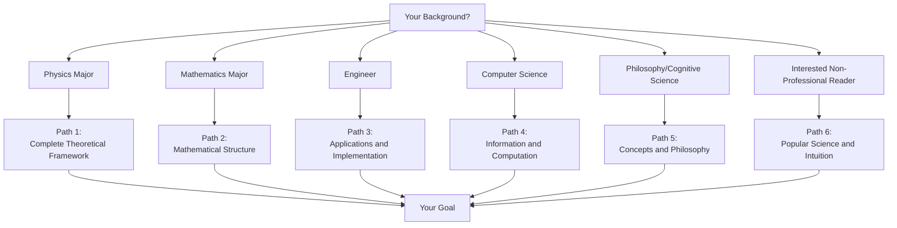
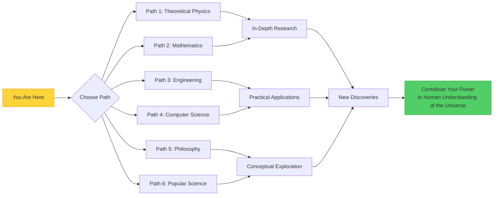

# Chapter 14: Learning Path Guide—Finding Your Path to Unified Theory

## Introduction: There Is No Single Path

This tutorial in your hands covers from fundamental spacetime geometry to quantum chaos, from gravitational waves to the physical foundation of consciousness, from black hole thermodynamics to time crystals—spanning multiple frontier areas of physics. But this **does not mean you need to read it sequentially from beginning to end**.

Each reader has different backgrounds, interests, and goals. This chapter will help you:
1. **Assess** your prerequisite knowledge
2. **Choose** a learning path suitable for you
3. **Plan** reading order and depth
4. **Supplement** necessary mathematical or physical tools
5. **Practice** consolidating understanding through projects

---

## Part One: Six Reader Types and Customized Paths

### Path 1: Physics Major (Theoretical Physics/Experimental Physics)

**You might be**:
- Upper-level undergraduate or graduate student in physics
- Researcher (condensed matter, high energy, quantum information, etc.)
- Physicist wanting to understand unified theoretical framework

**Prerequisites**:
- ✅ Classical mechanics (Lagrangian, Hamiltonian formalism)
- ✅ Electrodynamics (Maxwell equations, relativity)
- ✅ Quantum mechanics (Hilbert space, operators, entanglement)
- ✅ Statistical mechanics (partition function, thermodynamic limit)
- ⚠️ General relativity (recommended but not required)
- ⚠️ Quantum field theory (needed for Chapters 10-12)

**Recommended Reading Order**:

**Phase 1 (Core Theory, 2-3 weeks)**:
1. **Chapter 1**: Quick overview, understand motivation for unified theory
2. **Chapters 2-3**: Focus reading, understand GLS mathematical structure and causal structure
3. **Chapter 4**: Detailed study of unified field equations
4. **Chapters 5-6**: Understand emergence and quantization of spacetime

**Phase 2 (Classical Applications, 1-2 weeks)**:
5. **Chapters 7-9**: Choose areas of interest (gravitational waves, black holes, cosmology) for in-depth reading

**Phase 3 (Quantum Applications, 2-3 weeks)**:
6. **Chapters 10-12**: Choose based on research direction (particle physics, condensed matter, quantum information)

**Phase 4 (Frontier Topics, 2-4 weeks)**:
7. **Chapter 13**: Choose 1-2 topics of interest for in-depth study

**Skipping Strategy**:
- If mainly focused on classical physics, can skip Chapters 10-12
- If mainly focused on quantum physics, Chapters 7-9 can be quickly browsed
- The four topics in Chapter 13 are relatively independent, choose by interest

**Supplementary Materials**:
- General relativity: Wald, *General Relativity*
- Quantum field theory: Peskin & Schroeder, *An Introduction to QFT*
- Statistical field theory: Kardar, *Statistical Physics of Fields*

**Project Suggestions**:
- Numerically solve GLS equations for specific cases
- Calculate quasinormal modes (QNM) of black holes
- Simulate Floquet dynamics of time crystals
- Implement cellular automaton simulation of QCA universe

---

### Path 2: Mathematics Major (Geometry/Topology/Analysis)

**You might be**:
- Mathematics student (differential geometry, topology, functional analysis direction)
- Mathematician wanting to understand physical applications
- Researcher interested in mathematical physics

**Prerequisites**:
- ✅ Differential geometry (manifolds, connections, curvature)
- ✅ Topology (homotopy, cohomology, fiber bundles)
- ✅ Functional analysis (Hilbert space, operator theory)
- ⚠️ Lie groups and Lie algebras (helpful for understanding symmetry)
- ⚠️ Category theory (optional, for understanding unified framework)

**Recommended Reading Order**:

**Phase 1 (Geometric Foundations, 1-2 weeks)**:
1. **Chapter 2**: Focus on geometric generalization of Lorentz transformations
2. **Chapter 3**: In-depth study of metric structure and causal cones
3. **Chapter 5**: Symplectic geometric structure of spacetime

**Phase 2 (Geometry of Field Theory, 2-3 weeks)**:
4. **Chapter 4**: Fiber bundle formulation of unified field equations
5. **Chapter 6**: Geometric phase methods of quantization

**Phase 3 (Topological Applications, 2-3 weeks)**:
6. **Chapters 11-12**: Topological insulators, topological phase transitions (Chern number, Berry phase)
7. **§13.4**: Self-referential scattering networks (topological invariants)

**Skipping Strategy**:
- Physical details (such as standard model of particle physics) can be quickly browsed
- Focus on mathematical structures rather than specific physical systems

**Mathematical Perspective Highlights**:
- **Fiber Bundles**: Geometric foundation of unified field theory (Chapter 4)
- **Symplectic Geometry**: Hamiltonian systems and quantization (Chapters 5-6)
- **Cohomology**: Topological invariants and conservation laws (Chapters 11-12)
- **Operator Algebras**: C* algebra formulation of quantum many-body systems (§13.1)
- **Spectral Theory**: Spectral flow of scattering matrices (§13.4)

**Supplementary Materials**:
- Nakahara, *Geometry, Topology and Physics*
- Woodhouse, *Geometric Quantization*
- Hatcher, *Algebraic Topology*
- Simon, *Trace Ideals and Their Applications*

**Project Suggestions**:
- Prove Noether's theorem for GLS field equations
- Calculate Chern numbers for specific systems (e.g., Haldane model)
- Construct topological classification space for time crystals
- Study K-theory classification of self-referential scattering networks

---

### Path 3: Engineer (Quantum Engineering/Photonics/Electronic Engineering)

**You might be**:
- Quantum computing/quantum communication engineer
- Photonic integrated circuit designer
- RF/microwave engineer
- Engineer wanting to apply theory to practice

**Prerequisites**:
- ✅ Electromagnetics (Maxwell equations, wave equations)
- ✅ Signals and systems (Fourier transform, transfer functions)
- ✅ Basic quantum mechanics (state vectors, operators)
- ⚠️ Optics (waveguides, resonators)
- ⚠️ Semiconductor physics (band theory)

**Recommended Reading Order**:

**Phase 1 (Quick Start, 1 week)**:
1. **Chapter 1**: Understand unified theoretical framework
2. **Chapters 2-3**: Quick browse, focus on understanding physical meaning of time scale $\kappa(\omega)$

**Phase 2 (Application-Oriented, 2-3 weeks)**:
3. **Chapter 12**: Condensed matter applications (superconductivity, magnetism, topological materials)
4. **§13.2**: Time crystals (Floquet systems, periodic driving)
5. **§13.4**: Self-referential scattering networks (feedback control, topological protection)

**Phase 3 (Specialized Depth, 2-4 weeks)**:
6. Choose based on specific engineering field:
   - **Quantum Computing**: §13.1 (decoherence) + §13.4 (topological quantum gates)
   - **Photonics**: §13.4 (microring networks) + §12.4 (topological photonics)
   - **Microwave Engineering**: §13.4 (scattering matrices) + §7 (gravitational wave detector design)

**Skipping Strategy**:
- Pure theory chapters (mathematical details of Chapters 5-6) can be skipped
- Cosmology (Chapter 9) is less related to engineering
- Focus on realizable systems

**Engineering Perspective Highlights**:
- **Scattering Matrices**: $S$ parameter measurement and optimization (§13.4)
- **Floquet Engineering**: Topological state design through periodic driving (§13.2)
- **Quantum Feedback**: Closed-loop control and stability (§13.4)
- **Topological Protection**: Robustness to manufacturing errors (Chapters 11-12)

**Supplementary Materials**:
- Pozar, *Microwave Engineering* (scattering matrices)
- Haus, *Waves and Fields in Optoelectronics* (coupled mode theory)
- Nielsen & Chuang, *Quantum Computation and Quantum Information*
- Ozawa et al., *Topological Photonics*, Rev. Mod. Phys. (2019)

**Project Suggestions**:
- Design silicon photonic microring networks, measure half-phase invariants
- Realize time crystal phase in superconducting qubits
- Optimize topological protection of quantum gates (reduce error rates)
- Build self-referential feedback control systems (e.g., laser phase locking)

---

### Path 4: Computer Scientist (Quantum Computing/Algorithms/Information Theory)

**You might be**:
- Quantum algorithm researcher
- Quantum error correction code expert
- Information theory/complexity theory scholar
- Computer scientist interested in physical foundations

**Prerequisites**:
- ✅ Linear algebra (matrices, eigenvalues, unitary matrices)
- ✅ Probability theory and information theory (entropy, mutual information)
- ✅ Algorithm complexity theory (P vs NP, quantum speedup)
- ⚠️ Basic quantum computing (quantum gates, entanglement, measurement)

**Recommended Reading Order**:

**Phase 1 (Information Theory Perspective, 1-2 weeks)**:
1. **Chapter 1**: Understand unified framework
2. **§13.1**: Quantum chaos and ETH (information diffusion)
3. **§13.3**: Physical foundation of consciousness (integrated information, causal controllability)

**Phase 2 (Computation and Topology, 2-3 weeks)**:
4. **§13.4**: Self-referential scattering networks (topological quantum computation)
5. **Chapters 11-12**: Topological phases (topological quantum error correction codes)
6. **§13.2**: Time crystals (quantum memory)

**Phase 3 (In-Depth Topics, 2-4 weeks)**:
7. **Chapter 10**: Quantum field theory (microscopic origin of quantum gates)
8. **Chapter 6**: Quantization (continuous limit of quantum circuits)

**Skipping Strategy**:
- Classical field theory (Chapters 7-9) can be quickly browsed
- Technical details of differential geometry (Chapters 2-5) can be skipped

**Computer Science Perspective Highlights**:
- **Quantum Complexity**: ETH and quantum circuit depth (§13.1)
- **Topological Coding**: $\mathbb{Z}_2$ composition law and error correction codes (§13.4)
- **Information Geometry**: Fisher information and computational resources (§13.3)
- **Quantum Learning**: Periodicity of Floquet systems and temporal algorithms (§13.2)

**Supplementary Materials**:
- Preskill, *Quantum Computation* lecture notes
- Kitaev, *Fault-tolerant quantum computation by anyons*, Ann. Phys. (2003)
- Tononi et al., *Integrated Information Theory*, PLOS Comput. Biol. (2016)
- Harrow & Montanaro, *Quantum Computational Supremacy*, Nature (2017)

**Project Suggestions**:
- Implement topological quantum error correction codes (e.g., surface codes)
- Simulate quantum circuit complexity of QCA universe
- Design AI consciousness tests based on integrated information
- Analyze performance of time crystals as quantum memory

---

### Path 5: Philosopher/Cognitive Scientist (Philosophy of Mind/Science Philosophy)

**You might be**:
- Philosophy of mind researcher (consciousness, free will, mind-body problem)
- Philosophy of science scholar (causality, time, reductionism)
- Cognitive scientist (neuroscience, cognitive modeling)
- Philosopher interested in physical foundations

**Prerequisites**:
- ✅ Basic physical concepts (energy, time, causality)
- ⚠️ Mathematics (calculus, linear algebra)—can skip formula derivations
- ⚠️ Quantum mechanics (wave functions, measurement)—helpful for understanding consciousness theory

**Recommended Reading Order**:

**Phase 1 (Conceptual Framework, 1-2 weeks)**:
1. **Chapter 1**: Philosophical motivation for unified theory
2. **Chapter 3**: Physical foundation of causal structure
3. **§13.3**: Physical foundation of consciousness (focus!)

**Phase 2 (Time and Causality, 1-2 weeks)**:
4. **Chapter 5**: Physical nature of time
5. **§13.1**: Quantum chaos (determinism and randomness)
6. **§13.2**: Time crystals (symmetry of time)

**Phase 3 (Self-Reference and Emergence, 1-2 weeks)**:
7. **§13.4**: Self-referential scattering networks (self-reference)
8. **Chapter 13.5**: Summary (philosophical reflection)

**Skipping Strategy**:
- Mathematical derivations can be skipped, focus on concepts and philosophical implications
- Technical application chapters (Chapters 10-12) can be quickly browsed

**Philosophical Perspective Highlights**:
- **Mind-Body Problem**: Can the 5 structural conditions of §13.3 explain subjective experience?
- **Causality**: Causal controllability of §13.3 vs physical determinism
- **Nature of Time**: Subjective time (§13.3) vs physical time (§13.1-13.2)
- **Self-Reference and Emergence**: Self-referential feedback of §13.4 vs self-model of consciousness
- **Reductionism**: Can unified time scale $\kappa(\omega)$ unify phenomena at different levels?

**Supplementary Materials**:
- Chalmers, *The Conscious Mind* (hard problem of consciousness)
- Tononi, *Phi: A Voyage from the Brain to the Soul* (IIT theory)
- Albert, *Time and Chance* (physical foundation of time arrow)
- Hofstadter, *Gödel, Escher, Bach* (self-reference and consciousness)

**Discussion Questions**:
1. If systems satisfying the 5 structural conditions of §13.3 all have consciousness, does this imply panpsychism?
2. Can subjective time $\tau = \int \sqrt{F_Q} dt$ explain psychological phenomena of "time dilation" (e.g., dangerous moments)?
3. Are topological invariants of self-referential scattering networks similar to invariance of "self-identity"?
4. Does ETH of quantum chaos have implications for free will (microscopic randomness vs macroscopic determinism)?

---

### Path 6: Interested Non-Professional Reader (Popular Science Level)

**You might be**:
- Enthusiast interested in physics and the universe
- Professional in other fields (biology, economics, arts, etc.)
- Non-professional reader wanting to understand frontier science

**Prerequisites**:
- ✅ High school physics level (motion, energy, waves)
- ⚠️ Calculus (not required, can skip formulas)

**Recommended Reading Order**:

**Phase 1 (Intuition and Analogies, 1-2 weeks)**:
1. **Chapter 1**: Understand grand vision of unified theory
2. **Chapter 13 Introduction**: Popular science introduction to four frontier areas
3. **§13.2**: Time crystals (easiest to visualize)
4. **§13.3**: Physical foundation of consciousness (closest to everyday experience)

**Phase 2 (Choose Topics of Interest, 2-4 weeks)**:
5. Choose based on interest:
   - **Cosmology Enthusiast**: Chapter 9 (cosmic evolution)
   - **Sci-Fi Fan**: Chapter 8 (black holes) + §13.1 (quantum chaos)
   - **Technology Enthusiast**: Chapter 12 (quantum computing) + §13.4 (self-referential networks)

**Skipping Strategy**:
- All mathematical derivations can be skipped
- Focus on "analogies," "physical meaning," and "applications" sections
- "Extended Thinking" sections in each chapter contain interesting conceptual discussions

**Key Analogies from Popular Science Perspective**:
- **Unified Time Scale**: "Viscosity" of information (Chapter 13 summary)
- **Quantum Chaos**: Shuffling playing cards (§13.1)
- **Time Crystals**: Self-resetting pendulum (§13.2)
- **Consciousness**: Integration of symphony orchestra (§13.3)
- **Self-Referential Networks**: Infinite reflections in hall of mirrors (§13.4)

**Supplementary Materials** (Popular Science Books):
- Brian Greene, *The Fabric of the Cosmos* (nature of spacetime)
- Sean Carroll, *From Eternity to Here* (time arrow)
- Leonard Susskind, *The Black Hole War* (black hole information)
- Max Tegmark, *Our Mathematical Universe* (mathematical structure of universe)

**Extended Exploration**:
- Watch related popular science videos (recommended: PBS Space Time, 3Blue1Brown)
- Visit quantum physics exhibits at science museums
- Attend public science lectures
- Try simple thought experiments (e.g., double-slit interference)

---

## Part Two: Chapter Difficulty Levels and Time Estimates

### Difficulty Level Descriptions

- ⭐ **Beginner Level**: Popular science level, no deep mathematical background needed
- ⭐⭐ **Intermediate Level**: Undergraduate physics/mathematics level, requires calculus and linear algebra
- ⭐⭐⭐ **Advanced Level**: Graduate level, requires professional background (field theory, geometry, etc.)
- ⭐⭐⭐⭐ **Frontier Research**: Requires consulting original literature, suitable for professional researchers

### Chapter Difficulty and Reading Time Estimates

| Chapter | Difficulty | Reading Time (Careful) | Reading Time (Browse) | Core Mathematical Tools |
|---------|-----------|----------------------|---------------------|----------------------|
| Chapter 1: Introduction | ⭐ | 2 hours | 1 hour | None |
| Chapter 2: GLS Mathematical Structure | ⭐⭐⭐ | 1 week | 2 days | Differential geometry, Lie groups |
| Chapter 3: Causal Structure | ⭐⭐ | 4 days | 2 days | Linear algebra, cone geometry |
| Chapter 4: Unified Field Equations | ⭐⭐⭐ | 1.5 weeks | 3 days | Fiber bundles, variational methods |
| Chapter 5: Spacetime Emergence | ⭐⭐⭐ | 1 week | 2 days | Symplectic geometry, Lagrangian mechanics |
| Chapter 6: Quantization | ⭐⭐⭐⭐ | 2 weeks | 4 days | Functional analysis, operator theory |
| Chapter 7: Gravitational Waves | ⭐⭐ | 3 days | 1 day | Wave equations, Fourier analysis |
| Chapter 8: Black Holes | ⭐⭐ | 5 days | 2 days | Differential equations, thermodynamics |
| Chapter 9: Cosmology | ⭐⭐ | 4 days | 2 days | Dynamical systems, statistical physics |
| Chapter 10: Particle Physics | ⭐⭐⭐ | 1 week | 3 days | Quantum field theory, group representations |
| Chapter 11: Topological Phases | ⭐⭐⭐ | 1.5 weeks | 4 days | Topology, K-theory |
| Chapter 12: Condensed Matter Applications | ⭐⭐ | 5 days | 2 days | Many-body physics, mean field |
| §13.1: Quantum Chaos | ⭐⭐⭐⭐ | 1.5 weeks | 4 days | Random matrices, spectral statistics |
| §13.2: Time Crystals | ⭐⭐⭐ | 1 week | 3 days | Floquet theory, symmetry breaking |
| §13.3: Consciousness | ⭐⭐⭐ | 1 week | 3 days | Information theory, quantum Fisher information |
| §13.4: Self-Referential Networks | ⭐⭐⭐⭐ | 2 weeks | 4 days | Scattering theory, topological invariants |
| Chapter 13.5: Summary | ⭐ | 2 hours | 1 hour | None |
| Chapter 14: Learning Paths | ⭐ | 1 hour | 30 minutes | None |

**Total** (Complete Reading): Approximately **20-25 weeks** (5-6 months full-time)
**Total** (Selective Reading): Approximately **8-12 weeks** (2-3 months)

---

## Part Three: Supplementary Mathematical Tools

### Essential Mathematical Tools and Learning Resources

**Linear Algebra (All Paths)**:
- Eigenvalues, eigenvectors
- Unitary matrices, Hermitian matrices
- Tensor products, trace
- **Resource**: Strang, *Introduction to Linear Algebra*

**Calculus and Differential Equations (Paths 1-4)**:
- Partial differential equations (wave equations, diffusion equations)
- Variational methods
- **Resource**: Arnold, *Mathematical Methods of Classical Mechanics*

**Differential Geometry (Paths 1-2, Optional Paths 3-4)**:
- Manifolds, tangent spaces
- Connections, curvature
- Fiber bundles
- **Resource**: Nakahara, *Geometry, Topology and Physics*

**Topology (Path 2, Part of Path 1)**:
- Homotopy, fundamental groups
- Cohomology (de Rham, Čech)
- Classification of fiber bundles
- **Resource**: Hatcher, *Algebraic Topology*

**Functional Analysis (Paths 1-2, Quantization Part)**:
- Hilbert spaces
- Bounded/unbounded operators
- Spectral theory
- **Resource**: Reed & Simon, *Functional Analysis*

**Group Theory and Lie Algebras (Paths 1-2, Particle Physics Part)**:
- Representation theory of Lie groups
- SU(N), SO(N)
- Gauge theory
- **Resource**: Georgi, *Lie Algebras in Particle Physics*

### Online Resource Recommendations

**Video Courses**:
- Leonard Susskind's *Theoretical Minimum* series (basic physics)
- MIT OpenCourseWare: *General Relativity*, *Quantum Field Theory*
- Perimeter Institute: *PSI Lectures* (frontier physics)

**Interactive Learning**:
- 3Blue1Brown (mathematical visualization)
- Quantum Country (quantum computing)

**Papers and Reviews**:
- arXiv.org (preprints)
- Reviews of Modern Physics (high-quality reviews)

---

## Part Four: Project Practice Suggestions

### Beginner Projects (1-2 weeks)

1. **Numerical Solution of GLS Equations** (Chapter 4)
   - Tools: Python + NumPy/SciPy
   - Task: Solve field equations in simple spacetime (e.g., small perturbations of Minkowski space)
   - Output: Visualize field evolution

2. **Scattering Matrix Simulation** (§13.4)
   - Tools: MATLAB or Python
   - Task: Construct two-port coupler network, calculate $S^{\circlearrowleft}$
   - Output: Parameter dependence of half-phase invariant $\nu$

3. **Time Crystal Simulation** (§13.2)
   - Tools: QuTiP (Python quantum toolkit)
   - Task: Simulate Floquet-driven two-level system
   - Output: Observe subharmonic response

### Intermediate Projects (1-2 months)

4. **Black Hole Quasinormal Mode Calculation** (Chapter 8)
   - Tools: Mathematica + numerical PDE solver
   - Task: Solve Regge-Wheeler equation, extract QNM frequencies
   - Output: Compare with gravitational wave observation data

5. **Topological Insulator Band Calculation** (Chapter 11)
   - Tools: Python + Kwant package
   - Task: Calculate Chern number of Haldane model or SSH model
   - Output: Visualize boundary states

6. **Neural Data Analysis of Consciousness Indicators** (§13.3)
   - Tools: Python + MNE package (EEG data analysis)
   - Task: Calculate integrated information $I_{\text{int}}$ from public fMRI or EEG data
   - Output: Distinguish different consciousness states

### Advanced Projects (2-6 months, Suitable for Master's/PhD Topics)

7. **Quantum Circuit Complexity of QCA Universe** (§13.1)
   - Task: Study circuit depth and entanglement growth of chaotic QCA
   - Methods: Tensor networks, random matrix theory
   - Goal: Prove or disprove new variant of ETH

8. **Topological Quantum Error Correction Code Implementation** (§13.4)
   - Task: Realize surface codes or color codes on superconducting quantum chips
   - Methods: Quantum gate optimization, topological protection design
   - Goal: Reduce logical error rate below fault-tolerance threshold

9. **Numerical Simulation of Spacetime Emergence** (Chapter 5)
   - Task: Numerically "grow" macroscopic spacetime from microscopic field theory
   - Methods: Monte Carlo, renormalization group
   - Goal: Verify consistency of emergent metric with classical general relativity

---

## Part Five: Exercise Usage Guide

### Exercise Categories

"Extended Thinking" at the end of each chapter contains different types of problems:

1. **Conceptual Questions**: Test understanding of physical picture (answer in words)
2. **Calculation Problems**: Practice mathematical derivations and formula applications
3. **Application Problems**: Design experiments or analyze actual systems
4. **Speculative Questions**: Explore philosophical or open questions
5. **Comprehensive Problems**: Cross-chapter connections, require integrating multiple concepts

### Difficulty Markers (After Each Problem)

- ✏️ Basic: Direct application of formulas or concepts
- 🧮 Intermediate: Requires multi-step derivation or strategic design
- 🏆 Challenge: Open questions or research-level difficulty

### Usage Suggestions

**Physics/Mathematics Majors**:
- Complete at least 2-3 calculation problems and 1 application problem per chapter
- Challenge problems can serve as small papers or projects

**Engineers**:
- Focus on application problems and comprehensive problems
- Choose calculation problems related to engineering

**Philosophy/Popular Science Readers**:
- Focus on conceptual questions and speculative questions
- Calculation problems can be skipped

---

## Part Six: From Learning to Research

### How to Use This Tutorial for Research

**1. Identify Open Problems** (Frontier topics in Chapter 13)

- "Future Prospects" in each section lists unsolved problems
- Choose a problem related to your background
- Read cited original literature

**2. Find Mentors and Collaborators**

- Attend conferences in related fields (e.g., APS March Meeting, QIP)
- Contact paper authors, ask about open problems
- Join online communities (e.g., Physics Stack Exchange)

**3. Start with Reproduction**

- Choose a key paper, reproduce its results
- Understand all technical details
- Try to generalize to new situations

**4. Propose New Questions**

- During reproduction, look for "what if we change X" questions
- Re-examine existing results using this tutorial's unified framework
- Find connections between different chapters/fields

**5. Publish and Communicate**

- Start with conference posters/presentations
- Write results as preprints (arXiv)
- Submit to peer-reviewed journals

---

## Conclusion: Your Journey Has Just Begun

This tutorial covers a vast field from spacetime geometry to consciousness science, but it is **not the end**, but a **beginning**.

Each field has deeper mathematics, richer physics, and broader applications waiting for you to explore. The unified time scale $\kappa(\omega)$ is just one thread in this grand picture—following it, you may discover new connections, new theorems, new applications.

**Final Suggestions**:
1. **Don't fear formulas**—Mathematics is nature's most precise language
2. **But don't get lost in formulas either**—Physical intuition is equally important
3. **Stay curious**—The best questions often come from "why" and "what if"
4. **Communicate with others**—Science is the crystallization of collective wisdom
5. **Enjoy the process**—Understanding the universe is humanity's noblest adventure

Now, choose your path and begin your journey!

---

**Appendix: Frequently Asked Questions (FAQ)**

**Q1: Do I need to finish reading completely before starting research?**
A: No. Based on your research direction, choose 3-4 relevant chapters for in-depth reading.

**Q2: Do I need to master all mathematical derivations?**
A: Depends on your goals. Needed for theoretical research; for experiments or engineering applications, can focus on results.

**Q3: How to verify formulas in the book?**
A: Recommend programming implementation (Python/Mathematica), or consult cited original literature.

**Q4: What to do if I find errors in the book?**
A: This is normal! Record them, verify with literature—could be printing errors or you've discovered new problems.

**Q5: How to keep up with latest developments in the field?**
A: Subscribe to arXiv daily emails (quant-ph, cond-mat, gr-qc sections, etc.), follow news from relevant experimental groups.

**Q6: Relationship between this tutorial and other unified theories (e.g., string theory, loop quantum gravity)?**
A: This tutorial is an independent framework but has connections with other unified theories in some aspects (e.g., emergent spacetime ideas). Can be viewed as complementary perspectives.

Wishing you happy learning and smooth exploration! 🚀

