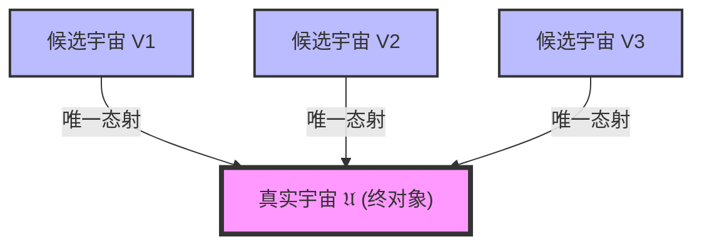
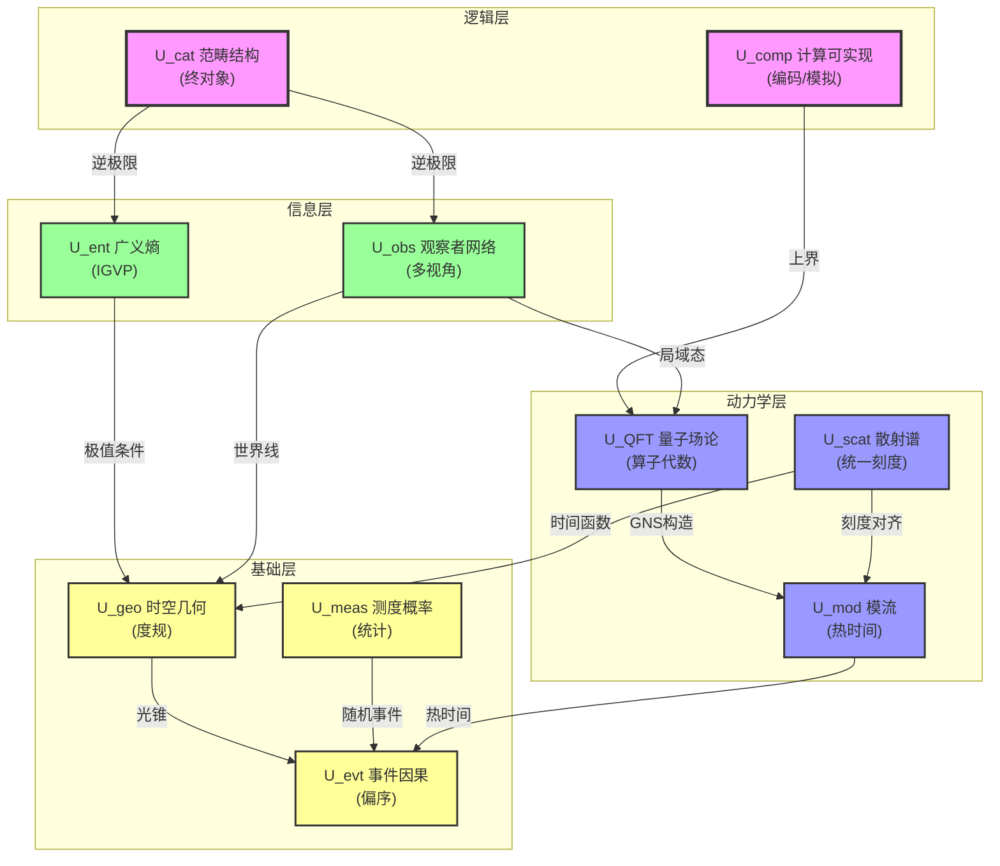
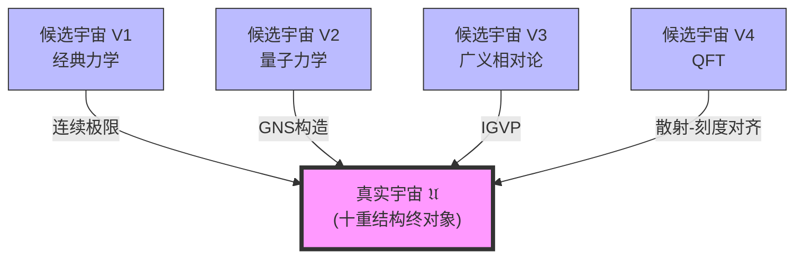
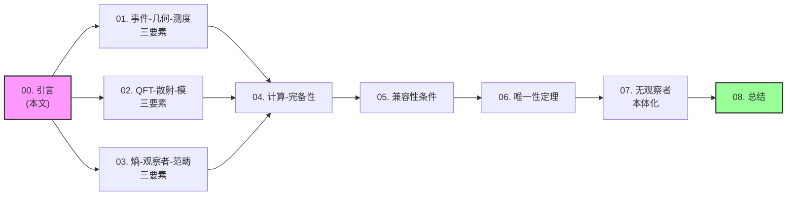

# 第15章 宇宙的本体论：从现象到数学定义

> "在我们定义'宇宙是什么'之前,我们甚至无法开始讨论它的性质。本章将给出宇宙的完整数学定义——一个十重结构的终对象。"

## 引言：什么是"宇宙"？

在前14章中,我们已经建立了GLS统一理论的核心框架:

- **第1-3章**：数学基础与公理
- **第4章**：IGVP——从熵导出引力
- **第5章**：统一时间刻度——三种时间的统一
- **第6章**：边界时间几何——物理实在的边界起源
- **第7章**：因果结构——因果-时间-熵的统一
- **第8章**：拓扑约束——Z₂ holonomy与费米子
- **第9章**：QCA宇宙——量子元胞自动机
- **第10章**：矩阵宇宙——观察者与心-宇宙同构
- **第11章**：最终统一——一致性泛函δI[𝔘]=0
- **第12章**：应用检验——黑洞、引力波、宇宙学
- **第13章**：高级主题——量子混沌、时间晶体、意识
- **第14章**：学习路径与总览

但有一个根本问题我们一直**悬而未决**:

> **"宇宙"究竟是什么？**

这不是一个哲学问题,而是一个**数学问题**。如果我们连"宇宙"本身都没有严格定义,那我们在前面章节中讨论的所有性质——时间刻度、因果结构、观察者——都缺乏坚实的基础。

### 三个层次的困惑

在传统物理学中,对"宇宙"的理解存在三个层次的混乱:

#### 1. 现象学层次：宇宙是"我们看到的一切"

这是最朴素的定义:宇宙就是所有恒星、星系、物质、能量的总和。

**问题**:
- "看到"依赖于观察者,不同观察者看到的"一切"可能不同
- 这只是现象的集合,不是本体的定义
- 没有告诉我们"为什么这些东西是一个整体"

**比喻**:就像说"森林是我们看到的所有树",但没有解释为什么这些树构成一个森林而非随机的树集合。

#### 2. 物理学层次：宇宙是"时空+物质场"

在广义相对论中,宇宙是一个洛伦兹流形$(M,g)$加上满足Einstein方程的能量-动量张量$T_{ab}$。

**问题**:
- 只有几何,没有量子
- 只有演化,没有观察者
- 只有时空,没有因果、熵、信息

**比喻**:就像说"音乐是乐谱上的音符",忽略了演奏、听众、情感体验。

#### 3. 量子场论层次：宇宙是"算子代数+态"

在量子场论中,宇宙是Hilbert空间$\mathcal{H}$上的算子代数$\mathcal{A}$加上一个态$\omega$。

**问题**:
- 只有量子,没有几何
- 只有代数,没有时间
- 只有态,没有动力学

**比喻**:就像说"绘画是颜料的排列",忽略了画布、透视、观者视角。

### 本章的目标：统一本体论

本章将给出**宇宙的统一数学定义**,它同时包含:

1. **事件与因果** $U_{\text{evt}}$：宇宙是什么"发生"
2. **几何与时空** $U_{\text{geo}}$：宇宙在哪里"发生"
3. **测度与概率** $U_{\text{meas}}$：宇宙如何"被观测"
4. **量子场论** $U_{\text{QFT}}$：宇宙的"量子结构"
5. **散射与谱** $U_{\text{scat}}$：宇宙的"动力学"
6. **模流与热** $U_{\text{mod}}$：宇宙的"热力学"
7. **广义熵** $U_{\text{ent}}$：宇宙的"信息"
8. **观察者网络** $U_{\text{obs}}$：宇宙中的"视角"
9. **范畴结构** $U_{\text{cat}}$：宇宙的"逻辑"
10. **计算可实现** $U_{\text{comp}}$：宇宙的"可计算性"

这十个方面不是独立的,而是**同一个本体**在不同范畴中的投影。我们将证明:

**核心定理**（宇宙唯一性）:
$$
\mathfrak{U} = (U_{\text{evt}}, U_{\text{geo}}, U_{\text{meas}}, U_{\text{QFT}}, U_{\text{scat}}, U_{\text{mod}}, U_{\text{ent}}, U_{\text{obs}}, U_{\text{cat}}, U_{\text{comp}})
$$

在同构意义下唯一确定。即:**满足所有一致性条件的宇宙只有一个(up to isomorphism)**。

## 为什么需要十重结构？

你可能会问:为什么是十个分量?为什么不是三个或二十个?

答案是:**这是完备性的最小要求**。

### 通俗理解：十个视角看同一个世界

想象你要完整描述一座城市,你需要:

1. **地图**（几何）- 街道在哪里
2. **事件表**（因果）- 什么时候发生什么
3. **人口分布**（测度）- 人们在哪里
4. **电网**（场论）- 能量如何流动
5. **交通流**（散射）- 车辆如何穿行
6. **温度场**（模流）- 热量如何分布
7. **信息网**（熵）- 数据如何传播
8. **监控网**（观察者）- 谁在看什么
9. **规划图**（范畴）- 整体如何组织
10. **模拟器**（计算）- 如何用有限数据重建

缺少任何一个视角,你都无法完整理解这座城市。同样,**缺少十重结构的任何一个,你都无法完整定义宇宙**。

### 数学理解：范畴论的终对象

在范畴论中,我们定义一个范畴$\mathbf{Univ}$:

- **对象**:所有候选的"宇宙结构"
- **态射**:保持结构的同构映射

**终对象**$\mathfrak{U}$是满足:对任何对象$V$,存在唯一态射$V \to \mathfrak{U}$。

换句话说:**所有候选宇宙都"映射到"唯一的真实宇宙**。

## 十重结构概览

让我们先鸟瞰十个分量及其相互关系:

### 第一层：基础层

#### 1. 事件与因果 $U_{\text{evt}}$（第01篇）

**定义**:
$$
U_{\text{evt}} = (X, \preceq, \mathcal{C})
$$

- $X$: 事件集合
- $\preceq$: 因果偏序（谁影响谁）
- $\mathcal{C}$: 因果片段族（局部因果网）

**直觉**:宇宙首先是"事情发生"的集合,有些事情能影响其他事情（因果关系）。

**比喻**:就像多米诺骨牌,每个骨牌是一个事件,$p \preceq q$表示"$p$倒下会导致$q$倒下"。

---

#### 2. 几何与时空 $U_{\text{geo}}$（第01篇）

**定义**:
$$
U_{\text{geo}} = (M, g, \Phi_{\text{evt}}, \Phi_{\text{cau}})
$$

- $M$: 四维光滑流形
- $g$: Lorentz度规（$-+++$签名）
- $\Phi_{\text{evt}}$: 事件嵌入到时空
- $\Phi_{\text{cau}}$: 因果偏序与光锥结构的对齐

**直觉**:事件不仅"发生",还发生在"某个时空位置"。

**比喻**:多米诺骨牌不是漂浮在虚空,而是摆放在一张弯曲的桌面（弯曲时空）上。

---

#### 3. 测度与概率 $U_{\text{meas}}$（第02篇）

**定义**:
$$
U_{\text{meas}} = (\Omega, \mathcal{F}, \mathbb{P}, \Psi)
$$

- $(\Omega, \mathcal{F}, \mathbb{P})$: 完备概率空间
- $\Psi: \Omega \to X$: 随机事件映射

**直觉**:我们不是全知全能,观测到的是"样本",需要用概率描述。

**比喻**:你不能同时看到所有骨牌,只能抽样观察,用统计推断全局。

---

### 第二层：量子与动力学层

#### 4. 量子场论 $U_{\text{QFT}}$（第03篇）

**定义**:
$$
U_{\text{QFT}} = (\mathcal{O}(M), \mathcal{A}, \omega)
$$

- $\mathcal{O}(M)$: 时空开集族
- $\mathcal{A}: \mathcal{O}(M) \to C^*\text{-Alg}$: 局域算子代数网（Haag-Kastler公理）
- $\omega$: 态

**直觉**:物理不是经典粒子,而是量子场——在每个时空区域都有算子代数。

**比喻**:骨牌不是刚性物体,而是"量子骨牌云",每个位置是概率振幅的叠加。

---

#### 5. 散射与谱 $U_{\text{scat}}$（第03篇）

**定义**:
$$
U_{\text{scat}} = ((H, H_0), S(\omega), Q(\omega), \kappa(\omega))
$$

- $(H, H_0)$: 散射对（自伴算子）
- $S(\omega)$: 散射矩阵
- $Q(\omega)$: Wigner-Smith群延迟矩阵
- $\kappa(\omega)$: 统一时间刻度密度

**关键公式**（统一时间刻度母式）:
$$
\kappa(\omega) = \frac{\varphi'(\omega)}{\pi} = \rho_{\text{rel}}(\omega) = \frac{1}{2\pi}\text{tr}\,Q(\omega)
$$

**直觉**:宇宙的动力学由散射过程描述,时间刻度由散射相位、态密度、群延迟统一给出。

**比喻**:骨牌倒下不是瞬间,而是"波的传播",散射矩阵描述波如何从一端传到另一端。

---

#### 6. 模流与热时间 $U_{\text{mod}}$（第03篇）

**定义**:
$$
U_{\text{mod}} = (S, J, \Delta, \sigma_t^\omega, K_\omega)
$$

- $S$: 模算子
- $J$: 模共轭
- $\Delta$: 模哈密顿
- $\sigma_t^\omega$: 模流（Tomita-Takesaki理论）
- $K_\omega = -\log \Delta$: 模哈密顿算子

**直觉**:量子态自带"内禀时间"——模流,与热力学时间、几何时间、散射时间统一。

**比喻**:每个骨牌都带着自己的"内部时钟"（模流）,所有时钟在统一刻度下同步。

---

### 第三层：信息与观察者层

#### 7. 广义熵与引力 $U_{\text{ent}}$（第04篇）

**定义**:
$$
U_{\text{ent}} = (\mathcal{D}, S_{\text{gen}}, \text{QNEC}, \text{QFC})
$$

- $\mathcal{D}$: 小因果菱形族
- $S_{\text{gen}}(\Sigma) = \frac{A(\Sigma)}{4G\hbar} + S_{\text{out}}(\Sigma)$: 广义熵
- QNEC: 量子零能条件
- QFC: 量子聚焦猜想

**核心原理**（IGVP）:
$$
\delta S_{\text{gen}} = 0 \quad \Leftrightarrow \quad G_{ab} + \Lambda g_{ab} = 8\pi G \langle T_{ab} \rangle
$$

**直觉**:引力场方程不是独立定律,而是广义熵极值的几何表现。

**比喻**:肥皂泡自动形成球形（表面积最小）,时空自动满足Einstein方程（广义熵极值）。

---

#### 8. 观察者网络 $U_{\text{obs}}$（第04篇）

**定义**:
$$
U_{\text{obs}} = (\mathcal{O}, \text{worldline}, \text{res}, \text{model}, \text{update})
$$

每个观察者:
$$
O_i = (\gamma_i, \Lambda_i, \mathcal{A}_i, \omega_i, \mathcal{M}_i, U_i)
$$

- $\gamma_i$: 世界线
- $\Lambda_i$: 分辨率刻度
- $\mathcal{A}_i$: 可观测代数
- $\omega_i$: 局域态
- $\mathcal{M}_i$: 候选模型族
- $U_i$: 更新规则

**直觉**:宇宙中有"视角"——观察者沿世界线观测,有有限分辨率,维护内部模型。

**比喻**:多个摄像头从不同角度拍摄骨牌,每个摄像头只能看到部分,通过信息融合重建全局。

---

### 第四层：逻辑与计算层

#### 9. 范畴与拓扑 $U_{\text{cat}}$（第05篇）

**定义**:
$$
U_{\text{cat}} = (\mathbf{Univ}, \mathfrak{U}, \Pi)
$$

- $\mathbf{Univ}$: 宇宙候选结构的2-范畴
- $\mathfrak{U}$: 终对象
- $\Pi$: 投影锥（逆极限）

**核心性质**:
$$
\mathfrak{U} \simeq \varprojlim (U_{\text{geo}}, U_{\text{QFT}}, U_{\text{scat}}, U_{\text{mod}}, U_{\text{ent}}, U_{\text{obs}}, \ldots)
$$

**直觉**:宇宙是所有分量结构的"共同核心"——逆极限。

**比喻**:多个地图投影（墨卡托、罗宾逊等）都投影自同一个地球,地球是所有投影的"逆极限"。

---

#### 10. 计算与可实现 $U_{\text{comp}}$（第05篇）

**定义**:
$$
U_{\text{comp}} = (\mathcal{M}_{\text{TM}}, \text{Enc}, \text{Sim})
$$

- $\mathcal{M}_{\text{TM}}$: 图灵机空间
- $\text{Enc}: \mathbf{Univ} \to \mathcal{M}_{\text{TM}}$: 编码函子
- $\text{Sim}: \mathcal{M}_{\text{TM}} \rightrightarrows \mathbf{Univ}$: 模拟函子

**直觉**:宇宙虽然可能不可计算,但可以被有限信息"上界编码"。

**比喻**:虽然你不能精确模拟整个城市,但可以用有限参数（人口、道路数、交通流量）给出足够好的近似。

---

## 十重结构的相互关系

这十个分量不是独立的拼图块,而是**高度耦合**的:

### 关键约束关系

| 约束 | 连接分量 | 含义 |
|------|----------|------|
| **光锥=因果偏序** | $U_{\text{geo}} \leftrightarrow U_{\text{evt}}$ | 几何光锥结构必须等价于事件因果偏序 |
| **统一时间刻度** | $U_{\text{scat}} \leftrightarrow U_{\text{mod}} \leftrightarrow U_{\text{geo}}$ | 散射时间、模时间、几何时间同属一个等价类 |
| **IGVP** | $U_{\text{ent}} \leftrightarrow U_{\text{geo}}$ | 广义熵极值 ⟺ Einstein方程 |
| **GNS构造** | $U_{\text{QFT}} \leftrightarrow U_{\text{mod}}$ | 代数+态 ⟹ 模算子与模流 |
| **因果共识** | $U_{\text{obs}} \leftrightarrow U_{\text{evt}}$ | 多观察者局域因果网粘合成全局偏序 |
| **边界数据** | $U_{\text{scat}} \leftrightarrow U_{\text{ent}}$ | 散射矩阵与广义熵都编码边界数据 |

**核心洞察**:这些约束是**过度决定的**（overdetermined）——满足部分约束会自动满足其他约束。这就是为什么宇宙在同构意义下唯一。

## 统一时间刻度：穿透十层的红线

在十重结构中,有一条**红线**贯穿始终——**统一时间刻度**$[\tau]$:

$$
[\tau] = \{T_{\text{cau}}, T_{\text{geo}}, \tau_{\text{scatt}}, t_{\text{mod}}, \tau_{\text{geom}}, \tau_i\}_{\text{仿射等价}}
$$

即:

- $T_{\text{cau}}$: 因果时间（$U_{\text{evt}}$）
- $T_{\text{geo}}$: 几何时间（$U_{\text{geo}}$）
- $\tau_{\text{scatt}}$: 散射时间（$U_{\text{scat}}$）
- $t_{\text{mod}}$: 模时间（$U_{\text{mod}}$）
- $\tau_{\text{geom}}$: 边界几何时间（$U_{\text{ent}}$）
- $\tau_i$: 观察者本征时间（$U_{\text{obs}}$）

**都属于同一个等价类**,仅相差仿射变换$\tau' = a\tau + b$（$a>0$）。

### 通俗理解：六种"钟"的对表

想象你有六种不同品牌的手表:

1. **因果钟**: 根据事件先后排序（多米诺骨牌倒下顺序）
2. **几何钟**: 根据时空度规测量（光走过的距离）
3. **散射钟**: 根据波的相位累积（散射相位/π）
4. **模钟**: 根据量子态的模流（热时间）
5. **引力钟**: 根据边界Brown-York能量（几何哈密顿）
6. **主观钟**: 沿你的世界线的本征时间

GLS理论告诉你:**这六种钟虽然看起来不同,但读数总是成线性关系——它们在"对表"**。

### 数学形式化：刻度等价类

定义等价关系$\sim$:

$$
\tau_1 \sim \tau_2 \quad \Leftrightarrow \quad \exists\, a>0, b\in\mathbb{R}:\ \tau_2 = a\tau_1 + b
$$

则统一时间刻度等价类为:

$$
[\tau] := \{\tau' \mid \tau' \sim \tau\}
$$

**物理含义**:时间的绝对起点（$b$）和单位（$a$）是任意的,但**相对流逝率**是固定的,由$\kappa(\omega)$给出。

## 宇宙的终对象性质

在范畴$\mathbf{Univ}$中,宇宙$\mathfrak{U}$不仅存在,而且是**终对象**（terminal object）:

### 定义：终对象

一个对象$\mathfrak{U}$是终对象,如果:

$$
\forall V \in \text{Ob}(\mathbf{Univ}),\ \exists! \phi: V \to \mathfrak{U}
$$

即:**从任何候选宇宙$V$到真实宇宙$\mathfrak{U}$,有且仅有一个结构保持态射$\phi$**。

### 直觉理解：所有路径都指向唯一真理

想象你在一个迷宫中:

- 每个房间是一个"候选宇宙"$V$
- 每条通道是一个"结构保持映射"
- 迷宫中心是"真实宇宙"$\mathfrak{U}$

终对象性质说:**无论你从哪个房间出发,总有唯一的最优路径通向中心**。

### 数学含义：唯一性定理

**定理**（宇宙唯一性）:设$\mathfrak{U}_1, \mathfrak{U}_2$都是满足十重结构所有一致性条件的宇宙对象,则

$$
\mathfrak{U}_1 \cong \mathfrak{U}_2
$$

在范畴$\mathbf{Univ}$中同构。

**证明思路**:
1. 由终对象性质,存在唯一态射$\phi_1: \mathfrak{U}_1 \to \mathfrak{U}_2$和$\phi_2: \mathfrak{U}_2 \to \mathfrak{U}_1$
2. 由唯一性,$\phi_2 \circ \phi_1 = \text{id}_{\mathfrak{U}_1}$且$\phi_1 \circ \phi_2 = \text{id}_{\mathfrak{U}_2}$
3. 因此$\phi_1$是同构

**哲学含义**:宇宙不是"被构造"的,而是**在一致性约束下唯一存在的数学对象**。

## 本章结构与学习路径

本章共10篇文章（含本引言）,逐步建立十重结构:

### 学习路径图

### 文章列表

| 篇号 | 标题 | 核心内容 | 难度 |
|------|------|----------|------|
| **00** | **引言（本文）** | 十重结构概览、终对象性质 | ⭐⭐ |
| **01** | **十重结构定义** | 完整的数学定义$\mathfrak{U} = (U_{\text{evt}}, \ldots, U_{\text{comp}})$ | ⭐⭐⭐⭐ |
| **02** | **事件、几何、测度三要素** | $U_{\text{evt}}, U_{\text{geo}}, U_{\text{meas}}$的详细定义 | ⭐⭐⭐ |
| **03** | **QFT、散射、模三要素** | $U_{\text{QFT}}, U_{\text{scat}}, U_{\text{mod}}$的详细定义 | ⭐⭐⭐⭐ |
| **04** | **熵、观察者、范畴三要素** | $U_{\text{ent}}, U_{\text{obs}}, U_{\text{cat}}$的详细定义 | ⭐⭐⭐⭐ |
| **05** | **计算要素与完备性** | $U_{\text{comp}}$与宇宙的可编码性 | ⭐⭐⭐⭐⭐ |
| **06** | **各分量的兼容性条件** | 十重结构如何互相约束 | ⭐⭐⭐⭐⭐ |
| **07** | **同构意义下的唯一性定理** | 证明宇宙$\mathfrak{U}$在同构意义下唯一 | ⭐⭐⭐⭐⭐ |
| **08** | **无观察者本体化框架** | 极限理论：$U_{\text{obs}} \to \emptyset$时的宇宙 | ⭐⭐⭐⭐⭐ |
| **09** | **章节总结** | 回顾十重结构、哲学意义、与其他章节关系 | ⭐⭐ |

### 阅读建议

**快速通道**（理解主旨）:
- 00引言 → 01十重结构定义 → 06兼容性 → 09总结

**标准路径**（完整学习）:
- 按顺序00-09全部阅读

**深入研究**（数学细节）:
- 特别关注03（散射-模对齐）、05（计算复杂性）、07（唯一性证明）、08（无观察者极限）

## 关键洞察：宇宙不是"万物的集合"

在进入后续篇章前,请牢记本章的**核心洞察**:

> **宇宙不是"所有东西"的简单集合,而是满足过度决定一致性条件的唯一数学结构。**

### 对比：传统观点 vs GLS本体论

| 维度 | 传统观点 | GLS本体论 |
|------|----------|-----------|
| **定义方式** | 枚举式（列举所有内容） | 公理式（给出一致性条件） |
| **本体地位** | 宇宙是"容器" | 宇宙是"终对象" |
| **多样性** | 可能有多个宇宙 | 同构意义下唯一 |
| **观察者** | 外在于宇宙 | 内在于宇宙（$U_{\text{obs}}$） |
| **时间** | 外加参数 | 内禀结构（$[\tau]$） |
| **物理定律** | 独立公设 | 兼容性条件 |

### 类比：宇宙 = 数独的唯一解

想象一个超级复杂的数独游戏:

- **格子**: 十重结构的各个分量
- **规则**: 兼容性条件
- **已知数字**: 观测到的物理常数

GLS理论说:**这个数独有且仅有一个解（up to 对称性）——那就是我们的宇宙**。

你不能"任意填写"格子,因为规则是**过度决定**的——一旦你填对了几个关键格子,剩下的就自动确定了。

## 本章与其他章节的关系

### 与前面章节的关系

| 章节 | 关系 |
|------|------|
| **第5章（统一时间刻度）** | 本章的$\kappa(\omega)$就是第5章的核心母式 |
| **第6章（边界时间几何）** | 本章的$U_{\text{ent}}$包含边界GHY项与Brown-York能量 |
| **第7章（因果结构）** | 本章的$U_{\text{evt}}$就是因果偏序$(X, \preceq)$ |
| **第9章（QCA宇宙）** | QCA是$U_{\text{comp}}$的具体实现 |
| **第10章（矩阵宇宙）** | 矩阵宇宙是十重结构在散射表示下的等价描述 |
| **第11章（最终统一）** | 一致性泛函$\delta I[\mathfrak{U}]=0$是十重结构兼容性的变分表述 |

### 与后续章节的关系

| 章节 | 关系 |
|------|------|
| **第16章（有限信息参数化）** | 将$\mathfrak{U}$参数化为$\mathfrak{U}(\Theta)$,用有限参数编码 |
| **第17章（六大物理统一）** | 六大物理问题是对$\mathfrak{U}$的不同分量的约束 |
| **第18章（延迟量子化拓扑）** | $U_{\text{scat}}$中散射相位的拓扑性质 |

## 哲学意义：从多元到一元

本章的本体论框架解决了一个古老的哲学问题:**一与多的关系**。

### 古典困惑

- **巴门尼德（Parmenides）**: 存在是一,变化是幻觉
- **赫拉克利特（Heraclitus）**: 万物皆流,存在是多
- **柏拉图（Plato）**: 理念世界（一）与现象世界（多）二元分立

### GLS解决方案

十重结构告诉我们:**一与多是同一本体的不同投影**。

$$
\mathfrak{U} \simeq \varprojlim (U_{\text{evt}}, U_{\text{geo}}, \ldots, U_{\text{comp}})
$$

- **"一"**:逆极限$\mathfrak{U}$（本体）
- **"多"**:各个投影$U_i$（现象）

它们不是独立存在,而是通过投影锥$\Pi$联系在一起。

### 通俗比喻：大象的十个侧面

古印度寓言"盲人摸象":

- 摸到腿的说"象如柱"
- 摸到耳朵的说"象如扇"
- 摸到鼻子的说"象如蛇"

每个人都对,但都不完整。**十重结构就是"完整的大象"——从十个侧面同时描述,才是真实的宇宙**。

## 预告：下一篇内容

在第01篇中,我们将给出**十重结构的完整数学定义**:

$$
\mathfrak{U} = (U_{\text{evt}}, U_{\text{geo}}, U_{\text{meas}}, U_{\text{QFT}}, U_{\text{scat}}, U_{\text{mod}}, U_{\text{ent}}, U_{\text{obs}}, U_{\text{cat}}, U_{\text{comp}})
$$

包括:

1. 每个分量$U_i$的精确数学定义
2. 它们之间的态射与投影
3. 统一时间刻度等价类$[\tau]$的形式化
4. 终对象性质的初步证明

准备好深入宇宙的数学本质吧！

---

**注**:本文为GLS统一理论教程第15章第00节。前置知识参见第1-14章。下一节将进入十重结构的严格数学定义。

**关键术语中英文对照**:
- 本体论 Ontology
- 终对象 Terminal Object
- 逆极限 Inverse Limit
- 范畴等价 Category Equivalence
- 一致性条件 Consistency Condition
- 过度决定 Overdetermined
