# Chapter 15: Universe Ontology—From Phenomena to Mathematical Definition

> "Before we define 'what universe is', we cannot even begin to discuss its properties. This chapter will give complete mathematical definition of universe—a terminal object of tenfold structure."

## Introduction: What is "Universe"?

In previous 14 chapters, we have established core framework of GLS unified theory:

- **Chapters 1-3**: Mathematical foundations and axioms
- **Chapter 4**: IGVP—Deriving gravity from entropy
- **Chapter 5**: Unified Time Scale—Unification of three times
- **Chapter 6**: Boundary Time Geometry—Boundary origin of physical reality
- **Chapter 7**: Causal Structure—Unification of causality-time-entropy
- **Chapter 8**: Topological Constraints—Z₂ holonomy and fermions
- **Chapter 9**: QCA Universe—Quantum cellular automaton
- **Chapter 10**: Matrix Universe—Observer and mind-universe isomorphism
- **Chapter 11**: Final Unification—Consistency functional $\delta I[\mathfrak{U}]=0$
- **Chapter 12**: Applications and Tests—Black holes, gravitational waves, cosmology
- **Chapter 13**: Advanced Topics—Quantum chaos, time crystals, consciousness
- **Chapter 14**: Learning Path and Overview

But there is a fundamental question we have **left unresolved**:

> **What exactly is "universe"?**

This is not a philosophical question, but a **mathematical question**. If we don't even have strict definition of "universe" itself, then all properties we discussed in previous chapters—time scale, causal structure, observer—lack solid foundation.

### Three Levels of Confusion

In traditional physics, understanding of "universe" has three levels of confusion:

#### 1. Phenomenological Level: Universe is "Everything We See"

This is most naive definition: Universe is sum of all stars, galaxies, matter, energy.

**Problems**:
- "Seeing" depends on observer, different observers may see different "everything"
- This is only collection of phenomena, not ontological definition
- Doesn't tell us "why these things form a whole"

**Analogy**: Like saying "forest is all trees we see", but doesn't explain why these trees form a forest rather than random tree collection.

#### 2. Physics Level: Universe is "Spacetime + Matter Fields"

In general relativity, universe is a Lorentz manifold $(M,g)$ plus energy-momentum tensor $T_{ab}$ satisfying Einstein equation.

**Problems**:
- Only geometry, no quantum
- Only evolution, no observer
- Only spacetime, no causality, entropy, information

**Analogy**: Like saying "music is notes on score", ignoring performance, audience, emotional experience.

#### 3. Quantum Field Theory Level: Universe is "Operator Algebra + State"

In quantum field theory, universe is operator algebra $\mathcal{A}$ on Hilbert space $\mathcal{H}$ plus a state $\omega$.

**Problems**:
- Only quantum, no geometry
- Only algebra, no time
- Only state, no dynamics

**Analogy**: Like saying "painting is arrangement of pigments", ignoring canvas, perspective, viewer's perspective.

### Goal of This Chapter: Unified Ontology

This chapter will give **unified mathematical definition of universe**, simultaneously containing:

1. **Events and Causality** $U_{\text{evt}}$: What "happens" in universe
2. **Geometry and Spacetime** $U_{\text{geo}}$: Where things "happen"
3. **Measure and Probability** $U_{\text{meas}}$: How universe "is observed"
4. **Quantum Field Theory** $U_{\text{QFT}}$: "Quantum structure" of universe
5. **Scattering and Spectrum** $U_{\text{scat}}$: "Dynamics" of universe
6. **Modular Flow and Thermal** $U_{\text{mod}}$: "Thermodynamics" of universe
7. **Generalized Entropy** $U_{\text{ent}}$: "Information" of universe
8. **Observer Network** $U_{\text{obs}}$: "Perspectives" in universe
9. **Categorical Structure** $U_{\text{cat}}$: "Logic" of universe
10. **Computational Realizability** $U_{\text{comp}}$: "Computability" of universe

These ten aspects are not independent, but **projections of same ontology** in different categories. We will prove:

**Core Theorem** (Universe Uniqueness):
$$
\mathfrak{U} = (U_{\text{evt}}, U_{\text{geo}}, U_{\text{meas}}, U_{\text{QFT}}, U_{\text{scat}}, U_{\text{mod}}, U_{\text{ent}}, U_{\text{obs}}, U_{\text{cat}}, U_{\text{comp}})
$$

Uniquely determined up to isomorphism. That is: **There is only one universe (up to isomorphism) satisfying all consistency conditions**.

## Why Tenfold Structure?

You might ask: Why ten components? Why not three or twenty?

Answer: **This is minimal requirement for completeness**.

### Intuitive Understanding: Ten Perspectives on Same World

Imagine you want to completely describe a city, you need:

1. **Map** (Geometry) - Where streets are
2. **Event Schedule** (Causality) - When what happens
3. **Population Distribution** (Measure) - Where people are
4. **Power Grid** (Field Theory) - How energy flows
5. **Traffic Flow** (Scattering) - How vehicles traverse
6. **Temperature Field** (Modular Flow) - How heat distributes
7. **Information Network** (Entropy) - How data propagates
8. **Surveillance Network** (Observer) - Who watches what
9. **Planning Diagram** (Category) - How whole is organized
10. **Simulator** (Computation) - How to reconstruct with finite data

Missing any perspective, you cannot completely understand this city. Similarly, **missing any component of tenfold structure, you cannot completely define universe**.

### Mathematical Understanding: Terminal Object in Category Theory

In category theory, we define a category $\mathbf{Univ}$:

- **Objects**: All candidate "universe structures"
- **Morphisms**: Structure-preserving isomorphisms

**Terminal object** $\mathfrak{U}$ satisfies: For any object $V$, exists unique morphism $V \to \mathfrak{U}$.

In other words: **All candidate universes "map to" unique real universe**.

```mermaid
graph TB
    V1["Candidate Universe V1"]
    V2["Candidate Universe V2"]
    V3["Candidate Universe V3"]
    U["Real Universe 𝔘 (Terminal Object)"]

    V1 -->|"Unique Morphism"| U
    V2 -->|"Unique Morphism"| U
    V3 -->|"Unique Morphism"| U

    style U fill:#f9f,stroke:#333,stroke-width:4px
    style V1 fill:#bbf,stroke:#333,stroke-width:2px
    style V2 fill:#bbf,stroke:#333,stroke-width:2px
    style V3 fill:#bbf,stroke:#333,stroke-width:2px
```

## Overview of Tenfold Structure

Let us first overview ten components and their interrelationships:

### First Layer: Foundation Layer

#### 1. Events and Causality $U_{\text{evt}}$ (Article 01)

**Definition**:
$$
U_{\text{evt}} = (X, \preceq, \mathcal{C})
$$

- $X$: Set of events
- $\preceq$: Causal partial order (who influences whom)
- $\mathcal{C}$: Family of causal fragments (local causal networks)

**Intuition**: Universe is first collection of "things that happen", some things can influence others (causal relations).

**Analogy**: Like dominoes, each domino is an event, $p \preceq q$ means "$p$ falling causes $q$ to fall".

---

#### 2. Geometry and Spacetime $U_{\text{geo}}$ (Article 01)

**Definition**:
$$
U_{\text{geo}} = (M, g, \Phi_{\text{evt}}, \Phi_{\text{cau}})
$$

- $M$: Four-dimensional smooth manifold
- $g$: Lorentz metric (signature $-+++$)
- $\Phi_{\text{evt}}$: Embedding of events into spacetime
- $\Phi_{\text{cau}}$: Alignment of causal partial order with light cone structure

**Intuition**: Events not only "happen", but happen at "some spacetime location".

**Analogy**: Dominoes not floating in void, but placed on curved tabletop (curved spacetime).

---

#### 3. Measure and Probability $U_{\text{meas}}$ (Article 02)

**Definition**:
$$
U_{\text{meas}} = (\Omega, \mathcal{F}, \mathbb{P}, \Psi)
$$

- $(\Omega, \mathcal{F}, \mathbb{P})$: Complete probability space
- $\Psi: \Omega \to X$: Random event mapping

**Intuition**: We are not omniscient, what we observe are "samples", need probability description.

**Analogy**: You cannot see all dominoes simultaneously, can only sample observe, use statistics to infer global.

---

### Second Layer: Quantum and Dynamics Layer

#### 4. Quantum Field Theory $U_{\text{QFT}}$ (Article 03)

**Definition**:
$$
U_{\text{QFT}} = (\mathcal{O}(M), \mathcal{A}, \omega)
$$

- $\mathcal{O}(M)$: Family of spacetime open sets
- $\mathcal{A}: \mathcal{O}(M) \to C^*\text{-Alg}$: Local operator algebra net (Haag-Kastler axioms)
- $\omega$: State

**Intuition**: Physics not classical particles, but quantum fields—each spacetime region has operator algebra.

**Analogy**: Dominoes not rigid objects, but "quantum domino cloud", each position is superposition of probability amplitudes.

---

#### 5. Scattering and Spectrum $U_{\text{scat}}$ (Article 03)

**Definition**:
$$
U_{\text{scat}} = ((H, H_0), S(\omega), Q(\omega), \kappa(\omega))
$$

- $(H, H_0)$: Scattering pair (self-adjoint operators)
- $S(\omega)$: Scattering matrix
- $Q(\omega)$: Wigner-Smith group delay matrix
- $\kappa(\omega)$: Unified time scale density

**Key Formula** (Unified Time Scale Master Formula):
$$
\kappa(\omega) = \frac{\varphi'(\omega)}{\pi} = \rho_{\text{rel}}(\omega) = \frac{1}{2\pi}\text{tr}\,Q(\omega)
$$

**Intuition**: Dynamics of universe described by scattering processes, time scale uniformly given by scattering phase, density of states, group delay.

**Analogy**: Dominoes falling not instantaneous, but "wave propagation", scattering matrix describes how waves propagate from one end to another.

---

#### 6. Modular Flow and Thermal Time $U_{\text{mod}}$ (Article 03)

**Definition**:
$$
U_{\text{mod}} = (S, J, \Delta, \sigma_t^\omega, K_\omega)
$$

- $S$: Modular operator
- $J$: Modular conjugation
- $\Delta$: Modular Hamiltonian
- $\sigma_t^\omega$: Modular flow (Tomita-Takesaki theory)
- $K_\omega = -\log \Delta$: Modular Hamiltonian operator

**Intuition**: Quantum states have "intrinsic time"—modular flow, unified with thermodynamic time, geometric time, scattering time.

**Analogy**: Each domino carries its own "internal clock" (modular flow), all clocks synchronized under unified scale.

---

### Third Layer: Information and Observer Layer

#### 7. Generalized Entropy and Gravity $U_{\text{ent}}$ (Article 04)

**Definition**:
$$
U_{\text{ent}} = (\mathcal{D}, S_{\text{gen}}, \text{QNEC}, \text{QFC})
$$

- $\mathcal{D}$: Family of small causal diamonds
- $S_{\text{gen}}(\Sigma) = \frac{A(\Sigma)}{4G\hbar} + S_{\text{out}}(\Sigma)$: Generalized entropy
- QNEC: Quantum Null Energy Condition
- QFC: Quantum Focussing Conjecture

**Core Principle** (IGVP):
$$
\delta S_{\text{gen}} = 0 \quad \Leftrightarrow \quad G_{ab} + \Lambda g_{ab} = 8\pi G \langle T_{ab} \rangle
$$

**Intuition**: Gravitational field equation not independent law, but geometric manifestation of generalized entropy extremum.

**Analogy**: Soap bubble automatically forms sphere (minimum surface area), spacetime automatically satisfies Einstein equation (generalized entropy extremum).

---

#### 8. Observer Network $U_{\text{obs}}$ (Article 04)

**Definition**:
$$
U_{\text{obs}} = (\mathcal{O}, \text{worldline}, \text{res}, \text{model}, \text{update})
$$

Each observer:
$$
O_i = (\gamma_i, \Lambda_i, \mathcal{A}_i, \omega_i, \mathcal{M}_i, U_i)
$$

- $\gamma_i$: Worldline
- $\Lambda_i$: Resolution scale
- $\mathcal{A}_i$: Observable algebra
- $\omega_i$: Local state
- $\mathcal{M}_i$: Candidate model family
- $U_i$: Update rule

**Intuition**: Universe has "perspectives"—observers observe along worldlines, have finite resolution, maintain internal models.

**Analogy**: Multiple cameras photograph dominoes from different angles, each camera can only see part, reconstruct global through information fusion.

---

### Fourth Layer: Logic and Computation Layer

#### 9. Category and Topology $U_{\text{cat}}$ (Article 05)

**Definition**:
$$
U_{\text{cat}} = (\mathbf{Univ}, \mathfrak{U}, \Pi)
$$

- $\mathbf{Univ}$: 2-category of universe candidate structures
- $\mathfrak{U}$: Terminal object
- $\Pi$: Projection cone (inverse limit)

**Core Property**:
$$
\mathfrak{U} \simeq \varprojlim (U_{\text{geo}}, U_{\text{QFT}}, U_{\text{scat}}, U_{\text{mod}}, U_{\text{ent}}, U_{\text{obs}}, \ldots)
$$

**Intuition**: Universe is "common core" of all component structures—inverse limit.

**Analogy**: Multiple map projections (Mercator, Robinson, etc.) all project from same Earth, Earth is "inverse limit" of all projections.

---

#### 10. Computation and Realizability $U_{\text{comp}}$ (Article 05)

**Definition**:
$$
U_{\text{comp}} = (\mathcal{M}_{\text{TM}}, \text{Enc}, \text{Sim})
$$

- $\mathcal{M}_{\text{TM}}$: Turing machine space
- $\text{Enc}: \mathbf{Univ} \to \mathcal{M}_{\text{TM}}$: Encoding functor
- $\text{Sim}: \mathcal{M}_{\text{TM}} \rightrightarrows \mathbf{Univ}$: Simulation functor

**Intuition**: Universe though possibly uncomputable, can be "upper-bound encoded" by finite information.

**Analogy**: Though you cannot precisely simulate entire city, can give good approximation with finite parameters (population, number of roads, traffic flow).

---

## Interrelationships of Tenfold Structure

These ten components are not independent puzzle pieces, but **highly coupled**:

### Key Constraint Relations

| Constraint | Connected Components | Meaning |
|------|----------|------|
| **Light Cone = Causal Partial Order** | $U_{\text{geo}} \leftrightarrow U_{\text{evt}}$ | Geometric light cone structure must be equivalent to event causal partial order |
| **Unified Time Scale** | $U_{\text{scat}} \leftrightarrow U_{\text{mod}} \leftrightarrow U_{\text{geo}}$ | Scattering time, modular time, geometric time belong to same equivalence class |
| **IGVP** | $U_{\text{ent}} \leftrightarrow U_{\text{geo}}$ | Generalized entropy extremum ⟺ Einstein equation |
| **GNS Construction** | $U_{\text{QFT}} \leftrightarrow U_{\text{mod}}$ | Algebra + State ⟹ Modular operator and modular flow |
| **Causal Consensus** | $U_{\text{obs}} \leftrightarrow U_{\text{evt}}$ | Multi-observer local causal networks glue into global partial order |
| **Boundary Data** | $U_{\text{scat}} \leftrightarrow U_{\text{ent}}$ | Scattering matrix and generalized entropy both encode boundary data |

**Core Insight**: These constraints are **overdetermined**—satisfying some constraints automatically satisfies others. This is why universe is unique up to isomorphism.

## Unified Time Scale: Red Thread Penetrating Ten Layers

In tenfold structure, there is a **red thread** running throughout—**unified time scale** $[\tau]$:

$$
[\tau] = \{T_{\text{cau}}, T_{\text{geo}}, \tau_{\text{scatt}}, t_{\text{mod}}, \tau_{\text{geom}}, \tau_i\}_{\text{affine equivalent}}
$$

That is:

- $T_{\text{cau}}$: Causal time ($U_{\text{evt}}$)
- $T_{\text{geo}}$: Geometric time ($U_{\text{geo}}$)
- $\tau_{\text{scatt}}$: Scattering time ($U_{\text{scat}}$)
- $t_{\text{mod}}$: Modular time ($U_{\text{mod}}$)
- $\tau_{\text{geom}}$: Boundary geometric time ($U_{\text{ent}}$)
- $\tau_i$: Observer proper time ($U_{\text{obs}}$)

**All belong to same equivalence class**, differing only by affine transformation $\tau' = a\tau + b$ ($a>0$).

### Intuitive Understanding: Synchronizing Six "Clocks"

Imagine you have six different brands of watches:

1. **Causal Clock**: Orders events by sequence (domino falling order)
2. **Geometric Clock**: Measures by spacetime metric (distance light travels)
3. **Scattering Clock**: Based on wave phase accumulation (scattering phase/π)
4. **Modular Clock**: Based on quantum state modular flow (thermal time)
5. **Gravitational Clock**: Based on boundary Brown-York energy (geometric Hamiltonian)
6. **Subjective Clock**: Proper time along your worldline

GLS theory tells you: **These six clocks, though appearing different, always have linear relationship in readings—they are "synchronized"**.

### Mathematical Formalization: Scale Equivalence Class

Define equivalence relation $\sim$:

$$
\tau_1 \sim \tau_2 \quad \Leftrightarrow \quad \exists\, a>0, b\in\mathbb{R}:\ \tau_2 = a\tau_1 + b
$$

Then unified time scale equivalence class is:

$$
[\tau] := \{\tau' \mid \tau' \sim \tau\}
$$

**Physical Meaning**: Absolute starting point ($b$) and unit ($a$) of time are arbitrary, but **relative rate of passage** is fixed, given by $\kappa(\omega)$.

## Terminal Object Property of Universe

In category $\mathbf{Univ}$, universe $\mathfrak{U}$ not only exists, but is **terminal object**:

### Definition: Terminal Object

An object $\mathfrak{U}$ is terminal object if:

$$
\forall V \in \text{Ob}(\mathbf{Univ}),\ \exists! \phi: V \to \mathfrak{U}
$$

That is: **From any candidate universe $V$ to real universe $\mathfrak{U}$, there exists unique structure-preserving morphism $\phi$**.

### Intuitive Understanding: All Paths Lead to Unique Truth

Imagine you are in a maze:

- Each room is a "candidate universe" $V$
- Each passage is a "structure-preserving map"
- Center of maze is "real universe" $\mathfrak{U}$

Terminal object property says: **No matter which room you start from, there is always unique optimal path to center**.

```mermaid
graph TB
    V1["Candidate Universe V1<br/>Classical Mechanics"]
    V2["Candidate Universe V2<br/>Quantum Mechanics"]
    V3["Candidate Universe V3<br/>General Relativity"]
    V4["Candidate Universe V4<br/>QFT"]
    U["Real Universe 𝔘<br/>(Tenfold Structure Terminal Object)"]

    V1 -->|"Continuous Limit"| U
    V2 -->|"GNS Construction"| U
    V3 -->|"IGVP"| U
    V4 -->|"Scattering-Scale Alignment"| U

    style U fill:#f9f,stroke:#333,stroke-width:4px
    style V1 fill:#bbf,stroke:#333,stroke-width:1px
    style V2 fill:#bbf,stroke:#333,stroke-width:1px
    style V3 fill:#bbf,stroke:#333,stroke-width:1px
    style V4 fill:#bbf,stroke:#333,stroke-width:1px
```

### Mathematical Meaning: Uniqueness Theorem

**Theorem** (Universe Uniqueness): Let $\mathfrak{U}_1, \mathfrak{U}_2$ both be universe objects satisfying all consistency conditions of tenfold structure, then

$$
\mathfrak{U}_1 \cong \mathfrak{U}_2
$$

isomorphic in category $\mathbf{Univ}$.

**Proof Strategy**:
1. By terminal object property, exist unique morphisms $\phi_1: \mathfrak{U}_1 \to \mathfrak{U}_2$ and $\phi_2: \mathfrak{U}_2 \to \mathfrak{U}_1$
2. By uniqueness, $\phi_2 \circ \phi_1 = \text{id}_{\mathfrak{U}_1}$ and $\phi_1 \circ \phi_2 = \text{id}_{\mathfrak{U}_2}$
3. Therefore $\phi_1$ is isomorphism

**Philosophical Meaning**: Universe is not "constructed", but **mathematical object uniquely existing under consistency constraints**.

## Chapter Structure and Learning Path

This chapter consists of 10 articles (including this introduction), gradually establishing tenfold structure:

### Learning Path Diagram

### Article List

| Article | Title | Core Content | Difficulty |
|------|------|----------|------|
| **00** | **Introduction (This Article)** | Overview of tenfold structure, terminal object property | ⭐⭐ |
| **01** | **Definition of Tenfold Structure** | Complete mathematical definition $\mathfrak{U} = (U_{\text{evt}}, \ldots, U_{\text{comp}})$ | ⭐⭐⭐⭐ |
| **02** | **Three Components: Event, Geometry, Measure** | Detailed definitions of $U_{\text{evt}}, U_{\text{geo}}, U_{\text{meas}}$ | ⭐⭐⭐ |
| **03** | **Three Components: QFT, Scattering, Modular** | Detailed definitions of $U_{\text{QFT}}, U_{\text{scat}}, U_{\text{mod}}$ | ⭐⭐⭐⭐ |
| **04** | **Three Components: Entropy, Observer, Category** | Detailed definitions of $U_{\text{ent}}, U_{\text{obs}}, U_{\text{cat}}$ | ⭐⭐⭐⭐ |
| **05** | **Computational Component and Completeness** | $U_{\text{comp}}$ and encodability of universe | ⭐⭐⭐⭐⭐ |
| **06** | **Compatibility Conditions of Components** | How tenfold structure mutually constrains | ⭐⭐⭐⭐⭐ |
| **07** | **Uniqueness Theorem up to Isomorphism** | Prove universe $\mathfrak{U}$ unique up to isomorphism | ⭐⭐⭐⭐⭐ |
| **08** | **Observer-Free Ontologization Framework** | Limit theory: Universe when $U_{\text{obs}} \to \emptyset$ | ⭐⭐⭐⭐⭐ |
| **09** | **Chapter Summary** | Review tenfold structure, philosophical meaning, relations with other chapters | ⭐⭐ |

### Reading Suggestions

**Quick Path** (Understand main ideas):
- 00 Introduction → 01 Tenfold Structure Definition → 06 Compatibility → 09 Summary

**Standard Path** (Complete learning):
- Read all 00-09 in order

**Deep Research** (Mathematical details):
- Especially focus on 03 (scattering-modular alignment), 05 (computational complexity), 07 (uniqueness proof), 08 (observer-free limit)

## Key Insight: Universe is Not "Collection of Everything"

Before entering subsequent articles, remember **core insight** of this chapter:

> **Universe is not simple collection of "all things", but unique mathematical structure satisfying overdetermined consistency conditions.**

### Comparison: Traditional View vs GLS Ontology

| Dimension | Traditional View | GLS Ontology |
|------|----------|-----------|
| **Definition Method** | Enumerative (list all contents) | Axiomatic (give consistency conditions) |
| **Ontological Status** | Universe is "container" | Universe is "terminal object" |
| **Diversity** | May have multiple universes | Unique up to isomorphism |
| **Observer** | External to universe | Internal to universe ($U_{\text{obs}}$) |
| **Time** | External parameter | Intrinsic structure ($[\tau]$) |
| **Physical Laws** | Independent postulates | Compatibility conditions |

### Analogy: Universe = Unique Solution of Sudoku

Imagine a super complex Sudoku game:

- **Cells**: Various components of tenfold structure
- **Rules**: Compatibility conditions
- **Given Numbers**: Observed physical constants

GLS theory says: **This Sudoku has exactly one solution (up to symmetry)—that is our universe**.

You cannot "arbitrarily fill" cells, because rules are **overdetermined**—once you fill a few key cells correctly, rest automatically determined.

## Relations of This Chapter with Other Chapters

### Relations with Previous Chapters

| Chapter | Relation |
|------|------|
| **Chapter 5 (Unified Time Scale)** | $\kappa(\omega)$ of this chapter is core master formula of Chapter 5 |
| **Chapter 6 (Boundary Time Geometry)** | $U_{\text{ent}}$ of this chapter contains boundary GHY term and Brown-York energy |
| **Chapter 7 (Causal Structure)** | $U_{\text{evt}}$ of this chapter is causal partial order $(X, \preceq)$ |
| **Chapter 9 (QCA Universe)** | QCA is concrete realization of $U_{\text{comp}}$ |
| **Chapter 10 (Matrix Universe)** | Matrix universe is equivalent description of tenfold structure in scattering representation |
| **Chapter 11 (Final Unification)** | Consistency functional $\delta I[\mathfrak{U}]=0$ is variational formulation of tenfold structure compatibility |

### Relations with Subsequent Chapters

| Chapter | Relation |
|------|------|
| **Chapter 16 (Finite Information Parameterization)** | Parameterize $\mathfrak{U}$ as $\mathfrak{U}(\Theta)$, encode with finite parameters |
| **Chapter 17 (Unification of Six Physics)** | Six physics problems are constraints on different components of $\mathfrak{U}$ |
| **Chapter 18 (Delayed Quantization Topology)** | Topological properties of scattering phase in $U_{\text{scat}}$ |

## Philosophical Meaning: From Plurality to Unity

Ontological framework of this chapter solves an ancient philosophical problem: **Relationship between one and many**.

### Classical Confusion

- **Parmenides**: Being is one, change is illusion
- **Heraclitus**: Everything flows, being is many
- **Plato**: Dualism between world of ideas (one) and world of phenomena (many)

### GLS Solution

Tenfold structure tells us: **One and many are different projections of same ontology**.

$$
\mathfrak{U} \simeq \varprojlim (U_{\text{evt}}, U_{\text{geo}}, \ldots, U_{\text{comp}})
$$

- **"One"**: Inverse limit $\mathfrak{U}$ (ontology)
- **"Many"**: Various projections $U_i$ (phenomena)

They are not independently existing, but connected through projection cone $\Pi$.

### Popular Analogy: Ten Sides of Elephant

Ancient Indian fable "Blind Men and Elephant":

- One touching leg says "elephant like pillar"
- One touching ear says "elephant like fan"
- One touching trunk says "elephant like snake"

Each is right, but incomplete. **Tenfold structure is "complete elephant"—describing from ten sides simultaneously is real universe**.

## Preview: Next Article Content

In Article 01, we will give **complete mathematical definition of tenfold structure**:

$$
\mathfrak{U} = (U_{\text{evt}}, U_{\text{geo}}, U_{\text{meas}}, U_{\text{QFT}}, U_{\text{scat}}, U_{\text{mod}}, U_{\text{ent}}, U_{\text{obs}}, U_{\text{cat}}, U_{\text{comp}})
$$

Including:

1. Precise mathematical definition of each component $U_i$
2. Morphisms and projections between them
3. Formalization of unified time scale equivalence class $[\tau]$
4. Preliminary proof of terminal object property

Ready to dive into mathematical essence of universe!

---

**Note**: This article is Section 00 of Chapter 15 of GLS unified theory tutorial. Prerequisites see Chapters 1-14. Next section will enter strict mathematical definition of tenfold structure.

**Key Terms English-Chinese Glossary**:
- Ontology 本体论
- Terminal Object 终对象
- Inverse Limit 逆极限
- Category Equivalence 范畴等价
- Consistency Condition 一致性条件
- Overdetermined 过度决定

