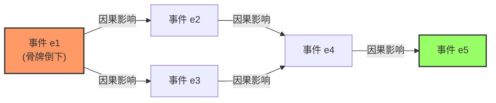
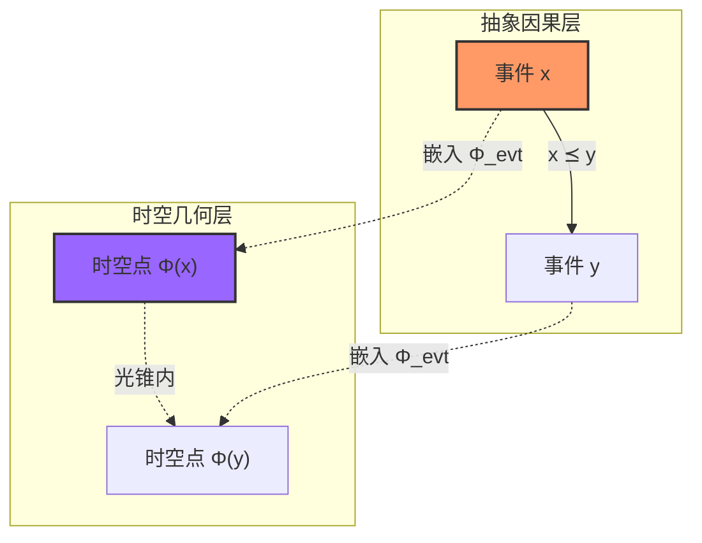
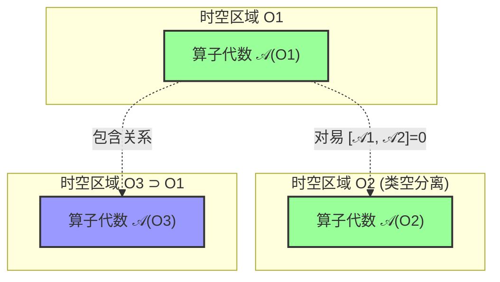
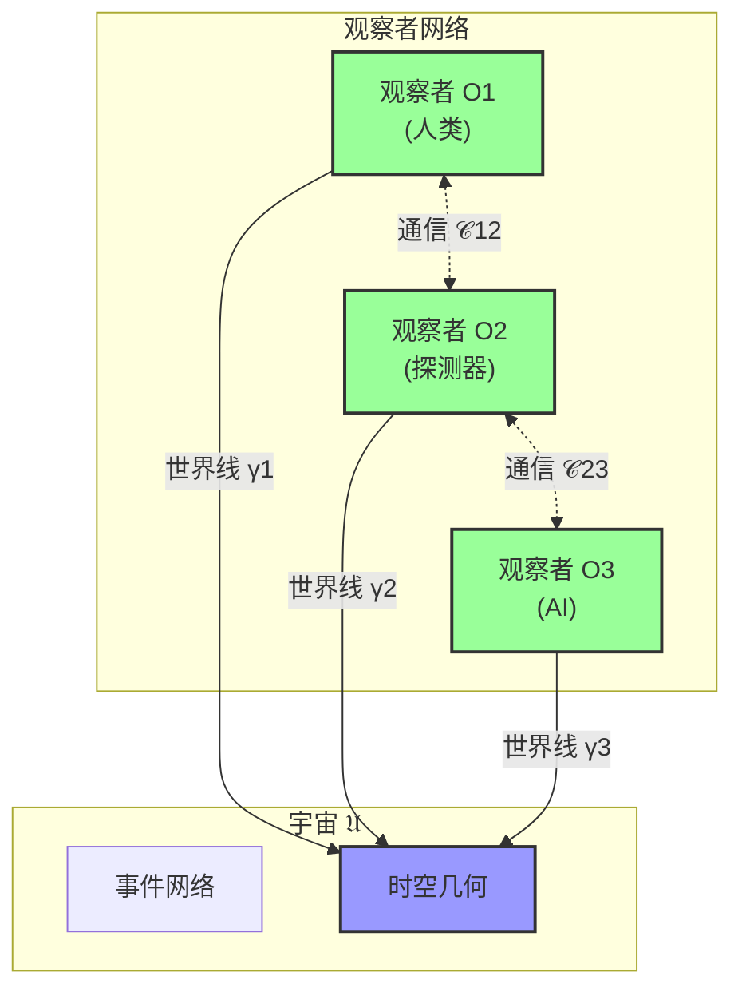
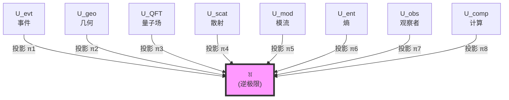
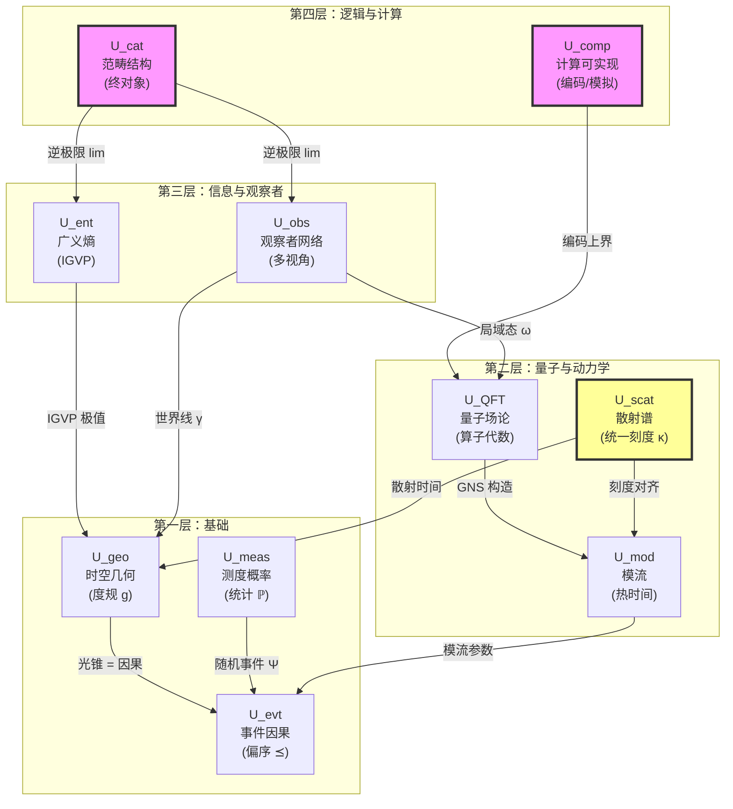

# 01. 宇宙的十重结构：完整数学定义

> "一个完整的宇宙定义必须同时回答十个问题：什么发生了？在哪里？如何观测？量子态是什么？如何演化？热力学是什么？信息在哪？谁在观察？如何组织？能否计算？"

## 引言：为什么需要精确定义？

在第00篇中，我们了解了宇宙需要十重结构来完整描述。本篇将给出**每个分量的严格数学定义**。

### 定义的必要性

在数学中，"定义"不是可有可无的装饰，而是**推理的起点**。没有精确定义，我们无法：

- 判断两个宇宙是否"相同"
- 证明宇宙的性质
- 计算物理量
- 检验理论预言

**比喻**：就像法律条文，"杀人"需要精确定义（故意、过失、正当防卫...），否则无法判案。同样，"宇宙"需要精确定义，否则无法做物理。

### 本篇结构

本篇将逐一定义十个分量：

1. $U_{\text{evt}}$ - 事件与因果层
2. $U_{\text{geo}}$ - 几何与时空层
3. $U_{\text{meas}}$ - 测度与概率层
4. $U_{\text{QFT}}$ - 量子场论层
5. $U_{\text{scat}}$ - 散射与谱层
6. $U_{\text{mod}}$ - 模流与热时间层
7. $U_{\text{ent}}$ - 广义熵与引力层
8. $U_{\text{obs}}$ - 观察者网络层
9. $U_{\text{cat}}$ - 范畴与拓扑层
10. $U_{\text{comp}}$ - 计算与可实现层

然后给出**组合定义**和**终对象性质**。

---

## 1. 事件与因果层 $U_{\text{evt}}$

### 直觉动机

物理学的起点是"**事情发生**"：

- 原子衰变
- 光子被探测器吸收
- 星系碰撞

这些"事件"不是孤立的，而是有**因果关联**：

- 原子衰变$\Rightarrow$发射光子$\Rightarrow$探测器响应

因果关系用偏序$\preceq$表示：$e_1 \preceq e_2$表示"事件$e_1$能影响事件$e_2$"。

### 严格定义

**定义 1.1**（事件因果层）：
$$
U_{\text{evt}} = (X, \preceq, \mathcal{C})
$$

其中：

1. **$X$**：事件集合（可以是真类，非集合）
   - 每个元素$x \in X$称为"事件"
   - 例：$x = $"某个光子在时空点$p$被探测"

2. **$\preceq \subseteq X \times X$**：因果偏序关系
   - **反身性**：$x \preceq x$（事件影响自身）
   - **反对称性**：$x \preceq y$且$y \preceq x \Rightarrow x = y$（无因果环）
   - **传递性**：$x \preceq y$且$y \preceq z \Rightarrow x \preceq z$（间接因果）

3. **$\mathcal{C} \subseteq \mathcal{P}(X)$**：因果片段族
   - 每个$C \in \mathcal{C}$是$X$的子集
   - $(C, \preceq|_C)$是局部有限偏序（每个事件只能影响有限个其他事件）
   - $\bigcup_{C \in \mathcal{C}} C = X$（片段覆盖全部事件）

### 通俗理解：多米诺骨牌网络

想象宇宙是一个**无限大的多米诺骨牌网络**：

- **事件集$X$**：每个骨牌是一个事件
- **因果偏序$\preceq$**：$p \preceq q$表示"$p$倒下会导致$q$倒下"
- **因果片段$\mathcal{C}$**：局部的小区域（你只能看到附近的骨牌）

### 关键性质

**性质 1.1**（全局因果一致性）：$(X, \preceq)$是**稳定因果**的，即：

1. **无闭因果链**：不存在$x_1 \prec x_2 \prec \cdots \prec x_n \prec x_1$（无时间循环）
2. **存在时间函数**：存在$T_{\text{cau}}: X \to \mathbb{R}$使得
   $$
   x \prec y \Rightarrow T_{\text{cau}}(x) < T_{\text{cau}}(y)
   $$
   （因果偏序可以用实数"时间"表示）

**直觉**：多米诺骨牌不能倒回去，时间有方向。

### 因果菱形族

**定义 1.2**（小因果菱形）：
$$
\mathcal{D} = \{D \subseteq X \mid D = J^+(p) \cap J^-(q), p \preceq q\}
$$

其中：
- $J^+(p) = \{x \in X \mid p \preceq x\}$：$p$的因果未来
- $J^-(q) = \{x \in X \mid x \preceq q\}$：$q$的因果过去

**通俗理解**：小因果菱形$D_{p,q}$是"从事件$p$到事件$q$的所有中间影响路径"。

**比喻**：就像河流的两个码头之间，所有可能的水流路径。

---

## 2. 几何与时空层 $U_{\text{geo}}$

### 直觉动机

事件不仅"发生"，还发生在**某个地方、某个时刻**。我们需要一个"舞台"——时空流形。

### 严格定义

**定义 2.1**（几何时空层）：
$$
U_{\text{geo}} = (M, g, \Phi_{\text{evt}}, \Phi_{\text{cau}})
$$

其中：

1. **$M$**：四维可定向、时间定向的$C^\infty$流形
   - 局部坐标$(t, x, y, z)$或$(x^0, x^1, x^2, x^3)$
   - "可定向"：有全局的时间箭头
   - "$C^\infty$"：光滑性（可以任意次求导）

2. **$g$**：Lorentz度规（签名$(-,+,+,+)$）
   $$
   g = g_{\mu\nu} dx^\mu \otimes dx^\nu
   $$
   - 定义时空的距离、角度、光锥
   - 例（Minkowski）：$g = -dt^2 + dx^2 + dy^2 + dz^2$

3. **$\Phi_{\text{evt}}: X \to M$**：事件嵌入映射
   - 将抽象事件$x \in X$映射到时空点$\Phi_{\text{evt}}(x) \in M$

4. **$\Phi_{\text{cau}}$**：因果对齐条件
   $$
   x \preceq y \quad \Leftrightarrow \quad \Phi_{\text{evt}}(y) \in J^+_g(\Phi_{\text{evt}}(x))
   $$
   其中$J^+_g(p)$是度规$g$定义的因果未来光锥

**核心约束**：**抽象因果偏序$\preceq$必须等于几何光锥因果结构**。

### 通俗理解：弯曲的舞台

想象：

- **流形$M$**：一张巨大的、可以弯曲的橡皮膜
- **度规$g$**：膜上的"距离测量方法"（弯曲程度）
- **嵌入$\Phi_{\text{evt}}$**：把抽象事件"钉"在膜上
- **因果对齐**：膜上的"光锥"（45度角）必须和抽象因果箭头一致

### 全局双曲性

**性质 2.1**（全局双曲性）：$(M, g)$是全局双曲的，即：

存在Cauchy超曲面$\Sigma \subset M$使得：
$$
M \simeq \mathbb{R} \times \Sigma
$$

且每条类时/零测地线与$\Sigma$恰交一次。

**直觉**：时空有"层状结构"，可以分解为"空间$\times$时间"。

**比喻**：就像一本书，可以拆成一页页（每页是$\Sigma$），按顺序（时间）排列。

### 几何时间函数

**定义 2.2**（几何时间）：
$$
T_{\text{geo}}: M \to \mathbb{R}
$$

是平滑函数，满足：

1. **梯度类时**：$g^{\mu\nu} \partial_\mu T_{\text{geo}} \partial_\nu T_{\text{geo}} < 0$
2. **单调性**：$p \in J^+_g(q) \Rightarrow T_{\text{geo}}(p) \geq T_{\text{geo}}(q)$

**直觉**：几何时间是"沿光锥方向严格增长的函数"。

---

## 3. 测度与概率层 $U_{\text{meas}}$

### 直觉动机

我们不是全知全能的上帝，不能同时观测所有事件。我们只能：

- 抽样观测
- 用统计推断
- 处理不确定性

因此需要**概率论**。

### 严格定义

**定义 3.1**（测度概率层）：
$$
U_{\text{meas}} = (\Omega, \mathcal{F}, \mathbb{P}, \Psi)
$$

其中：

1. **$(\Omega, \mathcal{F}, \mathbb{P})$**：完备概率空间
   - $\Omega$：样本空间（所有可能的"观测结果"）
   - $\mathcal{F}$：$\sigma$-代数（可测事件集合）
   - $\mathbb{P}: \mathcal{F} \to [0,1]$：概率测度

2. **$\Psi: \Omega \to X$**：随机事件映射
   - 将"观测结果$\omega \in \Omega$"映射到"实际发生的事件$\Psi(\omega) \in X$"

### 通俗理解：抛硬币与事件

想象宇宙是一个巨大的随机过程：

- **$\Omega$**：所有可能的"宇宙历史"
- **$\mathbb{P}$**：每个历史的"概率权重"
- **$\Psi$**：在某个历史$\omega$中，实际发生了哪些事件

**比喻**：
- 抛硬币：$\Omega = \{\text{正}, \text{反}\}$，$\mathbb{P}(\text{正}) = \mathbb{P}(\text{反}) = 1/2$
- 宇宙：$\Omega = $"所有可能的量子历史"，$\mathbb{P}$由路径积分给出

### 统计时间序列

**定义 3.2**（世界线样本路径）：

对观察者世界线$\gamma$，定义样本路径：
$$
\Psi_\gamma: \Omega \to X^{\mathbb{Z}}
$$
$$
\Psi_\gamma(\omega) = (x_n)_{n \in \mathbb{Z}}, \quad x_n \prec x_{n+1}
$$

**直觉**：沿世界线观测到的是一串离散事件$(x_1, x_2, x_3, \ldots)$，构成时间序列。

---

## 4. 量子场论层 $U_{\text{QFT}}$

### 直觉动机

物理不是经典粒子，而是**量子场**：

- 电子不是"小球"，而是"电子场的激发"
- 光不是"光线"，而是"电磁场的量子"

量子场用**算子代数**描述。

### 严格定义

**定义 4.1**（量子场论层）：
$$
U_{\text{QFT}} = (\mathcal{O}(M), \mathcal{A}, \omega)
$$

其中：

1. **$\mathcal{O}(M)$**：$M$上有界因果凸开集族
   - 例：$\mathcal{O}(M) = \{O \subseteq M \mid O\text{开、有界、因果凸}\}$
   - "因果凸"：若$p, q \in O$且$\gamma$是连接$p, q$的因果曲线，则$\gamma \subset O$

2. **$\mathcal{A}: \mathcal{O}(M) \to C^*\text{-Alg}$**：局域算子代数网（Haag-Kastler公理）
   - 对每个区域$O$，有$C^*$-代数$\mathcal{A}(O)$（该区域的可观测量）
   - **同调性**：$O_1 \subseteq O_2 \Rightarrow \mathcal{A}(O_1) \subseteq \mathcal{A}(O_2)$
   - **微因果性**：$O_1 \perp O_2$（类空分离）$\Rightarrow [\mathcal{A}(O_1), \mathcal{A}(O_2)] = 0$

3. **$\omega$**：态（正归一线性泛函）
   $$
   \omega: \mathcal{A} \to \mathbb{C}, \quad \omega(A^* A) \geq 0, \quad \omega(\mathbb{1}) = 1
   $$

### 通俗理解：积木网络

想象时空被分成很多小区域，每个区域是一盒"量子积木"：

- **$\mathcal{A}(O)$**：区域$O$的"积木盒"（可观测算子）
- **同调性**：小盒子的积木可以放进大盒子
- **微因果性**：相距很远的两个盒子，积木操作互不干扰（对易）

### GNS构造

**定理 4.1**（Gelfand-Naimark-Segal）：

给定$(\mathcal{A}, \omega)$，存在唯一（同构意义下）的三元组：
$$
(\pi_\omega, \mathcal{H}, \Omega_\omega)
$$

满足：

1. $\pi_\omega: \mathcal{A} \to B(\mathcal{H})$是$*$-表示
2. $\Omega_\omega \in \mathcal{H}$是循环向量（$\pi_\omega(\mathcal{A})\Omega_\omega$在$\mathcal{H}$中稠密）
3. $\omega(A) = \langle \Omega_\omega, \pi_\omega(A) \Omega_\omega \rangle$

**直觉**：抽象的"态$\omega$"可以具体化为Hilbert空间中的"态向量$\Omega_\omega$"。

---

## 5. 散射与谱层 $U_{\text{scat}}$

### 直觉动机

宇宙的动力学由"波的传播"描述：

- 光波在真空中传播
- 电子波被势场散射
- 引力波在弯曲时空传播

散射理论描述"输入波$\to$输出波"的关系。

### 严格定义

**定义 5.1**（散射谱层）：
$$
U_{\text{scat}} = ((H, H_0), S(\omega), Q(\omega), \xi(\omega), \kappa(\omega))
$$

其中：

1. **$(H, H_0)$**：自伴算子对（散射对）
   - $H_0$：自由哈密顿（无相互作用）
   - $H = H_0 + V$：总哈密顿（有相互作用）
   - $V$：相对迹类扰动

2. **$S(\omega)$**：散射矩阵
   $$
   S(\omega) = \lim_{t \to +\infty} e^{iHt} e^{-iH_0 t} \in U(\mathcal{H}_\omega)
   $$
   - $\omega$：能量（频率）
   - $S(\omega)$：幺正算子（保持概率归一）

3. **$Q(\omega)$**：Wigner-Smith群延迟矩阵
   $$
   Q(\omega) = -i S(\omega)^\dagger \frac{\partial S(\omega)}{\partial \omega}
   $$
   - 厄米算子：$Q(\omega)^\dagger = Q(\omega)$
   - 本征值：时间延迟

4. **$\xi(\omega)$**：谱移函数（Birman-Kreĭn）
   $$
   \det S(\omega) = e^{-2\pi i \xi(\omega)}
   $$

5. **$\kappa(\omega)$**：统一时间刻度密度（**核心！**）
   $$
   \kappa(\omega) := \frac{\varphi'(\omega)}{\pi} = \rho_{\text{rel}}(\omega) = \frac{1}{2\pi}\text{tr}\,Q(\omega)
   $$
   其中：
   - $\varphi(\omega) = \frac{1}{2}\arg\det S(\omega)$：半相位
   - $\rho_{\text{rel}}(\omega) = -\xi'(\omega)$：相对态密度

### 统一时间刻度母式（全理论的DNA）

**关键恒等式**：
$$
\boxed{
\kappa(\omega) = \frac{\varphi'(\omega)}{\pi} = \rho_{\text{rel}}(\omega) = \frac{1}{2\pi}\text{tr}\,Q(\omega)
}
$$

**三种测量方法得到同一个时间刻度**：

| 方法 | 物理量 | 含义 |
|------|--------|------|
| 散射相位 | $\varphi'(\omega)/\pi$ | 散射相位对频率的导数 |
| 态密度 | $\rho_{\text{rel}}(\omega)$ | 相对能级密度变化 |
| 群延迟 | $\frac{1}{2\pi}\text{tr}\,Q(\omega)$ | 平均时间延迟 |

**比喻**：三种不同品牌的手表（劳力士、卡西欧、原子钟），虽然机制不同，但读数总是成线性关系——它们在"对表"。

### 散射时间

**定义 5.2**（散射时间）：

对参考频率$\omega_0$，定义：
$$
\tau_{\text{scatt}}(\omega) - \tau_{\text{scatt}}(\omega_0) = \int_{\omega_0}^\omega \kappa(\tilde{\omega}) d\tilde{\omega}
$$

**直觉**：频率$\omega$对应的"散射时刻"，通过积分刻度密度$\kappa$得到。

---

## 6. 模流与热时间层 $U_{\text{mod}}$

### 直觉动机

量子态自带"内禀时间"——模流：

- 热平衡态的演化由温度决定（$\beta = 1/T$）
- 纠缠态的演化由相对熵决定
- 模流是代数+态的**自然时间**

### 严格定义

**定义 6.1**（模流热时间层）：
$$
U_{\text{mod}} = (S, J, \Delta, \sigma_t^\omega, K_\omega)
$$

其中：

1. **$S$**：模算子（Tomita算子）
   $$
   S_0 \pi_\omega(A) \Omega_\omega = \pi_\omega(A)^\dagger \Omega_\omega
   $$
   $S$是$S_0$的闭包

2. **$J, \Delta$**：极分解
   $$
   S = J \Delta^{1/2}
   $$
   - $J$：反幺正算子（模共轭）
   - $\Delta$：正算子（模哈密顿）

3. **$\sigma_t^\omega$**：模流
   $$
   \sigma_t^\omega(A) = \Delta^{it} A \Delta^{-it}
   $$
   - 自同构：$\sigma_t^\omega: \mathcal{A} \to \mathcal{A}$
   - 满足KMS条件（热平衡条件）

4. **$K_\omega$**：模哈密顿算子
   $$
   K_\omega = -\log \Delta
   $$
   $$
   \sigma_t^\omega(A) = e^{itK_\omega} A e^{-itK_\omega}
   $$

### 通俗理解：量子态的"内部时钟"

每个量子态$\omega$都自带一个"时钟"$\sigma_t^\omega$：

- **热态**：$\sigma_t$是热演化（温度$T$的热浴）
- **真空态**：$\sigma_t$是洛伦兹时间演化
- **纠缠态**：$\sigma_t$是相对熵梯度流

**比喻**：就像每个人都有自己的"生物钟"（昼夜节律），每个量子态都有自己的"模流时钟"。

### 模时间参数

**定义 6.2**（模时间）：

模参数$t_{\text{mod}} \in \mathbb{R}$是模流$\sigma_t^\omega$的参数，对应"热时间"。

**关键约束**：模时间必须与散射时间对齐：
$$
\exists\, a > 0, b \in \mathbb{R}: \quad t_{\text{mod}} = a \tau_{\text{scatt}} + b
$$

**直觉**：模时间和散射时间是"同一种时间"的不同测量方式。

---

## 7. 广义熵与引力层 $U_{\text{ent}}$

### 直觉动机

引力不是独立的"力"，而是**信息几何**：

- Einstein方程$\Leftrightarrow$广义熵极值
- 度规$g_{ab}$$\Leftrightarrow$信息度量
- 宇宙学常数$\Lambda$$\Leftrightarrow$熵约束

这就是IGVP（信息几何变分原理）的核心思想。

### 严格定义

**定义 7.1**（广义熵引力层）：
$$
U_{\text{ent}} = (\mathcal{D}, S_{\text{gen}}, \text{QNEC}, \text{QFC}, G_{ab})
$$

其中：

1. **$\mathcal{D}$**：小因果菱形族
   $$
   \mathcal{D} = \{D \subseteq X \mid D = J^+(p) \cap J^-(q), p \preceq q\}
   $$

2. **$S_{\text{gen}}(\Sigma)$**：广义熵
   $$
   S_{\text{gen}}(\Sigma) = \frac{A(\Sigma)}{4G\hbar} + S_{\text{out}}(\Sigma)
   $$
   - $A(\Sigma)$：割面$\Sigma$的面积
   - $S_{\text{out}}(\Sigma)$：外侧量子场的冯·诺依曼熵
   - $G$：牛顿引力常数
   - $\hbar$：约化普朗克常数

3. **QNEC**：量子零能条件
   $$
   T_{kk} \geq \frac{\hbar}{2\pi} S_{\text{out}}''
   $$
   沿零生成元$k^a$

4. **QFC**：量子聚焦猜想
   $$
   \frac{d S_{\text{gen}}}{d\lambda} \geq 0
   $$
   沿零测地簇的仿射参数$\lambda$

5. **$G_{ab}$**：Einstein张量
   $$
   G_{ab} = R_{ab} - \frac{1}{2}R g_{ab}
   $$

### IGVP核心原理

**定理 7.1**（信息几何变分原理）：

在小因果菱形$D \in \mathcal{D}$上，**广义熵极值等价于Einstein方程**：
$$
\delta S_{\text{gen}} = 0 \quad \Leftrightarrow \quad G_{ab} + \Lambda g_{ab} = 8\pi G \langle T_{ab} \rangle
$$

**直觉**：时空几何自动调整到使广义熵达到极值，就像肥皂泡自动形成球形（表面积最小）。

### 通俗理解：熵决定几何

想象时空是一个弹性膜：

- **物质$T_{ab}$**：在膜上放重物
- **膜的弯曲$g_{ab}$**：重物导致膜凹陷
- **广义熵$S_{\text{gen}}$**：膜的"能量"（拉伸能+重力势能）

IGVP说：**膜自动调整形状，使总能量（广义熵）达到极值** —— 这就导出Einstein方程！

---

## 8. 观察者网络层 $U_{\text{obs}}$

### 直觉动机

宇宙中不只有"物质"，还有"视角"：

- 人类观察星空
- 探测器记录粒子
- AI模型预测天气

这些"观察者"不是外在于宇宙，而是**宇宙的内部结构**。

### 严格定义

**定义 8.1**（观察者网络层）：
$$
U_{\text{obs}} = (\mathcal{O}, \text{worldline}, \text{res}, \text{model}, \text{update})
$$

其中：

1. **$\mathcal{O} = \{O_1, O_2, \ldots\}$**：观察者对象集合

2. 每个观察者$O_i$是九元组：
   $$
   O_i = (\gamma_i, \Lambda_i, \mathcal{A}_i, \omega_i, \mathcal{M}_i, U_i, u_i, \mathcal{C}_i, \kappa_{O_i})
   $$
   - $\gamma_i \subset M$：世界线（类时曲线）
   - $\Lambda_i$：分辨率刻度（时间-频率-空间带宽）
   - $\mathcal{A}_i \subseteq \mathcal{A}$：可观测代数（观察者能测量什么）
   - $\omega_i$：局域态（观察者的信念/记忆）
   - $\mathcal{M}_i$：候选模型族（观察者的"世界观"集合）
   - $U_i$：更新规则（如何修正信念）
   - $u_i$：效用函数（如何选择实验）
   - $\mathcal{C}_i$：通信结构（与其他观察者的信道）
   - $\kappa_{O_i}$：观察者内部时间刻度

3. **时间刻度对齐条件**：
   $$
   \exists\, a_i > 0, b_i \in \mathbb{R}: \quad \kappa_{O_i}(\omega) = a_i \kappa(\omega) + b_i
   $$
   （观察者主观时间与宇宙统一刻度同属一个等价类）

### 通俗理解：多摄像头网络

想象宇宙是一个巨大的场景，观察者是不同角度的摄像头：

- **世界线$\gamma_i$**：摄像头的运动轨迹
- **分辨率$\Lambda_i$**：摄像头的像素（4K还是720p）
- **可观测代数$\mathcal{A}_i$**：摄像头的视野范围
- **模型族$\mathcal{M}_i$**：摄像头的AI模型（识别物体）
- **通信$\mathcal{C}_i$**：摄像头之间的数据传输

### 因果共识

**定理 8.1**（多观察者因果共识）：

若观察者网络$\mathcal{O}$满足：
1. 通信图强连通
2. 更新规则满足Bayes条件
3. 时间刻度对齐

则所有观察者的局域因果网在长时间极限下粘合成唯一的全局因果偏序$(X, \preceq)$。

**直觉**：多个摄像头通过信息融合，重建出唯一的"客观场景"。

---

## 9. 范畴与拓扑层 $U_{\text{cat}}$

### 直觉动机

十个分量不是"散乱的拼图"，而是**高度组织**的整体：

- 它们有共同的结构（范畴）
- 它们有逻辑关系（态射）
- 它们形成极限（终对象）

### 严格定义

**定义 9.1**（范畴拓扑层）：
$$
U_{\text{cat}} = (\mathbf{Univ}, \mathfrak{U}, \Pi, \mathscr{E})
$$

其中：

1. **$\mathbf{Univ}$**：宇宙候选结构的2-范畴
   - **对象**：所有满足部分一致性条件的"候选宇宙"
   - **1-态射**：结构保持映射
   - **2-态射**：态射间的自然变换

2. **$\mathfrak{U}$**：终对象
   $$
   \forall V \in \text{Ob}(\mathbf{Univ}), \exists! \phi: V \to \mathfrak{U}
   $$
   （从任何候选宇宙到真实宇宙，有且仅有一个结构保持映射）

3. **$\Pi$**：投影锥（逆极限）
   $$
   \mathfrak{U} \simeq \varprojlim (U_{\text{evt}}, U_{\text{geo}}, U_{\text{QFT}}, U_{\text{scat}}, U_{\text{mod}}, U_{\text{ent}}, U_{\text{obs}}, \ldots)
   $$

4. **$\mathscr{E}$**：内部逻辑（Grothendieck topos）
   $$
   \mathscr{E} = \text{Sh}(M)
   $$
   - $M$上的层范畴
   - 携带高阶内部逻辑
   - 物理命题$\leftrightarrow$子对象

### 通俗理解：拼图的唯一解

想象十个分量是一个复杂拼图的十块：

- **范畴$\mathbf{Univ}$**：所有可能的"拼图方案"
- **终对象$\mathfrak{U}$**：唯一正确的"完整拼图"
- **投影锥$\Pi$**：每块都指向同一个中心点（逆极限）

---

## 10. 计算与可实现层 $U_{\text{comp}}$

### 直觉动机

宇宙虽然可能无限复杂，但可以被**有限信息上界编码**：

- 参数化模型：用有限个参数$\Theta$描述
- 数值模拟：用有限精度计算
- 压缩表示：用Shannon信息界

### 严格定义

**定义 10.1**（计算可实现层）：
$$
U_{\text{comp}} = (\mathcal{M}_{\text{TM}}, \text{Enc}, \text{Sim})
$$

其中：

1. **$\mathcal{M}_{\text{TM}}$**：图灵机空间
   - 所有可计算函数的等价类

2. **$\text{Enc}: \mathbf{Univ} \to \mathcal{M}_{\text{TM}}$**：编码函子
   - 将宇宙对象$V$编码为图灵机$M$
   - "上界意义"：$M$的输出包含$V$的全部可观测信息（在有限精度下）

3. **$\text{Sim}: \mathcal{M}_{\text{TM}} \rightrightarrows \mathbf{Univ}$**：模拟多值函子
   - 给定图灵机$M$，重建可能的宇宙候选$V$
   - 存在多个候选$\Leftrightarrow$信息不足

**核心性质**：
$$
\text{Sim} \circ \text{Enc} \simeq \text{Id}_{\mathbf{Univ}}
$$
（编码后模拟回来，能恢复原宇宙——在可观测精度内）

### 通俗理解：宇宙的"压缩包"

想象：

- **宇宙$\mathfrak{U}$**：原始的4K高清视频（无限信息）
- **编码$\text{Enc}$**：压缩成MP4文件（有限字节）
- **模拟$\text{Sim}$**：解压播放视频

虽然压缩有损失，但在人眼分辨率下"足够好"。

**关键洞察**：宇宙不要求"可计算完备"，只要求"可编码上界" —— 即存在有限复杂度的程序，其输出包含所有可观测现象。

---

## 组合定义：宇宙的十重结构

综合以上十个分量，我们给出宇宙的**完整数学定义**：

### 定义：宇宙

**定义**（宇宙）：

宇宙是十元组
$$
\mathfrak{U} = (U_{\text{evt}}, U_{\text{geo}}, U_{\text{meas}}, U_{\text{QFT}}, U_{\text{scat}}, U_{\text{mod}}, U_{\text{ent}}, U_{\text{obs}}, U_{\text{cat}}, U_{\text{comp}})
$$

满足以下**兼容性条件**（详见第06篇）：

1. **光锥=因果偏序**：$x \preceq y \Leftrightarrow \Phi_{\text{evt}}(y) \in J^+_g(\Phi_{\text{evt}}(x))$
2. **统一时间刻度**：$[\tau] = \{T_{\text{cau}}, T_{\text{geo}}, \tau_{\text{scatt}}, t_{\text{mod}}, \tau_{\text{geom}}, \tau_i\}_{\text{仿射等价}}$
3. **IGVP**：$\delta S_{\text{gen}} = 0 \Leftrightarrow G_{ab} + \Lambda g_{ab} = 8\pi G \langle T_{ab} \rangle$
4. **GNS一致性**：$(\mathcal{A}, \omega) \xrightarrow{\text{GNS}} (\mathcal{H}, \Omega_\omega) \xrightarrow{\text{Tomita}} (\Delta, \sigma_t^\omega)$
5. **因果共识**：多观察者局域因果网粘合成全局$(X, \preceq)$
6. **边界数据对齐**：散射矩阵$S(\omega)$与广义熵$S_{\text{gen}}$编码相同的边界信息
7. **范畴终对象性**：$\mathfrak{U}$是$\mathbf{Univ}$中的终对象
8. **计算可编码性**：存在$\text{Enc}: \mathfrak{U} \to M \in \mathcal{M}_{\text{TM}}$

### 终对象性质

**定理**（宇宙终对象性）：

在范畴$\mathbf{Univ}$中，宇宙$\mathfrak{U}$是终对象，即：

$$
\forall V \in \text{Ob}(\mathbf{Univ}), \exists! \phi: V \to \mathfrak{U}
$$

**证明思路**：
1. 由兼容性条件的过度决定性，满足部分条件自动满足全部条件
2. 因此从任何候选$V$到$\mathfrak{U}$，沿"满足条件的方向"有唯一路径
3. 这就是唯一的态射$\phi$

**推论**（宇宙唯一性）：

满足所有兼容性条件的宇宙在同构意义下唯一。

---

## 统一时间刻度等价类

在十重结构中，最重要的约束是**统一时间刻度**：

### 定义：时间刻度等价类

$$
[\tau] := \{\tau' \mid \exists\, a > 0, b \in \mathbb{R}: \tau' = a\tau + b\}
$$

### 六种时间的统一

$$
[\tau] = \{T_{\text{cau}}, T_{\text{geo}}, \tau_{\text{scatt}}, t_{\text{mod}}, \tau_{\text{geom}}, \tau_i\}_{\text{仿射等价}}
$$

| 时间类型 | 来源分量 | 定义 |
|---------|---------|------|
| $T_{\text{cau}}$ | $U_{\text{evt}}$ | 因果时间函数：$x \prec y \Rightarrow T_{\text{cau}}(x) < T_{\text{cau}}(y)$ |
| $T_{\text{geo}}$ | $U_{\text{geo}}$ | 几何时间函数：$\nabla_\mu T_{\text{geo}}$类时 |
| $\tau_{\text{scatt}}$ | $U_{\text{scat}}$ | 散射时间：$\tau_{\text{scatt}}(\omega) = \int \kappa(\omega') d\omega'$ |
| $t_{\text{mod}}$ | $U_{\text{mod}}$ | 模时间参数：$\sigma_t^\omega = \Delta^{it} \cdot \Delta^{-it}$ |
| $\tau_{\text{geom}}$ | $U_{\text{ent}}$ | 边界几何时间：Brown-York能量生成的时间 |
| $\tau_i$ | $U_{\text{obs}}$ | 观察者本征时间：$\int_{\gamma_i} \sqrt{-g_{\mu\nu} dx^\mu dx^\nu}$ |

**核心恒等式**（刻度母式）：
$$
\kappa(\omega) = \frac{\varphi'(\omega)}{\pi} = \rho_{\text{rel}}(\omega) = \frac{1}{2\pi}\text{tr}\,Q(\omega)
$$

这是**全理论的DNA**，贯穿所有十个分量。

---

## 结构图示

### 十重结构的层级关系

### 关键约束的箭头含义

| 箭头 | 约束含义 |
|------|----------|
| $U_{\text{geo}} \to U_{\text{evt}}$ | 光锥因果结构必须等于抽象因果偏序 |
| $U_{\text{scat}} \to U_{\text{mod}}$ | 散射时间与模时间仿射等价 |
| $U_{\text{scat}} \to U_{\text{geo}}$ | 散射时间与几何时间仿射等价 |
| $U_{\text{ent}} \to U_{\text{geo}}$ | 广义熵极值导出Einstein方程 |
| $U_{\text{QFT}} \to U_{\text{mod}}$ | GNS构造：代数+态$\to$模算子 |
| $U_{\text{obs}} \to U_{\text{evt}}$ | 多观察者局域因果网粘合成全局偏序 |
| $U_{\text{cat}} \to \text{all}$ | 所有分量的逆极限 |

---

## 本篇小结

本篇给出了宇宙十重结构的**完整严格定义**：

### 十个分量回顾

| 分量 | 核心内容 | 关键公式/性质 |
|------|----------|---------------|
| $U_{\text{evt}}$ | 事件与因果 | $(X, \preceq, \mathcal{C})$，无闭因果链 |
| $U_{\text{geo}}$ | 时空几何 | $(M, g)$，全局双曲，光锥=因果 |
| $U_{\text{meas}}$ | 测度概率 | $(\Omega, \mathcal{F}, \mathbb{P}, \Psi)$，随机事件 |
| $U_{\text{QFT}}$ | 量子场论 | $(\mathcal{O}(M), \mathcal{A}, \omega)$，Haag-Kastler公理 |
| $U_{\text{scat}}$ | 散射谱 | $(H, S(\omega), Q(\omega), \kappa(\omega))$，**统一刻度母式** |
| $U_{\text{mod}}$ | 模流热时间 | $(S, J, \Delta, \sigma_t^\omega)$，Tomita-Takesaki理论 |
| $U_{\text{ent}}$ | 广义熵引力 | $(S_{\text{gen}}, \text{QNEC})$，**IGVP** |
| $U_{\text{obs}}$ | 观察者网络 | $(\gamma, \Lambda, \mathcal{A}, \omega, \mathcal{M})$，因果共识 |
| $U_{\text{cat}}$ | 范畴结构 | $(\mathbf{Univ}, \mathfrak{U})$，**终对象** |
| $U_{\text{comp}}$ | 计算可实现 | $(\mathcal{M}_{\text{TM}}, \text{Enc}, \text{Sim})$，可编码性 |

### 三大核心约束

1. **统一时间刻度**：$\kappa(\omega) = \frac{\varphi'(\omega)}{\pi} = \rho_{\text{rel}}(\omega) = \frac{1}{2\pi}\text{tr}\,Q(\omega)$
2. **IGVP**：$\delta S_{\text{gen}} = 0 \Leftrightarrow G_{ab} + \Lambda g_{ab} = 8\pi G \langle T_{ab} \rangle$
3. **终对象性**：$\forall V, \exists! \phi: V \to \mathfrak{U}$

### 下一篇预告

第02篇将深入前三个分量——**事件、几何、测度**——的细节，包括：

- 因果菱形的构造
- 全局双曲性的条件
- 统计时间序列的性质

准备好进入技术细节吧！

---

**注**：本文为GLS统一理论教程第15章第01节。前置知识参见第1-14章。下一节将详细展开前三个分量。

**关键术语中英文对照**：
- 偏序 Partial Order
- 全局双曲 Globally Hyperbolic
- GNS构造 Gelfand-Naimark-Segal Construction
- 模流 Modular Flow
- 终对象 Terminal Object
