# 01. Tenfold Structure of Universe: Complete Mathematical Definition

> "A complete definition of universe must simultaneously answer ten questions: What happens? Where? How to observe? What is quantum state? How does it evolve? What is thermodynamics? Where is information? Who observes? How is it organized? Can it be computed?"

## Introduction: Why Need Precise Definition?

In Article 00, we learned that universe requires tenfold structure for complete description. This article will give **strict mathematical definition of each component**.

### Necessity of Definition

In mathematics, "definition" is not optional decoration, but **starting point of reasoning**. Without precise definition, we cannot:

- Judge whether two universes are "same"
- Prove properties of universe
- Calculate physical quantities
- Test theoretical predictions

**Analogy**: Just like legal provisions, "murder" needs precise definition (intentional, negligent, self-defense...), otherwise cannot judge cases. Similarly, "universe" needs precise definition, otherwise cannot do physics.

### Structure of This Article

This article will define ten components one by one:

1. $U_{\text{evt}}$ - Event and Causality Layer
2. $U_{\text{geo}}$ - Geometry and Spacetime Layer
3. $U_{\text{meas}}$ - Measure and Probability Layer
4. $U_{\text{QFT}}$ - Quantum Field Theory Layer
5. $U_{\text{scat}}$ - Scattering and Spectrum Layer
6. $U_{\text{mod}}$ - Modular Flow and Thermal Time Layer
7. $U_{\text{ent}}$ - Generalized Entropy and Gravity Layer
8. $U_{\text{obs}}$ - Observer Network Layer
9. $U_{\text{cat}}$ - Category and Topology Layer
10. $U_{\text{comp}}$ - Computation and Realizability Layer

Then give **combined definition** and **terminal object property**.

---

## 1. Event and Causality Layer $U_{\text{evt}}$

### Intuitive Motivation

Starting point of physics is "**things happen**":

- Atom decay
- Photon absorbed by detector
- Galaxy collision

These "events" are not isolated, but have **causal connections**:

- Atom decay $\Rightarrow$ emit photon $\Rightarrow$ detector response

Causal relation represented by partial order $\preceq$: $e_1 \preceq e_2$ means "event $e_1$ can influence event $e_2$".

### Strict Definition

**Definition 1.1** (Event Causality Layer):
$$
U_{\text{evt}} = (X, \preceq, \mathcal{C})
$$

where:

1. **$X$**: Set of events (can be proper class, not set)
   - Each element $x \in X$ called "event"
   - Example: $x = $"some photon detected at spacetime point $p$"

2. **$\preceq \subseteq X \times X$**: Causal partial order relation
   - **Reflexivity**: $x \preceq x$ (event influences itself)
   - **Antisymmetry**: $x \preceq y$ and $y \preceq x \Rightarrow x = y$ (no causal loops)
   - **Transitivity**: $x \preceq y$ and $y \preceq z \Rightarrow x \preceq z$ (indirect causality)

3. **$\mathcal{C} \subseteq \mathcal{P}(X)$**: Family of causal fragments
   - Each $C \in \mathcal{C}$ is subset of $X$
   - $(C, \preceq|_C)$ is locally finite partial order (each event can only influence finite number of other events)
   - $\bigcup_{C \in \mathcal{C}} C = X$ (fragments cover all events)

### Intuitive Understanding: Domino Network

Imagine universe is **infinitely large domino network**:

- **Event set $X$**: Each domino is an event
- **Causal partial order $\preceq$**: $p \preceq q$ means "$p$ falling causes $q$ to fall"
- **Causal fragments $\mathcal{C}$**: Local small regions (you can only see nearby dominoes)

### Key Properties

**Property 1.1** (Global Causal Consistency): $(X, \preceq)$ is **stably causal**, i.e.:

1. **No closed causal chains**: No $x_1 \prec x_2 \prec \cdots \prec x_n \prec x_1$ (no time loops)
2. **Existence of time function**: Exists $T_{\text{cau}}: X \to \mathbb{R}$ such that
   $$
   x \prec y \Rightarrow T_{\text{cau}}(x) < T_{\text{cau}}(y)
   $$
   (Causal partial order can be represented by real "time")

**Intuition**: Dominoes cannot fall backwards, time has direction.

### Causal Diamond Family

**Definition 1.2** (Small Causal Diamond):
$$
\mathcal{D} = \{D \subseteq X \mid D = J^+(p) \cap J^-(q), p \preceq q\}
$$

where:
- $J^+(p) = \{x \in X \mid p \preceq x\}$: Causal future of $p$
- $J^-(q) = \{x \in X \mid x \preceq q\}$: Causal past of $q$

**Intuitive Understanding**: Small causal diamond $D_{p,q}$ is "all intermediate influence paths from event $p$ to event $q$".

**Analogy**: Like all possible water flow paths between two docks on a river.

---

## 2. Geometry and Spacetime Layer $U_{\text{geo}}$

### Intuitive Motivation

Events not only "happen", but happen at **some place, some time**. We need a "stage"—spacetime manifold.

### Strict Definition

**Definition 2.1** (Geometric Spacetime Layer):
$$
U_{\text{geo}} = (M, g, \Phi_{\text{evt}}, \Phi_{\text{cau}})
$$

where:

1. **$M$**: Four-dimensional orientable, time-orientable $C^\infty$ manifold
   - Local coordinates $(t, x, y, z)$ or $(x^0, x^1, x^2, x^3)$
   - "Orientable": Has global time arrow
   - "$C^\infty$": Smoothness (can differentiate arbitrarily many times)

2. **$g$**: Lorentz metric (signature $(-,+,+,+)$)
   $$
   g = g_{\mu\nu} dx^\mu \otimes dx^\nu
   $$
   - Defines distance, angle, light cone of spacetime
   - Example (Minkowski): $g = -dt^2 + dx^2 + dy^2 + dz^2$

3. **$\Phi_{\text{evt}}: X \to M$**: Event embedding map
   - Maps abstract event $x \in X$ to spacetime point $\Phi_{\text{evt}}(x) \in M$

4. **$\Phi_{\text{cau}}$**: Causal alignment condition
   $$
   x \preceq y \quad \Leftrightarrow \quad \Phi_{\text{evt}}(y) \in J^+_g(\Phi_{\text{evt}}(x))
   $$
   where $J^+_g(p)$ is causal future light cone defined by metric $g$

**Core Constraint**: **Abstract causal partial order $\preceq$ must equal geometric light cone causal structure**.

### Intuitive Understanding: Curved Stage

Imagine:

- **Manifold $M$**: Huge, bendable rubber membrane
- **Metric $g$**: "Distance measurement method" on membrane (degree of curvature)
- **Embedding $\Phi_{\text{evt}}$**: "Nail" abstract events onto membrane
- **Causal alignment**: "Light cone" on membrane (45 degree angle) must match abstract causal arrows

### Global Hyperbolicity

**Property 2.1** (Global Hyperbolicity): $(M, g)$ is globally hyperbolic, i.e.:

Exists Cauchy hypersurface $\Sigma \subset M$ such that:
$$
M \simeq \mathbb{R} \times \Sigma
$$

and each timelike/null geodesic intersects $\Sigma$ exactly once.

**Intuition**: Spacetime has "layered structure", can decompose into "space $\times$ time".

**Analogy**: Like a book, can be separated into pages (each page is $\Sigma$), arranged in order (time).

### Geometric Time Function

**Definition 2.2** (Geometric Time):
$$
T_{\text{geo}}: M \to \mathbb{R}
$$

is smooth function, satisfying:

1. **Timelike gradient**: $g^{\mu\nu} \partial_\mu T_{\text{geo}} \partial_\nu T_{\text{geo}} < 0$
2. **Monotonicity**: $p \in J^+_g(q) \Rightarrow T_{\text{geo}}(p) \geq T_{\text{geo}}(q)$

**Intuition**: Geometric time is "function strictly increasing along light cone direction".

---

## 3. Measure and Probability Layer $U_{\text{meas}}$

### Intuitive Motivation

We are not omniscient gods, cannot observe all events simultaneously. We can only:

- Sample observations
- Use statistical inference
- Handle uncertainty

Therefore need **probability theory**.

### Strict Definition

**Definition 3.1** (Measure Probability Layer):
$$
U_{\text{meas}} = (\Omega, \mathcal{F}, \mathbb{P}, \Psi)
$$

where:

1. **$(\Omega, \mathcal{F}, \mathbb{P})$**: Complete probability space
   - $\Omega$: Sample space (all possible "observation results")
   - $\mathcal{F}$: $\sigma$-algebra (set of measurable events)
   - $\mathbb{P}: \mathcal{F} \to [0,1]$: Probability measure

2. **$\Psi: \Omega \to X$**: Random event mapping
   - Maps "observation result $\omega \in \Omega$" to "actually occurred event $\Psi(\omega) \in X$"

### Intuitive Understanding: Coin Toss and Events

Imagine universe is huge random process:

- **$\Omega$**: All possible "universe histories"
- **$\mathbb{P}$**: "Probability weight" of each history
- **$\Psi$**: In some history $\omega$, which events actually occurred

**Analogy**:
- Coin toss: $\Omega = \{\text{heads}, \text{tails}\}$, $\mathbb{P}(\text{heads}) = \mathbb{P}(\text{tails}) = 1/2$
- Universe: $\Omega = $"all possible quantum histories", $\mathbb{P}$ given by path integral

### Statistical Time Series

**Definition 3.2** (Worldline Sample Path):

For observer worldline $\gamma$, define sample path:
$$
\Psi_\gamma: \Omega \to X^{\mathbb{Z}}
$$
$$
\Psi_\gamma(\omega) = (x_n)_{n \in \mathbb{Z}}, \quad x_n \prec x_{n+1}
$$

**Intuition**: Along worldline, observed is discrete sequence of events $(x_1, x_2, x_3, \ldots)$, forming time series.

---

## 4. Quantum Field Theory Layer $U_{\text{QFT}}$

### Intuitive Motivation

Physics is not classical particles, but **quantum fields**:

- Electron not "small ball", but "excitation of electron field"
- Light not "light ray", but "quantum of electromagnetic field"

Quantum fields described by **operator algebras**.

### Strict Definition

**Definition 4.1** (Quantum Field Theory Layer):
$$
U_{\text{QFT}} = (\mathcal{O}(M), \mathcal{A}, \omega)
$$

where:

1. **$\mathcal{O}(M)$**: Family of bounded causally convex open sets on $M$
   - Example: $\mathcal{O}(M) = \{O \subseteq M \mid O\text{ open, bounded, causally convex}\}$
   - "Causally convex": If $p, q \in O$ and $\gamma$ is causal curve connecting $p, q$, then $\gamma \subset O$

2. **$\mathcal{A}: \mathcal{O}(M) \to C^*\text{-Alg}$**: Local operator algebra net (Haag-Kastler axioms)
   - For each region $O$, has $C^*$-algebra $\mathcal{A}(O)$ (observables in that region)
   - **Isotony**: $O_1 \subseteq O_2 \Rightarrow \mathcal{A}(O_1) \subseteq \mathcal{A}(O_2)$
   - **Microcausality**: $O_1 \perp O_2$ (spacelike separated) $\Rightarrow [\mathcal{A}(O_1), \mathcal{A}(O_2)] = 0$

3. **$\omega$**: State (positive normalized linear functional)
   $$
   \omega: \mathcal{A} \to \mathbb{C}, \quad \omega(A^* A) \geq 0, \quad \omega(\mathbb{1}) = 1
   $$

### Intuitive Understanding: Building Block Network

Imagine spacetime divided into many small regions, each region is a box of "quantum building blocks":

- **$\mathcal{A}(O)$**: "Building block box" of region $O$ (observable operators)
- **Isotony**: Building blocks from small box can be put into large box
- **Microcausality**: Two boxes far apart, building block operations do not interfere (commute)

```mermaid
graph TB
    subgraph "Spacetime Region O1"
        A1["Operator Algebra 𝒜(O1)"]
    end

    subgraph "Spacetime Region O2 (Spacelike Separated)"
        A2["Operator Algebra 𝒜(O2)"]
    end

    subgraph "Spacetime Region O3 ⊃ O1"
        A3["Operator Algebra 𝒜(O3)"]
    end

    A1 -.->|"Inclusion Relation"| A3
    A1 -.->|"Commute [𝒜1, 𝒜2]=0"| A2

    style A1 fill:#9f9,stroke:#333,stroke-width:2px
    style A2 fill:#9f9,stroke:#333,stroke-width:2px
    style A3 fill:#99f,stroke:#333,stroke-width:2px
```

### GNS Construction

**Theorem 4.1** (Gelfand-Naimark-Segal):

Given $(\mathcal{A}, \omega)$, exists unique (up to isomorphism) triple:
$$
(\pi_\omega, \mathcal{H}, \Omega_\omega)
$$

satisfying:

1. $\pi_\omega: \mathcal{A} \to B(\mathcal{H})$ is $*$-representation
2. $\Omega_\omega \in \mathcal{H}$ is cyclic vector ($\pi_\omega(\mathcal{A})\Omega_\omega$ dense in $\mathcal{H}$)
3. $\omega(A) = \langle \Omega_\omega, \pi_\omega(A) \Omega_\omega \rangle$

**Intuition**: Abstract "state $\omega$" can be concretized as "state vector $\Omega_\omega$" in Hilbert space.

---

## 5. Scattering and Spectrum Layer $U_{\text{scat}}$

### Intuitive Motivation

Dynamics of universe described by "wave propagation":

- Light waves propagate in vacuum
- Electron waves scattered by potential field
- Gravitational waves propagate in curved spacetime

Scattering theory describes "input wave $\to$ output wave" relation.

### Strict Definition

**Definition 5.1** (Scattering Spectrum Layer):
$$
U_{\text{scat}} = ((H, H_0), S(\omega), Q(\omega), \xi(\omega), \kappa(\omega))
$$

where:

1. **$(H, H_0)$**: Self-adjoint operator pair (scattering pair)
   - $H_0$: Free Hamiltonian (no interaction)
   - $H = H_0 + V$: Total Hamiltonian (with interaction)
   - $V$: Relative trace-class perturbation

2. **$S(\omega)$**: Scattering matrix
   $$
   S(\omega) = \lim_{t \to +\infty} e^{iHt} e^{-iH_0 t} \in U(\mathcal{H}_\omega)
   $$
   - $\omega$: Energy (frequency)
   - $S(\omega)$: Unitary operator (preserves probability normalization)

3. **$Q(\omega)$**: Wigner-Smith group delay matrix
   $$
   Q(\omega) = -i S(\omega)^\dagger \frac{\partial S(\omega)}{\partial \omega}
   $$
   - Hermitian operator: $Q(\omega)^\dagger = Q(\omega)$
   - Eigenvalues: Time delays

4. **$\xi(\omega)$**: Spectral shift function (Birman-Kreĭn)
   $$
   \det S(\omega) = e^{-2\pi i \xi(\omega)}
   $$

5. **$\kappa(\omega)$**: Unified time scale density (**Core!**)
   $$
   \kappa(\omega) := \frac{\varphi'(\omega)}{\pi} = \rho_{\text{rel}}(\omega) = \frac{1}{2\pi}\text{tr}\,Q(\omega)
   $$
   where:
   - $\varphi(\omega) = \frac{1}{2}\arg\det S(\omega)$: Half-phase
   - $\rho_{\text{rel}}(\omega) = -\xi'(\omega)$: Relative density of states

### Unified Time Scale Master Formula (DNA of Entire Theory)

**Key Identity**:
$$
\boxed{
\kappa(\omega) = \frac{\varphi'(\omega)}{\pi} = \rho_{\text{rel}}(\omega) = \frac{1}{2\pi}\text{tr}\,Q(\omega)
}
$$

**Three measurement methods yield same time scale**:

| Method | Physical Quantity | Meaning |
|------|--------|------|
| Scattering Phase | $\varphi'(\omega)/\pi$ | Derivative of scattering phase with respect to frequency |
| Density of States | $\rho_{\text{rel}}(\omega)$ | Relative energy level density change |
| Group Delay | $\frac{1}{2\pi}\text{tr}\,Q(\omega)$ | Average time delay |

**Analogy**: Three different brands of watches (Rolex, Casio, atomic clock), though mechanisms differ, readings always have linear relationship—they are "synchronized".

### Scattering Time

**Definition 5.2** (Scattering Time):

For reference frequency $\omega_0$, define:
$$
\tau_{\text{scatt}}(\omega) - \tau_{\text{scatt}}(\omega_0) = \int_{\omega_0}^\omega \kappa(\tilde{\omega}) d\tilde{\omega}
$$

**Intuition**: "Scattering moment" corresponding to frequency $\omega$, obtained by integrating scale density $\kappa$.

---

## 6. Modular Flow and Thermal Time Layer $U_{\text{mod}}$

### Intuitive Motivation

Quantum states have "intrinsic time"—modular flow:

- Evolution of thermal equilibrium state determined by temperature ($\beta = 1/T$)
- Evolution of entangled state determined by relative entropy
- Modular flow is **natural time** of algebra + state

### Strict Definition

**Definition 6.1** (Modular Flow Thermal Time Layer):
$$
U_{\text{mod}} = (S, J, \Delta, \sigma_t^\omega, K_\omega)
$$

where:

1. **$S$**: Modular operator (Tomita operator)
   $$
   S_0 \pi_\omega(A) \Omega_\omega = \pi_\omega(A)^\dagger \Omega_\omega
   $$
   $S$ is closure of $S_0$

2. **$J, \Delta$**: Polar decomposition
   $$
   S = J \Delta^{1/2}
   $$
   - $J$: Anti-unitary operator (modular conjugation)
   - $\Delta$: Positive operator (modular Hamiltonian)

3. **$\sigma_t^\omega$**: Modular flow
   $$
   \sigma_t^\omega(A) = \Delta^{it} A \Delta^{-it}
   $$
   - Automorphism: $\sigma_t^\omega: \mathcal{A} \to \mathcal{A}$
   - Satisfies KMS condition (thermal equilibrium condition)

4. **$K_\omega$**: Modular Hamiltonian operator
   $$
   K_\omega = -\log \Delta
   $$
   $$
   \sigma_t^\omega(A) = e^{itK_\omega} A e^{-itK_\omega}
   $$

### Intuitive Understanding: "Internal Clock" of Quantum State

Each quantum state $\omega$ carries its own "clock" $\sigma_t^\omega$:

- **Thermal state**: $\sigma_t$ is thermal evolution (heat bath at temperature $T$)
- **Vacuum state**: $\sigma_t$ is Lorentz time evolution
- **Entangled state**: $\sigma_t$ is relative entropy gradient flow

**Analogy**: Just as each person has their own "biological clock" (circadian rhythm), each quantum state has its own "modular flow clock".

### Modular Time Parameter

**Definition 6.2** (Modular Time):

Modular parameter $t_{\text{mod}} \in \mathbb{R}$ is parameter of modular flow $\sigma_t^\omega$, corresponding to "thermal time".

**Key Constraint**: Modular time must align with scattering time:
$$
\exists\, a > 0, b \in \mathbb{R}: \quad t_{\text{mod}} = a \tau_{\text{scatt}} + b
$$

**Intuition**: Modular time and scattering time are different measurement methods of "same kind of time".

---

## 7. Generalized Entropy and Gravity Layer $U_{\text{ent}}$

### Intuitive Motivation

Gravity is not independent "force", but **information geometry**:

- Einstein equation $\Leftrightarrow$ Generalized entropy extremum
- Metric $g_{ab}$$\Leftrightarrow$ Information metric
- Cosmological constant $\Lambda$$\Leftrightarrow$ Entropy constraint

This is core idea of IGVP (Information Geometric Variational Principle).

### Strict Definition

**Definition 7.1** (Generalized Entropy Gravity Layer):
$$
U_{\text{ent}} = (\mathcal{D}, S_{\text{gen}}, \text{QNEC}, \text{QFC}, G_{ab})
$$

where:

1. **$\mathcal{D}$**: Family of small causal diamonds
   $$
   \mathcal{D} = \{D \subseteq X \mid D = J^+(p) \cap J^-(q), p \preceq q\}
   $$

2. **$S_{\text{gen}}(\Sigma)$**: Generalized entropy
   $$
   S_{\text{gen}}(\Sigma) = \frac{A(\Sigma)}{4G\hbar} + S_{\text{out}}(\Sigma)
   $$
   - $A(\Sigma)$: Area of cut surface $\Sigma$
   - $S_{\text{out}}(\Sigma)$: von Neumann entropy of quantum fields outside
   - $G$: Newton gravitational constant
   - $\hbar$: Reduced Planck constant

3. **QNEC**: Quantum Null Energy Condition
   $$
   T_{kk} \geq \frac{\hbar}{2\pi} S_{\text{out}}''
   $$
   along null generator $k^a$

4. **QFC**: Quantum Focussing Conjecture
   $$
   \frac{d S_{\text{gen}}}{d\lambda} \geq 0
   $$
   along affine parameter $\lambda$ of null geodesic congruence

5. **$G_{ab}$**: Einstein tensor
   $$
   G_{ab} = R_{ab} - \frac{1}{2}R g_{ab}
   $$

### IGVP Core Principle

**Theorem 7.1** (Information Geometric Variational Principle):

On small causal diamond $D \in \mathcal{D}$, **generalized entropy extremum equivalent to Einstein equation**:
$$
\delta S_{\text{gen}} = 0 \quad \Leftrightarrow \quad G_{ab} + \Lambda g_{ab} = 8\pi G \langle T_{ab} \rangle
$$

**Intuition**: Spacetime geometry automatically adjusts to make generalized entropy reach extremum, just like soap bubble automatically forms sphere (minimum surface area).

### Intuitive Understanding: Entropy Determines Geometry

Imagine spacetime is elastic membrane:

- **Matter $T_{ab}$**: Place heavy objects on membrane
- **Membrane curvature $g_{ab}$**: Heavy objects cause membrane to sag
- **Generalized entropy $S_{\text{gen}}$**: "Energy" of membrane (stretching energy + gravitational potential energy)

IGVP says: **Membrane automatically adjusts shape to make total energy (generalized entropy) reach extremum** — this derives Einstein equation!

---

## 8. Observer Network Layer $U_{\text{obs}}$

### Intuitive Motivation

Universe not only has "matter", but also "perspectives":

- Humans observe stars
- Detectors record particles
- AI models predict weather

These "observers" are not external to universe, but **internal structure of universe**.

### Strict Definition

**Definition 8.1** (Observer Network Layer):
$$
U_{\text{obs}} = (\mathcal{O}, \text{worldline}, \text{res}, \text{model}, \text{update})
$$

where:

1. **$\mathcal{O} = \{O_1, O_2, \ldots\}$**: Set of observer objects

2. Each observer $O_i$ is 9-tuple:
   $$
   O_i = (\gamma_i, \Lambda_i, \mathcal{A}_i, \omega_i, \mathcal{M}_i, U_i, u_i, \mathcal{C}_i, \kappa_{O_i})
   $$
   - $\gamma_i \subset M$: Worldline (timelike curve)
   - $\Lambda_i$: Resolution scale (time-frequency-spatial bandwidth)
   - $\mathcal{A}_i \subseteq \mathcal{A}$: Observable algebra (what observer can measure)
   - $\omega_i$: Local state (observer's belief/memory)
   - $\mathcal{M}_i$: Candidate model family (observer's "worldview" set)
   - $U_i$: Update rule (how to correct belief)
   - $u_i$: Utility function (how to choose experiments)
   - $\mathcal{C}_i$: Communication structure (channels with other observers)
   - $\kappa_{O_i}$: Observer internal time scale

3. **Time scale alignment condition**:
   $$
   \exists\, a_i > 0, b_i \in \mathbb{R}: \quad \kappa_{O_i}(\omega) = a_i \kappa(\omega) + b_i
   $$
   (Observer subjective time and universe unified scale belong to same equivalence class)

### Intuitive Understanding: Multi-Camera Network

Imagine universe is huge scene, observers are cameras from different angles:

- **Worldline $\gamma_i$**: Motion trajectory of camera
- **Resolution $\Lambda_i$**: Pixel of camera (4K or 720p)
- **Observable algebra $\mathcal{A}_i$**: Field of view of camera
- **Model family $\mathcal{M}_i$**: AI model of camera (recognize objects)
- **Communication $\mathcal{C}_i$**: Data transmission between cameras

```mermaid
graph TB
    subgraph "Observer Network"
        O1["Observer O1<br/>(Human)"]
        O2["Observer O2<br/>(Detector)"]
        O3["Observer O3<br/>(AI)"]
    end

    subgraph "Universe 𝔘"
        U_evt["Event Network"]
        U_geo["Spacetime Geometry"]
    end

    O1 -->|"Worldline γ1"| U_geo
    O2 -->|"Worldline γ2"| U_geo
    O3 -->|"Worldline γ3"| U_geo

    O1 <-.->|"Communication 𝒞12"| O2
    O2 <-.->|"Communication 𝒞23"| O3

    style O1 fill:#9f9,stroke:#333,stroke-width:2px
    style O2 fill:#9f9,stroke:#333,stroke-width:2px
    style O3 fill:#9f9,stroke:#333,stroke-width:2px
    style U_geo fill:#99f,stroke:#333,stroke-width:2px
```

### Causal Consensus

**Theorem 8.1** (Multi-Observer Causal Consensus):

If observer network $\mathcal{O}$ satisfies:
1. Communication graph strongly connected
2. Update rules satisfy Bayes condition
3. Time scale alignment

Then all observers' local causal networks glue into unique global causal partial order $(X, \preceq)$ in long-time limit.

**Intuition**: Multiple cameras reconstruct unique "objective scene" through information fusion.

---

## 9. Category and Topology Layer $U_{\text{cat}}$

### Intuitive Motivation

Ten components are not "scattered puzzle pieces", but **highly organized** whole:

- They have common structure (category)
- They have logical relations (morphisms)
- They form limit (terminal object)

### Strict Definition

**Definition 9.1** (Category Topology Layer):
$$
U_{\text{cat}} = (\mathbf{Univ}, \mathfrak{U}, \Pi, \mathscr{E})
$$

where:

1. **$\mathbf{Univ}$**: 2-category of universe candidate structures
   - **Objects**: All "candidate universes" satisfying partial consistency conditions
   - **1-morphisms**: Structure-preserving maps
   - **2-morphisms**: Natural transformations between morphisms

2. **$\mathfrak{U}$**: Terminal object
   $$
   \forall V \in \text{Ob}(\mathbf{Univ}), \exists! \phi: V \to \mathfrak{U}
   $$
   (From any candidate universe to real universe, exists unique structure-preserving map)

3. **$\Pi$**: Projection cone (inverse limit)
   $$
   \mathfrak{U} \simeq \varprojlim (U_{\text{evt}}, U_{\text{geo}}, U_{\text{QFT}}, U_{\text{scat}}, U_{\text{mod}}, U_{\text{ent}}, U_{\text{obs}}, \ldots)
   $$

4. **$\mathscr{E}$**: Internal logic (Grothendieck topos)
   $$
   \mathscr{E} = \text{Sh}(M)
   $$
   - Sheaf category on $M$
   - Carries higher-order internal logic
   - Physical propositions $\leftrightarrow$ subobjects

### Intuitive Understanding: Unique Solution of Puzzle

Imagine ten components are ten pieces of complex puzzle:

- **Category $\mathbf{Univ}$**: All possible "puzzle schemes"
- **Terminal object $\mathfrak{U}$**: Unique correct "complete puzzle"
- **Projection cone $\Pi$**: Each piece points to same center point (inverse limit)

```mermaid
graph TB
    U_evt["U_evt<br/>Events"]
    U_geo["U_geo<br/>Geometry"]
    U_QFT["U_QFT<br/>Quantum Field"]
    U_scat["U_scat<br/>Scattering"]
    U_mod["U_mod<br/>Modular Flow"]
    U_ent["U_ent<br/>Entropy"]
    U_obs["U_obs<br/>Observer"]
    U_comp["U_comp<br/>Computation"]

    center["𝔘<br/>(Inverse Limit)"]

    U_evt -->|"Projection π1"| center
    U_geo -->|"Projection π2"| center
    U_QFT -->|"Projection π3"| center
    U_scat -->|"Projection π4"| center
    U_mod -->|"Projection π5"| center
    U_ent -->|"Projection π6"| center
    U_obs -->|"Projection π7"| center
    U_comp -->|"Projection π8"| center

    style center fill:#f9f,stroke:#333,stroke-width:4px
```

---

## 10. Computation and Realizability Layer $U_{\text{comp}}$

### Intuitive Motivation

Universe though possibly infinitely complex, can be **upper-bound encoded** by finite information:

- Parametric models: Describe with finite parameters $\Theta$
- Numerical simulation: Compute with finite precision
- Compressed representation: Use Shannon information bound

### Strict Definition

**Definition 10.1** (Computational Realizability Layer):
$$
U_{\text{comp}} = (\mathcal{M}_{\text{TM}}, \text{Enc}, \text{Sim})
$$

where:

1. **$\mathcal{M}_{\text{TM}}$**: Turing machine space
   - Equivalence classes of all computable functions

2. **$\text{Enc}: \mathbf{Univ} \to \mathcal{M}_{\text{TM}}$**: Encoding functor
   - Encodes universe object $V$ as Turing machine $M$
   - "Upper bound sense": Output of $M$ contains all observable information of $V$ (at finite precision)

3. **$\text{Sim}: \mathcal{M}_{\text{TM}} \rightrightarrows \mathbf{Univ}$**: Simulation multi-valued functor
   - Given Turing machine $M$, reconstruct possible universe candidates $V$
   - Multiple candidates exist $\Leftrightarrow$ insufficient information

**Core Property**:
$$
\text{Sim} \circ \text{Enc} \simeq \text{Id}_{\mathbf{Univ}}
$$
(After encoding then simulating back, can recover original universe—within observable precision)

### Intuitive Understanding: "Compressed Package" of Universe

Imagine:

- **Universe $\mathfrak{U}$**: Original 4K HD video (infinite information)
- **Encoding $\text{Enc}$**: Compress into MP4 file (finite bytes)
- **Simulation $\text{Sim}$**: Decompress and play video

Though compression has loss, "good enough" at human eye resolution.

**Key Insight**: Universe does not require "computational completeness", only requires "encodable upper bound" — i.e., exists program of finite complexity, whose output contains all observable phenomena.

---

## Combined Definition: Tenfold Structure of Universe

Combining above ten components, we give **complete mathematical definition** of universe:

### Definition: Universe

**Definition** (Universe):

Universe is 10-tuple
$$
\mathfrak{U} = (U_{\text{evt}}, U_{\text{geo}}, U_{\text{meas}}, U_{\text{QFT}}, U_{\text{scat}}, U_{\text{mod}}, U_{\text{ent}}, U_{\text{obs}}, U_{\text{cat}}, U_{\text{comp}})
$$

satisfying following **compatibility conditions** (see Article 06 for details):

1. **Light cone = Causal partial order**: $x \preceq y \Leftrightarrow \Phi_{\text{evt}}(y) \in J^+_g(\Phi_{\text{evt}}(x))$
2. **Unified time scale**: $[\tau] = \{T_{\text{cau}}, T_{\text{geo}}, \tau_{\text{scatt}}, t_{\text{mod}}, \tau_{\text{geom}}, \tau_i\}_{\text{affine equivalent}}$
3. **IGVP**: $\delta S_{\text{gen}} = 0 \Leftrightarrow G_{ab} + \Lambda g_{ab} = 8\pi G \langle T_{ab} \rangle$
4. **GNS consistency**: $(\mathcal{A}, \omega) \xrightarrow{\text{GNS}} (\mathcal{H}, \Omega_\omega) \xrightarrow{\text{Tomita}} (\Delta, \sigma_t^\omega)$
5. **Causal consensus**: Multi-observer local causal networks glue into global $(X, \preceq)$
6. **Boundary data alignment**: Scattering matrix $S(\omega)$ and generalized entropy $S_{\text{gen}}$ encode same boundary information
7. **Categorical terminal object property**: $\mathfrak{U}$ is terminal object in $\mathbf{Univ}$
8. **Computational encodability**: Exists $\text{Enc}: \mathfrak{U} \to M \in \mathcal{M}_{\text{TM}}$

### Terminal Object Property

**Theorem** (Universe Terminal Object Property):

In category $\mathbf{Univ}$, universe $\mathfrak{U}$ is terminal object, i.e.:

$$
\forall V \in \text{Ob}(\mathbf{Univ}), \exists! \phi: V \to \mathfrak{U}
$$

**Proof Strategy**:
1. By overdetermination of compatibility conditions, satisfying partial conditions automatically satisfies all conditions
2. Therefore from any candidate $V$ to $\mathfrak{U}$, along "direction satisfying conditions" exists unique path
3. This is unique morphism $\phi$

**Corollary** (Universe Uniqueness):

Universe satisfying all compatibility conditions is unique up to isomorphism.

---

## Unified Time Scale Equivalence Class

In tenfold structure, most important constraint is **unified time scale**:

### Definition: Time Scale Equivalence Class

$$
[\tau] := \{\tau' \mid \exists\, a > 0, b \in \mathbb{R}: \tau' = a\tau + b\}
$$

### Unification of Six Times

$$
[\tau] = \{T_{\text{cau}}, T_{\text{geo}}, \tau_{\text{scatt}}, t_{\text{mod}}, \tau_{\text{geom}}, \tau_i\}_{\text{affine equivalent}}
$$

| Time Type | Source Component | Definition |
|---------|---------|------|
| $T_{\text{cau}}$ | $U_{\text{evt}}$ | Causal time function: $x \prec y \Rightarrow T_{\text{cau}}(x) < T_{\text{cau}}(y)$ |
| $T_{\text{geo}}$ | $U_{\text{geo}}$ | Geometric time function: $\nabla_\mu T_{\text{geo}}$ timelike |
| $\tau_{\text{scatt}}$ | $U_{\text{scat}}$ | Scattering time: $\tau_{\text{scatt}}(\omega) = \int \kappa(\omega') d\omega'$ |
| $t_{\text{mod}}$ | $U_{\text{mod}}$ | Modular time parameter: $\sigma_t^\omega = \Delta^{it} \cdot \Delta^{-it}$ |
| $\tau_{\text{geom}}$ | $U_{\text{ent}}$ | Boundary geometric time: Time generated by Brown-York energy |
| $\tau_i$ | $U_{\text{obs}}$ | Observer proper time: $\int_{\gamma_i} \sqrt{-g_{\mu\nu} dx^\mu dx^\nu}$ |

**Core Identity** (Scale Master Formula):
$$
\kappa(\omega) = \frac{\varphi'(\omega)}{\pi} = \rho_{\text{rel}}(\omega) = \frac{1}{2\pi}\text{tr}\,Q(\omega)
$$

This is **DNA of entire theory**, running through all ten components.

---

## Structural Diagrams

### Hierarchical Relations of Tenfold Structure

```mermaid
graph TB
    subgraph "Fourth Layer: Logic and Computation"
        U_cat["U_cat<br/>Categorical Structure<br/>(Terminal Object)"]
        U_comp["U_comp<br/>Computational Realizability<br/>(Encoding/Simulation)"]
    end

    subgraph "Third Layer: Information and Observer"
        U_ent["U_ent<br/>Generalized Entropy<br/>(IGVP)"]
        U_obs["U_obs<br/>Observer Network<br/>(Multiple Perspectives)"]
    end

    subgraph "Second Layer: Quantum and Dynamics"
        U_QFT["U_QFT<br/>Quantum Field Theory<br/>(Operator Algebra)"]
        U_scat["U_scat<br/>Scattering Spectrum<br/>(Unified Scale κ)"]
        U_mod["U_mod<br/>Modular Flow<br/>(Thermal Time)"]
    end

    subgraph "First Layer: Foundation"
        U_evt["U_evt<br/>Event Causality<br/>(Partial Order ⪯)"]
        U_geo["U_geo<br/>Spacetime Geometry<br/>(Metric g)"]
        U_meas["U_meas<br/>Measure Probability<br/>(Statistics ℙ)"]
    end

    U_cat -->|"Inverse Limit lim"| U_ent
    U_cat -->|"Inverse Limit lim"| U_obs
    U_comp -->|"Encoding Upper Bound"| U_QFT

    U_ent -->|"IGVP Extremum"| U_geo
    U_obs -->|"Worldline γ"| U_geo
    U_obs -->|"Local State ω"| U_QFT

    U_QFT -->|"GNS Construction"| U_mod
    U_scat -->|"Scale Alignment"| U_mod
    U_scat -->|"Scattering Time"| U_geo

    U_geo -->|"Light Cone = Causality"| U_evt
    U_meas -->|"Random Events Ψ"| U_evt
    U_mod -->|"Modular Flow Parameter"| U_evt

    style U_cat fill:#f9f,stroke:#333,stroke-width:3px
    style U_comp fill:#f9f,stroke:#333,stroke-width:3px
    style U_scat fill:#ff9,stroke:#333,stroke-width:3px
```

### Arrow Meanings of Key Constraints

| Arrow | Constraint Meaning |
|------|----------|
| $U_{\text{geo}} \to U_{\text{evt}}$ | Light cone causal structure must equal abstract causal partial order |
| $U_{\text{scat}} \to U_{\text{mod}}$ | Scattering time and modular time affinely equivalent |
| $U_{\text{scat}} \to U_{\text{geo}}$ | Scattering time and geometric time affinely equivalent |
| $U_{\text{ent}} \to U_{\text{geo}}$ | Generalized entropy extremum derives Einstein equation |
| $U_{\text{QFT}} \to U_{\text{mod}}$ | GNS construction: Algebra + State $\to$ Modular operator |
| $U_{\text{obs}} \to U_{\text{evt}}$ | Multi-observer local causal networks glue into global partial order |
| $U_{\text{cat}} \to \text{all}$ | Inverse limit of all components |

---

## Summary of This Article

This article gave **complete strict definition** of tenfold structure of universe:

### Review of Ten Components

| Component | Core Content | Key Formula/Property |
|------|----------|---------------|
| $U_{\text{evt}}$ | Events and Causality | $(X, \preceq, \mathcal{C})$, no closed causal chains |
| $U_{\text{geo}}$ | Spacetime Geometry | $(M, g)$, globally hyperbolic, light cone = causality |
| $U_{\text{meas}}$ | Measure Probability | $(\Omega, \mathcal{F}, \mathbb{P}, \Psi)$, random events |
| $U_{\text{QFT}}$ | Quantum Field Theory | $(\mathcal{O}(M), \mathcal{A}, \omega)$, Haag-Kastler axioms |
| $U_{\text{scat}}$ | Scattering Spectrum | $(H, S(\omega), Q(\omega), \kappa(\omega))$, **Unified Scale Master Formula** |
| $U_{\text{mod}}$ | Modular Flow Thermal Time | $(S, J, \Delta, \sigma_t^\omega)$, Tomita-Takesaki theory |
| $U_{\text{ent}}$ | Generalized Entropy Gravity | $(S_{\text{gen}}, \text{QNEC})$, **IGVP** |
| $U_{\text{obs}}$ | Observer Network | $(\gamma, \Lambda, \mathcal{A}, \omega, \mathcal{M})$, causal consensus |
| $U_{\text{cat}}$ | Categorical Structure | $(\mathbf{Univ}, \mathfrak{U})$, **Terminal Object** |
| $U_{\text{comp}}$ | Computational Realizability | $(\mathcal{M}_{\text{TM}}, \text{Enc}, \text{Sim})$, encodability |

### Three Core Constraints

1. **Unified Time Scale**: $\kappa(\omega) = \frac{\varphi'(\omega)}{\pi} = \rho_{\text{rel}}(\omega) = \frac{1}{2\pi}\text{tr}\,Q(\omega)$
2. **IGVP**: $\delta S_{\text{gen}} = 0 \Leftrightarrow G_{ab} + \Lambda g_{ab} = 8\pi G \langle T_{ab} \rangle$
3. **Terminal Object Property**: $\forall V, \exists! \phi: V \to \mathfrak{U}$

### Next Article Preview

Article 02 will delve into details of first three components—**Events, Geometry, Measure**—including:

- Construction of causal diamonds
- Conditions of global hyperbolicity
- Properties of statistical time series

Ready to enter technical details!

---

**Note**: This article is Section 01 of Chapter 15 of GLS unified theory tutorial. Prerequisites see Chapters 1-14. Next section will detail first three components.

**Key Terms English-Chinese Glossary**:
- Partial Order 偏序
- Globally Hyperbolic 全局双曲
- Gelfand-Naimark-Segal Construction GNS构造
- Modular Flow 模流
- Terminal Object 终对象

