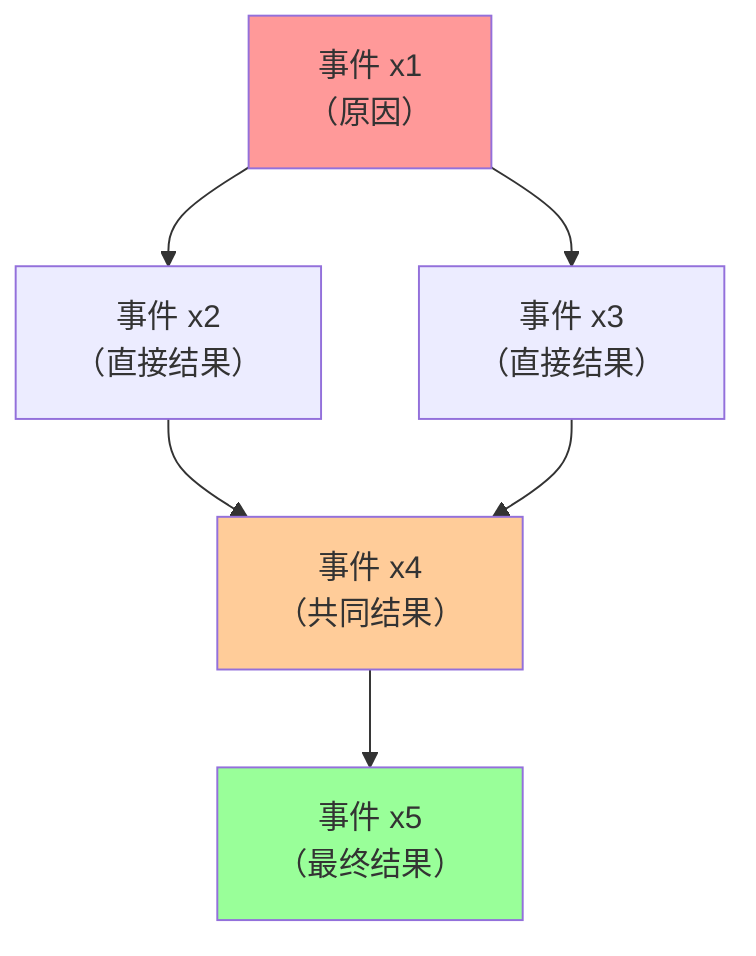
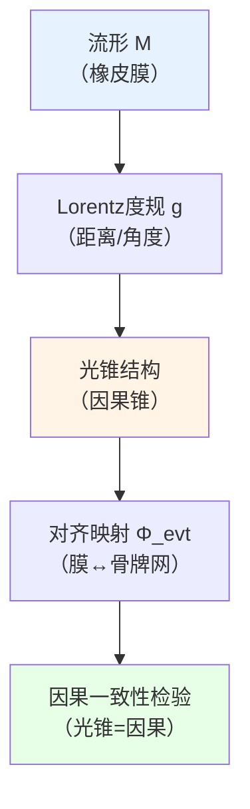
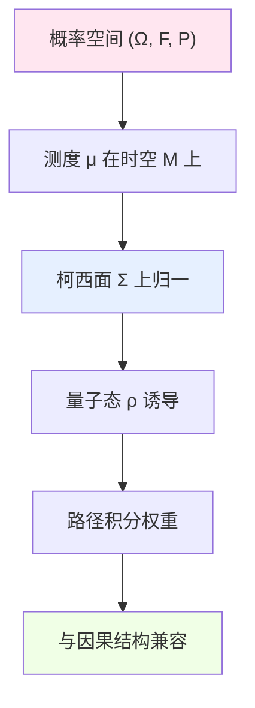
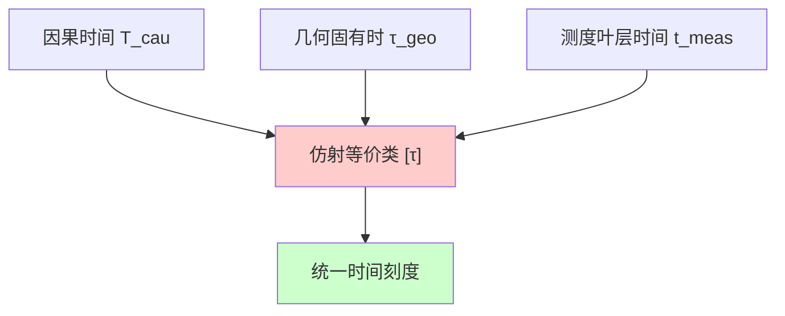
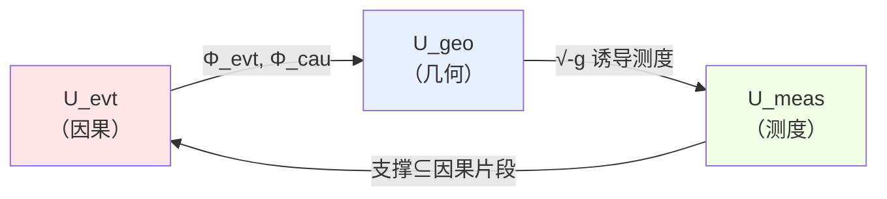

# 02. 三要素详解：事件、几何、测度

## 引言：宇宙的基础三角架

在十重结构中，前三个组件构成了宇宙最基础的"地基"：

1. **事件与因果层** $U_{\text{evt}}$：定义"发生了什么"和"谁影响谁"
2. **几何与时空层** $U_{\text{geo}}$：定义"在哪里发生"和"距离/角度"
3. **测度与概率层** $U_{\text{meas}}$：定义"有多大可能"和"如何积分"

这三者的关系类似于：
- **剧本**（事件因果）：定义剧情发展顺序
- **舞台**（几何时空）：提供演出的物理空间
- **灯光**（测度概率）：决定观众看到每个场景的"权重"

没有这三者的兼容对齐，宇宙将无法被一致定义。

## 第一部分：事件与因果层 $U_{\text{evt}}$

### 1.1 直观图景：多米诺骨牌网络

想象一个巨大的多米诺骨牌网络：
- **每块骨牌** = 一个事件
- **骨牌倒下的路径** = 因果链
- **不能倒回去** = 因果不可逆
- **可以分叉** = 一个原因产生多个结果
- **可以汇聚** = 多个原因共同导致一个结果

这个网络的全局结构，就是 $U_{\text{evt}}$。

### 1.2 严格数学定义

**定义 1.1**（事件因果层）：
$$
U_{\text{evt}} = (X, \preceq, \mathcal{C})
$$

其中：

**(1) 事件集合** $X$：
- 每个元素 $x \in X$ 代表一个**不可再分的事件**
- 可以是：粒子碰撞、观测行为、信息传递
- **不**包含"持续过程"（那些被分解为多个事件）

**(2) 因果偏序** $\preceq$：
- $x \preceq y$：读作"$x$ 可能因果影响 $y$"
- **自反性**：$x \preceq x$（事件可以影响自己）
- **传递性**：$x \preceq y \land y \preceq z \Rightarrow x \preceq z$
- **反对称性**：$x \preceq y \land y \preceq x \Rightarrow x = y$（无因果闭环）

**关键约束**：
$$
x \prec y \;\Rightarrow\; \exists \text{ 因果路径 } x \to \cdots \to y
$$

**(3) 因果片段族** $\mathcal{C}$：
$$
\mathcal{C} = \{C_\alpha \subseteq X \mid C_\alpha \text{ 是因果闭包}\}
$$

每个 $C_\alpha$ 满足：
- **向下闭**：$x \in C_\alpha \land y \preceq x \Rightarrow y \in C_\alpha$
- **有限生成**：存在有限集合 $F$ 使得 $C_\alpha = \bigcup_{x \in F} \text{past}(x)$

**物理意义**：$C_\alpha$ 代表"观测者 $\alpha$ 到目前为止能知道的所有事件"。

### 1.3 核心性质与物理解释

**性质 1.1**（全局因果一致性）：

存在**因果时间函数** $T_{\text{cau}}: X \to \mathbb{R}$ 使得：
$$
x \prec y \quad \Rightarrow \quad T_{\text{cau}}(x) < T_{\text{cau}}(y)
$$

**物理意义**：整个宇宙有一个**全局的"剧情发展顺序"**，不会出现"孙子杀死祖父"的时间悖论。

**性质 1.2**（因果钻石有界性）：

对任意 $x, y \in X$，**因果钻石**：
$$
\Diamond(x, y) := \{z \in X \mid x \preceq z \preceq y\}
$$
要么为空集，要么是**有限集**或**紧致集**。

**物理意义**：任意两个事件之间的"中间事件"不会无穷多，信息传递是离散或局域的。

**性质 1.3**（类光超曲面存在性）：

存在**柯西超曲面族** $\{\Sigma_t\}_{t \in \mathbb{R}}$ 使得：
$$
\forall x \in X, \exists! t: x \in \Sigma_t
$$
且：
$$
t_1 < t_2 \Rightarrow \forall x \in \Sigma_{t_1}, y \in \Sigma_{t_2}: x \preceq y
$$

**物理意义**：可以用"一层层时间切片"来重构整个因果结构，类似于动画的逐帧播放。

### 1.4 示例与反例

**示例 1**（闵可夫斯基时空的因果结构）：

在狭义相对论中：
$$
X = \mathbb{R}^4, \quad x \preceq y \Leftrightarrow (y - x) \in \overline{V^+}
$$
其中 $\overline{V^+}$ 是**闭未来光锥**：
$$
\overline{V^+} = \{(t, \mathbf{x}) \mid t \geq 0, t^2 \geq |\mathbf{x}|^2\}
$$

因果片段 $C$ 对应"一个观测者的过去视界"：
$$
C = \{x \in \mathbb{R}^4 \mid x \preceq x_{\text{obs}}\}
$$

**反例 1**（哥德尔时空）：

哥德尔1949年构造的旋转宇宙模型中，**存在闭类时曲线（CTC）**：
$$
\exists x_1, \ldots, x_n: x_1 \prec x_2 \prec \cdots \prec x_n \prec x_1
$$

这违反了性质1.1，因此**不满足** $U_{\text{evt}}$ 的定义。GLS理论排除这类病态时空。

**反例 2**（量子因果不确定性）：

某些量子引力模型允许"因果顺序的叠加态"：
$$
|\psi\rangle = \frac{1}{\sqrt{2}}(|x \prec y\rangle + |y \prec x\rangle)
$$

这也**不满足**偏序的反对称性。但可以通过**因果片段的概率测度**来兼容，见第三部分。

### 1.5 比喻总结：城市的交通网络

把 $U_{\text{evt}}$ 想象成一个城市的**单行道交通网络**：
- **路口** = 事件
- **单行道** = 因果关系（只能从 $x$ 开到 $y$，不能反向）
- **禁止环形单行道** = 无因果闭环
- **到达区域** = 因果片段（从某路口出发能到的所有路口）

这个网络的拓扑结构，决定了"信息如何在宇宙中流动"。

---

## 第二部分：几何与时空层 $U_{\text{geo}}$

### 2.1 直观图景：橡皮膜上的光锥

想象一张**拉伸的橡皮膜**：
- **膜的形状** = 时空几何
- **膜上的光锥** = 因果结构
- **膜的弯曲** = 引力效应
- **光锥的倾斜** = 物质能量的分布

$U_{\text{geo}}$ 的核心要求：**几何与因果必须对齐**——光锥的朝向必须与因果偏序一致。

### 2.2 严格数学定义

**定义 2.1**（几何与时空层）：
$$
U_{\text{geo}} = (M, g, \Phi_{\text{evt}}, \Phi_{\text{cau}})
$$

其中：

**(1) 时空流形** $M$：
- 四维光滑流形（通常假设 $M \cong \mathbb{R}^4$ 拓扑）
- 可定向、Hausdorff、仿紧
- 每个点 $p \in M$ 代表一个**时空坐标**

**(2) Lorentz度规** $g$：
$$
g: TM \times TM \to \mathbb{R}
$$
满足：
- **签名** $(-,+,+,+)$：一个时间方向，三个空间方向
- **非退化**：对任意 $v \neq 0$，存在 $w$ 使得 $g(v, w) \neq 0$
- **光滑依赖**于 $p \in M$

**类光向量**：$v \in T_p M$ 满足 $g(v, v) = 0$ 且 $v \neq 0$

**(3) 事件嵌入映射** $\Phi_{\text{evt}}$：
$$
\Phi_{\text{evt}}: X \to M
$$
满足：
- **单射**：不同事件对应不同时空点
- **局域性**：$\Phi_{\text{evt}}(X)$ 在 $M$ 中稠密或全覆盖

**(4) 因果对齐映射** $\Phi_{\text{cau}}$：
$$
\Phi_{\text{cau}}: (X, \preceq) \to (M, \preceq_g)
$$
其中 $\preceq_g$ 是**度规因果关系**：
$$
p \preceq_g q \;\Leftrightarrow\; \exists \text{ 非空间类曲线 } \gamma: p \to q
$$

**核心约束**：
$$
\boxed{x \preceq y \;\Leftrightarrow\; \Phi_{\text{evt}}(x) \preceq_g \Phi_{\text{evt}}(y)}
$$

**物理意义**：因果偏序（骨牌）与光锥结构（橡皮膜）**完全一致**。

### 2.3 核心性质与物理解释

**性质 2.1**（Einstein方程的解）：

度规 $g$ 必须满足（在经典近似下）：
$$
G_{ab} + \Lambda g_{ab} = 8\pi G \langle T_{ab} \rangle
$$
其中：
- $G_{ab} = R_{ab} - \frac{1}{2}R g_{ab}$：Einstein张量
- $\Lambda$：宇宙学常数
- $\langle T_{ab} \rangle$：能量动量张量期望值（量子修正）

**物理意义**：时空几何由物质能量分布决定——"物质告诉时空如何弯曲"。

**性质 2.2**（全局双曲性）：

存在**Cauchy超曲面** $\Sigma \subset M$ 使得：
$$
\forall p \in M, \exists! \text{ 类时曲线 } \gamma \text{ 穿过 } \Sigma \text{ 到达 } p
$$

**物理意义**：可以从"一个时刻的初始数据"唯一确定整个宇宙演化（决定论）。

**性质 2.3**（时间定向）：

存在**连续的类时向量场** $T^a$ 使得：
$$
\forall p \in M: g(T, T) < 0
$$

**物理意义**：全局定义了"时间向前"的方向，排除"时间箭头反转"的区域。

### 2.4 示例与非平凡结构

**示例 2**（Schwarzschild黑洞时空）：

度规：
$$
ds^2 = -\left(1 - \frac{2GM}{r}\right)dt^2 + \left(1 - \frac{2GM}{r}\right)^{-1}dr^2 + r^2 d\Omega^2
$$

关键特性：
- **视界** $r = 2GM$：光锥"完全倾倒"，向内坍缩
- **奇点** $r = 0$：曲率发散，理论失效

因果结构：
$$
r > 2GM: \text{类时观测者可逃离} \\
r < 2GM: \text{所有未来路径指向奇点}
$$

**示例 3**（FLRW膨胀宇宙）：

度规：
$$
ds^2 = -dt^2 + a(t)^2 \left(\frac{dr^2}{1 - kr^2} + r^2 d\Omega^2\right)
$$

其中 $a(t)$ 是**尺度因子**，满足Friedmann方程：
$$
\left(\frac{\dot{a}}{a}\right)^2 = \frac{8\pi G}{3}\rho - \frac{k}{a^2} + \frac{\Lambda}{3}
$$

因果结构特性：
- **粒子视界**：$\chi_p = \int_0^t \frac{dt'}{a(t')}$（有限意味着视界存在）
- **事件视界**：$\chi_e = \int_t^\infty \frac{dt'}{a(t')}$（有限意味着加速膨胀）

### 2.5 比喻总结：城市的3D地图

把 $U_{\text{geo}}$ 想象成**城市的立体地图**：
- **地图表面** = 时空流形 $M$
- **等高线** = 时间切片
- **坡度** = 引力势
- **交通流向** = 光锥方向
- **禁止区域** = 视界或奇点

地图上的"交通流向"必须与第一部分的"单行道网络"完全匹配。

---

## 第三部分：测度与概率层 $U_{\text{meas}}$

### 3.1 直观图景：舞台上的聚光灯

想象一个**舞台剧**：
- **舞台** = 时空流形 $M$
- **剧本** = 因果结构 $\preceq$
- **聚光灯** = 概率测度 $\mu$

聚光灯决定观众"看到"每个场景的**权重**：
- 明亮区域 = 高概率事件
- 阴影区域 = 低概率事件
- 完全黑暗 = 零测度集合

但**聚光灯的移动**必须遵守：
- **连续性**：不能突然跳跃
- **归一性**：总亮度守恒
- **因果兼容**：不能照亮"因果不可达"的区域

### 3.2 严格数学定义

**定义 3.1**（测度与概率层）：
$$
U_{\text{meas}} = (\Omega, \mathcal{F}, \mathbb{P}, \mu_M, \{\rho_\Sigma\}_{\Sigma})
$$

其中：

**(1) 概率空间** $(\Omega, \mathcal{F}, \mathbb{P})$：
- $\Omega$：样本空间（所有可能的"宇宙历史"）
- $\mathcal{F}$：$\sigma$-代数（可观测事件的集合）
- $\mathbb{P}: \mathcal{F} \to [0, 1]$：概率测度

满足Kolmogorov公理：
$$
\mathbb{P}(\Omega) = 1, \quad \mathbb{P}\left(\bigcup_{i=1}^\infty A_i\right) = \sum_{i=1}^\infty \mathbb{P}(A_i) \;(\text{不相交})
$$

**(2) 时空上的测度** $\mu_M$：

在 $M$ 上的**Borel测度**，满足：
$$
\mu_M(M) < \infty \quad \text{或} \quad \mu_M \text{ 是 } \sigma\text{-有限的}
$$

**与度规的关系**：
$$
d\mu_M = \sqrt{-g} \, d^4x
$$
其中 $g = \det(g_{ab})$ 是度规行列式。

**物理意义**：$\mu_M$ 定义了"体积元"——在时空中积分物理量的权重。

**(3) 柯西面上的量子态族** $\{\rho_\Sigma\}_{\Sigma}$：

对每个柯西超曲面 $\Sigma$，定义**密度矩阵**：
$$
\rho_\Sigma: \mathcal{H}_\Sigma \otimes \mathcal{H}_\Sigma^\dagger \to \mathbb{C}
$$
满足：
- **Hermite性**：$\rho_\Sigma^\dagger = \rho_\Sigma$
- **正半定性**：$\langle \psi | \rho_\Sigma | \psi \rangle \geq 0$
- **归一性**：$\text{tr}(\rho_\Sigma) = 1$

**物理意义**：$\rho_\Sigma$ 完全编码了"在时刻 $\Sigma$ 的量子状态"，包括纠缠和混合态。

**(4) 兼容性条件**：

$$
\boxed{\int_\Sigma \text{tr}(\rho_\Sigma) \, d\sigma = 1}
$$

其中 $d\sigma$ 是柯西面的**诱导体积元**：
$$
d\sigma = \sqrt{h} \, d^3x, \quad h = \det(h_{ij})
$$
$h_{ij}$ 是 $\Sigma$ 上的诱导度规。

**时间演化兼容**：
$$
\rho_{\Sigma_2} = \mathcal{U}(\Sigma_1 \to \Sigma_2) \rho_{\Sigma_1} \mathcal{U}^\dagger(\Sigma_1 \to \Sigma_2)
$$
其中 $\mathcal{U}$ 是**幺正演化算符**。

### 3.3 核心性质与物理解释

**性质 3.1**（Born规则）：

观测事件 $A \in \mathcal{F}$ 的概率：
$$
\mathbb{P}(A | \Sigma) = \text{tr}(\rho_\Sigma \hat{P}_A)
$$
其中 $\hat{P}_A$ 是**投影算符**。

**物理意义**：量子测量的概率由密度矩阵和观测算符决定——量子力学的基本公设。

**性质 3.2**（路径积分表示）：

从 $\Sigma_1$ 到 $\Sigma_2$ 的演化振幅：
$$
\mathcal{U}(\Sigma_1 \to \Sigma_2) = \int_{\phi(\Sigma_1) \to \phi(\Sigma_2)} \mathcal{D}\phi \, e^{iS[\phi]/\hbar}
$$
其中：
- $\phi$：场位形
- $S[\phi]$：作用量
- $\mathcal{D}\phi$：路径积分测度（需要正规化）

**物理意义**：量子态通过"所有可能路径的叠加"演化，每条路径权重为 $e^{iS/\hbar}$。

**性质 3.3**（纠缠熵与几何）：

对于柯西面 $\Sigma$ 的子区域 $A$，**纠缠熵**：
$$
S_{\text{ent}}(A) = -\text{tr}(\rho_A \log \rho_A)
$$
其中 $\rho_A = \text{tr}_{\bar{A}}(\rho_\Sigma)$ 是约化密度矩阵。

**Ryu-Takayanagi公式**（AdS/CFT中的结果）：
$$
S_{\text{ent}}(A) = \frac{\text{Area}(\gamma_A)}{4G\hbar}
$$
其中 $\gamma_A$ 是 $A$ 在bulk中的**极小曲面**。

**物理意义**：纠缠熵直接关联时空几何——"几何是纠缠的度量"。

### 3.4 示例：量子场论的真空态

**示例 4**（闵可夫斯基真空）：

在平直时空中，标量场的真空态：
$$
\rho_{\text{Mink}} = |0\rangle\langle 0|
$$
其中 $|0\rangle$ 是Poincaré不变真空。

关键性质：
- **纯态**：$\rho^2 = \rho$
- **平移不变**：$\hat{P}^\mu \rho \hat{P}^{\mu\dagger} = \rho$
- **零纠缠熵**：$S_{\text{ent}}(A) = 0$（对空间区域 $A$）

**示例 5**（Unruh温度与Rindler视界）：

加速观测者（加速度 $a$）眼中的闵可夫斯基真空是**热态**：
$$
\rho_{\text{Rindler}} = \frac{1}{Z} e^{-\beta \hat{H}_{\text{Rindler}}}
$$
其中：
$$
\beta = \frac{2\pi}{a}, \quad T_{\text{Unruh}} = \frac{a}{2\pi k_B} \approx 4 \times 10^{-23} \text{K} \cdot \left(\frac{a}{1\text{m/s}^2}\right)
$$

**物理意义**：真空态依赖于观测者的运动状态——量子场论中的"相对论效应"。

### 3.5 与因果结构的兼容性

**约束 3.1**（因果测度支撑）：

对于因果片段 $C \in \mathcal{C}$，定义**支撑集**：
$$
\text{supp}(\mu_C) = \{p \in M \mid \forall U \ni p: \mu_C(U) > 0\}
$$

要求：
$$
\text{supp}(\mu_C) \subseteq \Phi_{\text{evt}}(C)
$$

**物理意义**：概率测度的支撑必须在**因果可达区域**内——不能对因果不可达的事件赋予非零概率。

**约束 3.2**（量子因果顺序）：

对于事件 $x, y \in X$：
$$
x \preceq y \;\Rightarrow\; [\hat{O}_x(t_x), \hat{O}_y(t_y)] = 0 \;\text{当}\; t_x < t_y
$$

其中 $\hat{O}_x, \hat{O}_y$ 是对应的观测算符。

**物理意义**：因果不相关的观测算符**对易**——量子场论的微因果性。

### 3.6 比喻总结：城市的热力图

把 $U_{\text{meas}}$ 想象成**城市的实时交通热力图**：
- **颜色深浅** = 概率密度
- **热力区域** = 高概率事件集中区
- **冷色区域** = 低概率或零测度集合
- **热力流动** = 量子态演化

热力图必须满足：
- 总"热量"守恒（归一性）
- 热量只能沿"单行道"传播（因果兼容）
- 不能在"交通管制区"出现热量（支撑约束）

---

## 第四部分：三者的深层统一

### 4.1 统一时间刻度：穿透三层的红线

在三个组件中，各自有"时间"的定义：

**(1) 因果时间** $T_{\text{cau}}$：
$$
x \prec y \Rightarrow T_{\text{cau}}(x) < T_{\text{cau}}(y)
$$

**(2) 几何固有时** $\tau_{\text{geo}}$：
$$
\tau_{\text{geo}} = \int_\gamma \sqrt{-g_{ab} \dot{x}^a \dot{x}^b} \, d\lambda
$$
沿类时曲线 $\gamma$ 的积分。

**(3) 测度时间** $t_{\text{meas}}$：

通过柯西面族 $\{\Sigma_t\}$ 定义的"叶层化时间"：
$$
t_{\text{meas}}: M \to \mathbb{R}, \quad p \in \Sigma_t \Rightarrow t_{\text{meas}}(p) = t
$$

**核心命题**（时间刻度统一性）：

三种时间定义**仿射等价**：
$$
\boxed{T_{\text{cau}} \sim \tau_{\text{geo}} \sim t_{\text{meas}}}
$$

即存在仿射变换：
$$
\tau_{\text{geo}} = \alpha T_{\text{cau}} + \beta, \quad t_{\text{meas}} = \alpha' T_{\text{cau}} + \beta'
$$

**物理意义**：宇宙有**唯一的时间流向**，在不同视角下只是"单位换算"不同。

### 4.2 兼容性条件：三角恒等式

**条件 4.1**（因果-几何对齐）：
$$
x \preceq y \;\Leftrightarrow\; \Phi_{\text{evt}}(x) \preceq_g \Phi_{\text{evt}}(y)
$$

**条件 4.2**（几何-测度对齐）：
$$
\int_M f(p) \, d\mu_M = \int_M f(p) \sqrt{-g} \, d^4x
$$
对所有可积函数 $f$。

**条件 4.3**（测度-因果对齐）：
$$
\text{supp}(\mu_C) \subseteq \Phi_{\text{evt}}(C), \quad \forall C \in \mathcal{C}
$$

这三个条件形成**闭合三角约束**：

**引理 4.1**（三角闭合的充要条件）：

三个组件兼容 $\Leftrightarrow$ 存在全局Cauchy超曲面族 $\{\Sigma_t\}$ 使得：
$$
\forall t: \rho_{\Sigma_t} \text{ 由 } g|_{\Sigma_t} \text{ 和 } T_{\text{cau}}|_{\Sigma_t} \text{ 唯一确定}
$$

**物理意义**：量子态、时空几何、因果结构是**三位一体**的，不能独立指定。

### 4.3 核心定理：基础三元组的唯一性

**定理 4.1**（基础三元组的模空间）：

固定拓扑 $M \cong \mathbb{R}^4$ 和全局因果结构类型（如"全局双曲"），则满足所有兼容性条件的三元组：
$$
(U_{\text{evt}}, U_{\text{geo}}, U_{\text{meas}})
$$
构成一个**有限维模空间** $\mathcal{M}_{\text{base}}$。

**维数估计**：
$$
\dim \mathcal{M}_{\text{base}} \leq \dim \mathcal{M}_{\text{geo}} + \dim \mathcal{M}_{\text{QFT}}
$$
其中：
- $\dim \mathcal{M}_{\text{geo}} \sim \infty$（度规的自由度）
- $\dim \mathcal{M}_{\text{QFT}} = \text{有限}$（场的边界数据）

但因果约束和IGVP（见第7组件）将自由度**大幅压缩**。

**推论 4.1**（无自由午餐原理）：

不能同时任意指定：
1. 任意因果结构
2. 任意时空几何
3. 任意量子态

三者中最多指定**两个**，第三个由兼容性条件唯一确定。

### 4.4 实际计算示例

**问题**：给定平直因果结构（闵可夫斯基）和标量场真空态，计算诱导的时空度规。

**解**：

**(1) 因果结构**：
$$
U_{\text{evt}} = (\mathbb{R}^4, \preceq_{\text{Mink}})
$$
其中 $\preceq_{\text{Mink}}$ 是标准光锥因果关系。

**(2) 量子态**：
$$
\rho_{\Sigma_0} = |0\rangle\langle 0| \quad \text{（Poincaré不变真空）}
$$

**(3) 反推度规**：

由于真空态满足：
$$
\langle 0 | T_{ab} | 0 \rangle = 0
$$

Einstein方程给出：
$$
G_{ab} + \Lambda g_{ab} = 0
$$

在 $\Lambda = 0$ 时，解唯一确定为：
$$
g = \eta_{ab} = \text{diag}(-1, 1, 1, 1)
$$

即**闵可夫斯基度规**。

**结论**：平直因果 + 平移不变真空 $\Rightarrow$ 平直时空（自洽）。

---

## 第五部分：物理图景与哲学意义

### 5.1 宇宙的"三合一"基础

传统物理学将时空、因果、量子态视为**三个独立层次**：
- 广义相对论处理时空几何
- 量子场论处理量子态演化
- 因果结构作为"背景约束"

但GLS理论揭示：三者是**同一现实的三个视角**：

| 视角         | 核心对象     | 关键方程                          | 物理意义              |
|------------|----------|-------------------------------|-------------------|
| **因果视角**   | 偏序 $\preceq$ | $x \prec y$                   | "谁影响谁"            |
| **几何视角**   | 度规 $g$     | $G_{ab} = 8\pi G T_{ab}$      | "在哪里发生，如何弯曲"      |
| **量子视角**   | 密度矩阵 $\rho$  | $i\hbar \partial_t \rho = [H, \rho]$ | "有多大概率，如何叠加"      |

**核心洞见**：这三个视角通过**兼容性条件**锁定为一个整体——改变任何一个，其他两个必须相应调整。

### 5.2 经典极限的涌现

在 $\hbar \to 0$ 和 $G \to 0$ 的极限下：

**(1) 因果结构退化为决定论**：
$$
U_{\text{evt}} \to \text{唯一时间流} \quad (\text{无量子叠加})
$$

**(2) 时空几何退化为牛顿绝对时空**：
$$
U_{\text{geo}} \to (\mathbb{R}^3 \times \mathbb{R}, dt^2 - dx^2) \quad (\text{时空分离})
$$

**(3) 测度退化为经典概率**：
$$
U_{\text{meas}} \to \delta(\phi - \phi_{\text{classical}}) \quad (\text{态矢坍缩为点})
$$

**物理意义**：经典物理学是量子引力理论的**特殊简化情况**，而非基本层次。

### 5.3 观测者的角色

注意：在前三个组件中，**没有显式提及观测者**。但：

- **因果片段** $C \in \mathcal{C}$ 隐含了"某个视角能知道的事件"
- **柯西面上的量子态** $\rho_\Sigma$ 隐含了"在某个时刻的测量配置"

这为后续引入 $U_{\text{obs}}$（观测者网络层）埋下伏笔：
$$
U_{\text{obs}} = \{(\mathcal{O}_\alpha, C_\alpha, \rho_\alpha)\}_{\alpha \in \mathcal{A}}
$$

每个观测者 $\mathcal{O}_\alpha$ 拥有：
- **因果片段** $C_\alpha$：Ta能知道的事件
- **约化态** $\rho_\alpha = \text{tr}_{\bar{\alpha}}(\rho_{\text{global}})$：Ta看到的量子态

**关键问题**：不同观测者的 $(C_\alpha, \rho_\alpha)$ 如何达成**共识**？这需要第8组件 $U_{\text{obs}}$ 的严格定义。

### 5.4 信息几何视角

可以将三个组件统一到**信息几何**框架：

**(1) 因果结构** = 信息传递的**拓扑**

**(2) 时空几何** = 信息编码的**容量**（全息原理）

**(3) 概率测度** = 信息分布的**统计**（最大熵原理）

**统一公式**：
$$
\mathcal{I}_{\text{total}} = \underbrace{S_{\text{topo}}}_{\text{因果熵}} + \underbrace{S_{\text{geom}}}_{\text{几何熵}} + \underbrace{S_{\text{prob}}}_{\text{概率熵}}
$$

其中：
- $S_{\text{topo}} \sim \log |\text{因果路径数}|$
- $S_{\text{geom}} = \frac{A}{4G\hbar}$（全息熵）
- $S_{\text{prob}} = -\text{tr}(\rho \log \rho)$（von Neumann熵）

**猜想**：$\mathcal{I}_{\text{total}}$ 在物理演化中守恒（广义第二定律）。

### 5.5 比喻总结：交响乐的三重奏

把宇宙想象成一场**交响乐**：

- **因果结构** = **旋律线**（音符的先后顺序）
- **时空几何** = **音高与音程**（距离和谐波）
- **概率测度** = **音量与力度**（强弱对比）

三者必须完美**和谐**：
- 旋律不能与和声冲突（因果-几何对齐）
- 音量不能在无声区出现（测度-因果对齐）
- 音高必须支撑旋律（几何-因果对齐）

而整个交响乐的"总谱"，就是完整的宇宙定义 $\mathfrak{U}$。

---

## 第六部分：进阶主题与开放问题

### 6.1 量子引力修正

在普朗克尺度 $\ell_P \sim 10^{-35}\text{m}$ 附近，三个组件可能需要修正：

**(1) 因果结构的模糊化**：
$$
U_{\text{evt}} \to U_{\text{evt}}^{\text{fuzzy}} = (X, \preceq_\epsilon, \mathcal{C}_\epsilon)
$$
其中 $\preceq_\epsilon$ 允许 $\epsilon \sim \ell_P$ 的因果不确定性。

**(2) 时空的非交换化**：
$$
[x^\mu, x^\nu] = i\theta^{\mu\nu}, \quad \theta \sim \ell_P^2
$$

**(3) 测度的非对易化**：
$$
\mu_M \to \text{非对易测度} \quad (\text{谱三元组})
$$

**挑战**：如何保持三者的兼容性？可能需要**范畴化**整个结构（见 $U_{\text{cat}}$）。

### 6.2 拓扑相变与时空涌现

某些量子引力模型允许**拓扑改变**：
$$
M_{\text{before}} \not\cong M_{\text{after}}
$$

例如：
- 黑洞形成/蒸发
- 宇宙的创生/湮灭
- Wheeler的"时空泡沫"

**问题**：在拓扑相变点，$U_{\text{geo}}$ 如何定义？可能需要：
$$
U_{\text{geo}} \to \text{层化流形} \quad \text{或} \quad \text{轨形流形（orbifold）}
$$

**GLS方案**：通过 $U_{\text{evt}}$ 的连续性作为"拓扑中性"的锚点：
$$
\text{因果结构连续} \Rightarrow \text{时空拓扑可跳变}
$$

### 6.3 观测者依赖性与关系量子力学

Rovelli等人提出：物理量总是**关系性的**——没有"上帝视角"的绝对态。

在GLS框架中：
$$
\rho_\Sigma \to \rho_\Sigma^{\text{obs}} = f(\mathcal{O}, \rho_{\text{global}})
$$

不同观测者 $\mathcal{O}_\alpha, \mathcal{O}_\beta$ 可能有：
$$
\rho_\Sigma^{\alpha} \neq \rho_\Sigma^{\beta}
$$

但必须满足**Wigner友谊约束**（一致性）：
$$
\text{tr}_{\bar{\alpha}}(\rho_\Sigma^{\alpha}) = \text{tr}_{\bar{\alpha}}(\rho_\Sigma^{\beta})
$$

详见第8组件 $U_{\text{obs}}$。

### 6.4 宇宙学边界条件

在FLRW宇宙中，初始条件 $\rho_{\Sigma_0}$ 如何确定？可能方案：

**(1) 无边界假设**（Hartle-Hawking）：
$$
\rho_{\Sigma_0} = \text{路径积分，无边界}
$$

**(2) 隧穿边界**（Vilenkin）：
$$
\rho_{\Sigma_0} \sim e^{-S_E[\text{Euclidean instanton}]}
$$

**(3) 最大熵原理**：
$$
\rho_{\Sigma_0} = \arg\max_{\rho} S(\rho) \quad \text{受物理约束}
$$

GLS理论通过 $U_{\text{ent}}$ 的**IGVP**提供判据：
$$
\delta S_{\text{gen}} = 0 \Rightarrow \text{选择唯一初态}
$$

---

## 第七部分：学习路径与实践建议

### 7.1 深入理解三组件的步骤

**阶段1**：熟悉基本概念（1-2周）
- 因果偏序与DAG
- Lorentz流形与光锥
- 概率测度与密度矩阵

**阶段2**：推导兼容性条件（2-3周）
- 证明因果-几何对齐的充要条件
- 计算路径积分的测度归一化
- 验证Ryu-Takayanagi公式（简单情况）

**阶段3**：研究经典例子（3-4周）
- 闵可夫斯基时空的三组件
- Schwarzschild黑洞的因果结构
- Unruh效应的测度分析

**阶段4**：探索前沿问题（长期）
- 量子引力中的因果动力学
- 时空拓扑相变
- 观测者依赖的量子态

### 7.2 推荐参考文献

**经典教材**：
1. Wald, *General Relativity* (时空几何)
2. Haag, *Local Quantum Physics* (代数QFT)
3. Naber, *Topology, Geometry and Gauge Fields* (数学工具)

**现代进展**：
1. Sorkin, *Causal Sets* (因果结构)
2. Van Raamsdonk, *Building up spacetime with quantum entanglement* (几何-量子联系)
3. Bousso, *The Holographic Principle* (熵与几何)

**GLS特定**：
1. 本教程第1章（因果动力学基础）
2. 本教程第5章（散射矩阵与时间）
3. 本教程第7章（广义熵与引力）

### 7.3 常见误区与避坑指南

**误区1**："因果结构是时空的附属品"
- **纠正**：在GLS理论中，因果与几何是**平等的基础层**，无主次之分。

**误区2**："量子态可以任意叠加"
- **纠正**：叠加必须尊重**因果约束**（微因果性）和**几何约束**（能量条件）。

**误区3**："观测者不影响本体论"
- **纠正**：$U_{\text{meas}}$ 中的 $\rho_\Sigma$ 已经隐含观测配置，后续 $U_{\text{obs}}$ 将显式引入。

---

## 总结与展望

### 核心要点回顾

1. **事件因果层** $U_{\text{evt}}$：定义"发生了什么"的偏序结构
2. **几何时空层** $U_{\text{geo}}$：定义"在哪里发生"的Lorentz流形
3. **测度概率层** $U_{\text{meas}}$：定义"有多大可能"的量子态族

三者通过**兼容性条件**锁定为一体，形成宇宙的"地基"。

### 与后续组件的联系

- **$U_{\text{QFT}}$**：在 $(M, g, \rho_\Sigma)$ 上定义场算符
- **$U_{\text{scat}}$**：从 $U_{\text{QFT}}$ 提取散射矩阵，穿透回因果时间
- **$U_{\text{ent}}$**：从 $\rho_\Sigma$ 计算广义熵，反推 $g$（IGVP）
- **$U_{\text{obs}}$**：将 $\mathcal{C}$ 和 $\rho$ 分配给具体观测者

前三个组件是**静态框架**，后面组件引入**动力学演化**和**观测者多视角**。

### 哲学寓意

宇宙不是"物质 + 时空 + 规律"的简单拼凑，而是**因果、几何、概率的三位一体**：
- 改变因果，几何和概率必须跟随
- 改变几何，因果和概率必须调整
- 改变概率，因果和几何必须适配

这种**全局自洽性**，或许正是"为何宇宙可理解"的深层原因。

---

**下一篇预告**：
- **03. 量子场论、散射、模流：动力学的三重奏**
  - $U_{\text{QFT}}$：如何在弯曲时空定义场算符？
  - $U_{\text{scat}}$：散射矩阵如何编码全部动力学？
  - $U_{\text{mod}}$：模流如何定义"热力学时间"？
