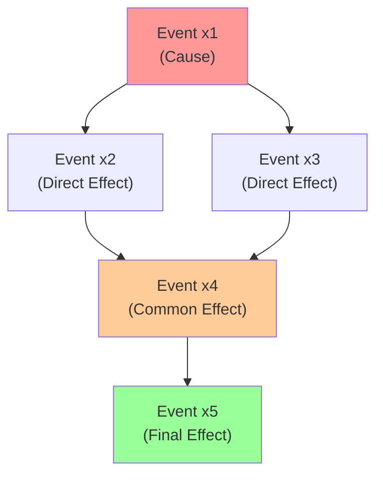
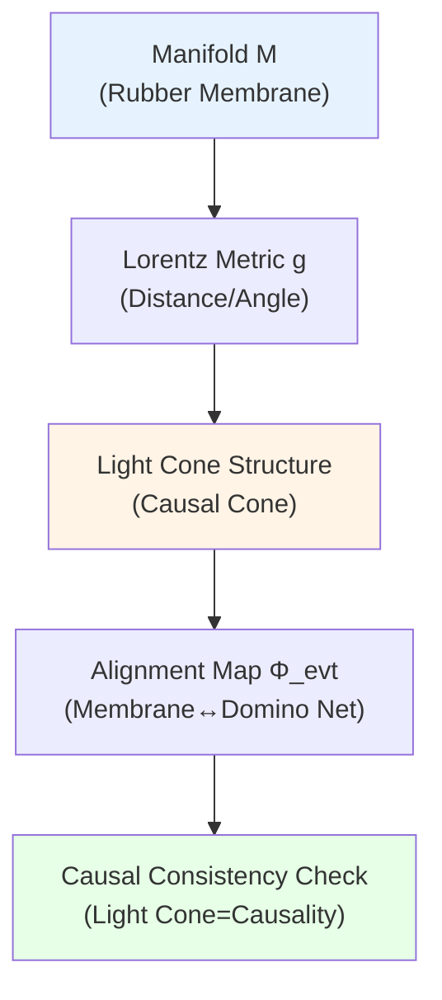
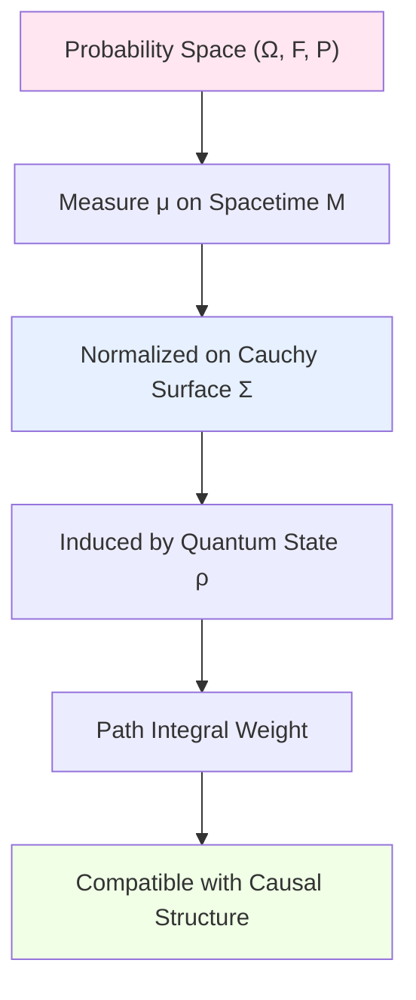
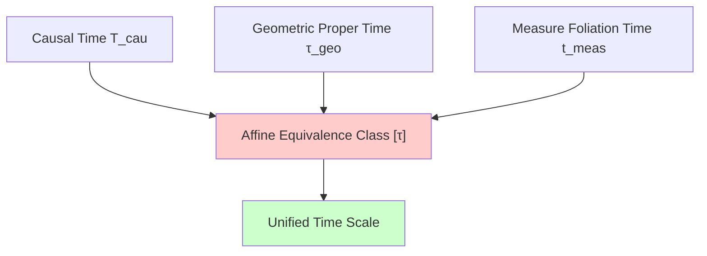
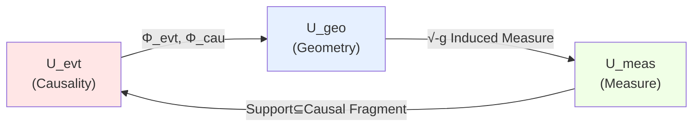

# 02. Detailed Explanation of Three Components: Events, Geometry, Measure

## Introduction: Foundation Tripod of Universe

In tenfold structure, first three components constitute most fundamental "foundation" of universe:

1. **Event and Causality Layer** $U_{\text{evt}}$: Defines "what happens" and "who influences whom"
2. **Geometry and Spacetime Layer** $U_{\text{geo}}$: Defines "where it happens" and "distance/angle"
3. **Measure and Probability Layer** $U_{\text{meas}}$: Defines "how probable" and "how to integrate"

Relationship among these three is similar to:
- **Script** (Event Causality): Defines plot development order
- **Stage** (Geometric Spacetime): Provides physical space for performance
- **Lighting** (Measure Probability): Determines "weight" audience sees each scene

Without compatibility and alignment of these three, universe cannot be consistently defined.

## Part I: Event and Causality Layer $U_{\text{evt}}$

### 1.1 Intuitive Picture: Domino Network

Imagine huge domino network:
- **Each domino** = an event
- **Path of dominoes falling** = causal chain
- **Cannot fall backwards** = causality irreversible
- **Can branch** = one cause produces multiple effects
- **Can converge** = multiple causes jointly lead to one effect

Global structure of this network is $U_{\text{evt}}$.

### 1.2 Strict Mathematical Definition

**Definition 1.1** (Event Causality Layer):
$$
U_{\text{evt}} = (X, \preceq, \mathcal{C})
$$

where:

**(1) Event Set** $X$:
- Each element $x \in X$ represents an **indivisible event**
- Can be: particle collision, observation behavior, information transmission
- **Does not** contain "continuous processes" (those decomposed into multiple events)

**(2) Causal Partial Order** $\preceq$:
- $x \preceq y$: Read as "$x$ may causally influence $y$"
- **Reflexivity**: $x \preceq x$ (event can influence itself)
- **Transitivity**: $x \preceq y \land y \preceq z \Rightarrow x \preceq z$
- **Antisymmetry**: $x \preceq y \land y \preceq x \Rightarrow x = y$ (no causal closed loops)

**Key Constraint**:
$$
x \prec y \;\Rightarrow\; \exists \text{ causal path } x \to \cdots \to y
$$

**(3) Family of Causal Fragments** $\mathcal{C}$:
$$
\mathcal{C} = \{C_\alpha \subseteq X \mid C_\alpha \text{ is causally closed}\}
$$

Each $C_\alpha$ satisfies:
- **Downward closed**: $x \in C_\alpha \land y \preceq x \Rightarrow y \in C_\alpha$
- **Finitely generated**: Exists finite set $F$ such that $C_\alpha = \bigcup_{x \in F} \text{past}(x)$

**Physical Meaning**: $C_\alpha$ represents "all events observer $\alpha$ can know so far".

### 1.3 Core Properties and Physical Interpretation

**Property 1.1** (Global Causal Consistency):

Exists **causal time function** $T_{\text{cau}}: X \to \mathbb{R}$ such that:
$$
x \prec y \quad \Rightarrow \quad T_{\text{cau}}(x) < T_{\text{cau}}(y)
$$

**Physical Meaning**: Entire universe has **global "plot development order"**, no time paradoxes like "grandson kills grandfather".

**Property 1.2** (Causal Diamond Boundedness):

For any $x, y \in X$, **causal diamond**:
$$
\Diamond(x, y) := \{z \in X \mid x \preceq z \preceq y\}
$$
is either empty set, or **finite set** or **compact set**.

**Physical Meaning**: "Intermediate events" between any two events are not infinitely many, information transmission is discrete or local.

**Property 1.3** (Existence of Lightlike Hypersurfaces):

Exists **Cauchy hypersurface family** $\{\Sigma_t\}_{t \in \mathbb{R}}$ such that:
$$
\forall x \in X, \exists! t: x \in \Sigma_t
$$
and:
$$
t_1 < t_2 \Rightarrow \forall x \in \Sigma_{t_1}, y \in \Sigma_{t_2}: x \preceq y
$$

**Physical Meaning**: Can reconstruct entire causal structure using "layers of time slices", similar to frame-by-frame playback of animation.

### 1.4 Examples and Counterexamples

**Example 1** (Causal Structure of Minkowski Spacetime):

In special relativity:
$$
X = \mathbb{R}^4, \quad x \preceq y \Leftrightarrow (y - x) \in \overline{V^+}
$$
where $\overline{V^+}$ is **closed future light cone**:
$$
\overline{V^+} = \{(t, \mathbf{x}) \mid t \geq 0, t^2 \geq |\mathbf{x}|^2\}
$$

Causal fragment $C$ corresponds to "past horizon of an observer":
$$
C = \{x \in \mathbb{R}^4 \mid x \preceq x_{\text{obs}}\}
$$

**Counterexample 1** (Gödel Spacetime):

In rotating universe model constructed by Gödel in 1949, **exists closed timelike curves (CTC)**:
$$
\exists x_1, \ldots, x_n: x_1 \prec x_2 \prec \cdots \prec x_n \prec x_1
$$

This violates Property 1.1, therefore **does not satisfy** definition of $U_{\text{evt}}$. GLS theory excludes such pathological spacetimes.

**Counterexample 2** (Quantum Causal Uncertainty):

Some quantum gravity models allow "superposition of causal orders":
$$
|\psi\rangle = \frac{1}{\sqrt{2}}(|x \prec y\rangle + |y \prec x\rangle)
$$

This also **does not satisfy** antisymmetry of partial order. But can be compatible through **probability measure on causal fragments**, see Part III.

### 1.5 Analogy Summary: City Traffic Network

Imagine $U_{\text{evt}}$ as **one-way traffic network** of a city:
- **Intersections** = events
- **One-way streets** = causal relations (can only drive from $x$ to $y$, cannot reverse)
- **No circular one-way streets** = no causal closed loops
- **Reachable areas** = causal fragments (all intersections reachable from some intersection)

Topological structure of this network determines "how information flows in universe".

---

## Part II: Geometry and Spacetime Layer $U_{\text{geo}}$

### 2.1 Intuitive Picture: Light Cones on Rubber Membrane

Imagine a **stretched rubber membrane**:
- **Shape of membrane** = spacetime geometry
- **Light cones on membrane** = causal structure
- **Curvature of membrane** = gravitational effects
- **Tilting of light cones** = distribution of matter-energy

Core requirement of $U_{\text{geo}}$: **Geometry and causality must align**—orientation of light cones must match causal partial order.

### 2.2 Strict Mathematical Definition

**Definition 2.1** (Geometry and Spacetime Layer):
$$
U_{\text{geo}} = (M, g, \Phi_{\text{evt}}, \Phi_{\text{cau}})
$$

where:

**(1) Spacetime Manifold** $M$:
- Four-dimensional smooth manifold (usually assume $M \cong \mathbb{R}^4$ topologically)
- Orientable, Hausdorff, paracompact
- Each point $p \in M$ represents a **spacetime coordinate**

**(2) Lorentz Metric** $g$:
$$
g: TM \times TM \to \mathbb{R}
$$
satisfying:
- **Signature** $(-,+,+,+)$: one time direction, three space directions
- **Non-degenerate**: For any $v \neq 0$, exists $w$ such that $g(v, w) \neq 0$
- **Smooth dependence** on $p \in M$

**Lightlike vector**: $v \in T_p M$ satisfying $g(v, v) = 0$ and $v \neq 0$

**(3) Event Embedding Map** $\Phi_{\text{evt}}$:
$$
\Phi_{\text{evt}}: X \to M
$$
satisfying:
- **Injective**: Different events correspond to different spacetime points
- **Locality**: $\Phi_{\text{evt}}(X)$ dense or full coverage in $M$

**(4) Causal Alignment Map** $\Phi_{\text{cau}}$:
$$
\Phi_{\text{cau}}: (X, \preceq) \to (M, \preceq_g)
$$
where $\preceq_g$ is **metric causality**:
$$
p \preceq_g q \;\Leftrightarrow\; \exists \text{ non-spacelike curve } \gamma: p \to q
$$

**Core Constraint**:
$$
\boxed{x \preceq y \;\Leftrightarrow\; \Phi_{\text{evt}}(x) \preceq_g \Phi_{\text{evt}}(y)}
$$

**Physical Meaning**: Causal partial order (dominoes) and light cone structure (rubber membrane) **completely consistent**.

### 2.3 Core Properties and Physical Interpretation

**Property 2.1** (Solution of Einstein Equation):

Metric $g$ must satisfy (in classical approximation):
$$
G_{ab} + \Lambda g_{ab} = 8\pi G \langle T_{ab} \rangle
$$
where:
- $G_{ab} = R_{ab} - \frac{1}{2}R g_{ab}$: Einstein tensor
- $\Lambda$: Cosmological constant
- $\langle T_{ab} \rangle$: Expectation value of energy-momentum tensor (quantum corrections)

**Physical Meaning**: Spacetime geometry determined by matter-energy distribution—"matter tells spacetime how to curve".

**Property 2.2** (Global Hyperbolicity):

Exists **Cauchy hypersurface** $\Sigma \subset M$ such that:
$$
\forall p \in M, \exists! \text{ timelike curve } \gamma \text{ passing through } \Sigma \text{ reaching } p
$$

**Physical Meaning**: Can uniquely determine entire universe evolution from "initial data at one moment" (determinism).

**Property 2.3** (Time Orientation):

Exists **continuous timelike vector field** $T^a$ such that:
$$
\forall p \in M: g(T, T) < 0
$$

**Physical Meaning**: Globally defines "time forward" direction, excludes regions with "time arrow reversal".

### 2.4 Examples and Non-Trivial Structures

**Example 2** (Schwarzschild Black Hole Spacetime):

Metric:
$$
ds^2 = -\left(1 - \frac{2GM}{r}\right)dt^2 + \left(1 - \frac{2GM}{r}\right)^{-1}dr^2 + r^2 d\Omega^2
$$

Key features:
- **Horizon** $r = 2GM$: Light cones "completely tilted", collapsing inward
- **Singularity** $r = 0$: Curvature diverges, theory breaks down

Causal structure:
$$
r > 2GM: \text{timelike observers can escape} \\
r < 2GM: \text{all future paths point to singularity}
$$

**Example 3** (FLRW Expanding Universe):

Metric:
$$
ds^2 = -dt^2 + a(t)^2 \left(\frac{dr^2}{1 - kr^2} + r^2 d\Omega^2\right)
$$

where $a(t)$ is **scale factor**, satisfying Friedmann equation:
$$
\left(\frac{\dot{a}}{a}\right)^2 = \frac{8\pi G}{3}\rho - \frac{k}{a^2} + \frac{\Lambda}{3}
$$

Causal structure features:
- **Particle horizon**: $\chi_p = \int_0^t \frac{dt'}{a(t')}$ (finite means horizon exists)
- **Event horizon**: $\chi_e = \int_t^\infty \frac{dt'}{a(t')}$ (finite means accelerated expansion)

### 2.5 Analogy Summary: City 3D Map

Imagine $U_{\text{geo}}$ as **3D map of a city**:
- **Map surface** = spacetime manifold $M$
- **Contour lines** = time slices
- **Slope** = gravitational potential
- **Traffic flow direction** = light cone direction
- **Forbidden zones** = horizons or singularities

"Traffic flow direction" on map must completely match "one-way network" of Part I.

---

## Part III: Measure and Probability Layer $U_{\text{meas}}$

### 3.1 Intuitive Picture: Spotlight on Stage

Imagine a **stage play**:
- **Stage** = spacetime manifold $M$
- **Script** = causal structure $\preceq$
- **Spotlight** = probability measure $\mu$

Spotlight determines **weight** audience "sees" each scene:
- Bright regions = high probability events
- Shadow regions = low probability events
- Complete darkness = zero measure sets

But **movement of spotlight** must obey:
- **Continuity**: Cannot suddenly jump
- **Normalization**: Total brightness conserved
- **Causal compatibility**: Cannot illuminate "causally unreachable" regions

### 3.2 Strict Mathematical Definition

**Definition 3.1** (Measure and Probability Layer):
$$
U_{\text{meas}} = (\Omega, \mathcal{F}, \mathbb{P}, \mu_M, \{\rho_\Sigma\}_{\Sigma})
$$

where:

**(1) Probability Space** $(\Omega, \mathcal{F}, \mathbb{P})$:
- $\Omega$: Sample space (all possible "universe histories")
- $\mathcal{F}$: $\sigma$-algebra (set of observable events)
- $\mathbb{P}: \mathcal{F} \to [0, 1]$: Probability measure

Satisfying Kolmogorov axioms:
$$
\mathbb{P}(\Omega) = 1, \quad \mathbb{P}\left(\bigcup_{i=1}^\infty A_i\right) = \sum_{i=1}^\infty \mathbb{P}(A_i) \;(\text{disjoint})
$$

**(2) Measure on Spacetime** $\mu_M$:

**Borel measure** on $M$, satisfying:
$$
\mu_M(M) < \infty \quad \text{or} \quad \mu_M \text{ is } \sigma\text{-finite}
$$

**Relation to metric**:
$$
d\mu_M = \sqrt{-g} \, d^4x
$$
where $g = \det(g_{ab})$ is metric determinant.

**Physical Meaning**: $\mu_M$ defines "volume element"—weight for integrating physical quantities in spacetime.

**(3) Family of Quantum States on Cauchy Surfaces** $\{\rho_\Sigma\}_{\Sigma}$:

For each Cauchy hypersurface $\Sigma$, define **density matrix**:
$$
\rho_\Sigma: \mathcal{H}_\Sigma \otimes \mathcal{H}_\Sigma^\dagger \to \mathbb{C}
$$
satisfying:
- **Hermiticity**: $\rho_\Sigma^\dagger = \rho_\Sigma$
- **Positive semidefiniteness**: $\langle \psi | \rho_\Sigma | \psi \rangle \geq 0$
- **Normalization**: $\text{tr}(\rho_\Sigma) = 1$

**Physical Meaning**: $\rho_\Sigma$ completely encodes "quantum state at moment $\Sigma$", including entanglement and mixed states.

**(4) Compatibility Condition**:

$$
\boxed{\int_\Sigma \text{tr}(\rho_\Sigma) \, d\sigma = 1}
$$

where $d\sigma$ is **induced volume element** of Cauchy surface:
$$
d\sigma = \sqrt{h} \, d^3x, \quad h = \det(h_{ij})
$$
$h_{ij}$ is induced metric on $\Sigma$.

**Time evolution compatibility**:
$$
\rho_{\Sigma_2} = \mathcal{U}(\Sigma_1 \to \Sigma_2) \rho_{\Sigma_1} \mathcal{U}^\dagger(\Sigma_1 \to \Sigma_2)
$$
where $\mathcal{U}$ is **unitary evolution operator**.

### 3.3 Core Properties and Physical Interpretation

**Property 3.1** (Born Rule):

Probability of observing event $A \in \mathcal{F}$:
$$
\mathbb{P}(A | \Sigma) = \text{tr}(\rho_\Sigma \hat{P}_A)
$$
where $\hat{P}_A$ is **projection operator**.

**Physical Meaning**: Probability of quantum measurement determined by density matrix and observation operator—fundamental postulate of quantum mechanics.

**Property 3.2** (Path Integral Representation):

Evolution amplitude from $\Sigma_1$ to $\Sigma_2$:
$$
\mathcal{U}(\Sigma_1 \to \Sigma_2) = \int_{\phi(\Sigma_1) \to \phi(\Sigma_2)} \mathcal{D}\phi \, e^{iS[\phi]/\hbar}
$$
where:
- $\phi$: Field configuration
- $S[\phi]$: Action
- $\mathcal{D}\phi$: Path integral measure (needs regularization)

**Physical Meaning**: Quantum state evolves through "superposition of all possible paths", each path weighted by $e^{iS/\hbar}$.

**Property 3.3** (Entanglement Entropy and Geometry):

For subregion $A$ of Cauchy surface $\Sigma$, **entanglement entropy**:
$$
S_{\text{ent}}(A) = -\text{tr}(\rho_A \log \rho_A)
$$
where $\rho_A = \text{tr}_{\bar{A}}(\rho_\Sigma)$ is reduced density matrix.

**Ryu-Takayanagi Formula** (result in AdS/CFT):
$$
S_{\text{ent}}(A) = \frac{\text{Area}(\gamma_A)}{4G\hbar}
$$
where $\gamma_A$ is **minimal surface** of $A$ in bulk.

**Physical Meaning**: Entanglement entropy directly relates to spacetime geometry—"geometry is measure of entanglement".

### 3.4 Examples: Vacuum States of Quantum Field Theory

**Example 4** (Minkowski Vacuum):

In flat spacetime, vacuum state of scalar field:
$$
\rho_{\text{Mink}} = |0\rangle\langle 0|
$$
where $|0\rangle$ is Poincaré-invariant vacuum.

Key properties:
- **Pure state**: $\rho^2 = \rho$
- **Translation invariant**: $\hat{P}^\mu \rho \hat{P}^{\mu\dagger} = \rho$
- **Zero entanglement entropy**: $S_{\text{ent}}(A) = 0$ (for spatial region $A$)

**Example 5** (Unruh Temperature and Rindler Horizon):

Minkowski vacuum as seen by accelerated observer (acceleration $a$) is **thermal state**:
$$
\rho_{\text{Rindler}} = \frac{1}{Z} e^{-\beta \hat{H}_{\text{Rindler}}}
$$
where:
$$
\beta = \frac{2\pi}{a}, \quad T_{\text{Unruh}} = \frac{a}{2\pi k_B} \approx 4 \times 10^{-23} \text{K} \cdot \left(\frac{a}{1\text{m/s}^2}\right)
$$

**Physical Meaning**: Vacuum state depends on observer's motion state—"relativistic effect" in quantum field theory.

### 3.5 Compatibility with Causal Structure

**Constraint 3.1** (Causal Measure Support):

For causal fragment $C \in \mathcal{C}$, define **support set**:
$$
\text{supp}(\mu_C) = \{p \in M \mid \forall U \ni p: \mu_C(U) > 0\}
$$

Requirement:
$$
\text{supp}(\mu_C) \subseteq \Phi_{\text{evt}}(C)
$$

**Physical Meaning**: Support of probability measure must be within **causally reachable region**—cannot assign non-zero probability to causally unreachable events.

**Constraint 3.2** (Quantum Causal Order):

For events $x, y \in X$:
$$
x \preceq y \;\Rightarrow\; [\hat{O}_x(t_x), \hat{O}_y(t_y)] = 0 \;\text{when}\; t_x < t_y
$$

where $\hat{O}_x, \hat{O}_y$ are corresponding observation operators.

**Physical Meaning**: Causally unrelated observation operators **commute**—microcausality of quantum field theory.

### 3.6 Analogy Summary: City Heat Map

Imagine $U_{\text{meas}}$ as **real-time traffic heat map of a city**:
- **Color depth** = probability density
- **Heat regions** = high probability event concentration areas
- **Cold regions** = low probability or zero measure sets
- **Heat flow** = quantum state evolution

Heat map must satisfy:
- Total "heat" conserved (normalization)
- Heat can only propagate along "one-way streets" (causal compatibility)
- Heat cannot appear in "traffic control zones" (support constraint)

---

## Part IV: Deep Unification of the Three

### 4.1 Unified Time Scale: Red Thread Penetrating Three Layers

In three components, each has definition of "time":

**(1) Causal Time** $T_{\text{cau}}$:
$$
x \prec y \Rightarrow T_{\text{cau}}(x) < T_{\text{cau}}(y)
$$

**(2) Geometric Proper Time** $\tau_{\text{geo}}$:
$$
\tau_{\text{geo}} = \int_\gamma \sqrt{-g_{ab} \dot{x}^a \dot{x}^b} \, d\lambda
$$
integral along timelike curve $\gamma$.

**(3) Measure Time** $t_{\text{meas}}$:

"Foliation time" defined through Cauchy surface family $\{\Sigma_t\}$:
$$
t_{\text{meas}}: M \to \mathbb{R}, \quad p \in \Sigma_t \Rightarrow t_{\text{meas}}(p) = t
$$

**Core Proposition** (Time Scale Unification):

Three time definitions are **affinely equivalent**:
$$
\boxed{T_{\text{cau}} \sim \tau_{\text{geo}} \sim t_{\text{meas}}}
$$

i.e., exist affine transformations:
$$
\tau_{\text{geo}} = \alpha T_{\text{cau}} + \beta, \quad t_{\text{meas}} = \alpha' T_{\text{cau}} + \beta'
$$

**Physical Meaning**: Universe has **unique time flow direction**, only "unit conversion" differs in different perspectives.

### 4.2 Compatibility Conditions: Triangle Identities

**Condition 4.1** (Causal-Geometric Alignment):
$$
x \preceq y \;\Leftrightarrow\; \Phi_{\text{evt}}(x) \preceq_g \Phi_{\text{evt}}(y)
$$

**Condition 4.2** (Geometric-Measure Alignment):
$$
\int_M f(p) \, d\mu_M = \int_M f(p) \sqrt{-g} \, d^4x
$$
for all integrable functions $f$.

**Condition 4.3** (Measure-Causal Alignment):
$$
\text{supp}(\mu_C) \subseteq \Phi_{\text{evt}}(C), \quad \forall C \in \mathcal{C}
$$

These three conditions form **closed triangle constraint**:

**Lemma 4.1** (Necessary and Sufficient Condition for Triangle Closure):

Three components compatible $\Leftrightarrow$ exists global Cauchy hypersurface family $\{\Sigma_t\}$ such that:
$$
\forall t: \rho_{\Sigma_t} \text{ uniquely determined by } g|_{\Sigma_t} \text{ and } T_{\text{cau}}|_{\Sigma_t}
$$

**Physical Meaning**: Quantum state, spacetime geometry, causal structure are **trinity**, cannot be independently specified.

### 4.3 Core Theorem: Uniqueness of Foundation Triplet

**Theorem 4.1** (Moduli Space of Foundation Triplet):

Fix topology $M \cong \mathbb{R}^4$ and global causal structure type (e.g., "globally hyperbolic"), then triplets satisfying all compatibility conditions:
$$
(U_{\text{evt}}, U_{\text{geo}}, U_{\text{meas}})
$$
constitute a **finite-dimensional moduli space** $\mathcal{M}_{\text{base}}$.

**Dimension Estimate**:
$$
\dim \mathcal{M}_{\text{base}} \leq \dim \mathcal{M}_{\text{geo}} + \dim \mathcal{M}_{\text{QFT}}
$$
where:
- $\dim \mathcal{M}_{\text{geo}} \sim \infty$ (degrees of freedom of metric)
- $\dim \mathcal{M}_{\text{QFT}} = \text{finite}$ (boundary data of fields)

But causal constraints and IGVP (see Component 7) **greatly compress** degrees of freedom.

**Corollary 4.1** (No Free Lunch Principle):

Cannot simultaneously arbitrarily specify:
1. Arbitrary causal structure
2. Arbitrary spacetime geometry
3. Arbitrary quantum state

At most specify **two** of the three, third uniquely determined by compatibility conditions.

### 4.4 Practical Calculation Example

**Problem**: Given flat causal structure (Minkowski) and scalar field vacuum state, calculate induced spacetime metric.

**Solution**:

**(1) Causal Structure**:
$$
U_{\text{evt}} = (\mathbb{R}^4, \preceq_{\text{Mink}})
$$
where $\preceq_{\text{Mink}}$ is standard light cone causality.

**(2) Quantum State**:
$$
\rho_{\Sigma_0} = |0\rangle\langle 0| \quad \text{(Poincaré-invariant vacuum)}
$$

**(3) Reverse Derive Metric**:

Since vacuum state satisfies:
$$
\langle 0 | T_{ab} | 0 \rangle = 0
$$

Einstein equation gives:
$$
G_{ab} + \Lambda g_{ab} = 0
$$

When $\Lambda = 0$, solution uniquely determined as:
$$
g = \eta_{ab} = \text{diag}(-1, 1, 1, 1)
$$

i.e., **Minkowski metric**.

**Conclusion**: Flat causality + translation-invariant vacuum $\Rightarrow$ flat spacetime (self-consistent).

---

## Part V: Physical Picture and Philosophical Meaning

### 5.1 "Trinity" Foundation of Universe

Traditional physics treats spacetime, causality, quantum state as **three independent levels**:
- General relativity handles spacetime geometry
- Quantum field theory handles quantum state evolution
- Causal structure as "background constraint"

But GLS theory reveals: the three are **three perspectives of same reality**:

| Perspective | Core Object | Key Equation | Physical Meaning |
|------------|----------|-------------------------------|-------------------|
| **Causal Perspective** | Partial Order $\preceq$ | $x \prec y$ | "Who influences whom" |
| **Geometric Perspective** | Metric $g$ | $G_{ab} = 8\pi G T_{ab}$ | "Where it happens, how it curves" |
| **Quantum Perspective** | Density Matrix $\rho$ | $i\hbar \partial_t \rho = [H, \rho]$ | "How probable, how to superpose" |

**Core Insight**: These three perspectives locked into one whole through **compatibility conditions**—changing any one, other two must adjust accordingly.

### 5.2 Emergence of Classical Limit

In limit $\hbar \to 0$ and $G \to 0$:

**(1) Causal Structure Degenerates to Determinism**:
$$
U_{\text{evt}} \to \text{unique time flow} \quad (\text{no quantum superposition})
$$

**(2) Spacetime Geometry Degenerates to Newtonian Absolute Spacetime**:
$$
U_{\text{geo}} \to (\mathbb{R}^3 \times \mathbb{R}, dt^2 - dx^2) \quad (\text{spacetime separated})
$$

**(3) Measure Degenerates to Classical Probability**:
$$
U_{\text{meas}} \to \delta(\phi - \phi_{\text{classical}}) \quad (\text{state vector collapses to point})
$$

**Physical Meaning**: Classical physics is **special simplified case** of quantum gravity theory, not fundamental level.

### 5.3 Role of Observer

Note: In first three components, **no explicit mention of observer**. But:

- **Causal fragments** $C \in \mathcal{C}$ implicitly contain "events some perspective can know"
- **Quantum states on Cauchy surfaces** $\rho_\Sigma$ implicitly contain "measurement configuration at some moment"

This foreshadows subsequent introduction of $U_{\text{obs}}$ (Observer Network Layer):
$$
U_{\text{obs}} = \{(\mathcal{O}_\alpha, C_\alpha, \rho_\alpha)\}_{\alpha \in \mathcal{A}}
$$

Each observer $\mathcal{O}_\alpha$ possesses:
- **Causal fragment** $C_\alpha$: Events they can know
- **Reduced state** $\rho_\alpha = \text{tr}_{\bar{\alpha}}(\rho_{\text{global}})$: Quantum state they see

**Key Question**: How do $(C_\alpha, \rho_\alpha)$ of different observers reach **consensus**? This requires strict definition of Component 8 $U_{\text{obs}}$.

### 5.4 Information Geometric Perspective

Can unify three components into **information geometry** framework:

**(1) Causal Structure** = **Topology** of information transmission

**(2) Spacetime Geometry** = **Capacity** of information encoding (holographic principle)

**(3) Probability Measure** = **Statistics** of information distribution (maximum entropy principle)

**Unified Formula**:
$$
\mathcal{I}_{\text{total}} = \underbrace{S_{\text{topo}}}_{\text{causal entropy}} + \underbrace{S_{\text{geom}}}_{\text{geometric entropy}} + \underbrace{S_{\text{prob}}}_{\text{probabilistic entropy}}
$$

where:
- $S_{\text{topo}} \sim \log |\text{number of causal paths}|$
- $S_{\text{geom}} = \frac{A}{4G\hbar}$ (holographic entropy)
- $S_{\text{prob}} = -\text{tr}(\rho \log \rho)$ (von Neumann entropy)

**Conjecture**: $\mathcal{I}_{\text{total}}$ conserved in physical evolution (generalized second law).

### 5.5 Analogy Summary: Symphony Trio

Imagine universe as a **symphony**:

- **Causal Structure** = **Melody Line** (order of notes)
- **Spacetime Geometry** = **Pitch and Intervals** (distance and harmonics)
- **Probability Measure** = **Volume and Dynamics** (loudness contrast)

Three must perfectly **harmonize**:
- Melody cannot conflict with harmony (causal-geometric alignment)
- Volume cannot appear in silent zones (measure-causal alignment)
- Pitch must support melody (geometric-causal alignment)

And "full score" of entire symphony is complete universe definition $\mathfrak{U}$.

---

## Part VI: Advanced Topics and Open Problems

### 6.1 Quantum Gravity Corrections

Near Planck scale $\ell_P \sim 10^{-35}\text{m}$, three components may need corrections:

**(1) Fuzzification of Causal Structure**:
$$
U_{\text{evt}} \to U_{\text{evt}}^{\text{fuzzy}} = (X, \preceq_\epsilon, \mathcal{C}_\epsilon)
$$
where $\preceq_\epsilon$ allows causal uncertainty of $\epsilon \sim \ell_P$.

**(2) Non-Commutativization of Spacetime**:
$$
[x^\mu, x^\nu] = i\theta^{\mu\nu}, \quad \theta \sim \ell_P^2
$$

**(3) Non-Commutativization of Measure**:
$$
\mu_M \to \text{non-commutative measure} \quad (\text{spectral triple})
$$

**Challenge**: How to maintain compatibility of the three? May need to **categorify** entire structure (see $U_{\text{cat}}$).

### 6.2 Topological Phase Transitions and Spacetime Emergence

Some quantum gravity models allow **topology changes**:
$$
M_{\text{before}} \not\cong M_{\text{after}}
$$

Examples:
- Black hole formation/evaporation
- Universe creation/annihilation
- Wheeler's "spacetime foam"

**Problem**: At topological phase transition point, how to define $U_{\text{geo}}$? May need:
$$
U_{\text{geo}} \to \text{stratified manifold} \quad \text{or} \quad \text{orbifold}
$$

**GLS Scheme**: Use continuity of $U_{\text{evt}}$ as "topologically neutral" anchor:
$$
\text{causal structure continuous} \Rightarrow \text{spacetime topology can jump}
$$

### 6.3 Observer Dependence and Relational Quantum Mechanics

Rovelli et al. propose: Physical quantities are always **relational**—no "God's eye view" absolute state.

In GLS framework:
$$
\rho_\Sigma \to \rho_\Sigma^{\text{obs}} = f(\mathcal{O}, \rho_{\text{global}})
$$

Different observers $\mathcal{O}_\alpha, \mathcal{O}_\beta$ may have:
$$
\rho_\Sigma^{\alpha} \neq \rho_\Sigma^{\beta}
$$

But must satisfy **Wigner Friendship Constraint** (consistency):
$$
\text{tr}_{\bar{\alpha}}(\rho_\Sigma^{\alpha}) = \text{tr}_{\bar{\alpha}}(\rho_\Sigma^{\beta})
$$

See Component 8 $U_{\text{obs}}$ for details.

### 6.4 Cosmological Boundary Conditions

In FLRW universe, how to determine initial condition $\rho_{\Sigma_0}$? Possible schemes:

**(1) No-Boundary Hypothesis** (Hartle-Hawking):
$$
\rho_{\Sigma_0} = \text{path integral, no boundary}
$$

**(2) Tunneling Boundary** (Vilenkin):
$$
\rho_{\Sigma_0} \sim e^{-S_E[\text{Euclidean instanton}]}
$$

**(3) Maximum Entropy Principle**:
$$
\rho_{\Sigma_0} = \arg\max_{\rho} S(\rho) \quad \text{subject to physical constraints}
$$

GLS theory provides criterion through **IGVP** of $U_{\text{ent}}$:
$$
\delta S_{\text{gen}} = 0 \Rightarrow \text{select unique initial state}
$$

---

## Part VII: Learning Path and Practical Suggestions

### 7.1 Steps for Deep Understanding of Three Components

**Stage 1**: Familiarize with basic concepts (1-2 weeks)
- Causal partial order and DAG
- Lorentz manifolds and light cones
- Probability measures and density matrices

**Stage 2**: Derive compatibility conditions (2-3 weeks)
- Prove necessary and sufficient conditions for causal-geometric alignment
- Calculate measure normalization of path integral
- Verify Ryu-Takayanagi formula (simple cases)

**Stage 3**: Study classical examples (3-4 weeks)
- Three components of Minkowski spacetime
- Causal structure of Schwarzschild black hole
- Measure analysis of Unruh effect

**Stage 4**: Explore frontier problems (long-term)
- Causal dynamics in quantum gravity
- Spacetime topological phase transitions
- Observer-dependent quantum states

### 7.2 Recommended References

**Classical Textbooks**:
1. Wald, *General Relativity* (spacetime geometry)
2. Haag, *Local Quantum Physics* (algebraic QFT)
3. Naber, *Topology, Geometry and Gauge Fields* (mathematical tools)

**Modern Progress**:
1. Sorkin, *Causal Sets* (causal structure)
2. Van Raamsdonk, *Building up spacetime with quantum entanglement* (geometry-quantum connection)
3. Bousso, *The Holographic Principle* (entropy and geometry)

**GLS Specific**:
1. Chapter 1 of this tutorial (foundations of causal dynamics)
2. Chapter 5 of this tutorial (scattering matrix and time)
3. Chapter 7 of this tutorial (generalized entropy and gravity)

### 7.3 Common Misconceptions and Avoidance Guide

**Misconception 1**: "Causal structure is accessory of spacetime"
- **Correction**: In GLS theory, causality and geometry are **equal foundation layers**, no hierarchy.

**Misconception 2**: "Quantum states can arbitrarily superpose"
- **Correction**: Superposition must respect **causal constraints** (microcausality) and **geometric constraints** (energy conditions).

**Misconception 3**: "Observer does not affect ontology"
- **Correction**: $\rho_\Sigma$ in $U_{\text{meas}}$ already implicitly contains observation configuration, subsequent $U_{\text{obs}}$ will explicitly introduce.

---

## Summary and Outlook

### Core Points Review

1. **Event Causality Layer** $U_{\text{evt}}$: Defines partial order structure of "what happens"
2. **Geometry Spacetime Layer** $U_{\text{geo}}$: Defines Lorentz manifold of "where it happens"
3. **Measure Probability Layer** $U_{\text{meas}}$: Defines family of quantum states of "how probable"

Three locked into one through **compatibility conditions**, forming "foundation" of universe.

### Connections with Subsequent Components

- **$U_{\text{QFT}}$**: Define field operators on $(M, g, \rho_\Sigma)$
- **$U_{\text{scat}}$**: Extract scattering matrix from $U_{\text{QFT}}$, penetrate back to causal time
- **$U_{\text{ent}}$**: Calculate generalized entropy from $\rho_\Sigma$, reverse derive $g$ (IGVP)
- **$U_{\text{obs}}$**: Assign $\mathcal{C}$ and $\rho$ to specific observers

First three components are **static framework**, later components introduce **dynamic evolution** and **multi-perspective observers**.

### Philosophical Implication

Universe is not simple combination of "matter + spacetime + laws", but **trinity of causality, geometry, probability**:
- Change causality, geometry and probability must follow
- Change geometry, causality and probability must adjust
- Change probability, causality and geometry must adapt

This **global self-consistency** may be deep reason for "why universe is comprehensible".

---

**Next Article Preview**:
- **03. Quantum Field Theory, Scattering, Modular Flow: Trio of Dynamics**
  - $U_{\text{QFT}}$: How to define field operators in curved spacetime?
  - $U_{\text{scat}}$: How does scattering matrix encode all dynamics?
  - $U_{\text{mod}}$: How does modular flow define "thermodynamic time"?

