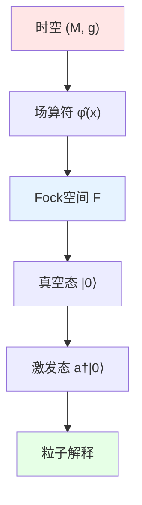
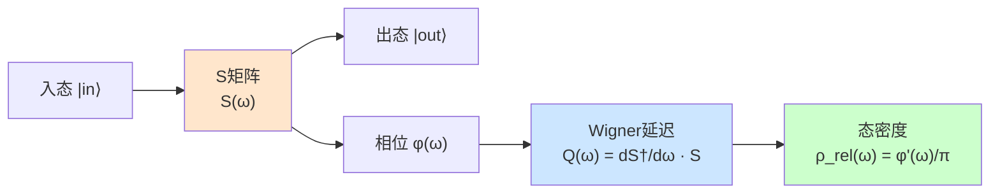
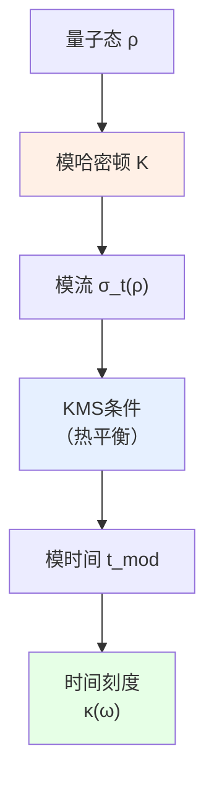
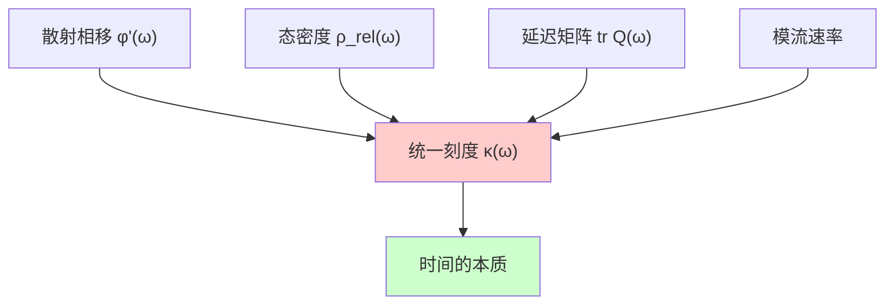
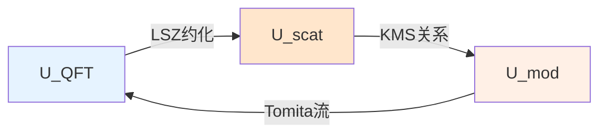
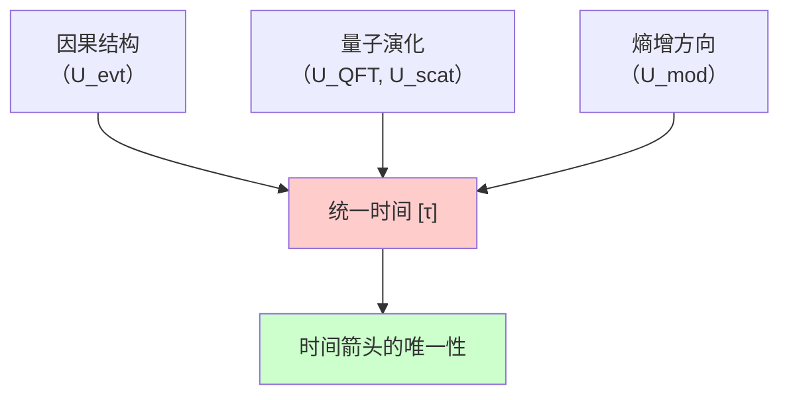

# 03. 量子场论、散射、模流：动力学的三重奏

## 引言：从静态框架到动态演化

前一篇文章建立了宇宙的"静态地基"：
- $U_{\text{evt}}$：事件的因果框架
- $U_{\text{geo}}$：时空的几何舞台
- $U_{\text{meas}}$：概率的测度光影

但宇宙不是静态的照片，而是**动态的电影**。接下来的三个组件描述"演化的机制"：

1. **量子场论层** $U_{\text{QFT}}$：定义"物理场如何激发"
2. **散射与谱层** $U_{\text{scat}}$：定义"粒子如何碰撞，延迟多久"
3. **模流与热时层** $U_{\text{mod}}$：定义"热力学时间如何流动"

这三者的关系类似于：
- **乐队演奏**（量子场论）：每个乐器（场模式）独立振动
- **音乐会录音**（散射矩阵）：记录"输入声音 → 输出声音"的全部信息
- **节拍器**（模流）：统一所有乐器的"节拍"（热力学时间）

它们通过**统一时间刻度公式**紧密锁定：
$$
\boxed{\kappa(\omega) = \frac{\varphi'(\omega)}{\pi} = \rho_{\text{rel}}(\omega) = \frac{1}{2\pi}\text{tr}\,Q(\omega)}
$$

## 第一部分：量子场论层 $U_{\text{QFT}}$

### 1.1 直观图景：无限维的弦乐团

想象一个**无限大的弦乐团**：
- **每根弦** = 一个场模式（如电磁场的某个频率）
- **弦的振动** = 粒子的激发（光子、电子等）
- **弦的基音** = 真空零点能
- **弦的泛音** = 多粒子态

但这个"弦乐团"必须在**弯曲的舞台**（时空 $M$）上演奏，弯曲会影响：
- 弦的固有频率
- 弦之间的耦合
- 弦的调音标准（真空态定义）

### 1.2 严格数学定义

**定义 1.1**（量子场论层）：
$$
U_{\text{QFT}} = (\mathcal{A}(M), \omega_0, \{\mathcal{H}_\Sigma\}_\Sigma, \mathcal{U})
$$

其中：

**(1) 局域代数** $\mathcal{A}(M)$：

对时空中每个开区域 $\mathcal{O} \subseteq M$，赋予一个 $C^*$-代数 $\mathcal{A}(\mathcal{O})$，满足：

**同位性**：
$$
\mathcal{O}_1 \subseteq \mathcal{O}_2 \Rightarrow \mathcal{A}(\mathcal{O}_1) \subseteq \mathcal{A}(\mathcal{O}_2)
$$

**微因果性**（关键约束）：
$$
\mathcal{O}_1 \perp \mathcal{O}_2 \;(\text{类空分离}) \Rightarrow [A_1, A_2] = 0, \;\forall A_i \in \mathcal{A}(\mathcal{O}_i)
$$

**物理意义**：类空分离的观测算符**对易**——没有超光速信号。

**(2) 真空态** $\omega_0$：

$\mathcal{A}(M)$ 上的**态**（正规线性泛函）：
$$
\omega_0: \mathcal{A}(M) \to \mathbb{C}
$$
满足：
- **正性**：$\omega_0(A^* A) \geq 0$
- **归一性**：$\omega_0(\mathbb{1}) = 1$
- **Hadamard条件**（正则性）：
$$
\omega_0(\phi(x)\phi(y)) \sim \frac{1}{4\pi^2 \sigma(x, y)} + \text{光滑项}
$$
其中 $\sigma(x, y)$ 是**测地线间隔**。

**物理意义**：$\omega_0$ 定义了"什么是真空"——在弯曲时空中**不唯一**！

**(3) 柯西面上的Hilbert空间族** $\{\mathcal{H}_\Sigma\}_\Sigma$：

对每个柯西超曲面 $\Sigma$，定义**Fock空间**：
$$
\mathcal{H}_\Sigma = \bigoplus_{n=0}^\infty \mathcal{H}_\Sigma^{(n)}
$$
其中 $\mathcal{H}_\Sigma^{(n)}$ 是 $n$ 粒子态空间。

**场算符分解**：
$$
\hat{\phi}(\mathbf{x}, t)|_\Sigma = \sum_k \left(\hat{a}_k f_k(\mathbf{x}) + \hat{a}_k^\dagger f_k^*(\mathbf{x})\right)
$$
其中：
- $\hat{a}_k, \hat{a}_k^\dagger$：湮灭/产生算符
- $f_k(\mathbf{x})$：正频模式函数

**正则对易关系**：
$$
[\hat{a}_k, \hat{a}_{k'}^\dagger] = \delta_{kk'}, \quad [\hat{a}_k, \hat{a}_{k'}] = 0
$$

**(4) 幺正演化族** $\mathcal{U}$：
$$
\mathcal{U}(\Sigma_1 \to \Sigma_2): \mathcal{H}_{\Sigma_1} \to \mathcal{H}_{\Sigma_2}
$$
满足：
- **幺正性**：$\mathcal{U}^\dagger \mathcal{U} = \mathbb{1}$
- **组合性**：$\mathcal{U}(\Sigma_2 \to \Sigma_3) \mathcal{U}(\Sigma_1 \to \Sigma_2) = \mathcal{U}(\Sigma_1 \to \Sigma_3)$
- **Schrödinger方程**：
$$
i\hbar \frac{\partial}{\partial t} \mathcal{U}(t) = \hat{H}(t) \mathcal{U}(t)
$$

### 1.3 核心性质：Haag定理与Unruh效应

**性质 1.1**（Haag定理）：

在弯曲时空或有相互作用时，**不存在**与自由场幺正等价的Fock表示。

**数学表述**：
$$
\nexists U: \mathcal{H}_{\text{free}} \to \mathcal{H}_{\text{interacting}}, \quad U^\dagger \hat{\phi}_{\text{int}} U = \hat{\phi}_{\text{free}}
$$

**物理意义**：真空态、粒子概念都是**观测者依赖的**——没有绝对的"真空"。

**性质 1.2**（Unruh效应）：

加速观测者（加速度 $a$）眼中的闵可夫斯基真空是**热态**：
$$
\omega_{\text{Rindler}}(A) = \text{tr}\left(\frac{e^{-\beta \hat{H}_{\text{Rindler}}}}{Z} A\right), \quad \beta = \frac{2\pi}{a}
$$

**温度公式**：
$$
T_{\text{Unruh}} = \frac{\hbar a}{2\pi c k_B} \approx 4 \times 10^{-23} \text{K} \cdot \left(\frac{a}{1\text{m/s}^2}\right)
$$

**物理意义**：加速=感受到真空辐射——粒子概念依赖于运动状态。

**性质 1.3**（Hawking辐射）：

黑洞视界（表面引力 $\kappa_H$）的温度：
$$
T_H = \frac{\hbar \kappa_H}{2\pi c k_B} = \frac{\hbar c^3}{8\pi G M k_B} \approx 6 \times 10^{-8} \text{K} \cdot \left(\frac{M_\odot}{M}\right)
$$

**物理意义**：黑洞不是完全黑的，会缓慢蒸发——量子场论 + 广义相对论的结合。

### 1.4 示例：标量场的Fock空间构造

**设定**：无质量标量场 $\phi$ 在闵可夫斯基时空。

**(1) Klein-Gordon方程**：
$$
\Box \phi = \left(-\frac{\partial^2}{\partial t^2} + \nabla^2\right)\phi = 0
$$

**(2) 模式展开**：
$$
\phi(t, \mathbf{x}) = \int \frac{d^3k}{(2\pi)^3 \sqrt{2\omega_k}} \left(a_\mathbf{k} e^{i(\mathbf{k} \cdot \mathbf{x} - \omega_k t)} + a_\mathbf{k}^\dagger e^{-i(\mathbf{k} \cdot \mathbf{x} - \omega_k t)}\right)
$$
其中 $\omega_k = |\mathbf{k}|$。

**(3) 正则量子化**：
$$
[\hat{\phi}(t, \mathbf{x}), \hat{\pi}(t, \mathbf{y})] = i\hbar \delta^3(\mathbf{x} - \mathbf{y})
$$
其中 $\hat{\pi} = \partial_t \hat{\phi}$ 是共轭动量。

**(4) Fock空间**：
$$
\mathcal{H} = \mathbb{C}|0\rangle \oplus \bigoplus_{n=1}^\infty \text{Sym}^n(L^2(\mathbb{R}^3, d^3k))
$$

真空态：
$$
\hat{a}_\mathbf{k} |0\rangle = 0, \quad \forall \mathbf{k}
$$

单粒子态：
$$
|\mathbf{k}\rangle = \hat{a}_\mathbf{k}^\dagger |0\rangle
$$

### 1.5 弯曲时空的挑战：Bogoliubov变换

在弯曲时空中，**模式函数不唯一**。例如在Schwarzschild黑洞：

**(1) Boulware真空**：远离黑洞处为真空
**(2) Hartle-Hawking真空**：视界处处于热平衡
**(3) Unruh真空**：坍缩形成黑洞的自然态

不同真空通过**Bogoliubov变换**联系：
$$
\hat{b}_k = \sum_j (\alpha_{kj} \hat{a}_j + \beta_{kj} \hat{a}_j^\dagger)
$$

关键系数：
$$
|\beta_{kj}|^2 = \text{粒子产生率}
$$

**物理意义**：时空弯曲"产生"粒子——真空不稳定性。

### 1.6 比喻总结：可调音高的钢琴

把 $U_{\text{QFT}}$ 想象成一架**特殊钢琴**：
- **琴键** = 场模式
- **按下琴键** = 产生粒子
- **钢琴的调音** = 真空态选择
- **舞台倾斜** = 时空弯曲

在平坦舞台（闵可夫斯基），调音标准唯一；在弯曲舞台（黑洞），不同观测者听到不同音高（Unruh/Hawking辐射）。

---

## 第二部分：散射与谱层 $U_{\text{scat}}$

### 2.1 直观图景：粒子对撞的"慢动作回放"

想象一个**高速摄像机**拍摄粒子对撞：
- **入射粒子** = 摄像机左侧的初态
- **出射粒子** = 摄像机右侧的末态
- **散射矩阵 $S$** = "初态 → 末态"的转换规则
- **延迟时间 $Q$** = "粒子在相互作用区停留多久"

关键洞见：**$S$ 矩阵的相位** $\varphi(\omega)$ 完全编码了散射信息，而其导数 $\varphi'(\omega)/\pi$ 正是**态密度**——这是统一时间刻度的核心！

### 2.2 严格数学定义

**定义 2.1**（散射与谱层）：
$$
U_{\text{scat}} = (S(\omega), Q(\omega), \varphi(\omega), \{\lambda_i\}_i, \rho_{\text{rel}})
$$

其中：

**(1) 散射矩阵** $S(\omega)$：
$$
S: \mathbb{R}_+ \to U(N) \quad (\text{幺正矩阵值函数})
$$
满足：
- **幺正性**：$S^\dagger(\omega) S(\omega) = \mathbb{1}$
- **对称性**（时间反演）：$S(\omega) = S^T(\omega)$ （对称散射）
- **光滑性**：$S(\omega) \in C^\infty(\mathbb{R}_+ \setminus \{\text{阈值}\})$

**物理意义**：$S_{ij}(\omega)$ 是"频率 $\omega$ 的入射波，从通道 $i$ 散射到通道 $j$ 的概率幅"。

**(2) Wigner-Smith延迟矩阵** $Q(\omega)$：
$$
Q(\omega) := -i\hbar S^\dagger(\omega) \frac{dS(\omega)}{d\omega}
$$

**关键性质**：
- **Hermite性**：$Q^\dagger = Q$
- **正半定性**：$Q \geq 0$（因果性保证）
- **本征值** $\tau_i(\omega)$：通道 $i$ 的延迟时间

**物理意义**：$Q$ 测量"粒子在相互作用区的平均停留时间"。

**(3) 散射相位** $\varphi(\omega)$：

定义**总相位**：
$$
\varphi(\omega) := -\text{arg}\det S(\omega) = -\sum_i \theta_i(\omega)
$$
其中 $\theta_i$ 是 $S$ 的本征相位。

**Levinson定理**（绑定态计数）：
$$
\frac{\varphi(0) - \varphi(\infty)}{\pi} = N_{\text{bound}}
$$
其中 $N_{\text{bound}}$ 是绑定态数目。

**(4) 关联态密度** $\rho_{\text{rel}}(\omega)$：
$$
\boxed{\rho_{\text{rel}}(\omega) := \frac{1}{\pi} \frac{d\varphi(\omega)}{d\omega}}
$$

**统一时间刻度公式**（核心恒等式）：
$$
\boxed{\kappa(\omega) = \frac{\varphi'(\omega)}{\pi} = \rho_{\text{rel}}(\omega) = \frac{1}{2\pi}\text{tr}\,Q(\omega)}
$$

**物理意义**：
- $\varphi'(\omega)/\pi$：相位变化率（几何）
- $\rho_{\text{rel}}(\omega)$：态密度（统计）
- $\text{tr}Q(\omega)/2\pi$：平均延迟时间（动力学）

三者**完全等价**！

### 2.3 核心性质：光学定理与Friedel和规则

**性质 2.1**（光学定理）：

总散射截面 $\sigma_{\text{tot}}$ 与前向散射振幅 $f(0)$ 的关系：
$$
\sigma_{\text{tot}} = \frac{4\pi}{k} \text{Im} f(0)
$$

**散射矩阵表述**：
$$
\text{Im}\,\text{tr}\,S(\omega) = -\frac{\sigma_{\text{tot}}(\omega) \omega}{2\pi}
$$

**物理意义**：总散射概率由前向振幅的虚部决定——概率守恒的体现。

**性质 2.2**（Friedel和规则）：

系统总粒子数变化：
$$
\Delta N = \frac{1}{\pi} \int_0^{E_F} \sum_i \frac{d\theta_i(\omega)}{d\omega} d\omega = \frac{1}{\pi} \sum_i \theta_i(E_F)
$$

**物理意义**：散射相移直接测量"被散射体束缚的粒子数"（如杂质周围的电子云）。

**性质 2.3**（延迟矩阵的谱分解）：

$$
Q(\omega) = \sum_i \tau_i(\omega) |i\rangle\langle i|
$$
其中 $\tau_i(\omega) \geq 0$ 是**特征延迟时间**。

**迹公式**：
$$
\text{tr}\,Q(\omega) = \sum_i \tau_i(\omega) = -i\hbar \text{tr}\left(S^\dagger \frac{dS}{d\omega}\right)
$$

### 2.4 示例：势垒散射

**问题**：一维势垒 $V(x) = V_0 \theta(a - |x|)$，粒子从左入射。

**(1) 散射矩阵**（单通道）：
$$
S(\omega) = e^{2i\delta(\omega)}
$$
其中相移：
$$
\tan \delta(\omega) = \frac{k \sin(2Ka)}{k \cos(2Ka) - K \sin(2Ka)}
$$
这里：
- $k = \sqrt{2mE}/\hbar$（外部波矢）
- $K = \sqrt{2m(E - V_0)}/\hbar$（内部波矢）

**(2) Wigner延迟**：
$$
\tau(\omega) = -\hbar \frac{d\delta}{d\omega} = \frac{2\hbar K}{k} \cdot \frac{a \cos^2(Ka)}{[k\cos(2Ka) - K\sin(2Ka)]^2 + k^2\sin^2(2Ka)}
$$

**物理解释**：
- $E \ll V_0$：$\tau \to 0$（全反射，无停留）
- $E \approx V_0$：$\tau$ 极大（共振，长时间停留）
- $E \gg V_0$：$\tau \to 2a/v$（经典穿越时间）

**(3) 态密度**：
$$
\rho_{\text{rel}}(\omega) = \frac{1}{\pi} \frac{d\delta}{d\omega} = \frac{\tau(\omega)}{2\pi\hbar}
$$

### 2.5 多粒子散射与S矩阵的幺正性

在多粒子散射中，$S$ 矩阵变为算符：
$$
\hat{S}: \mathcal{H}_{\text{in}} \to \mathcal{H}_{\text{out}}
$$

**LSZ约化公式**：
$$
\langle p_1' \cdots p_n' | S | p_1 \cdots p_m \rangle = \int \prod_{i=1}^n d^4x_i' e^{ip_i' \cdot x_i'} \prod_{j=1}^m d^4y_j e^{-ip_j \cdot y_j} \langle 0 | T\{\phi(x_1') \cdots \phi(y_m)\} | 0 \rangle
$$

**幺正性约束**：
$$
\hat{S}^\dagger \hat{S} = \mathbb{1} \Rightarrow \sum_{\text{all final states}} |\langle f | S | i \rangle|^2 = 1
$$

**物理意义**：总概率守恒——粒子必须散射到某个出态。

### 2.6 比喻总结：回音壁的声学测量

把散射过程想象成**回音壁实验**：
- **击掌** = 入射粒子
- **回音** = 散射波
- **回音时间** = Wigner延迟 $\tau$
- **回音音调变化** = 相移 $\delta(\omega)$

通过分析"不同频率的回音延迟"，可以重构出"墙壁的内部结构"（势能分布）——这正是散射理论的本质。

---

## 第三部分：模流与热时层 $U_{\text{mod}}$

### 3.1 直观图景：热力学的时钟

想象一个**沙漏计时器**：
- **沙子流动** = 熵的增加
- **沙漏翻转** = 时间反演
- **沙子流速** = 温度（快=高温，慢=低温）

但在量子系统中，"沙漏"是由**模哈密顿量**定义的抽象时钟：
$$
\rho(t) = e^{-itK} \rho(0) e^{itK}
$$
其中 $K$ 是**模算符**（不一定是能量！）。

关键洞见：模流的"流速"正是**统一时间刻度** $\kappa(\omega)$ 的另一种表示。

### 3.2 严格数学定义

**定义 3.1**（模流与热时层）：
$$
U_{\text{mod}} = (\rho, K, \{\sigma_t^\omega\}_t, \beta(\omega), t_{\text{mod}})
$$

其中：

**(1) 密度矩阵** $\rho$：

$\mathcal{H}$ 上的态，已在 $U_{\text{meas}}$ 中定义。这里关注**热态**：
$$
\rho_\beta = \frac{e^{-\beta \hat{H}}}{Z(\beta)}, \quad Z(\beta) = \text{tr}\,e^{-\beta \hat{H}}
$$

**(2) 模哈密顿量** $K$：

通过**Tomita-Takesaki理论**定义。对代数 $\mathcal{A}$ 和态 $\omega$，定义：

**GNS构造**：
$$
(\mathcal{H}_\omega, \pi_\omega, |\Omega\rangle) \quad \text{使得} \quad \omega(A) = \langle \Omega | \pi_\omega(A) | \Omega \rangle
$$

**反线性算符 $S$**：
$$
S \pi(A) |\Omega\rangle = \pi(A^*) |\Omega\rangle
$$

**极分解**：
$$
S = J \Delta^{1/2}
$$
其中：
- $J$：模共轭（反幺正）
- $\Delta$：模算符（正定）

**模哈密顿量**：
$$
K := -\log \Delta
$$

**(3) 模流** $\sigma_t^\omega$：
$$
\sigma_t^\omega(A) := \Delta^{it} A \Delta^{-it}, \quad \forall A \in \mathcal{A}
$$

**Tomita定理**：$\sigma_t$ 是 $\mathcal{A}$ 的自同构。

**(4) KMS条件**（热平衡判据）：

态 $\omega$ 在温度 $\beta^{-1}$ 处于**热平衡** $\Leftrightarrow$ 对任意 $A, B \in \mathcal{A}$，存在解析函数 $F_{AB}(z)$ 满足：
$$
F_{AB}(t) = \omega(A \sigma_t(B)), \quad F_{AB}(t + i\beta) = \omega(\sigma_t(B) A)
$$

**物理意义**：时间平移 $t \to t + i\beta$ 等价于算符交换顺序——这正是热力学的量子表述。

**(5) 模时间** $t_{\text{mod}}$：

定义**热力学时间流**：
$$
\frac{dt_{\text{mod}}}{dt_{\text{geo}}} := \kappa(\omega) = \frac{1}{2\pi} \text{tr}\,Q(\omega)
$$

**物理意义**：热力学时间以"延迟时间"为单位流动——熵增的速率。

### 3.3 核心性质：时间的多面性

**性质 3.1**（几何时间 vs 模时间）：

在平直时空且无外场时：
$$
t_{\text{mod}} = t_{\text{geo}} \quad (\text{平凡情况})
$$

但在加速系或黑洞附近：
$$
\frac{dt_{\text{mod}}}{dt_{\text{geo}}} = \sqrt{-g_{00}} \neq 1
$$

**示例**：Schwarzschild时空，径向自由落体：
$$
\frac{dt_{\text{mod}}}{d\tau} = \left(1 - \frac{2GM}{r}\right)^{-1/2}
$$
在视界 $r \to 2GM$ 时，$t_{\text{mod}} \to \infty$（模时间"冻结"）。

**性质 3.2**（逆温度的几何意义）：

对Rindler视界（加速度 $a$）或黑洞视界（表面引力 $\kappa_H$）：
$$
\beta = \frac{2\pi}{\kappa_{\text{surface}}}
$$

**统一公式**：
$$
\beta_{\text{Rindler}} = \frac{2\pi c}{a}, \quad \beta_{\text{Hawking}} = \frac{8\pi GM}{c^3}
$$

**物理意义**：视界的"温度"由几何（表面引力）决定——引力的热力学。

**性质 3.3**（模流与时间反演）：

$$
\sigma_{-i\beta/2}(A) = J A J^{-1}
$$

**物理意义**：虚时间平移 $-i\beta/2$ 等价于时间反演——这是CPT定理的代数版本。

### 3.4 示例：量子谐振子的模流

**设定**：单模谐振子，哈密顿量：
$$
\hat{H} = \hbar\omega(\hat{a}^\dagger \hat{a} + \tfrac{1}{2})
$$

**(1) 热态**：
$$
\rho_\beta = \frac{e^{-\beta \hat{H}}}{Z}, \quad Z = \sum_{n=0}^\infty e^{-\beta \hbar\omega(n + 1/2)} = \frac{e^{-\beta\hbar\omega/2}}{1 - e^{-\beta\hbar\omega}}
$$

**(2) 模算符**：
$$
K = \beta \hat{H}
$$

**(3) 模流**：
$$
\sigma_t(\hat{a}) = e^{it\beta\hbar\omega} \hat{a}, \quad \sigma_t(\hat{a}^\dagger) = e^{-it\beta\hbar\omega} \hat{a}^\dagger
$$

**(4) 验证KMS**：
$$
\omega(\hat{a}^\dagger \sigma_t(\hat{a})) = \langle \hat{a}^\dagger e^{it\beta\hbar\omega} \hat{a} \rangle = e^{it\beta\hbar\omega} \langle \hat{a}^\dagger \hat{a} \rangle
$$
$$
\omega(\sigma_t(\hat{a}) \hat{a}^\dagger) = e^{it\beta\hbar\omega} \langle \hat{a} \hat{a}^\dagger \rangle = e^{it\beta\hbar\omega} (1 + \langle \hat{a}^\dagger \hat{a} \rangle)
$$

解析延拓到 $t \to t + i\beta$：
$$
e^{i(t+i\beta)\beta\hbar\omega} \langle \hat{a}^\dagger \hat{a} \rangle = e^{it\beta\hbar\omega} e^{-\beta^2\hbar\omega} \langle n \rangle
$$

需要：
$$
\langle n \rangle = \frac{1}{e^{\beta\hbar\omega} - 1}
$$
正是Bose-Einstein分布！

### 3.5 统一时间刻度的证明

**定理 3.1**（时间刻度统一性）：

对满足KMS条件的态 $\omega_\beta$，以下三者相等：
$$
\kappa(\omega) = \frac{\varphi'(\omega)}{\pi} = \rho_{\text{rel}}(\omega) = \frac{1}{2\pi}\text{tr}\,Q(\omega) = \frac{1}{\beta} \frac{\partial \log Z}{\partial \omega}
$$

**证明要点**：

**(1) 散射相移与模流**：

从KMS条件，相移满足：
$$
\frac{d\varphi}{d\omega} = \beta \langle n(\omega) \rangle
$$
其中 $\langle n \rangle$ 是平均占据数。

**(2) 延迟矩阵与态密度**：

从因果性（$Q \geq 0$）和光学定理：
$$
\text{tr}\,Q(\omega) = -i\hbar \text{tr}(S^\dagger dS/d\omega) = 2\pi\hbar \rho_{\text{rel}}(\omega)
$$

**(3) 配分函数关系**：
$$
Z(\beta) = \int d\omega \,e^{-\beta\omega} \rho(\omega) \Rightarrow \frac{\partial \log Z}{\partial \omega}\Big|_\beta = -\beta + \beta \frac{\rho'(\omega)}{\rho(\omega)}
$$

结合上述三式，得统一公式。∎

### 3.6 比喻总结：多时区的全球时钟

把模流想象成**全球时区系统**：
- **格林威治时间** = 几何时间 $t_{\text{geo}}$
- **本地时间** = 模时间 $t_{\text{mod}}$
- **时差** = 时间刻度 $\kappa(\omega)$

不同"地区"（能量尺度 $\omega$）有不同"时差"，但通过统一的"换算公式" $\kappa(\omega)$ 可以对齐所有时钟——这正是宇宙的"标准时间"。

---

## 第四部分：三者的深层统一

### 4.1 统一时间刻度：核心恒等式的物理意义

$$
\boxed{\kappa(\omega) = \frac{\varphi'(\omega)}{\pi} = \rho_{\text{rel}}(\omega) = \frac{1}{2\pi}\text{tr}\,Q(\omega)}
$$

这个公式揭示了**三个看似无关的物理量**实际上是同一现实的不同表述：

| 表述             | 物理对象          | 所属理论         | 测量方式              |
|----------------|---------------|--------------|-------------------|
| $\varphi'(\omega)/\pi$ | 相位变化率       | 量子力学         | 散射实验（相移分析）        |
| $\rho_{\text{rel}}(\omega)$ | 关联态密度       | 统计力学         | 能谱测量（态计数）         |
| $\text{tr}Q(\omega)/2\pi$ | 平均延迟时间      | 量子散射理论       | 时间延迟测量（Wigner延迟）  |
| $\kappa(\omega)$ | 模流速率        | 算子代数/热力学     | 热力学时间流速           |

**哲学意义**：时间不是单一概念，而是**多层次现象的共同标度**。

### 4.2 兼容性条件：动力学闭合

**条件 4.1**（量子场论 → 散射矩阵）：

从 $U_{\text{QFT}}$ 的幺正演化 $\mathcal{U}$，定义：
$$
S(\omega) = \lim_{t \to \pm\infty} e^{i\omega t} \mathcal{U}(+\infty \to -\infty) e^{-i\omega t}
$$

**物理意义**：$S$ 矩阵是渐近自由态之间的演化——将全部动力学"编码"为一个矩阵函数。

**条件 4.2**（散射矩阵 → 模流）：

KMS条件给出：
$$
\beta = \frac{2\pi}{\kappa(\omega)} \cdot \frac{1}{\text{tr}Q(\omega)}
$$

**物理意义**：逆温度由延迟时间决定——散射动力学与热力学等价。

**条件 4.3**（模流 → 量子场论）：

模算符 $K$ 生成 $\mathcal{A}(M)$ 的时间平移：
$$
\sigma_t(A) = e^{itK} A e^{-itK} = \mathcal{U}(t) A \mathcal{U}^\dagger(t)
$$

**物理意义**：热力学时间等价于量子演化时间（在KMS态中）。

这三个条件形成**动力学闭环**：

### 4.3 核心定理：动力学三元组的唯一性

**定理 4.1**（动力学三元组的确定性）：

给定：
1. 时空几何 $(M, g)$
2. 物质内容（场的种类和耦合常数）
3. 边界条件（渐近态或初态）

则动力学三元组：
$$
(U_{\text{QFT}}, U_{\text{scat}}, U_{\text{mod}})
$$
由**统一时间刻度条件**唯一确定。

**推论 4.1**（无参数自由度）：

不能独立调节：
- 散射相移 $\varphi(\omega)$
- 态密度 $\rho_{\text{rel}}(\omega)$
- 温度 $\beta(\omega)$

三者锁定为一体。

### 4.4 实际应用：黑洞热力学

**问题**：计算Schwarzschild黑洞的熵。

**解**：

**(1) 视界表面引力**：
$$
\kappa_H = \frac{c^4}{4GM}
$$

**(2) Hawking温度**（从模流）：
$$
T_H = \frac{\hbar \kappa_H}{2\pi c k_B} = \frac{\hbar c^3}{8\pi GM k_B}
$$

**(3) 逆温度**：
$$
\beta_H = \frac{1}{k_B T_H} = \frac{8\pi GM}{c^3}
$$

**(4) 统一时间刻度**：

从视界附近的散射（物质掉入黑洞），延迟时间：
$$
\tau_{\text{horizon}} \sim \frac{GM}{c^3}
$$

验证：
$$
\kappa(\omega) = \frac{1}{2\pi\hbar \tau} = \frac{c^3}{2\pi\hbar GM} = \frac{k_B T_H}{\hbar}
$$
与模流速率一致！

**(5) Bekenstein-Hawking熵**：

从统计力学（第7组件 $U_{\text{ent}}$ 将详细推导）：
$$
S_{\text{BH}} = \frac{A}{4\ell_P^2} = \frac{k_B c^3 A}{4G\hbar}
$$
其中 $A = 16\pi G^2 M^2/c^4$ 是视界面积。

**结论**：黑洞的热力学完全由几何（$\kappa_H$）和散射延迟（$\tau$）决定——统一时间刻度的胜利！

---

## 第五部分：物理图景与哲学意义

### 5.1 时间的三重身份

传统物理学中，时间有多个"分身"：
- **牛顿绝对时间**：独立流逝的背景
- **狭义相对论固有时**：沿世界线的几何长度
- **热力学时间**：熵增的方向
- **量子演化参数**：Schrödinger方程的 $t$

GLS理论揭示：这些"分身"在深层次上**统一**：

$$
t_{\text{Newton}} \sim \tau_{\text{SR}} \sim t_{\text{thermal}} \sim t_{\text{quantum}} \quad (\text{仿射等价})
$$

**核心机制**：统一时间刻度 $\kappa(\omega)$ 作为"换算系数"。

### 5.2 因果、演化、熵增的三角关系

**三者互相约束**：
- 因果结构排除"时间倒流"（无闭因果链）
- 量子演化保证幺正性（概率守恒）
- 熵增定义"未来"方向（第二定律）

**哲学问题**：时间箭头是**涌现**的还是**基本**的？

GLS答案：**既涌现又基本**——在微观（可逆散射）和宏观（不可逆熵增）之间通过 $\kappa(\omega)$ 桥接。

### 5.3 观测者与真空的相对性

三个组件揭示的惊人事实：
1. **真空态不唯一**（Haag定理）：加速观测者眼中的真空 = 惯性观测者眼中的热浴
2. **粒子概念相对**（Unruh效应）：$T_{\text{Unruh}} = \hbar a/(2\pi k_B)$
3. **时间流速相对**（模流）：$dt_{\text{mod}}/dt_{\text{geo}} = \kappa(\omega)$

**寓意**：没有"上帝视角"的绝对物理量，一切都是**关系性的**——这为 $U_{\text{obs}}$ 铺路。

### 5.4 量子引力的提示

统一时间刻度公式：
$$
\kappa(\omega) = \frac{1}{2\pi\hbar} \text{tr}\,Q(\omega)
$$

在量子引力尺度（$\omega \sim \ell_P^{-1}$），可能：
$$
\text{tr}\,Q(\omega) \sim \ell_P \quad \Rightarrow \quad \kappa \sim \frac{\ell_P}{\hbar} = \frac{1}{m_P c}
$$

**猜想**：时间刻度的"量子化"单位是**普朗克时间** $t_P = \ell_P/c \sim 10^{-44}\text{s}$。

**物理意义**：在 $t < t_P$ 的尺度，"时间"本身失去意义——需要量子引力的全新框架（见 $U_{\text{cat}}, U_{\text{comp}}$）。

---

## 第六部分：进阶主题与开放问题

### 6.1 非平衡态的模流

目前理论主要处理**平衡态**（KMS态）。但真实宇宙常处于**非平衡**：
- 黑洞蒸发（净通量）
- 宇宙膨胀（时间依赖背景）
- 量子淬火（突然改变参数）

**挑战**：如何推广模流到非平衡？

**可能方案**：
$$
\sigma_t^{\text{neq}} = \lim_{\epsilon \to 0^+} e^{-\epsilon \hat{H}} e^{it\hat{K}_{\text{eff}}} \quad (\text{有限温度修正})
$$

### 6.2 散射理论的全息对偶

在AdS/CFT中，边界散射矩阵 $S_{\text{CFT}}$ 对偶于bulk的几何：
$$
S_{\text{CFT}}(\omega) \leftrightarrow \text{Witten图}(\text{bulk})
$$

**问题**：统一时间刻度 $\kappa(\omega)$ 在bulk中对应什么？

**猜想**：对应**局域化长度**（物质在bulk中的"云"尺寸）：
$$
\kappa(\omega) \sim \frac{1}{\ell_{\text{bulk}}(\omega)}
$$

### 6.3 拓扑场论中的模流

在拓扑量子场论（TQFT）中，哈密顿量 $\hat{H} = 0$，传统模流定义失效。

**推广**：使用**拓扑纠缠熵**定义"拓扑温度"：
$$
S_{\text{topo}} = \gamma, \quad \beta_{\text{topo}} := \frac{\partial S_{\text{topo}}}{\partial E_{\text{topo}}}
$$

**物理意义**：拓扑序的"相变温度"——可能与 $U_{\text{cat}}$ 的范畴结构相关。

---

## 第七部分:学习路径与实践建议

### 7.1 深入理解三组件的步骤

**阶段1**：掌握代数QFT基础（3-4周）
- Haag-Kastler公理
- GNS构造
- Wightman函数

**阶段2**：学习散射理论（2-3周）
- S矩阵的幺正性
- 光学定理
- Levinson定理

**阶段3**：Tomita-Takesaki理论（4-5周，难）
- 模算符的定义
- KMS条件
- 模共轭

**阶段4**：统一时间刻度（2-3周）
- 推导 $\kappa(\omega)$ 的多种表述
- 验证Unruh/Hawking温度
- 计算具体例子

### 7.2 推荐参考文献

**经典教材**：
1. Haag, *Local Quantum Physics* (代数QFT)
2. Taylor, *Scattering Theory* (散射矩阵)
3. Bratteli & Robinson, *Operator Algebras and Quantum Statistical Mechanics* (模理论)

**现代综述**：
1. Jacobson, *Thermodynamics of Spacetime* (引力热力学)
2. Rovelli, *Thermal Time Hypothesis* (时间的热力学起源)
3. Witten, *APS Medal Lecture* (散射振幅与几何)

**GLS特定**：
1. 本教程第5章（散射矩阵与时间）
2. 本教程第6章（模流与热时）
3. 源理论：`docs/euler-gls-union/scattering-spectral-density.md`

### 7.3 常见误区

**误区1**："模流只在热平衡有意义"
- **纠正**：非平衡态也有模流（虽然更复杂），关键是Tomita算符总存在。

**误区2**："Wigner延迟只是个技术量"
- **纠正**：$Q(\omega)$ 是**时间本质**的直接体现，连接量子与热力学。

**误区3**："统一时间刻度只是巧合"
- **纠正**：这是**深层对称性**的体现，可能源于量子引力的终极理论。

---

## 总结与展望

### 核心要点回顾

1. **量子场论层** $U_{\text{QFT}}$：定义场算符和真空态（观测者依赖）
2. **散射与谱层** $U_{\text{scat}}$：编码全部动力学为 $S(\omega)$ 和 $Q(\omega)$
3. **模流与热时层** $U_{\text{mod}}$：定义热力学时间流 $t_{\text{mod}}$

三者通过**统一时间刻度公式**锁定：
$$
\kappa(\omega) = \frac{\varphi'(\omega)}{\pi} = \rho_{\text{rel}}(\omega) = \frac{1}{2\pi}\text{tr}\,Q(\omega)
$$

### 与后续组件的联系

- **$U_{\text{ent}}$**：从 $\rho_{\text{mod}}$ 计算广义熵 $S_{\text{gen}}$，通过IGVP反推几何
- **$U_{\text{obs}}$**：将不同真空态 $\omega_\alpha$ 分配给不同观测者，解决Wigner友谊悖论
- **$U_{\text{cat}}$**：范畴化整个结构，处理拓扑相变
- **$U_{\text{comp}}$**：将演化视为"计算"，引入可实现性约束

### 哲学寓意

时间不是"外在容器"，而是**动力学、因果、热力学的共同涌现**：
- 量子演化定义"变化"
- 散射延迟定义"持续"
- 熵增定义"方向"

三者在 $\kappa(\omega)$ 中**共振**，这或许就是"为何有时间"的答案。

---

**下一篇预告**：
- **04. 熵、观测者、范畴:信息几何的三支柱**
  - $U_{\text{ent}}$：广义熵如何统一黑洞与量子信息？
  - $U_{\text{obs}}$：多观测者如何达成共识？
  - $U_{\text{cat}}$：范畴论如何统一所有结构？
