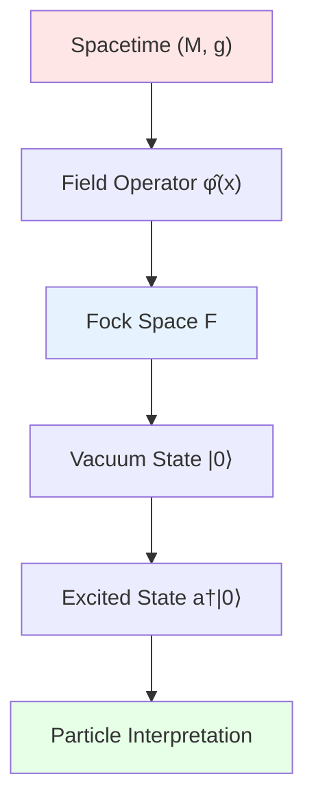
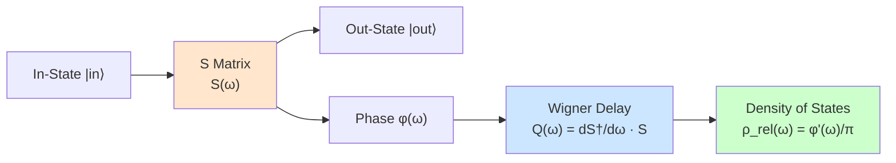
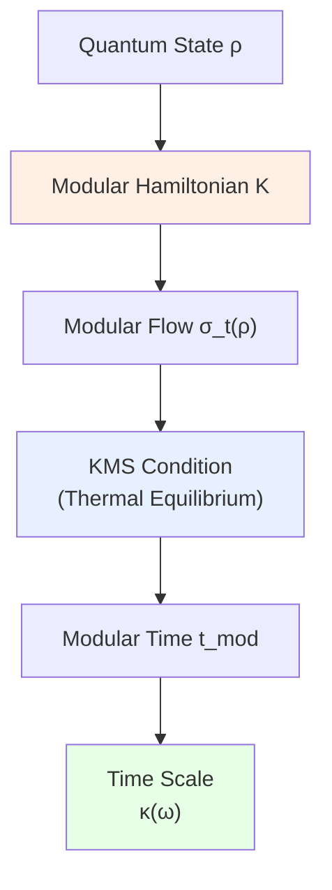
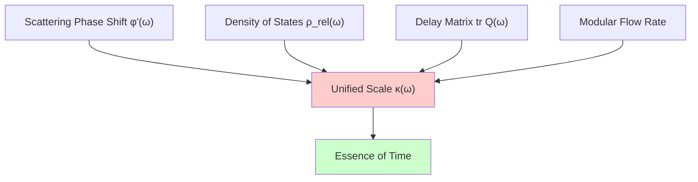
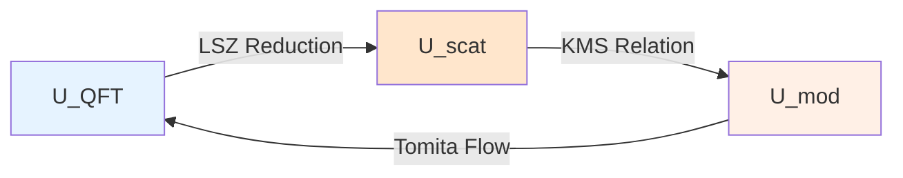
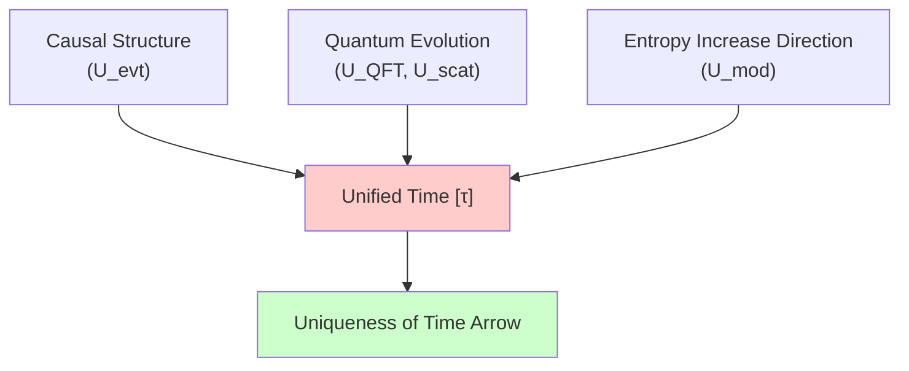

# 03. Quantum Field Theory, Scattering, Modular Flow: Trio of Dynamics

## Introduction: From Static Framework to Dynamic Evolution

Previous article established "static foundation" of universe:
- $U_{\text{evt}}$: Causal framework of events
- $U_{\text{geo}}$: Geometric stage of spacetime
- $U_{\text{meas}}$: Measure lighting of probability

But universe is not static photograph, but **dynamic movie**. Next three components describe "mechanism of evolution":

1. **Quantum Field Theory Layer** $U_{\text{QFT}}$: Defines "how physical fields excite"
2. **Scattering and Spectrum Layer** $U_{\text{scat}}$: Defines "how particles collide, how long delayed"
3. **Modular Flow and Thermal Time Layer** $U_{\text{mod}}$: Defines "how thermodynamic time flows"

Relationship among these three is similar to:
- **Orchestra Performance** (Quantum Field Theory): Each instrument (field mode) vibrates independently
- **Concert Recording** (Scattering Matrix): Records all information of "input sound → output sound"
- **Metronome** (Modular Flow): Unifies "beat" of all instruments (thermodynamic time)

They are tightly locked through **unified time scale formula**:
$$
\boxed{\kappa(\omega) = \frac{\varphi'(\omega)}{\pi} = \rho_{\text{rel}}(\omega) = \frac{1}{2\pi}\text{tr}\,Q(\omega)}
$$

## Part I: Quantum Field Theory Layer $U_{\text{QFT}}$

### 1.1 Intuitive Picture: Infinite-Dimensional String Orchestra

Imagine an **infinitely large string orchestra**:
- **Each string** = a field mode (e.g., some frequency of electromagnetic field)
- **Vibration of string** = excitation of particle (photon, electron, etc.)
- **Fundamental tone of string** = vacuum zero-point energy
- **Overtones of string** = multi-particle states

But this "string orchestra" must perform on **curved stage** (spacetime $M$), curvature affects:
- Natural frequency of strings
- Coupling between strings
- Tuning standard of strings (vacuum state definition)

### 1.2 Strict Mathematical Definition

**Definition 1.1** (Quantum Field Theory Layer):
$$
U_{\text{QFT}} = (\mathcal{A}(M), \omega_0, \{\mathcal{H}_\Sigma\}_\Sigma, \mathcal{U})
$$

where:

**(1) Local Algebra** $\mathcal{A}(M)$:

For each open region $\mathcal{O} \subseteq M$ in spacetime, assign a $C^*$-algebra $\mathcal{A}(\mathcal{O})$, satisfying:

**Isotony**:
$$
\mathcal{O}_1 \subseteq \mathcal{O}_2 \Rightarrow \mathcal{A}(\mathcal{O}_1) \subseteq \mathcal{A}(\mathcal{O}_2)
$$

**Microcausality** (Key Constraint):
$$
\mathcal{O}_1 \perp \mathcal{O}_2 \;(\text{spacelike separated}) \Rightarrow [A_1, A_2] = 0, \;\forall A_i \in \mathcal{A}(\mathcal{O}_i)
$$

**Physical Meaning**: Spacelike separated observation operators **commute**—no superluminal signals.

**(2) Vacuum State** $\omega_0$:

**State** (normalized linear functional) on $\mathcal{A}(M)$:
$$
\omega_0: \mathcal{A}(M) \to \mathbb{C}
$$
satisfying:
- **Positivity**: $\omega_0(A^* A) \geq 0$
- **Normalization**: $\omega_0(\mathbb{1}) = 1$
- **Hadamard Condition** (regularity):
$$
\omega_0(\phi(x)\phi(y)) \sim \frac{1}{4\pi^2 \sigma(x, y)} + \text{smooth terms}
$$
where $\sigma(x, y)$ is **geodesic interval**.

**Physical Meaning**: $\omega_0$ defines "what is vacuum"—**not unique** in curved spacetime!

**(3) Family of Hilbert Spaces on Cauchy Surfaces** $\{\mathcal{H}_\Sigma\}_\Sigma$:

For each Cauchy hypersurface $\Sigma$, define **Fock space**:
$$
\mathcal{H}_\Sigma = \bigoplus_{n=0}^\infty \mathcal{H}_\Sigma^{(n)}
$$
where $\mathcal{H}_\Sigma^{(n)}$ is $n$-particle state space.

**Field Operator Decomposition**:
$$
\hat{\phi}(\mathbf{x}, t)|_\Sigma = \sum_k \left(\hat{a}_k f_k(\mathbf{x}) + \hat{a}_k^\dagger f_k^*(\mathbf{x})\right)
$$
where:
- $\hat{a}_k, \hat{a}_k^\dagger$: Annihilation/creation operators
- $f_k(\mathbf{x})$: Positive frequency mode functions

**Canonical Commutation Relations**:
$$
[\hat{a}_k, \hat{a}_{k'}^\dagger] = \delta_{kk'}, \quad [\hat{a}_k, \hat{a}_{k'}] = 0
$$

**(4) Unitary Evolution Family** $\mathcal{U}$:
$$
\mathcal{U}(\Sigma_1 \to \Sigma_2): \mathcal{H}_{\Sigma_1} \to \mathcal{H}_{\Sigma_2}
$$
satisfying:
- **Unitarity**: $\mathcal{U}^\dagger \mathcal{U} = \mathbb{1}$
- **Compositionality**: $\mathcal{U}(\Sigma_2 \to \Sigma_3) \mathcal{U}(\Sigma_1 \to \Sigma_2) = \mathcal{U}(\Sigma_1 \to \Sigma_3)$
- **Schrödinger Equation**:
$$
i\hbar \frac{\partial}{\partial t} \mathcal{U}(t) = \hat{H}(t) \mathcal{U}(t)
$$

### 1.3 Core Properties: Haag Theorem and Unruh Effect

**Property 1.1** (Haag Theorem):

In curved spacetime or with interactions, **does not exist** Fock representation unitarily equivalent to free field.

**Mathematical Statement**:
$$
\nexists U: \mathcal{H}_{\text{free}} \to \mathcal{H}_{\text{interacting}}, \quad U^\dagger \hat{\phi}_{\text{int}} U = \hat{\phi}_{\text{free}}
$$

**Physical Meaning**: Vacuum state, particle concept are **observer-dependent**—no absolute "vacuum".

**Property 1.2** (Unruh Effect):

Minkowski vacuum as seen by accelerated observer (acceleration $a$) is **thermal state**:
$$
\omega_{\text{Rindler}}(A) = \text{tr}\left(\frac{e^{-\beta \hat{H}_{\text{Rindler}}}}{Z} A\right), \quad \beta = \frac{2\pi}{a}
$$

**Temperature Formula**:
$$
T_{\text{Unruh}} = \frac{\hbar a}{2\pi c k_B} \approx 4 \times 10^{-23} \text{K} \cdot \left(\frac{a}{1\text{m/s}^2}\right)
$$

**Physical Meaning**: Acceleration = sensing vacuum radiation—particle concept depends on motion state.

**Property 1.3** (Hawking Radiation):

Temperature of black hole horizon (surface gravity $\kappa_H$):
$$
T_H = \frac{\hbar \kappa_H}{2\pi c k_B} = \frac{\hbar c^3}{8\pi G M k_B} \approx 6 \times 10^{-8} \text{K} \cdot \left(\frac{M_\odot}{M}\right)
$$

**Physical Meaning**: Black holes not completely black, slowly evaporate—combination of quantum field theory + general relativity.

### 1.4 Example: Fock Space Construction of Scalar Field

**Setting**: Massless scalar field $\phi$ in Minkowski spacetime.

**(1) Klein-Gordon Equation**:
$$
\Box \phi = \left(-\frac{\partial^2}{\partial t^2} + \nabla^2\right)\phi = 0
$$

**(2) Mode Expansion**:
$$
\phi(t, \mathbf{x}) = \int \frac{d^3k}{(2\pi)^3 \sqrt{2\omega_k}} \left(a_\mathbf{k} e^{i(\mathbf{k} \cdot \mathbf{x} - \omega_k t)} + a_\mathbf{k}^\dagger e^{-i(\mathbf{k} \cdot \mathbf{x} - \omega_k t)}\right)
$$
where $\omega_k = |\mathbf{k}|$.

**(3) Canonical Quantization**:
$$
[\hat{\phi}(t, \mathbf{x}), \hat{\pi}(t, \mathbf{y})] = i\hbar \delta^3(\mathbf{x} - \mathbf{y})
$$
where $\hat{\pi} = \partial_t \hat{\phi}$ is conjugate momentum.

**(4) Fock Space**:
$$
\mathcal{H} = \mathbb{C}|0\rangle \oplus \bigoplus_{n=1}^\infty \text{Sym}^n(L^2(\mathbb{R}^3, d^3k))
$$

Vacuum state:
$$
\hat{a}_\mathbf{k} |0\rangle = 0, \quad \forall \mathbf{k}
$$

Single-particle state:
$$
|\mathbf{k}\rangle = \hat{a}_\mathbf{k}^\dagger |0\rangle
$$

### 1.5 Challenge of Curved Spacetime: Bogoliubov Transformation

In curved spacetime, **mode functions not unique**. For example in Schwarzschild black hole:

**(1) Boulware Vacuum**: Vacuum far from black hole
**(2) Hartle-Hawking Vacuum**: Thermal equilibrium at horizon
**(3) Unruh Vacuum**: Natural state of collapsing black hole

Different vacua connected through **Bogoliubov transformation**:
$$
\hat{b}_k = \sum_j (\alpha_{kj} \hat{a}_j + \beta_{kj} \hat{a}_j^\dagger)
$$

Key coefficient:
$$
|\beta_{kj}|^2 = \text{particle production rate}
$$

**Physical Meaning**: Spacetime curvature "produces" particles—vacuum instability.

### 1.6 Analogy Summary: Piano with Adjustable Pitch

Imagine $U_{\text{QFT}}$ as a **special piano**:
- **Keys** = field modes
- **Pressing key** = producing particle
- **Tuning of piano** = vacuum state selection
- **Stage tilt** = spacetime curvature

On flat stage (Minkowski), tuning standard unique; on curved stage (black hole), different observers hear different pitches (Unruh/Hawking radiation).

---

## Part II: Scattering and Spectrum Layer $U_{\text{scat}}$

### 2.1 Intuitive Picture: "Slow-Motion Replay" of Particle Collision

Imagine a **high-speed camera** filming particle collision:
- **Incoming particles** = initial state on left side of camera
- **Outgoing particles** = final state on right side of camera
- **Scattering matrix $S$** = transformation rule "initial → final"
- **Delay time $Q$** = "how long particles stay in interaction region"

Key insight: **Phase** $\varphi(\omega)$ of $S$ matrix completely encodes scattering information, and its derivative $\varphi'(\omega)/\pi$ is exactly **density of states**—this is core of unified time scale!

### 2.2 Strict Mathematical Definition

**Definition 2.1** (Scattering and Spectrum Layer):
$$
U_{\text{scat}} = (S(\omega), Q(\omega), \varphi(\omega), \{\lambda_i\}_i, \rho_{\text{rel}})
$$

where:

**(1) Scattering Matrix** $S(\omega)$:
$$
S: \mathbb{R}_+ \to U(N) \quad (\text{unitary matrix-valued function})
$$
satisfying:
- **Unitarity**: $S^\dagger(\omega) S(\omega) = \mathbb{1}$
- **Symmetry** (time reversal): $S(\omega) = S^T(\omega)$ (symmetric scattering)
- **Smoothness**: $S(\omega) \in C^\infty(\mathbb{R}_+ \setminus \{\text{thresholds}\})$

**Physical Meaning**: $S_{ij}(\omega)$ is "probability amplitude of incoming wave at frequency $\omega$, scattering from channel $i$ to channel $j$".

**(2) Wigner-Smith Delay Matrix** $Q(\omega)$:
$$
Q(\omega) := -i\hbar S^\dagger(\omega) \frac{dS(\omega)}{d\omega}
$$

**Key Properties**:
- **Hermiticity**: $Q^\dagger = Q$
- **Positive semidefiniteness**: $Q \geq 0$ (causality guarantee)
- **Eigenvalues** $\tau_i(\omega)$: Delay time of channel $i$

**Physical Meaning**: $Q$ measures "average residence time of particles in interaction region".

**(3) Scattering Phase** $\varphi(\omega)$:

Define **total phase**:
$$
\varphi(\omega) := -\text{arg}\det S(\omega) = -\sum_i \theta_i(\omega)
$$
where $\theta_i$ are eigenphases of $S$.

**Levinson Theorem** (bound state counting):
$$
\frac{\varphi(0) - \varphi(\infty)}{\pi} = N_{\text{bound}}
$$
where $N_{\text{bound}}$ is number of bound states.

**(4) Relative Density of States** $\rho_{\text{rel}}(\omega)$:
$$
\boxed{\rho_{\text{rel}}(\omega) := \frac{1}{\pi} \frac{d\varphi(\omega)}{d\omega}}
$$

**Unified Time Scale Formula** (Core Identity):
$$
\boxed{\kappa(\omega) = \frac{\varphi'(\omega)}{\pi} = \rho_{\text{rel}}(\omega) = \frac{1}{2\pi}\text{tr}\,Q(\omega)}
$$

**Physical Meaning**:
- $\varphi'(\omega)/\pi$: Rate of phase change (geometric)
- $\rho_{\text{rel}}(\omega)$: Density of states (statistical)
- $\text{tr}Q(\omega)/2\pi$: Average delay time (dynamical)

Three are **completely equivalent**!

### 2.3 Core Properties: Optical Theorem and Friedel Sum Rule

**Property 2.1** (Optical Theorem):

Relation between total scattering cross-section $\sigma_{\text{tot}}$ and forward scattering amplitude $f(0)$:
$$
\sigma_{\text{tot}} = \frac{4\pi}{k} \text{Im} f(0)
$$

**Scattering Matrix Statement**:
$$
\text{Im}\,\text{tr}\,S(\omega) = -\frac{\sigma_{\text{tot}}(\omega) \omega}{2\pi}
$$

**Physical Meaning**: Total scattering probability determined by imaginary part of forward amplitude—manifestation of probability conservation.

**Property 2.2** (Friedel Sum Rule):

Change in total particle number:
$$
\Delta N = \frac{1}{\pi} \int_0^{E_F} \sum_i \frac{d\theta_i(\omega)}{d\omega} d\omega = \frac{1}{\pi} \sum_i \theta_i(E_F)
$$

**Physical Meaning**: Scattering phase shift directly measures "number of particles bound by scatterer" (e.g., electron cloud around impurity).

**Property 2.3** (Spectral Decomposition of Delay Matrix):

$$
Q(\omega) = \sum_i \tau_i(\omega) |i\rangle\langle i|
$$
where $\tau_i(\omega) \geq 0$ are **characteristic delay times**.

**Trace Formula**:
$$
\text{tr}\,Q(\omega) = \sum_i \tau_i(\omega) = -i\hbar \text{tr}\left(S^\dagger \frac{dS}{d\omega}\right)
$$

### 2.4 Example: Potential Barrier Scattering

**Problem**: One-dimensional potential barrier $V(x) = V_0 \theta(a - |x|)$, particle incident from left.

**(1) Scattering Matrix** (single channel):
$$
S(\omega) = e^{2i\delta(\omega)}
$$
where phase shift:
$$
\tan \delta(\omega) = \frac{k \sin(2Ka)}{k \cos(2Ka) - K \sin(2Ka)}
$$
here:
- $k = \sqrt{2mE}/\hbar$ (external wavevector)
- $K = \sqrt{2m(E - V_0)}/\hbar$ (internal wavevector)

**(2) Wigner Delay**:
$$
\tau(\omega) = -\hbar \frac{d\delta}{d\omega} = \frac{2\hbar K}{k} \cdot \frac{a \cos^2(Ka)}{[k\cos(2Ka) - K\sin(2Ka)]^2 + k^2\sin^2(2Ka)}
$$

**Physical Interpretation**:
- $E \ll V_0$: $\tau \to 0$ (total reflection, no residence)
- $E \approx V_0$: $\tau$ extremely large (resonance, long residence)
- $E \gg V_0$: $\tau \to 2a/v$ (classical traversal time)

**(3) Density of States**:
$$
\rho_{\text{rel}}(\omega) = \frac{1}{\pi} \frac{d\delta}{d\omega} = \frac{\tau(\omega)}{2\pi\hbar}
$$

### 2.5 Multi-Particle Scattering and Unitarity of S Matrix

In multi-particle scattering, $S$ matrix becomes operator:
$$
\hat{S}: \mathcal{H}_{\text{in}} \to \mathcal{H}_{\text{out}}
$$

**LSZ Reduction Formula**:
$$
\langle p_1' \cdots p_n' | S | p_1 \cdots p_m \rangle = \int \prod_{i=1}^n d^4x_i' e^{ip_i' \cdot x_i'} \prod_{j=1}^m d^4y_j e^{-ip_j \cdot y_j} \langle 0 | T\{\phi(x_1') \cdots \phi(y_m)\} | 0 \rangle
$$

**Unitarity Constraint**:
$$
\hat{S}^\dagger \hat{S} = \mathbb{1} \Rightarrow \sum_{\text{all final states}} |\langle f | S | i \rangle|^2 = 1
$$

**Physical Meaning**: Total probability conserved—particles must scatter to some out-state.

### 2.6 Analogy Summary: Acoustic Measurement of Echo Wall

Imagine scattering process as **echo wall experiment**:
- **Clap** = incoming particle
- **Echo** = scattered wave
- **Echo time** = Wigner delay $\tau$
- **Echo pitch change** = phase shift $\delta(\omega)$

By analyzing "echo delays at different frequencies", can reconstruct "internal structure of wall" (potential energy distribution)—this is essence of scattering theory.

---

## Part III: Modular Flow and Thermal Time Layer $U_{\text{mod}}$

### 3.1 Intuitive Picture: Clock of Thermodynamics

Imagine an **hourglass timer**:
- **Sand flow** = entropy increase
- **Hourglass flip** = time reversal
- **Sand flow rate** = temperature (fast = high temperature, slow = low temperature)

But in quantum systems, "hourglass" is abstract clock defined by **modular Hamiltonian**:
$$
\rho(t) = e^{-itK} \rho(0) e^{itK}
$$
where $K$ is **modular operator** (not necessarily energy!).

Key insight: "Flow rate" of modular flow is exactly another representation of **unified time scale** $\kappa(\omega)$.

### 3.2 Strict Mathematical Definition

**Definition 3.1** (Modular Flow and Thermal Time Layer):
$$
U_{\text{mod}} = (\rho, K, \{\sigma_t^\omega\}_t, \beta(\omega), t_{\text{mod}})
$$

where:

**(1) Density Matrix** $\rho$:

State on $\mathcal{H}$, already defined in $U_{\text{meas}}$. Here focus on **thermal state**:
$$
\rho_\beta = \frac{e^{-\beta \hat{H}}}{Z(\beta)}, \quad Z(\beta) = \text{tr}\,e^{-\beta \hat{H}}
$$

**(2) Modular Hamiltonian** $K$:

Defined through **Tomita-Takesaki theory**. For algebra $\mathcal{A}$ and state $\omega$, define:

**GNS Construction**:
$$
(\mathcal{H}_\omega, \pi_\omega, |\Omega\rangle) \quad \text{such that} \quad \omega(A) = \langle \Omega | \pi_\omega(A) | \Omega \rangle
$$

**Antilinear Operator $S$**:
$$
S \pi(A) |\Omega\rangle = \pi(A^*) |\Omega\rangle
$$

**Polar Decomposition**:
$$
S = J \Delta^{1/2}
$$
where:
- $J$: Modular conjugation (anti-unitary)
- $\Delta$: Modular operator (positive definite)

**Modular Hamiltonian**:
$$
K := -\log \Delta
$$

**(3) Modular Flow** $\sigma_t^\omega$:
$$
\sigma_t^\omega(A) := \Delta^{it} A \Delta^{-it}, \quad \forall A \in \mathcal{A}
$$

**Tomita Theorem**: $\sigma_t$ is automorphism of $\mathcal{A}$.

**(4) KMS Condition** (thermal equilibrium criterion):

State $\omega$ at temperature $\beta^{-1}$ in **thermal equilibrium** $\Leftrightarrow$ for any $A, B \in \mathcal{A}$, exists analytic function $F_{AB}(z)$ satisfying:
$$
F_{AB}(t) = \omega(A \sigma_t(B)), \quad F_{AB}(t + i\beta) = \omega(\sigma_t(B) A)
$$

**Physical Meaning**: Time translation $t \to t + i\beta$ equivalent to operator exchange order—this is quantum formulation of thermodynamics.

**(5) Modular Time** $t_{\text{mod}}$:

Define **thermodynamic time flow**:
$$
\frac{dt_{\text{mod}}}{dt_{\text{geo}}} := \kappa(\omega) = \frac{1}{2\pi} \text{tr}\,Q(\omega)
$$

**Physical Meaning**: Thermodynamic time flows in units of "delay time"—rate of entropy increase.

### 3.3 Core Properties: Multi-Faceted Nature of Time

**Property 3.1** (Geometric Time vs Modular Time):

In flat spacetime and no external field:
$$
t_{\text{mod}} = t_{\text{geo}} \quad (\text{trivial case})
$$

But in accelerated frame or near black hole:
$$
\frac{dt_{\text{mod}}}{dt_{\text{geo}}} = \sqrt{-g_{00}} \neq 1
$$

**Example**: Schwarzschild spacetime, radial free fall:
$$
\frac{dt_{\text{mod}}}{d\tau} = \left(1 - \frac{2GM}{r}\right)^{-1/2}
$$
At horizon $r \to 2GM$, $t_{\text{mod}} \to \infty$ (modular time "freezes").

**Property 3.2** (Geometric Meaning of Inverse Temperature):

For Rindler horizon (acceleration $a$) or black hole horizon (surface gravity $\kappa_H$):
$$
\beta = \frac{2\pi}{\kappa_{\text{surface}}}
$$

**Unified Formula**:
$$
\beta_{\text{Rindler}} = \frac{2\pi c}{a}, \quad \beta_{\text{Hawking}} = \frac{8\pi GM}{c^3}
$$

**Physical Meaning**: "Temperature" of horizon determined by geometry (surface gravity)—thermodynamics of gravity.

**Property 3.3** (Modular Flow and Time Reversal):

$$
\sigma_{-i\beta/2}(A) = J A J^{-1}
$$

**Physical Meaning**: Imaginary time translation $-i\beta/2$ equivalent to time reversal—this is algebraic version of CPT theorem.

### 3.4 Example: Modular Flow of Quantum Harmonic Oscillator

**Setting**: Single-mode harmonic oscillator, Hamiltonian:
$$
\hat{H} = \hbar\omega(\hat{a}^\dagger \hat{a} + \tfrac{1}{2})
$$

**(1) Thermal State**:
$$
\rho_\beta = \frac{e^{-\beta \hat{H}}}{Z}, \quad Z = \sum_{n=0}^\infty e^{-\beta \hbar\omega(n + 1/2)} = \frac{e^{-\beta\hbar\omega/2}}{1 - e^{-\beta\hbar\omega}}
$$

**(2) Modular Operator**:
$$
K = \beta \hat{H}
$$

**(3) Modular Flow**:
$$
\sigma_t(\hat{a}) = e^{it\beta\hbar\omega} \hat{a}, \quad \sigma_t(\hat{a}^\dagger) = e^{-it\beta\hbar\omega} \hat{a}^\dagger
$$

**(4) Verify KMS**:
$$
\omega(\hat{a}^\dagger \sigma_t(\hat{a})) = \langle \hat{a}^\dagger e^{it\beta\hbar\omega} \hat{a} \rangle = e^{it\beta\hbar\omega} \langle \hat{a}^\dagger \hat{a} \rangle
$$
$$
\omega(\sigma_t(\hat{a}) \hat{a}^\dagger) = e^{it\beta\hbar\omega} \langle \hat{a} \hat{a}^\dagger \rangle = e^{it\beta\hbar\omega} (1 + \langle \hat{a}^\dagger \hat{a} \rangle)
$$

Analytic continuation to $t \to t + i\beta$:
$$
e^{i(t+i\beta)\beta\hbar\omega} \langle \hat{a}^\dagger \hat{a} \rangle = e^{it\beta\hbar\omega} e^{-\beta^2\hbar\omega} \langle n \rangle
$$

Requires:
$$
\langle n \rangle = \frac{1}{e^{\beta\hbar\omega} - 1}
$$
Exactly Bose-Einstein distribution!

### 3.5 Proof of Unified Time Scale

**Theorem 3.1** (Time Scale Unification):

For state $\omega_\beta$ satisfying KMS condition, following three are equal:
$$
\kappa(\omega) = \frac{\varphi'(\omega)}{\pi} = \rho_{\text{rel}}(\omega) = \frac{1}{2\pi}\text{tr}\,Q(\omega) = \frac{1}{\beta} \frac{\partial \log Z}{\partial \omega}
$$

**Proof Outline**:

**(1) Scattering Phase Shift and Modular Flow**:

From KMS condition, phase shift satisfies:
$$
\frac{d\varphi}{d\omega} = \beta \langle n(\omega) \rangle
$$
where $\langle n \rangle$ is average occupation number.

**(2) Delay Matrix and Density of States**:

From causality ($Q \geq 0$) and optical theorem:
$$
\text{tr}\,Q(\omega) = -i\hbar \text{tr}(S^\dagger dS/d\omega) = 2\pi\hbar \rho_{\text{rel}}(\omega)
$$

**(3) Partition Function Relation**:
$$
Z(\beta) = \int d\omega \,e^{-\beta\omega} \rho(\omega) \Rightarrow \frac{\partial \log Z}{\partial \omega}\Big|_\beta = -\beta + \beta \frac{\rho'(\omega)}{\rho(\omega)}
$$

Combining above three equations, obtain unified formula. ∎

### 3.6 Analogy Summary: Global Clock with Multiple Time Zones

Imagine modular flow as **global time zone system**:
- **Greenwich Time** = geometric time $t_{\text{geo}}$
- **Local Time** = modular time $t_{\text{mod}}$
- **Time Difference** = time scale $\kappa(\omega)$

Different "regions" (energy scale $\omega$) have different "time differences", but through unified "conversion formula" $\kappa(\omega)$ can align all clocks—this is "standard time" of universe.

---

## Part IV: Deep Unification of the Three

### 4.1 Unified Time Scale: Physical Meaning of Core Identity

$$
\boxed{\kappa(\omega) = \frac{\varphi'(\omega)}{\pi} = \rho_{\text{rel}}(\omega) = \frac{1}{2\pi}\text{tr}\,Q(\omega)}
$$

This formula reveals **three seemingly unrelated physical quantities** are actually different formulations of same reality:

| Formulation | Physical Object | Belongs to Theory | Measurement Method |
|----------------|---------------|--------------|-------------------|
| $\varphi'(\omega)/\pi$ | Rate of Phase Change | Quantum Mechanics | Scattering Experiment (Phase Shift Analysis) |
| $\rho_{\text{rel}}(\omega)$ | Relative Density of States | Statistical Mechanics | Energy Spectrum Measurement (State Counting) |
| $\text{tr}Q(\omega)/2\pi$ | Average Delay Time | Quantum Scattering Theory | Time Delay Measurement (Wigner Delay) |
| $\kappa(\omega)$ | Modular Flow Rate | Operator Algebra/Thermodynamics | Thermodynamic Time Flow Rate |

**Philosophical Meaning**: Time is not single concept, but **common scale of multi-level phenomena**.

### 4.2 Compatibility Conditions: Dynamical Closure

**Condition 4.1** (Quantum Field Theory → Scattering Matrix):

From unitary evolution $\mathcal{U}$ of $U_{\text{QFT}}$, define:
$$
S(\omega) = \lim_{t \to \pm\infty} e^{i\omega t} \mathcal{U}(+\infty \to -\infty) e^{-i\omega t}
$$

**Physical Meaning**: $S$ matrix is evolution between asymptotic free states—"encodes" all dynamics as a matrix function.

**Condition 4.2** (Scattering Matrix → Modular Flow):

KMS condition gives:
$$
\beta = \frac{2\pi}{\kappa(\omega)} \cdot \frac{1}{\text{tr}Q(\omega)}
$$

**Physical Meaning**: Inverse temperature determined by delay time—scattering dynamics equivalent to thermodynamics.

**Condition 4.3** (Modular Flow → Quantum Field Theory):

Modular operator $K$ generates time translation of $\mathcal{A}(M)$:
$$
\sigma_t(A) = e^{itK} A e^{-itK} = \mathcal{U}(t) A \mathcal{U}^\dagger(t)
$$

**Physical Meaning**: Thermodynamic time equivalent to quantum evolution time (in KMS state).

These three conditions form **dynamical closed loop**:

### 4.3 Core Theorem: Uniqueness of Dynamical Triplet

**Theorem 4.1** (Determinacy of Dynamical Triplet):

Given:
1. Spacetime geometry $(M, g)$
2. Matter content (types of fields and coupling constants)
3. Boundary conditions (asymptotic states or initial states)

Then dynamical triplet:
$$
(U_{\text{QFT}}, U_{\text{scat}}, U_{\text{mod}})
$$
uniquely determined by **unified time scale condition**.

**Corollary 4.1** (No Parameter Freedom):

Cannot independently adjust:
- Scattering phase shift $\varphi(\omega)$
- Density of states $\rho_{\text{rel}}(\omega)$
- Temperature $\beta(\omega)$

Three locked into one.

### 4.4 Practical Application: Black Hole Thermodynamics

**Problem**: Calculate entropy of Schwarzschild black hole.

**Solution**:

**(1) Horizon Surface Gravity**:
$$
\kappa_H = \frac{c^4}{4GM}
$$

**(2) Hawking Temperature** (from modular flow):
$$
T_H = \frac{\hbar \kappa_H}{2\pi c k_B} = \frac{\hbar c^3}{8\pi GM k_B}
$$

**(3) Inverse Temperature**:
$$
\beta_H = \frac{1}{k_B T_H} = \frac{8\pi GM}{c^3}
$$

**(4) Unified Time Scale**:

From scattering near horizon (matter falling into black hole), delay time:
$$
\tau_{\text{horizon}} \sim \frac{GM}{c^3}
$$

Verification:
$$
\kappa(\omega) = \frac{1}{2\pi\hbar \tau} = \frac{c^3}{2\pi\hbar GM} = \frac{k_B T_H}{\hbar}
$$
Consistent with modular flow rate!

**(5) Bekenstein-Hawking Entropy**:

From statistical mechanics (Component 7 $U_{\text{ent}}$ will derive in detail):
$$
S_{\text{BH}} = \frac{A}{4\ell_P^2} = \frac{k_B c^3 A}{4G\hbar}
$$
where $A = 16\pi G^2 M^2/c^4$ is horizon area.

**Conclusion**: Thermodynamics of black hole completely determined by geometry ($\kappa_H$) and scattering delay ($\tau$)—victory of unified time scale!

---

## Part V: Physical Picture and Philosophical Meaning

### 5.1 Triple Identity of Time

In traditional physics, time has multiple "avatars":
- **Newtonian Absolute Time**: Background flowing independently
- **Special Relativistic Proper Time**: Geometric length along worldline
- **Thermodynamic Time**: Direction of entropy increase
- **Quantum Evolution Parameter**: $t$ in Schrödinger equation

GLS theory reveals: these "avatars" **unified** at deep level:

$$
t_{\text{Newton}} \sim \tau_{\text{SR}} \sim t_{\text{thermal}} \sim t_{\text{quantum}} \quad (\text{affinely equivalent})
$$

**Core Mechanism**: Unified time scale $\kappa(\omega)$ as "conversion coefficient".

### 5.2 Triangular Relationship of Causality, Evolution, Entropy Increase

**Three Mutually Constrain**:
- Causal structure excludes "time reversal" (no closed causal chains)
- Quantum evolution guarantees unitarity (probability conservation)
- Entropy increase defines "future" direction (second law)

**Philosophical Question**: Is time arrow **emergent** or **fundamental**?

GLS answer: **Both emergent and fundamental**—bridged between microscopic (reversible scattering) and macroscopic (irreversible entropy increase) through $\kappa(\omega)$.

### 5.3 Relativity of Observer and Vacuum

Amazing facts revealed by three components:
1. **Vacuum state not unique** (Haag theorem): Vacuum in accelerated observer's eyes = thermal bath in inertial observer's eyes
2. **Particle concept relative** (Unruh effect): $T_{\text{Unruh}} = \hbar a/(2\pi k_B)$
3. **Time flow rate relative** (modular flow): $dt_{\text{mod}}/dt_{\text{geo}} = \kappa(\omega)$

**Implication**: No "God's eye view" absolute physical quantities, everything is **relational**—this paves way for $U_{\text{obs}}$.

### 5.4 Hints for Quantum Gravity

Unified time scale formula:
$$
\kappa(\omega) = \frac{1}{2\pi\hbar} \text{tr}\,Q(\omega)
$$

At quantum gravity scale ($\omega \sim \ell_P^{-1}$), possibly:
$$
\text{tr}\,Q(\omega) \sim \ell_P \quad \Rightarrow \quad \kappa \sim \frac{\ell_P}{\hbar} = \frac{1}{m_P c}
$$

**Conjecture**: "Quantization" unit of time scale is **Planck time** $t_P = \ell_P/c \sim 10^{-44}\text{s}$.

**Physical Meaning**: At scales $t < t_P$, "time" itself loses meaning—needs entirely new framework of quantum gravity (see $U_{\text{cat}}, U_{\text{comp}}$).

---

## Part VI: Advanced Topics and Open Problems

### 6.1 Modular Flow of Non-Equilibrium States

Current theory mainly handles **equilibrium states** (KMS states). But real universe often in **non-equilibrium**:
- Black hole evaporation (net flux)
- Cosmic expansion (time-dependent background)
- Quantum quench (suddenly changing parameters)

**Challenge**: How to generalize modular flow to non-equilibrium?

**Possible Scheme**:
$$
\sigma_t^{\text{neq}} = \lim_{\epsilon \to 0^+} e^{-\epsilon \hat{H}} e^{it\hat{K}_{\text{eff}}} \quad (\text{finite temperature correction})
$$

### 6.2 Holographic Duality of Scattering Theory

In AdS/CFT, boundary scattering matrix $S_{\text{CFT}}$ dual to bulk geometry:
$$
S_{\text{CFT}}(\omega) \leftrightarrow \text{Witten diagram}(\text{bulk})
$$

**Problem**: What does unified time scale $\kappa(\omega)$ correspond to in bulk?

**Conjecture**: Corresponds to **localization length** (size of "cloud" of matter in bulk):
$$
\kappa(\omega) \sim \frac{1}{\ell_{\text{bulk}}(\omega)}
$$

### 6.3 Modular Flow in Topological Field Theory

In topological quantum field theory (TQFT), Hamiltonian $\hat{H} = 0$, traditional modular flow definition fails.

**Generalization**: Use **topological entanglement entropy** to define "topological temperature":
$$
S_{\text{topo}} = \gamma, \quad \beta_{\text{topo}} := \frac{\partial S_{\text{topo}}}{\partial E_{\text{topo}}}
$$

**Physical Meaning**: "Phase transition temperature" of topological order—may relate to categorical structure of $U_{\text{cat}}$.

---

## Part VII: Learning Path and Practical Suggestions

### 7.1 Steps for Deep Understanding of Three Components

**Stage 1**: Master algebraic QFT foundations (3-4 weeks)
- Haag-Kastler axioms
- GNS construction
- Wightman functions

**Stage 2**: Learn scattering theory (2-3 weeks)
- Unitarity of S matrix
- Optical theorem
- Levinson theorem

**Stage 3**: Tomita-Takesaki theory (4-5 weeks, difficult)
- Definition of modular operator
- KMS condition
- Modular conjugation

**Stage 4**: Unified time scale (2-3 weeks)
- Derive multiple formulations of $\kappa(\omega)$
- Verify Unruh/Hawking temperature
- Calculate concrete examples

### 7.2 Recommended References

**Classical Textbooks**:
1. Haag, *Local Quantum Physics* (algebraic QFT)
2. Taylor, *Scattering Theory* (scattering matrix)
3. Bratteli & Robinson, *Operator Algebras and Quantum Statistical Mechanics* (modular theory)

**Modern Reviews**:
1. Jacobson, *Thermodynamics of Spacetime* (thermodynamics of gravity)
2. Rovelli, *Thermal Time Hypothesis* (thermodynamic origin of time)
3. Witten, *APS Medal Lecture* (scattering amplitudes and geometry)

**GLS Specific**:
1. Chapter 5 of this tutorial (scattering matrix and time)
2. Chapter 6 of this tutorial (modular flow and thermal time)
3. Source theory: `docs/euler-gls-union/scattering-spectral-density.md`

### 7.3 Common Misconceptions

**Misconception 1**: "Modular flow only meaningful in thermal equilibrium"
- **Correction**: Non-equilibrium states also have modular flow (though more complex), key is Tomita operator always exists.

**Misconception 2**: "Wigner delay is just technical quantity"
- **Correction**: $Q(\omega)$ is direct manifestation of **essence of time**, connecting quantum and thermodynamics.

**Misconception 3**: "Unified time scale is just coincidence"
- **Correction**: This is manifestation of **deep symmetry**, possibly originating from ultimate theory of quantum gravity.

---

## Summary and Outlook

### Core Points Review

1. **Quantum Field Theory Layer** $U_{\text{QFT}}$: Defines field operators and vacuum states (observer-dependent)
2. **Scattering and Spectrum Layer** $U_{\text{scat}}$: Encodes all dynamics as $S(\omega)$ and $Q(\omega)$
3. **Modular Flow and Thermal Time Layer** $U_{\text{mod}}$: Defines thermodynamic time flow $t_{\text{mod}}$

Three locked through **unified time scale formula**:
$$
\kappa(\omega) = \frac{\varphi'(\omega)}{\pi} = \rho_{\text{rel}}(\omega) = \frac{1}{2\pi}\text{tr}\,Q(\omega)
$$

### Connections with Subsequent Components

- **$U_{\text{ent}}$**: Calculate generalized entropy $S_{\text{gen}}$ from $\rho_{\text{mod}}$, reverse derive geometry through IGVP
- **$U_{\text{obs}}$**: Assign different vacuum states $\omega_\alpha$ to different observers, resolve Wigner friendship paradox
- **$U_{\text{cat}}$**: Categorify entire structure, handle topological phase transitions
- **$U_{\text{comp}}$**: Treat evolution as "computation", introduce realizability constraints

### Philosophical Implication

Time is not "external container", but **common emergence of dynamics, causality, thermodynamics**:
- Quantum evolution defines "change"
- Scattering delay defines "duration"
- Entropy increase defines "direction"

Three **resonate** in $\kappa(\omega)$, this may be answer to "why there is time".

---

**Next Article Preview**:
- **04. Entropy, Observer, Category: Three Pillars of Information Geometry**
  - $U_{\text{ent}}$: How does generalized entropy unify black holes and quantum information?
  - $U_{\text{obs}}$: How do multiple observers reach consensus?
  - $U_{\text{cat}}$: How does category theory unify all structures?

