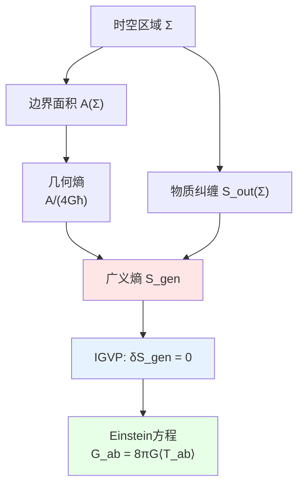
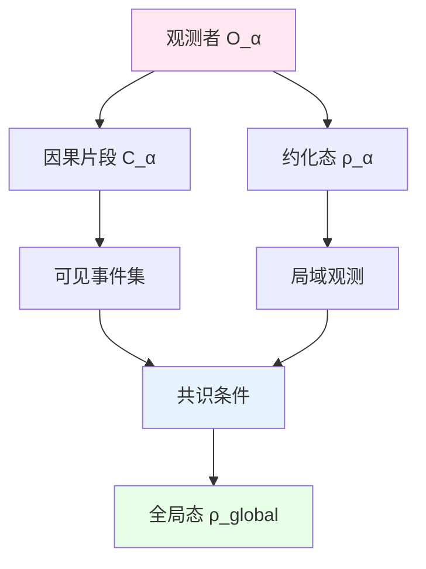
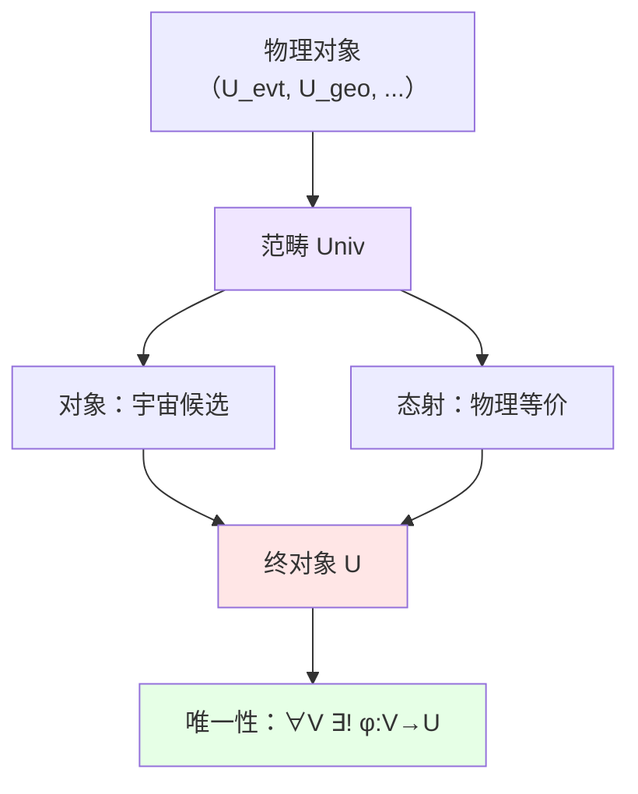

# 04. 熵、观测者、范畴：信息几何的三支柱

## 引言：从动力学到信息

前面的组件构建了宇宙的"物质层"：
- 事件、几何、测度（静态框架）
- 量子场论、散射、模流（动力学演化）

但宇宙不仅有"物质"，还有**信息**：
- **熵**：系统的"无知程度"或"信息容量"
- **观测者**："谁在看"和"看到什么"
- **范畴**：所有结构的"元结构"（结构的结构）

这三者的关系类似于：
- **图书馆的藏书量**（熵）：有多少信息可以存储
- **读者群**（观测者）：从不同视角检索信息
- **图书分类法**（范畴）：组织所有知识的元框架

它们通过**信息几何变分原理（IGVP）**和**观测者共识条件**统一。

## 第一部分：广义熵与引力层 $U_{\text{ent}}$

### 1.1 直观图景：宇宙的"信息墙"

想象一个**巨大的硬盘**：
- **存储容量** = 广义熵 $S_{\text{gen}}$
- **硬盘表面积** = 时空区域的边界面积 $A$
- **已用空间** = 物质场的纠缠熵 $S_{\text{out}}$
- **总容量公式** = $S_{\text{gen}} = \frac{A}{4G\hbar} + S_{\text{out}}$

关键洞见（全息原理）：**信息存储在边界上，而非体积内**——三维世界是二维信息的"投影"！

而IGVP揭示：**信息守恒**等价于**Einstein方程**——引力就是熵力。

### 1.2 严格数学定义

**定义 1.1**（广义熵与引力层）：
$$
U_{\text{ent}} = (S_{\text{gen}}, S_{\text{geom}}, S_{\text{out}}, \text{IGVP}, g_{\text{induced}})
$$

其中：

**(1) 几何熵** $S_{\text{geom}}$：

对类空超曲面 $\Sigma$ 的边界 $\partial\Sigma$：
$$
S_{\text{geom}}(\Sigma) := \frac{A(\partial\Sigma)}{4G\hbar}
$$
其中 $A(\partial\Sigma)$ 是边界的**面积**（用诱导度规测量）：
$$
A = \int_{\partial\Sigma} \sqrt{h} \, d^{d-1}x, \quad h = \det(h_{ab})
$$

**物理意义**：时空本身携带"几何信息"，与面积成正比——Bekenstein-Hawking公式的推广。

**(2) 物质场外熵** $S_{\text{out}}$：

将 $\Sigma$ 外的自由度trace out，得约化密度矩阵：
$$
\rho_{\Sigma} = \text{tr}_{\bar{\Sigma}}(\rho_{\text{global}})
$$

定义**von Neumann熵**：
$$
S_{\text{out}}(\Sigma) := -\text{tr}(\rho_{\Sigma} \log \rho_{\Sigma})
$$

**物理意义**：$\Sigma$ 与其补集 $\bar{\Sigma}$ 的量子纠缠——"外部世界对内部的无知"。

**(3) 广义熵** $S_{\text{gen}}$：
$$
\boxed{S_{\text{gen}}(\Sigma) := S_{\text{geom}}(\Sigma) + S_{\text{out}}(\Sigma) = \frac{A(\partial\Sigma)}{4G\hbar} + S_{\text{out}}(\Sigma)}
$$

**物理意义**：总信息 = 几何信息 + 物质信息——统一黑洞热力学与量子信息论。

**(4) 信息几何变分原理（IGVP）**：

**核心命题**：
$$
\boxed{\delta S_{\text{gen}} = 0 \quad \Leftrightarrow \quad G_{ab} + \Lambda g_{ab} = 8\pi G \langle T_{ab} \rangle}
$$

**左边**：广义熵取极值（信息守恒）
**右边**：Einstein场方程（时空几何由物质决定）

**物理意义**：引力不是基本力，而是**热力学涌现**——熵力假说的严格实现。

**(5) 诱导度规** $g_{\text{induced}}$：

从 $S_{\text{gen}}$ 的变分反推度规：
$$
g_{ab} = -\frac{4G\hbar}{A} \frac{\delta^2 S_{\text{gen}}}{\delta x^a \delta x^b} + \text{物质修正}
$$

**物理意义**：时空几何由信息分布决定——"信息即几何"。

### 1.3 核心性质：Bekenstein界与全息原理

**性质 1.1**（Bekenstein界）：

任意空间区域 $V$ 的熵满足：
$$
S(V) \leq \frac{A(\partial V)}{4\ell_P^2}
$$
其中 $\ell_P = \sqrt{G\hbar/c^3} \approx 1.6 \times 10^{-35}\text{m}$ 是普朗克长度。

**物理意义**：信息存储密度有上限——不能在有限区域塞无限信息。

**违反后果**：如果 $S > A/(4\ell_P^2)$，系统将**坍缩成黑洞**。

**性质 1.2**（全息原理）：

$d$ 维空间区域的**全部物理信息**可编码在 $(d-1)$ 维边界上：
$$
\text{Hilbert空间维数}: \dim \mathcal{H}_V \sim e^{A(\partial V)/(4\ell_P^2)}
$$

**AdS/CFT实现**：
$$
\text{AdS}_{d+1} \text{引力理论} \leftrightarrow \text{CFT}_d \text{边界场论}
$$

**物理意义**：三维世界可能是二维信息的"全息投影"——宇宙是巨大的全息图。

**性质 1.3**（广义第二定律）：

在包含视界的系统中：
$$
\frac{dS_{\text{gen}}}{dt} \geq 0
$$

**推论**：黑洞蒸发过程中，虽然 $S_{\text{geom}}$ 减少，但 $S_{\text{out}}$ 增加更快，总熵不减。

### 1.4 IGVP的详细推导

**目标**：从 $\delta S_{\text{gen}} = 0$ 推出Einstein方程。

**(1) 几何熵的变分**：

$$
\delta S_{\text{geom}} = \frac{1}{4G\hbar} \delta A = \frac{1}{4G\hbar} \int_{\partial\Sigma} \delta\sqrt{h} \, d^{d-1}x
$$

利用 $\delta\sqrt{h} = \frac{1}{2}\sqrt{h} h^{ab} \delta h_{ab}$：
$$
\delta S_{\text{geom}} = \frac{1}{8G\hbar} \int_{\partial\Sigma} \sqrt{h} h^{ab} \delta h_{ab} \, d^{d-1}x
$$

**(2) 物质熵的变分**：

从量子态演化：
$$
\delta S_{\text{out}} = -\delta \text{tr}(\rho_\Sigma \log \rho_\Sigma) = -\int_\Sigma \langle T_{ab} \rangle \delta g^{ab} \sqrt{-g} \, d^dx
$$
（使用热力学恒等式 $dS = \beta dE$）

**(3) 总变分**：
$$
\delta S_{\text{gen}} = \frac{1}{8G\hbar} \int_{\partial\Sigma} \sqrt{h} h^{ab} \delta h_{ab} - \int_\Sigma \langle T_{ab} \rangle \delta g^{ab} \sqrt{-g} \, d^dx
$$

**(4) 边界-体积关系**：

通过Gauss-Codazzi方程，边界项可改写为体积积分：
$$
\int_{\partial\Sigma} \sqrt{h} h^{ab} \delta h_{ab} = \int_\Sigma (R_{ab} - \frac{1}{2}R g_{ab}) \delta g^{ab} \sqrt{-g} \, d^dx + \text{全导数}
$$

**(5) 要求 $\delta S_{\text{gen}} = 0$**：
$$
\int_\Sigma \left[\frac{1}{8G\hbar}(R_{ab} - \tfrac{1}{2}R g_{ab}) - \langle T_{ab} \rangle\right] \delta g^{ab} \sqrt{-g} = 0
$$

由 $\delta g^{ab}$ 任意性：
$$
\boxed{R_{ab} - \frac{1}{2}R g_{ab} = 8\pi G \langle T_{ab} \rangle}
$$
（使用 $\hbar = 1$ 单位，$8\pi G\hbar = 8\pi G$）

**结论**：Einstein方程是广义熵极值原理的必然结果！∎

### 1.5 示例：Schwarzschild黑洞的熵

**设定**：质量 $M$ 的静态黑洞。

**(1) 视界半径**：
$$
r_H = \frac{2GM}{c^2}
$$

**(2) 视界面积**：
$$
A = 4\pi r_H^2 = 16\pi \frac{G^2 M^2}{c^4}
$$

**(3) Bekenstein-Hawking熵**：
$$
S_{\text{BH}} = \frac{A}{4\ell_P^2} = \frac{16\pi G^2 M^2}{4G\hbar/c^3} = \frac{4\pi G M^2 c^3}{\hbar}
$$

**数值例子**（太阳质量黑洞 $M = M_\odot$）：
$$
S_{\text{BH}} \approx 1.1 \times 10^{54} k_B
$$
（相当于 $10^{77}$ 个质子的热熵）

**(4) 验证IGVP**：

变分：
$$
\delta S_{\text{BH}} = \frac{8\pi GM c^3}{\hbar} \delta M
$$

定义"温度"：
$$
T_H := \frac{\partial M}{\partial S_{\text{BH}}} = \frac{\hbar}{8\pi GMk_B}
$$

与Hawking温度一致！

**(5) 广义熵**（考虑Hawking辐射）：
$$
S_{\text{gen}} = \frac{A}{4G\hbar} + S_{\text{out}}^{\text{radiation}}
$$

蒸发过程中：
$$
\frac{dS_{\text{gen}}}{dt} = -\frac{dA}{4G\hbar dt} + \frac{dS_{\text{rad}}}{dt} > 0
$$
验证广义第二定律。

### 1.6 比喻总结：城市的信息基础设施

把 $U_{\text{ent}}$ 想象成**城市的信息网络**：
- **光纤容量** = 几何熵 $A/(4G\hbar)$（基础设施上限）
- **实际数据流** = 物质熵 $S_{\text{out}}$（当前使用量）
- **总带宽** = 广义熵 $S_{\text{gen}}$
- **网络优化** = IGVP（最大化信息吞吐量）

城市规划（时空几何）必须与数据需求（物质分布）匹配——这就是Einstein方程的信息论解释。

---

## 第二部分：观测者网络层 $U_{\text{obs}}$

### 2.1 直观图景：多摄像头监控系统

想象一个**城市监控网络**：
- **每个摄像头** = 一个观测者 $\mathcal{O}_\alpha$
- **摄像头视野** = 因果片段 $C_\alpha$
- **摄像头记录** = 约化量子态 $\rho_\alpha$
- **中央服务器** = 全局共识 $\rho_{\text{global}}$

关键问题：如何从**多个局域视角**重构**唯一的全局实在**？

答案：**观测者共识条件**——所有观测者的约化态必须兼容。

### 2.2 严格数学定义

**定义 2.1**（观测者网络层）：
$$
U_{\text{obs}} = (\mathcal{A}, \{(\mathcal{O}_\alpha, C_\alpha, \rho_\alpha)\}_{\alpha \in \mathcal{A}}, \Phi_{\text{cons}}, \rho_{\text{global}})
$$

其中：

**(1) 观测者集合** $\mathcal{A}$：

每个元素 $\alpha \in \mathcal{A}$ 代表一个**物理观测者**（可以是：实际探测器、理想化观察者、Wigner友人）。

**(2) 观测者三元组** $(\mathcal{O}_\alpha, C_\alpha, \rho_\alpha)$：

- **观测者本体** $\mathcal{O}_\alpha \subset M$：观测者的世界线或时空轨迹
- **因果片段** $C_\alpha \in \mathcal{C}$：$\alpha$ 能因果影响或观测到的事件集
$$
C_\alpha = \{x \in X \mid x \preceq \mathcal{O}_\alpha\}
$$
- **约化量子态** $\rho_\alpha$：$\alpha$ 眼中的量子态
$$
\rho_\alpha = \text{tr}_{\bar{C}_\alpha}(\rho_{\text{global}})
$$

**(3) 共识映射** $\Phi_{\text{cons}}$：

$$
\Phi_{\text{cons}}: \{\rho_\alpha\}_{\alpha \in \mathcal{A}} \to \rho_{\text{global}}
$$
满足**兼容性条件**（核心约束）：
$$
\text{tr}_{\bar{C}_\alpha}(\Phi_{\text{cons}}(\{\rho_\beta\})) = \rho_\alpha, \quad \forall \alpha
$$

**物理意义**：全局态的边缘化必须还原每个观测者的局域态——"拼图的每块必须吻合"。

**(4) 全局量子态** $\rho_{\text{global}}$：

定义在整个 $\mathcal{H}_{\text{total}}$ 上，满足：
$$
\rho_{\text{global}} = \Phi_{\text{cons}}(\{\rho_\alpha\}_{\alpha \in \mathcal{A}})
$$

**唯一性条件**：如果 $\{\rho_\alpha\}$ 满足所有一致性约束，则 $\rho_{\text{global}}$ **唯一确定**。

### 2.3 核心性质：Wigner友谊与量子Darwinism

**性质 2.1**（Wigner友谊约束）：

考虑两个观测者 $\alpha, \beta$ 及其"超观测者" $\gamma$ 能同时观测到 $\alpha, \beta$。则：
$$
\text{tr}_{\bar{C}_\gamma}(\rho_\gamma) = \rho_\alpha \otimes \rho_\beta \quad (\text{如果 } C_\alpha, C_\beta \text{ 独立})
$$

**悖论情形**（Frauchiger-Renner）：
如果 $\alpha$ 测量得 $|0\rangle$，$\beta$ 测量得 $|1\rangle$，但 $\gamma$ 看到叠加态 $\frac{1}{\sqrt{2}}(|0\rangle + |1\rangle)$，如何兼容？

**GLS解决方案**：引入**因果片段的时间标记**：
$$
C_\alpha(t_\alpha) \neq C_\gamma(t_\gamma) \quad \Rightarrow \quad \rho_\alpha(t_\alpha) \neq \text{tr}_{\bar{\alpha}}(\rho_\gamma(t_\gamma))
$$
不同时间的观测不矛盾——"还没观测"vs"已经观测"。

**性质 2.2**（量子Darwinism）：

对宏观经典信息（如"猫死了"），存在**环境冗余**：
$$
I(\text{系统}:\text{环境片段 } E_i) \approx I(\text{系统}:\text{全环境}), \quad \forall i
$$

**物理意义**：经典信息被"大量复制"到环境中，任意小部分环境即可重构——这解释了为何经典世界"客观"。

**GLS实现**：
$$
\rho_\alpha \approx \rho_\beta \quad \text{当 } \alpha, \beta \text{ 都与经典自由度耦合}
$$

**性质 2.3**（观测者的范畴结构）：

定义**观测者范畴** $\mathbf{Obs}$：
- **对象**：观测者三元组 $(\mathcal{O}_\alpha, C_\alpha, \rho_\alpha)$
- **态射**：信息流映射 $\phi_{\alpha \beta}: C_\alpha \cap C_\beta \to \text{共享信息}$

**函子**：
$$
F: \mathbf{Obs} \to \mathbf{Hilb} \quad (\text{观测者} \mapsto \text{Hilbert空间})
$$

### 2.4 多观测者共识的构造

**问题**：给定 $\{\rho_\alpha\}_{\alpha \in \mathcal{A}}$，如何构造 $\rho_{\text{global}}$？

**方法1**（最大熵原理）：

$$
\rho_{\text{global}} = \arg\max_{\rho} S(\rho) \quad \text{s.t.} \quad \text{tr}_{\bar{C}_\alpha}(\rho) = \rho_\alpha, \;\forall \alpha
$$

**拉格朗日乘数法**：
$$
\rho_{\text{global}} = \frac{1}{Z} \exp\left(-\sum_\alpha \lambda_\alpha \text{tr}_{\bar{C}_\alpha}(\cdot)\right)
$$

**方法2**（纤维积构造）：

在范畴论框架中，定义**拉回（pullback）**：
$$
\rho_{\text{global}} = \lim_{\leftarrow} \{\rho_\alpha\}_{\alpha \in \mathcal{A}}
$$

**方法3**（路径积分融合）：

$$
\rho_{\text{global}} = \int \mathcal{D}\phi \prod_{\alpha \in \mathcal{A}} \langle \rho_\alpha | \phi \rangle_{\alpha}
$$
其中积分over所有满足边界条件的场位形。

### 2.5 示例：双缝实验的多观测者解释

**设定**：
- 观测者 $\alpha$：只看粒子通过哪个缝
- 观测者 $\beta$：只看最终干涉图样
- 超观测者 $\gamma$：同时看 $\alpha, \beta$ 的记录

**(1) $\alpha$ 的态**（测量路径）：
$$
\rho_\alpha = \frac{1}{2}(|L\rangle\langle L| + |R\rangle\langle R|) \quad \text{（混合态）}
$$

**(2) $\beta$ 的态**（未测量路径）：
$$
\rho_\beta = \frac{1}{2}|L + R\rangle\langle L + R| \quad \text{（纯态）}
$$

**(3) 看似矛盾**：$\alpha$ 看到混合态（无干涉），$\beta$ 看到纯态（有干涉）。

**(4) GLS解决**：

$$
C_\alpha \cap C_\beta = \emptyset \quad \text{（因果不相交）}
$$

全局态：
$$
\rho_{\text{global}} = |\Psi\rangle\langle\Psi|, \quad |\Psi\rangle = \frac{1}{\sqrt{2}}(|L\rangle|\alpha_L\rangle|\beta_?\rangle + |R\rangle|\alpha_R\rangle|\beta_?\rangle)
$$

边缘化：
$$
\rho_\alpha = \text{tr}_{\beta}(\rho_{\text{global}}) = \frac{1}{2}(|L\rangle\langle L| + |R\rangle\langle R|) \quad \checkmark
$$
$$
\rho_\beta = \text{tr}_{\alpha}(\rho_{\text{global}}) = |\psi_{\text{interference}}\rangle\langle\psi| \quad \checkmark
$$

**结论**：不矛盾，因为 $\alpha, \beta$ 看到的是**不同的边缘化**。

### 2.6 比喻总结：拼图游戏的全局图景

把 $U_{\text{obs}}$ 想象成**巨型拼图**：
- **每个拼图块** = 一个观测者的局域态 $\rho_\alpha$
- **拼图块的边缘** = 因果片段边界 $\partial C_\alpha$
- **拼图的完整图案** = 全局态 $\rho_{\text{global}}$
- **拼图规则** = 共识条件（边缘必须吻合）

如果所有块正确拼接，会得到**唯一的完整图案**——但没有任何一块能独自看到全景。

---

## 第三部分：范畴与拓扑层 $U_{\text{cat}}$

### 3.1 直观图景：乐高积木的元规则

想象**乐高玩具系统**：
- **积木块** = 具体物理对象（粒子、场、时空）
- **积木接口** = 物理对象之间的关系（映射、演化）
- **搭建手册** = 范畴（定义"什么能连接什么"）

但 $U_{\text{cat}}$ 不是描述积木本身，而是描述**"搭建手册的手册"**——元结构的元结构。

关键洞见：**所有前面的组件**（$U_{\text{evt}}, \ldots, U_{\text{obs}}$）都是**同一个范畴的不同对象**，而宇宙本身是这个范畴的**终对象**。

### 3.2 严格数学定义

**定义 3.1**（范畴与拓扑层）：
$$
U_{\text{cat}} = (\mathbf{Univ}, \mathfrak{U}, \text{Term}, \{\text{Func}_i\}_i, \mathbf{Top}_{\text{obs}})
$$

其中：

**(1) 宇宙范畴** $\mathbf{Univ}$：

**对象** $\text{Ob}(\mathbf{Univ})$：所有满足基本兼容性的"宇宙候选"
$$
V = (V_{\text{evt}}, V_{\text{geo}}, \ldots, V_{\text{comp}}) \quad \text{（十元组）}
$$

**态射** $\text{Mor}(\mathbf{Univ})$：
$$
\phi: V \to W \quad \text{是保持物理结构的映射}
$$
满足：
- $\phi$ 保持因果结构：$x \preceq_V y \Rightarrow \phi(x) \preceq_W \phi(y)$
- $\phi$ 保持度规（等距嵌入或共形等价）
- $\phi$ 保持量子态（幺正或完全正映射）

**(2) 终对象** $\mathfrak{U}$：

定义：$\mathfrak{U} \in \text{Ob}(\mathbf{Univ})$ 是**终对象** $\Leftrightarrow$
$$
\forall V \in \text{Ob}(\mathbf{Univ}), \exists! \phi: V \to \mathfrak{U}
$$

**物理意义**：**唯一的物理实现宇宙**——所有"候选宇宙"最终collapse到同一个 $\mathfrak{U}$。

**定理**（终对象的唯一性）：
如果 $\mathfrak{U}, \mathfrak{U}'$ 都是终对象，则它们**同构**：
$$
\mathfrak{U} \cong \mathfrak{U}'
$$

**(3) 函子族** $\{\text{Func}_i\}_i$：

连接不同层次的函子：

**遗忘函子** $U: \mathbf{Univ}_{\text{full}} \to \mathbf{Univ}_{\text{base}}$：
$$
(V_1, \ldots, V_{10}) \mapsto (V_1, V_2, V_3) \quad \text{（只保留基础三层）}
$$

**自由函子** $F: \mathbf{Caus} \to \mathbf{Univ}$：
从因果集生成完整宇宙：
$$
(X, \preceq) \mapsto (U_{\text{evt}}, U_{\text{geo}}, \ldots) \quad \text{（最小扩张）}
$$

**函子恒等式**（伴随关系）：
$$
F \dashv U \quad \Leftrightarrow \quad \text{Hom}(F(C), V) \cong \text{Hom}(C, U(V))
$$

**(4) 观测者拓扑** $\mathbf{Top}_{\text{obs}}$：

在观测者集合 $\mathcal{A}$ 上定义**Grothendieck拓扑**：

**覆盖族**：$\{C_{\alpha_i}\}_{i \in I}$ **覆盖** $C$ $\Leftrightarrow$
$$
C = \bigcup_{i \in I} C_{\alpha_i} \quad (\text{因果片段的并})
$$

**层条件**：量子态 $\rho$ 是**层** $\Leftrightarrow$
$$
\rho|_{C_{\alpha_i} \cap C_{\alpha_j}} = \rho|_{C_{\alpha_i}}|_{C_{\alpha_i} \cap C_{\alpha_j}} \quad \text{（粘合条件）}
$$

**物理意义**：局域观测可以"粘合"成全局态——量子态的层论。

### 3.3 核心性质：范畴等价与物理等价

**性质 3.1**（范畴等价定理）：

定义两个子范畴：
- $\mathbf{Univ}_{\text{phys}}$：物理可实现的宇宙
- $\mathbf{Obs}_{\text{full}}$：完全观测者网络

**定理**：
$$
\mathbf{Univ}_{\text{phys}} \simeq \mathbf{Obs}_{\text{full}}
$$

**物理意义**：宇宙结构 $\Leftrightarrow$ 观测者网络——"物理实在"等价于"观测者共识"（关系量子力学）。

**性质 3.2**（纤维函子与分层结构）：

定义**纤维化**：
$$
\pi: \mathbf{Univ} \to \mathbf{Caus}
$$
将每个宇宙映射到其因果结构。

**纤维**：
$$
\pi^{-1}((X, \preceq)) = \{V \in \mathbf{Univ} \mid V_{\text{evt}} = (X, \preceq)\}
$$

**定理**（纤维的维数）：
$$
\dim \pi^{-1}((X, \preceq)) < \infty \quad \text{（有限模空间）}
$$

**物理意义**：固定因果结构后，宇宙的剩余自由度**有限**——因果约束极强。

**性质 3.3**（高阶范畴与拓扑序）：

在量子多体系统中，基态可能有**拓扑简并**：
$$
\dim \mathcal{H}_{\text{ground}} = \mathcal{D} > 1
$$

需要**2-范畴**描述：
- **0-cell**：拓扑相
- **1-cell**：相变（畴壁）
- **2-cell**：畴壁融合规则

**Levin-Wen模型**：
$$
\mathcal{D} = \sum_a d_a^2 \quad \text{（量子维数）}
$$

### 3.4 示例：因果集的范畴化

**设定**：离散因果集 $(X, \preceq)$（Sorkin的量子引力方案）。

**(1) 因果集范畴** $\mathbf{Caus}$：
- **对象**：有限或可数因果集 $(X, \preceq)$
- **态射**：保序嵌入 $f: X \to Y$（$x \preceq y \Rightarrow f(x) \preceq f(y)$）

**(2) 函子 $F: \mathbf{Caus} \to \mathbf{Lorentz}$**：

将因果集"连续化"为Lorentz流形：
$$
(X, \preceq) \mapsto (M, g) \quad \text{s.t.} \quad (X, \preceq) \hookrightarrow (M, \preceq_g)
$$

**Bombelli-Henson-Sorkin猜想**：
对"足够大"的随机因果集，$F(X) \approx$ 闵可夫斯基时空（几率 $\to 1$）。

**(3) 测度的推前**：

因果集上的计数测度：
$$
\mu_X(S) = |S| \quad (S \subseteq X)
$$

推前到流形：
$$
\mu_M = F_*(\mu_X) \approx \sqrt{-g} \, d^4x \quad (\text{体积测度})
$$

**(4) 范畴的终对象**：

在 $\mathbf{Caus}$ 中，**无限因果集**（如 $\mathbb{Z}^4$ 的因果闭包）是终对象——所有有限因果集可嵌入其中。

### 3.5 拓扑层的粘合条件

**问题**：如何从局域态 $\{\rho_\alpha\}$ 粘合成全局态 $\rho_{\text{global}}$？

**Čech上链复形**：

定义**1-上链**：
$$
C^1(\{C_\alpha\}, \mathcal{H}) = \prod_{\alpha, \beta} \text{Hom}(\mathcal{H}_{C_\alpha \cap C_\beta}, \mathbb{C})
$$

**2-上链**（相容性）：
$$
\delta: C^1 \to C^2, \quad (\delta f)_{\alpha\beta\gamma} = f_{\beta\gamma} - f_{\alpha\gamma} + f_{\alpha\beta}
$$

**层的粘合条件**：
$$
\delta \rho = 0 \quad \Leftrightarrow \quad \rho_{\alpha\beta} = \rho_{\alpha\gamma} - \rho_{\beta\gamma}
$$

**定理**（层的上同调）：
$$
H^1(\{C_\alpha\}, \mathcal{H}) = 0 \quad \Rightarrow \quad \text{全局态唯一存在}
$$

### 3.6 比喻总结：编程语言的类型系统

把 $U_{\text{cat}}$ 想象成**编程语言的类型系统**：
- **基本类型** = 物理对象（int, float → 粒子, 场）
- **类型构造器** = 函子（List[T], Option[T] → 量子化, 路径积分）
- **类型约束** = 态射（interface, trait → 物理定律）
- **终类型** = Unit或Top类型（唯一的"宇宙"类型）

所有物理理论都是"在宇宙类型系统中编程"——而 $\mathfrak{U}$ 是唯一的"可编译程序"。

---

## 第四部分：三者的深层统一

### 4.1 信息-观测者-结构的三角关系

$$
\begin{array}{ccc}
\text{广义熵} & \xrightarrow{\text{IGVP}} & \text{时空几何} \\
\downarrow \text{边缘化} & & \uparrow \text{共识} \\
\text{观测者网络} & \xrightarrow{\text{粘合}} & \text{全局态}
\end{array}
$$

**循环约束**：
1. 几何 $\xrightarrow{\text{诱导}}$ 因果片段 $\to$ 观测者视野
2. 观测者 $\xrightarrow{\text{约化}}$ 局域态 $\to$ 局域熵
3. 熵 $\xrightarrow{\text{变分}}$ 反推几何

三者形成**自洽闭环**——改变任一个，其他两个必须调整。

### 4.2 核心定理：信息-观测者-几何等价性

**定理 4.1**（三元组唯一性）：

给定：
1. 因果结构 $(X, \preceq, \mathcal{C})$
2. 观测者集合 $\mathcal{A}$ 及其因果片段 $\{C_\alpha\}$
3. 边界条件（渐近平坦或AdS等）

则以下三者**相互决定**：
$$
(S_{\text{gen}}, \{\ rho_\alpha\}_\alpha, \mathbf{Univ}) \quad \text{唯一确定}
$$

**证明要点**：

**(1) 熵 $\to$ 几何**：IGVP给出 $G_{ab} = 8\pi G \langle T_{ab} \rangle$

**(2) 几何 $\to$ 观测者态**：$\rho_\alpha = \text{tr}_{\bar{C}_\alpha}(\rho_{\text{KMS}})$（KMS态由 $g$ 决定）

**(3) 观测者态 $\to$ 熵**：$S_{\text{gen}} = S_{\text{geom}} + \sum_\alpha S(\rho_\alpha)$

闭环！∎

### 4.3 统一公式：信息几何的Gauss-Bonnet形式

在 $d=4$ 时空，广义熵可表为**拓扑项 + 动力学项**：
$$
S_{\text{gen}} = \underbrace{\frac{1}{4G\hbar}\int_{\partial\Sigma} \sqrt{h}}_{\text{几何项}} + \underbrace{(-\text{tr}\,\rho \log \rho)}_{\text{量子项}}
$$

**Gauss-Bonnet推广**（$d \geq 5$）：
$$
S_{\text{gen}} = \frac{1}{4G\hbar}\int_{\partial\Sigma} \left(1 + \alpha R + \beta R^2 + \cdots\right)\sqrt{h} + S_{\text{out}}
$$

**Lovelock引力**：
$$
\mathcal{L} = \sum_{k=0}^{[d/2]} \alpha_k \mathcal{L}_k, \quad \mathcal{L}_k = \delta^{\mu_1\cdots\mu_{2k}}_{\nu_1\cdots\nu_{2k}} R^{\nu_1\nu_2}_{\mu_1\mu_2} \cdots R^{\nu_{2k-1}\nu_{2k}}_{\mu_{2k-1}\mu_{2k}}
$$

**统一IGVP**：
$$
\delta S_{\text{gen}}^{\text{Lovelock}} = 0 \quad \Leftrightarrow \quad \text{Lovelock方程}
$$

---

## 第五部分：物理图景与哲学意义

### 5.1 信息即几何，观测者即现实

三个组件揭示的核心洞见：

1. **熵力假说**：引力 = 信息的热力学效应（Verlinde）
2. **关系本体论**：物理量仅在观测者关系中定义（Rovelli）
3. **范畴普遍性**：宇宙 = 范畴的终对象（Lawvere）

**统一哲学**：
$$
\text{物理实在} = \text{信息} + \text{观测者网络} + \text{范畴结构}
$$

不存在"脱离观测者的客观信息"，也不存在"无结构约束的任意观测者"。

### 5.2 黑洞信息悖论的解决

**悖论**：黑洞蒸发后，信息去哪了？

**GLS解决**：

**(1) Page曲线**：
$$
S_{\text{rad}}(t) = \begin{cases}
S_{\text{thermal}}(t) & t < t_{\text{Page}} \\
S_{\text{BH}}(t) & t > t_{\text{Page}}
\end{cases}
$$

**(2) 岛屿公式**（量子极值面）：
$$
S_{\text{gen}} = \min_{\text{极值面 } \chi} \left[\frac{A(\chi)}{4G\hbar} + S_{\text{out}}(\text{岛屿} \cup \text{辐射})\right]
$$

**(3) 观测者视角**：
- 外部观测者 $\alpha$：看到热辐射（$\rho_\alpha$ 混合态）
- 内部观测者 $\beta$：看到纯态演化（$\rho_\beta$ 纯态）

两者**不矛盾**，因为 $C_\alpha \cap C_\beta = \partial(\text{视界})$（只有边界共享）。

**结论**：信息不丢失，但在不同观测者眼中**分布不同**。

### 5.3 意识与观测者的地位

**问题**：$U_{\text{obs}}$ 中的"观测者"必须是conscious的吗？

**GLS答案**：**不必须**。

观测者只需满足：
1. 有确定的世界线 $\mathcal{O}_\alpha \subset M$
2. 能与环境纠缠（产生 $C_\alpha$）
3. 记录信息（产生 $\rho_\alpha$）

**例子**：
- ✅ 实验室探测器（满足1-3）
- ✅ 宇宙微波背景光子（满足1-3）
- ❌ 抽象数学观测者（不满足2）

**意识的角色**：可能与 $U_{\text{comp}}$ 相关（可实现性），但非 $U_{\text{obs}}$ 的必要条件。

---

## 第六部分：进阶主题与开放问题

### 6.1 量子引力中的范畴化

在圈量子引力（LQG）或自旋网络中：
- **0-范畴**：经典时空
- **1-范畴**：自旋网络（边=关系）
- **2-范畴**：自旋泡沫（面=演化）
- **$\infty$-范畴**：完全量子几何

**猜想**：物理时空是**$\infty$-范畴的几何实现**（Freed-Hopkins-Lurie）。

### 6.2 AdS/CFT中的观测者网络

在AdS/CFT对偶中：
- **Bulk观测者**：$(d+1)$ 维引力中的观测者
- **Boundary观测者**：$d$ 维CFT中的算符

**全息纠缠熵**（Ryu-Takayanagi）：
$$
S_{\text{ent}}(A) = \frac{A(\gamma_A)}{4G\hbar}
$$

**问题**：如何在bulk中重构boundary观测者的 $\rho_\alpha$？

**方案**：利用**纠缠楔重构**（entanglement wedge reconstruction）。

### 6.3 拓扑量子计算与范畴

**任意子**（拓扑序的激发）形成**辫子范畴**：
$$
\mathbf{Braid} \to \mathbf{Hilb}
$$

**融合规则**：
$$
a \times b = \sum_c N^c_{ab} c, \quad N^c_{ab} \in \mathbb{Z}_{\geq 0}
$$

**F矩阵**（结合性）：
$$
\sum_e F^{abc}_d \big|((ab)c)d\big> = \sum_e \big|(a(bc))e\big>
$$

**GLS联系**：拓扑序的 $U_{\text{cat}}$ 可能编码量子引力的微观自由度。

---

## 第七部分：学习路径与实践建议

### 7.1 深入理解三组件的步骤

**阶段1**：广义熵与全息原理（2-3周）
- Bekenstein-Hawking熵
- Ryu-Takayanagi公式
- IGVP推导

**阶段2**：观测者网络与量子测量（3-4周）
- Wigner友谊问题
- 量子Darwinism
- 一致性条件

**阶段3**：范畴论基础（4-6周，难）
- 基本定义（对象、态射、函子）
- 伴随函子与极限
- 层论与Grothendieck拓扑

**阶段4**：三者统一（3-4周）
- 信息几何变分原理
- 观测者共识的范畴化
- 黑洞信息悖论

### 7.2 推荐参考文献

**广义熵**：
1. Jacobson, *Thermodynamics of Spacetime*
2. Wall, *Ten Proofs of the Generalized Second Law*
3. Engelhardt & Wall, *Quantum Extremal Surfaces*

**观测者理论**：
1. Rovelli, *Relational Quantum Mechanics*
2. Zurek, *Quantum Darwinism*
3. Frauchiger & Renner, *Quantum Theory Cannot Consistently Describe...*

**范畴论**：
1. MacLane, *Categories for the Working Mathematician*
2. Lurie, *Higher Topos Theory*
3. Baez & Stay, *Physics, Topology, Logic and Computation*

**GLS特定**：
1. 本教程第7章（广义熵与引力）
2. 本教程第8章（观测者网络）
3. 源理论：`docs/euler-gls-union/observer-consensus-geometry.md`

### 7.3 常见误区

**误区1**："熵只是统计概念"
- **纠正**：在GLS中，熵是**几何实在**（面积），不仅仅是"无知"。

**误区2**："观测者必须是人"
- **纠正**：任何能与环境纠缠并记录信息的系统都是观测者（包括探测器、光子）。

**误区3**："范畴论只是抽象数学"
- **纠正**：范畴结构**编码物理约束**（如终对象 = 唯一宇宙），是实在的数学表述。

---

## 总结与展望

### 核心要点回顾

1. **广义熵层** $U_{\text{ent}}$：信息 = 几何 + 量子，IGVP $\Leftrightarrow$ Einstein方程
2. **观测者网络层** $U_{\text{obs}}$：多视角共识，关系量子力学
3. **范畴拓扑层** $U_{\text{cat}}$：宇宙 = 终对象，层论粘合

三者通过**信息几何**统一：
$$
\delta S_{\text{gen}} = 0 \quad \Leftrightarrow \quad \text{观测者共识} \quad \Leftrightarrow \quad \text{范畴终对象}
$$

### 与后续组件的联系

- **$U_{\text{comp}}$**：将物理演化视为"计算"，引入Church-Turing约束
- **兼容性条件**：所有10个组件如何自洽锁定
- **唯一性定理**：证明 $\mathfrak{U}$ 的终对象性
- **无观测者极限**：$U_{\text{obs}} \to \emptyset$ 时的退化

### 哲学寓意

宇宙不是"物质 + 时空"，而是**信息 + 观测者 + 结构**的三位一体：
- 信息决定几何（IGVP）
- 观测者构成现实（关系本体论）
- 结构保证唯一性（终对象）

这或许就是"为何宇宙可理解且唯一"的终极答案。

---

**下一篇预告**：
- **05. 计算与可实现性：宇宙的图灵边界**
  - $U_{\text{comp}}$：物理过程是计算吗？
  - Church-Turing论题的物理版本
  - 不可计算性与量子引力的关系
