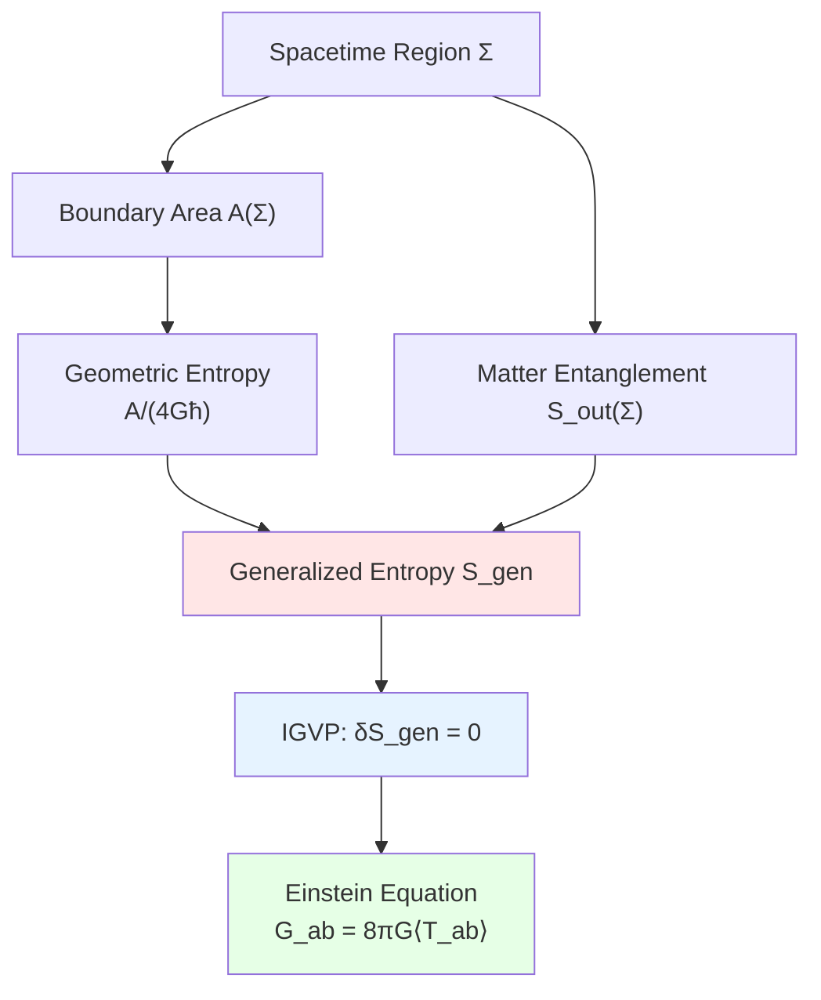
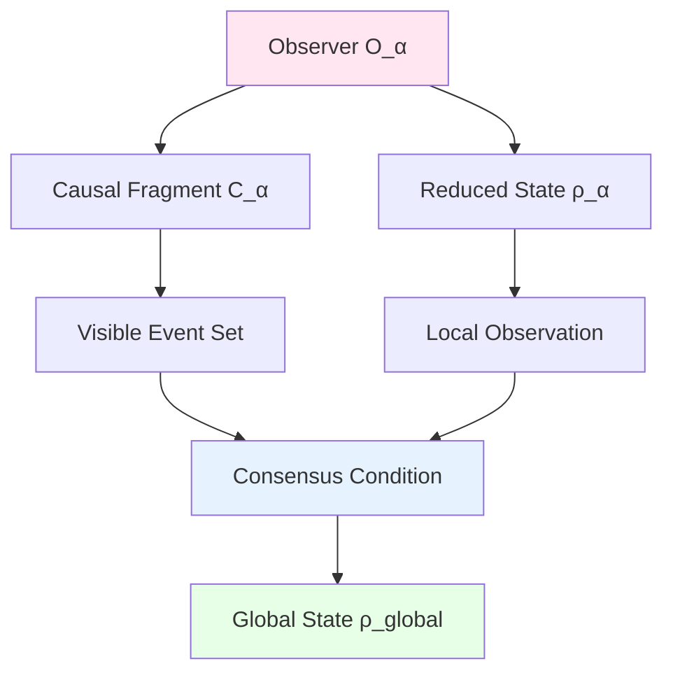
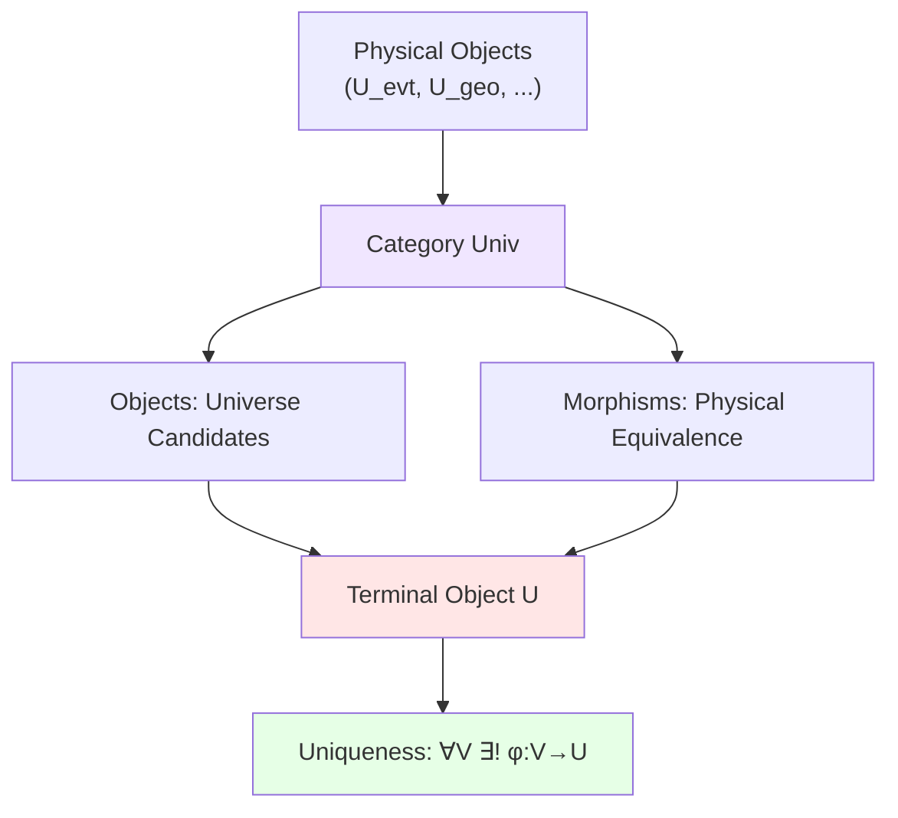

# 04. Entropy, Observer, Category: Three Pillars of Information Geometry

## Introduction: From Dynamics to Information

Previous components built "matter layer" of universe:
- Events, geometry, measure (static framework)
- Quantum field theory, scattering, modular flow (dynamic evolution)

But universe not only has "matter", but also **information**:
- **Entropy**: System's "degree of ignorance" or "information capacity"
- **Observer**: "Who watches" and "what is seen"
- **Category**: "Meta-structure" of all structures (structure of structures)

Relationship among these three is similar to:
- **Library Collection** (Entropy): How much information can be stored
- **Reader Community** (Observer): Retrieve information from different perspectives
- **Classification System** (Category): Meta-framework organizing all knowledge

They are unified through **Information Geometric Variational Principle (IGVP)** and **Observer Consensus Conditions**.

## Part I: Generalized Entropy and Gravity Layer $U_{\text{ent}}$

### 1.1 Intuitive Picture: "Information Wall" of Universe

Imagine a **huge hard disk**:
- **Storage Capacity** = Generalized entropy $S_{\text{gen}}$
- **Disk Surface Area** = Boundary area $A$ of spacetime region
- **Used Space** = Entanglement entropy $S_{\text{out}}$ of matter fields
- **Total Capacity Formula** = $S_{\text{gen}} = \frac{A}{4G\hbar} + S_{\text{out}}$

Key insight (Holographic Principle): **Information stored on boundary, not in volume**—three-dimensional world is "projection" of two-dimensional information!

And IGVP reveals: **Information conservation** equivalent to **Einstein equation**—gravity is entropy force.

### 1.2 Strict Mathematical Definition

**Definition 1.1** (Generalized Entropy and Gravity Layer):
$$
U_{\text{ent}} = (S_{\text{gen}}, S_{\text{geom}}, S_{\text{out}}, \text{IGVP}, g_{\text{induced}})
$$

where:

**(1) Geometric Entropy** $S_{\text{geom}}$:

For boundary $\partial\Sigma$ of spacelike hypersurface $\Sigma$:
$$
S_{\text{geom}}(\Sigma) := \frac{A(\partial\Sigma)}{4G\hbar}
$$
where $A(\partial\Sigma)$ is **area** of boundary (measured with induced metric):
$$
A = \int_{\partial\Sigma} \sqrt{h} \, d^{d-1}x, \quad h = \det(h_{ab})
$$

**Physical Meaning**: Spacetime itself carries "geometric information", proportional to area—generalization of Bekenstein-Hawking formula.

**(2) Matter Field External Entropy** $S_{\text{out}}$:

Tracing out degrees of freedom outside $\Sigma$, obtain reduced density matrix:
$$
\rho_{\Sigma} = \text{tr}_{\bar{\Sigma}}(\rho_{\text{global}})
$$

Define **von Neumann entropy**:
$$
S_{\text{out}}(\Sigma) := -\text{tr}(\rho_{\Sigma} \log \rho_{\Sigma})
$$

**Physical Meaning**: Quantum entanglement between $\Sigma$ and its complement $\bar{\Sigma}$—"external world's ignorance of interior".

**(3) Generalized Entropy** $S_{\text{gen}}$:
$$
\boxed{S_{\text{gen}}(\Sigma) := S_{\text{geom}}(\Sigma) + S_{\text{out}}(\Sigma) = \frac{A(\partial\Sigma)}{4G\hbar} + S_{\text{out}}(\Sigma)}
$$

**Physical Meaning**: Total information = Geometric information + Matter information—unifies black hole thermodynamics and quantum information theory.

**(4) Information Geometric Variational Principle (IGVP)**:

**Core Proposition**:
$$
\boxed{\delta S_{\text{gen}} = 0 \quad \Leftrightarrow \quad G_{ab} + \Lambda g_{ab} = 8\pi G \langle T_{ab} \rangle}
$$

**Left Side**: Generalized entropy takes extremum (information conservation)
**Right Side**: Einstein field equation (spacetime geometry determined by matter)

**Physical Meaning**: Gravity is not fundamental force, but **thermodynamic emergence**—strict realization of entropy force hypothesis.

**(5) Induced Metric** $g_{\text{induced}}$:

Reverse derive metric from variation of $S_{\text{gen}}$:
$$
g_{ab} = -\frac{4G\hbar}{A} \frac{\delta^2 S_{\text{gen}}}{\delta x^a \delta x^b} + \text{matter corrections}
$$

**Physical Meaning**: Spacetime geometry determined by information distribution—"information is geometry".

### 1.3 Core Properties: Bekenstein Bound and Holographic Principle

**Property 1.1** (Bekenstein Bound):

Entropy of any spatial region $V$ satisfies:
$$
S(V) \leq \frac{A(\partial V)}{4\ell_P^2}
$$
where $\ell_P = \sqrt{G\hbar/c^3} \approx 1.6 \times 10^{-35}\text{m}$ is Planck length.

**Physical Meaning**: Information storage density has upper bound—cannot pack infinite information in finite region.

**Violation Consequence**: If $S > A/(4\ell_P^2)$, system will **collapse into black hole**.

**Property 1.2** (Holographic Principle):

**All physical information** of $d$-dimensional spatial region can be encoded on $(d-1)$-dimensional boundary:
$$
\text{Hilbert space dimension}: \dim \mathcal{H}_V \sim e^{A(\partial V)/(4\ell_P^2)}
$$

**AdS/CFT Realization**:
$$
\text{AdS}_{d+1} \text{ gravity theory} \leftrightarrow \text{CFT}_d \text{ boundary field theory}
$$

**Physical Meaning**: Three-dimensional world may be "holographic projection" of two-dimensional information—universe is huge hologram.

**Property 1.3** (Generalized Second Law):

In systems containing horizons:
$$
\frac{dS_{\text{gen}}}{dt} \geq 0
$$

**Corollary**: During black hole evaporation, though $S_{\text{geom}}$ decreases, $S_{\text{out}}$ increases faster, total entropy does not decrease.

### 1.4 Detailed Derivation of IGVP

**Goal**: Derive Einstein equation from $\delta S_{\text{gen}} = 0$.

**(1) Variation of Geometric Entropy**:

$$
\delta S_{\text{geom}} = \frac{1}{4G\hbar} \delta A = \frac{1}{4G\hbar} \int_{\partial\Sigma} \delta\sqrt{h} \, d^{d-1}x
$$

Using $\delta\sqrt{h} = \frac{1}{2}\sqrt{h} h^{ab} \delta h_{ab}$:
$$
\delta S_{\text{geom}} = \frac{1}{8G\hbar} \int_{\partial\Sigma} \sqrt{h} h^{ab} \delta h_{ab} \, d^{d-1}x
$$

**(2) Variation of Matter Entropy**:

From quantum state evolution:
$$
\delta S_{\text{out}} = -\delta \text{tr}(\rho_\Sigma \log \rho_\Sigma) = -\int_\Sigma \langle T_{ab} \rangle \delta g^{ab} \sqrt{-g} \, d^dx
$$
(using thermodynamic identity $dS = \beta dE$)

**(3) Total Variation**:
$$
\delta S_{\text{gen}} = \frac{1}{8G\hbar} \int_{\partial\Sigma} \sqrt{h} h^{ab} \delta h_{ab} - \int_\Sigma \langle T_{ab} \rangle \delta g^{ab} \sqrt{-g} \, d^dx
$$

**(4) Boundary-Volume Relation**:

Through Gauss-Codazzi equation, boundary term can be rewritten as volume integral:
$$
\int_{\partial\Sigma} \sqrt{h} h^{ab} \delta h_{ab} = \int_\Sigma (R_{ab} - \frac{1}{2}R g_{ab}) \delta g^{ab} \sqrt{-g} \, d^dx + \text{total derivative}
$$

**(5) Require $\delta S_{\text{gen}} = 0$**:
$$
\int_\Sigma \left[\frac{1}{8G\hbar}(R_{ab} - \tfrac{1}{2}R g_{ab}) - \langle T_{ab} \rangle\right] \delta g^{ab} \sqrt{-g} = 0
$$

By arbitrariness of $\delta g^{ab}$:
$$
\boxed{R_{ab} - \frac{1}{2}R g_{ab} = 8\pi G \langle T_{ab} \rangle}
$$
(using $\hbar = 1$ units, $8\pi G\hbar = 8\pi G$)

**Conclusion**: Einstein equation is necessary consequence of generalized entropy extremum principle! ∎

### 1.5 Example: Entropy of Schwarzschild Black Hole

**Setting**: Static black hole of mass $M$.

**(1) Horizon Radius**:
$$
r_H = \frac{2GM}{c^2}
$$

**(2) Horizon Area**:
$$
A = 4\pi r_H^2 = 16\pi \frac{G^2 M^2}{c^4}
$$

**(3) Bekenstein-Hawking Entropy**:
$$
S_{\text{BH}} = \frac{A}{4\ell_P^2} = \frac{16\pi G^2 M^2}{4G\hbar/c^3} = \frac{4\pi G M^2 c^3}{\hbar}
$$

**Numerical Example** (solar mass black hole $M = M_\odot$):
$$
S_{\text{BH}} \approx 1.1 \times 10^{54} k_B
$$
(equivalent to thermal entropy of $10^{77}$ protons)

**(4) Verify IGVP**:

Variation:
$$
\delta S_{\text{BH}} = \frac{8\pi GM c^3}{\hbar} \delta M
$$

Define "temperature":
$$
T_H := \frac{\partial M}{\partial S_{\text{BH}}} = \frac{\hbar}{8\pi GMk_B}
$$

Consistent with Hawking temperature!

**(5) Generalized Entropy** (considering Hawking radiation):
$$
S_{\text{gen}} = \frac{A}{4G\hbar} + S_{\text{out}}^{\text{radiation}}
$$

During evaporation:
$$
\frac{dS_{\text{gen}}}{dt} = -\frac{dA}{4G\hbar dt} + \frac{dS_{\text{rad}}}{dt} > 0
$$
verifying generalized second law.

### 1.6 Analogy Summary: City Information Infrastructure

Imagine $U_{\text{ent}}$ as **city information network**:
- **Fiber Capacity** = Geometric entropy $A/(4G\hbar)$ (infrastructure upper bound)
- **Actual Data Flow** = Matter entropy $S_{\text{out}}$ (current usage)
- **Total Bandwidth** = Generalized entropy $S_{\text{gen}}$
- **Network Optimization** = IGVP (maximize information throughput)

City planning (spacetime geometry) must match data demand (matter distribution)—this is information-theoretic interpretation of Einstein equation.

---

## Part II: Observer Network Layer $U_{\text{obs}}$

### 2.1 Intuitive Picture: Multi-Camera Surveillance System

Imagine a **city surveillance network**:
- **Each camera** = an observer $\mathcal{O}_\alpha$
- **Camera field of view** = causal fragment $C_\alpha$
- **Camera recording** = reduced quantum state $\rho_\alpha$
- **Central server** = global consensus $\rho_{\text{global}}$

Key question: How to reconstruct **unique global reality** from **multiple local perspectives**?

Answer: **Observer consensus conditions**—reduced states of all observers must be compatible.

### 2.2 Strict Mathematical Definition

**Definition 2.1** (Observer Network Layer):
$$
U_{\text{obs}} = (\mathcal{A}, \{(\mathcal{O}_\alpha, C_\alpha, \rho_\alpha)\}_{\alpha \in \mathcal{A}}, \Phi_{\text{cons}}, \rho_{\text{global}})
$$

where:

**(1) Observer Set** $\mathcal{A}$:

Each element $\alpha \in \mathcal{A}$ represents a **physical observer** (can be: actual detector, idealized observer, Wigner's friend).

**(2) Observer Triplet** $(\mathcal{O}_\alpha, C_\alpha, \rho_\alpha)$:

- **Observer Ontology** $\mathcal{O}_\alpha \subset M$: Observer's worldline or spacetime trajectory
- **Causal Fragment** $C_\alpha \in \mathcal{C}$: Set of events $\alpha$ can causally influence or observe
$$
C_\alpha = \{x \in X \mid x \preceq \mathcal{O}_\alpha\}
$$
- **Reduced Quantum State** $\rho_\alpha$: Quantum state in $\alpha$'s view
$$
\rho_\alpha = \text{tr}_{\bar{C}_\alpha}(\rho_{\text{global}})
$$

**(3) Consensus Map** $\Phi_{\text{cons}}$:

$$
\Phi_{\text{cons}}: \{\rho_\alpha\}_{\alpha \in \mathcal{A}} \to \rho_{\text{global}}
$$
satisfying **compatibility conditions** (core constraint):
$$
\text{tr}_{\bar{C}_\alpha}(\Phi_{\text{cons}}(\{\rho_\beta\})) = \rho_\alpha, \quad \forall \alpha
$$

**Physical Meaning**: Marginalization of global state must restore each observer's local state—"each puzzle piece must fit".

**(4) Global Quantum State** $\rho_{\text{global}}$:

Defined on entire $\mathcal{H}_{\text{total}}$, satisfying:
$$
\rho_{\text{global}} = \Phi_{\text{cons}}(\{\rho_\alpha\}_{\alpha \in \mathcal{A}})
$$

**Uniqueness Condition**: If $\{\rho_\alpha\}$ satisfies all consistency constraints, then $\rho_{\text{global}}$ **uniquely determined**.

### 2.3 Core Properties: Wigner Friendship and Quantum Darwinism

**Property 2.1** (Wigner Friendship Constraint):

Consider two observers $\alpha, \beta$ and their "super-observer" $\gamma$ can simultaneously observe $\alpha, \beta$. Then:
$$
\text{tr}_{\bar{C}_\gamma}(\rho_\gamma) = \rho_\alpha \otimes \rho_\beta \quad (\text{if } C_\alpha, C_\beta \text{ independent})
$$

**Paradox Situation** (Frauchiger-Renner):
If $\alpha$ measures $|0\rangle$, $\beta$ measures $|1\rangle$, but $\gamma$ sees superposition $\frac{1}{\sqrt{2}}(|0\rangle + |1\rangle)$, how to reconcile?

**GLS Solution**: Introduce **time labeling of causal fragments**:
$$
C_\alpha(t_\alpha) \neq C_\gamma(t_\gamma) \quad \Rightarrow \quad \rho_\alpha(t_\alpha) \neq \text{tr}_{\bar{\alpha}}(\rho_\gamma(t_\gamma))
$$
Observations at different times not contradictory—"not yet observed" vs "already observed".

**Property 2.2** (Quantum Darwinism):

For macroscopic classical information (e.g., "cat is dead"), exists **environmental redundancy**:
$$
I(\text{system}:\text{environment fragment } E_i) \approx I(\text{system}:\text{full environment}), \quad \forall i
$$

**Physical Meaning**: Classical information "copied extensively" into environment, any small part of environment can reconstruct—this explains why classical world is "objective".

**GLS Realization**:
$$
\rho_\alpha \approx \rho_\beta \quad \text{when } \alpha, \beta \text{ both couple to classical degrees of freedom}
$$

**Property 2.3** (Categorical Structure of Observers):

Define **Observer Category** $\mathbf{Obs}$:
- **Objects**: Observer triplets $(\mathcal{O}_\alpha, C_\alpha, \rho_\alpha)$
- **Morphisms**: Information flow maps $\phi_{\alpha \beta}: C_\alpha \cap C_\beta \to \text{shared information}$

**Functor**:
$$
F: \mathbf{Obs} \to \mathbf{Hilb} \quad (\text{observer} \mapsto \text{Hilbert space})
$$

### 2.4 Construction of Multi-Observer Consensus

**Problem**: Given $\{\rho_\alpha\}_{\alpha \in \mathcal{A}}$, how to construct $\rho_{\text{global}}$?

**Method 1** (Maximum Entropy Principle):

$$
\rho_{\text{global}} = \arg\max_{\rho} S(\rho) \quad \text{s.t.} \quad \text{tr}_{\bar{C}_\alpha}(\rho) = \rho_\alpha, \;\forall \alpha
$$

**Lagrange Multiplier Method**:
$$
\rho_{\text{global}} = \frac{1}{Z} \exp\left(-\sum_\alpha \lambda_\alpha \text{tr}_{\bar{C}_\alpha}(\cdot)\right)
$$

**Method 2** (Fiber Product Construction):

In categorical framework, define **pullback**:
$$
\rho_{\text{global}} = \lim_{\leftarrow} \{\rho_\alpha\}_{\alpha \in \mathcal{A}}
$$

**Method 3** (Path Integral Fusion):

$$
\rho_{\text{global}} = \int \mathcal{D}\phi \prod_{\alpha \in \mathcal{A}} \langle \rho_\alpha | \phi \rangle_{\alpha}
$$
where integral over all field configurations satisfying boundary conditions.

### 2.5 Example: Multi-Observer Interpretation of Double-Slit Experiment

**Setting**:
- Observer $\alpha$: Only watches which slit particle passes through
- Observer $\beta$: Only watches final interference pattern
- Super-observer $\gamma$: Simultaneously watches records of $\alpha, \beta$

**(1) State of $\alpha$** (measuring path):
$$
\rho_\alpha = \frac{1}{2}(|L\rangle\langle L| + |R\rangle\langle R|) \quad \text{(mixed state)}
$$

**(2) State of $\beta$** (not measuring path):
$$
\rho_\beta = \frac{1}{2}|L + R\rangle\langle L + R| \quad \text{(pure state)}
$$

**(3) Seemingly Contradictory**: $\alpha$ sees mixed state (no interference), $\beta$ sees pure state (with interference).

**(4) GLS Resolution**:

$$
C_\alpha \cap C_\beta = \emptyset \quad \text{(causally disjoint)}
$$

Global state:
$$
\rho_{\text{global}} = |\Psi\rangle\langle\Psi|, \quad |\Psi\rangle = \frac{1}{\sqrt{2}}(|L\rangle|\alpha_L\rangle|\beta_?\rangle + |R\rangle|\alpha_R\rangle|\beta_?\rangle)
$$

Marginalization:
$$
\rho_\alpha = \text{tr}_{\beta}(\rho_{\text{global}}) = \frac{1}{2}(|L\rangle\langle L| + |R\rangle\langle R|) \quad \checkmark
$$
$$
\rho_\beta = \text{tr}_{\alpha}(\rho_{\text{global}}) = |\psi_{\text{interference}}\rangle\langle\psi| \quad \checkmark
$$

**Conclusion**: Not contradictory, because $\alpha, \beta$ see **different marginalizations**.

### 2.6 Analogy Summary: Global Picture of Jigsaw Puzzle

Imagine $U_{\text{obs}}$ as **giant jigsaw puzzle**:
- **Each puzzle piece** = local state $\rho_\alpha$ of an observer
- **Edges of puzzle pieces** = boundaries of causal fragments $\partial C_\alpha$
- **Complete pattern of puzzle** = global state $\rho_{\text{global}}$
- **Puzzle rules** = consensus conditions (edges must match)

If all pieces correctly assembled, obtain **unique complete pattern**—but no single piece can see full picture alone.

---

## Part III: Category and Topology Layer $U_{\text{cat}}$

### 3.1 Intuitive Picture: Meta-Rules of LEGO Blocks

Imagine **LEGO toy system**:
- **Building blocks** = concrete physical objects (particles, fields, spacetime)
- **Block interfaces** = relations between physical objects (maps, evolution)
- **Building manual** = category (defines "what can connect to what")

But $U_{\text{cat}}$ does not describe blocks themselves, but describes **"manual of manuals"**—meta-structure of meta-structures.

Key insight: **All previous components** ($U_{\text{evt}}, \ldots, U_{\text{obs}}$) are **different objects of same category**, and universe itself is **terminal object** of this category.

### 3.2 Strict Mathematical Definition

**Definition 3.1** (Category and Topology Layer):
$$
U_{\text{cat}} = (\mathbf{Univ}, \mathfrak{U}, \text{Term}, \{\text{Func}_i\}_i, \mathbf{Top}_{\text{obs}})
$$

where:

**(1) Universe Category** $\mathbf{Univ}$:

**Objects** $\text{Ob}(\mathbf{Univ})$: All "universe candidates" satisfying basic compatibility
$$
V = (V_{\text{evt}}, V_{\text{geo}}, \ldots, V_{\text{comp}}) \quad \text{(10-tuple)}
$$

**Morphisms** $\text{Mor}(\mathbf{Univ})$:
$$
\phi: V \to W \quad \text{is structure-preserving map}
$$
satisfying:
- $\phi$ preserves causal structure: $x \preceq_V y \Rightarrow \phi(x) \preceq_W \phi(y)$
- $\phi$ preserves metric (isometric embedding or conformal equivalence)
- $\phi$ preserves quantum state (unitary or completely positive map)

**(2) Terminal Object** $\mathfrak{U}$:

Definition: $\mathfrak{U} \in \text{Ob}(\mathbf{Univ})$ is **terminal object** $\Leftrightarrow$
$$
\forall V \in \text{Ob}(\mathbf{Univ}), \exists! \phi: V \to \mathfrak{U}
$$

**Physical Meaning**: **Unique physically realized universe**—all "candidate universes" eventually collapse to same $\mathfrak{U}$.

**Theorem** (Uniqueness of Terminal Object):
If $\mathfrak{U}, \mathfrak{U}'$ are both terminal objects, then they are **isomorphic**:
$$
\mathfrak{U} \cong \mathfrak{U}'
$$

**(3) Functor Family** $\{\text{Func}_i\}_i$:

Functors connecting different levels:

**Forgetful Functor** $U: \mathbf{Univ}_{\text{full}} \to \mathbf{Univ}_{\text{base}}$:
$$
(V_1, \ldots, V_{10}) \mapsto (V_1, V_2, V_3) \quad \text{(only keep foundation three layers)}
$$

**Free Functor** $F: \mathbf{Caus} \to \mathbf{Univ}$:
Generate complete universe from causal set:
$$
(X, \preceq) \mapsto (U_{\text{evt}}, U_{\text{geo}}, \ldots) \quad \text{(minimal extension)}
$$

**Functor Identity** (adjoint relation):
$$
F \dashv U \quad \Leftrightarrow \quad \text{Hom}(F(C), V) \cong \text{Hom}(C, U(V))
$$

**(4) Observer Topology** $\mathbf{Top}_{\text{obs}}$:

Define **Grothendieck topology** on observer set $\mathcal{A}$:

**Covering Family**: $\{C_{\alpha_i}\}_{i \in I}$ **covers** $C$ $\Leftrightarrow$
$$
C = \bigcup_{i \in I} C_{\alpha_i} \quad (\text{union of causal fragments})
$$

**Sheaf Condition**: Quantum state $\rho$ is **sheaf** $\Leftrightarrow$
$$
\rho|_{C_{\alpha_i} \cap C_{\alpha_j}} = \rho|_{C_{\alpha_i}}|_{C_{\alpha_i} \cap C_{\alpha_j}} \quad \text{(gluing condition)}
$$

**Physical Meaning**: Local observations can "glue" into global state—sheaf theory of quantum states.

### 3.3 Core Properties: Categorical Equivalence and Physical Equivalence

**Property 3.1** (Categorical Equivalence Theorem):

Define two subcategories:
- $\mathbf{Univ}_{\text{phys}}$: Physically realizable universes
- $\mathbf{Obs}_{\text{full}}$: Complete observer networks

**Theorem**:
$$
\mathbf{Univ}_{\text{phys}} \simeq \mathbf{Obs}_{\text{full}}
$$

**Physical Meaning**: Universe structure $\Leftrightarrow$ Observer network—"physical reality" equivalent to "observer consensus" (relational quantum mechanics).

**Property 3.2** (Fiber Functor and Layered Structure):

Define **fibration**:
$$
\pi: \mathbf{Univ} \to \mathbf{Caus}
$$
maps each universe to its causal structure.

**Fiber**:
$$
\pi^{-1}((X, \preceq)) = \{V \in \mathbf{Univ} \mid V_{\text{evt}} = (X, \preceq)\}
$$

**Theorem** (Dimension of Fiber):
$$
\dim \pi^{-1}((X, \preceq)) < \infty \quad \text{(finite moduli space)}
$$

**Physical Meaning**: After fixing causal structure, remaining degrees of freedom of universe **finite**—causal constraints extremely strong.

**Property 3.3** (Higher Categories and Topological Order):

In quantum many-body systems, ground state may have **topological degeneracy**:
$$
\dim \mathcal{H}_{\text{ground}} = \mathcal{D} > 1
$$

Need **2-category** to describe:
- **0-cell**: Topological phase
- **1-cell**: Phase transition (domain wall)
- **2-cell**: Domain wall fusion rules

**Levin-Wen Model**:
$$
\mathcal{D} = \sum_a d_a^2 \quad \text{(quantum dimension)}
$$

### 3.4 Example: Categorification of Causal Sets

**Setting**: Discrete causal set $(X, \preceq)$ (Sorkin's quantum gravity scheme).

**(1) Causal Set Category** $\mathbf{Caus}$:
- **Objects**: Finite or countable causal sets $(X, \preceq)$
- **Morphisms**: Order-preserving embeddings $f: X \to Y$ ($x \preceq y \Rightarrow f(x) \preceq f(y)$)

**(2) Functor $F: \mathbf{Caus} \to \mathbf{Lorentz}$**:

"Continuize" causal set into Lorentz manifold:
$$
(X, \preceq) \mapsto (M, g) \quad \text{s.t.} \quad (X, \preceq) \hookrightarrow (M, \preceq_g)
$$

**Bombelli-Henson-Sorkin Conjecture**:
For "sufficiently large" random causal sets, $F(X) \approx$ Minkowski spacetime (probability $\to 1$).

**(3) Pushforward of Measure**:

Counting measure on causal set:
$$
\mu_X(S) = |S| \quad (S \subseteq X)
$$

Pushforward to manifold:
$$
\mu_M = F_*(\mu_X) \approx \sqrt{-g} \, d^4x \quad (\text{volume measure})
$$

**(4) Terminal Object of Category**:

In $\mathbf{Caus}$, **infinite causal set** (e.g., causal closure of $\mathbb{Z}^4$) is terminal object—all finite causal sets can embed into it.

### 3.5 Gluing Conditions of Topological Layer

**Problem**: How to glue local states $\{\rho_\alpha\}$ into global state $\rho_{\text{global}}$?

**Čech Cochain Complex**:

Define **1-cochain**:
$$
C^1(\{C_\alpha\}, \mathcal{H}) = \prod_{\alpha, \beta} \text{Hom}(\mathcal{H}_{C_\alpha \cap C_\beta}, \mathbb{C})
$$

**2-cochain** (compatibility):
$$
\delta: C^1 \to C^2, \quad (\delta f)_{\alpha\beta\gamma} = f_{\beta\gamma} - f_{\alpha\gamma} + f_{\alpha\beta}
$$

**Sheaf Gluing Condition**:
$$
\delta \rho = 0 \quad \Leftrightarrow \quad \rho_{\alpha\beta} = \rho_{\alpha\gamma} - \rho_{\beta\gamma}
$$

**Theorem** (Cohomology of Sheaves):
$$
H^1(\{C_\alpha\}, \mathcal{H}) = 0 \quad \Rightarrow \quad \text{global state uniquely exists}
$$

### 3.6 Analogy Summary: Type System of Programming Language

Imagine $U_{\text{cat}}$ as **type system of programming language**:
- **Basic Types** = Physical objects (int, float → particles, fields)
- **Type Constructors** = Functors (List[T], Option[T] → quantization, path integral)
- **Type Constraints** = Morphisms (interface, trait → physical laws)
- **Terminal Type** = Unit or Top type (unique "universe" type)

All physical theories are "programming in universe type system"—and $\mathfrak{U}$ is unique "compilable program".

---

## Part IV: Deep Unification of the Three

### 4.1 Triangular Relationship of Information-Observer-Structure

$$
\begin{array}{ccc}
\text{Generalized Entropy} & \xrightarrow{\text{IGVP}} & \text{Spacetime Geometry} \\
\downarrow \text{marginalization} & & \uparrow \text{consensus} \\
\text{Observer Network} & \xrightarrow{\text{gluing}} & \text{Global State}
\end{array}
$$

**Cyclic Constraints**:
1. Geometry $\xrightarrow{\text{induces}}$ Causal fragments $\to$ Observer views
2. Observer $\xrightarrow{\text{reduces}}$ Local states $\to$ Local entropy
3. Entropy $\xrightarrow{\text{variation}}$ Reverse derives geometry

Three form **self-consistent closed loop**—changing any one, other two must adjust.

### 4.2 Core Theorem: Information-Observer-Geometry Equivalence

**Theorem 4.1** (Uniqueness of Triplet):

Given:
1. Causal structure $(X, \preceq, \mathcal{C})$
2. Observer set $\mathcal{A}$ and their causal fragments $\{C_\alpha\}$
3. Boundary conditions (asymptotically flat or AdS, etc.)

Then following three **mutually determine**:
$$
(S_{\text{gen}}, \{\rho_\alpha\}_\alpha, \mathbf{Univ}) \quad \text{uniquely determined}
$$

**Proof Outline**:

**(1) Entropy $\to$ Geometry**: IGVP gives $G_{ab} = 8\pi G \langle T_{ab} \rangle$

**(2) Geometry $\to$ Observer States**: $\rho_\alpha = \text{tr}_{\bar{C}_\alpha}(\rho_{\text{KMS}})$ (KMS state determined by $g$)

**(3) Observer States $\to$ Entropy**: $S_{\text{gen}} = S_{\text{geom}} + \sum_\alpha S(\rho_\alpha)$

Closed loop! ∎

### 4.3 Unified Formula: Gauss-Bonnet Form of Information Geometry

In $d=4$ spacetime, generalized entropy can be expressed as **topological term + dynamical term**:
$$
S_{\text{gen}} = \underbrace{\frac{1}{4G\hbar}\int_{\partial\Sigma} \sqrt{h}}_{\text{geometric term}} + \underbrace{(-\text{tr}\,\rho \log \rho)}_{\text{quantum term}}
$$

**Gauss-Bonnet Generalization** ($d \geq 5$):
$$
S_{\text{gen}} = \frac{1}{4G\hbar}\int_{\partial\Sigma} \left(1 + \alpha R + \beta R^2 + \cdots\right)\sqrt{h} + S_{\text{out}}
$$

**Lovelock Gravity**:
$$
\mathcal{L} = \sum_{k=0}^{[d/2]} \alpha_k \mathcal{L}_k, \quad \mathcal{L}_k = \delta^{\mu_1\cdots\mu_{2k}}_{\nu_1\cdots\nu_{2k}} R^{\nu_1\nu_2}_{\mu_1\mu_2} \cdots R^{\nu_{2k-1}\nu_{2k}}_{\mu_{2k-1}\mu_{2k}}
$$

**Unified IGVP**:
$$
\delta S_{\text{gen}}^{\text{Lovelock}} = 0 \quad \Leftrightarrow \quad \text{Lovelock equations}
$$

---

## Part V: Physical Picture and Philosophical Meaning

### 5.1 Information is Geometry, Observer is Reality

Core insights revealed by three components:

1. **Entropy Force Hypothesis**: Gravity = thermodynamic effect of information (Verlinde)
2. **Relational Ontology**: Physical quantities only defined in observer relations (Rovelli)
3. **Categorical Universality**: Universe = terminal object of category (Lawvere)

**Unified Philosophy**:
$$
\text{Physical Reality} = \text{Information} + \text{Observer Network} + \text{Categorical Structure}
$$

No "objective information detached from observers", no "arbitrary observers without structural constraints".

### 5.2 Resolution of Black Hole Information Paradox

**Paradox**: After black hole evaporation, where does information go?

**GLS Resolution**:

**(1) Page Curve**:
$$
S_{\text{rad}}(t) = \begin{cases}
S_{\text{thermal}}(t) & t < t_{\text{Page}} \\
S_{\text{BH}}(t) & t > t_{\text{Page}}
\end{cases}
$$

**(2) Island Formula** (quantum extremal surfaces):
$$
S_{\text{gen}} = \min_{\text{extremal surface } \chi} \left[\frac{A(\chi)}{4G\hbar} + S_{\text{out}}(\text{island} \cup \text{radiation})\right]
$$

**(3) Observer Perspectives**:
- External observer $\alpha$: Sees thermal radiation ($\rho_\alpha$ mixed state)
- Internal observer $\beta$: Sees pure state evolution ($\rho_\beta$ pure state)

Two **not contradictory**, because $C_\alpha \cap C_\beta = \partial(\text{horizon})$ (only boundary shared).

**Conclusion**: Information not lost, but **distributed differently** in different observers' views.

### 5.3 Status of Consciousness and Observer

**Question**: Must "observer" in $U_{\text{obs}}$ be conscious?

**GLS Answer**: **Not necessary**.

Observer only needs to satisfy:
1. Has definite worldline $\mathcal{O}_\alpha \subset M$
2. Can entangle with environment (produces $C_\alpha$)
3. Records information (produces $\rho_\alpha$)

**Examples**:
- ✅ Laboratory detector (satisfies 1-3)
- ✅ Cosmic microwave background photons (satisfies 1-3)
- ❌ Abstract mathematical observer (does not satisfy 2)

**Role of Consciousness**: May relate to $U_{\text{comp}}$ (realizability), but not necessary condition for $U_{\text{obs}}$.

---

## Part VI: Advanced Topics and Open Problems

### 6.1 Categorification in Quantum Gravity

In loop quantum gravity (LQG) or spin networks:
- **0-category**: Classical spacetime
- **1-category**: Spin networks (edges = relations)
- **2-category**: Spin foams (faces = evolution)
- **$\infty$-category**: Complete quantum geometry

**Conjecture**: Physical spacetime is **geometric realization of $\infty$-category** (Freed-Hopkins-Lurie).

### 6.2 Observer Network in AdS/CFT

In AdS/CFT duality:
- **Bulk Observers**: Observers in $(d+1)$-dimensional gravity
- **Boundary Observers**: Operators in $d$-dimensional CFT

**Holographic Entanglement Entropy** (Ryu-Takayanagi):
$$
S_{\text{ent}}(A) = \frac{A(\gamma_A)}{4G\hbar}
$$

**Problem**: How to reconstruct $\rho_\alpha$ of boundary observers in bulk?

**Scheme**: Use **entanglement wedge reconstruction**.

### 6.3 Topological Quantum Computation and Categories

**Anyons** (excitations of topological order) form **braid category**:
$$
\mathbf{Braid} \to \mathbf{Hilb}
$$

**Fusion Rules**:
$$
a \times b = \sum_c N^c_{ab} c, \quad N^c_{ab} \in \mathbb{Z}_{\geq 0}
$$

**F-Matrix** (associativity):
$$
\sum_e F^{abc}_d \big|((ab)c)d\big> = \sum_e \big|(a(bc))e\big>
$$

**GLS Connection**: $U_{\text{cat}}$ of topological order may encode microscopic degrees of freedom of quantum gravity.

---

## Part VII: Learning Path and Practical Suggestions

### 7.1 Steps for Deep Understanding of Three Components

**Stage 1**: Generalized entropy and holographic principle (2-3 weeks)
- Bekenstein-Hawking entropy
- Ryu-Takayanagi formula
- IGVP derivation

**Stage 2**: Observer network and quantum measurement (3-4 weeks)
- Wigner friendship problem
- Quantum Darwinism
- Consistency conditions

**Stage 3**: Category theory foundations (4-6 weeks, difficult)
- Basic definitions (objects, morphisms, functors)
- Adjoint functors and limits
- Sheaf theory and Grothendieck topology

**Stage 4**: Unification of three (3-4 weeks)
- Information geometric variational principle
- Categorification of observer consensus
- Black hole information paradox

### 7.2 Recommended References

**Generalized Entropy**:
1. Jacobson, *Thermodynamics of Spacetime*
2. Wall, *Ten Proofs of the Generalized Second Law*
3. Engelhardt & Wall, *Quantum Extremal Surfaces*

**Observer Theory**:
1. Rovelli, *Relational Quantum Mechanics*
2. Zurek, *Quantum Darwinism*
3. Frauchiger & Renner, *Quantum Theory Cannot Consistently Describe...*

**Category Theory**:
1. MacLane, *Categories for the Working Mathematician*
2. Lurie, *Higher Topos Theory*
3. Baez & Stay, *Physics, Topology, Logic and Computation*

**GLS Specific**:
1. Chapter 7 of this tutorial (generalized entropy and gravity)
2. Chapter 8 of this tutorial (observer network)
3. Source theory: `docs/euler-gls-union/observer-consensus-geometry.md`

### 7.3 Common Misconceptions

**Misconception 1**: "Entropy is just statistical concept"
- **Correction**: In GLS, entropy is **geometric reality** (area), not just "ignorance".

**Misconception 2**: "Observer must be human"
- **Correction**: Any system that can entangle with environment and record information is observer (including detectors, photons).

**Misconception 3**: "Category theory is just abstract mathematics"
- **Correction**: Categorical structure **encodes physical constraints** (e.g., terminal object = unique universe), is real mathematical formulation.

---

## Summary and Outlook

### Core Points Review

1. **Generalized Entropy Layer** $U_{\text{ent}}$: Information = Geometry + Quantum, IGVP $\Leftrightarrow$ Einstein equation
2. **Observer Network Layer** $U_{\text{obs}}$: Multi-perspective consensus, relational quantum mechanics
3. **Category Topology Layer** $U_{\text{cat}}$: Universe = Terminal object, sheaf gluing

Three unified through **information geometry**:
$$
\delta S_{\text{gen}} = 0 \quad \Leftrightarrow \quad \text{observer consensus} \quad \Leftrightarrow \quad \text{categorical terminal object}
$$

### Connections with Subsequent Components

- **$U_{\text{comp}}$**: Treat physical evolution as "computation", introduce Church-Turing constraints
- **Compatibility Conditions**: How all 10 components self-consistently lock
- **Uniqueness Theorem**: Prove terminal object property of $\mathfrak{U}$
- **Observer-Free Limit**: Degeneration when $U_{\text{obs}} \to \emptyset$

### Philosophical Implication

Universe is not "matter + spacetime", but **trinity of information + observer + structure**:
- Information determines geometry (IGVP)
- Observer constitutes reality (relational ontology)
- Structure guarantees uniqueness (terminal object)

This may be ultimate answer to "why universe is comprehensible and unique".

---

**Next Article Preview**:
- **05. Computation and Realizability: Turing Boundary of Universe**
  - $U_{\text{comp}}$: Are physical processes computation?
  - Physical version of Church-Turing thesis
  - Relationship between uncomputability and quantum gravity

