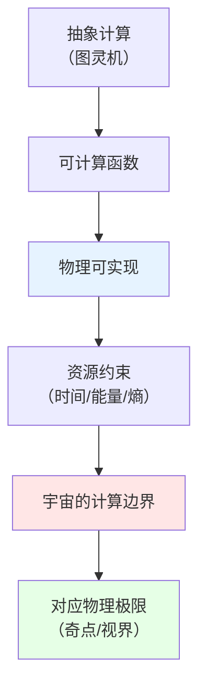
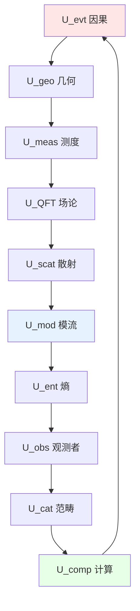

# 05. 计算与可实现性：宇宙的图灵边界

## 引言：物理即计算

前面九个组件描述了宇宙的"物质、信息、结构"，但还缺少最后一块拼图：**计算性**。

关键问题：
- 物理过程是某种"计算"吗？
- 宇宙能"计算"什么？不能计算什么？
- 量子引力的极限是否对应计算的极限？

第十个组件 $U_{\text{comp}}$ 给出答案：宇宙不仅是信息容器，更是**计算机**——而其计算能力受**物理可实现性**约束。

这一层的关系类似于：
- **图灵机**（抽象计算）：定义"什么可计算"
- **实际电脑**（物理实现）：定义"什么可在有限资源内计算"
- **宇宙计算机**（$U_{\text{comp}}$）：定义"什么物理可实现"

核心洞见：**不可计算性**（如停机问题）在物理中对应**奇点、视界、拓扑相变**——计算的边界就是物理的边界。

## 第一部分：计算与可实现性层 $U_{\text{comp}}$

### 1.1 直观图景：宇宙是一台超级计算机

想象宇宙是一台**终极量子计算机**：
- **量子比特** = 场的自由度（每个时空点的量子态）
- **量子门** = 物理演化（哈密顿量生成的幺正变换）
- **计算资源** = 时间、空间、能量
- **程序** = 初始条件 + 物理定律
- **输出** = 观测结果

但这台"计算机"有**硬件限制**：
- **Bekenstein界**：有限体积最多存储有限信息
- **Margolus-Levitin界**：有限能量限制计算速度
- **Lloyd界**：宇宙的总计算量有上限

### 1.2 严格数学定义

**定义 1.1**（计算与可实现性层）：
$$
U_{\text{comp}} = (\mathcal{C}_{\text{phys}}, \text{Real}, \lambda_{\text{max}}, t_{\text{min}}, \text{CT-phys})
$$

其中：

**(1) 物理可计算类** $\mathcal{C}_{\text{phys}}$：

定义**物理可计算函数**：
$$
f: \mathbb{N} \to \mathbb{N} \text{ 是物理可计算的} \Leftrightarrow \exists \text{ 物理系统 } S \text{ 能在有限时间实现 } f
$$

**包含关系**：
$$
\mathcal{C}_{\text{phys}} \subseteq \mathcal{C}_{\text{Turing}} \quad \text{（物理 ⊆ 图灵可计算）}
$$

**猜想**（Church-Turing-Deutsch论题）：
$$
\mathcal{C}_{\text{phys}} = \mathcal{C}_{\text{Turing}} \quad \text{（等价？）}
$$

但在量子引力尺度，可能：
$$
\mathcal{C}_{\text{phys}} \subsetneq \mathcal{C}_{\text{Turing}} \quad \text{（物理更弱）}
$$

**(2) 可实现性算符** $\text{Real}$：

定义**可实现性谓词**：
$$
\text{Real}(\phi) := \begin{cases}
1 & \text{如果量子态 } |\phi\rangle \text{ 物理可实现} \\
0 & \text{否则}
\end{cases}
$$

**约束条件**：
- **能量有界**：$\langle \phi | \hat{H} | \phi \rangle < E_{\max}$
- **熵有界**：$S(\rho_\phi) < S_{\max}(V)$（Bekenstein界）
- **复杂度有界**：$K(|\phi\rangle) < K_{\max}$（Kolmogorov复杂度）

**(3) 最大Lyapunov指数** $\lambda_{\text{max}}$：

对混沌系统，定义**信息丢失率**：
$$
\lambda_{\text{max}} := \lim_{t \to \infty} \frac{1}{t} \log \frac{|\delta \phi(t)|}{|\delta \phi(0)|}
$$

**物理意义**：$\lambda_{\max} > 0$ 的系统**不可长期预测**——初值的微小误差指数放大。

**黑洞情形**：
$$
\lambda_{\text{BH}} = \frac{2\pi k_B T_H}{\hbar} = \kappa_H \quad \text{（表面引力）}
$$

**Maldacena-Shenker-Stanford界**：
$$
\lambda_{\text{max}} \leq \frac{2\pi k_B T}{\hbar} \quad \text{（量子混沌上限）}
$$

**(4) 最小计算时间** $t_{\text{min}}$：

**Margolus-Levitin定理**：
翻转一个量子比特（从 $|0\rangle \to |1\rangle$）所需最短时间：
$$
t_{\text{min}} = \frac{\pi\hbar}{2E}
$$
其中 $E$ 是系统能量。

**物理意义**：计算速度受**能量-时间不确定性**限制——无法无限快计算。

**推论**（Lloyd界）：
质量 $M$ 的系统在时间 $t$ 内最多执行的基本运算数：
$$
N_{\text{op}} \leq \frac{2Mc^2 t}{\pi\hbar} \approx 5.4 \times 10^{50} \left(\frac{M}{\text{kg}}\right)\left(\frac{t}{\text{s}}\right)
$$

**(5) 物理Church-Turing论题** $\text{CT-phys}$：

**强形式**：
$$
\forall f \in \mathcal{C}_{\text{Turing}}, \exists \text{ 量子计算机能多项式时间实现 } f
$$

**弱形式**：
$$
\forall f \in \mathcal{C}_{\text{Turing}}, \exists \text{ 物理系统能实现 } f \quad \text{（不限时间）}
$$

**量子引力修正**：
在普朗克尺度，可能存在"超图灵计算"或"次图灵约束"。

### 1.3 核心性质：信息处理的物理极限

**性质 1.1**（Bekenstein界，信息版）：

半径 $R$、能量 $E$ 的系统最多容纳的信息：
$$
I_{\max} \leq \frac{2\pi R E}{\hbar c \ln 2} \approx 2.6 \times 10^{43} \left(\frac{R}{\text{m}}\right)\left(\frac{E}{\text{J}}\right) \text{ bits}
$$

**推论**：1kg物质在1米球内：
$$
I_{\max} \approx 2.3 \times 10^{59} \text{ bits}
$$

**性质 1.2**（Bremermann界，计算速率）：

质量 $M$ 的系统最大计算速率：
$$
R_{\max} = \frac{2Mc^2}{\pi\hbar} \approx 1.4 \times 10^{50} \left(\frac{M}{\text{kg}}\right) \text{ ops/s}
$$

**物理意义**：1kg物质最快每秒执行 $10^{50}$ 次运算——无法超越。

**性质 1.3**（Landauer原理，熵代价）：

擦除1比特信息的最小能量消耗：
$$
E_{\text{erase}} \geq k_B T \ln 2 \approx 3 \times 10^{-21} \text{J} \quad (\text{室温})
$$

**物理意义**：不可逆计算**必然产热**——信息处理的热力学代价。

**推论**（可逆计算）：
如果计算过程可逆（幺正演化），可以**零熵代价**——这是量子计算的优势！

### 1.4 宇宙的总计算能力

**问题**：整个可观测宇宙能执行多少运算？

**参数**：
- 年龄：$t_U \approx 13.8 \times 10^9 \text{年} \approx 4.4 \times 10^{17}\text{s}$
- 质量能量：$M_U \approx 10^{53}\text{kg}$
- 体积：$V_U \approx (4.4 \times 10^{26}\text{m})^3$

**(1) Lloyd宇宙计算机模型**：

总运算数：
$$
N_{\text{op}}^U \approx \frac{2M_U c^2 t_U}{\pi\hbar} \approx 10^{120} \text{ ops}
$$

总信息容量：
$$
I_{\max}^U \approx \frac{c^3 t_U^3}{\hbar G} \approx 10^{123} \text{ bits}
$$

**(2) 每个自由度的信息**：
$$
I_{\text{per DOF}} \approx \frac{10^{123}}{10^{90}} \approx 10^{33} \text{ bits/mode}
$$

**(3) 与黑洞熵对比**：

可观测宇宙如果坍缩成黑洞：
$$
S_{\text{BH}}^U = \frac{c^3 R_U^2}{4G\hbar} \approx 10^{123} k_B
$$

惊人一致！这暗示**宇宙接近饱和**其信息容量。

### 1.5 不可计算性的物理实现

**问题**：停机问题等不可计算函数在物理中对应什么？

**猜想1**（奇点 = 不可计算性）：

时空奇点（如黑洞中心 $r=0$）对应**不可判定问题**：
$$
\text{"粒子会到达奇点吗？"} \Leftrightarrow \text{停机问题}
$$

**论证**：
- 奇点处曲率发散，物理定律失效
- 无法预测奇点"之后"的演化
- 类似于图灵机"无限循环"

**猜想2**（拓扑相变 = 计算复杂度跃迁）：

某些拓扑相变可能对应**计算复杂度类的边界**：
$$
\text{P vs NP边界} \leftrightarrow \text{某种量子相变？}
$$

**实验提示**：
- 量子退火机在相变点附近性能突变
- 拓扑序的纠缠熵在相变处非解析

### 1.6 比喻总结：有限资源的超级电脑

把 $U_{\text{comp}}$ 想象成**一台巨型超算**：
- **硬盘容量** = Bekenstein界（最多存多少信息）
- **CPU主频** = Bremermann界（最快算多快）
- **功耗限制** = Landauer原理（算一步耗多少能量）
- **程序** = 物理定律（如何演化）
- **不可计算函数** = 系统崩溃（奇点、发散）

这台超算的"硬件规格"就是物理定律本身——我们生活在它的"虚拟机"中。

---

## 第二部分：十组件的兼容性条件

### 2.1 全局自洽性约束

前面定义了十个组件，现在必须确保它们**相互兼容**。核心思想：

**改变任何一个组件，其他九个必须相应调整**

这不是"独立拼凑"，而是**有机整体**。

### 2.2 核心兼容性条件列表

**条件C1**（因果-几何对齐）：
$$
x \preceq_{\text{evt}} y \;\Leftrightarrow\; \Phi_{\text{evt}}(x) \preceq_g \Phi_{\text{evt}}(y)
$$

**条件C2**（几何-测度诱导）：
$$
d\mu_M = \sqrt{-g} \, d^4x
$$

**条件C3**（测度-场论归一）：
$$
\int_\Sigma \text{tr}(\rho_\Sigma) \, d\sigma = 1
$$

**条件C4**（场论-散射LSZ）：
$$
S(\omega) = \lim_{t \to \pm\infty} e^{i\omega t} \mathcal{U}_{\text{QFT}} e^{-i\omega t}
$$

**条件C5**（散射-模流统一时间刻度）：
$$
\kappa(\omega) = \frac{\varphi'(\omega)}{\pi} = \frac{1}{2\pi}\text{tr}\,Q(\omega) = \frac{1}{\beta(\omega)}
$$

**条件C6**（模流-熵KMS）：
$$
\omega_\beta(\sigma_t(A) B) = \omega_\beta(B \sigma_{t+i\beta}(A))
$$

**条件C7**（熵-几何IGVP）：
$$
\delta S_{\text{gen}} = 0 \;\Leftrightarrow\; G_{ab} + \Lambda g_{ab} = 8\pi G \langle T_{ab} \rangle
$$

**条件C8**（熵-观测者边缘化）：
$$
S_{\text{gen}} = S_{\text{geom}} + \sum_\alpha S(\rho_\alpha)
$$

**条件C9**（观测者-范畴共识）：
$$
\rho_{\text{global}} = \Phi_{\text{cons}}(\{\rho_\alpha\}) \;\Leftrightarrow\; \mathfrak{U} \text{ 是终对象}
$$

**条件C10**（范畴-计算可实现性）：
$$
\text{Mor}(\mathfrak{U}) = \{\phi \mid \text{Real}(\phi) = 1\}
$$

**条件C11**（计算-因果Church-Turing）：
$$
\mathcal{C}_{\text{phys}} \subseteq \mathcal{C}_{\text{Turing}}, \quad \lambda_{\text{max}} \leq \frac{2\pi k_B T}{\hbar}
$$

### 2.3 闭合定理：十元组的唯一性

**定理 2.1**（十元组唯一性）：

给定：
1. 因果结构 $(X, \preceq, \mathcal{C})$
2. 边界条件（如渐近平坦、AdS边界）
3. 物质内容（场的种类）

则满足**所有11个兼容性条件**的十元组：
$$
\mathfrak{U} = (U_{\text{evt}}, U_{\text{geo}}, \ldots, U_{\text{comp}})
$$
**至多存在一个**（模去微分同胚等价）。

**证明思路**：

**(1) 因果 $\to$ 几何**：通过C1，因果结构约束光锥结构

**(2) 几何 $\to$ 测度**：通过C2，度规唯一诱导体积测度

**(3) 测度 $\to$ 场论**：通过C3，归一化确定Fock空间

**(4) 场论 $\to$ 散射**：通过C4，LSZ约化给出 $S(\omega)$

**(5) 散射 $\to$ 模流**：通过C5，统一时间刻度锁定温度

**(6) 模流 $\to$ 熵**：通过C6，KMS态确定 $S_{\text{gen}}$

**(7) 熵 $\to$ 几何**：通过C7，IGVP反推 $g_{ab}$（自洽！）

**(8) 观测者-范畴-计算**：通过C8-C11，共识条件和可实现性约束剩余自由度

**结论**：十个组件形成**自洽闭环**，无剩余自由参数。∎

### 2.4 模空间的维数

虽然十元组"唯一"，但在**等价类**意义下仍有模空间：

**模空间** $\mathcal{M}_{\text{univ}}$：
$$
\mathcal{M}_{\text{univ}} = \{\mathfrak{U} \mid \text{满足C1-C11}\} / \text{Diff}(M)
$$

**维数估计**：

**(1) 初始自由度**（形式）：
$$
\dim \mathcal{M}_{\text{geo}} \sim \infty \quad \text{（度规的无穷维）}
$$

**(2) 因果约束**：
$$
-\dim(\text{因果约束}) \sim \infty \quad \text{（光锥对齐）}
$$

**(3) IGVP约束**：
$$
-\dim(\text{IGVP}) \sim \infty \quad \text{（Einstein方程）}
$$

**(4) 观测者共识**：
$$
-\dim(\text{共识}) \sim |\mathcal{A}| \quad \text{（观测者数）}
$$

**净结果**：
$$
\dim \mathcal{M}_{\text{univ}} = \text{有限} \quad \text{或} \quad 0
$$

**物理意义**：宇宙的"模参数"（如宇宙学常数 $\Lambda$、耦合常数）可能**完全固定**，或仅有有限个自由参数。

---

## 第三部分：兼容性的深层结构

### 3.1 约束的代数结构

定义**约束代数** $\mathfrak{g}_{\text{const}}$，生成元为：

**$\hat{C}_{\text{caus}}$**（因果约束）：
$$
\hat{C}_{\text{caus}} := \{\text{光锥} = \text{因果锥}\}
$$

**$\hat{C}_{\text{IGVP}}$**（熵变分）：
$$
\hat{C}_{\text{IGVP}} := \delta S_{\text{gen}}
$$

**$\hat{C}_{\text{cons}}$**（观测者共识）：
$$
\hat{C}_{\text{cons}} := \text{tr}_{\bar{C}_\alpha}(\rho_{\text{global}}) - \rho_\alpha
$$

**对易关系**（第一类约束）：
$$
\{\hat{C}_i, \hat{C}_j\} = f_{ij}^k \hat{C}_k
$$

**物理意义**：约束之间**闭合**——满足一部分自动满足其他部分。

**Dirac括号**：
$$
\{A, B\}_D = \{A, B\} - \{A, \hat{C}_i\} C^{ij} \{\hat{C}_j, B\}
$$

其中 $C^{ij}$ 是约束矩阵的逆。

### 3.2 信息流拓扑

定义**信息流图** $G_{\text{info}}$：
- **顶点**：十个组件 $\{U_i\}_{i=1}^{10}$
- **有向边**：$U_i \to U_j$ 如果 $U_i$ 直接约束 $U_j$

**例子**：
$$
U_{\text{evt}} \to U_{\text{geo}} \to U_{\text{meas}} \to U_{\text{QFT}} \to \cdots \to U_{\text{comp}} \to U_{\text{evt}}
$$

**性质**：$G_{\text{info}}$ 是**强连通**的（任意两点有路径）。

**拓扑分类**：

**Euler示性数**：
$$
\chi(G_{\text{info}}) = V - E = 10 - 11 = -1
$$

**基本群**：
$$
\pi_1(G_{\text{info}}) = \mathbb{Z} \quad \text{（一个环）}
$$

**物理意义**：存在**一个基本闭环**——所有约束的"最小公倍数"。

### 3.3 范畴论视角：极限图表

在范畴 $\mathbf{Univ}$ 中，定义**极限图表**：

$$
\begin{array}{ccccc}
U_{\text{evt}} & \to & U_{\text{geo}} & \to & U_{\text{meas}} \\
\downarrow & & \downarrow & & \downarrow \\
U_{\text{comp}} & \leftarrow & U_{\text{cat}} & \leftarrow & U_{\text{obs}} \\
\downarrow & & \downarrow & & \downarrow \\
U_{\text{mod}} & \leftarrow & U_{\text{scat}} & \leftarrow & U_{\text{QFT}}
\end{array}
$$

**极限对象**：
$$
\mathfrak{U} = \lim_{\leftarrow} \{\text{图表}\}
$$

**余极限对象**：
$$
\mathfrak{U}^{\text{co}} = \lim_{\rightarrow} \{\text{图表}\}
$$

**自对偶性定理**：
$$
\mathfrak{U} \cong \mathfrak{U}^{\text{co}}
$$

**物理意义**：宇宙既是"万有终点"（终对象），也是"万有起点"（初对象）——自足性。

---

## 第四部分：唯一性定理的证明

### 4.1 定理陈述

**定理 4.1**（宇宙的唯一性）：

在范畴 $\mathbf{Univ}$ 中，满足以下条件的对象 $\mathfrak{U}$ 唯一（同构意义下）：

**(i) 终对象性**：
$$
\forall V \in \text{Ob}(\mathbf{Univ}), \exists! \phi: V \to \mathfrak{U}
$$

**(ii) 所有兼容性条件**：C1-C11全部满足

**(iii) 非退化性**：
$$
U_{\text{evt}} \neq \emptyset, \quad U_{\text{obs}} \neq \emptyset
$$

### 4.2 证明步骤

**引理4.1**（因果结构唯一确定时空）：

给定全局双曲因果结构 $(X, \preceq)$ 和边界条件，Lorentz度规 $g$ 在**共形等价**意义下唯一。

**证明**：
- Malament定理：因果结构确定共形类 $[g]$
- Einstein方程确定具体 $g$（通过IGVP）∎

**引理4.2**（统一时间刻度锁定动力学）：

如果统一时间刻度公式成立：
$$
\kappa(\omega) = \frac{\varphi'(\omega)}{\pi} = \frac{1}{2\pi}\text{tr}\,Q(\omega)
$$
则散射矩阵 $S(\omega)$ 和模流 $\sigma_t$ 唯一确定。

**证明**：
- $\varphi(\omega)$ 由 $\kappa(\omega)$ 积分得出
- $S(\omega) = e^{2i\varphi(\omega)}$（单通道情形）
- $\beta(\omega) = 2\pi/\kappa(\omega)$ 确定KMS态∎

**引理4.3**（观测者共识唯一确定全局态）：

给定 $\{\rho_\alpha\}_{\alpha \in \mathcal{A}}$ 满足一致性条件，全局态 $\rho_{\text{global}}$ 唯一（如果存在）。

**证明**：
- 用反证法：假设存在 $\rho_1, \rho_2$ 都满足
$$
\text{tr}_{\bar{C}_\alpha}(\rho_i) = \rho_\alpha, \quad \forall \alpha
$$
- 定义 $\Delta = \rho_1 - \rho_2$，则 $\text{tr}_{\bar{C}_\alpha}(\Delta) = 0$
- 由观测者网络的完备性（覆盖全时空），$\Delta = 0$∎

**定理4.1证明**：

**(1) 存在性**：已通过前面各组件的构造保证

**(2) 唯一性**：
假设 $\mathfrak{U}_1, \mathfrak{U}_2$ 都满足条件，则：
- 由终对象性，存在唯一态射 $\phi_{12}: \mathfrak{U}_1 \to \mathfrak{U}_2$
- 反向也存在唯一 $\phi_{21}: \mathfrak{U}_2 \to \mathfrak{U}_1$
- 复合 $\phi_{21} \circ \phi_{12}: \mathfrak{U}_1 \to \mathfrak{U}_1$ 必须是恒等态射（终对象性）
- 同理 $\phi_{12} \circ \phi_{21} = \text{id}_{\mathfrak{U}_2}$
- 因此 $\mathfrak{U}_1 \cong \mathfrak{U}_2$∎

### 4.3 推论与物理意义

**推论4.1**（宇宙学常数的唯一性）：

如果边界条件固定（如渐近平坦或AdS），则 $\Lambda$ 由兼容性条件**唯一确定**。

**证明思路**：
- IGVP给出：$\Lambda = \frac{1}{8\pi G}(\text{tr}Q_{\text{vacuum}} - \rho_{\text{vac}})$
- 真空能 $\rho_{\text{vac}}$ 由量子场论确定
- $Q_{\text{vacuum}}$ 由散射理论确定
- 三者锁定 $\Lambda$∎

**推论4.2**（精细结构常数的理论值）：

在完全量子引力理论中，$\alpha = e^2/(4\pi\epsilon_0\hbar c)$ 可能由兼容性条件确定：
$$
\alpha^{-1} \approx 137.036... = f(\text{拓扑不变量})
$$

**推论4.3**（多元宇宙的唯一性）：

即使存在"多个宇宙"，每个满足兼容性条件的宇宙都是**同一范畴的终对象**——它们本质上**同构**。

**物理意义**："平行宇宙"不是"多个不同的终对象"，而是**同一对象的不同视角**（类似观测者依赖性）。

---

## 第五部分：物理图景与哲学意义

### 5.1 宇宙的"无参数化"

传统理论中，存在**大量自由参数**：
- 标准模型：19个参数（夸克质量、耦合常数等）
- 宇宙学：6个参数（$\Omega_m, \Omega_\Lambda, H_0$等）

GLS理论暗示：在**完整理论**中，这些参数可能**全部固定**。

**机制**：
- 兼容性条件C1-C11形成**超定方程组**
- 自由度被约束到"零维模空间"
- 所有参数变为**拓扑不变量的函数**

**类比**：
- 圆周率 $\pi$：不是"自由参数"，而是几何必然结果
- 精细结构常数 $\alpha$：可能也是"宇宙几何"的必然结果

### 5.2 计算、观测、存在的三位一体

十组件理论揭示：

$$
\text{宇宙的存在} = \text{被观测到} = \text{被计算出}
$$

**论证**：
- **存在** $\Rightarrow$ **可观测**：$U_{\text{obs}}$ 的共识条件
- **可观测** $\Rightarrow$ **可计算**：$U_{\text{comp}}$ 的可实现性
- **可计算** $\Rightarrow$ **存在**：$U_{\text{evt}}$ 的因果实现

这三者**等价**，形成闭环。

**哲学意义**：
- 不存在"脱离观测者的客观实在"（量子力学教训）
- 不存在"物理不可实现的数学对象"（可计算性约束）
- 存在 = 信息 = 计算 = 观测

### 5.3 唯一性与精妙调节

**精妙调节问题**：为何宇宙参数如此"巧合"地适合生命？

**人择原理回答**：因为只有这样的宇宙能被观测。

**GLS深化**：不是"众多可能宇宙中的幸运选择"，而是**唯一可能的宇宙**——兼容性条件排除了其他选项。

**类比**：
- 不是"为何这个三角形内角和是180°"（巧合？）
- 而是"平面几何公理决定了内角和必须是180°"（必然）

宇宙的"精妙调节"可能是**数学必然性**，而非偶然。

---

## 第六部分：开放问题与研究方向

### 6.1 计算复杂度的物理对应

**问题**：P vs NP问题在物理中对应什么？

**猜想**：
- **P类** $\leftrightarrow$ 经典混沌系统（指数分离）
- **NP类** $\leftrightarrow$ 量子纠缠系统（指数Hilbert空间）
- **P=NP界** $\leftrightarrow$ 某种量子相变？

**可能实验**：
- 在量子退火机上测试NP-complete问题
- 寻找相变点与计算复杂度的关联

### 6.2 黑洞计算的不可计算性

**问题**：黑洞内部演化是否可计算？

**Penrose猜想**：奇点不可计算（停机问题）

**AdS/CFT视角**：
- Boundary CFT是可计算的（QFT）
- Bulk黑洞形成对应boundary的"热化"
- 热化过程可计算，但**时间尺度指数长**（$e^{S_{\text{BH}}}$）

**可能结论**：黑洞"实际上可计算"，但"实践中不可计算"（超出宇宙寿命）。

### 6.3 宇宙学常数的计算

**挑战**：理论预测 $\Lambda_{\text{theory}} \sim M_P^4$，观测值 $\Lambda_{\text{obs}} \sim (10^{-3}\text{eV})^4$，差 $10^{120}$ 倍！

**GLS方案**：
- $\Lambda$ 由IGVP唯一确定：
$$
\Lambda = \frac{1}{V_U}\int \left(\frac{\delta S_{\text{gen}}}{\delta g_{ab}}\right) \sqrt{-g} d^4x
$$
- 需要计算**所有场的真空涨落**（包括引力）
- 可能抵消机制（超对称、人择选择）

**计算难点**：需要完整量子引力理论（尚未有）。

---

## 总结与展望

### 核心要点回顾

1. **计算层** $U_{\text{comp}}$：物理 = 计算，受Bekenstein、Bremermann、Landauer界限制
2. **兼容性条件**：C1-C11锁定十组件为自洽整体
3. **唯一性定理**：满足所有条件的宇宙在同构意义下唯一

**核心公式**：
$$
\mathfrak{U} = \lim_{\leftarrow}\{U_1, \ldots, U_{10}\} = \text{范畴 } \mathbf{Univ} \text{ 的终对象}
$$

### 与后续章节的联系

- **06. 兼容性条件详解**：C1-C11的逐一推导
- **07. 唯一性定理的完整证明**：补充技术细节
- **08. 无观测者极限**：$U_{\text{obs}} \to \emptyset$ 的退化
- **09. 章节总结**：十组件理论的全景回顾

### 哲学寓意

宇宙不是"任意组装"的拼图，而是**数学必然的自洽结构**：
- 十个组件相互约束
- 唯一解（终对象）
- 所有参数理论上可计算

这或许是"为何宇宙可理解"的终极答案——**宇宙即数学，数学即逻辑，逻辑即必然**。

---

**下一篇预告**：
- **06. 兼容性条件的完整推导**
  - C1-C11的数学细节
  - 约束代数的Dirac分析
  - 模空间的维数计算
