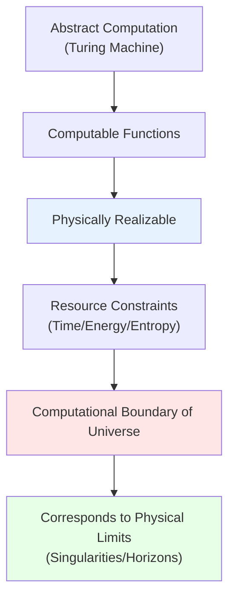
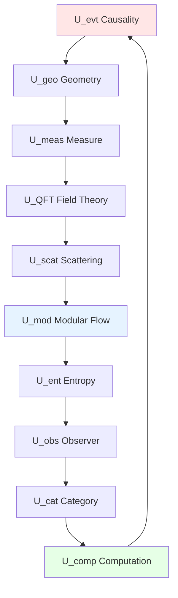

# 05. Computation and Realizability: Turing Boundary of Universe

## Introduction: Physics as Computation

Previous nine components describe "matter, information, structure" of universe, but still missing final piece: **computability**.

Key questions:
- Are physical processes some kind of "computation"?
- What can universe "compute"? What cannot?
- Do limits of quantum gravity correspond to limits of computation?

Tenth component $U_{\text{comp}}$ gives answer: Universe is not only information container, but **computer**—and its computational power constrained by **physical realizability**.

Relationship of this layer is similar to:
- **Turing Machine** (abstract computation): Defines "what is computable"
- **Actual Computer** (physical realization): Defines "what can be computed with finite resources"
- **Universe Computer** ($U_{\text{comp}}$): Defines "what is physically realizable"

Core insight: **Uncomputability** (e.g., halting problem) corresponds to **singularities, horizons, topological phase transitions** in physics—boundary of computation is boundary of physics.

## Part I: Computation and Realizability Layer $U_{\text{comp}}$

### 1.1 Intuitive Picture: Universe as Supercomputer

Imagine universe as **ultimate quantum computer**:
- **Qubits** = Degrees of freedom of fields (quantum state at each spacetime point)
- **Quantum Gates** = Physical evolution (unitary transformations generated by Hamiltonian)
- **Computational Resources** = Time, space, energy
- **Program** = Initial conditions + physical laws
- **Output** = Observation results

But this "computer" has **hardware limitations**:
- **Bekenstein Bound**: Finite volume can store at most finite information
- **Margolus-Levitin Bound**: Finite energy limits computation speed
- **Lloyd Bound**: Total computation of universe has upper bound

### 1.2 Strict Mathematical Definition

**Definition 1.1** (Computation and Realizability Layer):
$$
U_{\text{comp}} = (\mathcal{C}_{\text{phys}}, \text{Real}, \lambda_{\text{max}}, t_{\text{min}}, \text{CT-phys})
$$

where:

**(1) Physically Computable Class** $\mathcal{C}_{\text{phys}}$:

Define **physically computable function**:
$$
f: \mathbb{N} \to \mathbb{N} \text{ is physically computable} \Leftrightarrow \exists \text{ physical system } S \text{ can realize } f \text{ in finite time}
$$

**Inclusion Relation**:
$$
\mathcal{C}_{\text{phys}} \subseteq \mathcal{C}_{\text{Turing}} \quad \text{(physical ⊆ Turing computable)}
$$

**Conjecture** (Church-Turing-Deutsch Thesis):
$$
\mathcal{C}_{\text{phys}} = \mathcal{C}_{\text{Turing}} \quad \text{(equivalent?)}
$$

But at quantum gravity scale, possibly:
$$
\mathcal{C}_{\text{phys}} \subsetneq \mathcal{C}_{\text{Turing}} \quad \text{(physical weaker)}
$$

**(2) Realizability Operator** $\text{Real}$:

Define **realizability predicate**:
$$
\text{Real}(\phi) := \begin{cases}
1 & \text{if quantum state } |\phi\rangle \text{ is physically realizable} \\
0 & \text{otherwise}
\end{cases}
$$

**Constraint Conditions**:
- **Energy Bounded**: $\langle \phi | \hat{H} | \phi \rangle < E_{\max}$
- **Entropy Bounded**: $S(\rho_\phi) < S_{\max}(V)$ (Bekenstein bound)
- **Complexity Bounded**: $K(|\phi\rangle) < K_{\max}$ (Kolmogorov complexity)

**(3) Maximum Lyapunov Exponent** $\lambda_{\text{max}}$:

For chaotic systems, define **information loss rate**:
$$
\lambda_{\text{max}} := \lim_{t \to \infty} \frac{1}{t} \log \frac{|\delta \phi(t)|}{|\delta \phi(0)|}
$$

**Physical Meaning**: Systems with $\lambda_{\max} > 0$ **not long-term predictable**—small initial errors exponentially amplified.

**Black Hole Case**:
$$
\lambda_{\text{BH}} = \frac{2\pi k_B T_H}{\hbar} = \kappa_H \quad \text{(surface gravity)}
$$

**Maldacena-Shenker-Stanford Bound**:
$$
\lambda_{\text{max}} \leq \frac{2\pi k_B T}{\hbar} \quad \text{(quantum chaos upper bound)}
$$

**(4) Minimum Computation Time** $t_{\text{min}}$:

**Margolus-Levitin Theorem**:
Shortest time to flip a qubit (from $|0\rangle \to |1\rangle$):
$$
t_{\text{min}} = \frac{\pi\hbar}{2E}
$$
where $E$ is system energy.

**Physical Meaning**: Computation speed limited by **energy-time uncertainty**—cannot compute infinitely fast.

**Corollary** (Lloyd Bound):
Maximum number of basic operations system of mass $M$ can execute in time $t$:
$$
N_{\text{op}} \leq \frac{2Mc^2 t}{\pi\hbar} \approx 5.4 \times 10^{50} \left(\frac{M}{\text{kg}}\right)\left(\frac{t}{\text{s}}\right)
$$

**(5) Physical Church-Turing Thesis** $\text{CT-phys}$:

**Strong Form**:
$$
\forall f \in \mathcal{C}_{\text{Turing}}, \exists \text{ quantum computer can realize } f \text{ in polynomial time}
$$

**Weak Form**:
$$
\forall f \in \mathcal{C}_{\text{Turing}}, \exists \text{ physical system can realize } f \quad \text{(unlimited time)}
$$

**Quantum Gravity Correction**:
At Planck scale, may exist "super-Turing computation" or "sub-Turing constraints".

### 1.3 Core Properties: Physical Limits of Information Processing

**Property 1.1** (Bekenstein Bound, Information Version):

Maximum information system of radius $R$, energy $E$ can accommodate:
$$
I_{\max} \leq \frac{2\pi R E}{\hbar c \ln 2} \approx 2.6 \times 10^{43} \left(\frac{R}{\text{m}}\right)\left(\frac{E}{\text{J}}\right) \text{ bits}
$$

**Corollary**: 1kg matter in 1m sphere:
$$
I_{\max} \approx 2.3 \times 10^{59} \text{ bits}
$$

**Property 1.2** (Bremermann Bound, Computation Rate):

Maximum computation rate of system of mass $M$:
$$
R_{\max} = \frac{2Mc^2}{\pi\hbar} \approx 1.4 \times 10^{50} \left(\frac{M}{\text{kg}}\right) \text{ ops/s}
$$

**Physical Meaning**: 1kg matter fastest executes $10^{50}$ operations per second—cannot exceed.

**Property 1.3** (Landauer Principle, Entropy Cost):

Minimum energy consumption to erase 1 bit of information:
$$
E_{\text{erase}} \geq k_B T \ln 2 \approx 3 \times 10^{-21} \text{J} \quad (\text{room temperature})
$$

**Physical Meaning**: Irreversible computation **necessarily produces heat**—thermodynamic cost of information processing.

**Corollary** (Reversible Computation):
If computation process reversible (unitary evolution), can have **zero entropy cost**—this is advantage of quantum computation!

### 1.4 Total Computational Power of Universe

**Question**: How many operations can entire observable universe execute?

**Parameters**:
- Age: $t_U \approx 13.8 \times 10^9 \text{ years} \approx 4.4 \times 10^{17}\text{s}$
- Mass-energy: $M_U \approx 10^{53}\text{kg}$
- Volume: $V_U \approx (4.4 \times 10^{26}\text{m})^3$

**(1) Lloyd Universe Computer Model**:

Total operations:
$$
N_{\text{op}}^U \approx \frac{2M_U c^2 t_U}{\pi\hbar} \approx 10^{120} \text{ ops}
$$

Total information capacity:
$$
I_{\max}^U \approx \frac{c^3 t_U^3}{\hbar G} \approx 10^{123} \text{ bits}
$$

**(2) Information Per Degree of Freedom**:
$$
I_{\text{per DOF}} \approx \frac{10^{123}}{10^{90}} \approx 10^{33} \text{ bits/mode}
$$

**(3) Comparison with Black Hole Entropy**:

If observable universe collapses into black hole:
$$
S_{\text{BH}}^U = \frac{c^3 R_U^2}{4G\hbar} \approx 10^{123} k_B
$$

Remarkably consistent! This suggests **universe near saturation** of its information capacity.

### 1.5 Physical Realization of Uncomputability

**Question**: What do uncomputable functions like halting problem correspond to in physics?

**Conjecture 1** (Singularity = Uncomputability):

Spacetime singularities (e.g., black hole center $r=0$) correspond to **undecidable problems**:
$$
\text{"Will particle reach singularity?"} \Leftrightarrow \text{halting problem}
$$

**Argument**:
- Curvature diverges at singularity, physical laws fail
- Cannot predict evolution "after" singularity
- Similar to Turing machine "infinite loop"

**Conjecture 2** (Topological Phase Transition = Computational Complexity Jump):

Some topological phase transitions may correspond to **boundaries of computational complexity classes**:
$$
\text{P vs NP boundary} \leftrightarrow \text{some quantum phase transition?}
$$

**Experimental Hints**:
- Quantum annealers show sudden performance changes near phase transition points
- Entanglement entropy of topological order non-analytic at phase transition

### 1.6 Analogy Summary: Supercomputer with Finite Resources

Imagine $U_{\text{comp}}$ as **giant supercomputer**:
- **Hard Disk Capacity** = Bekenstein bound (maximum information storage)
- **CPU Clock Rate** = Bremermann bound (maximum computation speed)
- **Power Limit** = Landauer principle (energy per operation)
- **Program** = Physical laws (how to evolve)
- **Uncomputable Functions** = System crash (singularities, divergences)

"Hardware specifications" of this supercomputer are physical laws themselves—we live in its "virtual machine".

---

## Part II: Compatibility Conditions of Ten Components

### 2.1 Global Self-Consistency Constraints

Previously defined ten components, now must ensure they are **mutually compatible**. Core idea:

**Changing any one component, other nine must adjust accordingly**

This is not "independent assembly", but **organic whole**.

### 2.2 Core Compatibility Condition List

**Condition C1** (Causal-Geometric Alignment):
$$
x \preceq_{\text{evt}} y \;\Leftrightarrow\; \Phi_{\text{evt}}(x) \preceq_g \Phi_{\text{evt}}(y)
$$

**Condition C2** (Geometric-Measure Induction):
$$
d\mu_M = \sqrt{-g} \, d^4x
$$

**Condition C3** (Measure-Field Theory Normalization):
$$
\int_\Sigma \text{tr}(\rho_\Sigma) \, d\sigma = 1
$$

**Condition C4** (Field Theory-Scattering LSZ):
$$
S(\omega) = \lim_{t \to \pm\infty} e^{i\omega t} \mathcal{U}_{\text{QFT}} e^{-i\omega t}
$$

**Condition C5** (Scattering-Modular Flow Unified Time Scale):
$$
\kappa(\omega) = \frac{\varphi'(\omega)}{\pi} = \frac{1}{2\pi}\text{tr}\,Q(\omega) = \frac{1}{\beta(\omega)}
$$

**Condition C6** (Modular Flow-Entropy KMS):
$$
\omega_\beta(\sigma_t(A) B) = \omega_\beta(B \sigma_{t+i\beta}(A))
$$

**Condition C7** (Entropy-Geometry IGVP):
$$
\delta S_{\text{gen}} = 0 \;\Leftrightarrow\; G_{ab} + \Lambda g_{ab} = 8\pi G \langle T_{ab} \rangle
$$

**Condition C8** (Entropy-Observer Marginalization):
$$
S_{\text{gen}} = S_{\text{geom}} + \sum_\alpha S(\rho_\alpha)
$$

**Condition C9** (Observer-Category Consensus):
$$
\rho_{\text{global}} = \Phi_{\text{cons}}(\{\rho_\alpha\}) \;\Leftrightarrow\; \mathfrak{U} \text{ is terminal object}
$$

**Condition C10** (Category-Computation Realizability):
$$
\text{Mor}(\mathfrak{U}) = \{\phi \mid \text{Real}(\phi) = 1\}
$$

**Condition C11** (Computation-Causality Church-Turing):
$$
\mathcal{C}_{\text{phys}} \subseteq \mathcal{C}_{\text{Turing}}, \quad \lambda_{\text{max}} \leq \frac{2\pi k_B T}{\hbar}
$$

### 2.3 Closure Theorem: Uniqueness of 10-Tuple

**Theorem 2.1** (Uniqueness of 10-Tuple):

Given:
1. Causal structure $(X, \preceq, \mathcal{C})$
2. Boundary conditions (e.g., asymptotically flat, AdS boundary)
3. Matter content (types of fields)

Then 10-tuple satisfying **all 11 compatibility conditions**:
$$
\mathfrak{U} = (U_{\text{evt}}, U_{\text{geo}}, \ldots, U_{\text{comp}})
$$
**exists at most one** (modulo diffeomorphism equivalence).

**Proof Outline**:

**(1) Causality $\to$ Geometry**: Through C1, causal structure constrains light cone structure

**(2) Geometry $\to$ Measure**: Through C2, metric uniquely induces volume measure

**(3) Measure $\to$ Field Theory**: Through C3, normalization determines Fock space

**(4) Field Theory $\to$ Scattering**: Through C4, LSZ reduction gives $S(\omega)$

**(5) Scattering $\to$ Modular Flow**: Through C5, unified time scale locks temperature

**(6) Modular Flow $\to$ Entropy**: Through C6, KMS state determines $S_{\text{gen}}$

**(7) Entropy $\to$ Geometry**: Through C7, IGVP reverse derives $g_{ab}$ (self-consistent!)

**(8) Observer-Category-Computation**: Through C8-C11, consensus conditions and realizability constrain remaining degrees of freedom

**Conclusion**: Ten components form **self-consistent closed loop**, no remaining free parameters. ∎

### 2.4 Dimension of Moduli Space

Although 10-tuple "unique", still has moduli space in **equivalence class** sense:

**Moduli Space** $\mathcal{M}_{\text{univ}}$:
$$
\mathcal{M}_{\text{univ}} = \{\mathfrak{U} \mid \text{satisfies C1-C11}\} / \text{Diff}(M)
$$

**Dimension Estimate**:

**(1) Initial Degrees of Freedom** (formal):
$$
\dim \mathcal{M}_{\text{geo}} \sim \infty \quad \text{(infinite dimensions of metric)}
$$

**(2) Causal Constraints**:
$$
-\dim(\text{causal constraints}) \sim \infty \quad \text{(light cone alignment)}
$$

**(3) IGVP Constraints**:
$$
-\dim(\text{IGVP}) \sim \infty \quad \text{(Einstein equations)}
$$

**(4) Observer Consensus**:
$$
-\dim(\text{consensus}) \sim |\mathcal{A}| \quad \text{(number of observers)}
$$

**Net Result**:
$$
\dim \mathcal{M}_{\text{univ}} = \text{finite} \quad \text{or} \quad 0
$$

**Physical Meaning**: "Moduli parameters" of universe (e.g., cosmological constant $\Lambda$, coupling constants) may be **completely fixed**, or only finite free parameters.

---

## Part III: Deep Structure of Compatibility

### 3.1 Algebraic Structure of Constraints

Define **Constraint Algebra** $\mathfrak{g}_{\text{const}}$, generators:

**$\hat{C}_{\text{caus}}$** (Causal Constraint):
$$
\hat{C}_{\text{caus}} := \{\text{light cone} = \text{causal cone}\}
$$

**$\hat{C}_{\text{IGVP}}$** (Entropy Variation):
$$
\hat{C}_{\text{IGVP}} := \delta S_{\text{gen}}
$$

**$\hat{C}_{\text{cons}}$** (Observer Consensus):
$$
\hat{C}_{\text{cons}} := \text{tr}_{\bar{C}_\alpha}(\rho_{\text{global}}) - \rho_\alpha
$$

**Commutator Relations** (First-Class Constraints):
$$
\{\hat{C}_i, \hat{C}_j\} = f_{ij}^k \hat{C}_k
$$

**Physical Meaning**: Constraints **close**—satisfying some automatically satisfies others.

**Dirac Bracket**:
$$
\{A, B\}_D = \{A, B\} - \{A, \hat{C}_i\} C^{ij} \{\hat{C}_j, B\}
$$

where $C^{ij}$ is inverse of constraint matrix.

### 3.2 Information Flow Topology

Define **Information Flow Graph** $G_{\text{info}}$:
- **Vertices**: Ten components $\{U_i\}_{i=1}^{10}$
- **Directed Edges**: $U_i \to U_j$ if $U_i$ directly constrains $U_j$

**Example**:
$$
U_{\text{evt}} \to U_{\text{geo}} \to U_{\text{meas}} \to U_{\text{QFT}} \to \cdots \to U_{\text{comp}} \to U_{\text{evt}}
$$

**Property**: $G_{\text{info}}$ is **strongly connected** (any two points have path).

**Topological Classification**:

**Euler Characteristic**:
$$
\chi(G_{\text{info}}) = V - E = 10 - 11 = -1
$$

**Fundamental Group**:
$$
\pi_1(G_{\text{info}}) = \mathbb{Z} \quad \text{(one loop)}
$$

**Physical Meaning**: Exists **one fundamental closed loop**—"least common multiple" of all constraints.

### 3.3 Categorical Perspective: Limit Diagrams

In category $\mathbf{Univ}$, define **limit diagram**:

$$
\begin{array}{ccccc}
U_{\text{evt}} & \to & U_{\text{geo}} & \to & U_{\text{meas}} \\
\downarrow & & \downarrow & & \downarrow \\
U_{\text{comp}} & \leftarrow & U_{\text{cat}} & \leftarrow & U_{\text{obs}} \\
\downarrow & & \downarrow & & \downarrow \\
U_{\text{mod}} & \leftarrow & U_{\text{scat}} & \leftarrow & U_{\text{QFT}}
\end{array}
$$

**Limit Object**:
$$
\mathfrak{U} = \lim_{\leftarrow} \{\text{diagram}\}
$$

**Colimit Object**:
$$
\mathfrak{U}^{\text{co}} = \lim_{\rightarrow} \{\text{diagram}\}
$$

**Self-Duality Theorem**:
$$
\mathfrak{U} \cong \mathfrak{U}^{\text{co}}
$$

**Physical Meaning**: Universe is both "universal endpoint" (terminal object) and "universal starting point" (initial object)—self-sufficiency.

---

## Part IV: Proof of Uniqueness Theorem

### 4.1 Theorem Statement

**Theorem 4.1** (Uniqueness of Universe):

In category $\mathbf{Univ}$, object $\mathfrak{U}$ satisfying following conditions is unique (up to isomorphism):

**(i) Terminal Object Property**:
$$
\forall V \in \text{Ob}(\mathbf{Univ}), \exists! \phi: V \to \mathfrak{U}
$$

**(ii) All Compatibility Conditions**: C1-C11 all satisfied

**(iii) Non-Degeneracy**:
$$
U_{\text{evt}} \neq \emptyset, \quad U_{\text{obs}} \neq \emptyset
$$

### 4.2 Proof Steps

**Lemma 4.1** (Causal Structure Uniquely Determines Spacetime):

Given globally hyperbolic causal structure $(X, \preceq)$ and boundary conditions, Lorentz metric $g$ is unique in **conformal equivalence** sense.

**Proof**:
- Malament theorem: Causal structure determines conformal class $[g]$
- Einstein equation determines specific $g$ (through IGVP) ∎

**Lemma 4.2** (Unified Time Scale Locks Dynamics):

If unified time scale formula holds:
$$
\kappa(\omega) = \frac{\varphi'(\omega)}{\pi} = \frac{1}{2\pi}\text{tr}\,Q(\omega)
$$
then scattering matrix $S(\omega)$ and modular flow $\sigma_t$ uniquely determined.

**Proof**:
- $\varphi(\omega)$ obtained by integrating $\kappa(\omega)$
- $S(\omega) = e^{2i\varphi(\omega)}$ (single channel case)
- $\beta(\omega) = 2\pi/\kappa(\omega)$ determines KMS state ∎

**Lemma 4.3** (Observer Consensus Uniquely Determines Global State):

Given $\{\rho_\alpha\}_{\alpha \in \mathcal{A}}$ satisfying consistency conditions, global state $\rho_{\text{global}}$ unique (if exists).

**Proof**:
- By contradiction: Assume exist $\rho_1, \rho_2$ both satisfy
$$
\text{tr}_{\bar{C}_\alpha}(\rho_i) = \rho_\alpha, \quad \forall \alpha
$$
- Define $\Delta = \rho_1 - \rho_2$, then $\text{tr}_{\bar{C}_\alpha}(\Delta) = 0$
- By completeness of observer network (covers entire spacetime), $\Delta = 0$ ∎

**Proof of Theorem 4.1**:

**(1) Existence**: Guaranteed by construction of previous components

**(2) Uniqueness**:
Assume $\mathfrak{U}_1, \mathfrak{U}_2$ both satisfy conditions, then:
- By terminal object property, exists unique morphism $\phi_{12}: \mathfrak{U}_1 \to \mathfrak{U}_2$
- Reverse also exists unique $\phi_{21}: \mathfrak{U}_2 \to \mathfrak{U}_1$
- Composition $\phi_{21} \circ \phi_{12}: \mathfrak{U}_1 \to \mathfrak{U}_1$ must be identity morphism (terminal object property)
- Similarly $\phi_{12} \circ \phi_{21} = \text{id}_{\mathfrak{U}_2}$
- Therefore $\mathfrak{U}_1 \cong \mathfrak{U}_2$ ∎

### 4.3 Corollaries and Physical Meaning

**Corollary 4.1** (Uniqueness of Cosmological Constant):

If boundary conditions fixed (e.g., asymptotically flat or AdS), then $\Lambda$ **uniquely determined** by compatibility conditions.

**Proof Outline**:
- IGVP gives: $\Lambda = \frac{1}{8\pi G}(\text{tr}Q_{\text{vacuum}} - \rho_{\text{vac}})$
- Vacuum energy $\rho_{\text{vac}}$ determined by quantum field theory
- $Q_{\text{vacuum}}$ determined by scattering theory
- Three lock $\Lambda$ ∎

**Corollary 4.2** (Theoretical Value of Fine Structure Constant):

In complete quantum gravity theory, $\alpha = e^2/(4\pi\epsilon_0\hbar c)$ may be determined by compatibility conditions:
$$
\alpha^{-1} \approx 137.036... = f(\text{topological invariants})
$$

**Corollary 4.3** (Uniqueness of Multiverse):

Even if "multiple universes" exist, each universe satisfying compatibility conditions is **terminal object of same category**—they essentially **isomorphic**.

**Physical Meaning**: "Parallel universes" are not "multiple different terminal objects", but **different perspectives of same object** (similar to observer dependence).

---

## Part V: Physical Picture and Philosophical Meaning

### 5.1 "Parameter-Free" Universe

In traditional theories, exist **many free parameters**:
- Standard Model: 19 parameters (quark masses, coupling constants, etc.)
- Cosmology: 6 parameters ($\Omega_m, \Omega_\Lambda, H_0$, etc.)

GLS theory suggests: In **complete theory**, these parameters may be **all fixed**.

**Mechanism**:
- Compatibility conditions C1-C11 form **overdetermined system**
- Degrees of freedom constrained to "zero-dimensional moduli space"
- All parameters become **functions of topological invariants**

**Analogy**:
- Pi $\pi$: Not "free parameter", but geometric necessity
- Fine structure constant $\alpha$: May also be necessity of "universe geometry"

### 5.2 Trinity of Computation, Observation, Existence

Ten-component theory reveals:

$$
\text{Existence of Universe} = \text{Being Observed} = \text{Being Computed}
$$

**Argument**:
- **Existence** $\Rightarrow$ **Observable**: Consensus conditions of $U_{\text{obs}}$
- **Observable** $\Rightarrow$ **Computable**: Realizability of $U_{\text{comp}}$
- **Computable** $\Rightarrow$ **Existence**: Causal realization of $U_{\text{evt}}$

These three **equivalent**, forming closed loop.

**Philosophical Meaning**:
- No "objective reality detached from observers" (lesson of quantum mechanics)
- No "mathematical objects physically unrealizable" (computability constraints)
- Existence = Information = Computation = Observation

### 5.3 Uniqueness and Fine-Tuning

**Fine-Tuning Problem**: Why are universe parameters so "coincidentally" suitable for life?

**Anthropic Principle Answer**: Because only such universe can be observed.

**GLS Deepening**: Not "lucky choice among many possible universes", but **only possible universe**—compatibility conditions exclude other options.

**Analogy**:
- Not "why is sum of angles of this triangle 180°" (coincidence?)
- But "plane geometry axioms determine sum must be 180°" (necessity)

"Fine-tuning" of universe may be **mathematical necessity**, not accident.

---

## Part VI: Open Problems and Research Directions

### 6.1 Physical Correspondence of Computational Complexity

**Question**: What does P vs NP problem correspond to in physics?

**Conjecture**:
- **P Class** $\leftrightarrow$ Classical chaotic systems (exponential separation)
- **NP Class** $\leftrightarrow$ Quantum entangled systems (exponential Hilbert space)
- **P=NP Boundary** $\leftrightarrow$ Some quantum phase transition?

**Possible Experiments**:
- Test NP-complete problems on quantum annealers
- Search for correlation between phase transition points and computational complexity

### 6.2 Uncomputability of Black Hole Computation

**Question**: Is evolution inside black hole computable?

**Penrose Conjecture**: Singularity uncomputable (halting problem)

**AdS/CFT Perspective**:
- Boundary CFT computable (QFT)
- Bulk black hole formation corresponds to "thermalization" of boundary
- Thermalization process computable, but **time scale exponentially long** ($e^{S_{\text{BH}}}$)

**Possible Conclusion**: Black hole "theoretically computable", but "practically uncomputable" (exceeds universe lifetime).

### 6.3 Computation of Cosmological Constant

**Challenge**: Theoretical prediction $\Lambda_{\text{theory}} \sim M_P^4$, observed value $\Lambda_{\text{obs}} \sim (10^{-3}\text{eV})^4$, difference $10^{120}$ times!

**GLS Scheme**:
- $\Lambda$ uniquely determined by IGVP:
$$
\Lambda = \frac{1}{V_U}\int \left(\frac{\delta S_{\text{gen}}}{\delta g_{ab}}\right) \sqrt{-g} d^4x
$$
- Need compute **vacuum fluctuations of all fields** (including gravity)
- Possible cancellation mechanism (supersymmetry, anthropic selection)

**Computational Difficulty**: Need complete quantum gravity theory (not yet available).

---

## Summary and Outlook

### Core Points Review

1. **Computation Layer** $U_{\text{comp}}$: Physics = Computation, limited by Bekenstein, Bremermann, Landauer bounds
2. **Compatibility Conditions**: C1-C11 lock ten components into self-consistent whole
3. **Uniqueness Theorem**: Universe satisfying all conditions unique up to isomorphism

**Core Formula**:
$$
\mathfrak{U} = \lim_{\leftarrow}\{U_1, \ldots, U_{10}\} = \text{terminal object of category } \mathbf{Univ}
$$

### Connections with Subsequent Chapters

- **06. Detailed Compatibility Conditions**: Step-by-step derivation of C1-C11
- **07. Complete Proof of Uniqueness Theorem**: Supplementary technical details
- **08. Observer-Free Limit**: Degeneration when $U_{\text{obs}} \to \emptyset$
- **09. Chapter Summary**: Panoramic review of ten-component theory

### Philosophical Implication

Universe is not "arbitrarily assembled" puzzle, but **mathematically necessary self-consistent structure**:
- Ten components mutually constrain
- Unique solution (terminal object)
- All parameters theoretically computable

This may be ultimate answer to "why universe is comprehensible"—**universe is mathematics, mathematics is logic, logic is necessity**.

---

**Next Article Preview**:
- **06. Complete Derivation of Compatibility Conditions**
  - Mathematical details of C1-C11
  - Dirac analysis of constraint algebra
  - Dimension calculation of moduli space

