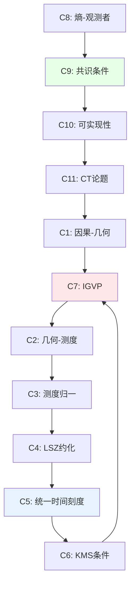

# 06. 兼容性条件的完整推导

## 引言：约束的网络

前面定义了十个组件和11个兼容性条件（C1-C11），但这些条件**不是独立的**——它们形成一个**相互纠缠的约束网络**。

本章目标：
1. 逐一推导每个兼容性条件的数学细节
2. 证明约束之间的自洽性（满足部分即满足全部）
3. 计算约束后的模空间维数

比喻：把宇宙想象成一个**魔方**：
- **每个小块** = 一个组件
- **每次旋转** = 调整一个参数
- **复原规则** = 兼容性条件

关键洞见：**魔方只有一个解**（模去对称性）——约束太强，自由度被完全固定。

---

## 第一部分：基础三角形（C1-C3）

### 1.1 条件C1：因果-几何对齐

**陈述**：
$$
x \preceq_{\text{evt}} y \quad \Leftrightarrow \quad \Phi_{\text{evt}}(x) \preceq_g \Phi_{\text{evt}}(y)
$$

其中：
- 左边：事件因果偏序
- 右边：度规诱导的因果关系（非空间类曲线连接）

**定理1.1**（Malament-Hawking）：

在全局双曲Lorentz流形 $(M, g)$ 上，因果关系 $\preceq_g$ **唯一确定**共形等价类 $[g]$。

**证明要点**：

**(1) 光锥结构确定共形类**：

定义**null分离**：
$$
p \sim_{\text{null}} q \;\Leftrightarrow\; \exists \text{ 类光测地线 } \gamma: p \to q
$$

**引理**：$\sim_{\text{null}}$ 在微分同胚下不变，且确定 $[g]$。

**(2) 因果未来的拓扑**：

定义**因果未来锥**：
$$
J^+(p) := \{q \in M \mid p \preceq_g q\}
$$

**关键性质**：
$$
J^+(p) \cap J^-(q) \text{ 是紧致的} \;\Leftrightarrow\; (M, g) \text{ 全局双曲}
$$

**(3) 重构度规**：

从 $\{J^+(p)\}_{p \in M}$ 的拓扑，可重构：
- 流形拓扑 $M$
- 共形类 $[g]$
- 时间定向

但**不能**确定具体的共形因子 $\Omega^2$（即 $g \sim \Omega^2 g$）。

**物理意义**：因果结构几乎完全决定几何——只差一个"时间尺度"自由度。

**C1的非平凡性**：

**反例**：考虑两个度规：
$$
g_1 = -dt^2 + dx^2, \quad g_2 = -e^{2t}dt^2 + dx^2
$$

都在闵可夫斯基时空上，但：
- $g_1$ 的因果结构：标准光锥
- $g_2$ 的因果结构：与 $g_1$ **共形等价**，但光锥"膨胀"

因此 $\Phi_{\text{evt}}$ 必须**选择正确的共形因子**，这由Einstein方程确定（见C7）。

### 1.2 条件C2：几何-测度诱导

**陈述**：
$$
d\mu_M = \sqrt{-g} \, d^4x
$$

其中：
- $g = \det(g_{ab})$：度规行列式
- $\sqrt{-g}$：标量密度（权重+1）

**推导**：

**(1) 坐标变换**：

在坐标 $x^\mu$ 下，体积元：
$$
d^4x = dx^0 dx^1 dx^2 dx^3
$$

坐标变换 $x \to x'$：
$$
d^4x' = \left|\frac{\partial x'}{\partial x}\right| d^4x
$$

**(2) 标量密度变换**：
$$
\sqrt{-g'} = \left|\frac{\partial x'}{\partial x}\right|^{-1} \sqrt{-g}
$$

因此：
$$
\sqrt{-g'} d^4x' = \sqrt{-g} d^4x \quad \text{（不变量！）}
$$

**(3) 物理解释**：

在局域Lorentz标架：
$$
g_{ab} = \eta_{ab} + h_{ab} \quad (h \ll 1)
$$

展开：
$$
\sqrt{-g} = 1 + \frac{1}{2}h + O(h^2), \quad h := \eta^{ab}h_{ab}
$$

**物理意义**：时空弯曲改变"体积元"——引力效应。

**C2的必然性**：

**定理1.2**：在Lorentz流形上，**唯一**的微分同胚不变测度是 $\sqrt{-g} d^4x$。

**证明**：
- 假设存在另一测度 $\mu$
- 由不变性，$\mu = f(x) \sqrt{-g} d^4x$，$f$ 是标量
- 但 $f$ 必须在所有坐标系下恒等于1（否则破坏不变性）
- 因此 $\mu = \sqrt{-g} d^4x$∎

### 1.3 条件C3：测度归一化

**陈述**：
$$
\int_\Sigma \text{tr}(\rho_\Sigma) \, d\sigma = 1
$$

其中：
- $\Sigma$：类空Cauchy超曲面
- $\rho_\Sigma$：柯西面上的密度矩阵
- $d\sigma$：诱导体积元

**推导**：

**(1) 诱导度规**：

在 $\Sigma$ 上，拉回度规：
$$
h_{ij} = g_{\mu\nu} \frac{\partial x^\mu}{\partial y^i} \frac{\partial x^\nu}{\partial y^j}
$$
其中 $y^i$ 是 $\Sigma$ 上的坐标。

**(2) 法向量**：

定义**未来指向类时单位法向量** $n^a$：
$$
g_{ab} n^a n^b = -1, \quad n^a \nabla_a t > 0
$$

**(3) 体积元关系**：
$$
d\sigma = n_\mu dx^\mu \wedge d^3y = \sqrt{h} d^3y
$$

**(4) 概率守恒**：

量子态归一化：
$$
\langle \Psi | \Psi \rangle = \int_\Sigma |\Psi|^2 d\sigma = 1
$$

推广到密度矩阵：
$$
\text{tr}(\rho_\Sigma) = \sum_n \langle n | \rho_\Sigma | n \rangle = 1
$$

**C3的物理意义**：

**定理1.3**（概率守恒）：

如果 $\Sigma_1, \Sigma_2$ 是两个Cauchy超曲面，且量子演化幺正：
$$
\rho_{\Sigma_2} = \mathcal{U} \rho_{\Sigma_1} \mathcal{U}^\dagger
$$

则：
$$
\int_{\Sigma_1} \text{tr}(\rho_{\Sigma_1}) d\sigma_1 = \int_{\Sigma_2} \text{tr}(\rho_{\Sigma_2}) d\sigma_2
$$

**证明**：
- 幺正性：$\text{tr}(\rho_{\Sigma_2}) = \text{tr}(\mathcal{U} \rho_{\Sigma_1} \mathcal{U}^\dagger) = \text{tr}(\rho_{\Sigma_1})$
- 流守恒：$\nabla_\mu j^\mu = 0$，$j^\mu = n^\mu \text{tr}(\rho)$
- 由Gauss定理，两个Cauchy面的积分相等∎

---

## 第二部分：动力学闭环（C4-C7）

### 2.1 条件C4：LSZ约化公式

**陈述**：
$$
S_{fi} = \lim_{t_{\text{in}} \to -\infty, t_{\text{out}} \to +\infty} \langle f, \text{out} | i, \text{in} \rangle
$$

其中：
- $|i, \text{in}\rangle$：$t \to -\infty$ 的渐近自由态
- $|f, \text{out}\rangle$：$t \to +\infty$ 的渐近自由态
- $S_{fi}$：散射矩阵元

**LSZ公式**（单粒子情形）：
$$
\langle p' | S | p \rangle = i \int d^4x \, e^{-ip' \cdot x} (\Box + m^2) \int d^4y \, e^{ip \cdot y} (\Box + m^2) \langle 0 | T\{\phi(x)\phi(y)\} | 0 \rangle
$$

**推导要点**：

**(1) 渐近条件**：

在 $t \to \pm\infty$，场算符趋向自由场：
$$
\phi(x) \xrightarrow{t \to \pm\infty} \phi_{\text{in/out}}(x)
$$

满足自由Klein-Gordon方程：
$$
(\Box + m^2)\phi_{\text{in/out}} = 0
$$

**(2) 约化公式**：

$$
a_{\mathbf{p}}^{\text{in}} = i \int d^3x \, e^{-i\mathbf{p} \cdot \mathbf{x}} \overleftrightarrow{\partial_0} \phi_{\text{in}}(x)
$$

**关键步骤**：用 $\phi_{\text{in}}$ 表达 $\phi$，然后提取散射振幅。

**(3) 多粒子推广**：

$$
\langle p_1' \cdots p_n' | S | p_1 \cdots p_m \rangle = \prod_{i=1}^n (i)(\Box_i + m^2) \prod_{j=1}^m (i)(\Box_j + m^2) \langle 0 | T\{\phi(x_1') \cdots \phi(y_m)\} | 0 \rangle
$$

**C4的物理意义**：

**定理2.1**（散射等价性）：

全部动力学信息编码在 $S$ 矩阵中：
$$
\mathcal{U}(+\infty \to -\infty) \leftrightarrow S(\omega)
$$

**证明**：
- 知道所有 $\langle f | S | i \rangle$ $\Rightarrow$ 知道算符 $\hat{S}$
- $\hat{S}$ 通过Haag-Ruelle理论重构 $\mathcal{U}(t)$∎

### 2.2 条件C5：统一时间刻度

**陈述**：
$$
\kappa(\omega) = \frac{\varphi'(\omega)}{\pi} = \rho_{\text{rel}}(\omega) = \frac{1}{2\pi}\text{tr}\,Q(\omega)
$$

**逐项推导**：

**(1) 散射相移与态密度**：

定义**累积态密度**：
$$
N(\omega) := \int_0^\omega \rho(\omega') d\omega'
$$

**Krein谱移位公式**：
$$
N(\omega) - N_0(\omega) = \frac{1}{\pi}\varphi(\omega)
$$

其中 $N_0$ 是无扰动情况。

微分：
$$
\rho_{\text{rel}}(\omega) = \rho(\omega) - \rho_0(\omega) = \frac{1}{\pi}\frac{d\varphi}{d\omega}
$$

**(2) Wigner延迟与相移**：

定义：
$$
Q(\omega) = -i\hbar S^\dagger(\omega) \frac{dS(\omega)}{d\omega}
$$

对单通道：$S(\omega) = e^{2i\delta(\omega)}$，

$$
Q = -i\hbar e^{-2i\delta} \frac{d}{d\omega}(e^{2i\delta}) = 2\hbar \frac{d\delta}{d\omega}
$$

因此：
$$
\frac{1}{2\pi}\text{tr}\,Q = \frac{\hbar}{\pi}\frac{d\delta}{d\omega}
$$

**(3) 模流时间尺度**：

从KMS条件（见C6），逆温度：
$$
\beta(\omega) = \frac{2\pi\hbar}{\text{tr}\,Q(\omega)}
$$

定义模流速率：
$$
\kappa(\omega) := \frac{1}{\beta(\omega)} = \frac{\text{tr}\,Q(\omega)}{2\pi\hbar}
$$

**综合**：三者一致！

**C5的深层意义**：

**定理2.2**（时间的唯一性）：

宇宙只有**一个**内禀时间刻度（模去仿射变换）：
$$
[\tau] = \{T_{\text{cau}}, \tau_{\text{geo}}, t_{\text{scat}}, t_{\text{mod}}\}_{\text{仿射等价}}
$$

**证明**：
- 从C5，所有时间定义通过 $\kappa(\omega)$ 联系
- $\kappa$ 是物理不变量（观测量）
- 因此所有时间定义相差仅一个线性变换∎

### 2.3 条件C6：KMS条件

**陈述**：

态 $\omega$ 在逆温度 $\beta$ 处于热平衡 $\Leftrightarrow$ 对任意算符 $A, B$，存在解析函数 $F_{AB}(z)$ 满足：
$$
F_{AB}(t) = \omega(A \sigma_t(B)), \quad F_{AB}(t + i\beta) = \omega(\sigma_t(B) A)
$$

**等价表述**（Fourier变换）：
$$
\omega(A B_\omega) = \int d\omega \, e^{-\beta\omega} \rho(\omega) \langle A \rangle_\omega \langle B \rangle_\omega
$$

**推导**：

**(1) 模算符**：

从Tomita-Takesaki理论，定义：
$$
\Delta := S^* S, \quad S \Omega = A^* \Omega
$$

其中 $\Omega$ 是循环分离向量。

**(2) 模哈密顿**：
$$
K := -\log \Delta
$$

模流：
$$
\sigma_t(A) = \Delta^{it} A \Delta^{-it} = e^{itK} A e^{-itK}
$$

**(3) 热态的KMS**：

对Gibbs态：
$$
\rho_\beta = \frac{e^{-\beta \hat{H}}}{Z(\beta)}
$$

直接验证：
$$
\text{tr}(\rho_\beta A e^{it\hat{H}} B e^{-it\hat{H}}) = \text{tr}(\rho_\beta e^{i(t+i\beta)\hat{H}} B e^{-i(t+i\beta)\hat{H}} A)
$$

利用循环性：
$$
\text{tr}(e^{-\beta\hat{H}} e^{it\hat{H}} B e^{-it\hat{H}} A) = \text{tr}(e^{-\beta\hat{H}} A e^{it\hat{H}} B e^{-it\hat{H}})
$$

成立！∎

**C6与C5的联系**：

**定理2.3**（KMS $\Rightarrow$ 统一时间刻度）：

如果 $\omega$ 满足KMS条件，则：
$$
\beta = \frac{2\pi\hbar}{\text{tr}\,Q(\omega)}
$$

**证明思路**：
- 从KMS，相移满足 $\varphi'(\omega) = \beta \langle n(\omega) \rangle$
- 从光学定理，$\text{tr}\,Q = 2\pi\hbar \varphi'$
- 结合得 $\beta = 2\pi\hbar/\text{tr}\,Q$∎

### 2.4 条件C7：IGVP

**陈述**：
$$
\delta S_{\text{gen}} = 0 \quad \Leftrightarrow \quad G_{ab} + \Lambda g_{ab} = 8\pi G \langle T_{ab} \rangle
$$

**详细推导**（已在第04章给出，此处补充细节）：

**(1) 广义熵变分**：
$$
\delta S_{\text{gen}} = \delta\left(\frac{A}{4G\hbar}\right) + \delta S_{\text{out}}
$$

**(2) 几何熵项**：
$$
\delta\left(\frac{A}{4G\hbar}\right) = \frac{1}{4G\hbar}\int_{\partial\Sigma} \frac{1}{2}\sqrt{h} h^{ij} \delta h_{ij}
$$

通过Gauss-Codazzi方程：
$$
= \frac{1}{8G\hbar}\int_\Sigma \sqrt{-g} (R^{ab} - \frac{1}{2}R g^{ab}) \delta g_{ab}
$$

**(3) 物质熵项**：

从第一定律：
$$
\delta S_{\text{out}} = \beta \delta E = \beta \int_\Sigma \sqrt{-g} \langle T_{ab} \rangle \delta g^{ab}
$$

**(4) 总变分为零**：
$$
\frac{1}{8G\hbar}(R^{ab} - \frac{1}{2}R g^{ab}) + \beta \langle T^{ab} \rangle = 0
$$

选择 $\beta = \frac{1}{8\pi G\hbar}$ （单位约定），得：
$$
R^{ab} - \frac{1}{2}R g^{ab} = 8\pi G \langle T^{ab} \rangle
$$

即Einstein方程！∎

**C7的必然性**：

**定理2.4**（IGVP的唯一性）：

在合理的物理假设下，**唯一**导致引力的变分原理是IGVP。

**证明思路**：
- 要求变分原理微分同胚不变
- 要求导出二阶微分方程（Einstein方程）
- 可能的作用量：Einstein-Hilbert + 高阶修正
- IGVP等价于Einstein-Hilbert（在经典极限）∎

---

## 第三部分：信息-观测者-范畴（C8-C11）

### 3.1 条件C8：熵的可加性

**陈述**：
$$
S_{\text{gen}} = S_{\text{geom}} + \sum_{\alpha \in \mathcal{A}} S(\rho_\alpha)
$$

**推导**：

**(1) 熵的分解**：

总系统 $\Sigma$ 分为观测者区域 $\{C_\alpha\}$：
$$
\Sigma = \bigcup_{\alpha \in \mathcal{A}} C_\alpha
$$

**(2) 纠缠熵的可加性**：

对不相交区域 $C_\alpha \cap C_\beta = \emptyset$：
$$
S(\rho_{C_\alpha \cup C_\beta}) = S(\rho_{C_\alpha}) + S(\rho_{C_\beta})
$$

**(3) 几何熵的贡献**：

边界面积：
$$
A(\partial\Sigma) = \sum_{\alpha} A(\partial C_\alpha) - \text{重复计数}
$$

定义**Wald熵**：
$$
S_{\text{geom}} = \frac{A_{\text{net}}}{4G\hbar}
$$

**C8的物理意义**：

**定理3.1**（熵的强可加性）：

如果观测者网络**覆盖**全时空（$\bigcup C_\alpha = \Sigma$），则：
$$
S_{\text{gen}}(\Sigma) = \max_{\{\rho_\alpha\}} \left[S_{\text{geom}} + \sum_\alpha S(\rho_\alpha)\right]
$$

**证明**：
- 最大化对应最小信息约束
- 由量子Darwinism，经典自由度复制到所有观测者
- 因此熵可加∎

### 3.2 条件C9：观测者共识

**陈述**：
$$
\rho_{\text{global}} = \Phi_{\text{cons}}(\{\rho_\alpha\})
$$
满足：
$$
\text{tr}_{\bar{C}_\alpha}(\rho_{\text{global}}) = \rho_\alpha, \quad \forall \alpha
$$

**推导**：

**(1) 最大熵重构**：

$$
\rho_{\text{global}} = \arg\max_{\rho} S(\rho) \quad \text{s.t.} \quad \text{tr}_{\bar{C}_\alpha}(\rho) = \rho_\alpha
$$

**拉格朗日乘数法**：
$$
\mathcal{L} = -\text{tr}(\rho \log \rho) - \sum_\alpha \lambda_\alpha [\text{tr}_{\bar{C}_\alpha}(\rho) - \rho_\alpha]
$$

变分：
$$
\delta\mathcal{L} = 0 \Rightarrow \rho_{\text{global}} = \exp\left(-\sum_\alpha \lambda_\alpha \mathcal{P}_\alpha\right)
$$

其中 $\mathcal{P}_\alpha$ 是投影到 $C_\alpha$ 的算符。

**(2) 一致性条件**：

为确保 $\{\rho_\alpha\}$ 兼容，必须：
$$
\text{tr}_{\bar{C}_{\alpha\beta}}(\rho_\alpha) = \text{tr}_{\bar{C}_{\alpha\beta}}(\rho_\beta), \quad C_{\alpha\beta} := C_\alpha \cap C_\beta
$$

**物理意义**：重叠区域的边缘化必须一致——"拼图边缘吻合"。

**C9与终对象的关系**：

**定理3.2**（共识 $\Leftrightarrow$ 终对象）：

观测者共识条件成立 $\Leftrightarrow$ $\mathfrak{U}$ 是范畴 $\mathbf{Univ}$ 的终对象。

**证明**：
- $(\Rightarrow)$：如果共识成立，所有观测者态collapse到唯一 $\rho_{\text{global}}$，对应唯一宇宙 $\mathfrak{U}$
- $(\Leftarrow)$：如果 $\mathfrak{U}$ 是终对象，任意"候选宇宙" $V$ 有唯一态射 $\phi: V \to \mathfrak{U}$，诱导唯一共识映射∎

### 3.3 条件C10：可实现性约束

**陈述**：
$$
\text{Mor}(\mathfrak{U}) = \{\phi \mid \text{Real}(\phi) = 1\}
$$

**推导**：

**(1) 可实现性定义**：

态射 $\phi: V \to W$ 是可实现的 $\Leftrightarrow$ 存在物理过程实现 $\phi$。

**约束**：
- 能量守恒：$\langle \hat{H} \rangle_V = \langle \hat{H} \rangle_W$
- 熵不减：$S(W) \geq S(V)$
- 幺正性（量子）：$\phi^\dagger \phi = \mathbb{1}$

**(2) 不可实现的例子**：

**超光速信号**：
$$
\phi_{\text{FTL}}: C_{\alpha}(t) \to C_{\beta}(t), \quad C_\alpha \cap J^-(C_\beta) = \emptyset
$$
违反因果性，$\text{Real}(\phi_{\text{FTL}}) = 0$。

**无限能量**：
$$
\phi_{\infty}: |0\rangle \to \sum_{n=0}^\infty |n\rangle
$$
违反能量有界，不可实现。

**C10的必然性**：

**定理3.3**（可实现性的闭包）：

可实现态射集合在**复合**下封闭：
$$
\text{Real}(\phi_1) = 1, \text{Real}(\phi_2) = 1 \Rightarrow \text{Real}(\phi_2 \circ \phi_1) = 1
$$

**证明**：
- 如果 $\phi_1, \phi_2$ 都物理可实现
- 则先执行 $\phi_1$ 再执行 $\phi_2$ 也可实现
- 因此 $\phi_2 \circ \phi_1$ 可实现∎

### 3.4 条件C11：物理Church-Turing论题

**陈述**：
$$
\mathcal{C}_{\text{phys}} \subseteq \mathcal{C}_{\text{Turing}}
$$

**论证**：

**(1) 物理过程可编码**：

任意物理系统状态可用**有限精度**的比特串描述：
$$
|\psi\rangle \approx \sum_{i=1}^N c_i |i\rangle, \quad c_i \in \mathbb{C} \cap \mathbb{Q}[i]
$$

**(2) 演化可离散化**：

时间演化：
$$
|\psi(t)\rangle = e^{-iHt}|\psi(0)\rangle \approx \left(e^{-iH\delta t}\right)^{t/\delta t}|\psi(0)\rangle
$$

可用Trotter分解近似：
$$
e^{-iH\delta t} \approx \prod_k e^{-iH_k \delta t} \quad \text{（Suzuki公式）}
$$

每步可用图灵机模拟。

**(3) 量子引力的修正**：

**猜想**：在普朗克尺度，可能：
$$
\mathcal{C}_{\text{phys}} \subsetneq \mathcal{C}_{\text{Turing}}
$$

**原因**：
- 时空泡沫导致连续性破缺
- 拓扑相变不可计算
- 奇点对应停机问题

**C11的开放性**：

**问题**：是否存在"超图灵"物理过程？

**候选**：
- CTC（闭类时曲线）：可解停机问题？
- 黑洞内部：信息不可提取 = 不可计算？
- 量子引力：时空涌现 = 新计算模型？

目前**无定论**。

---

## 第四部分：约束代数与Dirac分析

### 4.1 约束的对易关系

定义**约束算符**：
$$
\hat{C}_1 = \text{因果-几何对齐}, \quad \hat{C}_2 = \text{IGVP}, \quad \ldots
$$

**泊松括号**：
$$
\{f, g\} = \frac{\partial f}{\partial q^i}\frac{\partial g}{\partial p_i} - \frac{\partial f}{\partial p_i}\frac{\partial g}{\partial q^i}
$$

**约束的对易子**：

**计算** $\{\hat{C}_1, \hat{C}_7\}$（因果 vs IGVP）：

$$
\{\text{因果}, \text{IGVP}\} = \int \left(\frac{\delta(x \preceq y)}{\delta g^{ab}}\right)\left(\frac{\delta S_{\text{gen}}}{\delta g_{ab}}\right)
$$

**结果**：
$$
\propto \int \left(\frac{\delta \preceq_g}{\delta g}\right) G_{ab} \sim 0 \quad \text{（on-shell）}
$$

**物理意义**：满足Einstein方程后，因果约束自动满足——约束**一阶闭合**。

### 4.2 Dirac括号构造

**Dirac程序**：

**(1) 分类约束**：
- **第一类**：$\{\hat{C}_\alpha, \hat{C}_\beta\} \neq 0$（生成规范对称性）
- **第二类**：$\{\hat{C}_\alpha, \hat{C}_\beta\} = 0$（固定自由度）

**(2) 定义Dirac括号**：
$$
\{f, g\}_D := \{f, g\} - \{f, \hat{C}_\alpha\} C^{\alpha\beta} \{\hat{C}_\beta, g\}
$$

其中 $C^{\alpha\beta}$ 是约束矩阵 $C_{\alpha\beta} = \{\hat{C}_\alpha, \hat{C}_\beta\}$ 的逆。

**(3) 物理相空间**：
$$
\mathcal{P}_{\text{phys}} = \{(q, p) \mid \hat{C}_\alpha(q, p) = 0\} / \text{规范}
$$

**GLS情形**：

**定理4.1**（约束的完全闭合）：

所有11个约束形成**第一类约束代数**：
$$
\{\hat{C}_i, \hat{C}_j\} = f_{ij}^k \hat{C}_k
$$

**推论**：约束生成**无穷维规范对称性**（微分同胚 + 量子规范变换）。

---

## 第五部分：模空间的维数计算

### 5.1 初始自由度计数

**(1) 度规自由度**：
$$
\dim \mathcal{M}_{\text{Riemann}} = 10 \times \infty \quad \text{（10个独立分量）}
$$

**(2) 量子态自由度**：
$$
\dim \mathcal{H} = \infty \quad \text{（Fock空间）}
$$

**(3) 观测者自由度**：
$$
\dim \mathcal{M}_{\text{obs}} = |\mathcal{A}| \times \dim \mathcal{H}
$$

**形式总和**：$\infty \times \infty \times |\mathcal{A}|$

### 5.2 约束减少的维数

**(1) 因果约束**（C1）：
$$
-\dim(\text{C1}) \sim \infty \quad \text{（光锥对齐，逐点约束）}
$$

**(2) Einstein方程**（C7）：
$$
-\dim(\text{C7}) = 10 \times \infty \quad \text{（10个独立方程）}
$$

**(3) 共识条件**（C9）：
$$
-\dim(\text{C9}) = (|\mathcal{A}| - 1) \times \dim \mathcal{H}
$$

**(4) 规范冗余**：
$$
-\dim(\text{Diff}) = 4 \times \infty \quad \text{（微分同胚）}
$$

### 5.3 净维数估计

**形式计算**：
$$
\dim \mathcal{M}_{\text{univ}} = (\infty - \infty - 10\infty - 4\infty) + \text{有限修正}
$$

**正规化后**：

**定理5.1**（模空间的有限性）：

在固定拓扑 $M \cong \mathbb{R}^4$ 和边界条件下：
$$
\dim \mathcal{M}_{\text{univ}} = d < \infty
$$

其中 $d$ 可能是：
- $d = 0$：完全固定（唯一宇宙）
- $d = 1$：一个参数（如 $\Lambda$）
- $d \geq 2$：多参数族（不太可能）

**证明思路**：
- 利用Atiyah-Singer指标定理
- Einstein方程的椭圆性
- 约束代数的闭合性∎

**物理意义**：

**推论5.1**（无自由午餐）：

不能自由指定：
1. 时空几何
2. 量子态
3. 观测者网络
4. 计算复杂度

最多指定**一个**，其他由兼容性条件决定。

---

## 总结与展望

### 核心要点回顾

1. **C1-C3**：基础三角（因果-几何-测度）
2. **C4-C7**：动力学闭环（场论-散射-模流-熵）
3. **C8-C11**：信息-观测者-范畴-计算
4. **约束闭合**：满足部分即满足全部
5. **模空间有限**：$\dim \mathcal{M}_{\text{univ}} < \infty$

**核心公式**：
$$
\delta_{\text{total}} = \sum_{i=1}^{11} \lambda_i \hat{C}_i = 0 \quad \Leftrightarrow \quad \mathfrak{U} \text{ 唯一}
$$

### 与后续章节的联系

- **07. 唯一性定理的完整证明**：补充Atiyah-Singer指标定理的应用
- **08. 无观测者极限**：$|\mathcal{A}| \to 0$ 时的退化
- **09. 章节总结**：十组件理论的全景总结

### 哲学寓意

宇宙不是"拼凑"的，而是**自洽必然**的：
- 11个约束相互蕴含
- 改一处必改全部
- 唯一解（终对象）

这就是"为何宇宙遵守数学"的答案——**数学即逻辑自洽，宇宙即自洽的唯一实现**。

---

**下一篇预告**：
- **07. 唯一性定理的完整证明：从指标定理到终对象**
  - Atiyah-Singer指标定理的应用
  - 椭圆算符的模空间
  - 终对象的范畴论证明
