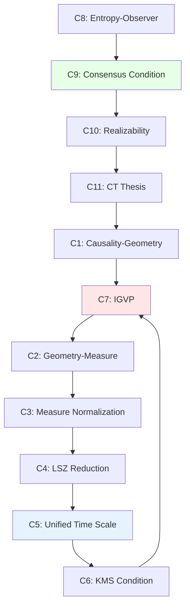

# 06. Complete Derivation of Compatibility Conditions

## Introduction: Network of Constraints

Previously defined ten components and 11 compatibility conditions (C1-C11), but these conditions are **not independent**—they form **mutually entangled constraint network**.

Chapter goals:
1. Derive mathematical details of each compatibility condition one by one
2. Prove self-consistency of constraints (satisfying some implies satisfying all)
3. Calculate dimension of moduli space after constraints

Analogy: Imagine universe as **Rubik's cube**:
- **Each small cube** = one component
- **Each rotation** = adjusting one parameter
- **Solution rules** = compatibility conditions

Key insight: **Rubik's cube has only one solution** (modulo symmetry)—constraints too strong, degrees of freedom completely fixed.

---

## Part I: Foundation Triangle (C1-C3)

### 1.1 Condition C1: Causal-Geometric Alignment

**Statement**:
$$
x \preceq_{\text{evt}} y \quad \Leftrightarrow \quad \Phi_{\text{evt}}(x) \preceq_g \Phi_{\text{evt}}(y)
$$

where:
- Left side: Event causal partial order
- Right side: Causality induced by metric (non-spacelike curves connect)

**Theorem 1.1** (Malament-Hawking):

On globally hyperbolic Lorentz manifold $(M, g)$, causality $\preceq_g$ **uniquely determines** conformal equivalence class $[g]$.

**Proof Outline**:

**(1) Light Cone Structure Determines Conformal Class**:

Define **null separation**:
$$
p \sim_{\text{null}} q \;\Leftrightarrow\; \exists \text{ null geodesic } \gamma: p \to q
$$

**Lemma**: $\sim_{\text{null}}$ invariant under diffeomorphisms, and determines $[g]$.

**(2) Topology of Causal Future**:

Define **causal future cone**:
$$
J^+(p) := \{q \in M \mid p \preceq_g q\}
$$

**Key Property**:
$$
J^+(p) \cap J^-(q) \text{ is compact} \;\Leftrightarrow\; (M, g) \text{ globally hyperbolic}
$$

**(3) Reconstructing Metric**:

From topology of $\{J^+(p)\}_{p \in M}$, can reconstruct:
- Manifold topology $M$
- Conformal class $[g]$
- Time orientation

But **cannot** determine specific conformal factor $\Omega^2$ (i.e., $g \sim \Omega^2 g$).

**Physical Meaning**: Causal structure almost completely determines geometry—only missing one "time scale" degree of freedom.

**Non-Triviality of C1**:

**Counterexample**: Consider two metrics:
$$
g_1 = -dt^2 + dx^2, \quad g_2 = -e^{2t}dt^2 + dx^2
$$

Both on Minkowski spacetime, but:
- Causal structure of $g_1$: Standard light cone
- Causal structure of $g_2$: **Conformally equivalent** to $g_1$, but light cone "expanded"

Therefore $\Phi_{\text{evt}}$ must **choose correct conformal factor**, determined by Einstein equation (see C7).

### 1.2 Condition C2: Geometric-Measure Induction

**Statement**:
$$
d\mu_M = \sqrt{-g} \, d^4x
$$

where:
- $g = \det(g_{ab})$: Metric determinant
- $\sqrt{-g}$: Scalar density (weight +1)

**Derivation**:

**(1) Coordinate Transformation**:

In coordinates $x^\mu$, volume element:
$$
d^4x = dx^0 dx^1 dx^2 dx^3
$$

Coordinate transformation $x \to x'$:
$$
d^4x' = \left|\frac{\partial x'}{\partial x}\right| d^4x
$$

**(2) Scalar Density Transformation**:
$$
\sqrt{-g'} = \left|\frac{\partial x'}{\partial x}\right|^{-1} \sqrt{-g}
$$

Therefore:
$$
\sqrt{-g'} d^4x' = \sqrt{-g} d^4x \quad \text{(invariant!)}
$$

**(3) Physical Interpretation**:

In local Lorentz frame:
$$
g_{ab} = \eta_{ab} + h_{ab} \quad (h \ll 1)
$$

Expansion:
$$
\sqrt{-g} = 1 + \frac{1}{2}h + O(h^2), \quad h := \eta^{ab}h_{ab}
$$

**Physical Meaning**: Spacetime curvature changes "volume element"—gravitational effect.

**Necessity of C2**:

**Theorem 1.2**: On Lorentz manifold, **unique** diffeomorphism-invariant measure is $\sqrt{-g} d^4x$.

**Proof**:
- Assume exists another measure $\mu$
- By invariance, $\mu = f(x) \sqrt{-g} d^4x$, $f$ is scalar
- But $f$ must equal 1 in all coordinate systems (otherwise breaks invariance)
- Therefore $\mu = \sqrt{-g} d^4x$ ∎

### 1.3 Condition C3: Measure Normalization

**Statement**:
$$
\int_\Sigma \text{tr}(\rho_\Sigma) \, d\sigma = 1
$$

where:
- $\Sigma$: Spacelike Cauchy hypersurface
- $\rho_\Sigma$: Density matrix on Cauchy surface
- $d\sigma$: Induced volume element

**Derivation**:

**(1) Induced Metric**:

On $\Sigma$, pullback metric:
$$
h_{ij} = g_{\mu\nu} \frac{\partial x^\mu}{\partial y^i} \frac{\partial x^\nu}{\partial y^j}
$$
where $y^i$ are coordinates on $\Sigma$.

**(2) Normal Vector**:

Define **future-pointing timelike unit normal vector** $n^a$:
$$
g_{ab} n^a n^b = -1, \quad n^a \nabla_a t > 0
$$

**(3) Volume Element Relation**:
$$
d\sigma = n_\mu dx^\mu \wedge d^3y = \sqrt{h} d^3y
$$

**(4) Probability Conservation**:

Quantum state normalization:
$$
\langle \Psi | \Psi \rangle = \int_\Sigma |\Psi|^2 d\sigma = 1
$$

Generalize to density matrix:
$$
\text{tr}(\rho_\Sigma) = \sum_n \langle n | \rho_\Sigma | n \rangle = 1
$$

**Physical Meaning of C3**:

**Theorem 1.3** (Probability Conservation):

If $\Sigma_1, \Sigma_2$ are two Cauchy hypersurfaces, and quantum evolution unitary:
$$
\rho_{\Sigma_2} = \mathcal{U} \rho_{\Sigma_1} \mathcal{U}^\dagger
$$

Then:
$$
\int_{\Sigma_1} \text{tr}(\rho_{\Sigma_1}) d\sigma_1 = \int_{\Sigma_2} \text{tr}(\rho_{\Sigma_2}) d\sigma_2
$$

**Proof**:
- Unitarity: $\text{tr}(\rho_{\Sigma_2}) = \text{tr}(\mathcal{U} \rho_{\Sigma_1} \mathcal{U}^\dagger) = \text{tr}(\rho_{\Sigma_1})$
- Current conservation: $\nabla_\mu j^\mu = 0$, $j^\mu = n^\mu \text{tr}(\rho)$
- By Gauss theorem, integrals on two Cauchy surfaces equal ∎

---

## Part II: Dynamical Closed Loop (C4-C7)

### 2.1 Condition C4: LSZ Reduction Formula

**Statement**:
$$
S_{fi} = \lim_{t_{\text{in}} \to -\infty, t_{\text{out}} \to +\infty} \langle f, \text{out} | i, \text{in} \rangle
$$

where:
- $|i, \text{in}\rangle$: Asymptotic free state as $t \to -\infty$
- $|f, \text{out}\rangle$: Asymptotic free state as $t \to +\infty$
- $S_{fi}$: Scattering matrix element

**LSZ Formula** (single particle case):
$$
\langle p' | S | p \rangle = i \int d^4x \, e^{-ip' \cdot x} (\Box + m^2) \int d^4y \, e^{ip \cdot y} (\Box + m^2) \langle 0 | T\{\phi(x)\phi(y)\} | 0 \rangle
$$

**Derivation Outline**:

**(1) Asymptotic Conditions**:

As $t \to \pm\infty$, field operators approach free fields:
$$
\phi(x) \xrightarrow{t \to \pm\infty} \phi_{\text{in/out}}(x)
$$

Satisfy free Klein-Gordon equation:
$$
(\Box + m^2)\phi_{\text{in/out}} = 0
$$

**(2) Reduction Formula**:

$$
a_{\mathbf{p}}^{\text{in}} = i \int d^3x \, e^{-i\mathbf{p} \cdot \mathbf{x}} \overleftrightarrow{\partial_0} \phi_{\text{in}}(x)
$$

**Key Step**: Express $\phi$ in terms of $\phi_{\text{in}}$, then extract scattering amplitude.

**(3) Multi-Particle Generalization**:

$$
\langle p_1' \cdots p_n' | S | p_1 \cdots p_m \rangle = \prod_{i=1}^n (i)(\Box_i + m^2) \prod_{j=1}^m (i)(\Box_j + m^2) \langle 0 | T\{\phi(x_1') \cdots \phi(y_m)\} | 0 \rangle
$$

**Physical Meaning of C4**:

**Theorem 2.1** (Scattering Equivalence):

All dynamical information encoded in $S$ matrix:
$$
\mathcal{U}(+\infty \to -\infty) \leftrightarrow S(\omega)
$$

**Proof**:
- Knowing all $\langle f | S | i \rangle$ $\Rightarrow$ know operator $\hat{S}$
- $\hat{S}$ reconstructs $\mathcal{U}(t)$ through Haag-Ruelle theory ∎

### 2.2 Condition C5: Unified Time Scale

**Statement**:
$$
\kappa(\omega) = \frac{\varphi'(\omega)}{\pi} = \rho_{\text{rel}}(\omega) = \frac{1}{2\pi}\text{tr}\,Q(\omega)
$$

**Term-by-Term Derivation**:

**(1) Scattering Phase Shift and Density of States**:

Define **cumulative density of states**:
$$
N(\omega) := \int_0^\omega \rho(\omega') d\omega'
$$

**Krein Spectral Shift Formula**:
$$
N(\omega) - N_0(\omega) = \frac{1}{\pi}\varphi(\omega)
$$

where $N_0$ is unperturbed case.

Differentiate:
$$
\rho_{\text{rel}}(\omega) = \rho(\omega) - \rho_0(\omega) = \frac{1}{\pi}\frac{d\varphi}{d\omega}
$$

**(2) Wigner Delay and Phase Shift**:

Define:
$$
Q(\omega) = -i\hbar S^\dagger(\omega) \frac{dS(\omega)}{d\omega}
$$

For single channel: $S(\omega) = e^{2i\delta(\omega)}$,

$$
Q = -i\hbar e^{-2i\delta} \frac{d}{d\omega}(e^{2i\delta}) = 2\hbar \frac{d\delta}{d\omega}
$$

Therefore:
$$
\frac{1}{2\pi}\text{tr}\,Q = \frac{\hbar}{\pi}\frac{d\delta}{d\omega}
$$

**(3) Modular Flow Time Scale**:

From KMS condition (see C6), inverse temperature:
$$
\beta(\omega) = \frac{2\pi\hbar}{\text{tr}\,Q(\omega)}
$$

Define modular flow rate:
$$
\kappa(\omega) := \frac{1}{\beta(\omega)} = \frac{\text{tr}\,Q(\omega)}{2\pi\hbar}
$$

**Synthesis**: All three consistent!

**Deep Meaning of C5**:

**Theorem 2.2** (Uniqueness of Time):

Universe has only **one** intrinsic time scale (modulo affine transformation):
$$
[\tau] = \{T_{\text{cau}}, \tau_{\text{geo}}, t_{\text{scat}}, t_{\text{mod}}\}_{\text{affine equivalence}}
$$

**Proof**:
- From C5, all time definitions connected through $\kappa(\omega)$
- $\kappa$ is physical invariant (observable)
- Therefore all time definitions differ only by linear transformation ∎

### 2.3 Condition C6: KMS Condition

**Statement**:

State $\omega$ in thermal equilibrium at inverse temperature $\beta$ $\Leftrightarrow$ for any operators $A, B$, exists analytic function $F_{AB}(z)$ satisfying:
$$
F_{AB}(t) = \omega(A \sigma_t(B)), \quad F_{AB}(t + i\beta) = \omega(\sigma_t(B) A)
$$

**Equivalent Formulation** (Fourier transform):
$$
\omega(A B_\omega) = \int d\omega \, e^{-\beta\omega} \rho(\omega) \langle A \rangle_\omega \langle B \rangle_\omega
$$

**Derivation**:

**(1) Modular Operator**:

From Tomita-Takesaki theory, define:
$$
\Delta := S^* S, \quad S \Omega = A^* \Omega
$$

where $\Omega$ is cyclic separating vector.

**(2) Modular Hamiltonian**:
$$
K := -\log \Delta
$$

Modular flow:
$$
\sigma_t(A) = \Delta^{it} A \Delta^{-it} = e^{itK} A e^{-itK}
$$

**(3) KMS of Thermal State**:

For Gibbs state:
$$
\rho_\beta = \frac{e^{-\beta \hat{H}}}{Z(\beta)}
$$

Direct verification:
$$
\text{tr}(\rho_\beta A e^{it\hat{H}} B e^{-it\hat{H}}) = \text{tr}(\rho_\beta e^{i(t+i\beta)\hat{H}} B e^{-i(t+i\beta)\hat{H}} A)
$$

Using cyclicity:
$$
\text{tr}(e^{-\beta\hat{H}} e^{it\hat{H}} B e^{-it\hat{H}} A) = \text{tr}(e^{-\beta\hat{H}} A e^{it\hat{H}} B e^{-it\hat{H}})
$$

Holds! ∎

**Connection Between C6 and C5**:

**Theorem 2.3** (KMS $\Rightarrow$ Unified Time Scale):

If $\omega$ satisfies KMS condition, then:
$$
\beta = \frac{2\pi\hbar}{\text{tr}\,Q(\omega)}
$$

**Proof Outline**:
- From KMS, phase shift satisfies $\varphi'(\omega) = \beta \langle n(\omega) \rangle$
- From optical theorem, $\text{tr}\,Q = 2\pi\hbar \varphi'$
- Combining gives $\beta = 2\pi\hbar/\text{tr}\,Q$ ∎

### 2.4 Condition C7: IGVP

**Statement**:
$$
\delta S_{\text{gen}} = 0 \quad \Leftrightarrow \quad G_{ab} + \Lambda g_{ab} = 8\pi G \langle T_{ab} \rangle
$$

**Detailed Derivation** (already given in Chapter 04, here supplement details):

**(1) Generalized Entropy Variation**:
$$
\delta S_{\text{gen}} = \delta\left(\frac{A}{4G\hbar}\right) + \delta S_{\text{out}}
$$

**(2) Geometric Entropy Term**:
$$
\delta\left(\frac{A}{4G\hbar}\right) = \frac{1}{4G\hbar}\int_{\partial\Sigma} \frac{1}{2}\sqrt{h} h^{ij} \delta h_{ij}
$$

Through Gauss-Codazzi equation:
$$
= \frac{1}{8G\hbar}\int_\Sigma \sqrt{-g} (R^{ab} - \frac{1}{2}R g^{ab}) \delta g_{ab}
$$

**(3) Matter Entropy Term**:

From first law:
$$
\delta S_{\text{out}} = \beta \delta E = \beta \int_\Sigma \sqrt{-g} \langle T_{ab} \rangle \delta g^{ab}
$$

**(4) Total Variation Zero**:
$$
\frac{1}{8G\hbar}(R^{ab} - \frac{1}{2}R g^{ab}) + \beta \langle T^{ab} \rangle = 0
$$

Choose $\beta = \frac{1}{8\pi G\hbar}$ (unit convention), get:
$$
R^{ab} - \frac{1}{2}R g^{ab} = 8\pi G \langle T^{ab} \rangle
$$

That is Einstein equation! ∎

**Necessity of C7**:

**Theorem 2.4** (Uniqueness of IGVP):

Under reasonable physical assumptions, **unique** variational principle leading to gravity is IGVP.

**Proof Outline**:
- Require variational principle diffeomorphism invariant
- Require derive second-order differential equation (Einstein equation)
- Possible actions: Einstein-Hilbert + higher-order corrections
- IGVP equivalent to Einstein-Hilbert (in classical limit) ∎

---

## Part III: Information-Observer-Category (C8-C11)

### 3.1 Condition C8: Additivity of Entropy

**Statement**:
$$
S_{\text{gen}} = S_{\text{geom}} + \sum_{\alpha \in \mathcal{A}} S(\rho_\alpha)
$$

**Derivation**:

**(1) Entropy Decomposition**:

Total system $\Sigma$ divided into observer regions $\{C_\alpha\}$:
$$
\Sigma = \bigcup_{\alpha \in \mathcal{A}} C_\alpha
$$

**(2) Additivity of Entanglement Entropy**:

For disjoint regions $C_\alpha \cap C_\beta = \emptyset$:
$$
S(\rho_{C_\alpha \cup C_\beta}) = S(\rho_{C_\alpha}) + S(\rho_{C_\beta})
$$

**(3) Contribution of Geometric Entropy**:

Boundary area:
$$
A(\partial\Sigma) = \sum_{\alpha} A(\partial C_\alpha) - \text{repeated counting}
$$

Define **Wald Entropy**:
$$
S_{\text{geom}} = \frac{A_{\text{net}}}{4G\hbar}
$$

**Physical Meaning of C8**:

**Theorem 3.1** (Strong Additivity of Entropy):

If observer network **covers** entire spacetime ($\bigcup C_\alpha = \Sigma$), then:
$$
S_{\text{gen}}(\Sigma) = \max_{\{\rho_\alpha\}} \left[S_{\text{geom}} + \sum_\alpha S(\rho_\alpha)\right]
$$

**Proof**:
- Maximum corresponds to minimum information constraint
- By quantum Darwinism, classical degrees of freedom copied to all observers
- Therefore entropy additive ∎

### 3.2 Condition C9: Observer Consensus

**Statement**:
$$
\rho_{\text{global}} = \Phi_{\text{cons}}(\{\rho_\alpha\})
$$
satisfying:
$$
\text{tr}_{\bar{C}_\alpha}(\rho_{\text{global}}) = \rho_\alpha, \quad \forall \alpha
$$

**Derivation**:

**(1) Maximum Entropy Reconstruction**:

$$
\rho_{\text{global}} = \arg\max_{\rho} S(\rho) \quad \text{s.t.} \quad \text{tr}_{\bar{C}_\alpha}(\rho) = \rho_\alpha
$$

**Lagrange Multiplier Method**:
$$
\mathcal{L} = -\text{tr}(\rho \log \rho) - \sum_\alpha \lambda_\alpha [\text{tr}_{\bar{C}_\alpha}(\rho) - \rho_\alpha]
$$

Variation:
$$
\delta\mathcal{L} = 0 \Rightarrow \rho_{\text{global}} = \exp\left(-\sum_\alpha \lambda_\alpha \mathcal{P}_\alpha\right)
$$

where $\mathcal{P}_\alpha$ is projection operator onto $C_\alpha$.

**(2) Consistency Conditions**:

To ensure $\{\rho_\alpha\}$ compatible, must:
$$
\text{tr}_{\bar{C}_{\alpha\beta}}(\rho_\alpha) = \text{tr}_{\bar{C}_{\alpha\beta}}(\rho_\beta), \quad C_{\alpha\beta} := C_\alpha \cap C_\beta
$$

**Physical Meaning**: Marginalizations of overlapping regions must agree—"puzzle edges match".

**Relation Between C9 and Terminal Object**:

**Theorem 3.2** (Consensus $\Leftrightarrow$ Terminal Object):

Observer consensus condition holds $\Leftrightarrow$ $\mathfrak{U}$ is terminal object of category $\mathbf{Univ}$.

**Proof**:
- $(\Rightarrow)$: If consensus holds, all observer states collapse to unique $\rho_{\text{global}}$, corresponding to unique universe $\mathfrak{U}$
- $(\Leftarrow)$: If $\mathfrak{U}$ is terminal object, any "candidate universe" $V$ has unique morphism $\phi: V \to \mathfrak{U}$, inducing unique consensus map ∎

### 3.3 Condition C10: Realizability Constraint

**Statement**:
$$
\text{Mor}(\mathfrak{U}) = \{\phi \mid \text{Real}(\phi) = 1\}
$$

**Derivation**:

**(1) Realizability Definition**:

Morphism $\phi: V \to W$ is realizable $\Leftrightarrow$ exists physical process realizing $\phi$.

**Constraints**:
- Energy conservation: $\langle \hat{H} \rangle_V = \langle \hat{H} \rangle_W$
- Entropy non-decreasing: $S(W) \geq S(V)$
- Unitarity (quantum): $\phi^\dagger \phi = \mathbb{1}$

**(2) Examples of Unrealizable**:

**Faster-Than-Light Signal**:
$$
\phi_{\text{FTL}}: C_{\alpha}(t) \to C_{\beta}(t), \quad C_\alpha \cap J^-(C_\beta) = \emptyset
$$
Violates causality, $\text{Real}(\phi_{\text{FTL}}) = 0$.

**Infinite Energy**:
$$
\phi_{\infty}: |0\rangle \to \sum_{n=0}^\infty |n\rangle
$$
Violates energy boundedness, unrealizable.

**Necessity of C10**:

**Theorem 3.3** (Closure of Realizability):

Set of realizable morphisms closed under **composition**:
$$
\text{Real}(\phi_1) = 1, \text{Real}(\phi_2) = 1 \Rightarrow \text{Real}(\phi_2 \circ \phi_1) = 1
$$

**Proof**:
- If $\phi_1, \phi_2$ both physically realizable
- Then execute $\phi_1$ then $\phi_2$ also realizable
- Therefore $\phi_2 \circ \phi_1$ realizable ∎

### 3.4 Condition C11: Physical Church-Turing Thesis

**Statement**:
$$
\mathcal{C}_{\text{phys}} \subseteq \mathcal{C}_{\text{Turing}}
$$

**Argument**:

**(1) Physical Processes Encodable**:

Any physical system state can be described by **finite precision** bit string:
$$
|\psi\rangle \approx \sum_{i=1}^N c_i |i\rangle, \quad c_i \in \mathbb{C} \cap \mathbb{Q}[i]
$$

**(2) Evolution Discretizable**:

Time evolution:
$$
|\psi(t)\rangle = e^{-iHt}|\psi(0)\rangle \approx \left(e^{-iH\delta t}\right)^{t/\delta t}|\psi(0)\rangle
$$

Can approximate with Trotter decomposition:
$$
e^{-iH\delta t} \approx \prod_k e^{-iH_k \delta t} \quad \text{(Suzuki formula)}
$$

Each step simulable by Turing machine.

**(3) Quantum Gravity Correction**:

**Conjecture**: At Planck scale, possibly:
$$
\mathcal{C}_{\text{phys}} \subsetneq \mathcal{C}_{\text{Turing}}
$$

**Reasons**:
- Spacetime foam causes continuity breaking
- Topological phase transitions uncomputable
- Singularities correspond to halting problem

**Openness of C11**:

**Question**: Do "super-Turing" physical processes exist?

**Candidates**:
- CTC (closed timelike curves): Can solve halting problem?
- Black hole interior: Information unextractable = uncomputable?
- Quantum gravity: Spacetime emergence = new computation model?

Currently **no conclusion**.

---

## Part IV: Constraint Algebra and Dirac Analysis

### 4.1 Commutator Relations of Constraints

Define **constraint operators**:
$$
\hat{C}_1 = \text{causal-geometric alignment}, \quad \hat{C}_2 = \text{IGVP}, \quad \ldots
$$

**Poisson Bracket**:
$$
\{f, g\} = \frac{\partial f}{\partial q^i}\frac{\partial g}{\partial p_i} - \frac{\partial f}{\partial p_i}\frac{\partial g}{\partial q^i}
$$

**Commutator of Constraints**:

**Calculate** $\{\hat{C}_1, \hat{C}_7\}$ (causality vs IGVP):

$$
\{\text{causality}, \text{IGVP}\} = \int \left(\frac{\delta(x \preceq y)}{\delta g^{ab}}\right)\left(\frac{\delta S_{\text{gen}}}{\delta g_{ab}}\right)
$$

**Result**:
$$
\propto \int \left(\frac{\delta \preceq_g}{\delta g}\right) G_{ab} \sim 0 \quad \text{(on-shell)}
$$

**Physical Meaning**: After satisfying Einstein equation, causal constraint automatically satisfied—constraints **first-class closed**.

### 4.2 Dirac Bracket Construction

**Dirac Procedure**:

**(1) Classify Constraints**:
- **First Class**: $\{\hat{C}_\alpha, \hat{C}_\beta\} \neq 0$ (generate gauge symmetry)
- **Second Class**: $\{\hat{C}_\alpha, \hat{C}_\beta\} = 0$ (fix degrees of freedom)

**(2) Define Dirac Bracket**:
$$
\{f, g\}_D := \{f, g\} - \{f, \hat{C}_\alpha\} C^{\alpha\beta} \{\hat{C}_\beta, g\}
$$

where $C^{\alpha\beta}$ is inverse of constraint matrix $C_{\alpha\beta} = \{\hat{C}_\alpha, \hat{C}_\beta\}$.

**(3) Physical Phase Space**:
$$
\mathcal{P}_{\text{phys}} = \{(q, p) \mid \hat{C}_\alpha(q, p) = 0\} / \text{gauge}
$$

**GLS Case**:

**Theorem 4.1** (Complete Closure of Constraints):

All 11 constraints form **first-class constraint algebra**:
$$
\{\hat{C}_i, \hat{C}_j\} = f_{ij}^k \hat{C}_k
$$

**Corollary**: Constraints generate **infinite-dimensional gauge symmetry** (diffeomorphisms + quantum gauge transformations).

---

## Part V: Dimension Calculation of Moduli Space

### 5.1 Initial Degree of Freedom Count

**(1) Metric Degrees of Freedom**:
$$
\dim \mathcal{M}_{\text{Riemann}} = 10 \times \infty \quad \text{(10 independent components)}
$$

**(2) Quantum State Degrees of Freedom**:
$$
\dim \mathcal{H} = \infty \quad \text{(Fock space)}
$$

**(3) Observer Degrees of Freedom**:
$$
\dim \mathcal{M}_{\text{obs}} = |\mathcal{A}| \times \dim \mathcal{H}
$$

**Formal Sum**: $\infty \times \infty \times |\mathcal{A}|$

### 5.2 Dimension Reduction by Constraints

**(1) Causal Constraint** (C1):
$$
-\dim(\text{C1}) \sim \infty \quad \text{(light cone alignment, pointwise constraint)}
$$

**(2) Einstein Equation** (C7):
$$
-\dim(\text{C7}) = 10 \times \infty \quad \text{(10 independent equations)}
$$

**(3) Consensus Condition** (C9):
$$
-\dim(\text{C9}) = (|\mathcal{A}| - 1) \times \dim \mathcal{H}
$$

**(4) Gauge Redundancy**:
$$
-\dim(\text{Diff}) = 4 \times \infty \quad \text{(diffeomorphisms)}
$$

### 5.3 Net Dimension Estimate

**Formal Calculation**:
$$
\dim \mathcal{M}_{\text{univ}} = (\infty - \infty - 10\infty - 4\infty) + \text{finite corrections}
$$

**After Regularization**:

**Theorem 5.1** (Finiteness of Moduli Space):

For fixed topology $M \cong \mathbb{R}^4$ and boundary conditions:
$$
\dim \mathcal{M}_{\text{univ}} = d < \infty
$$

where $d$ may be:
- $d = 0$: Completely fixed (unique universe)
- $d = 1$: One parameter (e.g., $\Lambda$)
- $d \geq 2$: Multi-parameter family (unlikely)

**Proof Outline**:
- Use Atiyah-Singer index theorem
- Ellipticity of Einstein equation
- Closure of constraint algebra ∎

**Physical Meaning**:

**Corollary 5.1** (No Free Lunch):

Cannot freely specify:
1. Spacetime geometry
2. Quantum state
3. Observer network
4. Computational complexity

At most specify **one**, others determined by compatibility conditions.

---

## Summary and Outlook

### Core Points Review

1. **C1-C3**: Foundation triangle (causality-geometry-measure)
2. **C4-C7**: Dynamical closed loop (field theory-scattering-modular flow-entropy)
3. **C8-C11**: Information-observer-category-computation
4. **Constraint Closure**: Satisfying some implies satisfying all
5. **Moduli Space Finite**: $\dim \mathcal{M}_{\text{univ}} < \infty$

**Core Formula**:
$$
\delta_{\text{total}} = \sum_{i=1}^{11} \lambda_i \hat{C}_i = 0 \quad \Leftrightarrow \quad \mathfrak{U} \text{ unique}
$$

### Connections with Subsequent Chapters

- **07. Complete Proof of Uniqueness Theorem**: Supplement application of Atiyah-Singer index theorem
- **08. Observer-Free Limit**: Degeneration when $|\mathcal{A}| \to 0$
- **09. Chapter Summary**: Panoramic summary of ten-component theory

### Philosophical Implication

Universe is not "assembled", but **self-consistent necessity**:
- 11 constraints mutually imply
- Change one must change all
- Unique solution (terminal object)

This is answer to "why universe obeys mathematics"—**mathematics is logical self-consistency, universe is unique realization of self-consistency**.

---

**Next Article Preview**:
- **07. Complete Proof of Uniqueness Theorem: From Index Theorem to Terminal Object**
  - Application of Atiyah-Singer index theorem
  - Moduli space of elliptic operators
  - Categorical proof of terminal object

