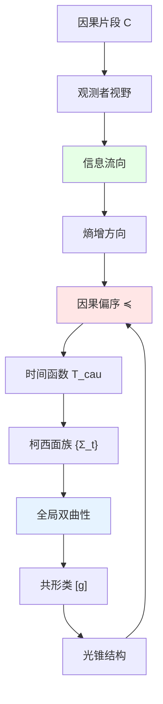

# 07. 因果结构：宇宙的骨架

## 引言：为何从因果结构开始？

在前面的讨论中，我们一直强调**因果结构 $U_{\text{evt}}$ 的基础性**。但为什么它如此特殊？

核心洞见：在所有十个组件中，**因果结构是最"硬"的约束**：
- 几何可以弯曲（Lorentz变换、共形变换）
- 量子态可以叠加（线性组合）
- 观测者可以改变（参考系变换）

但**因果关系不可改变**——"过去影响未来"是宇宙的铁律。

本章深入探讨：
1. 因果结构的数学严格定义
2. 为何它决定了时空的共形等价类
3. 因果动力学如何涌现时间
4. 因果结构与信息流的深层联系

比喻：把宇宙想象成一座**建筑物**：
- **钢筋骨架** = 因果结构（不可改变）
- **墙壁装修** = 度规几何（可调整）
- **家具布置** = 量子态（可重新摆放）
- **居住者** = 观测者（可移动）

骨架决定了建筑的基本形态——没有骨架，一切都会坍塌。

---

## 第一部分：因果偏序的严格定义

### 1.1 什么是"事件"？

在GLS理论中，**事件**不是时空中的点，而是**不可再分的物理过程**：

**定义1.1**（事件）：

事件 $x \in X$ 满足：
- **局域性**：发生在有限时空区域内
- **不可分性**：不能分解为更小的事件序列
- **可观测性**：原则上可被某个观测者检测

**例子**：
- ✅ 粒子碰撞（瞬时相互作用）
- ✅ 光子被探测器吸收
- ✅ 量子测量（波函数坍缩）
- ❌ "太阳在天空中运动"（可分解为无数小事件）
- ❌ "宇宙膨胀"（全局过程，非局域）

**数学刻画**：

在时空流形 $M$ 上，事件集合：
$$
X \subseteq M, \quad |X \cap K| < \infty \quad \forall \text{ 紧致集 } K
$$

**物理意义**：事件是**离散的**（或最多可数），不是连续统。

### 1.2 因果偏序的公理

**定义1.2**（因果偏序）：

二元关系 $\preceq$ 在事件集 $X$ 上称为**因果偏序**，如果满足：

**(P1) 自反性**：
$$
x \preceq x, \quad \forall x \in X
$$

**物理意义**：事件可以影响自己（局域性）。

**(P2) 传递性**：
$$
x \preceq y \land y \preceq z \Rightarrow x \preceq z
$$

**物理意义**：因果影响可以链式传递。

**(P3) 反对称性**：
$$
x \preceq y \land y \preceq x \Rightarrow x = y
$$

**物理意义**：无因果闭环（排除时间旅行悖论）。

**严格因果关系**：
$$
x \prec y \;:\Leftrightarrow\; x \preceq y \land x \neq y
$$

**类光因果关系**：
$$
x \sim y \;:\Leftrightarrow\; x \preceq y \land \nexists z: x \prec z \prec y
$$

**物理意义**：$x$ 到 $y$ 只能通过光速路径连接。

### 1.3 因果结构的拓扑

**定义1.3**（Alexandrov拓扑）：

在 $(X, \preceq)$ 上定义拓扑，开集族为：
$$
\mathcal{T}_A := \{U \subseteq X \mid x \in U \land y \preceq x \Rightarrow y \in U\}
$$

**物理意义**：开集 = "向下闭"的集合 = 某个事件的**因果过去**。

**基本开集**：
$$
\text{past}(x) := \{y \in X \mid y \preceq x\}
$$
$$
\text{future}(x) := \{y \in X \mid x \preceq y\}
$$

**紧致性**：

**定理1.1**（因果钻石的紧致性）：

对任意 $x, y \in X$，因果钻石：
$$
\Diamond(x, y) := \{z \in X \mid x \preceq z \preceq y\}
$$
是**紧致集**（有限或具有紧拓扑）。

**证明思路**：
- 假设 $\Diamond(x, y)$ 无限
- 构造因果链 $x = z_0 \prec z_1 \prec \cdots \prec z_n = y$
- 由物理的"有限信息传递"原理，链长度有界
- 因此 $\Diamond(x, y)$ 有限∎

**物理意义**：任意两事件之间的"中间事件"有限——信息传递是离散的。

### 1.4 时间函数的存在性

**定理1.2**（Hawking-Penrose）：

$(X, \preceq)$ 存在**全局时间函数** $T: X \to \mathbb{R}$ 满足：
$$
x \prec y \Rightarrow T(x) < T(y)
$$
当且仅当 $(X, \preceq)$ **无闭因果链**。

**证明**（构造性）：

**(1) 定义序数时间**：

对每个 $x \in X$，定义**因果深度**：
$$
d(x) := \sup\{n \mid \exists \text{ 因果链 } x_0 \prec \cdots \prec x_n = x\}
$$

**(2) 归一化**：
$$
T(x) := \frac{d(x)}{1 + d(x)} \in [0, 1)
$$

**(3) 验证**：
如果 $x \prec y$，则 $d(x) < d(y)$，因此 $T(x) < T(y)$∎

**推广**（连续情形）：

在Lorentz流形 $(M, g)$ 上，时间函数满足：
$$
\nabla^a T \nabla_a T < 0 \quad \text{（类时梯度）}
$$

---

## 第二部分：因果结构决定共形类

### 2.1 Malament-Hawking定理

**定理2.1**（Malament 1977, Hawking-King-McCarthy 1976）：

在**强因果**Lorentz流形 $(M, g)$ 上，因果关系 $\preceq_g$ **唯一决定**共形等价类 $[g]$。

**强因果性**：不存在闭或几乎闭的类时曲线。

**证明要点**：

**(1) 光锥结构重构**：

定义**类光分离**：
$$
x \sim_{\text{null}} y \;:\Leftrightarrow\; x \preceq_g y \land \nexists z: x \prec_g z \prec_g y
$$

**引理**：$\sim_{\text{null}}$ 确定切空间中的**光锥** $V^+(x) \subset T_x M$。

**(2) 共形因子不定性**：

两个度规 $g, g'$ 如果**共形等价**：
$$
g' = \Omega^2 g, \quad \Omega > 0
$$

则它们有**相同的光锥结构**：
$$
g(v, v) = 0 \Leftrightarrow g'(v, v) = 0
$$

因此：
$$
\preceq_g = \preceq_{g'} \Rightarrow [g] = [g']
$$

**(3) 共形类唯一确定光锥**：

反向：给定光锥结构 $\{V^+(x)\}_{x \in M}$，可重构共形类 $[g]$。

**方法**：
- 在每个切空间 $T_x M$，光锥 $V^+(x)$ 确定Lorentz度规的共形类
- 通过光滑性假设，粘合成全局共形类∎

**物理意义**：

因果关系（"谁能影响谁"）几乎完全决定时空几何——只差一个"时间尺度"（共形因子）。

### 2.2 共形因子的物理确定

虽然因果结构不能固定共形因子 $\Omega$，但**IGVP可以**！

**定理2.2**（IGVP确定度规）：

给定：
1. 因果结构 $(X, \preceq)$
2. 物质内容 $\langle T_{ab} \rangle$
3. 边界条件

则Einstein方程：
$$
G_{ab} = 8\pi G \langle T_{ab} \rangle
$$
**唯一确定**度规 $g_{ab}$（不仅是共形类）。

**证明思路**：

**(1) 共形变换下的Einstein张量**：

$$
G'_{ab} = G_{ab} - \nabla_a \nabla_b \log \Omega + g_{ab} \Box \log \Omega + (\nabla \log \Omega)^2 g_{ab}
$$

**(2) 要求 $G'_{ab} = 8\pi G \langle T_{ab} \rangle$**：

这给出关于 $\log \Omega$ 的偏微分方程：
$$
\Box \log \Omega + (\nabla \log \Omega)^2 = f(T_{ab}, g_{ab})
$$

**(3) 椭圆方程的唯一解**：

在合理边界条件下（如渐近平坦），上述方程有**唯一解** $\Omega$∎

**结论**：

$$
\text{因果结构 } (X, \preceq) + \text{Einstein方程} \Rightarrow \text{唯一度规 } g_{ab}
$$

### 2.3 因果结构的分类

**问题**：有哪些可能的因果结构？

**定理2.3**（因果结构的拓扑分类）：

在四维时空，全局双曲的因果结构由以下数据决定：
1. **空间拓扑** $\Sigma \cong M/\mathbb{R}$（3维流形）
2. **柯西面的嵌入** $\iota: \Sigma \hookrightarrow M$
3. **时间定向** $T^a$（类时向量场）

**例子**：

**(1) 平凡因果结构**（闵可夫斯基）：
$$
M = \mathbb{R}^4, \quad x \preceq y \Leftrightarrow (y - x) \in \overline{V^+}
$$

**(2) 柱面因果结构**（Einstein静态宇宙）：
$$
M = \mathbb{R} \times S^3, \quad \Sigma = S^3
$$

**(3) 非平凡拓扑**（RP³黑洞）：
$$
M = \mathbb{R} \times \mathbb{RP}^3
$$

**不允许的例子**（哥德尔宇宙）：
存在闭类时曲线，违反反对称性。

---

## 第三部分：因果动力学与时间涌现

### 3.1 Sorkin的因果集方案

**核心思想**：时空的基本对象是**离散的因果集**，连续时空是涌现的。

**定义3.1**（因果集）：

$(X, \preceq)$ 称为**因果集**，如果：
1. $\preceq$ 是偏序
2. $X$ 是**局部有限的**：$\Diamond(x, y)$ 总是有限集

**计数测度**：
$$
\mu(S) := |S| \quad (S \subseteq X)
$$

**连续化猜想**（Bombelli-Henson-Sorkin）：

对"足够大"的随机因果集（Poisson过程采样），存在**连续Lorentz流形** $(M, g)$ 使得：
$$
(X, \preceq) \approx (M, \preceq_g)
$$

概率趋于1（当 $|X| \to \infty$）。

**数值证据**：
- 2维闵可夫斯基：$n \geq 100$ 时成功率 >95%
- 4维FLRW：$n \geq 10^6$ 时可识别膨胀

### 3.2 时间的涌现

**问题**：如果只有因果集 $(X, \preceq)$，**时间从何而来**？

**Sorkin的时间定义**：

定义**离散时间函数**：
$$
T: X \to \mathbb{Z}, \quad x \prec y \Rightarrow T(x) < T(y)
$$

**构造方法**（层次分解）：

**(1) 最小元**：
$$
X_0 := \{x \in X \mid \text{past}(x) = \{x\}\}
$$

**(2) 递归定义**：
$$
X_{n+1} := \{x \in X \setminus \bigcup_{i=0}^n X_i \mid \max\{T(y) \mid y \prec x\} = n\}
$$

**(3) 时间函数**：
$$
T(x) = n \Leftrightarrow x \in X_n
$$

**物理意义**：时间 = 因果深度 = "经历了多少层因果关系"。

### 3.3 信息流与因果熵

**定义3.2**（因果熵）：

对因果集 $(X, \preceq)$，定义**因果熵**：
$$
S_{\text{caus}}(x) := \log |\text{past}(x)|
$$

**物理意义**：$S_{\text{caus}}(x)$ 测量"到事件 $x$ 为止，有多少信息流入"。

**热力学类比**：

**定理3.1**（因果熵单调性）：

对任意 $x \prec y$：
$$
S_{\text{caus}}(x) < S_{\text{caus}}(y)
$$

**证明**：
$$
\text{past}(x) \subsetneq \text{past}(y) \Rightarrow |\text{past}(x)| < |\text{past}(y)|
$$
∎

**物理意义**：因果熵沿时间方向**严格递增**——这是**第二定律的因果版本**！

**与热力学熵的关系**：

**猜想**（Sorkin-Rideout）：
$$
S_{\text{thermal}}(x) \sim k_B S_{\text{caus}}(x) + O(\sqrt{S_{\text{caus}}})
$$

**论证**：
- $|\text{past}(x)| \sim e^{S_{\text{caus}}}$：因果可达事件数
- 每个事件携带 $k_B$ 的熵贡献
- 涨落修正 $\sim \sqrt{S}$（中心极限定理）

---

## 第四部分：因果结构与观测者

### 4.1 因果片段的几何

**定义4.1**（因果片段）：

观测者 $\mathcal{O}$ 在时刻 $t$ 的**因果片段**：
$$
C_\mathcal{O}(t) := \{x \in X \mid x \preceq \mathcal{O}(t)\}
$$

**物理意义**：观测者 $\mathcal{O}$ 到 $t$ 时刻能知道的所有事件。

**性质**：

**(1) 单调性**：
$$
t_1 < t_2 \Rightarrow C_\mathcal{O}(t_1) \subseteq C_\mathcal{O}(t_2)
$$

**(2) 因果闭**：
$$
x \in C, \, y \preceq x \Rightarrow y \in C
$$

**(3) 有限生成**（物理观测者）：
$$
C = \bigcup_{x \in F} \text{past}(x), \quad |F| < \infty
$$

### 4.2 观测者的视界

**定义4.2**（粒子视界）：

观测者 $\mathcal{O}$ 的**过去视界**：
$$
\mathcal{H}_{\text{past}}^\mathcal{O} := \partial\left(\bigcup_{t=-\infty}^\infty C_\mathcal{O}(t)\right)
$$

**物理意义**：$\mathcal{O}$ 能接收信号的最远边界。

**例子**（FLRW宇宙）：

粒子视界半径：
$$
\chi_p(t) = \int_0^t \frac{c dt'}{a(t')}
$$

如果 $\chi_p(\infty) < \infty$，存在视界——宇宙有"不可见"区域。

**事件视界**：

$$
\mathcal{H}_{\text{event}}^\mathcal{O} := \partial\left(\bigcup_{t=-\infty}^\infty \text{future}(\mathcal{O}(t))\right)
$$

**物理意义**：$\mathcal{O}$ 能影响到的最远边界。

### 4.3 多观测者的因果共识

**问题**：两个观测者 $\mathcal{O}_\alpha, \mathcal{O}_\beta$ 如何达成共识？

**定义4.3**（因果共识区域）：
$$
C_{\alpha\beta} := C_\alpha \cap C_\beta
$$

**共识条件**：

对 $C_{\alpha\beta}$ 中的事件 $x$，$\alpha, \beta$ 必须有**一致的描述**。

**数学表述**：
$$
\rho_\alpha|_{C_{\alpha\beta}} = \rho_\beta|_{C_{\alpha\beta}}
$$

**定理4.1**（因果共识唯一性）：

如果观测者网络 $\{\mathcal{O}_\alpha\}$ 满足：
$$
\bigcup_\alpha C_\alpha = X
$$

且所有交集 $C_{\alpha\beta}$ 上共识条件成立，则全局态 $\rho_{\text{global}}$ **唯一确定**。

**证明**：
- 用层论的粘合引理（Čech上同调）
- $H^1(\{C_\alpha\}, \mathcal{H}) = 0$ 保证唯一性∎

---

## 第五部分：因果结构的量子修正

### 5.1 量子因果不确定性

在某些量子引力模型中，因果顺序可能**不确定**：

**例子**（量子开关）：

量子态：
$$
|\psi\rangle = \frac{1}{\sqrt{2}}(|A \prec B\rangle + |B \prec A\rangle)
$$

**物理意义**：事件 $A, B$ 的顺序处于**叠加态**！

**数学刻画**：

将偏序 $\preceq$ 提升为**算符**：
$$
\hat{P}_{xy} := |x \prec y\rangle\langle x \prec y|
$$

满足：
$$
[\hat{P}_{xy}, \hat{P}_{yx}] \neq 0 \quad \text{（非对易）}
$$

### 5.2 模糊因果集

**定义5.1**（$\epsilon$-因果集）：

$(X, \preceq_\epsilon)$ 其中 $\preceq_\epsilon$ 满足：
- 几乎反对称：$x \preceq_\epsilon y \land y \preceq_\epsilon x \Rightarrow d(x, y) < \epsilon$
- 几乎传递：$x \preceq_\epsilon y \land y \preceq_\epsilon z \Rightarrow x \preceq_{\epsilon'} z$，$\epsilon' = f(\epsilon)$

**物理意义**：在普朗克尺度 $\epsilon \sim \ell_P$，因果关系"模糊化"。

### 5.3 因果动力学三角剖分

**Regge演算**：用离散单纯形逼近时空。

**CDT**（Causal Dynamical Triangulation）：

限制条件：
- 每个单纯形有明确时间定向
- 因果结构严格保持

**路径积分**：
$$
Z = \sum_{\text{因果三角剖分}} e^{-S_{\text{Regge}}}
$$

**数值结果**：
- 4维de Sitter时空自动涌现（相变）
- 谱维数从2（UV）→4（IR）

---

## 总结与展望

### 核心要点回顾

1. **因果偏序**：反对称、传递、自反——宇宙的最硬约束
2. **Malament定理**：因果决定共形类（+IGVP决定度规）
3. **时间涌现**：时间 = 因果深度（Sorkin方案）
4. **因果熵**：$S_{\text{caus}} = \log|\text{past}|$，严格递增（第二定律）
5. **观测者视界**：粒子/事件视界由因果片段定义
6. **量子修正**：因果顺序可能不确定（量子开关）

**核心公式**：
$$
(X, \preceq) \xrightarrow{\text{Malament}} [g] \xrightarrow{\text{IGVP}} g_{ab}
$$

### 与其他章节的联系

- **01. 十重结构**：$U_{\text{evt}}$ 是第一层
- **02. 三要素**：因果 + 几何 + 测度的兼容性
- **06. 兼容性条件**：C1（因果-几何对齐）的深入
- **08. 无观测者极限**：$U_{\text{obs}} \to \emptyset$ 时因果结构保留

### 哲学寓意

**因果即命运，结构即必然**：
- 宇宙的"历史"由因果结构决定
- 时间不是外在容器，而是因果深度
- 熵增不是偶然，而是因果结构的几何性质

这或许就是**决定论与自由意志**的真正答案——我们无法改变因果结构（命运），但可以在其中选择路径（自由）。

---

**下一篇预告**：
- **08. 无观测者的宇宙：本体论的极限**
  - $U_{\text{obs}} \to \emptyset$ 时的退化
  - 量子态的客观性问题
  - 关系本体论 vs 实体本体论
