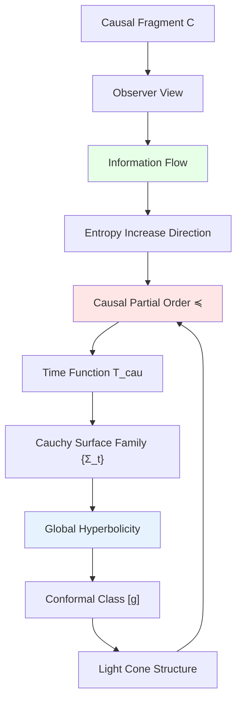

# 07. Causal Structure: Skeleton of Universe

## Introduction: Why Start from Causal Structure?

In previous discussions, we emphasized **fundamentality of causal structure $U_{\text{evt}}$**. But why is it so special?

Core insight: Among all ten components, **causal structure is the "hardest" constraint**:
- Geometry can bend (Lorentz transformations, conformal transformations)
- Quantum states can superpose (linear combinations)
- Observers can change (reference frame transformations)

But **causality cannot change**—"past influences future" is iron law of universe.

This chapter deeply explores:
1. Strict mathematical definition of causal structure
2. Why it determines conformal equivalence class of spacetime
3. How causal dynamics emerge time
4. Deep connection between causal structure and information flow

Analogy: Imagine universe as **building**:
- **Steel skeleton** = Causal structure (cannot change)
- **Wall decoration** = Metric geometry (adjustable)
- **Furniture arrangement** = Quantum state (rearrangeable)
- **Residents** = Observers (movable)

Skeleton determines basic form of building—without skeleton, everything collapses.

---

## Part I: Strict Definition of Causal Partial Order

### 1.1 What is "Event"?

In GLS theory, **event** is not point in spacetime, but **indivisible physical process**:

**Definition 1.1** (Event):

Event $x \in X$ satisfies:
- **Locality**: Occurs in finite spacetime region
- **Indivisibility**: Cannot decompose into smaller event sequence
- **Observability**: In principle detectable by some observer

**Examples**:
- ✅ Particle collision (instantaneous interaction)
- ✅ Photon absorbed by detector
- ✅ Quantum measurement (wave function collapse)
- ❌ "Sun moves in sky" (decomposable into countless small events)
- ❌ "Universe expansion" (global process, non-local)

**Mathematical Characterization**:

On spacetime manifold $M$, event set:
$$
X \subseteq M, \quad |X \cap K| < \infty \quad \forall \text{ compact set } K
$$

**Physical Meaning**: Events are **discrete** (or at most countable), not continuum.

### 1.2 Axioms of Causal Partial Order

**Definition 1.2** (Causal Partial Order):

Binary relation $\preceq$ on event set $X$ is called **causal partial order** if satisfies:

**(P1) Reflexivity**:
$$
x \preceq x, \quad \forall x \in X
$$

**Physical Meaning**: Event can influence itself (locality).

**(P2) Transitivity**:
$$
x \preceq y \land y \preceq z \Rightarrow x \preceq z
$$

**Physical Meaning**: Causal influence can chain transmit.

**(P3) Antisymmetry**:
$$
x \preceq y \land y \preceq x \Rightarrow x = y
$$

**Physical Meaning**: No causal closed loops (excludes time travel paradoxes).

**Strict Causality**:
$$
x \prec y \;:\Leftrightarrow\; x \preceq y \land x \neq y
$$

**Null Causality**:
$$
x \sim y \;:\Leftrightarrow\; x \preceq y \land \nexists z: x \prec z \prec y
$$

**Physical Meaning**: $x$ to $y$ can only connect through light-speed path.

### 1.3 Topology of Causal Structure

**Definition 1.3** (Alexandrov Topology):

On $(X, \preceq)$ define topology, open set family:
$$
\mathcal{T}_A := \{U \subseteq X \mid x \in U \land y \preceq x \Rightarrow y \in U\}
$$

**Physical Meaning**: Open set = "downward closed" set = **causal past** of some event.

**Basic Open Sets**:
$$
\text{past}(x) := \{y \in X \mid y \preceq x\}
$$
$$
\text{future}(x) := \{y \in X \mid x \preceq y\}
$$

**Compactness**:

**Theorem 1.1** (Compactness of Causal Diamond):

For any $x, y \in X$, causal diamond:
$$
\Diamond(x, y) := \{z \in X \mid x \preceq z \preceq y\}
$$
is **compact set** (finite or has compact topology).

**Proof Outline**:
- Assume $\Diamond(x, y)$ infinite
- Construct causal chain $x = z_0 \prec z_1 \prec \cdots \prec z_n = y$
- By physical "finite information transmission" principle, chain length bounded
- Therefore $\Diamond(x, y)$ finite ∎

**Physical Meaning**: "Intermediate events" between any two events finite—information transmission is discrete.

### 1.4 Existence of Time Function

**Theorem 1.2** (Hawking-Penrose):

$(X, \preceq)$ has **global time function** $T: X \to \mathbb{R}$ satisfying:
$$
x \prec y \Rightarrow T(x) < T(y)
$$
if and only if $(X, \preceq)$ **has no closed causal chains**.

**Proof** (Constructive):

**(1) Define Ordinal Time**:

For each $x \in X$, define **causal depth**:
$$
d(x) := \sup\{n \mid \exists \text{ causal chain } x_0 \prec \cdots \prec x_n = x\}
$$

**(2) Normalization**:
$$
T(x) := \frac{d(x)}{1 + d(x)} \in [0, 1)
$$

**(3) Verification**:
If $x \prec y$, then $d(x) < d(y)$, therefore $T(x) < T(y)$ ∎

**Generalization** (Continuous Case):

On Lorentz manifold $(M, g)$, time function satisfies:
$$
\nabla^a T \nabla_a T < 0 \quad \text{(timelike gradient)}
$$

---

## Part II: Causal Structure Determines Conformal Class

### 2.1 Malament-Hawking Theorem

**Theorem 2.1** (Malament 1977, Hawking-King-McCarthy 1976):

On **strongly causal** Lorentz manifold $(M, g)$, causality $\preceq_g$ **uniquely determines** conformal equivalence class $[g]$.

**Strong Causality**: No closed or almost closed timelike curves.

**Proof Outline**:

**(1) Reconstruct Light Cone Structure**:

Define **null separation**:
$$
x \sim_{\text{null}} y \;:\Leftrightarrow\; x \preceq_g y \land \nexists z: x \prec_g z \prec_g y
$$

**Lemma**: $\sim_{\text{null}}$ determines **light cone** $V^+(x) \subset T_x M$ in tangent space.

**(2) Conformal Factor Indeterminacy**:

Two metrics $g, g'$ if **conformally equivalent**:
$$
g' = \Omega^2 g, \quad \Omega > 0
$$

then they have **same light cone structure**:
$$
g(v, v) = 0 \Leftrightarrow g'(v, v) = 0
$$

Therefore:
$$
\preceq_g = \preceq_{g'} \Rightarrow [g] = [g']
$$

**(3) Conformal Class Uniquely Determines Light Cone**:

Reverse: Given light cone structure $\{V^+(x)\}_{x \in M}$, can reconstruct conformal class $[g]$.

**Method**:
- In each tangent space $T_x M$, light cone $V^+(x)$ determines conformal class of Lorentz metric
- Through smoothness assumption, glue into global conformal class ∎

**Physical Meaning**:

Causality ("who can influence whom") almost completely determines spacetime geometry—only missing one "time scale" (conformal factor).

### 2.2 Physical Determination of Conformal Factor

Although causal structure cannot fix conformal factor $\Omega$, **IGVP can**!

**Theorem 2.2** (IGVP Determines Metric):

Given:
1. Causal structure $(X, \preceq)$
2. Matter content $\langle T_{ab} \rangle$
3. Boundary conditions

Then Einstein equation:
$$
G_{ab} = 8\pi G \langle T_{ab} \rangle
$$
**uniquely determines** metric $g_{ab}$ (not just conformal class).

**Proof Outline**:

**(1) Einstein Tensor Under Conformal Transformation**:

$$
G'_{ab} = G_{ab} - \nabla_a \nabla_b \log \Omega + g_{ab} \Box \log \Omega + (\nabla \log \Omega)^2 g_{ab}
$$

**(2) Require $G'_{ab} = 8\pi G \langle T_{ab} \rangle$**:

This gives partial differential equation about $\log \Omega$:
$$
\Box \log \Omega + (\nabla \log \Omega)^2 = f(T_{ab}, g_{ab})
$$

**(3) Unique Solution of Elliptic Equation**:

Under reasonable boundary conditions (e.g., asymptotically flat), above equation has **unique solution** $\Omega$ ∎

**Conclusion**:

$$
\text{Causal structure } (X, \preceq) + \text{Einstein equation} \Rightarrow \text{unique metric } g_{ab}
$$

### 2.3 Classification of Causal Structures

**Question**: What are possible causal structures?

**Theorem 2.3** (Topological Classification of Causal Structures):

In four-dimensional spacetime, globally hyperbolic causal structure determined by:
1. **Spatial Topology** $\Sigma \cong M/\mathbb{R}$ (3-dimensional manifold)
2. **Embedding of Cauchy Surface** $\iota: \Sigma \hookrightarrow M$
3. **Time Orientation** $T^a$ (timelike vector field)

**Examples**:

**(1) Trivial Causal Structure** (Minkowski):
$$
M = \mathbb{R}^4, \quad x \preceq y \Leftrightarrow (y - x) \in \overline{V^+}
$$

**(2) Cylindrical Causal Structure** (Einstein Static Universe):
$$
M = \mathbb{R} \times S^3, \quad \Sigma = S^3
$$

**(3) Non-Trivial Topology** (RP³ Black Hole):
$$
M = \mathbb{R} \times \mathbb{RP}^3
$$

**Disallowed Example** (Gödel Universe):
Has closed timelike curves, violates antisymmetry.

---

## Part III: Causal Dynamics and Time Emergence

### 3.1 Sorkin's Causal Set Program

**Core Idea**: Basic objects of spacetime are **discrete causal sets**, continuous spacetime is emergent.

**Definition 3.1** (Causal Set):

$(X, \preceq)$ called **causal set** if:
1. $\preceq$ is partial order
2. $X$ is **locally finite**: $\Diamond(x, y)$ always finite set

**Counting Measure**:
$$
\mu(S) := |S| \quad (S \subseteq X)
$$

**Continuization Conjecture** (Bombelli-Henson-Sorkin):

For "sufficiently large" random causal sets (Poisson process sampling), exists **continuous Lorentz manifold** $(M, g)$ such that:
$$
(X, \preceq) \approx (M, \preceq_g)
$$

Probability tends to 1 (when $|X| \to \infty$).

**Numerical Evidence**:
- 2D Minkowski: Success rate >95% when $n \geq 100$
- 4D FLRW: Can identify expansion when $n \geq 10^6$

### 3.2 Emergence of Time

**Question**: If only causal set $(X, \preceq)$, **where does time come from**?

**Sorkin's Time Definition**:

Define **discrete time function**:
$$
T: X \to \mathbb{Z}, \quad x \prec y \Rightarrow T(x) < T(y)
$$

**Construction Method** (Hierarchical Decomposition):

**(1) Minimal Elements**:
$$
X_0 := \{x \in X \mid \text{past}(x) = \{x\}\}
$$

**(2) Recursive Definition**:
$$
X_{n+1} := \{x \in X \setminus \bigcup_{i=0}^n X_i \mid \max\{T(y) \mid y \prec x\} = n\}
$$

**(3) Time Function**:
$$
T(x) = n \Leftrightarrow x \in X_n
$$

**Physical Meaning**: Time = Causal depth = "how many layers of causality experienced".

### 3.3 Information Flow and Causal Entropy

**Definition 3.2** (Causal Entropy):

For causal set $(X, \preceq)$, define **causal entropy**:
$$
S_{\text{caus}}(x) := \log |\text{past}(x)|
$$

**Physical Meaning**: $S_{\text{caus}}(x)$ measures "how much information has flowed to event $x$ so far".

**Thermodynamic Analogy**:

**Theorem 3.1** (Monotonicity of Causal Entropy):

For any $x \prec y$:
$$
S_{\text{caus}}(x) < S_{\text{caus}}(y)
$$

**Proof**:
$$
\text{past}(x) \subsetneq \text{past}(y) \Rightarrow |\text{past}(x)| < |\text{past}(y)|
$$
∎

**Physical Meaning**: Causal entropy **strictly increases** along time direction—this is **causal version of second law**!

**Relation to Thermodynamic Entropy**:

**Conjecture** (Sorkin-Rideout):
$$
S_{\text{thermal}}(x) \sim k_B S_{\text{caus}}(x) + O(\sqrt{S_{\text{caus}}})
$$

**Argument**:
- $|\text{past}(x)| \sim e^{S_{\text{caus}}}$: Number of causally reachable events
- Each event carries $k_B$ entropy contribution
- Fluctuation correction $\sim \sqrt{S}$ (central limit theorem)

---

## Part IV: Causal Structure and Observers

### 4.1 Geometry of Causal Fragments

**Definition 4.1** (Causal Fragment):

Observer $\mathcal{O}$ at time $t$'s **causal fragment**:
$$
C_\mathcal{O}(t) := \{x \in X \mid x \preceq \mathcal{O}(t)\}
$$

**Physical Meaning**: All events observer $\mathcal{O}$ can know up to time $t$.

**Properties**:

**(1) Monotonicity**:
$$
t_1 < t_2 \Rightarrow C_\mathcal{O}(t_1) \subseteq C_\mathcal{O}(t_2)
$$

**(2) Causal Closure**:
$$
x \in C, \, y \preceq x \Rightarrow y \in C
$$

**(3) Finitely Generated** (Physical Observers):
$$
C = \bigcup_{x \in F} \text{past}(x), \quad |F| < \infty
$$

### 4.2 Observer Horizons

**Definition 4.2** (Particle Horizon):

Observer $\mathcal{O}$'s **past horizon**:
$$
\mathcal{H}_{\text{past}}^\mathcal{O} := \partial\left(\bigcup_{t=-\infty}^\infty C_\mathcal{O}(t)\right)
$$

**Physical Meaning**: Farthest boundary $\mathcal{O}$ can receive signals.

**Example** (FLRW Universe):

Particle horizon radius:
$$
\chi_p(t) = \int_0^t \frac{c dt'}{a(t')}
$$

If $\chi_p(\infty) < \infty$, horizon exists—universe has "invisible" region.

**Event Horizon**:

$$
\mathcal{H}_{\text{event}}^\mathcal{O} := \partial\left(\bigcup_{t=-\infty}^\infty \text{future}(\mathcal{O}(t))\right)
$$

**Physical Meaning**: Farthest boundary $\mathcal{O}$ can influence.

### 4.3 Causal Consensus of Multiple Observers

**Question**: How do two observers $\mathcal{O}_\alpha, \mathcal{O}_\beta$ reach consensus?

**Definition 4.3** (Causal Consensus Region):
$$
C_{\alpha\beta} := C_\alpha \cap C_\beta
$$

**Consensus Condition**:

For events $x$ in $C_{\alpha\beta}$, $\alpha, \beta$ must have **consistent description**.

**Mathematical Formulation**:
$$
\rho_\alpha|_{C_{\alpha\beta}} = \rho_\beta|_{C_{\alpha\beta}}
$$

**Theorem 4.1** (Uniqueness of Causal Consensus):

If observer network $\{\mathcal{O}_\alpha\}$ satisfies:
$$
\bigcup_\alpha C_\alpha = X
$$

and consensus condition holds on all intersections $C_{\alpha\beta}$, then global state $\rho_{\text{global}}$ **uniquely determined**.

**Proof**:
- Use sheaf theory gluing lemma (Čech cohomology)
- $H^1(\{C_\alpha\}, \mathcal{H}) = 0$ guarantees uniqueness ∎

---

## Part V: Quantum Corrections to Causal Structure

### 5.1 Quantum Causal Indefiniteness

In some quantum gravity models, causal order may be **indefinite**:

**Example** (Quantum Switch):

Quantum state:
$$
|\psi\rangle = \frac{1}{\sqrt{2}}(|A \prec B\rangle + |B \prec A\rangle)
$$

**Physical Meaning**: Order of events $A, B$ in **superposition**!

**Mathematical Characterization**:

Lift partial order $\preceq$ to **operator**:
$$
\hat{P}_{xy} := |x \prec y\rangle\langle x \prec y|
$$

Satisfying:
$$
[\hat{P}_{xy}, \hat{P}_{yx}] \neq 0 \quad \text{(non-commutative)}
$$

### 5.2 Fuzzy Causal Sets

**Definition 5.1** ($\epsilon$-Causal Set):

$(X, \preceq_\epsilon)$ where $\preceq_\epsilon$ satisfies:
- Almost antisymmetric: $x \preceq_\epsilon y \land y \preceq_\epsilon x \Rightarrow d(x, y) < \epsilon$
- Almost transitive: $x \preceq_\epsilon y \land y \preceq_\epsilon z \Rightarrow x \preceq_{\epsilon'} z$, $\epsilon' = f(\epsilon)$

**Physical Meaning**: At Planck scale $\epsilon \sim \ell_P$, causality "fuzzified".

### 5.3 Causal Dynamical Triangulation

**Regge Calculus**: Approximate spacetime with discrete simplices.

**CDT** (Causal Dynamical Triangulation):

Constraints:
- Each simplex has definite time orientation
- Causal structure strictly preserved

**Path Integral**:
$$
Z = \sum_{\text{causal triangulations}} e^{-S_{\text{Regge}}}
$$

**Numerical Results**:
- 4D de Sitter spacetime automatically emerges (phase transition)
- Spectral dimension from 2 (UV) → 4 (IR)

---

## Summary and Outlook

### Core Points Review

1. **Causal Partial Order**: Antisymmetric, transitive, reflexive—hardest constraint of universe
2. **Malament Theorem**: Causality determines conformal class (+IGVP determines metric)
3. **Time Emergence**: Time = Causal depth (Sorkin program)
4. **Causal Entropy**: $S_{\text{caus}} = \log|\text{past}|$, strictly increasing (second law)
5. **Observer Horizons**: Particle/event horizons defined by causal fragments
6. **Quantum Corrections**: Causal order may be indefinite (quantum switch)

**Core Formula**:
$$
(X, \preceq) \xrightarrow{\text{Malament}} [g] \xrightarrow{\text{IGVP}} g_{ab}
$$

### Connections with Other Chapters

- **01. Ten-Fold Structure**: $U_{\text{evt}}$ is first layer
- **02. Three Elements**: Compatibility of causality + geometry + measure
- **06. Compatibility Conditions**: Deep dive into C1 (causal-geometric alignment)
- **08. Observer-Free Limit**: Causal structure preserved when $U_{\text{obs}} \to \emptyset$

### Philosophical Implication

**Causality is fate, structure is necessity**:
- "History" of universe determined by causal structure
- Time is not external container, but causal depth
- Entropy increase not accidental, but geometric property of causal structure

This may be true answer to **determinism vs free will**—we cannot change causal structure (fate), but can choose paths within it (freedom).

---

**Next Article Preview**:
- **08. Universe Without Observers: Ontological Limit Case**
  - Degeneration when $U_{\text{obs}} \to \emptyset$
  - Question of objectivity of quantum states
  - Relational ontology vs substance ontology

